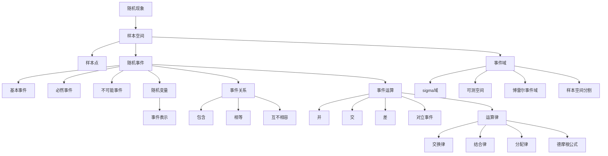

# 1.1 随机事件及其运算

> [!abstract] 本节概览
> 本节是概率论的起点，从==随机现象==出发，建立==样本空间==、==随机事件==、==随机变量==等基本概念，定义事件间的三种关系（包含、相等、互不相容）和四种运算（并、交、差、对立），最后引入==事件域==（$\sigma$ 域）为概率的公理化定义做准备。
>
> **逻辑链条**：随机现象 → 样本空间 → 随机事件 → 随机变量 → 事件关系 → 事件运算 → 事件域
>
> **前置依赖**：无（本节是全书起点，仅需集合论基本知识）
>
> **核心主线**：将随机现象的直观描述转化为严格的集合论语言，并通过事件域的公理化结构为后续概率定义奠定基础。

---

## 一、随机现象与样本空间

### 随机现象

> [!def] 随机现象
> 在一定的条件下，并不总是出现相同结果的现象称为==随机现象==。随机现象有两个特点：
> 1. 结果不止一个；
> 2. 哪一个结果出现，人们事先并不知道。

与之相对，只有一个结果的现象称为==确定性现象==，如"太阳从东方升起"、"水往低处流"。

> [!example] 例 1.1.1
> 以下均为随机现象：
> 1. 抛一枚硬币，可能正面朝上也可能反面朝上
> 2. 掷一颗骰子，出现的点数
> 3. 一天内进入某商场的顾客数
> 4. 某种型号电视机的寿命
> 5. 测量某物理量（长度、直径等）的误差

对在相同条件下可以重复的随机现象的观察、记录、实验称为==随机试验==。概率论与数理统计主要研究能大量重复的随机现象。

### 样本空间

> [!def] 样本空间
> 随机现象的一切可能基本结果组成的集合称为==样本空间==，记为 $\Omega = \{\omega\}$，其中 $\omega$ 表示==样本点==（基本结果）。样本点是今后抽样的最基本单元。

> [!example] 例 1.1.2
> | 随机现象 | 样本空间 | 类型 |
> |---------|---------|------|
> | 抛一枚硬币 | $\Omega_1 = \{\omega_1, \omega_2\}$（$\omega_1$=正面，$\omega_2$=反面） | 离散、有限 |
> | 掷一颗骰子 | $\Omega_2 = \{1, 2, 3, 4, 5, 6\}$ | 离散、有限 |
> | 每天进入商场的顾客数 | $\Omega_3 = \{0, 1, 2, \cdots\}$ | 离散、可列 |
> | 电视机寿命 | $\Omega_4 = \{t : t \geq 0\}$ | 连续 |
> | 测量误差 | $\Omega_5 = \{x : -\infty < x < +\infty\}$，其中 $x = y - \mu$ | 连续 |

> [!warning] 三点注意
> 1. 样本空间中的元素可以是数也可以不是数
> 2. 随机现象的样本空间至少有两个样本点；含一个样本点的为确定性现象
> 3. ==离散样本空间==：有限或可列无限个样本点；==连续样本空间==：不可列无限个样本点

---

## 二、随机事件与随机变量

### 随机事件

> [!def] 随机事件
> 随机现象的某些样本点组成的集合称为==随机事件==，简称==事件==，常用大写字母 $A, B, C, \cdots$ 表示。

**三个层次的事件**：
- ==基本事件==：由单个样本点组成的子集
- ==必然事件==：样本空间 $\Omega$ 本身（$\Omega$ 的最大子集）
- ==不可能事件==：空集 $\varnothing$（$\Omega$ 的最小子集）

> [!example] 例 1.1.3
> 掷一颗骰子，$\Omega = \{1, 2, \cdots, 6\}$：
> - $A = $ "出现1点" $= \{1\}$，基本事件
> - $B = $ "出现偶数点" $= \{2, 4, 6\}$
> - $C = $ "出现的点数小于7" $= \{1, 2, 3, 4, 5, 6\} = \Omega$，必然事件
> - $D = $ "出现的点数大于6" $= \varnothing$，不可能事件

**事件发生**的含义：事件 $A$ 发生 ⟺ $A$ 中某个样本点出现。任一事件 $A$ 是相应样本空间的一个子集，可用维恩图表示（矩形表示 $\Omega$，圆表示事件 $A$）。

### 随机变量

> [!def] 随机变量
> 用来表示随机现象结果的变量称为==随机变量==，常用大写字母 $X, Y, Z$ 表示。随机变量的含义是人们按需要设置出来的。

> [!example] 例 1.1.4
> 掷一颗骰子，设 $X = $ "出现的点数"，则：
> - "$X = 3$" 表示事件"出现3点"
> - "$X > 3$" 表示事件"出现点数超过3"
> - "$X \leq 6$" 是必然事件 $\Omega$
> - "$X = 7$" 是不可能事件 $\varnothing$
>
> 若设 $Y = $ "6点出现的次数"，则 $Y$ 仅取 $0$ 或 $1$，是与 $X$ 不同的随机变量。在同一个随机现象中，不同的设置可获得不同的随机变量。

> [!example] 例 1.1.5
> 检查一件产品，结果为合格品或不合格品。设 $X = $ "不合格品数"，则 $X$ 仅取 $0$ 与 $1$：
> - "$X = 0$" 表示"合格品"
> - "$X = 1$" 表示"不合格品"
>
> 若检查 10 件产品，不合格品数 $Y$ 取 $0, 1, 2, \cdots, 10$ 共 11 个值。

> [!tip] 关键要点
> 随机变量是人们根据需要设置的，用等号或不等号与实数联结起来就可以表示很多事件。这种表示方法形式简洁、含义明确、使用方便。今后遇到的大量事件都将用随机变量表示。

---

## 三、事件间的关系与运算

### 事件间的关系

以下讨论总是在同一个样本空间 $\Omega$ 中进行。

#### 包含关系

> [!def] 事件的包含
> 如果属于 $A$ 的样本点必属于 $B$，则称 $A$ 被包含在 $B$ 中，记为 $A \subset B$（或 $B \supset A$）。用概率论的语言说：==事件 $A$ 发生必然导致事件 $B$ 发生==。

> [!example]
> - 掷骰子：$A = $ "出现4点"，$B = $ "出现偶数点"，则 $A \subset B$
> - 电视机寿命：$A = \{T > 10000\}$，$B = \{T > 20000\}$，则 $A \supset B$
>
> 对任一事件 $A$，必有 $\varnothing \subset A \subset \Omega$。

#### 相等关系

> [!def] 事件的相等
> 如果 $A \subset B$ 且 $B \subset A$，则称事件 $A$ 与 $B$ 相等，记为 $A = B$。

> [!example] 例 1.1.6
> 掷两颗骰子，$A = $ "两颗骰子的点数之和为奇数"，$B = $ "两颗骰子的点数为一奇一偶"。可以证明 $A = B$。

> [!example] 例 1.1.7
> 口袋中有 $a$ 个黑球、$b$ 个白球，不返回地逐个摸球。$A = $ "最后摸出的几个球全是黑球"，$B = $ "最后摸出的一个球是黑球"。虽然粗看 $A \neq B$，但可以证明 $A = B$（$A \subset B$ 且 $B \subset A$）。

#### 互不相容

> [!def] 互不相容
> 如果 $A$ 与 $B$ 没有公共的样本点，即 $AB = \varnothing$，则称 $A$ 与 $B$==互不相容==（或互斥）。

### 事件间的运算

#### 并

> [!def] 事件的并
> 由事件 $A$ 与 $B$ 中所有的样本点（相同的只计入一次）组成的新事件称为 $A$ 与 $B$ 的==并==，记为 $A \cup B$。概率论含义：==事件 $A$ 与 $B$ 中至少有一个发生==。

推广到有限个和可列个事件：
$$\bigcup_{i=1}^{n} A_i, \qquad \bigcup_{i=1}^{\infty} A_i$$

#### 交

> [!def] 事件的交
> 由事件 $A$ 与 $B$ 中公共的样本点组成的新事件称为 $A$ 与 $B$ 的==交==，记为 $A \cap B$ 或 $AB$。概率论含义：==事件 $A$ 与 $B$ 同时发生==。

推广到有限个和可列个事件：
$$\bigcap_{i=1}^{n} A_i, \qquad \bigcap_{i=1}^{\infty} A_i$$

> [!tip] 特殊情况
> 若 $A$ 与 $B$ 互不相容，则 $AB = \varnothing$（反之亦然）。

#### 差

> [!def] 事件的差
> 由在事件 $A$ 中而不在 $B$ 中的样本点组成的新事件称为 $A$ 对 $B$ 的==差==，记为 $A - B$。概率论含义：==事件 $A$ 发生而 $B$ 不发生==。

#### 对立事件

> [!def] 对立事件
> 事件 $A$ 的==对立事件==（余事件）记为 $\bar{A}$，由 $\Omega$ 中不属于 $A$ 的所有样本点组成：
> $$\bar{A} = \Omega - A$$

**基本性质**：
- $\bar{\bar{A}} = A$（双重否定）
- $\bar{\Omega} = \varnothing$，$\bar{\varnothing} = \Omega$

**充要条件**：$A$ 与 $B$ 互为对立事件 ⟺ $AB = \varnothing$ 且 $A \cup B = \Omega$

> [!warning] 注意
> 对立事件一定互不相容，但互不相容的事件不一定是对立事件。

> [!example] 例 1.1.9
> 设 $A, B, C$ 为三个事件，则：
> | 事件描述 | 集合表示 |
> |---------|---------|
> | $A, B$ 发生，$C$ 不发生 | $AB\bar{C} = AB - C$ |
> | $A, B, C$ 至少有一个发生 | $A \cup B \cup C$ |
> | $A, B, C$ 至少有两个发生 | $AB \cup AC \cup BC$ |
> | $A, B, C$ 恰好有两个发生 | $AB\bar{C} \cup A\bar{B}C \cup \bar{A}BC$ |
> | $A, B, C$ 同时发生 | $ABC$ |
> | $A, B, C$ 都不发生 | $\bar{A}\bar{B}\bar{C}$ |
> | $A, B, C$ 不全发生 | $\bar{A} \cup \bar{B} \cup \bar{C}$ |

### 事件的运算性质

#### 交换律

$$A \cup B = B \cup A, \quad AB = BA \tag{1.1.1}$$

#### 结合律

$$(A \cup B) \cup C = A \cup (B \cup C) \tag{1.1.2}$$
$$(AB)C = A(BC) \tag{1.1.3}$$

#### 分配律

$$(A \cup B) \cap C = AC \cup BC \tag{1.1.4}$$
$$(A \cap B) \cup C = (A \cup C) \cap (B \cup C) \tag{1.1.5}$$

#### 对偶律（德摩根公式）

> [!thm] 德摩根公式（De Morgan's Laws）
> 事件并的对立等于对立的交：
> $$\overline{A \cup B} = \bar{A} \cap \bar{B} \tag{1.1.6}$$
>
> 事件交的对立等于对立的并：
> $$\overline{A \cap B} = \bar{A} \cup \bar{B} \tag{1.1.7}$$

> [!abstract] 证明思路
> **证明 (1.1.6)**：
>
> **[方向一：$\overline{A \cup B} \subset \bar{A} \cap \bar{B}$]**
>
> 设 $\omega \in \overline{A \cup B}$，即 $\omega \notin A \cup B$。这表明 $\omega$ 既不属于 $A$，也不属于 $B$，即 $\omega \notin A$ 和 $\omega \notin B$ 同时成立。所以 $\omega \in \bar{A}$ 与 $\omega \in \bar{B}$ 同时成立，于是 $\omega \in \bar{A} \cap \bar{B}$。
>
> **[方向二：$\overline{A \cup B} \supset \bar{A} \cap \bar{B}$]**
>
> 设 $\omega \in \bar{A} \cap \bar{B}$，即同时有 $\omega \in \bar{A}$ 和 $\omega \in \bar{B}$，从而同时有 $\omega \notin A$ 和 $\omega \notin B$。这意味着 $\omega$ 不属于 $A$ 与 $B$ 中的任一个，即 $\omega \notin A \cup B$，也就是 $\omega \in \overline{A \cup B}$。
>
> 综合两个方向，得 $\overline{A \cup B} = \bar{A} \cap \bar{B}$。$\blacksquare$

**推广到可列个事件**：

$$\overline{\bigcup_{i=1}^{n} A_i} = \bigcap_{i=1}^{n} \bar{A}_i, \quad \overline{\bigcup_{i=1}^{\infty} A_i} = \bigcap_{i=1}^{\infty} \bar{A}_i \tag{1.1.8}$$

$$\overline{\bigcap_{i=1}^{n} A_i} = \bigcup_{i=1}^{n} \bar{A}_i, \quad \overline{\bigcap_{i=1}^{\infty} A_i} = \bigcup_{i=1}^{\infty} \bar{A}_i \tag{1.1.9}$$

---

## 四、事件域

### 为什么需要事件域

在连续样本空间中，可以人为构造出"不可测集"——无法为其分配概率的子集。为了避免这种情况，我们没有必要将连续样本空间的所有子集都看成事件，只需将可"度量"的子集（可测集）看成事件即可。

==事件域== $\mathcal{F}$ 就是样本空间中某些子集及其运算结果组成的集合类，它决定了哪些子集可以被当作"事件"来讨论概率。

> [!tip] 化简思路
> - 交的运算可通过并与对立来实现（德摩根公式）
> - 差的运算可通过对立与交来实现（$A - B = A\bar{B}$）
>
> 因此，**并与对立是最基本的运算**，事件域只需对这两种运算封闭。

### 事件域的严格定义

> [!def] 定义 1.1.1 — 事件域（$\sigma$ 域/$\sigma$ 代数）
> 设 $\Omega$ 为一样本空间，$\mathcal{F}$ 为 $\Omega$ 的某些子集所组成的集合类。如果 $\mathcal{F}$ 满足：
> 1. $\Omega \in \mathcal{F}$；
> 2. 若 $A \in \mathcal{F}$，则 $\bar{A} \in \mathcal{F}$（对对立运算封闭）；
> 3. 若 $A_n \in \mathcal{F},\; n = 1, 2, \cdots$，则 $\displaystyle\bigcup_{n=1}^{\infty} A_n \in \mathcal{F}$（对可列并运算封闭）。
>
> 则称 $\mathcal{F}$ 为一个==事件域==，又称为==$\sigma$ 域==或==$\sigma$ 代数==。$(\Omega, \mathcal{F})$ 称为==可测空间==。

> [!example] 例 1.1.10 — 常见的事件域
> **(1)** $\Omega = \{\omega_1, \omega_2\}$：$\mathcal{F} = \{\varnothing, A, \bar{A}, \Omega\}$，共 $2^2 = 4$ 个事件
>
> **(2)** $\Omega = \{\omega_1, \omega_2, \cdots, \omega_n\}$（$n$ 个样本点）：$\mathcal{F}$ 中共有
> $$\binom{n}{0} + \binom{n}{1} + \binom{n}{2} + \cdots + \binom{n}{n} = 2^n \text{ 个事件}$$
>
> **(3)** $\Omega = \{\omega_1, \omega_2, \cdots\}$（可列个样本点）：$\mathcal{F}$ 由可列个的可列个元素组成
>
> **(4)** $\Omega = (-\infty, +\infty) = \mathbb{R}$：取基本集合类 $\mathcal{S} = \{(-\infty, x) \mid -\infty < x < +\infty\}$（全体半直线），由此可构造出所有常见的区间类型：
> - $[a, b) = (-\infty, b) - (-\infty, a)$
> - $[a, b] = \bigcap_{n=1}^{\infty}\left[a, b + \frac{1}{n}\right)$
> - $\{b\} = [a, b] - [a, b)$
> - $(a, b] = [a, b] - \{a\}$
> - $(a, b) = [a, b) - \{a\}$
>
> 这样生成的事件域称为==博雷尔（Borel）事件域==，记为 $\mathscr{B}$。

### 样本空间的分割

> [!def] 定义 1.1.2 — 样本空间的分割
> 设 $D_1, D_2, \cdots, D_n$ 是 $n$ 个事件，如果诸 $D_i$ 互不相容，且 $\bigcup_{i=1}^{n} D_i = \Omega$，则称 $D_1, D_2, \cdots, D_n$ 为样本空间 $\Omega$ 的一个==分割==。

> [!example]
> 电视机色度浓度，目标值为 $m$，容许常数为 $a$：
> - 一等品：$D_1 = \{|x - m| \leq a\}$
> - 二等品：$D_2 = \{a < |x - m| \leq 2a\}$
> - 三等品：$D_3 = \{2a < |x - m| \leq 3a\}$
> - 不合格品：$D_4 = \{|x - m| > 3a\}$
>
> $\mathcal{D} = \{D_1, D_2, D_3, D_4\}$ 构成 $\Omega$ 的一个分割，生成的事件域 $\sigma(\mathscr{D})$ 包含 $2^4 = 16$ 个事件。

---

## 五、知识结构总览

---

## 六、核心思想与证明技巧

> [!success] 核心思想
> 1. ==集合论语言是概率论的基石==：所有概率论概念都可以用集合论语言精确描述，事件就是样本空间的子集
> 2. ==随机变量是事件的桥梁==：通过合理设置随机变量，可以用简洁的数学表达式（等号、不等号）表示各种事件
> 3. ==事件域是概率定义的前提==：$\sigma$ 域通过对立和可列并的封闭性，确保了概率运算的合法性
> 4. ==从离散到连续的自然过渡==：有限样本空间的事件域是所有子集（$2^n$ 个），连续样本空间需要通过 $\sigma$ 域来排除不可测集

> [!tip] 证明技巧清单
> 1. **证明事件相等**：转化为证明集合互相包含（$A \subset B$ 且 $B \subset A$），如例 1.1.7
> 2. **利用德摩根公式化简**：将复杂事件的对立转化为简单事件的对立的交/并
> 3. **维恩图辅助直观**：用维恩图帮助理解事件关系和运算，但不可代替严格证明
> 4. **差化对立与交**：$A - B = A\bar{B}$，将差运算转化为更基本的运算
> 5. **分割思想**：将样本空间分割为互不相容的事件，是全概率公式的基础（后续 §1.4）

---

## 七、补充理解与易混淆点

### 事件与样本点的区别

**来源**：UCLA MATH 170E Lecture Notes、Cornell Probability Theory Notes

> [!danger] 误区1："事件就是试验的结果"
> ❌ 错误解释：将事件等同于某个具体的试验结果（样本点）
> ✅ 正确解释：事件是样本空间的==子集==，可以包含一个或多个样本点。单个样本点构成的事件称为"基本事件"，但事件可以是任意子集。例如掷骰子，"出现偶数点"$= \{2, 4, 6\}$ 是一个包含三个样本点的事件。

### 互不相容与对立的混淆

**来源**：University of Auckland ICOTS论文、CSDN概率论重点解析

> [!danger] 误区2："互不相容的事件就是对立事件"
> ❌ 错误解释：认为只要两个事件不能同时发生，它们就是对立事件
> ✅ 正确解释：互不相容只要求 $A \cap B = \varnothing$，但对立（互补）还要求 $A \cup B = \Omega$。==对立事件一定互不相容，但互不相容的事件不一定对立==。例如掷骰子，"出现1点"和"出现2点"互不相容，但不对立（因为还有3、4、5、6的可能）。

### 独立性与互不相容的混淆（预告）

**来源**：豆丁网"随机事件独立性的三个认识误区"、网易数学专栏

> [!danger] 误区3："互不相容的事件就是独立事件"
> ❌ 错误解释：认为"没有关系"就是"互不相容"
> ✅ 正确解释：这是两个完全不同的概念！互不相容是集合关系（$AB = \varnothing$），独立性是概率关系（$P(AB) = P(A)P(B)$）。事实上，当 $P(A) > 0$ 且 $P(B) > 0$ 时，互不相容的事件==不可能==独立（因为 $P(AB) = 0 \neq P(A)P(B) > 0$）。独立性将在 §1.5 详细讨论。

### 样本空间构造的常见错误

**来源**：Minnesota STEM Framework、教材例 1.1.2

> [!danger] 误区4："样本空间只要列出可能的结果就行，不需要考虑等可能性"
> ❌ 错误解释：随意列出结果，不考虑结果是否在同一"层次"
> ✅ 正确解释：构造样本空间时，每个样本点必须是==最基本的、不可再分的结果==。例如同时抛两枚硬币，样本空间是 $\{(\text{正},\text{正}), (\text{正},\text{反}), (\text{反},\text{正}), (\text{反},\text{反})\}$（4个等可能的基本结果），而不是 $\{0, 1, 2\}$（正面个数），因为后者不是最基本的结果。此外，两枚硬币是有区别的，$(\text{正},\text{反})$ 和 $(\text{反},\text{正})$ 是不同的基本事件。

### 事件域的必要性

**来源**：UH Chapter 1 Probability Theory、教材 §1.1.7

> [!danger] 误区5："样本空间的所有子集都可以作为事件"
> ❌ 错误解释：认为任何子集都可以讨论概率
> ✅ 正确解释：对于有限或可列样本空间，确实所有子集都可以作为事件。但对于连续样本空间（如实数轴），存在==不可测集==——无法为其合理分配概率的子集。事件域（$\sigma$ 域）的作用就是排除这些不可测集，只保留可以讨论概率的子集。这就是为什么我们需要引入 $\sigma$ 域的公理化定义。

---

## 八、习题精选

> [!todo] 本节习题
> | 习题号 | 标题 | 核心考点 | 难度 | 来源 |
> |--------|------|----------|------|------|
> | 1 | 写出样本空间 | 样本空间构造 | ⭐ | 教材习题1.1 |
> | 3 | 事件的集合表示 | 事件运算 | ⭐⭐ | 教材习题1.1 |
> | 5 | 随机变量的事件表示 | 对立事件与运算 | ⭐⭐ | 教材习题1.1 |
> | 7 | 事件运算命题判断 | 运算律与反例 | ⭐⭐⭐ | 教材习题1.1 |
> | 9 | 对立事件的描述 | 对立事件概念 | ⭐ | 教材习题1.1 |
> | 10 | 事件运算公式证明 | 分配律与差化简 | ⭐⭐ | 教材习题1.1 |
> | 11 | 事件域的性质证明 | $\sigma$ 域公理 | ⭐⭐⭐ | 教材习题1.1 |
> | 五三1 | 零概率事件辨析 | 概率为0≠不可能事件 | ⭐ | 2013南开大学432 |
> | 五三2 | 事件并集的实际含义 | 事件运算翻译 | ⭐ | 2015武汉大学432 |
> | 五三3 | 事件域元素个数 | $\sigma$ 域构造 | ⭐⭐ | 2016中山大学432 |
> | 五三4 | 概率为0/1事件辨析 | 概率性质与证明 | ⭐⭐ | 2016北京师范大学432 |
> | 五三5 | 样本空间与事件运算综合 | 综合计算 | ⭐⭐ | 2015上海财经大学808 |

### 习题1：写出下列随机试验的样本空间

> [!problem] 习题1
> 写出下列随机试验的样本空间：
> (1) 抛三枚硬币；
> (2) 抛三颗骰子；
> (3) 连续抛一枚硬币，直至出现正面为止；
> (4) 口袋中有黑、白、红球各一个，先从中任取出一个，放回后再任取出一个；
> (5) 口袋中有黑、白、红球各一个，先从中任取出一个，不放回后再任取出一个。

> [!faq]- 查看解答
> (1) $\Omega = \{(\text{正},\text{正},\text{正}),\;(\text{正},\text{正},\text{反}),\;(\text{正},\text{反},\text{正}),\;(\text{反},\text{正},\text{正}),\;(\text{正},\text{反},\text{反}),\;(\text{反},\text{正},\text{反}),\;(\text{反},\text{反},\text{正}),\;(\text{反},\text{反},\text{反})\}$
>
> 共 $2^3 = 8$ 个基本事件。
>
> (2) $\Omega = \{(i, j, k) \mid i, j, k \in \{1, 2, 3, 4, 5, 6\}\}$
>
> 共 $6^3 = 216$ 个基本事件。
>
> (3) $\Omega = \{(\text{正}),\;(\text{反},\text{正}),\;(\text{反},\text{反},\text{正}),\;(\text{反},\text{反},\text{反},\text{正}),\;\cdots\} = \{(\underbrace{\text{反},\cdots,\text{反}}_{n-1},\text{正}) \mid n = 1, 2, 3, \cdots\}$
>
> 可列无限个基本事件。
>
> (4) $\Omega = \{(\text{黑},\text{黑}),\;(\text{黑},\text{白}),\;(\text{黑},\text{红}),\;(\text{白},\text{黑}),\;(\text{白},\text{白}),\;(\text{白},\text{红}),\;(\text{红},\text{黑}),\;(\text{红},\text{白}),\;(\text{红},\text{红})\}$
>
> 共 $3^2 = 9$ 个基本事件（有放回）。
>
> (5) $\Omega = \{(\text{黑},\text{白}),\;(\text{黑},\text{红}),\;(\text{白},\text{黑}),\;(\text{白},\text{红}),\;(\text{红},\text{黑}),\;(\text{红},\text{白})\}$
>
> 共 $3 \times 2 = 6$ 个基本事件（不放回，不含同色）。
>
> $\blacksquare$

### 习题3：用集合表示事件

> [!problem] 习题3
> 设 $A, B, C$ 为三事件，试表示下列事件：
> (1) $A, B, C$ 都发生或都不发生；
> (2) $A, B, C$ 中不多于一个发生；
> (3) $A, B, C$ 中不多于两个发生；
> (4) $A, B, C$ 中至少有两个发生。

> [!faq]- 查看解答
> (1) "$A, B, C$ 都发生或都不发生"$= ABC \cup \bar{A}\bar{B}\bar{C}$
>
> (2) "$A, B, C$ 中不多于一个发生"$= \bar{A}\bar{B}\bar{C} \cup A\bar{B}\bar{C} \cup \bar{A}B\bar{C} \cup \bar{A}\bar{B}C$
>
> (3) "$A, B, C$ 中不多于两个发生"$= \overline{ABC}$（即"不全发生"的对立——恰好是"三个都发生"的对立）
>
> 也可以等价地写为：$\bar{A}\bar{B}\bar{C} \cup A\bar{B}\bar{C} \cup \bar{A}B\bar{C} \cup \bar{A}\bar{B}C \cup AB\bar{C} \cup A\bar{B}C \cup \bar{A}BC$
>
> (4) "$A, B, C$ 中至少有两个发生"$= AB \cup AC \cup BC$
>
> $\blacksquare$

### 习题5：随机变量的事件表示

> [!problem] 习题5
> 设 $X$ 为随机变量，$\Omega = \{0 \leq X \leq 2\}$，$A = \{0.5 < X \leq 1\}$，$B = \{0.25 \leq X < 1.5\}$，写出下列各事件：
> (1) $\bar{A}B$；(2) $\bar{A} \cup B$；(3) $\overline{AB}$；(4) $\overline{A \cup B}$。

> [!faq]- 查看解答
> 首先明确各集合的范围：
> - $\Omega = [0, 2]$
> - $A = (0.5, 1]$
> - $B = [0.25, 1.5)$
> - $\bar{A} = [0, 0.5] \cup (1, 2]$
> - $\bar{B} = [0, 0.25) \cup [1.5, 2]$
>
> (1) $\bar{A}B = ([0, 0.5] \cup (1, 2]) \cap [0.25, 1.5) = [0.25, 0.5] \cup (1, 1.5)$
>
> (2) $\bar{A} \cup B = ([0, 0.5] \cup (1, 2]) \cup [0.25, 1.5) = [0, 0.5] \cup [0.25, 1.5) \cup (1, 2] = [0, 2] = \Omega$
>
> （因为 $B$ 已经覆盖了 $\bar{A}$ 中 $[0.25, 0.5]$ 的部分，而 $\bar{A}$ 中 $(1, 2]$ 的部分加上 $B$ 中 $[0.25, 1.5)$ 的部分合起来就是 $[0, 2]$）
>
> (3) $AB = (0.5, 1] \cap [0.25, 1.5) = (0.5, 1]$，所以 $\overline{AB} = [0, 0.5] \cup (1, 2]$
>
> (4) $A \cup B = (0.5, 1] \cup [0.25, 1.5) = [0.25, 1.5)$，所以 $\overline{A \cup B} = [0, 0.25) \cup [1.5, 2]$
>
> $\blacksquare$

### 习题7：事件运算命题判断

> [!problem] 习题7
> 试问下列命题是否成立？
> (1) $A - (B - C) = (A - B) - C$
> (2) 若 $AB = \varnothing$ 且 $C \subset A$，则 $BC = \varnothing$
> (3) $(A \cup B) - B = A$
> (4) $(A - B) \cup B = A$

> [!faq]- 查看解答
> (1) **不成立**。反例：$\Omega = \{1, 2, 3, 4\}$，$A = \{1, 2, 3\}$，$B = \{2, 3\}$，$C = \{3\}$。
> - 左边：$B - C = \{2\}$，$A - (B - C) = \{1, 3\}$
> - 右边：$A - B = \{1\}$，$(A - B) - C = \{1\}$
> - $\{1, 3\} \neq \{1\}$，所以不成立。
>
> (2) **成立**。因为 $C \subset A$，所以 $BC \subset AB = \varnothing$，从而 $BC = \varnothing$。
>
> (3) **不成立**。$(A \cup B) - B = (A \cup B)\bar{B} = A\bar{B} \cup B\bar{B} = A\bar{B} \cup \varnothing = A\bar{B} = A - B$。一般地 $A - B \neq A$（除非 $AB = \varnothing$）。
>
> (4) **不成立**。$(A - B) \cup B = A\bar{B} \cup B$。反例：$A = \{1\}$，$B = \{2\}$，则 $(A - B) \cup B = \{1\} \cup \{2\} = \{1, 2\} \neq A$。实际上 $(A - B) \cup B = A \cup B$。
>
> $\blacksquare$

### 习题9：对立事件的描述

> [!problem] 习题9
> 请叙述下列事件的对立事件：
> (1) $A =$ "掷两枚硬币，皆为正面"
> (2) $B =$ "射击三次，皆命中目标"
> (3) $C =$ "加工四个零件，至少有一个合格品"

> [!faq]- 查看解答
> (1) $\bar{A} =$ "掷两枚硬币，不全是正面"$=$ "至少有一枚是反面"
>
> (2) $\bar{B} =$ "射击三次，不全命中目标"$=$ "至少有一次未命中"
>
> (3) $\bar{C} =$ "加工四个零件，没有一个合格品"$=$ "四个零件全是不合格品"
>
> $\blacksquare$

### 习题10：事件运算公式证明

> [!problem] 习题10
> 证明下列事件的运算公式：
> (1) $A = AB \cup A\bar{B}$
> (2) $A \cup B = A \cup \bar{A}B$

> [!faq]- 查看解答
> **证明 (1)**：
>
> **[方向一：$AB \cup A\bar{B} \subset A$]**
>
> 任取 $\omega \in AB \cup A\bar{B}$，则 $\omega \in AB$ 或 $\omega \in A\bar{B}$。
> - 若 $\omega \in AB$，则 $\omega \in A$（且 $\omega \in B$）
> - 若 $\omega \in A\bar{B}$，则 $\omega \in A$（且 $\omega \in \bar{B}$）
>
> 无论哪种情况，都有 $\omega \in A$。
>
> **[方向二：$A \subset AB \cup A\bar{B}$]**
>
> 任取 $\omega \in A$，则 $\omega$ 要么属于 $B$，要么属于 $\bar{B}$（因为 $B \cup \bar{B} = \Omega$）。
> - 若 $\omega \in B$，则 $\omega \in AB$
> - 若 $\omega \in \bar{B}$，则 $\omega \in A\bar{B}$
>
> 所以 $\omega \in AB \cup A\bar{B}$。
>
> 综合得 $A = AB \cup A\bar{B}$。$\blacksquare$
>
> **证明 (2)**：
>
> **[方向一：$A \cup \bar{A}B \subset A \cup B$]**
>
> $A \subset A \cup B$，$\bar{A}B \subset B \subset A \cup B$，所以 $A \cup \bar{A}B \subset A \cup B$。
>
> **[方向二：$A \cup B \subset A \cup \bar{A}B$]**
>
> 任取 $\omega \in A \cup B$，则 $\omega \in A$ 或 $\omega \in B$。
> - 若 $\omega \in A$，则 $\omega \in A \cup \bar{A}B$
> - 若 $\omega \notin A$（即 $\omega \in \bar{A}$），但 $\omega \in B$，则 $\omega \in \bar{A}B \subset A \cup \bar{A}B$
>
> 所以 $A \cup B \subset A \cup \bar{A}B$。
>
> 综合得 $A \cup B = A \cup \bar{A}B$。$\blacksquare$

### 习题11：事件域的性质证明

> [!problem] 习题11
> 设 $\mathcal{F}$ 为一事件域，若 $A_n \in \mathcal{F},\; n = 1, 2, \cdots$，试证：
> (1) $\varnothing \in \mathcal{F}$

> [!faq]- 查看解答
> **证明 (1)**：
>
> 由定义 1.1.1 的条件(1)，$\Omega \in \mathcal{F}$。
>
> 由条件(2)，若 $A \in \mathcal{F}$ 则 $\bar{A} \in \mathcal{F}$。取 $A = \Omega$，则 $\bar{\Omega} = \varnothing \in \mathcal{F}$。$\blacksquare$

---

### 五三第1题：零概率事件辨析

> [!problem] 五三第1题（2013南开大学432）
> 设 $P(AB) = 0$，则下列说法中正确的是（ ）。
> A. $A$ 和 $B$ 不相容
> B. $A$ 和 $B$ 相容
> C. $AB$ 是不可能事件
> D. $AB$ 不一定是不可能事件

> [!faq]- 查看解答
> **选 D**。
>
> $P(AB) = 0$ 只说明事件 $AB$ 的概率为零，但概率为零的事件不一定是不可能事件。
>
> 例如，设 $X$ 为 $(0, 1)$ 上的均匀分布，取 $A = \{X = 0.5\}$，$B = \Omega$，则 $P(AB) = P(A) = 0$，但 $A$ 不是不可能事件（$0.5$ 确实在 $(0, 1)$ 中）。
>
> 反过来，不可能事件一定概率为零，但概率为零不等于不可能事件。这是连续型随机变量中非常重要的概念区分。
>
> **来源**：五三解析册第6页
>
> $\blacksquare$

### 五三第2题：事件并集的实际含义

> [!problem] 五三第2题（2015武汉大学432）
> 一射手进行了三次射击，$A_i$ 表示第 $i$ 次射击击中目标这一事件，下面正确表述了事件 $A_1A_2 + A_1A_3 + A_2A_3$ 的是（ ）。
> A. 恰有两次击中目标
> B. 至少两次击中目标
> C. 最多两次击中目标
> D. 三次都击中目标

> [!faq]- 查看解答
> **选 B**。
>
> 分析各个选项：
> - $A_1A_2$：第1次和第2次都击中
> - $A_1A_3$：第1次和第3次都击中
> - $A_2A_3$：第2次和第3次都击中
>
> 三个事件的并集 $A_1A_2 \cup A_1A_3 \cup A_2A_3$ 表示"至少有一个上述事件发生"，即"至少有两次击中"。
>
> 注意区分"恰有两次"和"至少两次"：恰有两次需要排除三次都击中的情况（即减去 $A_1A_2A_3$），而"至少两次"包含三次都击中的情况。
>
> **来源**：五三解析册第7页
>
> $\blacksquare$

### 五三第3题：事件域元素个数

> [!problem] 五三第3题（2016中山大学432）
> 假设随机事件 $A, B$ 都既不是不可能事件也不是必然事件，并且 $A \neq B$，$A \neq \bar{B}$。包含随机事件 $A, B$ 的最小的 $\sigma$ 域中元素的个数为（ ）。
> A. 4　　B. 8　　C. 16　　D. 32

> [!faq]- 查看解答
> 需要分两种情况讨论：
>
> **情况一：$A \cap B = \varnothing$（互不相容）**
>
> 令 $C = \Omega - (A \cup B)$，则 $A, B, C$ 构成样本空间的一个分割（三个互不相容事件，并集为 $\Omega$）。由分割生成的最小 $\sigma$ 域包含 $2^3 = 8$ 个元素。
>
> **情况二：$A \cap B \neq \varnothing$（有交集）**
>
> 令 $C = A \cap \bar{B}$（在 $A$ 中但不在 $B$ 中的部分），$D = \bar{A} \cap B$（在 $B$ 中但不在 $A$ 中的部分），$E = \Omega - (A \cup B)$（既不在 $A$ 也不在 $B$ 中的部分），$F = A \cap B$（$A$ 与 $B$ 的交集）。则 $C, D, E, F$ 构成样本空间的一个分割（4个互不相容事件），最小 $\sigma$ 域包含 $2^4 = 16$ 个元素。
>
> 由于题目未说明 $A \cap B$ 是否为空，因此 **B 和 C 均有可能**。
>
> **来源**：五三解析册第7页
>
> $\blacksquare$

### 五三第4题：概率为0/1事件辨析

> [!problem] 五三第4题（2016北京师范大学432）
> 下面论述是否正确？正确的给出证明，错误的举出反例。
> (1) 概率为0的事件是不可能事件。
> (2) 概率为1的事件是必然事件。
> (3) 小概率事件迟早会发生。

> [!faq]- 查看解答
> **(1) 错误。**
>
> 反例：设 $X$ 为 $[0, 1]$ 上的均匀分布，则 $P(X = 0.5) = 0$，但事件 $\{X = 0.5\}$ 不是不可能事件（$0.5$ 确实在 $[0, 1]$ 中）。
>
> **(2) 错误。**
>
> 反例：设 $X$ 为 $[0, 1]$ 上的均匀分布，令 $A = [0, 1) \subset \Omega = [0, 1]$，则 $P(A) = 1$，但 $A \neq \Omega$（$A$ 不包含点 $1$），所以 $A$ 不是必然事件。
>
> **(3) 正确。**
>
> **证明**：设在相同条件下不断重复某试验，事件 $A$ 在每次试验中发生的概率为 $P(A) > 0$，且各次试验相互独立。令 $A_i$ 为"第 $i$ 次试验中 $A$ 发生"，则：
>
> $$P(\text{$A$迟早发生}) = P\!\left(\bigcup_{i=1}^{\infty} A_i\right)$$
>
> 由德摩根公式：
> $$P\!\left(\bigcup_{i=1}^{\infty} A_i\right) = 1 - P\!\left(\bigcap_{i=1}^{\infty} \bar{A}_i\right)$$
>
> 由独立性：
> $$P\!\left(\bigcap_{i=1}^{\infty} \bar{A}_i\right) = \prod_{i=1}^{\infty} P(\bar{A}_i) = \prod_{i=1}^{\infty}(1 - P(A)) = \lim_{n \to \infty}(1 - P(A))^n = 0$$
>
> 因此 $P(\text{$A$迟早发生}) = 1 - 0 = 1$。$\blacksquare$
>
> **来源**：五三解析册第8页

### 五三第5题：样本空间与事件运算综合

> [!problem] 五三第5题（2015上海财经大学808）
> 一枚均匀硬币独立重复掷三次，$H$ 和 $T$ 分别表示硬币正面朝上和朝下，且 $P(H) = P(T) = 0.5$，求：
> (1) 掷三次的样本空间；
> (2) 事件 $A = \{\text{至少两次结果为 } H\}$ 发生的概率；
> (3) 事件 $B = \{\text{最后一次掷硬币的结果为 } T\}$ 发生的概率；
> (4) $\bar{A}$、$A \cup B$ 发生的概率。

> [!faq]- 查看解答
> **(1)** 样本空间为
> $$\Omega = \{HHH,\; HHT,\; HTH,\; THH,\; HTT,\; THT,\; TTH,\; TTT\}$$
>
> 共 $2^3 = 8$ 个等可能的基本事件，每个概率为 $1/8$。
>
> **(2)** $A = \{HHT,\; HTH,\; THH,\; HHH\}$，共4个基本事件
> $$P(A) = \frac{4}{8} = \frac{1}{2}$$
>
> **(3)** $B = \{HHT,\; HTH,\; THT,\; TTH,\; TTT\}$（最后一个字母为 $T$），共4个基本事件
> $$P(B) = \frac{4}{8} = \frac{1}{2}$$
>
> **(4)** $\bar{A} = \{HTT,\; THT,\; TTH,\; TTT\}$，$P(\bar{A}) = \frac{1}{2}$
>
> $A \cup B = \{HHT,\; HTH,\; THH,\; HHH,\; THT,\; TTH,\; TTT\}$（即除了 $HTT$ 之外的所有事件），共7个基本事件
> $$P(A \cup B) = \frac{7}{8}$$
>
> **来源**：五三解析册第10页
>
> $\blacksquare$

---

## 九、教材原文

#学习/概率论与统计/第一章 随机事件与概率/随机事件及其运算
