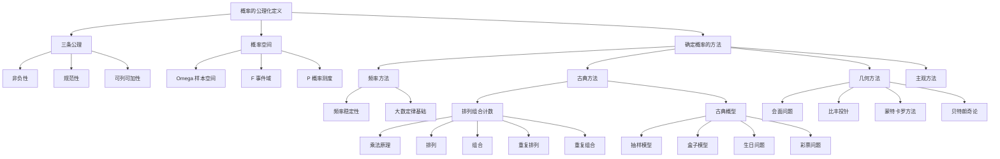

# 1.2 概率的定义及其确定方法

> [!abstract] 本节概览
> 本节建立概率的==公理化定义==（Kolmogorov 三条公理），介绍排列组合等计数工具，然后给出四种确定概率的方法：==频率方法==、==古典方法==、==几何方法==、==主观方法==。
>
> **逻辑链条**：概率的公理化定义 → 排列组合计数工具 → 频率方法 → 古典方法（抽样模型/盒子模型/生日问题）→ 几何方法（会面问题/比丰投针）→ 主观方法
>
> **前置依赖**：[[1.1 随机事件及其运算]]（样本空间、事件域、事件运算）
>
> **核心主线**：从公理出发，通过不同的"确定方法"为事件赋予具体的概率值，其中古典方法和几何方法是本节重点。

---

## 一、概率的公理化定义

### 历史背景

概率的定义经历了三个阶段：
1. **古典定义**（17世纪，Pascal/Fermat）：基于等可能性，$P(A) = k/n$
2. **统计定义**（19世纪，von Mises）：基于频率稳定性
3. **公理化定义**（1933年，Kolmogorov）：基于三条公理，统一了各种概率定义

### Kolmogorov 公理化定义

> [!def] 定义 1.2.1 — 概率的公理化定义
> 设 $\Omega$ 为一个样本空间，$\mathcal{F}$ 为 $\Omega$ 的某些子集组成的一个事件域。如果对每一个事件 $A \in \mathcal{F}$，都赋予一个实数 $P(A)$，满足：
> 1. **非负性**：$P(A) \geq 0$；
> 2. **规范性**：$P(\Omega) = 1$；
> 3. **可列可加性**：若 $A_1, A_2, \cdots$ 互不相容，则
> $$
> P\!\left(\bigcup_{i=1}^{\infty} A_i\right) = \sum_{i=1}^{\infty} P(A_i) \tag{1.2.1}
> $$
>
> 则称 $P(A)$ 为事件 $A$ 的==概率==，称 $(\Omega, \mathcal{F}, P)$ 为==概率空间==。

> [!tip] 三条公理的直观理解
> - **非负性**：概率不会是负数（最差是0）
> - **规范性**："什么事情都发生"的概率是1（100%）
> - **可列可加性**：互不相容的事件，概率可以相加（最核心的公理）

> [!warning] 注意
> 由可列可加性可以推出有限可加性（取 $A_{n+1} = A_{n+2} = \cdots = \varnothing$），但反过来不成立。可列可加性是更强的条件，它保证了极限运算的合法性。

---

## 二、排列与组合公式

在古典概型中，计算概率的关键是计数。以下是常用的计数公式。

### 乘法原理

> [!def] 乘法原理
> 若完成一件事需要 $r$ 个步骤，第 $i$ 步有 $n_i$ 种方法（$i = 1, 2, \cdots, r$），则完成这件事共有
> $$
> n_1 \times n_2 \times \cdots \times n_r
> $$
> 种方法。

### 加法原理

> [!def] 加法原理
> 若完成一件事有 $r$ 类方法，第 $i$ 类有 $n_i$ 种方法（$i = 1, 2, \cdots, r$），且各类方法互不相同，则完成这件事共有
> $$
> n_1 + n_2 + \cdots + n_r
> $$
> 种方法。

### 排列

> [!def] 排列
> 从 $n$ 个不同元素中取出 $r$ 个（$r \leq n$），按一定顺序排列，称为从 $n$ 中取 $r$ 的==排列==，其总数为
> $$
> P_n^r = n(n-1)\cdots(n-r+1) = \frac{n!}{(n-r)!} \tag{1.2.2}
> $$
>
> 特别地，当 $r = n$ 时称为全排列：$P_n^n = n!$

### 组合

> [!def] 组合
> 从 $n$ 个不同元素中取出 $r$ 个（$r \leq n$），不计顺序，称为从 $n$ 中取 $r$ 的==组合==，其总数为
> $$
> \binom{n}{r} = C_n^r = \frac{n!}{r!(n-r)!} \tag{1.2.3}
> $$

**组合的性质**：
- $\binom{n}{r} = \binom{n}{n-r}$（对称性）
- $\binom{n}{r} = \binom{n-1}{r-1} + \binom{n-1}{r}$（Pascal恒等式）
- $\sum_{r=0}^{n}\binom{n}{r} = 2^n$（二项式定理取 $a = b = 1$）

### 重复排列

> [!def] 重复排列
> 从 $n$ 个不同元素中取出 $r$ 个（允许重复），按一定顺序排列，总数为 $n^r$。

### 重复组合

> [!def] 重复组合
> 从 $n$ 个不同元素中取出 $r$ 个（允许重复），不计顺序，总数为
> $$
> \binom{n+r-1}{r} = \binom{n+r-1}{n-1}
> $$

---

## 三、确定概率的方法

### 频率方法

#### 频率的定义

> [!def] 频率
> 设在相同条件下重复试验 $n$ 次，事件 $A$ 发生了 $n(A)$ 次，则称
> $$
> f_n(A) = \frac{n(A)}{n} \tag{1.2.4}
> $$
> 为事件 $A$ 在 $n$ 次试验中出现的==频率==。

#### 频率的稳定性

> [!example] 例 1.2.1 — 频率稳定性
> **(a) 抛硬币**：历史上多位学者进行了大量抛硬币实验，结果如下：
>
> | 实验者 | 抛掷次数 $n$ | 正面出现次数 $n(A)$ | 频率 $f_n(A)$ |
> |--------|-------------|-------------------|--------------|
> | De Morgan | 2048 | 1061 | 0.5181 |
> | Buffon | 4040 | 2048 | 0.5069 |
> | Pearson | 12000 | 6019 | 0.5016 |
> | Pearson | 24000 | 12012 | 0.5005 |
>
> **(b) 英文字母频率**：统计大量英文文献中各字母出现的频率，发现频率随文本量增大而趋于稳定，如 E 的频率约为 0.1268。
>
> **(c) 女婴出生频率**：大量统计表明女婴出生频率稳定在 0.48 左右。

> [!tip] 频率方法的特点
> - 优点：适用于大量可重复的随机现象
> - 缺点：需要大量重复试验，无法一次性给出精确概率
> - 频率满足概率的三条公理（非负性、规范性、有限可加性），因此可以作为概率的近似

### 古典方法

#### 古典概型的定义

> [!def] 古典概型（等可能概型）
> 若一个随机现象满足：
> 1. ==有限性==：样本空间 $\Omega$ 中只有有限个基本事件
> 2. ==等可能性==：每个基本事件发生的概率相等
>
> 则称其为==古典概型==。此时事件 $A$ 的概率为
> $$
> P(A) = \frac{A \text{ 包含的基本事件数}}{\Omega \text{ 中的基本事件总数}} = \frac{k}{n} \tag{1.2.5}
> $$

> [!example] 例 1.2.2 — 掷两枚硬币
> 掷两枚均匀硬币，$\Omega = \{HH, HT, TH, TT\}$，共 $n = 4$ 个等可能基本事件。
>
> $A =$ "至少一个正面" $= \{HH, HT, TH\}$，$k = 3$
> $$
> P(A) = \frac{3}{4}
> $$

#### 抽样模型

> [!example] 例 1.2.3 — 不放回抽样（超几何分布）
> $N$ 件产品中有 $M$ 件不合格品，从中不放回地抽取 $n$ 件，恰好抽到 $m$ 件不合格品的概率：
> $$
> P(X = m) = \frac{\binom{M}{m}\binom{N-M}{n-m}}{\binom{N}{n}} \tag{1.2.6}
> $$
>
> 这就是==超几何分布==。

> [!example] 例 1.2.4 — 放回抽样（二项分布）
> $N$ 件产品中有 $M$ 件不合格品，从中**有放回**地抽取 $n$ 件，恰好抽到 $m$ 件不合格品的概率：
> $$
> P(X = m) = \binom{n}{m}\left(\frac{M}{N}\right)^m\left(1 - \frac{M}{N}\right)^{n-m} \tag{1.2.7}
> $$
>
> 这就是==二项分布==。

> [!warning] 放回 vs 不放回
> - 不放回抽样：每次抽取后总体变小，概率逐次变化 → 超几何分布
> - 放回抽样：每次抽取概率不变，各次独立 → 二项分布
> - 当 $N$ 很大、$n$ 相对较小时，两者近似相等

#### 彩票问题

> [!example] 例 1.2.5 — 彩票问题
> 从 $1 \sim 35$ 中选7个号码（35选7），中一等奖（全部命中）的概率：
> $$
> P = \frac{1}{\binom{35}{7}} = \frac{1}{6724520} \approx 1.49 \times 10^{-7}
> $$
>
> 约为六百七十二万分之一。

#### 盒子模型

> [!example] 例 1.2.6 — 盒子模型
> 将 $r$ 个不可分辨的球随机放入 $n$ 个盒子中（每盒可放多个球）。
>
> **指定盒子**：$r$ 个球放入指定的 $k$ 个盒子中（每盒至少一个）的概率：
> $$
> P = \frac{\binom{r-1}{k-1}}{\binom{n+r-1}{r}} \tag{1.2.8}
> $$
>
> **任意盒子**：恰好有 $k$ 个盒子非空的概率：
> $$
> P = \frac{\binom{n}{k}\cdot S(r,k)}{\binom{n+r-1}{r}} \tag{1.2.9}
> $$
>
> 其中 $S(r,k)$ 为第二类 Stirling 数。

#### 生日问题

> [!example] 例 1.2.7 — 生日问题
> $r$ 个人中至少有两人生日相同的概率（假设一年365天，每天等可能）：
>
> **精确公式**：
> $$
> P(r) = 1 - \frac{365 \times 364 \times \cdots \times (365-r+1)}{365^r} \tag{1.2.10}
> $$
>
> **近似公式**（利用 $1-x \approx e^{-x}$）：
> $$
> P(r) \approx 1 - e^{-r(r-1)/(2 \times 365)} \tag{1.2.11}
> $$
>
> **关键结论**：仅需 $r = 23$ 人，$P \approx 0.507 > 0.5$，即23人中至少两人生日相同的概率超过一半！

| 人数 $r$ | 概率 $P(r)$ |
|---------|------------|
| 10 | 0.117 |
| 20 | 0.411 |
| 23 | 0.507 |
| 30 | 0.706 |
| 40 | 0.891 |
| 50 | 0.970 |
| 60 | 0.994 |

> [!tip] 生日问题的直觉反差
> 生日问题的结果常常违背直觉——只需要23人就有一半以上的概率出现生日相同。这是因为我们比较的不是"某人与特定人生日相同"（概率约 $r/365$），而是"任意两人之间生日相同"（有 $\binom{r}{2}$ 对比较）。

### 几何方法

#### 几何概型的定义

> [!def] 几何概型
> 若一个随机现象的样本空间可以用一个有度量的区域 $\Omega$ 表示（长度、面积、体积），且每个样本点出现的可能性与度量成正比，则事件 $A$ 的概率为
> $$
> P(A) = \frac{S_A}{S_\Omega} \tag{1.2.13}
> $$
>
> 其中 $S_A$ 和 $S_\Omega$ 分别是 $A$ 和 $\Omega$ 的度量（长度/面积/体积）。

> [!example] 例 1.2.8 — 会面问题
> 甲乙两人约定在中午12点到下午1点之间在某地会面，先到者等20分钟后离去。求两人能会面的概率。
>
> 设甲到达时刻为 $x$，乙到达时刻为 $y$（单位：小时），则：
> - 样本空间：$\Omega = \{(x,y) \mid 0 \leq x \leq 1,\; 0 \leq y \leq 1\}$，面积 $S_\Omega = 1$
> - 会面条件：$|x - y| \leq 1/3$
> - 有利区域：正方形中去掉两个三角形，面积 $S_A = 1 - (2/3)^2 = 5/9$
> $$
> P = \frac{5}{9} \approx 0.556
> $$

> [!example] 例 1.2.9 — 比丰投针
> 平面上画有等距为 $a$ 的平行线，向平面随机投一根长为 $l$（$l < a$）的针，求针与平行线相交的概率。
>
> $$
> P = \frac{2l}{\pi a}
> $$
>
> **重要意义**：由此可通过实验估计 $\pi$ 的值（==蒙特卡罗方法==的思想起源）。

> [!example] 例 1.2.10 — 线段分三角形
> 在长度为1的线段上随机取两点，将线段分成三段，求三段能构成三角形的概率。
>
> 设两点的位置为 $x, y$（$0 < x < y < 1$），三段长度为 $x, y-x, 1-y$。构成三角形的条件（三角不等式）：
> $$
> x + (y-x) > 1-y, \quad x + (1-y) > y-x, \quad (y-x) + (1-y) > x
> $$
>
> 化简得：$y > 1/2$，$x < 1/2$，$y - x < 1/2$。
>
> 在 $(x, y)$ 平面上，有利区域面积为 $1/4$，样本空间面积为 $1/2$：
> $$
> P = \frac{1/4}{1/2} = \frac{1}{4}
> $$

> [!example] 例 1.2.11 — 贝特朗奇论（Bertrand's Paradox）
> 在单位圆内随机取一条弦，求弦长大于圆内接正三角形边长（$\sqrt{3}$）的概率。
>
> 根据"随机"的不同理解，可以得到不同的答案：
> - **端点法**：$P = 1/3$
> - **半径法**：$P = 1/2$
> - **中点法**：$P = 1/4$
>
> **结论**：几何概型中"等可能性"的假设不同会导致不同的概率。这说明==几何概型需要更严格的"均匀分布"定义==，而贝特朗奇论正是推动概率公理化的重要动力之一。

### 主观方法

> [!def] 主观概率
> 根据个人经验和知识对事件发生的可能性给出的估计值称为==主观概率==。主观概率也满足概率的三条公理。

> [!example] 例 1.2.12
> - 某企业家估计新产品成功的概率为 0.8
> - 某医生估计患者康复的概率为 0.6
> - 某股民估计某只股票上涨的概率为 0.3

> [!tip] 主观概率的适用场景
> 主观概率适用于**无法大量重复**的随机现象（如一次性决策），在决策分析、贝叶斯统计中有重要应用。

---

## 四、知识结构总览

---

## 五、核心思想与证明技巧

> [!success] 核心思想
> 1. ==公理化是概率论的统一框架==：Kolmogorov 的三条公理将古典概率、统计概率、主观概率统一在一个框架下
> 2. ==计数是古典概型的核心能力==：掌握排列组合的各种公式，能正确识别"有序/无序"、"放回/不放回"
> 3. ==等可能性是古典概型的基础==：构造样本空间时必须确保基本事件的等可能性，否则会导致错误
> 4. ==几何概型需要谨慎定义均匀性==：贝特朗奇论说明"随机"的含义需要严格界定
> 5. ==频率是概率的经验基础==：大量重复试验中频率趋于稳定，这是大数定律的直观背景

> [!tip] 证明技巧清单
> 1. **古典概型计算三步法**：(1)确定样本空间和总数 $n$；(2)确定有利事件和计数 $k$；(3)$P = k/n$
> 2. **放回 vs 不放回**：放回用乘法原理（各次独立），不放回用组合（总体变小）
> 3. **对立事件简化**：当直接计算复杂时，考虑 $P(A) = 1 - P(\bar{A})$
> 4. **几何概型三步法**：(1)将问题转化为几何区域；(2)计算总面积 $S_\Omega$；(3)计算有利区域面积 $S_A$
> 5. **Stirling 数的应用**：盒子模型中"恰好 $k$ 个盒子非空"需要第二类 Stirling 数

---

## 六、补充理解与易混淆点

### 古典概型的等可能性陷阱

**来源**：MIT OCW 6.041 Lecture Notes、教材例 1.2.2

> [!danger] 误区1："只要列出所有结果，就是古典概型"
> ❌ 错误解释：认为任何样本空间都可以直接用 $P = k/n$ 计算
> ✅ 正确解释：古典概型的核心前提是==等可能性==。如果样本空间的构造方式导致基本事件不等可能，则不能直接用 $P = k/n$。例如同时抛两枚硬币，样本空间必须写成 $\{HH, HT, TH, TT\}$（4个等可能结果），而不是 $\{0, 1, 2\}$（正面个数，概率分别为 $1/4, 1/2, 1/4$，不等可能）。

### 放回抽样与不放回抽样的混淆

**来源**：教材例 1.2.3-1.2.4、UCLA STAT 100A Notes

> [!danger] 误区2："放回和不放回结果差不多，可以混用"
> ❌ 错误解释：认为两种抽样方式的区别不大
> ✅ 正确解释：虽然当 $N$ 很大时两者近似相等，但==本质上是不同的分布==。不放回抽样服从超几何分布（各次不独立），放回抽样服从二项分布（各次独立）。在假设检验等问题中，这种区别会导致不同的统计推断结论。

### 概率为零与不可能事件

**来源**：教材 §1.2、五三解析册第6页

> [!danger] 误区3："概率为零就是不可能事件"
> ❌ 错误解释：将 $P(A) = 0$ 等同于 $A = \varnothing$
> ✅ 正确解释：在古典概型中，$P(A) = 0$ 确实意味着 $A = \varnothing$。但在几何概型或连续型随机变量中，$P(A) = 0$ 不意味着 $A$ 不可能发生。例如在 $[0, 1]$ 上均匀投点，$P(\text{恰好投中 } 0.5) = 0$，但这个事件并非不可能。==不可能事件一定概率为零，但概率为零不一定是不可能事件==。

### 几何概型中"均匀分布"的歧义

**来源**：教材例 1.2.11（贝特朗奇论）、Stanford STAT 219 Notes

> [!danger] 误区4："几何概型中'随机取'只有一种理解"
> ❌ 错误解释：认为"随机取一条弦"有唯一正确的概率
> ✅ 正确解释：贝特朗奇论表明，"随机"的含义取决于==如何定义均匀分布==。不同的参数化方式（端点均匀、半径均匀、中点均匀）对应不同的概率。这说明几何概型中必须明确指定"均匀分布"的具体含义，否则问题本身是不明确的。

### 生日问题的直觉偏差

**来源**：教材例 1.2.7、Wikipedia "Birthday problem"

> [!danger] 误区5："23人中两人生日相同的概率很小"
> ❌ 错误解释：直觉认为需要365人左右才能保证生日重复
> ✅ 正确解释：直觉偏差来源于我们混淆了"某人与特定人生日相同"（概率约 $r/365$）和"==任意两人之间==生日相同"（有 $\binom{r}{2} \approx r^2/2$ 对比较）。23人时有 $\binom{23}{2} = 253$ 对比较，远超365的一半，因此概率超过50%。

### 频率与概率的关系

**来源**：教材 §1.2.3、UMD CMSC 351 Lecture Notes

> [!danger] 误区6："频率就是概率"
> ❌ 错误解释：将频率 $f_n(A)$ 直接等同于概率 $P(A)$
> ✅ 正确解释：频率是概率的==经验近似==。当试验次数 $n$ 足够大时，频率趋于稳定并接近概率（这是大数定律的内容）。但对于有限次试验，频率只是概率的估计值，两者之间存在误差。频率满足概率的公理，但频率本身依赖于具体的试验序列。

---

## 七、习题精选

> [!todo] 本节习题
> | 习题号 | 标题 | 核心考点 | 难度 | 来源 |
> |--------|------|----------|------|------|
> | 1 | 组合恒等式证明 | 组合公式推导 | ⭐⭐⭐ | 教材习题1.2 |
> | 2 | 掷硬币古典概型 | 古典概型基本计算 | ⭐ | 教材习题1.2 |
> | 5 | 二次方程有实根概率 | 连续样本空间+古典方法 | ⭐⭐ | 教材习题1.2 |
> | 6 | 扑克牌古典概型 | 组合计数+古典概型 | ⭐⭐ | 教材习题1.2 |
> | 7 | 抽样检验 | 超几何分布 | ⭐⭐ | 教材习题1.2 |
> | 10 | 球盒模型 | 盒子模型+Stirling数 | ⭐⭐⭐ | 教材习题1.2 |
> | 五三1 | 鞋子配对问题 | 古典概型+组合计数 | ⭐⭐ | 2017中山大学432 |
> | 五三2 | 古典概型概念辨析 | 概率公理+古典定义 | ⭐ | 2022北师大432 |
> | 五三3 | 摸球概率 | 对立事件+逐步概率 | ⭐⭐ | 2020北师大432 |
> | 五三4 | 扑克牌条件概率 | 古典概型+条件概率综合 | ⭐⭐⭐ | 2014北京大学432 |

### 习题1：组合恒等式证明

> [!problem] 习题1
> 证明：$\sum_{k=0}^{r}\binom{m}{k}\binom{n}{r-k} = \binom{m+n}{r}$（Vandermonde 恒等式）

> [!faq]- 查看解答
> **证明**（组合意义法）：
>
> 考虑从 $m + n$ 个元素中取 $r$ 个的组合数 $\binom{m+n}{r}$。
>
> 将 $m + n$ 个元素分为两组：前 $m$ 个和后 $n$ 个。取出的 $r$ 个元素中，有 $k$ 个来自前组、$r - k$ 个来自后组（$k = 0, 1, \cdots, r$）。
>
> 对于固定的 $k$：从前 $m$ 个中取 $k$ 个有 $\binom{m}{k}$ 种方法，从后 $n$ 个中取 $r - k$ 个有 $\binom{n}{r-k}$ 种方法，由乘法原理共有 $\binom{m}{k}\binom{n}{r-k}$ 种。
>
> 由加法原理，对所有可能的 $k$ 求和：
> $$
> \sum_{k=0}^{r}\binom{m}{k}\binom{n}{r-k} = \binom{m+n}{r}
> $$
>
> $\square$

### 习题2：掷硬币古典概型

> [!problem] 习题2
> 掷两枚均匀硬币，求事件 $A =$ "一个正面一个反面"的概率。

> [!faq]- 查看解答
> 样本空间 $\Omega = \{HH, HT, TH, TT\}$，共 $n = 4$ 个等可能基本事件。
>
> $A = \{HT, TH\}$，$k = 2$。
>
> $$
> P(A) = \frac{2}{4} = \frac{1}{2}
> $$
>
> $\square$

### 习题5：二次方程有实根概率

> [!problem] 习题5
> 从 $[-1, 1]$ 中随机取两个数 $a, b$，求二次方程 $x^2 + ax + b = 0$ 有实根的概率。

> [!faq]- 查看解答
> 二次方程 $x^2 + ax + b = 0$ 有实根的条件是判别式 $\Delta = a^2 - 4b \geq 0$，即 $b \leq a^2/4$。
>
> 样本空间 $\Omega = \{(a, b) \mid -1 \leq a \leq 1,\; -1 \leq b \leq 1\}$，面积 $S_\Omega = 4$。
>
> 有利区域：$b \leq a^2/4$ 且 $-1 \leq b \leq 1$。
>
> 计算有利面积：
> $$
> S_A = \int_{-1}^{1}\left(\frac{a^2}{4} - (-1)\right)da = \int_{-1}^{1}\left(\frac{a^2}{4} + 1\right)da = \left[\frac{a^3}{12} + a\right]_{-1}^{1} = \frac{1}{12} + 1 + \frac{1}{12} + 1 = \frac{13}{6}
> $$
>
> $$
> P = \frac{13/6}{4} = \frac{13}{24}
> $$
>
> $\square$

### 习题6：扑克牌古典概型

> [!problem] 习题6
> 一副52张扑克牌（无大小王），任取4张，求：
> (1) 4张花色各不相同的概率；
> (2) 4张中恰好有2张A的概率。

> [!faq]- 查看解答
> 总数：$\binom{52}{4} = 270725$
>
> **(1)** 从4种花色各取1张：$\binom{13}{1}^4 = 13^4 = 28561$
> $$
> P = \frac{28561}{270725} \approx 0.1055
> $$
>
> **(2)** 从4张A中选2张，再从其余48张非A中选2张：
> $$
> P = \frac{\binom{4}{2}\binom{48}{2}}{\binom{52}{4}} = \frac{6 \times 1128}{270725} = \frac{6768}{270725} \approx 0.0250
> $$
>
> $\square$

### 习题7：抽样检验

> [!problem] 习题7
> 某批产品共100件，其中10件为不合格品。从中不放回地抽取5件，求恰好有2件不合格品的概率。

> [!faq]- 查看解答
> 这是超几何分布，$N = 100$，$M = 10$，$n = 5$，$m = 2$：
> $$
> P(X = 2) = \frac{\binom{10}{2}\binom{90}{3}}{\binom{100}{5}} = \frac{45 \times 117480}{75287520} \approx 0.0702
> $$
>
> $\square$

### 习题10：球盒模型

> [!problem] 习题10
> 将4个不同的球随机放入3个盒子中，求：
> (1) 没有空盒的概率；
> (2) 恰好有1个空盒的概率。

> [!faq]- 查看解答
> 总数（每个球有3种选择）：$3^4 = 81$
>
> **(1)** 没有空盒 = 4个球放入3个盒子，每盒至少1个。先分组（2+1+1），再分配到3个盒子：
> - 分组方式：$\binom{4}{2} = 6$（选2个球为一组）
> - 分配方式：$3! = 6$（3组分配到3个盒子）
> - 有利事件数：$6 \times 6 = 36$
> $$
> P = \frac{36}{81} = \frac{4}{9}
> $$
>
> **(2)** 恰好1个空盒 = 4个球放入2个盒子（每盒至少1个），第3个盒子为空。
> - 选空盒：$\binom{3}{1} = 3$
> - 4个球放入2个盒子（每盒至少1个）：$2^4 - 2 = 14$（减去全放一个盒的2种情况）
> - 有利事件数：$3 \times 14 = 42$
> $$
> P = \frac{42}{81} = \frac{14}{27}
> $$
>
> $\square$

### 五三第1题：鞋子配对问题

> [!problem] 五三第1题（2017中山大学432）
> 从5双不同的鞋子中任取4只，其中恰有一双配对的概率是（ ）。
> A. 2/3　　B. 4/7　　C. 2/7　　D. 1/3

> [!faq]- 查看解答
> **选 B**。
>
> 总数：从10只鞋子中取4只，$\binom{10}{4} = 210$。
>
> 有利事件（恰有一双配对）分三步：
> 1. 从5双中选1双（两只都取）：$\binom{5}{1} = 5$
> 2. 从剩下4双中选2双：$\binom{4}{2} = 6$
> 3. 从选出的2双中各取1只：$\binom{2}{1}^2 = 4$
>
> 有利事件数：$5 \times 6 \times 4 = 120$
> $$
> P = \frac{120}{210} = \frac{4}{7}
> $$
>
> **来源**：五三解析册第13页
>
> $\square$

### 五三第2题：古典概型概念辨析

> [!problem] 五三第2题（2022北师大432）
> 关于古典概率空间，描述错误的是（ ）。
> A. 样本点对应基本事件概率和一定为1
> B. 各样本点对应基本事件概率一定相同
> C. 样本空间中元素个数可能无限
> D. 各事件 $P$ 一定正比于事件中包含的样本点个数

> [!faq]- 查看解答
> **选 C**。
>
> 古典概型的两大前提：(1)==有限性==（样本空间中基本事件个数有限）；(2)==等可能性==（每个基本事件概率相等）。
>
> 选项C说"元素个数可能无限"，直接违背有限性前提，是错误的。
>
> **来源**：五三解析册第12页
>
> $\square$

### 五三第3题：摸球概率

> [!problem] 五三第3题（2020北师大432）
> 袋中有 $n-1$ 个黑球，1个白球，每次摸出一球后不放回，放入一个黑球。求第 $k$ 次摸球摸出黑球的概率。

> [!faq]- 查看解答
> 用对立事件简化：
> $$
> P(\text{第 } k \text{ 次黑球}) = 1 - P(\text{第 } k \text{ 次白球})
> $$
>
> 第 $k$ 次摸到白球 ⟺ 前 $k-1$ 次都摸到黑球（每次摸出黑球后放回黑球，袋中始终 $n-1$ 黑 1 白），第 $k$ 次摸到白球：
> $$
> P(\text{第 } k \text{ 次白球}) = \left(\frac{n-1}{n}\right)^{k-1} \cdot \frac{1}{n}
> $$
>
> 因此：
> $$
> \boxed{P(\text{第 } k \text{ 次黑球}) = 1 - \frac{1}{n}\left(\frac{n-1}{n}\right)^{k-1}}
> $$
>
> **来源**：五三解析册第16页
>
> $\square$

### 五三第4题：扑克牌条件概率

> [!problem] 五三第4题（2014北京大学432）
> 一副52张扑克牌（无大小王），不放回地抽出两张。
> (1) 两张牌花色相同的概率；
> (2) 在花色相同的条件下，两张牌数字相邻的概率。

> [!faq]- 查看解答
> 总数：$\binom{52}{2} = 1326$
>
> **(1)** 花色相同：先选花色 $\binom{4}{1}$，再从该花色13张中取2张：
> $$
> P(A) = \frac{\binom{4}{1}\binom{13}{2}}{\binom{52}{2}} = \frac{4 \times 78}{1326} = \frac{4}{17}
> $$
>
> **(2)** 条件概率 $P(B|A) = \frac{P(AB)}{P(A)}$：
>
> $P(AB)$：花色相同且数字相邻。选花色 $\binom{4}{1}$，13张牌中相邻对子有12对（A-2, 2-3, ..., Q-K）：
> $$
> P(AB) = \frac{4 \times 12}{1326} = \frac{48}{1326}
> $$
>
> $$
> P(B|A) = \frac{48/1326}{4/17} = \frac{48 \times 17}{1326 \times 4} = \frac{2}{13}
> $$
>
> **来源**：五三解析册第15页
>
> $\square$

---

## 八、教材原文

#学习/概率论与统计/第一章 随机事件与概率/概率定义与确定方法
