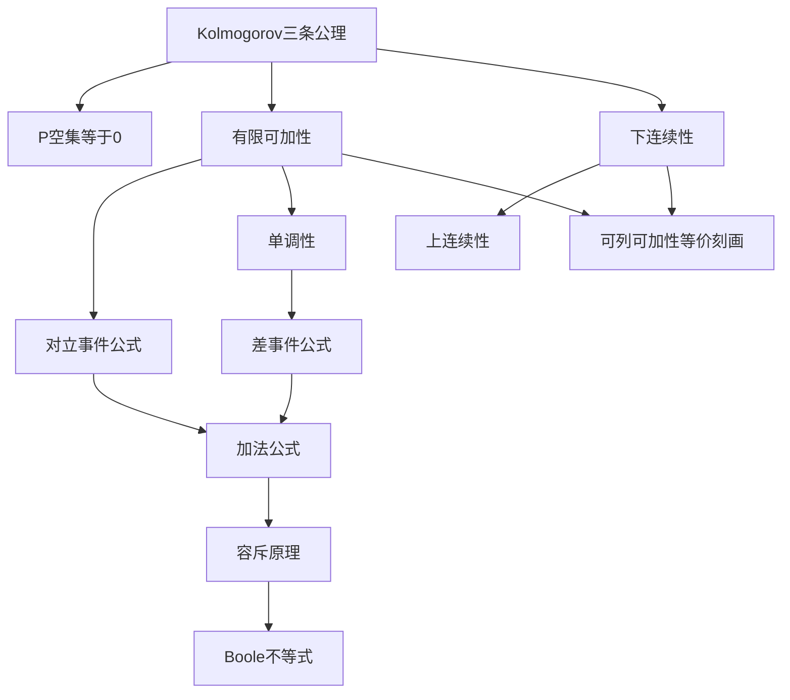

# 1.3 概率的性质

> [!abstract] 本节概览
> 本节从[[1.2 概率的定义及其确定方法|概率的公理化定义]]（Kolmogorov 三条公理）出发，系统推导概率的一系列重要性质：==可加性==、==单调性==、==加法公式==（容斥原理）和==连续性==，并建立可列可加性与有限可加性之间的桥梁。
>
> **逻辑链条**：三条公理 → P(∅)=0 → 有限可加性 → 对立事件公式 → 单调性 → 差事件公式 → 加法公式（容斥原理）→ 次可加性（Boole不等式）→ 连续性（下/上连续）→ 可列可加性等价刻画
>
> **前置依赖**：[[1.1 随机事件及其运算]]（事件运算、De Morgan 公式）、[[1.2 概率的定义及其确定方法|§1.2]]（Kolmogorov 公理、概率空间）
>
> **核心主线**：从三条公理出发，通过集合分解技巧（将复杂事件拆为不相容事件的并），逐步推导出概率的所有基本运算性质。

---

## 一、概率的基本性质

本节所有性质的推导起点都是 [[1.2 概率的定义及其确定方法|§1.2]] 中建立的 Kolmogorov 三条公理：

1. **非负性**：$P(A) \geq 0$
2. **规范性**：$P(\Omega) = 1$
3. **可列可加性**：若 $A_1, A_2, \cdots$ 互不相容，则 $P\!\left(\bigcup_{i=1}^{\infty} A_i\right) = \sum_{i=1}^{\infty} P(A_i)$

### P(∅) = 0

> [!thm] 性质 1.3.1 — 不可能事件的概率为零
> $$
> P(\varnothing) = 0
> $$

> [!abstract] 证明思路
> **证明 (性质 1.3.1)**：
>
> **[利用可列可加性]**：令 $A_1 = \varnothing$，$A_2 = \varnothing$，$\cdots$，则 $A_1, A_2, \cdots$ 互不相容，且 $\bigcup_{i=1}^{\infty} A_i = \varnothing$。
>
> 由可列可加性：
> $$
> P(\varnothing) = P\!\left(\bigcup_{i=1}^{\infty} A_i\right) = \sum_{i=1}^{\infty} P(A_i) = \sum_{i=1}^{\infty} P(\varnothing)
> $$
>
> 由于 $P(\varnothing)$ 是一个非负实数，无穷多个相同非负实数之和为有限值，只有当 $P(\varnothing) = 0$ 时才成立。 $\square$

### 概率的可加性

#### 有限可加性

> [!thm] 性质 1.3.2 — 有限可加性
> 若 $A_1, A_2, \cdots, A_n$ 互不相容，则
> $$
> P\!\left(\bigcup_{i=1}^{n} A_i\right) = \sum_{i=1}^{n} P(A_i) \tag{1.3.1}
> $$

> [!abstract] 证明思路
> **证明 (1.3.1)**：
>
> **[在可列可加性中补充无穷多个空集]**：令 $A_{n+1} = A_{n+2} = \cdots = \varnothing$，则
> $$
> P\!\left(\bigcup_{i=1}^{n} A_i\right) = P\!\left(\bigcup_{i=1}^{\infty} A_i\right) = \sum_{i=1}^{\infty} P(A_i) = \sum_{i=1}^{n} P(A_i) + \sum_{i=n+1}^{\infty} P(\varnothing) = \sum_{i=1}^{n} P(A_i)
> $$
>
> 其中最后一步利用了 $P(\varnothing) = 0$。 $\square$

> [!tip] 可列可加性 ⟹ 有限可加性
> 有限可加性是可列可加性的**特例**（通过补充无穷多个空集得到）。但反过来，有限可加性**推不出**可列可加性——这是本节§1.3.4的核心结论。

#### 对立事件公式

> [!thm] 性质 1.3.3 — 对立事件的概率
> $$
> P(\bar{A}) = 1 - P(A) \tag{1.3.2}
> $$

> [!abstract] 证明思路
> **证明 (1.3.2)**：
>
> **[利用有限可加性]**：$A$ 与 $\bar{A}$ 互不相容，且 $A \cup \bar{A} = \Omega$，因此
> $$
> P(A) + P(\bar{A}) = P(A \cup \bar{A}) = P(\Omega) = 1
> $$
>
> 移项即得 $P(\bar{A}) = 1 - P(A)$。 $\square$

> [!example] 例 1.3.1 — 灯泡问题
> 36个灯泡中，4个是6W，32个是4W。从中任取3个，求**至少有一个**是6W的概率。
>
> **解**：设 $A$ = "至少有一个6W"，则 $\bar{A}$ = "三个都是4W"。
> $$
> P(\bar{A}) = \frac{\binom{32}{3}}{\binom{36}{3}} = \frac{248}{357} \approx 0.695
> $$
> $$
> P(A) = 1 - P(\bar{A}) = \frac{109}{357} \approx 0.305
> $$
>
> **思路对比**：直接计算需要分"恰1个6W"、"恰2个6W"、"恰3个6W"三种情况，而对立事件只需计算一种情况，==大大简化了计算==。

> [!example] 例 1.3.2 — 掷硬币5次
> 掷硬币5次，求正反面都出现的概率。
>
> **解**：设 $A$ = "5次都是正面"，$B$ = "5次都是反面"，$C$ = "正反面都出现"。
>
> 则 $\bar{C} = A \cup B$，且 $A \cap B = \varnothing$，故
> $$
> P(\bar{C}) = P(A) + P(B) = \frac{1}{2^5} + \frac{1}{2^5} = \frac{2}{32} = \frac{1}{16}
> $$
> $$
> P(C) = 1 - P(\bar{C}) = 1 - \frac{1}{16} = \frac{15}{16}
> $$

---

## 二、概率的单调性

### 差事件公式

> [!thm] 性质 1.3.4 — 差事件概率（包含情形）
> 若 $A \supset B$，则
> $$
> P(A - B) = P(A) - P(B) \tag{1.3.3}
> $$

> [!abstract] 证明思路
> **证明 (1.3.3)**：
>
> **[集合分解]**：当 $A \supset B$ 时，$A = B \cup (A - B)$，且 $B \cap (A - B) = \varnothing$。
>
> 由有限可加性：
> $$
> P(A) = P(B) + P(A - B)
> $$
>
> 移项即得 $P(A - B) = P(A) - P(B)$。 $\square$

> [!thm] 推论 — 概率的单调性
> 若 $A \supset B$，则 $P(A) \geq P(B)$。
>
> **证明**：由性质1.3.4，$P(A) - P(B) = P(A - B) \geq 0$（非负性），故 $P(A) \geq P(B)$。 $\square$

> [!thm] 性质 1.3.5 — 差事件概率（一般情形）
> 对任意两个事件 $A$ 和 $B$，
> $$
> P(A - B) = P(A) - P(AB) \tag{1.3.4}
> $$

> [!abstract] 证明思路
> **证明 (1.3.4)**：
>
> **[集合分解]**：$A = AB \cup (A - B)$，且 $AB \cap (A - B) = \varnothing$（因为 $A - B$ 中不含 $B$ 的元素）。
>
> 由有限可加性：
> $$
> P(A) = P(AB) + P(A - B)
> $$
>
> 移项即得。 $\square$

> [!tip] 性质1.3.4 与 1.3.5 的关系
> 性质1.3.5是性质1.3.4的==推广==：当 $A \supset B$ 时，$AB = B$，性质1.3.5退化为性质1.3.4。

> [!example] 例 1.3.3 — 摸球最大值问题
> 从 $\{1, 2, \cdots, n\}$ 中有放回地取 $m$ 个数，求最大值恰好为 $k$ 的概率。
>
> **解**：设 $A_k$ = "最大值恰好为 $k$"，$B_i$ = "最大值不超过 $i$"。
>
> 则 $B_1 \subset B_2 \subset \cdots \subset B_n$，且 $A_k = B_k - B_{k-1}$。
>
> 由性质1.3.4：
> $$
> P(A_k) = P(B_k) - P(B_{k-1}) = \frac{k^m}{n^m} - \frac{(k-1)^m}{n^m} = \frac{k^m - (k-1)^m}{n^m}
> $$
>
> **数值验证**（$n=6, m=3$，即掷三颗骰子）：

| $k$ | 1 | 2 | 3 | 4 | 5 | 6 |
|-----|---|---|---|---|---|---|
| $P(A_k)$ | 0.0046 | 0.0324 | 0.0880 | 0.1713 | 0.2824 | 0.4213 |

> 验证：$\sum_{k=1}^{6} P(A_k) = 1.0000$ ✓

---

## 三、概率的加法公式

### 两事件加法公式

> [!thm] 性质 1.3.6 — 加法公式
> 对任意两个事件 $A$ 和 $B$，
> $$
> P(A \cup B) = P(A) + P(B) - P(AB) \tag{1.3.5}
> $$
>
> 对任意 $n$ 个事件 $A_1, A_2, \cdots, A_n$，
> $$
> P\!\left(\bigcup_{i=1}^{n} A_i\right) = \sum_{i=1}^{n} P(A_i) - \sum_{1 \leq i < j \leq n} P(A_i A_j) + \sum_{1 \leq i < j < k \leq n} P(A_i A_j A_k) - \cdots + (-1)^{n-1} P(A_1 A_2 \cdots A_n) \tag{1.3.6}
> $$

> [!abstract] 证明思路
> **证明 (1.3.5)**：
>
> **[两事件情形]**：将 $A \cup B$ 分解为不相容事件的并：
> $$
> A \cup B = A \cup (B - AB)
> $$
> 且 $A \cap (B - AB) = \varnothing$。由有限可加性：
> $$
> P(A \cup B) = P(A) + P(B - AB)
> $$
> 再由性质1.3.5（$B \supset AB$）：
> $$
> P(B - AB) = P(B) - P(AB)
> $$
> 代入即得。
>
> **[$n$ 事件情形]**：对 $n$ 用==数学归纳法==。归纳关键步骤：
> $$
> P\!\left(\bigcup_{i=1}^{n} A_i\right) = P\!\left(\bigcup_{i=1}^{n-1} A_i\right) + P(A_n) - P\!\left(\bigcup_{i=1}^{n-1} A_i \cap A_n\right)
> $$
> 然后对 $\bigcup_{i=1}^{n-1} A_i$ 和 $\bigcup_{i=1}^{n-1}(A_i A_n)$ 分别应用归纳假设。 $\square$

> [!tip] 容斥原理的直观理解
> 公式(1.3.6)的核心思想是==多退少补==：
> - 先把所有事件的概率加起来（可能多算了交集部分）
> - 减去两两交集（可能多减了三个事件的交集）
> - 加回三个事件的交集（可能多加了四个事件的交集）
> - 如此交替进行

### 次可加性（Boole 不等式）

> [!thm] 推论 1.3.7 — 次可加性（Boole 不等式）
> 对任意两个事件，
> $$
> P(A \cup B) \leq P(A) + P(B) \tag{1.3.7}
> $$
>
> 对任意 $n$ 个事件，
> $$
> P\!\left(\bigcup_{i=1}^{n} A_i\right) \leq \sum_{i=1}^{n} P(A_i) \tag{1.3.8}
> $$

> [!abstract] 证明思路
> **证明 (1.3.7)**：
>
> 由加法公式(1.3.5)：
> $$
> P(A \cup B) = P(A) + P(B) - P(AB)
> $$
> 因为 $P(AB) \geq 0$（非负性），所以 $P(A \cup B) \leq P(A) + P(B)$。
>
> $n$ 事件情形用数学归纳法即可。 $\square$

> [!tip] Boole 不等式的应用场景
> 当我们只需要概率的==上界估计==时，Boole不等式非常有用——不需要知道事件之间的交集概率，只需把各事件概率相加即可。在随机算法分析、大数定律证明中经常出现。

### 例题

> [!example] 例 1.3.4 — 基本加法公式
> 已知 $P(A) = 0.4$，$P(B) = 0.3$，$P(A \cup B) = 0.6$，求 $P(A\bar{B})$。
>
> **解**：由加法公式：
> $$
> P(AB) = P(A) + P(B) - P(A \cup B) = 0.4 + 0.3 - 0.6 = 0.1
> $$
> $$
> P(A\bar{B}) = P(A) - P(AB) = 0.4 - 0.1 = 0.3
> $$

> [!example] 例 1.3.5 — 三事件容斥
> 已知 $P(A) = P(B) = P(C) = \frac{1}{4}$，$P(AB) = P(AC) = P(BC) = \frac{1}{16}$，$P(ABC) = 0$。
>
> 求：(1) $A, B, C$ 至少发生一个的概率；(2) $A, B, C$ 都不发生的概率。
>
> **解**：
> (1) 由三事件容斥公式(1.3.6)：
> $$
> P(A \cup B \cup C) = 3 \times \frac{1}{4} - 3 \times \frac{1}{16} + 0 = \frac{12}{16} - \frac{3}{16} = \frac{9}{16}
> $$
>
> (2) 由对立事件公式：
> $$
> P(\bar{A}\bar{B}\bar{C}) = 1 - P(A \cup B \cup C) = 1 - \frac{9}{16} = \frac{7}{16}
> $$
>
> **注意**：$P(ABC) = 0$ 是因为 $ABC \subset AB$，由单调性 $P(ABC) \leq P(AB) = \frac{1}{16}$，但题目直接给出 $P(ABC) = 0$，说明 $A, B, C$ 不能同时发生。

> [!example] 例 1.3.6 — 配对问题（错排问题）
> $n$ 个人各写一张贺卡放在一起，再随机抽取。求**至少有一人**抽到自己贺卡的概率。
>
> **解**：设 $A_i$ = "第 $i$ 个人抽到自己的贺卡"（$i = 1, 2, \cdots, n$）。
>
> 求"至少有一人"的概率，即 $P\!\left(\bigcup_{i=1}^{n} A_i\right)$。
>
> **关键计算**：
> - $P(A_i) = \frac{1}{n}$（共 $n!$ 种排列，固定第 $i$ 个位置后剩 $(n-1)!$ 种）
> - $P(A_i A_j) = \frac{1}{n(n-1)}$（固定两个位置后剩 $(n-2)!$ 种）
> - 一般地，$P(A_{i_1} A_{i_2} \cdots A_{i_k}) = \frac{1}{n(n-1)\cdots(n-k+1)}$
>
> 由容斥公式(1.3.6)：
> $$
> P\!\left(\bigcup_{i=1}^{n} A_i\right) = \binom{n}{1} \cdot \frac{1}{n} - \binom{n}{2} \cdot \frac{1}{n(n-1)} + \binom{n}{3} \cdot \frac{1}{n(n-1)(n-2)} - \cdots + (-1)^{n-1} \cdot \frac{1}{n!}
> $$
>
> 化简得：
> $$
> P\!\left(\bigcup_{i=1}^{n} A_i\right) = 1 - \frac{1}{2!} + \frac{1}{3!} - \frac{1}{4!} + \cdots + (-1)^{n-1} \cdot \frac{1}{n!} = \sum_{k=1}^{n} \frac{(-1)^{k-1}}{k!}
> $$
>
> **极限结果**：当 $n \to \infty$ 时，
> $$
> \lim_{n \to \infty} P\!\left(\bigcup_{i=1}^{n} A_i\right) = 1 - e^{-1} \approx 0.6321
> $$
>
> **结论**：即使有100人、1000人，"至少一人抽到自己贺卡"的概率始终约为63.2%，不会趋近于1！这个反直觉的结果说明==概率为0.632不等于"几乎必然"==。

---

## 四、概率的连续性

### 单调事件序列的极限

> [!def] 定义 1.3.1 — 单调事件序列的极限
> (1) 若事件序列 $F_1, F_2, \cdots$ 满足 $F_1 \subset F_2 \subset \cdots$（单调不减），则称其==极限事件==为
> $$
> \lim_{n \to \infty} F_n = \bigcup_{n=1}^{\infty} F_n \tag{1.3.9}
> $$
>
> (2) 若事件序列 $E_1, E_2, \cdots$ 满足 $E_1 \supset E_2 \supset \cdots$（单调不增），则称其==极限事件==为
> $$
> \lim_{n \to \infty} E_n = \bigcap_{n=1}^{\infty} E_n \tag{1.3.10}
> $$

> [!tip] 极限事件的直观理解
> - **单调不减序列**：事件"越来越大"，极限就是所有事件的并（"最终覆盖到的所有结果"）
> - **单调不增序列**：事件"越来越小"，极限就是所有事件的交（"始终保留的结果"）

### 概率连续性的定义

> [!def] 定义 1.3.2 — 概率的连续性
> (1) 若对任意单调不减的事件序列 $\{F_n\}$，都有
> $$
> P\!\left(\lim_{n \to \infty} F_n\right) = \lim_{n \to \infty} P(F_n)
> $$
> 则称概率 $P$ 是==下连续的==。
>
> (2) 若对任意单调不增的事件序列 $\{E_n\}$，都有
> $$
> P\!\left(\lim_{n \to \infty} E_n\right) = \lim_{n \to \infty} P(E_n)
> $$
> 则称概率 $P$ 是==上连续的==。

### 连续性定理

> [!thm] 性质 1.3.7 — 概率的连续性
> 概率测度 $P$ 既是下连续的，又是上连续的。

> [!abstract] 证明思路
> **证明 (性质 1.3.7)**：
>
> **[下连续性]**：设 $F_1 \subset F_2 \subset \cdots$，令 $F_0 = \varnothing$，则
> $$
> \bigcup_{i=1}^{\infty} F_i = \bigcup_{i=1}^{\infty}(F_i - F_{i-1})
> $$
> 且 $F_i - F_{i-1}$（$i = 1, 2, \cdots$）互不相容。由可列可加性：
> $$
> P\!\left(\bigcup_{i=1}^{\infty} F_i\right) = \sum_{i=1}^{\infty} P(F_i - F_{i-1}) = \lim_{n \to \infty} \sum_{i=1}^{n} P(F_i - F_{i-1})
> $$
>
> 对每个 $n$，由有限可加性：
> $$
> \sum_{i=1}^{n} P(F_i - F_{i-1}) = P\!\left(\bigcup_{i=1}^{n}(F_i - F_{i-1})\right) = P(F_n)
> $$
>
> 因此 $P\!\left(\bigcup_{i=1}^{\infty} F_i\right) = \lim_{n \to \infty} P(F_n)$。
>
> **[上连续性]**：设 $E_1 \supset E_2 \supset \cdots$，令 $F_n = \bar{E}_n$，则 $F_1 \subset F_2 \subset \cdots$。
>
> 由 De Morgan 公式：$\bar{E}_n = F_n$，$\bigcap_{n=1}^{\infty} E_n = \overline{\bigcup_{n=1}^{\infty} F_n}$。
>
> 利用下连续性和对立事件公式：
> $$
> P\!\left(\bigcap_{n=1}^{\infty} E_n\right) = 1 - P\!\left(\bigcup_{n=1}^{\infty} F_n\right) = 1 - \lim_{n \to \infty} P(F_n) = 1 - \lim_{n \to \infty}(1 - P(E_n)) = \lim_{n \to \infty} P(E_n)
> $$
>
> $\square$

> [!tip] 证明技巧：不相容化分解
> 下连续性证明的核心技巧是==将单调序列分解为不相容序列==：$F_i - F_{i-1}$ 之间互不相容，从而可以应用可列可加性。这是测度论中的标准技巧，称为"不相容化"（disjointification）。

### 可列可加性的等价刻画

> [!thm] 性质 1.3.8 — 可列可加性的等价条件
> 以下三个条件等价：
> 1. $P$ 满足==可列可加性==
> 2. $P$ 满足==有限可加性==且==下连续==
> 3. $P$ 满足==有限可加性==且==上连续==

> [!abstract] 证明思路
> **证明 (性质 1.3.8)**：
>
> **[(1) ⟹ (2)]**：可列可加性 ⟹ 有限可加性（性质1.3.2）+ 下连续（性质1.3.7）。
>
> **[(2) ⟹ (1)]**：设 $A_1, A_2, \cdots$ 互不相容，令 $F_n = \bigcup_{i=1}^{n} A_i$，则 $F_1 \subset F_2 \subset \cdots$。
>
> 由有限可加性：$P(F_n) = \sum_{i=1}^{n} P(A_i)$。
>
> 由下连续性：
> $$
> P\!\left(\bigcup_{n=1}^{\infty} F_n\right) = \lim_{n \to \infty} P(F_n) = \lim_{n \to \infty} \sum_{i=1}^{n} P(A_i) = \sum_{i=1}^{\infty} P(A_i)
> $$
>
> 而 $\bigcup_{n=1}^{\infty} F_n = \bigcup_{n=1}^{\infty} A_n$，故可列可加性成立。
>
> **[(2) ⟺ (3)]**：由性质1.3.7的证明可知，下连续 ⟺ 上连续（通过对立事件转换）。 $\square$

> [!warning] 核心结论
> 性质1.3.8揭示了：==可列可加性 = 有限可加性 + 连续性==。这意味着：
> - 仅有有限可加性**不够**——还需要连续性才能保证极限运算的合法性
> - 如果一个集函数满足有限可加性和下连续性，它就自动满足可列可加性
> - 这为构造概率测度提供了另一种途径：先验证有限可加性和连续性

---

## 五、知识结构总览

---

## 六、核心思想与证明技巧

> [!success] 核心思想
> 1. **从公理出发**：所有性质都从三条公理推导，不依赖直觉——这是公理化方法的精髓
> 2. **集合分解**：核心技巧是将复杂事件分解为不相容事件的并，然后应用可加性——"分而治之"
> 3. **互补转化**：当直接计算困难时，转向对立事件——"正难则反"
> 4. **多退少补**：容斥原理的本质是精确计算并集概率，通过交替加减消除重复计数
> 5. **连续性桥梁**：连续性将有限与无限连接起来，是可列可加性的等价条件

> [!tip] 证明技巧清单
> 1. **补充空集法**：在可列可加性中补充无穷多个 $\varnothing$ 推导有限可加性
> 2. **不相容化分解**：$F_n = \bigcup_{i=1}^{n}(F_i - F_{i-1})$，将单调序列变为不相容序列
> 3. **对立事件转换**：上连续性通过对立事件转化为下连续性来证明
> 4. **数学归纳法**：$n$ 事件容斥公式用归纳法从2事件情形推广
> 5. **构造辅助事件**：配对问题中用指示事件 $A_i$ 将复杂问题化为计数问题

---

## 七、补充理解与易混淆点

### 零概率与不可能事件的区别

**来源**：教材p29（性质1.3.1的讨论）、MIT OCW 6.041 Lecture 2

> [!danger] 误区1："P(A) = 0 则 A 是不可能事件"
> ❌ 错误解释：概率为0的事件一定不会发生，即 $P(A) = 0 \Rightarrow A = \varnothing$
>
> ✅ 正确解释：$P(A) = 0$ 只说明 $A$ 的概率测度为零，但 $A$ 完全可以是非空事件。例如在几何概型中，从 $[0,1]$ 中随机取一个数，取到某个特定点 $x_0$ 的概率为0，但 $\{x_0\}$ 并非空集。在连续型随机变量中，取到任何一个具体值的概率都是0。

### 概率为1与必然事件的区别

**来源**：教材p29（对立事件公式的推论）、Stanford Stat 116 Lecture Notes

> [!danger] 误区2："P(A) = 1 则 A 是必然事件"
> ❌ 错误解释：概率为1的事件一定会发生，即 $P(A) = 1 \Rightarrow A = \Omega$
>
> ✅ 正确解释：$P(A) = 1$ 只说明 $A$ 的概率测度为1，但 $A$ 可以不等于 $\Omega$。例如在几何概型中，从 $[0,1]$ 中取数，取到无理数的概率为1，但无理数集并非 $[0,1]$（有理数集概率为0但非空）。$P(A) = 1$ 和 $P(\bar{A}) = 0$ 等价，但 $\bar{A}$ 不一定是空集。

### 概率单调性的逆命题

**来源**：教材p30（单调性推论的讨论）、UCLA Stats 100A Lecture Notes

> [!danger] 误区3："P(A) ≥ P(B) 则 A ⊃ B"
> ❌ 错误解释：概率大的事件一定包含概率小的事件
>
> ✅ 正确解释：单调性的==逆命题不成立==。$A \supset B \Rightarrow P(A) \geq P(B)$ 是对的，但反过来不行。反例：掷骰子，$A$ = "点数为1或2"（$P = 1/3$），$B$ = "点数为3或4或5"（$P = 1/2$），则 $P(A) < P(B)$ 但 $A$ 和 $B$ 没有包含关系。即使 $P(A) > P(B)$，也不能推出 $A \supset B$。

### 有限可加性与可列可加性的关系

**来源**：教材p34-35（性质1.3.8）、2017 中山大学 432 真题、LibreTexts Probability Spaces §2.6

> [!danger] 误区4："有限可加性可以推出可列可加性"
> ❌ 错误解释：既然可列可加性在有限个事件时退化为有限可加性，那么反过来也成立
>
> ✅ 正确解释：有限可加性**推不出**可列可加性。反例：设在自然数集 $\mathbb{N}$ 上定义 $P(A) = 0$（若 $A$ 为有限集）或 $P(A) = 1$（若 $A$ 为无限集），这个 $P$ 满足非负性、规范性和有限可加性，但**不满足**可列可加性（因为每个单点集概率为0，但可列个单点集的并是 $\mathbb{N}$，概率为1 ≠ 0）。==有限可加性 + 下连续性才是可列可加性的充要条件==（性质1.3.8）。

### 零概率交集与互不相容的区别

**来源**：教材习题1.3-2、华东师范大学概率论讲义

> [!danger] 误区5："P(AB) = 0 则 A, B 互不相容"
> ❌ 错误解释：交集概率为零意味着两个事件没有公共样本点
>
> ✅ 正确解释：$P(AB) = 0$ 只说明交集的概率测度为零，但 $AB$ 完全可以是非空集。在连续型概率空间中，两个事件可以有交集但交集概率为零。例如从 $[0,1]$ 中均匀取数，$A = \{0.5\}$，$B = [0, 1]$，则 $P(AB) = P(\{0.5\}) = 0$，但 $AB = \{0.5\} \neq \varnothing$。==互不相容要求 $AB = \varnothing$（集合为空），这比 $P(AB) = 0$（测度为零）更强==。

---

## 八、习题精选

> [!todo] 本节习题
>
> | 编号 | 标题 | 核心考点 | 难度 | 来源 |
> |------|------|---------|------|------|
> | 1 | 互不相容事件概率运算 | 有限可加性、对立事件 | ★☆☆ | 教材习题1.3-1 |
> | 2 | P(AB)=0 的命题判断 | 零概率事件辨析 | ★★☆ | 教材习题1.3-2 |
> | 3 | 产品等级概率 | 古典概型 + 概率性质 | ★☆☆ | 教材习题1.3-3 |
> | 4 | 数字选取事件概率 | 排列组合 + 事件运算 | ★★☆ | 教材习题1.3-4 |
> | 5 | 报纸订阅率 | 三事件容斥原理 | ★★★ | 教材习题1.3-5 |
> | 6 | 代表选取概率 | 对立事件 + 组合计数 | ★★☆ | 教材习题1.3-6 |
> | 7 | 可列可加性 vs 有限可加性 | 下连续性、Boole不等式 | ★★★ | 2017 中山大学 432 |
> | 8 | 概率性质证明 | 加法公式、单调性证明 | ★★★ | 2013 上财 808 |
> | 9 | 酒驾检测概率 | 容斥原理应用 | ★★☆ | 2014 华东师大 432 |
> | 10 | 三事件覆盖样本空间 | 容斥 + Boole不等式 | ★★★ | 2018 北大 431 |

### 习题1：互不相容事件概率运算

> [!problem] 习题1（教材习题1.3-1）
> 设 $A$ 与 $B$ 互不相容，且 $P(A) = 0.3$，$P(B) = 0.5$。求：
> (1) $P(A \cup B)$；(2) $P(AB)$；(3) $P(A\bar{B})$。

> [!faq]- 查看解答
> (1) 因为 $A$ 与 $B$ 互不相容（$AB = \varnothing$），由有限可加性：
> $$
> P(A \cup B) = P(A) + P(B) = 0.3 + 0.5 = 0.8
> $$
>
> (2) $P(AB) = P(\varnothing) = 0$
>
> (3) 因为 $AB = \varnothing$，所以 $A \subset \bar{B}$，故 $A\bar{B} = A$：
> $$
> P(A\bar{B}) = P(A) = 0.3
> $$
>
> 或者用一般公式：$P(A\bar{B}) = P(A) - P(AB) = 0.3 - 0 = 0.3$。 $\square$

### 习题2：P(AB)=0 的命题判断

> [!problem] 习题2（教材习题1.3-2）
> 设 $P(AB) = 0$，判断以下命题的正误：
> (1) $A$ 与 $B$ 互不相容；
> (2) $A$ 与 $B$ 对立；
> (3) $\bar{A}$ 与 $\bar{B}$ 互不相容；
> (4) $P(A) + P(B) = 1$；
> (5) $P(A - B) = P(A)$；
> (6) $P(\bar{A}\bar{B}) = 1$。

> [!faq]- 查看解答
> (1) **错误**。$P(AB) = 0$ 不意味着 $AB = \varnothing$。在连续概率空间中，$AB$ 可以是非空集但概率为零。
>
> (2) **错误**。$A$ 与 $B$ 对立要求 $AB = \varnothing$ 且 $A \cup B = \Omega$。$P(AB) = 0$ 既不保证 $AB = \varnothing$，也不保证 $A \cup B = \Omega$。
>
> (3) **错误**。$\bar{A}\bar{B} = \overline{A \cup B}$，若 $A \cup B \neq \Omega$，则 $\bar{A}\bar{B} \neq \varnothing$，$\bar{A}$ 与 $\bar{B}$ 不互不相容。
>
> (4) **错误**。$P(AB) = 0$ 不蕴含 $P(A) + P(B) = 1$。反例：$A = B = \varnothing$ 时 $P(AB) = 0$，但 $P(A) + P(B) = 0 \neq 1$。
>
> (5) **正确**。$P(A - B) = P(A) - P(AB) = P(A) - 0 = P(A)$。
>
> (6) **错误**。$P(\bar{A}\bar{B}) = P(\overline{A \cup B}) = 1 - P(A \cup B) = 1 - P(A) - P(B) + P(AB) = 1 - P(A) - P(B)$。仅当 $P(A) + P(B) = 1$ 时才成立，但(4)已说明这不必然成立。
>
> **总结**：只有(5)正确。 $\square$

### 习题3：产品等级概率

> [!problem] 习题3（教材习题1.3-3）
> 一批产品分为一等品、二等品、三等品，比例为 $6:2:1$。从中任取一件，求：
> (1) 取到一等品或二等品的概率；
> (2) 取到非三等品的概率。

> [!faq]- 查看解答
> 设 $A$ = "一等品"，$B$ = "二等品"，$C$ = "三等品"。
>
> 由比例 $6:2:1$，总比例 $6+2+1 = 9$，故
> $$
> P(A) = \frac{6}{9} = \frac{2}{3}, \quad P(B) = \frac{2}{9}, \quad P(C) = \frac{1}{9}
> $$
>
> (1) $A$ 与 $B$ 互不相容：
> $$
> P(A \cup B) = P(A) + P(B) = \frac{2}{3} + \frac{2}{9} = \frac{8}{9}
> $$
>
> (2) "非三等品" = $\bar{C}$：
> $$
> P(\bar{C}) = 1 - P(C) = 1 - \frac{1}{9} = \frac{8}{9}
> $$
>
> 两种方法结果一致，验证了 $A \cup B = \bar{C}$。 $\square$

### 习题4：数字选取事件概率

> [!problem] 习题4（教材习题1.3-4）
> 从 $0, 1, 2, \cdots, 9$ 十个数字中有放回地取3个数字，求：
> (1) 三个数字全不同的概率；
> (2) 三个数字中不含0和5的概率；
> (3) 三个数字中不含0或不含5的概率。

> [!faq]- 查看解答
> 样本空间 $|\Omega| = 10^3 = 1000$。
>
> (1) 三个数字全不同：$|\bar{A}| = P_{10}^3 = 10 \times 9 \times 8 = 720$
> $$
> P = \frac{720}{1000} = 0.72
> $$
>
> (2) 不含0和5（即不含0且不含5）：每次从 $\{1,2,3,4,6,7,8,9\}$ 中取，共8个数字
> $$
> P = \frac{8^3}{10^3} = \frac{512}{1000} = 0.512
> $$
>
> (3) 不含0或不含5。设 $A$ = "不含0"，$B$ = "不含5"。
> $$
> P(A) = \frac{9^3}{10^3} = 0.729, \quad P(B) = \frac{9^3}{10^3} = 0.729
> $$
> $$
> P(AB) = \frac{8^3}{10^3} = 0.512
> $$
> 由加法公式：
> $$P(A \cup B) = P(A) + P(B) - P(AB) = 0.729 + 0.729 - 0.512 = 0.946$$ $\square$

### 习题5：报纸订阅率

> [!problem] 习题5（教材习题1.3-5）
> 某城市居民订阅三种报纸 $A, B, C$ 的比例分别为：$P(A) = 0.25$，$P(B) = 0.20$，$P(C) = 0.15$，$P(AB) = 0.10$，$P(AC) = 0.08$，$P(BC) = 0.05$，$P(ABC) = 0.03$。求：
> (1) 只订阅 $A$ 的比例；
> (2) 至少订阅一种报纸的比例；
> (3) 不订阅任何报纸的比例。

> [!faq]- 查看解答
> (1) 只订阅 $A$：
> $$
> P(A\bar{B}\bar{C}) = P(A) - P(AB) - P(AC) + P(ABC) = 0.25 - 0.10 - 0.08 + 0.03 = 0.10
> $$
>
> (2) 至少订阅一种（三事件容斥）：
> $$
> P(A \cup B \cup C) = P(A) + P(B) + P(C) - P(AB) - P(AC) - P(BC) + P(ABC)
> $$
> $$
> = 0.25 + 0.20 + 0.15 - 0.10 - 0.08 - 0.05 + 0.03 = 0.40
> $$
>
> (3) 不订阅任何报纸：
> $$P(\bar{A}\bar{B}\bar{C}) = 1 - P(A \cup B \cup C) = 1 - 0.40 = 0.60$$ $\square$

### 习题6：代表选取概率

> [!problem] 习题6（教材习题1.3-6）
> 9名男工和5名女工中任选3名代表，求至少有1名女工的概率。

> [!faq]- 查看解答
> 设 $A$ = "至少有1名女工"，则 $\bar{A}$ = "3名都是男工"。
>
> $$
> P(\bar{A}) = \frac{\binom{9}{3}}{\binom{14}{3}} = \frac{84}{364} = \frac{21}{91}
> $$
> $$P(A) = 1 - P(\bar{A}) = 1 - \frac{21}{91} = \frac{70}{91} = \frac{10}{13} \approx 0.769$$ $\square$

### 习题7：可列可加性 vs 有限可加性

> [!problem] 习题7（2017 中山大学 432）
> 在概率的公理化结构中，把概率所满足的条件中可列可加性换成有限可加性，则下列概率的性质中不成立的是（ ）。
>
> A. $P(\varnothing) = 0$
>
> B. 对任何事件 $A$，$P(\bar{A}) = 1 - P(A)$
>
> C. $\{S_n\}$ 是一个单调不减的集序列，$\lim_{n \to \infty} P(S_n) = P(\lim_{n \to \infty} S_n)$
>
> D. $P(AB) \geq P(A) + P(B) - 1$

> [!faq]- 查看解答
> **选 C**。
>
> **分析**：
> - A. $P(\varnothing) = 0$：由有限可加性即可推出（$P(\varnothing) + P(\varnothing) = P(\varnothing \cup \varnothing) = P(\varnothing)$，故 $P(\varnothing) = 0$）。✓
> - B. $P(\bar{A}) = 1 - P(A)$：由有限可加性，$P(A) + P(\bar{A}) = P(A \cup \bar{A}) = P(\Omega) = 1$。✓
> - C. 这是==下连续性==的定义。由性质1.3.8，有限可加性 + 下连续性 ⟺ 可列可加性。如果只有有限可加性而没有下连续性，则 C 不成立。✗
> - D. $P(AB) \geq P(A) + P(B) - 1$：由 $P(A \cup B) \leq 1$ 和加法公式 $P(A \cup B) = P(A) + P(B) - P(AB)$，得 $P(AB) \geq P(A) + P(B) - 1$。加法公式可由有限可加性推出。✓
>
> **核心考点**：可列可加性与有限可加性的本质区别在于连续性。下连续性是可列可加性的等价条件之一，仅有有限可加性无法保证。 $\square$

### 习题8：概率性质证明

> [!problem] 习题8（2013 上财 808）
> $P$ 表示概率，$A$ 和 $B$ 表示事件，证明：
> (1) $P(B\bar{A}) = P(B) - P(BA)$；
> (2) $P(A \cup B) = P(A) + P(B) - P(AB)$；
> (3) 如果 $A \subset B$，则 $P(A) \leq P(B)$。

> [!faq]- 查看解答
> (1) 因为 $B = (B\bar{A}) \cup (BA)$，且 $(B\bar{A}) \cap (BA) = \varnothing$（$B\bar{A}$ 中不含 $A$ 的元素，$BA$ 中全是 $A$ 的元素）。
>
> 由有限可加性：
> $$
> P(B) = P(B\bar{A}) + P(BA)
> $$
> 移项得 $P(B\bar{A}) = P(B) - P(BA)$。 $\square$
>
> (2) $A \cup B = A \cup (B\bar{A})$，且 $A \cap (B\bar{A}) = \varnothing$。
>
> 由有限可加性：$P(A \cup B) = P(A) + P(B\bar{A})$。
>
> 由(1)：$P(B\bar{A}) = P(B) - P(BA)$，代入得
> $$P(A \cup B) = P(A) + P(B) - P(AB)$$ $\square$
>
> (3) 由(1)，$P(B) = P(BA) + P(B\bar{A})$。
>
> 因为 $A \subset B$，所以 $BA = A$，故
> $$
> P(B) = P(A) + P(B\bar{A}) \geq P(A)
> $$
>
> 其中 $P(B\bar{A}) \geq 0$ 由非负性保证。 $\square$

### 习题9：酒驾检测概率

> [!problem] 习题9（2014 华东师大 432）
> 交警部门发布报告称：在被怀疑酒驾司机中，72% 的司机被要求采用呼吸仪测量，36% 的司机被要求采用血液仪测量，18% 的司机被要求既采用呼吸仪测量又采用血液仪测量。那么一个被怀疑酒驾的司机，不用这两种仪器测量的比例是（ ）。
>
> A. 0.5　　B. 0.25　　C. 0.2　　D. 0.1

> [!faq]- 查看解答
> **选 D**。
>
> 设 $A$ = "被要求采用呼吸仪测量"，$B$ = "被要求采用血液仪测量"。
>
> 已知 $P(A) = 0.72$，$P(B) = 0.36$，$P(AB) = 0.18$。
>
> "不用两种仪器" = $\bar{A}\bar{B} = \overline{A \cup B}$。
>
> 由加法公式：
> $$
> P(A \cup B) = P(A) + P(B) - P(AB) = 0.72 + 0.36 - 0.18 = 0.90
> $$
>
> $$P(\bar{A}\bar{B}) = 1 - P(A \cup B) = 1 - 0.90 = 0.10$$ $\square$

### 习题10：三事件覆盖样本空间

> [!problem] 习题10（2018 北大 431）
> $A_1 \cup A_2 \cup A_3 = \Omega$，$P(A_1) = P(A_2) = P(A_3) = p$，且三者不同时发生。求 $p$ 的范围。

> [!faq]- 查看解答
> 由题意 $P(A_1 \cup A_2 \cup A_3) = 1$，$P(A_1 A_2 A_3) = 0$。
>
> **下界**：由 Boole 不等式：
> $$
> 1 = P(A_1 \cup A_2 \cup A_3) \leq P(A_1) + P(A_2) + P(A_3) = 3p
> $$
> 故 $p \geq \dfrac{1}{3}$。
>
> **上界**：由容斥公式展开：
> $$
> 1 = 3p - P(A_1 A_2) - P(A_2 A_3) - P(A_1 A_3) + 0
> $$
>
> 注意 $P(A_i A_j) = P(A_i) + P(A_j) - P(A_i \cup A_j) = 2p - P(A_i \cup A_j)$，代入得：
> $$
> 1 = 3p - [2p - P(A_1 \cup A_2)] - [2p - P(A_2 \cup A_3)] - [2p - P(A_1 \cup A_3)]
> $$
> $$
> 1 = P(A_1 \cup A_2) + P(A_2 \cup A_3) + P(A_1 \cup A_3) - 3p
> $$
>
> 因为 $P(A_i \cup A_j) \leq 1$，故
> $$
> 1 \leq 3 - 3p \implies p \leq \frac{2}{3}
> $$
>
> **结论**：$\dfrac{1}{3} \leq p \leq \dfrac{2}{3}$。
>
> **取等号验证**：
> - $p = \frac{1}{3}$：$A_1, A_2, A_3$ 构成 $\Omega$ 的一个分割（互不相容且并集为 $\Omega$）
> - $p = \frac{2}{3}$：每个 $A_i$ 覆盖 $\Omega$ 的 $\frac{2}{3}$，两两交集覆盖 $\frac{1}{3}$ $\square$

---

## 九、教材原文

#学习/概率论与统计/第一章 随机事件与概率/概率性质
