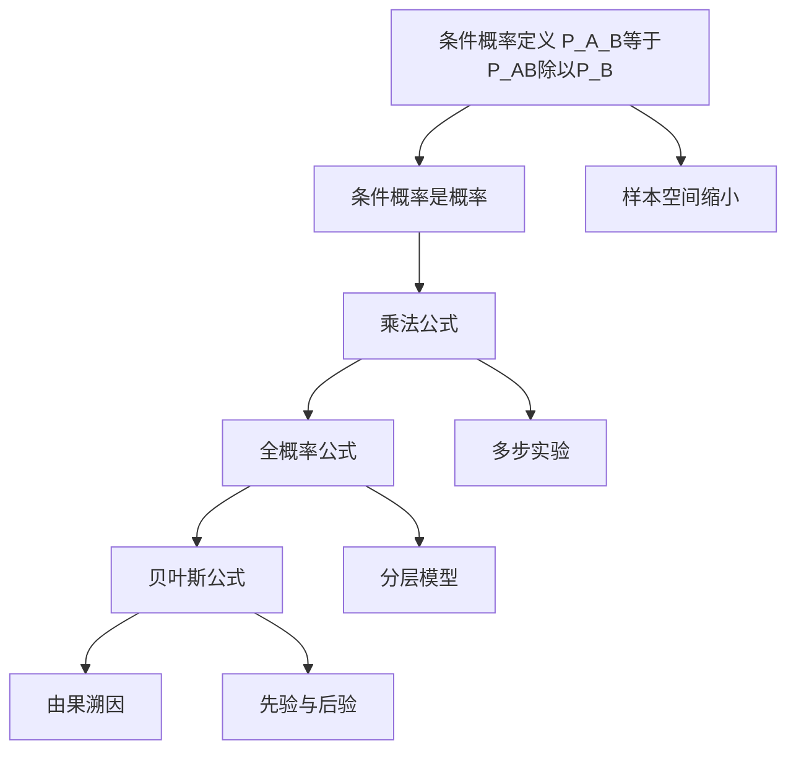

# 1.4 条件概率

> [!abstract] 本节概览
> 本节引入==条件概率==的核心概念，并由此推导出三大重要公式：==乘法公式==、==全概率公式==和==贝叶斯公式==。这三大公式是概率论中最常用的计算工具，贯穿整个学科。
>
> **逻辑链条**：条件概率定义 → 条件概率是概率 → 乘法公式（求事件交的概率）→ 全概率公式（求复杂事件的概率）→ 贝叶斯公式（求条件概率/后验概率）
>
> **前置依赖**：[[1.1 随机事件及其运算]]（事件运算、De Morgan 公式）、[[1.2 概率的定义及其确定方法|§1.2]]（Kolmogorov 公理）、[[1.3 概率的性质|§1.3]]（可加性、加法公式、容斥原理）
>
> **核心主线**：条件概率 $P(A|B)$ 是本节的出发点，它度量了"在 $B$ 发生的前提下 $A$ 发生的可能性"。乘法公式将交事件的概率分解为条件概率的乘积，全概率公式通过样本空间的分割将复杂事件化为简单事件，贝叶斯公式则实现了"由果溯因"的概率推理。

---

## 一、条件概率的定义

### 直观理解

条件概率的核心思想是==样本空间的缩小==：当已知事件 $B$ 发生时，我们不再关心 $B$ 之外的样本点，而只在 $B$ 内部考虑事件 $A$ 发生的可能性。

> [!example] 例 1.4.1 — 两孩家庭问题
> 考察有两个小孩的家庭，样本空间 $\Omega = \{bb, bg, gb, gg\}$（$b$ 男孩，$g$ 女孩，$bg$ 表示大的是男孩小的是女孩），每个样本点等可能。
>
> - 事件 $A$ = "至少有一个女孩"：$P(A) = \dfrac{3}{4}$
> - 事件 $B$ = "至少有一个男孩"：$P(B) = \dfrac{3}{4}$
> - 在 $B$ 发生条件下，$A$ 的条件概率：$P(A|B) = \dfrac{2}{3}$
>
> **解释**：$B$ 的发生排除了 $gg$，样本空间缩小为 $\Omega_B = \{bb, bg, gb\}$（3个样本点），其中 $A$ 含2个样本点，故 $P(A|B) = 2/3$。
>
> **关键观察**：$P(A|B) = 2/3 \neq P(A) = 3/4$，说明条件概率可以改变事件发生的可能性。

### 形式化定义

> [!def] 定义 1.4.1 — 条件概率
> 设 $A$ 与 $B$ 是样本空间 $\Omega$ 中的两事件，若 $P(B) > 0$，则称
> $$
> P(A|B) = \frac{P(AB)}{P(B)} \tag{1.4.1}
> $$
> 为"在 $B$ 发生下 $A$ 的条件概率"。

> [!example] 例 1.4.2 — 维恩图说明
> 设 $\Omega$ 含25个等可能样本点，$A$ 含15个，$B$ 含7个，$AB$ 含5个。
> $$
> P(A|B) = \frac{P(AB)}{P(B)} = \frac{5/25}{7/25} = \frac{5}{7}
> $$
> $$
> P(B|A) = \frac{P(AB)}{P(A)} = \frac{5/25}{15/25} = \frac{1}{3}
> $$
>
> **注意**：$P(A|B) \neq P(B|A)$，条件概率具有==方向性==。

---

## 二、条件概率的性质

> [!thm] 性质 1.4.1 — 条件概率是概率
> 若 $P(B) > 0$，则条件概率 $P(\cdot|B)$ 满足概率的三条公理：
> 1. $P(A|B) \geq 0$，$\forall A \in \mathcal{F}$
> 2. $P(\Omega|B) = 1$
> 3. 若 $A_1, A_2, \cdots$ 互不相容，则 $\displaystyle P\!\left(\bigcup_{n=1}^{\infty} A_n \Big| B\right) = \sum_{n=1}^{\infty} P(A_n|B)$

> [!abstract] 证明思路
> **证明 (性质 1.4.1)**：
>
> (1)(2) 由定义1.4.1直接可得。
>
> **[(3) 可列可加性]**：因为 $A_1, A_2, \cdots$ 互不相容，所以 $A_1 B, A_2 B, \cdots$ 也互不相容。由[[1.3 概率的性质|§1.3]]的可列可加性：
> $$
> P\!\left(\bigcup_{n=1}^{\infty} A_n \Big| B\right) = \frac{P\!\left(\left(\bigcup_{n=1}^{\infty} A_n\right)B\right)}{P(B)} = \frac{P\!\left(\bigcup_{n=1}^{\infty}(A_n B)\right)}{P(B)} = \frac{\sum_{n=1}^{\infty}P(A_n B)}{P(B)} = \sum_{n=1}^{\infty} P(A_n|B)
> $$
>
> $\square$

> [!tip] 重要推论
> 由于 $P(\cdot|B)$ 满足概率的三条公理，[[1.3 概率的性质|§1.3]]中推导的所有概率性质对条件概率都成立，例如：
> - $P(\bar{A}|B) = 1 - P(A|B)$
> - $P(A_1 \cup A_2|B) = P(A_1|B) + P(A_2|B) - P(A_1 A_2|B)$
> - $P(A_1 \cup A_2 \cup \cdots \cup A_n|B) \leq \sum_{i=1}^{n} P(A_i|B)$（Boole 不等式）

---

## 三、乘法公式

> [!thm] 性质 1.4.2 — 乘法公式
> (1) 若 $P(B) > 0$，则
> $$
> P(AB) = P(B)\,P(A|B) \tag{1.4.2}
> $$
>
> (2) 若 $P(A_1 A_2 \cdots A_{n-1}) > 0$，则
> $$
> P(A_1 A_2 \cdots A_n) = P(A_1)\,P(A_2|A_1)\,P(A_3|A_1 A_2)\cdots P(A_n|A_1 A_2 \cdots A_{n-1}) \tag{1.4.3}
> $$

> [!abstract] 证明思路
> **证明 (1.4.2)**：由条件概率定义 $P(A|B) = P(AB)/P(B)$，两边乘以 $P(B)$ 即得。
>
> **证明 (1.4.3)**：因为
> $$
> P(A_1) \geq P(A_1 A_2) \geq \cdots \geq P(A_1 A_2 \cdots A_{n-1}) > 0
> $$
> 所以(1.4.3)中所有条件概率均有意义，且右边等于：
> $$
> P(A_1) \cdot \frac{P(A_1 A_2)}{P(A_1)} \cdot \frac{P(A_1 A_2 A_3)}{P(A_1 A_2)} \cdots \frac{P(A_1 A_2 \cdots A_n)}{P(A_1 A_2 \cdots A_{n-1})} = P(A_1 A_2 \cdots A_n)
> $$
>
> 所有中间项==连锁约分==，最终只剩 $P(A_1 A_2 \cdots A_n)$。 $\square$

> [!example] 例 1.4.3 — 不合格品抽取
> 100个零件中10个不合格，一个一个取出（不放回），求第三次才取得不合格品的概率。
>
> **解**：设 $A_i$ = "第 $i$ 次取出不合格品"。所求为 $P(\bar{A}_1 \bar{A}_2 A_3)$。
>
> 由乘法公式(1.4.3)：
> $$
> P(\bar{A}_1 \bar{A}_2 A_3) = P(\bar{A}_1)\,P(\bar{A}_2|\bar{A}_1)\,P(A_3|\bar{A}_1 \bar{A}_2) = \frac{90}{100} \cdot \frac{89}{99} \cdot \frac{10}{98} = 0.0826
> $$

### 波利亚模型（罐子模型）

> [!example] 例 1.4.4 — 波利亚模型
> 罐中有 $b$ 个黑球、$r$ 个红球。每次取出一球后，放回并加入 $c$ 个同色球和 $d$ 个异色球。连续取三个球，其中两红一黑的概率是否依赖于取出次序？
>
> **一般公式**（以 $B_1 R_2 R_3$ 为例）：
> $$
> P(B_1 R_2 R_3) = \frac{b}{b+r} \cdot \frac{r+d}{b+r+c+d} \cdot \frac{r+d+c}{b+r+2c+2d}
> $$
>
> **四种特殊情况**：

| 模型 | 参数 | 三种排列的概率 | 结论 |
|------|------|---------------|------|
| 不返回抽样 | $c=-1, d=0$ | 均等于 $\dfrac{br(r-1)}{(b+r)(b+r-1)(b+r-2)}$ | 与次序无关 |
| 返回抽样 | $c=0, d=0$ | 均等于 $\dfrac{br^2}{(b+r)^3}$ | 与次序无关 |
| 传染病模型 | $c>0, d=0$ | 均等于 $\dfrac{br(r+c)}{(b+r)(b+r+c)(b+r+2c)}$ | 与次序无关 |
| 安全模型 | $c=0, d>0$ | 三种排列概率==不相等== | 与次序有关 |

> [!tip] 波利亚模型的核心结论
> 当 $d=0$ 时（只加同色球或取出不放回），==概率不依赖球的取出次序==。这个结论在很多概率问题中有重要应用，例如摸彩问题中"先摸后摸概率相同"。

---

## 四、全概率公式

### 样本空间的分割

> [!def] 样本空间的分割
> 设 $B_1, B_2, \cdots, B_n$ 是样本空间 $\Omega$ 中的一组事件，若满足：
> 1. **互不相容**：$B_i B_j = \varnothing$（$i \neq j$）
> 2. **完备性**：$\bigcup_{i=1}^{n} B_i = \Omega$
>
> 则称 $\{B_1, B_2, \cdots, B_n\}$ 为 $\Omega$ 的一个==分割==（partition）。

### 全概率公式

> [!thm] 性质 1.4.3 — 全概率公式
> 设 $B_1, B_2, \cdots, B_n$ 为 $\Omega$ 的一个分割，且 $P(B_i) > 0$（$i=1,2,\cdots,n$），则对任一事件 $A$：
> $$
> P(A) = \sum_{i=1}^{n} P(B_i)\,P(A|B_i) \tag{1.4.4}
> $$
>
> **最简形式**（二分割）：若 $0 < P(B) < 1$，则
> $$
> P(A) = P(B)\,P(A|B) + P(\bar{B})\,P(A|\bar{B}) \tag{1.4.5}
> $$

> [!abstract] 证明思路
> **证明 (1.4.4)**：
>
> **[事件分解]**：$A = A\Omega = A\!\left(\bigcup_{i=1}^{n} B_i\right) = \bigcup_{i=1}^{n}(AB_i)$
>
> 且 $AB_1, AB_2, \cdots, AB_n$ 互不相容（因为 $B_i$ 互不相容）。
>
> **[应用可加性]**：
> $$
> P(A) = P\!\left(\bigcup_{i=1}^{n}(AB_i)\right) = \sum_{i=1}^{n} P(AB_i)
> $$
>
> **[代入乘法公式]**：$P(AB_i) = P(B_i)\,P(A|B_i)$，代入即得(1.4.4)。 $\square$

> [!tip] 全概率公式的使用条件
> 分割条件可以放宽：$B_1, B_2, \cdots, B_n$ 互不相容，且 $A \subset \bigcup_{i=1}^{n} B_i$，全概率公式仍然成立。此外，分割可以是==可列个==事件。

> [!example] 例 1.4.5 — 摸彩模型
> $n$ 张彩票中1张可中奖，求第二人摸到中奖彩票的概率。
>
> **解**：设 $A_i$ = "第 $i$ 人摸到中奖彩票"。
>
> 由全概率公式(1.4.5)：
> $$
> P(A_2) = P(A_1)\,P(A_2|A_1) + P(\bar{A}_1)\,P(A_2|\bar{A}_1) = \frac{1}{n} \cdot 0 + \frac{n-1}{n} \cdot \frac{1}{n-1} = \frac{1}{n}
> $$
>
> **结论**：$P(A_1) = P(A_2) = \cdots = P(A_n) = \dfrac{1}{n}$，==摸到中奖彩票的机会与先后次序无关==。
>
> 一般地，若 $n$ 张彩票中有 $k$ 张可中奖，则每人中奖概率均为 $k/n$。

> [!example] 例 1.4.6 — 保险问题
> 投保人分两类：易出事故者（占20%，出事故概率0.4）和安全者（占80%，出事故概率0.1）。求新投保人一年内出事故的概率。
>
> **解**：$B$ = "易出事故者"，$A$ = "出事故"。
> $$
> P(A) = P(B)\,P(A|B) + P(\bar{B})\,P(A|\bar{B}) = 0.2 \times 0.4 + 0.8 \times 0.1 = 0.16
> $$

> [!example] 例 1.4.7 — 敏感性问题调查（Warner 随机化应答技术）
> 调查学生看过黄色书刊的比例 $p$。被调查者从罐中随机抽球：抽到白球回答"生日是否在7月1日前"（$P(\text{是}|\text{白球}) = 0.5$），抽到红球回答"是否看过黄色书刊"。
>
> 设红球比例为 $\pi$，$n$ 张答卷中 $k$ 张回答"是"，则由全概率公式：
> $$
> \frac{k}{n} = 0.5(1-\pi) + p \cdot \pi
> $$
>
> 解得：$\displaystyle p = \frac{k/n - 0.5(1-\pi)}{\pi}$
>
> **实际算例**：$\pi = 0.6$，$n = 1583$，$k = 389$，则 $p = 0.0762$（约7.62%）。

---

## 五、贝叶斯公式

### 公式与证明

> [!thm] 性质 1.4.4 — 贝叶斯公式
> 设 $B_1, B_2, \cdots, B_n$ 是 $\Omega$ 的一个分割，且 $P(A) > 0$，$P(B_i) > 0$（$i=1,2,\cdots,n$），则
> $$
> P(B_i|A) = \frac{P(B_i)\,P(A|B_i)}{\sum_{j=1}^{n} P(B_j)\,P(A|B_j)}, \quad i=1,2,\cdots,n \tag{1.4.6}
> $$

> [!abstract] 证明思路
> **证明 (1.4.6)**：
>
> **[分子]**：由乘法公式 $P(AB_i) = P(B_i)\,P(A|B_i)$
>
> **[分母]**：由全概率公式 $P(A) = \sum_{j=1}^{n} P(B_j)\,P(A|B_j)$
>
> **[合成]**：$P(B_i|A) = \dfrac{P(AB_i)}{P(A)} = \dfrac{P(B_i)\,P(A|B_i)}{\sum_{j=1}^{n} P(B_j)\,P(A|B_j)}$ $\square$

> [!tip] 先验概率与后验概率
> - $P(B_i)$：$B_i$ 的==先验概率==（prior probability），在观测到 $A$ 之前对 $B_i$ 的信念
> - $P(B_i|A)$：$B_i$ 的==后验概率==（posterior probability），在观测到 $A$ 之后对 $B_i$ 的修正信念
> - 贝叶斯公式实现了"==由果溯因=="：已知结果 $A$ 发生了，反推哪个原因 $B_i$ 更可能

### 例题

> [!example] 例 1.4.8 — 肝癌普查问题
> 某地区肝癌发病率0.0004，甲胎蛋白法普查：患肝癌者99%呈阳性，未患肝癌者99.9%呈阴性。某人检查呈阳性，真患肝癌的概率？
>
> **解**：$B$ = "患肝癌"，$A$ = "阳性"。
>
> $$
> P(B) = 0.0004, \quad P(A|B) = 0.99, \quad P(A|\bar{B}) = 0.001
> $$
>
> 由贝叶斯公式：
> $$
> P(B|A) = \frac{0.0004 \times 0.99}{0.0004 \times 0.99 + 0.9996 \times 0.001} = \frac{0.000396}{0.001396} \approx 0.284
> $$
>
> **直观理解**：10000人中约4人患肝癌（真阳性约3.96人），9996人不患（假阳性约9.996人）。阳性者中真患肝癌仅占约28.4%。
>
> **复查效果**：对阳性人群复查，先验概率更新为 $P(B) = 0.284$：
> $$
> P(B|A) = \frac{0.284 \times 0.99}{0.284 \times 0.99 + 0.716 \times 0.001} \approx 0.997
> $$
>
> ==复查大幅提高准确率==：从28.4%跃升至99.7%。

> [!example] 例 1.4.9 — 孩子与狼（贝叶斯信任更新）
> 用贝叶斯公式分析村民对小孩信任度的下降过程。
>
> **初始先验**：$P(B) = 0.8$（可信），$P(\bar{B}) = 0.2$（不可信）
>
> **条件概率**：$P(A|B) = 0.1$（可信小孩说谎），$P(A|\bar{B}) = 0.5$（不可信小孩说谎）
>
> **第一次说谎后**：
> $$
> P(B|A) = \frac{0.8 \times 0.1}{0.8 \times 0.1 + 0.2 \times 0.5} = 0.444
> $$
>
> **第二次说谎后**（以 $P(B) = 0.444$ 为新先验）：
> $$
> P(B|A) = \frac{0.444 \times 0.1}{0.444 \times 0.1 + 0.556 \times 0.5} = 0.138
> $$
>
> 信任度：$0.8 \to 0.444 \to 0.138$，==每次说谎都会指数级降低信任度==。

### 三个公式的功能总结

| 公式 | 功能 | 典型应用 |
|------|------|---------|
| 乘法公式 | 求事件==交==的概率 $P(AB)$ | 多步实验、不放回抽样 |
| 全概率公式 | 求==复杂事件==的概率 $P(A)$ | 分层模型、多原因导致同一结果 |
| 贝叶斯公式 | 求==条件概率== $P(B_i|A)$（由果溯因） | 诊断、检测、信任更新 |

---

## 六、知识结构总览

---

## 七、核心思想与证明技巧

> [!success] 核心思想
> 1. **样本空间缩小**：条件概率的本质是将样本空间从 $\Omega$ 缩小到 $B$，在缩小后的空间中重新度量事件 $A$
> 2. **连锁约分**：乘法公式的证明核心是中间项连锁约分，最终只剩 $P(A_1 A_2 \cdots A_n)$
> 3. **分而治之**：全概率公式通过分割将复杂事件化为简单事件的加权平均
> 4. **由果溯因**：贝叶斯公式是"逆概率"推理，从观测结果反推原因
> 5. **信任更新**：贝叶斯公式的迭代使用可以实现信任度的动态更新（先验→后验→新先验→新后验）

> [!tip] 证明技巧清单
> 1. **连锁约分法**：乘法公式(1.4.3)的证明
> 2. **事件分解法**：全概率公式中 $A = \bigcup_{i}(AB_i)$ 的分解
> 3. **分子分母分别处理**：贝叶斯公式中分子用乘法公式、分母用全概率公式
> 4. **对称性论证**：波利亚模型中 $d=0$ 时概率与次序无关的证明
> 5. **迭代更新法**：贝叶斯信任更新中用后验概率作为新的先验概率

---

## 八、补充理解与易混淆点

### 条件概率的方向性

**来源**：教材p37（例1.4.1）、MIT OCW 6.041 Lecture 4

> [!danger] 误区1："P(A|B) = P(B|A)"
> ❌ 错误解释：条件概率的两个事件可以随意交换位置
>
> ✅ 正确解释：$P(A|B) = P(AB)/P(B)$，$P(B|A) = P(AB)/P(A)$，两者==仅在 $P(A) = P(B)$ 时相等==。例1.4.1中 $P(A|B) = 2/3$，$P(B|A) = 2/3$（碰巧相等），但例1.4.2中 $P(A|B) = 5/7 \neq P(B|A) = 1/3$。==混淆 $P(A|B)$ 和 $P(B|A)$ 是概率论中最常见的错误之一==，在医学检测中尤其危险（将"患病者阳性的概率"与"阳性者患病的概率"混为一谈）。

### 条件概率与无条件概率的关系

**来源**：教材p37、华东师范大学概率论讲义

> [!danger] 误区2："P(A|B) 一定大于等于 P(A)"
> ❌ 错误解释：已知 $B$ 发生，$A$ 发生的可能性不会变小
>
> ✅ 正确解释：$P(A|B)$ 可以大于、小于或等于 $P(A)$，三种情况都有可能。$P(A|B) > P(A)$ 说明 $B$ 的发生"促进"了 $A$（正相关性），$P(A|B) < P(A)$ 说明 $B$ 的发生"抑制"了 $A$（负相关性），$P(A|B) = P(A)$ 说明 $A$ 与 $B$ 无关（独立性）。没有额外信息时，不能对 $P(A|B)$ 和 $P(A)$ 的大小关系做出任何判断。

### 全概率公式的分割条件

**来源**：教材p40（注意事项）、UCLA Stats 100A Lecture Notes

> [!danger] 误区3："全概率公式中分割必须穷尽整个样本空间"
> ❌ 错误解释：$B_1, B_2, \cdots, B_n$ 必须满足 $\bigcup_{i=1}^{n} B_i = \Omega$
>
> ✅ 正确解释：全概率公式的分割条件可以==放宽==。实际上只需要：
> 1. $B_1, B_2, \cdots, B_n$ 互不相容
> 2. $A \subset \bigcup_{i=1}^{n} B_i$（$A$ 被分割完全覆盖）
>
> 不需要 $\bigcup_{i=1}^{n} B_i = \Omega$。此外，分割也可以是可列个事件。这个放宽在实际应用中很有用——我们只需要关心与事件 $A$ 相关的那些"原因"。

### 贝叶斯公式中先验概率的作用

**来源**：教材p43-44（例1.4.8）、Stanford Stat 116 Lecture Notes

> [!danger] 误区4："先验概率的选择不影响贝叶斯公式的结论"
> ❌ 错误解释：无论先验概率如何设定，贝叶斯公式都会给出正确的后验概率
>
> ✅ 正确解释：先验概率对后验概率有==决定性影响==。在例1.4.8中，如果肝癌发病率从0.0004变为0.01（提高25倍），则 $P(B|A)$ 会从28.4%大幅提升。==先验概率反映了我们在观测数据之前对事件的主观信念，不同的先验会导致完全不同的后验结论==。这也是贝叶斯统计学中"先验选择"问题备受关注的原因。

### 独立性与条件概率

**来源**：教材性质1.4.1、2015 中山大学 432 真题

> [!danger] 误区5："A 与 B 独立等价于 P(A|B) = P(A)"
> ❌ 错误解释：这个等价关系无条件成立
>
> ✅ 正确解释："$A$ 与 $B$ 独立 $\Leftrightarrow$ $P(A|B) = P(A)$"这个等价关系==仅在 $P(B) > 0$ 时成立==。当 $P(B) = 0$ 时，$P(A|B)$ 无定义，但 $A$ 与 $B$ 仍然可以独立（因为 $P(AB) = 0 = P(A) \cdot 0 = P(A)P(B)$）。严格来说，独立性的定义是 $P(AB) = P(A)P(B)$（不依赖条件概率），而 $P(A|B) = P(A)$ 只是在 $P(B) > 0$ 时的等价表述。

### "至少一个"条件概率的样本空间陷阱

**来源**：教材p37（例1.4.1第(2)问）、2020 复旦大学 432 真题

> [!danger] 误区6："已知至少一个女孩，另一个也是女孩的概率是1/2"
> ❌ 错误解释：两个小孩中已知至少一个女孩，另一个孩子性别独立，所以概率是1/2
>
> ✅ 正确解释：在例1.4.1中，"至少一个女孩"对应样本空间 $\{bg, gb, gg\}$（3个样本点），"两个都是女孩"对应 $\{gg\}$（1个样本点），所以概率是 $1/3$ 而非 $1/2$。==直觉错误的原因是混淆了"指定某个孩子是女孩"和"至少一个孩子是女孩"这两个不同的条件==。前者将样本空间缩小为2个样本点（概率1/2），后者缩小为3个样本点（概率1/3）。

---

## 九、习题精选

> [!todo] 本节习题
>
> | 编号 | 标题 | 核心考点 | 难度 | 来源 |
> |------|------|---------|------|------|
> | 1 | 考试不及格条件概率 | 条件概率基本计算 | ★☆☆ | 教材习题1.4-1 |
> | 2 | 已知一件不合格求另一件 | 条件概率+古典概型 | ★★☆ | 教材习题1.4-5 |
> | 3 | 乘法公式+加法公式 | P(A),P(B|A),P(A|B)求P(A∪B) | ★★☆ | 教材习题1.4-8 |
> | 4 | 钥匙掉落寻找 | 全概率公式 | ★★☆ | 教材习题1.4-15 |
> | 5 | 两台车床不合格品 | 全概率+贝叶斯 | ★★★ | 教材习题1.4-16 |
> | 6 | 传球问题 | 全概率+差分方程 | ★★★ | 教材习题1.4-22 |
> | 7 | 条件概率基本计算 | P(A|B)公式 | ★☆☆ | 2014 兰州大学 432 |
> | 8 | 击落飞机概率 | 全概率+独立性 | ★★☆ | 2018 东北师范大学 432 |
> | 9 | 血液化验贝叶斯 | 贝叶斯公式 | ★★☆ | 2021 东北师范大学 432 |
> | 10 | Monty Hall三门问题 | 条件概率+全概率 | ★★★ | 2017 北师大 432 |

### 习题1：考试不及格条件概率

> [!problem] 习题1（教材习题1.4-1）
> 某班级数学不及格占8%，语文不及格占5%，两门都不及格占2%。
> (1) 已知一学生数学不及格，他语文也不及格的概率？
> (2) 已知一学生语文不及格，他数学也不及格的概率？

> [!faq]- 查看解答
> 设 $A$ = "数学不及格"，$B$ = "语文不及格"。
>
> 已知 $P(A) = 0.08$，$P(B) = 0.05$，$P(AB) = 0.02$。
>
> (1) $P(B|A) = \dfrac{P(AB)}{P(A)} = \dfrac{0.02}{0.08} = 0.25$
>
> (2) $P(A|B) = \dfrac{P(AB)}{P(B)} = \dfrac{0.02}{0.05} = 0.40$ $\square$

### 习题2：已知一件不合格求另一件

> [!problem] 习题2（教材习题1.4-5）
> 10件产品中有3件不合格品，从中任取两件，已知其中一件是不合格品，求另一件也是不合格品的概率。

> [!faq]- 查看解答
> 设 $A$ = "两件中至少一件不合格"，$B$ = "两件都不合格"。
>
> 所求为 $P(B|A) = P(B)/P(A)$（因为 $B \subset A$）。
>
> $$
> P(A) = 1 - P(\text{两件都合格}) = 1 - \frac{\binom{7}{2}}{\binom{10}{2}} = 1 - \frac{21}{45} = \frac{24}{45} = \frac{8}{15}
> $$
>
> $$
> P(B) = \frac{\binom{3}{2}}{\binom{10}{2}} = \frac{3}{45} = \frac{1}{15}
> $$
>
> $$P(B|A) = \frac{1/15}{8/15} = \frac{1}{8}$$ $\square$

### 习题3：乘法公式+加法公式

> [!problem] 习题3（教材习题1.4-8）
> 已知 $P(A) = 1/3$，$P(B|A) = 1/4$，$P(A|B) = 1/6$，求 $P(A \cup B)$。

> [!faq]- 查看解答
> 由乘法公式：$P(AB) = P(A)\,P(B|A) = \dfrac{1}{3} \times \dfrac{1}{4} = \dfrac{1}{12}$
>
> 由 $P(A|B) = P(AB)/P(B)$：$P(B) = \dfrac{P(AB)}{P(A|B)} = \dfrac{1/12}{1/6} = \dfrac{1}{2}$
>
> 由加法公式：
> $$P(A \cup B) = P(A) + P(B) - P(AB) = \frac{1}{3} + \frac{1}{2} - \frac{1}{12} = \frac{4}{12} + \frac{6}{12} - \frac{1}{12} = \frac{9}{12} = \frac{3}{4}$$ $\square$

### 习题4：钥匙掉落寻找

> [!problem] 习题4（教材习题1.4-15）
> 钥匙掉在宿舍里、教室里、路上的概率分别为50%、30%和20%，掉在上述三处被找到的概率分别为0.8、0.3和0.1。求找到钥匙的概率。

> [!faq]- 查看解答
> 设 $B_1, B_2, B_3$ 分别表示钥匙掉在宿舍、教室、路上，$A$ = "找到钥匙"。
>
> 由全概率公式：
> $$
> P(A) = P(B_1)\,P(A|B_1) + P(B_2)\,P(A|B_2) + P(B_3)\,P(A|B_3)
> $$
> $$= 0.5 \times 0.8 + 0.3 \times 0.3 + 0.2 \times 0.1 = 0.40 + 0.09 + 0.02 = 0.51$$ $\square$

### 习题5：两台车床不合格品

> [!problem] 习题5（教材习题1.4-16）
> 两台车床加工同样零件，第一台不合格品概率0.03，第二台0.06，第一台加工量是第二台的2倍。
> (1) 任取一件是合格品的概率？
> (2) 取到不合格品，是第二台加工的概率？

> [!faq]- 查看解答
> 设 $B_1$ = "第一台加工"，$B_2$ = "第二台加工"，$A$ = "不合格品"。
>
> $P(B_1) = 2/3$，$P(B_2) = 1/3$，$P(A|B_1) = 0.03$，$P(A|B_2) = 0.06$。
>
> (1) 由全概率公式：
> $$
> P(A) = \frac{2}{3} \times 0.03 + \frac{1}{3} \times 0.06 = 0.02 + 0.02 = 0.04
> $$
> $$
> P(\bar{A}) = 1 - 0.04 = 0.96
> $$
>
> (2) 由贝叶斯公式：
> $$P(B_2|A) = \frac{P(B_2)\,P(A|B_2)}{P(A)} = \frac{(1/3) \times 0.06}{0.04} = \frac{0.02}{0.04} = 0.5$$ $\square$

### 习题6：传球问题

> [!problem] 习题6（教材习题1.4-22）
> $m$ 个人相互传球，球从甲手中开始传出，每次等可能传给其余 $m-1$ 人。求第 $n$ 次传球时仍由甲传出的概率。

> [!faq]- 查看解答
> 设 $p_n$ = "第 $n$ 次由甲传出"的概率。
>
> **建立递推关系**：第 $n$ 次由甲传出有两种情况：
> - 第 $n-1$ 次不是甲传出（概率 $1-p_{n-1}$），然后传给甲（概率 $1/(m-1)$）
> - 第 $n-1$ 次是甲传出（概率 $p_{n-1}$），然后不传给甲（不可能，因为甲不能再传给自己）
>
> $$
> p_n = (1-p_{n-1}) \cdot \frac{1}{m-1}
> $$
>
> **求解差分方程**：令 $q_n = p_n - \dfrac{1}{m}$，则
> $$
> q_n = -\frac{1}{m-1}\,q_{n-1}
> $$
>
> 由 $p_1 = 1$（第一次甲传出），$q_1 = 1 - 1/m = (m-1)/m$，故
> $$
> q_n = \left(-\frac{1}{m-1}\right)^{n-1} \cdot \frac{m-1}{m}
> $$
>
> $$
> p_n = \frac{1}{m} + \frac{1}{m}\left(-\frac{1}{m-1}\right)^{n-1}
> $$
>
> 当 $n \to \infty$ 时，$p_n \to 1/m$（趋于均匀分布）。 $\square$

### 习题7：条件概率基本计算

> [!problem] 习题7（2014 兰州大学 432）
> 已知 $P(A) = 0.1$，$P(B|A) = 0.9$，$P(B|A^c) = 0.2$，求 $P(A|B)$。

> [!faq]- 查看解答
> 由乘法公式：$P(AB) = P(A)\,P(B|A) = 0.1 \times 0.9 = 0.09$
>
> 由全概率公式：$P(B) = P(A)\,P(B|A) + P(A^c)\,P(B|A^c) = 0.09 + 0.9 \times 0.2 = 0.09 + 0.18 = 0.27$
>
> $$P(A|B) = \frac{P(AB)}{P(B)} = \frac{0.09}{0.27} = \frac{1}{3}$$ $\square$

### 习题8：击落飞机概率

> [!problem] 习题8（2018 东北师范大学 432）
> 对飞机进行三次独立射击，命中率分别为0.4、0.5、0.7。击中1次坠落概率0.2，击中2次坠落概率0.6，击中3次必坠落。求击落飞机的概率。

> [!faq]- 查看解答
> 设 $A_i$ = "恰好击中 $i$ 次"（$i=1,2,3$），$B$ = "飞机坠落"。
>
> 计算各 $P(A_i)$（三次射击独立，命中率分别为 $p_1=0.4, p_2=0.5, p_3=0.7$）：
>
> $$
> P(A_1) = 0.4 \times 0.5 \times 0.3 + 0.6 \times 0.5 \times 0.3 + 0.6 \times 0.5 \times 0.7 = 0.36
> $$
> $$
> P(A_2) = 0.4 \times 0.5 \times 0.3 + 0.4 \times 0.5 \times 0.7 + 0.6 \times 0.5 \times 0.7 = 0.41
> $$
> $$
> P(A_3) = 0.4 \times 0.5 \times 0.7 = 0.14
> $$
>
> 由全概率公式：
> $$P(B) = 0.36 \times 0.2 + 0.41 \times 0.6 + 0.14 \times 1 = 0.072 + 0.246 + 0.14 = 0.458$$ $\square$

### 习题9：血液化验贝叶斯

> [!problem] 习题9（2021 东北师范大学 432）
> 血液化验95%检出患病者（阳性），2%假阳性。患病率0.5%。阳性者真患病的概率？

> [!faq]- 查看解答
> 设 $A$ = "患病"，$B$ = "阳性"。
>
> $P(A) = 0.005$，$P(B|A) = 0.95$，$P(B|A^c) = 0.02$。
>
> $$
> P(B) = 0.005 \times 0.95 + 0.995 \times 0.02 = 0.00475 + 0.0199 = 0.02465
> $$
>
> $$
> P(A|B) = \frac{0.005 \times 0.95}{0.02465} = \frac{0.00475}{0.02465} \approx 0.1927
> $$
>
> **结论**：阳性者中仅约19.27%真患病——==假阳性数量远超真阳性==，这是因为患病率极低（0.5%），导致大量健康人的假阳性"淹没"了真正的患者。 $\square$

### 习题10：Monty Hall 三门问题

> [!problem] 习题10（2017 北师大 432）
> 三扇门后有两头羊和一辆车。你随机选A门（得车概率1/3）。主持人（知道车在哪）打开B或C中的一扇羊门。你要不要换门？

> [!faq]- 查看解答
> **应该换门**。
>
> 设 $X$ = "换门得车"，$Y$ = "主持人打开一扇羊门"。
>
> **关键分析**：主持人知道车的位置，所以无论车在哪扇门后，他都能打开一扇羊门，因此 $P(Y) = 1$。
>
> **计算 $P(X \cap Y)$**：
> - 车在A门后（概率1/3）：换门不得车，$P(X|Y, \text{Car}_A) = 0$
> - 车在B门后（概率1/3）：主持人开C门，换门到B得车，$P(X|Y, \text{Car}_B) = 1$
> - 车在C门后（概率1/3）：主持人开B门，换门到C得车，$P(X|Y, \text{Car}_C) = 1$
>
> $$
> P(X \cap Y) = \frac{1}{3} \times 0 + \frac{1}{3} \times 1 + \frac{1}{3} \times 1 = \frac{2}{3}
> $$
>
> $$
> P(X|Y) = \frac{P(X \cap Y)}{P(Y)} = \frac{2/3}{1} = \frac{2}{3}
> $$
>
> **结论**：换门得车概率2/3，不换门仅1/3。==换门使获胜概率翻倍==。
>
> **直觉解释**：你选A门时，车在A门的概率1/3，在"B或C"的概率2/3。主持人打开一扇羊门，并没有改变"B或C"中有车的概率（2/3），只是将这个概率集中到了剩下那扇未开的门上。 $\square$

---

## 十、教材原文

#学习/概率论与统计/第一章 随机事件与概率/条件概率
