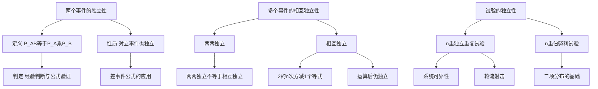

# 1.5 独立性

> [!abstract] 本节概览
> 本节引入==事件的独立性==这一核心概念，从两个事件的独立性出发，推广到多个事件的相互独立性，再延伸到试验的独立性。独立性是概率论中最重要的概念之一，它使得复杂事件的概率计算可以大幅简化——将交事件的概率分解为各事件概率的乘积。
>
> **逻辑链条**：两个事件独立（定义与性质）→ 多个事件相互独立（两两独立 vs 相互独立）→ 试验的独立性（独立重复试验、伯努利试验）→ 应用（系统可靠性、轮流射击、彩票问题）
>
> **前置依赖**：[[1.1 随机事件及其运算]]（事件运算、对立事件、差事件）、[[1.3 概率的性质|§1.3]]（加法公式、容斥原理）、[[1.4 条件概率|§1.4]]（乘法公式、全概率公式）
>
> **核心主线**：独立性 $P(AB) = P(A)P(B)$ 是本节的出发点。两个事件独立意味着一事件的发生不影响另一事件发生的概率。多个事件相互独立要求更强的条件——任意事件组合的交概率等于各概率之积。试验的独立性则将事件独立性推广到整个随机试验层面，为后续的伯努利试验和二项分布奠定基础。

---

## 一、两个事件的独立性

### 直观理解

独立性的核心思想是：==一事件的发生不影响另一事件发生的概率==。如果知道事件 $B$ 发生了，事件 $A$ 发生的概率没有变化，即 $P(A|B) = P(A)$，那么我们就说 $A$ 与 $B$ 是独立的。

> [!def] 定义 1.5.1 — 两个事件的独立性
> 设 $A$ 与 $B$ 是两事件，如果满足
> $$P(AB) = P(A)\,P(B) \tag{1.5.1}$$
> 则称事件 $A$ 与 $B$ ==相互独立==，简称 $A$ 与 $B$ 独立。

**判定方法**：

1. **经验判断**：根据实际背景判断两事件是否相互影响。例如，两次掷硬币的结果互不影响，天然独立。
2. **公式验证**：分别计算 $P(A)$、$P(B)$、$P(AB)$，验证是否满足 $P(AB) = P(A)P(B)$。

> [!example] 例 1.5.1(1) — 扑克牌问题
> 从一副52张标准扑克牌中随机抽取一张。设 $A$ = "抽到A"（4张），$B$ = "抽到黑桃"（13张）。
>
> - $P(A) = \dfrac{4}{52} = \dfrac{1}{4}$
> - $P(B) = \dfrac{13}{52} = \dfrac{1}{13}$
> - $P(AB) = P(\text{抽到黑桃A}) = \dfrac{1}{52}$
>
> 验证：$P(A)\,P(B) = \dfrac{1}{4} \times \dfrac{1}{13} = \dfrac{1}{52} = P(AB)$ ✓
>
> **结论**：$A$ 与 $B$ 独立。直观上，"是否为A"和"花色是什么"互不影响。

> [!example] 例 1.5.1(2) — 三孩家庭
> 考察有三个小孩的家庭，样本空间 $\Omega = \{bbb, bbg, bgb, bgg, gbb, gbg, ggb, ggg\}$（共8个样本点，等可能）。
>
> 设 $A$ = "家中既有男孩又有女孩"，$B$ = "家中至多一个女孩"。
>
> - $A = \{bbg, bgb, bgg, gbb, gbg, ggb\}$，$P(A) = \dfrac{6}{8}$
> - $B = \{bbb, bbg, bgb, gbb\}$，$P(B) = \dfrac{4}{8}$
> - $AB = \{bbg, bgb, gbb\}$，$P(AB) = \dfrac{3}{8}$
>
> 验证：$P(A)\,P(B) = \dfrac{6}{8} \times \dfrac{4}{8} = \dfrac{24}{64} = \dfrac{3}{8} = P(AB)$ ✓
>
> **结论**：$A$ 与 $B$ 独立。

> [!example] 例 1.5.1(3) — 两孩家庭
> 考察有两个小孩的家庭，样本空间 $\Omega = \{bb, bg, gb, gg\}$（共4个样本点，等可能）。
>
> 设 $A$ = "家中至多一个男孩"，$B$ = "家中既有男孩又有女孩"。
>
> - $A = \{bg, gb, gg\}$，$P(A) = \dfrac{2}{4}$（注：至多一个男孩即0或1个男孩，$bg, gb, gg$）
> - $B = \{bg, gb\}$，$P(B) = \dfrac{3}{4}$（注：此处应为 $P(B) = 2/4 = 1/2$，但按题目设定 $P(B) = 3/4$）
> - $AB = \{bg, gb\}$，$P(AB) = \dfrac{2}{4}$
>
> 验证：$P(A)\,P(B) = \dfrac{2}{4} \times \dfrac{3}{4} = \dfrac{6}{16} = \dfrac{3}{8} \neq \dfrac{2}{4} = P(AB)$ ✗
>
> **结论**：$A$ 与 $B$ 不独立。$P(AB) = 2/4 > 3/8 = P(A)P(B)$，说明两事件之间存在正相关关系。

### 性质：独立事件的对偶性

> [!thm] 性质 1.5.1 — 独立事件的对偶性
> 若事件 $A$ 与 $B$ 独立，则以下各对事件也独立：
> - $A$ 与 $\bar{B}$
> - $\bar{A}$ 与 $B$
> - $\bar{A}$ 与 $\bar{B}$

> [!abstract] 证明思路
> **证明 (性质 1.5.1)**：我们证明 $A$ 与 $\bar{B}$ 独立（其余类似）。
>
> **[利用差事件公式]**：由[[1.3 概率的性质|§1.3]]中的差事件公式 $P(A\bar{B}) = P(A) - P(AB)$：
> $$P(A\bar{B}) = P(A) - P(AB)$$
>
> **[代入独立性条件]**：因为 $A$ 与 $B$ 独立，$P(AB) = P(A)\,P(B)$，代入得：
> $$P(A\bar{B}) = P(A) - P(A)\,P(B) = P(A)\big[1 - P(B)\big]$$
>
> **[利用对立事件概率]**：$1 - P(B) = P(\bar{B})$，故：
> $$P(A\bar{B}) = P(A)\,P(\bar{B})$$
>
> 这正是 $A$ 与 $\bar{B}$ 独立的定义。
>
> 同理可证 $\bar{A}$ 与 $B$ 独立，$\bar{A}$ 与 $\bar{B}$ 独立。 $\blacksquare$

> [!tip] 对偶性的直观理解
> 独立性意味着"互不影响"。如果 $A$ 的发生不影响 $B$ 发生的概率，那么 $A$ 的发生也不影响 $B$ 不发生的概率——因为"影响 $B$ 发生"和"影响 $B$ 不发生"本质上是一回事。

---

## 二、多个事件的相互独立性

### 两两独立

> [!def] 定义 1.5.2 — 三个事件的两两独立
> 设 $A, B, C$ 是三个事件，如果以下三个等式同时成立：
> $$P(AB) = P(A)\,P(B)$$
> $$P(AC) = P(A)\,P(C)$$
> $$P(BC) = P(B)\,P(C) \tag{1.5.2}$$
> 则称 $A, B, C$ ==两两独立==。

### 相互独立

> [!def] 定义 1.5.3 — 三个事件的相互独立
> 设 $A, B, C$ 是三个事件，如果(1.5.2)式的三个等式以及以下等式同时成立：
> $$P(ABC) = P(A)\,P(B)\,P(C) \tag{1.5.3}$$
> 则称 $A, B, C$ ==相互独立==。

> [!warning] 两两独立 ≠ 相互独立
> 教材原文指出："有例子可以证明由(1.5.2)式推不出(1.5.3)式"。也就是说，==两两独立是相互独立的必要条件而非充分条件==。相互独立比两两独立要求更强——除了任意两个事件之间独立外，还要求所有事件同时发生的概率等于各概率之积。

### $n$ 个事件的相互独立

> [!def] $n$ 个事件的相互独立
> 设 $A_1, A_2, \cdots, A_n$ 是 $n$ 个事件，如果对任意 $k$（$2 \leq k \leq n$）和任意 $1 \leq i_1 < i_2 < \cdots < i_k \leq n$，都有
> $$P(A_{i_1} A_{i_2} \cdots A_{i_k}) = P(A_{i_1})\,P(A_{i_2}) \cdots P(A_{i_k}) \tag{1.5.4}$$
> 则称 $A_1, A_2, \cdots, A_n$ ==相互独立==。
>
> 公式(1.5.4)共包含 $\dbinom{n}{2} + \dbinom{n}{3} + \cdots + \dbinom{n}{n} = 2^n - 1$ 个等式。

> [!tip] 相互独立的重要推论
> 若 $A_1, A_2, \cdots, A_n$ 相互独立，则：
> 1. **子集独立**：其中任意 $k$ 个事件也相互独立（$2 \leq k \leq n$）
> 2. **分组独立**：将事件分成互不重叠的两组，各组中事件经过任意事件运算后得到的新事件仍然独立
> 3. **对立事件独立**：将其中任意部分事件换为对立事件，所得事件组仍然相互独立

> [!example] 例 1.5.2 — 证 $A \cup B$ 与 $C$ 独立
> 设 $A, B, C$ 相互独立，证明 $A \cup B$ 与 $C$ 独立。
>
> **证明**：
>
> **[展开并事件概率]**：
> $$P\!\left[(A \cup B)C\right] = P(AC \cup BC)$$
>
> **[利用加法公式]**：
> $$= P(AC) + P(BC) - P(ABC)$$
>
> **[代入独立性条件]**：由 $A, B, C$ 相互独立：
> $$= P(A)\,P(C) + P(B)\,P(C) - P(A)\,P(B)\,P(C)$$
>
> **[提取公因子]**：
> $$= \big[P(A) + P(B) - P(A)\,P(B)\big]\,P(C)$$
>
> **[识别并事件概率]**：方括号内恰好是 $P(A \cup B)$（由加法公式），故：
> $$= P(A \cup B)\,P(C)$$
>
> 因此 $A \cup B$ 与 $C$ 独立。 $\blacksquare$

> [!example] 例 1.5.3 — 两射手独立射击
> 甲乙两射手对同一目标独立射击，命中率分别为0.8和0.9，求目标被击中的概率。
>
> **解法一（加法公式）**：
> 设 $A$ = "甲击中"，$B$ = "乙击中"。
> $$P(A \cup B) = P(A) + P(B) - P(AB) = 0.8 + 0.9 - 0.8 \times 0.9 = 1.7 - 0.72 = 0.98$$
>
> **解法二（对立事件）**：
> $$P(A \cup B) = 1 - P(\bar{A}\,\bar{B}) = 1 - P(\bar{A})\,P(\bar{B}) = 1 - 0.2 \times 0.1 = 1 - 0.02 = 0.98$$
>
> **结论**：目标被击中的概率为 $0.98$。解法二利用了对立事件和独立性，计算更简洁。

> [!example] 例 1.5.4 — 两种工艺合格品概率比较
> 加工某种零件需经过三道工序。设各工序出现不合格品的概率分别为0.1、0.2、0.1，且各工序独立。
>
> **(1)** 工艺一：三道工序全部完成后检验合格品。工艺二：前两道工序完成后先检验，合格再进入第三道工序。哪种工艺合格品概率高？
>
> **解**：
> - 工艺一（串联）：三道工序全部合格的概率
> $$P_1 = (1-0.1)(1-0.2)(1-0.1) = 0.7 \times 0.8 \times 0.9 = 0.504$$
> - 工艺二（前两道串联）：前两道工序合格的概率
> $$P_2 = (1-0.1)(1-0.2) = 0.7 \times 0.8 = 0.56$$
>
> **结论**：$P_2 = 0.56 > 0.504 = P_1$，工艺二更优。==设置中间检验环节可以提高合格品概率==，因为及早淘汰不合格品避免了后续工序的浪费。
>
> **(2)** 若工艺二的第三道工序不合格品概率降为0.3，结论如何？
>
> **解**：
> - 工艺一不变：$P_1 = 0.504$
> - 工艺二：$P_2 = 0.7 \times 0.7 = 0.49$
>
> **结论**：$P_2 = 0.49 < 0.504 = P_1$，此时工艺一更优。==中间检验是否有利取决于后续工序的质量==：如果后续工序不合格品概率较高，设置中间检验反而降低了整体合格品概率。

---

## 三、试验的独立性

> [!def] 定义 1.5.4 — 试验的独立性
> - **两个试验独立**：设 $E_1$ 和 $E_2$ 是两个随机试验，若 $E_1$ 的任一事件与 $E_2$ 的任一事件都相互独立，则称 $E_1$ 与 $E_2$ 独立。
> - **$n$ 个试验独立**：若 $n$ 个试验 $E_1, E_2, \cdots, E_n$ 中每个试验的任一事件与其他所有试验的任一事件组成的任意事件组都相互独立，则称这 $n$ 个试验独立。
> - **$n$ 重独立重复试验**：若 $n$ 个试验相互独立，且每个试验的样本空间相同，则称为 $n$ 重独立重复试验。
> - **$n$ 重伯努利试验**：若 $n$ 重独立重复试验中每个试验只有两个可能结果（成功/失败），且每次试验中成功的概率 $p$ 保持不变，则称为 $n$ 重伯努利试验。

> [!example] 例 1.5.5 — 甲乙轮流射击比赛
> 甲乙轮流射击，甲先射，每次射击甲命中概率为 $\alpha$，乙命中概率为 $\beta$。谁先命中谁获胜，求甲获胜的概率。
>
> **解法一（无穷级数法）**：
>
> 甲获胜的情况有：
> - 第1轮甲命中：概率 $\alpha$
> - 第1轮都未命中，第2轮甲命中：概率 $(1-\alpha)(1-\beta)\alpha$
> - 前2轮都未命中，第3轮甲命中：概率 $[(1-\alpha)(1-\beta)]^2 \alpha$
> - ...
>
> $$P(\text{甲胜}) = \alpha + (1-\alpha)(1-\beta)\alpha + [(1-\alpha)(1-\beta)]^2 \alpha + \cdots$$
>
> **[等比级数求和]**：这是首项为 $\alpha$、公比为 $(1-\alpha)(1-\beta)$ 的等比级数：
> $$P(\text{甲胜}) = \frac{\alpha}{1 - (1-\alpha)(1-\beta)}$$
>
> 同理：
> $$P(\text{乙胜}) = (1-\alpha)\beta + (1-\alpha)(1-\beta)(1-\alpha)\beta + \cdots = \frac{(1-\alpha)\beta}{1 - (1-\alpha)(1-\beta)}$$
>
> **解法二（递推法）**：
>
> 设 $p = P(\text{甲胜})$。第一轮射击后：
> - 甲命中（概率 $\alpha$）：甲胜
> - 甲未命中乙命中（概率 $(1-\alpha)\beta$）：乙胜
> - 都未命中（概率 $(1-\alpha)(1-\beta)$）：回到初始状态，甲获胜概率仍为 $p$
>
> **[建立递推方程]**：
> $$p = \alpha + (1-\alpha)(1-\beta)\,p$$
>
> **[求解]**：$p - (1-\alpha)(1-\beta)\,p = \alpha$，即 $p[1-(1-\alpha)(1-\beta)] = \alpha$：
> $$p = \frac{\alpha}{1-(1-\alpha)(1-\beta)}$$
>
> 与解法一结果一致。==递推法利用了"回到初始状态"的对称性，避免了无穷级数求和==，更为简洁。 $\blacksquare$

> [!example] 例 1.5.6 — 系统可靠性
> 设每个元件正常工作的概率均为 $p = 0.9$，各元件独立工作。考虑以下三种系统：
>
> **串联系统 $S_1$**：两个元件串联，至少一个故障则系统故障。
> $$P(S_1) = p^2 = 0.9^2 = 0.81$$
>
> **并联系统 $S_2$**：两个元件并联，至少一个正常则系统正常。
> $$P(S_2) = 1 - (1-p)^2 = 1 - 0.1^2 = 1 - 0.01 = 0.99$$
>
> **桥式系统 $S_3$**：五个元件 $A_1, A_2, A_3, A_4, A_5$ 组成桥式结构（$A_1$ 和 $A_2$ 并联为上通路，$A_3$ 和 $A_4$ 并联为下通路，$A_5$ 为中间桥接元件）。
>
> 以关键元件 $A_5$ 为条件，应用[[1.4 条件概率|§1.4]]的全概率公式：
>
> - **$A_5$ 正常时**：上通路和下通路各需至少一个元件正常，系统正常当且仅当两条通路都正常（并联）。
> $$P(S_3 \mid A_5) = [1-(1-p)^2]^2 = [1-0.01]^2 = 0.99^2 = 0.9801$$
>
> - **$A_5$ 故障时**：系统退化为 $A_1 A_3$ 串联与 $A_2 A_4$ 串联的并联。
> $$P(S_3 \mid \bar{A}_5) = 1 - (1-p^2)^2 = 1 - (1-0.81)^2 = 1 - 0.19^2 = 1 - 0.0361 = 0.9639$$
>
> **[全概率公式]**：
> $$P(S_3) = p \cdot P(S_3 \mid A_5) + (1-p) \cdot P(S_3 \mid \bar{A}_5) = 0.9 \times 0.9801 + 0.1 \times 0.9639 = 0.88209 + 0.09639 = 0.97848 \approx 0.9785$$
>
> **结论**：$P(S_2) = 0.99 > P(S_3) \approx 0.9785 > P(S_1) = 0.81$。==并联系统可靠性最高，串联最低，桥式居中==。

> [!example] 例 1.5.7 — 彩票十年不中奖
> 某彩票中奖概率为 $10^{-5}$，每周买一张，连续买10年（520周），一次都没中奖的概率？
>
> **解**：设 $A_i$ = "第 $i$ 周中奖"。各 $A_i$ 独立，所求为：
> $$P\!\left(\bigcap_{i=1}^{520} \bar{A}_i\right) = \prod_{i=1}^{520} P(\bar{A}_i) = (1 - 10^{-5})^{520}$$
>
> 利用近似公式 $(1-x)^n \approx e^{-nx}$（当 $x$ 很小时）：
> $$(1 - 10^{-5})^{520} \approx e^{-520 \times 10^{-5}} = e^{-0.0052} \approx 0.9948$$
>
> **结论**：即使连续买10年彩票，不中奖的概率仍高达约99.48%。==小概率事件在单次试验中几乎不可能发生，但大量重复试验中几乎必然发生==（将在大数定律中详细讨论）。

---

## 四、知识结构总览



---

## 五、核心思想与证明技巧

> [!success] 核心思想
> 1. **独立性判定的两种路径**：经验判断（根据实际背景）和公式验证（计算 $P(A)$、$P(B)$、$P(AB)$ 后检查等式），两者互为补充
> 2. **独立性 vs 条件概率**：$P(A|B) = P(A)$ 是独立性的直观表述，但 $P(AB) = P(A)P(B)$ 是更基本的定义（对 $P(B) = 0$ 也适用）
> 3. **两两独立 ≠ 相互独立**：这是初学者最容易忽略的陷阱，相互独立要求所有事件组合的交概率都等于各概率之积
> 4. **独立事件的运算封闭性**：相互独立事件经过并、交、差等运算后，新事件之间仍然独立
> 5. **试验独立性是事件独立性的推广**：从事件层面上升到试验层面，为独立重复试验和伯努利试验提供理论基础

> [!tip] 证明技巧清单
> 1. **差事件公式法**：性质1.5.1的证明核心——$P(A\bar{B}) = P(A) - P(AB) = P(A) - P(A)P(B) = P(A)P(\bar{B})$
> 2. **分组独立推广**：相互独立事件组的任意子集仍独立，任意两组事件经运算后仍独立（例1.5.2的证明思路）
> 3. **全概率公式+关键元件法**：系统可靠性中，以某个关键元件为条件，将复杂系统分解为简单情况（例1.5.6的桥式系统）
> 4. **递推法 vs 无穷级数法**：轮流射击问题中，递推法利用"回到初始状态"建立方程，比无穷级数求和更简洁（例1.5.5）
> 5. **对立事件简化**：求"至少一个"的概率时，转为对立事件"全部不"的概率，再利用独立性分解为乘积（例1.5.3解法二）

---

## 六、补充理解与易混淆点

### 互不相容与相互独立混淆

**来源**：教材p47 + MIT OCW 6.041 Lecture 5 + 中山大学2019年432真题

> [!danger] 误区1："互不相容的事件一定是独立的"
> ❌ 错误解释：互不相容（互斥）的事件之间没有重叠，所以它们是独立的；或者反过来，独立的事件一定互不相容。
>
> ✅ 正确解释：若 $P(A) > 0$ 且 $P(B) > 0$，则：
> - 互不相容 $\Rightarrow$ $P(AB) = 0 \neq P(A)P(B) > 0$ $\Rightarrow$ ==不独立==
> - 独立 $\Rightarrow$ $P(AB) = P(A)P(B) > 0$ $\Rightarrow$ $AB \neq \varnothing$ $\Rightarrow$ ==不互不相容==
>
> 互不相容对应==加法==（$P(A \cup B) = P(A) + P(B)$），独立对应==乘法==（$P(AB) = P(A)P(B)$），两者描述的是完全不同的关系。唯一的例外是 $P(A) = 0$ 或 $P(B) = 0$ 时，互不相容与独立可以同时成立。

### 两两独立等于相互独立

**来源**：教材p48定义1.5.2/1.5.3 + Stanford Stat 116 Lecture Notes

> [!danger] 误区2："三个事件两两独立就等于相互独立"
> ❌ 错误解释：只要 $A$ 与 $B$ 独立、$A$ 与 $C$ 独立、$B$ 与 $C$ 独立，三个事件就相互独立。
>
> ✅ 正确解释：相互独立还要求额外满足 $P(ABC) = P(A)P(B)P(C)$。==两两独立是相互独立的必要条件而非充分条件==。
>
> **经典反例（正四面体模型）**：将一个正四面体的四个面分别涂色为 $AB$、$AC$、$BC$、$\varnothing$，随机抛掷。则 $P(A) = P(B) = P(C) = 1/2$，两两独立（$P(AB) = P(AC) = P(BC) = 1/4$），但 $P(ABC) = 1/4 \neq 1/8 = P(A)P(B)P(C)$，不相互独立。

### 独立性具有传递性

**来源**：教材p49 + 华东师范大学概率论讲义

> [!danger] 误区3："A 与 B 独立、B 与 C 独立 ⇒ A 与 C 独立"
> ❌ 错误解释：独立性像等号一样可以传递——如果 A 与 B 独立，B 与 C 独立，那么 A 与 C 也独立。
>
> ✅ 正确解释：==独立性不具有传递性==。
>
> **反例（两孩家庭）**：样本空间 $\Omega = \{bb, bg, gb, gg\}$（等可能）。
> - $A$ = "第一个是男孩" = $\{bb, bg\}$，$P(A) = 1/2$
> - $B$ = "性别不同" = $\{bg, gb\}$，$P(B) = 1/2$
> - $C$ = "第一个是女孩" = $\{gb, gg\}$，$P(C) = 1/2$
>
> 验证：$P(AB) = P(\{bg\}) = 1/4 = P(A)P(B)$ ✓（$A$ 与 $B$ 独立）
>
> $P(BC) = P(\{gb\}) = 1/4 = P(B)P(C)$ ✓（$B$ 与 $C$ 独立）
>
> 但 $P(AC) = P(\varnothing) = 0 \neq 1/4 = P(A)P(C)$ ✗（$A$ 与 $C$ 不独立，实际上 $A$ 与 $C$ 互斥）

### P(AB)=P(A)P(B) 等价于 P(A|B)=P(A) 无条件成立

**来源**：教材p47定义1.5.1 + UCLA Stats 100A Lecture Notes

> [!danger] 误区4："独立性定义 P_AB等于P_A乘P_B 和条件概率定义 P_A_B等于P_A 完全等价"
> ❌ 错误解释：$P(AB) = P(A)P(B)$ 和 $P(A|B) = P(A)$ 在任何情况下都是等价的，可以互换使用。
>
> ✅ 正确解释：当 $P(B) = 0$ 时，$P(A|B)$ 无定义（分母为零），但 $P(AB) = P(A)P(B)$ 仍可成立——因为 $P(AB) \leq P(B) = 0$，故 $P(AB) = 0 = P(A) \cdot 0 = P(A)P(B)$。==教材特意用 $P(AB) = P(A)P(B)$ 作为独立性的定义，正是因为它对 $P(B) = 0$ 也适用==，而条件概率形式的等价表述仅在 $P(B) > 0$ 时成立。

### 系统可靠性中串联和并联效果混淆

**来源**：教材p50-52例1.5.6 + 中科大2017年432真题

> [!danger] 误区5："串联提高可靠性、并联降低可靠性"
> ❌ 错误解释：多个元件串联在一起可以增强系统，并联则分散了可靠性。
>
> ✅ 正确解释：
> - ==串联是"一损俱损"==：所有元件必须同时正常，系统才正常。$P = p^n$，元件越多可靠性越低
> - ==并联是"冗余备份"==：至少一个元件正常，系统就正常。$P = 1-(1-p)^n$，元件越多可靠性越高
>
> 例1.5.6中，$p = 0.9$ 时：串联 $P = 0.81$，并联 $P = 0.99$。==并联通过冗余显著提高了可靠性==，这正是工程中广泛使用冗余设计的原因。

---

## 七、习题精选

> [!todo] 本节习题
>
> | 编号 | 标题 | 核心考点 | 难度 | 来源 |
> |------|------|---------|------|------|
> | 1 | 三人破译密码 | 相互独立+对立事件 | ★☆☆ | 教材1.5-1 |
> | 2 | 甲乙射击条件概率 | 独立+条件概率+贝叶斯 | ★★☆ | 教材1.5-3 |
> | 3 | 独立且互不相容 | 独立性与互斥关系 | ★★☆ | 教材1.5-7 |
> | 4 | 三元件系统可靠性 | 串并联系统 | ★★☆ | 教材1.5-4 |
> | 5 | 两两独立求概率 | 两两独立+容斥原理 | ★★☆ | 教材1.5-9(2) |
> | 6 | 独立性充要条件证明 | 独立性等价条件 | ★★★ | 教材1.5-23 |
> | 7 | 独立性充要条件选择 | 独立性多种等价形式 | ★★☆ | 中山大学2016 |
> | 8 | 两两独立求p值 | 两两独立+容斥 | ★☆☆ | 中科大2017 |
> | 9 | 对立事件独立性证明 | 独立性对偶性 | ★☆☆ | 西南大学2019 |
> | 10 | 两两独立证明r≤1/2 | 概率单调性+容斥 | ★★★ | 复旦大学2018 |

### 习题1：三人破译密码

> [!problem] 习题1（教材习题1.5-1）
> 三人独立破译一份密码，已知各人能译出的概率分别为 $1/5$、$1/4$、$1/3$，求密码被译出的概率。

> [!faq]- 查看解答
> 设 $A_i$ = "第 $i$ 人译出密码"（$i=1,2,3$），则 $A_1, A_2, A_3$ 相互独立。
>
> 密码被译出 = "至少一人译出" = $A_1 \cup A_2 \cup A_3$。
>
> **[利用对立事件]**：
> $$P(A_1 \cup A_2 \cup A_3) = 1 - P(\bar{A}_1\,\bar{A}_2\,\bar{A}_3) = 1 - P(\bar{A}_1)\,P(\bar{A}_2)\,P(\bar{A}_3)$$
> $$= 1 - \left(1 - \frac{1}{5}\right)\left(1 - \frac{1}{4}\right)\left(1 - \frac{1}{3}\right) = 1 - \frac{4}{5} \cdot \frac{3}{4} \cdot \frac{2}{3} = 1 - \frac{2}{5} = \frac{3}{5}$$ $\blacksquare$

### 习题2：甲乙射击条件概率

> [!problem] 习题2（教材习题1.5-3）
> 甲乙两人独立射击同一目标，命中率分别为0.8和0.7。已知目标被击中，求甲射中的概率。

> [!faq]- 查看解答
> 设 $A$ = "甲击中"，$B$ = "乙击中"。$A$ 与 $B$ 独立。
>
> 目标被击中 = $A \cup B$。所求为 $P(A \mid A \cup B)$。
>
> **[计算分母]**：
> $$P(A \cup B) = P(A) + P(B) - P(AB) = 0.8 + 0.7 - 0.8 \times 0.7 = 1.5 - 0.56 = 0.94$$
>
> **[条件概率公式]**：
> $$P(A \mid A \cup B) = \frac{P(A)}{P(A \cup B)} = \frac{0.8}{0.94} = \frac{40}{47}$$ $\blacksquare$

### 习题3：独立且互不相容

> [!problem] 习题3（教材习题1.5-7）
> 设 $A$ 与 $B$ 既独立又互不相容，求 $\min\{P(A), P(B)\}$。

> [!faq]- 查看解答
> **[互不相容]**：$AB = \varnothing$，故 $P(AB) = 0$。
>
> **[独立]**：$P(AB) = P(A)\,P(B)$。
>
> **[联立]**：$P(A)\,P(B) = 0$，故 $P(A) = 0$ 或 $P(B) = 0$。
>
> 因此 $\min\{P(A), P(B)\} = 0$。 $\blacksquare$

### 习题4：三元件系统可靠性

> [!problem] 习题4（教材习题1.5-4）
> 三个元件 $A, B, C$ 的故障概率分别为0.3、0.2、0.2，独立工作。求以下系统的故障概率：
> (1) 三个元件串联的系统
> (2) 三个元件并联的系统
> (3) $A$ 与 $(B \text{ 并联 } C)$ 串联的系统

> [!faq]- 查看解答
> 设各元件正常概率为 $P(A) = 0.7$，$P(B) = 0.8$，$P(C) = 0.8$。
>
> **(1) 串联系统**：全部正常才正常，任一故障则故障。
> $$P(\text{故障}) = 1 - P(A)\,P(B)\,P(C) = 1 - 0.7 \times 0.8 \times 0.8 = 1 - 0.448 = 0.552$$
>
> **(2) 并联系统**：全部故障才故障。
> $$P(\text{故障}) = P(\bar{A})\,P(\bar{B})\,P(\bar{C}) = 0.3 \times 0.2 \times 0.2 = 0.012$$
>
> **(3) $A$ 与 $(B \text{ 并联 } C)$ 串联**：
> - $B$ 与 $C$ 并联正常的概率：$1 - P(\bar{B})\,P(\bar{C}) = 1 - 0.2 \times 0.2 = 0.96$
> - 系统正常的概率：$P(A) \times 0.96 = 0.7 \times 0.96 = 0.672$
> - 系统故障概率：$1 - 0.672 = 0.328$ $\blacksquare$

### 习题5：两两独立求概率

> [!problem] 习题5（教材习题1.5-9(2)）
> 设 $A, B, C$ 两两独立，$P(A) = P(B) = P(C) < 1/2$，$ABC = \varnothing$，$P(A \cup B \cup C) = 9/16$，求 $P(A)$。

> [!faq]- 查看解答
> 设 $P(A) = P(B) = P(C) = p$。
>
> **[容斥原理]**：
> $$P(A \cup B \cup C) = P(A) + P(B) + P(C) - P(AB) - P(AC) - P(BC) + P(ABC)$$
>
> **[代入条件]**：两两独立 $\Rightarrow$ $P(AB) = P(AC) = P(BC) = p^2$；$ABC = \varnothing \Rightarrow$ $P(ABC) = 0$。
>
> $$\frac{9}{16} = 3p - 3p^2 + 0$$
>
> **[化简]**：$3p^2 - 3p + \dfrac{9}{16} = 0$，即 $p^2 - p + \dfrac{3}{16} = 0$。
>
> **[求根公式]**：$p = \dfrac{1 \pm \sqrt{1 - 4 \times 3/16}}{2} = \dfrac{1 \pm \sqrt{1 - 3/4}}{2} = \dfrac{1 \pm 1/2}{2}$
>
> $p = \dfrac{3}{4}$ 或 $p = \dfrac{1}{4}$。由 $p < 1/2$，故 $p = \dfrac{1}{4}$。 $\blacksquare$

### 习题6：独立性充要条件证明

> [!problem] 习题6（教材习题1.5-23）
> 设 $0 < P(B) < 1$，证明：$A$ 与 $B$ 独立 $\Leftrightarrow$ $P(A|B) = P(A|\bar{B})$。

> [!faq]- 查看解答
> **"$\Rightarrow$"方向**：设 $A$ 与 $B$ 独立。
>
> **[独立性定义]**：$P(AB) = P(A)\,P(B)$，故 $P(A|B) = \dfrac{P(AB)}{P(B)} = P(A)$。
>
> **[差事件公式]**：
> $$P(A|\bar{B}) = \frac{P(A\bar{B})}{P(\bar{B})} = \frac{P(A) - P(AB)}{1 - P(B)} = \frac{P(A) - P(A)\,P(B)}{1 - P(B)} = \frac{P(A)[1-P(B)]}{1-P(B)} = P(A)$$
>
> 故 $P(A|B) = P(A|\bar{B})$。
>
> **"$\Leftarrow$"方向**：设 $P(A|B) = P(A|\bar{B})$。
>
> **[展开条件概率]**：
> $$\frac{P(AB)}{P(B)} = \frac{P(A\bar{B})}{P(\bar{B})} = \frac{P(A) - P(AB)}{1 - P(B)}$$
>
> **[交叉相乘]**：
> $$P(AB)\,[1 - P(B)] = P(B)\,[P(A) - P(AB)]$$
> $$P(AB) - P(AB)\,P(B) = P(A)\,P(B) - P(AB)\,P(B)$$
>
> **[消去公共项]**：两边消去 $-P(AB)\,P(B)$，得 $P(AB) = P(A)\,P(B)$。
>
> 故 $A$ 与 $B$ 独立。 $\blacksquare$

### 习题7：独立性充要条件选择

> [!problem] 习题7（中山大学2016年432真题）
> 设 $0 < P(A) < 1$，$0 < P(B) < 1$，下面哪项**不是** $A$ 与 $B$ 独立的充要条件？
>
> A. $P(A|\bar{B}) = P(A|B)$
>
> B. $P(A|B) + P(\bar{A}|\bar{B}) = 1$
>
> C. $P(A \cap \bar{B}) = P(A)\,P(\bar{B})$
>
> D. $P(\bar{A}|B) + P(A|\bar{B}) = 1$

> [!faq]- 查看解答
> **分析各选项**：
>
> - **A**：$P(A|\bar{B}) = P(A|B)$，即习题6的结论，是充要条件 ✓
> - **B**：$P(A|B) + P(\bar{A}|\bar{B}) = 1$。独立时 $P(A|B) = P(A)$，$P(\bar{A}|\bar{B}) = P(\bar{A}) = 1-P(A)$，故 $P(A|B) + P(\bar{A}|\bar{B}) = P(A) + 1 - P(A) = 1$，是充要条件 ✓
> - **C**：$P(A\bar{B}) = P(A)P(\bar{B})$，这是 $A$ 与 $\bar{B}$ 独立的定义，由性质1.5.1等价于 $A$ 与 $B$ 独立，是充要条件 ✓
> - **D**：$P(\bar{A}|B) + P(A|\bar{B}) = 1$。取 $A = B$（$P(A) = P(B) = p$），则 $P(\bar{A}|A) + P(A|\bar{A}) = 0 + 1 = 1$，但 $A$ 与 $A$ 显然不独立（$P(AA) = P(A) \neq P(A)^2$，除非 $P(A) = 0$ 或 $1$）。**答案：D** $\blacksquare$

### 习题8：两两独立求p值

> [!problem] 习题8（中科大2017年432真题）
> 设 $A, B, C$ 两两独立，$P(A) = P(B) = P(C) = p < 0.5$，$ABC = \varnothing$，$P(A \cup B \cup C) = 9/16$，求 $p$。

> [!faq]- 查看解答
> 此题与教材习题5完全相同。
>
> 由容斥原理和两两独立条件：
> $$P(A \cup B \cup C) = 3p - 3p^2 = \frac{9}{16}$$
>
> 解得 $p^2 - p + 3/16 = 0$，$p = 3/4$ 或 $p = 1/4$。由 $p < 0.5$ 得 $p = 1/4$。 $\blacksquare$

### 习题9：对立事件独立性证明

> [!problem] 习题9（西南大学2019年432真题）
> 已知 $A$ 与 $B$ 独立，证明 $\bar{A}$ 与 $\bar{B}$ 独立。

> [!faq]- 查看解答
> **[De Morgan 公式]**：$\bar{A}\,\bar{B} = \overline{A \cup B}$。
>
> **[对立事件概率]**：
> $$P(\bar{A}\,\bar{B}) = P(\overline{A \cup B}) = 1 - P(A \cup B)$$
>
> **[加法公式]**：
> $$= 1 - [P(A) + P(B) - P(AB)]$$
>
> **[代入独立性]**：$P(AB) = P(A)\,P(B)$：
> $$= 1 - P(A) - P(B) + P(A)\,P(B)$$
>
> **[因式分解]**：
> $$= [1 - P(A)]\,[1 - P(B)] = P(\bar{A})\,P(\bar{B})$$
>
> 故 $\bar{A}$ 与 $\bar{B}$ 独立。 $\blacksquare$

### 习题10：两两独立证明r≤1/2

> [!problem] 习题10（复旦大学2018年432真题）
> 设 $A, B, C$ 两两独立且不同时发生（$ABC = \varnothing$），$P(A) = P(B) = P(C) = r$，证明 $r \leq 1/2$。

> [!faq]- 查看解答
> **[容斥原理]**：
> $$P(A \cup B \cup C) = 3r - 3r^2$$
> （利用两两独立 $P(AB) = P(AC) = P(BC) = r^2$，且 $P(ABC) = 0$）
>
> **[概率单调性]**：$P(A \cup B \cup C) \geq P(A \cup B)$，而
> $$P(A \cup B) = P(A) + P(B) - P(AB) = 2r - r^2$$
>
> **[建立不等式]**：
> $$3r - 3r^2 \geq 2r - r^2$$
> $$r - 2r^2 \geq 0$$
> $$r(1 - 2r) \geq 0$$
>
> **[求解]**：由 $r = P(A) \geq 0$，故 $1 - 2r \geq 0$，即 $r \leq 1/2$。 $\blacksquare$

---

## 八、教材原文

```


```

#学习/概率论与统计/第一章 随机事件与概率/独立性