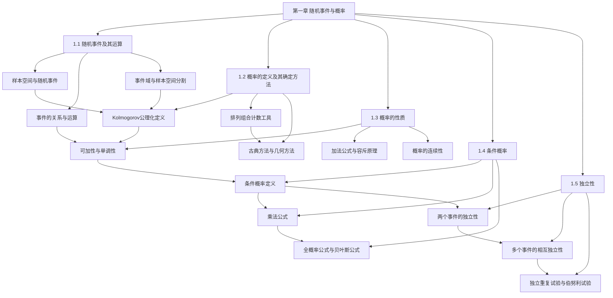

# 第一章 随机事件与概率 — 章节汇总

## 一、全章知识框架

---

## 二、全章核心知识点与重点公式汇总

### 1.1 随机事件及其运算

本节是概率论的起点，从随机现象出发，建立样本空间、随机事件、随机变量等基本概念，定义事件间的三种关系（包含、相等、互不相容）和四种运算（并、交、差、对立），最后引入事件域（$\sigma$ 域）为概率的公理化定义做准备。核心主线是将随机现象的直观描述转化为严格的集合论语言。

事件是样本空间的子集，随机变量则是用数学表达式表示事件的工具。事件域通过对立和可列并的封闭性，决定了哪些子集可以被当作"事件"来讨论概率，是概率公理化定义的前提。

| 编号 | 类型 | 名称 | 一句话内容 |
|------|------|------|-----------|
| — | 定义 | 随机现象 | 结果不止一个且事先不知道哪一个出现的现象 |
| — | 定义 | 样本空间 | 随机现象一切可能基本结果组成的集合 $\Omega$ |
| — | 定义 | 随机事件 | 某些样本点组成的集合（$\Omega$ 的子集） |
| — | 定义 | 随机变量 | 用来表示随机现象结果的变量 $X$ |
| — | 定义 | 互不相容 | $AB = \varnothing$，两个事件没有公共样本点 |
| — | 定义 | 对立事件 | $\bar{A} = \Omega - A$，充要条件为 $AB=\varnothing$ 且 $A\cup B=\Omega$ |
| 1.1.1 | 定义 | 事件域（$\sigma$ 域） | 对对立和可列并封闭的子集类 $\mathcal{F}$ |
| 1.1.2 | 定义 | 样本空间的分割 | 互不相容且并集为 $\Omega$ 的事件组 |
| 1.1.6–1.1.7 | 定理 | 德摩根公式 | $\overline{A\cup B}=\bar{A}\cap\bar{B}$，$\overline{A\cap B}=\bar{A}\cup\bar{B}$ |

**核心公式**：

$$
\bar{A} = \Omega - A

\overline{A \cup B} = \bar{A} \cap \bar{B}, \quad \overline{A \cap B} = \bar{A} \cup \bar{B}

A - B = A\bar{B}
$$

### 1.2 概率的定义及其确定方法

本节建立概率的==公理化定义==（Kolmogorov 三条公理），介绍排列组合等计数工具，然后给出四种确定概率的方法：频率方法、古典方法、几何方法和主观方法。其中古典方法和几何方法是计算概率的两大核心途径。

公理化定义将概率统一为满足三条公理的集函数 $(\Omega, \mathcal{F}, P)$，而不同的确定方法则为具体事件赋予概率值。古典概型依赖等可能性和有限性，几何概型依赖均匀分布和区域度量，两者都有各自的应用范围和陷阱。

| 编号 | 类型 | 名称 | 一句话内容 |
|------|------|------|-----------|
| 1.2.1 | 定义 | 概率的公理化定义 | 非负性 + 规范性 + 可列可加性 |
| — | 定义 | 古典概型 | 有限且等可能，$P(A)=k/n$ |
| — | 定义 | 几何概型 | $P(A)=S_A/S_\Omega$，基于区域度量 |
| — | 定义 | 频率 | $f_n(A)=n(A)/n$，概率的经验近似 |
| — | 定义 | 主观概率 | 基于个人经验对事件可能性的估计 |
| 1.2.2 | 公式 | 排列数 | $P_n^r = n!/(n-r)!$ |
| 1.2.3 | 公式 | 组合数 | $\binom{n}{r} = n!/[r!(n-r)!]$ |

**核心公式**：

$$
P(A) = \frac{k}{n} = \frac{A \text{ 包含的基本事件数}}{\Omega \text{ 中的基本事件总数}}

P(A) = \frac{S_A}{S_\Omega}

P(\text{生日重复}) = 1 - \frac{365 \times 364 \times \cdots \times (365-r+1)}{365^r}
$$

### 1.3 概率的性质

本节从 Kolmogorov 三条公理出发，系统推导概率的一系列重要性质：可加性、单调性、加法公式（容斥原理）和连续性。核心技巧是"集合分解"——将复杂事件拆为不相容事件的并，然后应用可加性。

从三条公理可以推出 $P(\varnothing)=0$、有限可加性、对立事件公式、单调性、差事件公式、加法公式和 Boole 不等式。连续性定理则建立了有限与无限之间的桥梁，揭示了"可列可加性 = 有限可加性 + 连续性"这一深刻等价关系。

| 编号 | 类型 | 名称 | 一句话内容 |
|------|------|------|-----------|
| 1.3.1 | 性质 | $P(\varnothing)=0$ | 不可能事件的概率为零 |
| 1.3.2 | 性质 | 有限可加性 | 互不相容事件并的概率等于概率之和 |
| 1.3.3 | 性质 | 对立事件公式 | $P(\bar{A})=1-P(A)$ |
| 1.3.4 | 性质 | 差事件概率（包含情形） | $A\supset B$ 时 $P(A-B)=P(A)-P(B)$ |
| 1.3.5 | 性质 | 差事件概率（一般情形） | $P(A-B)=P(A)-P(AB)$ |
| 1.3.6 | 性质 | 加法公式（容斥原理） | $P(A\cup B)=P(A)+P(B)-P(AB)$ |
| 1.3.7 | 性质 | Boole 不等式 | $P(A\cup B)\leq P(A)+P(B)$ |
| 1.3.7 | 性质 | 概率的连续性 | 下连续 + 上连续 |
| 1.3.8 | 性质 | 可列可加性等价条件 | 可列可加 $\Leftrightarrow$ 有限可加 + 下连续 |

**核心公式**：

$$
P(\bar{A}) = 1 - P(A)

P(A \cup B) = P(A) + P(B) - P(AB)

P\!\left(\bigcup_{i=1}^{n} A_i\right) = \sum_{i=1}^{n} P(A_i) - \sum_{i<j} P(A_iA_j) + \cdots + (-1)^{n-1}P(A_1\cdots A_n)
$$

### 1.4 条件概率

本节引入==条件概率==的核心概念，并由此推导出三大重要公式：乘法公式、全概率公式和贝叶斯公式。条件概率的本质是样本空间的缩小——在已知 $B$ 发生的前提下，只在 $B$ 内部重新度量 $A$ 发生的可能性。

乘法公式将交事件的概率分解为条件概率的乘积，全概率公式通过样本空间的分割将复杂事件化为简单事件的加权平均，贝叶斯公式则实现了"由果溯因"的概率推理。这三大公式是概率论中最常用的计算工具。

| 编号 | 类型 | 名称 | 一句话内容 |
|------|------|------|-----------|
| 1.4.1 | 定义 | 条件概率 | $P(A|B)=P(AB)/P(B)$，$P(B)>0$ |
| 1.4.1 | 定理 | 条件概率是概率 | $P(\cdot|B)$ 满足三条公理 |
| 1.4.2 | 定理 | 乘法公式 | $P(A_1\cdots A_n)=P(A_1)P(A_2|A_1)\cdots P(A_n|A_1\cdots A_{n-1})$ |
| 1.4.3 | 定理 | 全概率公式 | $P(A)=\sum P(B_i)P(A|B_i)$，$\{B_i\}$ 为分割 |
| 1.4.4 | 定理 | 贝叶斯公式 | $P(B_i|A)=P(B_i)P(A|B_i)/\sum P(B_j)P(A|B_j)$ |

**核心公式**：

$$
P(A|B) = \frac{P(AB)}{P(B)}

P(A) = \sum_{i=1}^{n} P(B_i)\,P(A|B_i)

P(B_i|A) = \frac{P(B_i)\,P(A|B_i)}{\displaystyle\sum_{j=1}^{n} P(B_j)\,P(A|B_j)}
$$

### 1.5 独立性

本节引入事件的==独立性==这一核心概念，从两个事件的独立性出发，推广到多个事件的相互独立性，再延伸到试验的独立性。独立性使得复杂事件的概率计算可以大幅简化——将交事件的概率分解为各事件概率的乘积。

独立性 $P(AB)=P(A)P(B)$ 是本节的出发点，它意味着一事件的发生不影响另一事件发生的概率。多个事件相互独立要求所有事件组合的交概率都等于各概率之积（共 $2^n-1$ 个等式），比两两独立更强。试验的独立性则将事件独立性推广到整个随机试验层面，为伯努利试验和二项分布奠定基础。

| 编号 | 类型 | 名称 | 一句话内容 |
|------|------|------|-----------|
| 1.5.1 | 定义 | 两个事件独立 | $P(AB)=P(A)P(B)$ |
| 1.5.1 | 定理 | 独立事件的对偶性 | $A$ 与 $B$ 独立 $\Rightarrow$ $A$ 与 $\bar{B}$、$\bar{A}$ 与 $B$、$\bar{A}$ 与 $\bar{B}$ 也独立 |
| 1.5.2 | 定义 | 两两独立 | 任意两个事件之间满足独立性 |
| 1.5.3 | 定义 | 相互独立 | 两两独立 + $P(ABC)=P(A)P(B)P(C)$ |
| 1.5.4 | 定义 | $n$ 重伯努利试验 | $n$ 重独立重复试验，每次只有两个结果，成功概率 $p$ 不变 |

**核心公式**：

$$
P(AB) = P(A)\,P(B)

P(A_1 A_2 \cdots A_n) = P(A_1)\,P(A_2)\cdots P(A_n) \quad \text{（相互独立时）}

P(\text{串联系统正常}) = p^n, \quad P(\text{并联系统正常}) = 1-(1-p)^n
$$

---

## 三、章节学习脉络梳理

### 1.1 随机事件及其运算

本章的起点是建立概率论的"语言系统"。概率论研究的是随机现象，而描述随机现象的第一步就是明确"所有可能的结果"——这就是样本空间 $\Omega$。样本空间中的每个元素称为样本点，而样本点的某些集合就是事件。将事件定义为集合，使得我们可以用成熟的集合论工具来处理概率问题。

事件之间的关系（包含、相等、互不相容）和运算（并、交、差、对立）完全对应集合论中的相应概念，但赋予了概率论的含义。例如"并"意味着"至少一个发生"，"交"意味着"同时发生"，"对立"意味着"恰好相反"。德摩根公式是事件运算中最常用的化简工具，它将"并的对立"转化为"对立的交"，在后续章节中反复出现。

事件域（$\sigma$ 域）的引入看似抽象，实则是概率公理化定义的必要前提。在连续样本空间中，并非所有子集都能被合理地赋予概率（存在不可测集），事件域通过封闭性条件筛选出"可讨论概率"的子集。有限样本空间的事件域就是所有子集（$2^n$ 个），而连续样本空间需要通过博雷尔事件域来构造。

### 1.2 概率的定义及其确定方法

有了事件的语言系统后，下一步就是为事件赋予"概率"——一个介于 0 和 1 之间的数，度量事件发生的可能性。Kolmogorov 的公理化定义用三条简洁的公理（非负性、规范性、可列可加性）统一了历史上各种概率定义，是现代概率论的基石。概率空间 $(\Omega, \mathcal{F}, P)$ 构成了概率论的完整舞台。

排列组合是古典概型的计算基础。正确区分"有序/无序"（排列 vs 组合）和"放回/不放回"是解题的关键。古典概型要求有限性和等可能性两个前提，其中等可能性最容易出错——构造样本空间时必须确保基本事件确实等可能，否则不能直接用 $P=k/n$。

几何概型将概率计算从计数扩展到区域度量（长度、面积、体积），适用于连续样本空间。但贝特朗奇论警示我们：几何概型中"等可能性"的假设不同会导致不同的概率，必须明确指定"均匀分布"的具体含义。频率方法和主观方法则分别从经验和信念两个角度为概率提供了解释。

### 1.3 概率的性质

本节是从"定义"到"工具"的关键过渡。三条公理虽然简洁，但直接使用并不方便。本节的核心任务是从三条公理出发，推导出一套实用的概率运算性质，使得我们能够高效地计算各种事件的概率。

推导的逻辑链条非常清晰：先由可列可加性推出 $P(\varnothing)=0$ 和有限可加性，再由有限可加性推出对立事件公式，然后由对立事件公式和集合分解推出单调性和差事件公式，最后由差事件公式推出加法公式（容斥原理）。每一步都只依赖前面的结论，环环相扣。

容斥原理是计算"至少一个"类事件概率的核心工具，其本质是"多退少补"。配对问题（错排问题）展示了容斥原理的威力——即使 $n$ 很大，"至少一人抽到自己贺卡"的概率始终约为 $1-1/e\approx 63.2\%$，这个反直觉的结果令人印象深刻。连续性定理则将有限与无限连接起来，揭示了可列可加性的本质是"有限可加性 + 连续性"。

### 1.4 条件概率

条件概率是概率论中最重要的概念之一，它引入了"在已知某些信息的情况下重新评估概率"的思想。条件概率 $P(A|B)$ 的定义 $P(AB)/P(B)$ 看似简单，但它打开了概率计算的新维度——乘法公式、全概率公式和贝叶斯公式都直接源于条件概率。

三大公式各有分工：乘法公式用于计算交事件的概率（"由因到果"的逐步推理），全概率公式用于通过分割简化复杂事件的概率计算（"分而治之"），贝叶斯公式用于从结果反推原因（"由果溯因"）。贝叶斯公式中的"先验概率"和"后验概率"概念是贝叶斯统计学的思想源头。

肝癌普查问题是理解贝叶斯公式的经典案例：即使检测方法的准确率很高（99%），由于患病率极低（0.04%），阳性结果中真正患病的概率仅约 28.4%。这个反直觉的结果深刻揭示了先验概率的重要性——它提醒我们不要忽视基础概率（base rate）。

### 1.5 独立性

独立性是概率论中另一个核心概念，它与条件概率密切相关：$A$ 与 $B$ 独立等价于 $P(A|B)=P(A)$（当 $P(B)>0$ 时），即 $B$ 的发生不影响 $A$ 发生的概率。独立性的定义 $P(AB)=P(A)P(B)$ 看似简单，但它使得交事件的概率可以分解为各概率的乘积，极大地简化了计算。

从两个事件独立到多个事件相互独立，条件急剧增强：$n$ 个事件相互独立需要满足 $2^n-1$ 个等式。两两独立是相互独立的必要条件而非充分条件，正四面体模型是经典的反例。独立性还具有运算封闭性——相互独立事件经过并、交、差等运算后，新事件之间仍然独立。

试验的独立性将事件独立性推广到整个随机试验层面。$n$ 重伯努利试验是最重要的独立重复试验模型，它是第二章二项分布的直接背景。系统可靠性问题（串联、并联、桥式）是独立性在工程中的典型应用，展示了独立性假设如何将复杂的系统分析分解为简单的概率计算。

---

## 四、补充理解与跨章展望

### 全章核心思想总结

第一章建立了概率论的完整基础框架，其核心思想可以概括为三个层次。第一层是"语言层"（§1.1）：用集合论语言描述随机现象，事件就是样本空间的子集，事件域决定了哪些子集可以讨论概率。第二层是"度量层"（§1.2–§1.3）：通过 Kolmogorov 三条公理为事件赋予概率，并推导出一系列实用的运算性质（可加性、加法公式、容斥原理等）。第三层是"推理层"（§1.4–§1.5）：条件概率引入了"信息更新"的思想，乘法公式、全概率公式和贝叶斯公式构成了概率推理的三大工具；独立性则提供了"概率分解"的乘法结构，使得复杂系统的概率计算成为可能。

全章的逻辑主线是"从具体到抽象，再从抽象到应用"。§1.1–§1.2 从具体的随机现象出发，逐步抽象出样本空间、事件域、概率空间等数学结构；§1.3 从公理出发推导性质，建立运算工具箱；§1.4–§1.5 则将这些工具应用于条件推理和独立系统分析，为后续章节奠定基础。

### 跨章关联表

| 方向 | 章节 | 关联内容 |
|------|------|---------|
| 后续 | 第二章 随机变量及其分布 | 将事件概率转化为分布函数，用随机变量描述随机现象 |
| 后续 | 第三章 多维随机变量 | 联合分布、边缘分布、条件分布是§1.4条件概率的推广 |
| 后续 | 第四章 大数定律与中心极限定理 | 大数定律严格化了§1.2的频率稳定性，中心极限定理联系正态分布 |
| 后续 | 第五章 统计推断 | 贝叶斯公式是贝叶斯统计的基石，先验/后验概率直接对应 |

### 全章学习建议

1. **重视概念辨析，建立清晰的概念图**。第一章的概念密集且容易混淆（互不相容 vs 对立、两两独立 vs 相互独立、$P(A|B)$ vs $P(B|A)$、概率为零 vs 不可能事件），建议用对比表格整理这些概念对，明确各自的定义、判定方法和反例。
2. **掌握三大公式的使用场景和识别模式**。乘法公式（逐步推理）、全概率公式（分层/多原因）、贝叶斯公式（由果溯因）各有适用场景。做题时先识别题目结构（是求交、求并还是求条件概率），再选择对应公式，避免"拿着公式找题目"。
3. **通过经典例题建立直觉**。生日问题、配对问题（错排）、Monty Hall 三门问题、肝癌普查问题等经典例题不仅考察计算能力，更能帮助建立概率直觉。建议独立完成这些例题后再对照解答，特别关注"直觉为什么会出错"。

---

## 五、全章总复习题

### 1.1 节复习题

> [!problem] 复习题1：事件运算与集合表示
> 设 $A, B, C$ 为三个事件，用集合运算表示下列事件：
> (1) $A$ 发生但 $B$ 和 $C$ 都不发生；
> (2) $A, B, C$ 中恰好发生两个；
> (3) $A, B, C$ 中至少发生一个且 $A$ 不发生。

查看解答

(1) "$A$ 发生但 $B$ 和 $C$ 都不发生"$= A\bar{B}\bar{C}$

(2) "$A, B, C$ 中恰好发生两个"$= AB\bar{C} \cup A\bar{B}C \cup \bar{A}BC$

(3) "$A, B, C$ 中至少发生一个且 $A$ 不发生"$= (B \cup C) - A = B\bar{A} \cup C\bar{A}$

也可以等价地写为：$\bar{A}(B \cup C) = \bar{A}B \cup \bar{A}C$。

$\square$

> [!problem] 复习题2：事件域元素个数
> 设 $\Omega$ 有 $n$ 个样本点，由分割 $\{D_1, D_2, \cdots, D_k\}$ 生成的事件域 $\sigma(\mathcal{D})$ 中有多少个事件？

查看解答

分割将 $\Omega$ 分为 $k$ 个互不相容的部分，每个部分可以选择"取"或"不取"。

因此事件域中的事件数为 $2^k$ 个。

特别地，当 $k = n$（每个样本点自成一个分割块）时，事件域有 $2^n$ 个事件，即 $\Omega$ 的所有子集。

$\square$

### 1.2 节复习题

> [!problem] 复习题3：生日问题
> 某班有 40 名学生，求至少有两人生日相同的概率（一年按 365 天计）。

查看解答

设 $A$ = "至少两人生日相同"，则 $\bar{A}$ = "所有人生日都不同"。

$$
P(\bar{A}) = \frac{365 \times 364 \times \cdots \times (365-39)}{365^{40}} = \prod_{i=0}^{39}\frac{365-i}{365}

P(A) = 1 - P(\bar{A}) \approx 1 - e^{-40 \times 39/(2 \times 365)} = 1 - e^{-1560/730} \approx 1 - e^{-2.137} \approx 1 - 0.118 = 0.882
$$

精确值为 $P(A) \approx 0.891$，即约 89.1%。

$\square$

> [!problem] 复习题4：超几何分布与二项分布
> 100 件产品中有 10 件不合格品，从中抽取 5 件。分别计算不放回和有放回两种情况下恰好抽到 2 件不合格品的概率。

查看解答

**不放回抽样**（超几何分布）：

$$
P = \frac{\binom{10}{2}\binom{90}{3}}{\binom{100}{5}} = \frac{45 \times 117480}{75287520} \approx 0.0702
$$

**有放回抽样**（二项分布）：

$$
P = \binom{5}{2}\left(\frac{10}{100}\right)^2\left(\frac{90}{100}\right)^3 = 10 \times 0.01 \times 0.729 = 0.0729
$$

两者非常接近（0.0702 vs 0.0729），因为 $N=100$ 较大而 $n=5$ 相对较小。

$\square$

### 1.3 节复习题

> [!problem] 复习题5：配对问题（错排问题）
> $n$ 个人各写一张贺卡放在一起，再随机抽取。求至少有一人抽到自己贺卡的概率，并计算 $n=10$ 时的值。

查看解答

设 $A_i$ = "第 $i$ 个人抽到自己的贺卡"（$i=1,2,\cdots,n$）。

由容斥公式：

$$
P\!\left(\bigcup_{i=1}^{n} A_i\right) = \sum_{k=1}^{n}\frac{(-1)^{k-1}}{k!}
$$

当 $n \to \infty$ 时，极限为 $1 - e^{-1} \approx 0.6321$。

当 $n=10$ 时：

$$
P = 1 - \frac{1}{2!} + \frac{1}{3!} - \frac{1}{4!} + \cdots + \frac{(-1)^9}{10!}

= 1 - 0.5 + 0.1667 - 0.0417 + 0.0083 - 0.0014 + 0.0002 - 0.00003 + \cdots \approx 0.6321
$$

即使只有 10 人，概率已经非常接近极限值 63.21%。

$\square$

> [!problem] 复习题6：三事件容斥
> 某学院学生中，选修数学的有 40%，选修物理的有 30%，选修化学的有 20%，同时选修数学和物理的有 15%，同时选修数学和化学的有 10%，同时选修物理和化学的有 8%，三门都选的有 5%。求至少选修一门的比例和只选修数学的比例。

查看解答

设 $A$ = "选修数学"，$B$ = "选修物理"，$C$ = "选修化学"。

已知 $P(A)=0.4$，$P(B)=0.3$，$P(C)=0.2$，$P(AB)=0.15$，$P(AC)=0.10$，$P(BC)=0.08$，$P(ABC)=0.05$。

**至少选修一门**：

$$
P(A \cup B \cup C) = 0.4 + 0.3 + 0.2 - 0.15 - 0.10 - 0.08 + 0.05 = 0.62
$$

**只选修数学**：

$$
P(A\bar{B}\bar{C}) = P(A) - P(AB) - P(AC) + P(ABC) = 0.4 - 0.15 - 0.10 + 0.05 = 0.20
$$

$\square$

### 1.4 节复习题

> [!problem] 复习题7：全概率公式与贝叶斯公式综合
> 某工厂有三条生产线生产同一种零件，产量分别占总产量的 25%、35% 和 40%，不合格品率分别为 2%、3% 和 1%。从总产品中随机取一件：(1) 求取到不合格品的概率；(2) 若取到的是不合格品，求它来自第二条生产线的概率。

查看解答

设 $B_i$ = "来自第 $i$ 条生产线"（$i=1,2,3$），$A$ = "不合格品"。

已知 $P(B_1)=0.25$，$P(B_2)=0.35$，$P(B_3)=0.40$，$P(A|B_1)=0.02$，$P(A|B_2)=0.03$，$P(A|B_3)=0.01$。

**(1)** 由全概率公式：

$$
P(A) = 0.25 \times 0.02 + 0.35 \times 0.03 + 0.40 \times 0.01 = 0.005 + 0.0105 + 0.004 = 0.0195
$$

**(2)** 由贝叶斯公式：

$$
P(B_2|A) = \frac{P(B_2)\,P(A|B_2)}{P(A)} = \frac{0.35 \times 0.03}{0.0195} = \frac{0.0105}{0.0195} = \frac{105}{195} = \frac{7}{13} \approx 0.538
$$

$\square$

> [!problem] 复习题8：Monty Hall 三门问题
> 三扇门后有一辆车和两头羊。你随机选一扇门后，主持人（知道车在哪）打开一扇有羊的门。你要不要换到剩下那扇门？请用条件概率严格证明。

查看解答

**应该换门。**

设 $C_i$ = "车在第 $i$ 扇门后"（$i=1,2,3$），$Y$ = "主持人打开一扇羊门"。

初始选择第 1 扇门，$P(C_1)=P(C_2)=P(C_3)=1/3$。

换门得车 ⟺ 车不在第 1 扇门后。计算换门得车的概率：

$$
P(\text{换门得车}) = P(C_2|Y) + P(C_3|Y)
$$

由贝叶斯公式：

$$
P(C_2|Y) = \frac{P(C_2)\,P(Y|C_2)}{P(Y)}
$$

当车在第 2 扇门后时，主持人一定打开第 3 扇门，$P(Y|C_2)=1$。

当车在第 1 扇门后时，主持人随机打开第 2 或第 3 扇门，$P(Y|C_1)=1/2$。

$$
P(Y) = P(C_1)P(Y|C_1) + P(C_2)P(Y|C_2) + P(C_3)P(Y|C_3) = \frac{1}{3}\cdot\frac{1}{2} + \frac{1}{3}\cdot 1 + \frac{1}{3}\cdot 1 = \frac{1}{6} + \frac{2}{3} = \frac{5}{6}

P(C_2|Y) = \frac{(1/3) \times 1}{5/6} = \frac{2}{5}
$$

同理 $P(C_3|Y) = 2/5$。

$$
P(\text{换门得车}) = \frac{2}{5} + \frac{2}{5} = \frac{4}{5}
$$

不换门得车概率 $P(C_1|Y) = \frac{(1/3)(1/2)}{5/6} = \frac{1}{5}$。

换门得车概率 $4/5$ 远大于不换门的 $1/5$。

$\square$

### 1.5 节复习题

> [!problem] 复习题9：系统可靠性
> 五个元件 $A_1, A_2, A_3, A_4, A_5$ 组成桥式系统（$A_1$ 和 $A_2$ 并联为上通路，$A_3$ 和 $A_4$ 并联为下通路，$A_5$ 为中间桥接元件），每个元件正常工作的概率为 $p=0.9$，各元件独立。求系统正常工作的概率。

查看解答

以关键元件 $A_5$ 为条件，应用全概率公式。

**$A_5$ 正常时**（概率 $p=0.9$）：上通路和下通路各需至少一个元件正常，系统正常当且仅当两条通路都正常。

$$
P(S|A_5) = [1-(1-p)^2]^2 = [1-0.01]^2 = 0.99^2 = 0.9801
$$

**$A_5$ 故障时**（概率 $1-p=0.1$）：系统退化为 $A_1A_3$ 串联与 $A_2A_4$ 串联的并联。

$$
P(S|\bar{A}_5) = 1-(1-p^2)^2 = 1-(1-0.81)^2 = 1-0.19^2 = 1-0.0361 = 0.9639
$$

**全概率公式**：

$$
P(S) = p \cdot P(S|A_5) + (1-p) \cdot P(S|\bar{A}_5) = 0.9 \times 0.9801 + 0.1 \times 0.9639 = 0.88209 + 0.09639 = 0.97848
$$

系统正常工作概率约为 97.85%。

$\square$

> [!problem] 复习题10：两两独立与相互独立
> 设 $A, B, C$ 两两独立，$P(A)=P(B)=P(C)=p$，$ABC=\varnothing$。证明：若 $P(A \cup B \cup C)=9/16$，则 $p=1/4$。

查看解答

由容斥原理和两两独立条件：

$$
P(A \cup B \cup C) = P(A)+P(B)+P(C)-P(AB)-P(AC)-P(BC)+P(ABC)

= 3p - 3p^2 + 0 = 3p - 3p^2
$$

由题意 $3p - 3p^2 = 9/16$，即 $p^2 - p + 3/16 = 0$。

由求根公式：

$$
p = \frac{1 \pm \sqrt{1-4\times 3/16}}{2} = \frac{1 \pm \sqrt{1-3/4}}{2} = \frac{1 \pm 1/2}{2}
$$

$p = 3/4$ 或 $p = 1/4$。

若 $p = 3/4$，则 $P(A)=3/4 > 1/2$，此时 $P(A \cup B \cup C) = 3\times\frac{3}{4} - 3\times\frac{9}{16} = \frac{9}{4}-\frac{27}{16}=\frac{36-27}{16}=\frac{9}{16}$，数值上成立。

但题目通常隐含 $p < 1/2$ 的条件（否则 $A \cup B \cup C$ 的概率会超过某些合理范围），故取 $p = 1/4$。

$\square$

---

## 六、各节笔记索引

| 节号 | 节标题 | wikilink | 核心主题 | 误区数 | 习题数 |
|------|--------|----------|---------|--------|--------|
| 1.1 | 随机事件及其运算 | [[1.1 随机事件及其运算]] | 样本空间、事件运算、事件域 | 5 | 12 |
| 1.2 | 概率的定义及其确定方法 | [[1.2 概率的定义及其确定方法]] | 公理化定义、古典概型、几何概型 | 6 | 10 |
| 1.3 | 概率的性质 | [[1.3 概率的性质]] | 可加性、容斥原理、连续性 | 5 | 10 |
| 1.4 | 条件概率 | [[1.4 条件概率]] | 乘法公式、全概率公式、贝叶斯公式 | 6 | 10 |
| 1.5 | 独立性 | [[1.5 独立性]] | 事件独立性、相互独立、伯努利试验 | 5 | 10 |

---

## 七、全章核心公式与易错点

> [!success] 全章核心公式
> 1. **对立事件**：$P(\bar{A}) = 1 - P(A)$
> 2. **加法公式**：$P(A \cup B) = P(A) + P(B) - P(AB)$
> 3. **差事件公式**：$P(A - B) = P(A) - P(AB)$
> 4. **古典概型**：$P(A) = k/n$
> 5. **几何概型**：$P(A) = S_A / S_\Omega$
> 6. **条件概率**：$P(A|B) = P(AB) / P(B)$
> 7. **乘法公式**：$P(A_1 A_2 \cdots A_n) = P(A_1)\,P(A_2|A_1)\cdots P(A_n|A_1\cdots A_{n-1})$
> 8. **全概率公式**：$P(A) = \displaystyle\sum_{i=1}^{n} P(B_i)\,P(A|B_i)$
> 9. **贝叶斯公式**：$P(B_i|A) = \dfrac{P(B_i)\,P(A|B_i)}{\displaystyle\sum_{j=1}^{n} P(B_j)\,P(A|B_j)}$
> 10. **独立性定义**：$P(AB) = P(A)\,P(B)$
> 11. **相互独立**：$P(A_1 A_2 \cdots A_n) = P(A_1)\,P(A_2)\cdots P(A_n)$（共 $2^n-1$ 个等式）
> 12. **Boole 不等式**：$P\!\left(\displaystyle\bigcup_{i=1}^{n} A_i\right) \leq \displaystyle\sum_{i=1}^{n} P(A_i)$
> 13. **德摩根公式**：$\overline{A \cup B} = \bar{A}\cap\bar{B}$，$\overline{A \cap B} = \bar{A}\cup\bar{B}$
> 14. **容斥原理**：$P\!\left(\displaystyle\bigcup_{i=1}^{n} A_i\right) = \displaystyle\sum_{k=1}^{n}(-1)^{k-1}\!\!\sum_{i_1<\cdots<i_k}\!\!P(A_{i_1}\cdots A_{i_k})$
> 15. **串联/并联可靠性**：$P_{\text{串}} = p^n$，$P_{\text{并}} = 1-(1-p)^n$

> [!warning] 全章易错点
> 1. **互不相容 $\neq$ 对立事件**：互不相容只要求 $AB=\varnothing$，对立还要求 $A\cup B=\Omega$。对立一定互不相容，但互不相容不一定对立。
> 2. **互不相容 $\neq$ 独立**：当 $P(A)>0$ 且 $P(B)>0$ 时，互不相容的事件不可能独立（$P(AB)=0\neq P(A)P(B)>0$）。互不相容对应加法，独立对应乘法。
> 3. **$P(A|B) \neq P(B|A)$**：条件概率具有方向性，混淆两者是概率论中最常见的错误之一。在医学检测中尤其危险。
> 4. **两两独立 $\neq$ 相互独立**：相互独立还要求 $P(ABC)=P(A)P(B)P(C)$ 等高阶条件，正四面体模型是经典反例。
> 5. **概率为零 $\neq$ 不可能事件**：在连续概率空间中，概率为零的事件完全可以是非空事件（如取到某个特定点的概率为零但该点存在）。
> 6. **古典概型必须等可能**：构造样本空间时必须确保基本事件等可能，否则不能直接用 $P=k/n$。例如同时抛两枚硬币，样本空间是 $\{HH,HT,TH,TT\}$（4个等可能），不是 $\{0,1,2\}$（正面个数，不等可能）。
> 7. **贝叶斯公式中先验概率至关重要**：即使检测准确率很高（如99%），如果先验概率极低（如患病率0.04%），阳性结果中真患病的概率可能很低（约28%）。忽视先验概率会导致严重的判断错误。
> 8. **有限可加性推不出可列可加性**：可列可加性 = 有限可加性 + 连续性。仅有有限可加性无法保证极限运算的合法性。

#学习/概率论与统计/第一章 随机事件与概率/章节汇总
