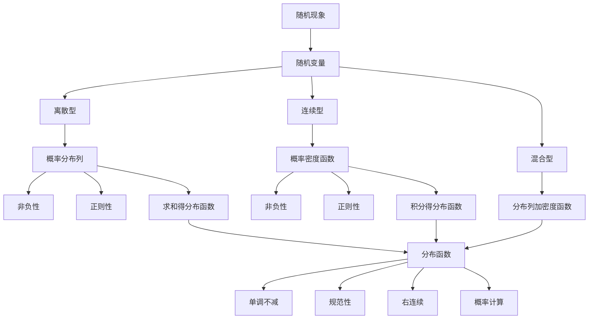

# 2.1 随机变量及其分布

> [!abstract] 本节概览
> 本节是概率论从"事件语言"到"函数语言"的关键转折点。通过引入==随机变量==的概念，将样本空间 $\Omega$ 中的随机事件映射为实数轴上的数值，从而将概率问题转化为实函数的分析问题。在此基础上，本节系统建立分布函数、概率分布列和概率密度函数三大描述工具，为后续所有分布的研究奠定统一框架。
>
> **逻辑链条**：随机现象的数值化（随机变量定义）→ 统一描述工具（分布函数及其性质）→ 离散型描述（概率分布列）→ 连续型描述（概率密度函数）→ 混合型（分布列与密度的结合）
>
> **前置依赖**：[[1.1 随机事件及其运算]]（样本空间、事件、事件运算）、[[1.3 概率的性质|§1.3]]（概率的基本性质、可加性）、[[1.4 条件概率|§1.4]]（条件概率、全概率公式）、[[1.5 独立性|§1.5]]（事件的独立性）、[[第一章 随机事件与概率 — 章节汇总|第一章汇总]]
>
> **核心主线**：随机变量 $X = X(\omega)$ 是定义在样本空间上的实值函数。分布函数 $F(x) = P(X \leq x)$ 是描述随机变量概率规律的==最基本工具==，它统一了离散型和连续型两种情形。离散型用概率分布列 $\{p_i\}$ 刻画，连续型用概率密度函数 $p(x)$ 刻画。

---

## 一、随机变量的概念

### 为什么要引入随机变量

在[[1.1 随机事件及其运算|第一章]]中，我们用"事件"来描述随机现象——例如"掷骰子出现偶数点"、"灯泡寿命超过1000小时"。但事件语言有以下局限：

1. **难以进行数学运算**：事件之间只能做交、并、补等集合运算，无法做加减乘除。
2. **难以统一描述**：不同随机试验的事件千差万别，缺乏统一的数学框架。
3. **难以利用分析工具**：微积分、级数等强大的数学工具无法直接作用于事件。

==随机变量的引入正是为了克服这些局限==——它将随机试验的结果"数字化"，使得我们可以用实函数和实分析的工具来研究概率问题。

> [!def] 定义 2.1.1 — 随机变量
> 设 $\Omega$ 为某随机试验的样本空间。若对每一个 $\omega \in \Omega$，都有一个**唯一的实数** $X(\omega)$ 与之对应，则称 $X = X(\omega)$ 为该试验的一个==随机变量==。
>
> 随机变量常用大写字母 $X, Y, Z, \cdots$ 表示，其取值用小写字母 $x, y, z, \cdots$ 表示。

**理解要点**：

- 随机变量 $X$ 是一个**函数**：$X: \Omega \to \mathbb{R}$，定义域是样本空间 $\Omega$，值域是实数集 $\mathbb{R}$ 的某个子集。
- $X$ 的"随机性"来自其自变量 $\omega$ 的随机性——在试验之前，我们不知道 $\omega$ 会取哪个值，因此也不知道 $X(\omega)$ 会取哪个值。
- 随机变量本质上是"对样本点的编号"或"对随机结果的量化"。

### 离散型与连续型随机变量

根据随机变量取值的特点，可以分为两大类：

| 类型 | 特征 | 典型例子 |
|------|------|----------|
| **离散型** | 取值为有限个或可列无穷个 | 掷骰子的点数、一天内的顾客数 |
| **连续型** | 取值充满某个区间（不可列） | 电子元件的寿命、测量误差 |

> [!warning] 注意
> 还存在既非纯离散也非纯连续的**混合型**随机变量（见模块四例2.1.9），但离散型和连续型是最基本的两类。

### 引例

**引例1：掷骰子**

设 $X$ 为掷一颗均匀骰子出现的点数，则 $X$ 的可能取值为 $\{1, 2, 3, 4, 5, 6\}$。

- 样本空间 $\Omega = \{\omega_1, \omega_2, \omega_3, \omega_4, \omega_5, \omega_6\}$，其中 $\omega_i$ 表示"出现 $i$ 点"
- $X(\omega_i) = i$，即 $X$ 将每个样本点映射为对应的点数
- "出现偶数点"这一事件可表示为 $\{X \in \{2, 4, 6\}\}$

**引例2：单位时间内的顾客数**

设 $X$ 为某超市在单位时间内到达的顾客人数，则 $X$ 的可能取值为 $\{0, 1, 2, 3, \cdots\}$（非负整数集）。

- $X = 0$ 表示"没有顾客到达"
- $X \geq 5$ 表示"至少有5位顾客到达"
- $X \leq 3$ 表示"至多有3位顾客到达"

**引例3：电子元件的寿命**

设 $X$ 为某电子元件的使用寿命（单位：小时），则 $X$ 的可能取值为 $[0, +\infty)$。

- $X > 1000$ 表示"寿命超过1000小时"
- $500 \leq X \leq 1000$ 表示"寿命在500到1000小时之间"
- 这里 $X$ 是连续型随机变量

**引例4：不合格品数**

设 $X$ 为从一批产品（含 $N$ 件，其中 $M$ 件不合格）中随机抽取 $n$ 件中的不合格品数，则 $X$ 的可能取值为 $\{0, 1, 2, \cdots, \min(n, M)\}$。

- $X = 0$ 表示"抽到的 $n$ 件产品全部合格"
- $X = k$ 表示"恰好抽到 $k$ 件不合格品"

> [!tip] 随机变量与事件的关系
> 引入随机变量后，任何事件都可以用 $\{X \in B\}$（其中 $B$ 是实数集的某个子集）来表示。例如：
> - $P(X = a)$：$X$ 恰好取值 $a$ 的概率
> - $P(X \leq a)$：$X$ 不超过 $a$ 的概率
> - $P(a < X \leq b)$：$X$ 在 $(a, b]$ 内取值的概率
>
> 这使得概率论的研究对象从"事件族"统一为"随机变量的分布"。

---

## 二、分布函数

### 分布函数的定义

> [!def] 定义 2.1.2 — 分布函数
> 设 $X$ 是一个随机变量，称函数
> $$
> F(x) = P(X \leq x), \quad -\infty < x < +\infty \tag{2.1.1}
> $$
> 为 $X$ 的==分布函数==（Distribution Function），也称为==累积分布函数==（Cumulative Distribution Function, CDF）。

**理解要点**：

- $F(x)$ 是一个定义在全体实数上的普通函数（非随机函数），其自变量 $x$ 是任意实数。
- $F(x)$ 的函数值是一个概率值，表示事件 $\{X \leq x\}$ 发生的概率。
- 分布函数是描述随机变量概率规律的==最基本、最统一==的工具——无论是离散型、连续型还是混合型随机变量，都有分布函数。

### 引例：圆内随机抛点

> [!example] 例 2.1.1 — 圆内随机抛点
> 向半径为 $r$ 的圆内随机投掷一个点，设 $X$ 为该点到圆心的距离。求 $X$ 的分布函数。
>
> **解**：由于点是随机投掷的，点落在圆内某个区域的概率与该区域的面积成正比。
>
> 事件 $\{X \leq x\}$ 表示"点到圆心的距离不超过 $x$"，即点落在半径为 $x$ 的同心圆内。
>
> - 当 $x < 0$ 时：$\{X \leq x\} = \varnothing$，故 $F(x) = 0$
> - 当 $0 \leq x \leq r$ 时：
> $$
> F(x) = P(X \leq x) = \frac{\pi x^2}{\pi r^2} = \left(\frac{x}{r}\right)^2
> $$
> - 当 $x > r$ 时：$\{X \leq x\} = \Omega$，故 $F(x) = 1$
>
> 综合得：
> $$
> F(x) = \begin{cases} 0, & x < 0 \\[4pt] \left(\dfrac{x}{r}\right)^2, & 0 \leq x \leq r \\[8pt] 1, & x > r \end{cases}
> $$
>
> **图形特征**：$F(x)$ 是一条从 $0$ 连续增长到 $1$ 的光滑曲线，在 $x = 0$ 处开始上升，在 $x = r$ 处达到 $1$。

### 分布函数的基本性质

> [!thm] 定理 2.1.1 — 分布函数的基本性质
> 任一随机变量的分布函数 $F(x)$ 都具有以下三条基本性质：
>
> **(1) 单调不减**：若 $a < b$，则 $F(a) \leq F(b)$。
>
> **(2) 规范性**：
> $$
> \lim_{x \to -\infty} F(x) = 0, \quad \lim_{x \to +\infty} F(x) = 1
> $$
> 简记为 $F(-\infty) = 0$，$F(+\infty) = 1$。
>
> **(3) 右连续**：对任意实数 $x_0$，
> $$
> \lim_{x \to x_0^+} F(x) = F(x_0)
> $$
> 即 $F(x_0^+) = F(x_0)$。

> [!abstract] 证明思路
> **证明 (定理 2.1.1)**：
>
> **性质(1) — 单调不减**：
>
> **[利用事件的包含关系]**：若 $a < b$，则事件 $\{X \leq a\} \subset \{X \leq b\}$。
>
> 由[[1.3 概率的性质|§1.3]]中概率的单调性（性质1.3.4的推论）：
> $$
> F(a) = P(X \leq a) \leq P(X \leq b) = F(b)
> $$
>
> **性质(2) — 规范性**：
>
> **[利用概率的连续性]**：
>
> - 令 $A_n = \{X \leq -n\}$，$n = 1, 2, \cdots$。则 $A_1 \supset A_2 \supset \cdots$（单调递减），且 $\bigcap_{n=1}^{\infty} A_n = \varnothing$（因为 $X$ 不可能小于所有负数）。
>
> 由[[1.3 概率的性质|§1.3]]中概率的上连续性：
> $$
> F(-\infty) = \lim_{n \to \infty} F(-n) = \lim_{n \to \infty} P(A_n) = P\!\left(\bigcap_{n=1}^{\infty} A_n\right) = P(\varnothing) = 0
> $$
>
> - 令 $B_n = \{X \leq n\}$，$n = 1, 2, \cdots$。则 $B_1 \subset B_2 \subset \cdots$（单调递增），且 $\bigcup_{n=1}^{\infty} B_n = \Omega$（因为 $X$ 必定取某个有限值）。
>
> 由[[1.3 概率的性质|§1.3]]中概率的下连续性：
> $$
> F(+\infty) = \lim_{n \to \infty} F(n) = \lim_{n \to \infty} P(B_n) = P\!\left(\bigcup_{n=1}^{\infty} B_n\right) = P(\Omega) = 1
> $$
>
> **性质(3) — 右连续**：
>
> **[利用概率的可列可加性与连续性]**：对任意 $x_0$，取 $x_n = x_0 + \frac{1}{n}$，则 $x_1 > x_2 > \cdots$，且 $x_n \to x_0^+$。
>
> 令 $C_n = \{X \leq x_n\}$，则 $C_1 \supset C_2 \supset \cdots$（单调递减），且 $\bigcap_{n=1}^{\infty} C_n = \{X \leq x_0\}$（因为 $\inf\{x_n\} = x_0$，而 $\{X \leq x_0\} = \bigcap_{n=1}^{\infty}\{X \leq x_0 + \tfrac{1}{n}\}$）。
>
> 由概率的上连续性：
> $$
> \lim_{x \to x_0^+} F(x) = \lim_{n \to \infty} F(x_n) = \lim_{n \to \infty} P(C_n) = P\!\left(\bigcap_{n=1}^{\infty} C_n\right) = P(X \leq x_0) = F(x_0)
> $$
>
> $\square$

> [!tip] 分布函数性质的逆定理
> 反过来，任何一个满足上述三条性质的函数 $F(x)$，都一定是某个随机变量的分布函数。这保证了分布函数作为描述工具的**完备性**——不会出现"满足三条性质但不是任何随机变量的分布函数"的情况。

### 分布函数的概率计算公式

由分布函数的定义 $F(x) = P(X \leq x)$，可以推导出以下8个常用的概率计算公式：

| 概率形式 | 用分布函数表示 |
|:--------:|:-------------:|
| $P(a < X \leq b)$ | $F(b) - F(a)$ |
| $P(X = a)$ | $F(a) - F(a^{-})$ |
| $P(X \geq b)$ | $1 - F(b^{-})$ |
| $P(X > b)$ | $1 - F(b)$ |
| $P(X < b)$ | $F(b^{-})$ |
| $P(a < X < b)$ | $F(b^{-}) - F(a)$ |
| $P(a \leq X \leq b)$ | $F(b) - F(a^{-})$ |
| $P(a \leq X < b)$ | $F(b^{-}) - F(a^{-})$ |

> [!tip] 记忆技巧
> - 包含等号的一端用 $F$（不用左极限），不包含等号的一端用 $F^{-}$（左极限）
> - $P(X = a) = F(a) - F(a^{-})$ 是跳跃高度，离散型不为零，连续型为零

### 用分布函数计算概率

分布函数最重要的用途之一是统一计算各种类型的概率。以下是8个常用公式：

> [!info] 概率计算公式汇总
> 设 $F(x)$ 为随机变量 $X$ 的分布函数，$a < b$ 为任意实数，则：
>
> **(1)** $P(X \leq a) = F(a)$
>
> **(2)** $P(X < a) = F(a^-) = \lim_{x \to a^-} F(x)$
>
> **(3)** $P(X = a) = F(a) - F(a^-)$
>
> **(4)** $P(X > a) = 1 - F(a)$
>
> **(5)** $P(X \geq a) = 1 - F(a^-)$
>
> **(6)** $P(a < X \leq b) = F(b) - F(a)$
>
> **(7)** $P(a \leq X \leq b) = F(b) - F(a^-)$
>
> **(8)** $P(a < X < b) = F(b^-) - F(a)$

**推导思路**（以公式(6)和(3)为例）：

- **公式(6)**：$\{a < X \leq b\} = \{X \leq b\} - \{X \leq a\}$，且 $\{X \leq a\} \subset \{X \leq b\}$。由[[1.3 概率的性质|§1.3]]差事件公式：$P(a < X \leq b) = F(b) - F(a)$。

- **公式(3)**：$\{X = a\} = \{X \leq a\} - \{X < a\} = \{X \leq a\} - \bigcup_{n=1}^{\infty}\{X \leq a - \tfrac{1}{n}\}$。由概率的连续性：$P(X = a) = F(a) - \lim_{n \to \infty} F(a - \tfrac{1}{n}) = F(a) - F(a^-)$。

> [!tip] 连续型随机变量的简化
> 若 $X$ 是连续型随机变量，则 $F(x)$ 处处连续，$F(a^-) = F(a)$，因此：
> - $P(X = a) = 0$（单点概率恒为零）
> - $P(a < X \leq b) = P(a \leq X \leq b) = P(a < X < b) = P(a \leq X < b) = F(b) - F(a)$
>
> 即对于连续型随机变量，区间端点是否包含不影响概率值。

### 例题：柯西分布

> [!example] 例 2.1.2 — 柯西分布
> 验证函数
> $$
> F(x) = \frac{1}{\pi}\left(\arctan x + \frac{\pi}{2}\right) = \frac{1}{2} + \frac{1}{\pi}\arctan x, \quad -\infty < x < +\infty
> $$
> 可以作为某个随机变量的分布函数，并求 $P(-1 < X \leq 1)$。
>
> **验证**：
>
> **(1) 单调不减**：$F'(x) = \dfrac{1}{\pi} \cdot \dfrac{1}{1 + x^2} > 0$ 对一切 $x$ 成立，故 $F(x)$ 严格单调递增。✓
>
> **(2) 规范性**：
> $$
> F(-\infty) = \frac{1}{2} + \frac{1}{\pi} \cdot \left(-\frac{\pi}{2}\right) = 0 \quad \checkmark
> $$
> $$
> F(+\infty) = \frac{1}{2} + \frac{1}{\pi} \cdot \frac{\pi}{2} = 1 \quad \checkmark
> $$
>
> **(3) 右连续**：$F(x)$ 是初等函数，在其定义域 $(-\infty, +\infty)$ 上处处连续，当然右连续。✓
>
> 三条性质全部满足，故 $F(x)$ 是一个合法的分布函数。
>
> **计算概率**：
> $$
> P(-1 < X \leq 1) = F(1) - F(-1)
> $$
> $$
> = \left(\frac{1}{2} + \frac{1}{\pi} \cdot \frac{\pi}{4}\right) - \left(\frac{1}{2} + \frac{1}{\pi} \cdot \left(-\frac{\pi}{4}\right)\right)
> $$
> $$
> = \frac{3}{4} - \frac{1}{4} = \frac{1}{2}
> $$
>
> **密度函数**：$F'(x) = \dfrac{1}{\pi(1+x^2)}$，即 $X$ 服从柯西分布 $C(0,1)$。

---

## 三、离散随机变量的概率分布列

### 概率分布列的定义

> [!def] 定义 2.1.3 — 概率分布列
> 若离散型随机变量 $X$ 的所有可能取值为 $x_1, x_2, \cdots, x_n, \cdots$（有限或可列个），则称
> $$
> p_i = P(X = x_i), \quad i = 1, 2, \cdots \tag{2.1.2}
> $$
> 为 $X$ 的==概率分布列==（Probability Mass Function, PMF），也称为==概率函数==或==分布律==。
>
> 概率分布列也可以用表格形式表示：
>
> | $X$ | $x_1$ | $x_2$ | $\cdots$ | $x_n$ | $\cdots$ |
> |:---:|:---:|:---:|:---:|:---:|:---:|
> | $P$ | $p_1$ | $p_2$ | $\cdots$ | $p_n$ | $\cdots$ |

### 例题：掷两颗骰子

> [!example] 例 2.1.3 — 掷两颗骰子
> 掷两颗均匀骰子，考虑以下三个随机变量的分布列。
>
> **(a)** $X$ = 两颗骰子点数之和
>
> $X$ 的可能取值为 $\{2, 3, 4, 5, 6, 7, 8, 9, 10, 11, 12\}$。
>
> | $X$ | 2 | 3 | 4 | 5 | 6 | 7 | 8 | 9 | 10 | 11 | 12 |
> |:---:|:---:|:---:|:---:|:---:|:---:|:---:|:---:|:---:|:---:|:---:|:---:|
> | $P$ | $\frac{1}{36}$ | $\frac{2}{36}$ | $\frac{3}{36}$ | $\frac{4}{36}$ | $\frac{5}{36}$ | $\frac{6}{36}$ | $\frac{5}{36}$ | $\frac{4}{36}$ | $\frac{3}{36}$ | $\frac{2}{36}$ | $\frac{1}{36}$ |
>
> 验证正则性：$\sum_{k=2}^{12} P(X=k) = \frac{1+2+3+4+5+6+5+4+3+2+1}{36} = \frac{36}{36} = 1$ ✓
>
> **(b)** $Y$ = 两颗骰子中的最大点数
>
> $Y$ 的可能取值为 $\{1, 2, 3, 4, 5, 6\}$。
>
> $P(Y = k) = P(\max\{X_1, X_2\} = k) = P(Y \leq k) - P(Y \leq k-1) = \frac{k^2 - (k-1)^2}{36} = \frac{2k-1}{36}$
>
> | $Y$ | 1 | 2 | 3 | 4 | 5 | 6 |
> |:---:|:---:|:---:|:---:|:---:|:---:|:---:|
> | $P$ | $\frac{1}{36}$ | $\frac{3}{36}$ | $\frac{5}{36}$ | $\frac{7}{36}$ | $\frac{9}{36}$ | $\frac{11}{36}$ |
>
> **(c)** $Z$ = 第一颗骰子的点数
>
> $Z$ 的可能取值为 $\{1, 2, 3, 4, 5, 6\}$。
>
> | $Z$ | 1 | 2 | 3 | 4 | 5 | 6 |
> |:---:|:---:|:---:|:---:|:---:|:---:|:---:|
> | $P$ | $\frac{1}{6}$ | $\frac{1}{6}$ | $\frac{1}{6}$ | $\frac{1}{6}$ | $\frac{1}{6}$ | $\frac{1}{6}$ |

### 概率分布列的基本性质

> [!thm] 性质 2.1.1 — 概率分布列的基本性质
> 概率分布列 $\{p_i\}$ 满足：
>
> **(1) 非负性**：$p_i \geq 0$，$i = 1, 2, \cdots$
>
> **(2) 正则性**：$\displaystyle\sum_{i=1}^{\infty} p_i = 1$

> [!abstract] 证明思路
> **证明 (性质 2.1.1)**：
>
> **[非负性]**：由概率的基本性质（[[1.2 概率的定义及其确定方法|§1.2]]公理1），$p_i = P(X = x_i) \geq 0$。
>
> **[正则性]**：由于 $\{X = x_1\}, \{X = x_2\}, \cdots$ 互不相容（$X$ 在同一时刻只能取一个值），且 $\bigcup_{i=1}^{\infty}\{X = x_i\} = \Omega$（$X$ 必定取某个值），由[[1.3 概率的性质|§1.3]]可列可加性：
> $$
> \sum_{i=1}^{\infty} p_i = \sum_{i=1}^{\infty} P(X = x_i) = P\!\left(\bigcup_{i=1}^{\infty}\{X = x_i\}\right) = P(\Omega) = 1
> $$
>
> $\square$

> [!tip] 性质2.1.1的逆命题
> 任何一个满足非负性和正则性的数列 $\{p_i\}$，都一定是某个离散型随机变量的概率分布列。

### 分布函数与分布列的关系

> [!example] 例 2.1.4 — 阶梯函数与退化分布
> **(a)** 设离散型随机变量 $X$ 的分布列为：
>
> | $X$ | 0 | 1 | 2 |
> |:---:|:---:|:---:|:---:|
> | $P$ | $0.3$ | $0.5$ | $0.2$ |
>
> 则 $X$ 的分布函数为：
> $$
> F(x) = \begin{cases} 0, & x < 0 \\ 0.3, & 0 \leq x < 1 \\ 0.8, & 1 \leq x < 2 \\ 1, & x \geq 2 \end{cases}
> $$
>
> **图形特征**：$F(x)$ 是一个==阶梯函数==（Step Function），在每个取值点 $x_i$ 处有一个跳跃，跳跃高度恰好等于 $p_i = P(X = x_i)$。
>
> **一般公式**：$F(x) = \displaystyle\sum_{x_i \leq x} p_i$（对所有满足 $x_i \leq x$ 的 $p_i$ 求和）。
>
> **(b) 退化分布**：若 $P(X = c) = 1$（$c$ 为常数），则 $X$ 以概率1取确定值 $c$。
> $$
> F(x) = \begin{cases} 0, & x < c \\ 1, & x \geq c \end{cases}
> $$
> 退化分布是离散分布的极端情形——随机变量退化为常数。

### 例题：汽车遇红灯

> [!example] 例 2.1.5 — 汽车遇红灯
> 某汽车沿直线行驶，途中经过3个路口。每个路口遇到红灯的概率为 $p$，遇到绿灯的概率为 $1-p$，各路口的红绿灯相互独立。设 $X$ 为该汽车在行驶过程中**首次遇到红灯时已经通过的路口数**，求 $X$ 的分布列。
>
> **解**：$X$ 的可能取值为 $\{0, 1, 2, 3\}$。
>
> - $X = 0$：第一个路口就是红灯，$P(X=0) = p$
> - $X = 1$：第一个路口绿灯，第二个路口红灯，$P(X=1) = (1-p) \cdot p$
> - $X = 2$：前两个路口绿灯，第三个路口红灯，$P(X=2) = (1-p)^2 \cdot p$
> - $X = 3$：三个路口都是绿灯，$P(X=3) = (1-p)^3$
>
> 分布列：
>
> | $X$ | 0 | 1 | 2 | 3 |
> |:---:|:---:|:---:|:---:|:---:|
> | $P$ | $p$ | $(1-p)p$ | $(1-p)^2 p$ | $(1-p)^3$ |
>
> **验证正则性**：$p + (1-p)p + (1-p)^2 p + (1-p)^3 = p[1 + (1-p) + (1-p)^2] + (1-p)^3$
>
> 利用等比数列求和：$1 + (1-p) + (1-p)^2 = \dfrac{1-(1-p)^3}{1-(1-p)} = \dfrac{1-(1-p)^3}{p}$
>
> 故 $p \cdot \dfrac{1-(1-p)^3}{p} + (1-p)^3 = 1 - (1-p)^3 + (1-p)^3 = 1$ ✓
>
> **注**：此分布是==几何分布的截断版本==（最多试验3次），完整的几何分布在后续章节中详细讨论。

---

## 四、连续随机变量的概率密度函数

### 密度函数的直观引入

> [!example] 例 2.1.6 — 密度函数的直观理解
> 回顾例2.1.1中圆内随机抛点的问题。$X$ 的分布函数为
> $$
> F(x) = \begin{cases} 0, & x < 0 \\ \left(\dfrac{x}{r}\right)^2, & 0 \leq x \leq r \\ 1, & x > r \end{cases}
> $$
>
> 对 $F(x)$ 求导：
> $$
> F'(x) = \begin{cases} 0, & x < 0 \\ \dfrac{2x}{r^2}, & 0 < x < r \\ 0, & x > r \end{cases}
> $$
>
> 在 $x = 0$ 和 $x = r$ 处，$F(x)$ 的导数不存在（左导数和右导数不相等），但这两个点不影响积分值。
>
> 令 $p(x) = F'(x)$（在不可导点处任意取值，例如取 $0$），则
> $$
> p(x) = \begin{cases} \dfrac{2x}{r^2}, & 0 < x < r \\ 0, & \text{其他} \end{cases}
> $$
>
> 可以验证：
> - $p(x) \geq 0$（非负性）
> - $\displaystyle\int_{-\infty}^{+\infty} p(x)\,dx = \int_0^r \frac{2x}{r^2}\,dx = \frac{2}{r^2} \cdot \frac{r^2}{2} = 1$（正则性）
> - $F(x) = \displaystyle\int_{-\infty}^x p(t)\,dt$（分布函数是密度函数的积分）
>
> 这个 $p(x)$ 就是 $X$ 的==概率密度函数==。

### 概率密度函数的定义

> [!def] 定义 2.1.4 — 概率密度函数
> 若存在非负函数 $p(x)$，使得随机变量 $X$ 的分布函数可以表示为
> $$
> F(x) = \int_{-\infty}^{x} p(t)\,dt, \quad -\infty < x < +\infty \tag{2.1.3}
> $$
> 则称 $X$ 为==连续型随机变量==，称 $p(x)$ 为 $X$ 的==概率密度函数==（Probability Density Function, PDF），简称==密度函数==。

**理解要点**：

- 密度函数 $p(x)$ 描述的是概率在 $x$ 附近的"密集程度"，而非概率本身。
- 由微积分基本定理，若 $p(x)$ 在 $x$ 处连续，则 $F'(x) = p(x)$。
- $p(x)$ 不一定连续，但 $F(x)$ 一定连续（连续型随机变量的分布函数处处连续）。

### 密度函数的基本性质

> [!thm] 性质 2.1.2 — 密度函数的基本性质
> 密度函数 $p(x)$ 满足：
>
> **(1) 非负性**：$p(x) \geq 0$，$-\infty < x < +\infty$
>
> **(2) 正则性**：$\displaystyle\int_{-\infty}^{+\infty} p(x)\,dx = 1$

> [!abstract] 证明思路
> **证明 (性质 2.1.2)**：
>
> **[非负性]**：由定义2.1.4直接要求 $p(x) \geq 0$。
>
> **[正则性]**：由分布函数的规范性（定理2.1.1性质(2)）：
> $$
> \int_{-\infty}^{+\infty} p(x)\,dx = \lim_{x \to +\infty} \int_{-\infty}^{x} p(t)\,dt = \lim_{x \to +\infty} F(x) = F(+\infty) = 1
> $$
>
> $\square$

> [!tip] 密度函数性质的逆命题
> 任何一个满足非负性和正则性的函数 $p(x)$，都一定是某个连续型随机变量的密度函数。

### 用密度函数计算概率

设 $X$ 为连续型随机变量，密度函数为 $p(x)$，则：

$$
P(a < X \leq b) = F(b) - F(a) = \int_a^b p(x)\,dx
$$

更一般地，对任意 Borel 集 $B$：
$$
P(X \in B) = \int_B p(x)\,dx
$$

> [!important] 密度函数的几何意义
> $P(a < X \leq b) = \displaystyle\int_a^b p(x)\,dx$ 表示密度函数曲线 $y = p(x)$ 在区间 $(a, b]$ 上方的**面积**。
>
> 正则性 $\displaystyle\int_{-\infty}^{+\infty} p(x)\,dx = 1$ 表示整个密度函数曲线下方的总面积等于 $1$。

### 例题：均匀分布

> [!example] 例 2.1.7 — 均匀分布 $U(0, a)$
> 设随机变量 $X$ 在区间 $(0, a)$ 上均匀分布，密度函数为
> $$
> p(x) = \begin{cases} \dfrac{1}{a}, & 0 < x < a \\ 0, & \text{其他} \end{cases}
> $$
>
> **验证**：
> - 非负性：$p(x) = \dfrac{1}{a} > 0$（$0 < x < a$ 时）✓
> - 正则性：$\displaystyle\int_{-\infty}^{+\infty} p(x)\,dx = \int_0^a \frac{1}{a}\,dx = \frac{a}{a} = 1$ ✓
>
> **分布函数**：
> $$
> F(x) = \int_{-\infty}^x p(t)\,dt = \begin{cases} 0, & x \leq 0 \\ \dfrac{x}{a}, & 0 < x < a \\ 1, & x \geq a \end{cases}
> $$
>
> **概率计算**：对任意 $0 \leq c < d \leq a$，
> $$
> P(c < X \leq d) = \int_c^d \frac{1}{a}\,dt = \frac{d-c}{a}
> $$
>
> 即 $X$ 落在 $(0, a)$ 的任何子区间内的概率，只与该子区间的长度成正比，与子区间的位置无关——这就是"均匀"的含义。

### 例题：电子元件寿命

> [!example] 例 2.1.8 — 电子元件寿命
> 设某型号电子元件的寿命 $X$（单位：千小时）具有密度函数
> $$
> p(x) = \begin{cases} \lambda e^{-\lambda x}, & x > 0 \\ 0, & x \leq 0 \end{cases}
> $$
> 其中 $\lambda > 0$ 为参数。
>
> **验证正则性**：
> $$
> \int_{-\infty}^{+\infty} p(x)\,dx = \int_0^{+\infty} \lambda e^{-\lambda x}\,dx = \left[-e^{-\lambda x}\right]_0^{+\infty} = 0 - (-1) = 1 \quad \checkmark
> $$
>
> **分布函数**：
> $$
> F(x) = \int_{-\infty}^x p(t)\,dt = \begin{cases} 0, & x \leq 0 \\ 1 - e^{-\lambda x}, & x > 0 \end{cases}
> $$
>
> **概率计算**：
> - $P(X > 1) = 1 - F(1) = e^{-\lambda}$
> - $P(1 < X \leq 2) = F(2) - F(1) = e^{-\lambda} - e^{-2\lambda}$
>
> **注**：此分布为==指数分布== $Exp(\lambda)$，是可靠性理论中最重要的分布之一。

### 密度函数与分布列的异同

> [!info] 密度函数 vs 分布列：4个异同点
>
> | 比较维度 | 概率分布列 $p_i$ | 概率密度函数 $p(x)$ |
> |:--------:|:----------------:|:-------------------:|
> | **适用类型** | 离散型随机变量 | 连续型随机变量 |
> | **取值含义** | $p_i = P(X = x_i)$ 是**概率值** | $p(x)$ 不是概率值，是概率的"密度" |
> | **求和/积分** | $\sum p_i = 1$ | $\int p(x)\,dx = 1$ |
> | **与分布函数关系** | $F(x) = \sum_{x_i \leq x} p_i$ | $F(x) = \int_{-\infty}^x p(t)\,dt$ |
>
> **关键区别**：
> 1. 分布列的值 $p_i$ 直接就是概率，而密度函数的值 $p(x)$ **不是概率**（$p(x)$ 可以大于1！）。
> 2. 离散型随机变量的分布函数是阶梯函数，连续型的分布函数是连续函数。
> 3. 离散型在单点处可以有正概率，连续型在单点处的概率恒为零。
> 4. 两者都满足非负性和正则性，结构完全对称。

### 例题：混合分布

> [!example] 例 2.1.9 — 混合分布
> 某产品的寿命 $X$（单位：年）具有如下分布：
> - 以概率 $0.1$ 在出厂时即损坏（$X = 0$）
> - 以概率 $0.9$ 正常工作，寿命服从 $(0, 10)$ 上的均匀分布
>
> 则 $X$ 既不是纯离散型也不是纯连续型，而是==混合型==随机变量。
>
> **分布函数**：
> $$
> F(x) = \begin{cases} 0, & x < 0 \\ 0.1 + 0.9 \times \dfrac{x}{10} = 0.1 + 0.09x, & 0 \leq x < 10 \\ 1, & x \geq 10 \end{cases}
> $$
>
> **特征分析**：
> - 在 $x = 0$ 处有跳跃：$F(0) - F(0^-) = 0.1 = P(X = 0)$，这是离散部分
> - 在 $(0, 10)$ 上连续递增，这是连续部分
> - 在 $x = 10$ 处也有跳跃：$F(10) - F(10^-) = 1 - 1.0 = 0$（无跳跃，因为 $0.9 \times 1 = 0.9$，$0.1 + 0.9 = 1$）
>
> **密度函数**（连续部分）：
> $$
> p(x) = \begin{cases} 0.09, & 0 < x < 10 \\ 0, & \text{其他} \end{cases}
> $$
>
> 加上离散部分 $P(X = 0) = 0.1$，完整描述了 $X$ 的分布。
>
> **注**：混合分布的完整描述需要同时给出离散部分的分布列和连续部分的密度函数。分布函数 $F(x)$ 仍然是统一描述工具。

### 离散型与连续型随机变量的对比

> [!info] 对比总结
> | 对比维度 | 离散随机变量 | 连续随机变量 |
> |:--------:|:-----------:|:-----------:|
> | 概率计算 | $P(a < X \leq b) = \displaystyle\sum_{a < x_i \leq b} p(x_i)$ | $P(a < X \leq b) = \displaystyle\int_a^b p(x)\,dx$ |
> | $F(x)$ 连续性 | 右连续的阶梯函数 | 整个数轴上的连续函数 |
> | 单点概率 $P(X=a)$ | 在取值点上不为零 | 恒为零（$\int_a^a p(x)\,dx = 0$） |
> | 区间端点影响 | 受影响，需"点点计较" | 不影响 |
> | 分布列/密度唯一性 | 唯一 | 不唯一（个别点可任意修改） |

---

## 五、知识结构总览

---

## 六、核心思想与证明技巧

> [!abstract] 核心思想与证明技巧
>
> **1. 从事件到函数的思维转换**
>
> 随机变量的引入实现了从"事件语言"到"函数语言"的根本转变。核心映射关系是：事件 $\{X \in B\}$ 的概率 $= P(X \in B)$，其中 $B$ 是 Borel 集。这使得微积分、级数等分析工具可以系统地应用于概率问题。
>
> **2. 分布函数作为统一描述工具**
>
> 无论是离散型、连续型还是混合型，分布函数 $F(x) = P(X \leq x)$ 都能完整描述随机变量的概率规律。证明中经常利用 $F(x)$ 的三条基本性质（单调不减、规范性、右连续），以及概率的连续性来处理极限问题。
>
> **3. 离散求和与连续积分的对称性**
>
> 离散型的分布列 $\{p_i\}$ 和连续型的密度函数 $p(x)$ 在结构上完全对称：$\sum \leftrightarrow \int$，$p_i = P(X = x_i) \leftrightarrow p(x) = F'(x)$。掌握其中一种，另一种可以类比得到。
>
> **4. 利用概率性质证明分布函数性质**
>
> 定理2.1.1的证明展示了如何将概率的基本性质（[[1.3 概率的性质|§1.3]]中的单调性、连续性、可列可加性）"翻译"为分布函数的语言。关键技巧是构造单调事件序列，然后利用概率的连续性取极限。
>
> **5. 密度函数的"面积即概率"思想**
>
> 密度函数 $p(x)$ 本身不是概率，但 $p(x)\,dx$（面积微元）近似等于 $X$ 落在 $(x, x+dx]$ 内的概率。积分 $\int_a^b p(x)\,dx$ 就是概率 $P(a < X \leq b)$。这一思想贯穿整个连续型随机变量的研究。

---

## 七、补充理解与易混淆点

### 随机变量 vs 普通变量

**来源**：教材p55-56 + MIT OCW 6.041

> [!danger] 误区1："随机变量就是取值不确定的普通变量"
>
> ❌ **错误解释**：随机变量和普通变量一样，只是它的值事先不知道，等试验做完就确定了。所以随机变量本质上和 $y = x^2 + 1$ 中的 $x$ 没有区别。
>
> ✅ **正确解释**：随机变量 $X = X(\omega)$ 是一个==定义在样本空间 $\Omega$ 上的函数==，它的"自变量"是样本点 $\omega$（随机试验的结果），"因变量"是实数。普通微积分中的变量 $x$ 只是一个占位符，没有概率含义。随机变量之所以"随机"，是因为其自变量 $\omega$ 的取值是随机的——在试验之前，我们不知道 $\Omega$ 中哪个 $\omega$ 会出现。试验完成后，$\omega$ 确定，$X(\omega)$ 也就确定了（不再是随机的）。因此，随机变量是**函数**，不是"不确定的变量"。

### 分布函数右连续而非左连续

**来源**：教材p57-58 + UCLA Stats 100A

> [!danger] 误区2："分布函数应该是连续的，至少应该是左连续的"
>
> ❌ **错误解释**：分布函数 $F(x) = P(X \leq x)$ 既然是概率，应该是光滑连续的函数。即使不光滑，至少应该是左连续的（因为我们习惯从左边逼近）。
>
> ✅ **正确解释**：分布函数 $F(x)$ 保证==右连续==（$F(x_0^+) = F(x_0)$），但**不一定左连续**。对于离散型随机变量，$F(x)$ 在每个取值点 $x_i$ 处有跳跃，左极限 $F(x_i^-) \neq F(x_i)$。跳跃高度恰好等于 $P(X = x_i) = F(x_i) - F(x_i^-)$。
>
> 右连续性的来源是定义 $F(x) = P(X \leq x)$ 中的"$\leq$"号——当我们从右边逼近 $x_0$ 时，事件 $\{X \leq x_0 + \varepsilon\}$ 随着 $\varepsilon \to 0^+$ 单调递减地趋向 $\{X \leq x_0\}$，由概率的上连续性得到右连续。如果定义改为 $F^*(x) = P(X < x)$，则 $F^*$ 是左连续的。==选择"$\leq$"是数学界的约定==，保证了 $F(b) - F(a) = P(a < X \leq b)$ 的简洁形式。

### 密度函数值不等于概率

**来源**：教材p62-63 + CSDN

> [!danger] 误区3："密度函数 $p(x)$ 的值就是 $X$ 取 $x$ 的概率"
>
> ❌ **错误解释**：既然 $p(x)$ 叫"概率密度函数"，那 $p(x)$ 就是在 $x$ 处的概率。$p(x)$ 越大，说明 $X$ 取 $x$ 的概率越大。
>
> ✅ **正确解释**：==密度函数值 $p(x)$ 不是概率==。对于连续型随机变量，$P(X = x) = 0$ 对一切 $x$ 成立，所以 $p(x)$ 不可能是"取 $x$ 的概率"。正确的理解是：$p(x)$ 是概率的"密度"——类似于物理学中质量密度 $\rho(x)$ 不是质量，而是单位长度上的质量。概率等于密度函数曲线下方的**面积**：
> $$
> P(a < X \leq b) = \int_a^b p(x)\,dx
> $$
>
> 特别注意：$p(x)$ **可以大于1**（只要积分等于1即可）。例如，$X \sim U(0, 0.5)$ 时，$p(x) = 2$（$0 < x < 0.5$），密度值大于1但完全合法。

### 连续型随机变量的单点概率恒为零

**来源**：教材p65 + Stanford Stat 116

> [!danger] 误区4："连续型随机变量取每个值的概率都为零，说明每个值都不可能出现"
>
> ❌ **错误解释**：既然 $P(X = x) = 0$ 对所有 $x$ 成立，而概率为零的事件是不可能事件，所以连续型随机变量不可能取任何值——这显然矛盾。
>
> ✅ **正确解释**：在[[1.3 概率的性质|§1.3]]中我们学过，$P(A) = 0$ **不能推出** $A = \varnothing$（不可能事件）。概率为零只是说明事件发生的可能性"极小"，但不意味着不可能。对于连续型随机变量，单点 $\{x\}$ 是一个"零测集"——它不包含任何区间，因此密度函数在其上的积分为零：
> $$
> P(X = x) = \int_x^x p(t)\,dt = 0
> $$
>
> 这就好比线段上单个点的长度为零，但线段仍然由无穷多个点组成。==连续型随机变量的概率集中在区间上，而非单个点上==。这也解释了为什么 $P(a < X \leq b) = P(a \leq X \leq b) = P(a < X < b) = P(a \leq X < b)$——端点是否包含不影响概率值。

### 密度函数不唯一

**来源**：教材p65-66 + 华东师大讲义

> [!danger] 误区5："一个随机变量的密度函数是唯一确定的"
>
> ❌ **错误解释**：给定连续型随机变量 $X$，其密度函数 $p(x)$ 是唯一确定的，就像分布列 $\{p_i\}$ 对离散型随机变量是唯一的一样。
>
> ✅ **正确解释**：密度函数在==有限个点（甚至可列个点）上改变函数值，不影响积分结果==，因此不改变分布函数。换言之，密度函数在"几乎处处"（almost everywhere）的意义下是唯一的，但逐点意义下不唯一。
>
> 例如，$X \sim U(0,1)$ 的密度函数可以写成：
> $$
> p_1(x) = \begin{cases} 1, & 0 < x < 1 \\ 0, & \text{其他} \end{cases} \quad \text{或} \quad p_2(x) = \begin{cases} 1, & 0 \leq x \leq 1 \\ 0, & \text{其他} \end{cases}
> $$
>
> $p_1$ 和 $p_2$ 在 $x = 0$ 和 $x = 1$ 处不同，但 $\int p_1(x)\,dx = \int p_2(x)\,dx = 1$，对应的分布函数完全相同。因此 $p_1$ 和 $p_2$ 都是 $X$ 的合法密度函数。
>
> **注**：相比之下，离散型随机变量的分布列是逐点唯一的——因为 $p_i = P(X = x_i)$ 由概率直接确定，没有"几乎处处"的模糊性。

---

## 八、习题精选

> [!todo] 习题概览
>
> | 编号 | 题目来源 | 知识点 | 难度 |
> |:----:|:--------:|:------:|:----:|
> | 1 | 教材 2.1-1 | 取球最大号码（分布列） | ★★☆ |
> | 2 | 教材 2.1-9 | 分布函数求概率 | ★★☆ |
> | 3 | 教材 2.1-14 | 密度函数求系数 | ★★★ |
> | 4 | 教材 2.1-8 | 电子元件寿命（指数分布） | ★★☆ |
> | 5 | 教材 2.1-18 | 同分布求参数 $a$ | ★★★ |
> | 6 | 教材 2.1-19 | 偶函数密度证明 | ★★★ |
> | 7 | 2012南开432 | 正态分布对称性 | ★★☆ |
> | 8 | 2013华东师大432 | 指数分布条件概率 | ★★☆ |
> | 9 | 2022上财432 | 密度函数与分布函数判定 | ★★☆ |
> | 10 | 2014南开432 | 偶函数密度函数性质 | ★★☆ |

### 教材习题

> [!problem] 习题1（教材 2.1-1）— 取球最大号码
> 袋中有编号为1, 2, 3, 4, 5的5个球，从中同时取出3个。以 $X$ 表示取出的3个球中的最大号码，求 $X$ 的分布列和分布函数。

> [!faq]- 查看解答
> **解**：$X$ 的可能取值为 $\{3, 4, 5\}$。
>
> 总取法数 $\binom{5}{3} = 10$。
>
> - $X = 3$：3个球为 $\{1, 2, 3\}$，共 $\binom{2}{2} = 1$ 种。$P(X=3) = \dfrac{1}{10}$。
> - $X = 4$：最大号码为4，其余2个从 $\{1, 2, 3\}$ 中取，共 $\binom{3}{2} = 3$ 种。$P(X=4) = \dfrac{3}{10}$。
> - $X = 5$：最大号码为5，其余2个从 $\{1, 2, 3, 4\}$ 中取，共 $\binom{4}{2} = 6$ 种。$P(X=5) = \dfrac{6}{10}$。
>
> 验证：$\dfrac{1}{10} + \dfrac{3}{10} + \dfrac{6}{10} = 1$ ✓
>
> 分布列：
>
> | $X$ | 3 | 4 | 5 |
> |:---:|:---:|:---:|:---:|
> | $P$ | $\frac{1}{10}$ | $\frac{3}{10}$ | $\frac{6}{10}$ |
>
> 分布函数：
> $$
> F(x) = \begin{cases} 0, & x < 3 \\ \frac{1}{10}, & 3 \leq x < 4 \\ \frac{4}{10}, & 4 \leq x < 5 \\ 1, & x \geq 5 \end{cases}
> $$

> [!problem] 习题2（教材 2.1-9）— 分布函数求概率
> 设随机变量 $X$ 的分布函数为
> $$
> F(x) = \begin{cases} 0, & x < -1 \\ 0.3, & -1 \leq x < 0 \\ 0.7, & 0 \leq x < 1 \\ 1, & x \geq 1 \end{cases}
> $$
> 求 $P(X = -1)$，$P(X < 0)$，$P(-1 < X \leq 1)$，$P(X > 0.5)$。

> [!faq]- 查看解答
> **解**：
>
> $P(X = -1) = F(-1) - F(-1^-) = 0.3 - 0 = 0.3$
>
> $P(X < 0) = F(0^-) = 0.3$
>
> $P(-1 < X \leq 1) = F(1) - F(-1) = 1 - 0.3 = 0.7$
>
> $P(X > 0.5) = 1 - F(0.5) = 1 - 0.7 = 0.3$

> [!problem] 习题3（教材 2.1-14）— 密度函数求系数
> 设连续型随机变量 $X$ 的密度函数为
> $$
> p(x) = \begin{cases} cx^2, & 0 \leq x \leq 1 \\ 0, & \text{其他} \end{cases}
> $$
> 求常数 $c$ 的值，并求 $P\!\left(\frac{1}{4} < X \leq \frac{1}{2}\right)$。

> [!faq]- 查看解答
> **解**：由正则性：
> $$
> \int_{-\infty}^{+\infty} p(x)\,dx = \int_0^1 cx^2\,dx = c \cdot \left[\frac{x^3}{3}\right]_0^1 = \frac{c}{3} = 1
> $$
>
> 解得 $c = 3$。
>
> $$
> P\!\left(\frac{1}{4} < X \leq \frac{1}{2}\right) = \int_{1/4}^{1/2} 3x^2\,dx = \left[x^3\right]_{1/4}^{1/2} = \frac{1}{8} - \frac{1}{64} = \frac{7}{64}
> $$

> [!problem] 习题4（教材 2.1-8）— 电子元件寿命
> 设某电子元件的寿命 $X$（单位：小时）服从指数分布，密度函数为
> $$
> p(x) = \begin{cases} \frac{1}{1000} e^{-x/1000}, & x > 0 \\ 0, & x \leq 0 \end{cases}
> $$
> 求：(1) 该元件寿命超过500小时的概率；(2) 已知该元件已使用了500小时，再使用500小时的概率。

> [!faq]- 查看解答
> **解**：
>
> **(1)** $P(X > 500) = \displaystyle\int_{500}^{+\infty} \frac{1}{1000} e^{-x/1000}\,dx = \left[-e^{-x/1000}\right]_{500}^{+\infty} = e^{-0.5} \approx 0.6065$
>
> **(2)** 利用[[1.4 条件概率|§1.4]]的条件概率公式：
> $$
> P(X > 1000 \mid X > 500) = \frac{P(X > 1000)}{P(X > 500)} = \frac{e^{-1}}{e^{-0.5}} = e^{-0.5} \approx 0.6065
> $$
>
> **结论**：$P(X > 500) = P(X > 1000 \mid X > 500) = e^{-0.5}$。这说明指数分布具有==无记忆性==——已经工作了500小时的元件，其剩余寿命的分布与全新元件完全相同。

> [!problem] 习题5（教材 2.1-18）— 同分布求参数 $a$
> 设随机变量 $X$ 与 $Y$ 同分布，$X$ 的密度函数为
> $$
> p(x) = \begin{cases} \dfrac{3}{8}x^2, & 0 < x < 2 \\ 0, & \text{其他} \end{cases}
> $$
> 已知事件 $A = \{X > a\}$ 与 $B = \{Y > a\}$ 独立，且 $P(A \cup B) = \dfrac{3}{4}$，求 $a$ 的值。

> [!faq]- 查看解答
> **解**：由于 $X$ 与 $Y$ 同分布，$P(A) = P(B) = P(X > a)$。
>
> 又 $A$ 与 $B$ 独立，由[[1.5 独立性|§1.5]]：
> $$
> P(A \cup B) = P(A) + P(B) - P(A)P(B) = 2P(A) - [P(A)]^2 = \frac{3}{4}
> $$
>
> 令 $p = P(A)$，则 $2p - p^2 = \dfrac{3}{4}$，即 $p^2 - 2p + \dfrac{3}{4} = 0$。
>
> 解得 $p = \dfrac{2 \pm \sqrt{4-3}}{2} = \dfrac{2 \pm 1}{2}$，即 $p = \dfrac{3}{2}$（舍去，概率不能大于1）或 $p = \dfrac{1}{2}$。
>
> 故 $P(X > a) = \dfrac{1}{2}$。
>
> 当 $0 < a < 2$ 时：
> $$
> P(X > a) = \int_a^2 \frac{3}{8}x^2\,dx = \frac{3}{8}\left[\frac{x^3}{3}\right]_a^2 = \frac{1}{8}(8 - a^3) = \frac{1}{2}
> $$
>
> 解得 $8 - a^3 = 4$，$a^3 = 4$，$a = \sqrt[3]{4}$。

> [!problem] 习题6（教材 2.1-19）— 偶函数密度证明
> 设连续型随机变量 $X$ 的密度函数 $p(x)$ 为偶函数，证明：
> $$
> F(-a) = 1 - F(a) + P(X = a), \quad a > 0
> $$
> 特别地，若 $p(x)$ 连续，则 $F(-a) = 1 - F(a)$。

> [!faq]- 查看解答
> **证明**：
>
> **[利用偶函数的对称性]**：
>
> 由正则性：
> $$
> 1 = \int_{-\infty}^{+\infty} p(x)\,dx = \int_{-\infty}^{-a} p(x)\,dx + \int_{-a}^{a} p(x)\,dx + \int_a^{+\infty} p(x)\,dx
> $$
>
> 由于 $p(x)$ 是偶函数，$p(-x) = p(x)$，作变量替换 $t = -x$：
> $$
> \int_{-\infty}^{-a} p(x)\,dx = \int_{+\infty}^{a} p(-t)(-dt) = \int_a^{+\infty} p(t)\,dt
> $$
>
> 同理：
> $$
> \int_{-a}^{a} p(x)\,dx = 2\int_0^a p(x)\,dx
> $$
>
> 因此：
> $$
> 1 = \int_a^{+\infty} p(x)\,dx + 2\int_0^a p(x)\,dx + \int_a^{+\infty} p(x)\,dx = 2\int_a^{+\infty} p(x)\,dx + 2\int_0^a p(x)\,dx
> $$
>
> 注意到 $F(-a) = \displaystyle\int_{-\infty}^{-a} p(x)\,dx = \int_a^{+\infty} p(x)\,dx$。
>
> 又 $F(a) = \displaystyle\int_{-\infty}^a p(x)\,dx = \int_{-\infty}^0 p(x)\,dx + \int_0^a p(x)\,dx = \int_0^{+\infty} p(x)\,dx + \int_0^a p(x)\,dx$。
>
> 由于 $1 = 2\int_0^{+\infty} p(x)\,dx$（偶函数正则性），$\int_0^{+\infty} p(x)\,dx = \dfrac{1}{2}$。
>
> 故 $F(a) = \dfrac{1}{2} + \int_0^a p(x)\,dx$，$F(-a) = \dfrac{1}{2} - \int_0^a p(x)\,dx + P(X = a)$。
>
> 等价地：$F(-a) = 1 - F(a) + P(X = a)$。
>
> 当 $p(x)$ 连续时，$F(x)$ 连续，$P(X = a) = F(a) - F(a^-) = 0$，故 $F(-a) = 1 - F(a)$。$\square$

### 卡方考研真题

> [!problem] 习题7（2012 南开大学 432）— 正态分布对称性
> 设 $X \sim N(0, \sigma^2)$，则对任何实数 $C$，都有（　）
> A. $P(X \leq C) = 1 - P(X \leq -C)$
> B. $P(X \leq C) = P(X \geq C)$
> C. $|C|X \sim N(0, |C|^2\sigma^2)$
> D. $C + X \sim N(C, \sigma^2 + C^2)$

> [!faq]- 查看解答
> **选A**。由于正态分布的密度函数关于均值 $\mu$ 对称：
> $$
> P(X \leq \mu + C) = P(X \geq \mu - C) = 1 - P(X \leq \mu - C)
> $$
> 此题均值 $\mu = 0$，故 $P(X \leq C) = 1 - P(X \leq -C) = P(X \geq -C)$。
>
> - B项：$P(X \leq C) = P(X \geq C)$ 仅在 $C = \mu = 0$ 时成立，非恒等式。
> - C项：$C = 0$ 时 $|C|X = 0$（退化分布），不服从正态分布。
> - D项：$C + X \sim N(C, \sigma^2)$，方差应为 $\sigma^2$ 而非 $\sigma^2 + C^2$。

> [!problem] 习题8（2013 华东师范大学 432）— 指数分布条件概率
> 设某型号电子元件的寿命 $X$（单位：小时）的密度函数为
> $$
> p(x) = \begin{cases} 2000^2/x^2, & x > 2000 \\ 0, & \text{其他} \end{cases}
> $$
> 若一个元件已工作到3000小时尚未失效，则它还能工作1000小时的概率是（　）
> A. $1/2$　　B. $2/3$　　C. $3/4$　　D. 信息不足，无法确定

> [!faq]- 查看解答
> **选C**。当 $x > 2000$ 时，$F(x) = 1 - 2000/x$，所以：
> $$
> P(X > 4000 \mid X > 3000) = \frac{P(X > 4000)}{P(X > 3000)}
> $$
>
> 其中 $P(X > 4000) = 1 - F(4000) = 2000/4000 = 1/2$，$P(X > 3000) = 1 - F(3000) = 2000/3000 = 2/3$。
>
> 因此 $P(X > 4000 \mid X > 3000) = \dfrac{1/2}{2/3} = \dfrac{3}{4}$。
>
> **注**：此分布为帕累托分布（Pareto distribution），不是指数分布。但条件概率的计算方法相同——利用[[1.4 条件概率|§1.4]]的条件概率公式 $P(A|B) = P(AB)/P(B)$。

> [!problem] 习题9（2022 上海财经大学 432）— 密度函数与分布函数判定
> $f_1(x)$, $f_2(x)$ 分别是两个随机变量的密度函数，$F_1(x)$, $F_2(x)$ 分别是两个随机变量的分布函数，以下说法正确的是（　）
> A. $f_1(x) + f_2(x)$ 必为某随机变量的密度函数
> B. $f_1(x) \cdot f_2(x)$ 必为某随机变量的密度函数
> C. $F_1(x) + F_2(x)$ 必为某随机变量的分布函数
> D. $F_1(x) \cdot F_2(x)$ 必为某随机变量的分布函数

> [!faq]- 查看解答
> **选D**。
>
> - A项：$\int (f_1 + f_2)\,dx = \int f_1\,dx + \int f_2\,dx = 1 + 1 = 2 \neq 1$，不满足正则性。
> - B项：$\int f_1 \cdot f_2\,dx$ 一般不等于1，不满足正则性。
> - C项：$\lim_{x \to +\infty}(F_1 + F_2)(x) = 1 + 1 = 2 \neq 1$，不满足有界性。
> - D项：$F_1(x) \cdot F_2(x)$ 满足分布函数三条性质——单调递增（乘积保持单调性）、右连续（右连续函数的乘积仍右连续）、$\lim_{x \to -\infty} F_1 F_2 = 0$，$\lim_{x \to +\infty} F_1 F_2 = 1$。故D正确。
>
> **推广**：若 $X_1, X_2$ 独立，则 $F_1(x) \cdot F_2(x)$ 恰好是 $\max(X_1, X_2)$ 的分布函数。

> [!problem] 习题10（2014 南开大学 432）— 偶函数密度函数性质
> 设连续随机变量 $X$ 的密度函数是一个偶函数，$F(x)$ 为 $X$ 的分布函数，则对任意实数 $a > 0$，下列（　）不成立。
> A. $F(-a) = 1 - F(a)$
> B. $P(|X| < a) = 2F(a) - 1$
> C. $P(|X| > a) = 2 - 2F(a)$
> D. $E(a - X) = E(X - a)$

> [!faq]- 查看解答
> **选D**。由于密度函数是偶函数，$p(-x) = p(x)$，可得 $F(a) + F(-a) = 1$。
>
> - A项：$F(-a) = 1 - F(a)$ ✓（偶函数密度的对称性）
> - B项：$P(|X| < a) = P(-a < X < a) = F(a) - F(-a) = F(a) - (1 - F(a)) = 2F(a) - 1$ ✓
> - C项：$P(|X| > a) = P(X > a) + P(X < -a) = (1 - F(a)) + F(-a) = 1 - F(a) + 1 - F(a) = 2 - 2F(a)$ ✓
> - D项：$E(a - X) = a - E(X)$，而 $E(X - a) = E(X) - a$。由于偶函数密度的期望 $E(X) = 0$，所以 $E(a-X) = a$，$E(X-a) = -a$。$a \neq -a$（$a > 0$），故D不成立 ✗

---

## 九、教材原文

#学习/概率论与统计/第二章 随机变量及其分布/随机变量及其分布
