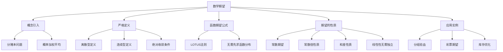

# 2.2 数学期望

> [!abstract] 本节概览
> 本节介绍随机变量最重要的数字特征——==数学期望==。数学期望是随机变量取值的"概率加权平均"，它从一个侧面描述了分布的中心位置。本节从历史上著名的分赌本问题出发，建立离散型和连续型随机变量数学期望的严格定义，证明随机变量函数的期望公式（LOTUS法则），并系统讨论期望的线性性质及其应用。
>
> **逻辑链条**：期望的直觉（分赌本问题）→ 严格定义（离散/连续，绝对收敛）→ 应用实例（分组验血、彩票）→ 函数的期望公式（LOTUS）→ 期望的性质（线性性）→ 综合应用（库存优化）
>
> **前置依赖**：[[2.1 随机变量及其分布|§2.1]]（随机变量、分布函数、分布列、密度函数）、[[1.3 概率的性质|§1.3]]（概率的可加性）、[[1.5 独立性|§1.5]]（事件的独立性）
>
> **核心主线**：数学期望 $E(X)$ 是随机变量取值的概率加权平均。离散型 $E(X) = \sum x_i p(x_i)$，连续型 $E(X) = \int x p(x) dx$。期望最重要的性质是==线性性==：$E(aX+bY) = aE(X)+bE(Y)$，且此性质==不要求独立性==。LOTUS法则允许直接用 $X$ 的分布计算 $g(X)$ 的期望，无需先求 $g(X)$ 的分布。

---

## 一、数学期望的概念与引入

### 为什么要引入数学期望

分布函数（或分布列、密度函数）能够完整地描述随机变量的统计规律性，但在许多实际问题中，我们往往只需要用少数几个数字来概括分布的某个方面的特征。这些数字被称为随机变量的==数字特征==。

例如，初生婴儿的体重是一个随机变量，其分布可能很复杂，但医生和家长最关心的往往是"平均体重"这个简单的数字。数字特征包括==均值==（数学期望）、==方差==、==分位数==等，其中数学期望是最基本、最重要的一个。

### 分赌本问题——期望的起源

> [!example] 例 2.2.1 — 分赌本问题
> 1654年，帕斯卡（Pascal）与费马（Fermat）通信讨论了著名的"分赌本问题"：
>
> 甲乙两人各出50法郎作为赌注，约定先赢三局者获得全部100法郎。比赛中止时，甲赢了2局，乙赢了1局。问这100法郎应如何分配才公平？

**帕斯卡的解法**：

设 $X$ 为甲最终获得的金额。再赌两局，共有4种等可能的结果：

| 再赌结果 | 甲获金额 |
|:--------:|:--------:|
| 甲甲 | 100法郎 |
| 甲乙 | 100法郎 |
| 乙甲 | 100法郎 |
| 乙乙 | 0法郎 |

因此 $X$ 的分布列为：

| $X$ | $0$ | $100$ |
|:---:|:---:|:----:|
| $P$ | $0.25$ | $0.75$ |

$$E(X) = 0 \times 0.25 + 100 \times 0.75 = 75 \text{（法郎）}$$

所以甲应得75法郎，乙应得25法郎。这个"75法郎"就是数学期望的雏形——它不是甲"可能"得到的某个值，而是甲在各种可能结果下的==加权平均所得==。

### 从算术平均到概率加权平均

回顾我们熟悉的==算术平均==：

$$\bar{x} = \frac{x_1 + x_2 + \cdots + x_n}{n} = \sum_{i=1}^{n} \frac{1}{n} \cdot x_i$$

如果 $n$ 个数中有重复，设取值为 $x_i$ 的有 $n_i$ 个（$\sum n_i = n$），则：

$$\bar{x} = \sum_{i} \frac{n_i}{n} \cdot x_i$$

这里 $\frac{n_i}{n}$ 是==频率==，作为权重。数学期望的本质就是：==用概率替代频率作为权重==。当 $n \to \infty$ 时，频率 $\frac{n_i}{n}$ 趋近于概率 $p(x_i)$，算术平均就趋近于数学期望。

---

## 二、数学期望的定义

### 离散随机变量的数学期望

> [!def] 定义 2.2.1 — 离散随机变量的数学期望
> 设离散随机变量 $X$ 的分布列为 $p(x_i) = P(X = x_i)$，$i = 1, 2, \ldots$
> 如果 $\displaystyle\sum_{i=1}^{\infty} |x_i|\, p(x_i) < +\infty$（绝对收敛），则称
> $$E(X) = \sum_{i=1}^{\infty} x_i\, p(x_i) \tag{2.2.1}$$
> 为 $X$ 的==数学期望==，简称==期望==或==均值==。若级数不绝对收敛，则称 $X$ 的数学期望不存在。

### 绝对收敛的必要性

为什么要求==绝对收敛==而不是仅仅条件收敛？

因为随机变量的取值可正可负，条件收敛的级数在改变求和次序后会得到不同的"和"。而数学期望作为"加权平均"，其值不应依赖于求和次序的排列方式。==绝对收敛==保证了无论以何种次序求和，结果都是相同的。

> [!tip] 注意
> 如果 $X$ 只有有限个可能取值，则级数退化为有限和，期望==总存在==。

### 连续随机变量的数学期望

> [!def] 定义 2.2.2 — 连续随机变量的数学期望
> 设连续随机变量 $X$ 的密度函数为 $p(x)$。如果
> $$\int_{-\infty}^{+\infty} |x|\, p(x)\,dx < +\infty$$
> 则称
> $$E(X) = \int_{-\infty}^{+\infty} x\, p(x)\,dx \tag{2.2.2}$$
> 为 $X$ 的==数学期望==。

### 物理解释

可以把概率 $p(x_i)$ 看作放置在点 $x_i$ 上的质量，概率分布看作质量在 $x$ 轴上的分布。那么 $E(X)$ 就是该质量分布的==重心==（center of mass）所在位置。这个物理解释帮助我们直观理解期望的含义——它是概率质量"最平衡"的那个点。

### 理论意义

数学期望是==消除随机性的主要手段==。它将一个随机变量映射为一个确定的数值，使得我们可以用这个数值来代表该随机变量的"典型水平"，并参与同类指标的比较。在实际应用中，期望常被用作决策的依据。

### 均匀分布的期望

> [!example] 例 2.2.4 — 均匀分布的期望
> 设 $X \sim U(a,b)$，密度函数为 $p(x) = \dfrac{1}{b-a}$，$a < x < b$。求 $E(X)$。

**计算**：

$$E(X) = \int_{a}^{b} x \cdot \frac{1}{b-a}\,dx = \frac{1}{b-a} \cdot \left[\frac{x^2}{2}\right]_{a}^{b} = \frac{1}{b-a} \cdot \frac{b^2 - a^2}{2} = \frac{(b-a)(b+a)}{2(b-a)} = \frac{a+b}{2}$$

均匀分布的期望恰好等于区间的==中点==，这与直觉完全一致——概率在 $[a,b]$ 上均匀分布，"平均位置"自然在中点。

### 柯西分布——期望不存在的经典反例

> [!example] 例 2.2.5 — 柯西分布的期望不存在
> 设 $X$ 服从柯西分布，密度函数为 $p(x) = \dfrac{1}{\pi} \cdot \dfrac{1}{1+x^2}$，$-\infty < x < +\infty$。判断 $E(X)$ 是否存在。

**分析**：

考察绝对可积性：

$$\int_{-\infty}^{+\infty} |x| \cdot \frac{1}{\pi(1+x^2)}\,dx = \frac{2}{\pi} \int_{0}^{+\infty} \frac{x}{1+x^2}\,dx$$

令 $u = 1 + x^2$，则 $du = 2x\,dx$：

$$= \frac{1}{\pi} \int_{1}^{+\infty} \frac{1}{u}\,du = \frac{1}{\pi} \left[\ln u\right]_{1}^{+\infty} = +\infty$$

由于不满足绝对可积条件，故 $E(X)$ ==不存在==。

> [!warning] 注意
> 虽然柯西分布的密度函数关于原点对称，$\int_{-\infty}^{+\infty} x \cdot \frac{1}{\pi(1+x^2)}\,dx$ 按Cauchy主值意义下确实等于0，但这不等于期望存在。期望存在要求==绝对收敛==，而不仅仅是主值收敛。

---

## 三、数学期望的应用实例

### 分组验血问题

> [!example] 例 2.2.2 — 分组验血问题
> 对 $N$ 个人进行某种疾病普查，设各人是否患病相互独立，患病率为 $p$。为减少检验工作量，采用分组混合检验法：将 $k$ 个人分为一组，把 $k$ 个人的血液混合在一起检验。如果结果为阴性，则 $k$ 个人只需检验1次；如果结果为阳性，则需对这 $k$ 个人逐一复检，共需 $k+1$ 次。

**建模**：

设 $X$ 为每人平均所需的验血次数。一组 $k$ 人检验为阴性的概率为 $(1-p)^k$（$k$ 个人都未患病），因此：

$$P\!\left(X = \frac{1}{k}\right) = (1-p)^k, \qquad P\!\left(X = 1 + \frac{1}{k}\right) = 1 - (1-p)^k$$

计算期望：

$$E(X) = \frac{1}{k}(1-p)^k + \left(1 + \frac{1}{k}\right)\!\left[1 - (1-p)^k\right] = 1 - (1-p)^k + \frac{1}{k}$$

当 $(1-p)^k > \dfrac{1}{k}$ 时，$E(X) < 1$，即分组验血可以减少工作量。

**数值结果**：

| 发病率 $p$ | 最优分组 $k_0$ | $E(X)$ | 减少比例 |
|:----------:|:--------------:|:------:|:--------:|
| $0.01$ | $11$ | $0.196$ | $80.4\%$ |
| $0.05$ | $6$ | $0.434$ | $56.6\%$ |
| $0.1$ | $4$ | $0.594$ | $40.6\%$ |
| $0.2$ | $3$ | $0.824$ | $17.6\%$ |
| $0.3$ | $3$ | $1.024$ | — |

当 $p = 0.1$ 时，最优分组为 $k_0 = 4$，$E(X) = 1 - 0.9^4 + 0.25 = 1 - 0.6561 + 0.25 = 0.5939 \approx 0.594$，减少约 $40\%$ 的检验工作量。

### 彩票期望值

> [!example] 例 2.2.3 — 彩票期望值
> 某彩票票价5元，购买者从 $000000 \sim 999999$ 中选一个6位号码（均匀分布）。奖级结构如下：

| 奖级 | 奖金（元） | 中奖概率 |
|:----:|:---------:|:--------:|
| 一等奖 | $500{,}000$ | $1/10^6$ |
| 二等奖 | $50{,}000$ | $9/10^6$ |
| 三等奖 | $5{,}000$ | $90/10^6$ |
| 四等奖 | $500$ | $900/10^6$ |
| 五等奖 | $50$ | $9{,}000/10^6$ |
| 六等奖 | $10$ | $90{,}000/10^6$ |
| 无奖 | $0$ | $900{,}000/10^6$ |

**计算期望奖金**：

$$E(X) = 500000 \times \frac{1}{10^6} + 50000 \times \frac{9}{10^6} + 5000 \times \frac{90}{10^6} + 500 \times \frac{900}{10^6} + 50 \times \frac{9000}{10^6} + 10 \times \frac{90000}{10^6} + 0$$

$$= 0.5 + 0.45 + 0.45 + 0.45 + 0.45 + 0.9 + 0 = 3.2 \text{（元）}$$

> [!warning] 庄家优势
> 票价5元远大于期望奖金 $E(X) = 3.2$ 元。每张彩票的==期望净损失==为 $5 - 3.2 = 1.8$ 元，庄家优势为 $\dfrac{1.8}{5} = 36\%$。这意味着，从期望的角度看，购买彩票是一项"亏本"的活动。

---

## 四、随机变量函数的期望公式

### LOTUS法则

> [!thm] 定理 2.2.1 — 随机变量函数的期望公式（LOTUS）
> 若随机变量 $X$ 的分布用分布列 $p(x_i)$ 或密度函数 $p(x)$ 表示，则 $X$ 的某一函数 $g(X)$ 的数学期望为：
> - **离散场合**：$E[g(X)] = \displaystyle\sum_i g(x_i)\, p(x_i)$
> - **连续场合**：$E[g(X)] = \displaystyle\int_{-\infty}^{+\infty} g(x)\, p(x)\,dx \tag{2.2.3}$
>
> 这里所涉及的数学期望都假定存在。

### 定理的意义

计算 $E[g(X)]$ 时，==无需先求 $g(X)$ 的分布==，直接利用 $X$ 的原分布即可。这大大简化了计算过程，因为求 $g(X)$ 的分布往往非常繁琐。

> [!abstract] 证明思路
> **证明（连续场合）**：
> **[分布函数法]**：设 $Y = g(X)$，则 $Y$ 的分布函数为 $F_Y(y) = P(g(X) \leq y)$，密度函数 $p_Y(y) = F_Y'(y)$。
> $$E(Y) = \int_{-\infty}^{+\infty} y\, p_Y(y)\,dy$$
> 由变量替换（Stieltjes积分）可得：
> $$E(Y) = \int_{-\infty}^{+\infty} g(x)\, p(x)\,dx$$
> 离散场合的证明类似，只需将积分改为求和。$\blacksquare$

### E(X²)的两种计算方法

> [!example] 例 2.2.6 — E(X²)的两种计算方法
> 设 $X$ 的分布列如下：
>
> | $X$ | $-2$ | $-1$ | $0$ | $1$ | $2$ |
> |:---:|:---:|:---:|:---:|:---:|:---:|
> | $P$ | $0.2$ | $0.1$ | $0.1$ | $0.3$ | $0.3$ |
>
> 求 $E(X^2)$。

**方法一（先求 $X^2$ 的分布）**：

$X^2$ 的可能取值为 $0, 1, 4$。

| $X^2$ | $0$ | $1$ | $4$ |
|:-----:|:---:|:---:|:---:|
| $P$ | $0.1$ | $0.1+0.3=0.4$ | $0.2+0.3=0.5$ |

$$E(X^2) = 0 \times 0.1 + 1 \times 0.4 + 4 \times 0.5 = 0 + 0.4 + 2.0 = 2.4$$

**方法二（LOTUS法则，直接计算）**：

$$E(X^2) = (-2)^2 \times 0.2 + (-1)^2 \times 0.1 + 0^2 \times 0.1 + 1^2 \times 0.3 + 2^2 \times 0.3$$
$$= 4 \times 0.2 + 1 \times 0.1 + 0 \times 0.1 + 1 \times 0.3 + 4 \times 0.3$$
$$= 0.8 + 0.1 + 0 + 0.3 + 1.2 = 2.4$$

两种方法结果一致，但方法二（LOTUS）更为直接，无需先构造 $X^2$ 的分布列。

---

## 五、数学期望的性质

### 常数的期望

> [!thm] 性质 2.2.1 — 常数的期望
> 若 $c$ 是常数，则 $E(c) = c$。

> [!abstract] 证明思路
> **证明**：将 $c$ 看作仅取一个值的（退化）随机变量 $X$，$P(X = c) = 1$。
> $$E(c) = c \times 1 = c$$
> **[退化分布]**：常数是方差为零的特殊随机变量。$\blacksquare$

### 常数倍的期望

> [!thm] 性质 2.2.2 — 常数倍的期望
> 对任意常数 $a$，有 $E(aX) = aE(X)$。$\tag{2.2.4}$

> [!abstract] 证明思路
> **证明（离散场合）**：在公式 (2.2.3) 中令 $g(x) = ax$：
> $$E(aX) = \sum_i (ax_i)\, p(x_i) = a \sum_i x_i\, p(x_i) = aE(X)$$
> **[提取常数]**：将常数 $a$ 从求和号中提出。连续场合类似，将求和改为积分。$\blacksquare$

### 和差的期望

> [!thm] 性质 2.2.3 — 和差的期望
> 对任意的两个函数 $g_1(x)$ 和 $g_2(x)$，有
> $$E[g_1(X) \pm g_2(X)] = E[g_1(X)] \pm E[g_2(X)] \tag{2.2.5}$$

> [!abstract] 证明思路
> **证明（离散场合）**：在公式 (2.2.3) 中令 $g(x) = g_1(x) \pm g_2(x)$：
> $$E[g_1(X) \pm g_2(X)] = \sum_i [g_1(x_i) \pm g_2(x_i)]\, p(x_i)$$
> $$= \sum_i g_1(x_i)\, p(x_i) \pm \sum_i g_2(x_i)\, p(x_i) = E[g_1(X)] \pm E[g_2(X)]$$
> **[求和的线性性]**：有限求和（或绝对收敛的无限求和）可以逐项拆分。$\blacksquare$

### 重要推论——期望的线性性

由以上三条性质，可以立即得到期望的==线性性==：

$$E(aX + b) = aE(X) + b$$

更一般地，对多个随机变量：

$$E(X_1 + X_2 + \cdots + X_n) = E(X_1) + E(X_2) + \cdots + E(X_n)$$

> [!important] 关键要点
> ==期望的线性性不要求各随机变量相互独立==。这是期望区别于方差、矩等数字特征的关键特点。无论 $X_1, X_2, \ldots, X_n$ 之间有何种依赖关系，期望的线性性都成立。

### 库存优化问题

> [!example] 例 2.2.7 — 库存优化问题
> 某商品的市场需求量 $X \sim U(300, 500)$（单位：吨）。每售出一吨获利 $1.5$ 千元；若供过于求，积压的每吨损失 $0.5$ 千元。问应组织多少货源使期望利润最大？

**建模**：

设组织货源 $a$ 吨（$300 \leq a \leq 500$），利润函数为：

$$Y = g(X) = \begin{cases} 1.5a, & X \geq a \quad \text{（供不应求，全部售出）} \\ 2X - 0.5a, & X < a \quad \text{（供过于求，部分积压）} \end{cases}$$

**计算期望利润**：

$$E(Y) = \frac{1}{200}\left[\int_{a}^{500} 1.5a\,dx + \int_{300}^{a} (2x - 0.5a)\,dx\right]$$

第一部分：$\displaystyle\int_{a}^{500} 1.5a\,dx = 1.5a(500 - a) = 750a - 1.5a^2$

第二部分：$\displaystyle\int_{300}^{a} (2x - 0.5a)\,dx = \left[x^2 - 0.5ax\right]_{300}^{a} = (a^2 - 0.5a^2) - (90000 - 150a) = 0.5a^2 + 150a - 90000$

合并：

$$E(Y) = \frac{1}{200}\left(750a - 1.5a^2 + 0.5a^2 + 150a - 90000\right) = \frac{1}{200}\left(-a^2 + 900a - 90000\right)$$

**求最大值**：

对 $E(Y)$ 关于 $a$ 求导并令其为零：

$$\frac{d}{da}E(Y) = \frac{1}{200}(-2a + 900) = 0 \implies a = 450$$

当 $a = 450$ 吨时，期望利润最大：

$$E(Y)_{\max} = \frac{1}{200}(-450^2 + 900 \times 450 - 90000) = \frac{1}{200}(-202500 + 405000 - 90000) = \frac{112500}{200} = 562.5 \text{（千元）}$$

---

## 六、知识结构总览

---

## 七、核心思想与证明技巧

### 期望的线性性不要求独立性

这是本节==最重要==的核心思想：

- $E(X + Y) = E(X) + E(Y)$ ==恒成立==，无需任何条件
- 但 $E(XY) = E(X) \cdot E(Y)$ ==需要== $X$ 与 $Y$ 独立（或至少不相关）

这是期望区别于方差等数字特征的关键特点。在解题时，当我们需要计算 $E(X_1 + X_2 + \cdots + X_n)$ 时，完全不需要考虑 $X_i$ 之间的依赖关系，直接逐个求期望再相加即可。

### LOTUS法则的实用价值

LOTUS（Law Of The Unconscious Statistician）法则的价值在于：

- 计算 $E[g(X)]$ 时==无需先求 $g(X)$ 的分布==
- 直接用 $X$ 的原分布加权求和/积分
- 特别适用于 $E(X^2)$、$E(X^3)$ 等矩的计算
- 是后续定义方差 $\text{Var}(X) = E(X^2) - [E(X)]^2$ 的计算基础

### 绝对收敛条件的必要性

- 保证期望的==唯一性==（不受求和次序影响）
- 柯西分布是期望不存在的经典反例
- 有限个可能值的随机变量期望总存在
- 对称分布的"主值"不等于期望（除非绝对收敛）

### 期望作为消除随机性的工具

- 将随机变量映射为一个==确定的数值==
- 是后续方差、协方差、相关系数等概念的基础
- 大数定律的本质就是期望的体现——样本均值趋近于期望
- 在决策问题中，期望常作为最优化的目标函数

### 指示变量法（和式分解法）

这是一种非常重要的解题技巧：

- 将复杂随机变量 $X$ 分解为简单==指示变量==之和：$X = X_1 + X_2 + \cdots + X_n$
- 每个 $X_i$ 只取 $0$ 或 $1$，$E(X_i) = P(X_i = 1)$
- 利用线性性：$E(X) = \sum E(X_i) = \sum P(X_i = 1)$
- ==无需考虑变量间的依赖关系==，这是指示变量法最大的优势
- 是解决组合计数期望问题的利器（见习题7、习题9）

### 期望的局限性——为什么需要方差

> [!example] 期望相同但分布不同
> 设 $X \sim \begin{pmatrix} -1 & 0 & 1 \\ 1/3 & 1/3 & 1/3 \end{pmatrix}$，$Y \sim \begin{pmatrix} -10 & 0 & 10 \\ 1/3 & 1/3 & 1/3 \end{pmatrix}$。
>
> 则 $E(X) = E(Y) = 0$，但 $Y$ 的取值明显比 $X$ 更分散。
>
> **结论**：==数学期望只能描述分布的"中心位置"，无法区分分布的"分散程度"==。这正是引入[[2.3 方差与标准差|方差]]的动机——方差度量随机变量取值偏离期望的平均程度。

---

## 八、补充理解与易混淆点

### 期望不一定存在

**来源**：教材p71 + MIT 18.05 + Stanford Stat 116 + UCLA Stats 100A + 华东师大讲义

> [!danger] 误区1："任何随机变量都有数学期望"

❌ **错误解释**：既然期望就是"平均值"，那每个随机变量都应该有一个确定的平均值。比如柯西分布虽然密度函数看起来很正常，它的期望也应该存在。

✅ **正确解释**：数学期望==不一定存在==。定义中要求级数（或积分）==绝对收敛==，这个条件不是总能满足的。经典反例是==柯西分布==：$p(x) = \dfrac{1}{\pi(1+x^2)}$，虽然密度函数关于原点对称（直观上"平均值"应该是0），但 $\displaystyle\int_{-\infty}^{+\infty}|x|p(x)\,dx = +\infty$，不满足绝对可积条件，因此 $E(X)$ 不存在。

> [!warning] 对称分布的陷阱
> 柯西分布的密度函数关于原点对称，$\displaystyle\int_{-\infty}^{+\infty}x\,p(x)\,dx$ 按Cauchy主值意义下等于0，但这不等于期望存在。期望存在要求==绝对收敛==，而不仅仅是主值收敛。对称性只能保证如果期望存在，则期望为0。

---

### 期望的线性性无需独立性

**来源**：教材p74-75 + MIT 18.05 + 3Blue1Brown概率论系列 + 中科大432真题 + 华东师大讲义

> [!danger] 误区2："E(X+Y) = E(X)+E(Y) 需要X和Y独立"

❌ **错误解释**：期望的线性性要求随机变量之间相互独立。如果X和Y不独立（比如Y = X²），那么E(X+Y) ≠ E(X)+E(Y)。

✅ **正确解释**：$E(X+Y) = E(X)+E(Y)$ ==恒成立==，==不需要任何独立性条件==。这是期望最重要的性质之一。证明直接由LOTUS法则得出——积分（或求和）的线性性保证了期望的线性性。

> [!tip] 常见混淆
> 容易混淆的是：$E(XY) = E(X) \cdot E(Y)$ **才需要**X与Y独立（或至少不相关）。线性性（加法）和可乘性（乘法）是两个不同的性质，前者无条件成立，后者需要独立性。

---

### 期望的平方不等于平方的期望

**来源**：教材p74 + MIT 18.05 + Stanford Stat 116 + 多校考研真题 + CSDN概率论专栏

> [!danger] 误区3："E(X²) = (E(X))²"

❌ **错误解释**：期望是一种"平均"，所以先平方再平均和先平均再平方应该一样。即E(X²) = (E(X))²。

✅ **正确解释**：一般情况下 $E(X^2) \neq (E(X))^2$。实际上，由Jensen不等式（或直接展开），$E(X^2) = (E(X))^2 + \text{Var}(X) \geq (E(X))^2$，等号成立当且仅当 $X$ 为常数（方差为零）。

> [!example] 反例
> 设 $X$ 取值 $\pm 1$，各概率 $1/2$。则 $E(X) = 0$，$(E(X))^2 = 0$。但 $E(X^2) = 1 \times \dfrac{1}{2} + 1 \times \dfrac{1}{2} = 1 \neq 0$。
>
> 这个关系 $E(X^2) - (E(X))^2 = \text{Var}(X)$ 正是==方差==的定义基础，将在 [[2.3 方差与标准差|§2.3]] 中详细讨论。

---

### 期望不等于众数或中位数

**来源**：教材p70-71 + MIT 18.05 + Stanford Stat 116 + UCLA Stats 100A + 华东师大讲义

> [!danger] 误区4："连续随机变量的期望就是密度函数最大值处的x"

❌ **错误解释**：密度函数$p(x)$最大的地方就是概率最集中的地方，所以期望应该在密度函数的峰值处。比如正态分布$N(\mu, \sigma^2)$的密度函数在$x = \mu$处最大，所以期望就是峰值位置。

✅ **正确解释**：期望是概率的==加权平均==（重心），而不是密度函数的峰值位置（众数），也不是累积概率等于0.5的位置（中位数）。==期望、众数、中位数是三个不同的集中趋势度量==，它们仅在分布对称时才重合。

> [!example] 反例
> - **指数分布** $\text{Exp}(\lambda)$：密度函数在 $x=0$ 处最大（众数为0），但 $E(X) = 1/\lambda > 0$。期望和众数完全不同。
> - **右偏分布**（如Gamma分布）：众数 < 中位数 < 期望，三者依次右移。
> - **正态分布**：三者重合于 $\mu$，但这只是对称分布的特殊性质。

---

### 期望一定在取值范围内

**来源**：教材p70 + MIT 18.05 + Stanford Stat 116 + 多校考研真题 + 华东师大讲义

> [!danger] 误区5："期望可能超出随机变量的取值范围"

❌ **错误解释**：期望是"概率加权平均"，权重之和为1，但加权平均的结果可能超出取值范围。比如X取值0和1，E(X)可能大于1或小于0。

✅ **正确解释**：期望==一定在随机变量的取值范围 $[\min X,\, \max X]$ 内==。这是因为期望是取值的凸组合（加权平均，权重非负且和为1），而凸组合的结果一定在凸包（即取值范围）内。

> [!tip] 数学表述
> 若 $a \leq X \leq b$（几乎必然），则 $a \leq E(X) \leq b$。
>
> **证明**：令 $Y = X - a \geq 0$，则 $E(Y) = E(X) - a \geq 0$（因为非负随机变量的期望非负），故 $E(X) \geq a$。同理 $E(X) \leq b$。$\blacksquare$

---

## 九、习题精选

> [!todo] 习题概览
>
> | 编号 | 题目来源 | 知识点 | 难度 |
> |:----:|:--------:|:------:|:----:|
> | 1 | 教材 2.2-1 | 基础期望计算 | ★★☆ |
> | 2 | 教材 2.2-4 | 超几何分布的期望 | ★★★ |
> | 3 | 教材 2.2-10 | 指数分布的期望 | ★★☆ |
> | 4 | 教材 2.2-13 | 由分布函数求期望 | ★★★ |
> | 5 | 教材 2.2-15 | 工程工期与利润 | ★★★ |
> | 6 | 教材 2.2-18 | 期望恒等式证明 | ★★★ |
> | 7 | 2015武汉大学432 | 期望与相关性 | ★★★ |
> | 8 | 2019上海财经大学432 | 平均绝对离差与中位数 | ★★★ |
> | 9 | 2020东华大学432 | 相关系数与期望方差 | ★★★ |
> | 10 | 2015中国科学技术大学432 | 指数分布次序统计量 | ★★★ |

### 教材习题

#### 习题1

> [!problem] 习题1（教材 2.2-1）— 基础期望计算
> 已知 $X$ 的分布列：
>
> | $X$ | $-2$ | $0$ | $2$ |
> |:---:|:---:|:---:|:---:|
> | $P$ | $0.4$ | $0.3$ | $0.3$ |
>
> 求 $E(X)$ 和 $E(3X+5)$。

> [!faq]- 查看解答
> **计算 $E(X)$**：
> $$E(X) = (-2) \times 0.4 + 0 \times 0.3 + 2 \times 0.3 = -0.8 + 0 + 0.6 = -0.2$$
>
> **计算 $E(3X+5)$**：
> 方法一（利用线性性）：$E(3X+5) = 3E(X) + 5 = 3 \times (-0.2) + 5 = -0.6 + 5 = 4.4$
>
> 方法二（直接展开验证）：
> $$E(3X+5) = (-6+5) \times 0.4 + 5 \times 0.3 + (6+5) \times 0.3 = (-1) \times 0.4 + 5 \times 0.3 + 11 \times 0.3$$
> $$= -0.4 + 1.5 + 3.3 = 4.4 \quad \checkmark$$

#### 习题2

> [!problem] 习题2（教材 2.2-4）— 超几何分布的期望
> 船上装有20桶化工原料，其中5桶被海水污染。现从中随机抽取8桶，以 $X$ 表示被污染的桶数。求 $X$ 的分布列和 $E(X)$。

> [!faq]- 查看解答
> **分布列**：$X$ 的可能取值为 $\max(0, 8-15) = 0$ 到 $\min(5, 8) = 5$。
> $$P(X = k) = \frac{\binom{5}{k}\binom{15}{8-k}}{\binom{20}{8}}, \quad k = 0, 1, \ldots, 5$$
>
> **计算 $E(X)$**：
> 方法一（直接求和）：
> $$E(X) = \sum_{k=0}^{5} k \cdot \frac{\binom{5}{k}\binom{15}{8-k}}{\binom{20}{8}}$$
>
> 方法二（超几何分布期望公式）：
> $$E(X) = n \cdot \frac{K}{N} = 8 \times \frac{5}{20} = 2$$
>
> **直观理解**：20桶中5桶被污染（比例25%），抽8桶期望被污染 $8 \times 25\% = 2$ 桶。超几何分布的期望与二项分布的期望形式一致：$E(X) = n \cdot p$，其中 $p = K/N$ 是总体比例。

#### 习题3

> [!problem] 习题3（教材 2.2-10）— 指数分布的期望
> 某设备维修时间 $T$（小时）的密度函数为 $p(t) = 0.02e^{-0.02t}$（$t > 0$）。求平均维修时间 $E(T)$。

> [!faq]- 查看解答
> **计算**：
> $$E(T) = \int_{0}^{+\infty} t \cdot 0.02\,e^{-0.02t}\,dt$$
>
> 令 $\lambda = 0.02$，则 $T \sim \text{Exp}(\lambda)$，利用指数分布期望公式：
> $$E(T) = \frac{1}{\lambda} = \frac{1}{0.02} = 50 \text{（小时）}$$
>
> **推导过程**（分部积分）：
> $$E(T) = \lambda \int_0^{+\infty} t\,e^{-\lambda t}\,dt = \lambda \left\{\left[-\frac{t}{\lambda}e^{-\lambda t}\right]_0^{+\infty} + \frac{1}{\lambda}\int_0^{+\infty} e^{-\lambda t}\,dt\right\} = \lambda \cdot \frac{1}{\lambda^2} = \frac{1}{\lambda}$$
>
> 一般地，若 $T \sim \text{Exp}(\lambda)$，则 $E(T) = 1/\lambda$。

#### 习题4

> [!problem] 习题4（教材 2.2-13）— 由分布函数求期望
> 随机变量 $X$ 的分布函数为
> $$F(x) = \begin{cases} e^x/2, & x < 0 \\ 1/2, & 0 \leq x < 1 \\ 1 - \dfrac{1}{2}e^{-(x-1)/2}, & x \geq 1 \end{cases}$$
> 求 $E(X)$。

> [!faq]- 查看解答
> **分析分布类型**：$X$ 是一个混合型随机变量。
>
> **求密度函数**（在可导处）：
> - 在 $(-\infty, 0)$ 上：$p(x) = F'(x) = \dfrac{e^x}{2}$
> - 在 $(0, 1)$ 上：$p(x) = F'(x) = 0$（常数段，无密度）
> - 在 $(1, +\infty)$ 上：$p(x) = F'(x) = \dfrac{1}{4}\,e^{-(x-1)/2}$
>
> **检查跳跃点**：
> - $x = 0$ 处：$F(0) - F(0^-) = \dfrac{1}{2} - \dfrac{1}{2} = 0$（无跳跃，连续）
> - $x = 1$ 处：$F(1) - F(1^-) = \left(1 - \dfrac{1}{2}\right) - \dfrac{1}{2} = 0$（无跳跃，连续）
>
> **计算期望**：
> $$E(X) = \int_{-\infty}^{0} x \cdot \frac{e^x}{2}\,dx + \int_{1}^{+\infty} x \cdot \frac{1}{4}\,e^{-(x-1)/2}\,dx$$
>
> **第一部分**（分部积分，令 $u = x$，$dv = \frac{e^x}{2}\,dx$）：
> $$\int_{-\infty}^{0} x \cdot \frac{e^x}{2}\,dx = \left[\frac{x\,e^x}{2}\right]_{-\infty}^{0} - \int_{-\infty}^{0} \frac{e^x}{2}\,dx = 0 - \left[\frac{e^x}{2}\right]_{-\infty}^{0} = 0 - \frac{1}{2} = -\frac{1}{2}$$
>
> **第二部分**（令 $t = x - 1$）：
> $$\int_{0}^{+\infty} (t+1) \cdot \frac{1}{4}\,e^{-t/2}\,dt = \frac{1}{4}\left[\int_{0}^{+\infty} t\,e^{-t/2}\,dt + \int_{0}^{+\infty} e^{-t/2}\,dt\right]$$
>
> 其中 $\displaystyle\int_{0}^{+\infty} t\,e^{-t/2}\,dt$ 用分部积分：
> $$= \left[-2t\,e^{-t/2}\right]_0^{+\infty} + 2\int_0^{+\infty} e^{-t/2}\,dt = 0 + 2 \times 2 = 4$$
>
> 而 $\displaystyle\int_{0}^{+\infty} e^{-t/2}\,dt = 2$。
>
> 所以第二部分 $= \dfrac{1}{4}(4 + 2) = \dfrac{3}{2}$。
>
> **最终结果**：
> $$E(X) = -\frac{1}{2} + \frac{3}{2} = 1$$

#### 习题5

> [!problem] 习题5（教材 2.2-15）— 工程工期与利润
> (1) 工程工期 $X$ 的分布：$P(X=10)=0.4$，$P(X=11)=0.3$，$P(X=12)=0.2$，$P(X=13)=0.1$。求平均工期。
> (2) 利润 $Y = 50(13-X)$ 万元，求平均利润。
> (3) 新方案 $X_1$：$P(X_1=10)=0.5$，$P(X_1=11)=0.4$，$P(X_1=12)=0.1$。求新方案平均利润及利润增加额。

> [!faq]- 查看解答
> **(1) 平均工期**：
> $$E(X) = 10 \times 0.4 + 11 \times 0.3 + 12 \times 0.2 + 13 \times 0.1 = 4 + 3.3 + 2.4 + 1.3 = 11 \text{（天）}$$
>
> **(2) 平均利润**：
> 方法一（利用线性性）：$E(Y) = E(50(13-X)) = 50(13 - E(X)) = 50(13 - 11) = 100$（万元）
>
> 方法二（直接展开验证）：$Y$ 的取值为 $150, 100, 50, 0$，对应概率 $0.4, 0.3, 0.2, 0.1$。
> $$E(Y) = 150 \times 0.4 + 100 \times 0.3 + 50 \times 0.2 + 0 \times 0.1 = 60 + 30 + 10 + 0 = 100 \quad \checkmark$$
>
> **(3) 新方案**：
> $$E(X_1) = 10 \times 0.5 + 11 \times 0.4 + 12 \times 0.1 = 5 + 4.4 + 1.2 = 10.6 \text{（天）}$$
> $$E(Y_1) = 50(13 - 10.6) = 50 \times 2.4 = 120 \text{（万元）}$$
> 利润增加额 $= 120 - 100 = 20$（万元）

#### 习题6

> [!problem] 习题6（教材 2.2-18）— 期望恒等式证明
> 设 $X$ 为仅取非负整数的离散随机变量，若其数学期望存在，证明：
> $$E(X) = \sum_{k=1}^{\infty} P(X \geq k)$$

> [!faq]- 查看解答
> **证明**：
>
> 利用恒等式 $k = \displaystyle\sum_{i=1}^{k} 1$，将期望展开：
> $$E(X) = \sum_{k=1}^{\infty} k\,P(X = k) = \sum_{k=1}^{\infty} \sum_{i=1}^{k} P(X = k)$$
>
> 画出求和区域：$(i, k)$ 满足 $1 \leq i \leq k < +\infty$。交换求和次序（由 $E(X)$ 存在即绝对收敛保证交换合法性）：
> $$= \sum_{i=1}^{\infty} \sum_{k=i}^{\infty} P(X = k) = \sum_{i=1}^{\infty} P(X \geq i) = \sum_{k=1}^{\infty} P(X \geq k) \quad \blacksquare$$
>
> **直观理解**：$P(X \geq k)$ 是 $X$ 至少为 $k$ 的概率。对 $k$ 从1到 $\infty$ 求和，恰好"数"出了 $X$ 的所有可能取值的总"贡献"。这个恒等式在计算非负整数随机变量的期望时非常有用，尤其当 $P(X \geq k)$ 比 $k \cdot P(X = k)$ 更容易计算时。

### 考研真题

#### 习题7

> [!problem] 习题7（2015 武汉大学 432）— 期望与相关性
> 设 $X$ 与 $Y$ 为两个随机变量，则下列命题中正确的是（　）
> A. 若 $E(XY) = E(X)E(Y)$，则 $X$ 与 $Y$ 独立
> B. 若 $X$ 与 $Y$ 独立，则 $E(XY) = E(X)E(Y)$
> C. 若 $E(X+Y) = E(X)+E(Y)$，则 $X$ 与 $Y$ 独立
> D. 若 $X$ 与 $Y$ 不相关，则 $(X-E(X))(Y-E(Y)) = 0$

> [!faq]- 查看解答
> **选B**。
>
> - A项：$E(XY)=E(X)E(Y)$ 只能推出不相关，不能推出独立。反例：$X \sim U(-1,1)$，$Y=X^2$，则 $E(XY)=E(X^3)=0=E(X)E(Y)=0$，但 $Y$ 完全由 $X$ 决定，不独立。
> - B项：独立性 ⇒ 不相关 ⇒ $E(XY)=E(X)E(Y)$，这是基本定理。✓
> - C项：$E(X+Y)=E(X)+E(Y)$ 恒成立（期望的线性性），与独立性无关。
> - D项：不相关意味着 $E[(X-E(X))(Y-E(Y))]=0$（协方差为零），但随机变量本身不必恒为零。

#### 习题8

> [!problem] 习题8（2019 上海财经大学 432）— 平均绝对离差与中位数
> 设连续随机变量 $X$ 的密度函数为 $p(x)$，$m$ 为 $X$ 的中位数。证明：$E|X-m| = \min_{c \in \mathbb{R}} E|X-c|$。

> [!faq]- 查看解答
> **证明**：令 $f(c) = E|X-c|$，需要证明 $f(c)$ 在 $c=m$ 处取最小值。
>
> $$f(c) = \int_{-\infty}^{+\infty}|x-c|\,p(x)\,dx = \int_{-\infty}^{c}(c-x)p(x)\,dx + \int_{c}^{+\infty}(x-c)p(x)\,dx$$
>
> 对 $c$ 求导：
> $$f'(c) = \int_{-\infty}^{c}p(x)\,dx - \int_{c}^{+\infty}p(x)\,dx = F(c) - (1-F(c)) = 2F(c) - 1$$
>
> 令 $f'(c) = 0$，得 $F(c) = 1/2$，即 $c = m$（中位数定义）。
>
> 又 $f''(c) = 2p(c) \geq 0$，故 $c=m$ 是最小值点。$\blacksquare$
>
> **意义**：中位数是使"平均绝对离差"最小的点，正如期望是使"均方误差"最小的点。

#### 习题9

> [!problem] 习题9（2020 东华大学 432）— 相关系数与期望方差
> 设随机变量 $X$ 与 $Y$ 的相关系数 $\rho_{XY} = -0.5$，$E(X) = 1$，$E(Y) = 2$，$\text{Var}(X) = 4$，$\text{Var}(Y) = 9$。求 $E(XY)$ 和 $\text{Var}(X-Y)$。

> [!faq]- 查看解答
> 由相关系数定义 $\rho_{XY} = \dfrac{\text{Cov}(X,Y)}{\sqrt{\text{Var}(X)\cdot\text{Var}(Y)}}$：
>
> $$\text{Cov}(X,Y) = \rho_{XY}\sqrt{\text{Var}(X)\cdot\text{Var}(Y)} = (-0.5)\sqrt{4 \times 9} = -3$$
>
> **(1)** $E(XY) = \text{Cov}(X,Y) + E(X)E(Y) = -3 + 1 \times 2 = -1$
>
> **(2)** $\text{Var}(X-Y) = \text{Var}(X) + \text{Var}(Y) - 2\text{Cov}(X,Y) = 4 + 9 - 2\times(-3) = 19$

#### 习题10

> [!problem] 习题10（2015 中国科学技术大学 432）— 指数分布次序统计量的期望
> 设 $X_1, X_2, \ldots, X_n$ 为来自 $\text{Exp}(\lambda)$ 的简单随机样本，$X_{(1)} = \min(X_1, \ldots, X_n)$。求 $E(X_{(1)})$。

> [!faq]- 查看解答
> **方法一（分布函数法）**：
>
> $X_{(1)}$ 的分布函数：
> $$P(X_{(1)} > x) = P(X_1 > x, \ldots, X_n > x) = [P(X_1 > x)]^n = e^{-n\lambda x}$$
>
> 故 $X_{(1)} \sim \text{Exp}(n\lambda)$，$E(X_{(1)}) = \dfrac{1}{n\lambda}$。
>
> **方法二（指示变量法）**：
>
> 注意 $X_{(1)} = \min(X_1, \ldots, X_n)$，利用最小值的期望公式：
> $$E(X_{(1)}) = \int_0^{+\infty} P(X_{(1)} > x)\,dx = \int_0^{+\infty} e^{-n\lambda x}\,dx = \frac{1}{n\lambda}$$
>
> **结论**：$n$ 个独立指数分布的最小值仍服从指数分布，参数扩大 $n$ 倍，期望缩小为 $1/(n\lambda)$。

---

## 十、教材原文

> [!info] 以下为教材扫描版原文，可点击翻阅。

#学习/概率论与统计/第二章 随机变量及其分布/数学期望

