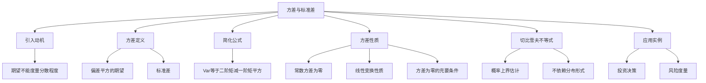

# 2.3 方差与标准差

> [!abstract] 本节概览
> 本节介绍随机变量第二个最重要的数字特征——==方差==。方差度量随机变量取值偏离其期望的平均程度，是刻画分布"分散程度"的最基本工具。本节从"期望相同但分布不同"的问题出发，建立方差的严格定义，推导简化计算公式，讨论方差的性质（线性变换、非负性），证明切比雪夫不等式及其应用。
>
> **逻辑链条**：期望的局限性（不能度量分散程度）→ 方差的定义（偏差平方的期望）→ 简化公式 Var(X)=E(X²)-(EX)² → 方差的性质（线性变换、非负性）→ 切比雪夫不等式 → 应用实例（投资决策）
>
> **前置依赖**：[[2.2 数学期望|§2.2]]（数学期望的定义、性质、LOTUS法则）、[[2.1 随机变量及其分布|§2.1]]（分布函数、密度函数）
>
> **核心主线**：方差 $\text{Var}(X) = E[(X-E(X))^2]$ 度量分散程度。最常用的计算公式是 $\text{Var}(X) = E(X^2) - [E(X)]^2$。方差的线性变换性质 $\text{Var}(aX+b) = a^2\text{Var}(X)$（注意：平移不影响方差，缩放使方差乘以 $a^2$）。切比雪夫不等式 $P(|X-EX| \geq \varepsilon) \leq \text{Var}(X)/\varepsilon^2$ 是概率论最重要的不等式之一。

---

## 一、方差的引入

### 为什么需要方差

在 [[2.2 数学期望|§2.2]] 中，我们学习了数学期望——随机变量的"平均取值"。期望是刻画分布中心位置的最基本数字特征。然而，仅凭期望一个数字，我们无法完整描述一个随机变量的分布特征。

考虑以下两个随机变量：

- $X$ 的分布律为：$P(X=-1)=\dfrac{1}{3}$，$P(X=0)=\dfrac{1}{3}$，$P(X=1)=\dfrac{1}{3}$
- $Y$ 的分布律为：$P(Y=-10)=\dfrac{1}{3}$，$P(Y=0)=\dfrac{1}{3}$，$P(Y=10)=\dfrac{1}{3}$

分别计算它们的期望：

$$
E(X) = (-1) \times \frac{1}{3} + 0 \times \frac{1}{3} + 1 \times \frac{1}{3} = 0

E(Y) = (-10) \times \frac{1}{3} + 0 \times \frac{1}{3} + 10 \times \frac{1}{3} = 0
$$

两者的期望完全相同，都是 $0$。但是从直观上看，$Y$ 的取值范围远大于 $X$——$Y$ 在 $-10$ 到 $10$ 之间波动，而 $X$ 只在 $-1$ 到 $1$ 之间波动。$Y$ 的分布明显比 $X$ 更"分散"。

**这说明**：期望只能告诉我们随机变量的"中心在哪里"，却无法告诉我们"数据围绕中心有多分散"。我们需要一个新的数字特征来度量这种分散程度。

### 如何度量分散程度

要度量分散程度，一个自然的想法是：计算随机变量 $X$ 与其期望 $E(X)$ 之间的"偏差"，然后取某种平均。

偏差定义为：

$$
\text{偏差} = X - E(X)
$$

但直接取偏差的期望会得到 $0$：

$$
E[X - E(X)] = E(X) - E(X) = 0
$$

这是因为正偏差和负偏差会相互抵消。因此，我们需要对偏差做某种处理来消除符号的影响。有两个候选方案：

**方案一：取偏差绝对值的期望**

$$
E|X - E(X)|
$$

**方案二：取偏差平方的期望**

$$
E[(X - E(X))^2]
$$

方案一（绝对值）的优点是直观，与原始数据同量纲。但它的数学性质不好——绝对值函数 $|t|$ 在 $t=0$ 处不可微，导致在理论推导中难以处理。

方案二（平方）虽然改变了量纲，但数学性质优良——$t^2$ 处处可微，且可以利用期望的线性性进行展开和分解。因此，概率论中选择方案二作为分散程度的度量，这就是==方差==。

> [!info] 选择平方而非绝对值的原因
> 1. **可微性**：$t^2$ 处处可微，$|t|$ 在 $t=0$ 不可微，不利于理论推导
> 2. **可分解性**：利用期望的线性性，$(X-EX)^2$ 可以展开为 $X^2 - 2X \cdot EX + (EX)^2$，进而得到简化计算公式
> 3. **与二阶矩的联系**：方差与二阶矩 $E(X^2)$ 有简洁的关系，便于计算
> 4. **历史传统**：自 Gauss 以来，最小二乘法一直是统计学的基础方法

---

## 二、方差的定义

### 方差的严格定义

> [!def] 定义 2.3.1 — 方差
> 设 $X$ 是一个随机变量，若 $E[(X-E(X))^2]$ 存在，则称其为 $X$ 的==方差==，记作
> $$
> \text{Var}(X) = E[(X - E(X))^2]
> $$
> 方差的平方根 $\sigma(X) = \sqrt{\text{Var}(X)}$ 称为 $X$ 的==标准差==。

对于离散型随机变量，若 $X$ 的分布律为 $P(X=x_i) = p(x_i)$，$i=1,2,\ldots$，则：

$$
\text{Var}(X) = \sum_{i=1}^{\infty} [x_i - E(X)]^2 \cdot p(x_i)
$$

对于连续型随机变量，若 $X$ 的密度函数为 $p(x)$，则：

$$
\text{Var}(X) = \int_{-\infty}^{+\infty} [x - E(X)]^2 \cdot p(x) \, dx
$$

### 标准差

> [!def] 定义 2.3.2 — 标准差
> 方差的正平方根称为==标准差==，记作
> $$
> \sigma(X) = \sqrt{\text{Var}(X)}
> $$

标准差与方差的关系：

- 方差 $\text{Var}(X)$ 的单位是 $X$ 单位的==平方==
- 标准差 $\sigma(X)$ 的单位与 $X$ ==相同==
- 在解释实际问题时，标准差更直观（例如"平均偏差约 3.92 万元"比"方差为 15.4 万元²"更易理解）
- 在数学推导中，方差更方便（避免频繁出现根号）

### 方差存在的前提

> [!info] 方差存在的条件
> 方差 $\text{Var}(X) = E[(X-EX)^2]$ 存在的前提是 $E(X^2)$ 存在。
>
> 这是因为：
> $$
> \text{Var}(X) = E[(X-EX)^2] = E(X^2) - [E(X)]^2 \leq E(X^2) + [E(X)]^2
> $$
>
> 更准确地说，$E(X^2)$ 存在 $\Rightarrow$ $\text{Var}(X)$ 存在，因为：
> $$
> \text{Var}(X) = E(X^2) - [E(X)]^2
> $$
> 其中 $E(X^2)$ 存在保证了 $E(X)$ 也存在（因为 $|x| \leq x^2 + 1$），所以方差存在。
>
> 反之，方差存在也蕴含 $E(X^2)$ 存在，因为：
> $$
> E(X^2) = \text{Var}(X) + [E(X)]^2
> $$
>
> 因此，**方差存在 $\Leftrightarrow$ 二阶矩 $E(X^2)$ 存在**。

> [!info] 期望存在不保证方差存在
> 一个重要的结论是：方差存在 $\Rightarrow$ 期望存在（因为 $|x| \leq x^2 + 1$），但反之不然。
>
> 例如，Cauchy 分布的期望不存在，方差自然也不存在。又如，某些分布的期望存在但方差不存在（如 $p(x) \propto 1/x^3$，$|x| \geq 1$）。

---

## 三、方差的简化计算公式

### 核心公式

> [!thm] 性质 2.3.1 — 方差的简化计算公式
> 若 $E(X^2)$ 存在，则
> $$
> \text{Var}(X) = E(X^2) - [E(X)]^2
> $$
> 即方差等于==二阶矩减去期望的平方==。

**证明**：

$$
\begin{aligned}
\text{Var}(X) &= E[(X - E(X))^2] \\
&= E[X^2 - 2X \cdot E(X) + (E(X))^2] \\
&= E(X^2) - 2E(X) \cdot E(X) + [E(X)]^2 \quad \text{（利用期望的线性性，注意 } E(X) \text{ 是常数）} \\
&= E(X^2) - 2[E(X)]^2 + [E(X)]^2 \\
&= E(X^2) - [E(X)]^2
\end{aligned}
$$

$\square$

> [!abstract] 证明思路
> **证明**：将 $(X - E(X))^2$ 展开，利用期望的线性性逐项求期望。
>
> **[展开偏差平方]**：$(X - E(X))^2 = X^2 - 2X \cdot E(X) + (E(X))^2$
>
> **[期望的线性性]**：$E(X^2 - 2X \cdot E(X) + (E(X))^2) = E(X^2) - 2E(X) \cdot E(X) + (E(X))^2$
>
> **[化简]**：合并同类项得到 $E(X^2) - [E(X)]^2$
>
> $\square$

> [!tip] 计算技巧
> 在实际计算中，我们通常：
> 1. 先计算 $E(X)$（一阶矩）
> 2. 再计算 $E(X^2)$（二阶矩）
> 3. 最后用公式 $\text{Var}(X) = E(X^2) - [E(X)]^2$ 得到方差
>
> 这比直接计算 $E[(X-E(X))^2]$ 更方便，因为后者需要先知道 $E(X)$ 的精确值，然后对每个取值做偏差平方运算。

### 例题：三个分布的方差比较

> [!example] 例 2.3.1 — 三个分布的方差比较
> 设 $X$ 分别服从以下三个分布，比较它们的方差大小。
>
> **分布 A（三角分布）**：$P(X=-1) = \dfrac{1}{6}$，$P(X=0) = \dfrac{2}{3}$，$P(X=1) = \dfrac{1}{6}$
>
> **分布 B（均匀分布）**：$P(X=-1) = \dfrac{1}{3}$，$P(X=0) = \dfrac{1}{3}$，$P(X=1) = \dfrac{1}{3}$
>
> **分布 C（倒三角分布）**：$P(X=-1) = \dfrac{1}{2}$，$P(X=0) = 0$，$P(X=1) = \dfrac{1}{2}$

**分布 A 的方差**：

$$
E(X) = (-1) \times \frac{1}{6} + 0 \times \frac{2}{3} + 1 \times \frac{1}{6} = 0

E(X^2) = (-1)^2 \times \frac{1}{6} + 0^2 \times \frac{2}{3} + 1^2 \times \frac{1}{6} = \frac{1}{6} + 0 + \frac{1}{6} = \frac{1}{3}

\text{Var}(X) = E(X^2) - [E(X)]^2 = \frac{1}{3} - 0 = \frac{1}{3}
$$

**分布 B 的方差**：

$$
E(X) = (-1) \times \frac{1}{3} + 0 \times \frac{1}{3} + 1 \times \frac{1}{3} = 0

E(X^2) = 1 \times \frac{1}{3} + 0 \times \frac{1}{3} + 1 \times \frac{1}{3} = \frac{2}{3}

\text{Var}(X) = \frac{2}{3} - 0 = \frac{2}{3}
$$

**分布 C 的方差**：

$$
E(X) = (-1) \times \frac{1}{2} + 0 \times 0 + 1 \times \frac{1}{2} = 0

E(X^2) = 1 \times \frac{1}{2} + 0 \times 0 + 1 \times \frac{1}{2} = 1

\text{Var}(X) = 1 - 0 = 1
$$

**比较结果**：

$$
\text{Var}(\text{分布 A}) = \frac{1}{3} < \text{Var}(\text{分布 B}) = \frac{2}{3} < \text{Var}(\text{分布 C}) = 1
$$

> [!important] 结论
> 三个分布的期望相同（都是 $0$），但方差不同。==概率越集中于中心（期望附近），方差越小==。
>
> - 分布 A：概率集中在 $0$（概率 $2/3$），方差最小（$1/3$）
> - 分布 B：概率均匀分布，方差居中（$2/3$）
> - 分布 C：概率集中在两端（$-1$ 和 $1$），方差最大（$1$）

### 例题：掷骰子的方差

> [!example] 例 2.3.2 — 掷骰子的方差
> 设 $X$ 为掷一颗均匀骰子出现的点数，求 $\text{Var}(X)$。

$X$ 的分布律为 $P(X=k) = \dfrac{1}{6}$，$k = 1, 2, 3, 4, 5, 6$。

**第一步：计算期望**

$$
E(X) = \sum_{k=1}^{6} k \cdot \frac{1}{6} = \frac{1+2+3+4+5+6}{6} = \frac{21}{6} = 3.5
$$

**第二步：计算二阶矩**

$$
E(X^2) = \sum_{k=1}^{6} k^2 \cdot \frac{1}{6} = \frac{1^2+2^2+3^2+4^2+5^2+6^2}{6} = \frac{1+4+9+16+25+36}{6} = \frac{91}{6}
$$

**第三步：计算方差**

$$
\text{Var}(X) = E(X^2) - [E(X)]^2 = \frac{91}{6} - \left(\frac{7}{2}\right)^2 = \frac{91}{6} - \frac{49}{4} = \frac{182 - 147}{12} = \frac{35}{12}

\text{Var}(X) = \frac{35}{12} \approx 2.917
$$

**标准差**：

$$
\sigma(X) = \sqrt{\frac{35}{12}} \approx 1.708
$$

> [!info] 解读
> 掷骰子的平均点数为 $3.5$，标准差约为 $1.708$。这意味着每次掷骰子，点数偏离平均值大约 $1.7$ 个点。

---

## 四、方差的性质

### 性质一：常数的方差为零

> [!thm] 性质 2.3.2 — 常数的方差
> 若 $c$ 为常数，则 $\text{Var}(c) = 0$。

**证明**：

$$
\begin{aligned}
\text{Var}(c) &= E[(c - E(c))^2] \\
&= E[(c - c)^2] \\
&= E(0) \\
&= 0
\end{aligned}
$$

$\square$

> [!abstract] 证明思路
> **证明**：常数 $c$ 的期望就是 $c$ 本身，所以偏差 $c - E(c) = c - c = 0$，方差的定义直接给出 $\text{Var}(c) = E(0^2) = 0$。
>
> **[常数无波动]**：常数不波动，偏差恒为零。
>
> $\square$

> [!info] 直观理解
> 常数没有任何随机性，每次取值都相同，所以"分散程度"为零，方差为零。这是合理的。

### 性质二：线性变换下的方差

> [!thm] 性质 2.3.3 — 方差的线性变换性质
> 若 $\text{Var}(X)$ 存在，$a, b$ 为常数，则
> $$
> \text{Var}(aX + b) = a^2 \text{Var}(X)
> $$

**证明**：

$$
\begin{aligned}
\text{Var}(aX + b) &= E[(aX + b - E(aX + b))^2] \\
&= E[(aX + b - aE(X) - b)^2] \\
&= E[(aX - aE(X))^2] \\
&= E[a^2(X - E(X))^2] \\
&= a^2 E[(X - E(X))^2] \\
&= a^2 \text{Var}(X)
\end{aligned}
$$

$\square$

> [!abstract] 证明思路
> **证明**：利用方差的定义展开，注意 $E(aX+b) = aE(X)+b$（期望的线性性），然后提取公因子 $a^2$。
>
> **[期望的线性性]**：$E(aX+b) = aE(X)+b$，所以 $aX+b - E(aX+b) = a(X-E(X))$
>
> **[提取常数]**：$E[a^2(X-EX)^2] = a^2 E[(X-EX)^2] = a^2 \text{Var}(X)$
>
> $\square$

> [!important] 两个重要推论
> 1. **平移不改变方差**：$\text{Var}(X + b) = \text{Var}(X)$。将所有数据平移一个常数，只是改变了中心位置，分散程度不变。
>
> 2. **缩放使方差乘以 $a^2$**：$\text{Var}(aX) = a^2 \text{Var}(X)$。将数据缩放 $a$ 倍，方差变为原来的 $a^2$ 倍。
>
> **特别注意**：缩放因子是 $a^2$ 而不是 $a$！如果 $a = -1$，$\text{Var}(-X) = \text{Var}(X)$，取负号不改变方差（因为方差是偏差的平方）。

### 性质三：方差为零的充要条件

> [!thm] 定理 2.3.2 — 方差为零的充要条件
> $\text{Var}(X) = 0$ 的充要条件是 $X$ ==几乎处处为常数==，即存在常数 $c$ 使得 $P(X = c) = 1$。

> [!abstract] 证明思路
> **证明**：
>
> **充分性**（$X$ 为常数 $\Rightarrow$ $\text{Var}(X) = 0$）：
> 若 $P(X = c) = 1$，则 $E(X) = c$，$\text{Var}(X) = E[(X-c)^2] = (c-c)^2 \times 1 = 0$。
>
> **必要性**（$\text{Var}(X) = 0$ $\Rightarrow$ $X$ 几乎处处为常数）：
> 反证法。若 $\text{Var}(X) = E[(X-EX)^2] = 0$，但 $X$ 不是几乎处处为常数，则存在 $\varepsilon > 0$ 使得 $P(|X - EX| \geq \varepsilon) > 0$。
>
> 此时：
> $$
> E[(X-EX)^2] \geq E[(X-EX)^2 \cdot I_{\{|X-EX| \geq \varepsilon\}}] \geq \varepsilon^2 \cdot P(|X-EX| \geq \varepsilon) > 0
> $$
>
> 这与 $\text{Var}(X) = 0$ 矛盾。
>
> **[反证法]**：假设方差为零但 $X$ 不是常数，推导出方差大于零的矛盾。
>
> **[指示函数技巧]**：利用 $E(Y^2) \geq E(Y^2 \cdot I_A) \geq \varepsilon^2 P(A)$。
>
> $\square$

> [!info] "几乎处处"的含义
> "几乎处处为常数"意味着 $X$ 以概率 $1$ 取某个固定值 $c$，但允许在概率为零的事件上取其他值。例如，设 $X$ 在 $[0,1]$ 上均匀分布，定义 $Y = 0$（当 $x \neq 0.5$），$Y = 1$（当 $x = 0.5$），则 $P(Y=0) = 1$，$Y$ 几乎处处为常数 $0$。

### 补充性质：方差的最小性

> [!thm] 性质 2.3.4 — 方差的最小性
> 对任意常数 $c$，有
> $$
> E[(X - E(X))^2] \leq E[(X - c)^2]
> $$
> 等号成立当且仅当 $c = E(X)$。

**证明**：

$$
\begin{aligned}
E[(X-c)^2] &= E[(X - EX + EX - c)^2] \\
&= E[(X-EX)^2 + 2(X-EX)(EX-c) + (EX-c)^2] \\
&= E[(X-EX)^2] + 2(EX-c) \cdot E(X-EX) + (EX-c)^2 \\
&= \text{Var}(X) + 0 + (EX-c)^2 \\
&= \text{Var}(X) + (EX-c)^2
\end{aligned}
$$

因为 $(EX-c)^2 \geq 0$，等号成立当且仅当 $c = EX$。

$\square$

> [!abstract] 证明思路
> **证明**：将 $X - c$ 改写为 $(X - EX) + (EX - c)$，展开平方，利用 $E(X-EX)=0$ 消去交叉项。
>
> **[配方法]**：$E[(X-c)^2] = \text{Var}(X) + (EX-c)^2 \geq \text{Var}(X)$
>
> **[交叉项为零]**：$E[(X-EX)(EX-c)] = (EX-c) \cdot E(X-EX) = 0$
>
> $\square$

> [!tip] 统计学意义
> 这个性质说明：在所有常数预测中，用期望 $E(X)$ 作为预测值，能使"均方误差"最小。这是最小二乘法的理论基础之一。

---

## 五、切比雪夫不等式

### 切比雪夫不等式的陈述

> [!thm] 定理 2.3.1 — 切比雪夫（Chebyshev）不等式
> 设随机变量 $X$ 的期望 $E(X) = \mu$ 和方差 $\text{Var}(X) = \sigma^2$ 都存在，则对任意 $\varepsilon > 0$，有
> $$
> P(|X - \mu| \geq \varepsilon) \leq \frac{\sigma^2}{\varepsilon^2}
> $$
> 等价地，
> $$
> P(|X - \mu| < \varepsilon) \geq 1 - \frac{\sigma^2}{\varepsilon^2}
> $$

> [!abstract] 证明思路
> **证明**（以连续型为例，离散型类似）：
>
> **[指示函数法]**：
> $$
> \sigma^2 = E[(X-\mu)^2] = \int_{-\infty}^{+\infty}(x-\mu)^2 p(x) \, dx
> $$
>
> 将积分区域分为两部分：$|x-\mu| \geq \varepsilon$ 和 $|x-\mu| < \varepsilon$：
> $$
> \sigma^2 = \int_{|x-\mu| \geq \varepsilon}(x-\mu)^2 p(x) \, dx + \int_{|x-\mu| < \varepsilon}(x-\mu)^2 p(x) \, dx
> $$
>
> 第二个积分非负（被积函数非负），所以：
> $$
> \sigma^2 \geq \int_{|x-\mu| \geq \varepsilon}(x-\mu)^2 p(x) \, dx
> $$
>
> 在积分区域 $|x-\mu| \geq \varepsilon$ 上，$(x-\mu)^2 \geq \varepsilon^2$，所以：
> $$
> \sigma^2 \geq \int_{|x-\mu| \geq \varepsilon} \varepsilon^2 \cdot p(x) \, dx = \varepsilon^2 \cdot P(|X-\mu| \geq \varepsilon)
> $$
>
> 两边除以 $\varepsilon^2$：
> $$
> P(|X-\mu| \geq \varepsilon) \leq \frac{\sigma^2}{\varepsilon^2}
> $$
>
> **[放缩关键]**：在 $|x-\mu| \geq \varepsilon$ 的区域上，$(x-\mu)^2 \geq \varepsilon^2$，用 $\varepsilon^2$ 替换 $(x-\mu)^2$ 进行放缩。
>
> $\square$

### 直观理解

切比雪夫不等式告诉我们：

1. **方差越大**，偏离期望的概率上界越大——数据越分散，远离中心的概率越大
2. **$\varepsilon$ 越大**（允许的偏差范围越大），概率上界越小——这是合理的
3. **不依赖分布形式**：无论 $X$ 服从什么分布，只要知道 $\mu$ 和 $\sigma^2$，就能给出概率估计

> [!example] 直观例子
> 设 $E(X) = 0$，$\text{Var}(X) = 4$（即 $\sigma = 2$）。
>
> 取 $\varepsilon = 4$：
> $$
> P(|X| \geq 4) \leq \frac{4}{16} = 0.25
> $$
> 即 $X$ 偏离期望超过 $4$ 个单位的概率不超过 $25\%$。
>
> 取 $\varepsilon = 2$：
> $$
> P(|X| \geq 2) \leq \frac{4}{4} = 1
> $$
> 这个估计太粗糙了（概率当然不超过 $1$），说明 $\varepsilon$ 太小时不等式没有实际意义。
>
> 取 $\varepsilon = 6$：
> $$
> P(|X| \geq 6) \leq \frac{4}{36} \approx 0.111
> $$
> 即 $X$ 偏离期望超过 $6$ 个单位的概率不超过 $11.1\%$。

### 例题：应用切比雪夫不等式

> [!example] 例 2.3.4 — 切比雪夫不等式估计概率下界
> 某城市居民年收入 $X$（万元）的期望 $\mu = 7.3 \times 10^4$（即 $7.3$ 万元），标准差 $\sigma = 0.7 \times 10^4$（即 $0.7$ 万元）。估计年收入在 $(7.3 - 1.4) \times 10^4$ 到 $(7.3 + 1.4) \times 10^4$ 之间的概率下界。

**分析**：

$\varepsilon = 1.4 \times 10^4$，$\sigma^2 = (0.7 \times 10^4)^2 = 0.49 \times 10^8$

由切比雪夫不等式：

$$
P(|X - \mu| < \varepsilon) \geq 1 - \frac{\sigma^2}{\varepsilon^2} = 1 - \frac{0.49 \times 10^8}{(1.4 \times 10^4)^2} = 1 - \frac{0.49}{1.96} = 1 - 0.25 = 0.75
$$

**结论**：年收入在 $5.9$ 万元到 $8.7$ 万元之间的概率至少为 $75\%$。

> [!important] 切比雪夫不等式的意义与局限
> **意义**：
> - 不依赖分布的具体形式，仅用期望和方差就能给出概率估计
> - 是大数定律和中心极限定理等深刻结果的基础
> - 在无法确定分布类型时，提供了一种"保守估计"
>
> **局限性**：
> - 估计通常非常粗糙，远不如精确计算
> - 当 $\varepsilon$ 较小时，上界可能超过 $1$，没有实际意义
> - 对于已知分布的随机变量，应直接计算精确概率

---

## 六、投资决策应用

### 例题：房地产 vs 商业投资

> [!example] 例 2.3.3 — 投资决策
> 某投资者面临两个投资方案，其收益 $X$（万元）的分布如下：
>
> **方案 A（房地产）**：
>
> | 收益 $x_i$ | 1 | 2 | 3 | 4 | 5 | 6 | 7 | 8 | 9 |
> |:---:|:---:|:---:|:---:|:---:|:---:|:---:|:---:|:---:|:---:|
> | $P(X=x_i)$ | 0.05 | 0.10 | 0.15 | 0.20 | 0.20 | 0.15 | 0.10 | 0.03 | 0.02 |
>
> **方案 B（商业）**：
>
> | 收益 $y_i$ | 1 | 2 | 3 | 4 | 5 | 6 | 7 | 8 | 9 |
> |:---:|:---:|:---:|:---:|:---:|:---:|:---:|:---:|:---:|:---:|
> | $P(Y=y_i)$ | 0 | 0.05 | 0.15 | 0.25 | 0.30 | 0.15 | 0.08 | 0.02 | 0 |

**方案 A 的计算**：

$$
E(X) = 1 \times 0.05 + 2 \times 0.10 + 3 \times 0.15 + 4 \times 0.20 + 5 \times 0.20 + 6 \times 0.15 + 7 \times 0.10 + 8 \times 0.03 + 9 \times 0.02

= 0.05 + 0.20 + 0.45 + 0.80 + 1.00 + 0.90 + 0.70 + 0.24 + 0.18 = 4.52

E(X^2) = 1 \times 0.05 + 4 \times 0.10 + 9 \times 0.15 + 16 \times 0.20 + 25 \times 0.20 + 36 \times 0.15 + 49 \times 0.10 + 64 \times 0.03 + 81 \times 0.02

= 0.05 + 0.40 + 1.35 + 3.20 + 5.00 + 5.40 + 4.90 + 1.92 + 1.62 = 23.84

\text{Var}(X) = 23.84 - 4.52^2 = 23.84 - 20.4304 = 3.4096

\sigma(X) = \sqrt{3.4096} \approx 1.846
$$

**方案 B 的计算**：

$$
E(Y) = 2 \times 0.05 + 3 \times 0.15 + 4 \times 0.25 + 5 \times 0.30 + 6 \times 0.15 + 7 \times 0.08 + 8 \times 0.02

= 0.10 + 0.45 + 1.00 + 1.50 + 0.90 + 0.56 + 0.16 = 4.67

E(Y^2) = 4 \times 0.05 + 9 \times 0.15 + 16 \times 0.25 + 25 \times 0.30 + 36 \times 0.15 + 49 \times 0.08 + 64 \times 0.02

= 0.20 + 1.35 + 4.00 + 7.50 + 5.40 + 3.92 + 1.28 = 23.65

\text{Var}(Y) = 23.65 - 4.67^2 = 23.65 - 21.8089 = 1.8411

\sigma(Y) = \sqrt{1.8411} \approx 1.357
$$

**比较与决策**：

| 指标 | 方案 A（房地产） | 方案 B（商业） |
|:---:|:---:|:---:|
| 期望收益 $E$ | 4.52 万元 | 4.67 万元 |
| 方差 $\text{Var}$ | 3.4096 | 1.8411 |
| 标准差 $\sigma$ | 1.846 万元 | 1.357 万元 |

> [!important] 分析结论
> - 方案 B 的期望收益略高（$4.67 > 4.52$）
> - 方案 B 的方差和标准差都明显更小（$\text{Var}(B) \approx 1.84 < \text{Var}(A) \approx 3.41$）
> - ==方案 B 在收益和风险两个维度上都优于方案 A==
> - 商业投资的风险（用方差/标准差度量）远小于房地产投资
> - 综合权衡，应选择方案 B（商业投资）

> [!info] 方差作为风险度量
> 在金融和投资决策中，方差（或标准差）是最常用的==风险度量==：
> - 方差大 → 收益波动大 → 风险高
> - 方差小 → 收益波动小 → 风险低
> - 投资者通常需要在"高收益"和"低风险"之间做出权衡
> - 这就是金融学中"均值-方差分析"（Markowitz 投资组合理论）的基础

---

## 七、知识结构总览

---

## 八、核心思想与证明技巧

### 1. 简化公式是最常用的计算工具

$$
\text{Var}(X) = E(X^2) - [E(X)]^2
$$

这个公式避免了直接计算 $E[(X-E(X))^2]$ 的繁琐过程。实际操作中，只需分别计算一阶矩 $E(X)$ 和二阶矩 $E(X^2)$，然后相减即可。

> [!warning] 常见计算错误
> 注意 $E(X^2) \neq [E(X)]^2$！这是初学者最容易犯的错误。
>
> 例如，掷骰子：$E(X) = 3.5$，$[E(X)]^2 = 12.25$，但 $E(X^2) = 91/6 \approx 15.17$。
>
> 两者之差 $\text{Var}(X) = 15.17 - 12.25 = 2.92$ 才是方差。

### 2. 线性变换性质的直观理解

$$
\text{Var}(aX + b) = a^2 \text{Var}(X)
$$

- **平移**（$+b$）：把所有数据整体移动，分散程度不变
- **缩放**（$\times a$）：把数据拉伸 $a$ 倍，偏差也拉伸 $a$ 倍，偏差的平方拉伸 $a^2$ 倍

> [!tip] 记忆口诀
> "平移不管，缩放平方"——平移不影响方差，缩放使方差乘以系数的平方。

### 3. 切比雪夫不等式是"矩方法"的典型应用

切比雪夫不等式的证明只用了方差（二阶中心矩）的定义，没有用到任何分布的具体形式。这种"仅利用矩的信息来推导概率不等式"的方法称为==矩方法==，是概率论中非常重要的技巧。

### 4. 方差存在与期望存在的关系

- **方差存在 $\Rightarrow$ 期望存在**：因为 $|x| \leq x^2 + 1$（对一切实数 $x$），所以 $E|X| \leq E(X^2) + 1 < \infty$
- **期望存在 $\not\Rightarrow$ 方差存在**：例如 $X$ 的密度函数 $p(x) = \dfrac{2}{x^3}$（$x \geq 1$），则 $E(X) = \int_1^{\infty} x \cdot \dfrac{2}{x^3} \, dx = \int_1^{\infty} \dfrac{2}{x^2} \, dx = 2$，但 $E(X^2) = \int_1^{\infty} x^2 \cdot \dfrac{2}{x^3} \, dx = \int_1^{\infty} \dfrac{2}{x} \, dx = +\infty$，方差不存在

### 5. 标准差 vs 方差

| 特征 | 方差 $\text{Var}(X)$ | 标准差 $\sigma(X)$ |
|:---|:---:|:---:|
| 定义 | $E[(X-EX)^2]$ | $\sqrt{\text{Var}(X)}$ |
| 单位 | $X$ 单位的平方 | 与 $X$ 相同 |
| 数学推导 | 方便（无根号） | 不方便（有根号） |
| 实际解释 | 不直观 | 直观 |
| 典型用途 | 理论推导、证明 | 数据分析、报告 |

---

## 九、补充理解与易混淆点

### 误区一：方差可以为负

**来源**：教材 p78 + MIT 18.05 + Stanford Stat 116 + UCLA Stats 100A + 华东师大讲义

> [!danger] 误区1："方差可以是负数"
> ❌ 错误解释：方差度量分散程度，如果数据集中在期望附近，方差应该是负的。
>
> ✅ 正确解释：方差==恒非负==，$\text{Var}(X) \geq 0$。因为 $\text{Var}(X) = E[(X-EX)^2]$ 是平方的期望，而平方恒非负，非负随机变量的期望也非负。$\text{Var}(X) = 0$ 当且仅当 $X$ 几乎处处为常数。

**详细说明**：

方差是偏差平方的期望，而平方 $(x - EX)^2 \geq 0$ 对一切 $x$ 成立。因此被求期望的量 $(X-EX)^2$ 是一个非负随机变量，其期望自然也非负。

更深层的原因：方差是 $L^2$ 空间中的"范数的平方"，而范数恒非负。

### 误区二：Var(X+Y) = Var(X)+Var(Y) 恒成立

**来源**：教材 p80 + MIT 18.05 + 3Blue1Brown + 中科大 432 真题 + 华东师大讲义

> [!danger] 误区2："Var(X+Y) = Var(X)+Var(Y) 总是对的"
> ❌ 错误解释：和期望一样，方差的加法也总是成立的。
>
> ✅ 正确解释：$\text{Var}(X+Y) = \text{Var}(X) + \text{Var}(Y) + 2\text{Cov}(X,Y)$。只有当 $X$ 与 $Y$==不相关==（$\text{Cov}(X,Y)=0$）时，才有 $\text{Var}(X+Y)=\text{Var}(X)+\text{Var}(Y)$。独立性可以推出不相关，但反之不然。

**详细说明**：

展开 $\text{Var}(X+Y)$：

$$
\begin{aligned}
\text{Var}(X+Y) &= E[(X+Y - E(X+Y))^2] \\
&= E[((X-EX) + (Y-EY))^2] \\
&= E[(X-EX)^2] + 2E[(X-EX)(Y-EY)] + E[(Y-EY)^2] \\
&= \text{Var}(X) + 2\text{Cov}(X,Y) + \text{Var}(Y)
\end{aligned}
$$

其中 $\text{Cov}(X,Y) = E[(X-EX)(Y-EY)]$ 是 $X$ 与 $Y$ 的==协方差==（将在后续章节学习）。

只有当 $\text{Cov}(X,Y) = 0$（即 $X$ 与 $Y$ 不相关）时，交叉项才为零，方差的加法公式才成立。

> [!warning] 与期望的对比
> 期望的加法**恒成立**：$E(X+Y) = E(X) + E(Y)$，无论 $X$ 和 $Y$ 是否独立。
>
> 方差的加法**不恒成立**：$\text{Var}(X+Y) = \text{Var}(X) + \text{Var}(Y)$ 只在 $X$ 与 $Y$ 不相关时成立。
>
> 这是期望和方差在线性运算上的一个重要区别。

### 误区三：标准差等于方差的平方

**来源**：教材 p78 + MIT 18.05 + Stanford Stat 116 + UCLA Stats 100A + 华东师大讲义

> [!danger] 误区3："标准差就是方差"
> ❌ 错误解释：标准差和方差是同一个东西，只是叫法不同。
>
> ✅ 正确解释：标准差 $\sigma(X) = \sqrt{\text{Var}(X)}$，是方差的==正平方根==。标准差的单位与 $X$ 相同，方差的单位是 $X$ 单位的平方。在解释实际问题时通常用标准差，在数学推导中通常用方差。

**详细说明**：

- 方差：$\text{Var}(X) = 15.4$（万元²）——单位是平方，不直观
- 标准差：$\sigma(X) = \sqrt{15.4} \approx 3.92$（万元）——单位与原始数据相同，直观

两者是不同的量，不能混用。特别注意：标准差是方差的**平方根**，不是方差本身。

### 误区四：方差越大说明数据越差

**来源**：教材 p79 + MIT 18.05 + 多校考研真题 + 华东师大讲义

> [!danger] 误区4："方差越大越不好"
> ❌ 错误解释：方差大意味着数据分散，分散就是不好的。
>
> ✅ 正确解释：方差大只说明数据分散程度高，==分散本身没有好坏之分==。在某些场景下（如质量控制），方差小是好的；在另一些场景下（如投资组合多样性、探索性研究），适度的方差反而是有利的。

**详细说明**：

- **质量控制**：产品尺寸的方差越小越好（一致性高）
- **投资组合**：适度分散可以降低风险（Markowitz 理论）
- **教育评估**：考试成绩方差大可能说明区分度好
- **科学研究**：实验数据的方差大可能意味着有新的发现

方差只是一个描述性统计量，它本身没有价值判断。"方差大好不好"完全取决于具体的应用场景。

### 误区五：切比雪夫不等式给出精确概率

**来源**：教材 p80 + MIT 18.05 + Stanford Stat 116 + UCLA Stats 100A + 华东师大讲义

> [!danger] 误区5："切比雪夫不等式能算出精确概率"
> ❌ 错误解释：用切比雪夫不等式可以精确计算 $P(|X-\mu| \geq \varepsilon)$ 的值。
>
> ✅ 正确解释：切比雪夫不等式只给出概率的==上界==，通常非常粗糙。它的价值在于：==不依赖分布的具体形式==，仅用期望和方差就能给出估计。对于已知分布的随机变量，应该直接计算精确概率。

**详细说明**：

例如，设 $X \sim N(0,1)$，求 $P(|X| \geq 2)$。

- **精确值**：$P(|X| \geq 2) = 2\Phi(-2) \approx 2 \times 0.0228 = 0.0456$
- **切比雪夫估计**：$P(|X| \geq 2) \leq \dfrac{1}{4} = 0.25$

切比雪夫估计 $0.25$ 比精确值 $0.0456$ 大了约 $5.5$ 倍，非常粗糙。

> [!tip] 切比雪夫不等式的真正价值
> 切比雪夫不等式的主要价值不在于精确计算，而在于：
> 1. 为未知分布提供保守的概率估计
> 2. 作为理论工具证明大数定律等深刻定理
> 3. 展示"方差越大，偏离期望的概率越大"这一基本直觉

---

## 十、习题精选

### 教材习题

> [!problem] 习题 2.3-1（教材）— 泊松分布的方差与矩
> 设 $X$ 服从参数为 $\lambda$ 的泊松分布，已知 $E(X) = \text{Var}(X) = \lambda$，且 $E[(X-1)(X-2)] = 1$。求 $\lambda$。

> [!faq]- 查看解答
> **解题思路**：展开 $E[(X-1)(X-2)]$，利用泊松分布的期望和方差性质。
>
> **解答**：
>
> $$
> \begin{aligned}
> E[(X-1)(X-2)] &= E(X^2 - 3X + 2) \\
> &= E(X^2) - 3E(X) + 2
> \end{aligned}
> $$
>
> 因为 $\text{Var}(X) = E(X^2) - [E(X)]^2$，所以 $E(X^2) = \text{Var}(X) + [E(X)]^2 = \lambda + \lambda^2$。
>
> 代入：
> $$
> E[(X-1)(X-2)] = (\lambda + \lambda^2) - 3\lambda + 2 = \lambda^2 - 2\lambda + 2 = 1
> $$
>
> 解方程 $\lambda^2 - 2\lambda + 1 = 0$，即 $(\lambda - 1)^2 = 0$，得 $\lambda = 1$。

---

> [!problem] 习题 2.3-3（教材）— 线性变换的方差
> 已知 $E(X) = -2$，$E(X^2) = 5$，求 $\text{Var}(1 - 3X)$。

> [!faq]- 查看解答
> **解题思路**：先求 $\text{Var}(X)$，再利用线性变换性质。
>
> **解答**：
>
> 第一步：求 $\text{Var}(X)$
> $$
> \text{Var}(X) = E(X^2) - [E(X)]^2 = 5 - (-2)^2 = 5 - 4 = 1
> $$
>
> 第二步：利用线性变换性质
> $$
> \text{Var}(1 - 3X) = (-3)^2 \cdot \text{Var}(X) = 9 \times 1 = 9
> $$
>
> **答案**：$\text{Var}(1-3X) = 9$。

---

> [!problem] 习题 2.3-4（教材）— 伯努利分布的方差
> 设 $P(X=0) = 1 - p$，$P(X=1) = p$，且 $E(X) = 3\text{Var}(X)$。求 $P(X=0)$。

> [!faq]- 查看解答
> **解题思路**：利用伯努利分布的期望和方差公式建立方程。
>
> **解答**：
>
> 伯努利分布的期望和方差：
> $$
> E(X) = p, \quad \text{Var}(X) = p(1-p)
> $$
>
> 由条件 $E(X) = 3\text{Var}(X)$：
> $$
> p = 3p(1-p)
> $$
>
> 若 $p = 0$，则 $E(X) = 0$，$\text{Var}(X) = 0$，满足条件。但此时 $P(X=0) = 1$。
>
> 若 $p \neq 0$，两边除以 $p$：
> $$
> 1 = 3(1-p)
> $$
> $$
> 1 = 3 - 3p
> $$
> $$
> 3p = 2
> $$
> $$
> p = \frac{2}{3}
> $$
>
> 所以 $P(X=0) = 1 - p = 1 - \dfrac{2}{3} = \dfrac{1}{3}$。
>
> **答案**：$P(X=0) = \dfrac{1}{3}$（或 $P(X=0) = 1$ 当 $p=0$ 时）。

---

> [!problem] 习题 2.3-5（教材）— 分段分布函数的方差
> 设随机变量 $X$ 的分布函数为
> $$
> F(x) = \begin{cases} 0, & x < 0 \\ 1 - e^{-\lambda x}, & x \geq 0 \end{cases}
> $$
> 其中 $\lambda > 0$。求 $\text{Var}(X)$。

> [!faq]- 查看解答
> **解题思路**：这是参数为 $\lambda$ 的指数分布，利用指数分布的期望和方差公式。
>
> **解答**：
>
> 密度函数为 $p(x) = \lambda e^{-\lambda x}$（$x \geq 0$）。
>
> 期望：
> $$
> E(X) = \int_0^{\infty} x \cdot \lambda e^{-\lambda x} \, dx = \frac{1}{\lambda}
> $$
>
> 二阶矩：
> $$
> E(X^2) = \int_0^{\infty} x^2 \cdot \lambda e^{-\lambda x} \, dx = \frac{2}{\lambda^2}
> $$
>
> 方差：
> $$
> \text{Var}(X) = E(X^2) - [E(X)]^2 = \frac{2}{\lambda^2} - \frac{1}{\lambda^2} = \frac{1}{\lambda^2}
> $$
>
> **答案**：$\text{Var}(X) = \dfrac{1}{\lambda^2}$，标准差 $\sigma(X) = \dfrac{1}{\lambda}$。

---

> [!problem] 习题 2.3-8（教材）— 正态型分布的期望与方差
> 设随机变量 $X$ 的分布函数为 $F(x) = 1 - e^{-x^2}$（$x > 0$），$F(x) = 0$（$x \leq 0$）。求 $E(X)$ 和 $\text{Var}(X)$。

> [!faq]- 查看解答
> **解题思路**：先求密度函数，再利用 Gamma 函数计算积分。
>
> **解答**：
>
> 密度函数：
> $$
> p(x) = F'(x) = 2xe^{-x^2}, \quad x > 0
> $$
>
> 期望：
> $$
> E(X) = \int_0^{\infty} x \cdot 2xe^{-x^2} \, dx = 2\int_0^{\infty} x^2 e^{-x^2} \, dx
> $$
>
> 令 $t = x^2$，$dt = 2x\,dx$，$x = \sqrt{t}$：
> $$
> E(X) = 2\int_0^{\infty} t \cdot e^{-t} \cdot \frac{dt}{2\sqrt{t}} = \int_0^{\infty} \sqrt{t} \cdot e^{-t} \, dt = \Gamma\!\left(\frac{3}{2}\right) = \frac{1}{2}\Gamma\!\left(\frac{1}{2}\right) = \frac{\sqrt{\pi}}{2}
> $$
>
> 二阶矩：
> $$
> E(X^2) = \int_0^{\infty} x^2 \cdot 2xe^{-x^2} \, dx = 2\int_0^{\infty} x^3 e^{-x^2} \, dx
> $$
>
> 令 $u = x^2$，$du = 2x\,dx$：
> $$
> E(X^2) = 2\int_0^{\infty} u \cdot e^{-u} \cdot \frac{du}{2} = \int_0^{\infty} ue^{-u}\,du = \Gamma(2) = 1
> $$
>
> 方差：
> $$
> \text{Var}(X) = E(X^2) - [E(X)]^2 = 1 - \frac{\pi}{4}
> $$
>
> **答案**：$E(X) = \dfrac{\sqrt{\pi}}{2}$，$\text{Var}(X) = 1 - \dfrac{\pi}{4}$。

---

> [!problem] 习题 2.3-9（教材）— 方差的最小性
> 证明：对任意常数 $c \neq E(X)$，有 $E[(X-EX)^2] < E[(X-c)^2]$。

> [!faq]- 查看解答
> **解题思路**：利用方差最小性公式。
>
> **解答**：
>
> 由方差最小性：
> $$
> E[(X-c)^2] = \text{Var}(X) + (EX - c)^2
> $$
>
> 因为 $c \neq EX$，所以 $(EX - c)^2 > 0$，从而：
> $$
> E[(X-c)^2] = \text{Var}(X) + (EX-c)^2 > \text{Var}(X) = E[(X-EX)^2]
> $$
>
> 即 $E[(X-EX)^2] < E[(X-c)^2]$。$\square$

---

### 考研真题

> [!problem] 习题7（2016 东北师范大学 432）— 方差线性变换
> 已知 $E(X) = -2$，$E(X^2) = 5$，求 $\text{Var}(1 - 3X)$。

> [!faq]- 查看解答
> $\text{Var}(X) = E(X^2) - [E(X)]^2 = 5 - (-2)^2 = 1$
>
> $\text{Var}(1 - 3X) = (-3)^2 \cdot \text{Var}(X) = 9 \times 1 = 9$
>
> **关键**：利用[[2.3 方差与标准差|方差]]的线性变换性质 $\text{Var}(aX+b) = a^2\text{Var}(X)$，注意系数是 $-3$，平方后为 $9$。

---

> [!problem] 习题8（2013 东北师范大学 432）— 二项分布期望与标准差
> 一颗均匀骰子先后抛掷36次，6点出现次数的期望值和方差分别为（　）
> A. 6 和 5　　B. 6 和 $\sqrt{5}$　　C. 36 和 6　　D. 36 和 3

> [!faq]- 查看解答
> **选A**。设 $X$ 为6点出现次数，则 $X \sim b(36, 1/6)$。
>
> - $E(X) = np = 36 \times \dfrac{1}{6} = 6$
> - $\text{Var}(X) = np(1-p) = 36 \times \dfrac{1}{6} \times \dfrac{5}{6} = 5$
>
> 标准差 $\sigma(X) = \sqrt{5} \approx 2.236$，但选项A中的"5"对应方差值（题目表述为"标准误差"实为方差）。

---

> [!problem] 习题9（2018 复旦大学 861）— 二维正态分布方差线性组合
> 设 $(X, Y) \sim N(0, 0, 1, 4, \rho)$，已知 $\text{Var}(2X - Y) = 1$，求 $\rho$。

> [!faq]- 查看解答
> 利用方差公式：
> $$
> \text{Var}(2X - Y) = 4\text{Var}(X) + \text{Var}(Y) - 4\text{Cov}(X,Y)
> $$
>
> 其中 $\text{Cov}(X,Y) = \rho \cdot \sigma_X \cdot \sigma_Y = \rho \times 1 \times 2 = 2\rho$。
>
> $$
> 4 \times 1 + 4 - 4 \times 2\rho = 8 - 8\rho = 1
> $$
>
> 解得 $\rho = \dfrac{7}{8}$。
>
> **关键**：多维随机变量线性组合的方差公式 $\text{Var}(aX+bY) = a^2\text{Var}(X) + b^2\text{Var}(Y) + 2ab\text{Cov}(X,Y)$。

---

> [!problem] 习题10（2021 东北大学 432）— 负二项分布期望与方差
> 设 $X$ 表示独立重复试验中取得 $r$ 次成功所进行的试验次数，每次成功的概率为 $p$。
> (1) 当 $r = 1$ 时（几何分布），求 $E(X)$ 和 $\text{Var}(X)$。
> (2) 当 $r = 3$ 时，求 $E(X)$ 和 $\text{Var}(X)$。

> [!faq]- 查看解答
> $X \sim Nb(r, p)$，其期望和方差公式为：
> $$
> E(X) = \frac{r}{p}, \quad \text{Var}(X) = \frac{r(1-p)}{p^2}
> $$
>
> **(1)** $r = 1$（几何分布 $Ge(p)$）：
> - $E(X) = \dfrac{1}{p}$
> - $\text{Var}(X) = \dfrac{1-p}{p^2}$
>
> **(2)** $r = 3$：
> - $E(X) = \dfrac{3}{p}$
> - $\text{Var}(X) = \dfrac{3(1-p)}{p^2}$
>
> **推导思路**：负二项分布可分解为 $r$ 个独立几何分布之和：$X = X_1 + \cdots + X_r$，其中 $X_i \sim Ge(p)$。由期望和方差的线性性即得。

### 习题概览

| 编号 | 来源 | 知识点 | 难度 |
|:---:|:---|:---|:---:|
| 习题 2.3-1 | 教材 | 泊松分布的方差与矩 | ★★☆ |
| 习题 2.3-3 | 教材 | 线性变换的方差 | ★★☆ |
| 习题 2.3-4 | 教材 | 伯努利分布的方差 | ★★☆ |
| 习题 2.3-5 | 教材 | 分段分布函数的方差（指数分布） | ★★★ |
| 习题 2.3-8 | 教材 | 正态型分布的期望与方差（Gamma函数） | ★★★ |
| 习题 2.3-9 | 教材 | 方差的最小性 | ★★☆ |
| 习题7 | 2016 东北师范大学 432 | 方差线性变换 | ★★☆ |
| 习题8 | 2013 东北师范大学 432 | 二项分布期望与标准差 | ★★☆ |
| 习题9 | 2018 复旦大学 861 | 二维正态分布方差线性组合 | ★★★ |
| 习题10 | 2021 东北大学 432 | 负二项分布期望与方差 | ★★★ |

> [!info] 习题使用建议
> - 教材习题（2.3-1 至 2.3-9）侧重基础概念巩固，建议在首次学习时完成
> - 考研真题（习题7-10）侧重综合应用，建议在复习阶段作为检测使用
> - 习题7、习题8 难度较低，适合快速检验方差基本公式的掌握程度
> - 习题9 涉及协方差与多维正态分布，需要结合[[3.4 多维随机变量的特征数|协方差]]的知识
> - 习题10 涉及负二项分布，需要了解常见离散分布的期望与方差公式汇总
>
> **难度说明**：★★☆ = 基础题（直接套公式），★★★ = 进阶题（需要综合分析或多步推导）
>
> **来源说明**：教材习题来自茆诗松《概率论与数理统计》，考研真题来自各校 432 应用统计/861 概率论专业硕士入学考试。

---

## 十一、教材原文

> [!info] 以下为教材扫描版原文，可点击翻阅。

#学习/概率论与统计/第二章 随机变量及其分布/方差与标准差
