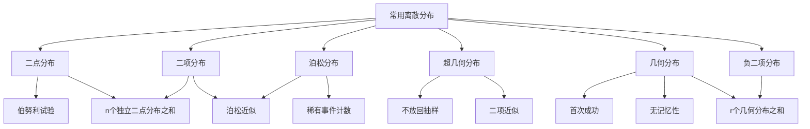

# 2.4 常用离散分布

> [!abstract] 本节概览
> 本节介绍概率论中最重要的五大离散分布：==二项分布==、==泊松分布==、==超几何分布==、==几何分布==和==负二项分布==。这些分布描述了不同场景下离散随机变量的统计规律性，是后续统计推断的理论基础。
>
> **逻辑链条**：二点分布（伯努利试验）→ 二项分布（n重伯努利试验）→ 泊松分布（稀有事件近似）→ 超几何分布（不放回抽样）→ 几何分布（首次成功）→ 负二项分布（第r次成功）→ 分布间的关系与近似
>
> **前置依赖**：[[2.1 随机变量及其分布|§2.1]]（分布列）、[[2.2 数学期望|§2.2]]（期望、线性性）、[[2.3 方差与标准差|§2.3]]（方差）、[[1.5 独立性|§1.5]]（事件的独立性）
>
> **核心主线**：五大离散分布各有适用场景。二项分布 $b(n,p)$ 描述n次独立试验中成功的次数；泊松分布 $P(\lambda)$ 描述稀有事件的计数；几何分布 $Ge(p)$ 描述首次成功所需的试验次数。泊松定理 $b(n,p) \approx P(np)$（n大p小）是重要的近似工具。

---

## 一、二点分布与二项分布

### 伯努利试验与二点分布

> [!def] 定义 2.4.1 — 二点分布（伯努利分布）
> 设随机变量 $X$ 只可能取 $0$ 和 $1$ 两个值，其分布列为
> $$
> P(X=1) = p, \quad P(X=0) = 1-p
> $$
> 其中 $0 < p < 1$，则称 $X$ 服从==二点分布==（或==伯努利分布==），记为 $X \sim b(1,p)$ 或 $X \sim B(1,p)$。

二点分布是最简单的离散分布，它描述的是==一次伯努利试验==的结果：

- **伯努利试验**：只有两种可能结果的随机试验，通常称为"成功"（$X=1$）和"失败"（$X=0$）。
- 现实中的例子：抛一次硬币（正面/反面）、检验一件产品（合格/不合格）、一次投篮（命中/未中）。

**二点分布的数字特征**：

利用 [[2.2 数学期望|§2.2]] 的定义直接计算：

$$
E(X) = 1 \cdot p + 0 \cdot (1-p) = p

E(X^2) = 1^2 \cdot p + 0^2 \cdot (1-p) = p

\text{Var}(X) = E(X^2) - [E(X)]^2 = p - p^2 = p(1-p)
$$

### 二项分布的定义

> [!def] 定义 2.4.2 — 二项分布
> 设随机变量 $X$ 的分布列为
> $$
> P(X=k) = \binom{n}{k} p^k (1-p)^{n-k}, \quad k = 0, 1, 2, \ldots, n
> $$
> 其中 $0 < p < 1$，则称 $X$ 服从参数为 $(n, p)$ 的==二项分布==，记为 $X \sim b(n,p)$ 或 $X \sim B(n,p)$。

二项分布描述的是==n重伯努利试验中成功的总次数==。所谓n重伯努利试验，是指：

1. 试验由 $n$ 次独立的伯努利试验组成；
2. 每次试验只有"成功"和"失败"两种结果；
3. 每次试验中成功的概率 $p$ 保持不变。

**分布列的推导**：在 $n$ 次试验中恰好有 $k$ 次成功，需要满足：
- 从 $n$ 次试验中选出 $k$ 次：$\binom{n}{k}$ 种方式；
- 选定的 $k$ 次每次都成功：概率为 $p^k$；
- 剩余的 $n-k$ 次每次都失败：概率为 $(1-p)^{n-k}$。

由 [[1.5 独立性|§1.5]] 中事件的独立性，三者相乘即得分布列。

**验证归一性**：由二项式定理，

$$
\sum_{k=0}^{n} \binom{n}{k} p^k (1-p)^{n-k} = [p + (1-p)]^n = 1
$$

### 二项分布的期望和方差

> [!thm] 定理 2.4.1 — 二项分布的数字特征
> 若 $X \sim b(n,p)$，则
> $$
> E(X) = np, \quad \text{Var}(X) = np(1-p)
> $$

> [!abstract] 证明思路
> **证明**：采用==和分解法==——将 $X$ 表示为 $n$ 个独立同分布的二点分布之和。
>
> 设 $X_i$ 为第 $i$ 次试验的结果，即
> $$
> X_i = \begin{cases} 1, & \text{第 } i \text{ 次试验成功} \\ 0, & \text{第 } i \text{ 次试验失败} \end{cases}
> $$
>
> 则 $X_i \sim b(1,p)$，且由试验的独立性知 $X_1, X_2, \ldots, X_n$ 相互独立。
>
> 显然 $X = X_1 + X_2 + \cdots + X_n$（成功总次数 = 各次成功次数之和）。
>
> **[和分解法]**：利用 [[2.2 数学期望|§2.2]] 中期望的线性性和 [[2.3 方差与标准差|§2.3]] 中方差的性质：
> $$
> E(X) = E\left(\sum_{i=1}^{n} X_i\right) = \sum_{i=1}^{n} E(X_i) = \sum_{i=1}^{n} p = np
> $$
>
> 由于 $X_1, X_2, \ldots, X_n$ 相互独立，
> $$
> \text{Var}(X) = \text{Var}\left(\sum_{i=1}^{n} X_i\right) = \sum_{i=1}^{n} \text{Var}(X_i) = \sum_{i=1}^{n} p(1-p) = np(1-p)
> $$
>
> $\square$

**和分解法的意义**：这是概率论中极其重要的技巧——将复杂的随机变量分解为简单的、独立的随机变量之和，然后利用期望和方差的线性性来简化计算。这一方法在后续章节中会反复出现。

### 二项分布的例题

> [!example] 例 2.4.1 — 疾病治疗有效率
> 某种疾病的治疗有效率为 $p = 0.95$。现有 $10$ 名患者接受治疗，求至少有 $8$ 人被治愈的概率。

**解**：设 $X$ 为 $10$ 名患者中被治愈的人数，则 $X \sim b(10, 0.95)$。

所求概率为：
$$
P(X \geq 8) = P(X=8) + P(X=9) + P(X=10)
$$

逐项计算：
$$
P(X=8) = \binom{10}{8} (0.95)^8 (0.05)^2 = 45 \times 0.6634 \times 0.0025 = 0.0746

P(X=9) = \binom{10}{9} (0.95)^9 (0.05)^1 = 10 \times 0.6302 \times 0.05 = 0.3151

P(X=10) = \binom{10}{10} (0.95)^{10} (0.05)^0 = 1 \times 0.5987 \times 1 = 0.5987
$$

因此：
$$
P(X \geq 8) = 0.0746 + 0.3151 + 0.5987 = 0.9884
$$

即至少 $8$ 人被治愈的概率约为 $98.84\%$。

> [!example] 例 2.4.2 — 已知概率反求参数
> 设 $X \sim b(2,p)$，已知 $P(X \geq 1) = \dfrac{5}{9}$，求 $P(Y \geq 1)$，其中 $Y \sim b(3,p)$。

**解**：先由 $X \sim b(2,p)$ 的条件求出 $p$。

$$
P(X \geq 1) = 1 - P(X = 0) = 1 - (1-p)^2 = \frac{5}{9}
$$

因此：
$$
(1-p)^2 = 1 - \frac{5}{9} = \frac{4}{9}

1-p = \frac{2}{3} \quad (\text{因为 } 0 < p < 1)

p = \frac{1}{3}
$$

再计算 $Y \sim b(3, 1/3)$ 时 $P(Y \geq 1)$：

$$
P(Y \geq 1) = 1 - P(Y = 0) = 1 - \left(\frac{2}{3}\right)^3 = 1 - \frac{8}{27} = \frac{19}{27}
$$

> [!example] 例 2.4.3 — 棋手比赛
> 甲、乙两名棋手比赛。每局甲胜的概率为 $0.6$，乙胜的概率为 $0.4$（假设没有平局）。共比赛 $10$ 局，求甲胜的局数多于乙胜的局数的概率。

**解**：设 $X$ 为甲在 $10$ 局中获胜的局数，则 $X \sim b(10, 0.6)$。

甲胜局数多于乙胜局数，即 $X > 5$（因为 $X + Y = 10$，$X > Y$ 等价于 $X > 5$）。

$$
P(X > 5) = P(X=6) + P(X=7) + P(X=8) + P(X=9) + P(X=10)
$$

逐项计算：
$$
P(X=6) = \binom{10}{6}(0.6)^6(0.4)^4 = 210 \times 0.04666 \times 0.0256 = 0.2508

P(X=7) = \binom{10}{7}(0.6)^7(0.4)^3 = 120 \times 0.02799 \times 0.064 = 0.2150

P(X=8) = \binom{10}{8}(0.6)^8(0.4)^2 = 45 \times 0.01680 \times 0.16 = 0.1209

P(X=9) = \binom{10}{9}(0.6)^9(0.4)^1 = 10 \times 0.01008 \times 0.4 = 0.0403

P(X=10) = \binom{10}{10}(0.6)^{10}(0.4)^0 = 1 \times 0.00605 \times 1 = 0.0061

P(X > 5) = 0.2508 + 0.2150 + 0.1209 + 0.0403 + 0.0061 = 0.6331
$$

甲胜局数多于乙的概率约为 $63.31\%$。

---

## 二、泊松分布

### 泊松分布的定义

> [!def] 定义 2.4.3 — 泊松分布
> 设随机变量 $X$ 的分布列为
> $$
> P(X=k) = \frac{\lambda^k}{k!} e^{-\lambda}, \quad k = 0, 1, 2, \ldots
> $$
> 其中 $\lambda > 0$ 为常数，则称 $X$ 服从参数为 $\lambda$ 的==泊松分布==，记为 $X \sim P(\lambda)$ 或 $X \sim \text{Poisson}(\lambda)$。

泊松分布由法国数学家 Simeon-Denis Poisson 于 1837 年提出，最初用于描述==稀有事件==在单位时间/空间内发生的次数。

**泊松分布的典型应用场景**：

| 场景 | $X$ 的含义 | 典型 $\lambda$ 值 |
|------|-----------|-------------------|
| 电话交换台 | 单位时间内接到的呼叫次数 | $\lambda = 3$ 次/分钟 |
| 放射性物质 | 单位时间内发射的粒子数 | $\lambda = 4.5$ 次/秒 |
| 纺织品 | 每平方米布料上的瑕疵数 | $\lambda = 0.5$ 个/平方米 |
| 交通事故 | 某路口每月的事故数 | $\lambda = 2$ 次/月 |
| 服务器 | 单位时间内收到的请求次数 | $\lambda = 10$ 次/秒 |

**验证归一性**：
$$
\sum_{k=0}^{\infty} \frac{\lambda^k}{k!} e^{-\lambda} = e^{-\lambda} \sum_{k=0}^{\infty} \frac{\lambda^k}{k!} = e^{-\lambda} \cdot e^{\lambda} = 1
$$

这里利用了 $e^{\lambda}$ 的泰勒展开式 $\displaystyle e^{\lambda} = \sum_{k=0}^{\infty} \frac{\lambda^k}{k!}$。

### 泊松分布的期望和方差

> [!thm] 定理 2.4.2 — 泊松分布的数字特征
> 若 $X \sim P(\lambda)$，则
> $$
> E(X) = \lambda, \quad \text{Var}(X) = \lambda
> $$

> [!abstract] 证明思路
> **证明**：利用 [[2.2 数学期望|§2.2]] 的定义和泊松分布的分布列。
>
> **期望**：
> $$
> E(X) = \sum_{k=0}^{\infty} k \cdot \frac{\lambda^k}{k!} e^{-\lambda} = \sum_{k=1}^{\infty} k \cdot \frac{\lambda^k}{k!} e^{-\lambda}
> $$
>
> 注意 $k=0$ 的项为零，故从 $k=1$ 开始。利用 $\dfrac{k}{k!} = \dfrac{1}{(k-1)!}$：
> $$
> E(X) = \sum_{k=1}^{\infty} \frac{\lambda^k}{(k-1)!} e^{-\lambda} = \lambda e^{-\lambda} \sum_{k=1}^{\infty} \frac{\lambda^{k-1}}{(k-1)!}
> $$
>
> 令 $j = k-1$，则 $j$ 从 $0$ 到 $\infty$：
> $$
> E(X) = \lambda e^{-\lambda} \sum_{j=0}^{\infty} \frac{\lambda^j}{j!} = \lambda e^{-\lambda} \cdot e^{\lambda} = \lambda
> $$
>
> **[换元求和]**：关键技巧是将求和指标平移，重新利用 $e^{\lambda}$ 的展开式。
>
> **方差**：先求 $E(X^2)$。
> $$
> E(X^2) = \sum_{k=0}^{\infty} k^2 \cdot \frac{\lambda^k}{k!} e^{-\lambda}
> $$
>
> 利用 $k^2 = k(k-1) + k$：
> $$
> E(X^2) = \sum_{k=0}^{\infty} k(k-1) \cdot \frac{\lambda^k}{k!} e^{-\lambda} + \sum_{k=0}^{\infty} k \cdot \frac{\lambda^k}{k!} e^{-\lambda}
> $$
>
> 第二个求和就是 $E(X) = \lambda$。对于第一个求和：
> $$
> \sum_{k=2}^{\infty} k(k-1) \cdot \frac{\lambda^k}{k!} e^{-\lambda} = \sum_{k=2}^{\infty} \frac{\lambda^k}{(k-2)!} e^{-\lambda} = \lambda^2 e^{-\lambda} \sum_{j=0}^{\infty} \frac{\lambda^j}{j!} = \lambda^2
> $$
>
> 因此 $E(X^2) = \lambda^2 + \lambda$，从而
> $$
> \text{Var}(X) = E(X^2) - [E(X)]^2 = \lambda^2 + \lambda - \lambda^2 = \lambda
> $$
>
> $\square$

==泊松分布的期望等于方差==，这是它最显著的特征之一，也是判断数据是否服从泊松分布的重要依据。

### 泊松分布的例题

> [!example] 例 2.4.4 — 铸件砂眼
> 某铸件上的砂眼数 $X$ 服从参数 $\lambda = 0.5$ 的泊松分布。规定砂眼数不超过 $1$ 个的铸件为合格品。（1）求铸件为合格品的概率；（2）求铸件为不合格品的概率。

**解**：$X \sim P(0.5)$。

（1）合格品要求 $X \leq 1$：
$$
P(X \leq 1) = P(X=0) + P(X=1) = \frac{0.5^0}{0!} e^{-0.5} + \frac{0.5^1}{1!} e^{-0.5} = e^{-0.5}(1 + 0.5) = 1.5 \times 0.6065 = 0.9098
$$

（2）不合格品要求 $X \geq 2$：
$$
P(X \geq 2) = 1 - P(X \leq 1) = 1 - 0.9098 = 0.0902
$$

> [!example] 例 2.4.5 — 库存决策
> 某商店某种商品的销售量 $X$ 服从参数 $\lambda = 8$ 的泊松分布。问月初应库存多少件该商品，才能以不小于 $90\%$ 的概率满足当月需求？

**解**：设月初库存 $m$ 件，需要求最小的 $m$ 使得
$$
P(X \leq m) \geq 0.9
$$

即：
$$
\sum_{k=0}^{m} \frac{8^k}{k!} e^{-8} \geq 0.9
$$

逐项累加计算：
$$
P(X=0) = e^{-8} = 0.0003

P(X=1) = 8 e^{-8} = 0.0027

P(X=2) = \frac{64}{2} e^{-8} = 0.0107

P(X=3) = \frac{512}{6} e^{-8} = 0.0286

P(X=4) = \frac{4096}{24} e^{-8} = 0.0573

P(X=5) = \frac{32768}{120} e^{-8} = 0.0916

P(X=6) = \frac{262144}{720} e^{-8} = 0.1221

P(X=7) = \frac{2097152}{5040} e^{-8} = 0.1396

P(X=8) = \frac{16777216}{40320} e^{-8} = 0.1396

P(X=9) = \frac{134217728}{362880} e^{-8} = 0.1241

P(X=10) = \frac{1073741824}{3628800} e^{-8} = 0.0993

P(X=11) = \frac{8589934592}{39916800} e^{-8} = 0.0722

P(X=12) = \frac{68719476736}{479001600} e^{-8} = 0.0481
$$

累加至 $m = 12$：
$$
P(X \leq 12) = 0.0003 + 0.0027 + 0.0107 + 0.0286 + 0.0573 + 0.0916 + 0.1221 + 0.1396 + 0.1396 + 0.1241 + 0.0993 + 0.0722 + 0.0481 = 0.9362
$$

而 $P(X \leq 11) = 0.9362 - 0.0481 = 0.8881 < 0.9$。

因此，月初应库存 $m = 12$ 件，才能以不小于 $90\%$ 的概率满足需求。

### 泊松定理

> [!thm] 定理 2.4.3 — 泊松定理
> 设 $X_n \sim b(n, p_n)$，其中 $n p_n \to \lambda$（$\lambda > 0$ 为常数），则对任意固定的非负整数 $k$，
> $$
> \lim_{n \to \infty} \binom{n}{k} p_n^k (1-p_n)^{n-k} = \frac{\lambda^k}{k!} e^{-\lambda}
> $$

> [!abstract] 证明思路
> **证明**：设 $n p_n = \lambda_n$，则 $\lambda_n \to \lambda$，且 $p_n = \lambda_n / n$。
>
> **[取极限]**：将二项分布的分布列展开并逐步取极限。
>
> $$
> \binom{n}{k} p_n^k (1-p_n)^{n-k} = \frac{n(n-1)\cdots(n-k+1)}{k!} \cdot \frac{\lambda_n^k}{n^k} \cdot \left(1 - \frac{\lambda_n}{n}\right)^{n-k}
> $$
>
> 将其分解为三个因子：
>
> **因子一**：
> $$
> \frac{n(n-1)\cdots(n-k+1)}{n^k} = \frac{n}{n} \cdot \frac{n-1}{n} \cdots \frac{n-k+1}{n} = \left(1 - \frac{0}{n}\right)\left(1 - \frac{1}{n}\right) \cdots \left(1 - \frac{k-1}{n}\right) \to 1 \quad (n \to \infty)
> $$
>
> **因子二**：$\dfrac{\lambda_n^k}{k!} \to \dfrac{\lambda^k}{k!}$。
>
> **因子三**：
> $$
> \left(1 - \frac{\lambda_n}{n}\right)^{n-k} = \left(1 - \frac{\lambda_n}{n}\right)^n \cdot \left(1 - \frac{\lambda_n}{n}\right)^{-k} \to e^{-\lambda} \cdot 1 = e^{-\lambda}
> $$
>
> 其中利用了重要极限 $\displaystyle \lim_{n \to \infty} \left(1 + \frac{a}{n}\right)^n = e^a$。
>
> 三个因子相乘，即得
> $$
> \lim_{n \to \infty} \binom{n}{k} p_n^k (1-p_n)^{n-k} = 1 \cdot \frac{\lambda^k}{k!} \cdot e^{-\lambda} = \frac{\lambda^k}{k!} e^{-\lambda}
> $$
>
> $\square$

**泊松定理的实用意义**：当 $n$ 很大、$p$ 很小、$np$ 适中时，二项分布 $b(n,p)$ 可以用泊松分布 $P(np)$ 来近似：
$$
\binom{n}{k} p^k (1-p)^{n-k} \approx \frac{(np)^k}{k!} e^{-np}
$$

这一近似大大简化了计算，因为直接计算 $\binom{n}{k}$ 当 $n$ 很大时非常困难。

---

## 三、泊松近似的应用

> [!abstract] 核心思想
> 泊松定理的实际应用：当 $n$ 较大（通常 $n \geq 20$）、$p$ 较小（通常 $p \leq 0.05$）时，用泊松分布 $P(\lambda)$（其中 $\lambda = np$）近似二项分布 $b(n,p)$，可以大幅简化计算。

### 例题精讲

> [!example] 例 2.4.6 — 发病率问题
> 某地区某种疾病的发病率为 $0.001$。现检查 $5000$ 人，求至少有 $2$ 人患病的概率。

**解**：设 $X$ 为 $5000$ 人中患病的人数，则 $X \sim b(5000, 0.001)$。

直接计算：
$$
P(X \geq 2) = 1 - P(X=0) - P(X=1)

P(X=0) = (0.999)^{5000}

P(X=1) = 5000 \times 0.001 \times (0.999)^{4999}
$$

$(0.999)^{5000}$ 的计算非常困难。由于 $n = 5000$ 很大、$p = 0.001$ 很小，使用泊松近似。

取 $\lambda = np = 5000 \times 0.001 = 5$，则 $X \approx P(5)$。

$$
P(X \geq 2) \approx 1 - P(Y=0) - P(Y=1) = 1 - \frac{5^0}{0!} e^{-5} - \frac{5^1}{1!} e^{-5} = 1 - e^{-5}(1 + 5) = 1 - 6e^{-5}

= 1 - 6 \times 0.00674 = 1 - 0.0404 = 0.9596
$$

即至少有 $2$ 人患病的概率约为 $95.96\%$。

> [!example] 例 2.4.7 — 保险问题
> 某保险公司有 $10000$ 名同年龄段的人参保，每人每年死亡的概率为 $0.001$。参保人每年交保费 $12$ 元，若死亡则保险公司赔付 $2000$ 元。求：（1）保险公司亏本的概率；（2）保险公司获利不少于 $40000$ 元的概率。

**解**：设 $X$ 为一年中死亡的人数，则 $X \sim b(10000, 0.001)$。

由于 $n = 10000$ 很大、$p = 0.001$ 很小，取 $\lambda = np = 10$，用 $P(10)$ 近似。

保险公司总收入：$10000 \times 12 = 120000$ 元。
赔付总额：$2000X$ 元。

（1）**亏本**：$2000X > 120000$，即 $X > 60$。
$$
P(X > 60) \approx \sum_{k=61}^{\infty} \frac{10^k}{k!} e^{-10}
$$

由于 $\lambda = 10$，$X > 60$ 是极端事件，概率几乎为零（$P(X > 60) \approx 0$），保险公司几乎不可能亏本。

（2）**获利不少于 $40000$ 元**：$120000 - 2000X \geq 40000$，即 $2000X \leq 80000$，即 $X \leq 40$。
$$
P(X \leq 40) \approx \sum_{k=0}^{40} \frac{10^k}{k!} e^{-10}
$$

由于 $E(X) = 10$，$\text{Var}(X) = 10$，$X \leq 40$ 距离均值约 $9.5$ 个标准差，概率非常接近 $1$（$P(X \leq 40) \approx 1$）。

**结论**：在给定的条件下，保险公司亏本的概率几乎为零，获利不少于 $40000$ 元的概率几乎为 $1$。这体现了大数定律在保险业中的基础作用。

> [!example] 例 2.4.8 — 维修工问题
> 某工厂有 $80$ 台同类型设备，各台设备的工作是相互独立的，发生故障的概率均为 $0.01$。一台设备的故障由一名维修工处理。考虑以下三种配置方案：
> - 方案一：$1$ 名维修工负责 $80$ 台设备；
> - 方案二：$2$ 名维修工各负责 $40$ 台设备；
> - 方案三：$3$ 名维修工各负责 $27$ 台设备（共 $81$ 台）。
>
> 比较三种方案下设备发生故障但不能及时修理的概率。

**解**：设 $X$ 为同时发生故障的设备数。

**方案一**：$X \sim b(80, 0.01)$，$\lambda = 0.8$，用 $P(0.8)$ 近似。

不能及时修理的条件：$X \geq 2$（只有 $1$ 名维修工）。
$$
P(X \geq 2) \approx 1 - P(Y=0) - P(Y=1) = 1 - e^{-0.8} - 0.8 \cdot e^{-0.8} = 1 - 1.8 e^{-0.8} = 1 - 1.8 \times 0.4493 = 0.1912
$$

**方案二**：每名维修工负责 $40$ 台设备，$X \sim b(40, 0.01)$，$\lambda = 0.4$，用 $P(0.4)$ 近似。

不能及时修理的条件：$X \geq 2$（每名维修工只能处理 $1$ 台）。
$$
P(X \geq 2) \approx 1 - e^{-0.4} - 0.4 \cdot e^{-0.4} = 1 - 1.4 e^{-0.4} = 1 - 1.4 \times 0.6703 = 0.0616
$$

**方案三**：每名维修工负责 $27$ 台设备，$X \sim b(27, 0.01)$，$\lambda = 0.27$，用 $P(0.27)$ 近似。

不能及时修理的条件：$X \geq 2$。
$$
P(X \geq 2) \approx 1 - e^{-0.27} - 0.27 \cdot e^{-0.27} = 1 - 1.27 e^{-0.27} = 1 - 1.27 \times 0.7634 = 0.0305
$$

**比较**：
| 方案 | 维修工人数 | 每人负责台数 | 不能及时修理概率 |
|------|-----------|-------------|-----------------|
| 一 | 1 | 80 | 19.12% |
| 二 | 2 | 40 | 6.16% |
| 三 | 3 | 27 | 3.05% |

增加维修工人数可以显著降低设备不能及时修理的概率，但边际效益递减。

### 泊松近似的适用条件

泊松近似 $b(n,p) \approx P(np)$ 的精度取决于 $n$ 和 $p$ 的具体取值：

- 当 $n \geq 20$ 且 $p \leq 0.05$ 时，近似效果通常很好；
- 当 $n \geq 100$ 且 $np \leq 10$ 时，近似效果极佳；
- 当 $p$ 较大（如 $p > 0.1$）时，泊松近似不再适用，应考虑正态近似。

**经验法则**：$n$ 越大、$p$ 越小、$np$ 适中（$0.1 \leq np \leq 10$），泊松近似效果越好。

---

## 四、超几何分布

### 超几何分布的定义

> [!def] 定义 2.4.4 — 超几何分布
> 设一批产品共 $N$ 件，其中有 $M$ 件次品。从中==不放回==地随机抽取 $n$ 件，设 $X$ 为抽到的次品数，则 $X$ 的分布列为
> $$
> P(X=k) = \frac{\binom{M}{k}\binom{N-M}{n-k}}{\binom{N}{n}}, \quad k = \max(0, n-N+M), \ldots, \min(n, M)
> $$
> 称 $X$ 服从参数为 $(n, N, M)$ 的==超几何分布==，记为 $X \sim h(n, N, M)$。

**分布列的推导**：

- 从 $N$ 件产品中抽取 $n$ 件，总共有 $\binom{N}{n}$ 种等可能方式；
- 要恰好抽到 $k$ 件次品：从 $M$ 件次品中选 $k$ 件（$\binom{M}{k}$ 种方式），从 $N-M$ 件正品中选 $n-k$ 件（$\binom{N-M}{n-k}$ 种方式）；
- 由乘法原理，有利方式数为 $\binom{M}{k}\binom{N-M}{n-k}$。

**$k$ 的取值范围**：$k$ 必须同时满足 $0 \leq k \leq M$（次品数不超过总次品数）和 $0 \leq n-k \leq N-M$（正品数不超过总正品数），因此
$$
\max(0, n-N+M) \leq k \leq \min(n, M)
$$

### 超几何分布的期望

> [!thm] 定理 2.4.4 — 超几何分布的期望
> 若 $X \sim h(n, N, M)$，则
> $$
> E(X) = \frac{nM}{N}
> $$

> [!abstract] 证明思路
> **证明**：同样采用==和分解法==。
>
> 设 $X_i$ 为第 $i$ 次抽样的结果（$X_i = 1$ 表示抽到次品，$X_i = 0$ 表示抽到正品），则 $X = X_1 + X_2 + \cdots + X_n$。
>
> 注意：不放回抽样中 $X_1, X_2, \ldots, X_n$ ==不独立==，但期望的线性性不要求独立性。
>
> **[期望线性性]**：$E(X) = \sum_{i=1}^{n} E(X_i)$。
>
> 对于任意 $i$，$E(X_i) = P(X_i = 1)$。由对称性，每次抽样抽到次品的概率相同：
> $$
> P(X_i = 1) = \frac{M}{N}
> $$
>
> 这是因为无论第几次抽样，从整体来看，每件产品被抽到的概率是均等的。
>
> 因此 $E(X) = n \cdot \dfrac{M}{N} = \dfrac{nM}{N}$。
>
> $\square$

### 超几何分布的方差

> [!thm] 定理 2.4.5 — 超几何分布的方差
> 若 $X \sim h(n, N, M)$，则
> $$
> \text{Var}(X) = \frac{nM(N-M)(N-n)}{N^2(N-1)}
> $$

> [!abstract] 证明思路
> **证明**：利用和分解 $X = X_1 + X_2 + \cdots + X_n$，其中 $X_i$ 为第 $i$ 次抽样的指示变量。
>
> **[关键词]**：$\text{Var}(X) = \sum_{i=1}^{n}\text{Var}(X_i) + 2\sum_{i < j}\text{Cov}(X_i, X_j)$
>
> 由于 $X_i \sim b(1, M/N)$，$\text{Var}(X_i) = \dfrac{M}{N}\left(1 - \dfrac{M}{N}\right) = \dfrac{M(N-M)}{N^2}$。
>
> 对于 $i \neq j$，$\text{Cov}(X_i, X_j) = E(X_i X_j) - E(X_i)E(X_j)$。由于不放回抽样：
> $$
> E(X_i X_j) = P(X_i=1, X_j=1) = \frac{M}{N} \cdot \frac{M-1}{N-1}
> $$
> $$
> \text{Cov}(X_i, X_j) = \frac{M(M-1)}{N(N-1)} - \frac{M^2}{N^2} = \frac{M[MN - M - N + M \cdot 1] - M^2(N-1)}{N^2(N-1)}
> $$
> $$
> = \frac{-M(N-M)}{N^2(N-1)}
> $$
>
> 共有 $\binom{n}{2}$ 对 $(i,j)$，因此：
> $$
> \text{Var}(X) = n \cdot \frac{M(N-M)}{N^2} + n(n-1) \cdot \frac{-M(N-M)}{N^2(N-1)} = \frac{nM(N-M)}{N^2}\left(1 - \frac{n-1}{N-1}\right) = \frac{nM(N-M)(N-n)}{N^2(N-1)}
> $$
>
> $\square$

**与二项分布方差的对比**：

| 特征 | 超几何分布 | 二项分布 |
|------|-----------|---------|
| 方差 | $\dfrac{nM(N-M)(N-n)}{N^2(N-1)}$ | $np(1-p)$ |
| 有限总体校正因子 | $\dfrac{N-n}{N-1}$ | 无（无限总体） |

当 $N \to \infty$ 时，$\dfrac{N-n}{N-1} \to 1$，超几何分布的方差趋近于二项分布的方差 $np(1-p)$。==有限总体校正因子== $\dfrac{N-n}{N-1} < 1$ 说明不放回抽样的方差更小（信息量更大）。

### 超几何分布与二项分布的关系

> [!thm] 定理 2.4.6 — 超几何分布的二项近似
> 当 $N$ 很大、$n$ 相对 $N$ 很小（即 $n \ll N$）时，不放回抽样与有放回抽样差别很小，此时
> $$
> h(n, N, M) \approx b\left(n, \frac{M}{N}\right)
> $$
> 即
> $$
> \frac{\binom{M}{k}\binom{N-M}{n-k}}{\binom{N}{n}} \approx \binom{n}{k}\left(\frac{M}{N}\right)^k \left(1 - \frac{M}{N}\right)^{n-k}
> $$

**直观理解**：当 $N$ 很大而 $n$ 很小时，每次抽样后总体成分变化微乎其微，不放回抽样近似于有放回抽样。

**经验法则**：当 $n/N < 0.05$（即抽样比例不超过 $5\%$）时，超几何分布可以用二项分布很好地近似。

**两者的核心区别**：

| 特征 | 超几何分布 $h(n,N,M)$ | 二项分布 $b(n,p)$ |
|------|----------------------|-------------------|
| 抽样方式 | ==不放回== | ==有放回== |
| 各次试验 | 不独立 | 独立 |
| 成功概率 | 每次变化 | 每次相同 |
| 适用条件 | 总体有限 | 总体无限或近似无限 |

---

## 五、几何分布与负二项分布

### 几何分布的定义

> [!def] 定义 2.4.5 — 几何分布
> 在一系列独立的伯努利试验中，每次试验成功的概率为 $p$（$0 < p < 1$）。设 $X$ 为==首次成功所需的试验次数==，则 $X$ 的分布列为
> $$
> P(X=k) = (1-p)^{k-1} p, \quad k = 1, 2, 3, \ldots
> $$
> 称 $X$ 服从参数为 $p$ 的==几何分布==，记为 $X \sim Ge(p)$。

**分布列的推导**：首次成功出现在第 $k$ 次试验，意味着前 $k-1$ 次都失败、第 $k$ 次成功。由独立性：
$$
P(X=k) = \underbrace{(1-p) \cdot (1-p) \cdots (1-p)}_{k-1 \text{ 次}} \cdot p = (1-p)^{k-1} p
$$

**验证归一性**（利用等比级数）：
$$
\sum_{k=1}^{\infty} (1-p)^{k-1} p = p \sum_{j=0}^{\infty} (1-p)^j = p \cdot \frac{1}{1-(1-p)} = p \cdot \frac{1}{p} = 1
$$

### 几何分布的期望和方差

> [!thm] 定理 2.4.7 — 几何分布的数字特征
> 若 $X \sim Ge(p)$，则
> $$
> E(X) = \frac{1}{p}, \quad \text{Var}(X) = \frac{1-p}{p^2}
> $$

> [!abstract] 证明思路
> **证明**：
>
> **期望**：
> $$
> E(X) = \sum_{k=1}^{\infty} k(1-p)^{k-1} p = p \sum_{k=1}^{\infty} k(1-p)^{k-1}
> $$
>
> 利用求和公式 $\displaystyle \sum_{k=1}^{\infty} kx^{k-1} = \frac{1}{(1-x)^2}$（$|x|<1$），取 $x = 1-p$：
> $$
> E(X) = p \cdot \frac{1}{[1-(1-p)]^2} = p \cdot \frac{1}{p^2} = \frac{1}{p}
> $$
>
> **[幂级数求和]**：关键技巧是利用幂级数 $\displaystyle \sum_{k=1}^{\infty} kx^{k-1} = \frac{d}{dx}\left(\frac{1}{1-x}\right) = \frac{1}{(1-x)^2}$。
>
> **方差**：先求 $E(X^2)$。利用 $k^2 = k(k-1) + k$：
> $$
> E(X^2) = \sum_{k=1}^{\infty} k^2 (1-p)^{k-1} p = \sum_{k=1}^{\infty} k(k-1)(1-p)^{k-1} p + \sum_{k=1}^{\infty} k(1-p)^{k-1} p
> $$
>
> 第二项即 $E(X) = 1/p$。第一项：
> $$
> \sum_{k=2}^{\infty} k(k-1)(1-p)^{k-1} p = p(1-p) \sum_{k=2}^{\infty} k(k-1)(1-p)^{k-2}
> $$
>
> 利用 $\displaystyle \sum_{k=2}^{\infty} k(k-1)x^{k-2} = \frac{2}{(1-x)^3}$（$|x|<1$），取 $x = 1-p$：
> $$
> p(1-p) \cdot \frac{2}{p^3} = \frac{2(1-p)}{p^2}
> $$
>
> 因此：
> $$
> E(X^2) = \frac{2(1-p)}{p^2} + \frac{1}{p} = \frac{2(1-p) + p}{p^2} = \frac{2 - p}{p^2}
> $$
>
> $$
> \text{Var}(X) = E(X^2) - [E(X)]^2 = \frac{2-p}{p^2} - \frac{1}{p^2} = \frac{1-p}{p^2}
> $$
>
> $\square$

**直观理解**：$E(X) = 1/p$ 意味着如果每次成功概率为 $p$，平均需要 $1/p$ 次试验才能首次成功。例如，$p = 0.1$ 时平均需要 $10$ 次。

### 几何分布的无记忆性

> [!thm] 定理 2.4.8 — 几何分布的无记忆性
> 若 $X \sim Ge(p)$，则对任意正整数 $m, n$，
> $$
> P(X > m+n \mid X > m) = P(X > n)
> $$

> [!abstract] 证明思路
> **证明**：首先计算尾部概率 $P(X > n)$。
> $$
> P(X > n) = \sum_{k=n+1}^{\infty} (1-p)^{k-1} p = p(1-p)^n \sum_{j=0}^{\infty} (1-p)^j = p(1-p)^n \cdot \frac{1}{p} = (1-p)^n
> $$
>
> 即 $P(X > n) = (1-p)^n$，这表示前 $n$ 次全部失败的概率。
>
> **[尾部概率]**：关键步骤是求出 $P(X > n) = (1-p)^n$ 的简洁形式。
>
> 然后利用条件概率公式：
> $$
> P(X > m+n \mid X > m) = \frac{P(X > m+n)}{P(X > m)} = \frac{(1-p)^{m+n}}{(1-p)^m} = (1-p)^n = P(X > n)
> $$
>
> $\square$

**无记忆性的含义**：如果已知前 $m$ 次试验都失败了，那么从第 $m+1$ 次开始，首次成功所需的额外试验次数仍然服从 $Ge(p)$。换句话说，"过去"的失败记录不会影响"未来"的成功概率——几何分布"忘记"了过去。

**生活类比**：就像反复掷一枚均匀的骰子，等待首次出现 $6$ 点。无论之前掷了多少次都没有出现 $6$ 点，下一次掷出 $6$ 点的概率始终是 $1/6$，之前的历史不会改变未来的概率。

==无记忆性是几何分布的本质特征==，在离散分布中只有几何分布具有这一性质（在连续分布中只有指数分布具有无记忆性）。

### 负二项分布的定义

> [!def] 定义 2.4.6 — 负二项分布
> 在一系列独立的伯努利试验中，每次试验成功的概率为 $p$（$0 < p < 1$）。设 $X$ 为==第 $r$ 次成功所需的试验次数==，则 $X$ 的分布列为
> $$
> P(X=k) = \binom{k-1}{r-1} p^r (1-p)^{k-r}, \quad k = r, r+1, r+2, \ldots
> $$
> 称 $X$ 服从参数为 $(r, p)$ 的==负二项分布==，记为 $X \sim Nb(r, p)$。

**分布列的推导**：第 $r$ 次成功出现在第 $k$ 次试验，意味着：
- 前 $k-1$ 次试验中恰好有 $r-1$ 次成功：$\binom{k-1}{r-1}$ 种方式；
- 前 $k-1$ 次中 $r-1$ 次成功、$k-r$ 次失败：概率为 $p^{r-1}(1-p)^{k-r}$；
- 第 $k$ 次试验成功：概率为 $p$。

三者相乘即得分布列。

### 负二项分布与几何分布的关系

**几何分布是负二项分布的特例**：当 $r = 1$ 时，
$$
P(X=k) = \binom{k-1}{0} p^1 (1-p)^{k-1} = (1-p)^{k-1} p, \quad k = 1, 2, 3, \ldots
$$
这正是 $Ge(p)$ 的分布列。

**负二项分布的分解**：设 $X \sim Nb(r, p)$，则 $X$ 可以分解为 $r$ 个独立的几何分布之和：
$$
X = X_1 + X_2 + \cdots + X_r
$$
其中 $X_1, X_2, \ldots, X_r$ 相互独立，且 $X_i \sim Ge(p)$。

**直观理解**：$X_1$ 是首次成功所需的试验次数，$X_2$ 是从第 $X_1 + 1$ 次试验开始到第二次成功所需的额外试验次数，……，$X_r$ 是从第 $(r-1)$ 次成功之后到第 $r$ 次成功所需的额外试验次数。由无记忆性，每个 $X_i$ 都服从 $Ge(p)$ 且相互独立。

### 负二项分布的数字特征

> [!thm] 定理 2.4.9 — 负二项分布的数字特征
> 若 $X \sim Nb(r, p)$，则
> $$
> E(X) = \frac{r}{p}, \quad \text{Var}(X) = \frac{r(1-p)}{p^2}
> $$

> [!abstract] 证明思路
> **证明**：利用分解 $X = X_1 + X_2 + \cdots + X_r$，其中 $X_i \sim Ge(p)$ 且相互独立。
>
> **[和分解法]**：
> $$
> E(X) = \sum_{i=1}^{r} E(X_i) = r \cdot \frac{1}{p} = \frac{r}{p}
> $$
>
> $$
> \text{Var}(X) = \sum_{i=1}^{r} \text{Var}(X_i) = r \cdot \frac{1-p}{p^2} = \frac{r(1-p)}{p^2}
> $$
>
> $\square$

---

## 六、各分布间的关系与汇总

### 期望方差公式汇总

| 分布 | 记号 | 分布列 | 期望 | 方差 |
|------|------|--------|------|------|
| 二点分布 | $b(1,p)$ | $p^k(1-p)^{1-k}$, $k=0,1$ | $p$ | $p(1-p)$ |
| 二项分布 | $b(n,p)$ | $\binom{n}{k}p^k(1-p)^{n-k}$, $k=0,\ldots,n$ | $np$ | $np(1-p)$ |
| 泊松分布 | $P(\lambda)$ | $\dfrac{\lambda^k}{k!}e^{-\lambda}$, $k=0,1,2,\ldots$ | $\lambda$ | $\lambda$ |
| 超几何分布 | $h(n,N,M)$ | $\dfrac{\binom{M}{k}\binom{N-M}{n-k}}{\binom{N}{n}}$ | $\dfrac{nM}{N}$ | $\dfrac{nM(N-M)(N-n)}{N^2(N-1)}$ |
| 几何分布 | $Ge(p)$ | $(1-p)^{k-1}p$, $k=1,2,\ldots$ | $\dfrac{1}{p}$ | $\dfrac{1-p}{p^2}$ |
| 负二项分布 | $Nb(r,p)$ | $\binom{k-1}{r-1}p^r(1-p)^{k-r}$, $k=r,r+1,\ldots$ | $\dfrac{r}{p}$ | $\dfrac{r(1-p)}{p^2}$ |

### 分布间的关系图

### 近似关系总结

1. **超几何分布 → 二项分布**：当 $n \ll N$ 时（抽样比例很小），$h(n,N,M) \approx b(n, M/N)$。
   - 本质：不放回抽样近似为有放回抽样。

2. **二项分布 → 泊松分布**：当 $n$ 大、$p$ 小、$np$ 适中时，$b(n,p) \approx P(np)$。
   - 本质：大量试验中稀有事件的发生次数。

3. **近似链**：$h(n,N,M) \xrightarrow{n \ll N} b(n, M/N) \xrightarrow{n \text{大}, p \text{小}} P(np)$

**记忆技巧**：
- 二项分布的期望 $np$：每次试验期望贡献 $p$，$n$ 次就是 $np$；
- 泊松分布的期望 $=$ 方差 $=\lambda$：泊松分布独有特征；
- 几何分布的期望 $1/p$：概率越小，等待越久（$p \to 0$ 时 $E(X) \to \infty$）。

---

## 七、知识结构总览

---

## 八、核心思想与证明技巧

### 和分解法

和分解法是概率论中最重要的计算技巧之一。其核心思想是：

> 将一个复杂的随机变量 $X$ 分解为若干个简单的、容易处理的随机变量 $X_1, X_2, \ldots, X_n$ 之和，然后利用期望和方差的线性性来计算 $E(X)$ 和 $\text{Var}(X)$。

**应用实例**：
- 二项分布 $b(n,p)$：$X = X_1 + \cdots + X_n$，$X_i \sim b(1,p)$，且 $X_i$ 相互独立；
- 超几何分布 $h(n,N,M)$：$X = X_1 + \cdots + X_n$，$X_i \sim b(1, M/N)$，但 $X_i$ 不独立；
- 负二项分布 $Nb(r,p)$：$X = X_1 + \cdots + X_r$，$X_i \sim Ge(p)$，且 $X_i$ 相互独立。

**注意事项**：
- 期望的线性性==不需要独立性==：$E(X_1 + X_2) = E(X_1) + E(X_2)$ 恒成立；
- 方差的线性性==需要独立性==：$\text{Var}(X_1 + X_2) = \text{Var}(X_1) + \text{Var}(X_2)$ 仅在 $X_1, X_2$ 独立时成立。

### 泊松定理的证明思路

泊松定理的证明展示了概率论中==取极限==的典型方法：

1. 将二项分布的分布列展开为三个因子的乘积；
2. 分别对每个因子取 $n \to \infty$ 的极限；
3. 利用基本极限 $\left(1 + \frac{a}{n}\right)^n \to e^a$。

**关键观察**：当 $n$ 很大时，$\binom{n}{k}$ 中的阶乘项很难直接计算，但通过极限过程可以将其转化为泊松分布的简洁形式。

### 几何分布无记忆性的证明

无记忆性的证明依赖于==尾部概率==的简洁形式：

$$
P(X > n) = (1-p)^n
$$

一旦得到这个简洁形式，条件概率的计算就变得非常直接：
$$
P(X > m+n \mid X > m) = \frac{(1-p)^{m+n}}{(1-p)^m} = (1-p)^n = P(X > n)
$$

**推广**：无记忆性可以作为几何分布的==等价定义==——如果一个取正整数值的随机变量满足无记忆性，则它一定服从几何分布。

### 近似链

三大离散分布之间的近似关系构成了一个完整的链条：

$$
\text{超几何分布} \xrightarrow{n \ll N} \text{二项分布} \xrightarrow{n \text{大}, p \text{小}} \text{泊松分布}
$$

这条近似链的实际意义在于：
- 当总体很大时，超几何分布的计算（涉及组合数）可以用二项分布简化；
- 当试验次数很大且成功概率很小时，二项分布的计算可以用泊松分布进一步简化。

### 期望方差公式的记忆技巧

| 记忆维度 | 技巧 |
|----------|------|
| 二项分布 $b(n,p)$ | 期望 $np$：$n$ 次试验，每次贡献 $p$；方差 $np(1-p)$：在期望基础上乘以"失败概率" |
| 泊松分布 $P(\lambda)$ | 期望 $=$ 方差 $=\lambda$：泊松分布独有特征，$\lambda$ 既是平均发生率也是波动程度 |
| 几何分布 $Ge(p)$ | 期望 $1/p$：概率越小等待越久；方差 $(1-p)/p^2$：比期望的平方小 |
| 负二项分布 $Nb(r,p)$ | 期望 $r/p$：几何分布期望的 $r$ 倍；方差 $r(1-p)/p^2$：几何分布方差的 $r$ 倍 |

---

## 九、补充理解与易混淆点

### 二项分布的独立性要求

**来源**：教材p84 + MIT 18.05 + Stanford Stat 116 + 华东师大讲义 + 中科大讲义

> [!danger] 误区1："二项分布要求每次试验概率相同"
> ❌ 错误解释：只要做n次试验，结果只有成功/失败两种，就服从二项分布。
> ✅ 正确解释：二项分布要求==n次试验独立==且==每次成功概率p相同==。如果不独立或p变化，则不服从二项分布。

**深入理解**：二项分布的两个核心假设缺一不可：
- **独立性**：各次试验的结果互不影响。例如，如果从少量产品中不放回抽样，各次抽样的结果就不独立。
- **概率相同**：每次试验成功的概率保持不变。例如，如果随着时间推移设备老化导致故障率变化，则不满足此条件。

### 泊松分布期望等于方差

**来源**：教材p86 + MIT 18.05 + UCLA Stats 100A + 华东师大讲义 + 五三多校真题

> [!danger] 误区2："泊松分布的期望和方差可以不同"
> ❌ 错误解释：泊松分布的期望和方差像其他分布一样，一般是不同的值。
> ✅ 正确解释：泊松分布==期望等于方差==，$E(X) = \text{Var}(X) = \lambda$。这是泊松分布==独有的特征==，可以用来检验数据是否服从泊松分布。如果样本均值远不等于样本方差，则不太可能服从泊松分布。

**实际应用**：在数据分析中，如果观察到样本均值 $\bar{x}$ 和样本方差 $s^2$ 近似相等，这是一个信号，提示数据可能服从泊松分布。这是判断分布类型的重要诊断工具。

### 无记忆性并非普遍性质

**来源**：教材p90 + MIT 18.05 + Stanford Stat 116 + 华东师大讲义 + 五三多校真题

> [!danger] 误区3："所有分布都有无记忆性"
> ❌ 错误解释：无记忆性是所有离散分布的普遍性质。
> ✅ 正确解释：在离散分布中，==只有几何分布具有无记忆性==（连续分布中只有指数分布具有无记忆性）。无记忆性 $P(X>m+n|X>m) = P(X>n)$ 是几何分布的本质特征，甚至可以作为几何分布的定义。

**反例**：考虑二项分布 $b(3, 0.5)$。已知前 $1$ 次失败了（即 $X > 1$），那么 $P(X > 2 \mid X > 1) = P(X > 2)/P(X > 1) = (0.5^3)/(0.5^2 + 0.5^3) = 1/3$，而 $P(X > 1) = 0.5^2 + 0.5^3 = 3/8 \neq 1/3$。因此二项分布不满足无记忆性。

### 超几何分布与二项分布的区别

**来源**：教材p88 + MIT 18.05 + Stanford Stat 116 + UCLA Stats 100A + 华东师大讲义

> [!danger] 误区4："超几何分布就是二项分布"
> ❌ 错误解释：不放回抽样和有放回抽样结果一样，超几何分布和二项分布可以互换使用。
> ✅ 正确解释：超几何分布是==不放回抽样==，二项分布是==有放回抽样==。当==抽样比例n/N很小时==（通常n/N<0.05），两者近似相等。但抽样比例较大时，必须使用超几何分布。

**数值对比**：设 $N=10, M=3, n=5$。

超几何分布：$P(X=2) = \dfrac{\binom{3}{2}\binom{7}{3}}{\binom{10}{5}} = \dfrac{3 \times 35}{252} = \dfrac{105}{252} \approx 0.4167$

二项近似（$p = 3/10 = 0.3$）：$P(X=2) = \binom{5}{2}(0.3)^2(0.7)^3 = 10 \times 0.09 \times 0.343 = 0.3087$

两者差距明显（$n/N = 5/10 = 50\%$，远超 $5\%$），此时不能用二项近似。

### 负二项分布与几何分布的关系

**来源**：教材p91 + MIT 18.05 + Stanford Stat 116 + 华东师大讲义 + 五三多校真题

> [!danger] 误区5："负二项分布和几何分布是同一个东西"
> ❌ 错误解释：负二项分布就是几何分布的另一个名字。
> ✅ 正确解释：几何分布是负二项分布在==r=1时的特例==。负二项分布 $Nb(r,p)$ 描述的是"第r次成功所需的试验次数"，而几何分布 $Ge(p)$ 描述的是"首次成功所需的试验次数"。$Nb(r,p) = Ge(p)_1 + \cdots + Ge(p)_r$。

**层次关系**：
$$
Ge(p) = Nb(1, p) \subset Nb(r, p)
$$

几何分布是负二项分布当 $r=1$ 时的特殊情况。负二项分布将"等待首次成功"推广为"等待第 $r$ 次成功"，是几何分布的自然推广。

---

## 十、习题精选

> [!todo] 习题概览
>
> | 编号 | 题目来源 | 知识点 | 难度 |
> |:----:|:--------:|:------:|:----:|
> | 1 | 教材 2.4-2 | 二项分布概率计算 | ★★☆ |
> | 2 | 教材 2.4-5 | 二项分布反求参数 | ★★☆ |
> | 3 | 教材 2.4-7 | 泊松定理近似计算 | ★★★ |
> | 4 | 教材 2.4-8 | 泊松分布参数求解 | ★★☆ |
> | 5 | 教材 2.4-11 | 几何分布与全概率公式 | ★★★ |
> | 6 | 教材 2.4-17 | 泊松分布阶乘矩证明 | ★★★ |
> | 7 | 2017山东大学432 | 泊松分布参数求解 | ★★☆ |
> | 8 | 2013武汉大学432 | 二项分布最可能值 | ★★★ |
> | 9 | 2022兰州大学432 | 几何分布与级数计算 | ★★★ |
> | 10 | 2022山东大学432 | 泊松与二项分布关系 | ★★★ |

### 教材习题

> [!problem] 习题 2.4-2 — 一级品率问题
> 某产品的一级品率为 $0.8$，现检查 $5$ 件产品。求至少有 $3$ 件是一级品的概率。

> [!faq]- 查看解答
> **解**：设 $X$ 为 $5$ 件产品中的一级品数，则 $X \sim b(5, 0.8)$。
>
> $$
> P(X \geq 3) = P(X=3) + P(X=4) + P(X=5)
> $$
> $$
> P(X=3) = \binom{5}{3}(0.8)^3(0.2)^2 = 10 \times 0.512 \times 0.04 = 0.2048
> $$
> $$
> P(X=4) = \binom{5}{4}(0.8)^4(0.2)^1 = 5 \times 0.4096 \times 0.2 = 0.4096
> $$
> $$
> P(X=5) = \binom{5}{5}(0.8)^5(0.2)^0 = 1 \times 0.3277 \times 1 = 0.3277
> $$
>
> $$
> P(X \geq 3) = 0.2048 + 0.4096 + 0.3277 = 0.9421
> $$

> [!problem] 习题 2.4-5 — 反求参数
> 已知 $X \sim b(n, p)$，$E(X) = 2.4$，$\text{Var}(X) = 1.44$，求 $n$ 和 $p$。

> [!faq]- 查看解答
> **解**：由二项分布的数字特征：
> $$
> E(X) = np = 2.4
> $$
> $$
> \text{Var}(X) = np(1-p) = 1.44
> $$
>
> 两式相除：
> $$
> \frac{np(1-p)}{np} = \frac{1.44}{2.4}
> $$
> $$
> 1 - p = 0.6
> $$
> $$
> p = 0.4
> $$
>
> 代入 $np = 2.4$：
> $$
> n = \frac{2.4}{0.4} = 6
> $$
>
> 因此 $n = 6$，$p = 0.4$，即 $X \sim b(6, 0.4)$。

> [!problem] 习题 2.4-7 — 泊松近似
> 某批产品的不合格品率为 $0.02$，现从中抽取 $40$ 件进行检查。若发现不合格品数不少于 $2$ 件，则拒收该批产品。求拒收概率。

> [!faq]- 查看解答
> **解**：设 $X$ 为 $40$ 件产品中的不合格品数，则 $X \sim b(40, 0.02)$。
>
> 由于 $n = 40 \geq 20$，$p = 0.02 \leq 0.05$，可用泊松近似。取 $\lambda = np = 40 \times 0.02 = 0.8$，$X \approx P(0.8)$。
>
> 拒收概率：
> $$
> P(X \geq 2) \approx 1 - P(Y=0) - P(Y=1) = 1 - e^{-0.8} - 0.8 e^{-0.8} = 1 - 1.8 e^{-0.8}
> $$
> $$
> = 1 - 1.8 \times 0.4493 = 1 - 0.8088 = 0.1912
> $$
>
> 拒收概率约为 $19.12\%$。

> [!problem] 习题 2.4-8 — 泊松分布参数求解
> 设 $X$ 服从泊松分布，已知 $P(X=1) = P(X=2)$，求 $P(X=4)$。

> [!faq]- 查看解答
> **解**：设 $X \sim P(\lambda)$，则
> $$
> P(X=1) = \lambda e^{-\lambda}, \quad P(X=2) = \frac{\lambda^2}{2} e^{-\lambda}
> $$
>
> 由 $P(X=1) = P(X=2)$：
> $$
> \lambda e^{-\lambda} = \frac{\lambda^2}{2} e^{-\lambda}
> $$
>
> 由于 $e^{-\lambda} > 0$ 且 $\lambda > 0$，两边约去 $\lambda e^{-\lambda}$：
> $$
> 1 = \frac{\lambda}{2}
> $$
> $$
> \lambda = 2
> $$
>
> 因此：
> $$
> P(X=4) = \frac{2^4}{4!} e^{-2} = \frac{16}{24} e^{-2} = \frac{2}{3} \times 0.1353 = 0.0902
> $$

> [!problem] 习题 2.4-11 — 掷硬币付账
> 甲、乙、丙三人约定：掷一枚均匀硬币，第一个掷出正面的人付账。如果依次掷硬币，求甲、乙、丙付账的概率各是多少？

> [!faq]- 查看解答
> **解**：设 $X$ 为首次出现正面所需的掷币次数，则 $X \sim Ge(0.5)$。
>
> **甲付账**：$X = 1$（第一次就正面）
> $$
> P(X=1) = (0.5)^{0} \times 0.5 = 0.5
> $$
>
> **乙付账**：$X = 2$（第一次反面，第二次正面）
> $$
> P(X=2) = (0.5)^{1} \times 0.5 = 0.25
> $$
>
> **丙付账**：$X = 3$（前两次反面，第三次正面）
> $$
> P(X=3) = (0.5)^{2} \times 0.5 = 0.125
> $$
>
> 验证：$0.5 + 0.25 + 0.125 = 0.875 < 1$，剩余 $0.125$ 为三轮都反面的概率（需要重新开始）。
>
> 如果考虑"无限轮"的情况（三轮都反面则重新开始），设甲、乙、丙付账的概率分别为 $p_A, p_B, p_C$，则：
> $$
> p_A = 0.5 + 0.125 \cdot p_A
> $$
> $$
> p_A(1 - 0.125) = 0.5
> $$
> $$
> p_A = \frac{0.5}{0.875} = \frac{4}{7}
> $$
>
> 同理：
> $$
> p_B = 0.25 + 0.125 \cdot p_B \Rightarrow p_B = \frac{0.25}{0.875} = \frac{2}{7}
> $$
> $$
> p_C = 0.125 + 0.125 \cdot p_C \Rightarrow p_C = \frac{0.125}{0.875} = \frac{1}{7}
> $$
>
> 验证：$\dfrac{4}{7} + \dfrac{2}{7} + \dfrac{1}{7} = 1$。

> [!problem] 习题 2.4-17 — 泊松分布矩的递推公式
> 设 $X \sim P(\lambda)$，证明：
> $$
> E[X(X-1)\cdots(X-k+1)] = \lambda^k
> $$

> [!faq]- 查看解答
> **证明**：利用阶乘矩的定义和泊松分布的分布列。
>
> $$
> E[X(X-1)\cdots(X-k+1)] = \sum_{j=0}^{\infty} j(j-1)\cdots(j-k+1) \cdot \frac{\lambda^j}{j!} e^{-\lambda}
> $$
>
> 注意当 $j < k$ 时，$j(j-1)\cdots(j-k+1) = 0$，故求和从 $j=k$ 开始：
> $$
> = \sum_{j=k}^{\infty} \frac{j!}{(j-k)!} \cdot \frac{\lambda^j}{j!} e^{-\lambda} = \sum_{j=k}^{\infty} \frac{\lambda^j}{(j-k)!} e^{-\lambda}
> $$
>
> 令 $i = j - k$：
> $$
> = \sum_{i=0}^{\infty} \frac{\lambda^{i+k}}{i!} e^{-\lambda} = \lambda^k e^{-\lambda} \sum_{i=0}^{\infty} \frac{\lambda^i}{i!} = \lambda^k e^{-\lambda} \cdot e^{\lambda} = \lambda^k
> $$
>
> $\square$

### 卡方精选习题

> [!problem] 习题7 — 2017山东大学432：泊松分布参数求解
> 设 $X$ 服从参数为 $\lambda$ 的泊松分布，已知 $P(X=1) = \dfrac{1}{2}P(X=2)$，求 $\lambda$ 的值。
>
> A. $2$　　B. $1$　　C. $4$　　D. $0.25$

> [!faq]- 查看解答
> **解**：设 $X \sim P(\lambda)$，则
> $$
> P(X=1) = \lambda e^{-\lambda}, \quad P(X=2) = \frac{\lambda^2}{2} e^{-\lambda}
> $$
>
> 由条件 $P(X=1) = \dfrac{1}{2}P(X=2)$：
> $$
> \lambda e^{-\lambda} = \frac{1}{2} \cdot \frac{\lambda^2}{2} e^{-\lambda}
> $$
>
> 由于 $e^{-\lambda} > 0$ 且 $\lambda > 0$，两边约去 $\dfrac{\lambda e^{-\lambda}}{2}$：
> $$
> 2 = \lambda
> $$
>
> **答案：A**（$\lambda = 2$）。
>
> **注**：此题利用泊松分布列的比例关系 $\dfrac{P(X=k+1)}{P(X=k)} = \dfrac{\lambda}{k+1}$ 可快速求解。

> [!problem] 习题8 — 2013武汉大学432：二项分布的最可能值
> 设 $\xi$ 服从二项分布 $b(n, p)$，若 $(n+1)p$ 不是整数，则 $k$ 取何值时 $P(\xi=k)$ 最大？
>
> A. $(n+1)p$　　B. $(n+1)p - 1$　　C. $np$　　D. $\lfloor(n+1)p\rfloor$

> [!faq]- 查看解答
> **解**：考察相邻两项的比值：
> $$
> \frac{P(\xi=k+1)}{P(\xi=k)} = \frac{\binom{n}{k+1}p^{k+1}(1-p)^{n-k-1}}{\binom{n}{k}p^k(1-p)^{n-k}} = \frac{n-k}{k+1} \cdot \frac{p}{1-p}
> $$
>
> 令比值 $\leq 1$（即概率不再增大）：
> $$
> \frac{n-k}{k+1} \cdot \frac{p}{1-p} \leq 1
> $$
> $$
> (n-k)p \leq (k+1)(1-p)
> $$
> $$
> np - kp \leq k + 1 - kp - p
> $$
> $$
> np \leq k + 1 - p
> $$
> $$
> k \geq (n+1)p - 1
> $$
>
> 因 $(n+1)p$ 不是整数，故满足条件的最大整数 $k = \lfloor(n+1)p\rfloor$。
>
> **答案：D**。
>
> **注**：$\lfloor(n+1)p\rfloor$ 称为二项分布的==众数==（最可能值）。若 $(n+1)p$ 为整数，则 $k = (n+1)p$ 和 $k = (n+1)p - 1$ 都是众数。

> [!problem] 习题9 — 2022兰州大学432：几何分布与级数计算
> 某人进行投篮游戏，每次投中的概率为 $p$（$0 < p < 1$），各次投篮相互独立。记 $X$ 为首次投中时累计的投篮次数。
> （1）写出 $X$ 的分布律；
> （2）求 $X$ 为偶数的概率。

> [!faq]- 查看解答
> **解**：
>
> **（1）** $X$ 服从参数为 $p$ 的几何分布，即 $X \sim Ge(p)$：
> $$
> P(X=k) = (1-p)^{k-1}p, \quad k = 1, 2, 3, \ldots
> $$
>
> **（2）** $X$ 为偶数意味着 $X = 2, 4, 6, \ldots$：
> $$
> P(X\text{ 为偶数}) = \sum_{n=1}^{\infty} P(X=2n) = \sum_{n=1}^{\infty}(1-p)^{2n-1}p
> $$
>
> 提取公因子：
> $$
> = p(1-p) \sum_{n=1}^{\infty} (1-p)^{2(n-1)} = p(1-p) \sum_{m=0}^{\infty} [(1-p)^2]^m
> $$
>
> 这是首项为 $1$、公比为 $(1-p)^2$ 的等比级数（$|(1-p)^2| < 1$）：
> $$
> = p(1-p) \cdot \frac{1}{1-(1-p)^2} = \frac{p(1-p)}{1 - (1 - 2p + p^2)} = \frac{p(1-p)}{2p - p^2} = \frac{1-p}{2-p}
> $$
>
> **答案**：$P(X\text{ 为偶数}) = \dfrac{1-p}{2-p}$。
>
> **验证**：当 $p = 0.5$ 时，$P(X\text{ 为偶数}) = \dfrac{0.5}{1.5} = \dfrac{1}{3}$，而 $P(X\text{ 为奇数}) = \dfrac{2}{3}$，符合直觉（首次投中更可能在奇数次）。

> [!problem] 习题10 — 2022山东大学432：泊松分布与二项分布的关系
> 设随机变量 $X$ 为某医院一天出生的婴儿总数，$Y$ 为其中的男婴数。已知联合分布为
> $$
> P(X=m, Y=n) = \frac{e^{-14}(7.3)^n(6.7)^{m-n}}{n!(m-n)!}, \quad m = 0, 1, 2, \ldots; \; n = 0, 1, \ldots, m
> $$
> 求 $P(Y=10 \mid X=20)$。

> [!faq]- 查看解答
> **解**：
>
> **第一步：求边缘分布 $P(X=m)$**
>
> 对 $n$ 从 $0$ 到 $m$ 求和：
> $$
> P(X=m) = \sum_{n=0}^{m} \frac{e^{-14}(7.3)^n(6.7)^{m-n}}{n!(m-n)!} = \frac{e^{-14}}{m!} \sum_{n=0}^{m} \frac{m!}{n!(m-n)!}(7.3)^n(6.7)^{m-n}
> $$
>
> 由二项式定理：
> $$
> = \frac{e^{-14}}{m!}(7.3 + 6.7)^m = \frac{e^{-14} \cdot 14^m}{m!}
> $$
>
> 因此 $X \sim P(14)$。
>
> **第二步：求条件分布 $P(Y=n \mid X=m)$**
>
> $$
> P(Y=n \mid X=m) = \frac{P(X=m, Y=n)}{P(X=m)} = \frac{\dfrac{e^{-14}(7.3)^n(6.7)^{m-n}}{n!(m-n)!}}{\dfrac{e^{-14} \cdot 14^m}{m!}}
> $$
> $$
> = \binom{m}{n}\left(\frac{7.3}{14}\right)^n\left(\frac{6.7}{14}\right)^{m-n}
> $$
>
> 即 $Y \mid X=m \sim b\!\left(m, \dfrac{7.3}{14}\right)$。
>
> **第三步：代入计算**
>
> $$
> P(Y=10 \mid X=20) = \binom{20}{10}\left(\frac{7.3}{14}\right)^{10}\left(\frac{6.7}{14}\right)^{10} = \binom{20}{10}(0.5214)^{10}(0.4786)^{10}
> $$
>
> **答案**：$P(Y=10 \mid X=20) = \dbinom{20}{10}\left(\dfrac{7.3}{14}\right)^{10}\left(\dfrac{6.7}{14}\right)^{10}$。
>
> **注**：此题揭示了泊松分布的一个重要性质——若 $X \sim P(\lambda_1 + \lambda_2)$，则给定 $X=m$ 的条件下，$Y \sim b(m, \lambda_1/(\lambda_1+\lambda_2))$。这是[[2.4 常用离散分布|泊松分布的分解定理]]。

---

## 十一、教材原文

> [!info] 以下为教材扫描版原文，可点击翻阅。

#学习/概率论与统计/第二章 随机变量及其分布/常用离散分布
