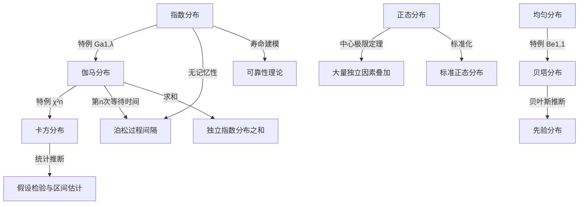
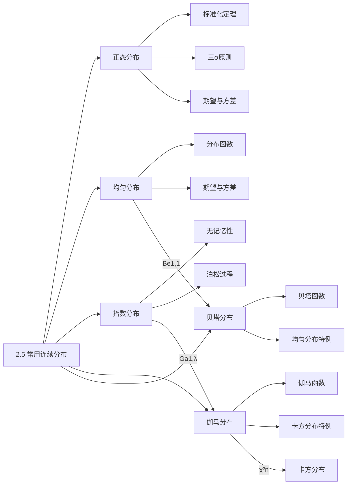

# 2.5 常用连续分布

> [!abstract] 本节概览
> 本节介绍概率论中最重要的五大连续分布：==正态分布==、==均匀分布==、==指数分布==、==伽马分布==和==贝塔分布==。这些分布描述了不同场景下连续随机变量的统计规律性，是后续统计推断的理论基础。
>
> **逻辑链条**：均匀分布（最基本连续分布）→ 指数分布（等待时间）→ 伽马分布（指数分布推广）→ 贝塔分布（区间上的分布）→ 正态分布（中心极限定理的终极形态）→ 分布间的关系与汇总
>
> **前置依赖**：[[2.1 随机变量及其分布|§2.1]]（密度函数、分布函数）、[[2.2 数学期望|§2.2]]（期望、线性性）、[[2.3 方差与标准差|§2.3]]（方差）、[[1.4 条件概率|§1.4]]（条件概率）
>
> **核心主线**：五大连续分布各有适用场景。正态分布 $N(\mu,\sigma^2)$ 是自然界最常见的分布，由中心极限定理保证；指数分布 $Exp(\lambda)$ 描述事件间隔时间，具有独特的无记忆性；伽马分布 $Ga(\alpha,\lambda)$ 是指数分布的自然推广；贝塔分布 $Be(a,b)$ 描述 $(0,1)$ 区间上的随机比例。

---

## 一、正态分布

正态分布是概率论中最重要的连续分布，也是整个统计学的基石。它由高斯（Gauss）在研究天文观测误差时系统提出，因此又称==高斯分布==。

### 物理背景

正态分布的物理背景源于==高斯误差理论==。高斯在研究天文观测数据时发现：

1. 观测误差是由大量==微小独立的随机因素==叠加而成的；
2. 这些因素中，正误差和负误差出现的可能性相等；
3. 小误差出现的概率大于大误差出现的概率；
4. 极大误差出现的概率趋近于零。

这就是著名的==误差公理==。数学上，当大量独立同分布的随机变量相加时，由[[4.4 中心极限定理|中心极限定理]]保证，其和的分布趋近于正态分布。

**生活中的正态分布**：身高、体重、考试成绩、测量误差、分子运动速度等，都近似服从正态分布。

### 正态分布的定义

> [!def] 定义 2.5.1 — 正态分布
> 若连续随机变量 $X$ 的密度函数为
> $$p(x) = \frac{1}{\sqrt{2\pi}\,\sigma} \exp\left\{-\frac{(x-\mu)^2}{2\sigma^2}\right\}, \quad -\infty < x < +\infty$$
> 其中 $\mu \in \mathbb{R}$，$\sigma > 0$ 为参数，则称 $X$ 服从参数为 $(\mu, \sigma^2)$ 的==正态分布==，记为 $X \sim N(\mu, \sigma^2)$。

**参数的含义**：
- $\mu$：==位置参数==（均值），决定密度曲线的中心位置。$\mu$ 越大，曲线越靠右。
- $\sigma^2$：==尺度参数==（方差），决定密度曲线的形状。$\sigma^2$ 越小，曲线越集中（高而窄）；$\sigma^2$ 越大，曲线越分散（矮而宽）。

**密度函数的验证**：

需要验证 $p(x) \geq0$ 且 $\int_{-\infty}^{+\infty} p(x)\,dx = 1$。

非负性显然成立（指数函数和分母均为正）。归一性的验证需要计算积分：

$$I = \int_{-\infty}^{+\infty} \exp\left\{-\frac{(x-\mu)^2}{2\sigma^2}\right\} dx$$

令 $t = \dfrac{x-\mu}{\sigma}$，则 $dx = \sigma\,dt$：

$$I = \sigma \int_{-\infty}^{+\infty} e^{-t^2/2}\,dt$$

利用著名的概率积分 $\displaystyle\int_{-\infty}^{+\infty} e^{-t^2/2}\,dt = \sqrt{2\pi}$，得 $I = \sigma\sqrt{2\pi}$。

因此 $\displaystyle\int_{-\infty}^{+\infty} p(x)\,dx = \frac{1}{\sqrt{2\pi}\,\sigma} \cdot \sigma\sqrt{2\pi} = 1$。 $\blacksquare$

### 密度函数的图像特征

正态分布的密度曲线具有以下重要特征：

1. **对称性**：关于 $x = \mu$ 对称，即 $p(\mu + x) = p(\mu - x)$。
2. **单峰性**：在 $x = \mu$ 处取得最大值 $p(\mu) = \dfrac{1}{\sqrt{2\pi}\,\sigma}$。
3. **渐近性**：当 $x \to \pm\infty$ 时，$p(x) \to 0$，曲线以 $x$ 轴为渐近线。
4. **拐点**：在 $x = \mu \pm \sigma$ 处有拐点。

### 标准正态分布

> [!def] 标准正态分布
> 当 $\mu = 0$，$\sigma = 1$ 时的正态分布称为==标准正态分布==，记为 $N(0,1)$。其密度函数和分布函数分别记为
> $$\varphi(u) = \frac{1}{\sqrt{2\pi}} e^{-u^2/2}, \quad -\infty < u < +\infty$$
> $$\Phi(u) = \int_{-\infty}^{u} \varphi(t)\,dt = \int_{-\infty}^{u} \frac{1}{\sqrt{2\pi}} e^{-t^2/2}\,dt$$

**标准正态分布的重要性质**：

1. **对称性**：$\varphi(-u) = \varphi(u)$，即密度函数是偶函数。
2. **分布函数的对称关系**：$\Phi(-u) = 1 - \Phi(u)$。
   - **推导**：由密度函数的对称性，
   $$\Phi(-u) = \int_{-\infty}^{-u} \varphi(t)\,dt = \int_{u}^{+\infty} \varphi(t)\,dt = 1 - \int_{-\infty}^{u} \varphi(t)\,dt = 1 - \Phi(u)$$
3. **$\Phi(0) = 0.5$**：由对称性直接得出。

### 标准化定理

> [!thm] 定理 2.5.1 — 标准化定理
> 若 $X \sim N(\mu, \sigma^2)$，则 $U = \dfrac{X - \mu}{\sigma} \sim N(0,1)$。

> [!abstract] 证明
> **证明**：需要证明 $U$ 的密度函数为 $\varphi(u)$。
>
> **[变量代换法]**：设 $X$ 的分布函数为 $F_X(x)$，则 $U$ 的分布函数为
> $$F_U(u) = P(U \le u) = P\left(\frac{X - \mu}{\sigma} \le u\right) = P(X \le \mu + \sigma u) = F_X(\mu + \sigma u)$$
>
> 对 $u$ 求导，得 $U$ 的密度函数：
> $$p_U(u) = \frac{d}{du} F_U(u) = \frac{d}{du} F_X(\mu + \sigma u) = p_X(\mu + \sigma u) \cdot \sigma$$
>
> 将 $X$ 的密度函数代入：
> $$p_U(u) = \sigma \cdot \frac{1}{\sqrt{2\pi}\,\sigma} \exp\left\{-\frac{(\mu + \sigma u - \mu)^2}{2\sigma^2}\right\} = \frac{1}{\sqrt{2\pi}} \exp\left\{-\frac{u^2}{2}\right\} = \varphi(u)$$
>
> 因此 $U \sim N(0,1)$。 $\blacksquare$

标准化定理的意义在于：==任何正态分布的概率计算都可以转化为标准正态分布的计算==，只需查标准正态分布表即可。

### 概率计算公式

利用标准化定理，可以推导出正态分布的概率计算公式：

**（1）单侧概率**：

$$P(X \le c) = P\left(\frac{X - \mu}{\sigma} \le \frac{c - \mu}{\sigma}\right) = \Phi\left(\frac{c - \mu}{\sigma}\right)$$

$$P(X > c) = 1 - \Phi\left(\frac{c - \mu}{\sigma}\right)$$

**（2）区间概率**：

$$P(a < X \le b) = \Phi\left(\frac{b - \mu}{\sigma}\right) - \Phi\left(\frac{a - \mu}{\sigma}\right)$$

**（3）对称区间概率**：

$$P(\mu - k\sigma < X < \mu + k\sigma) = \Phi(k) - \Phi(-k) = 2\Phi(k) - 1$$

### 3σ原则

> [!thm] 3σ原则
> 若 $X \sim N(\mu, \sigma^2)$，则
> $$P(\mu - k\sigma < X < \mu + k\sigma) = 2\Phi(k) - 1$$
> 特别地：
> - $k = 1$：$P(\mu - \sigma < X < \mu + \sigma) = 2\Phi(1) - 1 \approx 68.27\%$
> - $k = 2$：$P(\mu - 2\sigma < X < \mu + 2\sigma) = 2\Phi(2) - 1 \approx 95.45\%$
> - $k = 3$：$P(\mu - 3\sigma < X < \mu + 3\sigma) = 2\Phi(3) - 1 \approx 99.73\%$

> [!abstract] 证明
> **证明**：由标准化定理，
> $$P(\mu - k\sigma < X < \mu + k\sigma) = P\left(-k < \frac{X-\mu}{\sigma} < k\right) = \Phi(k) - \Phi(-k)$$
>
> **[对称性]**：由 $\Phi(-k) = 1 - \Phi(k)$，
> $$\Phi(k) - \Phi(-k) = \Phi(k) - (1 - \Phi(k)) = 2\Phi(k) - 1$$
>
> 查标准正态分布表：$\Phi(1) \approx 0.8413$，$\Phi(2) \approx 0.9772$，$\Phi(3) \approx 0.9987$。
>
> 代入即得三个概率值。 $\blacksquare$

**3σ原则的实际意义**：正态随机变量几乎肯定落在 $(\mu - 3\sigma, \mu + 3\sigma)$ 内，落在该区间外的概率不到 $0.3\%$。这是==质量控制==中"3σ准则"的理论基础。

### 正态分布的期望和方差

> [!thm] 定理 2.5.2 — 正态分布的期望和方差
> 若 $X \sim N(\mu, \sigma^2)$，则
> $$E(X) = \mu, \quad \text{Var}(X) = \sigma^2$$

> [!abstract] 证明
> **证明**：利用标准化定理，设 $U = \dfrac{X - \mu}{\sigma} \sim N(0,1)$，则 $X = \mu + \sigma U$。
>
> **[标准化+线性性]**：
>
> **第一步：计算 $E(U)$**。
> $$E(U) = \int_{-\infty}^{+\infty} u \cdot \varphi(u)\,du = \frac{1}{\sqrt{2\pi}} \int_{-\infty}^{+\infty} u\,e^{-u^2/2}\,du$$
>
> 注意到被积函数 $u\,e^{-u^2/2}$ 是奇函数，积分区间关于原点对称，因此
> $$E(U) = 0$$
>
> **第二步：计算 $E(X)$**。
> $$E(X) = E(\mu + \sigma U) = \mu + \sigma E(U) = \mu + \sigma \cdot 0 = \mu$$
>
> **第三步：计算 $E(U^2)$**。
> $$E(U^2) = \int_{-\infty}^{+\infty} u^2 \cdot \varphi(u)\,du = \frac{1}{\sqrt{2\pi}} \int_{-\infty}^{+\infty} u^2\,e^{-u^2/2}\,du$$
>
> 利用分部积分，令 $v = u$，$dw = u\,e^{-u^2/2}\,du$，则 $dv = du$，$w = -e^{-u^2/2}$：
> $$E(U^2) = \frac{1}{\sqrt{2\pi}} \left[-u\,e^{-u^2/2}\Big|_{-\infty}^{+\infty} + \int_{-\infty}^{+\infty} e^{-u^2/2}\,du\right]$$
>
> 第一项在 $u \to \pm\infty$ 时趋于 $0$（指数衰减比多项式增长快）。第二项：
> $$\int_{-\infty}^{+\infty} e^{-u^2/2}\,du = \sqrt{2\pi}$$
>
> 因此 $E(U^2) = \dfrac{1}{\sqrt{2\pi}} \cdot \sqrt{2\pi} = 1$。
>
> **第四步：计算 $\text{Var}(X)$**。
> $$\text{Var}(U) = E(U^2) - [E(U)]^2 = 1 - 0 = 1$$
> $$\text{Var}(X) = \text{Var}(\mu + \sigma U) = \sigma^2\,\text{Var}(U) = \sigma^2 \cdot 1 = \sigma^2$$ $\blacksquare$

这验证了参数 $\mu$ 和 $\sigma^2$ 确实是正态分布的期望和方差。

### 例题

> [!example] 例 2.5.1 — 正态分布概率计算
> 设 $X \sim N(108, 9)$（即 $\mu = 108$，$\sigma^2 = 9$，$\sigma = 3$），求 $P(102 < X < 117)$。

**解**：利用标准化公式：

$$P(102 < X < 117) = \Phi\left(\frac{117 - 108}{3}\right) - \Phi\left(\frac{102 - 108}{3}\right) = \Phi(3) - \Phi(-2)$$

由对称性 $\Phi(-2) = 1 - \Phi(2)$：

$$= \Phi(3) - (1 - \Phi(2)) = \Phi(3) + \Phi(2) - 1$$

查标准正态分布表：$\Phi(2) \approx 0.9772$，$\Phi(3) \approx 0.9987$。

$$P(102 < X < 117) \approx 0.9987 + 0.9772 - 1 = 0.9759$$

即 $P(102 < X < 117) \approx 0.9759$。

> [!example] 例 2.5.2 — 正态分布分位数
> 设 $X \sim N(0,1)$，求 $a$ 使得 $P(X < a) = 0.95$。

**解**：由标准正态分布函数的定义，

$$P(X < a) = \Phi(a) = 0.95$$

查标准正态分布表，$\Phi(1.645) \approx 0.95$，因此 $a \approx 1.645$。

这里 $a = 1.645$ 称为标准正态分布的==上 $0.05$ 分位数==，记为 $u_{0.05} = 1.645$。

**常用分位数**：
- $u_{0.05} = 1.645$（单侧 $95\%$）
- $u_{0.025} = 1.96$（双侧 $95\%$）
- $u_{0.005} = 2.576$（双侧 $99\%$）

---

## 二、均匀分布

均匀分布是最简单的连续分布，描述的是随机变量在某区间上"均匀"取值的情形。

### 均匀分布的定义

> [!def] 定义 2.5.2 — 均匀分布
> 若连续随机变量 $X$ 的密度函数为
> $$p(x) = \begin{cases} \dfrac{1}{b-a}, & a < x < b \\[6pt] 0, & \text{其他} \end{cases}$$
> 其中 $a < b$ 为参数，则称 $X$ 在区间 $(a, b)$ 上服从==均匀分布==，记为 $X \sim U(a, b)$。

**直观理解**：$X$ 落在 $(a, b)$ 内任何等长子区间上的概率相同。就像向线段 $(a, b)$ 上随机投点，每个点被投中的概率密度相同。

**验证归一性**：

$$\int_{-\infty}^{+\infty} p(x)\,dx = \int_a^b \frac{1}{b-a}\,dx = \frac{1}{b-a} \cdot (b - a) = 1 \quad \checkmark$$

### 均匀分布的分布函数

由 [[2.1 随机变量及其分布|§2.1]] 中分布函数的定义 $F(x) = \displaystyle\int_{-\infty}^{x} p(t)\,dt$：

$$F(x) = \begin{cases} 0, & x \le a \\[4pt] \dfrac{x - a}{b - a}, & a < x < b \\[6pt] 1, & x \ge b \end{cases}$$

分布函数在 $(a, b)$ 上是线性增长的，从 $0$ 单调递增到 $1$。

### 均匀分布的期望和方差

> [!thm] 定理 2.5.3 — 均匀分布的期望和方差
> 若 $X \sim U(a, b)$，则
> $$E(X) = \frac{a + b}{2}, \quad \text{Var}(X) = \frac{(b-a)^2}{12}$$

> [!abstract] 证明
> **证明**：
>
> **[直接积分法]**：
>
> **期望**：
> $$E(X) = \int_a^b x \cdot \frac{1}{b-a}\,dx = \frac{1}{b-a} \cdot \frac{x^2}{2}\Bigg|_a^b = \frac{1}{b-a} \cdot \frac{b^2 - a^2}{2} = \frac{b^2 - a^2}{2(b-a)} = \frac{(b-a)(b+a)}{2(b-a)} = \frac{a+b}{2}$$
>
> **方差**：先计算 $E(X^2)$：
> $$E(X^2) = \int_a^b x^2 \cdot \frac{1}{b-a}\,dx = \frac{1}{b-a} \cdot \frac{x^3}{3}\Bigg|_a^b = \frac{b^3 - a^3}{3(b-a)} = \frac{(b-a)(b^2 + ab + a^2)}{3(b-a)} = \frac{b^2 + ab + a^2}{3}$$
>
> 因此：
> $$\text{Var}(X) = E(X^2) - [E(X)]^2 = \frac{b^2 + ab + a^2}{3} - \frac{(a+b)^2}{4}$$
>
> 通分（公分母为 $12$）：
> $$= \frac{4(b^2 + ab + a^2) - 3(a^2 + 2ab + b^2)}{12} = \frac{4b^2 + 4ab + 4a^2 - 3a^2 - 6ab - 3b^2}{12} = \frac{a^2 - 2ab + b^2}{12} = \frac{(b-a)^2}{12}$$ $\blacksquare$

**直观理解**：
- 期望 $\dfrac{a+b}{2}$：区间的中点，符合"均匀"的直觉。
- 方差 $\dfrac{(b-a)^2}{12}$：区间越长，分散程度越大。

### 例题

> [!example] 例 2.5.3 — 均匀分布应用
> 某公共汽车站每隔 15 分钟一班，乘客到达车站的时刻是随机的。求乘客等候时间不超过 5 分钟的概率。

**解**：设乘客到达时刻为 $X$（分钟），则 $X \sim U(0, 15)$。

等候时间不超过 5 分钟，意味着乘客在班车到达前 5 分钟内到达。由于班车在 $t = 0, 15, 30, \ldots$ 到达，乘客等候时间 $T = 15 - X$（若 $X$ 落在某一个 15 分钟区间内）。

等候时间不超过 5 分钟：$T \le 5$，即 $15 - X \le 5$，即 $X \ge 10$。

$$P(X \ge 10) = \int_{10}^{15} \frac{1}{15}\,dx = \frac{15 - 10}{15} = \frac{5}{15} = \frac{1}{3}$$

因此乘客等候时间不超过 5 分钟的概率为 $\dfrac{1}{3}$。

---

## 三、指数分布

指数分布是描述==等待时间==和==寿命==的最重要的连续分布，在排队论、可靠性理论中有着广泛应用。

### 指数分布的定义

> [!def] 定义 2.5.3 — 指数分布
> 若连续随机变量 $X$ 的密度函数为
> $$p(x) = \begin{cases} \lambda\,e^{-\lambda x}, & x \ge 0 \\ 0, & x < 0 \end{cases}$$
> 其中 $\lambda > 0$ 为参数，则称 $X$ 服从参数为 $\lambda$ 的==指数分布==，记为 $X \sim Exp(\lambda)$。

**参数的含义**：$\lambda$ 是==速率参数==，表示单位时间内事件发生的平均次数。$\lambda$ 越大，事件发生越频繁，等待时间越短。

**验证归一性**：

$$\int_{-\infty}^{+\infty} p(x)\,dx = \int_0^{+\infty} \lambda\,e^{-\lambda x}\,dx = -e^{-\lambda x}\Big|_0^{+\infty} = 0 - (-1) = 1 \quad \checkmark$$

### 指数分布的分布函数

$$F(x) = \int_{-\infty}^{x} p(t)\,dt = \begin{cases} 0, & x < 0 \\ 1 - e^{-\lambda x}, & x \ge 0 \end{cases}$$

推导：当 $x \ge 0$ 时，

$$F(x) = \int_0^x \lambda\,e^{-\lambda t}\,dt = -e^{-\lambda t}\Big|_0^x = -e^{-\lambda x} + 1 = 1 - e^{-\lambda x}$$

### 指数分布的期望和方差

> [!thm] 定理 2.5.4 — 指数分布的期望和方差
> 若 $X \sim Exp(\lambda)$，则
> $$E(X) = \frac{1}{\lambda}, \quad \text{Var}(X) = \frac{1}{\lambda^2}$$

> [!abstract] 证明
> **证明**：
>
> **[分部积分法]**：
>
> **期望**：
> $$E(X) = \int_0^{+\infty} x \cdot \lambda\,e^{-\lambda x}\,dx$$
>
> 令 $u = x$，$dv = \lambda\,e^{-\lambda x}\,dx$，则 $du = dx$，$v = -e^{-\lambda x}$：
> $$E(X) = -x\,e^{-\lambda x}\Big|_0^{+\infty} + \int_0^{+\infty} e^{-\lambda x}\,dx$$
>
> 第一项：$\lim_{x \to +\infty} x\,e^{-\lambda x} = 0$（指数衰减比多项式增长快），在 $x = 0$ 处为 $0$。
>
> 第二项：$\displaystyle\int_0^{+\infty} e^{-\lambda x}\,dx = \frac{1}{\lambda}$。
>
> 因此 $E(X) = 0 + \dfrac{1}{\lambda} = \dfrac{1}{\lambda}$。
>
> **方差**：先计算 $E(X^2)$：
> $$E(X^2) = \int_0^{+\infty} x^2 \cdot \lambda\,e^{-\lambda x}\,dx$$
>
> 两次分部积分（或利用伽马函数，见下节）：
> $$E(X^2) = \frac{2}{\lambda^2}$$
>
> 因此：
> $$\text{Var}(X) = E(X^2) - [E(X)]^2 = \frac{2}{\lambda^2} - \frac{1}{\lambda^2} = \frac{1}{\lambda^2}$$ $\blacksquare$

**直观理解**：
- 期望 $E(X) = \dfrac{1}{\lambda}$：如果事件平均每小时发生 $\lambda$ 次，则平均等待时间为 $\dfrac{1}{\lambda}$ 小时。
- 标准差 $\sqrt{\text{Var}(X)} = \dfrac{1}{\lambda} = E(X)$：标准差等于均值，说明指数分布的离散程度相对较大。

### 无记忆性

> [!thm] 定理 2.5.5 — 指数分布的无记忆性
> 若 $X \sim Exp(\lambda)$，则对任意 $s > 0$，$t > 0$，有
> $$P(X > s + t \mid X > s) = P(X > t)$$

> [!abstract] 证明
> **证明**：
>
> **[条件概率+分布函数]**：
>
> 由条件概率公式：
> $$P(X > s + t \mid X > s) = \frac{P(X > s + t)}{P(X > s)}$$
>
> 利用指数分布的尾部概率 $P(X > x) = 1 - F(x) = e^{-\lambda x}$：
> $$= \frac{e^{-\lambda(s+t)}}{e^{-\lambda s}} = \frac{e^{-\lambda s} \cdot e^{-\lambda t}}{e^{-\lambda s}} = e^{-\lambda t} = P(X > t)$$ $\blacksquare$

**无记忆性的含义**：如果一件产品已经工作了 $s$ 小时仍未损坏，那么它再工作 $t$ 小时的概率，与一件新产品工作 $t$ 小时的概率相同。换句话说，==过去的"历史"不会影响未来的"寿命"==。

**生活类比**：就像掷骰子——无论你已经掷了多少次没有出现 6 点，下一次掷出 6 点的概率始终是 $\dfrac{1}{6}$。指数分布的"等待"也具有这种"不记仇"的特性。

> [!info] 与泊松过程的关系
> 在参数为 $\lambda$ 的==泊松过程==中，两次相邻事件之间的时间间隔服从 $Exp(\lambda)$ 分布。这是指数分布最重要的物理背景之一。
>
> 例如：某服务台顾客到达服从参数为 $\lambda$ 的泊松过程，则相邻两位顾客到达的时间间隔 $T \sim Exp(\lambda)$。

### 例题

> [!example] 例 2.5.4 — 指数分布无记忆性应用
> 某电子元件的寿命 $X \sim Exp(0.01)$（单位：小时）。已知该元件已正常工作了 200 小时，求它再正常工作 100 小时的概率。

**解**：由无记忆性，

$$P(X > 200 + 100 \mid X > 200) = P(X > 100) = e^{-0.01 \times 100} = e^{-1} \approx 0.3679$$

注意：这个概率与元件已经工作了 200 小时这一事实无关！这正是无记忆性的体现。

---

## 四、伽马分布

伽马分布是指数分布的自然推广，也是卡方分布的理论基础。

### 伽马函数

> [!def] 伽马函数
> 称函数
> $$\Gamma(\alpha) = \int_0^{+\infty} x^{\alpha - 1}\,e^{-x}\,dx, \quad \alpha > 0$$
> 为==伽马函数==。

**伽马函数的基本性质**：

**性质 1**：$\Gamma(1) = 1$

$$\Gamma(1) = \int_0^{+\infty} e^{-x}\,dx = -e^{-x}\Big|_0^{+\infty} = 1$$

**性质 2**：递推公式 $\Gamma(\alpha + 1) = \alpha\,\Gamma(\alpha)$

$$\Gamma(\alpha + 1) = \int_0^{+\infty} x^{\alpha}\,e^{-x}\,dx$$

分部积分：令 $u = x^{\alpha}$，$dv = e^{-x}\,dx$，则 $du = \alpha\,x^{\alpha-1}\,dx$，$v = -e^{-x}$：

$$= -x^{\alpha}\,e^{-x}\Big|_0^{+\infty} + \alpha\int_0^{+\infty} x^{\alpha-1}\,e^{-x}\,dx = 0 + \alpha\,\Gamma(\alpha) = \alpha\,\Gamma(\alpha)$$

**推论**：当 $\alpha = n$（正整数）时，$\Gamma(n + 1) = n!$。因此伽马函数是阶乘的推广。

**性质 3**：$\Gamma\left(\dfrac{1}{2}\right) = \sqrt{\pi}$

$$\Gamma\left(\frac{1}{2}\right) = \int_0^{+\infty} x^{-1/2}\,e^{-x}\,dx$$

令 $x = \dfrac{t^2}{2}$，则 $dx = t\,dt$，$x^{-1/2} = \dfrac{\sqrt{2}}{t}$：

$$= \int_0^{+\infty} \frac{\sqrt{2}}{t}\,e^{-t^2/2}\,t\,dt = \sqrt{2}\int_0^{+\infty} e^{-t^2/2}\,dt = \sqrt{2} \cdot \frac{\sqrt{2\pi}}{2} = \sqrt{\pi}$$

其中利用了概率积分 $\displaystyle\int_0^{+\infty} e^{-t^2/2}\,dt = \frac{\sqrt{2\pi}}{2}$。

### 伽马分布的定义

> [!def] 定义 2.5.4 — 伽马分布
> 若连续随机变量 $X$ 的密度函数为
> $$p(x) = \begin{cases} \dfrac{\lambda^\alpha}{\Gamma(\alpha)}\,x^{\alpha - 1}\,e^{-\lambda x}, & x > 0 \\[8pt] 0, & x \le 0 \end{cases}$$
> 其中 $\alpha > 0$，$\lambda > 0$ 为参数，则称 $X$ 服从参数为 $(\alpha, \lambda)$ 的==伽马分布==，记为 $X \sim Ga(\alpha, \lambda)$。

**参数的含义**：
- $\alpha$：==形状参数==，决定密度曲线的形状。$\alpha \le 1$ 时单调递减，$\alpha > 1$ 时呈单峰状。
- $\lambda$：==速率参数==（尺度参数的倒数），与指数分布中的 $\lambda$ 含义相同。

**验证归一性**：

$$\int_0^{+\infty} \frac{\lambda^\alpha}{\Gamma(\alpha)}\,x^{\alpha - 1}\,e^{-\lambda x}\,dx$$

令 $t = \lambda x$，则 $dx = dt/\lambda$：

$$= \frac{\lambda^\alpha}{\Gamma(\alpha)} \int_0^{+\infty} \left(\frac{t}{\lambda}\right)^{\alpha-1}\,e^{-t}\,\frac{dt}{\lambda} = \frac{\lambda^\alpha}{\Gamma(\alpha)} \cdot \frac{1}{\lambda^{\alpha}} \int_0^{+\infty} t^{\alpha-1}\,e^{-t}\,dt = \frac{\Gamma(\alpha)}{\Gamma(\alpha)} = 1 \quad \checkmark$$

### 伽马分布的期望和方差

> [!thm] 定理 2.5.6 — 伽马分布的期望和方差
> 若 $X \sim Ga(\alpha, \lambda)$，则
> $$E(X) = \frac{\alpha}{\lambda}, \quad \text{Var}(X) = \frac{\alpha}{\lambda^2}$$

> [!abstract] 证明
> **证明**：
>
> **[伽马函数递推]**：
>
> **期望**：
> $$E(X) = \int_0^{+\infty} x \cdot \frac{\lambda^\alpha}{\Gamma(\alpha)}\,x^{\alpha-1}\,e^{-\lambda x}\,dx = \frac{\lambda^\alpha}{\Gamma(\alpha)} \int_0^{+\infty} x^{\alpha}\,e^{-\lambda x}\,dx$$
>
> 令 $t = \lambda x$：
> $$= \frac{\lambda^\alpha}{\Gamma(\alpha)} \int_0^{+\infty} \left(\frac{t}{\lambda}\right)^{\alpha}\,e^{-t}\,\frac{dt}{\lambda} = \frac{\lambda^\alpha}{\Gamma(\alpha)} \cdot \frac{1}{\lambda^{\alpha+1}} \int_0^{+\infty} t^{\alpha}\,e^{-t}\,dt = \frac{1}{\lambda\,\Gamma(\alpha)} \cdot \Gamma(\alpha+1)$$
>
> 由递推公式 $\Gamma(\alpha+1) = \alpha\,\Gamma(\alpha)$：
> $$= \frac{\alpha\,\Gamma(\alpha)}{\lambda\,\Gamma(\alpha)} = \frac{\alpha}{\lambda}$$
>
> **方差**：类似地计算 $E(X^2)$：
> $$E(X^2) = \frac{\lambda^\alpha}{\Gamma(\alpha)} \int_0^{+\infty} x^{\alpha+1}\,e^{-\lambda x}\,dx = \frac{\Gamma(\alpha+2)}{\lambda^2\,\Gamma(\alpha)} = \frac{(\alpha+1)\alpha\,\Gamma(\alpha)}{\lambda^2\,\Gamma(\alpha)} = \frac{\alpha(\alpha+1)}{\lambda^2}$$
>
> 因此：
> $$\text{Var}(X) = E(X^2) - [E(X)]^2 = \frac{\alpha(\alpha+1)}{\lambda^2} - \frac{\alpha^2}{\lambda^2} = \frac{\alpha}{\lambda^2}$$ $\blacksquare$

### 伽马分布的特例

**特例 1**：当 $\alpha = 1$ 时，$Ga(1, \lambda) = Exp(\lambda)$。

验证：$\Gamma(1) = 1$，密度函数变为

$$p(x) = \frac{\lambda^1}{\Gamma(1)}\,x^{0}\,e^{-\lambda x} = \lambda\,e^{-\lambda x}, \quad x > 0$$

这正是指数分布 $Exp(\lambda)$ 的密度函数。

**特例 2**：==卡方分布==。当 $\alpha = \dfrac{n}{2}$，$\lambda = \dfrac{1}{2}$ 时，$Ga\left(\dfrac{n}{2}, \dfrac{1}{2}\right)$ 就是自由度为 $n$ 的==卡方分布==，记为 $\chi^2(n)$。

卡方分布的密度函数为：

$$p(x) = \frac{1}{2^{n/2}\,\Gamma(n/2)}\,x^{n/2 - 1}\,e^{-x/2}, \quad x > 0$$

卡方分布在统计推断中极为重要，是假设检验和区间估计的核心工具。

> [!info] 与泊松过程的关系
> 在参数为 $\lambda$ 的泊松过程中，==第 $n$ 次事件发生的等待时间== $T_n \sim Ga(n, \lambda)$。
>
> 当 $n = 1$ 时，$T_1 \sim Ga(1, \lambda) = Exp(\lambda)$，即第一次事件发生的等待时间服从指数分布。
>
> 这说明伽马分布是指数分布在"等待第 $n$ 次事件"场景下的自然推广。

---

## 五、贝塔分布

贝塔分布描述的是 $(0, 1)$ 区间上的随机变量，常用于建模比例、概率等有界量。

### 贝塔函数

> [!def] 贝塔函数
> 称函数
> $$B(a, b) = \int_0^1 x^{a-1}(1-x)^{b-1}\,dx, \quad a > 0,\ b > 0$$
> 为==贝塔函数==。

**贝塔函数与伽马函数的关系**：

$$B(a, b) = \frac{\Gamma(a)\,\Gamma(b)}{\Gamma(a + b)}$$

这个关系非常重要，它将贝塔函数的计算转化为伽马函数的计算。

### 贝塔分布的定义

> [!def] 定义 2.5.5 — 贝塔分布
> 若连续随机变量 $X$ 的密度函数为
> $$p(x) = \begin{cases} \dfrac{\Gamma(a+b)}{\Gamma(a)\,\Gamma(b)}\,x^{a-1}(1-x)^{b-1}, & 0 < x < 1 \\[8pt] 0, & \text{其他} \end{cases}$$
> 其中 $a > 0$，$b > 0$ 为参数，则称 $X$ 服从参数为 $(a, b)$ 的==贝塔分布==，记为 $X \sim Be(a, b)$。

**参数的含义**：
- $a$：控制密度函数在 $x$ 接近 $1$ 时的行为。$a$ 越大，密度越集中在 $1$ 附近。
- $b$：控制密度函数在 $x$ 接近 $0$ 时的行为。$b$ 越大，密度越集中在 $0$ 附近。
- 当 $a = b$ 时，密度函数关于 $x = 0.5$ 对称。

**验证归一性**：

$$\int_0^1 \frac{\Gamma(a+b)}{\Gamma(a)\,\Gamma(b)}\,x^{a-1}(1-x)^{b-1}\,dx = \frac{\Gamma(a+b)}{\Gamma(a)\,\Gamma(b)} \cdot B(a,b) = \frac{\Gamma(a+b)}{\Gamma(a)\,\Gamma(b)} \cdot \frac{\Gamma(a)\,\Gamma(b)}{\Gamma(a+b)} = 1 \quad \checkmark$$

### 贝塔分布的期望和方差

> [!thm] 定理 2.5.7 — 贝塔分布的期望和方差
> 若 $X \sim Be(a, b)$，则
> $$E(X) = \frac{a}{a + b}, \quad \text{Var}(X) = \frac{ab}{(a+b)^2(a+b+1)}$$

> [!abstract] 证明
> **证明**：
>
> **[贝塔函数性质]**：
>
> **期望**：
> $$E(X) = \int_0^1 x \cdot \frac{\Gamma(a+b)}{\Gamma(a)\,\Gamma(b)}\,x^{a-1}(1-x)^{b-1}\,dx = \frac{\Gamma(a+b)}{\Gamma(a)\,\Gamma(b)} \int_0^1 x^{a}(1-x)^{b-1}\,dx$$
>
> 积分部分正是 $B(a+1, b)$：
> $$= \frac{\Gamma(a+b)}{\Gamma(a)\,\Gamma(b)} \cdot B(a+1, b) = \frac{\Gamma(a+b)}{\Gamma(a)\,\Gamma(b)} \cdot \frac{\Gamma(a+1)\,\Gamma(b)}{\Gamma(a+b+1)}$$
>
> 利用 $\Gamma(a+1) = a\,\Gamma(a)$ 和 $\Gamma(a+b+1) = (a+b)\,\Gamma(a+b)$：
> $$= \frac{\Gamma(a+b)}{\Gamma(a)\,\Gamma(b)} \cdot \frac{a\,\Gamma(a)\,\Gamma(b)}{(a+b)\,\Gamma(a+b)} = \frac{a}{a+b}$$
>
> **方差**：类似地计算 $E(X^2)$：
> $$E(X^2) = \frac{\Gamma(a+b)}{\Gamma(a)\,\Gamma(b)} \cdot B(a+2, b) = \frac{\Gamma(a+b)}{\Gamma(a)\,\Gamma(b)} \cdot \frac{\Gamma(a+2)\,\Gamma(b)}{\Gamma(a+b+2)}$$
>
> 利用 $\Gamma(a+2) = (a+1)\,a\,\Gamma(a)$ 和 $\Gamma(a+b+2) = (a+b+1)(a+b)\,\Gamma(a+b)$：
> $$= \frac{(a+1)\,a}{(a+b+1)(a+b)}$$
>
> 因此：
> $$\text{Var}(X) = E(X^2) - [E(X)]^2 = \frac{a(a+1)}{(a+b)(a+b+1)} - \frac{a^2}{(a+b)^2}$$
>
> 通分：
> $$= \frac{a(a+1)(a+b) - a^2(a+b+1)}{(a+b)^2(a+b+1)} = \frac{a(a^2 + ab + a + b) - a^3 - a^2b - a^2}{(a+b)^2(a+b+1)} = \frac{ab}{(a+b)^2(a+b+1)}$$ $\blacksquare$

### 贝塔分布的特例

**特例**：当 $a = 1$，$b = 1$ 时，$Be(1, 1) = U(0, 1)$。

验证：$\Gamma(1) = 1$，$\Gamma(2) = 1$，密度函数变为

$$p(x) = \frac{\Gamma(2)}{\Gamma(1)\,\Gamma(1)}\,x^{0}(1-x)^{0} = \frac{1}{1 \cdot 1} \cdot 1 \cdot 1 = 1, \quad 0 < x < 1$$

这正是 $(0, 1)$ 上的均匀分布。因此均匀分布是贝塔分布的特例。

---

## 六、各分布间的关系与汇总

### 分布关系图

### 全分布汇总表

> [!info] 离散分布汇总
> | 分布名称 | 记号 | 分布列/密度 | 期望 | 方差 |
> |:---:|:---:|:---:|:---:|:---:|
> | 二点分布 | $b(1,p)$ | $P(X=k)=p^k(1-p)^{1-k}$，$k=0,1$ | $p$ | $p(1-p)$ |
> | 二项分布 | $b(n,p)$ | $P(X=k)=\binom{n}{k}p^k(1-p)^{n-k}$ | $np$ | $np(1-p)$ |
> | 泊松分布 | $P(\lambda)$ | $P(X=k)=\dfrac{\lambda^k}{k!}e^{-\lambda}$ | $\lambda$ | $\lambda$ |
> | 几何分布 | $Ge(p)$ | $P(X=k)=(1-p)^{k-1}p$，$k=1,2,\ldots$ | $\dfrac{1}{p}$ | $\dfrac{1-p}{p^2}$ |
> | 超几何分布 | $H(n,M,N)$ | $P(X=k)=\dfrac{\binom{M}{k}\binom{N-M}{n-k}}{\binom{N}{n}}$ | $\dfrac{nM}{N}$ | $\dfrac{nM(N-M)(N-n)}{N^2(N-1)}$ |
> | 负二项分布 | $Nb(r,p)$ | $P(X=k)=\binom{k-1}{r-1}p^r(1-p)^{k-r}$ | $\dfrac{r}{p}$ | $\dfrac{r(1-p)}{p^2}$ |

> [!info] 连续分布汇总
> | 分布名称 | 记号 | 密度函数 | 期望 | 方差 |
> |:---:|:---:|:---:|:---:|:---:|
> | 均匀分布 | $U(a,b)$ | $p(x)=\dfrac{1}{b-a}$，$a<x<b$ | $\dfrac{a+b}{2}$ | $\dfrac{(b-a)^2}{12}$ |
> | 指数分布 | $Exp(\lambda)$ | $p(x)=\lambda e^{-\lambda x}$，$x \ge 0$ | $\dfrac{1}{\lambda}$ | $\dfrac{1}{\lambda^2}$ |
> | 伽马分布 | $Ga(\alpha,\lambda)$ | $p(x)=\dfrac{\lambda^\alpha}{\Gamma(\alpha)}x^{\alpha-1}e^{-\lambda x}$，$x>0$ | $\dfrac{\alpha}{\lambda}$ | $\dfrac{\alpha}{\lambda^2}$ |
> | 卡方分布 | $\chi^2(n)$ | $p(x)=\dfrac{1}{2^{n/2}\Gamma(n/2)}x^{n/2-1}e^{-x/2}$，$x>0$ | $n$ | $2n$ |
> | 贝塔分布 | $Be(a,b)$ | $p(x)=\dfrac{\Gamma(a+b)}{\Gamma(a)\Gamma(b)}x^{a-1}(1-x)^{b-1}$，$0<x<1$ | $\dfrac{a}{a+b}$ | $\dfrac{ab}{(a+b)^2(a+b+1)}$ |
> | 正态分布 | $N(\mu,\sigma^2)$ | $p(x)=\dfrac{1}{\sqrt{2\pi}\sigma}e^{-\frac{(x-\mu)^2}{2\sigma^2}}$ | $\mu$ | $\sigma^2$ |
> | 标准正态 | $N(0,1)$ | $\varphi(u)=\dfrac{1}{\sqrt{2\pi}}e^{-u^2/2}$ | $0$ | $1$ |

---

## 七、知识结构总览

---

## 八、核心思想与证明技巧

### 核心思想

### 标准化思想

正态分布的标准化定理是本节最重要的技巧。其核心思想是：==通过线性变换将一般正态分布转化为标准正态分布==，从而利用标准正态分布表进行概率计算。

$$X \sim N(\mu, \sigma^2) \xrightarrow{U = \frac{X-\mu}{\sigma}} U \sim N(0,1)$$

这种思想在统计推断中反复出现：t分布、F分布的构造都依赖于标准化。

### 无记忆性思想

指数分布的无记忆性是其最独特的性质。在离散分布中，==几何分布==是唯一具有无记忆性的分布；在连续分布中，==指数分布==是唯一具有无记忆性的分布。

无记忆性的本质是==条件分布与原始分布相同==：

$$P(X > s + t \mid X > s) = P(X > t)$$

这意味着"已经等待了 $s$ 时间"这个信息对未来的等待时间没有任何影响。

### 分布族谱思想

五大连续分布并非孤立存在，而是构成一个有机的"家族"：

- ==指数分布==是==伽马分布==的特例（$\alpha = 1$）
- ==卡方分布==是==伽马分布==的特例（$\alpha = n/2$，$\lambda = 1/2$）
- ==均匀分布==是==贝塔分布==的特例（$a = b = 1$）
- ==正态分布==是==中心极限定理==下的极限分布

理解这些关系，有助于构建完整的概率论知识网络。

### 证明技巧

### 分部积分法

在计算指数分布和伽马分布的期望方差时，分部积分法是最基本的工具。关键在于合理选择 $u$ 和 $dv$：

- 计算 $E(X)$ 时：令 $u = x$，$dv = p(x)\,dx$
- 计算 $E(X^2)$ 时：令 $u = x^2$，$dv = p(x)\,dx$

边界项 $\left[-x^n\,e^{-\lambda x}\right]_0^{+\infty}$ 通常为零，因为指数衰减比多项式增长快。

### 变量代换法

在验证归一性、计算期望方差时，变量代换 $t = \lambda x$ 是常用技巧，它可以将含参数 $\lambda$ 的积分转化为伽马函数的标准形式。

### 利用对称性

标准正态分布密度函数是偶函数，这一性质在概率计算中极为有用：

$$\Phi(-u) = 1 - \Phi(u)$$

$$\int_{-\infty}^{+\infty} u\,\varphi(u)\,du = 0$$

### 和分解法

虽然本节未直接使用和分解法，但它是计算正态分布期望方差的关键：将 $X = \mu + \sigma U$ 分解，利用期望的线性性简化计算。这一方法在[[2.4 常用离散分布|§2.4]]中计算二项分布期望方差时已经使用过。

---

## 九、补充理解与易混淆点

### 正态分布就是钟形曲线分布

**来源**：教材 §2.5 课后讨论题 + 陈希孺《概率论》第三章 + Stack Exchange + MIT OCW 18.05 + Wikipedia 正态分布词条

> [!danger] 误区分析
> ❌ 认为"只要密度曲线是钟形的，就一定是正态分布"。
>
> ✅ 钟形只是正态分布的==必要条件==，而非==充分条件==。许多其他分布（如 t 分布、Logistic 分布、Laplace 分布）的密度曲线也呈钟形，但它们不是正态分布。
>
> 正态分布的密度函数具有特定的解析形式 $p(x) = \dfrac{1}{\sqrt{2\pi}\sigma}e^{-\frac{(x-\mu)^2}{2\sigma^2}}$，其判定需要验证密度函数的具体形式，而非仅凭形状判断。

### 标准差越小正态分布越矮

**来源**：教材 §2.5 密度函数图像分析 + Ross《概率论》第五章 + Casella & Berger 第四章 + 3Blue1Brown 视频 + 跨考考研复习指南

> [!danger] 误区分析
> ❌ 认为"标准差 $\sigma$ 越小，正态分布的密度曲线越矮"。
>
> ✅ 事实恰恰相反：$\sigma$ 越小，密度曲线==越高越窄==。这是因为密度曲线下的总面积必须等于 $1$（归一性），$\sigma$ 越小意味着数据越集中，密度函数的峰值就越高。
>
> 具体地，密度函数的最大值为 $p(\mu) = \dfrac{1}{\sqrt{2\pi}\sigma}$，显然 $\sigma$ 越小，$p(\mu)$ 越大。

### 指数分布的无记忆性意味着过去不影响未来

**来源**：教材 §2.5 无记忆性定理 + Ross《概率模型》+ MIT OCW 6.041 + Stack Exchange + 《应用随机过程》教材

> [!danger] 误区分析
> ❌ 笼统地认为"指数分布的无记忆性意味着过去完全不影响未来"，将其推广到所有场景。
>
> ✅ 无记忆性的成立需要==严格的数学条件==：
> 1. 随机变量必须服从==指数分布==（连续情形）或==几何分布==（离散情形），这是唯一具有无记忆性的分布；
> 2. 无记忆性描述的是==条件概率== $P(X > s+t \mid X > s) = P(X > t)$，而非一般性的"过去不影响未来"；
> 3. 在实际应用中，无记忆性要求==事件发生的过程具有独立增量性==（如泊松过程），现实中很多寿命问题并不严格满足这一条件（如机器磨损会随时间累积）。

### 伽马分布就是卡方分布

**来源**：教材 §2.5 伽马与卡方关系 + Casella & Berger 伽马分布族 + Wackerly 卡方分布推导 + 跨考考研复习指南 + Wikipedia

> [!danger] 误区分析
> ❌ 将伽马分布与卡方分布等同起来。
>
> ✅ 卡方分布 $\chi^2(n)$ 是伽马分布 $Ga(\alpha, \lambda)$ 当 $\alpha = n/2$，$\lambda = 1/2$ 时的==特例==。伽马分布是一个更广泛的分布族：
> - $Ga(1, \lambda) = Exp(\lambda)$（指数分布）
> - $Ga(n/2, 1/2) = \chi^2(n)$（卡方分布）
> - 一般的 $Ga(\alpha, \lambda)$ 包含上述所有特例
>
> 混淆两者的关系，类似于将"矩形"等同于"正方形"——正方形是矩形的特例，但矩形不都是正方形。

### 均匀分布是最简单的连续分布

**来源**：教材 §2.5 均匀与贝塔关系 + Gelman《贝叶斯数据分析》+ Robert《贝叶斯选择》+ Stack Exchange + 陈希孺《概率论》

> [!danger] 误区分析
> ❌ 认为均匀分布是"最基本"的连续分布，与其他分布没有深层联系。
>
> ✅ 均匀分布 $U(0,1)$ 实际上是贝塔分布 $Be(1,1)$ 的特例。更重要的是，均匀分布在概率论中扮演着==基础性角色==：
> 1. ==概率积分变换==：任何连续分布都可以通过均匀分布生成（逆变换法）；
> 2. ==贝叶斯统计==中，均匀分布常被用作"无信息先验"；
> 3. ==随机数生成==：计算机生成各种分布的随机数，第一步都是生成 $U(0,1)$ 均匀随机数。
>
> 因此，均匀分布的"简单"只是表面上的，它在理论中的地位极为重要。

### 正态分布的期望和方差可以直接看出来

**来源**：教材 §2.5 定理2.5.2证明 + Feller《概率论》正态矩计算 + MIT OCW 18.05 + 跨考考研复习指南 + 3Blue1Brown 视频

> [!danger] 误区分析
> ❌ 认为"正态分布 $N(\mu, \sigma^2)$ 的期望就是 $\mu$、方差就是 $\sigma^2$，这是显然的，不需要证明"。
>
> ✅ 虽然 $\mu$ 和 $\sigma^2$ 确实是正态分布的期望和方差，但这一结论需要==严格的数学证明==。证明的关键步骤包括：
> 1. 利用标准化变换 $U = \dfrac{X - \mu}{\sigma}$ 将问题归结为标准正态分布；
> 2. 利用奇函数的对称性证明 $E(U) = 0$；
> 3. 利用分部积分证明 $E(U^2) = 1$；
> 4. 利用期望的线性性和方差的性质还原到一般正态分布。
>
> 这些证明技巧在概率论中反复出现，掌握它们对后续学习至关重要。

---

## 十、习题精选

> [!todo] 习题概览
> | 编号 | 题目来源 | 知识点 | 难度 |
> |:---:|:---|:---|:---:|
> | 1 | 教材 2.5-1 | 正态分布标准化计算 | 基础 |
> | 2 | 教材 2.5-3 | 正态分布概率区间 | 基础 |
> | 3 | 教材 2.5-7 | 均匀分布概率计算 | 基础 |
> | 4 | 教材 2.5-10 | 指数分布无记忆性验证 | 中等 |
> | 5 | 教材 2.5-15 | 伽马函数性质证明 | 中等 |
> | 6 | 教材 2.5-18 | 贝塔分布期望方差推导 | 中等 |
> | 7 | 2015 南开大学 432 | 正态分布与方程判别式 | 进阶 |
> | 8 | 2014 东北师范大学 432 | 均匀分布与方程判别式 | 进阶 |
> | 9 | 2022 上海财经大学 432 | 概率积分变换 | 进阶 |
> | 10 | 2015 北京师范大学 432 | 指数分布无记忆性与 Gamma 分布 | 进阶 |

---

### 教材习题

> [!problem] 1. 教材 2.5-1：正态分布标准化计算
> 设 $X \sim N(3, 4)$，求下列概率：
> （1）$P(2 < X \le 5)$
> （2）$P(X > 0)$
> （3）$P(|X| > 1)$

> [!faq]- 查看解答
> $X \sim N(3, 4)$，即 $\mu = 3$，$\sigma = 2$。
>
> **（1）**
> $$P(2 < X \le 5) = \Phi\left(\frac{5-3}{2}\right) - \Phi\left(\frac{2-3}{2}\right) = \Phi(1) - \Phi(-0.5) = \Phi(1) - (1 - \Phi(0.5))$$
> $$= 0.8413 - (1 - 0.6915) = 0.8413 - 0.3085 = 0.5328$$
>
> **（2）**
> $$P(X > 0) = 1 - \Phi\left(\frac{0-3}{2}\right) = 1 - \Phi(-1.5) = 1 - (1 - \Phi(1.5)) = \Phi(1.5) \approx 0.9332$$
>
> **（3）**
> $$P(|X| > 1) = P(X > 1) + P(X < -1)$$
> $$P(X > 1) = 1 - \Phi\left(\frac{1-3}{2}\right) = 1 - \Phi(-1) = \Phi(1) \approx 0.8413$$
> $$P(X < -1) = \Phi\left(\frac{-1-3}{2}\right) = \Phi(-2) = 1 - \Phi(2) \approx 0.0228$$
> $$P(|X| > 1) \approx 0.8413 + 0.0228 = 0.8641$$

> [!problem] 2. 教材 2.5-3：正态分布概率区间
> 设 $X \sim N(\mu, \sigma^2)$，已知 $P(X \le -1.6) = 0.036$，$P(X \le 5.9) = 0.758$。求 $\mu$ 和 $\sigma$。

> [!faq]- 查看解答
> 由标准化公式：
> $$P(X \le -1.6) = \Phi\left(\frac{-1.6 - \mu}{\sigma}\right) = 0.036$$
> $$P(X \le 5.9) = \Phi\left(\frac{5.9 - \mu}{\sigma}\right) = 0.758$$
>
> 查标准正态分布表：
> - $\Phi(z) = 0.036$ 对应 $z \approx -1.80$
> - $\Phi(z) = 0.758$ 对应 $z \approx 0.70$
>
> 因此：
> $$\frac{-1.6 - \mu}{\sigma} = -1.80 \quad \cdots (1)$$
> $$\frac{5.9 - \mu}{\sigma} = 0.70 \quad \cdots (2)$$
>
> 由 (1)：$-1.6 - \mu = -1.80\sigma$，即 $\mu = 1.80\sigma - 1.6$
>
> 代入 (2)：$\dfrac{5.9 - (1.80\sigma - 1.6)}{0.70} = \sigma$
>
> $$5.9 - 1.80\sigma + 1.6 = 0.70\sigma$$
> $$7.5 = 2.50\sigma$$
> $$\sigma = 3$$
>
> $$\mu = 1.80 \times 3 - 1.6 = 5.4 - 1.6 = 3.8$$
>
> 因此 $\mu = 3.8$，$\sigma = 3$。

> [!problem] 3. 教材 2.5-7：均匀分布概率计算
> 设 $X \sim U(0, 5)$，求方程 $4t^2 + 4Xt + X + 2 = 0$ 有实根的概率。

> [!faq]- 查看解答
> 二次方程 $4t^2 + 4Xt + X + 2 = 0$ 有实根的条件是判别式非负：
> $$\Delta = (4X)^2 - 4 \times 4 \times (X + 2) \ge 0$$
> $$16X^2 - 16(X + 2) \ge 0$$
> $$X^2 - X - 2 \ge 0$$
> $$(X - 2)(X + 1) \ge 0$$
>
> 由于 $X \sim U(0, 5)$，$X > 0$，因此只需 $X - 2 \ge 0$，即 $X \ge 2$。
>
> $$P(X \ge 2) = \int_2^5 \frac{1}{5}\,dx = \frac{5 - 2}{5} = \frac{3}{5} = 0.6$$

> [!problem] 4. 教材 2.5-10：指数分布无记忆性验证
> 设 $X \sim Exp(\lambda)$，证明：对任意 $s, t > 0$，$P(X > s + t \mid X > s) = P(X > t)$，并利用此结果计算：已知某元件已工作了 500 小时，求它再工作 300 小时的概率（设 $\lambda = 0.002$）。

> [!faq]- 查看解答
> **证明**（见定理 2.5.5）：
> $$P(X > s + t \mid X > s) = \frac{P(X > s + t)}{P(X > s)} = \frac{e^{-\lambda(s+t)}}{e^{-\lambda s}} = e^{-\lambda t} = P(X > t)$$
>
> **计算**：
> $$P(X > 500 + 300 \mid X > 500) = P(X > 300) = e^{-0.002 \times 300} = e^{-0.6} \approx 0.5488$$

> [!problem] 5. 教材 2.5-15：伽马函数性质证明
> 证明：$\Gamma\left(n + \dfrac{1}{2}\right) = \dfrac{(2n)!}{4^n \cdot n!}\sqrt{\pi}$，其中 $n$ 为非负整数。

> [!faq]- 查看解答
> **证明**：对 $n$ 用数学归纳法。
>
> **基础步**（$n = 0$）：
> $$\Gamma\left(\frac{1}{2}\right) = \sqrt{\pi}$$
> 右边：$\dfrac{0!}{4^0 \cdot 0!}\sqrt{\pi} = \sqrt{\pi}$。成立。
>
> **归纳步**：假设 $\Gamma\left(n + \dfrac{1}{2}\right) = \dfrac{(2n)!}{4^n \cdot n!}\sqrt{\pi}$ 成立。
>
> 由递推公式：
> $$\Gamma\left((n+1) + \frac{1}{2}\right) = \left(n + \frac{1}{2}\right)\Gamma\left(n + \frac{1}{2}\right)$$
> $$= \frac{2n+1}{2} \cdot \frac{(2n)!}{4^n \cdot n!}\sqrt{\pi} = \frac{(2n+1)(2n)!}{2 \cdot 4^n \cdot n!}\sqrt{\pi}$$
>
> 注意到 $(2n+1)(2n)! = (2n+1)!$，且 $2 \cdot 4^n = 2 \cdot 4^n$，$(n+1)! = (n+1) \cdot n!$：
> $$= \frac{(2n+1)!}{2 \cdot 4^n \cdot n!}\sqrt{\pi} = \frac{(2n+1)! \cdot (n+1)}{2 \cdot 4^n \cdot n! \cdot (n+1)}\sqrt{\pi}$$
>
> 另一种方式：直接验证
> $$\frac{(2(n+1))!}{4^{n+1} \cdot (n+1)!} = \frac{(2n+2)!}{4^{n+1} \cdot (n+1)!} = \frac{(2n+2)(2n+1)!}{4 \cdot 4^n \cdot (n+1) \cdot n!} = \frac{2(n+1)(2n+1)!}{4 \cdot 4^n \cdot (n+1) \cdot n!} = \frac{(2n+1)!}{2 \cdot 4^n \cdot n!}$$
>
> 因此归纳步成立。 $\blacksquare$

> [!problem] 6. 教材 2.5-18：贝塔分布期望方差推导
> 设 $X \sim Be(a, b)$，利用贝塔函数与伽马函数的关系，推导 $E(X)$ 和 $\text{Var}(X)$。

> [!faq]- 查看解答
> **推导**（见定理 2.5.7）：
>
> **期望**：
> $$E(X) = \frac{\Gamma(a+b)}{\Gamma(a)\Gamma(b)} \int_0^1 x^a(1-x)^{b-1}\,dx = \frac{\Gamma(a+b)}{\Gamma(a)\Gamma(b)} \cdot B(a+1, b)$$
> $$= \frac{\Gamma(a+b)}{\Gamma(a)\Gamma(b)} \cdot \frac{\Gamma(a+1)\Gamma(b)}{\Gamma(a+b+1)} = \frac{\Gamma(a+b) \cdot a\,\Gamma(a) \cdot \Gamma(b)}{\Gamma(a)\Gamma(b) \cdot (a+b)\,\Gamma(a+b)} = \frac{a}{a+b}$$
>
> **方差**：
> $$E(X^2) = \frac{\Gamma(a+b)}{\Gamma(a)\Gamma(b)} \cdot B(a+2, b) = \frac{\Gamma(a+b)}{\Gamma(a)\Gamma(b)} \cdot \frac{\Gamma(a+2)\Gamma(b)}{\Gamma(a+b+2)}$$
> $$= \frac{(a+1)\,a}{(a+b+1)(a+b)}$$
> $$\text{Var}(X) = \frac{(a+1)\,a}{(a+b+1)(a+b)} - \frac{a^2}{(a+b)^2} = \frac{ab}{(a+b)^2(a+b+1)}$$

---

### 考研真题

> [!problem] 7. 2015 南开大学 432：正态分布与方程判别式
> 设 $X \sim N(\mu, \sigma^2)$，方程 $y^2 + 4y + X = 0$ 无实根的概率为 $\dfrac{1}{2}$，求 $\mu$。

> [!faq]- 查看解答
> 方程 $y^2 + 4y + X = 0$ 的判别式为
> $$\Delta = 16 - 4X$$
>
> 无实根的条件是 $\Delta < 0$，即 $16 - 4X < 0$，即 $X > 4$。
>
> 由题意 $P(X > 4) = \dfrac{1}{2}$。
>
> 由于 $X \sim N(\mu, \sigma^2)$，正态分布关于 $\mu$ 对称，因此
> $$P(X > \mu) = \frac{1}{2}$$
>
> 由 $P(X > 4) = P(X > \mu) = \dfrac{1}{2}$，得 $\mu = 4$。
>
> **注意**：此题不需要知道 $\sigma$ 的值，因为正态分布的中位数等于均值。

> [!problem] 8. 2014 东北师范大学 432：均匀分布与方程判别式
> 设 $X \sim U(1, 6)$，求方程 $y^2 + Xy + 1 = 0$ 有实根的概率。

> [!faq]- 查看解答
> 方程 $y^2 + Xy + 1 = 0$ 的判别式为
> $$\Delta = X^2 - 4$$
>
> 有实根的条件是 $\Delta \ge 0$，即 $X^2 \ge 4$，即 $X \ge 2$ 或 $X \le -2$。
>
> 由于 $X \sim U(1, 6)$，$X > 0$，因此只需 $X \ge 2$。
>
> $$P(X \ge 2) = \frac{6 - 2}{6 - 1} = \frac{4}{5}$$

> [!problem] 9. 2022 上海财经大学 432：概率积分变换
> 设 $U \sim U(0, 1)$，求函数 $g(u)$ 使得 $Y = g(U) \sim Exp\left(\dfrac{1}{2}\right)$。

> [!faq]- 查看解答
> **方法：逆变换法（概率积分变换）**。
>
> 设 $Y \sim Exp\left(\dfrac{1}{2}\right)$，则 $Y$ 的分布函数为
> $$F_Y(y) = 1 - e^{-y/2}, \quad y \ge 0$$
>
> 逆变换法的原理：若 $U \sim U(0,1)$，令 $Y = F_Y^{-1}(U)$，则 $Y \sim Exp\left(\dfrac{1}{2}\right)$。
>
> 令 $F_Y(y) = u$：
> $$1 - e^{-y/2} = u$$
> $$e^{-y/2} = 1 - u$$
> $$-\frac{y}{2} = \ln(1 - u)$$
> $$y = -2\ln(1 - u)$$
>
> 因此 $g(u) = -2\ln(1 - u)$。
>
> **验证**：由于 $U \sim U(0,1)$，则 $1 - U \sim U(0,1)$，因此也可以写成 $g(u) = -2\ln u$。

> [!problem] 10. 2015 北京师范大学 432：指数分布无记忆性与 Gamma 分布
> 某银行有两个窗口，王芳和李先生分别到达。设两个窗口的服务时间相互独立，均服从 $Exp(1)$（单位：小时）。
> （1）求王芳比李先生先离开的概率；
> （2）求王芳最后离开的概率；
> （3）求李先生最后离开的概率。

> [!faq]- 查看解答
> 设王芳所在窗口的服务时间为 $X \sim Exp(1)$，李先生所在窗口的服务时间为 $Y \sim Exp(1)$，$X$ 与 $Y$ 独立。
>
> **（1）王芳比李先生先离开的概率**
>
> $$P(X < Y) = \int_0^{+\infty} \int_0^y f_X(x)\,f_Y(y)\,dx\,dy = \int_0^{+\infty} e^{-y}\left(\int_0^y e^{-x}\,dx\right)dy$$
> $$= \int_0^{+\infty} e^{-y}(1 - e^{-y})\,dy = \int_0^{+\infty} e^{-y}\,dy - \int_0^{+\infty} e^{-2y}\,dy = 1 - \frac{1}{2} = \frac{1}{2}$$
>
> 直观理解：由对称性，$P(X < Y) = P(Y < X)$，而 $P(X = Y) = 0$（连续分布），因此 $P(X < Y) = \dfrac{1}{2}$。
>
> **（2）王芳最后离开的概率**
>
> "王芳最后离开"等价于 $X > Y$，即王芳的服务时间比李先生长。
>
> $$P(X > Y) = P(Y < X) = \frac{1}{2}$$
>
> **（3）李先生最后离开的概率**
>
> "李先生最后离开"等价于 $Y > X$。
>
> $$P(Y > X) = \frac{1}{2}$$
>
> **注**：如果题目改为三个窗口（王芳、李先生、张三），则每人最后离开的概率均为 $\dfrac{1}{3}$（由对称性）。更一般地，$n$ 个独立同分布的指数分布随机变量，每个成为最大值的概率均为 $\dfrac{1}{n}$。

---

## 十一、教材原文

---

#学习/概率论与统计/第二章 随机变量及其分布/常用连续分布
