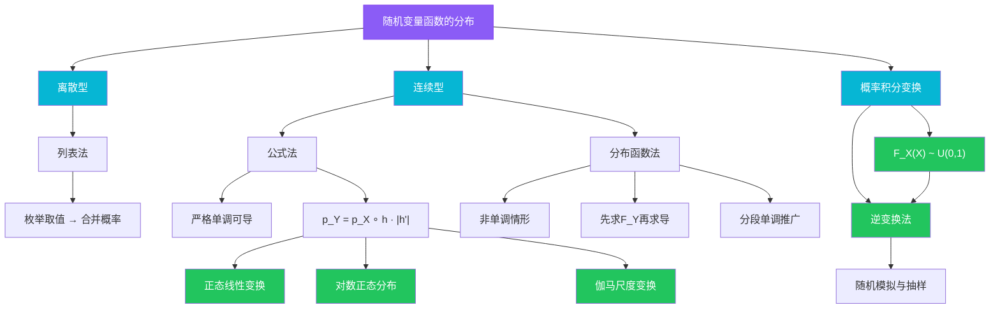

# 2.6 随机变量函数的分布

> [!abstract] 本节概览
> 本节讨论一个核心问题：已知随机变量 $X$ 的分布，如何求 $Y = g(X)$ 的分布？这是概率论中极具实用价值的技术，在统计模拟、假设检验、数据变换等场景中广泛应用。
>
> **逻辑链条**：离散型列表法（直接枚举）→ 连续型公式法（严格单调可导）→ 重要结论（正态变换、对数正态、伽马变换）→ 概率积分变换（连接所有连续分布与均匀分布）→ 非单调情形与分布函数法（通用方法）→ 方法总结与对比
>
> **前置依赖**：[[2.1 随机变量及其分布|§2.1]]（分布函数、密度函数）、[[2.5 常用连续分布|§2.5]]（正态分布、指数分布、伽马分布）
>
> **核心主线**：求 $Y = g(X)$ 的分布有两种基本方法——==公式法==（适用于 $g$ 严格单调可导）和==分布函数法==（适用于一切情形）。概率积分变换 $F_X(X) \sim U(0,1)$ 是连接所有连续分布的桥梁，也是随机模拟的理论基础。

---

## 一、离散型随机变量函数的分布

当 $X$ 是离散型随机变量时，求 $Y = g(X)$ 的分布列使用==列表法==，思路非常直接：逐一列出 $X$ 的每个取值对应的 $Y$ 值，合并相同的 $Y$ 值并累加概率。

### 列表法的基本步骤

1. 列出 $X$ 的所有可能取值 $x_1, x_2, \ldots$ 及其概率 $P(X=x_i)$；
2. 计算 $y_i = g(x_i)$，得到 $Y$ 的所有可能取值；
3. 合并相同的 $y$ 值，将对应概率相加；
4. 写出 $Y$ 的分布列。

> [!example] 例 2.6.1 — 离散型列表法
> 设 $X$ 的分布列为
>
> | $x$ | $-2$ | $-1$ | $0$ | $1$ | $2$ |
> |:---:|:---:|:---:|:---:|:---:|:---:|
> | $P$ | $0.1$ | $0.2$ | $0.3$ | $0.2$ | $0.2$ |
>
> 求 $Y = X^2 + X$ 的分布列。
>
> **解**：逐一计算 $y_i = x_i^2 + x_i$：
>
> | $x$ | $-2$ | $-1$ | $0$ | $1$ | $2$ |
> |:---:|:---:|:---:|:---:|:---:|:---:|
> | $y = x^2+x$ | $2$ | $0$ | $0$ | $2$ | $6$ |
> | $P$ | $0.1$ | $0.2$ | $0.3$ | $0.2$ | $0.2$ |
>
> 合并相同 $y$ 值：
> - $y = 0$：$P = 0.2 + 0.3 = 0.5$
> - $y = 2$：$P = 0.1 + 0.2 = 0.3$
> - $y = 6$：$P = 0.2$
>
> 因此 $Y$ 的分布列为
>
> | $y$ | $0$ | $2$ | $6$ |
> |:---:|:---:|:---:|:---:|
> | $P$ | $0.5$ | $0.3$ | $0.2$ |

**列表法的关键注意事项**：
- 当 $g$ 不是一一映射时，不同的 $x$ 可能映射到相同的 $y$，此时需要==合并概率==；
- 需要检查 $Y$ 的取值是否有遗漏或重复；
- 离散型情形不存在"单调性"的要求，列表法始终适用。

**列表法与连续型的本质区别**：离散型随机变量的函数分布问题本质上是"映射 + 合并"的组合操作。由于离散型随机变量只取有限或可列个值，我们完全可以枚举所有情况。而连续型随机变量的取值不可枚举，必须借助分析工具（公式法或分布函数法）来处理。

**验证概率守恒**：在例 2.6.1 中，合并后的概率之和为 $0.5 + 0.3 + 0.2 = 1.0$，验证了概率守恒。这是检查答案正确性的基本方法——$Y$ 的分布列中所有概率之和必须等于 1。

---

## 二、连续型随机变量函数的分布（公式法）

当 $X$ 是连续型随机变量且 $Y = g(X)$ 时，如果 $g$ 是==严格单调可导==函数，则可以直接使用公式法求 $Y$ 的密度函数。

### 定理 2.6.1 — 公式法（变量代换公式）

> [!thm] 定理 2.6.1 — 随机变量函数的密度（严格单调情形）
> 设 $X$ 是连续型随机变量，其密度函数为 $p_X(x)$。若 $y = g(x)$ 在 $X$ 的取值范围内==严格单调可导==，且其反函数为 $x = h(y)$，则 $Y = g(X)$ 的密度函数为
> $$\boxed{p_Y(y) = p_X(h(y)) \cdot |h'(y)|}$$

> [!abstract]
> **证明**：
> **[反函数代换与雅可比因子]**
>
> 不妨设 $g$ 严格单调递增（递减情形类似）。
>
> **第一步：从分布函数出发**
>
> $$F_Y(y) = P(Y \leq y) = P(g(X) \leq y) = P(X \leq h(y)) = F_X(h(y))$$
>
> 其中 $h$ 是 $g$ 的反函数，且由于 $g$ 严格单调递增，不等号方向不变。
>
> **第二步：对 $y$ 求导得密度函数**
>
> $$p_Y(y) = \frac{d}{dy} F_Y(y) = \frac{d}{dy} F_X(h(y)) = p_X(h(y)) \cdot h'(y)$$
>
> 最后一步使用了==链式法则==：$\dfrac{d}{dy} F_X(h(y)) = F_X'(h(y)) \cdot h'(y) = p_X(h(y)) \cdot h'(y)$。
>
> **第三步：处理单调递减情形**
>
> 若 $g$ 严格单调递减，则
>
> $$F_Y(y) = P(g(X) \leq y) = P(X \geq h(y)) = 1 - F_X(h(y))$$
>
> 求导得 $p_Y(y) = -p_X(h(y)) \cdot h'(y) = p_X(h(y)) \cdot |h'(y)|$（因为递减时 $h'(y) < 0$）。
>
> **综合两种情形**，统一写为
>
> $$p_Y(y) = p_X(h(y)) \cdot |h'(y)|$$
>
> 其中 $|h'(y)|$ 就是变量代换中的==雅可比因子==，它保证了概率的守恒。 $\blacksquare$

### 公式法的使用要点

使用公式法时需要注意以下几点：

1. **单调性检查**：必须先验证 $g$ 在 $X$ 的取值范围内严格单调；
2. **反函数存在性**：严格单调保证反函数 $h$ 存在且可导；
3. **$Y$ 的取值范围**：需要根据 $X$ 的取值范围和 $g$ 的映射关系确定 $Y$ 的支撑集；
4. **$|h'(y)|$ 因子**：绝对值确保密度函数非负，本质是变量代换的雅可比行列式。

### 雅可比因子的直观理解

公式法的核心是==雅可比因子== $|h'(y)|$。为了理解它为什么存在，考虑一个简单的例子：

设 $X \sim U(0, 1)$，$Y = 2X$。那么 $Y \sim U(0, 2)$。

- $X$ 的密度：$p_X(x) = 1$，$x \in (0,1)$
- $Y$ 的密度：$p_Y(y) = 1/2$，$y \in (0,2)$

为什么 $p_Y = 1/2$ 而不是 $1$？因为变换 $y = 2x$ 将 $(0,1)$ 区间"拉伸"了两倍变成 $(0,2)$。同样的概率质量被分散到了两倍长的区间上，所以密度减半。雅可比因子 $|h'(y)| = |1/2| = 1/2$ 正好反映了这个"拉伸"效应。

**一般规律**：
- 当 $|g'(x)| > 1$ 时，变换"拉伸"区间，密度函数变矮（$|h'(y)| < 1$）；
- 当 $|g'(x)| < 1$ 时，变换"压缩"区间，密度函数变高（$|h'(y)| > 1$）；
- 当 $|g'(x)| = 1$ 时，区间长度不变，密度函数不变（$|h'(y)| = 1$）。

这与微积分中积分换元的几何直觉完全一致。

**直观理解**：公式法的本质是==变量代换==。就像积分换元 $x = h(y)$ 时需要乘以 $|h'(y)|$ 来补偿"拉伸"或"压缩"效应一样，密度函数在变量代换时也需要乘以这个因子来保证概率守恒。

> [!example] 例 2.6.2 — 正态线性变换
> 设 $X \sim N(10, 4)$，求 $Y = 3X + 5$ 的分布。
>
> **解**：这里 $g(x) = 3x + 5$，严格单调递增，反函数 $h(y) = \dfrac{y - 5}{3}$，$h'(y) = \dfrac{1}{3}$。
>
> $X$ 的密度函数为
> $$p_X(x) = \frac{1}{2\sqrt{2\pi}} \exp\left\{-\frac{(x-10)^2}{8}\right\}$$
>
> 由公式法：
> $$p_Y(y) = p_X\!\left(\frac{y-5}{3}\right) \cdot \frac{1}{3} = \frac{1}{3} \cdot \frac{1}{2\sqrt{2\pi}} \exp\left\{-\frac{\left(\frac{y-5}{3}-10\right)^2}{8}\right\}$$
>
> 化简指数部分：
> $$\frac{y-5}{3} - 10 = \frac{y-5-30}{3} = \frac{y-35}{3}$$
> $$\frac{\left(\frac{y-35}{3}\right)^2}{8} = \frac{(y-35)^2}{9 \cdot 8} = \frac{(y-35)^2}{72}$$
>
> 因此
> $$p_Y(y) = \frac{1}{6\sqrt{2\pi}} \exp\left\{-\frac{(y-35)^2}{72}\right\}$$
>
> 即 $Y \sim N(35, 36)$，验证了 $aX + b \sim N(a\mu + b,\, a^2\sigma^2)$。

---

## 三、重要结论

本节给出三个重要的分布变换结论，它们是公式法的直接应用，在理论和实践中都有广泛用途。

### 定理 2.6.2 — 正态分布的线性变换

> [!thm] 定理 2.6.2 — 正态线性变换
> 若 $X \sim N(\mu, \sigma^2)$，则对任意常数 $a \neq 0$ 和 $b$，
> $$aX + b \sim N(a\mu + b,\; a^2\sigma^2)$$
> 特别地，==标准化变换== $\dfrac{X - \mu}{\sigma} \sim N(0,1)$。

> [!abstract]
> **证明**：
> **[标准化与线性性]**
>
> 令 $Z = \dfrac{X - \mu}{\sigma}$，则由公式法（或直接标准化）知 $Z \sim N(0,1)$。
>
> 于是 $aX + b = a(\sigma Z + \mu) + b = a\sigma Z + (a\mu + b)$。
>
> 由于 $Z \sim N(0,1)$，由正态分布的线性性质（或再次应用公式法）：
> $$a\sigma Z + (a\mu + b) \sim N(a\mu + b,\; a^2\sigma^2)$$
>
> 因此 $aX + b \sim N(a\mu + b,\; a^2\sigma^2)$。 $\blacksquare$

**意义**：正态分布在线性变换下保持正态性，这是正态分布的标志性性质之一。它说明正态分布的"家族"在线性变换下是封闭的。

**推论**：若 $X \sim N(\mu, \sigma^2)$，则
- $\dfrac{X - \mu}{\sigma} \sim N(0,1)$（标准化）
- $-X \sim N(-\mu, \sigma^2)$（关于原点对称翻转）
- $X + c \sim N(\mu + c, \sigma^2)$（平移不改变形状）

### 定理 2.6.3 — 对数正态分布

> [!thm] 定理 2.6.3 — 对数正态分布
> 若 $X \sim N(\mu, \sigma^2)$，则 $Y = e^X$ 服从参数为 $(\mu, \sigma^2)$ 的==对数正态分布==，记为 $Y \sim LN(\mu, \sigma^2)$，其密度函数为
> $$\boxed{p_Y(y) = \frac{1}{y\sigma\sqrt{2\pi}} \exp\left\{-\frac{(\ln y - \mu)^2}{2\sigma^2}\right\}, \quad y > 0}$$
> 其期望和方差分别为
> $$E(Y) = \exp\!\left(\mu + \frac{\sigma^2}{2}\right), \quad \text{Var}(Y) = \exp(2\mu + \sigma^2)\left(\exp(\sigma^2) - 1\right)$$

> [!abstract]
> **证明**：
> **[指数变换与对数代换]**
>
> 令 $g(x) = e^x$，严格单调递增，反函数 $h(y) = \ln y$，$h'(y) = 1/y$。
>
> 由公式法：
> $$p_Y(y) = p_X(\ln y) \cdot \left|\frac{1}{y}\right| = \frac{1}{y\sigma\sqrt{2\pi}} \exp\left\{-\frac{(\ln y - \mu)^2}{2\sigma^2}\right\}, \quad y > 0$$
>
> **期望的推导**：
> $$E(Y) = E(e^X) = \int_{-\infty}^{+\infty} e^x \cdot \frac{1}{\sigma\sqrt{2\pi}} \exp\left\{-\frac{(x-\mu)^2}{2\sigma^2}\right\} dx$$
>
> 合并指数：
> $$e^x \cdot \exp\left\{-\frac{(x-\mu)^2}{2\sigma^2}\right\} = \exp\left\{x - \frac{(x-\mu)^2}{2\sigma^2}\right\}$$
>
> 对指数部分配方：
> $$x - \frac{(x-\mu)^2}{2\sigma^2} = -\frac{x^2 - 2\mu x - 2\sigma^2 x + \mu^2}{2\sigma^2} = -\frac{(x - (\mu + \sigma^2))^2}{2\sigma^2} + \mu + \frac{\sigma^2}{2}$$
>
> 因此
> $$E(Y) = \exp\!\left(\mu + \frac{\sigma^2}{2}\right) \int_{-\infty}^{+\infty} \frac{1}{\sigma\sqrt{2\pi}} \exp\left\{-\frac{(x-(\mu+\sigma^2))^2}{2\sigma^2}\right\} dx = \exp\!\left(\mu + \frac{\sigma^2}{2}\right)$$
>
> 方差的推导类似，利用 $E(Y^2) = E(e^{2X}) = \exp(2\mu + 2\sigma^2)$，再由 $\text{Var}(Y) = E(Y^2) - [E(Y)]^2$ 可得。 $\blacksquare$

**应用场景**：对数正态分布广泛用于描述股票价格、收入分布、保险索赔额等"正偏"数据。其特点是取值恒正、右偏分布，且取对数后服从正态分布。

**对数正态分布与正态分布的关系总结**：

| 性质 | 正态分布 $N(\mu, \sigma^2)$ | 对数正态分布 $LN(\mu, \sigma^2)$ |
|:---|:---|:---|
| 取值范围 | $(-\infty, +\infty)$ | $(0, +\infty)$ |
| 对称性 | 关于 $\mu$ 对称 | 右偏（正偏） |
| 与正态的关系 | 本身 | 取对数后为正态 |
| 期望 | $\mu$ | $\exp(\mu + \sigma^2/2) > \exp(\mu)$ |
| 方差 | $\sigma^2$ | $(\exp(\sigma^2)-1)\exp(2\mu+\sigma^2)$ |
| 众数 | $\mu$ | $\exp(\mu - \sigma^2)$ |

注意：对数正态分布的期望 $\exp(\mu + \sigma^2/2)$ 大于 $\exp(\mu)$（几何均值），这是右偏分布的典型特征——均值被右侧长尾拉高。

### 定理 2.6.4 — 伽马分布的尺度变换

> [!thm] 定理 2.6.4 — 伽马尺度变换
> 若 $X \sim Ga(\alpha, \lambda)$，则对任意常数 $k > 0$，
> $$kX \sim Ga\!\left(\alpha,\; \frac{\lambda}{k}\right)$$

> [!abstract]
> **证明**：
> **[尺度参数代换]**
>
> $X$ 的密度函数为
> $$p_X(x) = \frac{\lambda^\alpha}{\Gamma(\alpha)} x^{\alpha-1} e^{-\lambda x}, \quad x > 0$$
>
> 令 $g(x) = kx$（$k > 0$），严格单调递增，反函数 $h(y) = y/k$，$h'(y) = 1/k$。
>
> 由公式法：
> $$p_Y(y) = p_X\!\left(\frac{y}{k}\right) \cdot \frac{1}{k} = \frac{1}{k} \cdot \frac{\lambda^\alpha}{\Gamma(\alpha)} \left(\frac{y}{k}\right)^{\alpha-1} e^{-\lambda y/k}$$
>
> $$= \frac{\lambda^\alpha}{\Gamma(\alpha)} \cdot \frac{y^{\alpha-1}}{k^{\alpha-1} \cdot k} \cdot e^{-(\lambda/k) y} = \frac{(\lambda/k)^\alpha}{\Gamma(\alpha)} y^{\alpha-1} e^{-(\lambda/k) y}, \quad y > 0$$
>
> 这正是 $Ga(\alpha, \lambda/k)$ 的密度函数。 $\blacksquare$

**意义**：尺度变换只改变伽马分布的速率参数 $\lambda$，不改变形状参数 $\alpha$。特别地，当 $\alpha = 1$ 时，$X \sim Exp(\lambda)$，则 $kX \sim Exp(\lambda/k)$。

**伽马尺度变换的直观理解**：如果 $X$ 表示等待 $\alpha$ 个事件发生的时间（事件发生率 $\lambda$），那么 $kX$ 就是在时间尺度放大 $k$ 倍后的等待时间。时间尺度放大等价于事件发生率缩小为 $\lambda/k$，因此 $kX \sim Ga(\alpha, \lambda/k)$。

**与卡方分布的关系**：当 $\alpha = n/2$，$\lambda = 1/2$ 时，$Ga(n/2, 1/2)$ 就是自由度为 $n$ 的卡方分布 $\chi^2(n)$。由伽马尺度变换，$2X \sim Ga(n/2, 1/4)$，这不是卡方分布。但若 $X \sim \chi^2(n)$，则 $cX$（$c > 0$）服从尺度化的卡方分布，这一性质在统计推断中经常用到。

---

## 四、概率积分变换

==概率积分变换==（Probability Integral Transform）是概率论中一个优美而深刻的结果，它建立了所有连续分布与均匀分布之间的桥梁。

### 定理 2.6.5 — 概率积分变换

> [!thm] 定理 2.6.5 — 概率积分变换
> 设 $X$ 是连续型随机变量，其分布函数为 $F_X(x)$，则
> $$Y = F_X(X) \sim U(0,1)$$
> 即 $Y$ 服从 $(0,1)$ 上的==标准均匀分布==。

> [!abstract]
> **证明**：
> **[分布函数法与均匀性]**
>
> 设 $Y = F_X(X)$，我们需要证明对任意 $y \in (0,1)$，$F_Y(y) = y$。
>
> **第一步：写出 $Y$ 的分布函数**
>
> $$F_Y(y) = P(Y \leq y) = P(F_X(X) \leq y)$$
>
> **第二步：利用 $F_X$ 的单调性反解**
>
> 由于 $F_X$ 是单调不减函数（分布函数的基本性质），且 $F_X$ 连续（$X$ 为连续型），故 $F_X$ 存在反函数 $F_X^{-1}$（推广意义下的广义反函数）。
>
> $$P(F_X(X) \leq y) = P(X \leq F_X^{-1}(y)) = F_X(F_X^{-1}(y)) = y$$
>
> **第三步：验证边界**
>
> - 当 $y \leq 0$ 时，$F_Y(y) = 0$（因为 $F_X(X) \in (0,1)$）；
> - 当 $y \geq 1$ 时，$F_Y(y) = 1$。
>
> 因此 $F_Y(y) = y \cdot \mathbf{1}_{(0,1)}(y)$，这正是 $U(0,1)$ 的分布函数。
>
> 求导得 $p_Y(y) = 1 \cdot \mathbf{1}_{(0,1)}(y)$。 $\blacksquare$

### 逆变换法（Inverse Transform Method）

概率积分变换的直接应用是==逆变换法==，它是随机模拟中最基本的抽样方法。

**逆变换法的步骤**：

1. 生成 $U \sim U(0,1)$；
2. 令 $X = F_X^{-1}(U)$，则 $X$ 的分布函数恰好为 $F_X$。

**正确性验证**：

$$P(X \leq x) = P(F_X^{-1}(U) \leq x) = P(U \leq F_X(x)) = F_X(x)$$

最后一步利用了 $U \sim U(0,1)$ 的性质：$P(U \leq u) = u$（当 $u \in [0,1]$）。

**直观理解**：分布函数 $F_X(x)$ 给出了随机变量落在 $(-\infty, x]$ 的概率。如果我们"按概率比例"在 $y$ 轴上均匀取点，然后通过 $F_X^{-1}$ 映射回 $x$ 轴，那么落在每个区间的比例恰好等于该区间的概率——这正是分布 $F_X$ 所要求的。

**应用举例**：
- 指数分布：$F(x) = 1 - e^{-\lambda x}$，反函数 $F^{-1}(u) = -\dfrac{\ln(1-u)}{\lambda}$；
- 均匀分布 $U(a,b)$：$F^{-1}(u) = a + (b-a)u$；
- 韦布尔分布：$F(x) = 1 - e^{-(x/\eta)^m}$，反函数 $F^{-1}(u) = \eta(-\ln(1-u))^{1/m}$。

### 概率积分变换的深入理解

概率积分变换之所以成立，关键在于分布函数 $F_X$ 的三个核心性质：

1. **单调不减**：保证了 $F_X(X) \leq y$ 等价于 $X \leq F_X^{-1}(y)$；
2. **连续性**：$X$ 为连续型保证了 $F_X$ 连续，从而 $F_X(X)$ 不会取到 $0$ 和 $1$（概率为零的事件）；
3. **值域为 $(0,1)$**：保证了 $Y = F_X(X)$ 的取值范围恰好是 $(0,1)$。

**为什么要求 $X$ 是连续型？** 如果 $X$ 是离散型，$F_X$ 是阶梯函数，$F_X(X)$ 的分布就不是均匀分布。例如，若 $X \sim B(1, 0.5)$（伯努利分布），则 $F_X(X)$ 以概率 $0.5$ 取 $0.5$，以概率 $0.5$ 取 $1$，显然不是均匀分布。

**概率积分变换与随机模拟**：在蒙特卡洛模拟中，计算机只能直接生成均匀分布 $U(0,1)$ 的随机数。通过逆变换法，我们可以从均匀分布"变换"出任意连续分布的随机数。这是所有随机模拟算法的基础。

**推广**：概率积分变换可以推广到多维情形。若 $(X_1, X_2, \ldots, X_n)$ 是连续型随机向量，则通过 Rosenblatt 变换可以将它们变换为 $n$ 个独立的 $U(0,1)$ 随机变量。这在==Copula理论==和多元统计模拟中有重要应用。

---

## 五、非单调情形与分布函数法

当 $g$ 不是严格单调函数时，公式法不再直接适用。此时需要使用更通用的==分布函数法==（又称 CDF 法）。

### 分布函数法的基本步骤

1. 写出 $Y$ 的分布函数 $F_Y(y) = P(Y \leq y) = P(g(X) \leq y)$；
2. 利用 $X$ 的分布函数或密度函数，将 $P(g(X) \leq y)$ 化为关于 $X$ 的概率；
3. 对 $y$ 求导，得到 $p_Y(y) = F_Y'(y)$。

### 分段单调推广公式

当 $g$ 在不同区间上分别单调时，可以将公式法推广为==分段单调公式==：

> [!def] 定义 2.6.1 — 分段单调推广公式
> 设 $y = g(x)$ 将 $X$ 的取值范围分为 $n$ 个区间 $I_1, I_2, \ldots, I_n$，在每个 $I_k$ 上 $g$ 严格单调可导，反函数为 $h_k(y)$，则
> $$\boxed{p_Y(y) = \sum_{k=1}^{n} p_X(h_k(y)) \cdot |h_k'(y)|}$$

这个公式可以理解为：在每个单调区间上分别应用公式法，然后将结果相加。

> [!example] 例 2.6.3 — 卡方分布的推导（$Y = X^2$，$X \sim N(0,1)$）
> 设 $X \sim N(0,1)$，求 $Y = X^2$ 的密度函数。
>
> **解**：$g(x) = x^2$ 不是单调函数，使用分布函数法。
>
> **第一步：求 $F_Y(y)$**
>
> 当 $y > 0$ 时：
> $$F_Y(y) = P(X^2 \leq y) = P(-\sqrt{y} \leq X \leq \sqrt{y}) = F_X(\sqrt{y}) - F_X(-\sqrt{y})$$
>
> 当 $y \leq 0$ 时，$F_Y(y) = 0$。
>
> **第二步：求导得 $p_Y(y)$**
>
> $$p_Y(y) = \frac{d}{dy}\left[F_X(\sqrt{y}) - F_X(-\sqrt{y})\right] = p_X(\sqrt{y}) \cdot \frac{1}{2\sqrt{y}} - p_X(-\sqrt{y}) \cdot \left(-\frac{1}{2\sqrt{y}}\right)$$
>
> $$= \frac{p_X(\sqrt{y}) + p_X(-\sqrt{y})}{2\sqrt{y}}$$
>
> 代入 $p_X(x) = \dfrac{1}{\sqrt{2\pi}} e^{-x^2/2}$：
>
> $$p_Y(y) = \frac{1}{2\sqrt{y}} \cdot \frac{2}{\sqrt{2\pi}} e^{-y/2} = \frac{1}{\sqrt{2\pi y}} e^{-y/2}, \quad y > 0$$
>
> 这正是自由度为 1 的==卡方分布== $\chi^2(1)$ 的密度函数。
>
> **卡方分布的参数形式**：一般地，若 $X \sim N(0,1)$，则 $Y = X^2 \sim \chi^2(1)$。更一般地，若 $X_1, \ldots, X_n$ 独立同分布 $N(0,1)$，则 $\sum_{i=1}^n X_i^2 \sim \chi^2(n)$。卡方分布在假设检验（拟合优度检验、独立性检验）和置信区间估计中有核心地位。
>
> **用分段单调公式验证**：$g(x) = x^2$ 在 $(-\infty, 0)$ 上单调递减，反函数 $h_1(y) = -\sqrt{y}$；在 $(0, +\infty)$ 上单调递增，反函数 $h_2(y) = \sqrt{y}$。
>
> $$p_Y(y) = p_X(-\sqrt{y}) \cdot \left|-\frac{1}{2\sqrt{y}}\right| + p_X(\sqrt{y}) \cdot \frac{1}{2\sqrt{y}} = \frac{p_X(\sqrt{y}) + p_X(-\sqrt{y})}{2\sqrt{y}}$$
>
> 结果一致，验证了分段单调公式的正确性。

> [!example] 例 2.6.4 — $Y = \sin X$ 的密度函数
> 设 $X \sim U(0, 2\pi)$，求 $Y = \sin X$ 的密度函数。
>
> **解**：$g(x) = \sin x$ 在 $[0, 2\pi]$ 上不是单调函数，使用分布函数法。
>
> **第一步：分析 $Y$ 的取值范围**
>
> $Y = \sin X \in [-1, 1]$。
>
> **第二步：求 $F_Y(y)$**
>
> 对 $y \in [-1, 1]$，方程 $\sin x = y$ 在 $[0, 2\pi]$ 上有两个解：
> $$x_1 = \arcsin y, \quad x_2 = \pi - \arcsin y$$
>
> 当 $-1 \leq y \leq 1$ 时：
> $$F_Y(y) = P(\sin X \leq y)$$
>
> 需要找到 $[0, 2\pi]$ 中满足 $\sin x \leq y$ 的 $x$ 的集合。由于 $\sin x$ 在 $[0, \pi]$ 上先增后减，在 $[\pi, 2\pi]$ 上先减后增：
>
> $$F_Y(y) = P(0 \leq X \leq x_1) + P(x_2 \leq X \leq 2\pi) = \frac{x_1}{2\pi} + \frac{2\pi - x_2}{2\pi}$$
>
> $$= \frac{\arcsin y + 2\pi - (\pi - \arcsin y)}{2\pi} = \frac{\pi + 2\arcsin y}{2\pi} = \frac{1}{2} + \frac{\arcsin y}{\pi}$$
>
> **第三步：求导得 $p_Y(y)$**
>
> $$p_Y(y) = \frac{d}{dy}\left(\frac{1}{2} + \frac{\arcsin y}{\pi}\right) = \frac{1}{\pi\sqrt{1-y^2}}, \quad -1 < y < 1$$
>
> **用分段单调公式验证**：$\sin x$ 在 $[0, \pi/2]$ 上递增（反函数 $\arcsin y$），在 $[\pi/2, 3\pi/2]$ 上递减（反函数 $\pi - \arcsin y$），在 $[3\pi/2, 2\pi]$ 上递增（反函数 $2\pi + \arcsin y$）。
>
> $$p_Y(y) = \frac{1}{2\pi}\left|\frac{d}{dy}\arcsin y\right| + \frac{1}{2\pi}\left|\frac{d}{dy}(\pi - \arcsin y)\right| = \frac{2}{\pi\sqrt{1-y^2}} \cdot \frac{1}{2\pi} \cdot 2\pi = \frac{1}{\pi\sqrt{1-y^2}}$$
>
> 两种方法结果一致。

---

## 六、方法总结与对比

### 公式法 vs 分布函数法

| 对比维度 | 公式法 | 分布函数法 |
|:---:|:---:|:---:|
| **适用条件** | $g$ 严格单调可导 | 无限制（通用方法） |
| **基本思路** | 利用反函数和雅可比因子直接写出密度 | 先求分布函数，再求导 |
| **计算复杂度** | 较低（一步到位） | 较高（需要求分布函数再求导） |
| **非单调情形** | 不直接适用（需分段推广） | 直接适用 |
| **结果形式** | 直接得到密度函数 | 先得到分布函数，再导出密度 |
| **典型应用** | 线性变换、指数变换、对数变换 | 平方变换、三角变换等非单调情形 |
| **易错点** | 忘记绝对值 $|h'(y)|$；反函数求错 | 不等式方向判断错误；求导遗漏链式法则 |

### 方法选择流程

1. **$X$ 是离散型** → 使用列表法；
2. **$X$ 是连续型且 $g$ 严格单调可导** → 优先使用公式法（简洁高效）；
3. **$X$ 是连续型且 $g$ 非单调** → 使用分布函数法（或分段单调推广公式）；
4. **需要生成指定分布的随机数** → 使用逆变换法（概率积分变换的逆应用）。

### 常见变换类型与方法选择速查

| 变换类型 | 是否单调 | 推荐方法 | 典型例子 |
|:---|:---:|:---:|:---|
| 线性变换 $aX+b$ | 是 | 公式法 | 正态标准化 |
| 指数变换 $e^X$ | 是 | 公式法 | 对数正态分布 |
| 对数变换 $\ln X$ | 是（$X>0$） | 公式法 | 正态化变换 |
| 幂变换 $X^a$（$a>0$） | 是（$X>0$） | 公式法 | Box-Cox变换 |
| 平方变换 $X^2$（$X \in \mathbb{R}$） | 否 | 分布函数法 | 卡方分布 |
| 绝对值 $|X|$ | 否 | 分布函数法 | 半正态分布 |
| 三角函数 $\sin X$ | 否 | 分布函数法 | 弧度分布 |

### 分布函数法的详细操作指南

分布函数法的核心难点在于第二步：将 $P(g(X) \leq y)$ 转化为关于 $X$ 的概率。以下是常见情形的处理策略：

**情形1：$g$ 严格单调递增**
$$P(g(X) \leq y) = P(X \leq g^{-1}(y)) = F_X(g^{-1}(y))$$

**情形2：$g$ 严格单调递减**
$$P(g(X) \leq y) = P(X \geq g^{-1}(y)) = 1 - F_X(g^{-1}(y))$$

**情形3：$g$ 先增后减（如 $g(x) = x^2$，$x \in \mathbb{R}$）**
$$P(g(X) \leq y) = P(X \in \{x : g(x) \leq y\})$$
需要解不等式 $g(x) \leq y$，找到满足条件的 $x$ 的集合。

**情形4：$g$ 周期性振荡（如 $g(x) = \sin x$）**
需要在一个完整周期内分析 $g(x) \leq y$ 的解集，然后利用周期性推广。

**求导时的注意事项**：
- 使用链式法则时不要遗漏因子；
- 注意积分上下限可能依赖于 $y$（此时需要使用 Leibniz 积分法则）；
- 检查最终密度函数是否非负且积分为 1。

---

## 七、知识结构总览

---

## 八、核心思想与证明技巧

### 变量代换与概率守恒

求随机变量函数分布的核心思想是==概率守恒==：变换前后，对应事件的概率必须相等。公式法中的 $|h'(y)|$ 因子（雅可比因子）正是为了保证这一点。直观地说，当 $g$ 将 $x$ 轴上的区间"拉伸"或"压缩"映射到 $y$ 轴时，密度函数需要相应地"变矮"或"变高"，以保持概率面积不变。

### 分布函数法的普适性

分布函数法之所以是"万能方法"，是因为它直接从概率的定义出发：$F_Y(y) = P(Y \leq y)$。无论 $g$ 的形式如何，这个等式始终成立。关键在于第二步——如何将 $P(g(X) \leq y)$ 用 $X$ 的分布来表示。这一步需要根据 $g$ 的具体形式灵活处理，是不等式求解和集合运算的综合运用。

### 证明技巧

- **链式法则**：在公式法的证明中，$\dfrac{d}{dy}F_X(h(y)) = p_X(h(y)) \cdot h'(y)$ 是核心步骤；
- **绝对值的来源**：单调递减时 $h'(y) < 0$，取绝对值保证密度非负；
- **分段处理**：非单调函数需要分段考虑每个单调区间，然后叠加贡献；
- **配方技巧**：在对数正态分布期望的推导中，指数部分的配方是关键代数技巧。

### 与微积分中变量代换的类比

概率论中求随机变量函数的分布，与微积分中的变量代换（换元积分法）有深刻的类比关系：

| 微积分 | 概率论 |
|:---|:---|
| $\displaystyle\int_a^b f(x)\,dx = \int_{g(a)}^{g(b)} f(h(y))|h'(y)|\,dy$ | $p_Y(y) = p_X(h(y))|h'(y)|$ |
| $dx = h'(y)\,dy$（微分代换） | $|h'(y)|$（雅可比因子） |
| 积分值不变（积分守恒） | 概率值不变（概率守恒） |
| 换元后积分区间改变 | 变换后支撑集改变 |

这个类比帮助我们理解：公式法本质上就是密度函数层面的"换元"。密度函数不是一个普通的函数，它必须满足归一化条件（积分为 1），因此变量代换时必须乘以雅可比因子来"补偿"区间长度的变化。

### 分布函数法的理论地位

分布函数法虽然计算上可能比公式法繁琐，但它在理论上具有特殊地位：

1. **普适性**：不依赖 $g$ 的任何特殊性质（单调性、可导性等），适用于所有情形；
2. **理论价值**：许多重要分布（如卡方分布、$t$ 分布、$F$ 分布）的推导都依赖分布函数法；
3. **教学价值**：分布函数法直接体现了"概率 = 分布函数"这一基本关系，有助于建立正确的概率直觉。

在实际应用中，建议的策略是：**先判断能否用公式法，能用就用（简洁）；不能用则毫不犹豫地使用分布函数法（通用）**。

---

## 九、补充理解与易混淆点

### 误区一：公式法适用于所有函数

**来源**：教材定理2.6.1条件 + Ross《概率论》第五章 + MIT OCW 18.05 + 考研真题非单调误用公式 + 跨考考研复习指南

> [!danger]
> **误区**：认为只要 $g$ 可导，就可以直接套用公式 $p_Y(y) = p_X(h(y))|h'(y)|$。
>
> **❌ 错误原因**：公式法要求 $g$ ==严格单调==可导。如果 $g$ 不是严格单调的（如 $g(x) = x^2$），则 $g$ 的反函数 $h$ 不存在（或不是单值的），公式法不能直接使用。
>
> **✅ 正确理解**：公式法仅适用于严格单调可导函数。对于非单调函数，应使用分布函数法或分段单调推广公式。

### 误区二：分布函数法比公式法更高级

**来源**：教材§2.6方法选择 + Casella & Berger《统计推断》+ 陈希孺《概率论》+ 网课讲解中方法对比不足 + 考研复习常见方法混淆

> [!danger]
> **误区**：认为分布函数法是"更高级"的方法，应该优先使用。
>
> **❌ 错误原因**：两种方法各有适用场景。公式法在严格单调情形下更简洁高效，一步到位得到密度函数；分布函数法虽然通用，但计算步骤更多，容易出错。
>
> **✅ 正确理解**：严格单调情形优先用公式法，非单调情形才用分布函数法。选择方法的标准是适用性和简洁性，而非"高级程度"。

### 误区三：概率积分变换只适用于均匀分布

**来源**：教材定理2.6.5 + Ross《概率模型》+ MIT OCW 6.041 + Wikipedia概率积分变换词条 + 随机数生成教材

> [!danger]
> **误区**：认为概率积分变换只是均匀分布的一个特殊性质。
>
> **❌ 错误原因**：概率积分变换的深刻意义在于它建立了==所有连续分布与均匀分布之间的桥梁==。任何连续分布都可以通过 $F_X(X)$ 变换为均匀分布，反过来也可以通过逆变换从均匀分布生成任意连续分布。
>
> **✅ 正确理解**：概率积分变换是连接所有连续分布的"万能接口"，是随机模拟（蒙特卡洛方法）的理论基石。

### 误区四：$Y = X^2$ 的密度函数可以直接套公式

**来源**：教材§2.6分段单调 + 卡方核心笔记分段处理策略 + 考研真题Y=X²常见错误 + Stack Exchange + 跨考考研复习指南

> [!danger]
> **误区**：认为 $Y = X^2$ 可以直接使用公式法 $p_Y(y) = p_X(\sqrt{y}) \cdot \dfrac{1}{2\sqrt{y}}$。
>
> **❌ 错误原因**：$g(x) = x^2$ 在 $\mathbb{R}$ 上不是单调函数（在 $(-\infty, 0)$ 递减，在 $(0, +\infty)$ 递增）。如果只考虑 $\sqrt{y}$ 这一支，会遗漏 $-\sqrt{y}$ 的贡献，导致密度函数少了一半。
>
> **✅ 正确理解**：$Y = X^2$ 需要使用分布函数法或分段单调推广公式，正确结果为 $p_Y(y) = \dfrac{p_X(\sqrt{y}) + p_X(-\sqrt{y})}{2\sqrt{y}}$。只有当 $X$ 的取值范围为 $(0, +\infty)$ 时，$x^2$ 才是严格单调的，才能直接套用公式。

### 误区五：忘记考虑 $Y$ 的取值范围

**来源**：教材习题常见错误 + Ross《概率论》变换后支撑集讨论 + MIT OCW 18.05 + 考研真题漏掉支撑集 + 跨考考研复习指南

> [!danger]
> **误区**：求出 $p_Y(y)$ 的表达式后，忘记标注 $y$ 的取值范围（支撑集）。
>
> **❌ 错误原因**：密度函数的定义域是变换结果的一部分。例如 $Y = e^X$ 的取值范围是 $(0, +\infty)$ 而非 $(-\infty, +\infty)$；$Y = X^2$ 的取值范围是 $[0, +\infty)$。忽略支撑集会导致密度函数不完整甚至错误。
>
> **✅ 正确理解**：求 $Y = g(X)$ 的密度函数时，必须同步确定 $Y$ 的取值范围。可以先分析 $g$ 的值域，也可以在分布函数法中自然得到（$F_Y(y) = 0$ 或 $1$ 的区间就是支撑集之外）。

---

## 十、习题精选

> [!todo] 习题概览
>
> | 编号 | 题目来源 | 核心考点 | 难度 | 方法 |
> |:---:|:---|:---|:---:|:---:|
> | 1 | 教材2.6-1 | 离散型函数的分布列 | ★★☆ | 列表法 |
> | 2 | 教材2.6-4 | 均匀分布线性变换 | ★★☆ | 公式法 |
> | 3 | 教材2.6-8 | 均匀分布平方变换 | ★★★☆ | 分布函数法 |
> | 4 | 教材2.6-12 | 正态分布平方变换 | ★★★☆ | 分布函数法 |
> | 5 | 教材2.6-16 | 指数分布与均匀分布 | ★★★☆ | 公式法/概率积分变换 |
> | 6 | 教材2.6-18 | 对数正态分布概率计算 | ★★★☆ | 公式法应用 |
> | 7 | 2016山东大学432 | 柯西分布线性变换 | ★★★☆ | 公式法 |
> | 8 | 2015山东大学432 | 平方变换一般推导 | ★★★★ | 分布函数法 |
> | 9 | 2017兰州大学432 | 正态→对数正态 | ★★★☆ | 公式法 |
> | 10 | 2022上海财经大学432 | 逆变换法求函数 | ★★★★ | 概率积分变换 |

---

> [!problem] 习题 1 — 教材2.6-1：离散型 $Y = X^2$ 与 $Z = |X|$ 的分布列
>
> 设 $X$ 的分布列为
>
> | $x$ | $-2$ | $-1$ | $0$ | $1$ | $2$ |
> |:---:|:---:|:---:|:---:|:---:|:---:|
> | $P$ | $0.1$ | $0.2$ | $0.3$ | $0.2$ | $0.2$ |
>
> 分别求 $Y = X^2$ 和 $Z = |X|$ 的分布列。

> [!faq]- 查看解答
> **$Y = X^2$ 的分布列**：
>
> | $x$ | $-2$ | $-1$ | $0$ | $1$ | $2$ |
> |:---:|:---:|:---:|:---:|:---:|:---:|
> | $y = x^2$ | $4$ | $1$ | $0$ | $1$ | $4$ |
> | $P$ | $0.1$ | $0.2$ | $0.3$ | $0.2$ | $0.2$ |
>
> 合并：$P(Y=0) = 0.3$，$P(Y=1) = 0.4$，$P(Y=4) = 0.3$。
>
> | $y$ | $0$ | $1$ | $4$ |
> |:---:|:---:|:---:|:---:|
> | $P$ | $0.3$ | $0.4$ | $0.3$ |
>
> **$Z = |X|$ 的分布列**：
>
> | $x$ | $-2$ | $-1$ | $0$ | $1$ | $2$ |
> |:---:|:---:|:---:|:---:|:---:|:---:|
> | $z = |x|$ | $2$ | $1$ | $0$ | $1$ | $2$ |
> | $P$ | $0.1$ | $0.2$ | $0.3$ | $0.2$ | $0.2$ |
>
> 合并：$P(Z=0) = 0.3$，$P(Z=1) = 0.4$，$P(Z=2) = 0.3$。
>
> | $z$ | $0$ | $1$ | $2$ |
> |:---:|:---:|:---:|:---:|
> | $P$ | $0.3$ | $0.4$ | $0.3$ |

---

> [!problem] 习题 2 — 教材2.6-4：均匀分布的线性变换
>
> 设 $X \sim U(0,1)$，求 $Y = 1 - X$ 的分布。

> [!faq]- 查看解答
> $g(x) = 1 - x$，严格单调递减，反函数 $h(y) = 1 - y$，$h'(y) = -1$。
>
> $p_X(x) = 1$，$x \in (0,1)$。
>
> $$p_Y(y) = p_X(1-y) \cdot |-1| = 1, \quad y \in (0,1)$$
>
> 因此 $Y = 1 - X \sim U(0,1)$。
>
> **结论**：均匀分布关于 $1/2$ 对称，$1 - X$ 与 $X$ 同分布。更一般地，若 $X \sim U(a,b)$，则 $a + b - X \sim U(a,b)$。

---

> [!problem] 习题 3 — 教材2.6-8：均匀分布的平方变换
>
> 设 $X \sim U(0,2)$，求 $Y = X^2$ 的密度函数。

> [!faq]- 查看解答
> $X \sim U(0,2)$，$p_X(x) = 1/2$，$x \in (0,2)$。
>
> $g(x) = x^2$ 在 $(0,2)$ 上严格单调递增，反函数 $h(y) = \sqrt{y}$，$h'(y) = \dfrac{1}{2\sqrt{y}}$。
>
> $Y$ 的取值范围：$y \in (0, 4)$。
>
> $$p_Y(y) = p_X(\sqrt{y}) \cdot \frac{1}{2\sqrt{y}} = \frac{1}{2} \cdot \frac{1}{2\sqrt{y}} = \frac{1}{4\sqrt{y}}, \quad 0 < y < 4$$
>
> **验证**：$\displaystyle\int_0^4 \frac{1}{4\sqrt{y}}\,dy = \frac{1}{4} \cdot 2\sqrt{y}\Big|_0^4 = \frac{1}{4} \cdot 4 = 1$。 ✓

---

> [!problem] 习题 4 — 教材2.6-12：正态分布的平方变换
>
> 设 $X \sim N(0, \sigma^2)$，求 $Y = X^2$ 的分布。

> [!faq]- 查看解答
> $p_X(x) = \dfrac{1}{\sigma\sqrt{2\pi}} \exp\left\{-\dfrac{x^2}{2\sigma^2}\right\}$。
>
> $g(x) = x^2$ 非单调，使用分布函数法。
>
> 当 $y > 0$ 时：
> $$F_Y(y) = P(X^2 \leq y) = P(-\sqrt{y} \leq X \leq \sqrt{y}) = F_X(\sqrt{y}) - F_X(-\sqrt{y})$$
>
> $$p_Y(y) = \frac{p_X(\sqrt{y}) + p_X(-\sqrt{y})}{2\sqrt{y}} = \frac{2}{2\sqrt{y}} \cdot \frac{1}{\sigma\sqrt{2\pi}} \exp\left\{-\frac{y}{2\sigma^2}\right\}$$
>
> $$= \frac{1}{\sigma\sqrt{2\pi y}} \exp\left\{-\frac{y}{2\sigma^2}\right\}, \quad y > 0$$
>
> 令 $Z = Y/\sigma^2$，则 $Z$ 的密度函数为
> $$p_Z(z) = \frac{1}{\sqrt{2\pi z}} e^{-z/2}, \quad z > 0$$
>
> 这正是 $\chi^2(1)$ 分布。因此 $Y = X^2 \sim \sigma^2 \cdot \chi^2(1)$，即 $Y/\sigma^2 \sim \chi^2(1)$。

---

> [!problem] 习题 5 — 教材2.6-16：指数分布与概率积分变换
>
> 设 $X \sim Exp(2)$，证明 $Y = 1 - e^{-2X} \sim U(0,1)$。

> [!faq]- 查看解答
> **方法一：概率积分变换**
>
> $X \sim Exp(2)$ 的分布函数为 $F_X(x) = 1 - e^{-2x}$，$x > 0$。
>
> 由概率积分变换定理，$F_X(X) = 1 - e^{-2X} \sim U(0,1)$。直接得证。
>
> **方法二：公式法验证**
>
> $g(x) = 1 - e^{-2x}$，在 $x > 0$ 上严格单调递增。
>
> 反函数：$y = 1 - e^{-2x} \Rightarrow e^{-2x} = 1 - y \Rightarrow x = -\dfrac{\ln(1-y)}{2}$。
>
> $h'(y) = \dfrac{1}{2(1-y)}$。
>
> $$p_Y(y) = p_X\!\left(-\frac{\ln(1-y)}{2}\right) \cdot \frac{1}{2(1-y)} = 2e^{-2 \cdot \left(-\frac{\ln(1-y)}{2}\right)} \cdot \frac{1}{2(1-y)}$$
>
> $$= 2(1-y) \cdot \frac{1}{2(1-y)} = 1, \quad 0 < y < 1$$
>
> 因此 $Y \sim U(0,1)$。 ✓

---

> [!problem] 习题 6 — 教材2.6-18：对数正态分布概率计算
>
> 设 $X \sim N(5, 4)$，$Y = e^X$，求 $P(Y > 200)$。

> [!faq]- 查看解答
> $Y = e^X \sim LN(5, 4)$。
>
> $$P(Y > 200) = P(e^X > 200) = P(X > \ln 200)$$
>
> $\ln 200 \approx 5.298$。
>
> $$P(X > 5.298) = P\left(\frac{X - 5}{2} > \frac{5.298 - 5}{2}\right) = P(Z > 0.149)$$
>
> 其中 $Z \sim N(0,1)$。
>
> $$P(Z > 0.149) = 1 - \Phi(0.149) \approx 1 - 0.5592 = 0.4408$$
>
> 因此 $P(Y > 200) \approx 0.4408$。

---

> [!problem] 习题 7 — 2016山东大学432：柯西分布的线性变换
>
> 设 $X$ 服从标准柯西分布，密度函数为 $f_X(x) = \dfrac{1}{\pi(1+x^2)}$，求 $Y = 3X$ 的密度函数。

> [!faq]- 查看解答
> $g(x) = 3x$ 严格单调递增，反函数 $h(y) = y/3$，$h'(y) = 1/3$。
>
> $$f_Y(y) = f_X\!\left(\frac{y}{3}\right) \cdot \frac{1}{3} = \frac{1}{\pi\left(1 + \frac{y^2}{9}\right)} \cdot \frac{1}{3} = \frac{1}{\pi\left(3 + \frac{y^2}{3}\right)} = \frac{3}{\pi(9 + y^2)}$$
>
> 即 $f_Y(y) = \dfrac{3}{\pi(9+y^2)}$，$y \in \mathbb{R}$。
>
> **验证**：$\displaystyle\int_{-\infty}^{+\infty} \frac{3}{\pi(9+y^2)}\,dy = \frac{3}{\pi} \cdot \frac{1}{3}\arctan\frac{y}{3}\Big|_{-\infty}^{+\infty} = \frac{1}{\pi}\left(\frac{\pi}{2} + \frac{\pi}{2}\right) = 1$。 ✓
>
> **注**：柯西分布的一个重要特征是它的期望和方差都不存在（因为积分 $\int_{-\infty}^{+\infty} \frac{|x|}{1+x^2}\,dx$ 发散）。线性变换 $Y = aX + b$（$a > 0$）将标准柯西分布变为位置参数 $b$、尺度参数 $a$ 的一般柯西分布。

---

> [!problem] 习题 8 — 2015山东大学432：平方变换的一般推导
>
> 设 $X$ 为连续型随机变量，密度函数为 $f_X(x)$，求 $Y = X^2$ 的密度函数。

> [!faq]- 查看解答
> 使用分布函数法。
>
> 当 $y > 0$ 时：
> $$F_Y(y) = P(X^2 \leq y) = P(-\sqrt{y} \leq X \leq \sqrt{y}) = F_X(\sqrt{y}) - F_X(-\sqrt{y})$$
>
> $$f_Y(y) = \frac{d}{dy}F_Y(y) = f_X(\sqrt{y}) \cdot \frac{1}{2\sqrt{y}} + f_X(-\sqrt{y}) \cdot \frac{1}{2\sqrt{y}}$$
>
> $$\boxed{f_Y(y) = \frac{f_X(\sqrt{y}) + f_X(-\sqrt{y})}{2\sqrt{y}}, \quad y > 0}$$
>
> 当 $y \leq 0$ 时，$f_Y(y) = 0$。
>
> **特殊情形**：若 $X$ 的密度关于原点对称（即 $f_X(x) = f_X(-x)$），则
> $$f_Y(y) = \frac{f_X(\sqrt{y})}{\sqrt{y}}, \quad y > 0$$

---

> [!problem] 习题 9 — 2017兰州大学432：正态分布的指数变换
>
> 设 $X \sim N(0,1)$，求 $Y = e^X$ 的密度函数。

> [!faq]- 查看解答
> $g(x) = e^x$ 严格单调递增，反函数 $h(y) = \ln y$，$h'(y) = 1/y$。
>
> $$f_Y(y) = f_X(\ln y) \cdot \frac{1}{y} = \frac{1}{\sqrt{2\pi}} e^{-(\ln y)^2/2} \cdot \frac{1}{y}$$
>
> $$\boxed{f_Y(y) = \frac{1}{y\sqrt{2\pi}} \exp\left\{-\frac{(\ln y)^2}{2}\right\}, \quad y > 0}$$
>
> 这正是 $LN(0, 1)$ 的密度函数。

---

> [!problem] 习题 10 — 2022上海财经大学432：逆变换法求函数
>
> 设 $U \sim U(0,1)$，求函数 $g$ 使得 $Y = g(U) \sim Exp(1/2)$。

> [!faq]- 查看解答
> 这是概率积分变换的逆问题：已知目标分布，求从均匀分布到目标分布的变换。
>
> $Y \sim Exp(1/2)$ 的分布函数为
> $$F_Y(y) = 1 - e^{-y/2}, \quad y > 0$$
>
> 由逆变换法，令 $F_Y(Y) = U$：
> $$1 - e^{-Y/2} = U \Rightarrow e^{-Y/2} = 1 - U \Rightarrow Y = -2\ln(1-U)$$
>
> 因此 $g(u) = -2\ln(1-u)$。
>
> **验证**：$P(g(U) \leq y) = P(-2\ln(1-U) \leq y) = P(\ln(1-U) \geq -y/2) = P(1-U \geq e^{-y/2}) = P(U \leq 1 - e^{-y/2}) = 1 - e^{-y/2} = F_Y(y)$。 ✓
>
> **注**：由于 $1 - U \sim U(0,1)$，$g(u) = -2\ln u$ 也是正确的答案。

---

## 十一、教材原文

---

#学习/概率论与统计/第二章 随机变量及其分布/随机变量函数的分布
