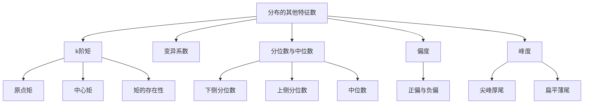

# 2.7 分布的其他特征数

> [!abstract] 本节概览
> 本节在==数学期望==和==方差==的基础上，引入更多描述随机变量分布特征的数字特征：==k阶矩==描述分布的各阶幂次特征，==变异系数==消除量纲影响比较相对波动，==分位数与中位数==刻画分布的位置信息，==偏度==度量分布的偏斜方向与程度，==峰度==度量分布与正态分布相比的尖峭程度和尾部粗细。
>
> **逻辑链条**：k阶矩（原点矩+中心矩）→ 变异系数（无量纲相对波动）→ 分位数与中位数（位置特征）→ 偏度（偏斜方向）→ 峰度（尖峭程度）→ 常见分布特征数汇总
>
> **前置依赖**：[[2.2 数学期望|§2.2]]（数学期望的定义与性质）、[[2.3 方差与标准差|§2.3]]（方差与标准差）、[[2.5 常用连续分布|§2.5]]（正态分布、指数分布、伽马分布、贝塔分布）
>
> **核心主线**：期望和方差分别描述分布的"中心位置"和"离散程度"，但无法刻画分布的==形状特征==。偏度和峰度是描述分布形状的两个重要无量纲指标，它们与正态分布的偏离程度在统计推断中有重要应用。

---

## 一、k阶矩

矩是概率论中最基本的数字特征族，期望和方差都是矩的特例。

### 原点矩与中心矩

> [!def] 定义 2.7.1 — k阶矩
> 设 $X$ 为随机变量，$k$ 为正整数。若 $E(X^k)$ 存在，则称
> $$\mu_k = E(X^k)$$
> 为 $X$ 的==k阶原点矩==。
>
> 若 $E(X - E(X))^k$ 存在，则称
> $$\nu_k = E(X - E(X))^k$$
> 为 $X$ 的==k阶中心矩==。

**特殊情形**：
- $\mu_1 = E(X)$：一阶原点矩就是==数学期望==
- $\nu_2 = E(X - E(X))^2 = \text{Var}(X)$：二阶中心矩就是==方差==
- $\nu_1 = E(X - E(X)) = 0$：一阶中心矩恒为零

### 中心矩与原点矩的关系

利用二项式定理展开中心矩：

$$\nu_k = E(X - \mu_1)^k = \sum_{i=0}^{k}\binom{k}{i}\mu_i(-\mu_1)^{k-i}$$

前四阶中心矩的展开式为：

| 阶数 | 展开公式 |
|:----:|---------|
| $\nu_1$ | $0$ |
| $\nu_2$ | $\mu_2 - \mu_1^2$ |
| $\nu_3$ | $\mu_3 - 3\mu_2\mu_1 + 2\mu_1^3$ |
| $\nu_4$ | $\mu_4 - 4\mu_3\mu_1 + 6\mu_2\mu_1^2 - 3\mu_1^4$ |

> [!thm] 定理 2.7.1 — 矩的存在性
> 若 $X$ 的 $k$ 阶矩存在（即 $E|X|^k < +\infty$），则对任意 $1 \leq j \leq k$，$X$ 的 $j$ 阶矩也存在。

> [!abstract] 证明思路
> **证明 (2.7.1)**：
>
> **[不等式放缩]**：对任意 $1 \leq j < k$，利用 $|X|^j = |X|^j \cdot 1 \leq |X|^j + |X|^k$，更精确地，由 Jensen 不等式或直接利用 $|X|^j \leq 1 + |X|^k$（当 $|X| \geq 1$ 时 $|X|^j \leq |X|^k$，当 $|X| < 1$ 时 $|X|^j < 1$），因此
> $$E|X|^j \leq E(1 + |X|^k) = 1 + E|X|^k < +\infty$$
>
> 故 $j$ 阶矩存在。
>
> $\blacksquare$

**直观理解**：高阶矩存在意味着分布的"尾部"衰减足够快，因此低阶矩自然存在。反之不成立——方差存在不保证三阶矩存在。

### 矩的计算示例

> [!example] 例 2.7.1 — 正态分布的各阶矩
> 设 $X \sim N(0, \sigma^2)$，求其各阶原点矩。
>
> **解**：
>
> **[建立递推]**：由分部积分，
> $$E(X^k) = \int_{-\infty}^{+\infty} x^k \cdot \frac{1}{\sqrt{2\pi}\,\sigma} e^{-x^2/(2\sigma^2)}\,dx$$
>
> 令 $u = x^{k-1}$，$dv = x \cdot \frac{1}{\sqrt{2\pi}\,\sigma} e^{-x^2/(2\sigma^2)}\,dx$，则
> $$E(X^k) = (k-1)\sigma^2 \int_{-\infty}^{+\infty} x^{k-2} \cdot \frac{1}{\sqrt{2\pi}\,\sigma} e^{-x^2/(2\sigma^2)}\,dx = (k-1)\sigma^2 \cdot E(X^{k-2})$$
>
> **[递推求解]**：递推关系为 $E(X^k) = (k-1)\sigma^2 E(X^{k-2})$，其中 $E(X^0) = 1$，$E(X^1) = 0$。
>
> - 当 $k = 2i$ 为偶数时：$E(X^k) = (k-1)(k-3)\cdots 3 \cdot 1 \cdot \sigma^k = (2i-1)!! \cdot \sigma^k$
> - 当 $k = 2i+1$ 为奇数时：$E(X^k) = 0$（奇函数在对称区间上积分为零）
>
> **[具体值]**：
> $$E(X^0) = 1, \quad E(X^2) = \sigma^2, \quad E(X^4) = 3\sigma^4, \quad E(X^6) = 15\sigma^6$$

---

## 二、变异系数

方差衡量绝对波动大小，但不同量纲的随机变量无法直接比较波动程度。

### 变异系数的定义

> [!def] 定义 2.7.2 — 变异系数
> 设随机变量 $X$ 的二阶矩存在且 $E(X) \neq 0$，则称
> $$C_v(X) = \frac{\sqrt{\text{Var}(X)}}{E(X)} = \frac{\sigma(X)}{E(X)}$$
> 为 $X$ 的==变异系数==。

**核心特点**：
- 变异系数是==无量纲==的相对指标，消除量纲影响
- 适用于比较不同量纲或不同量级随机变量的波动程度
- 要求 $E(X) \neq 0$（否则分母为零无意义）

> [!example] 例 2.7.2 — 变异系数的应用
> 用 $X$ 表示某种同龄树的高度（单位：米），$Y$ 表示某年龄段儿童的身高（单位：米）。已知 $E(X) = 10$，$\text{Var}(X) = 1$；$E(Y) = 1$，$\text{Var}(Y) = 0.04$。是否可以从 $\text{Var}(X) = 1 > 0.04 = \text{Var}(Y)$ 就认为 $Y$ 的波动小？
>
> **解**：不能仅凭方差大小判断波动程度，因为两者的量级不同。计算变异系数：
>
> $$C_v(X) = \frac{\sqrt{1}}{10} = 0.1 = 10\%$$
>
> $$C_v(Y) = \frac{\sqrt{0.04}}{1} = 0.2 = 20\%$$
>
> 虽然树的绝对方差更大，但相对于其均值，==儿童身高的相对波动（20%）远大于树的相对波动（10%）==。变异系数揭示了这一被方差掩盖的事实。

---

## 三、分位数与中位数

分位数是比期望更稳健的位置特征，对异常值不敏感。

### 分位数

> [!def] 定义 2.7.3 — 分位数
> 设连续随机变量 $X$ 的分布函数为 $F(x)$，密度函数为 $p(x)$。对任意 $p \in (0,1)$：
>
> 称满足
> $$F(x_p) = \int_{-\infty}^{x_p} p(x)\,dx = p$$
> 的 $x_p$ 为此分布的==下侧 $p$ 分位数==。
>
> 称满足
> $$1 - F(x'_p) = \int_{x'_p}^{+\infty} p(x)\,dx = p$$
> 的 $x'_p$ 为此分布的==上侧 $p$ 分位数==。

**上下侧分位数的关系**：

$$x'_p = x_{1-p}, \quad x_p = x'_{1-p}$$

> [!example] 例 2.7.3 — 正态分布的分位数关系
> 设标准正态分布 $N(0,1)$ 的下侧 $p$ 分位数为 $u_p$，一般正态分布 $N(\mu, \sigma^2)$ 的下侧 $p$ 分位数为 $x_p$，求二者关系。
>
> **解**：设 $X \sim N(\mu, \sigma^2)$，标准化得 $Z = \dfrac{X - \mu}{\sigma} \sim N(0,1)$。
>
> $$p = F_X(x_p) = P(X \leq x_p) = P\!\left(\frac{X-\mu}{\sigma} \leq \frac{x_p - \mu}{\sigma}\right) = \Phi\!\left(\frac{x_p - \mu}{\sigma}\right)$$
>
> 因此 $\dfrac{x_p - \mu}{\sigma} = u_p$，即
> $$\boxed{x_p = \mu + \sigma \cdot u_p}$$
>
> **直观理解**：一般正态分布的分位数 = 均值 + 标准差 × 标准正态分位数。这是一个==线性变换==关系。

### 中位数

> [!def] 定义 2.7.4 — 中位数
> 称 $p = 0.5$ 时的分位数 $x_{0.5}$ 为此分布的==中位数==，即满足
> $$F(x_{0.5}) = \int_{-\infty}^{x_{0.5}} p(x)\,dx = 0.5$$

**中位数 vs 期望**：
- 中位数将概率面积等分为二，==不受极端值影响==
- 期望受极端值（长尾）影响较大
- 对称分布（如正态分布）的中位数等于期望

> [!example] 例 2.7.4 — 指数分布的中位数
> 求指数分布 $\text{Exp}(\lambda)$ 的中位数 $x_{0.5}$。
>
> **解**：$\text{Exp}(\lambda)$ 的分布函数为 $F(x) = 1 - e^{-\lambda x}$（$x > 0$）。
>
> $$F(x_{0.5}) = 1 - e^{-\lambda x_{0.5}} = 0.5$$
>
> $$e^{-\lambda x_{0.5}} = 0.5 \Rightarrow -\lambda x_{0.5} = \ln 0.5$$
>
> $$\boxed{x_{0.5} = \frac{\ln 2}{\lambda}}$$
>
> **对比**：$E(X) = 1/\lambda$，而 $x_{0.5} = \ln 2/\lambda \approx 0.693/\lambda < 1/\lambda$。指数分布==右偏==，中位数小于期望，说明右侧有长尾拉高了期望。

> [!example] 例 2.7.5 — 分位数与中位数的计算
> 设连续随机变量 $X$ 的密度函数为
> $$p(x) = \begin{cases} 4x^3, & 0 < x < 1 \\ 0, & \text{其他} \end{cases}$$
> 试求此分布的 $0.95$ 分位数 $x_{0.95}$ 和中位数 $x_{0.5}$。
>
> **解**：分布函数为
> $$F(x) = \int_0^x 4t^3\,dt = x^4, \quad 0 < x < 1$$
>
> **求 $x_{0.95}$**：$F(x_{0.95}) = x_{0.95}^4 = 0.95$，解得
> $$x_{0.95} = 0.95^{1/4} \approx 0.9873$$
>
> **求 $x_{0.5}$**：$F(x_{0.5}) = x_{0.5}^4 = 0.5$，解得
> $$x_{0.5} = 0.5^{1/4} \approx 0.8409$$

---

## 四、偏度

偏度描述分布偏斜的方向和程度，是==形状特征==的第一个重要指标。

### 偏度的定义

> [!def] 定义 2.7.5 — 偏度
> 设随机变量 $X$ 的前三阶矩存在，则称
> $$\beta_s = \frac{\nu_3}{\nu_2^{3/2}} = \frac{E(X - E(X))^3}{[\text{Var}(X)]^{3/2}}$$
> 为 $X$ 的==偏度系数==，简称==偏度==。

**偏度的含义**：

| $\beta_s$ 的值 | 分布形态 | 直观描述 |
|:--------------:|---------|---------|
| $\beta_s = 0$ | 对称分布 | 密度函数关于期望对称 |
| $\beta_s > 0$ | ==正偏（右偏）== | 右侧有长尾，均值 > 中位数 |
| $\beta_s < 0$ | ==负偏（左偏）== | 左侧有长尾，均值 < 中位数 |

> [!thm] 定理 2.7.2 — 偏度的性质
> （1）若密度函数关于数学期望对称，则 $\beta_s = 0$。
>
> （2）$\beta_s$ 是无量纲指标，不受平移和尺度变换影响。
>
> （3）$\beta_s$ 的绝对值越大，偏斜程度越严重。

> [!abstract] 证明思路
> **证明 (2.7.2)**：
>
> **[(1) 对称性]**：设 $p(x)$ 关于 $\mu = E(X)$ 对称，即 $p(\mu + t) = p(\mu - t)$。令 $Y = X - \mu$，则 $Y$ 的密度关于原点对称，$Y$ 为奇函数与偶函数之积，故 $E(Y^3) = 0$，即 $\nu_3 = 0$，因此 $\beta_s = 0$。
>
> **[(2) 无量纲性]**：令 $Y = aX + b$（$a > 0$），则 $E(Y) = a\mu + b$，$\text{Var}(Y) = a^2\sigma^2$，$\nu_3(Y) = a^3\nu_3(X)$，故
> $$\beta_s(Y) = \frac{a^3\nu_3}{(a^2\sigma^2)^{3/2}} = \frac{a^3\nu_3}{a^3\sigma^3} = \beta_s(X)$$
>
> $\blacksquare$

> [!example] 例 2.7.6 — 贝塔分布的偏度
> 计算三个贝塔分布 $\text{Be}(2,8)$、$\text{Be}(8,2)$ 和 $\text{Be}(5,5)$ 的偏度。
>
> **解**：贝塔分布 $\text{Be}(a,b)$ 的偏度公式为
> $$\beta_s = \frac{2(b-a)\sqrt{a+b+1}}{(a+b+2)\sqrt{ab}}$$
>
> | 分布 | $a$ | $b$ | $\beta_s$ | 形态 |
> |:----:|:---:|:---:|:---------:|:----:|
> | $\text{Be}(2,8)$ | 2 | 8 | $\dfrac{2(8-2)\sqrt{11}}{12\sqrt{16}} = \dfrac{12\sqrt{11}}{48} \approx 0.785$ | 正偏 |
> | $\text{Be}(8,2)$ | 8 | 2 | $\dfrac{2(2-8)\sqrt{11}}{12\sqrt{16}} \approx -0.785$ | 负偏 |
> | $\text{Be}(5,5)$ | 5 | 5 | $0$ | 对称 |
>
> **直观理解**：$\text{Be}(2,8)$ 中 $a < b$，概率质量集中在左侧（靠近0），右侧有长尾→正偏。$\text{Be}(8,2)$ 恰好相反→负偏。$\text{Be}(5,5)$ 中 $a = b$，密度关于 $0.5$ 对称→偏度为零。

---

## 五、峰度

峰度描述分布与正态分布相比的尖峭程度和尾部粗细，是==形状特征==的第二个重要指标。

### 峰度的定义

> [!def] 定义 2.7.6 — 峰度
> 设随机变量 $X$ 的前四阶矩存在，则称
> $$\beta_k = \frac{\nu_4}{\nu_2^2} - 3 = \frac{E(X - E(X))^4}{[\text{Var}(X)]^2} - 3$$
> 为 $X$ 的==峰度系数==，简称==峰度==。

**为什么减3？** 正态分布的 $\nu_4/\nu_2^2 = 3$，减3后使得正态分布的峰度为零，便于比较。

**峰度的含义**：

| $\beta_k$ 的值 | 分布形态 | 直观描述 |
|:--------------:|---------|---------|
| $\beta_k = 0$ | 与正态相当 | 尖峭程度和尾部粗细与正态分布相近 |
| $\beta_k > 0$ | ==尖峰厚尾== | 比正态更尖峭，尾部更粗（极端值更多） |
| $\beta_k < 0$ | ==扁平薄尾== | 比正态更平坦，尾部更细（极端值更少） |

> [!thm] 定理 2.7.3 — 峰度的性质
> （1）正态分布 $N(\mu, \sigma^2)$ 的 $\beta_k = 0$。
>
> （2）$\beta_k$ 的值与随机变量是否标准化无关（无量纲指标）。
>
> （3）$\beta_k > 0$：分布比正态分布更尖峭、尾部更粗。
>
> （4）$\beta_k < 0$：分布比正态分布更平坦、尾部更细。

> [!abstract] 证明思路
> **证明 (2.7.3)**：
>
> **[(1) 正态峰度为零]**：由例 2.7.1 知 $X \sim N(0,\sigma^2)$ 的 $\mu_4 = E(X^4) = 3\sigma^4$，$\nu_2 = \sigma^2$，$\nu_4 = \mu_4 - 4\mu_3\mu_1 + 6\mu_2\mu_1^2 - 3\mu_1^4 = 3\sigma^4 - 0 + 0 - 0 = 3\sigma^4$。故
> $$\beta_k = \frac{3\sigma^4}{(\sigma^2)^2} - 3 = 3 - 3 = 0$$
>
> **[(2) 无量纲性]**：令 $Y = aX + b$（$a > 0$），则 $\nu_4(Y) = a^4\nu_4(X)$，$\nu_2(Y) = a^2\nu_2(X)$，故
> $$\beta_k(Y) = \frac{a^4\nu_4}{(a^2\nu_2)^2} - 3 = \frac{a^4\nu_4}{a^4\nu_2^2} - 3 = \beta_k(X)$$
>
> $\blacksquare$

> [!example] 例 2.7.7 — 伽马分布的偏度与峰度
> 计算伽马分布 $Ga(\alpha, \lambda)$ 的偏度与峰度。
>
> **解**：伽马分布 $Ga(\alpha, \lambda)$ 的期望 $E(X) = \alpha/\lambda$，方差 $\text{Var}(X) = \alpha/\lambda^2$。
>
> **[计算各阶矩]**：利用伽马函数的性质，$E(X^k) = \frac{\Gamma(\alpha+k)}{\lambda^k \Gamma(\alpha)}$：
> - $\mu_1 = \alpha/\lambda$
> - $\mu_2 = \alpha(\alpha+1)/\lambda^2$
> - $\mu_3 = \alpha(\alpha+1)(\alpha+2)/\lambda^3$
> - $\mu_4 = \alpha(\alpha+1)(\alpha+2)(\alpha+3)/\lambda^4$
>
> **[计算中心矩]**：
> - $\nu_2 = \mu_2 - \mu_1^2 = \alpha/\lambda^2$
> - $\nu_3 = \mu_3 - 3\mu_2\mu_1 + 2\mu_1^3 = 2\alpha/\lambda^3$
> - $\nu_4 = \mu_4 - 4\mu_3\mu_1 + 6\mu_2\mu_1^2 - 3\mu_1^4 = 3\alpha(\alpha+2)/\lambda^4$
>
> **[偏度]**：$\displaystyle\beta_s = \frac{\nu_3}{\nu_2^{3/2}} = \frac{2\alpha/\lambda^3}{(\alpha/\lambda^2)^{3/2}} = \frac{2}{\sqrt{\alpha}}$
>
> **[峰度]**：$\displaystyle\beta_k = \frac{\nu_4}{\nu_2^2} - 3 = \frac{3\alpha(\alpha+2)/\lambda^4}{(\alpha/\lambda^2)^2} - 3 = \frac{6}{\alpha}$
>
> **结论**：
> - $\beta_s = 2/\sqrt{\alpha} > 0$：伽马分布恒为正偏
> - $\beta_k = 6/\alpha > 0$：伽马分布恒为尖峰厚尾
> - 当 $\alpha \to +\infty$ 时，$\beta_s \to 0$，$\beta_k \to 0$：伽马分布逐渐趋近正态分布

---

## 六、常见分布特征数汇总

> [!info] 常见分布的偏度与峰度
>
> | 分布 | 均值 | 方差 | 偏度 $\beta_s$ | 峰度 $\beta_k$ |
> |:----:|:----:|:----:|:--------------:|:--------------:|
> | $U(a,b)$ | $\dfrac{a+b}{2}$ | $\dfrac{(b-a)^2}{12}$ | $0$ | $-1.2$ |
> | $N(\mu, \sigma^2)$ | $\mu$ | $\sigma^2$ | $0$ | $0$ |
> | $\text{Exp}(\lambda)$ | $\dfrac{1}{\lambda}$ | $\dfrac{1}{\lambda^2}$ | $2$ | $6$ |
> | $Ga(\alpha, \lambda)$ | $\dfrac{\alpha}{\lambda}$ | $\dfrac{\alpha}{\lambda^2}$ | $\dfrac{2}{\sqrt{\alpha}}$ | $\dfrac{6}{\alpha}$ |
> | $\text{Be}(a,b)$ | $\dfrac{a}{a+b}$ | $\dfrac{ab}{(a+b)^2(a+b+1)}$ | $\dfrac{2(b-a)\sqrt{a+b+1}}{(a+b+2)\sqrt{ab}}$ | 见注 |
>
> **注**：贝塔分布的峰度公式较复杂，为
> $$\beta_k = \frac{6[(a-b)^2(a+b+1) - ab(a+b+2)]}{ab(a+b+2)(a+b+3)}$$

**规律总结**：
- 对称分布（均匀、正态）的偏度 $\beta_s = 0$
- 均匀分布的峰度 $\beta_k = -1.2 < 0$：比正态更平坦
- 指数分布的偏度 $\beta_s = 2$，峰度 $\beta_k = 6$：强正偏、尖峰厚尾
- 伽马分布随 $\alpha$ 增大，偏度和峰度都趋近于0（趋近正态）

---

## 七、知识结构总览

---

## 八、核心思想与证明技巧

### 核心思想

1. **矩是数字特征的统一框架**：期望（一阶原点矩）、方差（二阶中心矩）、偏度（标准化的三阶中心矩）、峰度（标准化的四阶中心矩减3）都是矩的特例。矩提供了描述分布特征的系统化工具。

2. **无量纲化是跨分布比较的关键**：变异系数（标准差/均值）、偏度（三阶中心矩/$\sigma^3$）、峰度（四阶中心矩/$\sigma^4 - 3$）都进行了无量纲化处理，使得不同量纲、不同量级的分布可以公平比较。

3. **以正态分布为参照基准**：峰度定义中"减3"正是为了使正态分布的峰度为零。偏度和峰度的实际意义都通过与正态分布的对比来理解。

### 证明技巧

- **递推法求矩**：如正态分布的各阶矩，利用分部积分建立递推关系 $E(X^k) = (k-1)\sigma^2 E(X^{k-2})$
- **标准化变换**：一般正态分位数通过 $x_p = \mu + \sigma u_p$ 转化为标准正态分位数
- **中心矩展开**：利用二项式定理将 $\nu_k = E(X - \mu_1)^k$ 展开为原点矩的多项式

---

## 九、补充理解与易混淆点

### 方差为零不意味着没有波动

**来源**：教材p.117 + MIT 18.05讲义 + 浙江大学概率论课件 + 华东师大统计讲义 + StackExchange统计版块

> [!danger] 误区1："方差为零意味着随机变量不波动"
> ❌ 错误解释：方差为零就说明随机变量取值完全不变。
> ✅ 正确解释：$\text{Var}(X) = 0$ 确实意味着 $X$ 几乎必然等于常数 $E(X)$（即 $P(X = E(X)) = 1$），但这是概率论中的"几乎必然"，允许零测集上的例外。在实际应用中，方差为零确实可以理解为没有随机波动。

### 变异系数不能用于均值为零的分布

**来源**：教材p.118 + Casella & Berger Statistical Inference + 武汉大学概率论课件 + 中科大数理统计讲义 + Wikipedia Coefficient of Variation

> [!danger] 误区2："变异系数可以比较任何两个分布的波动"
> ❌ 错误解释：变异系数是万能的相对波动指标，任何分布都可以用。
> ✅ 正确解释：变异系数要求 $E(X) \neq 0$。当均值为零或接近零时（如标准正态分布），变异系数无定义或极不稳定，此时不应使用变异系数。此外，当均值可以为负时，变异系数的解释也需要谨慎。

### 偏度为零不意味着对称

**来源**：教材p.122 + 教材习题2.7 + Stanford统计讲义 + 印度统计学院讲义 + CrossValidated论坛

> [!danger] 误区3："偏度为零的分布一定是对称的"
> ❌ 错误解释：$\beta_s = 0$ 等价于分布关于期望对称。
> ✅ 正确解释：对称分布的偏度一定为零，但==偏度为零不一定对称==。偏度只度量三阶矩的信息，存在偏度为零但不对称的分布（例如某些混合分布可以构造出 $\beta_s = 0$ 但不对称的情形）。偏度为零只是对称的必要条件，不是充分条件。

### 峰度为正不意味着单峰

**来源**：教材p.123 + DeCarlo偏度峰度综述 + 剑桥大学统计课件 + 北师大概率论课件 + Wikipedia Kurtosis

> [!danger] 误区4："峰度为正说明分布只有一个峰"
> ❌ 错误解释：$\beta_k > 0$ 意味着分布是单峰的、尖峭的。
> ✅ 正确解释：峰度主要反映==尾部粗细==而非峰的形状。$\beta_k > 0$ 意味着尾部比正态分布更粗（极端值更多），而非"峰更高"。事实上，均匀分布（$\beta_k = -1.2$）是单峰的但峰度为负。峰度的名称容易误导，其核心含义是"尾部行为"而非"峰的形状"。

---

## 十、习题精选

> [!todo] 习题概览
>
> | 编号 | 题目来源 | 知识点 | 难度 |
> |:----:|:--------:|:------:|:----:|
> | 1 | 教材 2.7-1 | 原点矩与中心矩的计算 | ★★☆ |
> | 2 | 教材 2.7-3 | 变异系数的比较 | ★★☆ |
> | 3 | 教材 2.7-5 | 分位数的求解 | ★★☆ |
> | 4 | 教材 2.7-8 | 中位数与期望的关系 | ★★★ |
> | 5 | 教材 2.7-10 | 偏度的计算与判断 | ★★★ |
> | 6 | 教材 2.7-12 | 峰度的计算 | ★★★ |
> | 7 | 2014暨南大学432 | 指数分布的变异系数、偏度、峰度 | ★★★ |
> | 8 | 2020暨南大学432 | 正态分布的k阶原点矩 | ★★★ |
> | 9 | 2019东北师范大学432 | 拉普拉斯分布的原点矩 | ★★☆ |
> | 10 | 2019上海财经大学432 | 中位数的最优化性质 | ★★☆ |

---

> [!problem] 习题 1 — 教材 2.7-1：原点矩与中心矩的计算
>
> 设随机变量 $X$ 的分布列为
>
> | $x$ | $-2$ | $-1$ | $0$ | $1$ | $2$ |
> |:---:|:---:|:---:|:---:|:---:|:---:|
> | $P$ | $0.1$ | $0.2$ | $0.2$ | $0.3$ | $0.2$ |
>
> 求 $X$ 的前四阶原点矩和前四阶中心矩。

> [!faq]- 查看解答
> **原点矩**：
> - $\mu_1 = E(X) = (-2)(0.1) + (-1)(0.2) + 0(0.2) + 1(0.3) + 2(0.2) = -0.2 - 0.2 + 0 + 0.3 + 0.4 = 0.3$
> - $\mu_2 = E(X^2) = 4(0.1) + 1(0.2) + 0 + 1(0.3) + 4(0.2) = 0.4 + 0.2 + 0.3 + 0.8 = 1.7$
> - $\mu_3 = E(X^3) = (-8)(0.1) + (-1)(0.2) + 0 + 1(0.3) + 8(0.2) = -0.8 - 0.2 + 0.3 + 1.6 = 0.9$
> - $\mu_4 = E(X^4) = 16(0.1) + 1(0.2) + 0 + 1(0.3) + 16(0.2) = 1.6 + 0.2 + 0.3 + 3.2 = 5.3$
>
> **中心矩**（利用展开公式）：
> - $\nu_1 = 0$
> - $\nu_2 = \mu_2 - \mu_1^2 = 1.7 - 0.09 = 1.61$
> - $\nu_3 = \mu_3 - 3\mu_2\mu_1 + 2\mu_1^3 = 0.9 - 3(1.7)(0.3) + 2(0.027) = 0.9 - 1.53 + 0.054 = -0.576$
> - $\nu_4 = \mu_4 - 4\mu_3\mu_1 + 6\mu_2\mu_1^2 - 3\mu_1^4 = 5.3 - 4(0.9)(0.3) + 6(1.7)(0.09) - 3(0.0081) = 5.3 - 1.08 + 0.918 - 0.0243 = 5.1137$

---

> [!problem] 习题 2 — 教材 2.7-3：变异系数的比较
>
> 设 $X \sim N(5, 4)$，$Y \sim N(10, 9)$，比较 $X$ 和 $Y$ 的变异系数。

> [!faq]- 查看解答
> $C_v(X) = \dfrac{\sqrt{4}}{5} = \dfrac{2}{5} = 0.4$
>
> $C_v(Y) = \dfrac{\sqrt{9}}{10} = \dfrac{3}{10} = 0.3$
>
> 虽然 $Y$ 的绝对波动（标准差3）大于 $X$（标准差2），但 $X$ 的相对波动（40%）大于 $Y$（30%）。==相对于各自的均值，$X$ 的波动更大==。

---

> [!problem] 习题 3 — 教材 2.7-5：分位数的求解
>
> 设 $X \sim U(0, 4)$，求 $X$ 的 $0.25$ 分位数、中位数和 $0.75$ 分位数。

> [!faq]- 查看解答
> $X \sim U(0, 4)$ 的分布函数为 $F(x) = x/4$（$0 < x < 4$）。
>
> **$0.25$ 分位数**：$x_{0.25}/4 = 0.25 \Rightarrow x_{0.25} = 1$
>
> **中位数**：$x_{0.5}/4 = 0.5 \Rightarrow x_{0.5} = 2$
>
> **$0.75$ 分位数**：$x_{0.75}/4 = 0.75 \Rightarrow x_{0.75} = 3$
>
> 均匀分布的分位数将区间等分：$[0, 1, 2, 3, 4]$ 正好将概率等分为四份。

---

> [!problem] 习题 4 — 教材 2.7-8：中位数与期望的关系
>
> 设连续随机变量 $X$ 的密度函数为
> $$p(x) = \begin{cases} 2x, & 0 < x < 1 \\ 0, & \text{其他} \end{cases}$$
> 求 $X$ 的期望和中位数，并比较二者的大小。

> [!faq]- 查看解答
> **期望**：$E(X) = \displaystyle\int_0^1 x \cdot 2x\,dx = 2\int_0^1 x^2\,dx = \frac{2}{3}$
>
> **中位数**：$F(x) = \displaystyle\int_0^x 2t\,dt = x^2$（$0 < x < 1$）
> $$F(x_{0.5}) = x_{0.5}^2 = 0.5 \Rightarrow x_{0.5} = \frac{1}{\sqrt{2}} \approx 0.707$$
>
> 比较：$E(X) = 2/3 \approx 0.667 < x_{0.5} \approx 0.707$
>
> 该分布==左偏==（密度函数在 $x = 1$ 处最大，左侧概率质量更多），因此期望 < 中位数。

---

> [!problem] 习题 5 — 教材 2.7-10：偏度的计算与判断
>
> 设 $X \sim \text{Exp}(\lambda)$，利用偏度公式验证 $\beta_s = 2$。

> [!faq]- 查看解答
> 已知 $E(X) = 1/\lambda$，$\text{Var}(X) = 1/\lambda^2$。
>
> **计算三阶原点矩**：
> $$\mu_3 = E(X^3) = \int_0^{+\infty} x^3 \cdot \lambda e^{-\lambda x}\,dx = \lambda \cdot \frac{\Gamma(4)}{\lambda^4} = \frac{6}{\lambda^3}$$
>
> **计算三阶中心矩**：
> $$\nu_3 = \mu_3 - 3\mu_2\mu_1 + 2\mu_1^3 = \frac{6}{\lambda^3} - 3 \cdot \frac{2}{\lambda^2} \cdot \frac{1}{\lambda} + 2 \cdot \frac{1}{\lambda^3} = \frac{6 - 6 + 2}{\lambda^3} = \frac{2}{\lambda^3}$$
>
> **偏度**：
> $$\beta_s = \frac{\nu_3}{\nu_2^{3/2}} = \frac{2/\lambda^3}{(1/\lambda^2)^{3/2}} = \frac{2/\lambda^3}{1/\lambda^3} = 2$$
>
> $\beta_s = 2 > 0$：指数分布强正偏，与直觉一致（右侧长尾）。

---

> [!problem] 习题 6 — 教材 2.7-12：峰度的计算
>
> 设 $X \sim U(a, b)$，验证 $\beta_k = -1.2$。

> [!faq]- 查看解答
> 已知 $E(X) = (a+b)/2$，$\text{Var}(X) = (b-a)^2/12$。
>
> **计算四阶中心矩**：
> 令 $c = (b-a)/2$，标准化后 $Y = (X - (a+b)/2)/(2c) \sim U(-1/2, 1/2)$。
>
> $$E(Y^4) = \int_{-1/2}^{1/2} y^4 \cdot 1\,dy = \frac{2}{5} \cdot \frac{1}{32} = \frac{1}{80}$$
>
> 因此 $E(X - E(X))^4 = (2c)^4 \cdot E(Y^4) = 16c^4 \cdot \frac{1}{80} = \frac{c^4}{5}$
>
> $$\nu_4 = \frac{(b-a)^4}{16 \times 5} = \frac{(b-a)^4}{80}$$
>
> **峰度**：
> $$\beta_k = \frac{\nu_4}{\nu_2^2} - 3 = \frac{(b-a)^4/80}{[(b-a)^2/12]^2} - 3 = \frac{(b-a)^4/80}{(b-a)^4/144} - 3 = \frac{144}{80} - 3 = 1.8 - 3 = -1.2$$

---

> [!problem] 习题 7 — 2014暨南大学432：指数分布的变异系数、偏度、峰度
>
> 设随机变量 $X \sim \text{Exp}(\lambda)$：
> (1) 求变异系数 $C_v$
> (2) 求 $\mu_3 = E(X^3)$，$\nu_3 = E(X - EX)^3$ 和偏度
> (3) 求 $\mu_4 = E(X^4)$，$\nu_4 = E(X - EX)^4$ 和峰度

> [!faq]- 查看解答
> 概率密度函数 $f(x) = \lambda e^{-\lambda x}$（$x > 0$）。
>
> **(1) 变异系数**：
> $$C_v = \frac{\sqrt{\text{Var}(X)}}{E(X)} = \frac{1/\lambda}{1/\lambda} = 1$$
>
> **(2) 偏度**：
> $\mu_1 = 1/\lambda$，$\mu_2 = 2/\lambda^2$，$\mu_3 = 6/\lambda^3$
> $$\nu_3 = \mu_3 - 3\mu_2\mu_1 + 2\mu_1^3 = \frac{6}{\lambda^3} - \frac{6}{\lambda^3} + \frac{2}{\lambda^3} = \frac{2}{\lambda^3}$$
> $$\beta_s = \frac{\nu_3}{\nu_2^{3/2}} = \frac{2/\lambda^3}{(1/\lambda^2)^{3/2}} = 2$$
>
> **(3) 峰度**：
> $\mu_4 = 24/\lambda^4$
> $$\nu_4 = \mu_4 - 4\mu_3\mu_1 + 6\mu_2\mu_1^2 - 3\mu_1^4 = \frac{24}{\lambda^4} - \frac{24}{\lambda^4} + \frac{12}{\lambda^4} - \frac{3}{\lambda^4} = \frac{9}{\lambda^4}$$
> $$\beta_k = \frac{\nu_4}{\nu_2^2} - 3 = \frac{9/\lambda^4}{1/\lambda^4} - 3 = 6$$

---

> [!problem] 习题 8 — 2020暨南大学432：正态分布的k阶原点矩
>
> 设随机变量 $X \sim N(0, \sigma^2)$，试求其 $k$ 阶原点矩。

> [!faq]- 查看解答
> $$E(X^k) = \int_{-\infty}^{+\infty} x^k \cdot \frac{1}{\sqrt{2\pi}\,\sigma} e^{-x^2/(2\sigma^2)}\,dx$$
>
> **[分部积分建立递推]**：
> $$E(X^k) = \frac{1}{k-1}\sigma^2 \cdot E(X^{k-2}), \quad k = 2, 3, \ldots$$
>
> 其中 $E(X^0) = 1$，$E(X^1) = 0$。
>
> **[递推求解]**：
> - 当 $k = 2i$ 为偶数时：$E(X^k) = (k-1)(k-3)\cdots 3 \cdot 1 \cdot \sigma^k = (2i-1)!! \cdot \sigma^k$
> - 当 $k = 2i+1$ 为奇数时：$E(X^k) = 0$
>
> **[验证]**：$E(X^2) = \sigma^2$ ✓，$E(X^4) = 3\sigma^4$ ✓，$E(X^6) = 15\sigma^6$ ✓

---

> [!problem] 习题 9 — 2019东北师范大学432：拉普拉斯分布的原点矩
>
> 若 $X$ 的概率密度为 $f(x) = \dfrac{1}{2}e^{-|x|}$（$x \in \mathbb{R}$），试求：
> (1) $E(X)$
> (2) $E(X^2)$

> [!faq]- 查看解答
> $X$ 服从拉普拉斯分布（又称双指数分布）。
>
> **(1) 期望**：
> $$E(X) = \int_{-\infty}^{+\infty} x \cdot \frac{1}{2}e^{-|x|}\,dx = 0$$
>
> （被积函数为奇函数，在对称区间上积分为零。）
>
> **(2) 二阶原点矩**：
> $$E(X^2) = \int_{-\infty}^{+\infty} x^2 \cdot \frac{1}{2}e^{-|x|}\,dx = 2 \int_0^{+\infty} x^2 \cdot \frac{1}{2}e^{-x}\,dx = \int_0^{+\infty} x^2 e^{-x}\,dx = \Gamma(3) = 2$$
>
> 因此 $\text{Var}(X) = E(X^2) - [E(X)]^2 = 2 - 0 = 2$。

---

> [!problem] 习题 10 — 2019上海财经大学432：中位数的最优化性质
>
> 下列哪个数可以使平均绝对离差 $\displaystyle\min_a E|X - a|$ 最小？
> A. 平均数　B. 中位数　C. 众数　D. 以上都不对

> [!faq]- 查看解答
> **选 B**。
>
> 这是==中位数的一个基本性质==：中位数是使 $E|X - a|$ 达到最小的 $a$ 值。
>
> **证明**：设 $F$ 为 $X$ 的分布函数，
> $$g(a) = E|X - a| = \int_{-\infty}^{a} (a - x)\,dF(x) + \int_a^{+\infty} (x - a)\,dF(x)$$
>
> 对 $a$ 求导（在 $F$ 连续点处）：
> $$g'(a) = F(a) - (1 - F(a)) = 2F(a) - 1$$
>
> 令 $g'(a) = 0$，得 $F(a) = 1/2$，即 $a = x_{0.5}$（中位数）。$\blacksquare$
>
> **对比**：使 $E(X - a)^2$ 最小的 $a$ 是期望（最小二乘），而使 $E|X - a|$ 最小的 $a$ 是中位数（最小一乘）。中位数对极端值更稳健。

---

## 十一、教材原文

---

#学习/概率论与统计/第二章 随机变量及其分布/分布的特征数
