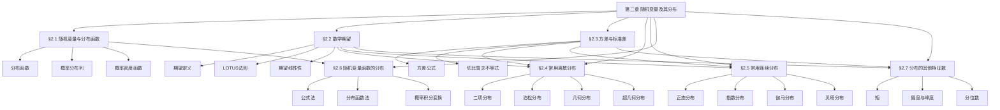

# 第二章 随机变量及其分布 — 章节汇总

> [!abstract] 全章概览
> 本章是概率论从"事件"到"变量"的关键跃迁。通过引入==随机变量==，将样本空间中的随机现象映射为实数，从而可以利用微积分等分析工具系统地研究概率规律。全章围绕"==分布=="这一核心概念展开：先建立分布函数的统一框架（§2.1），再引入期望和方差两个最重要的数字特征（§2.2-§2.3），系统介绍常用离散和连续分布（§2.4-§2.5），最后讨论分布变换和更多形状特征数（§2.6-§2.7）。
>
> **全章逻辑主线**：随机变量与分布函数（描述工具）→ 期望与方差（核心特征）→ 常用分布（具体模型）→ 函数的分布（变换工具）→ 其他特征数（形状描述）

---

## 一、全章知识框架

---

## 二、核心知识点与公式汇总

### §2.1 随机变量及其分布

本节建立随机变量的基本框架，==分布函数== $F(x) = P(X \leq x)$ 是统一描述离散型和连续型随机变量的核心工具。

| 编号 | 类型 | 名称 | 内容 |
|:----:|:----:|:----:|:----:|
| 2.1.1 | 定义 | 随机变量 | 定义在样本空间上的实值函数 $X = X(\omega)$ |
| 2.1.2 | 定义 | 分布函数 | $F(x) = P(X \leq x)$，单调不减、右连续、$F(-\infty)=0$、$F(+\infty)=1$ |
| 2.1.3 | 定义 | 概率分布列 | 离散型：$p(x_i) = P(X = x_i)$，$\sum p(x_i) = 1$ |
| 2.1.4 | 定义 | 概率密度函数 | 连续型：$p(x) \geq 0$，$\int p(x)\,dx = 1$，$F'(x) = p(x)$ |

**核心公式**：

$$P(a < X \leq b) = F(b) - F(a)$$

$$F(x) = \int_{-\infty}^{x} p(t)\,dt, \quad p(x) = F'(x)$$

$$P(X \in B) = \int_B p(x)\,dx = \sum_{x_i \in B} p(x_i)$$

---

### §2.2 数学期望

==数学期望== $E(X)$ 是随机变量取值的概率加权平均，是描述分布"中心位置"的最重要数字特征。==LOTUS法则==允许直接用 $X$ 的分布计算 $g(X)$ 的期望，无需先求 $Y$ 的分布。

| 编号 | 类型 | 名称 | 内容 |
|:----:|:----:|:----:|:----:|
| 2.2.1 | 定义 | 数学期望 | 离散：$E(X) = \sum x_i p(x_i)$；连续：$E(X) = \int x\,p(x)\,dx$ |
| 2.2.2 | 定义 | 函数的期望 | $E[g(X)] = \sum g(x_i)p(x_i) = \int g(x)\,p(x)\,dx$（LOTUS） |
| 2.2.1 | 定理 | 期望线性性 | $E(aX + bY) = aE(X) + bE(Y)$，不要求独立性 |

**核心公式**：

$$E(X) = \sum_{i} x_i\, p(x_i) = \int_{-\infty}^{+\infty} x\, p(x)\,dx$$

$$E[g(X)] = \sum_{i} g(x_i)\, p(x_i) = \int_{-\infty}^{+\infty} g(x)\, p(x)\,dx$$

$$E\left(\sum_{i} c_i X_i\right) = \sum_{i} c_i\, E(X_i)$$

---

### §2.3 方差与标准差

==方差== $\text{Var}(X)$ 度量随机变量取值围绕期望的分散程度。最常用的计算公式是 $\text{Var}(X) = E(X^2) - [E(X)]^2$。==切比雪夫不等式==是概率论最重要的不等式之一。

| 编号 | 类型 | 名称 | 内容 |
|:----:|:----:|:----:|:----:|
| 2.3.1 | 定义 | 方差 | $\text{Var}(X) = E[(X - E(X))^2]$ |
| 2.3.1 | 定理 | 简化公式 | $\text{Var}(X) = E(X^2) - [E(X)]^2$ |
| 2.3.2 | 定理 | 线性变换 | $\text{Var}(aX + b) = a^2\text{Var}(X)$ |
| 2.3.2 | 定理 | 切比雪夫不等式 | $P(|X - E(X)| \geq \varepsilon) \leq \text{Var}(X)/\varepsilon^2$ |

**核心公式**：

$$\text{Var}(X) = E(X^2) - [E(X)]^2$$

$$\text{Var}(aX + b) = a^2\,\text{Var}(X)$$

$$P(|X - \mu| \geq \varepsilon) \leq \frac{\sigma^2}{\varepsilon^2}$$

---

### §2.4 常用离散分布

本节系统介绍五大常用离散分布，各有适用场景。==泊松定理==（$n$ 大 $p$ 小时二项分布近似泊松分布）是重要的近似工具。

| 编号 | 类型 | 名称 | 内容 |
|:----:|:----:|:----:|:----:|
| 2.4.1 | 定义 | 二项分布 $b(n,p)$ | $P(X=k) = \binom{n}{k}p^k(1-p)^{n-k}$，$E=np$，$\text{Var}=np(1-p)$ |
| 2.4.2 | 定义 | 泊松分布 $P(\lambda)$ | $P(X=k) = \frac{\lambda^k}{k!}e^{-\lambda}$，$E=\lambda$，$\text{Var}=\lambda$ |
| 2.4.3 | 定义 | 几何分布 $Ge(p)$ | $P(X=k) = (1-p)^{k-1}p$，$E=1/p$，$\text{Var}=(1-p)/p^2$ |
| 2.4.4 | 定义 | 超几何分布 | $P(X=k) = \binom{M}{k}\binom{N-M}{n-k}/\binom{N}{n}$ |
| 2.4.5 | 定义 | 负二项分布 $Nb(r,p)$ | 第 $r$ 次成功所需的试验次数 |

**核心公式**：

$$b(n,p) \xrightarrow{n \to \infty,\, np \to \lambda} P(\lambda) \quad \text{（泊松定理）}$$

$$E(X) = np, \quad \text{Var}(X) = np(1-p) \quad \text{（二项分布）}$$

$$E(X) = \lambda, \quad \text{Var}(X) = \lambda \quad \text{（泊松分布，期望=方差）}$$

---

### §2.5 常用连续分布

本节系统介绍五大常用连续分布。==正态分布==是自然界最常见的分布；==指数分布==具有独特的无记忆性；==伽马分布==和==贝塔分布==是重要的"族"分布。

| 编号 | 类型 | 名称 | 内容 |
|:----:|:----:|:----:|:----:|
| 2.5.1 | 定义 | 正态分布 $N(\mu,\sigma^2)$ | $p(x) = \frac{1}{\sqrt{2\pi}\sigma}e^{-(x-\mu)^2/(2\sigma^2)}$ |
| 2.5.2 | 定义 | 均匀分布 $U(a,b)$ | $p(x) = 1/(b-a)$，$a < x < b$ |
| 2.5.3 | 定义 | 指数分布 $\text{Exp}(\lambda)$ | $p(x) = \lambda e^{-\lambda x}$，$x > 0$，无记忆性 |
| 2.5.4 | 定义 | 伽马分布 $Ga(\alpha,\lambda)$ | 指数分布的推广，$\alpha$ 个独立指数之和 |
| 2.5.5 | 定义 | 贝塔分布 $Be(a,b)$ | $(0,1)$ 区间上的分布，描述随机比例 |

**核心公式**：

$$p(x) = \frac{1}{\sqrt{2\pi}\,\sigma}\exp\left\{-\frac{(x-\mu)^2}{2\sigma^2}\right\} \quad \text{（正态分布）}$$

$$P(X > s + t \mid X > s) = P(X > t) \quad \text{（指数分布无记忆性）}$$

$$X \sim N(\mu, \sigma^2) \Leftrightarrow Z = \frac{X - \mu}{\sigma} \sim N(0,1) \quad \text{（标准化）}$$

---

### §2.6 随机变量函数的分布

本节讨论已知 $X$ 的分布如何求 $Y = g(X)$ 的分布。==公式法==适用于严格单调可导函数，==分布函数法==适用于一切情形。==概率积分变换== $F_X(X) \sim U(0,1)$ 是连接所有连续分布的桥梁。

| 编号 | 类型 | 名称 | 内容 |
|:----:|:----:|:----:|:----:|
| 2.6.1 | 定理 | 公式法 | $p_Y(y) = p_X(h(y))|h'(y)|$，$h = g^{-1}$，$g$ 严格单调可导 |
| 2.6.2 | 定理 | 正态线性变换 | $X \sim N(\mu,\sigma^2) \Rightarrow aX+b \sim N(a\mu+b, a^2\sigma^2)$ |
| 2.6.3 | 定理 | 对数正态分布 | $X \sim N(\mu,\sigma^2) \Rightarrow e^X \sim LN(\mu,\sigma^2)$ |
| 2.6.4 | 定理 | 伽马尺度变换 | $X \sim Ga(\alpha,\lambda) \Rightarrow cX \sim Ga(\alpha,\lambda/c)$ |
| 2.6.5 | 定理 | 概率积分变换 | $F_X(X) \sim U(0,1)$，$F_Y^{-1}(U) \sim Y$ |

**核心公式**：

$$p_Y(y) = p_X(h(y))\,|h'(y)| \quad \text{（公式法）}$$

$$F_Y(y) = P(g(X) \leq y) = \int_{\{x:\, g(x) \leq y\}} p_X(x)\,dx \quad \text{（分布函数法）}$$

$$F_X(X) \sim U(0,1), \quad F_Y^{-1}(U) \sim Y \quad \text{（概率积分变换）}$$

---

### §2.7 分布的其他特征数

本节在期望和方差基础上，引入更多描述分布形状的数字特征。==偏度==度量偏斜方向，==峰度==度量与正态分布相比的尖峭程度和尾部粗细。

| 编号 | 类型 | 名称 | 内容 |
|:----:|:----:|:----:|:----:|
| 2.7.1 | 定义 | k阶矩 | 原点矩 $\mu_k = E(X^k)$，中心矩 $\nu_k = E(X-E(X))^k$ |
| 2.7.2 | 定义 | 变异系数 | $C_v = \sigma/\mu$，无量纲相对波动指标 |
| 2.7.3 | 定义 | 分位数 | $F(x_p) = p$，中位数 $x_{0.5}$ 将概率等分 |
| 2.7.5 | 定义 | 偏度 | $\beta_s = \nu_3/\sigma^3$，正偏/负偏/对称 |
| 2.7.6 | 定义 | 峰度 | $\beta_k = \nu_4/\sigma^4 - 3$，尖峰厚尾/扁平薄尾 |

**核心公式**：

$$\beta_s = \frac{E(X-\mu)^3}{\sigma^3}, \quad \beta_k = \frac{E(X-\mu)^4}{\sigma^4} - 3$$

$$x_p = \mu + \sigma \cdot u_p \quad \text{（正态分布分位数线性关系）}$$

$$\nu_k = \sum_{i=0}^{k}\binom{k}{i}\mu_i(-\mu_1)^{k-i} \quad \text{（中心矩展开）}$$

---

## 三、章节学习脉络

### §2.1 随机变量及其分布

本章的起点是将随机现象"数值化"。随机变量 $X = X(\omega)$ 是定义在样本空间上的实值函数，它将每个试验结果映射为一个实数。分布函数 $F(x) = P(X \leq x)$ 是描述随机变量概率规律的最基本工具——它对离散型和连续型随机变量都适用，实现了描述方法的统一。对于离散型，使用概率分布列；对于连续型，使用概率密度函数。需要特别注意：连续型随机变量取单点值的概率恒为零，概率只分布在区间上。

### §2.2 数学期望

数学期望是随机变量取值的"概率加权平均"，是描述分布中心位置的最重要数字特征。本节的核心思想有三：(1) 期望的本质是加权平均，权重就是概率；(2) LOTUS法则允许直接用 $X$ 的分布计算 $g(X)$ 的期望，无需先求 $Y = g(X)$ 的分布；(3) 期望的线性性 $E(aX+bY) = aE(X)+bE(Y)$ 是最常用的性质，且不要求独立性。期望的局限性在于它不能度量分散程度——两个分布可以有相同的期望但完全不同的"展开"方式。

### §2.3 方差与标准差

方差弥补了期望的不足，度量了随机变量围绕期望的分散程度。本节的核心公式 $\text{Var}(X) = E(X^2) - [E(X)]^2$ 在实际计算中最为常用。方差的关键性质包括：线性变换中方差只受尺度参数影响（$\text{Var}(aX+b) = a^2\text{Var}(X)$）、独立随机变量和的方差等于方差之和。切比雪夫不等式 $P(|X-\mu| \geq \varepsilon) \leq \sigma^2/\varepsilon^2$ 是连接方差与概率的桥梁，虽然结论较粗，但在理论推导中极为重要。

### §2.4 常用离散分布

本节系统介绍了五大离散分布，它们各有明确的实际背景：二项分布描述 $n$ 次独立重复试验中成功的次数，泊松分布描述稀有事件在固定区间内发生的次数，几何分布描述首次成功所需的试验次数，超几何分布描述不放回抽样中某类个体的数量，负二项分布描述第 $r$ 次成功所需的试验次数。分布之间的关系是本节的重点：泊松定理给出了二项分布的泊松近似条件，超几何分布在 $N$ 大 $n/N$ 小时可近似为二项分布。

### §2.5 常用连续分布

本节介绍的五大连续分布在理论和应用中都有重要地位。正态分布是中心极限定理的终极形态，自然界中大量随机现象都近似服从正态分布。指数分布描述事件间隔时间，其独特的无记忆性在可靠性理论和排队论中有广泛应用。伽马分布是指数分布的自然推广（$\alpha$ 个独立指数之和），贝塔分布描述 $(0,1)$ 区间上的随机比例。正态分布的 $3\sigma$ 原则（$P(|X-\mu| < 3\sigma) \approx 0.9974$）是实际应用中的重要经验法则。

### §2.6 随机变量函数的分布

本节解决的核心问题是：已知 $X$ 的分布，如何求 $Y = g(X)$ 的分布？两种基本方法是公式法（适用于 $g$ 严格单调可导）和分布函数法（适用于一切情形）。概率积分变换 $F_X(X) \sim U(0,1)$ 是本章最深刻的结论之一——它表明任何连续分布都可以通过分布函数与均匀分布建立联系，这是随机模拟（蒙特卡洛方法）的理论基础。逆变换法 $Y = F_Y^{-1}(U)$ 则提供了从均匀分布生成任意连续分布样本的实用方法。

### §2.7 分布的其他特征数

期望和方差分别描述分布的"位置"和"尺度"，但无法刻画分布的"形状"。偏度 $\beta_s$ 通过三阶中心矩的标准化度量偏斜方向（正偏/负偏/对称），峰度 $\beta_k$ 通过四阶中心矩的标准化度量与正态分布相比的尖峭程度和尾部粗细。变异系数 $C_v = \sigma/\mu$ 消除量纲影响，适用于比较不同量级随机变量的相对波动。分位数和中位数是比期望更稳健的位置特征。这些特征数在后续的统计推断（如正态性检验、矩估计）中有重要应用。

---

## 四、补充理解与跨章展望

### 全章核心思想

本章的核心思想可以概括为三个层次：

1. **描述层**：用分布函数统一描述随机变量的概率规律，离散型用分布列，连续型用密度函数
2. **特征层**：用数字特征（期望、方差、偏度、峰度等）概括分布的关键信息，实现从"函数"到"数字"的降维
3. **变换层**：通过随机变量函数的分布和概率积分变换，实现分布之间的转换和生成

### 跨章关联表

| 关联方向 | 章节 | 关联内容 |
|----------|------|---------|
| 前置 | [[第一章 随机事件与概率 — 章节汇总|第一章 事件与概率]] | 条件概率→条件分布，独立性→独立随机变量，全概率公式→全期望公式 |
| 后续 | 第三章 多维随机变量 | 边缘分布→联合分布，期望→条件期望，独立性→独立随机向量 |
| 后续 | 第四章 大数定律与中心极限定理 | 正态分布→中心极限定理，期望→大数定律，切比雪夫不等式→马尔可夫不等式 |
| 后续 | 第五章-第七章 统计推断 | 常用分布→抽样分布（$\chi^2$、$t$、$F$），期望方差→点估计（矩估计），正态分布→区间估计与假设检验 |

### 全章学习建议

1. **分布是核心**：第二章的所有内容都围绕"分布"展开。掌握一个分布，需要同时掌握其定义、期望、方差、实际背景和与其他分布的关系
2. **公式表是复习利器**：常用分布的期望方差公式表（§2.4和§2.5的汇总表）是考试和科研中最常用的参考，务必熟记
3. **方法重于结论**：分布函数法、公式法、LOTUS法则、概率积分变换都是"方法"而非单纯的"结论"，理解方法的适用条件和推导过程比记忆公式更重要

---

## 五、全章复习题

### §2.1-§2.2 基础概念

> [!problem] 复习题 1 — 分布函数与期望
>
> 设连续随机变量 $X$ 的分布函数为 $F(x) = \begin{cases} 0, & x < 0 \\ x^2, & 0 \leq x \leq 1 \\ 1, & x > 1 \end{cases}$，求 $E(X)$ 和 $\text{Var}(X)$。

查看解答

密度函数 $p(x) = F'(x) = 2x$（$0 < x < 1$）。

$$E(X) = \int_0^1 x \cdot 2x\,dx = 2\int_0^1 x^2\,dx = \frac{2}{3}$$

$$E(X^2) = \int_0^1 x^2 \cdot 2x\,dx = 2\int_0^1 x^3\,dx = \frac{1}{2}$$

$$\text{Var}(X) = E(X^2) - [E(X)]^2 = \frac{1}{2} - \frac{4}{9} = \frac{1}{18}$$

$\blacksquare$

---

### §2.3-§2.4 方差与离散分布

> [!problem] 复习题 2 — 二项分布与泊松近似
>
> 某工厂产品的不合格率为 $0.01$，从一批 200 件产品中抽取，求不合格品数 $X$ 的期望、方差，并用泊松近似计算 $P(X \geq 3)$。

查看解答

$X \sim b(200, 0.01)$。

$$E(X) = 200 \times 0.01 = 2, \quad \text{Var}(X) = 200 \times 0.01 \times 0.99 = 1.98$$

泊松近似：$\lambda = np = 2$，$X \approx P(2)$。

$$P(X \geq 3) = 1 - P(X \leq 2) = 1 - \left(e^{-2} + 2e^{-2} + \frac{4}{2}e^{-2}\right) = 1 - 5e^{-2} \approx 1 - 0.6767 = 0.3233$$

$\blacksquare$

---

### §2.5 连续分布

> [!problem] 复习题 3 — 正态分布与指数分布
>
> 设 $X \sim N(5, 4)$，$Y \sim \text{Exp}(0.5)$，$X$ 与 $Y$ 独立。求 $P(X > 7)$ 和 $P(Y > 4)$。

查看解答

**$X \sim N(5, 4)$**：标准化 $Z = \dfrac{X-5}{2} \sim N(0,1)$。

$$P(X > 7) = P\!\left(Z > \frac{7-5}{2}\right) = P(Z > 1) = 1 - \Phi(1) \approx 1 - 0.8413 = 0.1587$$

**$Y \sim \text{Exp}(0.5)$**：$E(Y) = 1/0.5 = 2$。

$$P(Y > 4) = e^{-0.5 \times 4} = e^{-2} \approx 0.1353$$

$\blacksquare$

---

### §2.6 随机变量函数的分布

> [!problem] 复习题 4 — 公式法与分布函数法
>
> 设 $X \sim U(0, 1)$，分别用公式法和分布函数法求 $Y = -2\ln X$ 的密度函数。

查看解答

**公式法**：$g(x) = -2\ln x$ 在 $(0,1)$ 上严格单调递减，反函数 $h(y) = e^{-y/2}$，$h'(y) = -\frac{1}{2}e^{-y/2}$。

$$p_Y(y) = p_X(h(y))|h'(y)| = 1 \cdot \frac{1}{2}e^{-y/2} = \frac{1}{2}e^{-y/2}, \quad y > 0$$

即 $Y \sim \text{Exp}(1/2)$。

**分布函数法**：当 $y > 0$ 时，

$$F_Y(y) = P(-2\ln X \leq y) = P(\ln X \geq -y/2) = P(X \geq e^{-y/2}) = 1 - e^{-y/2}$$

$$p_Y(y) = F_Y'(y) = \frac{1}{2}e^{-y/2}, \quad y > 0$$

两种方法结果一致。$\blacksquare$

---

### §2.7 其他特征数

> [!problem] 复习题 5 — 偏度与峰度
>
> 设 $X \sim \text{Exp}(\lambda)$，已知 $E(X) = 1/\lambda$，$\text{Var}(X) = 1/\lambda^2$，$\nu_3 = 2/\lambda^3$，$\nu_4 = 9/\lambda^4$，求偏度和峰度，并说明分布的形状特征。

查看解答

**偏度**：

$$\beta_s = \frac{\nu_3}{\sigma^3} = \frac{2/\lambda^3}{(1/\lambda^2)^{3/2}} = \frac{2/\lambda^3}{1/\lambda^3} = 2$$

**峰度**：

$$\beta_k = \frac{\nu_4}{\sigma^4} - 3 = \frac{9/\lambda^4}{1/\lambda^4} - 3 = 9 - 3 = 6$$

**形状特征**：
- $\beta_s = 2 > 0$：指数分布==强正偏==，右侧有长尾，中位数（$\ln 2/\lambda$）小于期望（$1/\lambda$）
- $\beta_k = 6 > 0$：指数分布==尖峰厚尾==，比正态分布尾部更粗，极端值更多

$\blacksquare$

---

### 综合应用

> [!problem] 复习题 6 — 跨节综合
>
> 设 $X_1, X_2, \ldots, X_{100}$ 独立同分布，$X_i \sim U(0, 1)$。令 $Y = -2\sum_{i=1}^{100}\ln X_i$，利用概率积分变换和伽马分布的性质，求 $Y$ 服从的分布及其期望和方差。

查看解答

由概率积分变换，$X_i \sim U(0,1)$ 时，$-\ln X_i \sim \text{Exp}(1)$。

因此 $Y = -2\sum_{i=1}^{100}\ln X_i = 2\sum_{i=1}^{100}(-\ln X_i)$。

令 $Z_i = -\ln X_i \sim \text{Exp}(1)$，则 $\sum_{i=1}^{100} Z_i \sim Ga(100, 1)$（100个独立指数之和）。

由伽马分布的尺度变换性质，$Y = 2 \cdot Ga(100, 1) \sim Ga(100, 1/2)$。

**期望与方差**：

$$E(Y) = \frac{\alpha}{\lambda} = \frac{100}{1/2} = 200$$

$$\text{Var}(Y) = \frac{\alpha}{\lambda^2} = \frac{100}{(1/2)^2} = 400$$

**注**：$Ga(\alpha, \lambda)$ 中 $\alpha = n/2$、$\lambda = 1/2$ 时即为自由度为 $n$ 的 $\chi^2$ 分布。因此 $Y \sim \chi^2(200)$，这是后续统计推断中抽样分布的重要特例。

$\blacksquare$

---

## 六、各节笔记索引

| 节号 | 节标题 | 核心主题 | 误区数 | 习题数 |
|:----:|:------:|:--------:|:------:|:------:|
| 2.1 | [[2.1 随机变量及其分布]] | 分布函数、分布列、密度函数 | 5 | 10 |
| 2.2 | [[2.2 数学期望]] | 期望定义、LOTUS法则、线性性 | 5 | 10 |
| 2.3 | [[2.3 方差与标准差]] | 方差公式、切比雪夫不等式 | 5 | 10 |
| 2.4 | [[2.4 常用离散分布]] | 二项、泊松、几何、超几何、负二项 | 5 | 10 |
| 2.5 | [[2.5 常用连续分布]] | 正态、均匀、指数、伽马、贝塔 | 6 | 10 |
| 2.6 | [[2.6 随机变量函数的分布]] | 公式法、分布函数法、概率积分变换 | 5 | 10 |
| 2.7 | [[2.7 分布的其他特征数]] | 矩、变异系数、分位数、偏度、峰度 | 4 | 10 |

---

#学习/概率论与统计/第二章 随机变量及其分布/章节汇总
