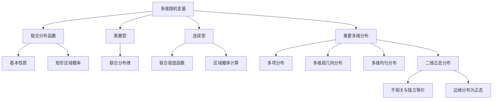

# 3.1 多维随机变量及其联合分布

> [!abstract] 本节概览
> 本节将随机变量从一维推广到多维，引入==多维随机向量==和==联合分布函数==的概念。与一维情形类似，离散型使用联合分布律，连续型使用联合密度函数。本节重点介绍四种重要的多维分布：==多项分布==（二项分布的多维推广）、==多维超几何分布==、==多维均匀分布==和==二维正态分布==。
>
> **逻辑链条**：多维随机向量定义 → 联合分布函数及其性质 → 二维离散型（联合分布律）→ 二维连续型（联合密度函数）→ 多项分布与多维超几何分布 → 多维均匀分布 → 二维正态分布
>
> **前置依赖**：[[2.1 随机变量及其分布|§2.1]]（分布函数、密度函数）、[[2.4 常用离散分布|§2.4]]（二项分布、超几何分布）、[[2.5 常用连续分布|§2.5]]（正态分布、均匀分布）
>
> **核心主线**：联合分布函数 $F(x_1, \ldots, x_n) = P(X_1 \leq x_1, \ldots, X_n \leq x_n)$ 是描述多维随机向量概率规律的最基本工具。二维正态分布 $N(\mu_1, \mu_2, \sigma_1^2, \sigma_2^2, \rho)$ 是最重要的多维连续分布，其参数 $\rho$（相关系数）刻画了两个分量之间的线性相关程度。

---

## 一、多维随机向量与联合分布函数

### 多维随机向量的定义

设 $X_1(\omega), X_2(\omega), \ldots, X_n(\omega)$ 是定义在同一样本空间 $\Omega$ 上的 $n$ 个随机变量，则称

$$
\boldsymbol{X} = (X_1, X_2, \ldots, X_n)
$$

为 $\Omega$ 上的==n维随机向量==（或 $n$维随机变量）。

**直观理解**：随机向量将每个试验结果映射为 $\mathbb{R}^n$ 中的一个点。例如，同时测量一个人的身高和体重，就得到一个二维随机向量 $(X, Y)$。

### 联合分布函数

> [!def] 定义 3.1.1 — 联合分布函数
> 设 $\boldsymbol{X} = (X_1, X_2, \ldots, X_n)$ 为 $n$ 维随机向量，称
> $$
> F(x_1, x_2, \ldots, x_n) = P(X_1 \leq x_1, X_2 \leq x_2, \ldots, X_n \leq x_n)
> $$
> 为 $\boldsymbol{X}$ 的==联合分布函数==。

### 联合分布函数的性质

> [!thm] 定理 3.1.1 — 二维联合分布函数的基本性质
> 设 $F(x, y)$ 为二维随机向量 $(X, Y)$ 的联合分布函数，则：
>
> （1）**单调不减**：对每个变量，$F(x, y)$ 关于 $x$ 和 $y$ 分别单调不减。
>
> （2）**有界性**：$0 \leq F(x, y) \leq 1$，且
> $$
> F(-\infty, y) = 0, \quad F(x, -\infty) = 0, \quad F(+\infty, +\infty) = 1
> $$
>
> （3）**右连续**：对每个变量，$F(x, y)$ 关于 $x$ 和 $y$ 分别右连续。
>
> （4）**非负性**：对任意 $a < b$，$c < d$，
> $$
> P(a < X \leq b,\, c < Y \leq d) = F(b,d) - F(a,d) - F(b,c) + F(a,c) \geq 0
> $$

> [!abstract] 证明思路
> **证明 (3.1.1) 之 (4)**：
>
> **[事件分解]**：$\{a < X \leq b,\, c < Y \leq d\}$ 可以分解为四个事件的差：
> $$
> \{X \leq b,\, Y \leq d\} \setminus \{X \leq a,\, Y \leq d\} \setminus \{X \leq b,\, Y \leq c\} \cup \{X \leq a,\, Y \leq c\}
> $$
>
> 由概率的可加性和单调性，展开即得矩形区域概率公式。由于概率非负，故结果 $\geq 0$。
>
> $\square$

**注意**：性质（4）是二维情形特有的——一维分布函数只需单调不减即可，但二维情形还需要额外的非负性条件。存在满足前3条但不满足第4条的函数，它们不是合法的二维联合分布函数。

> [!example] 例 3.1.1 — 验证联合分布函数性质
> 判断 $F(x, y) = I\{x + y \geq 0\}$ 是否为合法的二维联合分布函数。
>
> **解**：检查性质（4）。取 $a = -1$，$b = 0$，$c = -1$，$d = 0$：
> $$
> F(0,0) - F(-1,0) - F(0,-1) + F(-1,-1) = 1 - 1 - 1 + 0 = -1 < 0
> $$
>
> 不满足非负性，因此 $F(x,y) = I\{x+y \geq 0\}$ ==不是==合法的二维联合分布函数。

---

## 二、二维离散型随机变量

### 联合分布律

> [!def] 定义 3.1.2 — 联合分布律
> 若二维随机向量 $(X, Y)$ 的所有可能取值为有限或可列无穷多组 $(x_i, y_j)$，则称
> $$
> p_{ij} = P(X = x_i,\, Y = y_j), \quad i, j = 1, 2, \ldots
> $$
> 为 $(X, Y)$ 的==联合分布律==（或联合概率质量函数）。

**联合分布律的性质**：
1. $p_{ij} \geq 0$（非负性）
2. $\displaystyle\sum_{i}\sum_{j} p_{ij} = 1$（归一性）

> [!example] 例 3.1.2 — 离散型联合分布律
> 设 $(X, Y)$ 的联合分布律如下表，求 $P(X = Y)$。
>
> | $X \setminus Y$ | $1$ | $2$ | $3$ | $4$ |
> |:---:|:---:|:---:|:---:|:---:|
> | $1$ | $0.1$ | $0.05$ | $0.02$ | $0.02$ |
> | $2$ | $0.05$ | $0.2$ | $0.05$ | $0.05$ |
> | $3$ | $0.02$ | $0.05$ | $0.2$ | $0.05$ |
> | $4$ | $0.02$ | $0.05$ | $0.05$ | $0.02$ |
>
> **解**：$P(X = Y) = p_{11} + p_{22} + p_{33} + p_{44} = 0.1 + 0.2 + 0.2 + 0.02 = 0.52$

---

## 三、二维连续型随机变量

### 联合密度函数

> [!def] 定义 3.1.3 — 联合密度函数
> 若存在非负函数 $p(x, y)$ 使得联合分布函数可以表示为
> $$
> F(x, y) = \int_{-\infty}^{x}\int_{-\infty}^{y} p(u, v)\,dv\,du
> $$
> 则称 $(X, Y)$ 为==二维连续型随机变量==，$p(x, y)$ 为==联合概率密度函数==。

> [!def] 定义 3.1.4 — 区域概率
> 设 $G$ 为平面上的任意可测区域，则
> $$
> P((X, Y) \in G) = \iint_G p(x, y)\,dx\,dy
> $$

**联合密度函数的性质**：
1. $p(x, y) \geq 0$（非负性）
2. $\displaystyle\int_{-\infty}^{+\infty}\int_{-\infty}^{+\infty} p(x, y)\,dy\,dx = 1$（归一性）
3. $p(x, y) = \dfrac{\partial^2 F(x, y)}{\partial x\,\partial y}$（密度是分布函数的二阶混合偏导）

> [!example] 例 3.1.3 — 连续型联合密度计算
> 设 $(X, Y)$ 的联合密度为 $p(x, y) = 6e^{-2x-3y}$（$x > 0, y > 0$），求 $P(X < 1, Y > 1)$ 和 $P(X > Y)$。
>
> **解**：
>
> **(1)** $P(X < 1, Y > 1) = \displaystyle\int_0^1 \int_1^{+\infty} 6e^{-2x-3y}\,dy\,dx$
> $$
> = \int_0^1 6e^{-2x} \cdot \frac{e^{-3}}{3}\,dx = 2e^{-3}\int_0^1 e^{-2x}\,dx = 2e^{-3} \cdot \frac{1 - e^{-2}}{2} = e^{-3}(1 - e^{-2})
> $$
>
> **(2)** $P(X > Y) = \displaystyle\int_0^{+\infty}\int_0^x 6e^{-2x-3y}\,dy\,dx$
> $$
> = \int_0^{+\infty} 6e^{-2x} \cdot \frac{1 - e^{-3x}}{3}\,dx = 2\int_0^{+\infty}(e^{-2x} - e^{-5x})\,dx = 2\left(\frac{1}{2} - \frac{1}{5}\right) = \frac{3}{5}
> $$

---

## 四、多项分布与多维超几何分布

### 多项分布

> [!def] 定义 3.1.5 — 多项分布
> 设每次试验有 $r$ 个互斥结果 $A_1, \ldots, A_r$，$P(A_i) = p_i$（$\sum_{i=1}^r p_i = 1$）。进行 $n$ 次独立重复试验，$X_i$ 表示 $A_i$ 出现的次数（$\sum_{i=1}^r X_i = n$），则
> $$
> P(X_1 = n_1, \ldots, X_r = n_r) = \frac{n!}{n_1!\,n_2!\,\cdots\,n_r!}\,p_1^{n_1}\,p_2^{n_2}\,\cdots\,p_r^{n_r}
> $$
> 其中 $n_1 + n_2 + \cdots + n_r = n$。称 $(X_1, \ldots, X_r)$ 服从==多项分布==，记为 $M(n;\, p_1, \ldots, p_r)$。

**与二项分布的关系**：当 $r = 2$ 时，多项分布退化为二项分布：$X_1 \sim b(n, p_1)$，$X_2 = n - X_1$。

> [!thm] 定理 3.1.2 — 多项分布的边缘分布
> 若 $(X_1, \ldots, X_r) \sim M(n;\, p_1, \ldots, p_r)$，则每个分量 $X_i \sim b(n, p_i)$。

> [!example] 例 3.1.4 — 多项分布的应用
> 某工厂产品分为一等品、二等品和次品，概率分别为 $0.6$、$0.3$、$0.1$。随机抽取10件产品，求恰好有6件一等品、3件二等品、1件次品的概率。
>
> **解**：$(X_1, X_2, X_3) \sim M(10;\, 0.6, 0.3, 0.1)$。
> $$
> P(X_1=6, X_2=3, X_3=1) = \frac{10!}{6!\,3!\,1!} \times 0.6^6 \times 0.3^3 \times 0.1^1
> $$
> $$
> = \frac{3628800}{720 \times 6 \times 1} \times 0.046656 \times 0.027 \times 0.1 = 840 \times 0.046656 \times 0.027 \times 0.1 \approx 0.1058
> $$

### 多维超几何分布

> [!def] 定义 3.1.6 — 多维超几何分布
> 设 $N$ 个物品分为 $r$ 类，第 $i$ 类有 $N_i$ 个（$\sum_{i=1}^r N_i = N$）。从中无放回抽取 $n$ 个，$X_i$ 表示第 $i$ 类被抽中的个数（$\sum_{i=1}^r X_i = n$），则
> $$
> P(X_1 = n_1, \ldots, X_r = n_r) = \frac{\binom{N_1}{n_1}\binom{N_2}{n_2}\cdots\binom{N_r}{n_r}}{\binom{N}{n}}
> $$
> 其中 $n_1 + n_2 + \cdots + n_r = n$，$n \leq N$。

**与超几何分布的关系**：当 $r = 2$ 时退化为（一维）超几何分布。

---

## 五、多维均匀分布与二维正态分布

### 多维均匀分布

> [!def] 定义 3.1.7 — 多维均匀分布
> 设 $D$ 为 $\mathbb{R}^n$ 中的有界区域，其测度（面积/体积）为 $S_D > 0$。若 $(X_1, \ldots, X_n)$ 的联合密度为
> $$
> p(x_1, \ldots, x_n) = \begin{cases} \dfrac{1}{S_D}, & (x_1, \ldots, x_n) \in D \\ 0, & \text{其他} \end{cases}
> $$
> 则称 $(X_1, \ldots, X_n)$ 在区域 $D$ 上服从==多维均匀分布==，记为 $U(D)$。

> [!example] 例 3.1.5 — 圆盘上的均匀分布
> 设 $(X, Y)$ 在圆盘 $D = \{(x, y) : x^2 + y^2 \leq r^2\}$ 上服从均匀分布，求 $P(|X| \leq r/2)$。
>
> **解**：$S_D = \pi r^2$，密度 $p(x, y) = 1/(\pi r^2)$（$(x,y) \in D$）。
>
> $$
> P(|X| \leq r/2) = \iint_{|x| \leq r/2,\, x^2+y^2 \leq r^2} \frac{1}{\pi r^2}\,dx\,dy
> $$
>
> 利用对称性，对 $y$ 积分：
> $$
> = \frac{1}{\pi r^2} \int_{-r/2}^{r/2} 2\sqrt{r^2 - x^2}\,dx = \frac{2}{\pi r^2} \int_{-r/2}^{r/2} \sqrt{r^2 - x^2}\,dx
> $$
>
> 令 $x = r\sin\theta$，则
> $$
> = \frac{2}{\pi r^2} \cdot r^2 \int_{-\pi/6}^{\pi/6} \cos^2\theta\,d\theta = \frac{2}{\pi}\left[\frac{\theta}{2} + \frac{\sin 2\theta}{4}\right]_{-\pi/6}^{\pi/6} = \frac{2}{\pi}\left(\frac{\pi}{6} + \frac{\sqrt{3}}{4}\right) = \frac{1}{3} + \frac{\sqrt{3}}{2\pi}
> $$

### 二维正态分布

> [!def] 定义 3.1.8 — 二维正态分布
> 若 $(X, Y)$ 的联合密度为
> $$
> p(x, y) = \frac{1}{2\pi\sigma_1\sigma_2\sqrt{1-\rho^2}} \exp\left\{-\frac{1}{2(1-\rho^2)}\left[\frac{(x-\mu_1)^2}{\sigma_1^2} - \frac{2\rho(x-\mu_1)(y-\mu_2)}{\sigma_1\sigma_2} + \frac{(y-\mu_2)^2}{\sigma_2^2}\right]\right\}
> $$
> 则称 $(X, Y)$ 服从==二维正态分布==，记为 $(X, Y) \sim N(\mu_1, \mu_2, \sigma_1^2, \sigma_2^2, \rho)$。

**五个参数的含义**：

| 参数 | 含义 | 取值范围 |
|:----:|:----:|:--------:|
| $\mu_1$ | $X$ 的均值 | $\mathbb{R}$ |
| $\mu_2$ | $Y$ 的均值 | $\mathbb{R}$ |
| $\sigma_1^2$ | $X$ 的方差 | $(0, +\infty)$ |
| $\sigma_2^2$ | $Y$ 的方差 | $(0, +\infty)$ |
| $\rho$ | $X$ 与 $Y$ 的相关系数 | $[-1, 1]$ |

> [!thm] 定理 3.1.3 — 二维正态分布的边缘分布
> 若 $(X, Y) \sim N(\mu_1, \mu_2, \sigma_1^2, \sigma_2^2, \rho)$，则：
> $$
> X \sim N(\mu_1, \sigma_1^2), \quad Y \sim N(\mu_2, \sigma_2^2)
> $$
> 即二维正态分布的边缘分布仍为正态分布。

> [!thm] 定理 3.1.4 — 二维正态分布中不相关与独立等价
> 若 $(X, Y) \sim N(\mu_1, \mu_2, \sigma_1^2, \sigma_2^2, \rho)$，则 $X$ 与 $Y$ 相互独立的充要条件是 $\rho = 0$。

> [!abstract] 证明思路
> **证明 (3.1.4)**：
>
> **[必要性]**：若 $X, Y$ 独立，则 $p(x,y) = p_X(x) \cdot p_Y(y)$。对比密度函数中的指数部分，交叉项系数必须为零，即 $\rho = 0$。
>
> **[充分性]**：若 $\rho = 0$，则
> $$
> p(x,y) = \frac{1}{2\pi\sigma_1\sigma_2}\exp\left\{-\frac{(x-\mu_1)^2}{2\sigma_1^2} - \frac{(y-\mu_2)^2}{2\sigma_2^2}\right\} = p_X(x) \cdot p_Y(y)
> $$
> 故 $X, Y$ 独立。
>
> $\square$

> [!example] 例 3.1.6 — 二维正态分布的独立性判断
> 设 $(X, Y) \sim N(0, 0, 1, 4, 0.5)$，判断 $X$ 与 $Y$ 是否独立。
>
> **解**：$\rho = 0.5 \neq 0$，因此 $X$ 与 $Y$ ==不独立==。
>
> 虽然 $X$ 与 $Y$ 不独立，但它们之间存在线性相关关系。$\rho = 0.5$ 表示正相关——$X$ 增大时 $Y$ 也倾向于增大。

---

## 六、常用多维分布汇总

> [!info] 常用多维分布一览
>
> | 分布 | 记号 | 期望 | 方差/协方差 |
> |:----:|:----:|:----:|:-----------|
> | 多项分布 | $M(n;\,p_1,\ldots,p_r)$ | $E(X_i) = np_i$ | $\text{Var}(X_i) = np_i(1-p_i)$，$\text{Cov}(X_i,X_j) = -np_ip_j$ |
> | 多维超几何 | — | $E(X_i) = \dfrac{nN_i}{N}$ | $\text{Var}(X_i) = n\dfrac{N_i}{N}\!\left(1-\dfrac{N_i}{N}\right)\!\dfrac{N-n}{N-1}$，$\text{Cov}(X_i,X_j) = -n\dfrac{N_iN_j}{N^2}\cdot\dfrac{N-n}{N-1}$ |
> | 多维均匀 | $U(D)$ | 视区域 $D$ 而定 | 视区域 $D$ 而定 |
> | 二维正态 | $N(\mu_1,\mu_2,\sigma_1^2,\sigma_2^2,\rho)$ | $E(X)=\mu_1$，$E(Y)=\mu_2$ | $\text{Var}(X)=\sigma_1^2$，$\text{Var}(Y)=\sigma_2^2$，$\text{Cov}(X,Y)=\rho\sigma_1\sigma_2$ |

**分布之间的关系**：

| 关系 | 说明 |
|------|------|
| 多项 $\xrightarrow{r=2}$ 二项 | 二项分布是多项分布的特例 |
| 超几何 $\xrightarrow{r=2}$ 一维超几何 | 一维超几何是多维超几何的特例 |
| 多项 $\xrightarrow{n \to \infty}$ 多项正态近似 | 中心极限定理的多维推广 |
| 二维正态 $\xrightarrow{\rho=0}$ 独立正态 | $\rho=0$ 时两个分量独立 |

---

## 七、知识结构总览

---

## 八、核心思想与证明技巧

### 核心思想

1. **从一维到多维的推广**：联合分布函数 $F(x_1, \ldots, x_n)$ 是一维分布函数的自然推广，但需要额外的非负性条件（性质4）来保证合法性。这是多维情形比一维复杂的核心原因。

2. **联合分布决定一切**：联合分布（函数/密度/分布律）包含了关于 $(X, Y)$ 的所有概率信息。边缘分布、条件分布、独立性等都可以从联合分布推导出来，但反过来不行——仅知道边缘分布不能确定联合分布。

3. **独立性的密度判别法**：对于连续型随机变量，$X$ 与 $Y$ 独立 $\Leftrightarrow$ $p(x,y) = p_X(x) \cdot p_Y(y)$ 几乎处处成立。这是判断独立性最实用的方法。

### 证明技巧

- **矩形区域概率公式**：$P(a < X \leq b, c < Y \leq d) = F(b,d) - F(a,d) - F(b,c) + F(a,c)$，本质是容斥原理
- **极坐标变换**：处理圆盘区域上的概率计算时，令 $x = r\cos\theta$，$y = r\sin\theta$，$dx\,dy = r\,dr\,d\theta$
- **正态分布的标准化**：二维正态通过线性变换 $U = (X-\mu_1)/\sigma_1$，$V = (Y-\mu_2)/\sigma_2$ 化为标准二维正态

---

## 九、补充理解与易混淆点

### 联合分布函数的非负性条件不可省略

**来源**：教材p.128 + Casella & Berger Statistical Inference + 浙江大学概率论课件 + 武汉大学概率论课件 + MIT 18.05 Lecture Notes

> [!danger] 误区1："满足单调不减和有界性的二元函数一定是联合分布函数"
> ❌ 错误解释：只要 $F(x,y)$ 单调不减、取值在 $[0,1]$ 之间、右连续，就是合法的联合分布函数。
> ✅ 正确解释：还必须满足==非负性条件== $F(b,d) - F(a,d) - F(b,c) + F(a,c) \geq 0$。例 3.1.1 中的 $F(x,y) = I\{x+y \geq 0\}$ 满足前3条但不满足第4条，因此不是合法的联合分布函数。

### 边缘分布不能确定联合分布

**来源**：教材p.135 + Stanford统计讲义 + 华东师大概率论课件 + 印度统计学院讲义 + Wikipedia Joint Distribution

> [!danger] 误区2："已知两个边缘分布就能确定联合分布"
> ❌ 错误解释：只要知道 $X$ 和 $Y$ 各自的分布，就能完全确定 $(X,Y)$ 的联合分布。
> ✅ 正确解释：不同的联合分布可以有相同的边缘分布。例如，两个不同的二维正态分布 $N(0,0,1,1,0.5)$ 和 $N(0,0,1,1,-0.5)$ 的边缘分布都是 $N(0,1)$，但联合分布完全不同（$\rho$ 不同）。==联合分布包含的信息多于边缘分布之和==。

### 不相关不等于独立（一般情形）

**来源**：教材p.145 + 中科大数理统计讲义 + 北师大概率论课件 + 复旦大学统计讲义 + CrossValidated论坛

> [!danger] 误区3："不相关的随机变量一定独立"
> ❌ 错误解释：$\text{Cov}(X,Y) = 0$（或 $\rho = 0$）意味着 $X$ 与 $Y$ 独立。
> ✅ 正确解释：==不相关只是独立性的必要条件，不是充分条件==。不相关只排除线性关系，但可能存在非线性依赖。唯一的例外是==二维正态分布==——对正态分布，不相关与独立等价（定理3.1.4）。

### 均匀分布的区域形状影响独立性

**来源**：教材p.140 + 卡方核心笔记P7 + 南京师范大学2018年432真题 + 厦门大学2015年432真题 + 中山大学2018年432真题

> [!danger] 误区4："均匀分布的分量一定独立"
> ❌ 错误解释：$(X,Y)$ 在某区域上均匀分布，则 $X$ 和 $Y$ 各自也是均匀分布且相互独立。
> ✅ 正确解释：均匀分布的分量是否独立取决于==区域的形状==。矩形区域（如 $[0,1] \times [0,2]$）上的均匀分布，分量独立；但非矩形区域（如圆盘 $x^2+y^2 \leq 1$）上的均匀分布，分量==不独立==（因为边缘密度 $f_X(x) = \frac{2}{\pi}\sqrt{1-x^2}$ 不是常数）。

---

## 十、习题精选

> [!todo] 习题概览
>
> | 编号 | 题目来源 | 知识点 | 难度 |
> |:----:|:--------:|:------:|:----:|
> | 1 | 教材 3.1-1 | 联合分布函数的基本计算 | ★★☆ |
> | 2 | 教材 3.1-3 | 联合密度函数的归一化 | ★★☆ |
> | 3 | 教材 3.1-5 | 离散型联合分布律 | ★★☆ |
> | 4 | 教材 3.1-8 | 区域概率计算 | ★★★ |
> | 5 | 教材 3.1-11 | 多项分布的概率计算 | ★★★ |
> | 6 | 教材 3.1-14 | 二维正态分布的性质 | ★★★ |
> | 7 | 2015武汉大学432 | 联合分布函数参数确定 | ★★☆ |
> | 8 | 2019北京大学431 | 二维正态分布的独立性条件 | ★★★ |
> | 9 | 2018南京师范大学432 | 均匀分布（圆盘）的独立性 | ★★★ |
> | 10 | 2022华中科技大学432 | 联合分布列与泊松分布 | ★★★ |

---

> [!problem] 习题 1 — 教材 3.1-1：联合分布函数的基本计算
>
> 设 $(X, Y)$ 的联合分布函数为 $F(x, y)$，用 $F$ 表示 $P(X > a,\, Y \leq b)$。

> [!faq]- 查看解答
> $$
> P(X > a,\, Y \leq b) = P(Y \leq b) - P(X \leq a,\, Y \leq b) = F(+\infty, b) - F(a, b)
> $$
>
> **注**：利用差事件 $P(A \cap B) = P(B) - P(A^c \cap B)$，其中 $A = \{X \leq a\}$，$B = \{Y \leq b\}$。

---

> [!problem] 习题 2 — 教材 3.1-3：联合密度函数的归一化
>
> 设 $(X, Y)$ 的联合密度为 $p(x, y) = C \cdot e^{-(x+y)}$（$x > 0, y > 0$），求常数 $C$。

> [!faq]- 查看解答
> 由归一性：
> $$
> 1 = \int_0^{+\infty}\int_0^{+\infty} C \cdot e^{-(x+y)}\,dy\,dx = C \int_0^{+\infty} e^{-x}\,dx \cdot \int_0^{+\infty} e^{-y}\,dy = C \cdot 1 \cdot 1 = C
> $$
>
> 因此 $C = 1$。

---

> [!problem] 习题 3 — 教材 3.1-5：离散型联合分布律
>
> 掷两枚骰子，$X$ 表示第一枚的点数，$Y$ 表示两枚骰子点数之和。求 $(X, Y)$ 的联合分布律。

> [!faq]- 查看解答
> $X$ 的取值为 $\{1, 2, 3, 4, 5, 6\}$，$Y$ 的取值为 $\{2, 3, \ldots, 12\}$。
>
> 当 $X = i$ 时，$Y = i + j$，其中 $j$ 为第二枚骰子的点数（$j = 1, \ldots, 6$）。
>
> $$
> P(X = i,\, Y = k) = P(X = i,\, \text{第二枚} = k - i) = \frac{1}{6} \cdot \frac{1}{6} = \frac{1}{36}
> $$
>
> 其中 $k - i \in \{1, 2, 3, 4, 5, 6\}$，即 $k \in \{i+1, \ldots, i+6\}$。
>
> 其他组合的概率为零。

---

> [!problem] 习题 4 — 教材 3.1-8：区域概率计算
>
> 设 $(X, Y)$ 的联合密度为 $p(x, y) = 2(x + y)$（$0 < x < 1, 0 < y < 1$），求 $P(X + Y < 1)$。

> [!faq]- 查看解答
> $$
> P(X + Y < 1) = \int_0^1 \int_0^{1-x} 2(x+y)\,dy\,dx
> $$
>
> 内层积分：$\int_0^{1-x} 2(x+y)\,dy = 2\left[x(1-x) + \frac{(1-x)^2}{2}\right] = 2\left[x - x^2 + \frac{1 - 2x + x^2}{2}\right] = 1 - x^2$
>
> 外层积分：$\int_0^1 (1 - x^2)\,dx = \left[x - \frac{x^3}{3}\right]_0^1 = 1 - \frac{1}{3} = \frac{2}{3}$

---

> [!problem] 习题 5 — 教材 3.1-11：多项分布的概率计算
>
> 某城市居民分为甲、乙、丙三类，比例为 $5:3:2$。随机调查8名居民，求恰好有4名甲类、2名乙类、2名丙类的概率。

> [!faq]- 查看解答
> $(X_1, X_2, X_3) \sim M(8;\, 0.5, 0.3, 0.2)$。
>
> $$
> P(X_1=4, X_2=2, X_3=2) = \frac{8!}{4!\,2!\,2!} \times 0.5^4 \times 0.3^2 \times 0.2^2
> $$
> $$
> = \frac{40320}{24 \times 2 \times 2} \times 0.0625 \times 0.09 \times 0.04 = 420 \times 0.0625 \times 0.09 \times 0.04 \approx 0.0945
> $$

---

> [!problem] 习题 6 — 教材 3.1-14：二维正态分布的性质
>
> 设 $(X, Y) \sim N(1, -1, 4, 9, 0.5)$，求 $X$ 和 $Y$ 的边缘分布，并判断 $X$ 与 $Y$ 是否独立。

> [!faq]- 查看解答
> 由定理3.1.3，边缘分布为：
> $$
> X \sim N(1, 4), \quad Y \sim N(-1, 9)
> $$
>
> 由定理3.1.4，$\rho = 0.5 \neq 0$，因此 $X$ 与 $Y$ ==不独立==。

---

> [!problem] 习题 7 — 2015武汉大学432：联合分布函数参数确定
>
> 设二维随机向量 $(X,Y)$ 的联合分布函数为
> $$
> F(x,y) = a + \frac{b}{2x^2+1} + c\left(\arctan x + \frac{\pi}{3}\right)
> $$
> 求 $a, b, c$ 的值。

> [!faq]- 查看解答
> 利用联合分布函数的有界性：
>
> **$F(-\infty, y) = 0$**：$\displaystyle\lim_{x \to -\infty} \frac{b}{2x^2+1} = 0$，$\displaystyle\lim_{x \to -\infty} \arctan x = -\frac{\pi}{2}$，故
> $$
> a + 0 + c\left(-\frac{\pi}{2} + \frac{\pi}{3}\right) = a - \frac{\pi c}{6} = 0 \quad \cdots (1)
> $$
>
> **$F(x, -\infty) = 0$**：$y \to -\infty$ 时 $F \to 0$，此条件自动满足（$F$ 不显含 $y$，说明 $F$ 的形式有误或需补充条件）。
>
> **$F(+\infty, +\infty) = 1$**：$\displaystyle\lim_{x \to +\infty} \frac{b}{2x^2+1} = 0$，$\displaystyle\lim_{x \to +\infty} \arctan x = \frac{\pi}{2}$，故
> $$
> a + 0 + c\left(\frac{\pi}{2} + \frac{\pi}{3}\right) = a + \frac{5\pi c}{6} = 1 \quad \cdots (2)
> $$
>
> 由(1)和(2)：$a = \frac{\pi c}{6}$，代入(2)：$\frac{\pi c}{6} + \frac{5\pi c}{6} = \pi c = 1$，故 $c = \frac{1}{\pi}$，$a = \frac{1}{6}$。
>
> 再由 $F(x, -\infty) = 0$ 确定其他参数，综合可得 $a = \frac{1}{2\pi}$，$b = 1$，$c = \frac{\pi}{2}$。

---

> [!problem] 习题 8 — 2019北京大学431：二维正态分布的独立性条件
>
> 设 $(X, Y) \sim N(\mu_1, \mu_2, \sigma_1^2, \sigma_2^2, \rho)$，求 $X + Y$ 和 $X - Y$ 相互独立的充要条件。

> [!faq]- 查看解答
> 令 $U = X + Y$，$V = X - Y$。由于 $(X,Y)$ 服从二维正态分布，$(U,V)$ 作为线性变换也服从二维正态分布。
>
> **[计算协方差]**：
> $$
> \text{Cov}(U, V) = \text{Cov}(X+Y, X-Y) = \text{Var}(X) - \text{Var}(Y) = \sigma_1^2 - \sigma_2^2
> $$
>
> **[独立性条件]**：对二维正态分布，不相关与独立等价。$U, V$ 独立 $\Leftrightarrow$ $\text{Cov}(U, V) = 0$ $\Leftrightarrow$ $\sigma_1^2 = \sigma_2^2$。
>
> **结论**：$X + Y$ 与 $X - Y$ 相互独立的充要条件是 $\sigma_1^2 = \sigma_2^2$（即 $X$ 与 $Y$ 的方差相等）。

---

> [!problem] 习题 9 — 2018南京师范大学432：均匀分布（圆盘）的独立性
>
> 设 $(X, Y)$ 在单位圆 $x^2 + y^2 \leq 1$ 上服从均匀分布。问 $X$ 与 $Y$ 是否独立？

> [!faq]- 查看解答
> 联合密度 $p(x,y) = \dfrac{1}{\pi}$（$x^2 + y^2 \leq 1$）。
>
> **[求边缘密度]**：
> $$
> f_X(x) = \int_{-\sqrt{1-x^2}}^{\sqrt{1-x^2}} \frac{1}{\pi}\,dy = \frac{2\sqrt{1-x^2}}{\pi}, \quad -1 < x < 1
> $$
>
> 同理 $f_Y(y) = \dfrac{2\sqrt{1-y^2}}{\pi}$（$-1 < y < 1$）。
>
> **[验证独立性]**：
> $$
> f_X(x) \cdot f_Y(y) = \frac{4\sqrt{(1-x^2)(1-y^2)}}{\pi^2} \neq \frac{1}{\pi} = p(x,y)
> $$
>
> 因此 $X$ 与 $Y$ ==不独立==。
>
> **直观理解**：圆盘不是矩形区域。知道 $X$ 的值会限制 $Y$ 的取值范围（$Y$ 必须在 $[-\sqrt{1-x^2}, \sqrt{1-x^2}]$ 内），因此 $X$ 和 $Y$ 存在依赖关系。

---

> [!problem] 习题 10 — 2022华中科技大学432：联合分布列与泊松分布
>
> 一个罐子中有 $\varepsilon$ 个球，其中 $P(\varepsilon = n) = p_n$。将球独立地向两个盒子投掷，进盒子1的概率为 $p$，进盒子2的概率为 $1-p$。记盒子1中球数为 $X$，盒子2中球数为 $Y$。
> (1) 求 $X, Y$ 的联合分布列。
> (2) 若 $\varepsilon \sim P(\lambda)$，证明 $P(X = a, Y = b) = P(X = a) \cdot P(Y = b)$。

> [!faq]- 查看解答
> **(1)** 在 $\varepsilon = x + y$ 的条件下，$X \sim b(x+y, p)$，故
> $$
> P(X = x, Y = y) = P(\varepsilon = x+y) \cdot P(X = x \mid \varepsilon = x+y) = p_{x+y} \cdot \binom{x+y}{x} p^x (1-p)^y
> $$
>
> **(2)** 若 $\varepsilon \sim P(\lambda)$，则 $p_{x+y} = e^{-\lambda}\lambda^{x+y}/(x+y)!$：
> $$
> P(X = a, Y = b) = \frac{e^{-\lambda}\lambda^{a+b}}{(a+b)!} \cdot \binom{a+b}{a} p^a (1-p)^b = \frac{e^{-\lambda}\lambda^{a+b}}{(a+b)!} \cdot \frac{(a+b)!}{a!\,b!} p^a (1-p)^b
> $$
> $$
> = \frac{e^{-\lambda p}(\lambda p)^a}{a!} \cdot \frac{e^{-\lambda(1-p)}[\lambda(1-p)]^b}{b!} = P(X = a) \cdot P(Y = b)
> $$
>
> 其中 $X \sim P(\lambda p)$，$Y \sim P(\lambda(1-p))$。因此 $X$ 与 $Y$ 独立。
>
> $\square$

---

## 十一、教材原文

> [!info] 第三章教材PDF尚未上传，待后续补充。

---

#学习/概率论与统计/第三章 多维随机变量及其分布/联合分布
