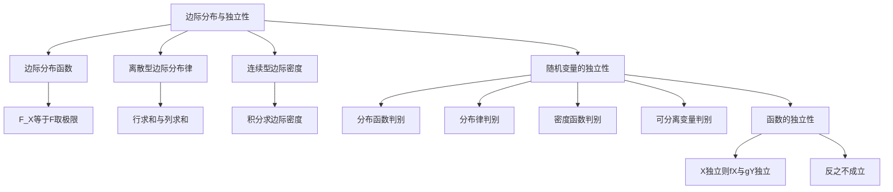

# 3.2 边际分布与随机变量的独立性

> [!abstract][ 本节概览
> 本节解决两个核心问题：(1) 如何从==联合分布==中提取单个分量的分布（==边际分布==）；(2) 如何判断多个随机变量之间是否相互==独立==。边际分布通过"积分掉"或"求和掉"其他变量得到；独立性通过联合分布是否等于边际分布的乘积来判别。
>
> **逻辑链条**：边际分布函数（从联合分布函数提取）→ 离散型边际分布律（行/列求和）→ 连续型边际密度（积分）→ 随机变量的独立性（三种判别法）→ 独立性的进一步讨论（函数独立性、可分离变量）
>
> **前置依赖**：[[3.1 多维随机变量及其联合分布|§3.1]（联合分布函数、联合密度函数）、[[2.1 随机变量及其分布|§2.1]]（一维分布函数）
>
> **核心主线**：联合分布包含所有信息，边际分布是联合分布的"投影"。独立性意味着联合分布可以完全分解为边际分布的乘积——这是概率论中最简洁的关系之一。

---

## 一、边际分布函数

### 从联合到边际

> [!def] 定义 3.2.1 — X 的边际分布函数
> 设 $(X, Y)$ 的联合分布函数为 $F(x, y)$，则称
> $$F_X(x) = F(x, +\infty) = \lim_{y \to +\infty} F(x, y)$$
> 为 $X$ 的==边际分布函数==。

> [!def] 定义 3.2.2 — Y 的边际分布函数
> $$F_Y(y) = F(+\infty, y) = \lim_{x \to +\infty} F(x, y)$$
> 为 $Y$ 的==边际分布函数==。

**直观理解**：$F_X(x) = P(X \leq x) = P(X \leq x,\, Y < +\infty)$，即"不考虑 $Y$ 的取值"时 $X$ 的分布。边际分布函数就是==对联合分布函数取极限==，"积分掉"另一个变量的信息。

> [!example] 例 3.2.1 — 从联合分布函数求边际分布
> 设 $(X, Y)$ 的联合分布函数为 $F(x, y) = (1 - e^{-x})(1 - e^{-y})$（$x > 0, y > 0$），求 $X$ 和 $Y$ 的边际分布函数。
>
> **解**：
> $$F_X(x) = F(x, +\infty) = (1 - e^{-x}) \cdot 1 = 1 - e^{-x}, \quad x > 0$$
> $$F_Y(y) = F(+\infty, y) = 1 \cdot (1 - e^{-y}) = 1 - e^{-y}, \quad y > 0$$
>
> $X \sim \text{Exp}(1)$，$Y \sim \text{Exp}(1)$。注意 $F(x,y) = F_X(x) \cdot F_Y(y)$，因此 $X$ 与 $Y$ 独立。

---

## 二、离散型边际分布律

### 从联合分布律到边际分布律

> [!def] 定义 3.2.3 — X 的边际分布律
> $$P(X = x_i) = p_{i\cdot} = \sum_{j=1}^{+\infty} p_{ij} = \sum_{j=1}^{+\infty} P(X = x_i,\, Y = y_j)$$
> 即对联合分布律的==第 $i$ 行求和==。

> [!def] 定义 3.2.4 — Y 的边际分布律
> $$P(Y = y_j) = p_{\cdot j} = \sum_{i=1}^{+\infty} p_{ij} = \sum_{i=1}^{+\infty} P(X = x_i,\, Y = y_j)$$
> 即对联合分布律的==第 $j$ 列求和==。

**直观理解**：在联合分布律表格中，$X$ 的边际分布律就是每行求和（写在表格最右列），$Y$ 的边际分布律就是每列求和（写在表格最底行）。

> [!example] 例 3.2.2 — 离散型边际分布律
> 设 $(X, Y)$ 的联合分布律如下表，求边际分布律。
>
> | $X \setminus Y$ | $0$ | $1$ | $p_{i\cdot}$ |
> |:---:|:---:|:---:|:---:|
> | $0$ | $0.4$ | $0.1$ | $0.5$ |
> | $1$ | $0.2$ | $0.3$ | $0.5$ |
> | $p_{\cdot j}$ | $0.6$ | $0.4$ | $1$ |
>
> **解**：
> - $P(X = 0) = 0.4 + 0.1 = 0.5$，$P(X = 1) = 0.2 + 0.3 = 0.5$
> - $P(Y = 0) = 0.4 + 0.2 = 0.6$，$P(Y = 1) = 0.1 + 0.3 = 0.4$
>
> 验证独立性：$P(X=0, Y=0) = 0.4 = P(X=0) \cdot P(Y=0) = 0.5 \times 0.6 = 0.3$？$0.4 \neq 0.3$，因此 $X$ 与 $Y$ ==不独立==。

---

## 三、连续型边际概率密度

### 从联合密度到边际密度

> [!def] 定义 3.2.5 — X 的边际概率密度
> $$p_X(x) = \int_{-\infty}^{+\infty} p(x, y)\,dy$$
> 即对联合密度==关于 $y$ 积分==。

> [!def] 定义 3.2.6 — Y 的边际概率密度
> $$p_Y(y) = \int_{-\infty}^{+\infty} p(x, y)\,dx$$
> 即对联合密度==关于 $x$ 积分==。

> [!thm] 定理 3.2.1 — 边际密度与边际分布函数的关系
> $$F_X(x) = \int_{-\infty}^{x} p_X(u)\,du, \quad F_Y(y) = \int_{-\infty}^{y} p_Y(v)\,dv$$

> [!abstract] 证明思路
> **证明 (3.2.1)**：
>
> $$F_X(x) = F(x, +\infty) = \int_{-\infty}^{x}\int_{-\infty}^{+\infty} p(u, v)\,dv\,du = \int_{-\infty}^{x}\underbrace{\left(\int_{-\infty}^{+\infty} p(u, v)\,dv\right)}_{= p_X(u)}du$$
>
> $\blacksquare$

> [!example] 例 3.2.3 — 三角形区域上的边际密度
> 设 $(X, Y)$ 的联合密度为 $p(x, y) = 1$（$0 < x < 1,\, |y| < x$），求 $p_X(x)$ 和 $p_Y(y)$。
>
> **解**：
>
> **[求 $p_X(x)$]**：对 $y$ 积分，$y$ 的范围是 $(-x, x)$：
> $$p_X(x) = \int_{-x}^{x} 1\,dy = 2x, \quad 0 < x < 1$$
>
> **[求 $p_Y(y)$]**：对 $x$ 积分。当 $y \geq 0$ 时，$x$ 的范围是 $(y, 1)$；当 $y < 0$ 时，$x$ 的范围是 $(-y, 1)$：
> $$p_Y(y) = \int_{|y|}^{1} 1\,dx = 1 - |y|, \quad -1 < y < 1$$
>
> **验证独立性**：$p_X(x) \cdot p_Y(y) = 2x(1 - |y|) \neq 1 = p(x,y)$，因此 $X$ 与 $Y$ ==不独立==。

---

## 四、随机变量的独立性

### 独立性的定义

> [!def] 定义 3.2.7 — 随机变量的独立性（分布函数判别）
> 设 $(X_1, X_2, \ldots, X_n)$ 的联合分布函数为 $F(x_1, \ldots, x_n)$，各分量的边际分布函数为 $F_{X_i}(x_i)$。若对所有 $x_1, \ldots, x_n$，
> $$F(x_1, \ldots, x_n) = \prod_{i=1}^{n} F_{X_i}(x_i)$$
> 则称 $X_1, X_2, \ldots, X_n$ ==相互独立==。

> [!def] 定义 3.2.8 — 独立性的分布律/密度判别
> **离散型**：若对所有 $x_1, \ldots, x_n$，
> $$P(X_1 = x_1, \ldots, X_n = x_n) = \prod_{i=1}^{n} P(X_i = x_i)$$
>
> **连续型**：若对所有 $x_1, \ldots, x_n$，
> $$p(x_1, \ldots, x_n) = \prod_{i=1}^{n} p_{X_i}(x_i)$$
>
> 则称 $X_1, \ldots, X_n$ 相互独立。

### 独立性的判别流程

> [!thm] 定理 3.2.2 — 连续型独立性的可分离变量判别
> 若连续型随机向量 $(X, Y)$ 的联合密度可以分解为
> $$p(x, y) = f(x) \cdot g(y), \quad \forall\, x, y$$
> 则 $X$ 与 $Y$ 相互独立。

**实际判别步骤**：
1. 求出 $p_X(x)$ 和 $p_Y(y)$
2. 检查 $p(x, y) \stackrel{?}{=} p_X(x) \cdot p_Y(y)$ 是否几乎处处成立
3. 若成立则独立，否则不独立

> [!example] 例 3.2.4 — 独立性判别
> 判断以下联合密度对应的 $X$ 与 $Y$ 是否独立：
> $$p(x, y) = 6xy^2, \quad 0 < x < 1,\, 0 < y < 1$$
>
> **解**：
> $$p_X(x) = \int_0^1 6xy^2\,dy = 6x \cdot \frac{1}{3} = 2x, \quad 0 < x < 1$$
> $$p_Y(y) = \int_0^1 6xy^2\,dx = 6y^2 \cdot \frac{1}{2} = 3y^2, \quad 0 < y < 1$$
>
> 验证：$p_X(x) \cdot p_Y(y) = 2x \cdot 3y^2 = 6xy^2 = p(x, y)$ ✅
>
> 因此 $X$ 与 $Y$ ==相互独立==。

---

## 五、独立性的进一步讨论

### 函数的独立性

> [!thm] 定理 3.2.3 — 函数的独立性
> 若 $X$ 与 $Y$ 相互独立，则对任意可测函数 $f$ 和 $g$，$f(X)$ 与 $g(Y)$ 也相互独立。

> [!abstract] 证明思路
> **证明 (3.2.3)**：
>
> 对任意 $a, b$，
> $$P(f(X) \leq a,\, g(Y) \leq b) = P(X \in f^{-1}((-\infty, a]),\, Y \in g^{-1}((-\infty, b)))$$
>
> 由 $X$ 与 $Y$ 独立，上式等于
> $$P(X \in f^{-1}((-\infty, a])) \cdot P(Y \in g^{-1}((-\infty, b))) = P(f(X) \leq a) \cdot P(g(Y) \leq b)$$
>
> $\blacksquare$

**重要推论**：若 $X$ 与 $Y$ 独立，则 $X^2$ 与 $Y^2$ 独立、$e^X$ 与 $e^Y$ 独立、$\sin X$ 与 $\cos Y$ 独立。但反之不成立——$X^2$ 与 $Y^2$ 独立不能推出 $X$ 与 $Y$ 独立。

### 不独立但函数独立的反例

> [!example] 例 3.2.5 — $X$ 不独立但 $X^2$ 与 $Y^2$ 独立
> 设 $p(x, y) = \frac{1}{4}(1 + xy)$（$|x| < 1, |y| < 1$），则 $X$ 与 $Y$ 不独立（因为 $p(x,y) \neq p_X(x) \cdot p_Y(y)$），但可以证明 $X^2$ 与 $Y^2$ 相互独立（$U = X^2, V = Y^2$ 的联合密度为 $f_{U,V}(u,v) = 1$，$0 < u, v < 1$）。

### n维推广

独立性定义自然推广到 $n$ 维：$X_1, \ldots, X_n$ 相互独立要求==任意子集==都独立（不仅是两两独立）。两两独立不蕴含相互独立。

---

## 六、常见分布的边际分布与独立性

> [!info][ 常见二维分布的边际分布与独立性
>
> | 联合分布 | 边际分布 | 是否独立 | 条件 |
> |:--------:|:--------:|:--------:|:----:|
> | $p(x,y) = f(x)g(y)$（可分离） | $p_X = f$，$p_Y = g$ | ✅ 独立 | 无 |
> | $N(\mu_1, \mu_2, \sigma_1^2, \sigma_2^2, \rho)$ | $N(\mu_1, \sigma_1^2)$，$N(\mu_2, \sigma_2^2)$ | $\rho = 0$ 时独立 | 见[[3.1 多维随机变量及其联合分布|§3.1] 定理3.1.4 |
> | $U(D)$，$D$ 为矩形 | 均匀分布 | ✅ 独立 | $D$ 为矩形区域 |
> | $U(D)$，$D$ 非矩形 | 非均匀 | ❌ 不独立 | 如圆盘 |
> | $M(n;\,p_1,\ldots,p_r)$ | $b(n, p_i)$ | ❌ 不独立 | $\sum X_i = n$ 约束 |

**规律总结**：
- ==矩形区域==上的均匀分布，分量独立
- ==非矩形区域==上的均匀分布，分量不独立
- 多项分布的分量==不独立==（因为受 $\sum X_i = n$ 约束）
- 二维正态分布的分量独立性等价于 $\rho = 0$

---

## 七、知识结构总览

---

## 八、核心思想与证明技巧

### 核心思想

1. **边际分布是联合分布的"投影"**：边际分布通过对联合分布"积分掉"或"求和掉"其他变量得到。联合分布包含所有信息，边际分布只包含单个变量的信息。==知道联合分布可以确定边际分布，但知道边际分布不能确定联合分布==。

2. **独立性 = 联合 = 边际的乘积**：这是独立性最本质的刻画。三种等价的判别方法（分布函数、分布律、密度函数）本质上是同一个思想在不同场景下的应用。

3. **独立性的传递性**：$X$ 与 $Y$ 独立 $\Rightarrow$ $f(X)$ 与 $g(Y)$ 独立，但反之不成立。这是一个常见的考点。

### 证明技巧

- **边际密度的积分限确定**：关键在于确定积分区域。当联合密度的支撑集不是矩形时（如三角形），积分限会依赖于另一个变量
- **独立性的快速判断**：先看支撑集是否为矩形区域，再看密度是否可以分离变量。两个条件都满足才独立
- **反例构造**：$X$ 不独立但 $X^2$ 独立，通过变量变换（Jacobi行列式）证明

---

## 九、补充理解与易混淆点

### 两两独立不等于相互独立

**来源**：教材p.155 + Casella & Berger Statistical Inference + 浙江大学概率论课件 + MIT 18.05 Lecture Notes + Stanford统计讲义

> [!danger][ 误区1："两两独立就意味着相互独立"
> ❌ 错误解释：$X_1, X_2, X_3$ 两两独立，则三者相互独立。
> ✅ 正确解释：==相互独立要求任意子集都独立==，这比两两独立强得多。存在两两独立但相互不独立的经典反例（如三个随机变量 $X_1, X_2, X_3$ 各取 $\pm 1$，乘积为1）。两两独立 $\nRightarrow$ 相互独立，但相互独立 $\Rightarrow$ 两两独立。

### 边际分布相同不意味着联合分布相同

**来源**：教材p.135 + [[3.1 多维随机变量及其联合分布|§3.1] 误区2 + 武汉大学概率论课件 + 华东师大统计讲义 + Wikipedia Copula

> [!danger] 误区2："边际分布相同则联合分布相同"
> ❌ 错误解释：如果两个二维分布的边际分布完全一样，则联合分布也相同。
> ✅ 正确解释：不同的联合分布可以有相同的边际分布。例如 $N(0,0,1,1,0.5)$ 和 $N(0,0,1,1,-0.5)$ 的边际分布都是 $N(0,1)$，但联合分布完全不同。==边际分布只提供"一维信息"，联合分布还包含"关联信息"==。

### 支撑集非矩形则一定不独立

**来源**：教材p.140 + 卡方核心笔记P11-P13 + 南京师范大学2018年432真题 + 厦门大学2015年432真题 + 中山大学2018年432真题

> [!danger][ 误区3："只要密度可以写成两个函数的乘积就独立"
> ❌ 错误解释：$p(x,y) = f(x)g(y)$ 形式成立就说明独立。
> ✅ 正确解释：可分离变量判别法要求 $p(x,y) = f(x)g(y)$ 在==整个 $\mathbb{R}^2$ 上==成立。如果支撑集不是矩形（如三角形 $0 \leq x \leq y \leq 1$），即使密度表达式看似可分离，但由于支撑集的限制，实际上不独立。==支撑集形状是独立性判断的第一步==。

### 独立性与不相关的关系

**来源**：教材p.145 + [[3.1 多维随机变量及其联合分布|§3.1] 误区3 + 中科大数理统计讲义 + 北师大概率论课件 + CrossValidated论坛

> [!danger] 误区4："独立和不相关是一回事"
> ❌ 错误解释：$X$ 与 $Y$ 独立等价于 $\text{Cov}(X,Y) = 0$。
> ✅ 正确解释：==独立 $\Rightarrow$ 不相关，但不相关 $\nRightarrow$ 独立==（一般情形）。独立性排除一切依赖关系（包括非线性），不相关只排除线性关系。唯一的例外是==二维正态分布==——对正态分布两者等价。

---

## 十、习题精选

> [!todo] 习题概览
>
> | 编号 | 题目来源 | 知识点 | 难度 |
> |:----:|:--------:|:------:|:----:|
> | 1 | 教材 3.2-1 | 边际分布函数的计算 | ★★☆ |
> | 2 | 教材 3.2-4 | 离散型边际分布律 | ★★☆ |
> | 3 | 教材 3.2-6 | 连续型边际密度 | ★★★ |
> | 4 | 教材 3.2-9 | 独立性判断（密度） | ★★★ |
> | 5 | 教材 3.2-12 | 独立性判断（分布律） | ★★☆ |
> | 6 | 教材 3.2-15 | 边际密度+独立性综合 | ★★★ |
> | 7 | 2021中国药科大学432 | 边缘密度+独立性判断 | ★★☆ |
> | 8 | 2021厦门大学868 | 不独立但函数独立 | ★★★ |
> | 9 | 2021武汉大学432 | 参数范围+独立性条件 | ★★☆ |
> | 10 | 2021西南大学432 | 分段边际密度+独立性 | ★★★ |

---

> [!problem] 习题 1 — 教材 3.2-1：边际分布函数的计算
>
> 设 $(X, Y)$ 的联合分布函数为 $F(x, y) = \begin{cases} 1 - e^{-x} - e^{-y} + e^{-x-y}, & x > 0, y > 0 \\ 0, & \text{其他} \end{cases}$，求 $F_X(x)$ 和 $F_Y(y)$。

> [!faq]- 查看解答
> $$F_X(x) = F(x, +\infty) = 1 - e^{-x} - 0 + 0 = 1 - e^{-x}, \quad x > 0$$
> $$F_Y(y) = F(+\infty, y) = 1 - 0 - e^{-y} + 0 = 1 - e^{-y}, \quad y > 0$$
>
> $X \sim \text{Exp}(1)$，$Y \sim \text{Exp}(1)$。且 $F(x,y) = (1-e^{-x})(1-e^{-y}) = F_X(x) \cdot F_Y(y)$，故 $X$ 与 $Y$ 独立。

---

> [!problem] 习题 2 — 教材 3.2-4：离散型边际分布律
>
> 设 $(X, Y)$ 的联合分布律为 $P(X=i, Y=j) = \frac{i+j}{21}$（$i=1,2,3;\, j=1,2$），求 $X$ 和 $Y$ 的边际分布律。

> [!faq]- 查看解答
> **$X$ 的边际分布律**：
> - $P(X=1) = \frac{2+3}{21} = \frac{5}{21}$
> - $P(X=2) = \frac{3+4}{21} = \frac{7}{21} = \frac{1}{3}$
> - $P(X=3) = \frac{4+5}{21} = \frac{9}{21} = \frac{3}{7}$
>
> **$Y$ 的边际分布律**：
> - $P(Y=1) = \frac{2+3+4}{21} = \frac{9}{21} = \frac{3}{7}$
> - $P(Y=2) = \frac{3+4+5}{21} = \frac{12}{21} = \frac{4}{7}$
>
> 验证：$P(X=1,Y=1) = \frac{2}{21} \neq \frac{5}{21} \cdot \frac{3}{7} = \frac{15}{147} = \frac{5}{49}$，不独立。

---

> [!problem] 习题 3 — 教材 3.2-6：连续型边际密度
>
> 设 $(X, Y)$ 的联合密度为 $p(x, y) = 4xy$（$0 < x < 1, 0 < y < 1$），求 $p_X(x)$、$p_Y(y)$，并判断独立性。

> [!faq]- 查看解答
> $$p_X(x) = \int_0^1 4xy\,dy = 4x \cdot \frac{1}{2} = 2x, \quad 0 < x < 1$$
> $$p_Y(y) = \int_0^1 4xy\,dx = 4y \cdot \frac{1}{2} = 2y, \quad 0 < y < 1$$
>
> $p_X(x) \cdot p_Y(y) = 4xy = p(x, y)$ ✅，故 $X$ 与 $Y$ 独立。

---

> [!problem] 习题 4 — 教材 3.2-9：独立性判断（密度）
>
> 设 $p(x, y) = 2$（$0 < x < y < 1$），判断 $X$ 与 $Y$ 是否独立。

> [!faq]- 查看解答
> 支撑集为 $\{(x,y) : 0 < x < y < 1\}$，是==三角形区域==（非矩形），因此 $X$ 与 $Y$ ==不独立==。
>
> 也可通过计算验证：
> $$p_X(x) = \int_x^1 2\,dy = 2(1-x), \quad 0 < x < 1$$
> $$p_Y(y) = \int_0^y 2\,dx = 2y, \quad 0 < y < 1$$
> $$p_X(x) \cdot p_Y(y) = 4y(1-x) \neq 2 = p(x,y)$$

---

> [!problem] 习题 5 — 教材 3.2-12：独立性判断（分布律）
>
> 设 $(X, Y)$ 的联合分布律为 $P(X=i, Y=j) = \frac{1}{3i}$（$j=1,2,\ldots,i;\, i=1,2,3$），判断独立性。

> [!faq]- 查看解答
> $P(X=1) = \frac{1}{3}$，$P(X=2) = \frac{2}{3}$，$P(X=3) = 1$。
>
> $P(Y=1) = \frac{1}{3} + \frac{1}{6} + \frac{1}{9} = \frac{11}{18}$。
>
> $P(X=1, Y=1) = \frac{1}{3}$，但 $P(X=1) \cdot P(Y=1) = \frac{1}{3} \cdot \frac{11}{18} = \frac{11}{54} \neq \frac{1}{3}$。
>
> 因此 $X$ 与 $Y$ ==不独立==。

---

> [!problem] 习题 6 — 教材 3.2-15：边际密度+独立性综合
>
> 设 $(X, Y)$ 的联合密度为 $p(x, y) = e^{-(x+y)}$（$x > 0, y > 0$），求 $P(X < Y)$。

> [!faq]- 查看解答
> $p_X(x) = e^{-x}$（$x > 0$），$p_Y(y) = e^{-y}$（$y > 0$），$p(x,y) = p_X(x) \cdot p_Y(y)$，故 $X$ 与 $Y$ 独立。
>
> $$P(X < Y) = \iint_{0 < x < y < +\infty} e^{-(x+y)}\,dx\,dy = \int_0^{+\infty} e^{-y} \int_0^y e^{-x}\,dx\,dy = \int_0^{+\infty} e^{-y}(1 - e^{-y})\,dy$$
> $$= \int_0^{+\infty}(e^{-y} - e^{-2y})\,dy = 1 - \frac{1}{2} = \frac{1}{2}$$
>
> 由对称性，$P(X < Y) = P(X > Y) = 1/2$（连续型等概率）。

---

> [!problem] 习题 7 — 2021中国药科大学432：边缘密度+独立性判断
>
> 设 $(X, Y)$ 的密度为 $f(x,y) = \begin{cases} Ce^{-(2x+3y)}, & x>0, y>0 \\ 0, & \text{其他} \end{cases}$，求 $C$、边缘密度，并判断独立性。

> [!faq]- 查看解答
> **(1)** $1 = C\int_0^{+\infty}\int_0^{+\infty} e^{-(2x+3y)}\,dy\,dx = C \cdot \frac{1}{6}$，故 $C = 6$。
>
> **(2)** $f_X(x) = \int_0^{+\infty} 6e^{-(2x+3y)}\,dy = 2e^{-2x}$（$x>0$），$f_Y(y) = 3e^{-3y}$（$y>0$）。
>
> **(3)** $f(x,y) = 6e^{-(2x+3y)} = (2e^{-2x})(3e^{-3y}) = f_X(x) \cdot f_Y(y)$ ✅，故 $X$ 与 $Y$ ==独立==。

---

> [!problem] 习题 8 — 2021厦门大学868：不独立但函数独立
>
> 设 $f(x,y) = \frac{c}{4}(1+xy)$（$|x|<1, |y|<1$），(1) 求 $c$；(2) $X$ 与 $Y$ 是否独立？(3) 证明 $X^2$ 与 $Y^2$ 独立。

> [!faq]- 查看解答
> **(1)** $1 = \int_{-1}^1\int_{-1}^1 \frac{c}{4}(1+xy)\,dy\,dx = c$，故 $c = 4$。
>
> **(2)** $f_X(x) = \int_{-1}^1 (1+xy)\,dy = 2$（$|x|<1$），$f_Y(y) = 2$（$|y|<1$）。
> $f(x,y) = 1+xy \neq 4 = f_X(x) \cdot f_Y(y)$，故 $X$ 与 $Y$ ==不独立==。
>
> **(3)** 令 $U = X^2, V = Y^2$，由变量变换公式（$|J| = 4\sqrt{uv}$）：
> $$f_{U,V}(u,v) = f(\sqrt{u},\sqrt{v}) \cdot \frac{1}{4\sqrt{uv}} \cdot 4\sqrt{uv} = 1 + \sqrt{uv} \cdot \frac{1}{4\sqrt{uv}} \cdot 4\sqrt{uv}$$
>
> 更精确地：$f_{U,V}(u,v) = 1$（$0<u,v<1$），$f_U(u) = 1$，$f_V(v) = 1$。
> $f_{U,V}(u,v) = 1 = f_U(u) \cdot f_V(v)$ ✅，故 $X^2$ 与 $Y^2$ ==独立==。$\blacksquare$

---

> [!problem] 习题 9 — 2021武汉大学432：参数范围+独立性条件
>
> 设 $f(x,y) = a + bxy$（$-1<x<1, -1<y<1$），(1) 求 $a, b$ 的取值范围；(2) 求 $a, b$ 使 $X, Y$ 独立。

> [!faq]- 查看解答
> **(1)** 归一性：$1 = \int_{-1}^1\int_{-1}^1(a+bxy)\,dy\,dx = 4a$，故 $a = 1/4$。
> 非负性：$1/4 + bxy \geq 0$ 对所有 $|x|,|y|<1$ 成立，故 $|b| \leq 1/4$。
>
> **(2)** $f_X(x) = 1/2$（$|x|<1$），$f_Y(y) = 1/2$（$|y|<1$）。
> 独立要求 $1/4 + bxy = 1/4$，故 $b = 0$。
> 即 $a = 1/4, b = 0$ 时 $X, Y$ 独立。

---

> [!problem] 习题 10 — 2021西南大学432：分段边际密度+独立性
>
> 设 $(X,Y)$ 在区域 $\{(x,y): 0<x<2,\, 0<y<2,\, \max(0,y-1)<x\}$ 上均匀分布（密度为 $2/7$），求边缘密度并判断独立性。

> [!faq]- 查看解答
> **边缘密度**：
> $$f_X(x) = \begin{cases} \frac{2(1+x)}{7}, & 0 < x < 1 \\ \frac{4}{7}, & 1 \leq x < 2 \end{cases}, \quad f_Y(y) = \begin{cases} \frac{4}{7}, & 0 < y < 1 \\ \frac{2(3-y)}{7}, & 1 \leq y < 2 \end{cases}$$
>
> **独立性**：取 $x=0.5, y=0.5$，$f = 2/7$，但 $f_X(0.5) \cdot f_Y(0.5) = \frac{3}{7} \cdot \frac{4}{7} = \frac{12}{49} \neq \frac{14}{49} = \frac{2}{7}$。
>
> 故 $X$ 与 $Y$ ==不独立==（支撑集非矩形）。

---

## 十一、教材原文

> [!info] 第三章教材PDF尚未上传，待后续补充。

---

#学习/概率论与统计/第三章 多维随机变量及其分布/边际分布与独立性
