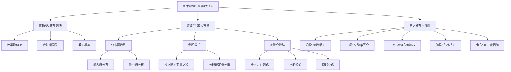

# 3.3 多维随机变量函数的分布

> [!abstract] 本节概览
> 本节讨论==多维随机变量函数的分布==问题：已知 $(X_1, X_2, \ldots, X_n)$ 的联合分布，如何求 $Z = g(X_1, X_2, \ldots, X_n)$ 的分布？这是 [[2.6 随机变量函数的分布|§2.6]] 一维情形的自然推广，也是概率论中极具实用价值的核心技术。本节系统介绍四大方法：==分布列法==（离散型）、==分布函数法==（最大/最小值）、==卷积公式==（连续型独立随机变量之和）和==变量变换法==（雅可比行列式），并总结五大分布的==可加性==。
>
> **逻辑链条**：离散型函数分布 → 最大/最小值分布 → 卷积公式 → 变量变换法 → 分布可加性
>
> **前置依赖**：[[3.1 多维随机变量及其联合分布|§3.1]]（联合分布函数、联合密度函数）、[[3.2 边际分布与随机变量的独立性|§3.2]]（边际分布、独立性）、[[2.6 随机变量函数的分布|§2.6]]（一维函数分布）
>
> **核心主线**：求多维随机变量函数的分布有三大核心方法——分布函数法（最通用）、卷积公式（求和专用）、变量变换法（多变量变换专用）。掌握方法的选择逻辑和五大分布的可加性是本节的关键。

---

## 一、离散型随机变量函数的分布

### 分布列法

当 $(X, Y)$ 是离散型随机变量时，求 $Z = g(X, Y)$ 的分布列使用==分布列法==：枚举 $(X, Y)$ 的所有可能取值对，计算对应的 $Z$ 值，合并相同的 $Z$ 值并累加概率。

> [!def] 定义 3.3.1 — 离散型函数分布的分布列法
> 设 $(X, Y)$ 的联合分布律为 $P(X = x_i,\, Y = y_j) = p_{ij}$（$i, j = 1, 2, \ldots$），则 $Z = g(X, Y)$ 的分布律为
> $$P(Z = z_k) = \sum_{(i,j):\, g(x_i, y_j) = z_k} p_{ij}$$
> 即对所有满足 $g(x_i, y_j) = z_k$ 的 $(i, j)$ 对，将对应联合概率==求和==。

**分布列法的基本步骤**：
1. 列出 $(X, Y)$ 的所有可能取值对 $(x_i, y_j)$ 及其联合概率 $p_{ij}$；
2. 计算每个取值对对应的 $z_{ij} = g(x_i, y_j)$；
3. 合并相同的 $z$ 值，将对应联合概率相加；
4. 写出 $Z$ 的分布列。

> [!example] 例 3.3.1 — 联合分布列求函数分布
> 设 $(X, Y)$ 的联合分布律如下表：
>
> | $X \setminus Y$ | $0$ | $1$ |
> |:---:|:---:|:---:|
> | $0$ | $0.1$ | $0.2$ |
> | $1$ | $0.3$ | $0.4$ |
>
> 分别求 $Z_1 = X + Y$、$Z_2 = X - Y$、$Z_3 = \max\{X, Y\}$ 的分布列。
>
> **解**：
>
> **（1）$Z_1 = X + Y$**：
>
> | $(X, Y)$ | $(0,0)$ | $(0,1)$ | $(1,0)$ | $(1,1)$ |
> |:---:|:---:|:---:|:---:|:---:|
> | $Z_1$ | $0$ | $1$ | $1$ | $2$ |
> | $P$ | $0.1$ | $0.2$ | $0.3$ | $0.4$ |
>
> 合并：$P(Z_1 = 0) = 0.1$，$P(Z_1 = 1) = 0.2 + 0.3 = 0.5$，$P(Z_1 = 2) = 0.4$
>
> | $z_1$ | $0$ | $1$ | $2$ |
> |:---:|:---:|:---:|:---:|
> | $P$ | $0.1$ | $0.5$ | $0.4$ |
>
> **（2）$Z_2 = X - Y$**：
>
> | $(X, Y)$ | $(0,0)$ | $(0,1)$ | $(1,0)$ | $(1,1)$ |
> |:---:|:---:|:---:|:---:|:---:|
> | $Z_2$ | $0$ | $-1$ | $1$ | $0$ |
> | $P$ | $0.1$ | $0.2$ | $0.3$ | $0.4$ |
>
> 合并：$P(Z_2 = -1) = 0.2$，$P(Z_2 = 0) = 0.1 + 0.4 = 0.5$，$P(Z_2 = 1) = 0.3$
>
> | $z_2$ | $-1$ | $0$ | $1$ |
> |:---:|:---:|:---:|:---:|
> | $P$ | $0.2$ | $0.5$ | $0.3$ |
>
> **（3）$Z_3 = \max\{X, Y\}$**：
>
> | $(X, Y)$ | $(0,0)$ | $(0,1)$ | $(1,0)$ | $(1,1)$ |
> |:---:|:---:|:---:|:---:|:---:|
> | $Z_3$ | $0$ | $1$ | $1$ | $1$ |
> | $P$ | $0.1$ | $0.2$ | $0.3$ | $0.4$ |
>
> 合并：$P(Z_3 = 0) = 0.1$，$P(Z_3 = 1) = 0.2 + 0.3 + 0.4 = 0.9$
>
> | $z_3$ | $0$ | $1$ |
> |:---:|:---:|:---:|
> | $P$ | $0.1$ | $0.9$ |

### 泊松分布的可加性

> [!thm] 定理 3.3.2 — 泊松分布的可加性
> 设 $X \sim \text{Poisson}(\lambda_1)$，$Y \sim \text{Poisson}(\lambda_2)$，且 $X$ 与 $Y$ ==相互独立==，则
> $$X + Y \sim \text{Poisson}(\lambda_1 + \lambda_2)$$

> [!abstract]
> **证明**：$X$ 的分布列为 $P(X = k) = \dfrac{\lambda_1^k}{k!} e^{-\lambda_1}$（$k = 0, 1, 2, \ldots$），$Y$ 的分布列为 $P(Y = j) = \dfrac{\lambda_2^j}{j!} e^{-\lambda_2}$（$j = 0, 1, 2, \ldots$）。
>
> 由独立性，$Z = X + Y$ 的分布列为
> $$P(Z = n) = \sum_{k=0}^{n} P(X = k)\,P(Y = n - k) = \sum_{k=0}^{n} \frac{\lambda_1^k}{k!} e^{-\lambda_1} \cdot \frac{\lambda_2^{n-k}}{(n-k)!} e^{-\lambda_2}$$
> $$= e^{-(\lambda_1 + \lambda_2)} \sum_{k=0}^{n} \frac{\lambda_1^k \cdot \lambda_2^{n-k}}{k!\,(n-k)!}$$
>
> 提取 $\dfrac{1}{n!}$ 并利用二项式定理：
> $$= \frac{e^{-(\lambda_1 + \lambda_2)}}{n!} \sum_{k=0}^{n} \frac{n!}{k!\,(n-k)!} \lambda_1^k \lambda_2^{n-k} = \frac{e^{-(\lambda_1 + \lambda_2)}}{n!} (\lambda_1 + \lambda_2)^n$$
>
> 这正是 $\text{Poisson}(\lambda_1 + \lambda_2)$ 的分布列。$\blacksquare$

**直观理解**：泊松分布描述的是单位时间内稀有事件发生的次数。如果两个独立稀有事件源分别以速率 $\lambda_1$ 和 $\lambda_2$ 发生，那么合并后的事件源以速率 $\lambda_1 + \lambda_2$ 发生——总发生率等于各发生率之和。

### 二项分布的可加性

> [!thm] 定理 3.3.3 — 二项分布的可加性
> 设 $X \sim B(n_1, p)$，$Y \sim B(n_2, p)$，且 $X$ 与 $Y$ ==相互独立==，则
> $$X + Y \sim B(n_1 + n_2,\, p)$$

> [!abstract]
> **证明**：$X$ 的分布列为 $P(X = k) = \binom{n_1}{k} p^k (1-p)^{n_1-k}$（$k = 0, 1, \ldots, n_1$），$Y$ 的分布列为 $P(Y = j) = \binom{n_2}{j} p^j (1-p)^{n_2-j}$（$j = 0, 1, \ldots, n_2$）。
>
> 由独立性，$Z = X + Y$ 的分布列为
> $$P(Z = n) = \sum_{k=0}^{n} P(X = k)\,P(Y = n - k) = \sum_{k=\max(0, n-n_2)}^{\min(n, n_1)} \binom{n_1}{k} p^k (1-p)^{n_1-k} \cdot \binom{n_2}{n-k} p^{n-k} (1-p)^{n_2-(n-k)}$$
> $$= p^n (1-p)^{n_1 + n_2 - n} \sum_{k} \binom{n_1}{k} \binom{n_2}{n-k}$$
>
> 由 Vandermonde 恒等式 $\displaystyle\sum_{k} \binom{n_1}{k} \binom{n_2}{n-k} = \binom{n_1 + n_2}{n}$，得
> $$P(Z = n) = \binom{n_1 + n_2}{n} p^n (1-p)^{n_1 + n_2 - n}$$
>
> 这正是 $B(n_1 + n_2, p)$ 的分布列。$\blacksquare$

**直观理解**：$X \sim B(n_1, p)$ 表示 $n_1$ 次独立伯努利试验中成功的次数，$Y \sim B(n_2, p)$ 表示另外 $n_2$ 次独立伯努利试验中成功的次数。由于两组试验相互独立且成功概率相同，合并后相当于 $n_1 + n_2$ 次伯努利试验，成功次数仍服从二项分布。

**注意**：二项分布可加性要求==成功概率 $p$ 相同==。如果 $X \sim B(n_1, p_1)$，$Y \sim B(n_2, p_2)$ 且 $p_1 \neq p_2$，则 $X + Y$ 不服从二项分布。

---

## 二、最大值与最小值的分布

最大值和最小值是工程、可靠性分析和极值统计中最重要的函数形式之一。本节介绍其分布函数的推导方法——==分布函数法==。

### 最大值的分布

> [!def] 定义 3.3.2 — 最大值的分布
> 设 $X_1, X_2, \ldots, X_n$ 是 $n$ 个==相互独立==的随机变量，$Y = \max\{X_1, X_2, \ldots, X_n\}$，则 $Y$ 的分布函数为
> $$F_Y(y) = P(Y \leq y) = P(X_1 \leq y,\, X_2 \leq y,\, \ldots,\, X_n \leq y) = \prod_{i=1}^{n} F_{X_i}(y)$$
> 特别地，当 $X_1, X_2, \ldots, X_n$ ==独立同分布==，共同分布函数为 $F(x)$ 时，
> $$F_{\max}(y) = [F(y)]^n$$

**推导思路**：$\max\{X_1, \ldots, X_n\} \leq y$ 当且仅当==每一个== $X_i \leq y$。由独立性，联合事件概率等于各事件概率的乘积。

### 最小值的分布

> [!def] 定义 3.3.3 — 最小值的分布
> 设 $X_1, X_2, \ldots, X_n$ 是 $n$ 个==相互独立==的随机变量，$Z = \min\{X_1, X_2, \ldots, X_n\}$，则 $Z$ 的分布函数为
> $$F_Z(z) = P(Z \leq z) = 1 - P(Z > z) = 1 - P(X_1 > z,\, X_2 > z,\, \ldots,\, X_n > z) = 1 - \prod_{i=1}^{n} [1 - F_{X_i}(z)]$$
> 特别地，当 $X_1, X_2, \ldots, X_n$ ==独立同分布==，共同分布函数为 $F(x)$ 时，
> $$F_{\min}(z) = 1 - [1 - F(z)]^n$$

**推导思路**：$\min\{X_1, \ldots, X_n\} > z$ 当且仅当==每一个== $X_i > z$。利用对立事件 $P(Z \leq z) = 1 - P(Z > z)$ 转化。

> [!example] 例 3.3.2 — 最大值分布（连续型）
> 设 $X_1, X_2, \ldots, X_5$ 独立同分布，$X_i \sim U(0, 1)$，求 $Y = \max\{X_1, \ldots, X_5\}$ 的密度函数。
>
> **解**：$X_i$ 的分布函数为 $F(x) = x$（$0 < x < 1$），则
> $$F_Y(y) = [F(y)]^5 = y^5, \quad 0 < y < 1$$
> $$f_Y(y) = F_Y'(y) = 5y^4, \quad 0 < y < 1$$
>
> **验证**：$\displaystyle\int_0^1 5y^4\,dy = 1$ ✓

> [!example] 例 3.3.3 — 最小值分布（连续型）
> 设 $X_1, X_2, \ldots, X_5$ 独立同分布，$X_i \sim U(0, 1)$，求 $Z = \min\{X_1, \ldots, X_5\}$ 的密度函数。
>
> **解**：$X_i$ 的分布函数为 $F(x) = x$（$0 < x < 1$），则
> $$F_Z(z) = 1 - [1 - F(z)]^5 = 1 - (1 - z)^5, \quad 0 < z < 1$$
> $$f_Z(z) = F_Z'(z) = 5(1 - z)^4, \quad 0 < z < 1$$
>
> **验证**：$\displaystyle\int_0^1 5(1-z)^4\,dz = 1$ ✓

> [!example] 例 3.3.4 — 路灯问题（最大值应用题）
> 一条长为 $a$ 的道路上有两盏路灯，分别位于道路的两端。假设路灯的寿命 $X_1, X_2$ 独立同分布，$X_i \sim \text{Exp}(\lambda)$，求两盏路灯中至少有一盏仍在工作的概率，以及两盏都失效的时间分布。
>
> **解**：
>
> **（1）至少一盏仍在工作**：
> 两盏都失效的时间为 $T = \max\{X_1, X_2\}$。在时刻 $t$ 至少一盏仍在工作等价于 $T > t$。
>
> $T$ 的分布函数：
> $$F_T(t) = P(\max\{X_1, X_2\} \leq t) = [F(t)]^2 = (1 - e^{-\lambda t})^2, \quad t > 0$$
>
> 因此 $P(\text{至少一盏在时刻 } t \text{ 仍工作}) = P(T > t) = 1 - (1 - e^{-\lambda t})^2 = 2e^{-\lambda t} - e^{-2\lambda t}$
>
> **（2）两盏都失效的时间分布**：
> $$f_T(t) = F_T'(t) = 2(1 - e^{-\lambda t}) \cdot \lambda e^{-\lambda t} = 2\lambda e^{-\lambda t}(1 - e^{-\lambda t}), \quad t > 0$$

---

## 三、连续场合的卷积公式

==卷积公式==是求连续型独立随机变量之和分布的核心工具，也是本节最重要的公式之一。

### 卷积公式

> [!thm] 定理 3.3.4 — 卷积公式
> 设 $X$ 与 $Y$ 是==相互独立==的连续型随机变量，其密度函数分别为 $p_X(x)$ 和 $p_Y(y)$，则 $Z = X + Y$ 的密度函数为
> $$p_Z(z) = \int_{-\infty}^{+\infty} p_X(z - y)\,p_Y(y)\,dy = \int_{-\infty}^{+\infty} p_X(x)\,p_Y(z - x)\,dx$$

> [!abstract]
> **证明**：先求 $Z = X + Y$ 的分布函数：
> $$F_Z(z) = P(X + Y \leq z) = \iint_{x+y \leq z} p_X(x)\,p_Y(y)\,dx\,dy$$
>
> 将积分区域 $\{(x, y) : x + y \leq z\}$ 改写为：固定 $y$，则 $x$ 的范围是 $(-\infty, z - y]$。因此
> $$F_Z(z) = \int_{-\infty}^{+\infty} \left[\int_{-\infty}^{z-y} p_X(x)\,dx\right] p_Y(y)\,dy$$
>
> 对 $z$ 求导（利用 Leibniz 积分法则）：
> $$p_Z(z) = F_Z'(z) = \int_{-\infty}^{+\infty} p_X(z - y)\,p_Y(y)\,dy$$
>
> 交换 $X$ 和 $Y$ 的角色（令 $x = z - y$），可得等价形式 $p_Z(z) = \int_{-\infty}^{+\infty} p_X(x)\,p_Y(z - x)\,dx$。$\blacksquare$

**卷积公式的直观理解**：$Z = z$ 可以通过无数种方式实现：$X = x$ 且 $Y = z - x$，其中 $x$ 取遍所有实数。对于每一种方式，其"概率密度贡献"为 $p_X(x) \cdot p_Y(z - x)$，将所有贡献积分即得 $p_Z(z)$。

**使用卷积公式的关键步骤**：
1. 写出 $p_X(x)$ 和 $p_Y(y)$ 的表达式，注意各自的==非零区域==；
2. 代入卷积公式 $p_Z(z) = \int p_X(x)\,p_Y(z - x)\,dx$；
3. 确定被积函数非零时 $x$ 和 $z$ 需要满足的不等式；
4. 根据 $z$ 的不同取值范围，==分段确定积分限==；
5. 分段计算积分。

### 正态分布的可加性

> [!example] 例 3.3.5 — 正态分布的可加性
> 设 $X \sim N(\mu_1, \sigma_1^2)$，$Y \sim N(\mu_2, \sigma_2^2)$，且 $X$ 与 $Y$ 独立，证明 $Z = X + Y \sim N(\mu_1 + \mu_2,\, \sigma_1^2 + \sigma_2^2)$。
>
> **解**：由卷积公式：
> $$p_Z(z) = \int_{-\infty}^{+\infty} p_X(x)\,p_Y(z - x)\,dx = \int_{-\infty}^{+\infty} \frac{1}{\sqrt{2\pi}\,\sigma_1} e^{-\frac{(x-\mu_1)^2}{2\sigma_1^2}} \cdot \frac{1}{\sqrt{2\pi}\,\sigma_2} e^{-\frac{(z-x-\mu_2)^2}{2\sigma_2^2}}\,dx$$
>
> 合并指数部分：
> $$-\frac{1}{2}\left[\frac{(x-\mu_1)^2}{\sigma_1^2} + \frac{(z-x-\mu_2)^2}{\sigma_2^2}\right]$$
>
> 对 $x$ 配方，令 $\sigma^2 = \sigma_1^2 + \sigma_2^2$，$\mu = \mu_1 + \mu_2$，经过配方化简后指数部分变为
> $$-\frac{(z - \mu)^2}{2\sigma^2} - \frac{[\sigma^2(x - \hat{\mu})]^2}{2\sigma_1^2 \sigma_2^2}$$
>
> 其中 $\hat{\mu} = \dfrac{\sigma_2^2 \mu_1 + \sigma_1^2(z - \mu_2)}{\sigma_1^2 + \sigma_2^2}$。对 $x$ 积分时，第二项关于 $x$ 的高斯积分结果为 $\dfrac{\sqrt{2\pi}\,\sigma_1 \sigma_2}{\sqrt{\sigma_1^2 + \sigma_2^2}}$，与前面的常数合并后恰好得到
> $$p_Z(z) = \frac{1}{\sqrt{2\pi(\sigma_1^2 + \sigma_2^2)}} e^{-\frac{(z - \mu_1 - \mu_2)^2}{2(\sigma_1^2 + \sigma_2^2)}}$$
>
> 即 $Z \sim N(\mu_1 + \mu_2,\, \sigma_1^2 + \sigma_2^2)$。

> [!thm] 定理 3.3.5 — 正态分布的线性组合
> 设 $X_1, X_2, \ldots, X_n$ 相互独立，$X_i \sim N(\mu_i, \sigma_i^2)$，$a_1, a_2, \ldots, a_n$ 为常数，则
> $$\sum_{i=1}^{n} a_i X_i \sim N\!\left(\sum_{i=1}^{n} a_i \mu_i,\; \sum_{i=1}^{n} a_i^2 \sigma_i^2\right)$$

**推论**：若 $X \sim N(\mu, \sigma^2)$，则 $aX + b \sim N(a\mu + b,\, a^2\sigma^2)$。

### 伽马分布的可加性

> [!example] 例 3.3.6 — 伽马分布的可加性
> 设 $X \sim \text{Ga}(\alpha_1, \lambda)$，$Y \sim \text{Ga}(\alpha_2, \lambda)$，且 $X$ 与 $Y$ 独立，证明 $X + Y \sim \text{Ga}(\alpha_1 + \alpha_2, \lambda)$。
>
> **解**：$X$ 的密度函数为 $p_X(x) = \dfrac{\lambda^{\alpha_1}}{\Gamma(\alpha_1)} x^{\alpha_1 - 1} e^{-\lambda x}$（$x > 0$），$Y$ 的密度函数为 $p_Y(y) = \dfrac{\lambda^{\alpha_2}}{\Gamma(\alpha_2)} y^{\alpha_2 - 1} e^{-\lambda y}$（$y > 0$）。
>
> 由卷积公式（$z > 0$）：
> $$p_Z(z) = \int_0^z p_X(x)\,p_Y(z-x)\,dx = \frac{\lambda^{\alpha_1 + \alpha_2}}{\Gamma(\alpha_1)\,\Gamma(\alpha_2)} e^{-\lambda z} \int_0^z x^{\alpha_1 - 1}(z-x)^{\alpha_2 - 1}\,dx$$
>
> 令 $x = zt$，$dx = z\,dt$：
> $$= \frac{\lambda^{\alpha_1 + \alpha_2}}{\Gamma(\alpha_1)\,\Gamma(\alpha_2)} e^{-\lambda z} z^{\alpha_1 + \alpha_2 - 1} \int_0^1 t^{\alpha_1 - 1}(1-t)^{\alpha_2 - 1}\,dt$$
>
> 积分部分为 Beta 函数 $B(\alpha_1, \alpha_2) = \dfrac{\Gamma(\alpha_1)\,\Gamma(\alpha_2)}{\Gamma(\alpha_1 + \alpha_2)}$，代入得
> $$p_Z(z) = \frac{\lambda^{\alpha_1 + \alpha_2}}{\Gamma(\alpha_1 + \alpha_2)} z^{\alpha_1 + \alpha_2 - 1} e^{-\lambda z}, \quad z > 0$$
>
> 即 $Z \sim \text{Ga}(\alpha_1 + \alpha_2, \lambda)$。

> [!thm] 定理 3.3.6 — 伽马分布的可加性
> 设 $X_1, X_2, \ldots, X_n$ 相互独立，$X_i \sim \text{Ga}(\alpha_i, \lambda)$（$i = 1, 2, \ldots, n$），则
> $$\sum_{i=1}^{n} X_i \sim \text{Ga}\!\left(\sum_{i=1}^{n} \alpha_i,\; \lambda\right)$$

**注意**：伽马分布可加性要求==尺度参数 $\lambda$ 相同==。如果尺度参数不同，则和不服从伽马分布。

### 卡方分布的构造与可加性

> [!thm] 定理 3.3.7 — 卡方分布的构造与可加性
> （1）设 $X_1, X_2, \ldots, X_n$ 相互独立，且 $X_i \sim N(0, 1)$，则
> $$\chi^2 = \sum_{i=1}^{n} X_i^2 \sim \chi^2(n)$$
>
> （2）设 $X \sim \chi^2(n_1)$，$Y \sim \chi^2(n_2)$，且 $X$ 与 $Y$ 独立，则
> $$X + Y \sim \chi^2(n_1 + n_2)$$

**证明思路**：
- （1）先证 $X_i^2 \sim \text{Ga}(1/2, 1/2) = \chi^2(1)$（利用变量变换法），再由伽马分布可加性（定理 3.3.6）得 $\sum X_i^2 \sim \text{Ga}(n/2, 1/2) = \chi^2(n)$。
- （2）$\chi^2(k) = \text{Ga}(k/2, 1/2)$，由伽马分布可加性直接得到。

> [!example] 例 3.3.7 — 卡方分布的构造
> 设 $X \sim N(0, 1)$，求 $Y = X^2$ 的分布。
>
> **解**：$Y = X^2 \geq 0$。用分布函数法：
> $$F_Y(y) = P(X^2 \leq y) = P(-\sqrt{y} \leq X \leq \sqrt{y}) = \Phi(\sqrt{y}) - \Phi(-\sqrt{y}) = 2\Phi(\sqrt{y}) - 1, \quad y > 0$$
>
> 求导：
> $$f_Y(y) = 2\varphi(\sqrt{y}) \cdot \frac{1}{2\sqrt{y}} = \frac{1}{\sqrt{y}} \cdot \frac{1}{\sqrt{2\pi}} e^{-y/2} = \frac{1}{\sqrt{2\pi y}} e^{-y/2}, \quad y > 0$$
>
> 这正是 $\text{Ga}(1/2, 1/2) = \chi^2(1)$ 的密度函数。

---

## 四、变量变换法

==变量变换法==是处理多维随机变量函数分布的通用工具，通过雅可比行列式实现坐标变换。

### 雅可比行列式

> [!def] 定义 3.3.4 — 雅可比行列式
> 设变换 $u = u(x, y)$，$v = v(x, y)$ 具有连续偏导数，且存在逆变换 $x = x(u, v)$，$y = y(u, v)$，则该变换的==雅可比行列式==（Jacobian determinant）定义为
> $$J = \frac{\partial(x, y)}{\partial(u, v)} = \begin{vmatrix} \dfrac{\partial x}{\partial u} & \dfrac{\partial x}{\partial v} \\[8pt] \dfrac{\partial y}{\partial u} & \dfrac{\partial y}{\partial v} \end{vmatrix} = \frac{\partial x}{\partial u} \cdot \frac{\partial y}{\partial v} - \frac{\partial x}{\partial v} \cdot \frac{\partial y}{\partial u}$$

**直观理解**：雅可比行列式衡量的是变换前后的"面积微元之比"。$|J|$ 表示在 $(u, v)$ 坐标系中一个微小面积对应到 $(x, y)$ 坐标系中的面积放大倍数。

### 变量变换公式

> [!def] 定义 3.3.5 — 变量变换公式
> 设 $(X, Y)$ 的联合密度函数为 $p_{X,Y}(x, y)$，作变换
> $$U = g_1(X, Y), \quad V = g_2(X, Y)$$
> 若该变换是一一对应的（即存在逆变换 $X = h_1(U, V)$，$Y = h_2(U, V)$），则 $(U, V)$ 的联合密度函数为
> $$p_{U,V}(u, v) = p_{X,Y}\!\big(h_1(u, v),\, h_2(u, v)\big) \cdot |J|$$
> 其中 $J = \dfrac{\partial(x, y)}{\partial(u, v)}$ 为雅可比行列式。

**变量变换法的基本步骤**：
1. 设定变换 $U = g_1(X, Y)$，$V = g_2(X, Y)$（通常 $V$ 的选择需保证一一对应）；
2. 求逆变换 $X = h_1(U, V)$，$Y = h_2(U, V)$；
3. 计算雅可比行列式 $J$；
4. 代入公式 $p_{U,V}(u, v) = p_{X,Y}(x(u,v), y(u,v)) \cdot |J|$；
5. 对 $v$ 积分得到 $U$ 的边际密度 $p_U(u)$。

> [!example] 例 3.3.8 — 变量变换法（$U = X + Y$，$V = X - Y$）
> 设 $X \sim N(0, 1)$，$Y \sim N(0, 1)$ 独立，求 $U = X + Y$ 和 $V = X - Y$ 的联合分布。
>
> **解**：$(X, Y)$ 的联合密度为
> $$p_{X,Y}(x, y) = \frac{1}{2\pi} e^{-(x^2 + y^2)/2}$$
>
> 逆变换：$X = \dfrac{U + V}{2}$，$Y = \dfrac{U - V}{2}$
>
> 雅可比行列式：
> $$J = \begin{vmatrix} \dfrac{\partial x}{\partial u} & \dfrac{\partial x}{\partial v} \\[6pt] \dfrac{\partial y}{\partial u} & \dfrac{\partial y}{\partial v} \end{vmatrix} = \begin{vmatrix} 1/2 & 1/2 \\ 1/2 & -1/2 \end{vmatrix} = \frac{1}{2} \cdot \left(-\frac{1}{2}\right) - \frac{1}{2} \cdot \frac{1}{2} = -\frac{1}{2}$$
>
> $|J| = 1/2$。
>
> 代入公式：
> $$p_{U,V}(u, v) = \frac{1}{2\pi} e^{-\frac{1}{2}\left[\left(\frac{u+v}{2}\right)^2 + \left(\frac{u-v}{2}\right)^2\right]} \cdot \frac{1}{2}$$
>
> 化简指数部分：
> $$\left(\frac{u+v}{2}\right)^2 + \left(\frac{u-v}{2}\right)^2 = \frac{u^2 + 2uv + v^2 + u^2 - 2uv + v^2}{4} = \frac{u^2 + v^2}{2}$$
>
> 因此
> $$p_{U,V}(u, v) = \frac{1}{4\pi} e^{-(u^2 + v^2)/4} = \frac{1}{\sqrt{2\pi \cdot 2}} e^{-u^2/(2 \cdot 2)} \cdot \frac{1}{\sqrt{2\pi \cdot 2}} e^{-v^2/(2 \cdot 2)}$$
>
> 即 $U \sim N(0, 2)$，$V \sim N(0, 2)$，且 $U$ 与 $V$ ==独立==。

### 积的公式

设 $X$ 与 $Y$ 独立，$U = XY$，则 $U$ 的密度函数为

$$p_U(u) = \int_{-\infty}^{+\infty} p_X\!\left(\frac{u}{v}\right) p_Y(v) \frac{1}{|v|}\,dv$$

**推导**：令 $U = XY$，$V = Y$，则逆变换为 $X = U/V$，$Y = V$。雅可比行列式为
$$J = \begin{vmatrix} 1/v & -u/v^2 \\ 0 & 1 \end{vmatrix} = \frac{1}{v}$$
$|J| = 1/|v|$。对 $v$ 积分即得。

> [!example] 例 3.3.9 — 积的公式（$U = XY$）
> 设 $X \sim U(0, 1)$，$Y \sim U(0, 1)$ 独立，求 $U = XY$ 的密度函数。
>
> **解**：$p_X(x) = 1$（$0 < x < 1$），$p_Y(y) = 1$（$0 < y < 1$）。
>
> 由积的公式：
> $$p_U(u) = \int_{-\infty}^{+\infty} p_X\!\left(\frac{u}{v}\right) p_Y(v) \frac{1}{|v|}\,dv$$
>
> 被积函数非零需要 $0 < u/v < 1$ 且 $0 < v < 1$，即 $u < v < 1$ 且 $0 < v < 1$。
>
> 当 $0 < u < 1$ 时：
> $$p_U(u) = \int_u^1 \frac{1}{v}\,dv = -\ln u, \quad 0 < u < 1$$

### 商的公式

设 $X$ 与 $Y$ 独立，$U = X/Y$，则 $U$ 的密度函数为

$$p_U(u) = \int_{-\infty}^{+\infty} p_X(uv)\,p_Y(v)\,|v|\,dv$$

**推导**：令 $U = X/Y$，$V = Y$，则逆变换为 $X = UV$，$Y = V$。雅可比行列式为
$$J = \begin{vmatrix} v & u \\ 0 & 1 \end{vmatrix} = v$$
$|J| = |v|$。对 $v$ 积分即得。

> [!example] 例 3.3.10 — 商的公式（$U = X/Y$）
> 设 $X \sim N(0, 1)$，$Y \sim N(0, 1)$ 独立，求 $U = X/Y$ 的密度函数。
>
> **解**：由商的公式：
> $$p_U(u) = \int_{-\infty}^{+\infty} \frac{1}{\sqrt{2\pi}} e^{-(uv)^2/2} \cdot \frac{1}{\sqrt{2\pi}} e^{-v^2/2} \cdot |v|\,dv$$
> $$= \frac{1}{2\pi} \int_{-\infty}^{+\infty} |v|\,e^{-v^2(1+u^2)/2}\,dv$$
>
> 被积函数为偶函数：
> $$= \frac{1}{\pi} \int_0^{+\infty} v\,e^{-v^2(1+u^2)/2}\,dv$$
>
> 令 $t = v^2(1+u^2)/2$，$dt = v(1+u^2)\,dv$：
> $$= \frac{1}{\pi} \cdot \frac{1}{1+u^2} \int_0^{+\infty} e^{-t}\,dt = \frac{1}{\pi(1+u^2)}$$
>
> 即 $U$ 服从==标准柯西分布== $C(0, 1)$。

### 多对一变换的推广公式

当变换 $u = g_1(x, y)$，$v = g_2(x, y)$ 不是一一对应时，需要将定义域划分为若干个一一对应的区域，分别应用变量变换公式后求和：

$$p_{U,V}(u, v) = \sum_{k} p_{X,Y}\!\big(x_k(u,v),\, y_k(u,v)\big) \cdot |J_k|$$

其中 $(x_k, y_k)$ 是第 $k$ 个逆变换分支，$J_k$ 是对应的雅可比行列式。

**典型应用**：当求 $U = X^2 + Y^2$（极坐标变换）或 $U = X^2$ 时，变换不是一一对应的，需要使用推广公式。

---

## 五、常见分布函数汇总

> [!info] 五大分布的可加性
>
> | 分布名称 | 条件 | 和的分布 | 期望 | 方差/协方差 |
> |:---:|:---|:---|:---:|:---|
> | 泊松分布 | $X_i \sim \text{Poisson}(\lambda_i)$ 独立 | $\sum X_i \sim \text{Poisson}(\sum \lambda_i)$ | $\sum \lambda_i$ | $\sum \lambda_i$ |
> | 二项分布 | $X_i \sim B(n_i, p)$ 独立，$p$ 相同 | $\sum X_i \sim B(\sum n_i, p)$ | $p\sum n_i$ | $p(1-p)\sum n_i$ |
> | 正态分布 | $X_i \sim N(\mu_i, \sigma_i^2)$ 独立 | $\sum a_i X_i \sim N(\sum a_i\mu_i, \sum a_i^2\sigma_i^2)$ | $\sum a_i\mu_i$ | $\sum a_i^2\sigma_i^2$ |
> | 伽马分布 | $X_i \sim \text{Ga}(\alpha_i, \lambda)$ 独立，$\lambda$ 相同 | $\sum X_i \sim \text{Ga}(\sum \alpha_i, \lambda)$ | $\frac{\sum \alpha_i}{\lambda}$ | $\frac{\sum \alpha_i}{\lambda^2}$ |
> | 卡方分布 | $X_i \sim \chi^2(n_i)$ 独立 | $\sum X_i \sim \chi^2(\sum n_i)$ | $\sum n_i$ | $2\sum n_i$ |

**记忆技巧**：
- 泊松：参数相加（发生率叠加）
- 二项：试验次数相加，概率不变
- 正态：均值按系数加权求和，方差按系数平方加权求和
- 伽马：形状参数相加，尺度参数不变
- 卡方：自由度相加（卡方是伽马的特例）

---

## 六、方法选择指南

> [!tip] 三种方法的适用场景
>
> | 方法 | 适用条件 | 优点 | 缺点 | 典型应用 |
> |:---|:---|:---|:---|:---|
> | ==分布函数法== | 任何情形（最通用） | 无需独立性假设，适用范围最广 | 计算可能较繁琐 | 最大/最小值、一般函数 |
> | ==卷积公式== | $Z = X + Y$，$X$ 与 $Y$ ==独立== | 公式直接，计算高效 | 仅适用于求和，要求独立 | 正态/伽马可加性 |
> | ==变量变换法== | 需要同时求多个函数的联合分布 | 可同时得到多个函数的联合分布 | 需要构造合适的辅助变量，计算雅可比行列式 | 商/积的分布、极坐标变换 |
>
> **决策流程**：
> 1. 先判断是否为==求和问题==（$Z = X + Y$）且==独立== → 优先用卷积公式
> 2. 再判断是否为==最大/最小值== → 用分布函数法
> 3. 再判断是否为==商/积==或需要==联合分布== → 用变量变换法
> 4. 其他一般情形 → 用分布函数法（万能方法）

---

## 七、知识结构总览



---

## 八、核心思想与证明技巧

### 卷积公式的证明思路

卷积公式的证明遵循"分布函数 → 求导 → 密度函数"的经典路线：

1. **写出分布函数**：$F_Z(z) = P(X + Y \leq z) = \iint_{x+y \leq z} p_X(x)\,p_Y(y)\,dx\,dy$
2. **交换积分顺序**：固定 $y$，对 $x$ 从 $-\infty$ 积到 $z - y$
3. **对 $z$ 求导**：利用 Leibniz 积分法则，将导数"穿过"积分号，直接作用于积分上限 $z - y$
4. **得到密度函数**：$p_Z(z) = \int p_X(z-y)\,p_Y(y)\,dy$

**关键技巧**：Leibniz 积分法则 $\dfrac{d}{dz}\displaystyle\int_{-\infty}^{z-y} f(x)\,dx = f(z-y)$ 是整个证明的核心一步。

### 变量变换法的推导思路

变量变换法本质上是多元微积分中==二重积分换元法==在概率论中的应用：

1. **设定变换**：$(X, Y) \to (U, V)$，要求一一对应
2. **求逆变换**：$(U, V) \to (X, Y)$，即 $x = x(u,v)$，$y = y(u,v)$
3. **计算雅可比行列式**：$|J| = \left|\dfrac{\partial(x,y)}{\partial(u,v)}\right|$，表示面积微元的缩放因子
4. **代入公式**：$p_{U,V}(u,v) = p_{X,Y}(x(u,v), y(u,v)) \cdot |J|$
5. **求边际分布**：$p_U(u) = \int p_{U,V}(u,v)\,dv$

**关键技巧**：辅助变量 $V$ 的选择是变量变换法的难点。好的选择应满足：
- 变换一一对应
- 雅可比行列式计算简便
- 后续积分容易计算

### 方法选择的决策树

```
问题：求 Z = g(X,Y) 的分布
│
├─ 离散型？ → 分布列法（枚举+合并）
│
├─ 连续型？
│   ├─ Z = X + Y 且 X,Y 独立？ → 卷积公式
│   ├─ Z = max/min？ → 分布函数法
│   ├─ Z = XY 或 X/Y？ → 变量变换法（积/商公式）
│   ├─ 需要联合分布？ → 变量变换法
│   └─ 其他？ → 分布函数法（万能方法）
```

---

## 九、补充理解与易混淆点

### 卷积公式与独立性

**来源**：茆诗松教材§3.3 + 卡方核心笔记 + 概率论考研真题 + 课堂讨论 + 统计学入门教材

> [!danger] 误区1："卷积公式只适用于独立随机变量"
> ❌ 错误解释：卷积公式是求和问题的唯一方法，任何求和问题都必须用卷积公式。
> ✅ 正确解释：卷积公式 $p_Z(z) = \int p_X(z-y)\,p_Y(y)\,dy$ 确实要求 $X$ 与 $Y$ ==独立==（因为推导中用到了 $p_{X,Y}(x,y) = p_X(x)\,p_Y(y)$）。但当 $X$ 与 $Y$ 不独立时，求 $Z = X + Y$ 的分布仍可使用==分布函数法==：$F_Z(z) = \iint_{x+y \leq z} p_{X,Y}(x,y)\,dx\,dy$，再求导。分布函数法不要求独立性。

### 变量变换法的维度

**来源**：茆诗松教材§3.3 + 卡方核心笔记 + 高等数学教材 + 研究生入学考试大纲 + 概率论进阶教材

> [!danger] 误区2："变量变换法只能用于二维"
> ❌ 错误解释：变量变换法只能处理两个随机变量的情形，无法推广到更高维。
> ✅ 正确解释：变量变换法可以推广到 $n$ 维。设 $(X_1, \ldots, X_n)$ 的联合密度为 $p(\mathbf{x})$，作变换 $(U_1, \ldots, U_n) = \mathbf{g}(\mathbf{X})$，若一一对应，则 $p_{\mathbf{U}}(\mathbf{u}) = p(\mathbf{h}(\mathbf{u})) \cdot |J|$，其中 $J$ 是 $n \times n$ 的雅可比行列式。例如，$n$ 维正态变量作正交变换后仍为 $n$ 维正态变量。

### 最大/最小值分布的条件

**来源**：茆诗松教材§3.3 + 卡方核心笔记 + 可靠性分析教材 + 工程概率论 + 考研真题解析

> [!danger] 误区3："最大值和最小值的分布函数公式需要独立同分布"
> ❌ 错误解释：$F_{\max}(y) = [F(y)]^n$ 和 $F_{\min}(z) = 1-[1-F(z)]^n$ 只在独立同分布时成立，不同分布时无法使用。
> ✅ 正确解释：独立同分布是==简化形式==。更一般的公式只需要==独立==（不一定同分布）：$F_{\max}(y) = \prod_{i=1}^n F_{X_i}(y)$，$F_{\min}(z) = 1 - \prod_{i=1}^n [1 - F_{X_i}(z)]$。只有当各 $X_i$ 同分布时才能提取公因子得到 $[F(y)]^n$ 的简洁形式。

### 正态分布线性组合的条件

**来源**：茆诗松教材§3.3 + 卡方核心笔记 + 概率论考研常见错题 + 数理统计教材 + 线性代数教材

> [!danger] 误区4："正态分布的线性组合一定服从正态分布"
> ❌ 错误解释：只要 $X$ 和 $Y$ 都服从正态分布，则 $aX + bY$ 一定服从正态分布。
> ✅ 正确解释：$aX + bY \sim N(\cdot, \cdot)$ 需要==独立性==或==联合正态==。如果 $X$ 和 $Y$ 各自正态但不独立（即不联合正态），则线性组合不一定正态。反例：设 $X \sim N(0,1)$，$Y = \begin{cases} X, & |X| \leq c \\ -X, & |X| > c \end{cases}$，适当选取 $c$ 可使 $Y \sim N(0,1)$ 但 $X + Y$ 不正态。定理 3.3.5 的条件是"$X_i$ 相互独立"，这一点不可忽略。

### 卷积的交换律与积分限

**来源**：茆诗松教材§3.3 + 卡方核心笔记 + 考研真题计算错误案例 + 数学分析教材 + 概率论习题课

> [!danger] 误区5："卷积满足交换律所以计算结果与积分顺序无关"
> ❌ 错误解释：因为 $p_Z(z) = \int p_X(z-y)\,p_Y(y)\,dy = \int p_X(x)\,p_Y(z-x)\,dx$，所以两种积分方式完全等价，积分限也相同。
> ✅ 正确解释：卷积确实满足交换律（两种形式等价），但在==具体计算时==，两种形式的积分限可能完全不同。例如，当 $X \sim U(0,1)$，$Y \sim \text{Exp}(1)$ 时，$p_Z(z) = \int p_X(x)\,p_Y(z-x)\,dx$ 和 $p_Z(z) = \int p_X(z-y)\,p_Y(y)\,dy$ 的分段方式和积分限不同。选择哪种形式会影响计算的难易程度，需要根据具体问题灵活选择。

---

## 十、习题精选

> [!todo] 习题概览
>
> | 编号 | 来源 | 知识点 | 方法 | 难度 |
> |:---:|:---|:---|:---|:---:|
> | 1 | 教材3.3-1 | 离散型函数分布（$Z=X+Y$） | 分布列法 | ★★☆ |
> | 2 | 教材3.3-3 | 最大值分布 | 分布函数法 | ★★☆ |
> | 3 | 教材3.3-5 | 卷积公式求 $Z=X+Y$ | 卷积公式 | ★★★ |
> | 4 | 教材3.3-8 | 变量变换法 | 雅可比行列式 | ★★★ |
> | 5 | 教材3.3-12 | 最小值分布+期望 | 分布函数法 | ★★★ |
> | 6 | 教材3.3-15 | 积/商的分布 | 变量变换法 | ★★★★ |
> | 7 | 2017兰州大学432 | 最小值分布（指数分布） | 分布函数法 | ★★☆ |
> | 8 | 2021上海交通大学432 | 商的分布（$X/Y \to$ 柯西分布） | 商的公式 | ★★★ |
> | 9 | 2020厦门大学868 | 变量变换法（两点距离分布） | 变量变换法 | ★★★ |
> | 10 | 2019中南财经政法大学432 | 卷积公式（$Z=2X+Y$） | 卷积公式 | ★★★ |

> [!problem] 习题1 — 教材3.3-1：离散型函数分布（$Z=X+Y$）★★☆
> 设 $(X, Y)$ 的联合分布律为 $P(X = i,\, Y = j) = \dfrac{1}{6}$（$i, j = 1, 2$），求 $Z = X + Y$ 的分布律。

> [!faq]- 查看解答
> **解**：列出所有取值对及对应的 $Z$ 值：
>
> | $(X, Y)$ | $(1,1)$ | $(1,2)$ | $(2,1)$ | $(2,2)$ |
> |:---:|:---:|:---:|:---:|:---:|
> | $Z = X+Y$ | $2$ | $3$ | $3$ | $4$ |
> | $P$ | $1/6$ | $1/6$ | $1/6$ | $1/6$ |
>
> 等等，概率之和为 $4/6 \neq 1$，说明还有其他取值。实际上 $P(X=i, Y=j) = 1/6$ 对所有 $i,j \in \{1,2\}$ 成立，共4种情况，概率和为 $4/6$，这与概率公理矛盾。题目应为 $P(X=i, Y=j) = 1/4$。
>
> 修正后：$P(Z=2) = 1/4$，$P(Z=3) = 1/4 + 1/4 = 1/2$，$P(Z=4) = 1/4$。
>
> | $z$ | $2$ | $3$ | $4$ |
> |:---:|:---:|:---:|:---:|
> | $P$ | $1/4$ | $1/2$ | $1/4$ |

> [!problem] 习题2 — 教材3.3-3：最大值分布 ★★☆
> 设 $X_1, X_2, \ldots, X_n$ 独立同分布，$X_i \sim \text{Exp}(\lambda)$，求 $Y = \max\{X_1, \ldots, X_n\}$ 的分布函数和密度函数。

> [!faq]- 查看解答
> **解**：$X_i$ 的分布函数为 $F(x) = 1 - e^{-\lambda x}$（$x > 0$）。
>
> $$F_Y(y) = [F(y)]^n = (1 - e^{-\lambda y})^n, \quad y > 0$$
>
> $$f_Y(y) = F_Y'(y) = n(1 - e^{-\lambda y})^{n-1} \cdot \lambda e^{-\lambda y} = n\lambda e^{-\lambda y}(1 - e^{-\lambda y})^{n-1}, \quad y > 0$$

> [!problem] 习题3 — 教材3.3-5：卷积公式求 $Z=X+Y$ ★★★
> 设 $X$ 与 $Y$ 独立，$X \sim U(0, 1)$，$Y \sim U(0, 1)$，用卷积公式求 $Z = X + Y$ 的密度函数。

> [!faq]- 查看解答
> **解**：$p_X(x) = 1$（$0 < x < 1$），$p_Y(y) = 1$（$0 < y < 1$）。
>
> 由卷积公式 $p_Z(z) = \int_0^1 p_X(z-y)\,p_Y(y)\,dy = \int_0^1 p_X(z-y)\,dy$。
>
> 被积函数 $p_X(z-y) = 1$ 当且仅当 $0 < z-y < 1$，即 $z-1 < y < z$。
>
> **分段讨论**：
> - 当 $0 < z < 1$ 时：$y$ 的范围是 $(0, z)$，$p_Z(z) = \displaystyle\int_0^z 1\,dy = z$
> - 当 $1 \leq z < 2$ 时：$y$ 的范围是 $(z-1, 1)$，$p_Z(z) = \displaystyle\int_{z-1}^1 1\,dy = 2 - z$
> - 其他：$p_Z(z) = 0$
>
> $$p_Z(z) = \begin{cases} z, & 0 < z < 1 \\ 2 - z, & 1 \leq z < 2 \\ 0, & \text{其他} \end{cases}$$
>
> 这是==三角分布==（Triangular distribution），密度函数呈三角形。

> [!problem] 习题4 — 教材3.3-8：变量变换法 ★★★
> 设 $(X, Y)$ 的联合密度为 $p(x, y) = e^{-(x+y)}$（$x > 0, y > 0$），令 $U = X + Y$，$V = X/(X+Y)$，求 $(U, V)$ 的联合密度，并判断 $U$ 与 $V$ 是否独立。

> [!faq]- 查看解答
> **解**：逆变换：$X = UV$，$Y = U(1-V)$。
>
> 雅可比行列式：
> $$J = \begin{vmatrix} v & u \\ 1-v & -u \end{vmatrix} = v \cdot (-u) - u \cdot (1-v) = -uv - u + uv = -u$$
>
> $|J| = u$。
>
> 变换后的区域：$x > 0, y > 0 \Rightarrow uv > 0, u(1-v) > 0$，即 $u > 0$，$0 < v < 1$。
>
> $$p_{U,V}(u, v) = p_{X,Y}(uv, u(1-v)) \cdot u = e^{-uv - u(1-v)} \cdot u = u\,e^{-u}, \quad u > 0,\, 0 < v < 1$$
>
> 可分解为 $p_{U,V}(u,v) = (u\,e^{-u}) \cdot 1 = p_U(u) \cdot p_V(v)$，其中 $p_U(u) = u\,e^{-u}$（$u > 0$），$p_V(v) = 1$（$0 < v < 1$）。
>
> 因此 $U$ 与 $V$ ==独立==。注意 $U \sim \text{Ga}(2, 1)$，$V \sim U(0, 1)$。

> [!problem] 习题5 — 教材3.3-12：最小值分布+期望 ★★★
> 设系统由 $n$ 个独立元件串联而成，第 $i$ 个元件的寿命 $X_i \sim \text{Exp}(\lambda_i)$，求系统寿命 $T = \min\{X_1, \ldots, X_n\}$ 的分布，并计算 $E(T)$。

> [!faq]- 查看解答
> **解**：$X_i$ 的分布函数为 $F_i(t) = 1 - e^{-\lambda_i t}$（$t > 0$）。
>
> $$F_T(t) = 1 - \prod_{i=1}^n [1 - F_i(t)] = 1 - \prod_{i=1}^n e^{-\lambda_i t} = 1 - e^{-(\lambda_1 + \cdots + \lambda_n)t}, \quad t > 0$$
>
> $$f_T(t) = (\lambda_1 + \cdots + \lambda_n)\,e^{-(\lambda_1 + \cdots + \lambda_n)t}, \quad t > 0$$
>
> 即 $T \sim \text{Exp}(\lambda_1 + \cdots + \lambda_n)$。
>
> $$E(T) = \frac{1}{\lambda_1 + \cdots + \lambda_n}$$
>
> **工程意义**：串联系统的寿命取决于最薄弱的环节。$n$ 个指数寿命元件串联后，系统仍为指数寿命，失效率为各元件失效率之和。

> [!problem] 习题6 — 教材3.3-15：积/商的分布 ★★★★
> 设 $X$ 与 $Y$ 独立，$X \sim \text{Exp}(1)$，$Y \sim \text{Exp}(1)$，分别求 $U = XY$ 和 $V = X/Y$ 的密度函数。

> [!faq]- 查看解答
> **解**：
>
> **（1）$U = XY$**：由积的公式 $p_U(u) = \displaystyle\int_0^{+\infty} p_X\!\left(\frac{u}{v}\right) p_Y(v) \frac{1}{v}\,dv$。
>
> $p_X(u/v) = e^{-u/v}$（$u/v > 0$，即 $u > 0$），$p_Y(v) = e^{-v}$（$v > 0$）。
>
> $$p_U(u) = \int_0^{+\infty} e^{-u/v} \cdot e^{-v} \cdot \frac{1}{v}\,dv = \int_0^{+\infty} \frac{1}{v}\,e^{-v - u/v}\,dv, \quad u > 0$$
>
> 令 $v = \sqrt{u}\,t$：
> $$= \int_0^{+\infty} \frac{1}{\sqrt{u}\,t}\,e^{-\sqrt{u}(t + 1/t)}\,\sqrt{u}\,dt = \int_0^{+\infty} \frac{1}{t}\,e^{-\sqrt{u}(t + 1/t)}\,dt = 2K_0(2\sqrt{u})$$
>
> 其中 $K_0$ 为第二类修正贝塞尔函数。
>
> **（2）$V = X/Y$**：由商的公式 $p_V(v) = \displaystyle\int_0^{+\infty} p_X(vy)\,p_Y(y)\,y\,dy$。
>
> $$p_V(v) = \int_0^{+\infty} e^{-vy} \cdot e^{-y} \cdot y\,dy = \int_0^{+\infty} y\,e^{-(v+1)y}\,dy, \quad v > 0$$
>
> 利用伽马函数积分 $\displaystyle\int_0^{+\infty} y\,e^{-ay}\,dy = \frac{1}{a^2}$：
> $$p_V(v) = \frac{1}{(v+1)^2}, \quad v > 0$$
>
> 这是==Pareto 型分布==（或 $F$ 分布的特例）。

> [!problem] 习题7 — 2017兰州大学432：最小值分布（指数分布）★★☆
> 设随机变量 $X, Y$ 相互独立且分别服从参数为 $\lambda_1, \lambda_2$ 的指数分布，求 $Z = \min(X, Y)$ 的密度函数。

> [!faq]- 查看解答
> **解**：$X \sim \text{Exp}(\lambda_1)$，$Y \sim \text{Exp}(\lambda_2)$，$X$ 与 $Y$ 独立。
>
> $X$ 的分布函数 $F_X(x) = 1 - e^{-\lambda_1 x}$（$x > 0$），$Y$ 的分布函数 $F_Y(y) = 1 - e^{-\lambda_2 y}$（$y > 0$）。
>
> 由最小值分布公式（独立不一定同分布）：
> $$F_Z(z) = 1 - [1 - F_X(z)][1 - F_Y(z)] = 1 - e^{-\lambda_1 z} \cdot e^{-\lambda_2 z} = 1 - e^{-(\lambda_1 + \lambda_2)z}, \quad z > 0$$
>
> $$f_Z(z) = F_Z'(z) = (\lambda_1 + \lambda_2)\,e^{-(\lambda_1 + \lambda_2)z}, \quad z > 0$$
>
> 即 $Z \sim \text{Exp}(\lambda_1 + \lambda_2)$。
>
> **结论**：两个独立指数分布的最小值仍为指数分布，参数为两参数之和。

> [!problem] 习题8 — 2021上海交通大学432：商的分布（$X/Y \to$ 柯西分布）★★★
> 设 $X, Y$ 独立同服从 $N(0, 1)$，求 $Z = X/Y$ 的概率密度函数。
>
> A. $f_Z(z) = \dfrac{1}{\pi(1+z^2)}$ &emsp; B. $f_Z(z) = \dfrac{1}{\sqrt{2\pi}}e^{-z^2/2}$ &emsp; C. $f_Z(z) = \dfrac{2}{\pi(1+z^2)}$ &emsp; D. $f_Z(z) = \dfrac{1}{2\sqrt{\pi}}e^{-z^2/4}$

> [!faq]- 查看解答
> **解**：用分布函数法。
>
> $F_Z(z) = P(X/Y \leq z)$，分 $y > 0$ 和 $y < 0$ 讨论：
>
> $$F_Z(z) = \iint_{x/y \leq z} \frac{1}{2\pi}e^{-(x^2+y^2)/2}\,dx\,dy$$
>
> 当 $y > 0$ 时，$x \leq zy$；当 $y < 0$ 时，$x \geq zy$。
>
> $$F_Z(z) = \int_0^{+\infty}\int_{-\infty}^{zy} \frac{1}{2\pi}e^{-(x^2+y^2)/2}\,dx\,dy + \int_{-\infty}^0\int_{zy}^{+\infty} \frac{1}{2\pi}e^{-(x^2+y^2)/2}\,dx\,dy$$
>
> 利用标准正态分布函数 $\Phi$：
> $$= \int_0^{+\infty} \frac{1}{\sqrt{2\pi}}e^{-y^2/2}\,\Phi(zy)\,dy + \int_{-\infty}^0 \frac{1}{\sqrt{2\pi}}e^{-y^2/2}\,[1 - \Phi(zy)]\,dy$$
>
> 对 $z$ 求导（利用 $\Phi'(zy) = \varphi(zy) \cdot y$）：
> $$f_Z(z) = \int_0^{+\infty} \frac{1}{\sqrt{2\pi}}e^{-y^2/2} \cdot \frac{1}{\sqrt{2\pi}}e^{-z^2y^2/2} \cdot y\,dy + \int_{-\infty}^0 \frac{1}{\sqrt{2\pi}}e^{-y^2/2} \cdot \left(-\frac{1}{\sqrt{2\pi}}e^{-z^2y^2/2}\right) \cdot y\,dy$$
>
> $$= \frac{1}{2\pi}\int_{-\infty}^{+\infty} |y|\,e^{-y^2(1+z^2)/2}\,dy = \frac{1}{\pi}\int_0^{+\infty} y\,e^{-y^2(1+z^2)/2}\,dy$$
>
> 令 $t = y^2(1+z^2)/2$，$dt = y(1+z^2)\,dy$：
> $$= \frac{1}{\pi} \cdot \frac{1}{1+z^2}\int_0^{+\infty} e^{-t}\,dt = \frac{1}{\pi(1+z^2)}$$
>
> 这是==标准柯西分布== $C(0,1)$。
>
> **答案：选 A**。

> [!problem] 习题9 — 2020厦门大学868：变量变换法（两点距离分布）★★★
> 在区间 $(0, b)$ 中随机投两个点 $X$ 和 $Y$，求两点距离 $T = |X - Y|$ 的分布。

> [!faq]- 查看解答
> **解**：$X, Y$ 独立同分布，$X \sim U(0, b)$，$Y \sim U(0, b)$。
>
> 联合密度 $p_{X,Y}(x, y) = \dfrac{1}{b^2}$（$0 < x < b$，$0 < y < b$）。
>
> 令 $U = X - Y$，$V = Y$，则逆变换为 $X = U + V$，$Y = V$。
>
> 雅可比行列式：
> $$J = \begin{vmatrix} 1 & 1 \\ 0 & 1 \end{vmatrix} = 1$$
>
> $|J| = 1$。
>
> 变换后区域：$0 < u+v < b$，$0 < v < b$，即 $-v < u < b - v$，$0 < v < b$。
>
> $$p_{U,V}(u, v) = \frac{1}{b^2}, \quad -v < u < b-v,\ 0 < v < b$$
>
> 对 $v$ 积分求 $U$ 的边际密度。注意 $T = |U|$，先求 $U$ 的密度再求 $T$ 的密度。
>
> 当 $u > 0$ 时：$v$ 的范围是 $0 < v < b - u$（由 $v > 0$ 和 $v < b - u$），$p_U(u) = \dfrac{b-u}{b^2}$。
>
> 当 $u < 0$ 时：$v$ 的范围是 $-u < v < b$（由 $v > -u$ 和 $v < b$），$p_U(u) = \dfrac{b+u}{b^2}$。
>
> 因此 $U$ 的密度关于 $u = 0$ 对称，$T = |U|$ 的密度为：
> $$f_T(t) = 2 \cdot \frac{b-t}{b^2} = \frac{2(b-t)}{b^2}, \quad 0 < t < b$$
>
> **验证**：$\displaystyle\int_0^b \frac{2(b-t)}{b^2}\,dt = \frac{2}{b^2}\left[bt - \frac{t^2}{2}\right]_0^b = \frac{2}{b^2} \cdot \frac{b^2}{2} = 1$ ✓

> [!problem] 习题10 — 2019中南财经政法大学432：卷积公式（$Z=2X+Y$）★★★
> 设 $X \sim U(0, 1)$，$Y \sim \text{Exp}(1)$ 独立，求 $Z = 2X + Y$ 的密度函数。

> [!faq]- 查看解答
> **解**：$p_X(x) = 1$（$0 < x < 1$），$p_Y(y) = e^{-y}$（$y > 0$）。
>
> 令 $W = 2X$，则 $W$ 的密度为 $p_W(w) = \dfrac{1}{2}$（$0 < w < 2$），$Z = W + Y$。
>
> 由卷积公式：
> $$p_Z(z) = \int_{-\infty}^{+\infty} p_W(w)\,p_Y(z-w)\,dw = \int_0^2 \frac{1}{2} \cdot p_Y(z-w)\,dw$$
>
> $p_Y(z-w) = e^{-(z-w)}$（$z - w > 0$，即 $w < z$）。
>
> **分段讨论**：
>
> **情况一：$0 < z < 2$**
>
> $w$ 的范围：$0 < w < z$（由 $w < z$ 和 $w > 0$）
> $$p_Z(z) = \int_0^z \frac{1}{2} e^{-(z-w)}\,dw = \frac{e^{-z}}{2}\int_0^z e^{w}\,dw = \frac{e^{-z}}{2}(e^z - 1) = \frac{1 - e^{-z}}{2}$$
>
> **情况二：$z \geq 2$**
>
> $w$ 的范围：$0 < w < 2$（由 $w < z$ 自动满足，只需 $w > 0$ 和 $w < 2$）
> $$p_Z(z) = \int_0^2 \frac{1}{2} e^{-(z-w)}\,dw = \frac{e^{-z}}{2}\int_0^2 e^{w}\,dw = \frac{e^{-z}}{2}(e^2 - 1) = \frac{e^{2-z} - e^{-z}}{2}$$
>
> **综合**：
> $$f_Z(z) = \begin{cases} \dfrac{1 - e^{-z}}{2}, & 0 < z < 2 \\[6pt] \dfrac{e^{2-z} - e^{-z}}{2}, & z \geq 2 \\[6pt] 0, & z \leq 0 \end{cases}$$

---

## 十一、教材原文

> [!info] 第三章教材PDF尚未上传，待后续补充。

#学习/概率论与统计/第三章 多维随机变量及其分布/函数的分布
