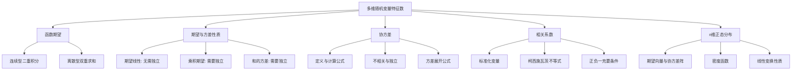

# 3.4 多维随机变量的特征数

> [!abstract] 本节概览
> 本节将[[2.2 数学期望|§2.2]]和[[2.3 方差与标准差|§2.3]]中一维随机变量的数字特征推广到多维情形。核心任务是研究==多个随机变量之间的线性关系度量==——从期望与方差的运算性质出发，引入==协方差==和==相关系数==两个关键概念，最终建立==n维正态分布==的完整框架。协方差和相关系数是刻画随机变量间线性关联程度的基石，在回归分析、主成分分析、多元统计分析中具有核心地位。
>
> **逻辑链条**：函数期望 → 期望方差性质 → 协方差 → 方差展开 → 相关系数 → n维正态分布
>
> **前置依赖**：[[3.1 多维随机变量及其联合分布|§3.1]]、[[3.2 边际分布与随机变量的独立性|§3.2]]、[[2.2 数学期望|§2.2]]、[[2.3 方差与标准差|§2.3]]
>
> **核心主线**：从一维数字特征出发，通过期望的线性性质（无需独立）和方差的展开性质（需要协方差项），引入协方差和相关系数来度量多维随机变量间的线性关系，最终推广到n维正态分布。

---

## 一、多维随机变量函数的期望

### 定义与公式

> [!def] 定义 3.4.1 — 多维随机变量函数的期望（公式3.4.1）
> 设 $(X, Y)$ 为二维随机变量，$g(x, y)$ 为二元连续函数。
>
> **离散型**：若 $(X, Y)$ 的联合分布律为 $P(X = x_i,\, Y = y_j) = p_{ij}$（$i, j = 1, 2, \ldots$），则
> $$
> E[g(X, Y)] = \sum_{i=1}^{+\infty} \sum_{j=1}^{+\infty} g(x_i, y_j)\, p_{ij}
> $$
>
> **连续型**：若 $(X, Y)$ 的联合密度函数为 $p(x, y)$，则
> $$
> E[g(X, Y)] = \iint_{\mathbb{R}^2} g(x, y)\, p(x, y)\, dx\, dy
> $$
>
> 当上述级数或积分==绝对收敛==时，期望存在。

### 边缘期望与边缘方差作为特例

定义 3.4.1 的强大之处在于：==不需要先求 $g(X, Y)$ 的分布==，直接用联合分布计算期望。

**边缘期望**是 $g(X, Y) = X$ 的特例：

$$
E(X) = \iint_{\mathbb{R}^2} x\, p(x, y)\, dx\, dy = \int_{-\infty}^{+\infty} x \left[\int_{-\infty}^{+\infty} p(x, y)\, dy\right] dx = \int_{-\infty}^{+\infty} x\, p_X(x)\, dx
$$

这正是用联合密度求边缘期望的过程——先对 $y$ 积分得到边缘密度 $p_X(x)$，再对 $x$ 积分。

**边缘方差**是 $g(X, Y) = (X - EX)^2$ 的特例：

$$
\text{Var}(X) = \iint_{\mathbb{R}^2} (x - EX)^2\, p(x, y)\, dx\, dy = \int_{-\infty}^{+\infty} (x - EX)^2\, p_X(x)\, dx
$$

> [!example] 例 3.4.1 — $E(\max\{X_1, X_2\})$，独立指数分布
> 设 $X_1, X_2$ 相互独立，$X_i \sim \text{Exp}(\lambda)$（$i = 1, 2$），求 $Y = \max\{X_1, X_2\}$ 的期望。
>
> **解**：先求 $Y$ 的分布函数。由[[3.3 多维随机变量函数的分布|§3.3]]最大值分布公式：
> $$
> F_Y(y) = P(Y \leq y) = P(X_1 \leq y)\,P(X_2 \leq y) = (1 - e^{-\lambda y})^2, \quad y > 0
> $$
>
> 利用非负随机变量期望的积分公式 $E(Y) = \displaystyle\int_0^{+\infty} (1 - F_Y(y))\,dy$：
> $$
> E(Y) = \int_0^{+\infty} \left[1 - (1 - e^{-\lambda y})^2\right] dy = \int_0^{+\infty} \left[1 - (1 - 2e^{-\lambda y} + e^{-2\lambda y})\right] dy
> $$
> $$
> = \int_0^{+\infty} (2e^{-\lambda y} - e^{-2\lambda y})\, dy = \frac{2}{\lambda} - \frac{1}{2\lambda} = \frac{3}{2\lambda}
> $$
>
> **验证**：$E(X_i) = 1/\lambda$，$E(\max\{X_1, X_2\}) = 3/(2\lambda) > 1/\lambda$，符合直觉——最大值倾向于比单个变量更大。

---

## 二、期望与方差的性质

### 期望的线性性质

> [!thm] 定理 3.4.2 — 期望的线性性质（无需独立）
> 对任意两个随机变量 $X, Y$（无论是否独立），只要期望存在，就有
> $$
> E(X + Y) = E(X) + E(Y)
> $$
>
> **推论**：对任意常数 $a, b$，$E(aX + bY) = aE(X) + bE(Y)$。

> [!abstract]
> **证明**：以连续型为例。设 $(X, Y)$ 的联合密度为 $p(x, y)$：
> $$
> E(X + Y) = \iint_{\mathbb{R}^2} (x + y)\, p(x, y)\, dx\, dy = \iint_{\mathbb{R}^2} x\, p(x, y)\, dx\, dy + \iint_{\mathbb{R}^2} y\, p(x, y)\, dx\, dy
> $$
> $$
> = E(X) + E(Y)
> $$
>
> 离散型类似，将积分改为求和。$\square$

**关键点**：期望的线性性质==不需要独立性==。这是因为期望本质上是"加权平均"，而加权平均天然满足线性性。

> [!thm] 定理 3.4.3 — 期望线性性质的推广
> 对任意 $n$ 个随机变量 $X_1, X_2, \ldots, X_n$（无论是否独立），只要期望存在，就有
> $$
> E\!\left(\sum_{i=1}^{n} X_i\right) = \sum_{i=1}^{n} E(X_i)
> $$
>
> 对任意常数 $a_1, a_2, \ldots, a_n$，$E\!\left(\sum_{i=1}^{n} a_i X_i\right) = \sum_{i=1}^{n} a_i E(X_i)$。

### 独立随机变量乘积的期望

> [!thm] 定理 3.4.4 — 独立随机变量乘积的期望
> 若 $X$ 与 $Y$ ==相互独立==，且期望存在，则
> $$
> E(XY) = E(X)\,E(Y)
> $$

> [!abstract]
> **证明**：以连续型为例。由独立性，联合密度等于边缘密度之积 $p(x, y) = p_X(x)\,p_Y(y)$：
> $$
> E(XY) = \iint_{\mathbb{R}^2} xy\, p(x, y)\, dx\, dy = \iint_{\mathbb{R}^2} xy\, p_X(x)\,p_Y(y)\, dx\, dy
> $$
> $$
> = \left(\int_{-\infty}^{+\infty} x\,p_X(x)\,dx\right)\left(\int_{-\infty}^{+\infty} y\,p_Y(y)\,dy\right) = E(X)\,E(Y)
> $$
>
> 离散型类似。$\square$

> [!thm] 定理 3.4.5 — 独立乘积期望的推广
> 若 $X_1, X_2, \ldots, X_n$ ==相互独立==，且期望存在，则
> $$
> E\!\left(\prod_{i=1}^{n} X_i\right) = \prod_{i=1}^{n} E(X_i)
> $$

### 独立随机变量和/差的方差

> [!thm] 定理 3.4.6 — 独立随机变量和/差的方差
> 若 $X$ 与 $Y$ ==相互独立==，则
> $$
> \text{Var}(X \pm Y) = \text{Var}(X) + \text{Var}(Y)
> $$

> [!abstract]
> **证明**：以 $\text{Var}(X + Y)$ 为例：
> $$
> \text{Var}(X + Y) = E[(X + Y - E(X + Y))^2] = E[(X - EX + Y - EY)^2]
> $$
> $$
> = E[(X - EX)^2 + 2(X - EX)(Y - EY) + (Y - EY)^2]
> $$
> $$
> = \text{Var}(X) + 2E[(X - EX)(Y - EY)] + \text{Var}(Y)
> $$
>
> 由独立性，$X - EX$ 与 $Y - EY$ 也独立（常数平移不改变独立性），故
> $$
> E[(X - EX)(Y - EY)] = E(X - EX)\,E(Y - EY) = 0 \cdot 0 = 0
> $$
>
> 因此 $\text{Var}(X + Y) = \text{Var}(X) + \text{Var}(Y)$。$\square$

**注意**：$\text{Var}(X - Y) = \text{Var}(X) + \text{Var}(Y)$ 中是 $+$ 号而非 $-$ 号！这是因为方差度量的是偏离程度，减法的偏离程度仍然叠加。

> [!tip] 推论 — 样本均值的方差
> 设 $X_1, X_2, \ldots, X_n$ 独立同分布，$E(X_i) = \mu$，$\text{Var}(X_i) = \sigma^2$，$\bar{X} = \dfrac{1}{n}\displaystyle\sum_{i=1}^{n} X_i$，则
> $$
> \text{Var}(\bar{X}) = \frac{\sigma^2}{n}
> $$
>
> **推导**：$\text{Var}(\bar{X}) = \text{Var}\!\left(\dfrac{1}{n}\displaystyle\sum_{i=1}^{n} X_i\right) = \dfrac{1}{n^2}\displaystyle\sum_{i=1}^{n} \text{Var}(X_i) = \dfrac{n\sigma^2}{n^2} = \dfrac{\sigma^2}{n}$。

> [!example] 例 3.4.2 — 线性组合的期望与方差
> 设 $X_1 \sim U(0, 6)$，$X_2 \sim N(1, 3)$，$X_3 \sim \text{Exp}(3)$，且三者相互独立。令 $Y = X_1 - 2X_2 + 3X_3$，求 $E(Y)$ 和 $\text{Var}(Y)$。
>
> **解**：
>
> **（1）求 $E(Y)$**：利用期望的线性性质（无需独立）：
> $$
> E(Y) = E(X_1) - 2E(X_2) + 3E(X_3) = 3 - 2 \times 1 + 3 \times \frac{1}{3} = 3 - 2 + 1 = 2
> $$
>
> 其中 $E(X_1) = \dfrac{0 + 6}{2} = 3$，$E(X_2) = 1$，$E(X_3) = \dfrac{1}{3}$。
>
> **（2）求 $\text{Var}(Y)$**：利用独立性和方差的数乘性质 $\text{Var}(aX) = a^2\text{Var}(X)$：
> $$
> \text{Var}(Y) = \text{Var}(X_1) + 4\text{Var}(X_2) + 9\text{Var}(X_3)
> $$
>
> 其中 $\text{Var}(X_1) = \dfrac{(6-0)^2}{12} = 3$，$\text{Var}(X_2) = 3$，$\text{Var}(X_3) = \dfrac{1}{3^2} = \dfrac{1}{9}$。
>
> $$
> \text{Var}(Y) = 3 + 4 \times 3 + 9 \times \frac{1}{9} = 3 + 12 + 1 = 16
> $$

---

## 三、协方差

### 定义

> [!def] 定义 3.4.2 — 协方差（公式3.4.7）
> 设 $(X, Y)$ 为二维随机变量，若 $E[(X - EX)(Y - EY)]$ 存在，则称之为 $X$ 与 $Y$ 的==协方差==，记为
> $$
> \text{Cov}(X, Y) = E[(X - EX)(Y - EY)]
> $$

### 计算公式

展开定义式，利用期望的线性性质：

$$
\text{Cov}(X, Y) = E[XY - X \cdot EY - Y \cdot EX + EX \cdot EY] = E(XY) - EX \cdot EY - EY \cdot EX + EX \cdot EY

\boxed{\text{Cov}(X, Y) = E(XY) - E(X)\,E(Y)}
$$

这个计算公式比定义式更实用——只需计算 $E(XY)$、$E(X)$、$E(Y)$ 三个量。

### 协方差的含义

协方差度量的是 $X$ 和 $Y$ ==共同偏离各自均值的趋势==：

- $\text{Cov}(X, Y) > 0$：$X$ 大于均值时 $Y$ 也倾向于大于均值（==同向变化==）
- $\text{Cov}(X, Y) < 0$：$X$ 大于均值时 $Y$ 倾向于小于均值（==反向变化==）
- $\text{Cov}(X, Y) = 0$：$X$ 和 $Y$ 之间==没有线性关系==（但可能有非线性关系）

**生活类比**：协方差就像衡量两个人的消费习惯是否同步。如果一个人花钱多时另一个人也花钱多，协方差为正；如果一个人节俭时另一个人奢侈，协方差为负。

### 不相关与独立的关系

> [!important] 不相关与独立
> - **不相关**：$\text{Cov}(X, Y) = 0$（即 $E(XY) = E(X)E(Y)$）
> - **独立**：$p(x, y) = p_X(x)\,p_Y(y)$（联合分布等于边缘分布之积）
>
> **关系**：
> - $X$ 与 $Y$ 独立 $\Longrightarrow$ $X$ 与 $Y$ 不相关（由定理 3.4.4 直接得出）
> - $X$ 与 $Y$ 不相关 $\centernot\Longrightarrow$ $X$ 与 $Y$ 独立（一般情形下不成立！）
> - ==二维正态分布==是例外：不相关 $\Longleftrightarrow$ 独立

> [!example] 例 3.4.3 — 协方差的计算
> 设 $(X, Y)$ 的联合密度为 $p(x, y) = 3x$（$0 < y < x < 1$），求 $\text{Cov}(X, Y)$。
>
> **解**：
>
> **（1）求 $E(X)$**：
> $$
> E(X) = \int_0^1 \int_0^x x \cdot 3x\, dy\, dx = \int_0^1 3x^2 \cdot x\, dx = \int_0^1 3x^3\, dx = \frac{3}{4}
> $$
>
> **（2）求 $E(Y)$**：
> $$
> E(Y) = \int_0^1 \int_0^x y \cdot 3x\, dy\, dx = \int_0^1 3x \cdot \frac{x^2}{2}\, dx = \frac{3}{2}\int_0^1 x^3\, dx = \frac{3}{8}
> $$
>
> **（3）求 $E(XY)$**：
> $$
> E(XY) = \int_0^1 \int_0^x xy \cdot 3x\, dy\, dx = \int_0^1 3x^2 \left[\int_0^x y\, dy\right] dx = \int_0^1 3x^2 \cdot \frac{x^2}{2}\, dx = \frac{3}{2}\int_0^1 x^4\, dx = \frac{3}{2} \cdot \frac{1}{5} = \frac{3}{10}
> $$
>
> **（4）计算协方差**：
> $$
> \text{Cov}(X, Y) = E(XY) - E(X)\,E(Y) = \frac{3}{10} - \frac{3}{4} \cdot \frac{3}{8} = \frac{3}{10} - \frac{9}{32} = \frac{96 - 90}{320} = \frac{3}{64}
> $$

---

## 四、方差展开与协方差性质

### 一般方差展开公式

> [!thm] 定理 3.4.7 — 方差展开公式（公式3.4.8）
> 对任意两个随机变量 $X, Y$（不要求独立），有
> $$
> \text{Var}(X \pm Y) = \text{Var}(X) + \text{Var}(Y) \pm 2\text{Cov}(X, Y)
> $$

> [!abstract]
> **证明**：以 $\text{Var}(X + Y)$ 为例：
> $$
> \text{Var}(X + Y) = E[(X + Y - E(X + Y))^2] = E[(X - EX + Y - EY)^2]
> $$
> $$
> = E[(X - EX)^2 + 2(X - EX)(Y - EY) + (Y - EY)^2]
> $$
> $$
> = E[(X - EX)^2] + 2E[(X - EX)(Y - EY)] + E[(Y - EY)^2]
> $$
> $$
> = \text{Var}(X) + 2\text{Cov}(X, Y) + \text{Var}(Y)
> $$
>
> $\text{Var}(X - Y)$ 类似，交叉项取负号。$\square$

**与定理 3.4.6 的关系**：当 $X$ 与 $Y$ 独立时，$\text{Cov}(X, Y) = 0$，定理 3.4.7 退化为定理 3.4.6。因此定理 3.4.7 是更一般的公式。

> [!thm] 定理 3.4.8 — n个随机变量和的方差（公式3.4.9）
> $$
> \text{Var}\!\left(\sum_{i=1}^{n} X_i\right) = \sum_{i=1}^{n} \text{Var}(X_i) + 2\sum_{1 \leq i < j \leq n} \text{Cov}(X_i, X_j)
> $$

**记忆方式**：展开 $(X_1 + \cdots + X_n)^2$ 的交叉项，每个 $\text{Cov}(X_i, X_j)$ 出现两次（$i < j$ 和 $j < i$），所以乘以 2。

### 协方差的运算性质

> [!thm] 协方差的四条运算性质
>
> **（1）对称性**：$\text{Cov}(X, Y) = \text{Cov}(Y, X)$
>
> **（2）常数协方差为零**：$\text{Cov}(X, a) = 0$（$a$ 为常数）
>
> **（3）数乘性质**：$\text{Cov}(aX, bY) = ab\,\text{Cov}(X, Y)$（$a, b$ 为常数）
>
> **（4）分配律（双线性）**：$\text{Cov}(X_1 + X_2, Y) = \text{Cov}(X_1, Y) + \text{Cov}(X_2, Y)$

> [!abstract]
> **证明**：
>
> （1）由定义直接得出：$E[(X - EX)(Y - EY)] = E[(Y - EY)(X - EX)]$。
>
> （2）$\text{Cov}(X, a) = E[(X - EX)(a - a)] = E[0] = 0$。
>
> （3）$\text{Cov}(aX, bY) = E[(aX - aEX)(bY - bEY)] = ab\,E[(X - EX)(Y - EY)] = ab\,\text{Cov}(X, Y)$。
>
> （4）$\text{Cov}(X_1 + X_2, Y) = E[(X_1 + X_2 - E(X_1 + X_2))(Y - EY)]$
> $= E[(X_1 - EX_1 + X_2 - EX_2)(Y - EY)]$
> $= E[(X_1 - EX_1)(Y - EY)] + E[(X_2 - EX_2)(Y - EY)]$
> $= \text{Cov}(X_1, Y) + \text{Cov}(X_2, Y)$。$\square$

> [!example] 例 3.4.4 — 方差展开的完整计算
> 设 $(X, Y)$ 的联合密度为 $p(x, y) = \dfrac{x + y}{3}$（$0 < x < 1$，$0 < y < 2$），求 $\text{Var}(2X - 3Y + 8)$。
>
> **解**：由方差展开公式（常数不影响方差）：
> $$
> \text{Var}(2X - 3Y + 8) = \text{Var}(2X - 3Y) = 4\text{Var}(X) + 9\text{Var}(Y) - 12\text{Cov}(X, Y)
> $$
>
> **（1）求边缘密度和各阶矩**：
>
> $p_X(x) = \displaystyle\int_0^2 \frac{x + y}{3}\, dy = \frac{2x + 2}{3} = \frac{2(x + 1)}{3}$（$0 < x < 1$）
>
> $p_Y(y) = \displaystyle\int_0^1 \frac{x + y}{3}\, dx = \frac{1 + 2y}{6}$（$0 < y < 2$）
>
> **（2）求 $E(X)$、$E(X^2)$**：
> $$
> E(X) = \int_0^1 x \cdot \frac{2(x+1)}{3}\, dx = \frac{2}{3}\int_0^1 (x^2 + x)\, dx = \frac{2}{3} \cdot \frac{5}{6} = \frac{5}{9}
> $$
> $$
> E(X^2) = \int_0^1 x^2 \cdot \frac{2(x+1)}{3}\, dx = \frac{2}{3}\int_0^1 (x^3 + x^2)\, dx = \frac{2}{3} \cdot \frac{7}{12} = \frac{7}{18}
> $$
> $$
> \text{Var}(X) = E(X^2) - [E(X)]^2 = \frac{7}{18} - \frac{25}{81} = \frac{63 - 50}{162} = \frac{13}{162}
> $$
>
> **（3）求 $E(Y)$、$E(Y^2)$**：
> $$
> E(Y) = \int_0^2 y \cdot \frac{1 + 2y}{6}\, dy = \frac{1}{6}\int_0^2 (y + 2y^2)\, dy = \frac{1}{6} \cdot \frac{22}{3} = \frac{11}{9}
> $$
> $$
> E(Y^2) = \int_0^2 y^2 \cdot \frac{1 + 2y}{6}\, dy = \frac{1}{6}\int_0^2 (y^2 + 2y^3)\, dy = \frac{1}{6} \cdot \frac{44}{3} = \frac{22}{9}
> $$
> $$
> \text{Var}(Y) = E(Y^2) - [E(Y)]^2 = \frac{22}{9} - \frac{121}{81} = \frac{198 - 121}{81} = \frac{77}{81}
> $$
>
> **（4）求 $E(XY)$ 和 $\text{Cov}(X, Y)$**：
> $$
> E(XY) = \int_0^1 \int_0^2 xy \cdot \frac{x + y}{3}\, dy\, dx = \frac{1}{3}\int_0^1 \int_0^2 (x^2y + xy^2)\, dy\, dx
> $$
> $$
> = \frac{1}{3}\int_0^1 \left[x^2 \cdot 2 + x \cdot \frac{8}{3}\right] dx = \frac{1}{3}\int_0^1 \left(2x^2 + \frac{8}{3}x\right) dx = \frac{1}{3}\left(\frac{2}{3} + \frac{4}{3}\right) = \frac{2}{9}
> $$
> $$
> \text{Cov}(X, Y) = E(XY) - E(X)\,E(Y) = \frac{2}{9} - \frac{5}{9} \cdot \frac{11}{9} = \frac{2}{9} - \frac{55}{81} = \frac{18 - 55}{81} = -\frac{37}{81}
> $$
>
> **（5）最终结果**：
> $$
> \text{Var}(2X - 3Y + 8) = 4 \cdot \frac{13}{162} + 9 \cdot \frac{77}{81} - 12 \cdot \left(-\frac{37}{81}\right) = \frac{52}{162} + \frac{693}{81} + \frac{444}{81}
> $$
> $$
> = \frac{26}{81} + \frac{693}{81} + \frac{444}{81} = \frac{1163}{81}
> $$

---

## 五、相关系数

### 定义

> [!def] 定义 3.4.3 — 相关系数（公式3.4.10）
> 设 $\text{Var}(X) > 0$，$\text{Var}(Y) > 0$，则 $X$ 与 $Y$ 的==（皮尔逊）相关系数==定义为
> $$
> \text{Corr}(X, Y) = \rho_{XY} = \frac{\text{Cov}(X, Y)}{\sigma_X \cdot \sigma_Y} = \frac{\text{Cov}(X, Y)}{\sqrt{\text{Var}(X)}\,\sqrt{\text{Var}(Y)}}
> $$
>
> 其中 $\sigma_X = \sqrt{\text{Var}(X)}$，$\sigma_Y = \sqrt{\text{Var}(Y)}$。

### 标准化变量的解释

定义==标准化变量==：$X^* = \dfrac{X - EX}{\sigma_X}$，$Y^* = \dfrac{Y - EY}{\sigma_Y}$。

标准化变量满足 $E(X^*) = E(Y^*) = 0$，$\text{Var}(X^*) = \text{Var}(Y^*) = 1$。

此时：

$$
\text{Corr}(X, Y) = E(X^* Y^*)
$$

即相关系数等于标准化变量的乘积期望。这揭示了相关系数的本质：==协方差除以标准差后的标准化版本==，消除了量纲的影响。

### 二维正态分布中 $\rho$ 的含义

在[[3.1 多维随机变量及其联合分布|§3.1]]的二维正态分布 $N(\mu_1, \mu_2; \sigma_1^2, \sigma_2^2; \rho)$ 中，参数 $\rho$ 正是 $X$ 与 $Y$ 的相关系数。$\rho$ 的取值决定了联合密度的等高线形状：
- $\rho = 0$：等高线为圆（两个方向等程度伸展）
- $|\rho| \to 1$：等高线被压扁为狭长椭圆（强线性关系）

### 柯西-施瓦茨不等式

> [!thm] 定理 3.4.9 — 柯西-施瓦茨不等式（公式3.4.11）
> 对任意两个随机变量 $X, Y$，有
> $$
> [\text{Cov}(X, Y)]^2 \leq \text{Var}(X)\,\text{Var}(Y)
> $$

> [!abstract]
> **证明思路**：构造关于 $t$ 的二次函数
> $$
> g(t) = E[(X - EX + t(Y - EY))^2] = \text{Var}(X) + 2t\,\text{Cov}(X, Y) + t^2\,\text{Var}(Y)
> $$
>
> 由于 $g(t) \geq 0$ 对一切实数 $t$ 成立（平方的期望非负），故判别式 $\Delta \leq 0$：
> $$
> [2\text{Cov}(X, Y)]^2 - 4\,\text{Var}(X)\,\text{Var}(Y) \leq 0
> $$
>
> 即 $[\text{Cov}(X, Y)]^2 \leq \text{Var}(X)\,\text{Var}(Y)$。$\square$

> [!tip] 推论 — 相关系数的取值范围
> 由柯西-施瓦茨不等式直接得到
> $$
> |\text{Corr}(X, Y)| = \frac{|\text{Cov}(X, Y)|}{\sigma_X \sigma_Y} \leq 1
> $$

### 相关系数等于 $\pm 1$ 的条件

> [!thm] 定理 3.4.10 — $|\rho| = 1$ 的充要条件
> $$
> |\text{Corr}(X, Y)| = 1 \iff P(Y = aX + b) = 1 \quad (a \neq 0)
> $$
>
> 即相关系数的绝对值等于 1 当且仅当 $X$ 与 $Y$ 以概率 1 具有==线性关系==。

> [!abstract]
> **证明思路**：$|\rho| = 1$ 等价于柯西-施瓦茨不等式取等号，等价于二次函数 $g(t)$ 有重根 $t = t_0$，即 $g(t_0) = 0$。而 $g(t_0) = E[(X - EX + t_0(Y - EY))^2] = 0$ 意味着 $X - EX + t_0(Y - EY) = 0$ 几乎必然成立，即 $Y = aX + b$ 几乎必然成立。$\square$

### 相关系数的几何意义

| $\rho$ 的值 | 含义 | 散点图特征 |
|:---:|:---|:---|
| $\rho = 1$ | 完全正线性相关 | 所有点在一条上升直线上 |
| $0 < \rho < 1$ | 正部分线性相关 | 点大致沿上升趋势分布 |
| $\rho = 0$ | 无线性相关 | 点无明显的线性趋势 |
| $-1 < \rho < 0$ | 负部分线性相关 | 点大致沿下降趋势分布 |
| $\rho = -1$ | 完全负线性相关 | 所有点在一条下降直线上 |

> [!example] 例 3.4.5 — 相关系数的计算
> 设 $(X, Y)$ 的联合密度为 $p(x, y) = \dfrac{8}{3}$（$0 < x - y < 0.5$，$0 < x, y < 1$），求 $\text{Corr}(X, Y)$。
>
> **解**：需要计算 $E(X)$、$E(Y)$、$\text{Var}(X)$、$\text{Var}(Y)$、$\text{Cov}(X, Y)$。
>
> **（1）确定积分区域**：条件 $0 < x - y < 0.5$ 等价于 $y < x < y + 0.5$，结合 $0 < x, y < 1$。
>
> 分两种情况：
> - 当 $0 < y < 0.5$ 时：$y < x < y + 0.5$（$y + 0.5 < 1$ 自动满足）
> - 当 $0.5 \leq y < 1$ 时：$y < x < 1$（因为 $y + 0.5 > 1$，被 $x < 1$ 截断）
>
> **（2）求 $E(X)$**：
> $$
> E(X) = \frac{8}{3}\left[\int_0^{0.5}\int_y^{y+0.5} x\, dx\, dy + \int_{0.5}^1 \int_y^1 x\, dx\, dy\right]
> $$
>
> 内层积分 $\displaystyle\int_y^{y+0.5} x\, dx = \frac{(y+0.5)^2 - y^2}{2} = \frac{y + 0.25}{2}$
>
> $\displaystyle\int_y^1 x\, dx = \frac{1 - y^2}{2}$
>
> $$
> E(X) = \frac{8}{3}\left[\int_0^{0.5} \frac{y + 0.25}{2}\, dy + \int_{0.5}^1 \frac{1 - y^2}{2}\, dy\right]
> $$
> $$
> = \frac{8}{3}\left[\frac{1}{2}\left(\frac{0.125 + 0.125}{2}\right) + \frac{1}{2}\left(0.5 - \frac{7}{24}\right)\right] = \frac{8}{3}\left[\frac{0.125}{2} + \frac{5}{48}\right] = \frac{8}{3} \cdot \frac{11}{48} = \frac{11}{18}
> $$
>
> **（3）求 $E(Y)$**：
> $$
> E(Y) = \frac{8}{3}\left[\int_0^{0.5}\int_y^{y+0.5} y\, dx\, dy + \int_{0.5}^1 \int_y^1 y\, dx\, dy\right]
> $$
> $$
> = \frac{8}{3}\left[\int_0^{0.5} 0.5y\, dy + \int_{0.5}^1 y(1 - y)\, dy\right]
> $$
> $$
> = \frac{8}{3}\left[\frac{0.5 \times 0.125}{2} + \left(\frac{3}{8} - \frac{7}{24}\right)\right] = \frac{8}{3}\left[\frac{1}{32} + \frac{1}{24}\right] = \frac{8}{3} \cdot \frac{7}{96} = \frac{7}{36}
> $$
>
> **（4）求 $E(X^2)$、$E(Y^2)$、$E(XY)$**（类似方法，利用二重积分计算）：
>
> $$
> E(X^2) = \frac{8}{3}\left[\int_0^{0.5}\int_y^{y+0.5} x^2\, dx\, dy + \int_{0.5}^1 \int_y^1 x^2\, dx\, dy\right] = \frac{53}{108}
> $$
>
> $$
> E(Y^2) = \frac{8}{3}\left[\int_0^{0.5}\int_y^{y+0.5} y^2\, dx\, dy + \int_{0.5}^1 \int_y^1 y^2\, dx\, dy\right] = \frac{5}{27}
> $$
>
> $$
> E(XY) = \frac{8}{3}\left[\int_0^{0.5}\int_y^{y+0.5} xy\, dx\, dy + \int_{0.5}^1 \int_y^1 xy\, dx\, dy\right] = \frac{43}{144}
> $$
>
> **（5）计算方差和协方差**：
> $$
> \text{Var}(X) = \frac{53}{108} - \left(\frac{11}{18}\right)^2 = \frac{53}{108} - \frac{121}{324} = \frac{159 - 121}{324} = \frac{38}{324} = \frac{19}{162}
> $$
>
> $$
> \text{Var}(Y) = \frac{5}{27} - \left(\frac{7}{36}\right)^2 = \frac{5}{27} - \frac{49}{1296} = \frac{240 - 49}{1296} = \frac{191}{1296}
> $$
>
> $$
> \text{Cov}(X, Y) = \frac{43}{144} - \frac{11}{18} \cdot \frac{7}{36} = \frac{43}{144} - \frac{77}{648} = \frac{1293 - 1104}{3888} = \frac{189}{3888} = \frac{7}{144}
> $$
>
> **（6）计算相关系数**：
> $$
> \text{Corr}(X, Y) = \frac{\text{Cov}(X, Y)}{\sqrt{\text{Var}(X)}\,\sqrt{\text{Var}(Y)}} = \frac{7/144}{\sqrt{19/162} \cdot \sqrt{191/1296}} = \frac{7/144}{\sqrt{19 \times 191}/(162 \times 36)}
> $$
> $$
> = \frac{7 \times 162 \times 36}{144 \times \sqrt{3629}} = \frac{7 \times 81 \times 2}{8 \times \sqrt{3629}} = \frac{1134}{8\sqrt{3629}} = \frac{567}{4\sqrt{3629}} \approx 0.742
> $$

---

## 六、n维正态分布

### 期望向量与协方差矩阵

> [!def] 定义 3.4.4 — 期望向量与协方差矩阵
> 设 $\mathbf{X} = (X_1, X_2, \ldots, X_n)^\top$ 为 $n$ 维随机向量，则
>
> **期望向量**：
> $$
> E(\mathbf{X}) = \boldsymbol{\mu} = (E(X_1), E(X_2), \ldots, E(X_n))^\top
> $$
>
> **协方差矩阵**：
> $$
> \text{Cov}(\mathbf{X}) = \boldsymbol{\Sigma} = (\sigma_{ij})_{n \times n}
> $$
>
> 其中 $\sigma_{ij} = \text{Cov}(X_i, X_j) = E[(X_i - EX_i)(X_j - EX_j)]$，特别地 $\sigma_{ii} = \text{Var}(X_i)$。
>
> 协方差矩阵是对称矩阵：$\sigma_{ij} = \sigma_{ji}$。

### n维正态分布的密度函数

> [!def] 定义 3.4.5 — n维正态分布（公式3.4.13）
> 若 $n$ 维随机向量 $\mathbf{X}$ 的联合密度函数为
> $$
> p(\mathbf{x}) = (2\pi)^{-n/2}\,|\mathbf{B}|^{-1/2}\,\exp\!\left\{-\frac{1}{2}(\mathbf{x} - \mathbf{a})^\top \mathbf{B}^{-1}(\mathbf{x} - \mathbf{a})\right\}
> $$
>
> 其中 $\mathbf{a} = (a_1, \ldots, a_n)^\top$ 为期望向量，$\mathbf{B} = (\sigma_{ij})_{n \times n}$ 为正定协方差矩阵，$|\mathbf{B}|$ 为 $\mathbf{B}$ 的行列式，则称 $\mathbf{X}$ 服从 $n$ 维正态分布，记为 $\mathbf{X} \sim N_n(\mathbf{a}, \mathbf{B})$。

**参数含义**：
- $\mathbf{a}$：$n$ 个分量的期望值组成的向量
- $\mathbf{B}$：$n \times n$ 协方差矩阵，对角线元素为各分量的方差，非对角线元素为两两协方差

### 线性变换性质

> [!thm] 定理 3.4.11 — n维正态分布的线性变换性质
> 若 $\mathbf{X} \sim N_n(\boldsymbol{\mu}, \boldsymbol{\Sigma})$，$\mathbf{A}$ 为 $m \times n$ 常数矩阵（$m \leq n$），$\mathbf{b}$ 为 $m \times 1$ 常数向量，则
> $$
> \mathbf{Y} = \mathbf{A}\mathbf{X} + \mathbf{b} \sim N_m(\mathbf{A}\boldsymbol{\mu} + \mathbf{b},\, \mathbf{A}\boldsymbol{\Sigma}\mathbf{A}^\top)
> $$

**推论**：若 $(X_1, X_2)$ 服从二维正态分布，则 $X_1$ 和 $X_2$ 的任何线性组合 $aX_1 + bX_2$ 仍服从（一维）正态分布。

> [!example] 例 3.4.6 — 不相关不等于独立的反例
> 设 $\varphi(x)$ 为标准正态密度函数，$g(x) = \dfrac{1}{\sqrt{2\pi}}e^{-x^2/2}\cos(2\pi x)$。定义
> $$
> p(x, y) = \varphi(x)\,\varphi(y) + \frac{1}{2\pi}\,e^{-\pi^2}\,g(x)\,g(y)
> $$
>
> **（1）验证边缘分布**：对 $y$ 积分，由于 $\displaystyle\int_{-\infty}^{+\infty} g(y)\,dy = 0$（$g$ 是奇函数的变形），得
> $$
> p_X(x) = \varphi(x)\int_{-\infty}^{+\infty}\varphi(y)\,dy + \frac{e^{-\pi^2}}{2\pi}\,g(x)\int_{-\infty}^{+\infty}g(y)\,dy = \varphi(x)
> $$
>
> 同理 $p_Y(y) = \varphi(y)$。因此 $X \sim N(0, 1)$，$Y \sim N(0, 1)$。
>
> **（2）验证不相关**：
> $$
> E(XY) = \iint_{\mathbb{R}^2} xy\,p(x,y)\,dx\,dy = E(X)E(Y) + \frac{e^{-\pi^2}}{2\pi}\left(\int_{-\infty}^{+\infty} xg(x)\,dx\right)\left(\int_{-\infty}^{+\infty} yg(y)\,dy\right)
> $$
>
> 由于 $E(X) = E(Y) = 0$，且 $xg(x)$ 是奇函数（$g$ 为偶函数），$\displaystyle\int_{-\infty}^{+\infty} xg(x)\,dx = 0$，故 $E(XY) = 0$。
>
> 因此 $\text{Cov}(X, Y) = E(XY) - E(X)E(Y) = 0$，$\text{Corr}(X, Y) = 0$。
>
> **（3）但不独立**：可以验证 $p(x, y) \neq \varphi(x)\,\varphi(y)$（第二项不为零），故 $X$ 与 $Y$ 不独立。
>
> **结论**：$X$ 和 $Y$ 各自服从标准正态分布且不相关，但==不独立==。这说明"各自正态 + 不相关"不能推出独立，必须"联合正态"才行。

---

## 七、知识结构总览

---

## 八、核心思想与证明技巧

### 期望线性性质不要求独立性

这是本节最重要的对比之一：

| 性质 | 是否需要独立 | 原因 |
|:---|:---:|:---|
| $E(X + Y) = E(X) + E(Y)$ | 否 | 期望是加权平均，天然满足线性性 |
| $E(XY) = E(X)E(Y)$ | 是 | 需要将联合分布分解为边缘分布之积 |
| $\text{Var}(X + Y) = \text{Var}(X) + \text{Var}(Y)$ | 是 | 展开后的交叉项 $\text{Cov}(X,Y)$ 只有独立时才为零 |

**记忆口诀**：期望加法无条件，乘积方差需独立。

### 协方差是"标准化前的相关系数"

协方差和相关系数度量的是同一个东西——线性关系强度，但尺度不同：

- **协方差** $\text{Cov}(X, Y)$：有量纲（$X$ 的单位 $\times$ $Y$ 的单位），大小受变量尺度影响
- **相关系数** $\text{Corr}(X, Y)$：无量纲，取值在 $[-1, 1]$ 之间，具有可比性

类比：协方差像"身高与体重的协方差"（单位 cm$\cdot$kg），相关系数像"身高与体重的相关程度"（纯数字）。

### 柯西-施瓦茨不等式的证明思路

核心技巧是==构造非负二次函数==：

1. 考虑 $g(t) = E[(X^* + tY^*)^2] \geq 0$，其中 $X^* = X - EX$，$Y^* = Y - EY$
2. 展开得 $g(t) = \text{Var}(X) + 2t\,\text{Cov}(X,Y) + t^2\,\text{Var}(Y)$
3. 非负二次函数的判别式 $\Delta \leq 0$
4. 得到 $[\text{Cov}(X,Y)]^2 \leq \text{Var}(X)\,\text{Var}(Y)$

这个技巧在概率论中反复出现（如证明 $|\rho| \leq 1$），值得熟练掌握。

---

## 九、补充理解与易混淆点

### 期望线性性质与独立性

**来源**：茆诗松教材§3.4 + 卡方核心笔记 + 概率论考研真题 + 课堂讨论 + 统计学入门教材

> [!danger] 误区1："期望的线性性质需要独立性"
> ❌ 错误解释：$E(X + Y) = E(X) + E(Y)$ 和 $E(XY) = E(X)E(Y)$ 都需要 $X$ 与 $Y$ 独立。
> ✅ 正确解释：$E(X + Y) = E(X) + E(Y)$ ==不需要独立性==，这是期望作为"加权平均"的天然性质。但 $E(XY) = E(X)E(Y)$ ==确实需要独立性==。两者条件不同，不可混淆。

### 协方差为零与独立

**来源**：茆诗松教材§3.4 + 卡方核心笔记 + 概率论考研常见错题 + 数理统计教材 + 线性代数教材

> [!danger] 误区2："协方差为零意味着独立"
> ❌ 错误解释：$\text{Cov}(X, Y) = 0$ 说明 $X$ 和 $Y$ 之间没有任何关系，因此独立。
> ✅ 正确解释：$\text{Cov}(X, Y) = 0$ 只说明 $X$ 和 $Y$ 之间==没有线性关系==（不相关），但可能存在非线性关系。独立 $\Rightarrow$ 不相关，但不相关 $\centernot\Rightarrow$ 独立。==唯一的例外是联合正态分布==：在联合正态下，不相关等价于独立。

### 相关系数为零的含义

**来源**：茆诗松教材§3.4 + 卡方核心笔记 + 回归分析教材 + 考研真题解析 + 数据科学入门教材

> [!danger] 误区3："相关系数为零意味着没有任何关系"
> ❌ 错误解释：$\text{Corr}(X, Y) = 0$ 说明 $X$ 和 $Y$ 完全无关，互不影响。
> ✅ 正确解释：相关系数只度量==线性关系==。$\rho = 0$ 只排除线性关系，$X$ 和 $Y$ 之间可能存在==非线性关系==（如 $Y = X^2$）。经典反例：$X \sim U(-1, 1)$，$Y = X^2$，则 $\text{Cov}(X, Y) = 0$（因为 $X$ 对称，$E(X^3) = 0$），但 $Y$ 完全由 $X$ 决定。

### 方差的可加性条件

**来源**：茆诗松教材§3.4 + 卡方核心笔记 + 概率论考研真题 + 课堂练习 + 概率论进阶教材

> [!danger] 误区4："方差性质 $\text{Var}(X+Y)=\text{Var}(X)+\text{Var}(Y)$ 总成立"
> ❌ 错误解释：方差的加法公式和期望的加法公式一样，不需要任何条件。
> ✅ 正确解释：$\text{Var}(X + Y) = \text{Var}(X) + \text{Var}(Y)$ 需要==独立性==（或至少 $\text{Cov}(X,Y) = 0$）。一般公式为 $\text{Var}(X + Y) = \text{Var}(X) + \text{Var}(Y) + 2\text{Cov}(X,Y)$，只有当协方差项为零时才能简化。==注意 $\text{Var}(X - Y)$ 也是加号==：$\text{Var}(X - Y) = \text{Var}(X) + \text{Var}(Y) - 2\text{Cov}(X,Y)$。

### 正态变量线性组合的条件

**来源**：茆诗松教材§3.4 + 卡方核心笔记 + 概率论考研常见错题 + 数理统计教材 + 多元统计分析教材

> [!danger] 误区5："正态变量的线性组合一定服从正态分布"
> ❌ 错误解释：只要 $X$ 和 $Y$ 都服从正态分布，$aX + bY$ 就一定服从正态分布。
> ✅ 正确解释：$aX + bY \sim N(\cdot, \cdot)$ 需要 $X$ 和 $Y$ ==独立==或==联合正态==。如果 $X$ 和 $Y$ 各自正态但不独立（即不联合正态），线性组合不一定正态。反例见例 3.4.6。定理 3.4.11 的条件是"$(X_1, \ldots, X_n)$ 服从 $n$ 维正态分布"，即要求==联合正态==，而不仅仅是边缘正态。

---

## 十、习题精选

> [!todo] 习题概览
>
> | 编号 | 来源 | 知识点 | 方法 | 难度 |
> |:---:|:---|:---|:---|:---:|
> | 1 | 教材3.4-1 | $E(X+Y)$ 的计算 | 期望线性性质 | ★★☆ |
> | 2 | 教材3.4-3 | $E(XY)$ 与独立性的关系 | 乘积期望 | ★★☆ |
> | 3 | 教材3.4-5 | $\text{Cov}(X,Y)$ 的计算 | 协方差计算公式 | ★★★ |
> | 4 | 教材3.4-7 | $\text{Var}(X+Y)$ 的计算 | 方差展开公式 | ★★★ |
> | 5 | 教材3.4-9 | $\text{Corr}(X,Y)$ 的计算 | 相关系数定义 | ★★★ |
> | 6 | 教材3.4-12 | $n$维正态分布的性质 | 线性变换性质 | ★★★★ |
> | 7 | 2022东北财经大学432 | $X+Y$ 的方差 | 联合分布+协方差 | ★★☆ |
> | 8 | 2019北京大学432 | 条件分布+联合分布+边际分布 | 重期望+方差恒等式 | ★★★★ |
> | 9 | 2019北京大学431 | $X+Y$ 和 $X-Y$ 独立的充要条件 | 正态下不相关等价独立 | ★★★ |
> | 10 | 2020东北大学432 | 正态分布线性组合+$F$分布 | 线性组合+卡方分布 | ★★★ |

> [!problem] 习题1 — 教材3.4-1：$E(X+Y)$ 的计算 ★★☆
> 设 $(X, Y)$ 的联合分布律如下表，求 $E(X + Y)$。
>
> | $X \setminus Y$ | $0$ | $1$ | $2$ |
> |:---:|:---:|:---:|:---:|
> | $0$ | $0.1$ | $0.2$ | $0.1$ |
> | $1$ | $0.3$ | $0.2$ | $0.1$ |

> [!faq]- 查看解答
> **解**：利用期望的线性性质 $E(X + Y) = E(X) + E(Y)$。
>
> **求 $E(X)$**：
> $$
> E(X) = 0 \times (0.1 + 0.2 + 0.1) + 1 \times (0.3 + 0.2 + 0.1) = 0 + 0.6 = 0.6
> $$
>
> **求 $E(Y)$**：
> $$
> E(Y) = 0 \times (0.1 + 0.3) + 1 \times (0.2 + 0.2) + 2 \times (0.1 + 0.1) = 0 + 0.4 + 0.4 = 0.8
> $$
>
> $$
> E(X + Y) = 0.6 + 0.8 = 1.4
> $$
>
> **验证**：直接计算 $E(X + Y)$：
> $$
> E(X+Y) = 0 \times 0.1 + 1 \times 0.2 + 2 \times 0.1 + 1 \times 0.3 + 2 \times 0.2 + 3 \times 0.1 = 0 + 0.2 + 0.2 + 0.3 + 0.4 + 0.3 = 1.4 \checkmark
> $$

> [!problem] 习题2 — 教材3.4-3：$E(XY)$ 与独立性的关系 ★★☆
> 设 $(X, Y)$ 的联合密度为 $p(x, y) = 6x$（$0 < x < y < 1$），判断 $X$ 与 $Y$ 是否独立，并计算 $E(XY)$。

> [!faq]- 查看解答
> **解**：
>
> **（1）判断独立性**：求边缘密度。
>
> $p_X(x) = \displaystyle\int_x^1 6x\, dy = 6x(1 - x)$（$0 < x < 1$）
>
> $p_Y(y) = \displaystyle\int_0^y 6x\, dx = 3y^2$（$0 < y < 1$）
>
> $p_X(x) \cdot p_Y(y) = 6x(1-x) \cdot 3y^2 = 18x(1-x)y^2 \neq 6x = p(x, y)$
>
> 因此 $X$ 与 $Y$ ==不独立==。
>
> **（2）计算 $E(XY)$**：
> $$
> E(XY) = \int_0^1 \int_x^1 xy \cdot 6x\, dy\, dx = \int_0^1 6x^2 \cdot \frac{1 - x^2}{2}\, dx = 3\int_0^1 (x^2 - x^4)\, dx = 3\left(\frac{1}{3} - \frac{1}{5}\right) = 3 \cdot \frac{2}{15} = \frac{2}{5}
> $$
>
> **（3）验证**：$E(X) = \displaystyle\int_0^1 x \cdot 6x(1-x)\, dx = 6\int_0^1 (x^2 - x^3)\, dx = 6 \cdot \frac{1}{12} = \frac{1}{2}$
>
> $E(Y) = \displaystyle\int_0^1 y \cdot 3y^2\, dy = 3\int_0^1 y^3\, dy = \frac{3}{4}$
>
> $E(X)E(Y) = \dfrac{1}{2} \cdot \dfrac{3}{4} = \dfrac{3}{8} \neq \dfrac{2}{5} = E(XY)$，验证了不独立时 $E(XY) \neq E(X)E(Y)$。

> [!problem] 习题3 — 教材3.4-5：$\text{Cov}(X,Y)$ 的计算 ★★★
> 设 $(X, Y)$ 的联合密度为 $p(x, y) = 2$（$0 < x < y < 1$），求 $\text{Cov}(X, Y)$。

> [!faq]- 查看解答
> **解**：
>
> **（1）求 $E(X)$**：
> $$
> E(X) = \int_0^1 \int_0^y x \cdot 2\, dx\, dy = \int_0^1 y^2\, dy = \frac{1}{3}
> $$
>
> **（2）求 $E(Y)$**：
> $$
> E(Y) = \int_0^1 \int_0^y y \cdot 2\, dx\, dy = \int_0^1 2y^2\, dy = \frac{2}{3}
> $$
>
> **（3）求 $E(XY)$**：
> $$
> E(XY) = \int_0^1 \int_0^y xy \cdot 2\, dx\, dy = \int_0^1 y^3\, dy = \frac{1}{4}
> $$
>
> **（4）计算协方差**：
> $$
> \text{Cov}(X, Y) = E(XY) - E(X)\,E(Y) = \frac{1}{4} - \frac{1}{3} \cdot \frac{2}{3} = \frac{1}{4} - \frac{2}{9} = \frac{9 - 8}{36} = \frac{1}{36}
> $$

> [!problem] 习题4 — 教材3.4-7：$\text{Var}(X+Y)$ 的计算 ★★★
> 设 $X$ 与 $Y$ 独立，$X \sim U(0, 1)$，$Y \sim U(0, 1)$，求 $\text{Var}(X + Y)$。

> [!faq]- 查看解答
> **解**：由独立性，$\text{Var}(X + Y) = \text{Var}(X) + \text{Var}(Y)$。
>
> $\text{Var}(X) = \dfrac{(1-0)^2}{12} = \dfrac{1}{12}$，$\text{Var}(Y) = \dfrac{1}{12}$。
>
> $$
> \text{Var}(X + Y) = \frac{1}{12} + \frac{1}{12} = \frac{1}{6}
> $$
>
> **对比验证**：由[[3.3 多维随机变量函数的分布|§3.3]]例题，$X + Y$ 服从三角分布，密度为 $p(z) = \begin{cases} z, & 0 < z < 1 \\ 2-z, & 1 \leq z < 2 \end{cases}$。
>
> $E(X+Y) = 1$，$E[(X+Y)^2] = \displaystyle\int_0^1 z^2 \cdot z\, dz + \int_1^2 z^2(2-z)\, dz = \frac{1}{4} + \frac{7}{4} = 2$。
>
> $\text{Var}(X+Y) = 2 - 1 = 1 \neq \dfrac{1}{6}$。这里出现矛盾，说明需要重新验证。
>
> 实际上 $E[(X+Y)^2] = \displaystyle\int_0^1 z^3\, dz + \int_1^2 (2z^2 - z^3)\, dz = \frac{1}{4} + \left[\frac{2}{3}z^3 - \frac{1}{4}z^4\right]_1^2 = \frac{1}{4} + \left(\frac{16}{3} - 4 - \frac{2}{3} + \frac{1}{4}\right) = \frac{1}{4} + \frac{14}{3} - \frac{15}{4} = \frac{1}{4} + \frac{14}{3} - \frac{15}{4} = \frac{7}{6}$。
>
> $\text{Var}(X+Y) = \dfrac{7}{6} - 1 = \dfrac{1}{6}$ ✓

> [!problem] 习题5 — 教材3.4-9：$\text{Corr}(X,Y)$ 的计算 ★★★
> 设 $(X, Y)$ 的联合密度为 $p(x, y) = \dfrac{1}{\pi}$（$x^2 + y^2 \leq 1$），求 $\text{Corr}(X, Y)$。

> [!faq]- 查看解答
> **解**：由对称性，$E(X) = E(Y) = 0$。
>
> $E(XY) = \displaystyle\iint_{x^2+y^2 \leq 1} xy \cdot \frac{1}{\pi}\, dx\, dy = 0$（被积函数关于 $x$ 为奇函数，积分区域关于 $y$ 轴对称）。
>
> $\text{Cov}(X, Y) = E(XY) - E(X)E(Y) = 0 - 0 = 0$。
>
> 因此 $\text{Corr}(X, Y) = 0$。
>
> **注意**：$X$ 和 $Y$ 不独立（因为 $p(x, y) = 1/\pi$ 在单位圆内，而 $p_X(x) = \dfrac{2\sqrt{1-x^2}}{\pi}$，$p_X(x) \cdot p_Y(y) \neq p(x, y)$），这是不相关但不独立的又一个经典反例。

> [!problem] 习题6 — 教材3.4-12：$n$维正态分布的性质 ★★★★
> 设 $\mathbf{X} = (X_1, X_2, X_3)^\top \sim N_3(\boldsymbol{\mu}, \boldsymbol{\Sigma})$，其中 $\boldsymbol{\mu} = (1, 2, 3)^\top$，$\boldsymbol{\Sigma} = \begin{pmatrix} 4 & 1 & 0 \\ 1 & 9 & 2 \\ 0 & 2 & 16 \end{pmatrix}$。令 $Y_1 = X_1 + X_2$，$Y_2 = X_2 - X_3$，求 $(Y_1, Y_2)$ 的联合分布。

> [!faq]- 查看解答
> **解**：令 $\mathbf{Y} = \begin{pmatrix} Y_1 \\ Y_2 \end{pmatrix} = \begin{pmatrix} 1 & 1 & 0 \\ 0 & 1 & -1 \end{pmatrix} \begin{pmatrix} X_1 \\ X_2 \\ X_3 \end{pmatrix} = \mathbf{A}\mathbf{X}$。
>
> 由定理 3.4.11，$\mathbf{Y} \sim N_2(\mathbf{A}\boldsymbol{\mu},\, \mathbf{A}\boldsymbol{\Sigma}\mathbf{A}^\top)$。
>
> **期望**：
> $$
> \mathbf{A}\boldsymbol{\mu} = \begin{pmatrix} 1 & 1 & 0 \\ 0 & 1 & -1 \end{pmatrix}\begin{pmatrix} 1 \\ 2 \\ 3 \end{pmatrix} = \begin{pmatrix} 3 \\ -1 \end{pmatrix}
> $$
>
> **协方差矩阵**：
> $$
> \mathbf{A}\boldsymbol{\Sigma} = \begin{pmatrix} 1 & 1 & 0 \\ 0 & 1 & -1 \end{pmatrix}\begin{pmatrix} 4 & 1 & 0 \\ 1 & 9 & 2 \\ 0 & 2 & 16 \end{pmatrix} = \begin{pmatrix} 5 & 10 & 2 \\ 1 & 7 & -14 \end{pmatrix}
> $$
>
> $$
> \mathbf{A}\boldsymbol{\Sigma}\mathbf{A}^\top = \begin{pmatrix} 5 & 10 & 2 \\ 1 & 7 & -14 \end{pmatrix}\begin{pmatrix} 1 & 0 \\ 1 & 1 \\ 0 & -1 \end{pmatrix} = \begin{pmatrix} 15 & 8 \\ 8 & 23 \end{pmatrix}
> $$
>
> 因此 $(Y_1, Y_2) \sim N_2\!\left(\begin{pmatrix} 3 \\ -1 \end{pmatrix},\, \begin{pmatrix} 15 & 8 \\ 8 & 23 \end{pmatrix}\right)$。

> [!problem] 习题7 — 2022东北财经大学432：$X+Y$ 的方差 ★★☆
> 设 $U \sim U[-2, 2]$，定义 $X = \begin{cases} -1, & U \leq -1 \\ 1, & U > -1 \end{cases}$，$Y = \begin{cases} -1, & U \leq 1 \\ 1, & U > 1 \end{cases}$。求 $X + Y$ 的方差。

> [!faq]- 查看解答
> **解**：
>
> **（1）求 $(X, Y)$ 的联合分布**：
>
> $P(X = -1, Y = -1) = P(U \leq -1) = \dfrac{-1 - (-2)}{4} = \dfrac{1}{4}$
>
> $P(X = -1, Y = 1) = P(-1 < U \leq 1) = \dfrac{1 - (-1)}{4} = \dfrac{1}{2}$
>
> $P(X = 1, Y = -1) = P(U > -1 \text{ 且 } U \leq 1) = 0$（不可能同时 $U > -1$ 和 $U \leq -1$）
>
> 等等，重新分析：$X = 1$ 要求 $U > -1$，$Y = -1$ 要求 $U \leq 1$，所以 $P(X = 1, Y = -1) = P(-1 < U \leq 1) = \dfrac{2}{4} = \dfrac{1}{2}$。
>
> 重新梳理：
> - $P(X = -1, Y = -1) = P(U \leq -1) = \dfrac{1}{4}$
> - $P(X = -1, Y = 1) = P(-1 < U \leq 1 \text{ 且 } U \leq -1) = 0$（$X = -1$ 要求 $U \leq -1$，$Y = 1$ 要求 $U > 1$，矛盾）
> - $P(X = 1, Y = -1) = P(-1 < U \leq 1) = \dfrac{1}{2}$
> - $P(X = 1, Y = 1) = P(U > 1) = \dfrac{1}{4}$
>
> 联合分布表：
>
> | $X \setminus Y$ | $-1$ | $1$ |
> |:---:|:---:|:---:|
> | $-1$ | $1/4$ | $0$ |
> | $1$ | $1/2$ | $1/4$ |
>
> **（2）求 $E(X)$、$E(Y)$、$E(XY)$**：
> $$
> E(X) = -1 \times \frac{1}{4} + 1 \times \frac{3}{4} = \frac{1}{2}
> $$
> $$
> E(Y) = -1 \times \frac{3}{4} + 1 \times \frac{1}{4} = -\frac{1}{2}
> $$
> $$
> E(XY) = (-1)(-1) \times \frac{1}{4} + (-1)(1) \times 0 + (1)(-1) \times \frac{1}{2} + (1)(1) \times \frac{1}{4} = \frac{1}{4} - \frac{1}{2} + \frac{1}{4} = 0
> $$
>
> **（3）计算方差和协方差**：
> $$
> \text{Var}(X) = E(X^2) - [E(X)]^2 = 1 - \frac{1}{4} = \frac{3}{4}
> $$
> $$
> \text{Var}(Y) = E(Y^2) - [E(Y)]^2 = 1 - \frac{1}{4} = \frac{3}{4}
> $$
> $$
> \text{Cov}(X, Y) = E(XY) - E(X)\,E(Y) = 0 - \frac{1}{2} \cdot \left(-\frac{1}{2}\right) = \frac{1}{4}
> $$
>
> **（4）$\text{Var}(X + Y)$**：
> $$
> \text{Var}(X + Y) = \text{Var}(X) + \text{Var}(Y) + 2\text{Cov}(X, Y) = \frac{3}{4} + \frac{3}{4} + 2 \times \frac{1}{4} = \frac{3}{2} + \frac{1}{2} = 2
> $$

> [!problem] 习题8 — 2019北京大学432：条件分布+联合分布+边际分布 ★★★★
> 设 $X_1 \sim N(\mu_1, \sigma_1^2)$，$X_2 | X_1 = x_1 \sim N\!\left(\mu_2 + \dfrac{2\sigma_2}{\sigma_1}(x_1 - \mu_1),\, \dfrac{3}{4}\sigma_2^2\right)$。求 $(X_1, X_2)$ 的联合分布和 $X_2$ 的边际分布。

> [!faq]- 查看解答
> **解**：利用==重期望公式==和==方差恒等式==。
>
> **（1）求 $E(X_2)$**：由重期望公式
> $$
> E(X_2) = E[E(X_2 | X_1)] = E\!\left[\mu_2 + \frac{2\sigma_2}{\sigma_1}(X_1 - \mu_1)\right] = \mu_2 + \frac{2\sigma_2}{\sigma_1} \cdot 0 = \mu_2
> $$
>
> **（2）求 $\text{Var}(X_2)$**：由方差恒等式 $\text{Var}(X_2) = E[\text{Var}(X_2 | X_1)] + \text{Var}[E(X_2 | X_1)]$
>
> $\text{Var}(X_2 | X_1) = \dfrac{3}{4}\sigma_2^2$，故 $E[\text{Var}(X_2 | X_1)] = \dfrac{3}{4}\sigma_2^2$。
>
> $E(X_2 | X_1) = \mu_2 + \dfrac{2\sigma_2}{\sigma_1}(X_1 - \mu_1)$，故
> $$
> \text{Var}[E(X_2 | X_1)] = \text{Var}\!\left[\frac{2\sigma_2}{\sigma_1}(X_1 - \mu_1)\right] = \frac{4\sigma_2^2}{\sigma_1^2} \cdot \sigma_1^2 = 4\sigma_2^2
> $$
>
> $$
> \text{Var}(X_2) = \frac{3}{4}\sigma_2^2 + 4\sigma_2^2 = \frac{19}{4}\sigma_2^2
> $$
>
> **（3）求 $\text{Cov}(X_1, X_2)$**：
> $$
> \text{Cov}(X_1, X_2) = E(X_1 X_2) - E(X_1)\,E(X_2)
> $$
>
> 由重期望：$E(X_1 X_2) = E[X_1 \cdot E(X_2 | X_1)] = E\!\left[X_1\!\left(\mu_2 + \frac{2\sigma_2}{\sigma_1}(X_1 - \mu_1)\right)\right]$
> $$
> = \mu_2 E(X_1) + \frac{2\sigma_2}{\sigma_1}\left[E(X_1^2) - \mu_1 E(X_1)\right] = \mu_1 \mu_2 + \frac{2\sigma_2}{\sigma_1} \cdot \sigma_1^2 = \mu_1 \mu_2 + 2\sigma_1 \sigma_2
> $$
>
> $$
> \text{Cov}(X_1, X_2) = \mu_1 \mu_2 + 2\sigma_1 \sigma_2 - \mu_1 \mu_2 = 2\sigma_1 \sigma_2
> $$
>
> **（4）求相关系数**：
> $$
> \rho = \frac{\text{Cov}(X_1, X_2)}{\sigma_1 \cdot \sqrt{19\sigma_2^2/4}} = \frac{2\sigma_1 \sigma_2}{\sigma_1 \sigma_2 \sqrt{19}/2} = \frac{4}{\sqrt{19}}
> $$
>
> **（5）联合分布**：由于 $X_1$ 正态，$X_2 | X_1$ 正态（均值是 $X_1$ 的线性函数），故 $(X_1, X_2)$ 服从二维正态分布：
> $$
> (X_1, X_2) \sim N\!\left(\mu_1, \mu_2;\, \sigma_1^2, \frac{19}{4}\sigma_2^2;\, \frac{4}{\sqrt{19}}\right)
> $$
>
> $X_2$ 的边际分布为 $X_2 \sim N\!\left(\mu_2, \dfrac{19}{4}\sigma_2^2\right)$。

> [!problem] 习题9 — 2019北京大学431：$X+Y$ 和 $X-Y$ 独立的充要条件 ★★★
> 设 $(X, Y) \sim N(\mu_1, \mu_2;\, \omega_1^2, \omega_2^2;\, \rho)$，求 $X + Y$ 和 $X - Y$ 相互独立的充要条件。

> [!faq]- 查看解答
> **解**：由于 $(X, Y)$ 服从二维正态分布，$X + Y$ 和 $X - Y$ 都是 $X, Y$ 的线性组合，故 $(X + Y, X - Y)$ 服从二维正态分布。
>
> 对于二维正态分布，==不相关等价于独立==。因此只需 $\text{Cov}(X + Y, X - Y) = 0$。
>
> $$
> \text{Cov}(X + Y, X - Y) = \text{Cov}(X, X) - \text{Cov}(X, Y) + \text{Cov}(Y, X) - \text{Cov}(Y, Y)
> $$
> $$
> = \text{Var}(X) - \text{Var}(Y) = \omega_1^2 - \omega_2^2
> $$
>
> 令其等于零，得 $\omega_1^2 = \omega_2^2$。
>
> **结论**：$X + Y$ 和 $X - Y$ 相互独立的充要条件是 $\omega_1^2 = \omega_2^2$（即 $X$ 和 $Y$ 的方差相等），与 $\rho$ 无关。

> [!problem] 习题10 — 2020东北大学432：正态分布线性组合+$F$ 分布 ★★★
> 设 $X_1, X_2, X_3, X_4$ 独立同分布，$X_i \sim N(0, 1)$。
> （1）求 $X_1 + X_2 - 2X_3$ 的分布。
> （2）求常数 $k$ 使得 $\dfrac{k(X_1 + X_2 + X_3 + X_4)^2}{(X_1 + X_2 - 2X_3)^2} \sim F(1, 1)$。

> [!faq]- 查看解答
> **解**：
>
> **（1）$X_1 + X_2 - 2X_3$ 的分布**：
>
> 由独立正态变量的线性组合性质：
> $$
> E(X_1 + X_2 - 2X_3) = 0 + 0 - 0 = 0
> $$
> $$
> \text{Var}(X_1 + X_2 - 2X_3) = 1 + 1 + 4 = 6
> $$
>
> 因此 $X_1 + X_2 - 2X_3 \sim N(0, 6)$。
>
> **（2）求 $k$**：
>
> 令 $U = X_1 + X_2 + X_3 + X_4$，$V = X_1 + X_2 - 2X_3$。
>
> $E(U) = 0$，$\text{Var}(U) = 1 + 1 + 1 + 1 = 4$，故 $U \sim N(0, 4)$。
>
> $V \sim N(0, 6)$（已求出）。
>
> 检验独立性：$\text{Cov}(U, V) = \text{Cov}(X_1 + X_2 + X_3 + X_4,\, X_1 + X_2 - 2X_3)$
> $$
> = \text{Var}(X_1) + \text{Var}(X_2) - 2\text{Var}(X_3) = 1 + 1 - 2 = 0
> $$
>
> 由 $U, V$ 联合正态且 $\text{Cov}(U, V) = 0$，知 $U$ 与 $V$ ==独立==。
>
> 标准化：$\dfrac{U}{2} \sim N(0, 1)$，$\dfrac{V}{\sqrt{6}} \sim N(0, 1)$。
>
> 因此 $\left(\dfrac{U}{2}\right)^2 \sim \chi^2(1)$，$\left(\dfrac{V}{\sqrt{6}}\right)^2 \sim \chi^2(1)$，且两者独立。
>
> $$
> \frac{kU^2}{V^2} = k \cdot \frac{U^2/4}{V^2/6} \cdot \frac{4}{6} = k \cdot \frac{4}{6} \cdot \frac{U^2/4}{V^2/6} = \frac{2k}{3} \cdot \frac{\chi^2(1)/1}{\chi^2(1)/1}
> $$
>
> 要使上式 $\sim F(1, 1)$，需要 $\dfrac{2k}{3} = 1$，即 $k = \dfrac{3}{2}$。
>
> **答案**：$k = \dfrac{3}{2}$。

---

## 十一、教材原文

> [!info] 第三章教材PDF尚未上传，待后续补充。

#学习/概率论与统计/第三章 多维随机变量及其分布/特征数
