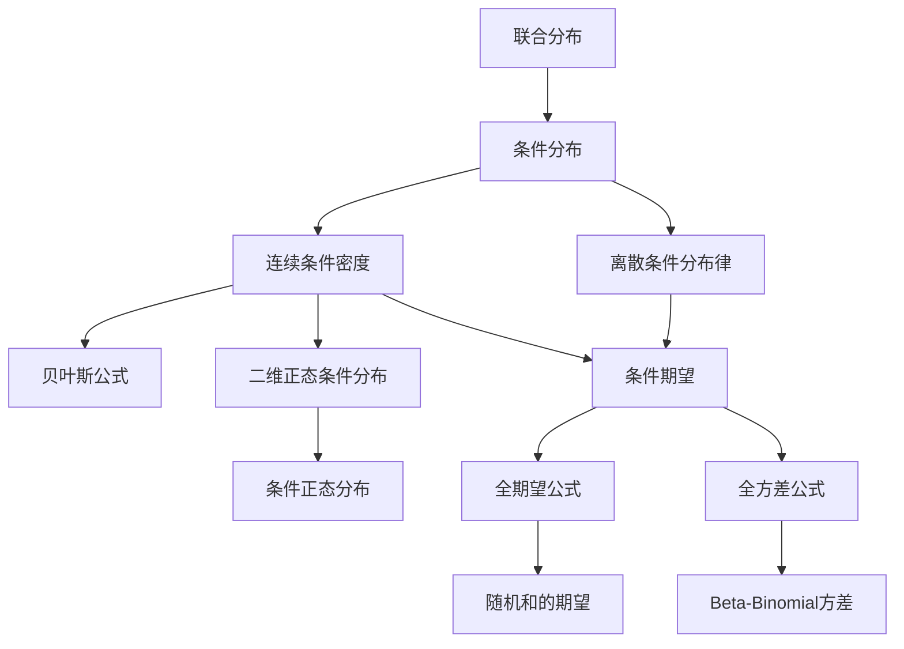

# 3.5 条件分布与条件期望

> [!abstract] 本节概览
> 本节将[[1.4 条件概率|条件概率]]的思想推广到随机变量层面，建立==条件分布==与==条件期望==的完整理论框架。核心是从联合分布出发，在给定一个随机变量取值的条件下，研究另一个随机变量的分布特征，并由此导出==全期望公式==和==全方差公式==两大恒等式。条件分布是连接联合分布与边缘分布的桥梁，条件期望则是处理分层随机模型的核心工具。
>
> **逻辑链条**：离散条件分布 → 连续条件密度 → 二维正态条件分布 → 条件期望 → 全期望公式 → 全方差公式
>
> **前置依赖**：[[3.1 多维随机变量及其联合分布|§3.1]]、[[3.2 边际分布与随机变量的独立性|§3.2]]、[[3.4 多维随机变量的特征数|§3.4]]
>
> **核心主线**：以联合分布为基础，通过"固定一个变量、考察另一个变量"的思路定义条件分布，进而引入条件期望，最终建立全期望公式与全方差公式两大恒等式。

---

## 一、离散型条件分布

### 条件分布律

> [!def] 定义 3.5.1 — 条件分布律（公式3.5.1、3.5.2）
> 设 $(X, Y)$ 为二维离散型随机变量，其联合分布律为 $P(X = x_i,\, Y = y_j) = p_{ij}$（$i, j = 1, 2, \ldots$），$X$ 和 $Y$ 的边缘分布律分别为 $p_{i\cdot} = \sum_j p_{ij}$ 和 $p_{\cdot j} = \sum_i p_{ij}$。
>
> 若 $p_{\cdot j} > 0$，则在 $Y = y_j$ 的条件下 $X$ 的==条件分布律==为
> $$P(X = x_i \mid Y = y_j) = \frac{p_{ij}}{p_{\cdot j}}, \quad i = 1, 2, \ldots \tag{3.5.1}$$
>
> 若 $p_{i\cdot} > 0$，则在 $X = x_i$ 的条件下 $Y$ 的条件分布律为
> $$P(Y = y_j \mid X = x_i) = \frac{p_{ij}}{p_{i\cdot}}, \quad j = 1, 2, \ldots \tag{3.5.2}$$

**理解要点**：条件分布律的本质是[[1.4 条件概率|条件概率]]在随机变量上的直接推广。给定 $Y = y_j$ 后，联合概率 $p_{ij}$ 被限制在 $Y = y_j$ 这一行上，除以该行的边缘概率 $p_{\cdot j}$ 进行归一化，就得到 $X$ 在该条件下的分布。

### 条件分布函数

> [!def] 定义 3.5.2 — 条件分布函数（公式3.5.3、3.5.4）
> 在 $Y = y_j$ 的条件下，$X$ 的==条件分布函数==为
> $$F(x \mid y_j) = P(X \leq x \mid Y = y_j) = \sum_{x_i \leq x} \frac{p_{ij}}{p_{\cdot j}} \tag{3.5.3}$$
>
> 在 $X = x_i$ 的条件下，$Y$ 的条件分布函数为
> $$F(y \mid x_i) = P(Y \leq y \mid X = x_i) = \sum_{y_j \leq y} \frac{p_{ij}}{p_{i\cdot}} \tag{3.5.4}$$

### 乘法关系

由条件分布律的定义，联合分布律可以分解为边缘分布律与条件分布律的乘积：

$$p_{ij} = p_{i\cdot} \cdot p_{j|i} = p_{\cdot j} \cdot p_{i|j}$$

这与[[1.4 条件概率|乘法公式]] $P(AB) = P(A)P(B|A)$ 完全对应。

### 独立性判定

由条件分布律的定义可以直接得到独立性的条件分布刻画：

$$X \text{ 与 } Y \text{ 独立} \iff p_{ij} = p_{i\cdot} \cdot p_{\cdot j} \iff p_{i|j} = p_{i\cdot} \quad (\forall\, i, j)$$

即：$X$ 与 $Y$ 独立等价于条件分布等于边缘分布——给定 $Y$ 的取值不影响 $X$ 的分布。

> [!example] 例 3.5.1 — 离散条件分布计算
> 设 $(X, Y)$ 的联合分布律为
>
> | $X \setminus Y$ | 0 | 1 | $p_{i\cdot}$ |
> |:---:|:---:|:---:|:---:|
> | 0 | $\frac{1}{4}$ | $\frac{1}{4}$ | $\frac{1}{2}$ |
> | 1 | $\frac{1}{4}$ | $\frac{1}{4}$ | $\frac{1}{2}$ |
> | $p_{\cdot j}$ | $\frac{1}{2}$ | $\frac{1}{2}$ | 1 |
>
> 求 $X$ 在 $Y = 1$ 条件下的条件分布律。
>
> **解**：由公式 (3.5.1)，
> $$P(X = 0 \mid Y = 1) = \frac{p_{01}}{p_{\cdot 1}} = \frac{1/4}{1/2} = \frac{1}{2}$$
> $$P(X = 1 \mid Y = 1) = \frac{p_{11}}{p_{\cdot 1}} = \frac{1/4}{1/2} = \frac{1}{2}$$
>
> 即 $X \mid Y = 1$ 仍为两点分布 $b(1, 1/2)$，与 $X$ 的边缘分布相同，说明 $X$ 与 $Y$ 独立。

---

## 二、连续型条件分布

### 条件密度函数

> [!def] 定义 3.5.3 — 条件密度函数（公式3.5.6、3.5.8）
> 设 $(X, Y)$ 为二维连续型随机变量，联合密度为 $p(x, y)$，边缘密度为 $p_X(x)$ 和 $p_Y(y)$。
>
> 若 $p_Y(y) > 0$，则在 $Y = y$ 的条件下 $X$ 的==条件密度函数==为
> $$p(x \mid y) = \frac{p(x, y)}{p_Y(y)} \tag{3.5.6}$$
>
> 若 $p_X(x) > 0$，则在 $X = x$ 的条件下 $Y$ 的条件密度函数为
> $$p(y \mid x) = \frac{p(x, y)}{p_X(x)} \tag{3.5.8}$$

**理解要点**：与离散情形类似，条件密度是联合密度在固定 $y$ 后关于 $x$ 的"切片"，除以 $p_Y(y)$ 进行归一化，使其积分为 1。注意 $p(x \mid y)$ 是关于 $x$ 的一元密度函数，$y$ 在此处被视为==参数==而非随机变量。

### 条件分布函数

在 $Y = y$ 的条件下，$X$ 的条件分布函数为

$$F(x \mid y) = P(X \leq x \mid Y = y) = \int_{-\infty}^{x} p(t \mid y)\, dt \tag{3.5.5}$$

### 乘法公式

联合密度可以分解为边缘密度与条件密度的乘积：

$$p(x, y) = p_X(x) \cdot p(y \mid x) \tag{3.5.9}$$

$$p(x, y) = p_Y(y) \cdot p(x \mid y) \tag{3.5.10}$$

这是连续版的乘法公式，与离散情形完全对应。

### 边缘密度公式（全概率公式的密度形式）

对乘法公式关于另一个变量积分，得到边缘密度的全概率公式：

$$p_Y(y) = \int_{-\infty}^{+\infty} p_X(x)\, p(y \mid x)\, dx \tag{3.5.11}$$

$$p_X(x) = \int_{-\infty}^{+\infty} p_Y(y)\, p(x \mid y)\, dy \tag{3.5.12}$$

这可以理解为：$Y$ 的边缘密度是"在所有可能的 $X$ 取值下，$Y$ 的条件密度的加权平均"。

### 贝叶斯公式（密度形式）

> [!thm] 定理 3.5.1 — 贝叶斯公式，密度形式（公式3.5.13、3.5.14）
>
> $$
> p(x \mid y) = \cfrac{p_Y(y \mid x)\, p_X(x)}{\displaystyle\int_{-\infty}^{+\infty} p_Y(y \mid x)\, p_X(x)\, dx} \tag{3.5.13}
> $$
>
> $$
> p(y \mid x) = \cfrac{p_X(x \mid y)\, p_Y(y)}{\displaystyle\int_{-\infty}^{+\infty} p_X(x \mid y)\, p_Y(y)\, dy} \tag{3.5.14}
> $$

**理解要点**：这与[[1.4 条件概率|贝叶斯公式]] $P(A_i \mid B) = \dfrac{P(B \mid A_i)\,P(A_i)}{\sum_j P(B \mid A_j)\,P(A_j)}$ 完全对应。分母就是[[3.2 边际分布与随机变量的独立性|边缘密度]] $p_Y(y)$，由全概率公式 (3.5.11) 给出。

> [!example] 例 3.5.2 — 条件密度计算（三角形区域均匀分布）
> 设 $(X, Y)$ 在区域 $D = \{(x, y) : 0 < x < y < 1\}$ 上均匀分布。
>
> **（1）求联合密度 $p(x, y)$**
>
> 区域 $D$ 的面积为 $\dfrac{1}{2}$，故
> $$p(x, y) = \begin{cases} 2, & 0 < x < y < 1 \\ 0, & \text{其他} \end{cases}$$
>
> **（2）求边缘密度 $p_X(x)$**
>
> $$p_X(x) = \int_{-\infty}^{+\infty} p(x, y)\, dy = \int_x^1 2\, dy = 2(1 - x), \quad 0 < x < 1$$
>
> **（3）求条件密度 $p(y \mid x)$**
>
> $$p(y \mid x) = \frac{p(x, y)}{p_X(x)} = \frac{2}{2(1 - x)} = \frac{1}{1 - x}, \quad x < y < 1$$
>
> 即 $Y \mid X = x \sim U(x, 1)$，在给定 $X = x$ 的条件下，$Y$ 在 $(x, 1)$ 上均匀分布。

---

## 三、二维正态分布的条件分布

> [!thm] 定理 3.5.2 — 二维正态分布的条件分布
> 若 $(X, Y) \sim N(\mu_1, \mu_2; \sigma_1^2, \sigma_2^2; \rho)$，则
>
> $$X \mid Y = y \sim N\!\left(\mu_1 + \rho\,\frac{\sigma_1}{\sigma_2}(y - \mu_2),\; \sigma_1^2(1 - \rho^2)\right)$$
>
> $$Y \mid X = x \sim N\!\left(\mu_2 + \rho\,\frac{\sigma_2}{\sigma_1}(x - \mu_1),\; \sigma_2^2(1 - \rho^2)\right)$$

> [!abstract]
> **证明思路**：以 $X \mid Y = y$ 为例。
>
> **第一步**：写出联合密度。$(X, Y)$ 的联合密度为
> $$p(x, y) = \frac{1}{2\pi\sigma_1\sigma_2\sqrt{1-\rho^2}} \exp\!\left\{-\frac{1}{2(1-\rho^2)}\left[\frac{(x-\mu_1)^2}{\sigma_1^2} - 2\rho\frac{(x-\mu_1)(y-\mu_2)}{\sigma_1\sigma_2} + \frac{(y-\mu_2)^2}{\sigma_2^2}\right]\right\}$$
>
> **第二步**：由条件密度定义 $p(x \mid y) = \dfrac{p(x, y)}{p_Y(y)}$，其中 $p_Y(y) = \dfrac{1}{\sqrt{2\pi}\,\sigma_2}\exp\!\left\{-\dfrac{(y-\mu_2)^2}{2\sigma_2^2}\right\}$。
>
> **第三步**：将联合密度中的指数部分关于 $x$ 进行配方。令 $u = x - \mu_1$，$v = y - \mu_2$，则指数部分为
> $$-\frac{1}{2(1-\rho^2)}\left[\frac{u^2}{\sigma_1^2} - 2\rho\frac{uv}{\sigma_1\sigma_2} + \frac{v^2}{\sigma_2^2}\right]$$
>
> 关于 $u$ 配方，提取不含 $u$ 的项：
> $$= -\frac{1}{2(1-\rho^2)}\left[\frac{1}{\sigma_1^2}\left(u - \rho\frac{\sigma_1}{\sigma_2}v\right)^2 + \frac{v^2}{\sigma_2^2}(1 - \rho^2)\right]$$
> $$= -\frac{\left(u - \rho\dfrac{\sigma_1}{\sigma_2}v\right)^2}{2\sigma_1^2(1-\rho^2)} - \frac{v^2}{2\sigma_2^2}$$
>
> **第四步**：代入条件密度公式，$p_Y(y)$ 的指数部分恰好消去 $-\dfrac{v^2}{2\sigma_2^2}$ 项，剩余部分为
> $$p(x \mid y) = \frac{1}{\sqrt{2\pi}\,\sigma_1\sqrt{1-\rho^2}} \exp\!\left\{-\frac{\left[x - \mu_1 - \rho\dfrac{\sigma_1}{\sigma_2}(y - \mu_2)\right]^2}{2\sigma_1^2(1-\rho^2)}\right\}$$
>
> 这正是 $N\!\left(\mu_1 + \rho\dfrac{\sigma_1}{\sigma_2}(y - \mu_2),\; \sigma_1^2(1-\rho^2)\right)$ 的密度函数。$\blacksquare$

**核心结论**：

- ==条件期望==：$E(X \mid Y = y) = \mu_1 + \rho\dfrac{\sigma_1}{\sigma_2}(y - \mu_2)$，这是 $y$ 的线性函数，斜率由 $\rho$ 控制
- ==条件方差==：$\text{Var}(X \mid Y = y) = \sigma_1^2(1 - \rho^2)$，与 $y$ 无关，且==小于==边缘方差 $\sigma_1^2$
- 当 $\rho = 0$（$X$ 与 $Y$ 独立）时，$X \mid Y = y \sim N(\mu_1, \sigma_1^2)$，条件分布等于边缘分布
- 当 $|\rho| \to 1$ 时，条件方差 $\to 0$，条件分布退化到一点——$Y$ 完全决定 $X$

> [!example] 例 3.5.3 — 二维正态条件分布计算
> 设 $(X, Y) \sim N(1, 0; 4, 9; 1/2)$，求 $E(X \mid Y = 2)$ 和 $\text{Var}(X \mid Y = 2)$。
>
> **解**：由定理 3.5.2，
> $$E(X \mid Y = 2) = 1 + \frac{1}{2} \cdot \frac{2}{3}(2 - 0) = 1 + \frac{2}{3} = \frac{5}{3}$$
> $$\text{Var}(X \mid Y = 2) = 4\left(1 - \frac{1}{4}\right) = 3$$
>
> 即 $X \mid Y = 2 \sim N(5/3,\, 3)$。

---

## 四、条件期望

### 定义

> [!def] 定义 3.5.4 — 条件期望（公式3.5.15）
> **离散型**：在 $Y = y_j$ 的条件下，$X$ 的==条件期望==为
> $$E(X \mid Y = y_j) = \sum_{i=1}^{+\infty} x_i \cdot p_{i|j} = \sum_{i=1}^{+\infty} x_i \cdot P(X = x_i \mid Y = y_j)$$
>
> **连续型**：在 $Y = y$ 的条件下，$X$ 的条件期望为
> $$E(X \mid Y = y) = \int_{-\infty}^{+\infty} x \cdot p(x \mid y)\, dx \tag{3.5.15}$$
>
> 当上述级数或积分==绝对收敛==时，条件期望存在。

**理解要点**：条件期望 $E(X \mid Y = y)$ 就是在给定 $Y = y$ 的条件下，用条件分布 $p(x \mid y)$ 计算的==普通期望==。它是一个关于 $y$ 的函数。

### 条件期望的基本性质

> [!thm] 定理 3.5.3 — 条件期望的线性性质
> （1）$E(aX + b \mid Y = y) = a\,E(X \mid Y = y) + b$，其中 $a, b$ 为常数
>
> （2）$E(h(Y) \mid Y = y) = h(y)$，即给定 $Y = y$ 时，$Y$ 的函数 $h(Y)$ 就是常数 $h(y)$

**性质（1）的直观理解**：条件期望保留了期望的线性性质——在给定条件下对 $X$ 求期望，线性运算可以提到外面。

**性质（2）的直观理解**：既然已经知道 $Y = y$，那么 $h(Y)$ 就不再是随机的了，它的期望就是它本身 $h(y)$。

### $g(Y) = E(X \mid Y)$ 作为随机变量

当不指定 $Y$ 的具体取值时，$E(X \mid Y)$ 是关于 $Y$ 的函数，记为 $g(Y) = E(X \mid Y)$。由于 $Y$ 是随机变量，所以 $g(Y)$ 也是==随机变量==。

- 当 $Y$ 取值为 $y$ 时，$g(Y) = g(y) = E(X \mid Y = y)$
- $g(Y)$ 的取值随着 $Y$ 的随机变化而变化

> [!example] 例 3.5.4 — 条件期望计算
> 设 $(X, Y)$ 在区域 $D = \{(x, y) : 0 < x < 1, 0 < y < x\}$ 上均匀分布，求 $E(X \mid Y = y)$。
>
> **解**：区域 $D$ 的面积为 $1/2$，联合密度 $p(x, y) = 2$（$0 < y < x < 1$）。
>
> 先求 $p_Y(y)$：
> $$p_Y(y) = \int_y^1 2\, dx = 2(1 - y), \quad 0 < y < 1$$
>
> 条件密度：
> $$p(x \mid y) = \frac{2}{2(1 - y)} = \frac{1}{1 - y}, \quad y < x < 1$$
>
> 即 $X \mid Y = y \sim U(y, 1)$，故
> $$E(X \mid Y = y) = \frac{y + 1}{2}$$
>
> 因此 $g(Y) = E(X \mid Y) = \dfrac{Y + 1}{2}$ 是一个随机变量。

---

## 五、全期望公式与全方差公式

### 全期望公式（重期望公式）

> [!thm] 定理 3.5.4 — 全期望公式 / 重期望公式（公式3.5.17）
> $$E(X) = E[E(X \mid Y)] \tag{3.5.17}$$
>
> 即：$X$ 的无条件期望等于条件期望 $E(X \mid Y)$ 关于 $Y$ 的期望。

> [!abstract]
> **证明**：
>
> **离散型**：设 $(X, Y)$ 的联合分布律为 $p_{ij}$，
> $$E[E(X \mid Y)] = \sum_{j=1}^{+\infty} E(X \mid Y = y_j) \cdot p_{\cdot j} = \sum_{j=1}^{+\infty} \left(\sum_{i=1}^{+\infty} x_i \cdot \frac{p_{ij}}{p_{\cdot j}}\right) p_{\cdot j}$$
> $$= \sum_{j=1}^{+\infty} \sum_{i=1}^{+\infty} x_i \cdot p_{ij} = \sum_{i=1}^{+\infty} x_i \sum_{j=1}^{+\infty} p_{ij} = \sum_{i=1}^{+\infty} x_i \cdot p_{i\cdot} = E(X)$$
>
> **连续型**：设 $(X, Y)$ 的联合密度为 $p(x, y)$，
> $$E[E(X \mid Y)] = \int_{-\infty}^{+\infty} E(X \mid Y = y)\, p_Y(y)\, dy = \int_{-\infty}^{+\infty} \left(\int_{-\infty}^{+\infty} x \cdot p(x \mid y)\, dx\right) p_Y(y)\, dy$$
> $$= \int_{-\infty}^{+\infty} \int_{-\infty}^{+\infty} x \cdot \frac{p(x, y)}{p_Y(y)} \cdot p_Y(y)\, dx\, dy = \iint_{\mathbb{R}^2} x\, p(x, y)\, dx\, dy = E(X)$$
>
> $\blacksquare$

**直观理解**：全期望公式的本质是==分层平均==。先在每一层（给定 $Y$ 的某个取值）内部求平均，再对各层的平均按层的概率加权平均，就得到总平均。这与[[1.4 条件概率|全概率公式]] $P(B) = \sum_i P(B \mid A_i)\,P(A_i)$ 的思想完全一致。

### 随机变量随机和的期望

> [!thm] 定理 3.5.5 — 随机变量随机和的期望
> 若 $X_1, X_2, \ldots$ 独立同分布，$N$ 为非负整数随机变量且与 $\{X_i\}$ 独立，则
> $$E\!\left(\sum_{i=1}^{N} X_i\right) = E(X_1) \cdot E(N)$$

> [!abstract]
> **证明**：令 $X = \displaystyle\sum_{i=1}^{N} X_i$。利用全期望公式，对 $N$ 取条件期望：
> $$E(X) = E[E(X \mid N)]$$
>
> 当 $N = n$ 给定时，$E(X \mid N = n) = E\!\left(\displaystyle\sum_{i=1}^{n} X_i\right) = \displaystyle\sum_{i=1}^{n} E(X_i) = n\,E(X_1)$。
>
> 因此 $E(X \mid N) = N \cdot E(X_1)$，代入全期望公式：
> $$E(X) = E[N \cdot E(X_1)] = E(X_1) \cdot E(N)$$
>
> 其中最后一步利用了 $N$ 与 $\{X_i\}$ 独立，故 $N$ 与 $E(X_1)$（常数）独立。$\blacksquare$

**直观理解**：如果每天来图书馆的读者数平均为 $E(N)$，每人平均借 $E(X_1)$ 本书，那么每天总借书量的期望就是 $E(N) \cdot E(X_1)$。全期望公式将"随机个数"的问题分解为"先固定个数再求期望"。

### 全方差公式（方差恒等式）

> [!thm] 定理 3.5.6 — 全方差公式 / 方差恒等式
> $$\text{Var}(Y) = E[\text{Var}(Y \mid X)] + \text{Var}[E(Y \mid X)]$$
>
> 即：$Y$ 的总方差 == 条件方差的期望 == 条件期望的方差。

> [!abstract]
> **证明**：从方差的定义 $\text{Var}(Y) = E(Y^2) - [E(Y)]^2$ 出发。
>
> **第一步**：对 $E(Y^2)$ 使用全期望公式。注意到
> $$\text{Var}(Y \mid X) = E(Y^2 \mid X) - [E(Y \mid X)]^2$$
>
> 因此 $E(Y^2 \mid X) = \text{Var}(Y \mid X) + [E(Y \mid X)]^2$，两边取期望：
> $$E(Y^2) = E[E(Y^2 \mid X)] = E[\text{Var}(Y \mid X)] + E[E(Y \mid X)]^2$$
>
> **第二步**：对 $[E(Y)]^2$，由全期望公式 $E(Y) = E[E(Y \mid X)]$，故
> $$[E(Y)]^2 = \{E[E(Y \mid X)]\}^2$$
>
> **第三步**：代入方差定义：
> $$\text{Var}(Y) = E(Y^2) - [E(Y)]^2 = E[\text{Var}(Y \mid X)] + E[E(Y \mid X)]^2 - \{E[E(Y \mid X)]\}^2$$
>
> 注意到 $E[E(Y \mid X)]^2 - \{E[E(Y \mid X)]\}^2 = \text{Var}[E(Y \mid X)]$（这正是随机变量 $E(Y \mid X)$ 的方差定义）。
>
> 因此
> $$\text{Var}(Y) = E[\text{Var}(Y \mid X)] + \text{Var}[E(Y \mid X)]$$
>
> $\blacksquare$

**直观理解**：

- $E[\text{Var}(Y \mid X)]$：==组内方差的平均==——在每一组 $X = x$ 内部，$Y$ 的波动程度的平均
- $\text{Var}[E(Y \mid X)]$：==组间方差==——不同组之间 $Y$ 的条件期望的波动程度
- 总方差 = 组内变异 + 组间变异

这与统计学中==方差分析（ANOVA）==的基本思想完全一致。

### Beta-Binomial 分布的方差

> [!example] 例 3.5.5 — Beta-Binomial 分布的方差（全方差公式应用）
> 设 $X \mid P \sim B(n, P)$（给定成功率 $P$，$X$ 服从二项分布），$P \sim \text{Beta}(\alpha, \beta)$，求 $E(X)$ 和 $\text{Var}(X)$。
>
> **解**：
>
> **（1）求 $E(X)$**：利用全期望公式 $E(X) = E[E(X \mid P)]$。
>
> 给定 $P = p$ 时，$E(X \mid P = p) = np$，故 $E(X \mid P) = nP$。
> $$E(X) = E(nP) = n\,E(P) = n \cdot \frac{\alpha}{\alpha + \beta} = \frac{n\alpha}{\alpha + \beta}$$
>
> **（2）求 $\text{Var}(X)$**：利用全方差公式 $\text{Var}(X) = E[\text{Var}(X \mid P)] + \text{Var}[E(X \mid P)]$。
>
> - $\text{Var}(X \mid P = p) = np(1-p)$，故 $\text{Var}(X \mid P) = nP(1 - P)$
> - $E(X \mid P) = nP$
>
> 计算第一项：
> $$E[\text{Var}(X \mid P)] = E[nP(1 - P)] = n\,E(P) - n\,E(P^2)$$
> $$= n \cdot \frac{\alpha}{\alpha+\beta} - n \cdot \frac{\alpha(\alpha+1)}{(\alpha+\beta)(\alpha+\beta+1)} = \frac{n\alpha\beta}{(\alpha+\beta)(\alpha+\beta+1)}$$
>
> 计算第二项：
> $$\text{Var}[E(X \mid P)] = \text{Var}(nP) = n^2\,\text{Var}(P) = n^2 \cdot \frac{\alpha\beta}{(\alpha+\beta)^2(\alpha+\beta+1)}$$
>
> 合并：
> $$\text{Var}(X) = \frac{n\alpha\beta}{(\alpha+\beta)(\alpha+\beta+1)} + \frac{n^2\alpha\beta}{(\alpha+\beta)^2(\alpha+\beta+1)}$$
> $$= \frac{n\alpha\beta(\alpha+\beta) + n^2\alpha\beta}{(\alpha+\beta)^2(\alpha+\beta+1)} = \frac{n\alpha\beta(\alpha+\beta+n)}{(\alpha+\beta)^2(\alpha+\beta+1)}$$

**对比**：若 $P$ 是固定的常数 $p$（即二项分布），则 $\text{Var}(X) = np(1-p)$。当 $P$ 本身也是随机变量时，方差多出了 $\text{Var}[E(X \mid P)]$ 这一项，反映了参数不确定性带来的额外波动。

---

## 六、典型应用场景

### 随机和模型

==随机和== $S = \displaystyle\sum_{i=1}^{N} X_i$ 是全期望公式的经典应用场景，其中 $N$ 是随机变量，$\{X_i\}$ 是独立同分布序列。

常见实例：

- **泊松-二项模型**：$N \sim P(\lambda)$，$X_i \sim b(1, p)$，则 $S \sim P(\lambda p)$
- **泊松-泊松模型**：$N \sim P(\lambda_1)$，$X_i \sim P(\lambda_2)$，则 $S \sim P(\lambda_1 \lambda_2)$（复合泊松分布）

### 二重模型（先抽 $N$ 再抽 $X \mid N$）

许多实际问题具有天然的分层结构：

1. 先确定"个数" $N$（如：今天来多少人、发生多少次事故）
2. 再在给定 $N$ 的条件下，确定每个个体的特征 $X_i$

全期望公式将这种分层模型的总期望分解为两步计算。

### 全期望公式的实际应用

**图书馆借书问题**：设每天来图书馆的读者数 $N \sim P(\lambda)$，每位读者借书数 $X_i \sim b(n, p)$，且各读者借书数独立。求每天总借书数 $S = \sum_{i=1}^{N} X_i$ 的期望。

**解**：由定理 3.5.5，
$$E(S) = E(X_1) \cdot E(N) = np \cdot \lambda = np\lambda$$

---

## 七、知识结构总览

---

## 八、核心思想与证明技巧

### 全期望公式的证明思路

核心思想：==条件期望对 $Y$ 积分（或求和）==。

- 离散型：$E[E(X \mid Y)] = \sum_j E(X \mid Y = y_j) \cdot p_{\cdot j} = \sum_j \sum_i x_i \cdot p_{ij} = E(X)$
- 连续型：$E[E(X \mid Y)] = \int E(X \mid Y = y) \cdot p_Y(y)\, dy = \iint x \cdot p(x, y)\, dx\, dy = E(X)$

关键步骤：将条件期望的定义代入，$p_{\cdot j}$ 或 $p_Y(y)$ 恰好与条件分布律/条件密度中的分母约去，还原为联合分布的期望。

### 全方差公式的证明思路

核心思想：==从 $\text{Var}(Y) = E(Y^2) - [E(Y)]^2$ 出发，分别对两项使用全期望公式==。

1. $E(Y^2) = E[E(Y^2 \mid X)] = E[\text{Var}(Y \mid X) + (E(Y \mid X))^2] = E[\text{Var}(Y \mid X)] + E[(E(Y \mid X))^2]$
2. $[E(Y)]^2 = \{E[E(Y \mid X)]\}^2$
3. 相减：$E[(E(Y \mid X))^2] - \{E[E(Y \mid X)]\}^2 = \text{Var}[E(Y \mid X)]$

### 贝叶斯公式的密度形式与离散形式的类比

| 离散形式 | 密度形式 |
|:---|:---|
| $P(A_i \mid B) = \dfrac{P(B \mid A_i)\,P(A_i)}{\sum_j P(B \mid A_j)\,P(A_j)}$ | $p(x \mid y) = \dfrac{p_Y(y \mid x)\,p_X(x)}{\int p_Y(y \mid x)\,p_X(x)\,dx}$ |
| 先验概率 $P(A_i)$ | 先验密度 $p_X(x)$ |
| 似然 $P(B \mid A_i)$ | 似然函数 $p_Y(y \mid x)$ |
| 全概率 $\sum_j P(B \mid A_j)\,P(A_j)$ | 边缘密度 $\int p_Y(y \mid x)\,p_X(x)\,dx$ |
| 后验概率 $P(A_i \mid B)$ | 后验密度 $p(x \mid y)$ |

求和对应积分，概率对应密度，结构完全一致。

---

## 九、补充理解与易混淆点

### 条件密度函数的变量角色

**来源**：茆诗松教材§3.5 + 卡方核心笔记§3.5 + 陈希孺《概率论与数理统计》§3.3 + Ross《A First Course in Probability》Ch.5 + MIT 18.05 Lecture Notes

> [!danger] 误区1："条件密度函数 $p(x \mid y)$ 是关于 $x$ 和 $y$ 的联合密度"
> ❌ 错误解释：$p(x \mid y)$ 同时以 $x$ 和 $y$ 为自变量，是二元密度函数。
> ✅ 正确解释：$p(x \mid y)$ 是关于 $x$ 的==一元密度函数==，$y$ 被视为==参数==。对固定的 $y$，$\int_{-\infty}^{+\infty} p(x \mid y)\, dx = 1$；但 $\iint p(x \mid y)\, dx\, dy$ 通常不等于 1。联合密度是 $p(x, y) = p_Y(y) \cdot p(x \mid y)$，两者不能混淆。

### 全期望公式的嵌套结构

**来源**：茆诗松教材§3.5 + 卡方核心笔记§3.5 + 李贤平《概率论基础》§3.4 + 中科大概率论讲义 + 考研真题432综合

> [!danger] 误区2："全期望公式 $E[E(X \mid Y)]$ 就是简单的嵌套期望"
> ❌ 错误解释：$E[E(X \mid Y)]$ 只是把一个期望套在另一个期望里面，没有特殊含义。
> ✅ 正确解释：内层 $E(X \mid Y)$ 是==随机变量== $g(Y) = E(X \mid Y)$，它是关于 $Y$ 的函数；外层 $E[\cdot]$ 是对 $g(Y)$ 关于 $Y$ 的分布取期望。全期望公式的本质是==分层平均==——先在每一层（$Y$ 的取值）内部求平均，再对各层平均按层概率加权。它对应全概率公式的期望版本。

### 全方差公式中两项的含义

**来源**：茆诗松教材§3.5 + 卡方核心笔记§3.5 + 韦来生《数理统计》§1.4 + Casella & Berger《Statistical Inference》Ch.4 + 王兆军《数理统计》讲义

> [!danger] 误区3："全方差公式中两项可以合并"
> ❌ 错误解释：$E[\text{Var}(Y \mid X)]$ 和 $\text{Var}[E(Y \mid X)]$ 都是方差，可以合并为 $\text{Var}(Y)$。
> ✅ 正确解释：两项含义完全不同，不可合并。$E[\text{Var}(Y \mid X)]$ 是==条件方差的平均==（组内变异），度量的是各组内部 $Y$ 的波动程度；$\text{Var}[E(Y \mid X)]$ 是==条件期望的方差==（组间变异），度量的是各组之间 $Y$ 的平均水平差异。总方差等于两者之和，这与方差分析（ANOVA）中"总变异 = 组内变异 + 组间变异"的思想一致。

### 条件期望是随机变量还是常数

**来源**：茆诗松教材§3.5 + 卡方核心笔记§3.5 + 严士健《概率论基础》§3.2 + Durrett《Probability》Ch.1 + 考研432大纲解析

> [!danger] 误区4："条件期望 $E(X \mid Y)$ 是一个常数"
> ❌ 错误解释：期望是一个数，所以 $E(X \mid Y)$ 也是常数。
> ✅ 正确解释：需要区分两种写法。$E(X \mid Y = y)$ 是==常数==（给定 $Y$ 取特定值 $y$ 后的条件期望）；而 $E(X \mid Y)$ 是关于 $Y$ 的函数 $g(Y)$，是==随机变量==——它的取值随 $Y$ 的随机变化而变化。全期望公式 $E(X) = E[E(X \mid Y)]$ 中，外层期望正是对这个随机变量取期望。

---

## 十、习题精选

> [!todo] 习题概览
> | 编号 | 来源 | 题目内容 | 难度 |
> |:---:|:---|:---|:---:|
> | 1 | 教材3.5-1 | 离散型条件分布律 | ★★☆ |
> | 2 | 教材3.5-3 | 条件密度函数计算 | ★★☆ |
> | 3 | 教材3.5-5 | 条件期望计算 | ★★★ |
> | 4 | 教材3.5-7 | 全期望公式应用 | ★★★ |
> | 5 | 教材3.5-9 | 全方差公式应用 | ★★★ |
> | 6 | 教材3.5-12 | 二维正态条件分布 | ★★★★ |
> | 7 | 2016中山大学432 | 条件密度函数（均匀分布） | ★★☆ |
> | 8 | 2021东北大学432 | 条件密度/边缘密度/联合密度 | ★★★ |
> | 9 | 2017兰州大学432 | 离散型条件分布（泊松/二项） | ★★★ |
> | 10 | 2020西南大学432 | 重期望公式（泊松/二项） | ★★★★ |

### 习题1 — 教材3.5-1：离散型条件分布律 ★★☆

**题目**：设 $(X, Y)$ 的联合分布律为

| $X \setminus Y$ | $-1$ | $0$ | $1$ |
|:---:|:---:|:---:|:---:|
| $0$ | $0.1$ | $0.2$ | $0.1$ |
| $1$ | $0.2$ | $0.1$ | $0.3$ |

求 $X \mid Y = 1$ 和 $Y \mid X = 0$ 的条件分布律。

**解答**：

$Y = 1$ 时，$p_{\cdot 1} = 0.1 + 0.3 = 0.4$：
$$P(X = 0 \mid Y = 1) = \frac{0.1}{0.4} = \frac{1}{4}, \quad P(X = 1 \mid Y = 1) = \frac{0.3}{0.4} = \frac{3}{4}$$

$X = 0$ 时，$p_{0\cdot} = 0.1 + 0.2 + 0.1 = 0.4$：
$$P(Y = -1 \mid X = 0) = \frac{0.1}{0.4} = \frac{1}{4}, \quad P(Y = 0 \mid X = 0) = \frac{0.2}{0.4} = \frac{1}{2}, \quad P(Y = 1 \mid X = 0) = \frac{0.1}{0.4} = \frac{1}{4}$$

### 习题2 — 教材3.5-3：条件密度函数计算 ★★☆

**题目**：设 $(X, Y)$ 的联合密度为 $p(x, y) = e^{-x}$（$0 < y < x < +\infty$），求 $p(y \mid x)$ 和 $p(x \mid y)$。

**解答**：

$p_X(x) = \int_0^x e^{-x}\, dy = x\,e^{-x}$（$x > 0$）

$p_Y(y) = \int_y^{+\infty} e^{-x}\, dx = e^{-y}$（$y > 0$）

$p(y \mid x) = \dfrac{e^{-x}}{xe^{-x}} = \dfrac{1}{x}$（$0 < y < x$），即 $Y \mid X = x \sim U(0, x)$

$p(x \mid y) = \dfrac{e^{-x}}{e^{-y}} = e^{-(x-y)}$（$x > y$），即 $X - Y \mid Y = y \sim \text{Exp}(1)$

### 习题3 — 教材3.5-5：条件期望计算 ★★★

**题目**：设 $(X, Y)$ 在单位圆 $x^2 + y^2 \leq 1$ 上均匀分布，求 $E(X \mid Y = y)$。

**解答**：

联合密度 $p(x, y) = \dfrac{1}{\pi}$（$x^2 + y^2 \leq 1$）。

给定 $Y = y$（$|y| < 1$），$X$ 的取值范围为 $-\sqrt{1 - y^2} \leq x \leq \sqrt{1 - y^2}$。

$p_Y(y) = \displaystyle\int_{-\sqrt{1-y^2}}^{\sqrt{1-y^2}} \frac{1}{\pi}\, dx = \frac{2\sqrt{1-y^2}}{\pi}$

$p(x \mid y) = \dfrac{1/\pi}{2\sqrt{1-y^2}/\pi} = \dfrac{1}{2\sqrt{1-y^2}}$（$-\sqrt{1-y^2} \leq x \leq \sqrt{1-y^2}$）

即 $X \mid Y = y \sim U(-\sqrt{1-y^2},\, \sqrt{1-y^2})$，故

$$E(X \mid Y = y) = \frac{-\sqrt{1-y^2} + \sqrt{1-y^2}}{2} = 0$$

### 习题4 — 教材3.5-7：全期望公式应用 ★★★

**题目**：设某昆虫产卵数 $N \sim P(\lambda)$，每颗卵孵化为成虫的概率为 $p$，且各卵是否孵化相互独立。求成虫数 $X$ 的期望。

**解答**：

令 $X_i$ 为第 $i$ 颗卵是否孵化的示性变量，$X_i \sim b(1, p)$，则 $X = \sum_{i=1}^{N} X_i$。

由定理 3.5.5：
$$E(X) = E(X_1) \cdot E(N) = p \cdot \lambda = p\lambda$$

### 习题5 — 教材3.5-9：全方差公式应用 ★★★

**题目**：设 $Y \mid X = x \sim N(x, x^2)$（$x > 0$），$X \sim \text{Exp}(1)$，求 $\text{Var}(Y)$。

**解答**：

由全方差公式 $\text{Var}(Y) = E[\text{Var}(Y \mid X)] + \text{Var}[E(Y \mid X)]$。

- $E(Y \mid X = x) = x$，$\text{Var}(Y \mid X = x) = x^2$
- $E[\text{Var}(Y \mid X)] = E(X^2) = \text{Var}(X) + [E(X)]^2 = 1 + 1 = 2$
- $\text{Var}[E(Y \mid X)] = \text{Var}(X) = 1$

因此 $\text{Var}(Y) = 2 + 1 = 3$。

### 习题6 — 教材3.5-12：二维正态条件分布 ★★★★

**题目**：设 $(X, Y) \sim N(0, 1; 1, 4; 1/2)$，求 $P(X > 1 \mid Y = 1)$。

**解答**：

由定理 3.5.2：
$$E(X \mid Y = 1) = 0 + \frac{1}{2} \cdot \frac{1}{2}(1 - 0) = \frac{1}{4}$$
$$\text{Var}(X \mid Y = 1) = 1 \cdot \left(1 - \frac{1}{4}\right) = \frac{3}{4}$$

即 $X \mid Y = 1 \sim N(1/4,\, 3/4)$。

$$P(X > 1 \mid Y = 1) = 1 - \Phi\!\left(\frac{1 - 1/4}{\sqrt{3/4}}\right) = 1 - \Phi\!\left(\frac{3/4}{\sqrt{3}/2}\right) = 1 - \Phi\!\left(\frac{\sqrt{3}}{2}\right) \approx 1 - \Phi(0.866) \approx 0.193$$

### 习题7 — 2016中山大学432：条件密度函数（均匀分布）★★☆

**题目**：设 $(X, Y)$ 在区域 $D = \{(x, y) : 0 < x < y < 1\}$ 上均匀分布，求 $Y \mid X$ 的条件密度。

**解答**：

联合密度 $f(x, y) = 2$（$0 < x < y < 1$）。

边缘密度 $f_X(x) = \displaystyle\int_x^1 2\, dy = 2(1 - x)$（$0 < x < 1$）。

条件密度 $f(y \mid x) = \dfrac{2}{2(1-x)} = \dfrac{1}{1-x}$（$x < y < 1$）。

即 $Y \mid X = x \sim U(x, 1)$。

### 习题8 — 2021东北大学432：条件密度/边缘密度/联合密度 ★★★

**题目**：设 $(X, Y)$ 在由 $x$ 轴、$y$ 轴、$x = 1$、$y = e^x$ 围成的区域 $D$ 上均匀分布。
（1）求 $f(x, y)$。
（2）求 $f_Y(y)$。
（3）求 $f_{X \mid Y}(x \mid y)$。

**解答**：

**（1）** 区域 $D$ 的面积 $= \displaystyle\int_0^1 e^x\, dx = e - 1$，故 $f(x, y) = \dfrac{1}{e - 1}$（$(x, y) \in D$）。

**（2）** 当 $0 < y < 1$ 时，$x$ 的范围为 $0 < x < y$（因为 $y < e^x$ 要求 $x > \ln y$，但 $\ln y < 0$，所以 $x > 0$），$f_Y(y) = \displaystyle\int_0^y \frac{1}{e-1}\, dx = \frac{y}{e-1}$。

当 $1 < y < e$ 时，$x$ 的范围为 $\ln y < x < 1$，$f_Y(y) = \displaystyle\int_{\ln y}^1 \frac{1}{e-1}\, dx = \frac{1 - \ln y}{e-1} = \frac{\ln(e/y)}{e-1}$。

**（3）** 当 $0 < y < 1$ 时，$f_{X \mid Y}(x \mid y) = \dfrac{1/(e-1)}{y/(e-1)} = \dfrac{1}{y}$（$0 < x < y$）。

当 $1 < y < e$ 时，$f_{X \mid Y}(x \mid y) = \dfrac{1/(e-1)}{(1-\ln y)/(e-1)} = \dfrac{1}{1 - \ln y}$（$\ln y < x < 1$）。

### 习题9 — 2017兰州大学432：离散型条件分布（泊松/二项）★★★

**题目**：设 $(X, Y)$ 的联合分布律为 $P(X = m,\, Y = n) = \dfrac{e^{-\lambda}\lambda^n}{n!} \cdot \binom{n}{m}p^m(1-p)^{n-m}$（$m = 0, 1, \ldots, n$；$n = 0, 1, 2, \ldots$）。
（1）求 $Y$ 的分布。
（2）求 $X \mid Y = n$ 的分布。

**解答**：

**（1）** 对 $m$ 求和：
$$P(Y = n) = \sum_{m=0}^{n} \frac{e^{-\lambda}\lambda^n}{n!} \cdot \binom{n}{m}p^m(1-p)^{n-m} = \frac{e^{-\lambda}\lambda^n}{n!} \sum_{m=0}^{n} \binom{n}{m}p^m(1-p)^{n-m}$$
$$= \frac{e^{-\lambda}\lambda^n}{n!} \cdot 1 = \frac{e^{-\lambda}\lambda^n}{n!}$$

即 $Y \sim P(\lambda)$（泊松分布）。

**（2）** $P(X = m \mid Y = n) = \dfrac{P(X = m, Y = n)}{P(Y = n)} = \dbinom{n}{m}p^m(1-p)^{n-m}$

即 $X \mid Y = n \sim b(n, p)$（二项分布）。

### 习题10 — 2020西南大学432：重期望公式（泊松/二项）★★★★

**题目**：某图书馆每天来的读者数 $N \sim P(\lambda)$，每位读者借书数 $X_i \sim b(n, p)$，且各读者借书数独立。求每天总借书数 $X = \sum_{i=1}^{N} X_i$ 的期望。

**解答**：

利用全期望公式（定理 3.5.5）：

**第一步**：求条件期望。给定 $N = k$ 时，
$$E(X \mid N = k) = E\!\left(\sum_{i=1}^{k} X_i\right) = \sum_{i=1}^{k} E(X_i) = k \cdot np$$

因此 $E(X \mid N) = Np$。

**第二步**：对 $N$ 取期望，
$$E(X) = E[E(X \mid N)] = E(Np) = p\,E(N) = p\lambda$$

即每天总借书数的期望为 $p\lambda$。

---

## 十一、教材原文

> [!info] 第三章教材PDF尚未上传，待后续补充。

#学习/概率论与统计/第三章 多维随机变量及其分布/条件分布与条件期望
