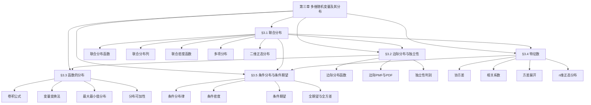

# 第三章 多维随机变量及其分布 — 章节汇总

> [!abstract] 全章概览
> 本章将随机变量从一维推广到多维，核心是从==联合分布==出发，研究多个随机变量之间的概率结构。全章围绕"联合→边际→条件"三条主线展开：先建立==联合分布函数==、联合分布列和联合密度函数的统一框架（§3.1），再讨论==边际分布==与==独立性==（§3.2），然后研究多维随机变量函数的分布（§3.3），接着引入==协方差==和==相关系数==刻画变量间的线性关联（§3.4），最后建立==条件分布==与==条件期望==的完整理论（§3.5）。
>
> **全章逻辑主线**：联合分布（整体描述）→ 边际分布与独立性（分解与简化）→ 函数的分布（变换工具）→ 数字特征（关联度量）→ 条件分布与条件期望（信息更新）

---

## 一、全章知识框架

---

## 二、核心知识点与公式汇总

### §3.1 多维随机变量及其联合分布

本节建立多维随机变量的基本框架。==联合分布函数== $F(x,y) = P(X \leq x, Y \leq y)$ 是统一描述离散型和连续型多维随机变量的核心工具。==二维正态分布==和==多项分布==是两个最重要的多维分布模型。

| 编号 | 类型 | 名称 | 内容 |
|:----:|:----:|:----:|:----:|
| 3.1.1 | 定义 | 联合分布函数 | $F(x,y) = P(X \leq x, Y \leq y)$，关于每个变量单调不减、右连续 |
| 3.1.2 | 定义 | 联合分布列 | 离散型：$p(x_i, y_j) = P(X = x_i, Y = y_j)$，$\sum_i \sum_j p(x_i, y_j) = 1$ |
| 3.1.3 | 定义 | 联合密度函数 | 连续型：$p(x,y) \geq 0$，$\iint p(x,y)\,dx\,dy = 1$，$\frac{\partial^2 F}{\partial x\, \partial y} = p(x,y)$ |
| 3.1.4 | 定义 | 多项分布 | $P(X_1=n_1,\ldots,X_k=n_k) = \frac{n!}{n_1!\cdots n_k!}p_1^{n_1}\cdots p_k^{n_k}$，$\sum n_i = n$ |
| 3.1.5 | 定义 | 二维均匀分布 | 区域 $G$ 上的均匀分布：$p(x,y) = 1/S_G$，$(x,y) \in G$ |
| 3.1.6 | 定义 | 二维正态分布 | $(X,Y) \sim N(\mu_1,\mu_2,\sigma_1^2,\sigma_2^2,\rho)$，五个参数完全确定分布 |
| 3.1.7 | 定义 | 边缘分布函数 | $F_X(x) = F(x, +\infty)$，$F_Y(y) = F(+\infty, y)$ |
| 3.1.8 | 定义 | 边缘密度函数 | $p_X(x) = \int_{-\infty}^{+\infty} p(x,y)\,dy$，$p_Y(y) = \int_{-\infty}^{+\infty} p(x,y)\,dx$ |

| 编号 | 类型 | 名称 | 内容 |
|:----:|:----:|:----:|:----:|
| 3.1.T1 | 定理 | 边缘密度公式 | 连续型：$p_X(x) = \int_{-\infty}^{+\infty} p(x,y)\,dy$ |
| 3.1.T2 | 定理 | 边缘分布列公式 | 离散型：$p_X(x_i) = \sum_j p(x_i, y_j)$ |
| 3.1.T3 | 定理 | 联合→边缘唯一性 | 联合分布唯一确定边缘分布，但边缘分布一般不能唯一确定联合分布 |
| 3.1.T4 | 定理 | 二维正态边缘分布 | $(X,Y) \sim N(\mu_1,\mu_2,\sigma_1^2,\sigma_2^2,\rho)$ 时，$X \sim N(\mu_1,\sigma_1^2)$，$Y \sim N(\mu_2,\sigma_2^2)$ |

**核心公式**：

$$
p_X(x) = \int_{-\infty}^{+\infty} p(x,y)\,dy, \quad p_Y(y) = \int_{-\infty}^{+\infty} p(x,y)\,dx

p(x,y) = \frac{1}{2\pi\sigma_1\sigma_2\sqrt{1-\rho^2}} \exp\left\{-\frac{1}{2(1-\rho^2)}\left[\frac{(x-\mu_1)^2}{\sigma_1^2} - 2\rho\frac{(x-\mu_1)(y-\mu_2)}{\sigma_1\sigma_2} + \frac{(y-\mu_2)^2}{\sigma_2^2}\right]\right\}

P((X,Y) \in G) = \iint_G p(x,y)\,dx\,dy = \sum_{(x_i,y_j) \in G} p(x_i, y_j)
$$

---

### §3.2 边际分布与随机变量的独立性

==边际分布==是从联合分布中提取单个变量信息的过程。==独立性==是概率论中最重要的概念之一——当 $X$ 与 $Y$ 独立时，联合分布等于边际分布的乘积，多维问题可以完全分解为一维问题。独立性有三种等价判别方法：分布函数法、密度函数法和因子分解法。

| 编号 | 类型 | 名称 | 内容 |
|:----:|:----:|:----:|:----:|
| 3.2.1 | 定义 | 边际分布函数 | $F_X(x) = F(x, +\infty)$，$F_Y(y) = F(+\infty, y)$ |
| 3.2.2 | 定义 | 边际PMF | 离散型：$p_X(x_i) = \sum_j p(x_i, y_j)$ |
| 3.2.3 | 定义 | 边际PDF | 连续型：$p_X(x) = \int_{-\infty}^{+\infty} p(x,y)\,dy$ |
| 3.2.4 | 定义 | 独立性（分布函数法） | $X$ 与 $Y$ 独立 $\Leftrightarrow$ $F(x,y) = F_X(x) \cdot F_Y(y)$，$\forall x,y$ |
| 3.2.5 | 定义 | 独立性（密度函数法） | 连续型独立 $\Leftrightarrow$ $p(x,y) = p_X(x) \cdot p_Y(y)$，$\forall x,y$ |
| 3.2.6 | 定义 | 独立性（因子分解法） | $p(x,y) = g(x) \cdot h(y)$，且支撑集为矩形区域 |
| 3.2.7 | 定义 | 多维独立性 | $X_1,\ldots,X_n$ 相互独立 $\Leftrightarrow$ $F(x_1,\ldots,x_n) = \prod F_{X_i}(x_i)$ |
| 3.2.8 | 定义 | 函数独立性 | 若 $X_1,\ldots,X_n$ 独立，则 $g(X_1,\ldots,X_k)$ 与 $h(X_{k+1},\ldots,X_n)$ 独立 |

| 编号 | 类型 | 名称 | 内容 |
|:----:|:----:|:----:|:----:|
| 3.2.T1 | 定理 | 独立性充要条件 | $X,Y$ 独立 $\Leftrightarrow$ 联合分布等于边际分布的乘积（三种等价形式） |
| 3.2.T2 | 定理 | 二维正态独立性 | $(X,Y) \sim N(\mu_1,\mu_2,\sigma_1^2,\sigma_2^2,\rho)$ 时，$X \perp Y \Leftrightarrow \rho = 0$ |
| 3.2.T3 | 定理 | 函数独立性 | $X_1,\ldots,X_n$ 独立 $\Rightarrow$ 对任意可测函数 $g,h$，$g(X_1,\ldots,X_k) \perp h(X_{k+1},\ldots,X_n)$ |

**核心公式**：

$$
p_X(x) = \int_{-\infty}^{+\infty} p(x,y)\,dy, \quad p_Y(y) = \int_{-\infty}^{+\infty} p(x,y)\,dx

X \perp Y \Leftrightarrow p(x,y) = p_X(x)\,p_Y(y), \quad \forall\, x,y

X \perp Y \Leftrightarrow F(x,y) = F_X(x)\,F_Y(y), \quad \forall\, x,y
$$

---

### §3.3 多维随机变量函数的分布

本节解决核心问题：已知 $(X,Y)$ 的联合分布，如何求 $Z = g(X,Y)$ 的分布？==卷积公式==是求 $Z = X + Y$ 密度的基本工具；==变量变换法==（雅可比行列式）是处理多维变换的一般方法。==分布的可加性==（泊松、二项、正态、伽马）是重要的理论结论。

| 编号 | 类型 | 名称 | 内容 |
|:----:|:----:|:----:|:----:|
| 3.3.1 | 定义 | 离散函数分布 | $P(Z = z_k) = \sum_{g(x_i,y_j)=z_k} p(x_i, y_j)$ |
| 3.3.2 | 定义 | 最大值分布 | $M = \max(X,Y)$，$F_M(z) = F_X(z) \cdot F_Y(z)$（独立时） |
| 3.3.3 | 定义 | 最小值分布 | $N = \min(X,Y)$，$F_N(z) = 1 - (1-F_X(z))(1-F_Y(z))$（独立时） |
| 3.3.4 | 定义 | 卷积公式 | $p_Z(z) = \int_{-\infty}^{+\infty} p_X(x)\,p_Y(z-x)\,dx$（独立连续型 $Z=X+Y$） |
| 3.3.5 | 定义 | 变量变换法（雅可比） | $(U,V) = g(X,Y)$，$p_{UV}(u,v) = p_{XY}(x(u,v), y(u,v)) \cdot |J|$，$J = \det\frac{\partial(x,y)}{\partial(u,v)}$ |

| 编号 | 类型 | 名称 | 内容 |
|:----:|:----:|:----:|:----:|
| 3.3.T1 | 定理 | 泊松可加性 | $X \sim P(\lambda_1)$，$Y \sim P(\lambda_2)$ 独立 $\Rightarrow$ $X+Y \sim P(\lambda_1+\lambda_2)$ |
| 3.3.T2 | 定理 | 二项可加性 | $X \sim b(n_1,p)$，$Y \sim b(n_2,p)$ 独立 $\Rightarrow$ $X+Y \sim b(n_1+n_2, p)$ |
| 3.3.T3 | 定理 | 正态可加性 | $X \sim N(\mu_1,\sigma_1^2)$，$Y \sim N(\mu_2,\sigma_2^2)$ 独立 $\Rightarrow$ $X+Y \sim N(\mu_1+\mu_2, \sigma_1^2+\sigma_2^2)$ |
| 3.3.T4 | 定理 | 伽马可加性 | $X \sim Ga(\alpha_1,\lambda)$，$Y \sim Ga(\alpha_2,\lambda)$ 独立 $\Rightarrow$ $X+Y \sim Ga(\alpha_1+\alpha_2, \lambda)$ |
| 3.3.T5 | 定理 | 卡方构造 | $Z_i \sim N(0,1)$ 独立，则 $\sum_{i=1}^{n} Z_i^2 \sim \chi^2(n)$ |
| 3.3.T6 | 定理 | 变量变换法 | 一一变换 $(U,V) = g(X,Y)$ 时，$p_{UV}(u,v) = p_{XY}(x,y)|J|$ |

**核心公式**：

$$
p_Z(z) = \int_{-\infty}^{+\infty} p_X(x)\,p_Y(z-x)\,dx \quad \text{（卷积公式，独立时）}

p_{UV}(u,v) = p_{XY}\bigl(x(u,v),\, y(u,v)\bigr) \cdot |J|, \quad J = \det\frac{\partial(x,y)}{\partial(u,v)} \quad \text{（变量变换法）}

F_M(z) = F_X(z)\,F_Y(z), \quad F_N(z) = 1 - [1-F_X(z)][1-F_Y(z)] \quad \text{（独立时最大/最小值）}

p_{X/Y}(z) = \int_{-\infty}^{+\infty} |y|\,p_X(zy)\,p_Y(y)\,dy \quad \text{（独立时商的密度）}
$$

---

### §3.4 多维随机变量的特征数

==协方差== $\text{Cov}(X,Y)$ 度量两个随机变量的线性关联方向和强度。==相关系数== $\rho_{XY}$ 是标准化后的协方差，满足 $|\rho_{XY}| \leq 1$，$\rho = \pm 1$ 当且仅当 $X$ 与 $Y$ 以概率1呈线性关系。==n维正态分布==是正态分布向多维的自然推广，其线性变换仍为正态分布。

| 编号 | 类型 | 名称 | 内容 |
|:----:|:----:|:----:|:----:|
| 3.4.1 | 定义 | 函数期望（多维LOTUS） | $E[g(X,Y)] = \iint g(x,y)\,p(x,y)\,dx\,dy$ |
| 3.4.2 | 定义 | 协方差 | $\text{Cov}(X,Y) = E[(X-E(X))(Y-E(Y))] = E(XY) - E(X)E(Y)$ |
| 3.4.3 | 定义 | 方差展开 | $\text{Var}(X \pm Y) = \text{Var}(X) + \text{Var}(Y) \pm 2\text{Cov}(X,Y)$ |
| 3.4.4 | 定义 | 相关系数 | $\rho_{XY} = \dfrac{\text{Cov}(X,Y)}{\sqrt{\text{Var}(X)}\sqrt{\text{Var}(Y)}}$，$|\rho_{XY}| \leq 1$ |
| 3.4.5 | 定义 | n维正态分布 | $\boldsymbol{X} \sim N(\boldsymbol{\mu}, \boldsymbol{\Sigma})$，由均值向量 $\boldsymbol{\mu}$ 和协方差矩阵 $\boldsymbol{\Sigma}$ 完全确定 |

| 编号 | 类型 | 名称 | 内容 |
|:----:|:----:|:----:|:----:|
| 3.4.T1 | 定理 | 期望线性性 | $E(aX + bY + c) = aE(X) + bE(Y) + c$，不要求独立性 |
| 3.4.T2 | 定理 | 独立乘积期望 | $X \perp Y \Rightarrow E(XY) = E(X)E(Y)$，进而 $\text{Cov}(X,Y) = 0$ |
| 3.4.T3 | 定理 | 独立方差可加 | $X \perp Y \Rightarrow \text{Var}(X \pm Y) = \text{Var}(X) + \text{Var}(Y)$ |
| 3.4.T4 | 定理 | 协方差性质 | $\text{Cov}(aX,bY) = ab\,\text{Cov}(X,Y)$；$\text{Cov}(X_1+X_2, Y) = \text{Cov}(X_1,Y)+\text{Cov}(X_2,Y)$ |
| 3.4.T5 | 定理 | 柯西-施瓦茨不等式 | $[E(XY)]^2 \leq E(X^2) \cdot E(Y^2)$，等号当且仅当 $X$ 与 $Y$ 线性相关 |
| 3.4.T6 | 定理 | $\rho = \pm 1$ 充要条件 | $|\rho_{XY}| = 1 \Leftrightarrow$ 存在常数 $a,b$ 使得 $P(Y = aX + b) = 1$ |
| 3.4.T7 | 定理 | 不相关与独立 | 独立 $\Rightarrow$ 不相关（$\rho=0$），反之不成立（二维正态除外） |
| 3.4.T8 | 定理 | n维正态线性变换 | $\boldsymbol{X} \sim N(\boldsymbol{\mu},\boldsymbol{\Sigma})$，$\boldsymbol{Y} = \boldsymbol{A}\boldsymbol{X}+\boldsymbol{b}$，则 $\boldsymbol{Y} \sim N(\boldsymbol{A\mu+b}, \boldsymbol{A\Sigma A}^T)$ |
| 3.4.T9 | 定理 | n维正态分量独立性 | n维正态的分量独立 $\Leftrightarrow$ 协方差矩阵为对角阵 $\Leftrightarrow$ 分量两两不相关 |
| 3.4.T10 | 定理 | n维正态边缘分布 | n维正态的任何边缘分布（子向量）仍为正态分布 |

**核心公式**：

$$
\text{Cov}(X,Y) = E(XY) - E(X)\,E(Y)

\text{Var}(X \pm Y) = \text{Var}(X) + \text{Var}(Y) \pm 2\,\text{Cov}(X,Y)

\rho_{XY} = \frac{\text{Cov}(X,Y)}{\sqrt{\text{Var}(X)}\,\sqrt{\text{Var}(Y)}}, \quad |\rho_{XY}| \leq 1

[E(XY)]^2 \leq E(X^2)\,E(Y^2) \quad \text{（柯西-施瓦茨不等式）}

\boldsymbol{X} \sim N(\boldsymbol{\mu}, \boldsymbol{\Sigma}), \quad \boldsymbol{Y} = \boldsymbol{A}\boldsymbol{X}+\boldsymbol{b} \Rightarrow \boldsymbol{Y} \sim N(\boldsymbol{A\mu+b}, \boldsymbol{A\Sigma A}^T)
$$

---

### §3.5 条件分布与条件期望

==条件分布==是条件概率在随机变量上的推广，描述在已知一个变量取值后另一个变量的概率规律。==条件期望== $E(X|Y=y)$ 是条件分布的期望，是一个关于 $y$ 的函数（随机变量）。==全期望公式== $E(X) = E[E(X|Y)]$ 和==全方差公式==是连接条件与边际的桥梁，在马尔可夫链、贝叶斯统计等领域有广泛应用。

| 编号 | 类型 | 名称 | 内容 |
|:----:|:----:|:----:|:----:|
| 3.5.1 | 定义 | 条件分布律 | 离散型：$P(X=x_i \mid Y=y_j) = \dfrac{p(x_i, y_j)}{p_Y(y_j)}$，$p_Y(y_j) > 0$ |
| 3.5.2 | 定义 | 条件密度函数 | 连续型：$p(x \mid y) = \dfrac{p(x,y)}{p_Y(y)}$，$p_Y(y) > 0$ |
| 3.5.3 | 定义 | 条件期望 | $E(X \mid Y=y) = \int x\,p(x \mid y)\,dx$；$E(X \mid Y)$ 是关于 $Y$ 的随机变量 |
| 3.5.4 | 定义 | 条件方差 | $\text{Var}(X \mid Y) = E[(X - E(X|Y))^2 \mid Y]$ |

| 编号 | 类型 | 名称 | 内容 |
|:----:|:----:|:----:|:----:|
| 3.5.T1 | 定理 | 贝叶斯公式（密度形式） | $p(x \mid y) = \dfrac{p(y \mid x)\,p_X(x)}{p_Y(y)} = \dfrac{p(y \mid x)\,p_X(x)}{\int p(y \mid x)\,p_X(x)\,dx}$ |
| 3.5.T2 | 定理 | 正态条件分布 | $(X,Y) \sim N(\mu_1,\mu_2,\sigma_1^2,\sigma_2^2,\rho)$ 时，$X \mid Y=y \sim N(\mu_1+\rho\dfrac{\sigma_1}{\sigma_2}(y-\mu_2),\, \sigma_1^2(1-\rho^2))$ |
| 3.5.T3 | 定理 | 条件期望线性性 | $E(aX + bY \mid Z) = aE(X \mid Z) + bE(Y \mid Z)$ |
| 3.5.T4 | 定理 | 全期望公式 | $E(X) = E[E(X \mid Y)]$，即先对条件求期望再对条件变量求期望 |
| 3.5.T5 | 定理 | 随机和的期望 | $E\!\left(\sum_{i=1}^{N} X_i\right) = E(N)\,E(X_1)$（$N$ 与 $X_i$ 独立，$X_i$ 同分布） |
| 3.5.T6 | 定理 | 全方差公式 | $\text{Var}(Y) = E[\text{Var}(Y \mid X)] + \text{Var}[E(Y \mid X)]$ |

**核心公式**：

$$
p(x \mid y) = \frac{p(x,y)}{p_Y(y)}, \quad p(x,y) = p(x \mid y)\,p_Y(y) = p(y \mid x)\,p_X(x)

E(X) = E[E(X \mid Y)]

\text{Var}(Y) = E[\text{Var}(Y \mid X)] + \text{Var}[E(Y \mid X)]

E\!\left(\sum_{i=1}^{N} X_i\right) = E(N)\,E(X_1) \quad \text{（随机和期望）}

X \mid Y=y \sim N\!\left(\mu_1 + \rho\frac{\sigma_1}{\sigma_2}(y-\mu_2),\; \sigma_1^2(1-\rho^2)\right) \quad \text{（正态条件分布）}
$$

---

## 三、章节学习脉络

### §3.1 多维随机变量及其联合分布

本节是第三章的起点，将一维随机变量的分布理论推广到多维情形。核心思想是用==联合分布函数== $F(x,y)$ 统一描述两个随机变量的概率规律——它包含了关于 $(X,Y)$ 的所有概率信息。对于离散型使用联合分布列（如多项分布），对于连续型使用联合密度函数。二维正态分布 $N(\mu_1,\mu_2,\sigma_1^2,\sigma_2^2,\rho)$ 是最重要的连续多维分布，其五个参数各有明确含义。本节还引入了边缘分布的概念，揭示了联合分布与单个变量分布之间的关系，为后续的独立性讨论和条件分布奠定基础。

### §3.2 边际分布与随机变量的独立性

本节深入探讨联合分布与边际分布之间的关系。核心结论是：联合分布唯一确定边际分布，但边际分布一般不能唯一确定联合分布——除非两个变量==独立==。独立性意味着联合分布等于边际分布的乘积，这使得多维问题可以完全分解为一维问题。独立性有三种等价判别方法（分布函数法、密度函数法、因子分解法），需要根据具体场景灵活选用。一个重要结论是：二维正态分布中 $X \perp Y \Leftrightarrow \rho = 0$，这是正态分布独有的优良性质。需要注意"不相关"（$\rho=0$）与"独立"的区别——不相关只意味着没有线性关联，而独立意味着没有任何关联。

### §3.3 多维随机变量函数的分布

本节解决的核心问题是：已知 $(X,Y)$ 的联合分布，如何求 $Z = g(X,Y)$ 的分布？当 $X$ 与 $Y$ 独立时，==卷积公式==是求 $Z = X+Y$ 密度的基本工具；==变量变换法==（雅可比行列式）则适用于更一般的一一变换情形。最大值和最小值的分布在可靠性工程中有重要应用。本节的理论高潮是==分布的可加性==——泊松分布、二项分布、正态分布和伽马分布在独立和下保持分布族不变，这些结论在后续的统计推断中反复出现。卡方分布 $\chi^2(n)$ 作为 $n$ 个独立标准正态变量平方和的分布，是连接正态分布与统计推断的桥梁。

### §3.4 多维随机变量的特征数

本节将一维的期望和方差推广到多维，引入==协方差==和==相关系数==来刻画两个变量之间的线性关联。协方差的计算公式 $\text{Cov}(X,Y) = E(XY) - E(X)E(Y)$ 在实际应用中最为常用。方差展开公式 $\text{Var}(X \pm Y) = \text{Var}(X) + \text{Var}(Y) \pm 2\text{Cov}(X,Y)$ 是第二章方差性质的自然推广——当 $X \perp Y$ 时退化为可加性。相关系数 $|\rho_{XY}| \leq 1$，$\rho = \pm 1$ 当且仅当 $X$ 与 $Y$ 以概率1呈线性关系。==n维正态分布== $N(\boldsymbol{\mu}, \boldsymbol{\Sigma})$ 是本节的理论高峰——其线性变换仍为正态分布，分量独立等价于两两不相关，这些优良性质使得正态分布在多元统计分析中处于核心地位。

### §3.5 条件分布与条件期望

本节是第三章的理论高峰，建立了条件分布与条件期望的完整理论。==条件密度== $p(x|y) = p(x,y)/p_Y(y)$ 是条件概率的连续版本，它描述了在已知 $Y=y$ 后 $X$ 的概率规律。==条件期望== $E(X|Y)$ 不仅是 $y$ 的函数，还是一个随机变量——这一双重身份是理解全期望公式和全方差公式的关键。全期望公式 $E(X) = E[E(X|Y)]$ 是全概率公式的期望版本，全方差公式 $\text{Var}(Y) = E[\text{Var}(Y|X)] + \text{Var}[E(Y|X)]$ 将总方差分解为"组内方差的期望"和"组间方差"两部分。正态分布的条件分布仍为正态，且条件期望是 $y$ 的线性函数，条件方差与 $y$ 无关——这些性质在回归分析和贝叶斯推断中有重要应用。

---

## 四、补充理解与跨章展望

### 全章核心思想

本章的核心思想可以概括为三个层次：

1. **描述层**：用联合分布函数、联合分布列和联合密度函数统一描述多维随机变量的概率规律，实现从"一维"到"多维"的推广
2. **特征层**：用协方差和相关系数等数字特征概括多维分布中变量间的关联信息，实现从"联合分布函数"到"关键数字"的降维
3. **变换层**：通过条件分布与条件期望建立变量间的信息传递机制，全期望公式和全方差公式是连接"整体"与"局部"的桥梁

### 跨章关联表

| 关联方向 | 章节 | 关联内容 |
|----------|------|---------|
| 前置 | [[第二章 随机变量及其分布 — 章节汇总|第二章 随机变量及其分布]] | 一维分布→联合分布，期望方差→协方差相关系数，函数的分布→多维函数的分布 |
| 前置 | [[第一章 随机事件与概率 — 章节汇总|第一章 事件与概率]] | 条件概率→条件分布，全概率公式→全期望公式，贝叶斯公式→贝叶斯密度形式 |
| 后续 | 大数定律与中心极限定理 | 多维正态→联合极限分布，协方差→协方差矩阵的渐近性质 |
| 后续 | 统计推断（参数估计、假设检验） | 二维正态→回归分析，$\chi^2$分布→拟合优度检验，条件期望→贝叶斯估计 |
| 后续 | 马尔可夫链与随机过程 | 条件分布→转移概率，全期望公式→条件期望的鞅性质 |

### 全章学习建议

1. **联合分布是起点**：所有多维问题的分析都从联合分布出发。掌握联合分布→边际分布、联合分布→条件分布这两条分解路径，是理解本章内容的基础
2. **独立性的三重判别**：独立性是简化多维问题的关键。熟练掌握分布函数法、密度函数法和因子分解法三种判别方式，特别注意"不相关"与"独立"的区别
3. **全期望公式是核心**：全期望公式 $E(X) = E[E(X|Y)]$ 和全方差公式是本章最重要的理论工具。理解条件期望作为随机变量的双重身份，掌握分层思考（先条件后边际）的分析方法

---

## 五、全章复习题

### §3.1+§3.2 联合分布与边际分布基础

> [!problem] 复习题 1 — 联合密度与边际密度
>
> 设 $(X,Y)$ 的联合密度为 $p(x,y) = \begin{cases} cx^2 y, & 0 < x < 1,\; 0 < y < 2 \\ 0, & \text{其他} \end{cases}$。（1）求常数 $c$；（2）求边际密度 $p_X(x)$ 和 $p_Y(y)$；（3）判断 $X$ 与 $Y$ 是否独立。

查看解答

**（1）求常数 $c$**：

$$
\iint p(x,y)\,dx\,dy = \int_0^1 \int_0^2 cx^2 y\,dy\,dx = c \int_0^1 x^2 \cdot \frac{y^2}{2}\Big|_0^2\,dx = c \int_0^1 x^2 \cdot 2\,dx = 2c \cdot \frac{1}{3} = \frac{2c}{3} = 1
$$

因此 $c = \dfrac{3}{2}$。

**（2）边际密度**：

$$
p_X(x) = \int_0^2 \frac{3}{2}x^2 y\,dy = \frac{3}{2}x^2 \cdot \frac{y^2}{2}\Big|_0^2 = \frac{3}{2}x^2 \cdot 2 = 3x^2, \quad 0 < x < 1

p_Y(y) = \int_0^1 \frac{3}{2}x^2 y\,dx = \frac{3}{2}y \cdot \frac{x^3}{3}\Big|_0^1 = \frac{y}{2}, \quad 0 < y < 2
$$

**（3）独立性判别**：

$$
p_X(x) \cdot p_Y(y) = 3x^2 \cdot \frac{y}{2} = \frac{3}{2}x^2 y = p(x,y)
$$

对一切 $(x,y)$ 成立，且支撑集为矩形区域 $[0,1] \times [0,2]$，因此 $X \perp Y$。

$\square$

---

### §3.2 独立性判别

> [!problem] 复习题 2 — 独立性判别
>
> 设 $(X,Y)$ 的联合密度为 $p(x,y) = \begin{cases} 8xy, & 0 < x < y < 1 \\ 0, & \text{其他} \end{cases}$。判断 $X$ 与 $Y$ 是否独立，并说明理由。

查看解答

**求边际密度**：

$$
p_X(x) = \int_x^1 8xy\,dy = 8x \cdot \frac{y^2}{2}\Big|_x^1 = 4x(1 - x^2), \quad 0 < x < 1

p_Y(y) = \int_0^y 8xy\,dx = 8y \cdot \frac{x^2}{2}\Big|_0^y = 4y^3, \quad 0 < y < 1
$$

**判别独立性**：

$$
p_X(x) \cdot p_Y(y) = 4x(1-x^2) \cdot 4y^3 = 16xy^3(1-x^2)
$$

而 $p(x,y) = 8xy$，显然 $p_X(x) \cdot p_Y(y) \neq p(x,y)$。

**另一种判别方式**：支撑集 $\{(x,y) : 0 < x < y < 1\}$ 是三角形区域，不是矩形区域，因此 $X$ 与 $Y$ 不独立。

**结论**：$X$ 与 $Y$ 不独立。

$\square$

---

### §3.3 卷积公式求 $Z=X+Y$ 的密度

> [!problem] 复习题 3 — 卷积公式应用
>
> 设 $X \sim \text{Exp}(1)$，$Y \sim \text{Exp}(1)$，$X$ 与 $Y$ 独立。用卷积公式求 $Z = X + Y$ 的密度函数，并指出 $Z$ 服从的分布。

查看解答

$X$ 与 $Y$ 的密度分别为 $p_X(x) = e^{-x}$（$x > 0$），$p_Y(y) = e^{-y}$（$y > 0$）。

由卷积公式：

$$
p_Z(z) = \int_{-\infty}^{+\infty} p_X(x)\,p_Y(z-x)\,dx
$$

被积函数非零的条件：$x > 0$ 且 $z - x > 0$，即 $0 < x < z$。因此当 $z > 0$ 时：

$$
p_Z(z) = \int_0^z e^{-x} \cdot e^{-(z-x)}\,dx = \int_0^z e^{-z}\,dx = e^{-z} \cdot z = ze^{-z}, \quad z > 0
$$

这正是 $Ga(2, 1)$（参数 $\alpha=2, \lambda=1$ 的伽马分布）的密度函数。

**结论**：$Z = X + Y \sim Ga(2, 1)$，即两个独立的 $\text{Exp}(1)$ 之和服从 $Ga(2,1)$，验证了伽马分布的可加性。

$\square$

---

### §3.4 协方差与相关系数计算

> [!problem] 复习题 4 — 协方差与相关系数
>
> 设 $(X,Y)$ 的联合密度为 $p(x,y) = \begin{cases} \frac{1}{\pi}, & x^2 + y^2 \leq 1 \\ 0, & \text{其他} \end{cases}$（单位圆上的均匀分布）。求 $E(X)$、$E(Y)$、$\text{Cov}(X,Y)$ 和 $\rho_{XY}$，并判断 $X$ 与 $Y$ 是否独立。

查看解答

**求 $E(X)$ 和 $E(Y)$**：

由对称性，$E(X) = E(Y) = 0$。

**求 $E(XY)$**：

$$
E(XY) = \iint_{x^2+y^2 \leq 1} xy \cdot \frac{1}{\pi}\,dx\,dy
$$

被积函数 $xy$ 关于 $x$（或 $y$）是奇函数，积分区域关于 $x$（和 $y$）对称，因此 $E(XY) = 0$。

**求协方差**：

$$
\text{Cov}(X,Y) = E(XY) - E(X)E(Y) = 0 - 0 = 0
$$

**求相关系数**：

$$
\rho_{XY} = \frac{\text{Cov}(X,Y)}{\sqrt{\text{Var}(X)}\sqrt{\text{Var}(Y)}} = 0
$$

**独立性判别**：

虽然 $\text{Cov}(X,Y) = 0$（不相关），但 $X$ 与 $Y$ 不独立。因为联合支撑集是单位圆（非矩形区域），且边际密度 $p_X(x) = \frac{2}{\pi}\sqrt{1-x^2}$（$|x| \leq 1$），而 $p_X(x) \cdot p_Y(y) = \frac{4}{\pi^2}\sqrt{(1-x^2)(1-y^2)} \neq \frac{1}{\pi} = p(x,y)$。

**结论**：$\rho_{XY} = 0$（不相关），但 $X$ 与 $Y$ 不独立。这展示了"不相关不等于独立"的经典反例。

$\square$

---

### §3.4+§3.5 全期望公式应用

> [!problem] 复习题 5 — 全期望公式
>
> 设某商店每天到达的顾客数 $N \sim P(\lambda)$，每位顾客的消费额 $X_i$ 独立同分布，$E(X_1) = \mu$，$\text{Var}(X_1) = \sigma^2$，且 $N$ 与 $\{X_i\}$ 独立。设 $S = \sum_{i=1}^{N} X_i$ 为日总营业额。利用全期望公式和全方差公式求 $E(S)$ 和 $\text{Var}(S)$。

查看解答

**求 $E(S)$**：利用全期望公式（随机和的期望）：

$$
E(S) = E[E(S \mid N)]
$$

给定 $N = n$ 时，$E(S \mid N = n) = E\!\left(\sum_{i=1}^{n} X_i\right) = n\mu$。

因此 $E(S \mid N) = N\mu$，进而：

$$
E(S) = E(N\mu) = \mu\,E(N) = \mu\lambda
$$

**求 $\text{Var}(S)$**：利用全方差公式：

$$
\text{Var}(S) = E[\text{Var}(S \mid N)] + \text{Var}[E(S \mid N)]
$$

给定 $N = n$ 时：

$$
\text{Var}(S \mid N = n) = \text{Var}\!\left(\sum_{i=1}^{n} X_i\right) = n\sigma^2
$$

因此：

$$
E[\text{Var}(S \mid N)] = E(N\sigma^2) = \sigma^2 E(N) = \sigma^2 \lambda

\text{Var}[E(S \mid N)] = \text{Var}(N\mu) = \mu^2\,\text{Var}(N) = \mu^2 \lambda

\text{Var}(S) = \sigma^2\lambda + \mu^2\lambda = \lambda(\sigma^2 + \mu^2)
$$

**结论**：$E(S) = \mu\lambda$，$\text{Var}(S) = \lambda(\sigma^2 + \mu^2)$。这一结果在排队论和保险精算中有广泛应用。

$\square$

---

### 综合应用

> [!problem] 复习题 6 — 二维正态分布的性质
>
> 设 $(X,Y) \sim N(1, 0, 4, 1, 1/2)$。（1）求 $Y \mid X = 1$ 的条件分布；（2）求 $P(X + Y > 3)$；（3）求 $\text{Cov}(X,Y)$ 和 $\rho_{XY}$。

查看解答

已知 $(X,Y) \sim N(\mu_1, \mu_2, \sigma_1^2, \sigma_2^2, \rho) = N(1, 0, 4, 1, 1/2)$，即 $\mu_1 = 1$，$\mu_2 = 0$，$\sigma_1^2 = 4$，$\sigma_2^2 = 1$，$\rho = 1/2$。

**（1）条件分布 $Y \mid X = 1$**：

由正态条件分布公式：

$$
Y \mid X = x \sim N\!\left(\mu_2 + \rho\frac{\sigma_2}{\sigma_1}(x - \mu_1),\; \sigma_2^2(1-\rho^2)\right)
$$

代入 $x = 1$：

$$
E(Y \mid X=1) = 0 + \frac{1}{2} \cdot \frac{1}{2} \cdot (1 - 1) = 0

\text{Var}(Y \mid X=1) = 1 \cdot \left(1 - \frac{1}{4}\right) = \frac{3}{4}
$$

因此 $Y \mid X = 1 \sim N(0, 3/4)$。

**（2）求 $P(X + Y > 3)$**：

由正态可加性，$X + Y$ 仍为正态分布。

$$
E(X+Y) = E(X) + E(Y) = 1 + 0 = 1

\text{Var}(X+Y) = \text{Var}(X) + \text{Var}(Y) + 2\,\text{Cov}(X,Y)

\text{Cov}(X,Y) = \rho\,\sigma_1\sigma_2 = \frac{1}{2} \cdot 2 \cdot 1 = 1

\text{Var}(X+Y) = 4 + 1 + 2 \times 1 = 7
$$

因此 $X + Y \sim N(1, 7)$，标准化 $Z = \dfrac{X+Y-1}{\sqrt{7}} \sim N(0,1)$。

$$
P(X+Y > 3) = P\!\left(Z > \frac{3-1}{\sqrt{7}}\right) = P\!\left(Z > \frac{2}{\sqrt{7}}\right) = P(Z > 0.7559) \approx 1 - \Phi(0.7559) \approx 1 - 0.7752 = 0.2248
$$

**（3）协方差与相关系数**：

$$
\text{Cov}(X,Y) = \rho\,\sigma_1\,\sigma_2 = \frac{1}{2} \times 2 \times 1 = 1

\rho_{XY} = \rho = \frac{1}{2}
$$

$\square$

---

## 六、各节笔记索引

| 节号 | 节标题 | 核心主题 | 误区数 | 习题数 |
|:----:|:------:|:--------:|:------:|:------:|
| 3.1 | [[3.1 多维随机变量及其联合分布]] | 联合分布、多项分布、二维正态 | 4 | 10 |
| 3.2 | [[3.2 边际分布与随机变量的独立性]] | 边际分布、独立性判别、函数独立性 | 4 | 10 |
| 3.3 | [[3.3 多维随机变量函数的分布]] | 卷积公式、变量变换法、分布可加性 | 5 | 10 |
| 3.4 | [[3.4 多维随机变量的特征数]] | 协方差、相关系数、n维正态 | 5 | 10 |
| 3.5 | [[3.5 条件分布与条件期望]] | 条件分布、全期望公式、全方差公式 | 4 | 10 |

---

#学习/概率论与统计/第三章 多维随机变量及其分布/章节汇总
