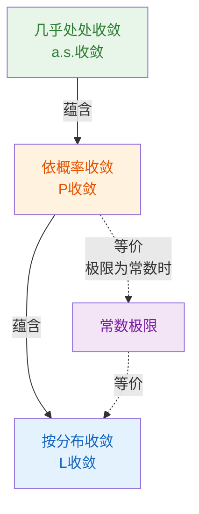
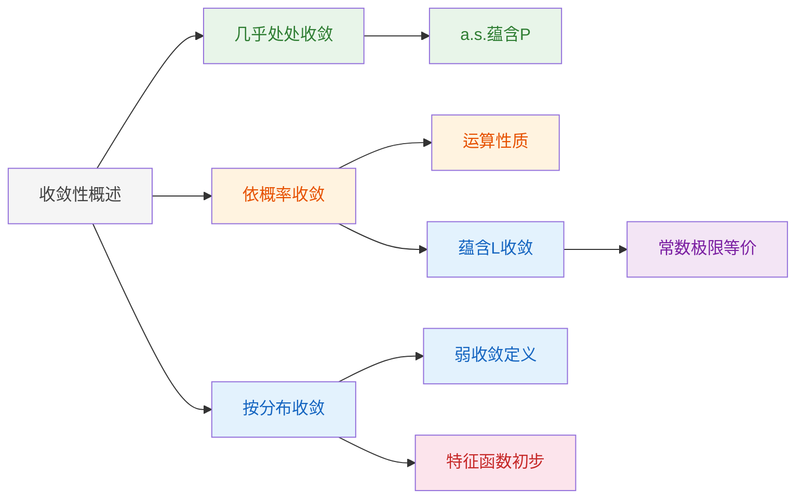

# 4.1 随机变量序列的两种收敛性

> [!abstract] 本节概览
> 本节是第四章极限定理的起点，引入随机变量序列收敛性的核心概念。重点讨论==几乎处处收敛==、==依概率收敛==和==按分布收敛（弱收敛）==三种收敛方式，建立它们之间的蕴含关系，并初步引入==特征函数==作为后续分析工具。
>
> **逻辑链条**：几乎处处收敛（a.s.收敛）→ 依概率收敛（$P$ 收敛）→ 按分布收敛（$L$ 收敛）→ 收敛关系总结 → 特征函数初步
>
> **前置依赖**：[[2.1 随机变量及其分布|§2.1]]（分布函数）、[[2.2 数学期望|§2.2]]（期望）、[[2.3 方差与标准差|§2.3]]（方差）、[[3.4 多维随机变量的特征数|§3.4]]（协方差）
>
> **核心主线**：三种收敛性从强到弱形成链条，其中依概率收敛和按分布收敛是极限定理（大数定律、中心极限定理）的理论基石。

---

## 一、随机变量序列的收敛性概述

在概率论中，我们经常需要研究随机变量序列 $\{X_n\}_{n=1}^{\infty}$ 在某种意义下"趋近"于一个随机变量 $X$。与实数序列的极限不同，随机变量的取值具有随机性，因此需要从不同角度定义"收敛"。

### 函数序列的收敛回顾

设 $\{f_n(x)\}$ 为定义域 $D$ 上的函数序列，$f(x)$ 为 $D$ 上的函数：

- **点点收敛**：$\forall\, x_0 \in D$，$f_n(x_0) \to f(x_0)$
- **一致收敛**：$\sup_{x \in D} |f_n(x) - f(x)| \to 0$

### 随机变量序列收敛的分类

随机变量序列的收敛可以从两个角度理解：

1. **从样本点角度**：固定 $\omega \in \Omega$，考察数列 $\{X_n(\omega)\}$ 是否收敛到 $X(\omega)$
2. **从概率角度**：考察事件 $\{|X_n - X| < \varepsilon\}$ 的概率是否趋于 1

本节重点讨论以下三种收敛：

| 收敛类型 | 记号 | 强弱 | 本节地位 |
|---------|------|:----:|---------|
| 几乎处处收敛 | $X_n \xrightarrow{\text{a.s.}} X$ | 最强 | 了解 |
| 依概率收敛 | $X_n \xrightarrow{P} X$ | 中 | **掌握** |
| 按分布收敛 | $X_n \xrightarrow{L} X$ | 最弱 | **掌握** |

> [!tip] 生活化类比
> 想象一个射击训练：射手每天射击一次，$X_n$ 是第 $n$ 天的落点与靶心的偏差。
> - **几乎处处收敛**：每一天的落点都越来越接近靶心（几乎每天都如此）
> - **依概率收敛**：落点远离靶心的概率越来越小（偶尔可能打偏，但概率趋零）
> - **按分布收敛**：落点的整体分布模式趋近于某个固定分布（不关心具体哪一枪）

---

## 二、几乎处处收敛

### 定义

> [!def] 定义 4.1.1 — 几乎处处收敛（a.s. 收敛）
> 设 $\{X_n\}$ 为随机变量序列，$X$ 为随机变量。若
> $$
> P\!\left(\left\{\omega : \lim_{n \to \infty} X_n(\omega) = X(\omega)\right\}\right) = 1
> $$
> 则称 $\{X_n\}$ **几乎处处收敛**（almost surely converge）于 $X$，记作 $X_n \xrightarrow{\text{a.s.}} X$。

**理解要点**：几乎处处收敛要求除了一个概率为零的集合外，对每一个样本点 $\omega$，数列 $\{X_n(\omega)\}$ 都收敛到 $X(\omega)$。这是最强的收敛方式，条件最为苛刻。

### 与依概率收敛的关系

几乎处处收敛蕴含依概率收敛（但反之不成立），这一关系将在第四节"收敛性关系总结"中详细讨论。

---

## 三、依概率收敛

### 定义

> [!def] 定义 4.1.2 — 依概率收敛（公式4.1.1）
> 设 $\{X_n\}$ 为随机变量序列，$X$ 为随机变量。若对任意 $\varepsilon > 0$，有
> $$
> \lim_{n \to \infty} P(|X_n - X| \geq \varepsilon) = 0 \tag{4.1.1}
> $$
> 则称 $\{X_n\}$ **依概率收敛**（converge in probability）于 $X$，记作 $X_n \xrightarrow{P} X$。

**等价形式**：定义中的 $P(|X_n - X| \geq \varepsilon) \to 0$ 等价于 $P(|X_n - X| < \varepsilon) \to 1$。

**理解要点**：依概率收敛不要求每一个样本点都收敛，只要求 $X_n$ 与 $X$ 的偏差超过任意给定阈值的概率趋于零。换言之，$X_n$ 以越来越大的概率"接近"$X$。

### 退化分布情形

当极限 $X$ 为常数 $c$（即 $P(X = c) = 1$）时，依概率收敛的定义简化为：

$$\forall\, \varepsilon > 0, \quad \lim_{n \to \infty} P(|X_n - c| \geq \varepsilon) = 0$$

这是==大数定律==的核心表述形式：样本均值依概率收敛到总体期望。

### 运算性质

> [!thm] 定理 4.1.1 — 依概率收敛的运算性质
> 设 $X_n \xrightarrow{P} a$，$Y_n \xrightarrow{P} b$（$a, b$ 为常数），则
> $$
> X_n + Y_n \xrightarrow{P} a + b
> $$
> $$
> X_n \times Y_n \xrightarrow{P} a \times b
> $$
> $$
> X_n \div Y_n \xrightarrow{P} a \div b \quad (b \neq 0)
> $$

**理解要点**：依概率收敛保持四则运算（在极限不为零时可做除法）。这一性质在证明大数定律的应用题中非常实用。

> [!abstract] 证明（以加法为例，乘法和除法类似）
> **证明**（以 $X_n + Y_n \xrightarrow{P} a + b$ 为例）：
>
> **第一步：利用三角不等式。** 对任意 $\varepsilon > 0$：
> $$
> |(X_n + Y_n) - (a + b)| = |(X_n - a) + (Y_n - b)| \leq |X_n - a| + |Y_n - b|
> $$
>
> **第二步：建立概率上界。** 若 $|(X_n + Y_n) - (a + b)| \geq \varepsilon$，则由三角不等式，$|X_n - a| + |Y_n - b| \geq \varepsilon$，这意味着 $|X_n - a| \geq \varepsilon/2$ 或 $|Y_n - b| \geq \varepsilon/2$ 至少有一个成立（否则两者都小于 $\varepsilon/2$，加起来小于 $\varepsilon$，矛盾）。因此
> $$
> P(|(X_n + Y_n) - (a + b)| \geq \varepsilon) \leq P(|X_n - a| \geq \varepsilon/2) + P(|Y_n - b| \geq \varepsilon/2)
> $$
>
> **第三步：取极限。** 由 $X_n \xrightarrow{P} a$ 和 $Y_n \xrightarrow{P} b$，右端两项都趋于 $0$，故
> $$
> \lim_{n \to \infty} P(|(X_n + Y_n) - (a + b)| \geq \varepsilon) = 0
> $$
> 即 $X_n + Y_n \xrightarrow{P} a + b$。
>
> **乘法和除法**的证明思路类似：利用 $|X_n Y_n - ab| = |X_n(Y_n - b) + b(X_n - a)| \leq |X_n||Y_n - b| + |b||X_n - a|$，再对 $|X_n|$ 利用==依概率收敛的有界性==（$X_n \xrightarrow{P} a$ 蕴含 $X_n$ 依概率有界）即可。
>
> $\blacksquare$

---

## 四、按分布收敛（弱收敛）

### 定义

> [!def] 定义 4.1.3 — 按分布收敛 / 弱收敛（公式4.1.2-4.1.4）
> 设 $\{X_n\}$ 为随机变量序列，$X$ 为随机变量，$F_n(x)$ 和 $F(x)$ 分别为 $X_n$ 和 $X$ 的分布函数。
>
> **分布函数版本**：若在 $F(x)$ 的每一个==连续点== $x$ 上，有
> $$
> \lim_{n \to \infty} F_n(x) = F(x) \tag{4.1.2}
> $$
> 则称 $\{F_n(x)\}$ **弱收敛**于 $F(x)$，记作 $F_n(x) \xrightarrow{W} F(x)$。
>
> **随机变量版本**：若 $F_n(x) \xrightarrow{W} F(x)$，则称 $\{X_n\}$ **按分布收敛**于 $X$，记作
> $$
> X_n \xrightarrow{L} X \tag{4.1.4}
> $$

**理解要点**：
- 弱收敛只要求在 $F(x)$ 的连续点上分布函数值趋于极限，在间断点上可以不收敛
- 按分布收敛描述的是"分布形态"的趋近，而非随机变量取值的趋近
- 随机变量的分布函数唯一确定了其概率规律，因此按分布收敛是研究极限分布的核心工具

### 与点点收敛的区别

分布函数序列的弱收敛 $\neq$ 点点收敛。弱收敛允许在 $F(x)$ 的间断点处不收敛，这是为了处理离散型随机变量的极限分布问题。

> [!example] 例 4.1.1 — 退化分布的弱收敛
> 设 $X_n$ 服从退化分布，即 $P(X_n = \frac{1}{n}) = 1$，其分布函数为
> $$
> F_n(x) = \begin{cases} 0, & x < \frac{1}{n} \\ 1, & x \geq \frac{1}{n} \end{cases}
> $$
>
> 取极限 $X \equiv 0$（退化分布），$F(x) = \mathbf{1}_{[0,+\infty)}(x)$。
>
> 在 $F(x)$ 的连续点 $x \neq 0$ 上：当 $n$ 充分大时，$\frac{1}{n} < x$，故 $F_n(x) = 1 = F(x)$。
>
> 在间断点 $x = 0$ 处：$F_n(0) = 0 \neq 1 = F(0)$，但 $x = 0$ 是 $F(x)$ 的间断点，不要求收敛。
>
> 因此 $F_n(x) \xrightarrow{W} F(x)$，即 $X_n \xrightarrow{L} 0$。

---

## 五、两种收敛的关系

### 依概率收敛蕴含按分布收敛

> [!thm] 定理 4.1.2 — $P$ 收敛蕴含 $L$ 收敛
> $$
> X_n \xrightarrow{P} X \implies X_n \xrightarrow{L} X
> $$

> [!abstract] 证明
> **证明**：
>
> **第一步：建立上界不等式。** 对任意 $\varepsilon > 0$ 和 $x$，将事件 $\{X_n \leq x\}$ 按照与 $X$ 的关系拆分为两个不相容事件：
> $$
> \{X_n \leq x\} = \{X_n \leq x,\, X > x + \varepsilon\} \cup \{X_n \leq x,\, X \leq x + \varepsilon\}
> $$
> （思路：如果 $X$ 比 $x$ 大很多（$> x+\varepsilon$），而 $X_n \leq x$，则 $|X_n - X| > \varepsilon$；否则 $X \leq x+\varepsilon$。）
>
> 因此
> $$
> F_n(x) = P(X_n \leq x) \leq P(|X_n - X| > \varepsilon) + P(X \leq x + \varepsilon) = P(|X_n - X| > \varepsilon) + F(x + \varepsilon)
> $$
>
> **第二步：取上极限。** 令 $n \to \infty$，由 $X_n \xrightarrow{P} X$ 知 $P(|X_n - X| > \varepsilon) \to 0$，故
> $$
> \limsup_{n \to \infty} F_n(x) \leq F(x + \varepsilon)
> $$
>
> **第三步：建立下界不等式。** 类似地，将事件 $\{X \leq x - \varepsilon\}$ 拆分：
> $$
> \{X \leq x - \varepsilon\} = \{X \leq x - \varepsilon,\, X_n > x\} \cup \{X \leq x - \varepsilon,\, X_n \leq x\}
> $$
> 因此 $P(X \leq x - \varepsilon) \leq P(|X_n - X| > \varepsilon) + P(X_n \leq x) = P(|X_n - X| > \varepsilon) + F_n(x)$，整理得
> $$
> F_n(x) \geq P(X \leq x - \varepsilon) - P(|X_n - X| > \varepsilon) = F(x - \varepsilon) - P(|X_n - X| > \varepsilon)
> $$
>
> **第四步：取下极限。** 令 $n \to \infty$：
> $$
> \liminf_{n \to \infty} F_n(x) \geq F(x - \varepsilon)
> $$
>
> **第五步：令 $\varepsilon \to 0$。** 结合第二步和第四步：
> $$
> F(x - \varepsilon) \leq \liminf_{n \to \infty} F_n(x) \leq \limsup_{n \to \infty} F_n(x) \leq F(x + \varepsilon)
> $$
> 在 $F(x)$ 的连续点上，令 $\varepsilon \to 0$，由==夹逼定理==得 $\lim_{n \to \infty} F_n(x) = F(x)$。
>
> $\blacksquare$

### 常数极限下的等价性

> [!thm] 定理 4.1.3 — 常数极限下 $P$ 收敛与 $L$ 收敛等价
> $$
> X_n \xrightarrow{P} c \iff X_n \xrightarrow{L} c \quad (c \text{ 为常数})
> $$

> [!abstract] 证明
> **证明**：
>
> **"$\Rightarrow$"方向（$P$ 收敛 $\Rightarrow$ $L$ 收敛）：** 由定理 4.1.2 — $P$ 收敛蕴含 $L$ 收敛直接得到，无需额外证明。
>
> **"$\Leftarrow$"方向（$L$ 收敛 $\Rightarrow$ $P$ 收敛）：**
>
> **第一步：写出依概率收敛的定义。** 要证 $X_n \xrightarrow{P} c$，即对任意 $\varepsilon > 0$，$P(|X_n - c| \geq \varepsilon) \to 0$。
>
> **第二步：将概率拆分为两个尾部。**
> $$
> P(|X_n - c| \geq \varepsilon) = P(X_n \leq c - \varepsilon) + P(X_n \geq c + \varepsilon)
> $$
> $$
> = F_n(c - \varepsilon) + 1 - F_n(c + \varepsilon^-)
> $$
> （这里 $F_n(c+\varepsilon^-) = \lim_{x \uparrow c+\varepsilon} F_n(x)$ 是左极限。）
>
> **第三步：利用依分布收敛求极限。** $X_n \xrightarrow{L} c$ 意味着 $F_n(x) \to F(x) = \mathbf{1}_{[c,+\infty)}(x)$ 在 $F$ 的连续点 $x \neq c$ 上成立。由于 $c - \varepsilon < c$ 和 $c + \varepsilon > c$ 都是 $F$ 的连续点，故
> $$
> \lim_{n \to \infty} F_n(c - \varepsilon) = F(c - \varepsilon) = 0, \quad \lim_{n \to \infty} F_n(c + \varepsilon^-) = F(c + \varepsilon) = 1
> $$
>
> **第四步：得出结论。**
> $$
> \lim_{n \to \infty} P(|X_n - c| \geq \varepsilon) = 0 + 1 - 1 = 0
> $$
> 即 $X_n \xrightarrow{P} c$。
>
> $\blacksquare$

### 反例：$L$ 收敛不蕴含 $P$ 收敛

> [!example] 例 4.1.2 — 依分布收敛但不依概率收敛的反例
> 设 $X$ 满足 $P(X = -1) = \frac{1}{2}$，$P(X = 1) = \frac{1}{2}$。
>
> 令 $X_n = -X$（即 $X_n$ 与 $X$ 始终取相反值），则：
> - $X_n$ 与 $X$ 同分布（都是 $\pm 1$ 各取 $\frac{1}{2}$），故 $X_n \xrightarrow{L} X$
> - 但 $|X_n - X| = |{-X} - X| = 2$，故 $P(|X_n - X| \geq 1) = 1$ 不趋于零，$X_n \not\xrightarrow{P} X$

**理解要点**：按分布收敛只关心分布形态，不关心随机变量之间的"同步性"。$X_n = -X$ 与 $X$ 分布相同，但每一时刻都取相反的值，因此不依概率收敛。

---

## 六、特征函数初步

本节末尾引入特征函数的概念，为后续中心极限定理的证明做准备。

### 复随机变量

设 $X(\omega)$ 和 $Y(\omega)$ 为定义在概率空间 $(\Omega, \mathcal{F}, P)$ 上的实值随机变量，则

$$Z(\omega) = X(\omega) + iY(\omega)$$

称为==复随机变量==，其共轭为 $\overline{Z} = X - iY$，模为 $|Z| = \sqrt{X^2 + Y^2}$。

复随机变量的期望定义为 $E(Z) = E(X) + iE(Y)$，要求 $E(X)$ 和 $E(Y)$ 都存在。

### 欧拉公式与复指数

对实随机变量 $X$，$e^{iX}$ 是一个复随机变量。由欧拉公式：

$$e^{iX} = \cos X + i\sin X$$

其期望为 $E(e^{iX}) = E(\cos X) + iE(\sin X)$，且 $|e^{iX}| = \sqrt{\cos^2 X + \sin^2 X} = 1$。

若 $X$ 与 $Y$ 独立，则 $e^{iX}$ 与 $e^{iY}$ 也独立。

### 特征函数的定义

> [!def] 定义 4.2.1 — 特征函数（公式4.2.1）
> 设 $X$ 为随机变量，称
> $$
> \varphi(t) = E(e^{itX}), \quad -\infty < t < +\infty \tag{4.2.1}
> $$
> 为 $X$ 的==特征函数==（characteristic function）。

**理解要点**：
- 特征函数是 $t$ 的函数，对每一个固定的 $t$，$\varphi(t)$ 是一个期望值
- 由于 $|e^{itX}| = 1$，特征函数==一定存在==（不像矩母函数可能不存在）
- 特征函数与分布函数相互唯一确定（逆转定理），是研究极限分布的强大工具
- 特征函数的详细性质将在§4.2中展开

---

## 七、收敛性关系总结

### 三种收敛的强弱关系

$$X_n \xrightarrow{\text{a.s.}} X \implies X_n \xrightarrow{P} X \implies X_n \xrightarrow{L} X$$

$$X_n \xrightarrow{P} c \iff X_n \xrightarrow{L} c \quad (c \text{ 为常数})$$

### 关系图

### 核心要点

| 关系 | 说明 |
|------|------|
| a.s.收敛 ⇒ P收敛 | 几乎每个样本点都收敛，自然偏差的概率趋于零 |
| P收敛 ⇒ L收敛 | 收敛到确定值，分布自然趋近 |
| L收敛 ⇏ P收敛 | 反例：$X_n = -X$ 与 $X$ 同分布但不"同步" |
| P收敛 ⇏ a.s.收敛 | 存在反例（如"滑动窗"序列） |
| 极限为常数时 P ⇔ L | 常数是特殊的退化分布，此时两种收敛等价 |

---

## 八、知识结构总览

---

## 九、核心思想与证明技巧

### 核心思想

1. **分层收敛体系**：三种收敛从不同角度描述"趋近"，形成完整的强弱链条。选择哪种收敛取决于问题的需要——大数定律用 $P$ 收敛，中心极限定理用 $L$ 收敛
2. **分布函数是桥梁**：按分布收敛通过分布函数定义，将随机变量的收敛问题转化为函数序列的收敛问题
3. **常数极限的特殊性**：当极限为常数时，$P$ 收敛与 $L$ 收敛等价，这大大简化了大数定律的表述

### 证明技巧

| 技巧 | 说明 | 应用场景 |
|------|------|---------|
| 夹逼分布函数 | 利用 $F_n(x) \leq F(x+\varepsilon) + P(|X_n - X| > \varepsilon)$ | 证明 $P$ 收敛 ⇒ $L$ 收敛 |
| 选取连续点 | 弱收敛只在 $F$ 的连续点要求收敛 | 退化分布的弱收敛 |
| 利用独立性 | 独立随机变量的函数也独立 | 特征函数的乘法性质 |

---

## 十、补充理解与易混淆点

### 依概率收敛与依分布收敛的混淆

**来源**：茆诗松教材§4.1 + 卡方训练营讲义 + 2020北京大学431真题 + 2024清华大学432真题 + 维基百科"随机变量的收敛" + CSDN"概率论四大收敛关系图解"

> [!danger] 误区1："$X_n \xrightarrow{L} X$ 就意味着 $X_n$ 越来越接近 $X$"
> ❌ 错误解释：按分布收敛只要求分布函数在连续点上趋近，完全不要求 $X_n$ 和 $X$ 的取值接近。反例中 $X_n = -X$ 与 $X$ 始终相差 2，但分布相同。更一般地，$X_n$ 甚至不需要和 $X$ 定义在同一个概率空间上——按分布收敛只关心"分布形态"的相似性。
> ✅ 正确解释：按分布收敛描述的是"分布形态"的趋近，而非"取值"的趋近。只有依概率收敛才真正描述随机变量取值的接近。依分布收敛甚至不要求 $X_n$ 和 $X$ 定义在同一个概率空间上，这是它与 $P$ 收敛的本质区别之一。

### 弱收敛中连续点要求的忽视

**来源**：茆诗松教材§4.1 + 卡方训练营讲义 + 2018厦门大学868真题 + 2021南开大学432真题 + 复旦大学432讲义 + duanyll.com"概统速通" + 51CTO博客"依分布收敛的定义细节"

> [!danger] 误区2："弱收敛要求 $F_n(x) \to F(x)$ 对所有 $x$ 成立"
> ❌ 错误解释：弱收敛只要求在 $F(x)$ 的连续点上成立。在间断点上可以不收敛（甚至可以振荡）。
> ✅ 正确解释：弱收敛的定义是 $\lim_{n \to \infty} F_n(x) = F(x)$ 在 $F(x)$ 的每一个连续点上成立。间断点处的收敛性不做要求，这是为了统一处理离散型和连续型随机变量的极限分布。一个直观的理解是：分布函数在间断点处的"跳跃高度"由概率质量决定，而弱收敛只关心概率质量的"整体转移趋势"，不关心在单个跳跃点处的精确行为。

### 收敛方向（蕴含关系）的混淆

**来源**：茆诗松教材§4.1 + 卡方训练营讲义 + 2018复旦大学861真题 + 2020中国人民大学805真题 + 2017北京大学431真题 + 道客巴巴"依概率收敛的注记" + zhongyl0430.github.io"依分布收敛"

> [!danger] 误区3："按分布收敛可以推出依概率收敛"
> ❌ 错误解释：$L$ 收敛是三种收敛中最弱的，不能反向推出更强的收敛。$X_n = -X$ 就是 $L$ 收敛但不 $P$ 收敛的经典反例。另一个常见的反例是 $X_n = (-1)^n X$（$X \sim N(0,1)$），$X_n$ 与 $X$ 同分布故 $L$ 收敛，但 $X_n$ 在 $X$ 和 $-X$ 之间振荡，不依概率收敛于任何随机变量。
> ✅ 正确解释：蕴含关系是单向的：a.s.收敛 ⇒ $P$收敛 ⇒ $L$收敛。只有当极限为常数时，$P$收敛与$L$收敛才互推。从弱收敛推到强收敛通常需要额外条件，如极限为常数、序列具有某种一致性等。

---

## 十一、习题精选

> [!todo] 习题概览
>
> | 编号 | 题目来源 | 知识点 | 难度 |
> |:----:|:--------:|:------:|:----:|
> | 1 | 教材4.1-1 | 依概率收敛的定义验证 | ★★☆ |
> | 2 | 教材4.1-2 | 弱收敛的判定 | ★★☆ |
> | 3 | 教材4.1-3 | 依概率收敛的运算性质 | ★★★ |
> | 4 | 教材4.1-4 | 收敛关系的判断 | ★★★ |
> | 5 | 教材4.1-5 | 特征函数的计算 | ★★☆ |
> | 6 | 教材4.1-6 | 退化分布的弱收敛 | ★★☆ |
> | 7 | 2020北京大学431 | 依概率收敛与大数定律 | ★★★ |
> | 8 | 2021南开大学432 | 经验分布函数的四种收敛 | ★★★ |
> | 9 | 2018厦门大学868 | 样本方差的依概率收敛 | ★★★ |
> | 10 | 2020中国人民大学805 | 依分布收敛与中心极限定理 | ★★★ |

### 习题1 — 教材4.1-1：依概率收敛的定义验证

> [!problem] 习题1 — 教材4.1-1
> 设 $X_n \sim U(0, \frac{1}{n})$，证明 $X_n \xrightarrow{P} 0$。

> [!faq]- 查看解答
> **解**：对任意 $\varepsilon > 0$，当 $n > \frac{1}{\varepsilon}$ 时，有 $\frac{1}{n} < \varepsilon$，从而
> $$
> P(|X_n - 0| \geq \varepsilon) = P(X_n \geq \varepsilon) = 0
> $$
> 当 $n \leq \frac{1}{\varepsilon}$ 时，
> $$
> P(|X_n - 0| \geq \varepsilon) = P\!\left(X_n \geq \varepsilon\right) = \frac{\frac{1}{n} - \varepsilon}{\frac{1}{n}} = 1 - n\varepsilon
> $$
> 因此 $\lim_{n \to \infty} P(|X_n| \geq \varepsilon) = 0$，即 $X_n \xrightarrow{P} 0$。
> $\blacksquare$

### 习题2 — 教材4.1-2：弱收敛的判定

> [!problem] 习题2 — 教材4.1-2
> 设 $X_n$ 的分布函数为 $F_n(x) = 1 - e^{-nx}\cdot\mathbf{1}_{(0,+\infty)}(x)$，判断 $X_n$ 是否按分布收敛，若收敛求极限分布。

> [!faq]- 查看解答
> **解**：$F_n(x)$ 是参数为 $n$ 的指数分布的分布函数。
>
> 对 $x \leq 0$：$F_n(x) = 0$，极限为 $0$。
>
> 对 $x > 0$：$F_n(x) = 1 - e^{-nx} \to 1$（当 $n \to \infty$）。
>
> 取 $F(x) = \mathbf{1}_{[0,+\infty)}(x)$（退化分布在 0 处），则 $F(x)$ 的唯一间断点为 $x = 0$。
>
> 在 $F(x)$ 的连续点 $x \neq 0$ 上：$\lim_{n \to \infty} F_n(x) = F(x)$ 成立。
>
> 因此 $F_n(x) \xrightarrow{W} F(x)$，即 $X_n \xrightarrow{L} 0$。
> $\blacksquare$

### 习题3 — 教材4.1-3：依概率收敛的运算性质

> [!problem] 习题3 — 教材4.1-3
> 设 $X_n \xrightarrow{P} a$，$Y_n \xrightarrow{P} b$（$a, b$ 为常数），证明 $X_n + Y_n \xrightarrow{P} a + b$。

> [!faq]- 查看解答
> **解**：对任意 $\varepsilon > 0$，利用三角不等式：
> $$
> P(|(X_n + Y_n) - (a + b)| \geq \varepsilon) \leq P(|X_n - a| + |Y_n - b| \geq \varepsilon)
> $$
> $$
> \leq P(|X_n - a| \geq \varepsilon/2) + P(|Y_n - b| \geq \varepsilon/2)
> $$
>
> 由 $X_n \xrightarrow{P} a$ 和 $Y_n \xrightarrow{P} b$，上式两项均趋于零，故
> $$
> \lim_{n \to \infty} P(|(X_n + Y_n) - (a + b)| \geq \varepsilon) = 0
> $$
> 即 $X_n + Y_n \xrightarrow{P} a + b$。
> $\blacksquare$

### 习题4 — 教材4.1-4：收敛关系的判断

> [!problem] 习题4 — 教材4.1-4
> 设 $X_1, X_2, \ldots$ 为 i.i.d. 序列，$E(X_1) = \mu$，$D(X_1) = \sigma^2$。令 $\bar{X}_n = \frac{1}{n}\sum_{i=1}^{n}X_i$，判断 $\bar{X}_n$ 的收敛类型。

> [!faq]- 查看解答
> **解**：
>
> (1) **依概率收敛**：由[[2.3 方差与标准差|切比雪夫不等式]]，
> $$
> P(|\bar{X}_n - \mu| \geq \varepsilon) \leq \frac{D(\bar{X}_n)}{\varepsilon^2} = \frac{\sigma^2}{n\varepsilon^2} \to 0
> $$
> 故 $\bar{X}_n \xrightarrow{P} \mu$（这是辛钦大数定律的特殊情形）。
>
> (2) **按分布收敛**：由 $P$ 收敛蕴含 $L$ 收敛，$\bar{X}_n \xrightarrow{L} \mu$。
>
> (3) **几乎处处收敛**：由柯尔莫哥洛夫强大数定律，$\bar{X}_n \xrightarrow{\text{a.s.}} \mu$。
>
> 因此 $\bar{X}_n$ 同时具有三种收敛性，极限都是 $\mu$。
> $\blacksquare$

### 习题5 — 教材4.1-5：特征函数的计算

> [!problem] 习题5 — 教材4.1-5
> 设 $X \sim N(0, 1)$，求 $X$ 的特征函数 $\varphi(t)$。

> [!faq]- 查看解答
> **解**：
> $$
> \varphi(t) = E(e^{itX}) = \int_{-\infty}^{+\infty} e^{itx} \cdot \frac{1}{\sqrt{2\pi}} e^{-x^2/2}\, dx
> $$
> $$
> = \frac{1}{\sqrt{2\pi}} \int_{-\infty}^{+\infty} e^{-(x^2 - 2itx)/2}\, dx
> $$
>
> 配方：$x^2 - 2itx = (x - it)^2 + t^2$，故
> $$
> \varphi(t) = \frac{1}{\sqrt{2\pi}} e^{-t^2/2} \int_{-\infty}^{+\infty} e^{-(x-it)^2/2}\, dx
> $$
>
> 由复变函数围道积分（或直接利用标准正态密度积分值为 $\sqrt{2\pi}$），上式积分等于 $\sqrt{2\pi}$，故
> $$
> \varphi(t) = e^{-t^2/2}
> $$
> $\blacksquare$

### 习题6 — 教材4.1-6：退化分布的弱收敛

> [!problem] 习题6 — 教材4.1-6
> 设 $X_n \sim b(n, p_n)$，其中 $np_n \to \lambda > 0$。证明 $X_n \xrightarrow{L} \text{Poisson}(\lambda)$。

> [!faq]- 查看解答
> **解**：$X_n$ 的分布律为 $P(X_n = k) = \binom{n}{k}p_n^k(1-p_n)^{n-k}$。
>
> 令 $\lambda_n = np_n$，则 $p_n = \lambda_n / n$，$\lambda_n \to \lambda$。
>
> $$
> P(X_n = k) = \frac{n(n-1)\cdots(n-k+1)}{k!}\left(\frac{\lambda_n}{n}\right)^k \left(1 - \frac{\lambda_n}{n}\right)^{n-k}
> $$
> $$
> = \frac{\lambda_n^k}{k!} \cdot \frac{n}{n} \cdot \frac{n-1}{n} \cdots \frac{n-k+1}{n} \cdot \left(1 - \frac{\lambda_n}{n}\right)^{n-k}
> $$
>
> 当 $n \to \infty$ 时：
> - $\lambda_n^k \to \lambda^k$
> - $\frac{n(n-1)\cdots(n-k+1)}{n^k} \to 1$
> - $\left(1 - \frac{\lambda_n}{n}\right)^{n-k} = \left(1 - \frac{\lambda_n}{n}\right)^n \cdot \left(1 - \frac{\lambda_n}{n}\right)^{-k} \to e^{-\lambda} \cdot 1 = e^{-\lambda}$
>
> 因此 $P(X_n = k) \to \frac{\lambda^k}{k!} e^{-\lambda}$，即 $X_n$ 的分布律点态收敛到 $\text{Poisson}(\lambda)$ 的分布律，故 $X_n \xrightarrow{L} Y$，其中 $Y \sim \text{Poisson}(\lambda)$。
> $\blacksquare$

### 习题7 — 2020北京大学431：依概率收敛与大数定律

> [!problem] 习题7 — 2020北京大学431
> 设 $X_1, X_2, \ldots, X_n$ 相互独立且同服从 $U(0,1)$，令 $Y_n = \frac{1}{n}\sum_{i=1}^{n} e^{2X_i}$。
>
> (1) 求 $E(Y_n)$ 和 $\text{Var}(Y_n)$；
>
> (2) 证明 $Y_n$ 依概率收敛到某个常数 $y$，并求 $y$。

> [!faq]- 查看解答
> **解**：
>
> (1) $E(Y_n) = E(e^{2X_1}) = \int_0^1 e^{2x}\, dx = \frac{1}{2}(e^2 - 1)$。
>
> $$
> E(e^{4X_1}) = \int_0^1 e^{4x}\, dx = \frac{1}{4}(e^4 - 1)
> $$
> $$
> \text{Var}(e^{2X_1}) = \frac{1}{4}(e^4 - 1) - \left[\frac{1}{2}(e^2 - 1)\right]^2 = \frac{1}{4}(e^4 - 1) - \frac{1}{4}(e^2 - 1)^2
> $$
> $$
> = \frac{1}{4}\left[(e^4 - 1) - (e^4 - 2e^2 + 1)\right] = \frac{1}{4}(2e^2 - 2) = \frac{1}{2}(e^2 - 1)
> $$
>
> 因此 $\text{Var}(Y_n) = \frac{1}{n}\text{Var}(e^{2X_1}) = \frac{e^2 - 1}{2n}$。
>
> (2) 由[[2.2 数学期望|辛钦大数定律]]，$Y_n = \frac{1}{n}\sum_{i=1}^{n} e^{2X_i} \xrightarrow{P} E(e^{2X_1}) = \frac{1}{2}(e^2 - 1)$。
>
> 故 $y = \frac{e^2 - 1}{2}$。
> $\blacksquare$

### 习题8 — 2021南开大学432：经验分布函数的四种收敛

> [!problem] 习题8 — 2021南开大学432
> 设 $X_1, X_2, \ldots, X_n$ 为 i.i.d. 随机变量，$F(x)$ 为其共同的分布函数。经验分布函数定义为 $F_n(x) = \frac{1}{n}\sum_{i=1}^{n} \mathbf{1}_{\{X_i \leq x\}}$。证明 $F_n(x)$ 分别依概率收敛、依分布收敛、依概率 1 收敛、均方收敛于 $F(x)$。

> [!faq]- 查看解答
> **解**：记 $I_i = \mathbf{1}_{\{X_i \leq x\}}$，则 $I_i$ i.i.d. $\sim b(1, F(x))$，且 $F_n(x) = \frac{1}{n}\sum_{i=1}^{n} I_i$。
>
> **依概率收敛**：由辛钦大数定律，$F_n(x) \xrightarrow{P} E(I_1) = F(x)$。
>
> **依分布收敛**：由 $P$ 收敛蕴含 $L$ 收敛，$F_n(x) \xrightarrow{L} F(x)$。
>
> **均方收敛**：$E(F_n(x)) = \frac{1}{n} \cdot nF(x) = F(x)$，均方误差为
> $$
> E(F_n(x) - F(x))^2 = \text{Var}(F_n(x)) = \frac{F(x)(1 - F(x))}{n} \to 0
> $$
> 故 $F_n(x) \xrightarrow{L^2} F(x)$。
>
> **依概率 1 收敛**：由柯尔莫哥洛夫强大数定律（独立同分布场合），$\frac{1}{n}\sum_{i=1}^{n} I_i \xrightarrow{\text{a.s.}} F(x)$。
> $\blacksquare$

### 习题9 — 2018厦门大学868：样本方差的依概率收敛

> [!problem] 习题9 — 2018厦门大学868
> 设 $X_1, X_2, \ldots$ 独立同分布，均值为 $\mu$，方差为 $\sigma^2$，样本方差为 $S_n^2 = \frac{1}{n}\sum_{i=1}^{n}(X_i - \bar{X}_n)^2$。证明：$S_n^2$ 依概率收敛于 $\sigma^2$。

> [!faq]- 查看解答
> **解**：不妨设 $E(X_n) = 0$（否则令 $X_n' = X_n - E(X_n)$，以 $X_n'$ 代替 $\{X_n\}$，此时 $\sigma^2$ 和 $S_n^2$ 均保持不变）。
>
> $$
> S_n^2 = \frac{1}{n}\sum_{i=1}^{n}(X_i - \bar{X}_n)^2 = \frac{1}{n}\sum_{i=1}^{n} X_i^2 - \bar{X}_n^2
> $$
>
> 由辛钦大数定律：
> - $\frac{1}{n}\sum_{i=1}^{n} X_i^2 \xrightarrow{P} E(X_1^2) = \sigma^2$
> - $\bar{X}_n = \frac{1}{n}\sum_{i=1}^{n} X_i \xrightarrow{P} E(X_1) = 0$
>
> 再由依概率收敛的运算性质，$\bar{X}_n^2 \xrightarrow{P} 0$，从而
> $$
> S_n^2 = \frac{1}{n}\sum_{i=1}^{n} X_i^2 - \bar{X}_n^2 \xrightarrow{P} \sigma^2 - 0 = \sigma^2
> $$
>
> 进一步，由 $S_n^2 = \frac{n}{n-1} \cdot \frac{1}{n}\sum_{i=1}^{n}(X_i - \bar{X}_n)^2$，利用 $\frac{n}{n-1} \to 1$ 和依概率收敛的乘法性质，同样可得 $S_n^2 \xrightarrow{P} \sigma^2$。
> $\blacksquare$

### 习题10 — 2020中国人民大学805：依分布收敛与中心极限定理

> [!problem] 习题10 — 2020中国人民大学805
> 设 $W$ 服从 $\chi^2(n)$ 分布，计算其均值和方差，构造 $W$ 的一个函数 $f(w)$，使得 $f(W)$ 依分布收敛于标准正态分布。

> [!faq]- 查看解答
> **解**：$W \sim \chi^2(n)$ 可以分解为 $n$ 个独立同分布的 $\chi^2(1)$ 随机变量之和：
> $$
> W = \sum_{i=1}^{n} X_i, \quad X_i \text{ i.i.d. } \sim \chi^2(1)
> $$
>
> $\chi^2(1)$ 的均值 $E(X_i) = 1$，方差 $\text{Var}(X_i) = 2$。
>
> 因此 $E(W) = n$，$\text{Var}(W) = 2n$。
>
> 由[[2.6 随机变量函数的分布|林德伯格-列维中心极限定理]]：
> $$
> \frac{W - n}{\sqrt{2n}} \xrightarrow{L} N(0, 1)
> $$
>
> 令 $f(w) = \frac{w - n}{\sqrt{2n}}$，则 $f(W) \xrightarrow{L} N(0, 1)$。
> $\blacksquare$

---

## 十二、教材原文

> [!info] 以下为教材扫描版原文，可点击翻阅。

#学习/概率论与统计/第四章 随机变量序列的极限定理/收敛性
