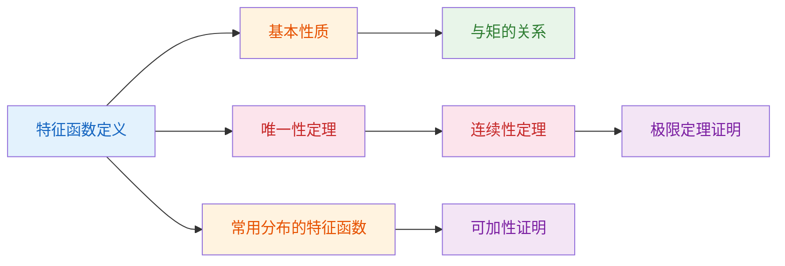

# 4.2 特征函数

> [!abstract] 本节概览
> 本节系统建立==特征函数==的完整理论框架。特征函数是连接概率分布与极限定理的核心工具，它将分布函数的收敛问题转化为函数序列的点态收敛问题，从而为[[4.1 随机变量序列的两种收敛性|大数定律]]和中心极限定理的证明提供关键桥梁。
>
> **逻辑链条**：特征函数定义 → 常用分布的特征函数 → 基本性质 → 与矩的关系 → 唯一性定理（逆转公式）→ 连续性定理
>
> **前置依赖**：[[4.1 随机变量序列的两种收敛性|§4.1]]（复随机变量、欧拉公式）、[[2.2 数学期望|§2.2]]（期望）、[[2.3 方差与标准差|§2.3]]（方差）
>
> **核心主线**：特征函数与分布函数一一对应（唯一性定理），且独立随机变量和的特征函数等于各特征函数之积，这使得复杂的分布问题可以通过特征函数的乘法结构来简化。

---

## 一、特征函数的定义

### 复随机变量回顾

在[[4.1 随机变量序列的两种收敛性|§4.1]]中已经引入了复随机变量的概念。设 $X(\omega)$ 和 $Y(\omega)$ 为实值随机变量，则

$$Z(\omega) = X(\omega) + iY(\omega)$$

称为==复随机变量==，其期望为 $E(Z) = E(X) + iE(Y)$。若 $X$ 与 $Y$ 独立，则 $Z$ 的期望等于期望之积。

由欧拉公式 $e^{iX} = \cos X + i\sin X$，有 $|e^{iX}| = \sqrt{\cos^2 X + \sin^2 X} = 1$，故 $e^{iX}$ 的期望一定存在。

### 特征函数的定义

> [!def] 定义 4.2.1 — 特征函数（公式4.2.1）
> 设 $X$ 为随机变量，称
> $$
> \varphi(t) = E(e^{itX}), \quad -\infty < t < +\infty \tag{4.2.1}
> $$
> 为 $X$ 的==特征函数==（characteristic function）。

**理解要点**：
- 特征函数是实变量 $t$ 的复值函数，对每个固定的 $t$，$\varphi(t)$ 是一个期望值
- 由于 $|e^{itX}| = 1$，特征函数==一定存在==（不像[[2.7 分布的其他特征数|矩母函数]]可能不存在）
- $\varphi(0) = E(e^{i \cdot 0 \cdot X}) = E(1) = 1$

### 离散型和连续型的计算公式

> [!def] 定义 4.2.2 — 离散型特征函数（公式4.2.2）
> 若 $X$ 为离散型随机变量，分布律为 $P(X = x_k) = p_k$（$k = 1, 2, \ldots$），则
> $$
> \varphi(t) = \sum_{k=1}^{\infty} e^{itx_k}\, p_k, \quad -\infty < t < +\infty \tag{4.2.2}
> $$

> [!def] 定义 4.2.3 — 连续型特征函数（公式4.2.3）
> 若 $X$ 为连续型随机变量，密度函数为 $p(x)$，则
> $$
> \varphi(t) = \int_{-\infty}^{+\infty} e^{itx}\, p(x)\, dx, \quad -\infty < t < +\infty \tag{4.2.3}
> $$

**理解要点**：连续型的特征函数本质上是密度函数 $p(x)$ 的==傅里叶变换==（差一个符号约定）。这一联系是特征函数强大功能的数学根源。

---

## 二、常用分布的特征函数

### 退化分布

若 $P(X = a) = 1$，则

$$\varphi(t) = e^{ita}$$

### 二点分布

> [!example] 例 4.2.1 — 二点分布的特征函数
> 设 $X \sim b(1, p)$，即 $P(X = x) = p^x(1-p)^{1-x}$（$x = 0, 1$），则
> $$
> \varphi(t) = e^{it \cdot 0} \cdot (1-p) + e^{it \cdot 1} \cdot p = (1-p) + pe^{it}
> $$

### 泊松分布

> [!example] 例 4.2.2 — 泊松分布的特征函数
> 设 $X \sim P(\lambda)$，即 $P(X = k) = \frac{\lambda^k}{k!}e^{-\lambda}$（$k = 0, 1, \ldots$），则
> $$
> \varphi(t) = \sum_{k=0}^{\infty} e^{itk} \cdot \frac{\lambda^k}{k!}e^{-\lambda} = e^{-\lambda} \sum_{k=0}^{\infty} \frac{(\lambda e^{it})^k}{k!} = e^{-\lambda} \cdot e^{\lambda e^{it}} = e^{\lambda(e^{it} - 1)}
> $$

### 均匀分布

> [!example] 例 4.2.3 — 均匀分布的特征函数
> 设 $X \sim U(a, b)$，密度为 $p(x) = \frac{1}{b-a}\mathbf{1}_{\{a < x < b\}}$，则
> $$
> \varphi(t) = \frac{1}{b-a}\int_a^b e^{itx}\, dx = \frac{e^{itb} - e^{ita}}{it(b-a)}
> $$

### 标准正态分布

> [!example] 例 4.2.4 — 标准正态分布的特征函数
> 设 $X \sim N(0, 1)$，密度为 $p(x) = \frac{1}{\sqrt{2\pi}} e^{-x^2/2}$，则
> $$
> \varphi(t) = \frac{1}{\sqrt{2\pi}} \int_{-\infty}^{+\infty} e^{itx} e^{-x^2/2}\, dx
> $$
>
> **解**：将 $e^{itx}$ 泰勒展开：
> $$
> \varphi(t) = \sum_{n=0}^{\infty} \frac{(it)^n}{n!} \cdot \frac{1}{\sqrt{2\pi}} \int_{-\infty}^{+\infty} x^n e^{-x^2/2}\, dx
> $$
>
> 利用标准正态的矩公式 $E(X^n) = 0$（$n$ 奇数）、$E(X^{2m}) = \frac{(2m)!}{2^m \cdot m!}$：
> $$
> \varphi(t) = \sum_{m=0}^{\infty} \frac{(it)^{2m}}{(2m)!} \cdot \frac{(2m)!}{2^m \cdot m!} = \sum_{m=0}^{\infty} \frac{(-1)^m t^{2m}}{2^m \cdot m!} = e^{-t^2/2}
> $$

### 指数分布

> [!example] 例 4.2.5 — 指数分布的特征函数
> 设 $X \sim \text{Exp}(\lambda)$，密度为 $p(x) = \lambda e^{-\lambda x}\mathbf{1}_{\{x \geq 0\}}$，则
> $$
> \varphi(t) = \int_0^{\infty} e^{itx} \cdot \lambda e^{-\lambda x}\, dx = \lambda \int_0^{\infty} e^{-(\lambda - it)x}\, dx = \frac{\lambda}{\lambda - it} = \frac{1}{1 - \frac{it}{\lambda}}
> $$

### 常用分布特征函数汇总表

| 分布 | 特征函数 $\varphi(t)$ |
|------|----------------------|
| 退化分布 $\delta_a$ | $e^{ita}$ |
| $b(1, p)$ | $(1-p) + pe^{it}$ |
| $b(n, p)$ | $[(1-p) + pe^{it}]^n$ |
| $P(\lambda)$ | $e^{\lambda(e^{it}-1)}$ |
| $U(a, b)$ | $\dfrac{e^{itb} - e^{ita}}{it(b-a)}$ |
| $N(\mu, \sigma^2)$ | $\exp\!\left(i\mu t - \dfrac{\sigma^2 t^2}{2}\right)$ |
| $\text{Exp}(\lambda)$ | $\left(1 - \dfrac{it}{\lambda}\right)^{-1}$ |
| $\text{Ga}(\alpha, \lambda)$ | $\left(1 - \dfrac{it}{\lambda}\right)^{-\alpha}$ |
| $\chi^2(n)$ | $(1 - 2it)^{-n/2}$ |

---

## 三、特征函数的基本性质

> [!thm] 定理 4.2.1 — 特征函数的基本性质（公式4.2.4-4.2.7）
> 设 $\varphi(t)$ 为随机变量 $X$ 的特征函数，则：
>
> **(1) 有界性**：
> $$
> |\varphi(t)| \leq \varphi(0) = 1 \tag{4.2.4}
> $$
>
> **(2) 共轭对称性**：
> $$
> \varphi(-t) = \overline{\varphi(t)} \tag{4.2.5}
> $$
>
> **(3) 线性变换**：若 $Y = aX + b$（$a, b$ 为常数），则
> $$
> \varphi_Y(t) = e^{ibt}\, \varphi_X(at) \tag{4.2.6}
> $$
>
> **(4) 独立随机变量和**：若 $X$ 与 $Y$ 独立，则
> $$
> \varphi_{X+Y}(t) = \varphi_X(t)\, \varphi_Y(t) \tag{4.2.7}
> $$

**理解要点**：
- **有界性**：由 $|e^{itX}| = 1$ 和期望的三角不等式直接得到
- **共轭对称性**：$\varphi(-t) = E(e^{-itX}) = \overline{E(e^{itX})} = \overline{\varphi(t)}$
- **线性变换**：先平移（乘 $e^{ibt}$）再缩放（$t \to at$）
- **独立性乘法**：这是特征函数最重要的性质之一，它将卷积运算转化为简单的乘法运算，是证明可加性定理和中心极限定理的关键工具

> [!abstract] 证明
> **证明**：
>
> **性质(1) 有界性**：
> $$
> |\varphi(t)| = |E(e^{itX})| \leq E(|e^{itX}|) = E(1) = 1
> $$
> （第一步：利用期望的三角不等式 $|E(Z)| \leq E(|Z|)$。第二步：$|e^{itX}| = \sqrt{\cos^2(tX) + \sin^2(tX)} = 1$。）
> 又 $\varphi(0) = E(e^{i \cdot 0 \cdot X}) = E(1) = 1$，故 $|\varphi(t)| \leq \varphi(0) = 1$。
>
> **性质(2) 共轭对称性**：
> $$
> \varphi(-t) = E(e^{-itX}) = E(\overline{e^{itX}}) = \overline{E(e^{itX})} = \overline{\varphi(t)}
> $$
> （关键步骤：$\overline{e^{itX}} = e^{-itX}$，以及期望与共轭运算可交换 $\overline{E(Z)} = E(\overline{Z})$。）
>
> **性质(3) 线性变换**：设 $Y = aX + b$，
> $$
> \varphi_Y(t) = E(e^{itY}) = E(e^{it(aX+b)}) = E(e^{ibt} \cdot e^{iatX}) = e^{ibt} \cdot E(e^{i(at)X}) = e^{ibt}\,\varphi_X(at)
> $$
> （关键步骤：常数因子 $e^{ibt}$ 可以提出期望符号，变量 $X$ 的系数 $a$ 被吸收到参数 $t$ 中。）
>
> **性质(4) 独立随机变量和**：设 $X$ 与 $Y$ 独立，则 $e^{itX}$ 与 $e^{itY}$ 也独立（可测函数保持独立性），故
> $$
> \varphi_{X+Y}(t) = E(e^{it(X+Y)}) = E(e^{itX} \cdot e^{itY}) = E(e^{itX}) \cdot E(e^{itY}) = \varphi_X(t) \cdot \varphi_Y(t)
> $$
> （关键步骤：独立随机变量的乘积的期望等于期望的乘积。这一步将卷积运算转化为乘法运算。）
>
> $\blacksquare$

> [!abstract] 证明
> **证明**：若 $X \sim b(m, p)$，$Y \sim b(n, p)$ 独立，则
>
> **第一步：写出 $X$ 和 $Y$ 的特征函数。**
> $$
> \varphi_X(t) = [(1-p)+pe^{it}]^m, \quad \varphi_Y(t) = [(1-p)+pe^{it}]^n
> $$
>
> **第二步：利用独立性求和的特征函数。** 由特征函数的基本性质，$\varphi_{X+Y}(t) = \varphi_X(t) \cdot \varphi_Y(t)$：
> $$
> \varphi_{X+Y}(t) = [(1-p)+pe^{it}]^m \cdot [(1-p)+pe^{it}]^n = [(1-p)+pe^{it}]^{m+n}
> $$
>
> **第三步：识别分布。** $[(1-p)+pe^{it}]^{m+n}$ 正是 $b(m+n, p)$ 的特征函数。由逆转公式与唯一性定理，$X + Y \sim b(m+n, p)$。
>
> $\blacksquare$"

---

## 四、特征函数与矩的关系

> [!thm] 定理 4.2.2 — 特征函数与矩（公式4.2.8-4.2.9）
> 若 $E(|X|^l)$ 存在（$l$ 为正整数），则 $\varphi(t)$ 的 $k$ 阶导数存在（$1 \leq k \leq l$），且
> $$
> \varphi^{(k)}(0) = i^k E(X^k) \tag{4.2.8}
> $$
>
> 特别地，
> $$
> E(X) = \frac{\varphi'(0)}{i}, \quad \text{Var}(X) = -\varphi''(0) + [\varphi'(0)]^2 \tag{4.2.9}
> $$

**理解要点**：
- 特征函数在原点处的 $k$ 阶导数与 $X$ 的 $k$ 阶矩直接相关
- 这提供了一种计算矩的替代方法：先求特征函数，再对 $t$ 求导
- 公式(4.2.9)中方差的计算利用了 $\text{Var}(X) = E(X^2) - [E(X)]^2 = -\varphi''(0) - [\varphi'(0)/i]^2 = -\varphi''(0) + [\varphi'(0)]^2$

> [!abstract] 证明
> **证明**（以 $k = 1$ 为例，一般情形类似）：
>
> **第一步：写出导数的定义。**
> $$
> \varphi'(t) = \frac{d}{dt}E(e^{itX}) = E\!\left(\frac{d}{dt}e^{itX}\right) = E(iX \cdot e^{itX})
> $$
> （关键步骤：==交换求导与期望的顺序==。这需要验证控制收敛定理的条件：$\left|\frac{d}{dt}e^{itX}\right| = |iX e^{itX}| = |X|$，而 $E|X| < \infty$（$l \geq 1$ 阶矩存在），故交换合法。）
>
> **第二步：在 $t = 0$ 处求值。**
> $$
> \varphi'(0) = E(iX \cdot e^{i \cdot 0 \cdot X}) = E(iX) = iE(X)
> $$
>
> **第三步：解出 $E(X)$。**
> $$
> E(X) = \frac{\varphi'(0)}{i}
> $$
>
> **一般情形**（$k$ 阶导数）：类似地，$\varphi^{(k)}(t) = E\!\left((iX)^k e^{itX}\right)$，在 $t = 0$ 处：
> $$
> \varphi^{(k)}(0) = E\!\left((iX)^k\right) = i^k E(X^k)
> $$
>
> **方差公式的推导**：
> $$
> \text{Var}(X) = E(X^2) - [E(X)]^2 = \frac{\varphi''(0)}{i^2} - \left(\frac{\varphi'(0)}{i}\right)^2 = -\varphi''(0) + [\varphi'(0)]^2
> $$
>
> $\blacksquare$

> [!example] 例 4.2.6 — 用特征函数求泊松分布的期望和方差
> $X \sim P(\lambda)$，$\varphi(t) = e^{\lambda(e^{it}-1)}$。
>
> $$
> \varphi'(t) = e^{\lambda(e^{it}-1)} \cdot \lambda \cdot ie^{it} = i\lambda e^{it} \cdot \varphi(t)
> $$
> $$
> \varphi'(0) = i\lambda \cdot 1 \cdot 1 = i\lambda
> $$
> $$
> E(X) = \frac{\varphi'(0)}{i} = \frac{i\lambda}{i} = \lambda \quad \checkmark
> $$
>
> $$
> \varphi''(t) = i\lambda \left[ie^{it}\varphi(t) + e^{it}\varphi'(t)\right] = i\lambda e^{it}\left[i\varphi(t) + \varphi'(t)\right]
> $$
> $$
> \varphi''(0) = i\lambda \cdot 1 \cdot [i + i\lambda] = i\lambda(i + i\lambda) = i^2\lambda(1+\lambda) = -\lambda(1+\lambda)
> $$
> $$
> \text{Var}(X) = -\varphi''(0) + [\varphi'(0)]^2 = \lambda(1+\lambda) + (i\lambda)^2 = \lambda(1+\lambda) - \lambda^2 = \lambda \quad \checkmark
> $$

---

## 五、特征函数的唯一性定理

### 非负定性

> [!thm] 定理 4.2.3 — 特征函数的非负定性（公式4.2.10）
> 设 $\varphi(t)$ 为随机变量 $X$ 的特征函数，则对任意正整数 $n$、任意实数 $t_1, \ldots, t_n$ 和任意复数 $z_1, \ldots, z_n$，有
> $$
> \sum_{k=1}^{n}\sum_{j=1}^{n} \varphi(t_k - t_j)\, z_k\, \overline{z_j} \geq 0 \tag{4.2.10}
> $$

**理解要点**：非负定性是特征函数的本质特征——Bochner定理指出，一个函数是某个随机变量的特征函数，当且仅当它满足 $\varphi(0) = 1$、连续且非负定。

> [!abstract] 证明
> **证明**：
>
> **第一步：构造辅助复随机变量。** 令 $Z = \sum_{k=1}^{n} z_k e^{it_k X}$，其中 $z_k$ 为任意复数，$t_k$ 为任意实数。
>
> **第二步：计算 $E(|Z|^2)$。** 利用 $|Z|^2 = Z \cdot \overline{Z} \geq 0$：
> $$
> E(|Z|^2) = E\!\left(\sum_{k=1}^{n}z_k e^{it_k X} \cdot \sum_{j=1}^{n}\overline{z_j}\, e^{-it_j X}\right) = \sum_{k=1}^{n}\sum_{j=1}^{n}z_k\,\overline{z_j}\, E(e^{i(t_k-t_j)X})
> $$
> $$
> = \sum_{k=1}^{n}\sum_{j=1}^{n}\varphi(t_k - t_j)\,z_k\,\overline{z_j}
> $$
>
> **第三步：利用非负性。** 由于 $|Z|^2 \geq 0$，故 $E(|Z|^2) \geq 0$，即
> $$
> \sum_{k=1}^{n}\sum_{j=1}^{n}\varphi(t_k - t_j)\,z_k\,\overline{z_j} \geq 0
> $$
> 对任意 $n$、任意 $t_1, \ldots, t_n$ 和任意 $z_1, \ldots, z_n$ 成立。
>
> $\blacksquare$

### 逆转公式与唯一性定理

> [!thm] 定理 4.2.4 — 逆转公式与唯一性定理（公式4.2.11-4.2.12）
> **(1) 分布函数的逆转**：设 $X$ 的分布函数为 $F(x)$，特征函数为 $\varphi(t)$，则对任意 $x_1 < x_2$，
> $$
> F(x_2) - F(x_1) = \lim_{T \to \infty} \frac{1}{2\pi} \int_{-T}^{T} \frac{e^{-itx_1} - e^{-itx_2}}{it}\, \varphi(t)\, dt \tag{4.2.11}
> $$
>
> **(2) 密度函数的逆转**：若 $X$ 为连续型随机变量，且 $\int_{-\infty}^{+\infty} |\varphi(t)|\, dt < \infty$，则 $X$ 具有连续密度函数
> $$
> p(x) = \frac{1}{2\pi} \int_{-\infty}^{+\infty} e^{-itx}\, \varphi(t)\, dt \tag{4.2.12}
> $$
>
> **唯一性**：分布函数由特征函数唯一确定，即 $\varphi_1(t) = \varphi_2(t)$（$\forall\, t$）$\iff$ $F_1(x) = F_2(x)$（$\forall\, x$）。

**理解要点**：
- 逆转公式是傅里叶逆变换的概率论版本
- 唯一性定理是特征函数理论的基石：==特征函数与分布函数一一对应==
- 密度逆转公式(4.2.12)要求 $\varphi(t)$ 绝对可积，这个条件对很多分布（如正态分布）成立，但对柯西分布等厚尾分布不成立

> [!abstract] 证明思路
> **证明**（逆转公式(4.2.11)的证明思路）：
>
> **第一步：将 $F(x_2) - F(x_1)$ 表示为积分。** 利用示性函数 $\mathbf{1}_{(-\infty, x]}(u)$ 的 Fourier 表示：
> $$
> F(x_2) - F(x_1) = \int_{-\infty}^{+\infty} [\mathbf{1}_{(-\infty, x_2]}(u) - \mathbf{1}_{(-\infty, x_1]}(u)]\, dF(u)
> $$
>
> **第二步：引入 Dirichlet 积分。** 利用恒等式
> $$
> \frac{1}{2\pi}\int_{-T}^{T}\frac{e^{-itx_1} - e^{-itx_2}}{it}\, e^{itu}\, dt = \frac{1}{\pi}\int_{0}^{T}\frac{\sin(t(x_2-u)) - \sin(t(x_1-u))}{t}\, dt
> $$
> 当 $T \to \infty$ 时，这个积分在 $u \in (x_1, x_2)$ 上趋于 $1$，在 $u \notin [x_1, x_2]$ 上趋于 $0$（Dirichlet 积分的经典结果）。
>
> **第三步：交换积分顺序并取极限。** 将上述恒等式代入 $F(x_2) - F(x_1)$ 的表达式中，交换积分顺序（Fubini定理），令 $T \to \infty$ 即得(4.2.11)。
>
> **唯一性**的证明：若 $\varphi_1(t) = \varphi_2(t)$ 对所有 $t$ 成立，则由逆转公式，对任意 $x_1 < x_2$（$x_1, x_2$ 为 $F_1, F_2$ 的连续点），$F_1(x_2) - F_1(x_1) = F_2(x_2) - F_2(x_1)$。令 $x_1 \to -\infty$ 得 $F_1(x_2) = F_2(x_2)$，由连续点的稠密性得 $F_1 = F_2$。
>
> **密度逆转(4.2.12)**的证明：在(4.2.11)中令 $x_2 = x + h$，$x_1 = x - h$，除以 $2h$ 后令 $h \to 0$，左端趋于密度 $p(x)$（若存在），右端即为 Fourier 反变换公式。
>
> $\blacksquare$

---

## 六、连续性定理

> [!thm] 定理 4.2.5 — 连续性定理（Lévy连续性定理）
> **(1)** 若分布函数序列 $\{F_n(x)\}$ 弱收敛于 $F(x)$，则对应的特征函数序列 $\{\varphi_n(t)\}$ 对每个 $t$ 都收敛于 $\varphi(t)$，且在任意有界区间上一致收敛。
>
> **(2)** 若特征函数序列 $\{\varphi_n(t)\}$ 对每个 $t$ 都收敛于某个函数 $\varphi(t)$，且 $\varphi(t)$ 在 $t = 0$ 处连续，则存在分布函数 $F(x)$ 使得 $F_n(x) \xrightarrow{W} F(x)$，且 $\varphi(t)$ 是 $F(x)$ 的特征函数。

**理解要点**：
- 连续性定理建立了==分布函数收敛与特征函数收敛的等价关系==
- 方向(1)：分布收敛 ⇒ 特征函数收敛（且一致收敛）
- 方向(2)：特征函数逐点收敛（+ $\varphi$ 在 $0$ 处连续）⇒ 分布收敛
- 这是证明中心极限定理的核心工具：先证明标准化和的特征函数收敛到 $e^{-t^2/2}$（正态分布的特征函数），再由连续性定理得到依分布收敛

> [!abstract] 证明思路
> **证明**（两个方向的证明思路）：
>
> **方向(1)：$F_n \xrightarrow{W} F$ $\Rightarrow$ $\varphi_n(t) \to \varphi(t)$**
>
> **第一步：利用弱收敛的定义。** $F_n(x) \to F(x)$ 在 $F$ 的连续点上成立。
>
> **第二步：将 $\varphi_n(t) - \varphi(t)$ 表示为关于 $F_n$ 和 $F$ 的积分。**
> $$
> \varphi_n(t) - \varphi(t) = \int_{-\infty}^{+\infty} e^{itx}\, dF_n(x) - \int_{-\infty}^{+\infty} e^{itx}\, dF(x)
> $$
>
> **第三步：截断积分区间。** 对任意 $M > 0$，将积分拆分为 $[-M, M]$ 和 $|x| > M$ 两部分。在 $[-M, M]$ 上利用 $e^{itx}$ 的一致连续性和 $F_n \to F$，在 $|x| > M$ 上利用 $|e^{itx}| = 1$ 和分布函数尾部的一致小性（由 $F_n$ 弱收敛保证），取 $M$ 充分大后两部分都可任意小。
>
> **方向(2)：$\varphi_n(t) \to \varphi(t)$（$\varphi$ 在 $0$ 处连续）$\Rightarrow$ $F_n \xrightarrow{W} F$**
>
> **第一步：证明 $\{F_n\}$ 的紧性。** 由 $\varphi_n(0) = 1$ 和 $\varphi_n(t) \to \varphi(t)$ 在 $0$ 处连续，可证 $\{F_n\}$ 是==胎紧==（tight）的：对任意 $\varepsilon > 0$，存在 $M$ 使得 $F_n(-M) < \varepsilon/4$ 且 $F_n(M) > 1 - \varepsilon/4$ 对所有 $n$ 成立。
>
> **第二步：抽取收敛子列。** 由 Helly 选择定理，$\{F_n\}$ 存在子列 $\{F_{n_k}\}$ 弱收敛到某个右连续函数 $G(x)$。
>
> **第三步：证明 $G$ 是分布函数。** 由胎紧性，$G(-\infty) = 0$，$G(+\infty) = 1$。
>
> **第四步：证明 $G$ 的特征函数是 $\varphi$。** 对子列 $\{F_{n_k}\}$ 应用方向(1)，$\varphi_{n_k}(t) \to \varphi_G(t)$。但 $\varphi_{n_k}(t) \to \varphi(t)$，故 $\varphi_G = \varphi$。
>
> **第五步：由唯一性定理，$G = F$ 唯一确定。** 因此所有子列收敛到同一个 $F$，故 $F_n \xrightarrow{W} F$。
>
> $\blacksquare$

> [!tip] 连续性定理的应用模式
> 证明"某序列依分布收敛到正态分布"的标准流程：
> 1. 写出 $Y_n$ 的特征函数 $\varphi_{Y_n}(t)$
> 2. 利用独立性将 $\varphi_{Y_n}(t)$ 表示为单个特征函数的乘积
> 3. 取对数，做泰勒展开，证明 $\ln\varphi_{Y_n}(t) \to -t^2/2$
> 4. 由连续性定理，$Y_n \xrightarrow{L} N(0, 1)$

---

## 七、知识结构总览

---

## 八、核心思想与证明技巧

### 核心思想

1. **傅里叶变换的视角**：特征函数本质上是密度函数的傅里叶变换（连续型）或分布律的离散傅里叶变换（离散型）。这一数学结构赋予了特征函数强大的分析工具。
2. **乘法替代卷积**：独立随机变量和的分布是卷积运算，但特征函数将卷积简化为乘法。这是特征函数在概率论中不可替代的根本原因。
3. **一一对应性**：唯一性定理保证了特征函数与分布函数的双射关系，使得通过特征函数研究分布成为完备的方法。

### 证明技巧

| 技巧 | 说明 | 应用场景 |
|------|------|---------|
| 泰勒展开 $e^{itX}$ | $\varphi(t) = \sum \frac{(it)^k}{k!} E(X^k)$ | 求特征函数、证明连续性定理 |
| 取对数做展开 | $\ln\varphi_n(t) \approx -\frac{\sigma^2 t^2}{2}$ | 证明中心极限定理 |
| 利用唯一性定理 | 两个分布的特征函数相同则分布相同 | 证明分布的同一性 |
| 独立性乘法 | $\varphi_{X+Y} = \varphi_X \cdot \varphi_Y$ | 证明可加性、分解复杂分布 |

---

## 九、补充理解与易混淆点

### 特征函数与矩母函数的混淆

**来源**：茆诗松教材§4.2 + 卡方训练营讲义 + CSDN"3种常见概率分布的特征函数推导" + 中文数学Wiki"特征函数" + 科普中国"特征函数的性质"

> [!danger] 误区1："特征函数就是矩母函数（MGF）"
> ❌ 错误解释：矩母函数定义为 $M(t) = E(e^{tX})$，其中 $t$ 是实数。特征函数 $\varphi(t) = E(e^{itX})$ 中 $t$ 也是实数，但指数上有虚数单位 $i$。矩母函数不一定存在（如柯西分布的矩母函数不存在），但特征函数==一定存在==（因为 $|e^{itX}| = 1$）。
> ✅ 正确解释：特征函数是矩母函数在虚轴上的取值，即 $\varphi(t) = M(it)$。特征函数永远存在，适用范围更广。在矩母函数存在的场合，两者可以互相转化；在矩母函数不存在的场合（如柯西分布），只能使用特征函数。

### "特征函数相同则分布相同"的误用

**来源**：茆诗松教材§4.2 + 卡方训练营讲义 + CSDN"随机信号篇-特征函数" + QQ阅读"茆诗松概率论笔记" + 51CTO博客"特征函数的性质"

> [!danger] 误区2："只要两个特征函数在某个区间上相同，分布就相同"
> ❌ 错误解释：唯一性定理要求特征函数在==所有== $t \in (-\infty, +\infty)$ 上相同，才能推出分布相同。仅在有限区间或部分点上相同不能推出分布相同。
> ✅ 正确解释：唯一性定理的完整表述是 $\varphi_1(t) = \varphi_2(t)$ 对==一切== $t \in \mathbb{R}$ 成立 $\iff$ $F_1(x) = F_2(x)$ 对一切 $x$ 成立。不过，由于特征函数是实解析函数（在绝对可积条件下），实际上只需在 $t = 0$ 的某个邻域内相同即可推出全局相同——但这一结论需要额外的解析性论证，初学阶段应记住"全局相同"的要求。

### 连续性定理条件的忽视

**来源**：茆诗松教材§4.2 + 卡方训练营讲义 + 2018复旦大学861真题 + 2019武汉大学432真题 + 2021武汉大学432真题

> [!danger] 误区3："特征函数逐点收敛就一定能推出分布收敛"
> ❌ 错误解释：连续性定理的方向(2)要求两个条件同时满足：① $\varphi_n(t) \to \varphi(t)$ 对每个 $t$ 成立；② 极限函数 $\varphi(t)$ 在 $t = 0$ 处==连续==。条件②不可省略——存在特征函数序列逐点收敛到某个不连续函数的反例，此时分布函数序列不收敛。
> ✅ 正确解释：连续性定理方向(2)的两个条件缺一不可。在实际应用中，通常 $\varphi(t)$ 是某个合法分布的特征函数（自然是连续的），所以条件②自动满足。但在理论证明中需要注意这一条件的验证。

---

## 十、习题精选

> [!todo] 习题概览
>
> | 编号 | 题目来源 | 知识点 | 难度 |
> |:----:|:--------:|:------:|:----:|
> | 1 | 教材4.2-1 | 特征函数的定义计算 | ★★☆ |
> | 2 | 教材4.2-2 | 常用分布的特征函数推导 | ★★☆ |
> | 3 | 教材4.2-3 | 特征函数的性质应用 | ★★★ |
> | 4 | 教材4.2-4 | 用特征函数求期望和方差 | ★★☆ |
> | 5 | 教材4.2-5 | 唯一性定理的应用 | ★★★ |
> | 6 | 教材4.2-6 | 连续性定理的应用 | ★★★ |
> | 7 | 2018北京大学431 | 联合分布边际密度+特征函数计算 | ★★★ |
> | 8 | 2018复旦大学861 | 特征函数方法证明渐近正态性 | ★★★ |
> | 9 | 2019武汉大学432 | 泊松分布特征函数+期望方差+依分布收敛 | ★★★ |
> | 10 | 2020兰州大学432 | 特征函数求解分布参数 | ★★☆ |

### 习题1 — 教材4.2-1：特征函数的定义计算

> [!problem] 习题1 — 教材4.2-1
> 设随机变量 $X$ 的分布律为 $P(X = -1) = \frac{1}{3}$，$P(X = 0) = \frac{1}{3}$，$P(X = 2) = \frac{1}{3}$，求 $X$ 的特征函数。

> [!faq]- 查看解答
> **解**：
> $$
> \varphi(t) = E(e^{itX}) = \frac{1}{3}e^{-it} + \frac{1}{3}e^{0} + \frac{1}{3}e^{2it} = \frac{1}{3}(e^{-it} + 1 + e^{2it})
> $$
> $\blacksquare$

### 习题2 — 教材4.2-2：常用分布的特征函数推导

> [!problem] 习题2 — 教材4.2-2
> 设 $X \sim b(n, p)$，利用特征函数的性质证明 $X$ 的特征函数为 $\varphi(t) = [(1-p) + pe^{it}]^n$。

> [!faq]- 查看解答
> **解**：$X$ 可以分解为 $n$ 个独立同分布的 $b(1, p)$ 随机变量之和：$X = X_1 + X_2 + \cdots + X_n$。
>
> 每个 $X_i \sim b(1, p)$ 的特征函数为 $\varphi_{X_i}(t) = (1-p) + pe^{it}$。
>
> 由独立性乘法性质（定理4.2.1(4)）：
> $$
> \varphi_X(t) = \prod_{i=1}^{n} \varphi_{X_i}(t) = [(1-p) + pe^{it}]^n
> $$
> $\blacksquare$

### 习题3 — 教材4.2-3：特征函数的性质应用

> [!problem] 习题3 — 教材4.2-3
> 设 $X \sim N(\mu, \sigma^2)$，利用标准正态的特征函数和线性变换性质，求 $X$ 的特征函数。

> [!faq]- 查看解答
> **解**：设 $Z \sim N(0, 1)$，则 $X = \sigma Z + \mu$。
>
> 标准正态的特征函数为 $\varphi_Z(t) = e^{-t^2/2}$。
>
> 由线性变换性质（定理4.2.1(3)），$Y = aZ + b$ 的特征函数为 $\varphi_Y(t) = e^{ibt}\varphi_Z(at)$：
> $$
> \varphi_X(t) = e^{i\mu t} \cdot \varphi_Z(\sigma t) = e^{i\mu t} \cdot e^{-(\sigma t)^2/2} = e^{i\mu t - \sigma^2 t^2/2}
> $$
> $\blacksquare$

### 习题4 — 教材4.2-4：用特征函数求期望和方差

> [!problem] 习题4 — 教材4.2-4
> 设 $X \sim N(0, 1)$，利用特征函数 $\varphi(t) = e^{-t^2/2}$ 求 $E(X)$ 和 $\text{Var}(X)$。

> [!faq]- 查看解答
> **解**：
> $$
> \varphi'(t) = e^{-t^2/2} \cdot (-t) = -te^{-t^2/2}
> $$
> $$
> \varphi'(0) = 0
> $$
> $$
> E(X) = \frac{\varphi'(0)}{i} = 0 \quad \checkmark
> $$
>
> $$
> \varphi''(t) = -e^{-t^2/2} + t^2 e^{-t^2/2} = (t^2 - 1)e^{-t^2/2}
> $$
> $$
> \varphi''(0) = -1
> $$
> $$
> \text{Var}(X) = -\varphi''(0) + [\varphi'(0)]^2 = -(-1) + 0 = 1 \quad \checkmark
> $$
> $\blacksquare$

### 习题5 — 教材4.2-5：唯一性定理的应用

> [!problem] 习题5 — 教材4.2-5
> 设 $\varphi_1(t) = e^{-t^2/2}$，$\varphi_2(t) = e^{-|t|}$。已知 $\varphi_1$ 是 $N(0,1)$ 的特征函数，$\varphi_2$ 是柯西分布 $\text{Cauchy}(0,1)$ 的特征函数。说明为什么这两个特征函数不同。

> [!faq]- 查看解答
> **解**：当 $t = 1$ 时，$\varphi_1(1) = e^{-1/2} \approx 0.6065$，$\varphi_2(1) = e^{-1} \approx 0.3679$。两者不相等，由唯一性定理，它们对应不同的分布。
>
> 更本质的区别在于：$\varphi_1(t)$ 在无穷远处以高斯速度衰减（指数级），而 $\varphi_2(t)$ 只以多项式速度衰减。$\varphi_2(t)$ 不绝对可积，因此柯西分布没有密度函数的逆转公式(4.2.12)。
> $\blacksquare$

### 习题6 — 教材4.2-6：连续性定理的应用

> [!problem] 习题6 — 教材4.2-6
> 设 $X_1, X_2, \ldots$ 为 i.i.d. 序列，$E(X_1) = \mu$，$\text{Var}(X_1) = \sigma^2$。利用特征函数和连续性定理，说明标准化样本均值 $\frac{\bar{X}_n - \mu}{\sigma/\sqrt{n}}$ 的特征函数收敛到 $e^{-t^2/2}$。

> [!faq]- 查看解答
> **解**：令 $Y_i = \frac{X_i - \mu}{\sigma}$，则 $E(Y_i) = 0$，$\text{Var}(Y_i) = 1$。
>
> $Z_n = \frac{1}{\sqrt{n}}\sum_{i=1}^{n} Y_i$ 的特征函数为
> $$
> \varphi_{Z_n}(t) = \left[\varphi_Y\!\left(\frac{t}{\sqrt{n}}\right)\right]^n
> $$
>
> 对 $\varphi_Y(s)$ 在 $s = 0$ 处做泰勒展开：$\varphi_Y(s) = 1 + iE(Y)s - \frac{E(Y^2)}{2}s^2 + o(s^2) = 1 - \frac{s^2}{2} + o(s^2)$。
>
> 令 $s = t/\sqrt{n}$：
> $$
> \varphi_Y\!\left(\frac{t}{\sqrt{n}}\right) = 1 - \frac{t^2}{2n} + o\!\left(\frac{1}{n}\right)
> $$
>
> $$
> \varphi_{Z_n}(t) = \left[1 - \frac{t^2}{2n} + o\!\left(\frac{1}{n}\right)\right]^n \to e^{-t^2/2} \quad (n \to \infty)
> $$
>
> 由连续性定理，$Z_n \xrightarrow{L} N(0, 1)$。这正是[[4.1 随机变量序列的两种收敛性|中心极限定理]]的特征函数证明思路。
> $\blacksquare$

### 习题7 — 2018北京大学431：联合分布边际密度+特征函数计算

> [!problem] 习题7 — 2018北京大学431
> 设 $(X, Y)$ 的联合密度为 $f(x, y) = \frac{1}{4}[1 + xy(x^2 - y^2)]$，$|x| < 1$，$|y| < 1$，求 $Y$ 的特征函数。

> [!faq]- 查看解答
> **解**：先求 $Y$ 的边际密度：
> $$
> f_Y(y) = \int_{-1}^{1} \frac{1}{4}[1 + xy(x^2 - y^2)]\, dx = \frac{1}{4}\int_{-1}^{1} 1\, dx + \frac{y(y^2 \cdot 0 - y^2)}{4} \cdot 0 = \frac{1}{2}, \quad |y| < 1
> $$
>
> 因此 $Y \sim U(-1, 1)$，其特征函数为
> $$
> \varphi_Y(t) = \frac{e^{it \cdot 1} - e^{it \cdot (-1)}}{it \cdot 2} = \frac{e^{it} - e^{-it}}{2it} = \frac{\sin t}{t}
> $$
> $\blacksquare$

### 习题8 — 2018复旦大学861：特征函数方法证明渐近正态性

> [!problem] 习题8 — 2018复旦大学861
> 用特征函数方法证明：若 $X$ i.i.d. $\text{Poisson}(1)$，则 $\frac{1}{\sqrt{n}}\sum_{i=1}^{n}(X_i - 1)$ 是渐近正态分布。

> [!faq]- 查看解答
> **解**：$X_i \sim P(1)$ 的特征函数为 $\varphi_{X_i}(t) = e^{e^{it}-1}$。
>
> 令 $Y_i = X_i - 1$，则 $\varphi_{Y_i}(t) = e^{-it} \cdot e^{e^{it}-1} = e^{e^{it}-it-1}$。
>
> $Z_n = \frac{1}{\sqrt{n}}\sum_{i=1}^{n} Y_i$ 的特征函数为
> $$
> \varphi_{Z_n}(t) = \left[\varphi_{Y_i}\!\left(\frac{t}{\sqrt{n}}\right)\right]^n = \left[e^{e^{it/\sqrt{n}} - it/\sqrt{n} - 1}\right]^n
> $$
>
> 对 $e^{iu} = 1 + iu - \frac{u^2}{2} + o(u^2)$，令 $u = t/\sqrt{n}$：
> $$
> e^{it/\sqrt{n}} - \frac{it}{\sqrt{n}} - 1 = \left(1 + \frac{it}{\sqrt{n}} - \frac{t^2}{2n} + o\!\left(\frac{1}{n}\right)\right) - \frac{it}{\sqrt{n}} - 1 = -\frac{t^2}{2n} + o\!\left(\frac{1}{n}\right)
> $$
>
> $$
> \varphi_{Z_n}(t) = \left[1 - \frac{t^2}{2n} + o\!\left(\frac{1}{n}\right)\right]^n \to e^{-t^2/2}
> $$
>
> 由连续性定理，$Z_n \xrightarrow{L} N(0, 1)$。
> $\blacksquare$

### 习题9 — 2019武汉大学432：泊松分布特征函数+期望方差+依分布收敛

> [!problem] 习题9 — 2019武汉大学432
> 随机变量 $X_1, \ldots, X_n \sim P(\omega)$，$Y = \sum_{i=1}^{n} X_i$。求：
> (1) $Y$ 的特征函数；
> (2) $E(Y)$ 和 $D(Y)$；
> (3) 证明 $\frac{Y - n\omega}{\sqrt{n\omega}}$ 依分布收敛于标准正态分布。

> [!faq]- 查看解答
> **解**：
>
> (1) $X_i \sim P(\omega)$ 的特征函数为 $\varphi_{X_i}(t) = e^{\omega(e^{it}-1)}$。由独立性乘法：
> $$
> \varphi_Y(t) = \prod_{i=1}^{n} \varphi_{X_i}(t) = \left[e^{\omega(e^{it}-1)}\right]^n = e^{n\omega(e^{it}-1)}
> $$
>
> (2) $\varphi_Y'(t) = e^{n\omega(e^{it}-1)} \cdot n\omega \cdot ie^{it}$，$\varphi_Y'(0) = in\omega$，故 $E(Y) = n\omega$。
>
> $\varphi_Y''(0) = -n\omega(1 + n\omega)$，故 $D(Y) = -\varphi_Y''(0) + [\varphi_Y'(0)]^2 = n\omega(1+n\omega) - n^2\omega^2 = n\omega$。
>
> (3) 令 $Z_n = \frac{Y - n\omega}{\sqrt{n\omega}}$，则
> $$
> \varphi_{Z_n}(t) = e^{-it\sqrt{n\omega}} \cdot \varphi_Y\!\left(\frac{t}{\sqrt{n\omega}}\right) = e^{-it\sqrt{n\omega}} \cdot e^{n\omega(e^{it/\sqrt{n\omega}}-1)}
> $$
>
> 泰勒展开 $e^{iu} = 1 + iu - u^2/2 + o(u^2)$，令 $u = t/\sqrt{n\omega}$：
> $$
> n\omega\left(e^{it/\sqrt{n\omega}} - 1\right) = n\omega\left(\frac{it}{\sqrt{n\omega}} - \frac{t^2}{2n\omega} + o\!\left(\frac{1}{n}\right)\right) = it\sqrt{n\omega} - \frac{t^2}{2} + o(1)
> $$
>
> $$
> \varphi_{Z_n}(t) = e^{-it\sqrt{n\omega}} \cdot e^{it\sqrt{n\omega} - t^2/2 + o(1)} = e^{-t^2/2 + o(1)} \to e^{-t^2/2}
> $$
>
> 由连续性定理，$Z_n \xrightarrow{L} N(0, 1)$。
> $\blacksquare$

### 习题10 — 2020兰州大学432：特征函数求解分布参数

> [!problem] 习题10 — 2020兰州大学432
> 随机变量 $\xi$ 的分布律为 $P(\xi = k) = \frac{a\omega^k}{k!}$（$k = 0, 1, 2, 3$），$\omega > 0$ 为常数，求 $a$ 和 $\xi$ 的特征函数。

> [!faq]- 查看解答
> **解**：由分布列的正则性：
> $$
> \sum_{k=0}^{3} P(\xi = k) = a\sum_{k=0}^{3} \frac{\omega^k}{k!} = a \cdot e^{\omega} = 1
> $$
>
> 注意：此处 $k$ 仅取 $0, 1, 2, 3$（有限支撑），故
> $$
> a = \frac{1}{\sum_{k=0}^{3} \omega^k/k!} = e^{-\omega}
> $$
>
> 因此 $\xi$ 的特征函数为
> $$
> \varphi(t) = \sum_{k=0}^{3} e^{itk} \cdot \frac{\omega^k}{k!} \cdot e^{-\omega} = e^{-\omega} \sum_{k=0}^{3} \frac{(\omega e^{it})^k}{k!}
> $$
>
> 这是截断泊松分布（truncated Poisson）的特征函数。当 $k$ 的取值范围扩展到 $\{0, 1, 2, \ldots\}$ 时，就恢复为标准泊松分布 $P(\omega)$ 的特征函数 $e^{\omega(e^{it}-1)}$。
> $\blacksquare$

---

## 十一、教材原文

> [!info] 以下为教材扫描版原文，可点击翻阅。

#学习/概率论与统计/第四章 随机变量序列的极限定理/特征函数
