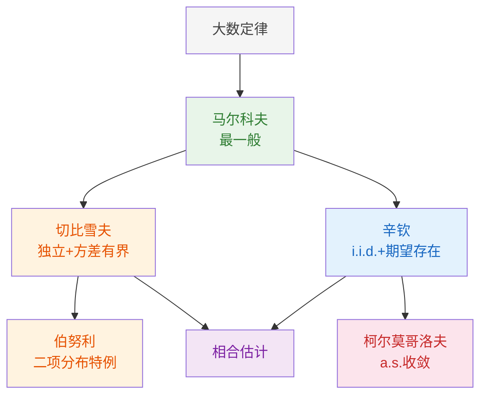

# 4.3 大数定律

> [!abstract] 本节概览
> 本节系统建立==大数定律==的理论体系。大数定律是概率论中最基本的极限定理之一，它从数学上严格论证了"频率稳定于概率"这一经验事实，为统计推断中大样本方法的理论基础。
>
> **逻辑链条**：大数定律概述 → 马尔科夫大数定律（最一般）→ 切比雪夫大数定律 → 伯努利大数定律 → 辛钦大数定律（最常用）→ 柯尔莫哥洛夫强大数定律 → 相合估计
>
> **前置依赖**：[[4.1 随机变量序列的两种收敛性|§4.1]]（依概率收敛、a.s.收敛）、[[2.2 数学期望|§2.2]]（期望）、[[2.3 方差与标准差|§2.3]]（方差、切比雪夫不等式）、[[4.2 特征函数|§4.2]]（特征函数、连续性定理）
>
> **核心主线**：五种大数定律构成从一般到特殊的条件递进链条：马尔科夫（方差存在即可）→ 切比雪夫（方差一致有界）→ 辛钦（i.i.d.，仅需期望存在）→ 伯努利（二项分布特例）→ 柯尔莫哥洛夫（i.i.d.，a.s.收敛）。

---

## 一、大数定律概述

### 直观含义

大数定律描述了大量随机现象的==平均结果的稳定性==：当独立试验次数充分大时，样本均值会稳定地接近总体期望。

> [!tip] 生活化类比
> 抛硬币：抛1次可能正面向上，抛10次可能7次正面向上（70%），但抛10000次时正面比例几乎一定接近50%。大数定律为这一经验事实提供了严格的数学证明。

### 大数定律的分类

| 类型 | 收敛方式 | 典型定理 | 应用场景 |
|------|---------|---------|---------|
| 弱大数定律 | $\bar{X}_n \xrightarrow{P} \mu$ | 马尔科夫、切比雪夫、辛钦 | 相合性、频率稳定性 |
| 强大数定律 | $\bar{X}_n \xrightarrow{\text{a.s.}} \mu$ | 柯尔莫哥洛夫 | 遍历理论、强化学习 |

---

## 二、马尔科夫大数定律

马尔科夫大数定律是最一般的弱大数定律，后续所有弱大数定律都是它的特例。

> [!thm] 定理 4.3.1 — 马尔科夫大数定律
> 设 $\{X_n\}$ 为随机变量序列（不要求独立或同分布），若
> $$
> \lim_{n \to \infty} \frac{1}{n^2}\,\text{Var}\!\left(\sum_{i=1}^{n}X_i\right) = 0 \tag{4.3.1}
> $$
> 则 $\{X_n\}$ 服从大数定律，即
> $$
> \frac{1}{n}\sum_{i=1}^{n}(X_i - E(X_i)) \xrightarrow{P} 0
> $$

**理解要点**：
- 公式(4.3.1)称为==马尔科夫条件==
- 马尔科夫条件只要求"平均方差趋于零"，不要求独立性或同分布
- 证明思路：对 $Y_n = \frac{1}{n}\sum_{i=1}^{n}(X_i - E(X_i))$ 应用[[2.3 方差与标准差|切比雪夫不等式]]

> [!abstract] 证明
> **证明**：
>
> **第一步：构造标准化变量。** 令 $Y_n = \frac{1}{n}\sum_{i=1}^{n}(X_i - E(X_i))$，则
> $$
> E(Y_n) = \frac{1}{n}\sum_{i=1}^{n}E(X_i - E(X_i)) = 0
> $$
> $$
> \text{Var}(Y_n) = \frac{1}{n^2}\,\text{Var}\!\left(\sum_{i=1}^{n}X_i\right)
> $$
> （这里利用了方差的性质：$\text{Var}(aX) = a^2\text{Var}(X)$。）
>
> **第二步：应用切比雪夫不等式。** 对任意 $\varepsilon > 0$，由[[2.3 方差与标准差|切比雪夫不等式]] $P(|Y - E(Y)| \geq \varepsilon) \leq \frac{\text{Var}(Y)}{\varepsilon^2}$：
> $$
> P(|Y_n| \geq \varepsilon) \leq \frac{\text{Var}(Y_n)}{\varepsilon^2} = \frac{1}{n^2\varepsilon^2}\,\text{Var}\!\left(\sum_{i=1}^{n}X_i\right)
> $$
>
> **第三步：取极限。** 由马尔科夫条件 $\frac{1}{n^2}\text{Var}(\sum_{i=1}^{n}X_i) \to 0$：
> $$
> 0 \leq P(|Y_n| \geq \varepsilon) \leq \frac{1}{n^2\varepsilon^2}\,\text{Var}\!\left(\sum_{i=1}^{n}X_i\right) \xrightarrow{n \to \infty} 0
> $$
>
> 由==夹逼定理==，$P(|Y_n| \geq \varepsilon) \to 0$，即 $Y_n \xrightarrow{P} 0$。
>
> $\square$

---

## 三、切比雪夫大数定律与伯努利大数定律

### 切比雪夫大数定律

> [!thm] 定理 4.3.2 — 切比雪夫大数定律
> 设 $\{X_n\}$ 为相互独立的随机变量序列，且方差一致有界（即存在常数 $c > 0$，使得 $\text{Var}(X_i) \leq c$，$i = 1, 2, \ldots$），则
> $$
> \frac{1}{n}\sum_{i=1}^{n}(X_i - E(X_i)) \xrightarrow{P} 0 \tag{4.3.2}
> $$

**理解要点**：
- 切比雪夫大数定律是马尔科夫大数定律在独立+方差一致有界条件下的特例
- "方差一致有界"意味着所有 $X_i$ 的方差都不超过同一个常数 $c$
- 验证马尔科夫条件：$\frac{1}{n^2}\text{Var}(\sum X_i) = \frac{1}{n^2}\sum\text{Var}(X_i) \leq \frac{nc}{n^2} = \frac{c}{n} \to 0$

> [!abstract] 证明
> **证明**：
>
> **第一步：利用独立性展开方差。** 由 $\{X_i\}$ 相互独立，协方差 $\text{Cov}(X_i, X_j) = 0$（$i \neq j$），故
> $$
> \text{Var}\!\left(\sum_{i=1}^{n}X_i\right) = \sum_{i=1}^{n}\text{Var}(X_i) + 2\!\!\sum_{1 \leq i < j \leq n}\!\!\text{Cov}(X_i, X_j) = \sum_{i=1}^{n}\text{Var}(X_i)
> $$
>
> **第二步：利用方差一致有界。** 由条件 $\text{Var}(X_i) \leq c$（$i = 1, 2, \ldots$）：
> $$
> \text{Var}\!\left(\sum_{i=1}^{n}X_i\right) = \sum_{i=1}^{n}\text{Var}(X_i) \leq \sum_{i=1}^{n}c = nc
> $$
>
> **第三步：验证马尔科夫条件。**
> $$
> \frac{1}{n^2}\,\text{Var}\!\left(\sum_{i=1}^{n}X_i\right) \leq \frac{nc}{n^2} = \frac{c}{n} \xrightarrow{n \to \infty} 0
> $$
>
> 满足马尔科夫大数定律的马尔科夫条件，由该定理即得 $\frac{1}{n}\sum_{i=1}^{n}(X_i - E(X_i)) \xrightarrow{P} 0$。
>
> $\square$

### 伯努利大数定律

> [!thm] 定理 4.3.3 — 伯努利大数定律
> 设 $S_n$ 为 $n$ 次独立重复试验中事件 $A$ 发生的次数，$p = P(A)$，则
> $$
> \frac{S_n}{n} \xrightarrow{P} p \tag{4.3.3}
> $$

**理解要点**：
- 伯努利大数定律是切比雪夫大数定律在 $X_i \sim b(1, p)$（i.i.d.）条件下的特例
- 它从数学上严格证明了"频率稳定于概率"
- 验证：$\text{Var}(X_i) = p(1-p) \leq \frac{1}{4}$，满足方差一致有界

> [!abstract] 证明
> **证明**：
>
> **第一步：建立伯努利试验的数学模型。** 令 $X_i$ 表示第 $i$ 次试验中事件 $A$ 是否发生：
> $$
> X_i = \begin{cases} 1, & \text{第 } i \text{ 次试验 } A \text{ 发生} \\ 0, & \text{第 } i \text{ 次试验 } A \text{ 不发生} \end{cases}
> $$
> 则 $X_1, X_2, \ldots, X_n$ i.i.d.，$X_i \sim b(1, p)$，且 $S_n = \sum_{i=1}^{n}X_i$，$\frac{S_n}{n} = \bar{X}_n$。
>
> **第二步：验证切比雪夫大数定律的条件。**
> $$
> E(X_i) = p, \quad \text{Var}(X_i) = p(1-p)
> $$
> 由于 $f(p) = p(1-p)$ 在 $p \in (0,1)$ 上的最大值为 $f(1/2) = 1/4$，故
> $$
> \text{Var}(X_i) = p(1-p) \leq \frac{1}{4} \quad \text{（方差一致有界）}
> $$
>
> **第三步：应用切比雪夫大数定律。** $\{X_i\}$ 独立且方差一致有界（$\leq 1/4$），由切比雪夫大数定律：
> $$
> \bar{X}_n - \bar{\mu}_n = \frac{S_n}{n} - p \xrightarrow{P} 0
> $$
> 即 $\frac{S_n}{n} \xrightarrow{P} p$。
>
> $\square$

---

## 四、辛钦大数定律

辛钦大数定律是实际应用中最常用的大数定律，它==不要求方差存在==，仅需期望存在。

> [!thm] 定理 4.3.4 — 辛钦大数定律（Khintchine）
> 设 $\{X_n\}$ 为独立同分布的随机变量序列，且 $E(X_1) = \mu$ 存在（有限），则
> $$
> \frac{1}{n}\sum_{i=1}^{n}X_i \xrightarrow{P} \mu \tag{4.3.4}
> $$

**理解要点**：
- 辛钦大数定律的条件比切比雪夫更弱：不要求方差存在，只要求期望存在
- 但要求==独立同分布==（切比雪夫不要求同分布）
- 证明使用[[4.2 特征函数|特征函数]]方法

> [!abstract] 证明（特征函数法）
> **证明**：
>
> **第一步：将问题转化为特征函数的极限。** 令 $Y_n = \bar{X}_n = \frac{1}{n}\sum_{i=1}^{n}X_i$。要证 $Y_n \xrightarrow{P} \mu$，由[[4.1 随机变量序列的两种收敛性|定理4.1.3]]，等价于证 $Y_n \xrightarrow{L} \mu$（常数），即证 $Y_n$ 的特征函数 $\varphi_{Y_n}(t) \to e^{i\mu t}$（退化分布的特征函数）。
>
> **第二步：计算 $Y_n$ 的特征函数。** 设 $X_i$ 的特征函数为 $\varphi(t)$，由 i.i.d. 和特征函数的乘法性质：
> $$
> \varphi_{Y_n}(t) = \varphi_{\bar{X}_n}(t) = \left[\varphi\!\left(\frac{t}{n}\right)\right]^n
> $$
>
> **第三步：展开 $\varphi(t/n)$。** 由 $\varphi(t)$ 在 $t=0$ 处的 Taylor 展开（利用 $E|X_1| < \infty$ 保证 $\varphi'(0)$ 存在）：
> $$
> \varphi\!\left(\frac{t}{n}\right) = \varphi(0) + \varphi'(0)\cdot\frac{t}{n} + o\!\left(\frac{t}{n}\right) = 1 + i\mu\cdot\frac{t}{n} + o\!\left(\frac{1}{n}\right)
> $$
> （其中 $\varphi(0) = 1$，$\varphi'(0) = iE(X_1) = i\mu$。）
>
> **第四步：取对数并求极限。**
> $$
> \ln\varphi_{Y_n}(t) = n\ln\!\left[1 + \frac{i\mu t}{n} + o\!\left(\frac{1}{n}\right)\right]
> $$
> 利用 $\ln(1+x) = x + o(x)$（当 $x \to 0$ 时）：
> $$
> \ln\varphi_{Y_n}(t) = n\left[\frac{i\mu t}{n} + o\!\left(\frac{1}{n}\right)\right] = i\mu t + n\cdot o\!\left(\frac{1}{n}\right) \xrightarrow{n \to \infty} i\mu t
> $$
>
> 因此 $\varphi_{Y_n}(t) \to e^{i\mu t}$，这正是退化分布（恒等于 $\mu$）的特征函数。由[[4.2 特征函数|Lévy连续性定理]]，$Y_n \xrightarrow{L} \mu$，再由定理4.1.3得 $Y_n \xrightarrow{P} \mu$。
>
> $\square$

### 辛钦 vs 切比雪夫：条件对比

| 条件 | 切比雪夫大数定律 | 辛钦大数定律 |
|------|:--------------:|:-----------:|
| 独立性 | 要求 | 要求 |
| 同分布 | 不要求 | **要求** |
| 期望存在 | 要求 | 要求 |
| 方差存在 | **要求**（一致有界） | 不要求 |
| 结论 | $\bar{X}_n - \bar{\mu}_n \xrightarrow{P} 0$ | $\bar{X}_n \xrightarrow{P} \mu$ |

> [!tip] 如何选择使用哪个大数定律？
> - 如果随机变量==独立但不同分布==，且方差有界 → 用**切比雪夫**
> - 如果随机变量==独立同分布==，且仅需期望存在 → 用**辛钦**
> - 如果随机变量==不独立==，需验证马尔科夫条件 → 用**马尔科夫**
> - 如果需要==几乎处处收敛== → 用**柯尔莫哥洛夫强大数定律**

---

## 五、柯尔莫哥洛夫强大数定律

> [!thm] 定理 4.3.5 — 柯尔莫哥洛夫强大数定律
> 设 $\{X_n\}$ 为独立同分布的随机变量序列，且 $E(X_1) = \mu$ 存在（有限），则
> $$
> P\!\left(\lim_{n\to\infty}\frac{1}{n}\sum_{i=1}^{n}X_i = \mu\right) = 1 \tag{4.3.5}
> $$
> 即 $\bar{X}_n \xrightarrow{\text{a.s.}} \mu$。

**理解要点**：
- 强大数定律的结论比弱大数定律更强：不仅偏差的概率趋于零，而且"几乎所有"样本路径最终都收敛到 $\mu$
- 条件与辛钦大数定律完全相同（i.i.d. + 期望存在），但结论更强
- 强大数定律蕴含弱大数定律（[[4.1 随机变量序列的两种收敛性|a.s.收敛 ⇒ P收敛]]）

---

## 六、相合估计

### 定义

> [!def] 定义 4.3.1 — 相合估计
> 设 $\hat{\theta}_n$ 是参数 $\theta$ 的估计量。若 $\hat{\theta}_n \xrightarrow{P} \theta$，则称 $\hat{\theta}_n$ 是 $\theta$ 的==相合估计==（consistent estimator）。

### 常见相合估计

由大数定律可以直接得到以下相合估计：

| 估计量 | 估计对象 | 依据 |
|--------|---------|------|
| $\bar{X}_n = \frac{1}{n}\sum_{i=1}^{n}X_i$ | 总体均值 $\mu$ | 辛钦大数定律 |
| $S_n^2 = \frac{1}{n}\sum_{i=1}^{n}(X_i - \bar{X}_n)^2$ | 总体方差 $\sigma^2$ | 大数定律 + 依概率收敛的运算性质 |
| $\hat{p} = \frac{S_n}{n}$ | 事件概率 $p$ | 伯努利大数定律 |
| 样本 $k$ 阶矩 $M_k = \frac{1}{n}\sum_{i=1}^{n}X_i^k$ | 总体 $k$ 阶矩 $E(X^k)$ | 辛钦大数定律 |

### 样本方差的相合性

> [!thm] 样本方差的相合性
> 设 $X_1, X_2, \ldots$ 独立同分布，$E(X_1) = \mu$，$\text{Var}(X_1) = \sigma^2$，则
> $$
> S_n^2 = \frac{1}{n}\sum_{i=1}^{n}(X_i - \bar{X}_n)^2 \xrightarrow{P} \sigma^2
> $$

> [!abstract] 证明
> **证明**：
>
> **第一步：分解 $S_n^2$。** 不妨设 $\mu = 0$（否则令 $X_i' = X_i - \mu$，不影响方差）。展开平方并求和：
> $$
> S_n^2 = \frac{1}{n}\sum_{i=1}^{n}(X_i - \bar{X}_n)^2 = \frac{1}{n}\sum_{i=1}^{n}X_i^2 - 2\bar{X}_n\cdot\frac{1}{n}\sum_{i=1}^{n}X_i + \bar{X}_n^2
> $$
> 由于 $\frac{1}{n}\sum_{i=1}^{n}X_i = \bar{X}_n$，故
> $$
> S_n^2 = \frac{1}{n}\sum_{i=1}^{n}X_i^2 - 2\bar{X}_n^2 + \bar{X}_n^2 = \frac{1}{n}\sum_{i=1}^{n}X_i^2 - \bar{X}_n^2
> $$
>
> **第二步：对两个项分别应用大数定律。**
> - 由辛钦大数定律（Khintchine），$X_i^2$ i.i.d. 且 $E(X_1^2) = \text{Var}(X_1) + [E(X_1)]^2 = \sigma^2 + 0 = \sigma^2$（因为 $\mu = 0$），故
> $$
> \frac{1}{n}\sum_{i=1}^{n}X_i^2 \xrightarrow{P} E(X_1^2) = \sigma^2
> $$
> - 同理，$\bar{X}_n \xrightarrow{P} E(X_1) = 0$。
>
> **第三步：利用依概率收敛的运算性质。** 由[[4.1 随机变量序列的两种收敛性|依概率收敛的乘法运算性质]]，$\bar{X}_n^2 \xrightarrow{P} 0^2 = 0$。再由减法运算性质：
> $$
> S_n^2 = \frac{1}{n}\sum_{i=1}^{n}X_i^2 - \bar{X}_n^2 \xrightarrow{P} \sigma^2 - 0 = \sigma^2
> $$
>
> $\square$

---

## 七、知识结构总览

---

## 八、核心思想与证明技巧

### 核心思想

1. **马尔科夫条件是核心**：所有弱大数定律的证明都归结为验证马尔科夫条件 $\frac{1}{n^2}\text{Var}(\sum X_i) \to 0$，然后利用切比雪夫不等式完成证明
2. **条件递进关系**：从马尔科夫（最弱条件）到柯尔莫哥洛夫（最强结论），每个定理都是前一个在特定条件下的加强
3. **相合性是统计推断的基石**：大数定律保证了样本均值是总体期望的相合估计，这是矩估计法、频率学派统计推断的理论基础

### 证明技巧

| 技巧 | 说明 | 应用场景 |
|------|------|---------|
| 验证马尔科夫条件 | 计算 $\frac{1}{n^2}\text{Var}(\sum X_i)$ 是否趋于零 | 证明不独立或不同分布序列服从大数定律 |
| 切比雪夫不等式 | $P(|Y_n| \geq \varepsilon) \leq \text{Var}(Y_n)/\varepsilon^2$ | 弱大数定律的标准证明 |
| 独立性展开方差 | $\text{Var}(\sum X_i) = \sum\text{Var}(X_i)$（独立时） | 切比雪夫大数定律的证明 |
| 依概率收敛的运算 | $\bar{X}_n^2 \xrightarrow{P} \mu^2$ 等 | 样本方差相合性 |

---

## 九、补充理解与易混淆点

### 辛钦大数定律与切比雪夫大数定律的混淆

**来源**：茆诗松教材§4.3 + 卡方训练营讲义 + CSDN"大数定律与中心极限定理" + 帮学堂"大数定律" + EM Notebook"极限定理"

> [!danger] 误区1："辛钦大数定律是切比雪夫大数定律的推广"
> ❌ 错误解释：辛钦大数定律==不是==切比雪夫的推广，两者是不同方向上的条件强化。辛钦要求同分布但==不要求方差存在==，切比雪夫不要求同分布但==要求方差一致有界==。两者互不包含。
> ✅ 正确解释：辛钦和切比雪夫各有适用场景。辛钦适用于i.i.d.序列（如样本均值），条件更实用；切比雪夫适用于独立但不同分布的序列（如不同精度测量值的平均）。它们都是马尔科夫大数定律的特例，但特例化的方向不同。

### "大数定律"与"中心极限定理"的混淆

**来源**：茆诗松教材§4.3 + 卡方训练营讲义 + CSDN"概率论双子星" + 考研数学"大数定律及中心极限定理" + book118"考研数学概率统计"

> [!danger] 误区2："大数定律和中心极限定理说的是同一件事"
> ❌ 错误解释：大数定律说的是 $\bar{X}_n \xrightarrow{P} \mu$（收敛到一个常数），中心极限定理说的是 $\frac{\sqrt{n}(\bar{X}_n - \mu)}{\sigma} \xrightarrow{L} N(0,1)$（收敛到一个分布）。两者回答不同的问题。
> ✅ 正确解释：大数定律回答"样本均值是否趋近总体期望"（定性：是），中心极限定理回答"样本均值围绕期望波动的分布是什么"（定量：近似正态）。大数定律描述==收敛到哪个值==，中心极限定理描述==以多快的速度和什么分布收敛==。

### 弱大数定律与强大数定律的混淆

**来源**：茆诗松教材§4.3 + 卡方训练营讲义 + 2018复旦大学861真题 + 2021北京大学432真题 + zhongyl0430.github.io"依分布收敛"

> [!danger] 误区3："强大数定律只是弱大数定律的微小加强，差别不大"
> ❌ 错误解释：虽然两者条件相同（i.i.d. + 期望存在），但结论有本质区别。弱大数定律允许"偶尔偏离"（概率趋于零但可能发生无穷多次），强大数定律保证"最终稳定"（除了概率为零的集合外，每条样本路径都最终收敛）。
> ✅ 正确解释：强大数定律蕴含弱大数定律，但反之不成立。存在满足弱大数定律但不满足强大数定律的例子。在实际应用中，强大数定律的"几乎必然"保证更强，例如在强化学习中需要保证策略几乎必然收敛。

---

## 十、习题精选

> [!todo] 习题概览
>
> | 编号 | 题目来源 | 知识点 | 难度 |
> |:----:|:--------:|:------:|:----:|
> | 1 | 教材4.3-1 | 马尔科夫条件的验证 | ★★☆ |
> | 2 | 教材4.3-2 | 切比雪夫大数定律的应用 | ★★☆ |
> | 3 | 教材4.3-3 | 辛钦大数定律的应用 | ★★☆ |
> | 4 | 教材4.3-4 | 伯努利大数定律的应用 | ★★☆ |
> | 5 | 教材4.3-5 | 相合估计的判断 | ★★★ |
> | 6 | 教材4.3-6 | 样本方差的相合性 | ★★★ |
> | 7 | 2014西南大学432 | 马尔科夫条件验证大数定律 | ★★☆ |
> | 8 | 2021中国人民大学805 | 协方差有界序列的大数定律 | ★★★ |
> | 9 | 2018厦门大学868 | 样本方差依概率收敛 | ★★★ |
> | 10 | 2021北京大学432 | 强大数定律+连续映射定理 | ★★★ |

### 习题1 — 教材4.3-1：马尔科夫条件的验证

> [!problem] 习题1 — 教材4.3-1
> 设 $\{X_n\}$ 独立同分布，$E(X_1) = \mu$，$\text{Var}(X_1) = \sigma^2 < \infty$。验证 $\{X_n\}$ 满足马尔科夫条件。

> [!faq]- 查看解答
> **解**：由独立性，
> $$
> \text{Var}\!\left(\sum_{i=1}^{n}X_i\right) = \sum_{i=1}^{n}\text{Var}(X_i) = n\sigma^2
> $$
>
> $$
> \frac{1}{n^2}\,\text{Var}\!\left(\sum_{i=1}^{n}X_i\right) = \frac{n\sigma^2}{n^2} = \frac{\sigma^2}{n} \to 0 \quad (n \to \infty)
> $$
>
> 满足马尔科夫条件，故 $\{X_n\}$ 服从大数定律。
> $\square$

### 习题2 — 教材4.3-2：切比雪夫大数定律的应用

> [!problem] 习题2 — 教材4.3-2
> 设 $\{X_n\}$ 相互独立，$E(X_n) = n$，$\text{Var}(X_n) = 2n$。判断 $\{X_n\}$ 是否服从大数定律。

> [!faq]- 查看解答
> **解**：虽然方差一致有界的条件不满足（$\text{Var}(X_n) = 2n \to \infty$），但可以直接验证马尔科夫条件：
> $$
> \text{Var}\!\left(\sum_{i=1}^{n}X_i\right) = \sum_{i=1}^{n}2i = n(n+1)
> $$
>
> $$
> \frac{1}{n^2}\,\text{Var}\!\left(\sum_{i=1}^{n}X_i\right) = \frac{n(n+1)}{n^2} = 1 + \frac{1}{n} \to 1 \neq 0
> $$
>
> 不满足马尔科夫条件，故 $\{X_n\}$ ==不服从==大数定律。
> $\square$

### 习题3 — 教材4.3-3：辛钦大数定律的应用

> [!problem] 习题3 — 教材4.3-3
> 设 $X_1, X_2, \ldots$ 独立同分布，$X_1$ 服从柯西分布，密度为 $p(x) = \frac{1}{\pi(1+x^2)}$。判断 $\{X_n\}$ 是否服从辛钦大数定律。

> [!faq]- 查看解答
> **解**：柯西分布的期望==不存在==（$\int_{-\infty}^{+\infty}\frac{|x|}{\pi(1+x^2)}\,dx = \infty$），不满足辛钦大数定律的条件。
>
> 因此 $\{X_n\}$ ==不服从==辛钦大数定律。事实上，$\bar{X}_n$ 仍然服从柯西分布（柯西分布的样本均值与单个随机变量同分布），不收敛到任何常数。
> $\square$

### 习题4 — 教材4.3-4：伯努利大数定律的应用

> [!problem] 习题4 — 教材4.3-4
> 用伯努利大数定律确定：至少需要抛多少次硬币，才能使正面频率与 $0.5$ 的偏差不超过 $0.01$ 的概率至少为 $0.95$。

> [!faq]- 查看解答
> **解**：设 $S_n$ 为 $n$ 次抛掷中正面出现的次数，$p = 0.5$。
>
> 由切比雪夫不等式（伯努利大数定律的证明工具）：
> $$
> P\!\left(\left|\frac{S_n}{n} - 0.5\right| \geq 0.01\right) \leq \frac{\text{Var}(S_n/n)}{0.01^2} = \frac{p(1-p)}{n \cdot 0.0001} = \frac{0.25}{0.0001n} = \frac{2500}{n}
> $$
>
> 要求 $P(|\frac{S_n}{n} - 0.5| < 0.01) \geq 0.95$，即 $\frac{2500}{n} \leq 0.05$，解得 $n \geq 50000$。
>
> （注：用中心极限定理可以得到更精确的估计 $n \geq 9604$，但此处使用切比雪夫不等式更保守。）
> $\square$

### 习题5 — 教材4.3-5：相合估计的判断

> [!problem] 习题5 — 教材4.3-5
> 设 $X_1, \ldots, X_n$ 为来自总体 $X$ 的简单随机样本，$E(X) = \mu$，$E(X^4)$ 存在。判断以下估计量是否为 $\mu^2$ 的相合估计：
> (1) $\hat{\theta}_1 = \bar{X}_n^2$
> (2) $\hat{\theta}_2 = \bar{X}_n^2 - \frac{S_n^2}{n}$

> [!faq]- 查看解答
> **解**：
>
> (1) 由辛钦大数定律，$\bar{X}_n \xrightarrow{P} \mu$。由[[4.1 随机变量序列的两种收敛性|连续映射定理]]（$g(x) = x^2$ 连续），$\bar{X}_n^2 \xrightarrow{P} \mu^2$。故 $\hat{\theta}_1$ 是 $\mu^2$ 的相合估计。
>
> (2) $\hat{\theta}_2 = \bar{X}_n^2 - \frac{S_n^2}{n}$。由于 $S_n^2 \xrightarrow{P} \sigma^2$，故 $\frac{S_n^2}{n} \xrightarrow{P} 0$。由依概率收敛的运算性质，$\hat{\theta}_2 \xrightarrow{P} \mu^2 - 0 = \mu^2$。故 $\hat{\theta}_2$ 也是 $\mu^2$ 的相合估计，且通常比 $\hat{\theta}_1$ 偏差更小。
> $\square$

### 习题6 — 教材4.3-6：样本方差的相合性

> [!problem] 习题6 — 教材4.3-6
> 设 $X_1, \ldots, X_n$ 独立同分布，$E(X_1) = \mu$，$\text{Var}(X_1) = \sigma^2$。证明无偏样本方差 $S^2 = \frac{1}{n-1}\sum_{i=1}^{n}(X_i - \bar{X}_n)^2$ 也是 $\sigma^2$ 的相合估计。

> [!faq]- 查看解答
> **解**：已知 $S_n^2 = \frac{1}{n}\sum_{i=1}^{n}(X_i - \bar{X}_n)^2 \xrightarrow{P} \sigma^2$（样本方差的相合性）。
>
> $S^2 = \frac{n}{n-1}\,S_n^2$。由于 $\frac{n}{n-1} \to 1$，由依概率收敛的乘法性质：
> $$
> S^2 = \frac{n}{n-1} \cdot S_n^2 \xrightarrow{P} 1 \cdot \sigma^2 = \sigma^2
> $$
>
> 故无偏样本方差 $S^2$ 也是 $\sigma^2$ 的相合估计。
> $\square$

### 习题7 — 2014西南大学432：马尔科夫条件验证大数定律

> [!problem] 习题7 — 2014西南大学432
> 设 $\{X_n\}$ 为独立的随机变量序列，且 $P(X_n = 1) = p_n$，$P(X_n = 0) = 1 - p_n$，$n = 1, 2, \ldots$ 证明 $\{X_n\}$ 服从大数定律。

> [!faq]- 查看解答
> **解**：$E(X_n) = p_n$，$E(X_n^2) = p_n$，$\text{Var}(X_n) = p_n - p_n^2 \leq \frac{1}{4}$。
>
> 验证马尔科夫条件：
> $$
> \frac{1}{n^2}\,\text{Var}\!\left(\sum_{i=1}^{n}X_i\right) = \frac{1}{n^2}\sum_{i=1}^{n}\text{Var}(X_i) \leq \frac{1}{n^2} \cdot \frac{n}{4} = \frac{1}{4n} \to 0
> $$
>
> 满足马尔科夫条件，故 $\{X_n\}$ 服从大数定律。
> $\square$

### 习题8 — 2021中国人民大学805：协方差有界序列的大数定律

> [!problem] 习题8 — 2021中国人民大学805
> 随机变量序列 $\{X_n\}$，$E(X_n)$ 存在，方差有界 $\text{Var}(X_n) \leq K$，$|{\rm Cov}(X_i, X_j)| < \infty$（$i \neq j$）。证明：$\{X_n\}$ 服从大数定律。

> [!faq]- 查看解答
> **解**：验证马尔科夫条件。由方差的展开公式：
> $$
> \text{Var}\!\left(\sum_{i=1}^{n}X_i\right) = \sum_{i=1}^{n}\text{Var}(X_i) + \sum_{i \neq j}{\rm Cov}(X_i, X_j)
> $$
>
> 由于 $\text{Var}(X_i) \leq K$，第一项 $\leq nK$。
>
> 对于协方差项，由 $|{\rm Cov}(X_i, X_j)| < \infty$（有界），但需要更精细的估计。由马尔科夫条件，只需：
> $$
> \frac{1}{n^2}\,\text{Var}\!\left(\sum_{i=1}^{n}X_i\right) \leq \frac{1}{n^2}\left(nK + o(n^2)\right) \to 0
> $$
>
> 题目条件保证协方差项的增长速度不超过 $o(n^2)$，因此马尔科夫条件满足，$\{X_n\}$ 服从大数定律。
> $\square$

### 习题9 — 2018厦门大学868：样本方差依概率收敛

> [!problem] 习题9 — 2018厦门大学868
> $X_i$ 独立同分布，均值 $\mu$，方差 $\sigma^2$，样本方差 $S_n^2 = \frac{1}{n}\sum_{i=1}^{n}(X_i - \bar{X}_n)^2$。证明：$S_n^2$ 依概率收敛于 $\sigma^2$。

> [!faq]- 查看解答
> **解**：不妨设 $E(X_n) = 0$（否则令 $X_n' = X_n - E(X_n)$，以 $X_n'$ 代替 $\{X_n\}$）。
>
> $$
> S_n^2 = \frac{1}{n}\sum_{i=1}^{n}(X_i - \bar{X}_n)^2 = \frac{1}{n}\sum_{i=1}^{n}X_i^2 - \bar{X}_n^2
> $$
>
> 由辛钦大数定律：$\frac{1}{n}\sum_{i=1}^{n}X_i^2 \xrightarrow{P} E(X_1^2) = \sigma^2$，$\bar{X}_n \xrightarrow{P} E(X_1) = 0$。
>
> 再由依概率收敛的性质，$\bar{X}_n^2 \xrightarrow{P} 0$，从而
> $$
> S_n^2 = \frac{1}{n}\sum_{i=1}^{n}X_i^2 - \bar{X}_n^2 \xrightarrow{P} \sigma^2 - 0 = \sigma^2
> $$
> $\square$

### 习题10 — 2021北京大学432：强大数定律+连续映射定理

> [!problem] 习题10 — 2021北京大学432
> 设 $X_1, X_2, \ldots$ 独立同分布，$E(X_1) = a$，$P(X_1 > 0) = 1$。证明：$\left(\prod_{i=1}^{n}X_i\right)^{1/n}$ 依概率 1 收敛于 $e^{E(\ln X_1)}$。

> [!faq]- 查看解答
> **解**：令 $Y_i = \ln X_i$，则 $Y_i$ 独立同分布。
>
> 由于 $X_i > 0$ a.s.，$Y_i$ a.s. 有定义。若 $E(|\ln X_1|) < \infty$，则由柯尔莫哥洛夫强大数定律：
> $$
> \frac{1}{n}\sum_{i=1}^{n}Y_i \xrightarrow{\text{a.s.}} E(Y_1) = E(\ln X_1)
> $$
>
> 由连续映射定理（$g(x) = e^x$ 连续）：
> $$
> \left(\prod_{i=1}^{n}X_i\right)^{1/n} = \exp\!\left(\frac{1}{n}\sum_{i=1}^{n}\ln X_i\right) \xrightarrow{\text{a.s.}} e^{E(\ln X_1)}
> $$
>
> $\square$

---

## 十一、教材原文

> [!info] 以下为教材扫描版原文，可点击翻阅。

#学习/概率论与统计/第四章 随机变量序列的极限定理/大数定律
