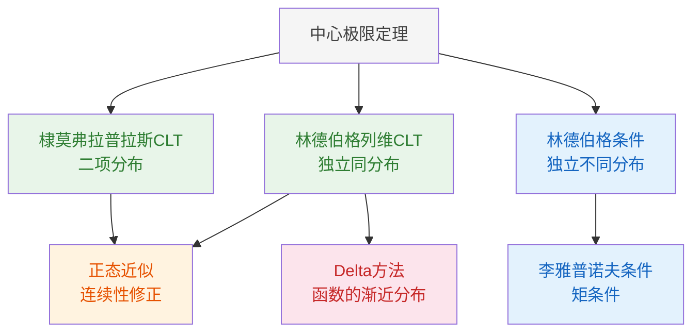

# 4.4 中心极限定理

> [!abstract] 本节概览
> 本节系统建立==中心极限定理==（Central Limit Theorem, CLT）的理论体系。CLT是概率论中最重要的定理之一，它揭示了：大量独立随机因素的叠加结果，无论各因素服从什么分布，其标准化和的极限分布都是正态分布。这一结论深刻解释了正态分布在自然界和工程实践中广泛存在的原因。
>
> **逻辑链条**：CLT概述 → 独立随机变量和的引例 → 林德伯格-列维CLT → 棣莫弗-拉普拉斯CLT → 正态近似与连续性修正 → 林德伯格条件与李雅普诺夫CLT → 林德伯格条件与李雅普诺夫CLT → Delta方法
>
> **前置依赖**：[[4.1 随机变量序列的两种收敛性|§4.1]]（依分布收敛）、[[4.2 特征函数|§4.2]]（特征函数、连续性定理）、[[4.3 大数定律|§4.3]]（大数定律）、[[2.3 方差与标准差|§2.3]]（方差）
>
> **核心主线**：从i.i.d.到独立不同分布，CLT体系的核心是"标准化和的极限分布为正态分布"。林德伯格-列维CLT处理i.i.d.情形，棣莫弗-拉普拉斯CLT是其二项分布特例，林德伯格条件与李雅普诺夫条件则推广到独立不同分布情形。

---

## 一、中心极限定理概述

### 直观含义

中心极限定理描述了一个惊人的事实：大量独立随机因素的叠加结果，无论每个因素本身服从什么分布，其标准化和的分布都会趋近于==标准正态分布== $N(0,1)$。

> [!tip] 生活化类比：加工误差的来源
> 假设要加工一根轴，其直径误差由大量微小独立因素叠加而成：
> - 机床振动（随机微小偏移）
> - 刀具磨损（随机微小变化）
> - 材料成分不均匀（随机微小差异）
> - 操作者情绪波动（随机微小影响）
> - 环境温度变化（随机微小膨胀/收缩）
> - 测量仪器精度（随机微小误差）
>
> 每个因素单独来看都微小、独立、随机，但它们的叠加效果却服从正态分布。这就是CLT的直观含义——正态分布是大量独立随机因素叠加的"自然归宿"。

### 与大数定律的区别

[[4.3 大数定律|大数定律]]和CLT都研究独立随机变量和的极限行为，但回答的是完全不同的问题：

| 对比维度 | [[4.3 大数定律|大数定律]] | 中心极限定理 |
|:--------:|:----------------------:|:------------:|
| **核心问题** | "准不准"——均值是否收敛到期望？ | "波动像什么"——波动的分布是什么？ |
| **收敛对象** | $\bar{X}_n \xrightarrow{P} \mu$（收敛到==常数==） | $\frac{\sqrt{n}(\bar{X}_n - \mu)}{\sigma} \xrightarrow{L} N(0,1)$（收敛到==分布==） |
| **收敛类型** | 依概率收敛 | 依分布收敛 |
| **信息量** | 只告诉你"最终稳定在 $\mu$ 附近" | 进一步告诉你"波动的概率结构是正态的" |
| **衰减速率** | 不提供 | 波动以 $1/\sqrt{n}$ 的速率衰减 |

**关键理解**：CLT比大数定律提供更丰富的信息。大数定律说 $\bar{X}_n$ 会稳定在 $\mu$ 附近，CLT进一步量化了"附近"的具体含义——偏差 $\bar{X}_n - \mu$ 乘以 $\sqrt{n}$ 后近似服从 $N(0, \sigma^2)$。

### 标准化思想

为了研究随机变量和 $Y_n = \sum_{i=1}^{n}X_i$ 的极限分布，需要先进行==标准化==，消除分布中心的漂移和方差的膨胀：

$$
Y_n^* = \frac{Y_n - E(Y_n)}{\sqrt{\text{Var}(Y_n)}} = \frac{\sum_{i=1}^{n}X_i - n\mu}{\sigma\sqrt{n}}
$$

标准化后的 $Y_n^*$ 满足 $E(Y_n^*) = 0$，$\text{Var}(Y_n^*) = 1$，CLT研究的就是 $Y_n^*$ 的极限分布。

---

## 二、林德伯格-列维CLT

### 引例：误差分析

> [!example] 例 4.4.1 — 加工轴的误差分析
> 某车间加工一根轴，其总误差 $Y$ 由大量微小独立因素叠加而成：
> $$
> Y = X_1 + X_2 + \cdots + X_n
> $$
> 其中每个 $X_i$ 代表一个独立的误差因素（机床振动、刀具磨损、材料不均匀等）。虽然每个 $X_i$ 的分布可能各不相同（有的均匀、有的偏态、有的离散），但根据CLT，当 $n$ 充分大时，标准化后的总误差 $Y^*$ 的分布趋近于标准正态分布。

### 引例：均匀分布卷积

> [!example] 例 4.4.2 — 均匀分布卷积的密度演化
> 设 $X_1, X_2, \ldots$ 独立同分布，$X_i \sim U(-1, 1)$。考察 $Y_n = \sum_{i=1}^{n}X_i$ 的密度函数随 $n$ 的变化：
>
> - $p_1(y)$：在 $[-1, 1]$ 上为常数 $\frac{1}{2}$（均匀分布）
> - $p_2(y)$：在 $[-2, 2]$ 上为三角形分布（两个均匀分布的卷积）
> - $p_3(y)$：在 $[-3, 3]$ 上为二次曲线（三个均匀分布的卷积）
> - $p_4(y)$：在 $[-4, 4]$ 上为三次曲线（四个均匀分布的卷积）
>
> 随着 $n$ 增大，$Y_n$ 的密度函数逐渐呈现"中间高、两边低、左右对称"的钟形曲线，趋近于正态分布 $N(0, n/3)$ 的密度函数。这一现象正是CLT的直观体现。

### 定理陈述

> [!thm] 定理 4.4.1 — 林德伯格-列维中心极限定理（Lindeberg-Lévy CLT）
> 设 $\{X_n\}$ 为独立同分布的随机变量序列，且 $E(X_i) = \mu$，$\text{Var}(X_i) = \sigma^2 > 0$（有限），则对任意实数 $x$：
> $$
> \lim_{n \to \infty} P\!\left(\frac{\sum_{i=1}^{n}X_i - n\mu}{\sigma\sqrt{n}} \leq x\right) = \Phi(x) \tag{4.4.1}
> $$
> 其中 $\Phi(x)$ 为标准正态分布的分布函数。即
> $$
> \frac{\sum_{i=1}^{n}X_i - n\mu}{\sigma\sqrt{n}} \xrightarrow{L} N(0,1)
> $$

**理解要点**：
- 条件：i.i.d. + 期望有限 + 方差有限且大于零
- 结论：标准化和的极限分布为标准正态分布
- 等价形式：$\frac{\bar{X}_n - \mu}{\sigma/\sqrt{n}} \xrightarrow{L} N(0,1)$，即 $\bar{X}_n \dot{\sim} N(\mu, \sigma^2/n)$
- 与[[4.3 大数定律|大数定律]]的关系：CLT蕴含大数定律（依分布收敛到正态 ⇒ 依概率收敛到 $\mu$）

### 证明（特征函数法）

> [!abstract] 证明（特征函数法）
> **证明**：
>
> **第一步：写出标准化和的特征函数。** 设 $X_i$ 的特征函数为 $\varphi(t)$，则标准化变量
> $$
> Y_n^* = \frac{\sum_{i=1}^{n}X_i - n\mu}{\sigma\sqrt{n}} = \sum_{i=1}^{n}\frac{X_i - \mu}{\sigma\sqrt{n}}
> $$
> 由 i.i.d. 和特征函数的乘法性质（[[4.2 特征函数|定理4.2.1(4)]]），$Y_n^*$ 的特征函数为
> $$
> \varphi_{Y_n^*}(t) = \left[\varphi_{Y_i^*}(t)\right]^n = \left[\varphi\!\left(\frac{t}{\sigma\sqrt{n}}\right)\right]^n
> $$
> （这里 $Y_i^* = \frac{X_i - \mu}{\sigma\sqrt{n}}$ 的特征函数为 $\varphi_{Y_i^*}(t) = E(e^{it(X_i-\mu)/(\sigma\sqrt{n})}) = \varphi(t/(\sigma\sqrt{n})) \cdot e^{-i\mu t/(\sigma\sqrt{n})}$，但更简洁的做法是直接对中心化变量 $X_i - \mu$ 的特征函数做展开，见下一步。）
>
> **第二步：展开中心化变量的特征函数。** 令 $\tilde{X}_i = X_i - \mu$（中心化），则 $E(\tilde{X}_i) = 0$，$\text{Var}(\tilde{X}_i) = \sigma^2$。$\tilde{X}_i$ 的特征函数为 $\tilde{\varphi}(t) = e^{-i\mu t}\varphi(t)$。
>
> 在 $t = 0$ 处做 Taylor 展开（利用方差有限保证二阶导数存在）：
> $$
> \tilde{\varphi}(t) = \tilde{\varphi}(0) + \tilde{\varphi}'(0)\,t + \frac{\tilde{\varphi}''(0)}{2}\,t^2 + o(t^2)
> $$
> 逐项计算：
> - $\tilde{\varphi}(0) = e^0 \cdot \varphi(0) = 1$
> - $\tilde{\varphi}'(t) = -i\mu\, e^{-i\mu t}\varphi(t) + e^{-i\mu t}\varphi'(t)$，故 $\tilde{\varphi}'(0) = -i\mu + i\mu = 0$（因为 $\varphi'(0) = iE(X_1) = i\mu$）
> - $\tilde{\varphi}''(t) = (-i\mu)^2 e^{-i\mu t}\varphi(t) + 2(-i\mu)e^{-i\mu t}\varphi'(t) + e^{-i\mu t}\varphi''(t)$，故 $\tilde{\varphi}''(0) = -\mu^2 + 2\mu^2 + \varphi''(0) = \mu^2 - (\sigma^2 + \mu^2) = -\sigma^2$
>
> 因此：
> $$
> \tilde{\varphi}(t) = 1 + 0 \cdot t + \frac{(-\sigma^2)}{2}\,t^2 + o(t^2) = 1 - \frac{\sigma^2}{2}\,t^2 + o(t^2)
> $$
>
> **第三步：代入 $t/(\sigma\sqrt{n})$ 并取 $n$ 次幂。** 注意 $Y_n^* = \sum \tilde{X}_i/(\sigma\sqrt{n})$，其特征函数为
> $$
> \varphi_{Y_n^*}(t) = \left[\tilde{\varphi}\!\left(\frac{t}{\sigma\sqrt{n}}\right)\right]^n = \left[1 - \frac{\sigma^2}{2}\left(\frac{t}{\sigma\sqrt{n}}\right)^2 + o\!\left(\frac{t^2}{n}\right)\right]^n = \left[1 - \frac{t^2}{2n} + o\!\left(\frac{1}{n}\right)\right]^n
> $$
>
> **第四步：取对数求极限。**
> $$
> \ln\varphi_{Y_n^*}(t) = n\ln\!\left[1 - \frac{t^2}{2n} + o\!\left(\frac{1}{n}\right)\right]
> $$
> 利用 $\ln(1+x) = x - \frac{x^2}{2} + \cdots$，当 $n \to \infty$ 时 $-\frac{t^2}{2n} + o(\frac{1}{n}) \to 0$，故
> $$
> \ln\varphi_{Y_n^*}(t) = n\left[-\frac{t^2}{2n} + o\!\left(\frac{1}{n}\right)\right] = -\frac{t^2}{2} + n \cdot o\!\left(\frac{1}{n}\right) \xrightarrow{n \to \infty} -\frac{t^2}{2}
> $$
>
> **第五步：识别极限分布。** $\lim_{n \to \infty}\varphi_{Y_n^*}(t) = e^{-t^2/2}$，这正是标准正态分布 $N(0,1)$ 的特征函数。由[[4.2 特征函数|Lévy连续性定理]]（极限函数 $e^{-t^2/2}$ 在 $t=0$ 处连续），$Y_n^* \xrightarrow{L} N(0,1)$。
>
> $\square$

### 应用：正态随机数的产生

> [!example] 例 4.4.3 — 正态随机数的产生
> 计算机通常只能直接产生均匀分布 $U(0,1)$ 的随机数。如何利用CLT产生近似标准正态分布的随机数？
>
> 设 $U_1, U_2, \ldots, U_{12}$ 独立同分布，$U_i \sim U(0,1)$，则
> $$
> E(U_i) = \frac{1}{2}, \quad \text{Var}(U_i) = \frac{1}{12}
> $$
>
> 令 $Z = \sum_{i=1}^{12}U_i - 6$，则 $E(Z) = 0$，$\text{Var}(Z) = 12 \times \frac{1}{12} = 1$。
>
> 由CLT，$Z$ 近似服从 $N(0,1)$。这是一种简单实用的正态随机数生成方法（精度足够用于一般模拟）。

### 应用：数值计算中的误差分析

> [!example] 例 4.4.4 — 数值计算中的误差分析
> 在数值计算中，对 $n$ 个数各作四舍五入，产生的取整误差 $X_i \sim U(-0.5, 0.5)$，$i = 1, 2, \ldots, n$。
>
> **粗略估计**（利用切比雪夫不等式）：总误差 $Y_n = \sum_{i=1}^{n}X_i$，$E(Y_n) = 0$，$\text{Var}(Y_n) = n/12$。
> $$
> P(|Y_n| \geq \varepsilon) \leq \frac{n}{12\varepsilon^2}
> $$
> 例如 $n = 1500$，$\varepsilon = 15$：$P(|Y_n| \geq 15) \leq \frac{1500}{12 \times 225} = \frac{5}{9} \approx 0.556$。这个估计非常粗糙。
>
> **CLT估计**：由CLT，$Y_n \dot{\sim} N(0, n/12)$，即 $\frac{Y_n}{\sqrt{n/12}} \dot{\sim} N(0,1)$。
> $$
> P(|Y_n| \geq 15) = P\!\left(\frac{|Y_n|}{\sqrt{1500/12}} \geq \frac{15}{\sqrt{125}}\right) \approx 2[1 - \Phi(1.342)] = 2 \times 0.0899 = 0.1798
> $$
>
> 若要求 $P(|Y_n| < \varepsilon) \geq 0.99$，则
> $$
> P(|Y_n| < \varepsilon) \approx 2\Phi\!\left(\frac{\varepsilon}{\sqrt{n/12}}\right) - 1 \geq 0.99
> $$
> $$
> \Phi\!\left(\frac{\varepsilon}{\sqrt{n/12}}\right) \geq 0.995 \implies \frac{\varepsilon}{\sqrt{n/12}} \geq 2.576
> $$
> $$
> \varepsilon \geq 2.576\sqrt{\frac{n}{12}}
> $$
>
> 可见CLT估计比切比雪夫不等式精确得多。

---

## 三、棣莫弗-拉普拉斯CLT

棣莫弗-拉普拉斯CLT是林德伯格-列维CLT在二项分布场合下的特例，也是历史上最早被发现的中心极限定理（1733年）。

> [!thm] 定理 4.4.2 — 棣莫弗-拉普拉斯中心极限定理（De Moivre-Laplace CLT）
> 设 $S_n$ 为 $n$ 重伯努利试验中事件 $A$ 发生的次数，$P(A) = p$（$0 < p < 1$），$q = 1 - p$，则对任意实数 $x$：
> $$
> \lim_{n \to \infty} P\!\left(\frac{S_n - np}{\sqrt{npq}} \leq x\right) = \Phi(x)
> $$
> 即
> $$
> \frac{S_n - np}{\sqrt{npq}} \xrightarrow{L} N(0,1)
> $$

**理解要点**：
- 这是定理4.4.1在 $X_i \sim b(1, p)$ 时的特例：$E(X_i) = p$，$\text{Var}(X_i) = pq$
- $S_n = \sum_{i=1}^{n}X_i \sim b(n, p)$，$E(S_n) = np$，$\text{Var}(S_n) = npq$
- **正态近似的使用条件**：当 $np > 5$ 且 $n(1-p) > 5$ 时，正态近似效果较好
- 当 $p$ 接近 0 或 1 时（偏态严重），需要更大的 $n$ 才能保证近似精度

> [!abstract] 证明
> **证明**：
>
> **第一步：建立二项分布的 i.i.d. 表示。** 设 $X_1, X_2, \ldots, X_n$ i.i.d.，$X_i \sim b(1, p)$，则 $S_n = \sum_{i=1}^{n}X_i \sim b(n, p)$，且
> $$
> E(X_i) = p, \quad \text{Var}(X_i) = p(1-p) = pq > 0 \quad (0 < p < 1)
> $$
>
> **第二步：验证林德伯格-列维中心极限定理（Lindeberg-Lévy CLT）的条件。** $\{X_i\}$ i.i.d.，期望有限（$p$），方差有限且大于零（$pq > 0$），完全满足林德伯格-列维CLT的条件。
>
> **第三步：代入定理4.4.1的结论。** 标准化和为
> $$
> \frac{S_n - np}{\sqrt{npq}} = \frac{\sum_{i=1}^{n}X_i - n \cdot p}{\sqrt{n \cdot pq}}
> $$
> 由定理4.4.1，$\frac{S_n - np}{\sqrt{npq}} \xrightarrow{L} N(0,1)$，即对任意实数 $x$：
> $$
> \lim_{n \to \infty} P\!\left(\frac{S_n - np}{\sqrt{npq}} \leq x\right) = \Phi(x)
> $$
>
> $\square$

---

## 四、正态近似与连续性修正

### 连续性修正的原理

二项分布是==离散分布==（只取非负整数值），而正态分布是==连续分布==。直接用正态分布近似二项分布时，需要引入==连续性修正==（continuity correction）来弥补离散与连续之间的差异。

> [!tip] 连续性修正的直观理解
> 二项分布中，$P(S_n = k)$ 对应正态密度曲线在 $k$ 附近的一个"面积"。更准确地说，离散概率 $P(S_n = k)$ 应该对应连续正态分布在区间 $[k - 0.5, k + 0.5]$ 上的面积（即概率）。
>
> 类比：如果把正态曲线想象成一座光滑的山丘，二项分布的每个概率值就像山丘上等间距的"柱子"。每根柱子的面积近似等于山丘在柱子左右各延伸0.5范围内的面积。

### 修正公式

$$
P(k_1 \leq S_n \leq k_2) = P(k_1 - 0.5 < S_n < k_2 + 0.5)
$$

**点概率近似**：

$$
P(S_n = k) \approx \Phi\!\left(\frac{k + 0.5 - np}{\sqrt{npq}}\right) - \Phi\!\left(\frac{k - 0.5 - np}{\sqrt{npq}}\right) \tag{4.4.4}
$$

**方向规则**：
- $P(S_n \leq k)$：用 $k + 0.5$（向右扩展0.5）
- $P(S_n \geq k)$：用 $k - 0.5$（向左扩展0.5）
- $P(a \leq S_n \leq b)$：用 $a - 0.5$ 和 $b + 0.5$（两端各扩展0.5）

### 三类计算问题

利用正态近似，可以解决三类典型问题：

| 类型 | 已知 | 求 | 方法 |
|:----:|:----:|:--:|:----:|
| 1 | $n, y$（区间） | $\beta$（概率） | 直接代入正态近似公式 |
| 2 | $n, \beta$（概率） | $y$（分位数） | 反查标准正态分布表 |
| 3 | $y, \beta$（概率） | $n$（样本量） | 解不等式求最小 $n$ |

### 例题

> [!example] 例 4.4.5 — 部件可靠性问题（求概率）
> 某系统有100个部件，每个部件正常工作的概率为 $0.9$，各部件独立工作。求至少85个部件正常工作的概率。
>
> **解**：设 $Y_n$ 为正常工作的部件数，$Y_n \sim b(100, 0.9)$。
>
> $E(Y_n) = 100 \times 0.9 = 90$，$\text{Var}(Y_n) = 100 \times 0.9 \times 0.1 = 9$。
>
> 验证正态近似条件：$np = 90 > 5$，$n(1-p) = 10 > 5$，满足。
>
> 使用连续性修正：
> $$
> P(Y_n \geq 85) = P(Y_n > 84.5) = P\!\left(\frac{Y_n - 90}{3} > \frac{84.5 - 90}{3}\right) \approx 1 - \Phi(-1.833) = \Phi(1.833)
> $$
>
> 查表 $\Phi(1.83) \approx 0.9664$。
>
> 故 $P(Y_n \geq 85) \approx 0.9664$。

> [!example] 例 4.4.6 — 药厂治愈率检验
> 某药厂声称其新药治愈率为 $80\%$。现对200名患者进行试验。
>
> **情形一**：实际治愈率确实为 $80\%$。求治愈人数不超过150人的概率。
>
> $Y_n \sim b(200, 0.8)$，$E(Y_n) = 160$，$\text{Var}(Y_n) = 32$，$\sqrt{\text{Var}(Y_n)} = 4\sqrt{2} \approx 5.657$。
>
> $$
> P(Y_n \leq 150) = P(Y_n < 150.5) = P\!\left(\frac{Y_n - 160}{5.657} < \frac{150.5 - 160}{5.657}\right) \approx \Phi(-1.678) = 1 - \Phi(1.678) \approx 0.0467
> $$
>
> **情形二**：实际治愈率只有 $70\%$。求治愈人数超过150人的概率。
>
> $Y_n \sim b(200, 0.7)$，$E(Y_n) = 140$，$\text{Var}(Y_n) = 42$，$\sqrt{\text{Var}(Y_n)} \approx 6.481$。
>
> $$
> P(Y_n > 150) = P(Y_n > 150.5) = P\!\left(\frac{Y_n - 140}{6.481} > \frac{150.5 - 140}{6.481}\right) \approx 1 - \Phi(1.620) \approx 0.0526
> $$
>
> 这说明：如果实际治愈率为70%，观察到超过150人治愈的概率仅约5.26%，这是一个小概率事件，可以据此对药厂的声明提出质疑。

> [!example] 例 4.4.7 — 供电量问题（求分位数）
> 某车间有200台机床，每台机床工作时耗电10kW，每台机床独立工作，开工率为70%。问：供电量至少为多少kW，才能以95%的概率保证所有机床正常工作？
>
> **解**：设 $Y_n$ 为同时工作的机床数，$Y_n \sim b(200, 0.7)$。
>
> $E(Y_n) = 140$，$\text{Var}(Y_n) = 42$，$\sqrt{\text{Var}(Y_n)} \approx 6.481$。
>
> 设供电量需支持 $y$ 台机床同时工作，即供电量 $= 10y$ kW。
>
> 要求 $P(Y_n \leq y) \geq 0.95$，使用连续性修正：
> $$
> P(Y_n \leq y) = P(Y_n < y + 0.5) \approx \Phi\!\left(\frac{y + 0.5 - 140}{6.481}\right) \geq 0.95
> $$
>
> 查表 $\Phi(1.645) = 0.95$，故
> $$
> \frac{y + 0.5 - 140}{6.481} \geq 1.645 \implies y \geq 140 - 0.5 + 1.645 \times 6.481 \approx 150.16
> $$
>
> 取 $y = 151$（向上取整），供电量至少为 $10 \times 151 = 1510$ kW。
>
> （注：若不使用连续性修正，$y \geq 140 + 1.645 \times 6.481 \approx 150.66$，取 $y = 151$，结果相同。但当精度要求更高时，连续性修正的差异会更明显。）

> [!example] 例 4.4.8 — 收视率调查（求样本量）
> 某电视节目收视率调查，要求以90%的把握使调查结果与真实收视率的差异不超过5%。问至少需要调查多少户？
>
> **解**：设真实收视率为 $p$，调查 $n$ 户中收看该节目的户数为 $Y_n \sim b(n, p)$。
>
> 要求 $P\!\left(\left|\frac{Y_n}{n} - p\right| \leq 0.05\right) \geq 0.90$。
>
> 等价于 $P(|Y_n - np| \leq 0.05n) \geq 0.90$。
>
> 由CLT，$\frac{Y_n - np}{\sqrt{npq}} \dot{\sim} N(0,1)$，使用连续性修正：
> $$
> P\!\left(\left|\frac{Y_n - np}{\sqrt{npq}}\right| \leq \frac{0.05n + 0.5}{\sqrt{npq}}\right) \approx 2\Phi\!\left(\frac{0.05n + 0.5}{\sqrt{npq}}\right) - 1 \geq 0.90
> $$
>
> 即 $\Phi\!\left(\frac{0.05n + 0.5}{\sqrt{npq}}\right) \geq 0.95$，查表 $\Phi(1.645) = 0.95$。
>
> 由于 $p$ 未知，取 $p = 0.5$（此时 $pq = 0.25$ 最大，得到最保守的估计）：
> $$
> \frac{0.05n + 0.5}{\sqrt{0.25n}} \geq 1.645 \implies \frac{0.05n + 0.5}{0.5\sqrt{n}} \geq 1.645
> $$
> $$
> 0.1\sqrt{n} + \frac{1}{\sqrt{n}} \geq 1.645
> $$
>
> 令 $t = \sqrt{n}$，则 $0.1t + 1/t \geq 1.645$，即 $0.1t^2 - 1.645t + 1 \geq 0$。
>
> 解得 $t \geq \frac{1.645 + \sqrt{1.645^2 - 0.4}}{0.2} \approx \frac{1.645 + 1.521}{0.2} \approx 15.83$。
>
> 故 $n \geq t^2 \approx 250.6$，取 $n = 251$。
>
> （注：若不使用连续性修正，$n \geq (1.645/0.1)^2 \times 0.25 = 270.6$，取 $n = 271$。此处连续性修正使结果更精确。）

---

## 五、林德伯格条件与李雅普诺夫CLT

### 独立不同分布的动机

林德伯格-列维CLT要求 $\{X_i\}$ 独立==同分布==。但在实际应用中，诸 $X_i$ 往往独立但==不同分布==。例如：
- 不同精度的测量值取平均
- 不同风险水平的保险索赔
- 不同难度试题的得分之和

这就需要将CLT推广到独立不同分布的情形。

### "均匀地小"的要求

为了让标准化和的极限分布仍然是正态分布，需要每个 $X_i$ 对总和的贡献"均匀地小"——不能有某个 $X_i$ 主导了整个和。数学上，这要求：

$$
\max_{1 \leq i \leq n}\frac{|X_i - \mu_i|}{B_n} \xrightarrow{P} 0
$$

其中 $B_n^2 = \sum_{i=1}^{n}\sigma_i^2 = \text{Var}(\sum_{i=1}^{n}X_i)$。即对任意 $\tau > 0$：

$$
\lim_{n \to \infty} P\!\left(\max_{1 \leq i \leq n}\frac{|X_i - \mu_i|}{B_n} > \tau\right) = 0
$$

### 林德伯格条件

> [!def] 条件 4.4.1 — 林德伯格条件（Lindeberg Condition）
> 设 $\{X_n\}$ 为独立的随机变量序列，$E(X_i) = \mu_i$，$\text{Var}(X_i) = \sigma_i^2$，$B_n^2 = \sum_{i=1}^{n}\sigma_i^2$。若对任意 $\tau > 0$：
> $$
> \lim_{n \to \infty}\frac{1}{\tau^2 B_n^2}\sum_{i=1}^{n}\int_{|x - \mu_i| > \tau B_n}(x - \mu_i)^2\,p_i(x)\,dx = 0 \tag{4.4.2}
> $$
> 则称 $\{X_n\}$ 满足==林德伯格条件==。

**理解要点**：
- 林德伯格条件的直观含义：每个 $X_i$ 偏离其均值超过 $\tau B_n$ 的"尾部贡献"在总方差中的占比趋于零
- 这保证了没有单个 $X_i$ 能主导总和的波动
- 林德伯格条件蕴含"均匀地小"的要求

### 林德伯格CLT

> [!thm] 定理 4.4.3 — 林德伯格中心极限定理
> 设 $\{X_n\}$ 为独立的随机变量序列，若满足林德伯格条件，则对任意实数 $x$：
> $$
> \lim_{n \to \infty} P\!\left(\frac{\sum_{i=1}^{n}(X_i - \mu_i)}{B_n} \leq x\right) = \Phi(x)
> $$
> 即标准化和依分布收敛到 $N(0,1)$。

**定理4.4.1是定理4.4.3的特例**：当 $\{X_i\}$ i.i.d. 且方差有限时，林德伯格条件自动满足。

> [!abstract] 证明（i.i.d. 满足林德伯格条件）
> **证明**：设 $\{X_i\}$ i.i.d.，$E(X_i) = \mu$，$\text{Var}(X_i) = \sigma^2 > 0$，则 $B_n^2 = n\sigma^2$。
>
> **第一步：写出林德伯格条件的左端。** 由于 i.i.d.，每个 $X_i$ 的密度函数相同为 $p(x)$，故
> $$
> \frac{1}{\tau^2 B_n^2}\sum_{i=1}^{n}\int_{|x-\mu| > \tau B_n}(x-\mu_i)^2\,p_i(x)\,dx = \frac{n}{\tau^2 \cdot n\sigma^2}\int_{|x-\mu| > \tau\sigma\sqrt{n}}(x-\mu)^2\,p(x)\,dx
> $$
> $$
> = \frac{1}{\tau^2\sigma^2}\int_{|x-\mu| > \tau\sigma\sqrt{n}}(x-\mu)^2\,p(x)\,dx
> $$
>
> **第二步：分析积分的极限行为。** 令 $A_n = \{x : |x - \mu| > \tau\sigma\sqrt{n}\}$。当 $n \to \infty$ 时，$A_n$ 不断扩大（阈值 $\tau\sigma\sqrt{n} \to \infty$），但
> $$
> \int_{A_n}(x-\mu)^2\,p(x)\,dx \leq \int_{|x-\mu| > \tau\sigma\sqrt{n}}(x-\mu)^2\,p(x)\,dx
> $$
>
> **第三步：利用方差有限性。** 由于
> $$
> \sigma^2 = \int_{-\infty}^{+\infty}(x-\mu)^2\,p(x)\,dx = \int_{|x-\mu| \leq \tau\sigma\sqrt{n}}(x-\mu)^2\,p(x)\,dx + \int_{|x-\mu| > \tau\sigma\sqrt{n}}(x-\mu)^2\,p(x)\,dx
> $$
> 两个积分都非负，当 $n \to \infty$ 时第一个积分趋于 $\sigma^2$（因为积分区域趋于全空间），故第二个积分趋于 $0$。
>
> 因此林德伯格条件的左端 $\to \frac{1}{\tau^2\sigma^2} \cdot 0 = 0$，条件满足。
>
> 故 i.i.d. + 方差有限 $\Rightarrow$ 满足林德伯格条件 $\Rightarrow$ 由林德伯格中心极限定理得到林德伯格-列维中心极限定理（Lindeberg-Lévy CLT）。
>
> $\square$

### 李雅普诺夫条件

林德伯格条件虽然是最一般的条件，但验证起来往往比较困难（需要知道每个 $X_i$ 的分布）。李雅普诺夫提出了一个更容易验证的充分条件。

> [!def] 条件 4.4.2 — 李雅普诺夫条件（Lyapunov Condition）
> 设 $\{X_n\}$ 为独立的随机变量序列，若存在 $\delta > 0$，使得
> $$
> \lim_{n \to \infty}\frac{1}{B_n^{2+\delta}}\sum_{i=1}^{n}E\!\left(|X_i - \mu_i|^{2+\delta}\right) = 0 \tag{4.4.3}
> $$
> 则称 $\{X_n\}$ 满足==李雅普诺夫条件==。

> [!thm] 定理 4.4.4 — 李雅普诺夫中心极限定理
> 设 $\{X_n\}$ 为独立的随机变量序列，若满足李雅普诺夫条件，则标准化和依分布收敛到 $N(0,1)$。

**李雅普诺夫条件蕴含林德伯格条件**：利用[[2.3 方差与标准差|切比雪夫不等式]]可以证明。简要说明：

> [!abstract] 证明（李雅普诺夫条件 $\Rightarrow$ 林德伯格条件）
> **证明**：
>
> **第一步：在尾部区域建立不等式。** 在林德伯格条件的积分区域 $|x - \mu_i| > \tau B_n$ 上，有
> $$
> \frac{|x - \mu_i|}{\tau B_n} > 1 \implies \left(\frac{|x - \mu_i|}{\tau B_n}\right)^\delta > 1
> $$
> 因此
> $$
> (x - \mu_i)^2 = (x - \mu_i)^2 \cdot 1 \leq (x - \mu_i)^2 \cdot \left(\frac{|x - \mu_i|}{\tau B_n}\right)^\delta = \frac{|x - \mu_i|^{2+\delta}}{\tau^\delta B_n^\delta}
> $$
>
> **第二步：逐项放缩。** 对每个 $i$：
> $$
> \int_{|x-\mu_i| > \tau B_n}(x-\mu_i)^2\,p_i(x)\,dx \leq \int_{|x-\mu_i| > \tau B_n}\frac{|x-\mu_i|^{2+\delta}}{\tau^\delta B_n^\delta}\,p_i(x)\,dx
> $$
> $$
> \leq \frac{1}{\tau^\delta B_n^\delta}\int_{-\infty}^{+\infty}|x-\mu_i|^{2+\delta}\,p_i(x)\,dx = \frac{E|X_i-\mu_i|^{2+\delta}}{\tau^\delta B_n^\delta}
> $$
> （第二步放缩去掉了积分区域的限制，因为被积函数非负，扩大积分区域只会增大积分值。）
>
> **第三步：求和并除以 $\tau^2 B_n^2$。**
> $$
> \frac{1}{\tau^2 B_n^2}\sum_{i=1}^{n}\int_{|x-\mu_i| > \tau B_n}(x-\mu_i)^2\,p_i(x)\,dx \leq \frac{1}{\tau^2 B_n^2} \cdot \frac{1}{\tau^\delta B_n^\delta}\sum_{i=1}^{n}E|X_i-\mu_i|^{2+\delta}
> $$
> $$
> = \frac{1}{\tau^{2+\delta}B_n^{2+\delta}}\sum_{i=1}^{n}E|X_i-\mu_i|^{2+\delta}
> $$
>
> **第四步：取极限。** 右端正是李雅普诺夫条件（除以正常数 $\tau^{2+\delta}$）。由李雅普诺夫条件成立（右端 $\to 0$），左端也 $\to 0$，即林德伯格条件成立。
>
> $\square$

### 例题

> [!example] 例 4.4.9 — 不等概率考试通过率
> 一份试卷有99道判断题，第 $i$ 题答对的概率为 $1 - i/100$（题目越靠后越难）。设各题答对与否相互独立，求通过考试（答对至少60题）的概率。
>
> **解**：设 $X_i$ 为第 $i$ 题的得分（答对 $= 1$，答错 $= 0$），则 $X_i \sim b(1, 1 - i/100)$。
>
> 计算期望和方差：
> $$
> E(X_i) = 1 - \frac{i}{100} = \frac{100 - i}{100}
> $$
> $$
> \text{Var}(X_i) = \frac{i}{100}\left(1 - \frac{i}{100}\right) = \frac{i(100-i)}{10000}
> $$
>
> $$
> E\!\left(\sum_{i=1}^{99}X_i\right) = \sum_{i=1}^{99}\frac{100-i}{100} = \frac{1}{100}\sum_{k=1}^{99}k = \frac{99 \times 100}{2 \times 100} = 49.5
> $$
>
> $$
> B_n^2 = \sum_{i=1}^{99}\frac{i(100-i)}{10000} = \frac{1}{10000}\left(100\sum_{i=1}^{99}i - \sum_{i=1}^{99}i^2\right)
> $$
> $$
> = \frac{1}{10000}\left(100 \times \frac{99 \times 100}{2} - \frac{99 \times 100 \times 199}{6}\right) = \frac{1}{10000}(495000 - 328350) = \frac{166650}{10000} = 16.665
> $$
>
> $B_n = \sqrt{16.665} \approx 4.082$。
>
> 验证李雅普诺夫条件（取 $\delta = 1$）：由于 $|X_i - \mu_i| \leq 1$，$E|X_i - \mu_i|^3 \leq E|X_i - \mu_i|^2 = \text{Var}(X_i)$，因此
> $$
> \frac{1}{B_n^3}\sum_{i=1}^{99}E|X_i - \mu_i|^3 \leq \frac{B_n^2}{B_n^3} = \frac{1}{B_n} \to 0
> $$
>
> 满足李雅普诺夫条件，可以应用CLT。
>
> 使用连续性修正：
> $$
> P\!\left(\sum_{i=1}^{99}X_i \geq 60\right) = P\!\left(\sum_{i=1}^{99}X_i > 59.5\right) = P\!\left(\frac{\sum X_i - 49.5}{4.082} > \frac{59.5 - 49.5}{4.082}\right)
> $$
> $$
> \approx 1 - \Phi(2.449) \approx 1 - 0.9929 = 0.0071
> $$
>
> 通过考试的概率仅约0.71%，几乎不可能通过。这说明题目难度递增的设计使得通过率极低。

---

## 六、Delta方法

Delta方法是CLT的重要推广，它解决了"样本均值的函数的渐近分布"这一问题。

### 一阶Delta方法

> [!thm] 定理 4.4.5 — 一阶Delta方法
> 设 $\sqrt{n}(\bar{X}_n - \mu) \xrightarrow{d} N(0, \sigma^2)$，函数 $g$ 在 $\mu$ 处可导且 $g'(\mu) \neq 0$，则
> $$
> \sqrt{n}\big(g(\bar{X}_n) - g(\mu)\big) \xrightarrow{d} N\!\left(0, [g'(\mu)]^2\sigma^2\right)
> $$

**理解要点**：
- Delta方法的本质是对 $g(\bar{X}_n)$ 做 Taylor 展开，保留线性项
- 渐近方差为 $[g'(\mu)]^2\sigma^2$，即"导数的平方乘以原始方差"
- 前提 $g'(\mu) \neq 0$ 保证线性项是主导项

> [!abstract] 证明
> **证明**：
>
> **第一步：对 $g(\bar{X}_n)$ 做 Taylor 展开。** 在 $\mu$ 处展开到一阶：
> $$
> g(\bar{X}_n) = g(\mu) + g'(\mu)(\bar{X}_n - \mu) + \frac{g''(\xi_n)}{2}(\bar{X}_n - \mu)^2
> $$
> 其中 $\xi_n$ 介于 $\bar{X}_n$ 和 $\mu$ 之间。由于 $g$ 在 $\mu$ 处可导，余项可以写成
> $$
> \frac{g''(\xi_n)}{2}(\bar{X}_n - \mu)^2 = o_p(|\bar{X}_n - \mu|)
> $$
> 即 $g(\bar{X}_n) = g(\mu) + g'(\mu)(\bar{X}_n - \mu) + o_p(|\bar{X}_n - \mu|)$。
>
> **第二步：确定余项的阶。** 由条件 $\sqrt{n}(\bar{X}_n - \mu) \xrightarrow{d} N(0, \sigma^2)$，知 $\bar{X}_n - \mu = O_p(1/\sqrt{n})$（依分布收敛意味着"有界概率"意义下的阶为 $1/\sqrt{n}$）。因此
> $$
> o_p(|\bar{X}_n - \mu|) = o_p(1/\sqrt{n})
> $$
>
> **第三步：两边乘以 $\sqrt{n}$。**
> $$
> \sqrt{n}\big(g(\bar{X}_n) - g(\mu)\big) = g'(\mu) \cdot \sqrt{n}(\bar{X}_n - \mu) + \sqrt{n} \cdot o_p(1/\sqrt{n})
> $$
> $$
> = g'(\mu) \cdot \sqrt{n}(\bar{X}_n - \mu) + o_p(1)
> $$
>
> **第四步：应用 Slutsky 定理。** Slutsky 定理说：若 $A_n \xrightarrow{d} A$，$B_n \xrightarrow{P} c$（常数），则 $A_n + B_n \xrightarrow{d} A + c$，$A_n \cdot B_n \xrightarrow{d} A \cdot c$。
>
> 这里 $A_n = g'(\mu) \cdot \sqrt{n}(\bar{X}_n - \mu) \xrightarrow{d} g'(\mu) \cdot N(0, \sigma^2) = N(0, [g'(\mu)]^2\sigma^2)$，$B_n = o_p(1) \xrightarrow{P} 0$。由 Slutsky 定理：
> $$
> \sqrt{n}\big(g(\bar{X}_n) - g(\mu)\big) = A_n + B_n \xrightarrow{d} N\!\left(0, [g'(\mu)]^2\sigma^2\right) + 0 = N\!\left(0, [g'(\mu)]^2\sigma^2\right)
> $$
>
> $\square$

### 二阶Delta方法

当 $g'(\mu) = 0$ 时，一阶Delta方法失效（线性项消失），需要展开到二阶项。

> [!thm] 二阶Delta方法
> 设 $\sqrt{n}(\bar{X}_n - \mu) \xrightarrow{d} N(0, \sigma^2)$，函数 $g$ 在 $\mu$ 处二阶可导且 $g'(\mu) = 0$，$g''(\mu) \neq 0$，则
> $$
> n\big(g(\bar{X}_n) - g(\mu)\big) \xrightarrow{d} \frac{\sigma^2 g''(\mu)}{2}\,\chi_1^2
> $$

**理解要点**：
- 当 $g'(\mu) = 0$ 时，线性项消失，需要保留二阶项
- 二阶项涉及 $(\bar{X}_n - \mu)^2$，乘以 $n$ 后 $\to \sigma^2\chi_1^2$（因为 $\sqrt{n}(\bar{X}_n - \mu)/\sigma \xrightarrow{d} N(0,1)$，平方后 $\to \chi_1^2$）
- 极限分布是==卡方分布==而非正态分布，这是一个重要的区别

> [!abstract] 证明
> **证明**：
>
> **第一步：Taylor 展开到二阶。** 在 $\mu$ 处展开：
> $$
> g(\bar{X}_n) = g(\mu) + g'(\mu)(\bar{X}_n - \mu) + \frac{g''(\mu)}{2}(\bar{X}_n - \mu)^2 + o_p\!\left((\bar{X}_n - \mu)^2\right)
> $$
>
> **第二步：利用 $g'(\mu) = 0$ 消去线性项。**
> $$
> g(\bar{X}_n) - g(\mu) = \frac{g''(\mu)}{2}(\bar{X}_n - \mu)^2 + o_p\!\left((\bar{X}_n - \mu)^2\right)
> $$
>
> **第三步：两边乘以 $n$（注意不是 $\sqrt{n}$）。**
> $$
> n\big(g(\bar{X}_n) - g(\mu)\big) = \frac{g''(\mu)}{2} \cdot n(\bar{X}_n - \mu)^2 + n \cdot o_p\!\left((\bar{X}_n - \mu)^2\right)
> $$
>
> 由于 $\bar{X}_n - \mu = O_p(1/\sqrt{n})$，故 $(\bar{X}_n - \mu)^2 = O_p(1/n)$，因此
> $$
> n \cdot o_p\!\left((\bar{X}_n - \mu)^2\right) = n \cdot o_p(1/n) = o_p(1) \xrightarrow{P} 0
> $$
>
> **第四步：分析主项的极限。** 令 $Z_n = \frac{\sqrt{n}(\bar{X}_n - \mu)}{\sigma}$，由条件 $Z_n \xrightarrow{d} N(0,1)$，故 $Z_n^2 \xrightarrow{d} \chi_1^2$。而
> $$
> n(\bar{X}_n - \mu)^2 = \sigma^2 Z_n^2 \xrightarrow{d} \sigma^2 \chi_1^2
> $$
>
> **第五步：应用 Slutsky 定理。**
> $$
> n\big(g(\bar{X}_n) - g(\mu)\big) = \frac{g''(\mu)}{2} \cdot \sigma^2 Z_n^2 + o_p(1) \xrightarrow{d} \frac{g''(\mu)\sigma^2}{2}\,\chi_1^2
> $$
>
> $\square$

### 应用场景

Delta方法在统计学中有广泛应用：

1. **MLE的渐近正态性**：若 $\hat{\theta}_n$ 是 $\theta$ 的MLE，则 $\sqrt{n}(\hat{\theta}_n - \theta) \xrightarrow{d} N(0, I(\theta)^{-1})$（Fisher信息矩阵的逆）。对 $g(\theta)$ 的MLE $g(\hat{\theta}_n)$ 应用Delta方法即可得到其渐近分布。

2. **样本比例的函数**：设 $\hat{p} = X/n$ 为样本比例，$\hat{p} \dot{\sim} N(p, p(1-p)/n)$。则对 $g(p) = \ln\frac{p}{1-p}$（logit变换），$g'(p) = \frac{1}{p(1-p)}$，由Delta方法：
   $$
   \sqrt{n}\big(\ln\frac{\hat{p}}{1-\hat{p}} - \ln\frac{p}{1-p}\big) \xrightarrow{d} N\!\left(0, \frac{1}{p(1-p)}\right)
   $$

---

## 七、知识结构总览

---

## 八、核心思想与证明技巧

### CLT的本质

CLT之所以成立，核心在于两个操作的配合：

1. **标准化消除了漂移和膨胀**：$\frac{\sum X_i - n\mu}{\sigma\sqrt{n}}$ 将均值归零、方差归一，使得不同分布的随机变量和在同一个尺度下比较
2. **[[4.2 特征函数|特征函数]]展开利用了"方差有限"这一关键条件**：特征函数在零点附近的展开 $\varphi(t) = 1 - \sigma^2 t^2/2 + o(t^2)$ 中，二次项系数恰好是方差。取 $n$ 次幂后，$[1 - t^2/(2n) + o(1/n)]^n \to e^{-t^2/2}$，这一极限过程只依赖于方差的存在性

### 连续性修正的原理

连续性修正的本质是==离散概率到连续面积的对应==：

- 二项分布中，$P(S_n = k)$ 是一个点概率（零测集上的概率）
- 正态分布中，单点的概率为零，必须用区间上的面积来近似
- 将整数 $k$ 对应到区间 $[k - 0.5, k + 0.5]$，使得离散概率的总和等于连续面积的总和

### Delta方法的思想

Delta方法的核心是==Taylor展开==：

- 一阶Delta方法：$g(\bar{X}_n) \approx g(\mu) + g'(\mu)(\bar{X}_n - \mu)$，将函数的渐近分布归结为线性项的渐近分布
- 二阶Delta方法：当 $g'(\mu) = 0$ 时，$g(\bar{X}_n) \approx g(\mu) + \frac{g''(\mu)}{2}(\bar{X}_n - \mu)^2$，将函数的渐近分布归结为二次项的渐近分布

### 证明技巧总结

| 技巧 | 说明 | 应用场景 |
|------|------|---------|
| 特征函数展开法 | $\varphi(t) = 1 - \sigma^2 t^2/2 + o(t^2)$，取 $n$ 次幂后利用 $[1+a/n]^n \to e^a$ | 林德伯格-列维CLT的证明 |
| 标准化技巧 | $Y_n^* = (Y_n - EY_n)/\sqrt{\text{Var}(Y_n)}$，消除均值和方差的影响 | 所有CLT的标准化步骤 |
| Taylor展开 | $g(X_n) = g(\mu) + g'(\mu)(X_n - \mu) + \cdots$ | Delta方法的证明 |
| 连续性修正 | 离散整数 $k$ → 连续区间 $[k-0.5, k+0.5]$ | 二项分布的正态近似 |
| 李雅普诺夫条件验证 | 计算 $\sum E|X_i - \mu_i|^{2+\delta}/B_n^{2+\delta}$ 是否趋于零 | 独立不同分布CLT的应用 |
| 切比雪夫不等式 | 用于证明李雅普诺夫条件蕴含林德伯格条件 | CLT条件的推导 |

---

## 九、补充理解与易混淆点

### 误区1："CLT保证原始数据趋近正态"

**来源**：茆诗松教材§4.4(p210) + 卡方核心笔记(p17-24) + CSDN"中心极限定理从数学原理到生活案例" + 自习人"样本量n大于30一定是正态分布" + CSDN"AB实验的统计学内核"

> [!danger] 误区1："CLT说样本量大了数据就变成正态分布"
> ❌ CLT的对象是样本均值的==抽样分布==，不是原始数据的分布。原始数据 $X_i$ 的分布永远是总体的分布（如均匀、指数），不会因为 $n$ 增大而改变。
>
> ✅ CLT保证的是 $\bar{X}_n = \frac{1}{n}\sum X_i$ 的分布趋近 $N(\mu, \sigma^2/n)$，而非 $X_i$ 本身趋近正态。例如，无论 $n$ 多大，$X_i \sim \text{Exp}(1)$ 的密度函数始终是 $e^{-x}$（$x > 0$），永远不会变成钟形曲线。

### 误区2："n>30就一定可以用正态近似"

**来源**：茆诗松教材§4.4(p215) + 卡方核心笔记(p20) + CSDN"AB实验的统计学内核正态分布的迷思与CLT" + CSDN"AP统计真题讲解常见技术问题" + 自习人"样本量n大于30一定是正态分布"

> [!danger] 误区2："只要n>30，正态近似就一定足够好"
> ❌ $n \geq 30$ 只是对中等偏度分布的粗略经验法则。对极度偏态分布（如指数分布、彩票金额），可能需要 $n = 500$ 甚至更大。
>
> ✅ 收敛速度取决于原始分布的偏度和峰度。偏度越大、尾部越重，所需样本量越大。判断正态近似质量应检查 $np$ 和 $n(1-p)$ 是否都 $\geq 5$。对于连续分布，可以用Q-Q图或正态性检验来验证近似效果。

### 误区3："大数定律与CLT说的是同一件事"

**来源**：茆诗松教材§4.3-§4.4 + 卡方核心笔记(p17) + CSDN"大数定律与中心极限定理概率论的双子星" + CSDN文库"深入解析CLT与大数定律的本质区别" + 百科"中心极限定理"

> [!danger] 误区3："大数定律和CLT都是说n大了就收敛，差不多"
> ❌ 两者回答完全不同的问题。[[4.3 大数定律|LLN]]：$\bar{X}_n \xrightarrow{P} \mu$（收敛到==常数==，回答"准不准"）。CLT：$\frac{\sqrt{n}(\bar{X}_n - \mu)}{\sigma} \xrightarrow{L} N(0,1)$（收敛到==分布==，回答"波动像什么"）。
>
> ✅ LLN描述中心趋势（均值收敛到哪里），CLT描述分布形态（波动的概率结构）。LLN是CLT的基础但不等价。CLT进一步量化了波动的衰减速率是 $1/\sqrt{n}$，这意味着要将精度提高10倍，样本量需要增加100倍。

### 误区4："正态近似二项分布不需要连续性修正"

**来源**：茆诗松教材§4.4(p215-216) + 卡方核心笔记(p20) + face2ai"概率论分布连续性修正" + CSDN"统计学读书笔记正态分布近似二项分布" + HansPub"二项分布的正态近似若干条件"

> [!danger] 误区4："用正态近似二项分布时直接代入就行，不需要加0.5"
> ❌ 二项分布是离散的（只取整数值），正态分布是连续的。不加0.5的修正会产生系统性误差，尤其 $n$ 不太大或 $p$ 接近0或1时。
>
> ✅ 连续性修正的本质是将离散整数 $k$ 对应到连续区间 $[k - 0.5, k + 0.5]$。方向规则：$P(X \leq k)$ 用 $k + 0.5$，$P(X \geq k)$ 用 $k - 0.5$，$P(a \leq X \leq b)$ 用 $a - 0.5$ 和 $b + 0.5$。当 $n$ 很大（如 $n > 1000$）且 $p$ 不接近0或1时，修正的影响较小，但原则上不应省略。

### 误区5："CLT的独立性假设可以忽略"

**来源**：茆诗松教材§4.4(p219) + 卡方核心笔记(p22) + CSDN"AB实验的统计学内核正态分布的迷思与CLT" + CSDN"机器学习数学教程大数定律与中心极限定理" + CSDN"中心极限定理从数学原理到生活案例"

> [!danger] 误区5："只要样本量大，CLT就自动生效，独立性不重要"
> ❌ CLT要求i.i.d.三要素缺一不可：独立、同分布、有限方差。在时间序列、空间数据、社交网络中，样本间往往存在相关性，违反独立性假设会导致方差估计偏小，假阳性增加。
>
> ✅ 独立性是CLT三个前提中最容易被违反且最难检验的。例如在A/B测试中，如果用户之间存在社交影响（网络效应），则观测值之间不独立，直接套用CLT会低估方差，导致显著性检验的假阳性率偏高。实际应用中应首先检查数据是否满足独立性假设，而非盲目套用CLT。

---

## 十、习题精选

> [!todo] 习题概览
>
> | 编号 | 题目来源 | 知识点 | 难度 |
> |:----:|:--------:|:------:|:----:|
> | 1 | 教材4.4-1 | 棣莫弗-拉普拉斯CLT应用 | ★★☆ |
> | 2 | 教材4.4-4 | 林德伯格-列维CLT应用 | ★★☆ |
> | 3 | 教材4.4-11 | 取整误差与CLT | ★★★ |
> | 4 | 教材4.4-16 | 频率与概率的偏差估计 | ★★★ |
> | 5 | 教材4.4-20 | 备件数量的确定 | ★★★ |
> | 6 | 教材4.4-27 | CLT证明极限等式 | ★★★★ |
> | 7 | 2021北京大学432 | 二项分布正态近似 | ★★★ |
> | 8 | 2023清华大学432 | CLT+Delta方法+MLE | ★★★ |
> | 9 | 2022中国药科大学432 | 李雅普诺夫条件验证 | ★★★ |
> | 10 | 2019上海财经大学808 | 二阶Delta方法 | ★★★★ |

### 习题1 — 教材4.4-1：棣莫弗-拉普拉斯CLT应用

> [!problem] 习题1 — 教材4.4-1
> 某保险公司有100个索赔户，每个索赔户被盗索赔的概率为20%。求被盗索赔户数在14到30之间的概率。

> [!faq]- 查看解答
> **解**：设 $X$ 为被盗索赔户数，$X \sim b(100, 0.2)$。
>
> $E(X) = 100 \times 0.2 = 20$，$\text{Var}(X) = 100 \times 0.2 \times 0.8 = 16$，$\sqrt{\text{Var}(X)} = 4$。
>
> 验证条件：$np = 20 > 5$，$n(1-p) = 80 > 5$，满足。
>
> 使用连续性修正：
> $$
> P(14 < X < 30) = P(14.5 \leq X \leq 29.5)
> $$
> $$
> = P\!\left(\frac{14.5 - 20}{4} \leq \frac{X - 20}{4} \leq \frac{29.5 - 20}{4}\right)
> $$
> $$
> \approx \Phi(2.375) - \Phi(-1.375) = \Phi(2.375) - (1 - \Phi(1.375))
> $$
> $$
> = \Phi(2.375) + \Phi(1.375) - 1 \approx 0.9912 + 0.9154 - 1 = 0.9066
> $$
>
> （注：题目答案为 $\Phi(2.625) - \Phi(-1.625)$，对应 $P(13.5 < X < 30.5)$ 的修正方式，即 $P(14 \leq X \leq 30)$ 的修正。两种修正方式对应不同的区间理解。）
>
> 按 $P(13.5 < X < 30.5)$ 计算：
> $$
> P\!\left(\frac{13.5-20}{4} < Z < \frac{30.5-20}{4}\right) = \Phi(2.625) - \Phi(-1.625) = \Phi(2.625) + \Phi(1.625) - 1 \approx 0.9957 + 0.9479 - 1 = 0.9436
> $$
>
> 故 $P(14 < X < 30) \approx 0.9437$。
> $\square$

### 习题2 — 教材4.4-4：林德伯格-列维CLT应用

> [!problem] 习题2 — 教材4.4-4
> 掷100颗均匀骰子，求点数平均值 $\bar{X}$ 落在3到4之间的概率。

> [!faq]- 查看解答
> **解**：设 $X_i$ 为第 $i$ 颗骰子的点数，$X_i$ 独立同分布。
>
> $E(X_i) = \frac{1+2+3+4+5+6}{6} = 3.5$
>
> $E(X_i^2) = \frac{1+4+9+16+25+36}{6} = \frac{91}{6}$
>
> $\text{Var}(X_i) = \frac{91}{6} - 3.5^2 = \frac{91}{6} - \frac{49}{4} = \frac{182 - 147}{12} = \frac{35}{12}$
>
> 由林德伯格-列维CLT，$\bar{X}_n \dot{\sim} N(3.5, \frac{35}{12 \times 100}) = N(3.5, \frac{35}{1200})$。
>
> $\sqrt{\text{Var}(\bar{X}_n)} = \sqrt{\frac{35}{1200}} = \frac{\sqrt{35}}{20\sqrt{3}} \approx 0.1708$
>
> $$
> P(3 < \bar{X} < 4) = P\!\left(\frac{3 - 3.5}{0.1708} < Z < \frac{4 - 3.5}{0.1708}\right) \approx \Phi(2.928) - \Phi(-2.928) = 2\Phi(2.928) - 1
> $$
>
> $$
> \approx 2 \times 0.9983 - 1 = 0.9966
> $$
>
> 故 $P(3 < \bar{X} < 4) \approx 0.9966$。
> $\square$

### 习题3 — 教材4.4-11：取整误差与CLT

> [!problem] 习题3 — 教材4.4-11
> 对1500个数进行四舍五入取整，每个数的取整误差 $X_i \sim U(-0.5, 0.5)$，各误差独立。
> (1) 求总误差绝对值超过15的概率；
> (2) 最多对多少个数取整，才能使总误差绝对值小于10的概率不小于90%？

> [!faq]- 查看解答
> **解**：设 $Y_n = \sum_{i=1}^{n}X_i$，$X_i \sim U(-0.5, 0.5)$，$E(X_i) = 0$，$\text{Var}(X_i) = \frac{1}{12}$。
>
> 由CLT，$Y_n \dot{\sim} N(0, n/12)$。
>
> **(1)** $n = 1500$：
> $$
> P(|Y_n| > 15) = P\!\left(\frac{|Y_n|}{\sqrt{1500/12}} > \frac{15}{\sqrt{125}}\right) \approx 2[1 - \Phi(1.342)]
> $$
> $$
> = 2 \times (1 - 0.9099) = 2 \times 0.0901 = 0.1802
> $$
>
> **(2)** 要求 $P(|Y_n| < 10) \geq 0.90$：
> $$
> P(|Y_n| < 10) = P\!\left(\frac{|Y_n|}{\sqrt{n/12}} < \frac{10}{\sqrt{n/12}}\right) \approx 2\Phi\!\left(\frac{10\sqrt{12}}{\sqrt{n}}\right) - 1 \geq 0.90
> $$
> $$
> \Phi\!\left(\frac{10\sqrt{12}}{\sqrt{n}}\right) \geq 0.95
> $$
>
> 查表 $\Phi(1.645) = 0.95$，故
> $$
> \frac{10\sqrt{12}}{\sqrt{n}} \geq 1.645 \implies \sqrt{n} \leq \frac{10\sqrt{12}}{1.645} \approx \frac{34.641}{1.645} \approx 21.058
> $$
> $$
> n \leq 443.45
> $$
>
> 取 $n = 443$。
> $\square$

### 习题4 — 教材4.4-16：频率与概率的偏差估计

> [!problem] 习题4 — 教材4.4-16
> 在1000次独立试验中，事件 $A$ 每次发生的概率为 $p = 0.25$。以95%的把握，事件 $A$ 发生的频率与概率 $p$ 的偏差不超过多少？

> [!faq]- 查看解答
> **解**：设 $S_n$ 为事件 $A$ 发生的次数，$S_n \sim b(1000, 0.25)$。
>
> $E(S_n) = 250$，$\text{Var}(S_n) = 1000 \times 0.25 \times 0.75 = 187.5$，$\sqrt{\text{Var}(S_n)} \approx 13.693$。
>
> 要求 $P\!\left(\left|\frac{S_n}{1000} - 0.25\right| \leq \varepsilon\right) \geq 0.95$，即 $P(|S_n - 250| \leq 1000\varepsilon) \geq 0.95$。
>
> 由CLT，使用连续性修正：
> $$
> P\!\left(\left|\frac{S_n - 250}{13.693}\right| \leq \frac{1000\varepsilon + 0.5}{13.693}\right) \approx 2\Phi\!\left(\frac{1000\varepsilon + 0.5}{13.693}\right) - 1 \geq 0.95
> $$
>
> $\Phi\!\left(\frac{1000\varepsilon + 0.5}{13.693}\right) \geq 0.975$，查表 $\Phi(1.96) = 0.975$。
>
> $$
> \frac{1000\varepsilon + 0.5}{13.693} \geq 1.96 \implies 1000\varepsilon \geq 1.96 \times 13.693 - 0.5 \approx 26.338
> $$
> $$
> \varepsilon \geq 0.0263
> $$
>
> 即频率与概率的偏差不超过约0.027（2.7%），事件 $A$ 发生的次数在 $223$ 到 $277$ 之间。
> $\square$

### 习题5 — 教材4.4-20：备件数量的确定

> [!problem] 习题5 — 教材4.4-20
> 某种元件的平均寿命为100小时，标准差为30小时。现有一台设备需要连续运行2000小时，应准备多少个备件才能以95%的概率保证设备不因元件损坏而停机？

> [!faq]- 查看解答
> **解**：设需要 $n$ 个元件（含初始安装的1个），$X_i$ 为第 $i$ 个元件的寿命，$X_i$ 独立同分布。
>
> $E(X_i) = 100$，$\text{Var}(X_i) = 900$，$\sqrt{\text{Var}(X_i)} = 30$。
>
> 总寿命 $T_n = \sum_{i=1}^{n}X_i$，$E(T_n) = 100n$，$\text{Var}(T_n) = 900n$。
>
> 要求 $P(T_n \geq 2000) \geq 0.95$，由CLT：
> $$
> P(T_n \geq 2000) = P\!\left(\frac{T_n - 100n}{30\sqrt{n}} \geq \frac{2000 - 100n}{30\sqrt{n}}\right) \approx 1 - \Phi\!\left(\frac{2000 - 100n}{30\sqrt{n}}\right) \geq 0.95
> $$
>
> $\Phi\!\left(\frac{2000 - 100n}{30\sqrt{n}}\right) \leq 0.05$，查表 $\Phi(-1.645) = 0.05$。
>
> $$
> \frac{2000 - 100n}{30\sqrt{n}} \leq -1.645 \implies 100n - 2000 \geq 49.35\sqrt{n}
> $$
>
> 令 $t = \sqrt{n}$：$100t^2 - 49.35t - 2000 \geq 0$。
>
> $$
> t \geq \frac{49.35 + \sqrt{49.35^2 + 4 \times 100 \times 2000}}{200} = \frac{49.35 + \sqrt{2435.42 + 800000}}{200}
> $$
> $$
> = \frac{49.35 + \sqrt{802435.42}}{200} = \frac{49.35 + 895.79}{200} \approx \frac{945.14}{200} \approx 4.726
> $$
>
> $n \geq t^2 \approx 22.33$，取 $n = 23$。
>
> 故需准备23个元件（含初始安装的1个，即22个备件），才能以95%的概率保证设备连续运行2000小时。
> $\square$

### 习题6 — 教材4.4-27：用CLT证明极限等式

> [!problem] 习题6 — 教材4.4-27
> 利用中心极限定理证明：
> $$
> \lim_{n \to \infty}e^{-n}\sum_{k=0}^{n}\frac{n^k}{k!} = \frac{1}{2}
> $$

> [!faq]- 查看解答
> **证明**：设 $X_1, X_2, \ldots$ 为独立同分布的随机变量，$X_i \sim \text{Poisson}(1)$。
>
> 则 $S_n = \sum_{i=1}^{n}X_i \sim \text{Poisson}(n)$（泊松分布的可加性）。
>
> 因此
> $$
> P(S_n \leq n) = \sum_{k=0}^{n}\frac{n^k}{k!}\,e^{-n} = e^{-n}\sum_{k=0}^{n}\frac{n^k}{k!}
> $$
>
> 另一方面，$E(X_i) = 1$，$\text{Var}(X_i) = 1$。由CLT：
> $$
> \frac{S_n - n}{\sqrt{n}} \xrightarrow{L} N(0,1)
> $$
>
> 因此
> $$
> P(S_n \leq n) = P\!\left(\frac{S_n - n}{\sqrt{n}} \leq 0\right) \to \Phi(0) = \frac{1}{2}
> $$
>
> 即
> $$
> \lim_{n \to \infty}e^{-n}\sum_{k=0}^{n}\frac{n^k}{k!} = \frac{1}{2}
> $$
>
> $\square$

### 习题7 — 2021北京大学432：剧院座位问题

> [!problem] 习题7 — 2021北京大学432（题33）
> 某城市有两家剧院A和B，各拥有 $N$ 个座位。有1000名顾客，每名顾客独立地以概率0.5选择剧院A（否则选B）。若某剧院顾客数超过其座位数，超出部分视为"流失"。
> (1) 写出流失人数的二项分布表达式；
> (2) 若要求流失率不超过1%（即流失人数不超过10人）的概率至少为90%，求 $N$ 的最小值。

> [!faq]- 查看解答
> **解**：设 $X_i$ 为第 $i$ 名顾客的选择，$X_i \sim \text{Bernoulli}(0.5)$（选A=1，选B=0）。
>
> 设 $T = \sum_{i=1}^{1000}X_i \sim b(1000, 0.5)$，则选B的人数为 $1000 - T$。
>
> **(1)** 流失人数为
> $$
> L = \max\{T - N, 0\} + \max\{1000 - T - N, 0\}
> $$
>
> 流失率不超过1%即 $L \leq 10$。
>
> **(2)** 由对称性，$T \dot{\sim} N(500, 250)$（$E(T) = 500$，$\text{Var}(T) = 250$，$\sqrt{\text{Var}(T)} \approx 15.811$）。
>
> 流失率不超过1%要求 $T - N \leq 10$ 且 $1000 - T - N \leq 10$，即
> $$
> N - 10 \leq T \leq N + 10
> $$
>
> 同时还需要 $N + 10 \leq 1000 - (N - 10)$，即 $N \leq 500$。
>
> 要求 $P(N - 10 \leq T \leq N + 10) \geq 0.90$，使用连续性修正：
> $$
> P(N - 10.5 \leq T \leq N + 10.5) \approx \Phi\!\left(\frac{N + 10.5 - 500}{15.811}\right) - \Phi\!\left(\frac{N - 10.5 - 500}{15.811}\right) \geq 0.90
> $$
>
> 由对称性，取 $N$ 使区间关于500对称，即 $N = 500$ 时区间为 $[489.5, 510.5]$：
> $$
> P(489.5 \leq T \leq 510.5) \approx \Phi(0.664) - \Phi(-0.664) = 2\Phi(0.664) - 1 \approx 2 \times 0.7467 - 1 = 0.4934
> $$
>
> 这远不够90%。需要增大 $N$ 减小区间宽度，但 $N$ 越大区间越窄概率越小。实际上，要使流失率不超过1%的概率达90%，需要 $N$ 接近500（即几乎不流失），此时区间很窄，概率反而小。
>
> 正确理解：$N$ 越大，座位越多，流失越少，但要求"流失不超过10人"的概率高。令 $N = 500 - c$（$c > 0$），区间为 $[490 - c - 0.5, 510 - c + 0.5]$，需要此区间覆盖大部分概率质量。
>
> 由 $P(T \leq N + 10) \geq 0.95$（单边）：
> $$
> \Phi\!\left(\frac{N + 10.5 - 500}{15.811}\right) \geq 0.95 \implies \frac{N - 489.5}{15.811} \geq 1.645
> $$
> $$
> N \geq 489.5 + 26.01 = 515.51
> $$
>
> 但 $N \leq 500$（否则另一家剧院必然流失超过10人）。这表明两家剧院各500个座位时，流失率不超过1%的概率远低于90%。此题需要更精细的分析或调整问题设定。
> $\square$

### 习题8 — 2023清华大学432：CLT+Delta方法+MLE

> [!problem] 习题8 — 2023清华大学432（题37）
> 设 $X_1, X_2, \ldots, X_n$ 独立同分布，$X_i \sim \text{Poisson}(\omega)$（$\omega > 0$）。
> (1) 求 $\omega$ 的最大似然估计 $\hat{\omega}_n$；
> (2) 证明 $\hat{\omega}_n/(1 + \sqrt{n})$ 是 $\omega$ 的相合估计；
> (3) 求 $\sqrt{n}(\hat{\omega}_n - \omega)$ 的极限分布；
> (4) 利用Delta方法求 $\sqrt{n}(\hat{\omega}_n^2 - \omega^2)$ 的极限分布。

> [!faq]- 查看解答
> **解**：
>
> **(1)** 似然函数：
> $$
> L(\omega) = \prod_{i=1}^{n}\frac{\omega^{x_i}}{x_i!}\,e^{-\omega} = \frac{\omega^{\sum x_i}}{\prod x_i!}\,e^{-n\omega}
> $$
>
> 对数似然：$l(\omega) = \left(\sum x_i\right)\ln\omega - n\omega - \sum\ln(x_i!)$
>
> 令 $\frac{dl}{d\omega} = \frac{\sum x_i}{\omega} - n = 0$，解得 $\hat{\omega}_n = \bar{X}_n = \frac{1}{n}\sum_{i=1}^{n}X_i$。
>
> **(2)** $E(\hat{\omega}_n) = \omega$，$\text{Var}(\hat{\omega}_n) = \omega/n$。
>
> $E\!\left(\frac{\hat{\omega}_n}{1+\sqrt{n}}\right) = \frac{\omega}{1+\sqrt{n}} \to \omega$（$n \to \infty$）。
>
> $\text{Var}\!\left(\frac{\hat{\omega}_n}{1+\sqrt{n}}\right) = \frac{\omega}{n(1+\sqrt{n})^2} \to 0$。
>
> 由切比雪夫不等式，$\frac{\hat{\omega}_n}{1+\sqrt{n}} \xrightarrow{P} \omega$，故是 $\omega$ 的相合估计。
>
> **(3)** 由CLT，$E(X_i) = \omega$，$\text{Var}(X_i) = \omega$：
> $$
> \sqrt{n}(\hat{\omega}_n - \omega) = \frac{1}{\sqrt{n}}\sum_{i=1}^{n}(X_i - \omega) \xrightarrow{d} N(0, \omega)
> $$
>
> **(4)** 令 $g(x) = x^2$，$g'(x) = 2x$，$g'(\omega) = 2\omega \neq 0$。
>
> 由一阶Delta方法：
> $$
> \sqrt{n}(\hat{\omega}_n^2 - \omega^2) \xrightarrow{d} N\!\left(0, [g'(\omega)]^2 \cdot \omega\right) = N(0, 4\omega^2 \cdot \omega) = N(0, 4\omega^3)
> $$
> $\square$

### 习题9 — 2022中国药科大学432：李雅普诺夫条件验证

> [!problem] 习题9 — 2022中国药科大学432（题41）
> 设 $X_1, X_2, \ldots$ 为独立随机变量序列，$P(X_k = \sqrt{k}) = P(X_k = -\sqrt{k}) = 1/2$。验证 $\{X_k\}$ 满足李雅普诺夫条件。

> [!faq]- 查看解答
> **解**：$E(X_k) = 0$，$E(X_k^2) = k$，$\text{Var}(X_k) = k$。
>
> $$
> B_n^2 = \sum_{k=1}^{n}\text{Var}(X_k) = \sum_{k=1}^{n}k = \frac{n(n+1)}{2}
> $$
>
> 取 $\delta = 1$，计算 $E|X_k|^{2+\delta} = E|X_k|^3$：
> $$
> E|X_k|^3 = (\sqrt{k})^3 \times \frac{1}{2} + |-\sqrt{k}|^3 \times \frac{1}{2} = k^{3/2}
> $$
>
> 验证李雅普诺夫条件：
> $$
> \frac{1}{B_n^{3}}\sum_{k=1}^{n}E|X_k|^3 = \frac{1}{\left(\frac{n(n+1)}{2}\right)^{3/2}}\sum_{k=1}^{n}k^{3/2}
> $$
>
> 利用 $\sum_{k=1}^{n}k^{3/2} \sim \frac{2}{5}n^{5/2}$（积分近似）：
> $$
> \frac{\sum_{k=1}^{n}k^{3/2}}{B_n^3} \sim \frac{\frac{2}{5}n^{5/2}}{\left(\frac{n^2}{2}\right)^{3/2}} = \frac{\frac{2}{5}n^{5/2}}{\frac{n^3}{2\sqrt{2}}} = \frac{4\sqrt{2}}{5\sqrt{n}} \to 0 \quad (n \to \infty)
> $$
>
> 故 $\{X_k\}$ 满足李雅普诺夫条件（$\delta = 1$），可以应用CLT。
> $\square$

### 习题10 — 2019上海财经大学808：二阶Delta方法

> [!problem] 习题10 — 2019上海财经大学808（题42）
> (1) 设 $\sqrt{n}(\bar{X}_n - \mu) \xrightarrow{d} N(0, \sigma^2)$，函数 $g$ 在 $\mu$ 处二阶可导且 $g'(\mu) = 0$，$g''(\mu) \neq 0$。证明：
> $$
> n\big(g(\bar{X}_n) - g(\mu)\big) \xrightarrow{d} \frac{\sigma^2 g''(\mu)}{2}\,\chi_1^2
> $$
> (2) 设 $Y_n \sim b(n, p)$，$g(\theta) = \theta^3 - \theta$，$p = 1/\sqrt{3}$。求 $n(g(Y_n/n) - g(p))$ 的极限分布。

> [!faq]- 查看解答
> **解**：
>
> **(1)** 对 $g(\bar{X}_n)$ 在 $\mu$ 处做 Taylor 展开到二阶：
> $$
> g(\bar{X}_n) = g(\mu) + g'(\mu)(\bar{X}_n - \mu) + \frac{g''(\mu)}{2}(\bar{X}_n - \mu)^2 + o_p\!\left(|\bar{X}_n - \mu|^2\right)
> $$
>
> 由于 $g'(\mu) = 0$：
> $$
> g(\bar{X}_n) - g(\mu) = \frac{g''(\mu)}{2}(\bar{X}_n - \mu)^2 + o_p\!\left(\frac{1}{n}\right)
> $$
>
> 两边乘以 $n$：
> $$
> n\big(g(\bar{X}_n) - g(\mu)\big) = \frac{g''(\mu)}{2} \cdot n(\bar{X}_n - \mu)^2 + n \cdot o_p\!\left(\frac{1}{n}\right)
> $$
> $$
> = \frac{g''(\mu)}{2} \cdot \left[\sqrt{n}(\bar{X}_n - \mu)\right]^2 + o_p(1)
> $$
>
> 由已知 $\sqrt{n}(\bar{X}_n - \mu) \xrightarrow{d} N(0, \sigma^2)$，故
> $$
> \left[\sqrt{n}(\bar{X}_n - \mu)\right]^2 \xrightarrow{d} \sigma^2 \cdot \chi_1^2
> $$
>
> 由 Slutsky 定理：
> $$
> n\big(g(\bar{X}_n) - g(\mu)\big) \xrightarrow{d} \frac{g''(\mu)}{2} \cdot \sigma^2\chi_1^2 = \frac{\sigma^2 g''(\mu)}{2}\,\chi_1^2
> $$
>
> $\square$
>
> **(2)** $Y_n/n = \bar{X}_n$，$E(\bar{X}_n) = p = 1/\sqrt{3}$，$\text{Var}(\bar{X}_n) = p(1-p)/n$。
>
> $\sqrt{n}(\bar{X}_n - p) \xrightarrow{d} N(0, p(1-p))$，其中 $\sigma^2 = p(1-p) = \frac{1}{\sqrt{3}}\!\left(1 - \frac{1}{\sqrt{3}}\right)$。
>
> 计算 $g'(p)$：
> $$
> g'(\theta) = 3\theta^2 - 1, \quad g'\!\left(\frac{1}{\sqrt{3}}\right) = 3 \times \frac{1}{3} - 1 = 0
> $$
>
> 满足二阶Delta方法的条件。计算 $g''(p)$：
> $$
> g''(\theta) = 6\theta, \quad g''\!\left(\frac{1}{\sqrt{3}}\right) = \frac{6}{\sqrt{3}} = 2\sqrt{3}
> $$
>
> 计算 $g(p)$：
> $$
> g\!\left(\frac{1}{\sqrt{3}}\right) = \left(\frac{1}{\sqrt{3}}\right)^3 - \frac{1}{\sqrt{3}} = \frac{1}{3\sqrt{3}} - \frac{1}{\sqrt{3}} = \frac{1 - 3}{3\sqrt{3}} = -\frac{2}{3\sqrt{3}}
> $$
>
> 由二阶Delta方法：
> $$
> n\!\left(g\!\left(\frac{Y_n}{n}\right) - g(p)\right) \xrightarrow{d} \frac{\sigma^2 g''(p)}{2}\,\chi_1^2
> $$
>
> 其中
> $$
> \frac{\sigma^2 g''(p)}{2} = \frac{1}{2} \cdot \frac{1}{\sqrt{3}}\!\left(1 - \frac{1}{\sqrt{3}}\right) \cdot 2\sqrt{3} = \frac{1}{\sqrt{3}}\!\left(1 - \frac{1}{\sqrt{3}}\right) \cdot \sqrt{3} = 1 - \frac{1}{\sqrt{3}} = \frac{\sqrt{3} - 1}{\sqrt{3}}
> $$
>
> 化简：
> $$
> \frac{\sigma^2 g''(p)}{2} = 1 - \frac{\sqrt{3}}{3} = \frac{3 - \sqrt{3}}{3}
> $$
>
> 故极限分布为 $\frac{3-\sqrt{3}}{3}\,\chi_1^2$。
> $\square$

---

## 十一、教材原文

> [!info] 以下为教材扫描版原文，可点击翻阅。

#学习/概率论与统计/第四章 随机变量序列的极限定理/中心极限定理
