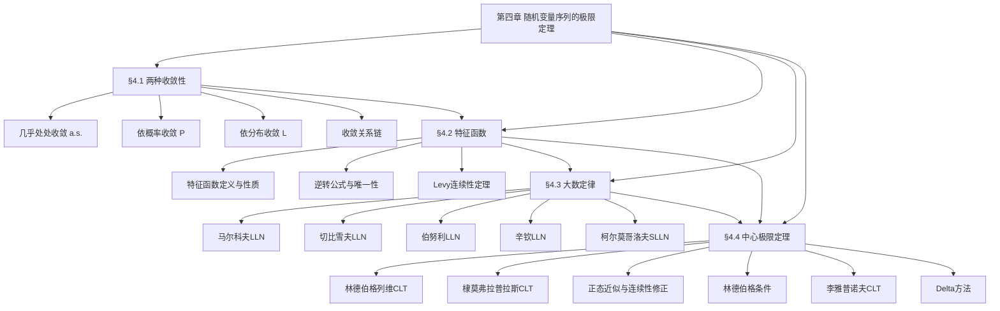

# 第四章 随机变量序列的极限定理 — 章节汇总

> [!abstract] 全章概览
> 本章研究随机变量序列的极限行为，是概率论从"有限"走向"无穷"的关键一步。全章围绕"收敛性→特征函数→大数定律→中心极限定理"四条主线展开：先建立三种收敛性（[[4.1 随机变量序列的两种收敛性|§4.1]]），再引入==特征函数==作为分析工具（[[4.2 特征函数|§4.2]]），然后建立==大数定律==体系（[[4.3 大数定律|§4.3]]），最后系统建立==中心极限定理==体系（[[4.4 中心极限定理|§4.4]]）。
>
> **全章逻辑主线**：收敛性工具（§4.1）→ 特征函数工具（§4.2）→ 大数定律（§4.3）→ 中心极限定理（§4.4）

---

## 一、全章知识框架

---

## 二、核心知识点与公式汇总

### §4.1 随机变量序列的两种收敛性

本节建立随机变量序列极限理论的语言基础。==几乎处处收敛==、==依概率收敛==和==依分布收敛==是三种由强到弱的收敛方式，它们在极限定理中各有不同的应用场景。

| 编号 | 类型 | 名称 | 内容 |
|:----:|:----:|:----:|:----:|
| 4.1.1 | 定义 | 几乎处处收敛 | $P(\lim X_n = X) = 1$，即除零测集外逐点收敛 |
| 4.1.2 | 定义 | 依概率收敛 | $\lim_{n \to \infty} P(\lvert X_n - X \rvert \geq \varepsilon) = 0$，$\forall\, \varepsilon > 0$ |
| 4.1.3 | 定义 | 依分布收敛 | 在 $F$ 的连续点上 $\lim_{n \to \infty} F_n(x) = F(x)$ |

| 编号 | 类型 | 名称 | 内容 |
|:----:|:----:|:----:|:----:|
| 4.1.T1 | 定理 | P收敛的运算性质 | $X_n \xrightarrow{P} X$ 且 $Y_n \xrightarrow{P} Y$ $\Rightarrow$ $X_n \pm Y_n \xrightarrow{P} X \pm Y$，$X_n Y_n \xrightarrow{P} XY$，$X_n/Y_n \xrightarrow{P} X/Y$（$Y \neq 0$） |
| 4.1.T2 | 定理 | P收敛蕴含L收敛 | $X_n \xrightarrow{P} X \Rightarrow X_n \xrightarrow{L} X$ |
| 4.1.T3 | 定理 | 常数极限下等价 | $X_n \xrightarrow{P} c \Leftrightarrow X_n \xrightarrow{L} c$（$c$ 为常数） |

**核心公式**：

$$
X_n \xrightarrow{\text{a.s.}} X \implies X_n \xrightarrow{P} X \implies X_n \xrightarrow{L} X

\lim_{n \to \infty} P(|X_n - X| \geq \varepsilon) = 0 \quad \text{（依概率收敛）}

\lim_{n \to \infty} F_n(x) = F(x) \quad \text{（在 $F$ 的连续点上，依分布收敛）}
$$

---

### §4.2 特征函数

==特征函数== $\varphi(t) = E(e^{itX})$ 是连接概率分布与函数分析的桥梁。它永远存在、与分布一一对应（唯一性定理），且将独立随机变量和的分布问题转化为特征函数的乘法问题。==Levy连续性定理==是证明中心极限定理的核心工具。

| 编号 | 类型 | 名称 | 内容 |
|:----:|:----:|:----:|:----:|
| 4.2.1 | 定义 | 特征函数 | $\varphi(t) = E(e^{itX})$，对所有 $t \in \mathbb{R}$ 有定义 |
| 4.2.2 | 定义 | 离散型特征函数 | $\varphi(t) = \sum_k e^{itx_k}\, p_k$ |
| 4.2.3 | 定义 | 连续型特征函数 | $\varphi(t) = \int_{-\infty}^{+\infty} e^{itx}\, p(x)\, dx$ |

| 编号 | 类型 | 名称 | 内容 |
|:----:|:----:|:----:|:----:|
| 4.2.T1 | 定理 | 基本性质 | 有界性 $\lvert\varphi(t)\rvert \leq 1$；共轭对称 $\varphi(-t) = \overline{\varphi(t)}$；$\varphi(0) = 1$；线性变换 $\varphi_{aX+b}(t) = e^{itb}\varphi_X(at)$ |
| 4.2.T2 | 定理 | 独立和乘法 | $X$ 与 $Y$ 独立时 $\varphi_{X+Y}(t) = \varphi_X(t) \cdot \varphi_Y(t)$ |
| 4.2.T3 | 定理 | 特征函数与矩 | 若 $E(X^k)$ 存在，则 $\varphi^{(k)}(0) = i^k E(X^k)$ |
| 4.2.T4 | 定理 | 非负定性 | $\sum_{k=1}^{n}\sum_{j=1}^{n} \varphi(t_k - t_j)\, z_k \bar{z}_j \geq 0$，$\forall\, n, t_1,\ldots,t_n, z_1,\ldots,z_n$ |
| 4.2.T5 | 定理 | 逆转公式与唯一性 | 特征函数与分布函数一一对应；由 $\varphi(t)$ 可唯一恢复 $F(x)$ |
| 4.2.T6 | 定理 | Levy连续性定理 | $\{F_n\}$ 依分布收敛于 $F$ $\Leftrightarrow$ $\{\varphi_n\}$ 逐点收敛于 $\varphi$ 且 $\varphi(t)$ 在 $t=0$ 处连续 |

**核心公式**：

$$
\varphi(t) = E(e^{itX}), \quad |\varphi(t)| \leq 1, \quad \varphi(0) = 1

\varphi_{X+Y}(t) = \varphi_X(t) \cdot \varphi_Y(t) \quad \text{（独立时）}

E(X) = \frac{\varphi'(0)}{i}, \quad \text{Var}(X) = -\varphi''(0) + [\varphi'(0)]^2
$$

**常用分布的特征函数表**：

| 分布 | 特征函数 |
|:----:|:--------:|
| $N(\mu, \sigma^2)$ | $e^{i\mu t - \sigma^2 t^2/2}$ |
| $P(\lambda)$ | $e^{\lambda(e^{it}-1)}$ |
| $b(n, p)$ | $[(1-p) + pe^{it}]^n$ |
| $\text{Exp}(\lambda)$ | $(1 - it/\lambda)^{-1}$ |
| $U(a, b)$ | $(e^{itb} - e^{ita}) / [it(b-a)]$ |

---

### §4.3 大数定律

==大数定律==回答的核心问题是：大量独立随机变量的均值是否会稳定在某个确定值附近？从马尔科夫大数定律（最一般）到柯尔莫哥洛夫强大数定律（最强），大数定律体系为"频率稳定于概率"提供了严格的数学证明，也为统计推断中==相合估计==的概念奠定了理论基础。

| 编号 | 类型 | 名称 | 内容 |
|:----:|:----:|:----:|:----:|
| 4.3.1 | 定义 | 相合估计 | $\hat{\theta}_n \xrightarrow{P} \theta$，即估计量依概率收敛到真实参数 |

| 编号 | 类型 | 名称 | 内容 |
|:----:|:----:|:----:|:----:|
| 4.3.T1 | 定理 | 马尔科夫LLN | $\dfrac{1}{n^2}\text{Var}\!\left(\displaystyle\sum_{i=1}^{n} X_i\right) \to 0$ $\Rightarrow$ $\bar{X}_n - \bar{\mu}_n \xrightarrow{P} 0$ |
| 4.3.T2 | 定理 | 切比雪夫LLN | $X_1, X_2, \ldots$ 独立，方差一致有界 $\Rightarrow$ $\bar{X}_n - \bar{\mu}_n \xrightarrow{P} 0$ |
| 4.3.T3 | 定理 | 伯努利LLN | $S_n \sim b(n, p)$ 时，$S_n/n \xrightarrow{P} p$（频率稳定于概率） |
| 4.3.T4 | 定理 | 辛钦LLN | $X_1, X_2, \ldots$ i.i.d.，$E(X_1) = \mu$ 存在 $\Rightarrow$ $\bar{X}_n \xrightarrow{P} \mu$ |
| 4.3.T5 | 定理 | 柯尔莫哥洛夫SLLN | $X_1, X_2, \ldots$ i.i.d.，$E(X_1) = \mu$ 存在 $\Rightarrow$ $\bar{X}_n \xrightarrow{\text{a.s.}} \mu$ |

**大数定律对比表**：

| 定理 | 条件 | 结论 | 特点 |
|:----:|:----:|:----:|:----:|
| 马尔科夫 | $\dfrac{1}{n^2}\text{Var}\!\left(\displaystyle\sum X_i\right) \to 0$ | $\bar{X}_n - \bar{\mu}_n \xrightarrow{P} 0$ | 最一般，允许不同分布不同期望 |
| 切比雪夫 | 独立 + 方差一致有界 | $\bar{X}_n - \bar{\mu}_n \xrightarrow{P} 0$ | 马尔科夫的推论 |
| 伯努利 | 二项分布 $b(n, p)$ | $S_n/n \xrightarrow{P} p$ | 辛钦的特例 |
| 辛钦 | i.i.d. + 期望存在 | $\bar{X}_n \xrightarrow{P} \mu$ | 不要求方差存在 |
| 柯尔莫哥洛夫 | i.i.d. + 期望存在 | $\bar{X}_n \xrightarrow{\text{a.s.}} \mu$ | 最强结论，几乎处处收敛 |

**核心公式**：

$$
\bar{X}_n = \frac{1}{n}\sum_{i=1}^{n}X_i \xrightarrow{P} \mu \quad \text{（辛钦大数定律）}

P\!\left(\lim_{n\to\infty}\frac{1}{n}\sum_{i=1}^{n}X_i = \mu\right) = 1 \quad \text{（柯尔莫哥洛夫强大数定律）}
$$

---

### §4.4 中心极限定理

==中心极限定理==是概率论中最重要的定理之一，它揭示了大量独立随机因素叠加的结果趋近正态分布这一深刻事实。从i.i.d.情形的林德伯格-列维CLT到独立不同分布的林德伯格CLT和李雅普诺夫CLT，CLT体系完整回答了"标准化和的极限分布是什么"这一核心问题。==Delta方法==则将CLT的应用范围扩展到统计量的光滑函数。

| 编号 | 类型 | 名称 | 内容 |
|:----:|:----:|:----:|:----:|
| 4.4.1 | 条件 | 林德伯格条件 | $\dfrac{1}{B_n^2}\displaystyle\sum_{i=1}^{n} E\!\left[(X_i - \mu_i)^2 \cdot \mathbf{1}_{\{|X_i - \mu_i| \geq \varepsilon B_n\}}\right] \to 0$，$\forall\, \varepsilon > 0$ |
| 4.4.2 | 条件 | 李雅普诺夫条件 | $\dfrac{1}{B_n^{2+\delta}}\displaystyle\sum_{i=1}^{n} E|X_i - \mu_i|^{2+\delta} \to 0$，某个 $\delta > 0$ |

| 编号 | 类型 | 名称 | 内容 |
|:----:|:----:|:----:|:----:|
| 4.4.T1 | 定理 | 林德伯格-列维CLT | $X_1, X_2, \ldots$ i.i.d.，$E(X_1) = \mu$，$\text{Var}(X_1) = \sigma^2 \in (0, +\infty)$ $\Rightarrow$ $\dfrac{\sum X_i - n\mu}{\sigma\sqrt{n}} \xrightarrow{L} N(0, 1)$ |
| 4.4.T2 | 定理 | 棣莫弗-拉普拉斯CLT | $S_n \sim b(n, p)$ 时，$\dfrac{S_n - np}{\sqrt{npq}} \xrightarrow{L} N(0, 1)$ |
| 4.4.T3 | 定理 | 林德伯格CLT | $X_1, X_2, \ldots$ 独立，满足林德伯格条件 $\Rightarrow$ $\dfrac{\sum X_i - \sum \mu_i}{B_n} \xrightarrow{L} N(0, 1)$ |
| 4.4.T4 | 定理 | 李雅普诺夫CLT | $X_1, X_2, \ldots$ 独立，满足李雅普诺夫条件 $\Rightarrow$ $\dfrac{\sum X_i - \sum \mu_i}{B_n} \xrightarrow{L} N(0, 1)$ |
| 4.4.T5 | 定理 | Delta方法 | $\sqrt{n}(g(\bar{X}_n) - g(\mu)) \xrightarrow{d} N(0, [g'(\mu)]^2\sigma^2)$，$g'(\mu) \neq 0$ |

**核心公式**：

$$
\frac{\sum_{i=1}^{n}X_i - n\mu}{\sigma\sqrt{n}} \xrightarrow{L} N(0,1) \quad \text{（林德伯格-列维CLT）}

\frac{S_n - np}{\sqrt{npq}} \xrightarrow{L} N(0,1) \quad \text{（棣莫弗-拉普拉斯CLT）}

P(S_n = k) \approx \Phi\!\left(\frac{k+0.5-np}{\sqrt{npq}}\right) - \Phi\!\left(\frac{k-0.5-np}{\sqrt{npq}}\right) \quad \text{（连续性修正）}

\sqrt{n}(g(\bar{X}_n) - g(\mu)) \xrightarrow{d} N(0, [g'(\mu)]^2\sigma^2) \quad \text{（Delta方法）}

n(g(\bar{X}_n) - g(\mu)) \xrightarrow{d} \frac{\sigma^2 g''(\mu)}{2}\chi_1^2 \quad \text{（二阶Delta方法，$g'(\mu)=0$ 时）}
$$

---

## 三、章节学习脉络

### §4.1 随机变量序列的两种收敛性

从确定性极限到随机极限，本节建立了分析随机变量序列极限行为的三种语言。三种收敛性由强到弱构成关系链：a.s.收敛→P收敛→L收敛。==几乎处处收敛==最强但最难验证，它要求除零测集外逐点收敛，在实际问题中往往难以直接检验。==依概率收敛==是实际最常用的收敛类型，它只要求偏差超过任意阈值的概率趋于零，大数定律的结论正是以P收敛的形式表述。==依分布收敛==最弱但恰好是CLT需要的收敛类型——CLT关心的是标准化和的"分布形状"趋近标准正态，而非随机变量本身趋近某个确定值。

定理4.1.2建立了P收敛蕴含L收敛的单向关系，这保证了在P收敛条件下L收敛自动成立。定理4.1.3则指出收敛目标是常数时P收敛与L收敛等价——这一结论在CLT的证明中有关键作用，因为CLT中标准化和的极限是常数0（在P收敛意义下），从而可以等价地在L收敛意义下讨论。收敛关系链是理解全章的基础框架。

### §4.2 特征函数

==特征函数==是全章的技术核心，也是概率论中最重要的分析工具之一。它将分布函数的卷积运算转化为特征函数的乘法运算，使得独立和的分布问题变得可解——这一转化是CLT证明的关键步骤。特征函数的基本性质（有界性、共轭对称性、$\varphi(0)=1$）保证了它具有良好的分析性质。特征函数与矩的关系 $\varphi^{(k)}(0) = i^k E(X^k)$ 提供了从特征函数提取矩信息的直接途径。

==唯一性定理==（定理4.2.5）保证了特征函数与分布函数的一一对应，这是特征函数方法有效性的根基——只要证明了两个特征函数相等，就等价于证明了两个分布相同。==Levy连续性定理==（定理4.2.6）则建立了"特征函数逐点收敛到连续函数"与"分布函数依分布收敛"的等价关系——这是证明CLT的关键工具。CLT的证明思路可以概括为三步：先求标准化和的特征函数，再证明它逐点收敛到 $e^{-t^2/2}$（标准正态的特征函数），最后由Levy连续性定理得出依分布收敛的结论。

### §4.3 大数定律

==大数定律==回答"均值是否稳定"这一核心问题。五大定律构成一个完整的体系，从不同条件出发、以不同强度的收敛形式，共同论证了"大量随机变量的均值趋于稳定"这一深刻结论。马尔科夫LLN最一般，它只要求标准化后的方差和趋于零，允许随机变量有不同的分布和不同的期望。切比雪夫LLN是马尔科夫的推论，增加了"独立"和"方差一致有界"两个条件。伯努利LLN是切比雪夫的特例，专门处理二项分布，给出了"频率稳定于概率"的严格数学表述。

辛钦LLN从另一方向出发，它不要求方差存在（比切比雪夫更弱），但要求i.i.d.（比切比雪夫更强）。特别值得注意的是，辛钦LLN的条件"期望存在"确实比"方差有限"更弱——存在期望但方差无限的分布（如参数 $\alpha \in (1, 2]$ 的Pareto分布）满足辛钦但不满足切比雪夫。柯尔莫哥洛夫SLLN将辛钦的结论从P收敛加强到a.s.收敛，这是大数定律体系中最强的结论。==相合估计==作为大数定律在统计学中的直接应用，是参数估计理论的基础概念——一个好的估计量至少应该是相合的。

### §4.4 中心极限定理

==中心极限定理==回答"波动服从什么分布"这一核心问题。CLT是概率论最重要的定理，其核心结论是：大量独立随机因素的标准化和趋近标准正态分布。这一结论解释了为什么正态分布在自然界中如此普遍——任何大量独立微小因素叠加的结果都近似正态。林德伯格-列维CLT（定理4.4.T1）是基础版本，要求i.i.d.和有限方差。棣莫弗-拉普拉斯CLT（定理4.4.T2）是其二项分布特例，是正态近似二项分布的理论基础。

正态近似与连续性修正是CLT在实际计算中的直接应用。连续性修正通过将离散概率 $P(S_n = k)$ 转化为连续区间上的积分 $P(k - 0.5 < S_n < k + 0.5)$，显著提高了正态近似的精度。林德伯格条件（条件4.4.1）将CLT推广到独立不同分布情形，其本质要求是：每个随机变量对总方差的贡献都不能太大（没有单个变量"主导"）。李雅普诺夫条件（条件4.4.2）是更易验证的充分条件，通过要求 $(2+\delta)$ 阶矩的存在来保证林德伯格条件成立。==Delta方法==（定理4.4.T5）利用Taylor展开，将CLT的结论扩展到统计量的光滑函数 $g(\bar{X}_n)$，是渐近统计推断（如MLE的渐近正态性）的核心工具。

---

## 四、补充理解与跨章展望

### 全章核心思想

本章的核心思想可以概括为三个层次：

1. **三层结构**：收敛性（§4.1）是语言基础→特征函数（§4.2）是技术工具→大数定律（§4.3）和CLT（§4.4）是核心结论。没有收敛性的语言就无法精确描述极限行为，没有特征函数的工具就无法证明极限定理
2. **标准化思想的贯穿**：LLN和CLT都对随机变量和做标准化处理——LLN中 $\bar{X}_n - \mu$ 标准化后趋于0（均值稳定），CLT中 $(\sum X_i - n\mu)/(\sigma\sqrt{n})$ 标准化后趋于 $N(0,1)$（波动有结构）。两者互补，不可替代
3. **从特殊到一般**：i.i.d.→独立不同分布（辛钦→马尔科夫，林德伯格-列维→林德伯格），弱大数→强大数（辛钦→柯尔莫哥洛夫），P收敛→L收敛（LLN→CLT）。全章呈现从简单到复杂、从特殊到一般的递进结构

### 跨章关联表

| 关联方向 | 章节 | 关联内容 |
|:--------:|:----:|:--------:|
| 前置 | [[第二章 随机变量及其分布 — 章节汇总|第二章 随机变量及其分布]] | 方差有限性→LLN和CLT的共同前提；常用分布→CLT的应用对象 |
| 前置 | [[第三章 多维随机变量及其分布 — 章节汇总|第三章 多维随机变量及其分布]] | 独立性→CLT的i.i.d.前提；协方差→方差展开 $\text{Var}(\sum X_i) = \sum\text{Var}(X_i)$ |
| 工具 | [[4.1 随机变量序列的两种收敛性|§4.1 两种收敛性]] | 依分布收敛是CLT的收敛类型；P收敛蕴含L收敛是CLT证明中的关键步骤 |
| 工具 | [[4.2 特征函数|§4.2 特征函数]] | Levy连续性定理是CLT证明的核心工具；唯一性定理保证特征函数方法的可靠性 |
| 后续 | 第五章 抽样分布 | CLT→样本均值近似正态，是统计推断的理论基础 |
| 后续 | 第六章 参数估计 | Delta方法→MLE渐近正态性；相合估计→LLN的直接应用 |
| 后续 | 第七章 假设检验 | CLT→大样本检验的理论依据 |

### 全章学习建议

1. **收敛关系链是骨架**：a.s.→P→L的关系链贯穿全章，理解三种收敛的区别和联系是学习极限定理的第一步。特别注意：反向一般不成立（L收敛不能推出P收敛），但收敛目标是常数时P收敛与L收敛等价
2. **特征函数是关键工具**：CLT的证明完全依赖特征函数方法。理解"为什么特征函数能证明CLT"比记忆证明细节更重要——核心在于特征函数将卷积变为乘法，将极限分布问题变为逐点收敛问题
3. **LLN与CLT的对比**：LLN说均值稳定（收敛到常数），CLT说波动有结构（收敛到正态分布）。两者互补，不可替代。LLN回答"收敛到哪里"，CLT回答"以什么速率、什么分布收敛"

---

## 五、全章复习题

### §4.1 复习题

> [!problem] 复习题 1 — 收敛关系辨析
>
> 判断以下命题是否正确，并说明理由：
> (1) 若 $X_n \xrightarrow{L} X$，则 $X_n \xrightarrow{P} X$；
> (2) 若 $X_n \xrightarrow{P} c$（$c$ 为常数），则 $X_n \xrightarrow{L} c$；
> (3) 若 $X_n \xrightarrow{P} X$ 且 $Y_n \xrightarrow{P} Y$，则 $X_n + Y_n \xrightarrow{P} X + Y$。

查看解答

**(1)** ❌ 依分布收敛不能推出依概率收敛。反例：设 $X \sim N(0,1)$，$X_n = -X$，则 $X_n \xrightarrow{L} X$（因为 $X_n$ 与 $X$ 同分布），但

$$
P(|X_n - X| \geq 1) = P(|-2X| \geq 1) = 2[1 - \Phi(0.5)] > 0
$$

不趋于0，因此 $X_n \not\xrightarrow{P} X$。

**(2)** ✅ 定理4.1.3：收敛目标是常数时，P收敛与L收敛等价。

**(3)** ✅ 定理4.1.1：P收敛保持加法运算。由 $\varepsilon$-分解法可证。

$\square$

---

> [!problem] 复习题 2 — 依分布收敛的判别
>
> 设 $X_n \sim N(0, 1/n)$，证明 $X_n \xrightarrow{P} 0$，并由此推出 $X_n \xrightarrow{L} 0$。

查看解答

$E(X_n) = 0$，$\text{Var}(X_n) = 1/n$。

由切比雪夫不等式：

$$
P(|X_n - 0| \geq \varepsilon) \leq \frac{\text{Var}(X_n)}{\varepsilon^2} = \frac{1}{n\varepsilon^2} \to 0 \quad (n \to \infty)
$$

因此 $X_n \xrightarrow{P} 0$。

由定理4.1.2（P收敛蕴含L收敛），$X_n \xrightarrow{L} 0$。

$\square$

---

### §4.2 复习题

> [!problem] 复习题 3 — 特征函数与分布判别
>
> 设 $X$ 的特征函数为 $\varphi(t) = \dfrac{1}{1 - 3it}$。（1）求 $E(X)$ 和 $\text{Var}(X)$；（2）指出 $X$ 服从的分布。

查看解答

**(1) 求期望和方差**

$$
\varphi'(t) = \frac{3i}{(1-3it)^2}, \quad \varphi''(t) = \frac{-18}{(1-3it)^3}

E(X) = \frac{\varphi'(0)}{i} = \frac{3i}{i} = 3

E(X^2) = \frac{\varphi''(0)}{i^2} = \frac{-18}{-1} = 18

\text{Var}(X) = E(X^2) - [E(X)]^2 = 18 - 9 = 9
$$

**(2) 判别分布**

$\text{Exp}(\lambda)$ 的特征函数标准形式为 $(1 - it/\lambda)^{-1}$。比较：

$$
\frac{1}{1-3it} = \left(1 - \frac{it}{1/3}\right)^{-1}
$$

因此 $\lambda = 1/3$，$X \sim \text{Exp}(1/3)$。

验证：$E(X) = 1/\lambda = 3$ ✓，$\text{Var}(X) = 1/\lambda^2 = 9$ ✓。

$\square$

---

> [!problem] 复习题 4 — Levy连续性定理
>
> 设 $X_n$ 的特征函数为 $\varphi_n(t) = \left(\dfrac{1}{1 + t^2/n}\right)^n$。求 $X_n$ 的极限分布。

查看解答

$$
\varphi_n(t) = \left(1 + \frac{t^2}{n}\right)^{-n} \to e^{-t^2} \quad (n \to \infty)
$$

现在识别 $e^{-t^2}$ 对应的分布。$N(0, \sigma^2)$ 的特征函数为 $e^{-\sigma^2 t^2/2}$，令

$$
\frac{\sigma^2}{2} = 1 \implies \sigma^2 = 2
$$

因此 $e^{-t^2}$ 是 $N(0, 2)$ 的特征函数。

验证Levy连续性定理的条件：$\varphi(t) = e^{-t^2}$ 在 $t=0$ 处连续（$\varphi(0) = 1$）✓。

由Levy连续性定理，$X_n \xrightarrow{L} N(0, 2)$。

$\square$

---

### §4.3 复习题

> [!problem] 复习题 5 — 大数定律条件辨析
>
> 设 $\{X_n\}$ i.i.d.，$E(X_1) = \mu$ 存在但 $E(X_1^2) = +\infty$（方差不存在）。问：能否用切比雪夫大数定律得出 $\bar{X}_n \xrightarrow{P} \mu$？能否用辛钦大数定律得出？

查看解答

**切比雪夫大数定律**要求方差一致有界（$\text{Var}(X_i) \leq c$），而本题方差不存在（$E(X_1^2) = +\infty$），因此==不能==用切比雪夫大数定律。

**辛钦大数定律**只要求i.i.d.且期望存在（$E|X_1| < +\infty$），不要求方差存在。本题满足辛钦的条件，因此==可以==用辛钦大数定律得出 $\bar{X}_n \xrightarrow{P} \mu$。

这一对比说明辛钦LLN的条件比切比雪夫LLN更弱（不要求方差），但代价是要求i.i.d.（切比雪夫允许不同分布）。两者各有适用场景，不可互相完全替代。

$\square$

---

> [!problem] 复习题 6 — 相合性证明
>
> 设 $X_1, \ldots, X_n$ i.i.d.，$E(X_1) = \mu$，$\text{Var}(X_1) = \sigma^2$。证明样本二阶矩 $M_2 = \dfrac{1}{n}\displaystyle\sum_{i=1}^{n}X_i^2$ 是 $E(X^2) = \mu^2 + \sigma^2$ 的相合估计。

查看解答

令 $Y_i = X_i^2$，则 $M_2 = \bar{Y}_n = \dfrac{1}{n}\displaystyle\sum_{i=1}^{n} Y_i$。

由于 $E(Y_1) = E(X_1^2) = \mu^2 + \sigma^2 < +\infty$（有限），且 $Y_1, Y_2, \ldots$ 仍为i.i.d.序列。

由辛钦大数定律（$Y_i$ i.i.d.且期望有限）：

$$
\bar{Y}_n = M_2 \xrightarrow{P} E(Y_1) = \mu^2 + \sigma^2
$$

因此 $M_2$ 是 $E(X^2)$ 的==相合估计==。

**推广**：同理可证，样本 $k$ 阶矩 $M_k = \frac{1}{n}\sum X_i^k$ 是 $E(X^k)$ 的相合估计（只要 $E|X|^k < +\infty$）。

$\square$

---

### §4.4 复习题

> [!problem] 复习题 7 — CLT正态近似计算
>
> 某产品合格率为 $p = 0.8$。现随机抽取 $n = 400$ 件，用正态近似（含连续性修正）求合格品数在 $310$ 到 $330$ 之间的概率。

查看解答

设 $S_n \sim b(400, 0.8)$，则

$$
np = 320, \quad npq = 400 \times 0.8 \times 0.2 = 64, \quad \sqrt{npq} = 8
$$

含连续性修正：

$$
P(310 \leq S_n \leq 330) = P(309.5 < S_n < 330.5)

= \Phi\!\left(\frac{330.5 - 320}{8}\right) - \Phi\!\left(\frac{309.5 - 320}{8}\right)

= \Phi(1.3125) - \Phi(-1.3125)

= 2\Phi(1.3125) - 1

\approx 2 \times 0.9057 - 1 = 0.8114
$$

因此合格品数在310到330之间的概率约为 **0.8114**。

$\square$

---

> [!problem] 复习题 8 — Delta方法应用
>
> 设 $X_1, \ldots, X_n$ i.i.d.，$E(X_1) = 1$，$\text{Var}(X_1) = 4$。利用Delta方法求 $\sqrt{n}(\bar{X}_n^2 - 1)$ 的极限分布。

查看解答

由CLT：

$$
\sqrt{n}(\bar{X}_n - 1) \xrightarrow{d} N(0, 4)
$$

令 $g(x) = x^2$，则 $g'(x) = 2x$，$g'(1) = 2 \neq 0$。

由Delta方法：

$$
\sqrt{n}(g(\bar{X}_n) - g(1)) = \sqrt{n}(\bar{X}_n^2 - 1) \xrightarrow{d} N(0, [g'(1)]^2 \cdot 4)

= N(0, 4 \times 4) = N(0, 16)
$$

因此 $\sqrt{n}(\bar{X}_n^2 - 1) \xrightarrow{d} N(0, 16)$。

$\square$

---

## 六、各节笔记索引

| 节号 | 节标题 | 核心主题 | 定义数 | 定理数 | 误区数 | 习题数 |
|:----:|:------:|:--------:|:------:|:------:|:------:|:------:|
| 4.1 | [[4.1 随机变量序列的两种收敛性]] | a.s.收敛、P收敛、L收敛 | 3 | 3 | 3 | 10 |
| 4.2 | [[4.2 特征函数]] | 定义、性质、唯一性、Levy定理 | 3 | 5 | 3 | 10 |
| 4.3 | [[4.3 大数定律]] | 五大定律 + 相合估计 | 1 | 5 | 3 | 10 |
| 4.4 | [[4.4 中心极限定理]] | CLT体系 + Delta方法 | 2 | 5 | 5 | 10 |
| **合计** | | | **9** | **18** | **14** | **40** |

---

#学习/概率论与统计/第四章 随机变量序列的极限定理/章节汇总
