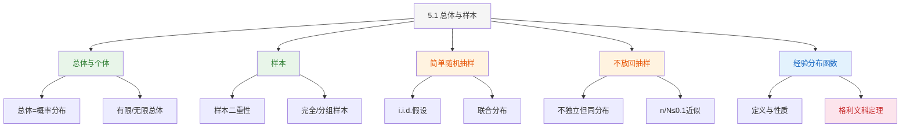

# 5.1 总体与样本

> [!abstract] 本节概览
> 本节是数理统计的开篇，建立"总体→样本→统计量"的基本框架。核心思想：==总体是一个概率分布==，样本是从总体中抽取的 $n$ 个==独立同分布==随机变量。
>
> **逻辑链条**：[[#一、总体与个体|总体与个体]] → [[#二、样本|样本与二重性]] → [[#三、简单随机抽样|简单随机抽样]] → [[#四、有限总体不放回抽样|有限总体不放回抽样]] → [[#五、经验分布函数|经验分布函数]] → [[#五、经验分布函数|格利文科定理]]
>
> **前置依赖**：[[2.4 常用离散分布|§2.4]]（常用分布）、[[3.2 边际分布与随机变量的独立性|§3.2]]（独立性）、[[4.3 大数定律|§4.3]]（大数定律）
>
> **核心主线**：从概率论到数理统计的过渡——概率论中分布已知、推导数据性质；数理统计中数据已知、推断分布特征。本节搭建这一过渡的桥梁。

---

## 一、总体与个体

### 定义

> [!def] 定义 5.1.1 — 总体与个体
> 在一个统计问题中，研究对象的某个==数量指标== $X$ 的所有可能取值及其概率分布称为**总体**（population）。总体中的每一个可能取值称为**个体**（individual）。
>
> 总体的数学本质：总体就是随机变量 $X$ 及其分布 $F(x)$。我们常说"总体 $X$ 的分布为 $F(x)$"或"总体 $X \sim F(x)$"。

### 生活化类比

> [!tip] 生活化类比：总体是"规律"而非"集合"
> 研究全国大学生的身高：
> - **总体**不是"所有大学生"这个物理集合，而是"身高"这个随机变量的分布 $N(\mu, \sigma^2)$
> - 参数 $\mu, \sigma^2$ 描述总体的特征（平均身高、身高离散程度）
> - 我们永远无法穷尽所有大学生，但可以通过样本推断 $\mu, \sigma^2$
>
> 类似地，研究某工厂生产的灯泡寿命，总体是"寿命"这个随机变量的分布，不是"所有灯泡"这个集合。

### 有限总体与无限总体

| 类型 | 定义 | 特点 |
|:----:|------|------|
| **有限总体** | 总体容量 $N$ 有限 | 如某班50名学生的成绩；不放回抽样时不独立 |
| **无限总体** | 总体容量 $N = \infty$ | 如正态分布 $N(\mu, \sigma^2)$ 的所有可能取值；放回抽样近似 |

**关键理解**：==总体本质上是一个概率分布==，个体是总体的一次观测。有限总体和无限总体的区分主要影响抽样方式的选择（放回 vs 不放回）。

### 例题

> [!example] 例 5.1.1 — 磁带伤痕数
> 检查一卷磁带上的伤痕数。设伤痕数 $X$ 服从参数为 $\lambda$ 的 Poisson 分布，则总体就是 Poisson 分布 $\text{Poisson}(\lambda)$。
>
> 总体分布：
> $$
> P(X = k) = \frac{\lambda^k e^{-\lambda}}{k!}, \quad k = 0, 1, 2, \ldots
> $$
>
> 这里参数 $\lambda$ 未知，需要通过样本数据来推断。

> [!example] 例 5.1.2 — 测量误差
> 用仪器测量某物理量，设测量误差 $X \sim N(\mu, \sigma^2)$，则总体就是正态分布 $N(\mu, \sigma^2)$。
>
> 总体密度：
> $$
> p(x) = \frac{1}{\sqrt{2\pi}\,\sigma} \exp\!\left\{-\frac{(x-\mu)^2}{2\sigma^2}\right\}, \quad x \in \mathbb{R}
> $$
>
> 参数 $\mu, \sigma^2$ 描述了测量仪器的系统偏差和精度。

---

## 二、样本

### 定义

> [!def] 定义 5.1.2 — 样本
> 从总体 $X$ 中随机抽取的 $n$ 个个体 $X_1, X_2, \ldots, X_n$ 称为来自总体 $X$ 的一个==样本==（sample）。$n$ 称为**样本容量**（sample size）。
>
> 样本 $(X_1, X_2, \ldots, X_n)$ 是一个 $n$ 维随机向量，其联合分布由抽样方式决定。

### 样本的二重性

样本具有==二重性==（duality），这是理解统计推断的关键：

| 层面 | 样本的性质 | 符号表示 | 用途 |
|:----:|:---------:|:--------:|:----:|
| **理论层面**（抽样前） | $X_1, \ldots, X_n$ 是==随机变量== | 大写 $X_i$ | 建立统计理论、推导分布 |
| **观测层面**（抽样后） | $x_1, \ldots, x_n$ 是==具体数值== | 小写 $x_i$ | 实际计算、数据分析 |

**关键理解**：统计推断在理论层面进行——我们研究统计量（样本的函数）的分布，然后用观测值代入计算。二重性是连接理论与实际的桥梁。

### 例题

> [!example] 例 5.1.3 — 啤酒净含量
> 某啤酒厂生产瓶装啤酒，标称净含量为 640 mL。随机抽取 25 瓶，测量净含量（单位：mL）如下：
> $$
> 641, 635, 640, 643, 638, 642, 636, 639, 637, 641, \\
> 640, 638, 642, 635, 637, 641, 636, 640, 643, 639, \\
> 638, 642, 637, 640, 641
> $$
>
> - 总体 $X$：该厂生产的每瓶啤酒的净含量，假设 $X \sim N(\mu, \sigma^2)$
> - 样本容量 $n = 25$
> - 抽样前：$X_1, \ldots, X_{25}$ 是 25 个随机变量
> - 抽样后：$x_1 = 641, x_2 = 635, \ldots, x_{25} = 641$ 是 25 个具体数值

### 完全样本与分组样本

| 类型 | 定义 | 特点 |
|:----:|------|------|
| **完全样本** | 保留每个观测值 $x_1, \ldots, x_n$ | 信息完整，可进行任意统计分析 |
| **分组样本** | 只保留各区间的频数 | 信息有损失，但数据量大时常用 |

> [!example] 例 5.1.4 — 分组样本
> 对 100 只电子元件进行寿命测试（单位：小时），结果整理为如下频数分布表：
>
> | 寿命区间 | 频数 |
> |:--------:|:----:|
> | $[0, 100)$ | 5 |
> | $[100, 200)$ | 12 |
> | $[200, 300)$ | 25 |
> | $[300, 400)$ | 30 |
> | $[400, 500)$ | 18 |
> | $[500, +\infty)$ | 10 |
>
> 这就是一个分组样本——我们只知道每个区间有多少个观测值，但不知道每个观测值的具体数值。

---

## 三、简单随机抽样

### 定义

> [!def] 定义 5.1.3 — 简单随机抽样（Simple Random Sampling）
> 满足以下两个条件的抽样称为**简单随机抽样**：
> 1. **代表性**：总体中每个个体被抽到的概率相同
> 2. **独立性**：各次抽取互不影响
>
> 数学表述：$X_1, X_2, \ldots, X_n$ ==独立同分布==（i.i.d.），每个 $X_i$ 与总体 $X$ 同分布。

### 联合分布

设总体 $X$ 的分布函数为 $F(x)$，则简单随机样本 $(X_1, \ldots, X_n)$ 的联合分布为：

$$
F(x_1, x_2, \ldots, x_n) = \prod_{i=1}^{n} F(x_i)
$$

**连续型总体**（密度函数 $p(x)$）：

$$
p(x_1, x_2, \ldots, x_n) = \prod_{i=1}^{n} p(x_i)
$$

**离散型总体**（分布列 $P(X = x)$）：

$$
P(X_1 = x_1, X_2 = x_2, \ldots, X_n = x_n) = \prod_{i=1}^{n} P(X = x_i)
$$

### i.i.d. 假设的意义

==i.i.d. 假设是整个经典统计推断的理论基础==。它包含两个核心要素：

| 要素 | 含义 | 统计意义 |
|:----:|------|---------|
| **同分布**（Identically Distributed） | 每个 $X_i$ 与总体 $X$ 分布相同 | 保证样本具有==代表性==，能反映总体特征 |
| **独立**（Independent） | 各 $X_i$ 之间互不影响 | 保证信息不冗余，$n$ 个样本提供 $n$ 份独立信息 |

> [!abstract] i.i.d. 假设的直观理解
> **同分布**就像"公平抽样"——不管抽到谁，都代表总体。**独立性**就像"每次重新洗牌"——前面抽到的结果不影响后面。如果抽样不公平（如只从特定群体抽取），则样本不能代表总体；如果样本之间有依赖关系（如不放回抽样），则需要修正统计方法。

---

## 四、有限总体不放回抽样

### 背景

从有限总体（容量为 $N$）中==不放回==抽取 $n$ 个个体时，$X_1, \ldots, X_n$ 虽然==同分布==，但==不独立==——因为抽走一个个体后，剩余个体的分布会发生变化。

> [!example] 例 5.1.5 — 产品检验
> 一批产品共 $N = 100$ 件，其中含 10 件次品。从中不放回抽取 3 件，设 $X_i$ 为第 $i$ 次抽到的结果（1 表示次品，0 表示正品）。
>
> - $X_1 \sim \text{Bernoulli}(10/100) = \text{Bernoulli}(0.1)$
> - $X_2 \mid X_1 = 1 \sim \text{Bernoulli}(9/99)$（如果第一次抽到次品）
> - $X_2 \mid X_1 = 0 \sim \text{Bernoulli}(10/99)$（如果第一次抽到正品）
>
> 虽然 $X_1, X_2, X_3$ 同分布（边际分布都是 $\text{Bernoulli}(0.1)$），但它们不独立。

### 关键区别

| 抽样方式 | 独立性 | 同分布 | 适用条件 |
|:--------:|:------:|:------:|:--------:|
| 放回抽样 | 独立 | 同分布 | 任何情况 |
| 不放回抽样 | ==不独立== | 同分布 | 有限总体 |
| 不放回抽样（近似） | 近似独立 | 同分布 | $n/N \leq 0.1$ |

### $n/N \leq 0.1$ 经验法则

当抽样比例 $n/N \leq 0.1$（即抽样不超过总体的 10%）时，不放回抽样中个体之间的依赖性足够弱，可以==近似视为 i.i.d.==。这一经验法则在实际应用中广泛使用。

### 不放回抽样下样本均值的期望和方差

设有限总体为 $\{1, 2, \ldots, N\}$（均匀总体），从中不放回抽取 $n$ 个，样本均值为 $\bar{X} = \frac{1}{n}\sum_{i=1}^{n}X_i$，则：

$$
E(\bar{X}) = \frac{N+1}{2}

\text{Var}(\bar{X}) = \frac{(N+1)(N-n)}{12n}
$$

> [!abstract] 证明
> **证明**：
>
> **第一步：计算均匀总体 $X \sim U\{1, 2, \ldots, N\}$ 的期望和方差。**
> $$
> E(X) = \frac{1}{N}\sum_{k=1}^{N}k = \frac{N+1}{2}, \quad \text{Var}(X) = \frac{N^2 - 1}{12}
> $$
>
> **第二步：计算期望 $E(\bar{X})$。** 不放回抽样时 $X_1, \ldots, X_n$ 同分布（每个 $X_i$ 都从 $\{1, \ldots, N\}$ 中等概率抽取），故
> $$
> E(\bar{X}) = \frac{1}{n}\sum_{i=1}^{n}E(X_i) = E(X) = \frac{N+1}{2}
> $$
>
> **第三步：展开方差 $\text{Var}(\bar{X})$。** 利用方差的展开公式（注意：不放回抽样中 $X_i$ 与 $X_j$ 不独立，$i \neq j$）：
> $$
> \text{Var}(\bar{X}) = \frac{1}{n^2}\,\text{Var}\!\left(\sum_{i=1}^{n}X_i\right) = \frac{1}{n^2}\left[\sum_{i=1}^{n}\text{Var}(X_i) + \sum_{i \neq j}\text{Cov}(X_i, X_j)\right]
> $$
>
> **第四步：计算 $\text{Cov}(X_i, X_j)$（$i \neq j$）。** 利用对称性和 $\sum_{i=1}^{N}X_i$ 的方差为零（常数不随机）：
> $$
> 0 = \text{Var}\!\left(\sum_{i=1}^{N}X_i\right) = \sum_{i=1}^{N}\text{Var}(X_i) + \sum_{i \neq j}\text{Cov}(X_i, X_j) = N \cdot \frac{N^2-1}{12} + N(N-1)\,\text{Cov}(X_i, X_j)
> $$
> 解得 $\text{Cov}(X_i, X_j) = -\frac{N^2-1}{12(N-1)}$（负号表示：抽走一个大的值后，剩余值偏小）。
>
> **第五步：代入求方差。**
> $$
> \text{Var}(\bar{X}) = \frac{1}{n^2}\left[n \cdot \frac{N^2-1}{12} + n(n-1) \cdot \left(-\frac{N^2-1}{12(N-1)}\right)\right] = \frac{(N+1)(N-n)}{12n}
> $$
>
> **第六步：与 i.i.d. 对比。** i.i.d. 时 $\text{Var}(\bar{X}) = \frac{N^2-1}{12n}$，不放回时多了一个因子 $\frac{N-n}{N-1} \approx 1 - \frac{n}{N}$，正是由于不独立性导致的==方差缩减==。
>
> $\square$

---

## 五、经验分布函数

### 定义

> [!def] 定义 5.1.4 — 经验分布函数（Empirical Distribution Function）
> 设 $X_1, X_2, \ldots, X_n$ 是来自总体 $X$（分布函数 $F(x)$）的简单随机样本，$x_1, x_2, \ldots, x_n$ 是样本观测值。将观测值从小到大排列为==次序统计量== $x_{(1)} \leq x_{(2)} \leq \cdots \leq x_{(n)}$，则**经验分布函数**定义为：
> $$
> F_n(x) = \frac{1}{n}\sum_{i=1}^{n} I_{\{X_i \leq x\}} = \frac{\#\{X_i \leq x\}}{n}
> $$
> 其中 $I_{\{X_i \leq x\}}$ 为示性函数（indicator function），当 $X_i \leq x$ 时取 1，否则取 0。

**等价的阶梯函数形式**：

$$
F_n(x) =
\begin{cases}
0, & x < x_{(1)} \\
\dfrac{k}{n}, & x_{(k)} \leq x < x_{(k+1)}, \quad k = 1, 2, \ldots, n-1 \\
1, & x \geq x_{(n)}
\end{cases}
$$

### 例题

> [!example] 例 5.1.6 — 饮料净含量的经验分布函数
> 某品牌饮料标称净含量为 500 mL，随机抽取 10 瓶测量，得到如下数据（单位：mL）：
> $$
> 499, 501, 498, 503, 500, 502, 497, 501, 500, 499
> $$
>
> 排序得：$x_{(1)} = 497, x_{(2)} = 498, x_{(3)} = 499, x_{(4)} = 499, x_{(5)} = 500, x_{(6)} = 500, x_{(7)} = 501, x_{(8)} = 501, x_{(9)} = 502, x_{(10)} = 503$
>
> 经验分布函数：
> $$
> F_{10}(x) =
> \begin{cases}
> 0, & x < 497 \\
> 0.1, & 497 \leq x < 498 \\
> 0.2, & 498 \leq x < 499 \\
> 0.4, & 499 \leq x < 500 \\
> 0.6, & 500 \leq x < 501 \\
> 0.8, & 501 \leq x < 502 \\
> 0.9, & 502 \leq x < 503 \\
> 1, & x \geq 503
> \end{cases}
> $$

### 经验分布函数的性质

> [!thm] 经验分布函数的性质
> 设 $F_n(x)$ 是来自总体 $X \sim F(x)$ 的经验分布函数，则：
>
> **性质 1**：$F_n(x)$ 是一个合法的分布函数（非降、右连续、$F_n(-\infty) = 0$，$F_n(+\infty) = 1$）
>
> **性质 2**：对任意固定的 $x$，$n F_n(x) \sim b(n, F(x))$（二项分布）
>
> **性质 3**：$E(F_n(x)) = F(x)$，$\text{Var}(F_n(x)) = \dfrac{F(x)(1 - F(x))}{n}$

> [!abstract] 性质 1 的证明
> **证明**：需验证 $F_n(x)$ 满足分布函数的三条基本性质。
>
> **第一步：非降性**
>
> 对任意 $x_1 < x_2$，有 $\{X_i \leq x_1\} \subseteq \{X_i \leq x_2\}$，因此：
> $$
> I_{\{X_i \leq x_1\}} \leq I_{\{X_i \leq x_2\}}
> $$
>
> 对 $i = 1, \ldots, n$ 求和并除以 $n$，得 $F_n(x_1) \leq F_n(x_2)$。
>
> **第二步：右连续性**
>
> $F_n(x)$ 是阶梯函数，仅在 $x = x_{(1)}, x_{(2)}, \ldots, x_{(n)}$ 处有跳跃。在每个跳跃点处，$F_n(x)$ 取右极限值（定义中 $X_i \leq x$ 包含等号），因此 $F_n(x)$ 右连续。
>
> **第三步：极限值验证**
>
> - 当 $x \to -\infty$ 时，$\{X_i \leq x\} = \emptyset$，故 $I_{\{X_i \leq x\}} = 0$，$F_n(x) = 0$。
> - 当 $x \to +\infty$ 时，$\{X_i \leq x\} = \Omega$（必然事件），故 $I_{\{X_i \leq x\}} = 1$，$F_n(x) = 1$。
>
> 三条性质全部满足，故 $F_n(x)$ 是合法的分布函数。
>
> $\square$

> [!abstract] 性质 2 和性质 3 的证明
> **证明**：
>
> **第一步：引入示性函数并建立 i.i.d. 结构**
>
> 对固定的 $x$，定义示性函数 $I_i = I_{\{X_i \leq x\}}$。由于 $X_1, \ldots, X_n$ i.i.d.，故 $I_1, \ldots, I_n$ 也是 i.i.d. 的 Bernoulli 随机变量：
> $$
> P(I_i = 1) = P(X_i \leq x) = F(x)
> $$
>
> **第二步：证明性质 2（二项分布）**
>
> 由 $F_n(x)$ 的定义，$n F_n(x) = \sum_{i=1}^{n} I_i$，这是 $n$ 个 i.i.d. $\text{Bernoulli}(F(x))$ 之和，因此：
> $$
> n F_n(x) \sim b(n, F(x))
> $$
>
> **第三步：证明性质 3（期望与方差）**
>
> 利用二项分布的期望和方差公式：
> $$
> E(n F_n(x)) = n F(x) \implies E(F_n(x)) = F(x)
> $$
> $$
> \text{Var}(n F_n(x)) = n F(x)(1 - F(x)) \implies \text{Var}(F_n(x)) = \frac{F(x)(1 - F(x))}{n}
> $$
>
> $\square$

### 格利文科定理

> [!thm] 定理 5.1.1 — 格利文科定理（Glivenko-Cantelli Theorem）
> 设 $F_n(x)$ 是来自总体 $X \sim F(x)$ 的经验分布函数，则：
> $$
> P\!\left(\lim_{n \to \infty} \sup_{x \in \mathbb{R}} |F_n(x) - F(x)| = 0\right) = 1
> $$
> 即 $F_n(x)$ ==一致收敛==到 $F(x)$（几乎必然）。

**格利文科定理的意义**：

| 维度 | 含义 |
|:----:|------|
| **数学意义** | 经验分布函数 $F_n(x)$ 以概率 1 一致收敛到真实分布函数 $F(x)$ |
| **统计意义** | 当样本量 $n$ 充分大时，可以用 $F_n(x)$ 作为 $F(x)$ 的非参数估计 |
| **与[[4.3 大数定律|大数定律]]的关系** | 格利文科定理是强大数定律在分布函数层面的推广——大数定律说"频率收敛到概率"（逐点），格利文科定理说"经验分布函数一致收敛到真实分布函数"（一致） |

**关键区别**：大数定律只保证在每个固定点 $x$ 处 $F_n(x) \to F(x)$，格利文科定理进一步保证了在==所有 $x$ 上同时一致收敛==，这是一个更强的结论。

> [!abstract] 格利文科定理的证明思路
> **证明思路**：该定理的完整证明涉及测度论中的可数性论证，此处给出核心框架。
>
> **第一步：将一致收敛分解为有限个点的逐点收敛**
>
> 对 $\mathbb{R}$ 上的分布函数 $F(x)$，取其至多可数个间断点 $\{x_k\}$。对任意 $\varepsilon > 0$，在每个间断点附近构造小区间，使得 $F(x)$ 在每个小区间上的跳跃不超过 $\varepsilon$。这样，$\sup_x |F_n(x) - F(x)|$ 的控制可以归结为有限个点上的逐点偏差控制。
>
> **第二步：在每个固定点应用大数定律**
>
> 由性质 3 知 $E(F_n(x)) = F(x)$，且 $\text{Var}(F_n(x)) = \frac{F(x)(1-F(x))}{n} \to 0$。由 Chebyshev 不等式 + Borel-Cantelli 引理（或直接用 Kolmogorov 强大数定律），对每个固定的 $x$：
> $$
> F_n(x) \xrightarrow{\text{a.s.}} F(x)
> $$
>
> **第三步：利用有限覆盖实现一致控制**
>
> 将 $\mathbb{R}$ 用有限个区间覆盖，在每个区间端点处 $F_n$ 收敛到 $F$。再利用 $F_n$ 和 $F$ 的单调性，将端点处的收敛推广到整个区间上的一致收敛，最终得到：
> $$
> \sup_{x \in \mathbb{R}} |F_n(x) - F(x)| \xrightarrow{\text{a.s.}} 0
> $$
>
> $\square$

---

## 六、知识结构总览

---

## 七、核心思想与证明技巧

### 总体 = 分布的思想

数理统计的研究对象不是具体的数据集合，而是==产生数据的概率分布==。这一思想是数理统计与描述性统计的根本区别：

- **描述性统计**：对已有数据进行总结和展示（均值、方差、直方图等）
- **推断统计**：从样本数据出发，推断总体分布的未知特征（参数估计、假设检验等）

### 样本二重性

| 层面 | 样本 | 统计量 |
|:----:|:----:|:------:|
| 理论 | $X_1, \ldots, X_n$ 是随机变量 | $T = g(X_1, \ldots, X_n)$ 也是随机变量 |
| 观测 | $x_1, \ldots, x_n$ 是具体数值 | $t = g(x_1, \ldots, x_n)$ 是具体数值 |

统计推断在==理论层面==进行：先研究统计量 $T$ 的分布（抽样分布），然后用观测值 $t$ 进行推断。

### i.i.d. 假设的意义

i.i.d. 假设将复杂的多维随机变量问题简化为"一个随机变量的 $n$ 次独立重复"，使得：

- 联合分布可以写成==边际分布的乘积==
- 样本均值 $\bar{X}$ 的期望等于总体期望 $E(X)$
- 样本均值 $\bar{X}$ 的方差等于总体方差除以 $n$：$\text{Var}(\bar{X}) = \text{Var}(X)/n$

### 格利文科定理的价值

格利文科定理将经验分布函数提升为总体分布的==非参数一致估计==：

- 不需要对总体分布做任何参数假设（非参数）
- 当 $n \to \infty$ 时，$F_n(x)$ 以概率 1 一致逼近 $F(x)$（一致性）
- 这是 Kolmogorov-Smirnov 检验等非参数方法的理论基础

---

## 八、补充理解与易混淆点

### "总体就是一堆数据"

**来源**：茆诗松教材§5.1(p223) + 卡方核心笔记(p1) + Wiley"The sample is not the population" + Duke大学讲义Lecture9 + CSDN"用批判性思维看透数据"

> [!danger] 误区1："总体就是一堆数据的集合"
> ❌ 总体不是数据集合，而是==概率分布==。数据只是总体的一次实现（样本观测值）。
> ✅ 总体是某个数量指标 $X$ 的分布 $F(x)$。研究"全国大学生身高"的总体是身高这个随机变量的分布 $N(\mu, \sigma^2)$，不是"所有大学生"这个物理集合。参数 $(\mu, \sigma^2)$ 描述总体，统计量 $(\bar{X}, S^2)$ 描述样本。

### "样本量越大结论就一定越可靠"

**来源**：茆诗松教材§5.1(p225) + 卡方核心笔记(p3) + 鲲鹏智写"统计分析常见误区" + 图灵社区"Literary Digest案例" + CSDN"数据背后的陷阱"

> [!danger] 误区2："只要样本量足够大，结论就一定可靠"
> ❌ 样本量只减小==抽样误差==（sampling error），无法修复==抽样偏差==（sampling bias）。1936年美国《文学文摘》用240万份问卷预测总统选举却预测错误，因为样本偏向高收入人群。
> ✅ 代表性和独立性比样本量更重要。便利抽样、选择性剔除、无应答偏差都会造成有偏样本，增大样本量只会"更精确地得到错误答案"。

### "不放回抽样可以当作 i.i.d. 处理"

**来源**：茆诗松教材§5.1(p226) + 卡方核心笔记(p4) + book118"统计易错点" + 51CTO"总体个体样本辨析" + CMU 36-705 Lecture Notes

> [!danger] 误区3："不放回抽样可以当作 i.i.d. 处理"
> ❌ 不放回抽样中 $X_1, \ldots, X_n$ 虽然同分布，但==不独立==（抽走一个个体会影响剩余个体的分布）。只有当抽样比例 $n/N \leq 0.1$ 时，依赖性足够弱，才能近似为 i.i.d.。
> ✅ 不放回抽样下样本均值的方差为 $\text{Var}(\bar{X}) = \frac{(N+1)(N-n)}{12n}$（均匀总体），比 i.i.d. 时的 $\text{Var}(\bar{X}) = \frac{N^2-1}{12n}$ 多了一个因子 $(1 - n/N)$，正是由于不独立性导致的方差缩减。

---

## 九、习题精选

> [!todo] 习题概览
>
> | 编号 | 题目来源 | 知识点 | 难度 |
> |:----:|:--------:|:------:|:----:|
> | 1 | 教材5.1-1 | 总体与样本概念辨析 | ★☆☆ |
> | 2 | 教材5.1-3 | 样本联合分布 | ★★☆ |
> | 3 | 教材5.1-5 | 不放回抽样概率计算 | ★★☆ |
> | 4 | 教材5.1-7 | 经验分布函数计算 | ★★☆ |
> | 5 | 教材5.1-8 | 格利文科定理理解 | ★★☆ |
> | 6 | 教材5.1-附加 | 样本均值 vs 样本中位数 | ★★★ |
> | 7 | 2012东北师大432 | 统计量定义 | ★☆☆ |
> | 8 | 2019郑州大学432 | 样本均值/中位数 | ★☆☆ |
> | 9 | 2012华东师大432 | 经验分布函数期望方差 | ★★☆ |
> | 10 | 2018大连理工432 | 无偏估计+次序统计量 | ★★★ |

### 习题1 — 教材5.1-1：总体与样本概念辨析

> [!problem] 习题1 — 教材5.1-1
> 总体是分布还是数据集合？样本的二重性是什么？请举例说明。

> [!faq]- 查看解答
> **解**：
>
> （1）总体是==概率分布==，不是数据集合。例如，研究某工厂生产的灯泡寿命，总体是"寿命"这个随机变量的分布 $F(x)$，而不是"所有灯泡"这个物理集合。
>
> （2）样本的二重性：抽样前，样本 $(X_1, \ldots, X_n)$ 是 $n$ 个随机变量（理论层面）；抽样后，样本 $(x_1, \ldots, x_n)$ 是 $n$ 个具体数值（观测层面）。统计推断在理论层面进行，用观测值代入计算。
>
> $\square$

### 习题2 — 教材5.1-3：样本联合分布

> [!problem] 习题2 — 教材5.1-3
> 设 $X_1, X_2, X_3, X_4, X_5$ 是来自标准正态总体 $N(0, 1)$ 的简单随机样本，求样本的联合密度函数。

> [!faq]- 查看解答
> **解**：
>
> 总体 $X \sim N(0, 1)$，密度函数为：
> $$
> p(x) = \frac{1}{\sqrt{2\pi}} e^{-x^2/2}
> $$
>
> 由简单随机样本的 i.i.d. 性质，联合密度为：
> $$
> p(x_1, x_2, x_3, x_4, x_5) = \prod_{i=1}^{5} p(x_i) = \prod_{i=1}^{5} \frac{1}{\sqrt{2\pi}} e^{-x_i^2/2} = (2\pi)^{-5/2} \exp\!\left\{-\frac{1}{2}\sum_{i=1}^{5}x_i^2\right\}
> $$
>
> $\square$

### 习题3 — 教材5.1-5：不放回抽样概率计算

> [!problem] 习题3 — 教材5.1-5
> 一批产品共 $N = 100$ 件，其中含 10 件次品。从中不放回抽取 3 件，求恰好抽到 1 件次品的概率。

> [!faq]- 查看解答
> **解**：
>
> 设 $X$ 为 3 件中次品的件数。从 100 件中不放回抽 3 件，$X$ 服从超几何分布：
> $$
> P(X = 1) = \frac{\binom{10}{1}\binom{90}{2}}{\binom{100}{3}} = \frac{10 \times 4005}{161700} = \frac{40050}{161700} \approx 0.2477
> $$
>
> **对比**：如果放回抽样（i.i.d.），则 $X \sim b(3, 0.1)$：
> $$
> P(X = 1) = \binom{3}{1}(0.1)^1(0.9)^2 = 3 \times 0.1 \times 0.81 = 0.243
> $$
>
> 两者非常接近，因为 $n/N = 3/100 = 0.03 \leq 0.1$，满足近似条件。
>
> $\square$

### 习题4 — 教材5.1-7：经验分布函数计算

> [!problem] 习题4 — 教材5.1-7
> 设样本观测值为 $1, 3, 2, 5, 4$，求经验分布函数 $F_5(2.5)$。

> [!faq]- 查看解答
> **解**：
>
> 排序得：$x_{(1)} = 1, x_{(2)} = 2, x_{(3)} = 3, x_{(4)} = 4, x_{(5)} = 5$
>
> $F_5(2.5)$ 等于小于等于 2.5 的观测值个数除以 $n$：
> $$
> F_5(2.5) = \frac{\#\{x_i \leq 2.5\}}{5} = \frac{2}{5} = 0.4
> $$
>
> （小于等于 2.5 的观测值为 1 和 2，共 2 个。）
>
> $\square$

### 习题5 — 教材5.1-8：格利文科定理理解

> [!problem] 习题5 — 教材5.1-8
> 格利文科定理说明了什么？它与强大数定律有何区别？

> [!faq]- 查看解答
> **解**：
>
> 格利文科定理说明：经验分布函数 $F_n(x)$ 以概率 1 一致收敛到真实分布函数 $F(x)$，即：
> $$
> P\!\left(\lim_{n \to \infty} \sup_{x \in \mathbb{R}} |F_n(x) - F(x)| = 0\right) = 1
> $$
>
> **与强大数定律的区别**：
> - 强大数定律：对每个固定的 $x$，$F_n(x) \xrightarrow{\text{a.s.}} F(x)$（逐点收敛）
> - 格利文科定理：$\sup_x |F_n(x) - F(x)| \xrightarrow{\text{a.s.}} 0$（一致收敛）
>
> 格利文科定理更强，因为它要求在==所有 $x$ 上同时收敛==，而不仅仅是逐点收敛。
>
> $\square$

### 习题6 — 教材5.1-附加：样本均值的极值性质

> [!problem] 习题6 — 教材5.1-附加
> 设 $x_1, x_2, \ldots, x_n$ 为样本观测值，证明使 $\sum_{i=1}^{n}(x_i - c)^2$ 最小的 $c$ 是样本均值 $\bar{x}$。

> [!faq]- 查看解答
> **解**：
>
> 令 $f(c) = \sum_{i=1}^{n}(x_i - c)^2$，对 $c$ 求导：
> $$
> f'(c) = -2\sum_{i=1}^{n}(x_i - c) = -2\left(\sum_{i=1}^{n}x_i - nc\right)
> $$
>
> 令 $f'(c) = 0$，得：
> $$
> \sum_{i=1}^{n}x_i - nc = 0 \implies c = \frac{1}{n}\sum_{i=1}^{n}x_i = \bar{x}
> $$
>
> 验证二阶导数：$f''(c) = 2n > 0$，故 $\bar{x}$ 是最小值点。
>
> 因此 $\sum_{i=1}^{n}(x_i - c)^2$ 在 $c = \bar{x}$ 处取最小值，最小值为 $\sum_{i=1}^{n}(x_i - \bar{x})^2$。
>
> $\square$

### 习题7 — 2012东北师大432：统计量定义

> [!problem] 习题7 — 2012东北师大432
> 设 $X \sim U(10 - a, 10 + a)$，$X_1, \ldots, X_n$ 为样本。考虑 $S^2 = \frac{1}{n-1}\sum_{i=1}^{n}(X_i - \bar{X})^2$，$S_\beta^2 = \frac{1}{\beta}\sum_{i=1}^{n}(X_i - \bar{X})^2$。$\beta$ 取何值时 $S_\beta$ 不是统计量？

> [!faq]- 查看解答
> **解**：
>
> 统计量是样本的函数，且==不含有任何未知参数==。
>
> $S_\beta^2 = \frac{n-1}{\beta} S^2$，其中 $S^2$ 是统计量（不含未知参数）。
>
> 当 $\beta$ 含有未知参数时，$S_\beta$ 不是统计量。
>
> $X \sim U(10-a, 10+a)$，$\text{Var}(X) = \frac{(2a)^2}{12} = \frac{a^2}{3}$。
>
> 若 $\beta = \text{Var}(X) = \frac{a^2}{3}$（含未知参数 $a$），则 $S_\beta$ 不是统计量。
>
> **答案**：选 B（$\beta = a^2/3$）。
>
> $\square$

### 习题8 — 2019郑州大学432：样本均值与中位数

> [!problem] 习题8 — 2019郑州大学432
> 设 $x_1, x_2, \ldots, x_n$ 为样本观测值。使 $\sum_{i=1}^{n}(x_i - a)^2$ 最小的 $a$ 是？使 $\sum_{i=1}^{n}|x_i - b|$ 最小的 $b$ 是？

> [!faq]- 查看解答
> **解**：
>
> （1）由习题6的结论，使 $\sum_{i=1}^{n}(x_i - a)^2$ 最小的 $a$ 是==样本均值== $\bar{x} = \frac{1}{n}\sum_{i=1}^{n}x_i$。
>
> （2）使 $\sum_{i=1}^{n}|x_i - b|$ 最小的 $b$ 是==样本中位数== $m_e$（即排序后位于中间位置的值）。这是中位数的极值性质——中位数最小化绝对偏差之和。
>
> **答案**：选 C（样本均值和样本中位数）。
>
> $\square$

### 习题9 — 2012华东师大432：经验分布函数的期望与方差

> [!problem] 习题9 — 2012华东师大432
> 设 $F_n(x)$ 是来自总体 $X \sim F(x)$ 的经验分布函数。求 $E(F_n(x))$ 和 $\text{Var}(F_n(x))$，并说明 $n F_n(x)$ 服从什么分布。

> [!faq]- 查看解答
> **解**：
>
> 由经验分布函数的定义：
> $$
> F_n(x) = \frac{1}{n}\sum_{i=1}^{n} I_{\{X_i \leq x\}}
> $$
>
> 对固定的 $x$，$I_{\{X_i \leq x\}} \sim \text{Bernoulli}(F(x))$，且 $I_{\{X_1 \leq x\}}, \ldots, I_{\{X_n \leq x\}}$ i.i.d.。
>
> 因此 $n F_n(x) = \sum_{i=1}^{n} I_{\{X_i \leq x\}} \sim b(n, F(x))$。
>
> 由二项分布的性质：
> $$
> E(F_n(x)) = F(x), \quad \text{Var}(F_n(x)) = \frac{F(x)(1 - F(x))}{n}
> $$
>
> $\square$

### 习题10 — 2018大连理工432：无偏估计与次序统计量

> [!problem] 习题10 — 2018大连理工432
> 设 $X_1, \ldots, X_n$ 是来自均匀总体 $X \sim U(\theta - 1, \theta + 1)$ 的简单随机样本。证明 $\bar{X}$ 和 $\frac{X_{(1)} + X_{(n)}}{2}$ 都是 $\theta$ 的无偏估计。

> [!faq]- 查看解答
> **解**：
>
> **（1）证明 $\bar{X}$ 是 $\theta$ 的无偏估计。**
>
> $E(X) = \frac{(\theta - 1) + (\theta + 1)}{2} = \theta$，故：
> $$
> E(\bar{X}) = E(X) = \theta
> $$
>
> **（2）证明 $\frac{X_{(1)} + X_{(n)}}{2}$ 是 $\theta$ 的无偏估计。**
>
> $X_i \sim U(\theta - 1, \theta + 1)$，令 $Y_i = X_i - (\theta - 1) \sim U(0, 2)$。
>
> $Y_{(1)} = X_{(1)} - (\theta - 1)$，$Y_{(n)} = X_{(n)} - (\theta - 1)$。
>
> 由次序统计量的分布，$Y_{(1)} \sim \text{Beta}(1, n) \cdot 2$，$Y_{(n)} \sim \text{Beta}(n, 1) \cdot 2$：
> $$
> E(Y_{(1)}) = \frac{2}{n+1}, \quad E(Y_{(n)}) = \frac{2n}{n+1}
> $$
>
> 因此：
> $$
> E(X_{(1)}) = \theta - 1 + \frac{2}{n+1} = \theta - \frac{n-1}{n+1}
> $$
> $$
> E(X_{(n)}) = \theta - 1 + \frac{2n}{n+1} = \theta + \frac{n-1}{n+1}
> $$
>
> $$
> E\!\left(\frac{X_{(1)} + X_{(n)}}{2}\right) = \frac{1}{2}\left[\left(\theta - \frac{n-1}{n+1}\right) + \left(\theta + \frac{n-1}{n+1}\right)\right] = \theta
> $$
>
> 两者都是 $\theta$ 的无偏估计。
>
> $\square$

---

## 十、教材原文

> [!info] 以下为教材扫描版原文，可点击翻阅。

---

#学习/概率论与统计/第五章 统计量及其分布/总体与样本
