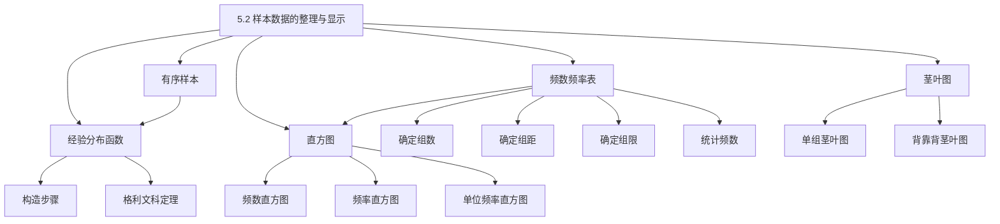

# 5.2 样本数据的整理与显示

> [!abstract] 本节概览
> 本节介绍==样本数据的整理与图形显示方法==，是描述统计的核心工具。主要包括：[[#一、经验分布函数的构造与应用|经验分布函数]]（理论工具）、[[#二、频数频率表|频数频率表]]（数值整理）、[[#三、直方图|直方图]]（连续数据图形化）、[[#四、茎叶图|茎叶图]]（小数据集图形化）。
>
> **逻辑链条**：原始数据 → [[#一、经验分布函数的构造与应用|有序样本与经验分布函数]] → [[#二、频数频率表|频数频率表（分组整理）]] → [[#三、直方图|直方图（图形显示）]] → [[#四、茎叶图|茎叶图（保留原始信息）]]
>
> **前置依赖**：[[5.1 总体与样本|§5.1]]（总体与样本概念、经验分布函数定义与性质）、[[2.4 常用离散分布|§2.4]]（二项分布）
>
> **核心主线**：从杂乱的原始数据出发，通过有序化、分组、图形化等手段，揭示数据的分布特征（集中趋势、离散程度、分布形态），为后续的统计推断奠定基础。

---

## 一、经验分布函数的构造与应用

经验分布函数的定义和性质已在 [[5.1 总体与样本|§5.1]] 中详细讨论（定义5.1.4、经验分布函数三大性质及证明、格利文科定理）。本节重点放在==构造方法==和==实际应用==上。

### 有序样本

> [!def] 定义 5.2.1 — 有序样本
> 设 $x_1, x_2, \ldots, x_n$ 是来自总体 $X$ 的样本观测值，将它们按从小到大排列：
> $$
> x_{(1)} \leq x_{(2)} \leq \cdots \leq x_{(n)}
> $$
> 称 $(x_{(1)}, x_{(2)}, \ldots, x_{(n)})$ 为==有序样本==（order statistics），其中 $x_{(k)}$ 称为第 $k$ 个==次序统计量==。

### 经验分布函数的构造步骤

回顾 [[5.1 总体与样本|定义 5.1.4]]，经验分布函数 $F_n(x)$ 的构造步骤为：

1. **排序**：将原始数据从小到大排列得到有序样本
2. **分段**：以每个 $x_{(k)}$ 为分段点
3. **计数**：对任意 $x$，统计 $x_i \leq x$ 的个数 $k$
4. **赋值**：$F_n(x) = k/n$

> [!example] 例 5.2.1 — 饮料净重经验分布函数
> 某饮料厂抽查 5 瓶饮料的净重（ml），数据为：$351, 347, 355, 344, 351$。
>
> **解**：
>
> 排序得有序样本：$x_{(1)} = 344, x_{(2)} = 347, x_{(3)} = 351, x_{(4)} = 351, x_{(5)} = 355$
>
> 经验分布函数：
> $$
> F_5(x) =
> \begin{cases}
> 0, & x < 344 \\
> 0.2, & 344 \leq x < 347 \\
> 0.4, & 347 \leq x < 351 \\
> 0.8, & 351 \leq x < 355 \\
> 1, & x \geq 355
> \end{cases}
> $$
>
> 注意：$x = 351$ 处有两个观测值，因此 $F_5(x)$ 在该处跳跃 $0.4$（而非 $0.2$）。

### 格利文科定理（回顾）

> [!thm] 定理 5.2.1 — 格利文科定理（Glivenko-Cantelli Theorem）
> 设 $F_n(x)$ 是来自总体 $X \sim F(x)$ 的经验分布函数，则：
> $$
> P\!\left(\lim_{n \to \infty} \sup_{x \in \mathbb{R}} |F_n(x) - F(x)| = 0\right) = 1
> $$
> 即 $F_n(x)$ ==一致收敛==到 $F(x)$（几乎必然）。

> [!note] 定理意义
> 格利文科定理保证了当样本量 $n$ 充分大时，经验分布函数 $F_n(x)$ 可以作为总体分布函数 $F(x)$ 的良好近似。这是经典==非参数统计==的基石——不需要假设总体分布的具体形式，直接用数据来估计分布。
>
> 详细证明见 [[5.1 总体与样本|§5.1 格利文科定理的证明思路]]。

---

## 二、频数频率表

当样本量较大时，逐点构造经验分布函数不够直观。==频数频率表==通过分组的方式对数据进行整理，是描述统计中最常用的数值整理方法。

### 分组步骤

> [!def] 定义 5.2.2 — 频数频率表
> 将样本数据按取值范围分成若干区间（组），统计落入每个区间的数据个数（频数），并计算频率和累计频率，所得表格称为==频数频率表==。

编制频数频率表的标准步骤：

**第一步：确定组数 $k$**

组数的选择取决于样本量 $n$，可参考以下经验规则：

| 样本量 $n$ | 推荐组数 $k$ |
|:----------:|:----------:|
| $n \leq 50$ | 5 ~ 6 |
| $50 < n \leq 100$ | 7 ~ 10 |
| $100 < n \leq 200$ | 9 ~ 13 |
| $n > 200$ | 12 ~ 20 |

也可以使用 Sturges 公式：$k \approx 1 + 3.322 \lg n$（取整）。

**第二步：确定组距 $d$**

$$
d = \frac{\text{最大值} - \text{最小值}}{k}
$$

组距 $d$ 通常取整数或方便计算的值（如 5, 10, 50, 100 等），实际组距可能略大于计算值。

**第三步：确定组限**

确定每组的下限和上限 $a_0 < a_1 < \cdots < a_k$，使得：
- $a_0$ 略小于最小值
- $a_k$ 略大于最大值
- 每个区间为左开右闭 $(a_{j-1}, a_j]$（或左闭右开，需统一）

**第四步：统计频数、计算频率**

对每组统计频数 $n_j$，计算频率 $f_j = n_j / n$ 和累计频率。

> [!example] 例 5.2.2 — 20名工人产量频数频率表
> 某车间 20 名工人的日产量（件）为：
> $$
> 148, 155, 169, 172, 177, 148, 153, 156, 160, 162, \\
> 168, 170, 171, 176, 182, 189, 196, 153, 157, 162
> $$
>
> **解**：
>
> **第一步**：$n = 20$，取 $k = 5$ 组。
>
> **第二步**：$\text{max} = 196$，$\text{min} = 148$，$d = (196 - 148)/5 = 9.6$，取 $d = 10$。
>
> **第三步**：取 $a_0 = 147$，组限为 $(147, 157], (157, 167], (167, 177], (177, 187], (187, 197]$。
>
> **第四步**：统计得频数频率表：
>
> | 组序 | 分组区间 | 组中值 | 频数 | 频率 | 累计频率 |
> |:----:|:--------:|:------:|:----:|:----:|:--------:|
> | 1 | $(147, 157]$ | 152 | 4 | 0.20 | 20% |
> | 2 | $(157, 167]$ | 162 | 8 | 0.40 | 60% |
> | 3 | $(167, 177]$ | 172 | 5 | 0.25 | 85% |
> | 4 | $(177, 187]$ | 182 | 2 | 0.10 | 95% |
> | 5 | $(187, 197]$ | 192 | 1 | 0.05 | 100% |
> | **合计** | — | — | **20** | **1.00** | — |

> [!warning] 分组注意事项
> - 组距 $d$ 应统一（等距分组），便于比较和绘图
> - 组限的取法需统一（左开右闭或左闭右开），避免数据落在边界上时产生歧义
> - 频数频率表的==信息损失==：分组后丢失了组内数据的具体值，只保留了"落在哪个区间"的信息

---

## 三、直方图

直方图是频数频率表的==图形化表示==，能直观展示数据的分布形态（集中趋势、离散程度、偏态等）。

### 三种直方图

> [!def] 定义 5.2.3 — 频数直方图
> 以分组区间为底边，以该组的==频数==为高的矩形所组成的图形。纵轴表示频数。

> [!def] 定义 5.2.4 — 频率直方图
> 以分组区间为底边，以该组的==频率==为高的矩形所组成的图形。纵轴表示频率。

> [!def] 定义 5.2.5 — 单位频率直方图
> 以分组区间为底边，以该组的==频率/组距==为高的矩形所组成的图形。纵轴表示频率密度。

> [!important] 三种直方图的核心区别
>
> | 类型 | 纵轴含义 | 矩形面积 | 面积之和 | 与密度曲线关系 |
> |:----:|:--------:|:--------:|:--------:|:--------------:|
> | 频数直方图 | 频数 | 频数 × 组距 | $= n \cdot d$（无特殊意义） | — |
> | 频率直方图 | 频率 | 频率 × 组距 | $= d$（无特殊意义） | — |
> | ==单位频率直方图== | ==频率/组距== | ==频率== | $= 1$ | ==逼近概率密度函数== |
>
> **关键结论**：三种直方图的==图形形状完全相同==（因为等距分组，各组宽度一样，只是纵轴的"刻度"不同）。但只有==单位频率直方图==的矩形面积之和为 1，当 $n \to \infty$、组距 $d \to 0$ 时，其阶梯形折线逼近总体概率密度函数 $f(x)$。

### 直方图与条形图的区别

| 特征 | 直方图 | 条形图 |
|------|--------|--------|
| 数据类型 | 连续型数值数据 | 离散型/分类数据 |
| 横轴 | 数值区间（有实际含义） | 类别标签（无顺序含义） |
| 矩形间隔 | 无间隔（连续排列） | 有间隔 |
| 矩形宽度 | 有实际含义（= 组距） | 无实际含义（可任意调整） |
| 矩形含义 | 面积表示频率（单位频率直方图） | 高度表示频数 |

---

## 四、茎叶图

==茎叶图==（stem-and-leaf plot）是另一种数据展示方法，由 Tukey 于 1977 年提出。其最大特点是==保留全部原始数据信息==。

### 构造方法

> [!def] 定义 5.2.6 — 茎叶图
> 将每个数据分为"茎"（高位数字）和"叶"（低位数字）两部分，将茎按大小纵向排列，叶按大小横向排列在同一行中，所得图形称为==茎叶图==。

**构造步骤**：

1. **确定茎和叶**：将数据分为两部分。例如两位数可取十位为茎、个位为叶；三位数可取百位和十位为茎、个位为叶
2. **列茎**：将所有不同的茎按从小到大纵向排列
3. **添叶**：对每个数据，将叶写在对应茎的行上，叶按从小到大排列

> [!example] 例 5.2.3 — 50名应聘人员成绩茎叶图
> 某公司招聘，50 名应聘人员的测试成绩为：
> $$
> \begin{aligned}
> &64, 67, 70, 72, 73, 74, 76, 77, 78, 79, \\
> &80, 81, 81, 82, 83, 84, 85, 86, 86, 87, \\
> &88, 89, 89, 90, 91, 92, 93, 94, 95, 96, \\
> &97, 98, 99, 100, 101, 102, 103, 104, 105, 106, \\
> &107, 108, 110, 112, 115, 118, 120, 125, 128, 133
> \end{aligned}
> $$
>
> **解**：取十位及以上为茎，个位为叶：
>
> ```
> 茎 | 叶
> ---|----------------------------------
>  6 | 4 7
>  7 | 0 2 3 4 6 7 8 9
>  8 | 0 1 1 2 3 4 5 6 6 7 8 9 9
>  9 | 0 1 2 3 4 5 6 7 8 9
> 10 | 0 1 2 3 4 5 6 7 8
> 11 | 0 2 5 8
> 12 | 0 5 8
> 13 | 3
> ```
>
> 从茎叶图可以看出：数据集中在 80~99 分之间，呈近似正态分布。

### 背靠背茎叶图

当需要==比较两组样本==的分布时，可以使用背靠背茎叶图：两组数据共用一个茎，分别向左右两侧展开叶。

> [!example] 例 5.2.4 — 两车间产量背靠背茎叶图
> 甲、乙两车间各 40 名工人的日产量数据如下（略），构造背靠背茎叶图比较两车间产量分布。
>
> **解**：
>
> ```
>    甲车间                    茎    乙车间
> ---------------------------|----|---------------------------
>              8 7 5 3 2      34  |  1 3 5 6
>            9 8 7 6 5 4 3    35  |  2 4 5 7 8 9
>          8 7 6 5 5 4 3 2    36  |  0 1 3 4 5 6 7 8
>        9 8 7 6 5 4 3 2 1    37  |  0 2 3 4 5 6 7 9
>      9 8 7 6 5 4 3 2 1 0    38  |  1 3 4 5 6 7 8 9
>    9 8 7 6 5 4 3 2 1 0 0    39  |  0 2 4 5 6 7 8
>  9 8 7 6 5 4 3 2 1 0        40  |  1 3 5 6 8 9
>        8 7 6 5 4 3 2 1      41  |  0 2 4 7
>          8 7 6 5 4          42  |  1 3 5
>              8 7 5          43  |  2 4
>              8 5            44  |  3
>              7              45  |  5
>              5              46  |
> ```
>
> 从背靠背茎叶图可以看出：甲车间产量集中在 38~41 件，乙车间产量集中在 37~40 件，甲车间整体产量略高于乙车间。

> [!note] 茎叶图的优缺点
> **优点**：
> - 保留全部原始数据信息（不像直方图那样丢失组内细节）
> - 可以直观看出数据的分布形态（对称性、集中趋势、离群值）
> - 背靠背茎叶图便于两组数据对比
>
> **缺点**：
> - 仅适用于==中小样本==（$n \leq 100$ 左右）
> - 数据过于分散时（取值范围大但数据少），茎叶图效果差
> - 不适合多组数据同时比较（超过两组时图形复杂）

---

## 五、知识结构总览



---

## 六、核心思想与技巧

### 数据整理方法的选择

| 场景 | 推荐方法 | 理由 |
|------|----------|------|
| 小样本（$n \leq 30$） | 经验分布函数 + 茎叶图 | 保留全部信息，不损失精度 |
| 中等样本（$30 < n \leq 100$） | 频数频率表 + 直方图 | 分组整理兼顾直观性 |
| 大样本（$n > 100$） | 频数频率表 + 直方图 | 数据量大，分组整理更高效 |
| 两组数据对比 | 背靠背茎叶图 | 直观比较分布差异 |
| 需要估计总体分布 | 单位频率直方图 | 面积和为 1，逼近密度函数 |

### 分组数与组距的经验法则

- 组数太少 → 信息损失严重，分布形态被"抹平"
- 组数太多 → 每组频数过少，随机波动干扰判断
- Sturges 公式 $k \approx 1 + 3.322 \lg n$ 给出了一个合理的起点
- 实际操作中可尝试多个 $k$ 值，选择最能反映数据分布特征的那个

---

## 七、补充理解与易混淆点

### 三种直方图纵轴含义混淆

**来源**：茆诗松《概率论与数理统计》§5.2 p229-230 + 国家统计局《直方图》统计百科 + CSDN《掌握直方图:频数与频率的区别与应用详解》 + bookdown《统计考研复习参考》Ch5 + FineReport《直方图适合哪些数据分布》

> [!danger] 误区1："直方图的纵轴就是频数"
> ❌ 错误解释：认为所有直方图的纵轴都表示频数，矩形高度直接代表数据个数。
> ✅ 正确解释：直方图有三种类型，纵轴含义各不相同。==频数直方图==纵轴是频数，==频率直方图==纵轴是频率，==单位频率直方图==纵轴是"频率/组距"（频率密度）。只有单位频率直方图的矩形面积之和为 1，才能逼近概率密度曲线。三种直方图在等距分组下图形形状相同，但纵轴刻度和面积含义完全不同。

### 直方图与条形图混淆

**来源**：茆诗松《概率论与数理统计》§5.2 p229 + 国家统计局《直方图》统计百科 + 原创力文档《直方图教学课件》 + book118《频数直方图复习知识清单》 + CSDN《python绘制直方图方法详解》

> [!danger] 误区2："直方图就是竖起来的条形图"
> ❌ 错误解释：认为直方图和条形图本质相同，只是方向不同。
> ✅ 正确解释：直方图用于==连续型数值数据==，横轴是数值区间，矩形之间==无间隔==，矩形的==宽度有实际含义==（= 组距），面积表示频率（单位频率直方图）。条形图用于==离散型/分类数据==，横轴是类别标签，条形之间==有间隔==，条形宽度无实际含义，==高度==表示频数。两者适用场景完全不同。

### 茎叶图适用条件误用

**来源**：茆诗松《概率论与数理统计》§5.2 p231-232 + 习题解答本 p222-223 + 卡方核心笔记 + bookdown《统计考研复习参考》Ch5 + CSDN《数理统计-5.2样本数据的整理和显示》

> [!danger] 误区3："茎叶图适用于任何数据集"
> ❌ 错误解释：认为茎叶图是万能的数据展示工具，可以替代直方图。
> ✅ 正确解释：茎叶图仅适用于==中小样本==（通常 $n \leq 100$），且数据==不宜过于分散==。当样本量很大或数据取值范围很宽时，茎叶图会变得非常冗长、难以阅读。此时应改用频数频率表 + 直方图。茎叶图的最大优势是==保留全部原始数据信息==，这是直方图做不到的。

---

## 八、习题精选

> [!todo] 习题概览
>
> | 编号 | 题目来源 | 知识点 | 难度 |
> |:----:|:--------:|:------:|:----:|
> | 1 | 教材 5.2-1 | 经验分布函数构造 | ★★☆ |
> | 2 | 教材 5.2-2 | 分组样本经验分布函数 | ★★★ |
> | 3 | 教材 5.2-3 | 频率分布表与直方图 | ★★★ |
> | 4 | 教材 5.2-4 | 频率分布表补充 | ★★☆ |
> | 5 | 教材 5.2-5 | 频数分布表与直方图 | ★★★ |
> | 6 | 教材 5.2-6 | 茎叶图构造 | ★★☆ |
> | 7 | 2012兰州大学432（卡方4.1-4）：卡方分布自由度判定 | 统计量分布识别 | ★★★ |
> | 8 | 2014兰州大学432（卡方4.1-6）：正态抽样定理证明 | 正态抽样分布 | ★★★★ |
> | 9 | 2017中央财经大学432（卡方4.1-1）：统计量概念辨析 | 统计量概念辨析 | ★★★ |
> | 10 | 2013兰州大学432（卡方4.1-2）：样本均值方差计算 | 样本数字特征 | ★★★ |

> [!problem] 习题1 — 教材5.2-1：经验分布函数构造
> 设 10 名工人的产品数为：$149, 156, 160, 138, 149, 153, 153, 169, 156, 156$。求经验分布函数 $F_{10}(x)$ 并作图。

> [!faq]- 查看解答
> **解**：
>
> 排序得有序样本：
> $$
> x_{(1)} = 138, x_{(2)} = 149, x_{(3)} = 149, x_{(4)} = 153, x_{(5)} = 153, x_{(6)} = 156, x_{(7)} = 156, x_{(8)} = 156, x_{(9)} = 160, x_{(10)} = 169
> $$
>
> 经验分布函数：
> $$
> F_{10}(x) =
> \begin{cases}
> 0, & x < 138 \\
> 0.1, & 138 \leq x < 149 \\
> 0.3, & 149 \leq x < 153 \\
> 0.5, & 153 \leq x < 156 \\
> 0.8, & 156 \leq x < 160 \\
> 0.9, & 160 \leq x < 169 \\
> 1, & x \geq 169
> \end{cases}
> $$
>
> $\square$

> [!problem] 习题2 — 教材5.2-2：分组样本的经验分布函数
> 设有分组样本如下表：
>
> | 区间 | $(38, 48]$ | $(48, 58]$ | $(58, 68]$ | $(68, 78]$ | $(78, 88]$ |
> |:----:|:----------:|:----------:|:----------:|:----------:|:----------:|
> | 频数 | 3 | 4 | 8 | 3 | 2 |
>
> 求经验分布函数 $F_{20}(x)$。

> [!faq]- 查看解答
> **解**：
>
> 总频数 $n = 3 + 4 + 8 + 3 + 2 = 20$。累计频率：
> - $(38, 48]$：累计频率 $= 3/20 = 0.15$
> - $(48, 58]$：累计频率 $= 7/20 = 0.35$
> - $(58, 68]$：累计频率 $= 15/20 = 0.75$
> - $(68, 78]$：累计频率 $= 18/20 = 0.90$
> - $(78, 88]$：累计频率 $= 20/20 = 1.00$
>
> $$
> F_{20}(x) =
> \begin{cases}
> 0, & x \leq 38 \\
> 0.15, & 38 < x \leq 48 \\
> 0.35, & 48 < x \leq 58 \\
> 0.75, & 58 < x \leq 68 \\
> 0.90, & 68 < x \leq 78 \\
> 1.00, & x > 78
> \end{cases}
> $$
>
> $\square$

> [!problem] 习题3 — 教材5.2-3：频率分布表与直方图
> 某地区 30 名毕业生的起薪（元）为：
> $$
> \begin{aligned}
> &9300, 9800, 10500, 11200, 8900, 10600, 10100, 9500, 10700, 11000, \\
> &9400, 10800, 9900, 10300, 10000, 9600, 10200, 10900, 10400, 11300, \\
> &9700, 11100, 9200, 11500, 9000, 11400, 7800, 7380, 15720, 12500
> \end{aligned}
> $$
> 试编制频率分布表（分 6 组）并画出直方图。

> [!faq]- 查看解答
> **解**：
>
> 排序后：$\text{min} = 7380$，$\text{max} = 15720$。
>
> 组距 $d = (15720 - 7380)/6 = 1390$，取 $d = 1400$。
>
> 取 $a_0 = 7350$，分组区间为：
>
> | 组序 | 分组区间 | 组中值 | 频数 | 频率 | 累计频率 |
> |:----:|:--------:|:------:|:----:|:----:|:--------:|
> | 1 | $(7350, 8750]$ | 8050 | 2 | 0.067 | 6.7% |
> | 2 | $(8750, 10150]$ | 9450 | 10 | 0.333 | 40.0% |
> | 3 | $(10150, 11550]$ | 10850 | 14 | 0.467 | 86.7% |
> | 4 | $(11550, 12950]$ | 12250 | 2 | 0.067 | 93.3% |
> | 5 | $(12950, 14350]$ | 13650 | 1 | 0.033 | 96.7% |
> | 6 | $(14350, 15750]$ | 15050 | 1 | 0.033 | 100.0% |
> | **合计** | — | — | **30** | **1.000** | — |
>
> 直方图略（以分组区间为底边，以频数/频率/频率密度为高即可）。
>
> $\square$

> [!problem] 习题4 — 教材5.2-4：频率分布表补充
> 某企业 250 名职工上班所需时间（分钟）的频率分布表如下：
>
> | 分组区间 | $(0, 30]$ | $(30, 60]$ | $(60, 90]$ | $(90, 120]$ | $(120, 150]$ |
> |:--------:|:---------:|:---------:|:---------:|:----------:|:-----------:|
> | 频率 | 0.10 | 0.24 | 0.18 | 0.14 | ? |
>
> 求：（1）空缺的频率；（2）上班时间不超过 60 分钟的职工人数。

> [!faq]- 查看解答
> **解**：
>
> （1）空缺频率 $= 1 - 0.10 - 0.24 - 0.18 - 0.14 = 0.34$
>
> （2）上班时间不超过 60 分钟的频率 $= 0.10 + 0.24 = 0.34$
>
> 职工人数 $= 250 \times 0.34 = 85$ 人
>
> $\square$

> [!problem] 习题5 — 教材5.2-5：频数分布表与直方图
> 某图书馆 40 种刊物的月发行量（册）为：
> $$
> \begin{aligned}
> &353, 552, 673, 887, 1095, 1263, 1380, 1456, 1520, 1601, \\
> &2335, 2802, 3012, 3458, 3689, 3802, 4102, 4500, 4789, 5230, \\
> &5568, 6102, 6534, 7200, 7835, 8234, 8900, 9650, 10234, 11023, \\
> &12045, 13200, 14567, 14667, 15234, 16500, 17800, 18900, 20100, 22345
> \end{aligned}
> $$
> 试建立频数分布表并画直方图。

> [!faq]- 查看解答
> **解**：
>
> $\text{min} = 353$，$\text{max} = 22345$。
>
> 取组距 $d = 1700$，则 $k \geq (22345 - 353)/1700 = 12.94$，取 $k = 13$，$d = 1700$。
>
> 取 $a_0 = 300$，分组区间为 $(300, 2000], (2000, 3700], \ldots, (22200, 23900]$。
>
> | 组序 | 分组区间 | 组中值 | 频数 | 频率 |
> |:----:|:--------:|:------:|:----:|:----:|
> | 1 | $(300, 2000]$ | 1150 | 10 | 0.250 |
> | 2 | $(2000, 3700]$ | 2850 | 5 | 0.125 |
> | 3 | $(3700, 5400]$ | 4550 | 7 | 0.175 |
> | 4 | $(5400, 7100]$ | 6250 | 5 | 0.125 |
> | 5 | $(7100, 8800]$ | 7950 | 4 | 0.100 |
> | 6 | $(8800, 10500]$ | 9650 | 4 | 0.100 |
> | 7 | $(10500, 12200]$ | 11350 | 3 | 0.075 |
> | 8 | $(12200, 13900]$ | 13050 | 1 | 0.025 |
> | 9 | $(13900, 15600]$ | 14750 | 1 | 0.025 |
> | 10 | $(15600, 17300]$ | 16450 | 0 | 0.000 |
> | 11 | $(17300, 19000]$ | 18150 | 0 | 0.000 |
> | 12 | $(19000, 20700]$ | 19850 | 0 | 0.000 |
> | 13 | $(20700, 22400]$ | 21550 | 0 | 0.000 |
>
> 直方图略。
>
> $\square$

> [!problem] 习题6 — 教材5.2-6：茎叶图构造
> 32 名学生的数学成绩为：
> $$
> \begin{aligned}
> &345, 348, 352, 356, 358, 362, 365, 368, 370, 372, \\
> &375, 378, 380, 382, 385, 388, 390, 392, 395, 398, \\
> &400, 405, 408, 412, 415, 418, 420, 425, 430, 435, \\
> &440, 448
> \end{aligned}
> $$
> 试构造茎叶图。

> [!faq]- 查看解答
> **解**：取百位和十位为茎，个位为叶：
>
> ```
> 茎 | 叶
> ---|----------------------------------
>  34 | 5 8
>  35 | 2 6 8
>  36 | 2 5 8
>  37 | 0 2 5 8
>  38 | 0 2 5 8
>  39 | 0 2 5 8
>  40 | 0 5 8
>  41 | 2 5 8
>  42 | 0 5
>  43 | 0 5
>  44 | 0 8
> ```
>
> 数据集中在 370~400 之间，呈近似对称分布。
>
> $\square$

> [!problem] 习题7 — 2012兰州大学432（卡方4.1-4）：卡方分布自由度判定
> 设 $X_1, X_2, \ldots, X_n$ 是来自正态总体 $N(0, 1)$ 的样本，判断下列统计量服从什么分布，并指出自由度：
> （1）$\sum_{i=1}^{n} X_i^2$；（2）$\frac{X_1^2 + X_2^2}{X_3^2 + X_4^2}$

> [!faq]- 查看解答
> **解**：
>
> （1）$X_i \sim N(0, 1)$，故 $X_i^2 \sim \chi^2(1)$。
>
> 由卡方分布的可加性（$X_1, \ldots, X_n$ 独立）：
> $$
> \sum_{i=1}^{n} X_i^2 \sim \chi^2(n)
> $$
>
> （2）$X_1^2 + X_2^2 \sim \chi^2(2)$，$X_3^2 + X_4^2 \sim \chi^2(2)$，且两者独立。
>
> 由 $F$ 分布的定义：
> $$
> \frac{(X_1^2 + X_2^2)/2}{(X_3^2 + X_4^2)/2} = \frac{X_1^2 + X_2^2}{X_3^2 + X_4^2} \sim F(2, 2)
> $$
>
> $\square$

> [!problem] 习题8 — 2014兰州大学432（卡方4.1-6）：正态抽样定理证明
> 设 $X_1, X_2, \ldots, X_n$ 是来自正态总体 $N(\mu, \sigma^2)$ 的样本，$\bar{X} = \frac{1}{n}\sum_{i=1}^{n} X_i$，$S^2 = \frac{1}{n-1}\sum_{i=1}^{n}(X_i - \bar{X})^2$。证明：
> （1）$\bar{X}$ 与 $S^2$ 独立；
> （2）$\frac{(n-1)S^2}{\sigma^2} \sim \chi^2(n-1)$。

> [!faq]- 查看解答
> **证明**：
>
> **第一步：构造正交矩阵**
>
> 作正交变换 $Y = AX$，其中 $A$ 为正交矩阵，第一行为 $\left(\frac{1}{\sqrt{n}}, \ldots, \frac{1}{\sqrt{n}}\right)$，使得 $Y_1 = \sqrt{n}\bar{X}$。
>
> **第二步：利用正交变换的性质**
>
> 由于 $A$ 正交，$Y_1, Y_2, \ldots, Y_n$ 仍为独立正态随机变量，且：
> $$
> Y_1 \sim N(\sqrt{n}\mu, \sigma^2), \quad Y_i \sim N(0, \sigma^2), \ i = 2, \ldots, n
> $$
>
> **第三步：分解偏差平方和**
>
> 由正交变换保范数：
> $$
> \sum_{i=1}^{n}(X_i - \bar{X})^2 = \sum_{i=1}^{n} X_i^2 - n\bar{X}^2 = \sum_{i=2}^{n} Y_i^2
> $$
>
> 因此 $\bar{X} = Y_1/\sqrt{n}$ 仅依赖于 $Y_1$，$S^2 = \frac{1}{n-1}\sum_{i=2}^{n} Y_i^2$ 仅依赖于 $Y_2, \ldots, Y_n$。由独立性得 $\bar{X}$ 与 $S^2$ 独立。（结论 1）
>
> **第四步：证明卡方分布**
>
> $$
> \frac{(n-1)S^2}{\sigma^2} = \sum_{i=2}^{n}\frac{Y_i^2}{\sigma^2} = \sum_{i=2}^{n}\left(\frac{Y_i}{\sigma}\right)^2
> $$
>
> 由于 $\frac{Y_i}{\sigma} \sim N(0, 1)$（$i = 2, \ldots, n$）且相互独立，故：
> $$
> \frac{(n-1)S^2}{\sigma^2} \sim \chi^2(n-1)
> $$
>
> $\square$

> [!problem] 习题9 — 2017中央财经432（卡方4.1-1）：统计量概念辨析
> 设 $X_1, X_2, \ldots, X_n$ 是来自正态总体 $N(\mu, \sigma^2)$ 的样本，其中 $\mu$ 已知、$\sigma^2$ 未知。判断下列哪些是统计量：
> （1）$\sum_{i=1}^{n} X_i$；（2）$\sum_{i=1}^{n}(X_i - \mu)^2$；（3）$\frac{1}{\sigma^2}\sum_{i=1}^{n}(X_i - \bar{X})^2$；（4）$\bar{X} - \mu$

> [!faq]- 查看解答
> **解**：
>
> 统计量的定义：样本的函数，且==不含未知参数==。
>
> （1）$\sum_{i=1}^{n} X_i$：不含未知参数 → ✅ 是统计量
>
> （2）$\sum_{i=1}^{n}(X_i - \mu)^2$：$\mu$ 已知，不含未知参数 → ✅ 是统计量
>
> （3）$\frac{1}{\sigma^2}\sum_{i=1}^{n}(X_i - \bar{X})^2$：$\sigma^2$ 未知 → ❌ 不是统计量
>
> （4）$\bar{X} - \mu$：$\mu$ 已知 → ✅ 是统计量
>
> $\square$

> [!problem] 习题10 — 2013兰州大学432（卡方4.1-2）：样本均值方差计算
> 设 $X_1, X_2, \ldots, X_n$ 是来自总体 $X$ 的样本，$E(X) = \mu$，$\text{Var}(X) = \sigma^2$。求：
> （1）$E(\bar{X})$ 和 $\text{Var}(\bar{X})$；
> （2）$E\!\left(\sum_{i=1}^{n}(X_i - \bar{X})^2\right)$。

> [!faq]- 查看解答
> **解**：
>
> （1）由期望的线性性和独立性：
> $$
> E(\bar{X}) = E\!\left(\frac{1}{n}\sum_{i=1}^{n} X_i\right) = \frac{1}{n} \cdot n\mu = \mu
> $$
> $$
> \text{Var}(\bar{X}) = \text{Var}\!\left(\frac{1}{n}\sum_{i=1}^{n} X_i\right) = \frac{1}{n^2} \cdot n\sigma^2 = \frac{\sigma^2}{n}
> $$
>
> （2）利用恒等式 $\sum_{i=1}^{n}(X_i - \bar{X})^2 = \sum_{i=1}^{n} X_i^2 - n\bar{X}^2$：
> $$
> E\!\left(\sum_{i=1}^{n}(X_i - \bar{X})^2\right) = \sum_{i=1}^{n} E(X_i^2) - n E(\bar{X}^2)
> $$
> $$
> = n(\sigma^2 + \mu^2) - n\!\left(\frac{\sigma^2}{n} + \mu^2\right) = n\sigma^2 + n\mu^2 - \sigma^2 - n\mu^2 = (n-1)\sigma^2
> $$
>
> $\square$

---

## 九、本节小结

本节介绍了描述统计中三种核心的数据整理与显示方法：

| 方法 | 适用场景 | 优点 | 局限 |
|------|----------|------|------|
| ==经验分布函数== | 小样本，需要精确分布估计 | 保留全部信息，有理论支撑（格利文科定理） | 大样本时阶梯过多，不够直观 |
| ==频数频率表 + 直方图== | 中大样本，需要观察分布形态 | 直观展示集中趋势、离散程度、偏态 | 分组后丢失组内信息，结果依赖分组方式 |
| ==茎叶图== | 小样本（$n \leq 100$），需要保留原始数据 | 保留全部数据信息，可做背靠背对比 | 大样本或数据分散时不适用 |

**核心要点**：
- 三种直方图（频数/频率/单位频率）图形形状相同，但纵轴含义和面积含义不同
- 只有==单位频率直方图==的面积和为 1，可逼近概率密度函数
- 数据整理方法的选择取决于==样本量==和==分析目的==

---

## 十、教材原文

> [!info] 以下为教材扫描版原文，可点击翻阅。


#学习/概率论与统计/第五章 统计量及其分布/数据整理
