# 5.3 统计量及其分布

> [!abstract] 本节概览
> 本节是数理统计的核心基础，系统介绍==统计量==的概念及其抽样分布。统计量是连接"样本数据"与"统计推断"的桥梁——通过对样本数据进行加工（求均值、方差、排序等），提取出用于推断总体参数的信息。
>
> **逻辑链条**：[[#一、统计量与抽样分布|统计量定义]] → [[#二、样本均值及其抽样分布|样本均值]] → [[#三、样本方差与样本标准差|样本方差]] → [[#四、样本矩及其函数|样本矩]] → [[#五、次序统计量及其分布|次序统计量]] → [[#六、样本分位数与样本中位数|样本分位数]] → [[#七、五数概括与箱线图|箱线图]]
>
> **前置依赖**：[[5.1 总体与样本|§5.1]]（总体与样本）、[[4.4 中心极限定理|§4.4]]（CLT）、[[2.5 常用连续分布|§2.5]]（Beta分布）、[[3.3 多维随机变量函数的分布|§3.3]]（变量变换法）
>
> **核心主线**：统计量是"不含未知参数的样本函数"，其概率分布称为==抽样分布==。本节重点掌握样本均值和样本方差的性质与分布、次序统计量的分布推导，以及样本分位数的渐近理论。

---

## 一、统计量与抽样分布

### 定义

> [!def] 定义 5.3.1 — 统计量
> 设 $X_1, X_2, \ldots, X_n$ 为来自总体 $X$ 的一个样本，$g(X_1, X_2, \ldots, X_n)$ 为一个连续函数。如果 $g$ 中==不含有任何未知参数==，则称
> $$
> T = g(X_1, X_2, \ldots, X_n)
> $$
> 为一个**统计量**（statistic）。
>
> 统计量的本质：统计量是对样本数据的一种"加工"或"压缩"，将 $n$ 个原始数据浓缩为少数几个有意义的量，用于推断总体特征。

> [!def] 抽样分布
> 统计量 $T = g(X_1, \ldots, X_n)$ 的概率分布称为该统计量的==抽样分布==（sampling distribution）。
>
> 抽样分布描述了统计量在重复抽样下的变异规律，是进行统计推断的理论基础。

### 关键理解

统计量的核心要求是**不含有任何未知参数**。这是因为在实际应用中，我们需要用统计量来估计或检验总体参数，如果统计量本身含有未知参数，就无法计算。

> [!tip] 生活化类比：统计量是"体检报告摘要"
> 假设你去体检，做了 $n=10$ 项检查（血压、心率、血糖等），每项检查就是一个样本观测值 $X_i$。
> - **统计量**就像体检报告上的"汇总指标"：平均血压 $\bar{X}$、血压波动范围 $S^2$、最高血压 $X_{(n)}$ 等
> - 这些汇总指标只依赖于你的检查数据，不依赖于任何"未知参数"（如全国平均血压 $\mu$）
> - **抽样分布**就像"如果重复体检多次，这些汇总指标会如何变化"

### 例题

> [!example] 例 5.3.1 — 判别统计量
> 设 $X_1, X_2, \ldots, X_n$ 为来自正态总体 $N(\mu, \sigma^2)$ 的样本，其中 $\mu, \sigma^2$ 均未知。判断以下哪些是统计量：
>
> | 表达式 | 是否为统计量 | 原因 |
> |:------:|:----------:|:----:|
> | $X_1 - \mu$ | **否** | 含未知参数 $\mu$ |
> | $X_1 / \sigma$ | **否** | 含未知参数 $\sigma$ |
> | $\bar{X} = \frac{1}{n}\sum_{i=1}^{n}X_i$ | **是** | 只含样本，不含未知参数 |
> | $S^2 = \frac{1}{n-1}\sum_{i=1}^{n}(X_i - \bar{X})^2$ | **是** | 只含样本，不含未知参数 |
> | $\max(X_1, \ldots, X_n)$ | **是** | 只含样本，不含未知参数 |
> | $\frac{\bar{X} - \mu}{S/\sqrt{n}}$ | **否** | 含未知参数 $\mu$ |
> | $\frac{X_1 + X_2}{2}$ | **是** | 只含样本，不含未知参数 |

---

## 二、样本均值及其抽样分布

### 定义

> [!def] 定义 5.3.2 — 样本均值
> 设 $X_1, X_2, \ldots, X_n$ 为来自总体 $X$ 的样本，则
> $$
> \bar{X} = \frac{1}{n}\sum_{i=1}^{n}X_i
> $$
> 称为**样本均值**（sample mean）。
>
> 样本均值是最常用的集中趋势度量，用于估计总体均值 $\mu$。

### 基本性质

> [!thm] 性质 5.3.1 — 偏差之和为零
> $$
> \sum_{i=1}^{n}(X_i - \bar{X}) = 0
> $$

> [!abstract] 证明
> **证明**：
>
> **第一步：展开偏差之和。**
> $$
> \sum_{i=1}^{n}(X_i - \bar{X}) = \sum_{i=1}^{n}X_i - \sum_{i=1}^{n}\bar{X}
> $$
>
> **第二步：提取常数 $\bar{X}$。** 由于 $\bar{X}$ 与求和下标 $i$ 无关，是常数：
> $$
> \sum_{i=1}^{n}\bar{X} = n\bar{X} = n \cdot \frac{1}{n}\sum_{i=1}^{n}X_i = \sum_{i=1}^{n}X_i
> $$
>
> **第三步：代入化简。**
> $$
> \sum_{i=1}^{n}(X_i - \bar{X}) = \sum_{i=1}^{n}X_i - \sum_{i=1}^{n}X_i = 0
> $$
>
> $\blacksquare$

> [!thm] 性质 5.3.2 — 偏差平方和最小
> 设 $c$ 为任意常数，则
> $$
> \sum_{i=1}^{n}(X_i - \bar{X})^2 = \min_{c}\sum_{i=1}^{n}(X_i - c)^2
> $$
> 即样本均值 $\bar{X}$ 使偏差平方和达到最小。

> [!abstract] 证明
> **证明**：
>
> **第一步：将偏差平方和展开为 $c$ 的函数。**
> $$
> Q(c) = \sum_{i=1}^{n}(X_i - c)^2 = \sum_{i=1}^{n}(X_i^2 - 2cX_i + c^2) = \sum_{i=1}^{n}X_i^2 - 2c\sum_{i=1}^{n}X_i + nc^2
> $$
>
> **第二步：对 $c$ 求导并令其为零。**
> $$
> \frac{dQ}{dc} = -2\sum_{i=1}^{n}X_i + 2nc
> $$
> 令 $\frac{dQ}{dc} = 0$，解得
> $$
> c = \frac{1}{n}\sum_{i=1}^{n}X_i = \bar{X}
> $$
>
> **第三步：验证二阶导数大于零，确认是最小值。**
> $$
> \frac{d^2Q}{dc^2} = 2n > 0
> $$
> 因此 $c = \bar{X}$ 时 $Q(c)$ 取得最小值。
>
> $\blacksquare$

### 样本均值的抽样分布

> [!thm] 定理 5.3.1 — 样本均值的分布
> 设 $X_1, X_2, \ldots, X_n$ 为来自总体 $X$ 的样本。
>
> **(1) 正态总体**：若 $X \sim N(\mu, \sigma^2)$，则
> $$
> \bar{X} \sim N\!\left(\mu, \frac{\sigma^2}{n}\right)
> $$
>
> **(2) 一般总体**：若 $E(X) = \mu$，$\text{Var}(X) = \sigma^2$ 存在且有限，则当 $n \to \infty$ 时
> $$
> \frac{\bar{X} - \mu}{\sigma/\sqrt{n}} \xrightarrow{L} N(0,1)
> $$
> 即大样本下 $\bar{X}$ 近似服从 $N(\mu, \sigma^2/n)$。

> [!abstract] 证明（正态总体情形）
> **证明**：
>
> **第一步：写出 $\bar{X}$ 的线性组合表达式。**
> $$
> \bar{X} = \frac{1}{n}\sum_{i=1}^{n}X_i = \sum_{i=1}^{n}\frac{1}{n}X_i
> $$
> 这是 $n$ 个独立正态随机变量的线性组合。
>
> **第二步：计算期望和方差。** 由期望和方差的线性性质：
> $$
> E(\bar{X}) = \frac{1}{n}\sum_{i=1}^{n}E(X_i) = \frac{1}{n} \cdot n\mu = \mu
> $$
> $$
> \text{Var}(\bar{X}) = \frac{1}{n^2}\sum_{i=1}^{n}\text{Var}(X_i) = \frac{1}{n^2} \cdot n\sigma^2 = \frac{\sigma^2}{n}
> $$
>
> **第三步：利用正态分布的线性不变性。** 独立正态随机变量的线性组合仍为正态分布（[[3.3 多维随机变量函数的分布|§3.3]]），因此
> $$
> \bar{X} \sim N\!\left(\mu, \frac{\sigma^2}{n}\right)
> $$
>
> $\blacksquare$

**一般总体情形**直接由 [[4.4 中心极限定理|林德伯格-列维CLT]] 得出，此处不再重复证明。

### 分组样本均值近似公式

当数据以分组形式给出时，设第 $j$ 组的组中值为 $x_j^*$，频数为 $n_j$，总频数 $n = \sum_{j=1}^{k}n_j$，则样本均值的近似公式为

$$
\bar{X} \approx \frac{1}{n}\sum_{j=1}^{k}n_j x_j^*
$$

### 例题

> [!example] 例 5.3.2 — 正态总体样本均值的分布
> 设 $X_1, X_2, \ldots, X_{16}$ 为来自 $N(5, 4)$ 的样本，则
> $$
> \bar{X} \sim N\!\left(5, \frac{4}{16}\right) = N(5, 0.25)
> $$
> 即 $\bar{X}$ 的标准差为 $\sigma/\sqrt{n} = 2/4 = 0.5$，远小于总体的标准差 $2$。这说明样本均值比单个观测值更集中于总体均值附近。

> [!example] 例 5.3.3 — 不同总体样本均值随 $n$ 变化的分布
> 设总体 $X$ 服从参数为 $\lambda = 1$ 的指数分布，$E(X) = 1$，$\text{Var}(X) = 1$。
>
> | 样本量 $n$ | $\bar{X}$ 的近似分布 | $\text{Var}(\bar{X})$ |
> |:----------:|:-------------------:|:-------------------:|
> | $n = 1$ | $N(1, 1)$ | $1$ |
> | $n = 10$ | $N(1, 0.1)$ | $0.1$ |
> | $n = 100$ | $N(1, 0.01)$ | $0.01$ |
>
> 随着 $n$ 增大，$\bar{X}$ 的方差以 $1/n$ 的速率递减，$\bar{X}$ 越来越集中于 $\mu = 1$ 附近。这正是 [[4.4 中心极限定理|CLT]] 和 [[4.3 大数定律|大数定律]] 的直观体现。

---

## 三、样本方差与样本标准差

### 定义

> [!def] 定义 5.3.3 — 样本方差与样本标准差
> 设 $X_1, X_2, \ldots, X_n$ 为来自总体 $X$ 的样本，$\bar{X}$ 为样本均值。
>
> **样本方差**（未修正）：
> $$
> S_n^2 = \frac{1}{n}\sum_{i=1}^{n}(X_i - \bar{X})^2
> $$
>
> **样本方差**（无偏修正）：
> $$
> S^2 = \frac{1}{n-1}\sum_{i=1}^{n}(X_i - \bar{X})^2
> $$
>
> **样本标准差**：
> $$
> S = \sqrt{S^2} = \sqrt{\frac{1}{n-1}\sum_{i=1}^{n}(X_i - \bar{X})^2}
> $$
>
> $S^2$ 称为==无偏样本方差==（unbiased sample variance），$S_n^2$ 称为==有偏样本方差==（biased sample variance）。$S^2$ 与 $S_n^2$ 的关系为 $S^2 = \frac{n}{n-1}S_n^2$。

### 偏差平方和的等价公式

偏差平方和 $\sum_{i=1}^{n}(X_i - \bar{X})^2$ 有以下三个等价计算公式：

$$
\sum_{i=1}^{n}(X_i - \bar{X})^2 = \sum_{i=1}^{n}X_i^2 - n\bar{X}^2 = \sum_{i=1}^{n}X_i^2 - \frac{1}{n}\!\left(\sum_{i=1}^{n}X_i\right)^{\!2}
$$

**推导**：

$$
\sum_{i=1}^{n}(X_i - \bar{X})^2 = \sum_{i=1}^{n}(X_i^2 - 2X_i\bar{X} + \bar{X}^2) = \sum_{i=1}^{n}X_i^2 - 2\bar{X}\sum_{i=1}^{n}X_i + n\bar{X}^2
$$

由 $\sum_{i=1}^{n}X_i = n\bar{X}$，代入得

$$
\sum_{i=1}^{n}(X_i - \bar{X})^2 = \sum_{i=1}^{n}X_i^2 - 2n\bar{X}^2 + n\bar{X}^2 = \sum_{i=1}^{n}X_i^2 - n\bar{X}^2
$$

### 样本均值与样本方差的性质

> [!thm] 定理 5.3.2 — 样本均值与样本方差的期望和方差
> 设 $X_1, X_2, \ldots, X_n$ 为来自总体 $X$ 的样本，$E(X) = \mu$，$\text{Var}(X) = \sigma^2 < \infty$，则
>
> $$
> E(\bar{X}) = \mu, \quad \text{Var}(\bar{X}) = \frac{\sigma^2}{n}, \quad E(S^2) = \sigma^2
> $$
>
> 其中 $E(S^2) = \sigma^2$ 表明 $S^2$ 是 $\sigma^2$ 的==无偏估计==（unbiased estimator）。

> [!abstract] 证明 $E(S^2) = \sigma^2$
> **证明**：
>
> **第一步：展开偏差平方和。**
> $$
> \sum_{i=1}^{n}(X_i - \bar{X})^2 = \sum_{i=1}^{n}X_i^2 - n\bar{X}^2
> $$
>
> **第二步：取期望。**
> $$
> E\!\left[\sum_{i=1}^{n}(X_i - \bar{X})^2\right] = E\!\left(\sum_{i=1}^{n}X_i^2\right) - E(n\bar{X}^2) = \sum_{i=1}^{n}E(X_i^2) - nE(\bar{X}^2)
> $$
>
> **第三步：利用 $E(X^2) = \text{Var}(X) + [E(X)]^2 = \sigma^2 + \mu^2$。**
> $$
> E(X_i^2) = \sigma^2 + \mu^2 \quad (\text{对所有 } i)
> $$
> $$
> E(\bar{X}^2) = \text{Var}(\bar{X}) + [E(\bar{X})]^2 = \frac{\sigma^2}{n} + \mu^2
> $$
> 代入得
> $$
> E\!\left[\sum_{i=1}^{n}(X_i - \bar{X})^2\right] = n(\sigma^2 + \mu^2) - n\!\left(\frac{\sigma^2}{n} + \mu^2\right) = n\sigma^2 + n\mu^2 - \sigma^2 - n\mu^2 = (n-1)\sigma^2
> $$
>
> **第四步：化简得 $E(S^2) = \sigma^2$。**
> $$
> E(S^2) = E\!\left[\frac{1}{n-1}\sum_{i=1}^{n}(X_i - \bar{X})^2\right] = \frac{1}{n-1} \cdot (n-1)\sigma^2 = \sigma^2
> $$
>
> $\blacksquare$

**推论**：$E(S_n^2) = \frac{n-1}{n}\sigma^2 = \sigma^2 - \frac{\sigma^2}{n}$，即 $S_n^2$ 系统性地低估 $\sigma^2$，低估量为 $\sigma^2/n$。

### 分组样本方差近似公式

当数据以分组形式给出时，设第 $j$ 组的组中值为 $x_j^*$，频数为 $n_j$，则样本方差的近似公式为

$$
S^2 \approx \frac{1}{n-1}\sum_{j=1}^{k}n_j(x_j^* - \bar{X})^2
$$

其中 $\bar{X} \approx \frac{1}{n}\sum_{j=1}^{k}n_j x_j^*$。

### 例题

> [!example] 例 5.3.4 — 分组样本方差计算
> 对某工厂生产的 100 个零件的尺寸（单位：mm）进行测量，分组数据如下：
>
> | 尺寸区间 | 组中值 $x_j^*$ | 频数 $n_j$ |
> |:--------:|:-------------:|:----------:|
> | $[10, 11)$ | $10.5$ | $8$ |
> | $[11, 12)$ | $11.5$ | $25$ |
> | $[12, 13)$ | $12.5$ | $38$ |
> | $[13, 14)$ | $13.5$ | $22$ |
> | $[14, 15)$ | $14.5$ | $7$ |
>
> 计算样本均值和样本方差的近似值。
>
> **解**：
>
> $$
> \bar{X} \approx \frac{1}{100}(8 \times 10.5 + 25 \times 11.5 + 38 \times 12.5 + 22 \times 13.5 + 7 \times 14.5) = \frac{1245}{100} = 12.45
> $$
>
> $$
> S^2 \approx \frac{1}{99}\sum_{j=1}^{5}n_j(x_j^* - 12.45)^2
> $$
>
> 逐项计算：
> - $8 \times (10.5 - 12.45)^2 = 8 \times 3.8025 = 30.42$
> - $25 \times (11.5 - 12.45)^2 = 25 \times 0.9025 = 22.5625$
> - $38 \times (12.5 - 12.45)^2 = 38 \times 0.0025 = 0.095$
> - $22 \times (13.5 - 12.45)^2 = 22 \times 1.1025 = 24.255$
> - $7 \times (14.5 - 12.45)^2 = 7 \times 4.2025 = 29.4175$
>
> $$
> S^2 \approx \frac{30.42 + 22.5625 + 0.095 + 24.255 + 29.4175}{99} = \frac{106.75}{99} \approx 1.078
> $$

---

## 四、样本矩及其函数

### 定义

> [!def] 定义 5.3.4 — 样本矩
> 设 $X_1, X_2, \ldots, X_n$ 为来自总体 $X$ 的样本。
>
> **$k$ 阶样本原点矩**：
> $$
> a_k = \frac{1}{n}\sum_{i=1}^{n}X_i^k, \quad k = 1, 2, \ldots
> $$
>
> **$k$ 阶样本中心矩**：
> $$
> b_k = \frac{1}{n}\sum_{i=1}^{n}(X_i - \bar{X})^k, \quad k = 1, 2, \ldots
> $$
>
> 特别地，$a_1 = \bar{X}$（样本均值），$b_2 = S_n^2$（有偏样本方差）。

> [!def] 定义 5.3.5 — 样本偏度
> 样本偏度（sample skewness）定义为
> $$
> \beta_s = \frac{b_3}{b_2^{3/2}}
> $$
> 其中 $b_2$ 为二阶样本中心矩，$b_3$ 为三阶样本中心矩。
>
> **解读**：
> - $\beta_s = 0$：数据分布近似对称
> - $\beta_s > 0$：数据分布==右偏==（正偏），右侧有长尾
> - $\beta_s < 0$：数据分布==左偏==（负偏），左侧有长尾

> [!def] 定义 5.3.6 — 样本峰度
> 样本峰度（sample kurtosis）定义为
> $$
> \beta_k = \frac{b_4}{b_2^2} - 3
> $$
> 其中 $b_4$ 为四阶样本中心矩。
>
> **解读**：
> - $\beta_k > 0$：数据分布比正态分布更==尖顶==（leptokurtic），尾部更厚
> - $\beta_k < 0$：数据分布比正态分布更==平顶==（platykurtic），尾部更薄
> - $\beta_k = 0$：与正态分布的峰度一致
>
> 减去 $3$ 是因为正态分布的 $b_4/b_2^2 = 3$，这样使得正态分布的峰度为零。

### 例题

> [!example] 例 5.3.5 — 两班成绩偏度峰度对比
> 甲班和乙班各 30 名学生的数学成绩（满分 100）的样本偏度和样本峰度如下：
>
> | 指标 | 甲班 | 乙班 |
> |:----:|:----:|:----:|
> | 样本均值 $\bar{X}$ | $72.5$ | $71.8$ |
> | 样本标准差 $S$ | $12.3$ | $15.6$ |
> | 样本偏度 $\beta_s$ | $-0.35$ | $1.20$ |
> | 样本峰度 $\beta_k$ | $-0.52$ | $2.15$ |
>
> **分析**：
> - 甲班：$\beta_s = -0.35 < 0$，成绩分布略左偏（高分段集中）；$\beta_k = -0.52 < 0$，分布比正态更平顶
> - 乙班：$\beta_s = 1.20 > 0$，成绩分布明显右偏（低分段有长尾）；$\beta_k = 2.15 > 0$，分布比正态更尖顶，尾部更厚
>
> 乙班的成绩分布存在明显的偏态和厚尾，说明有部分学生成绩远低于平均水平。

---

## 五、次序统计量及其分布

### 定义

> [!def] 定义 5.3.7 — 次序统计量
> 设 $X_1, X_2, \ldots, X_n$ 为来自总体 $X$ 的样本，将其按从小到大排列为
> $$
> X_{(1)} \leq X_{(2)} \leq \cdots \leq X_{(n)}
> $$
> 则 $X_{(k)}$ 称为第 $k$ 个==次序统计量==（order statistic）。
>
> 特别地：
> - $X_{(1)} = \min(X_1, \ldots, X_n)$ 称为**样本最小值**
> - $X_{(n)} = \max(X_1, \ldots, X_n)$ 称为**样本最大值**
> - $R = X_{(n)} - X_{(1)}$ 称为**样本极差**（sample range）

### 关键性质

次序统计量具有以下重要性质：

1. **不独立性**：$X_{(1)}, X_{(2)}, \ldots, X_{(n)}$ 之间==不独立==，排序操作引入了约束 $X_{(1)} \leq X_{(2)} \leq \cdots \leq X_{(n)}$
2. **不同分布**：每个 $X_{(k)}$ 的边际分布一般不同（除非总体为退化分布）
3. **充分统计量**：次序统计量是 i.i.d. 样本的充分统计量（充分性将在后续章节讨论）

### 例题

> [!example] 例 5.3.6 — 离散均匀分布的次序统计量
> 设 $X_1, X_2$ i.i.d.，$X_i$ 服从离散均匀分布 $\{0, 1, 2\}$，即 $P(X_i = k) = 1/3$，$k = 0, 1, 2$。
>
> 次序统计量 $X_{(1)} = \min(X_1, X_2)$，$X_{(2)} = \max(X_1, X_2)$。
>
> 所有可能的 $(X_1, X_2)$ 组合（共 $3 \times 3 = 9$ 种，每种概率 $1/9$）：
>
> | $X_1$ | $X_2$ | $X_{(1)}$ | $X_{(2)}$ |
> |:-----:|:-----:|:---------:|:---------:|
> | 0 | 0 | 0 | 0 |
> | 0 | 1 | 0 | 1 |
> | 0 | 2 | 0 | 2 |
> | 1 | 0 | 0 | 1 |
> | 1 | 1 | 1 | 1 |
> | 1 | 2 | 1 | 2 |
> | 2 | 0 | 0 | 2 |
> | 2 | 1 | 1 | 2 |
> | 2 | 2 | 2 | 2 |
>
> $X_{(1)}$ 的分布：
> $$
> P(X_{(1)} = 0) = \frac{5}{9}, \quad P(X_{(1)} = 1) = \frac{3}{9}, \quad P(X_{(1)} = 2) = \frac{1}{9}
> $$
>
> $X_{(2)}$ 的分布：
> $$
> P(X_{(2)} = 0) = \frac{1}{9}, \quad P(X_{(2)} = 1) = \frac{3}{9}, \quad P(X_{(2)} = 2) = \frac{5}{9}
> $$
>
> **注意**：$X_{(1)}$ 与 $X_{(2)}$ 的分布不同，且不独立。例如 $P(X_{(1)} = 2, X_{(2)} = 0) = 0$（不可能同时满足）。

### 次序统计量的分布

> [!thm] 定理 5.3.3 — 第 $k$ 个次序统计量的密度
> 设总体 $X$ 的分布函数为 $F(x)$，密度函数为 $f(x)$（连续情形），$X_1, \ldots, X_n$ i.i.d.，则第 $k$ 个次序统计量 $X_{(k)}$ 的密度函数为
> $$
> f_{X_{(k)}}(x) = \frac{n!}{(k-1)!(n-k)!}\,[F(x)]^{k-1}\,[1-F(x)]^{n-k}\,f(x)
> $$

> [!abstract] 证明思路
> **证明思路**：
>
> **第一步：构造事件。** 考虑事件 $\{x \leq X_{(k)} < x + dx\}$，即"恰好有 $k-1$ 个样本落在 $(-\infty, x)$，$1$ 个落在 $[x, x+dx)$，$n-k$ 个落在 $(x+dx, +\infty)$"。
>
> **第二步：用多项分布计算概率。** 将 $(-\infty, +\infty)$ 分成三个区间，每个样本落入各区间的概率分别为 $F(x)$、$f(x)\,dx$、$1-F(x)$。由多项分布：
> $$
> P(x \leq X_{(k)} < x + dx) \approx \frac{n!}{(k-1)!\,1!\,(n-k)!}[F(x)]^{k-1}[f(x)\,dx][1-F(x)]^{n-k}
> $$
>
> **第三步：取极限得密度函数。** 两边除以 $dx$ 并令 $dx \to 0$：
> $$
> f_{X_{(k)}}(x) = \frac{n!}{(k-1)!(n-k)!}[F(x)]^{k-1}[1-F(x)]^{n-k}f(x)
> $$
>
> $\blacksquare$

### 例题

> [!example] 例 5.3.7 — 求次序统计量的概率
> 设总体密度为 $p(x) = 3x^2$，$0 < x < 1$，$X_1, X_2, X_3$ i.i.d.，求 $P(X_{(3)} < 1/2)$。
>
> **解**：
>
> 先求分布函数：
> $$
> F(x) = \int_0^x 3t^2\,dt = x^3, \quad 0 < x < 1
> $$
>
> $X_{(3)} = \max(X_1, X_2, X_3)$ 的分布函数为
> $$
> F_{X_{(3)}}(x) = [F(x)]^3 = x^9
> $$
>
> 因此
> $$
> P(X_{(3)} < 1/2) = F_{X_{(3)}}(1/2) = (1/2)^9 = \frac{1}{512} \approx 0.00195
> $$

> [!example] 例 5.3.8 — 均匀分布的次序统计量与 Beta 分布
> 设 $X_1, X_2, \ldots, X_n$ i.i.d. $\sim U(0,1)$，则 $X_{(k)} \sim \text{Be}(k, n-k+1)$。
>
> **证明**：$U(0,1)$ 的分布函数 $F(x) = x$，密度 $f(x) = 1$（$0 < x < 1$）。由定理 5.3.3：
> $$
> f_{X_{(k)}}(x) = \frac{n!}{(k-1)!(n-k)!}\,x^{k-1}\,(1-x)^{n-k}, \quad 0 < x < 1
> $$
> 这正是 [[2.5 常用连续分布|Beta 分布]] $\text{Be}(k, n-k+1)$ 的密度函数。
>
> **特别地**：
> - $X_{(1)} \sim \text{Be}(1, n)$
> - $X_{(n)} \sim \text{Be}(n, 1)$
> - $X_{(k)}$ 的期望 $E(X_{(k)}) = \frac{k}{n+1}$

### 两个次序统计量的联合密度

> [!thm] 定理 5.3.4 — 两个次序统计量的联合密度
> 设总体 $X$ 的分布函数为 $F(x)$，密度函数为 $f(x)$，$X_1, \ldots, X_n$ i.i.d.，则当 $1 \leq i < j \leq n$ 时，$X_{(i)}$ 与 $X_{(j)}$ 的联合密度为
> $$
> f_{X_{(i)}, X_{(j)}}(y, z) = \frac{n!}{(i-1)!(j-i-1)!(n-j)!}[F(y)]^{i-1}[F(z)-F(y)]^{j-i-1}[1-F(z)]^{n-j}f(y)f(z)
> $$
> 其中 $y < z$。

### 例题

> [!example] 例 5.3.9 — 均匀分布的样本极差
> 设 $X_1, X_2, \ldots, X_n$ i.i.d. $\sim U(0,1)$，则样本极差 $R = X_{(n)} - X_{(1)} \sim \text{Be}(n-1, 2)$。
>
> **证明思路**：令 $U = X_{(1)}$，$V = X_{(n)}$，由定理 5.3.4 取 $i=1, j=n$：
> $$
> f_{U,V}(u,v) = n(n-1)(v-u)^{n-2}, \quad 0 < u < v < 1
> $$
> 令 $R = V - U$，$W = U$，做变量变换（[[3.3 多维随机变量函数的分布|§3.3]]），对 $w$ 积分得 $R$ 的边缘密度：
> $$
> f_R(r) = (n-1)(1-r)^{n-2} \cdot n, \quad 0 < r < 1
> $>
> 即 $R \sim \text{Be}(n-1, 2)$。

---

## 六、样本分位数与样本中位数

### 定义

> [!def] 定义 5.3.8 — 样本中位数
> 设 $X_1, X_2, \ldots, X_n$ 为样本，$X_{(1)} \leq X_{(2)} \leq \cdots \leq X_{(n)}$ 为次序统计量。
>
> **样本中位数** $m_{0.5}$ 定义为
> $$
> m_{0.5} = \begin{cases}
> X_{\left(\frac{n+1}{2}\right)}, & \text{若 } n \text{ 为奇数} \\[6pt]
> \dfrac{1}{2}\!\left(X_{\left(\frac{n}{2}\right)} + X_{\left(\frac{n}{2}+1\right)}\right), & \text{若 } n \text{ 为偶数}
> \end{cases}
> $$

> [!def] 定义 5.3.9 — 样本 $p$ 分位数
> **样本 $p$ 分位数** $m_p$（$0 < p < 1$）定义为
> $$
> m_p = X_{(\lfloor np \rfloor + 1)}
> $$
> 其中 $\lfloor np \rfloor$ 表示 $np$ 的整数部分。
>
> **特别地**：
> - $m_{0.5}$：样本中位数
> - $m_{0.25}$：第一四分位数 $Q_1$
> - $m_{0.75}$：第三四分位数 $Q_3$

### 样本分位数的渐近分布

> [!thm] 定理 5.3.5 — 样本 $p$ 分位数的渐近正态性
> 设总体 $X$ 的密度函数 $f(x)$ 在总体 $p$ 分位数 $x_p$ 处连续且 $f(x_p) > 0$，则当 $n \to \infty$ 时
> $$
> m_p \xrightarrow{a} N\!\left(x_p, \frac{p(1-p)}{n \cdot f^2(x_p)}\right)
> $$
> 其中 $x_p$ 满足 $F(x_p) = p$。

> [!abstract] 证明思路
> **证明思路**：
>
> **第一步：将 $m_p$ 表示为经验分布函数的反函数。** 样本 $p$ 分位数 $m_p$ 满足 $F_n(m_p) \approx p$，其中 $F_n$ 为经验分布函数。由 [[5.1 总体与样本|格利文科定理]]，$F_n$ 一致收敛于 $F$。
>
> **第二步：用 Delta 方法。** 由 CLT，$\sqrt{n}[F_n(x_p) - p] \xrightarrow{L} N(0, p(1-p))$。对反函数 $F^{-1}$ 应用 [[4.4 中心极限定理|Delta 方法]]，注意 $(F^{-1})'(p) = 1/f(x_p)$：
> $$
> \sqrt{n}(m_p - x_p) \xrightarrow{L} N\!\left(0, \frac{p(1-p)}{f^2(x_p)}\right)
> $$
>
> **第三步：得渐近正态结论。**
> $$
> m_p \xrightarrow{a} N\!\left(x_p, \frac{p(1-p)}{n \cdot f^2(x_p)}\right)
> $$
>
> $\blacksquare$

### 例题

> [!example] 例 5.3.10 — 柯西分布中位数的渐近分布
> 设 $X_1, \ldots, X_n$ i.i.d. 服从柯西分布 $\text{Cauchy}(\theta, 1)$，密度为
> $$
> f(x) = \frac{1}{\pi[1+(x-\theta)^2]}
> $$
> 求样本中位数 $m_{0.5}$ 的渐近分布。
>
> **解**：柯西分布的中位数 $x_{0.5} = \theta$（因为 $F(\theta) = 1/2$），且 $f(\theta) = 1/\pi$。
>
> 由定理 5.3.5，取 $p = 1/2$：
> $$
> m_{0.5} \xrightarrow{a} N\!\left(\theta, \frac{(1/2)(1/2)}{n \cdot (1/\pi)^2}\right) = N\!\left(\theta, \frac{\pi^2}{4n}\right)
> $$
>
> **注意**：柯西分布的期望和方差都不存在，因此 $\bar{X}$ 的渐近正态性不适用（CLT 的前提不满足）。但样本中位数的渐近正态性仍然成立，这体现了中位数的==稳健性==。

### 中位数的稳健性

样本中位数 $m_{0.5}$ 相比样本均值 $\bar{X}$ 具有重要的==稳健性==（robustness）优势：

| 对比维度 | 样本均值 $\bar{X}$ | 样本中位数 $m_{0.5}$ |
|:--------:|:-----------------:|:-------------------:|
| **极端值影响** | 非常敏感，一个极端值可大幅改变 | 不受影响，只取决于中间位置的值 |
| **正态总体效率** | 最优（MVUE） | 渐近效率约 95.5% |
| **重尾分布** | 效率下降 | 效率更高 |
| **存在性条件** | 需要期望存在 | 只需要中位数存在 |
| **计算复杂度** | $O(n)$ | 需排序 $O(n \log n)$ |

---

## 七、五数概括与箱线图

### 五数概括

> [!def] 五数概括（Five-Number Summary）
> 五数概括由以下五个次序统计量组成：
> $$
> \{X_{(1)},\ Q_1,\ m_{0.5},\ Q_3,\ X_{(n)}\}
> $$
> 即：最小值、第一四分位数、中位数、第三四分位数、最大值。
>
> 五数概括提供了数据分布的简洁描述，涵盖了数据的范围、中心位置和离散程度。

### 箱线图

> [!def] 箱线图（Box Plot）
> 箱线图是基于五数概括的可视化工具，构造方法如下：
>
> 1. 画一个矩形"箱子"，箱子的下边界为 $Q_1$，上边界为 $Q_3$
> 2. 在箱子内画一条线标记中位数 $m_{0.5}$
> 3. 从箱子下边界向下画"须"（whisker）到 $X_{(1)}$（或下内限）
> 4. 从箱子上边界向上画"须"到 $X_{(n)}$（或上内限）
> 5. 超出内限的数据点标记为异常值（outliers）
>
> 其中：
> - 四分位距 $\text{IQR} = Q_3 - Q_1$
> - 下内限 $= Q_1 - 1.5 \times \text{IQR}$
> - 上内限 $= Q_3 + 1.5 \times \text{IQR}$

### 例题

> [!example] 例 5.3.11 — 160 名销售员数据箱线图
> 某公司 160 名销售员的月销售额（单位：万元）的五数概括为：
>
> | 统计量 | 值 |
> |:------:|:----:|
> | $X_{(1)}$（最小值） | $2.1$ |
> | $Q_1$（第一四分位数） | $5.8$ |
> | $m_{0.5}$（中位数） | $8.3$ |
> | $Q_3$（第三四分位数） | $12.6$ |
> | $X_{(n)}$（最大值） | $25.4$ |
>
> $\text{IQR} = 12.6 - 5.8 = 6.8$
>
> 下内限 $= 5.8 - 1.5 \times 6.8 = -4.4$（无下异常值）
>
> 上内限 $= 12.6 + 1.5 \times 6.8 = 22.8$
>
> 由于 $X_{(n)} = 25.4 > 22.8$，最大值为异常值。

### 箱线图判断分布形态

| 箱线图特征 | 分布形态 | 说明 |
|:----------:|:--------:|:----:|
> 中位数线偏下 | 右偏分布 | 上半部分数据更分散 |
> 中位数线偏上 | 左偏分布 | 下半部分数据更分散 |
> 中位数线居中 | 近似对称 | 上下分布较均匀 |
> 上须远长于下须 | 右偏 | 右侧有长尾或异常值 |
> 下须远长于上须 | 左偏 | 左侧有长尾或异常值 |
> 箱子很窄 | 数据集中 | IQR 小，数据离散程度低 |
> 箱子很宽 | 数据分散 | IQR 大，数据离散程度高 |

---

## 八、知识结构总览

```mermaid
graph TD
    A[统计量及其分布] --> B[统计量定义]
    A --> C[样本均值]
    A --> D[样本方差]
    A --> E[样本矩]
    A --> F[次序统计量]
    A --> G[样本分位数]
    A --> H[箱线图]

    B --> B1[不含未知参数的样本函数]
    B --> B2[抽样分布]

    C --> C1[偏差之和为零]
    C --> C2[偏差平方和最小]
    C --> C3[正态总体精确分布]
    C --> C4[一般总体渐近分布]

    D --> D1[无偏样本方差S²]
    D --> D2[有偏样本方差Sₙ²]
    D --> D3[E S² = σ²]

    E --> E1[样本原点矩]
    E --> E2[样本中心矩]
    E --> E3[样本偏度]
    E --> E4[样本峰度]

    F --> F1[次序统计量定义]
    F --> F2[边际密度公式]
    F --> F3[联合密度公式]
    F --> F4[均匀分布与Beta分布]

    G --> G1[样本中位数]
    G --> G2[样本p分位数]
    G --> G3[渐近正态性]

    H --> H1[五数概括]
    H --> H2[箱线图构造]
    H --> H3[分布形态判断]
```

---

## 九、核心思想与技巧

### 本节涉及分布的期望方差汇总

| 分布 | 密度函数 $f(x)$ | $E(X)$ | $\text{Var}(X)$ | 备注 |
|:----:|:----------------:|:------:|:----------------:|:----:|
| $N(\mu, \sigma^2)$ | $\frac{1}{\sigma\sqrt{2\pi}}e^{-\frac{(x-\mu)^2}{2\sigma^2}}$ | $\mu$ | $\sigma^2$ | 正态总体抽样定理的基础 |
| $U(a, b)$ | $\frac{1}{b-a}$, $a < x < b$ | $\frac{a+b}{2}$ | $\frac{(b-a)^2}{12}$ | $X_{(k)} \sim \text{Be}(k, n-k+1)$（$a=0, b=1$） |
| $\text{Exp}(\lambda)$ | $\lambda e^{-\lambda x}$, $x > 0$ | $\frac{1}{\lambda}$ | $\frac{1}{\lambda^2}$ | 次序统计量间隔独立 |
| $\text{Be}(\alpha, \beta)$ | $\frac{x^{\alpha-1}(1-x)^{\beta-1}}{B(\alpha,\beta)}$ | $\frac{\alpha}{\alpha+\beta}$ | $\frac{\alpha\beta}{(\alpha+\beta)^2(\alpha+\beta+1)}$ | $U(0,1)$ 次序统计量的精确分布 |
| $\text{Weibull}(\alpha, \omega)$ | $\frac{\alpha}{\omega}\left(\frac{x}{\omega}\right)^{\alpha-1}e^{-(x/\omega)^\alpha}$ | $\omega\Gamma(1+\frac{1}{\alpha})$ | $\omega^2[\Gamma(1+\frac{2}{\alpha})-\Gamma^2(1+\frac{1}{\alpha})]$ | $X_{(1)}$ 仍为 Weibull |
| $\text{Cauchy}(\theta, 1)$ | $\frac{1}{\pi[1+(x-\theta)^2]}$ | ==不存在== | ==不存在== | CLT 不适用，中位数渐近仍成立 |

### 样本均值 vs 样本中位数

| 对比维度 | 样本均值 $\bar{X}$ | 样本中位数 $m_{0.5}$ |
|:--------:|:-----------------:|:-------------------:|
| **定义** | $\frac{1}{n}\sum X_i$ | 次序统计量的中间值 |
| **总体对应** | 总体均值 $\mu$ | 总体中位数 $x_{0.5}$ |
| **稳健性** | 差（受极端值影响大） | 好（不受极端值影响） |
| **正态总体效率** | 100%（最优） | ~95.5%（渐近相对效率） |
| **渐近分布** | $N(\mu, \sigma^2/n)$ | $N(x_{0.5}, \pi^2/(4nf^2(x_{0.5})))$ |
| **存在条件** | 需 $E(X)$ 存在 | 只需中位数存在 |
| **适用场景** | 正态或近似对称分布 | 偏态分布或含异常值 |

### 次序统计量关键公式汇总

| 公式名称 | 公式 | 备注 |
|:--------:|:----:|:----:|
| 第 $k$ 个次序统计量密度 | $f_{X_{(k)}}(x) = \frac{n!}{(k-1)!(n-k)!}[F(x)]^{k-1}[1-F(x)]^{n-k}f(x)$ | [[#五、次序统计量及其分布|定理5.3.3]] |
| 两个次序统计量联合密度 | $f_{X_{(i)},X_{(j)}}(y,z) = \frac{n!}{(i-1)!(j-i-1)!(n-j)!}[F(y)]^{i-1}[F(z)-F(y)]^{j-i-1}[1-F(z)]^{n-j}f(y)f(z)$ | [[#五、次序统计量及其分布|定理5.3.4]] |
| 最小值分布 | $F_{X_{(1)}}(x) = 1-[1-F(x)]^n$ | 取 $k=1$ |
| 最大值分布 | $F_{X_{(n)}}(x) = [F(x)]^n$ | 取 $k=n$ |
| 均匀分布次序统计量 | $X_{(k)} \sim \text{Be}(k, n-k+1)$ | [[#五、次序统计量及其分布|例5.3.8]] |
| 均匀分布极差 | $R \sim \text{Be}(n-1, 2)$ | [[#五、次序统计量及其分布|例5.3.9]] |

### $S^2$ vs $S_n^2$ 对比

| 对比维度 | $S^2 = \frac{1}{n-1}\sum(X_i-\bar{X})^2$ | $S_n^2 = \frac{1}{n}\sum(X_i-\bar{X})^2$ |
|:--------:|:--------------------------------------:|:-------------------------------------:|
| **名称** | 无偏样本方差 | 有偏样本方差 |
| **期望** | $E(S^2) = \sigma^2$ | $E(S_n^2) = \frac{n-1}{n}\sigma^2$ |
| **偏差** | 无偏 | 低估 $\sigma^2$，偏差为 $-\sigma^2/n$ |
| **关系** | $S^2 = \frac{n}{n-1}S_n^2$ | $S_n^2 = \frac{n-1}{n}S^2$ |
| **自由度** | $n-1$ | $n$ |
| **大样本** | $S^2 \approx S_n^2$（$n$ 大时差异可忽略） | 同左 |
| **推荐** | ==参数估计时使用== | 描述性统计时可用 |

---

## 十、补充理解与易混淆点

### 误区1：$S^2$ 与 $S_n^2$ 混淆

**来源**：茆诗松§5.3 p237 + 国家统计局《方差与标准差》统计百科 + CSDN《有偏估计量与无偏估计量》 + 维基教科书《随机样本与统计量》 + CSDN《协方差相关问题》

> [!danger] 误区1："样本方差就是除以 $n$"
> ❌ **错误解释**：认为样本方差 $S_n^2 = \frac{1}{n}\sum(X_i - \bar{X})^2$ 可以直接用来估计总体方差 $\sigma^2$。
>
> ✅ **正确解释**：$S_n^2$ 是 $\sigma^2$ 的==有偏估计==，$E(S_n^2) = \frac{n-1}{n}\sigma^2 = \sigma^2 - \frac{\sigma^2}{n}$，系统性地低估 $\sigma^2$。无偏版本 $S^2 = \frac{1}{n-1}\sum(X_i - \bar{X})^2$ 满足 $E(S^2) = \sigma^2$，分母 $n-1$ 称为==自由度==（Bessel 校正）。
>
> **直觉理解**：计算 $S_n^2$ 时用 $\bar{X}$ 代替了 $\mu$，引入了一个约束 $\sum(X_i - \bar{X}) = 0$，使得 $n$ 个偏差中只有 $n-1$ 个是"自由"的，因此有效信息量只有 $n-1$ 而非 $n$。

### 误区2：含未知参数的量误认为统计量

**来源**：茆诗松§5.3 p233 + 维基教科书《随机样本与统计量》 + 卡方核心笔记 + bookdown《统计考研复习参考》Ch5 + CSDN《机器学习概率论与统计学》

> [!danger] 误区2："任何样本函数都是统计量"
> ❌ **错误解释**：认为只要是样本 $X_1, \ldots, X_n$ 的函数就是统计量。
>
> ✅ **正确解释**：统计量的核心要求是==不含任何未知参数==。例如 $X_1 - \mu$（含未知 $\mu$）、$X_1/\sigma$（含未知 $\sigma$）都不是统计量。而 $\bar{X}$、$S^2$、$F_n(x)$ 都是统计量，因为它们只依赖于样本数据。
>
> **注意**：如果参数的值已知（例如已知 $\sigma = 2$），则 $\frac{X_1}{2}$ 是统计量。统计量与已知常数的运算结果仍是统计量。

### 误区3：次序统计量之间误认为独立

**来源**：茆诗松§5.3 p240-241 + 卡方核心笔记 + LibreTexts《Order Statistics》 + NTU《Order Statistics》讲义 + bookdown《统计考研复习参考》Ch5

> [!danger] 误区3："次序统计量之间相互独立"
> ❌ **错误解释**：因为原始样本 $X_1, \ldots, X_n$ 独立，所以排序后的 $X_{(1)}, \ldots, X_{(n)}$ 也独立。
>
> ✅ **正确解释**：次序统计量之间==不独立==。排序操作引入了约束关系 $X_{(1)} \leq X_{(2)} \leq \cdots \leq X_{(n)}$，破坏了独立性。例如知道 $X_{(5)} > 10$ 则 $X_{(4)}$ 必 $> 10$。两个次序统计量的联合密度（[[#五、次序统计量及其分布|定理5.3.4]]）反映了这种依赖关系。
>
> **直觉理解**：排序是一种"全局操作"——每个次序统计量的取值都依赖于其他所有样本的取值，因此它们之间存在复杂的依赖关系。

### 误区4：样本均值 vs 样本中位数选择

**来源**：茆诗松§5.3 p243 + 中国百科网《样本中位数》 + 国家统计局 + CSDN《数理统计笔记》 + bookdown《统计考研复习参考》Ch5

> [!danger] 误区4："样本均值总是最好的集中趋势度量"
> ❌ **错误解释**：在任何情况下都应该用样本均值 $\bar{X}$ 来估计总体中心。
>
> ✅ **正确解释**：$\bar{X}$ 对==极端值（异常值）非常敏感==，一个极端值就能大幅改变 $\bar{X}$。样本中位数 $m_{0.5}$ 具有==稳健性==（robustness），不受少数极端值影响。当数据存在偏态或异常值时，中位数比均值更能反映数据的"典型水平"。
>
> **实例**：5 个人的收入为 3000, 3500, 4000, 4500, 5000（单位：元），$\bar{X} = 4000$，$m_{0.5} = 4000$。若第 6 人收入为 100000（CEO），则 $\bar{X} = 20000$（大幅偏移），而 $m_{0.5} = 4250$（几乎不受影响）。

### 误区5：大样本渐近分布误用

**来源**：茆诗松§5.3 p236 + [[4.4 中心极限定理|§4.4 CLT条件]] + 卡方核心笔记 + 维基教科书 + CSDN《概率论笔记》

> [!danger] 误区5："$n > 30$ 就一定能用正态近似"
> ❌ **错误解释**：认为只要样本量超过 30，样本均值的分布就一定近似正态。
>
> ✅ **正确解释**：[[#二、样本均值及其抽样分布|定理5.3.1]] 的一般总体渐近有两个前提：（1）==总体方差 $\sigma^2$ 必须有限==（如 Cauchy 分布方差不存在，正态近似失效）；（2）==$n$ 需足够大==，"$n > 30$"只是经验法则，对严重偏态或重尾分布可能需要更大的 $n$。
>
> **反例**：Cauchy 分布的样本均值 $\bar{X}$ 仍服从 Cauchy 分布（与 $n$ 无关），无论 $n$ 多大都不可用正态近似。这是因为 Cauchy 分布的方差不存在，CLT 的前提不满足。

---

## 十一、习题精选

### 习题概览

> [!todo] 习题概览
>
> | 编号 | 题目来源 | 知识点 | 难度 |
> |:----:|:--------:|:------:|:----:|
> | 1 | 教材 5.3-1 | 样本均值方差计算 | ★★☆ |
> | 2 | 教材 5.3-3 | 线性变换下均值方差 | ★★☆ |
> | 3 | 教材 5.3-8 | 均匀分布样本均值 | ★★☆ |
> | 4 | 教材 5.3-13 | 正态总体样本均值概率 | ★★★ |
> | 5 | 教材 5.3-22 | 离散均匀分布次序统计量 | ★★★ |
> | 6 | 教材 5.3-24 | 正态总体次序统计量概率 | ★★★ |
> | 7 | 2013东北师范大学432（卡方4.3-1） | 样本均值期望标准误差 | ★★☆ |
> | 8 | 2015大连理工大学432（卡方4.3-3） | 指数分布次序统计量 | ★★★ |
> | 9 | 2021大连理工大学432（卡方4.3-4） | 样本均值方差递推 | ★★★ |
> | 10 | 2022武汉大学432（卡方4.3-6） | Weibull分布次序统计量 | ★★★ |

---

### 习题1（教材5.3-1）

> [!problem] 不合格品数样本均值方差
> 某批产品共 10 件，不合格品数为
> $$
> 3,\ 1,\ 2,\ 1,\ 0,\ 2,\ 1,\ 1,\ 0,\ 1
> $$
> 求样本均值 $\bar{X}$ 和无偏样本方差 $S^2$。

> [!faq]- 查看解答
> **解**：
>
> 样本均值：
> $$
> \bar{X} = \frac{3 + 1 + 2 + 1 + 0 + 2 + 1 + 1 + 0 + 1}{10} = \frac{12}{10} = 1.2
> $$
>
> 偏差平方和（用等价公式 $\sum X_i^2 - n\bar{X}^2$）：
> $$
> \sum_{i=1}^{10}X_i^2 = 9 + 1 + 4 + 1 + 0 + 4 + 1 + 1 + 0 + 1 = 22
> $$
> $$
> \sum_{i=1}^{10}(X_i - \bar{X})^2 = 22 - 10 \times 1.2^2 = 22 - 14.4 = 7.6
> $$
>
> 无偏样本方差：
> $$
> S^2 = \frac{7.6}{10 - 1} = \frac{7.6}{9} \approx 0.844
> $$

---

### 习题2（教材5.3-3）

> [!problem] 线性变换下均值方差关系
> 设 $X_1, X_2, \ldots, X_n$ 的样本均值为 $\bar{X}$，样本方差为 $S^2$。令 $Y_i = 3X_i - 4$，$i = 1, 2, \ldots, n$。求 $\bar{Y}$ 和 $S_Y^2$。

> [!faq]- 查看解答
> **解**：
>
> 样本均值：
> $$
> \bar{Y} = \frac{1}{n}\sum_{i=1}^{n}Y_i = \frac{1}{n}\sum_{i=1}^{n}(3X_i - 4) = 3\bar{X} - 4
> $$
>
> 样本方差：
> $$
> S_Y^2 = \frac{1}{n-1}\sum_{i=1}^{n}(Y_i - \bar{Y})^2 = \frac{1}{n-1}\sum_{i=1}^{n}(3X_i - 4 - 3\bar{X} + 4)^2 = \frac{1}{n-1}\sum_{i=1}^{n}9(X_i - \bar{X})^2 = 9S^2
> $$
>
> **一般结论**：若 $Y_i = aX_i + b$（$a \neq 0$），则 $\bar{Y} = a\bar{X} + b$，$S_Y^2 = a^2 S^2$。

---

### 习题3（教材5.3-8）

> [!problem] 均匀分布样本的 $E(\bar{X})$ 和 $\text{Var}(\bar{X})$
> 设 $X_1, X_2, \ldots, X_n$ i.i.d. $\sim U(-1, 1)$，求 $E(\bar{X})$ 和 $\text{Var}(\bar{X})$。

> [!faq]- 查看解答
> **解**：
>
> 均匀分布 $U(-1, 1)$ 的期望和方差：
> $$
> E(X) = \frac{-1 + 1}{2} = 0
> $$
> $$
> \text{Var}(X) = \frac{(1-(-1))^2}{12} = \frac{4}{12} = \frac{1}{3}
> $$
>
> 由 [[#三、样本方差与样本标准差|定理5.3.2]]：
> $$
> E(\bar{X}) = E(X) = 0
> $$
> $$
> \text{Var}(\bar{X}) = \frac{\text{Var}(X)}{n} = \frac{1}{3n}
> $$

---

### 习题4（教材5.3-13）

> [!problem] 正态总体样本均值概率
> 设 $X_1, X_2, \ldots, X_n$ i.i.d. $\sim N(\mu, \sigma^2)$，求使 $P(|\bar{X} - \mu| > 2\sigma) \leq 0.05$ 成立的最小样本量 $n$。

> [!faq]- 查看解答
> **解**：
>
> 由 [[#二、样本均值及其抽样分布|定理5.3.1]]，$\bar{X} \sim N(\mu, \sigma^2/n)$，标准化得
> $$
> \frac{\bar{X} - \mu}{\sigma/\sqrt{n}} \sim N(0, 1)
> $$
>
> $$
> P(|\bar{X} - \mu| > 2\sigma) = P\!\left(\left|\frac{\bar{X}-\mu}{\sigma/\sqrt{n}}\right| > 2\sqrt{n}\right) = 2[1 - \Phi(2\sqrt{n})]
> $$
>
> 令 $2[1 - \Phi(2\sqrt{n})] \leq 0.05$，则
> $$
> \Phi(2\sqrt{n}) \geq 0.975
> $$
>
> 查标准正态分布表，$\Phi(1.96) = 0.975$，因此
> $$
> 2\sqrt{n} \geq 1.96 \implies \sqrt{n} \geq 0.98 \implies n \geq 0.9604
> $$
>
> 取 $n \geq 1$ 即可。但若题目要求 $P(|\bar{X}-\mu| > \sigma)$（更严格的条件），则
> $$
> 2[1-\Phi(\sqrt{n})] \leq 0.05 \implies \Phi(\sqrt{n}) \geq 0.975 \implies \sqrt{n} \geq 1.96 \implies n \geq 3.84
> $>
> 取 $n \geq 4$。
>
> **注**：本题按原题条件 $P(|\bar{X}-\mu| > 2\sigma)$ 计算得 $n \geq 1$，说明 $2\sigma$ 的偏差在正态总体下几乎不可能发生（概率极小）。若题目为 $P(|\bar{X}-\mu| > \sigma) \leq 0.05$，则需 $n \geq 4$。

---

### 习题5（教材5.3-22）

> [!problem] 离散均匀分布的次序统计量
> 设 $X_1, X_2, X_3$ i.i.d.，$X_i$ 服从离散均匀分布 $\{1, 2, 3, 4, 5\}$，即 $P(X_i = k) = 1/5$，$k = 1, 2, 3, 4, 5$。求 $X_{(1)}$ 和 $X_{(4)}$ 的分布。

> [!faq]- 查看解答
> **解**：
>
> **$X_{(1)} = \min(X_1, X_2, X_3)$ 的分布**：
>
> $X_{(1)} \geq k$ 等价于所有 $X_i \geq k$，即
> $$
> P(X_{(1)} \geq k) = P(X_1 \geq k)^3 = \left(\frac{6-k}{5}\right)^{\!3}
> $$
>
> 因此
> $$
> P(X_{(1)} = k) = P(X_{(1)} \geq k) - P(X_{(1)} \geq k+1) = \left(\frac{6-k}{5}\right)^{\!3} - \left(\frac{5-k}{5}\right)^{\!3}
> $$
>
> 逐项计算：
> $$
> P(X_{(1)} = 1) = 1 - (4/5)^3 = 1 - 64/125 = 61/125
> $$
> $$
> P(X_{(1)} = 2) = (4/5)^3 - (3/5)^3 = 64/125 - 27/125 = 37/125
> $$
> $$
> P(X_{(1)} = 3) = (3/5)^3 - (2/5)^3 = 27/125 - 8/125 = 19/125
> $$
> $$
> P(X_{(1)} = 4) = (2/5)^3 - (1/5)^3 = 8/125 - 1/125 = 7/125
> $$
> $$
> P(X_{(1)} = 5) = (1/5)^3 - 0 = 1/125
> $$
>
> **$X_{(3)} = \max(X_1, X_2, X_3)$ 的分布**（注：$n=3$ 时 $X_{(4)}$ 不存在，应为 $X_{(3)}$）：
>
> $$
> P(X_{(3)} \leq k) = P(X_1 \leq k)^3 = \left(\frac{k}{5}\right)^{\!3}
> $$
>
> $$
> P(X_{(3)} = k) = \left(\frac{k}{5}\right)^{\!3} - \left(\frac{k-1}{5}\right)^{\!3}
> $$

---

### 习题6（教材5.3-24）

> [!problem] 正态总体次序统计量概率
> 设 $X_1, X_2, \ldots, X_{10}$ i.i.d. $\sim N(8, 4)$，求 $P(X_{(6)} > 10)$ 和 $P(X_{(1)} > 5)$。

> [!faq]- 查看解答
> **解**：
>
> 总体 $X \sim N(8, 4)$，分布函数 $F(x) = \Phi\!\left(\frac{x-8}{2}\right)$。
>
> **求 $P(X_{(6)} > 10)$**：
>
> $X_{(6)}$ 的分布函数为
> $$
> F_{X_{(6)}}(x) = \sum_{k=6}^{10}\binom{10}{k}[F(x)]^k[1-F(x)]^{10-k}
> $$
>
> 令 $p = F(10) = \Phi\!\left(\frac{10-8}{2}\right) = \Phi(1) \approx 0.8413$，则
> $$
> P(X_{(6)} > 10) = 1 - F_{X_{(6)}}(10) = \sum_{k=0}^{5}\binom{10}{k}p^k(1-p)^{10-k}
> $$
>
> 其中 $1-p = 0.1587$。逐项计算：
> $$
> \sum_{k=0}^{5}\binom{10}{k}(0.8413)^k(0.1587)^{10-k}
> $$
>
> 注意到 $X_{(6)} > 10$ 等价于"最多 5 个样本 $\leq 10$"，由二项分布 $B(10, 0.8413)$：
> $$
> P(X_{(6)} > 10) = P(B(10, 0.8413) \leq 5) \approx 0.0065
> $$
>
> **求 $P(X_{(1)} > 5)$**：
>
> $X_{(1)} > 5$ 等价于所有 $X_i > 5$：
> $$
> P(X_{(1)} > 5) = [1 - F(5)]^{10} = \left[1 - \Phi\!\left(\frac{5-8}{2}\right)\right]^{10} = [1 - \Phi(-1.5)]^{10} = [\Phi(1.5)]^{10}
> $$
>
> $\Phi(1.5) \approx 0.9332$，因此
> $$
> P(X_{(1)} > 5) \approx (0.9332)^{10} \approx 0.5008
> $$

---

### 习题7（2013东北师范大学432，卡方4.3-1）

> [!problem] 样本均值期望和标准误差
> 设 $X_1, X_2, \ldots, X_{25}$ i.i.d. $\sim N(50, 16)$，求 $E(\bar{X})$、$\text{Var}(\bar{X})$ 和标准误差。

> [!faq]- 查看解答
> **解**：
>
> 由 [[#三、样本方差与样本标准差|定理5.3.2]]：
> $$
> E(\bar{X}) = \mu = 50
> $$
> $$
> \text{Var}(\bar{X}) = \frac{\sigma^2}{n} = \frac{16}{25} = 0.64
> $$
>
> 标准误差（即 $\bar{X}$ 的标准差）：
> $$
> \text{SE}(\bar{X}) = \sqrt{\text{Var}(\bar{X})} = \sqrt{0.64} = 0.8
> $$

---

### 习题8（2015大连理工大学432，卡方4.3-3）

> [!problem] 指数分布次序统计量
> 设 $X_1, X_2, X_3, X_4, X_5$ i.i.d. $\sim \text{Exp}(3)$（参数 $\lambda = 3$），求 $X_{(4)}$ 的密度函数和 $P(X_{(4)} < 0.6)$。

> [!faq]- 查看解答
> **解**：
>
> 指数分布 $\text{Exp}(3)$ 的分布函数和密度函数：
> $$
> F(x) = 1 - e^{-3x}, \quad f(x) = 3e^{-3x}, \quad x > 0
> $$
>
> 由 [[#五、次序统计量及其分布|定理5.3.3]]，$X_{(4)}$ 的密度为
> $$
> f_{X_{(4)}}(y) = \frac{5!}{3!\,1!}[F(y)]^{3}[1-F(y)]^{1}f(y) = 20(1-e^{-3y})^3 \cdot e^{-3y} \cdot 3
> $$
> $$
> f_{X_{(4)}}(y) = 60(1-e^{-3y})^3 e^{-3y}, \quad y > 0
> $$
>
> 求 $P(X_{(4)} < 0.6)$：
>
> $X_{(4)}$ 的分布函数为
> $$
> F_{X_{(4)}}(y) = \sum_{k=4}^{5}\binom{5}{k}[F(y)]^k[1-F(y)]^{5-k}
> $$
>
> 令 $p = F(0.6) = 1 - e^{-1.8} \approx 1 - 0.1653 = 0.8347$，则
> $$
> P(X_{(4)} < 0.6) = F_{X_{(4)}}(0.6) = \binom{5}{4}p^4(1-p) + \binom{5}{5}p^5
> $$
> $$
> = 5 \times (0.8347)^4 \times 0.1653 + (0.8347)^5 \approx 5 \times 0.4861 \times 0.1653 + 0.4056 \approx 0.4018 + 0.4056 = 0.8074
> $$

---

### 习题9（2021大连理工大学432，卡方4.3-4）

> [!problem] 样本均值方差递推公式
> 证明以下递推公式：
> (1) $\bar{X}_{n+1} = \dfrac{X_{n+1} + n\bar{X}_n}{n+1}$
>
> (2) $nS_{n+1}^2 = (n-1)S_n^2 + \dfrac{n}{n+1}(X_{n+1} - \bar{X}_n)^2$

> [!faq]- 查看解答
> **证明**：
>
> **(1) 证明 $\bar{X}_{n+1} = \dfrac{X_{n+1} + n\bar{X}_n}{n+1}$**：
>
> 由定义展开：
> $$
> \bar{X}_{n+1} = \frac{1}{n+1}\sum_{i=1}^{n+1}X_i = \frac{1}{n+1}\!\left(\sum_{i=1}^{n}X_i + X_{n+1}\right) = \frac{n\bar{X}_n + X_{n+1}}{n+1}
> $$
>
> **(2) 证明 $nS_{n+1}^2 = (n-1)S_n^2 + \dfrac{n}{n+1}(X_{n+1} - \bar{X}_n)^2$**：
>
> **第一步：展开 $(n+1-1)S_{n+1}^2$。**
> $$
> nS_{n+1}^2 = \sum_{i=1}^{n+1}(X_i - \bar{X}_{n+1})^2
> $$
>
> **第二步：将求和拆分为前 $n$ 项和第 $n+1$ 项。**
> $$
> \sum_{i=1}^{n+1}(X_i - \bar{X}_{n+1})^2 = \sum_{i=1}^{n}(X_i - \bar{X}_{n+1})^2 + (X_{n+1} - \bar{X}_{n+1})^2
> $$
>
> **第三步：对前 $n$ 项，利用 $X_i - \bar{X}_{n+1} = (X_i - \bar{X}_n) + (\bar{X}_n - \bar{X}_{n+1})$。**
> $$
> \sum_{i=1}^{n}(X_i - \bar{X}_{n+1})^2 = \sum_{i=1}^{n}[(X_i - \bar{X}_n) + (\bar{X}_n - \bar{X}_{n+1})]^2
> $$
> $$
> = \sum_{i=1}^{n}(X_i - \bar{X}_n)^2 + 2(\bar{X}_n - \bar{X}_{n+1})\sum_{i=1}^{n}(X_i - \bar{X}_n) + n(\bar{X}_n - \bar{X}_{n+1})^2
> $$
>
> 由 $\sum_{i=1}^{n}(X_i - \bar{X}_n) = 0$（[[#二、样本均值及其抽样分布|性质5.3.1]]），中间项为零：
> $$
> = (n-1)S_n^2 + n(\bar{X}_n - \bar{X}_{n+1})^2
> $$
>
> **第四步：计算 $\bar{X}_n - \bar{X}_{n+1}$ 并化简。** 由 (1)：
> $$
> \bar{X}_{n+1} = \frac{n\bar{X}_n + X_{n+1}}{n+1}
> $$
> $$
> \bar{X}_n - \bar{X}_{n+1} = \bar{X}_n - \frac{n\bar{X}_n + X_{n+1}}{n+1} = \frac{(n+1)\bar{X}_n - n\bar{X}_n - X_{n+1}}{n+1} = \frac{\bar{X}_n - X_{n+1}}{n+1}
> $$
>
> 因此
> $$
> n(\bar{X}_n - \bar{X}_{n+1})^2 = n \cdot \frac{(X_{n+1} - \bar{X}_n)^2}{(n+1)^2} = \frac{n}{(n+1)^2}(X_{n+1} - \bar{X}_n)^2
> $$
>
> 同理
> $$
> (X_{n+1} - \bar{X}_{n+1})^2 = \left(X_{n+1} - \frac{n\bar{X}_n + X_{n+1}}{n+1}\right)^{\!2} = \left(\frac{n(X_{n+1} - \bar{X}_n)}{n+1}\right)^{\!2} = \frac{n^2}{(n+1)^2}(X_{n+1} - \bar{X}_n)^2
> $$
>
> 合并：
> $$
> nS_{n+1}^2 = (n-1)S_n^2 + \frac{n}{(n+1)^2}(X_{n+1}-\bar{X}_n)^2 + \frac{n^2}{(n+1)^2}(X_{n+1}-\bar{X}_n)^2
> $$
> $$
> = (n-1)S_n^2 + \frac{n + n^2}{(n+1)^2}(X_{n+1}-\bar{X}_n)^2 = (n-1)S_n^2 + \frac{n(n+1)}{(n+1)^2}(X_{n+1}-\bar{X}_n)^2
> $$
> $$
> = (n-1)S_n^2 + \frac{n}{n+1}(X_{n+1}-\bar{X}_n)^2
> $$
>
> $\blacksquare$

---

### 习题10（2022武汉大学432，卡方4.3-6）

> [!problem] Weibull 分布次序统计量
> 设 $X_1, X_2, \ldots, X_n$ i.i.d. $\sim \text{Weibull}(\alpha, \omega)$，密度函数为
> $$
> f(x) = \frac{\alpha}{\omega}\!\left(\frac{x}{\omega}\right)^{\!\alpha-1} e^{-(x/\omega)^\alpha}, \quad x > 0
> $$
> 证明 $X_{(1)}$ 仍为 Weibull 分布，并求其参数。

> [!faq]- 查看解答
> **证明**：
>
> **第一步：求总体分布函数。**
> $$
> F(x) = \int_0^x \frac{\alpha}{\omega}\!\left(\frac{t}{\omega}\right)^{\!\alpha-1} e^{-(t/\omega)^\alpha}\,dt
> $$
>
> 令 $u = (t/\omega)^\alpha$，则 $du = \alpha(t/\omega)^{\alpha-1} \cdot (1/\omega)\,dt$，即
> $$
> F(x) = \int_0^{(x/\omega)^\alpha} e^{-u}\,du = 1 - e^{-(x/\omega)^\alpha}, \quad x > 0
> $$
>
> **第二步：代入次序统计量密度公式。** 由 [[#五、次序统计量及其分布|定理5.3.3]] 取 $k=1$：
> $$
> f_{X_{(1)}}(x) = n[1-F(x)]^{n-1}f(x)
> $$
> $$
> = n \cdot \left[e^{-(x/\omega)^\alpha}\right]^{n-1} \cdot \frac{\alpha}{\omega}\!\left(\frac{x}{\omega}\right)^{\!\alpha-1} e^{-(x/\omega)^\alpha}
> $$
> $$
> = n \cdot e^{-(n-1)(x/\omega)^\alpha} \cdot \frac{\alpha}{\omega}\!\left(\frac{x}{\omega}\right)^{\!\alpha-1} e^{-(x/\omega)^\alpha}
> $$
> $$
> = \frac{n\alpha}{\omega}\!\left(\frac{x}{\omega}\right)^{\!\alpha-1} e^{-n(x/\omega)^\alpha}
> $$
>
> **第三步：识别分布类型。** 令 $\omega' = \omega / n^{1/\alpha}$，则
> $$
> f_{X_{(1)}}(x) = \frac{\alpha}{\omega'}\!\left(\frac{x}{\omega'}\right)^{\!\alpha-1} e^{-(x/\omega')^\alpha}
> $$
>
> 这正是 $\text{Weibull}(\alpha, \omega/n^{1/\alpha})$ 的密度函数。
>
> 因此 $X_{(1)} \sim \text{Weibull}(\alpha, \omega/n^{1/\alpha})$，形状参数 $\alpha$ 不变，尺度参数缩小为 $\omega/n^{1/\alpha}$。
>
> $\blacksquare$

---

## 十二、教材原文

> [!info] 以下为教材扫描版原文，可点击翻阅。

---

## 十三、标签

#学习/概率论与统计/第五章 统计量及其分布/统计量的分布
