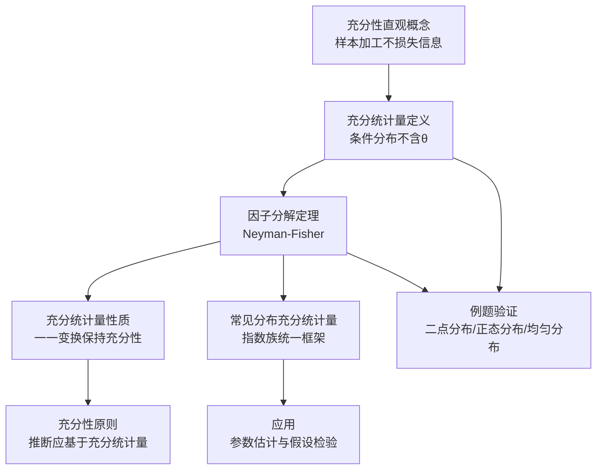
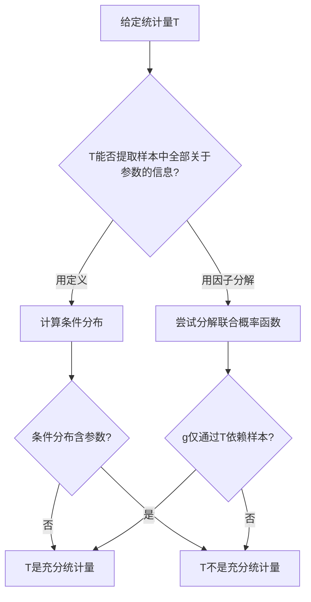

# 5.5 充分统计量

> [!abstract] 本节概览
> 本节系统介绍==充分统计量==的概念、判定方法（因子分解定理）及其性质。充分统计量是数理统计中最重要的概念之一，它回答了一个核心问题：**如何对样本进行最优压缩而不损失关于参数的信息？**
>
> **逻辑链条**：[[#模块一：充分性的直观概念|充分性直观概念]] → [[#模块二：充分统计量的定义|定义]] → [[#模块三：因子分解定理|因子分解定理]] → [[#模块四：充分统计量的性质|性质]] → [[#模块五：常见分布的充分统计量汇总|应用]]
>
> **前置依赖**：[[5.3 统计量及其分布|§5.3]]（统计量定义）、[[5.4 三大抽样分布|§5.4]]（正态总体抽样定理）

---

## 模块一：充分性的直观概念

### Fisher vs Eddington 争论

在统计学发展早期，R.A. Fisher 与 Eddington 就如何估计正态分布的散度发生过一场著名争论：

- **Eddington** 主张使用==平均绝对偏差== $d = \frac{1}{n}\sum_{i=1}^{n}|X_i - \bar{X}|$
- **Fisher** 主张使用==样本标准差== $s = \sqrt{\frac{1}{n-1}\sum_{i=1}^{n}(X_i - \bar{X})^2}$

Fisher 的核心论据是：$s$ 是正态分布参数 $\sigma$ 的==充分统计量==，而 $d$ 不是。这意味着 $s$ 包含了样本中关于 $\sigma$ 的全部信息，而 $d$ 丢失了部分信息。使用 $d$ 做推断时，其效率不如 $s$。

### 核心思想：充分性 = 样本加工不损失信息

==充分统计量==（sufficient statistic）的直观含义是：统计量 $T = T(X_1, \ldots, X_n)$ 对样本进行了"加工"，但这种加工**没有丢失任何关于参数 $\theta$ 的信息**。

换句话说，一旦知道了 $T$ 的值，原始样本 $(X_1, \ldots, X_n)$ 的具体取值就不再提供关于 $\theta$ 的额外信息了。

> [!example] 例 5.5.1 — 打靶命中率
> 设某人打靶的命中率为 $\theta$，独立射击 $n$ 次，$X_i$ 表示第 $i$ 次射击的结果（命中=1，脱靶=0）。
>
> 样本为 $(X_1, X_2, \ldots, X_n)$，参数为 $\theta$。
>
> 考虑统计量 $T = \sum_{i=1}^{n} X_i$（总命中次数）。
>
> **直观理解**：如果我们知道 $T = t$（命中了 $t$ 次），那么原始样本中每个 $X_i$ 的具体值（谁命中、谁脱靶）已经不再提供关于 $\theta$ 的额外信息——因为给定 $T=t$ 后，样本的条件分布（即哪些位置是1、哪些位置是0的排列方式）与 $\theta$ 无关。
>
> 因此，$T = \sum_{i=1}^{n} X_i$ 是 $\theta$ 的充分统计量。

---

## 模块二：充分统计量的定义

> [!def] 定义 5.5.1 — 充分统计量
> 设 $X_1, X_2, \ldots, X_n$ 是来自分布 $F(x;\theta)$ 的样本，$T = T(X_1, X_2, \ldots, X_n)$ 是一个统计量。如果在给定 $T = t$ 的条件下，样本 $(X_1, X_2, \ldots, X_n)$ 的==条件分布不依赖于参数 $\theta$==，则称 $T$ 是 $\theta$ 的==充分统计量==。
>
> 用数学语言表述：对任意的 $t$ 和 $\theta$，
> $$
> P(X_1 = x_1, \ldots, X_n = x_n \mid T = t;\, \theta) = P(X_1 = x_1, \ldots, X_n = x_n \mid T = t)
> $$
> 即条件分布与 $\theta$ 无关。

### 概率层面的分析

这个定义的本质是：

1. **条件分布含 $\theta$ 的信息**：如果给定 $T=t$ 后，样本的条件分布仍然依赖于 $\theta$，说明 $T$ 没有提取出样本中关于 $\theta$ 的全部信息，原始样本还能提供额外信息 → $T$ **不充分**。
2. **条件分布不含 $\theta$ 的信息**：如果给定 $T=t$ 后，条件分布与 $\theta$ 无关，说明 $T$ 已经提取了样本中关于 $\theta$ 的全部信息 → $T$ **充分**。

> [!example] 例 5.5.2 — 二点分布 $b(1,\theta)$ 的充分统计量
> 设 $X_1, X_2, \ldots, X_n$ 是来自二点分布 $b(1,\theta)$ 的 i.i.d. 样本，其中 $0 < \theta < 1$。
>
> **结论**：$T = \sum_{i=1}^{n} X_i$ 是 $\theta$ 的充分统计量。
>
> > [!abstract] 证明
> >
> > **第一步：计算条件概率**
> >
> > 样本的联合分布为
> > $$
> > P(X_1 = x_1, \ldots, X_n = x_n;\, \theta) = \prod_{i=1}^{n} \theta^{x_i}(1-\theta)^{1-x_i} = \theta^{\sum x_i}(1-\theta)^{n - \sum x_i}
> > $$
> >
> > 由于 $T = \sum_{i=1}^{n} X_i \sim b(n, \theta)$，所以
> > $$
> > P(T = t;\, \theta) = \binom{n}{t}\theta^t(1-\theta)^{n-t}
> > $$
> >
> > **第二步：化简条件概率**
> >
> > 当 $T = t$ 时，$\sum_{i=1}^{n} x_i = t$，因此
> > $$
> > P(X_1 = x_1, \ldots, X_n = x_n \mid T = t;\, \theta) = \frac{P(X_1 = x_1, \ldots, X_n = x_n;\, \theta)}{P(T = t;\, \theta)}
> > $$
> > $$
> > = \frac{\theta^t(1-\theta)^{n-t}}{\binom{n}{t}\theta^t(1-\theta)^{n-t}} = \frac{1}{\binom{n}{t}}
> > $$
> >
> > **第三步：与 $\theta$ 无关**
> >
> > 条件概率 $P(X_1 = x_1, \ldots, X_n = x_n \mid T = t) = \dfrac{1}{\binom{n}{t}}$ 完全不依赖于 $\theta$，只依赖于 $n$ 和 $t$。
> >
> > 因此，$T = \sum_{i=1}^{n} X_i$ 是 $\theta$ 的充分统计量。 $\blacksquare$

**反例**：当 $n > 2$ 时，$S = X_1 + X_2$ 不是 $\theta$ 的充分统计量。因为给定 $S = s$ 后，$(X_3, \ldots, X_n)$ 的边际分布仍然依赖于 $\theta$，条件分布中仍含有 $\theta$ 的信息。

> [!example] 例 5.5.3 — 正态分布 $N(\mu, 1)$ 的充分统计量
> 设 $X_1, X_2, \ldots, X_n$ 是来自 $N(\mu, 1)$ 的 i.i.d. 样本。
>
> **结论**：$T = \bar{X} = \frac{1}{n}\sum_{i=1}^{n} X_i$ 是 $\mu$ 的充分统计量。
>
> > [!abstract] 证明
> >
> > **第一步：作变量变换**
> >
> > 令 $T = \bar{X}$，并取 $U_i = X_i - \bar{X}$（$i = 1, 2, \ldots, n-1$）作为辅助变量。注意 $\sum_{i=1}^{n} U_i = 0$，所以只需取 $n-1$ 个 $U_i$。
> >
> > 该变换的 Jacobi 行列式为常数（与 $\mu$ 无关）。
> >
> > **第二步：计算条件密度**
> >
> > $(T, U_1, \ldots, U_{n-1})$ 的联合密度为
> > $$
> > f(t, u_1, \ldots, u_{n-1};\, \mu) = (2\pi)^{-n/2} \exp\left\{-\frac{1}{2}\sum_{i=1}^{n}(x_i - \mu)^2\right\} \cdot |J|
> > $$
> >
> > 展开 $\sum_{i=1}^{n}(x_i - \mu)^2 = \sum_{i=1}^{n}(x_i - \bar{x} + \bar{x} - \mu)^2 = \sum_{i=1}^{n}(x_i - \bar{x})^2 + n(\bar{x} - \mu)^2$：
> > $$
> > = (2\pi)^{-n/2} \exp\left\{-\frac{1}{2}\left[\sum_{i=1}^{n}u_i^2 + n(t - \mu)^2\right]\right\} \cdot |J|
> > $$
> >
> > $T$ 的边际密度为 $T \sim N(\mu, 1/n)$：
> > $$
> > f_T(t;\, \mu) = \sqrt{\frac{n}{2\pi}} \exp\left\{-\frac{n}{2}(t - \mu)^2\right\}
> > $$
> >
> > 因此条件密度为
> > $$
> > f(u_1, \ldots, u_{n-1} \mid T = t;\, \mu) = \frac{f(t, u_1, \ldots, u_{n-1};\, \mu)}{f_T(t;\, \mu)}
> > $$
> > $$
> > = (2\pi)^{-(n-1)/2} n^{-1/2} \exp\left\{-\frac{1}{2}\sum_{i=1}^{n}u_i^2\right\} \cdot |J|
> > $$
> >
> > **第三步：与 $\mu$ 无关**
> >
> > 条件密度中不含 $\mu$，因此 $T = \bar{X}$ 是 $\mu$ 的充分统计量。 $\blacksquare$

---

## 模块三：因子分解定理

### 概率函数

为了统一处理离散型和连续型分布，我们引入==概率函数==（probability function）的概念：

$$
p(x;\, \theta) = \begin{cases} P(X = x;\, \theta), & \text{离散型} \\ f(x;\, \theta), & \text{连续型} \end{cases}
$$

这样，联合概率函数统一写为 $p(x_1, \ldots, x_n;\, \theta) = \prod_{i=1}^{n} p(x_i;\, \theta)$。

### Neyman-Fisher 因子分解定理

> [!thm] 定理 5.5.1 — Neyman-Fisher 因子分解定理
> 设 $X_1, X_2, \ldots, X_n$ 是来自分布 $p(x;\, \theta)$ 的 i.i.d. 样本，$\theta \in \Theta$。则统计量 $T = T(X_1, \ldots, X_n)$ 是 $\theta$ 的==充分统计量==的==充要条件==是：存在两个非负函数 $g$ 和 $h$，使得联合概率函数可以分解为
> $$
> p(x_1, \ldots, x_n;\, \theta) = g\big(T(x_1, \ldots, x_n),\, \theta\big) \cdot h(x_1, \ldots, x_n)
> $$
> 其中：
> - $g(t, \theta)$ 仅通过 $T$ 的值和 $\theta$ 依赖于样本
> - $h(x_1, \ldots, x_n)$ 不依赖于参数 $\theta$

这个定理将充分性的判断从"计算条件分布"简化为"验证因子分解"，大大降低了操作难度。

### 必要性证明

> [!abstract] 证明（必要性：$T$ 充分 ⟹ 因子分解成立）
>
> **第一步：条件概率定义**
>
> 设 $T$ 是 $\theta$ 的充分统计量，则给定 $T = t$ 时，样本的条件分布不依赖于 $\theta$。由条件概率公式，
> $$
> p(x_1, \ldots, x_n;\, \theta) = p(x_1, \ldots, x_n \mid T = t;\, \theta) \cdot p_T(t;\, \theta)
> $$
>
> **第二步：令 $g$ 和 $h$**
>
> 令 $g(t, \theta) = p_T(t;\, \theta)$（$T$ 的边际概率函数，依赖于 $\theta$），令 $h(x_1, \ldots, x_n) = p(x_1, \ldots, x_n \mid T = t;\, \theta)$（条件概率函数，不依赖于 $\theta$）。
>
> **第三步：得因子分解**
>
> 则 $p(x_1, \ldots, x_n;\, \theta) = g(T(x_1, \ldots, x_n),\, \theta) \cdot h(x_1, \ldots, x_n)$，因子分解成立。 $\blacksquare$

### 充分性证明

> [!abstract] 证明（充分性：因子分解成立 ⟹ $T$ 充分）
>
> **第一步：计算 $P(T = t;\, \theta)$**
>
> 设联合概率函数满足因子分解 $p(x_1, \ldots, x_n;\, \theta) = g(T(x_1, \ldots, x_n),\, \theta) \cdot h(x_1, \ldots, x_n)$。
>
> 对 $T = t$ 的所有可能取值集合 $A_t = \{(x_1, \ldots, x_n) : T(x_1, \ldots, x_n) = t\}$ 求和（离散）或积分（连续）：
> $$
> p_T(t;\, \theta) = \sum_{(x_1, \ldots, x_n) \in A_t} g(t, \theta) \cdot h(x_1, \ldots, x_n) = g(t, \theta) \cdot \sum_{A_t} h(x_1, \ldots, x_n)
> $$
>
> 令 $H(t) = \sum_{A_t} h(x_1, \ldots, x_n)$（不依赖于 $\theta$），则 $p_T(t;\, \theta) = g(t, \theta) \cdot H(t)$。
>
> **第二步：计算条件分布**
>
> $$
> p(x_1, \ldots, x_n \mid T = t;\, \theta) = \frac{p(x_1, \ldots, x_n;\, \theta)}{p_T(t;\, \theta)} = \frac{g(t, \theta) \cdot h(x_1, \ldots, x_n)}{g(t, \theta) \cdot H(t)} = \frac{h(x_1, \ldots, x_n)}{H(t)}
> $$
>
> **第三步：与 $\theta$ 无关**
>
> 条件分布 $p(x_1, \ldots, x_n \mid T = t) = \dfrac{h(x_1, \ldots, x_n)}{H(t)}$ 中不含 $\theta$，因此 $T$ 是 $\theta$ 的充分统计量。 $\blacksquare$

### 因子分解定理的应用

> [!example] 例 5.5.4 — 均匀分布 $U(0, \theta)$ 的充分统计量
> 设 $X_1, X_2, \ldots, X_n$ 是来自 $U(0, \theta)$ 的 i.i.d. 样本，$\theta > 0$。
>
> 联合密度为
> $$
> f(x_1, \ldots, x_n;\, \theta) = \prod_{i=1}^{n} \frac{1}{\theta} \cdot \mathbf{1}_{(0, \theta)}(x_i) = \frac{1}{\theta^n} \cdot \mathbf{1}_{(0, \theta)}(x_{(n)}) \cdot \prod_{i=1}^{n}\mathbf{1}_{(0, \infty)}(x_i)
> $$
> 其中 $x_{(n)} = \max\{x_1, \ldots, x_n\}$。
>
> **因子分解**：令 $g(t, \theta) = \dfrac{1}{\theta^n} \cdot \mathbf{1}_{(0, \theta)}(t)$，$h(x_1, \ldots, x_n) = \prod_{i=1}^{n}\mathbf{1}_{(0, \infty)}(x_i)$。
>
> 由于 $g$ 仅通过 $T = X_{(n)}$ 依赖于样本，$h$ 不含 $\theta$，因此 $T = X_{(n)}$ 是 $\theta$ 的充分统计量。

> [!example] 例 5.5.5 — 正态分布 $N(\mu, \sigma^2)$ 的充分统计量
> 设 $X_1, X_2, \ldots, X_n$ 是来自 $N(\mu, \sigma^2)$ 的 i.i.d. 样本。
>
> 联合密度为
> $$
> f(x_1, \ldots, x_n;\, \mu, \sigma^2) = (2\pi\sigma^2)^{-n/2} \exp\left\{-\frac{1}{2\sigma^2}\sum_{i=1}^{n}(x_i - \mu)^2\right\}
> $$
>
> 关键恒等式：
> $$
> \sum_{i=1}^{n}(x_i - \mu)^2 = \sum_{i=1}^{n}(x_i - \bar{x} + \bar{x} - \mu)^2 = \sum_{i=1}^{n}(x_i - \bar{x})^2 + n(\bar{x} - \mu)^2
> $$
> $$
> = (n-1)s^2 + n(\bar{x} - \mu)^2
> $$
>
> 因此联合密度可写为
> $$
> f = (2\pi\sigma^2)^{-n/2} \exp\left\{-\frac{(n-1)s^2}{2\sigma^2} - \frac{n(\bar{x}-\mu)^2}{2\sigma^2}\right\}
> $$
> $$
> = \underbrace{(2\pi\sigma^2)^{-n/2} \exp\left\{-\frac{(n-1)s^2 + n(\bar{x}-\mu)^2}{2\sigma^2}\right\}}_{g(\bar{x}, s^2;\, \mu, \sigma^2)} \cdot \underbrace{1}_{h(x_1, \ldots, x_n)}
> $$
>
> $g$ 仅通过 $(\bar{X}, S^2)$ 依赖于样本，$h \equiv 1$ 不含参数。因此 $(\bar{X}, S^2)$ 是 $(\mu, \sigma^2)$ 的==充分统计量==。

---

## 模块四：充分统计量的性质

> [!thm] 定理 5.5.2 — 充分统计量的一一变换
> 若 $T$ 是 $\theta$ 的充分统计量，且 $S = \varphi(T)$ 是 $T$ 的一一对应变换（即 $\varphi$ 有反函数 $\varphi^{-1}$），则 $S$ 也是 $\theta$ 的充分统计量。

> [!abstract] 证明
>
> **第一步：$T$ 充分有因子分解**
>
> 由 $T$ 是充分统计量，存在 $g, h$ 使得
> $$
> p(x_1, \ldots, x_n;\, \theta) = g(T(x_1, \ldots, x_n),\, \theta) \cdot h(x_1, \ldots, x_n)
> $$
>
> **第二步：令 $g^*$ 得到 $S$ 的因子分解**
>
> 令 $g^*(s, \theta) = g(\varphi^{-1}(s),\, \theta)$，则
> $$
> p(x_1, \ldots, x_n;\, \theta) = g^*(S(x_1, \ldots, x_n),\, \theta) \cdot h(x_1, \ldots, x_n)
> $$
> $g^*$ 仅通过 $S$ 依赖于样本，$h$ 不含 $\theta$，因此 $S$ 也是 $\theta$ 的充分统计量。 $\blacksquare$

**推论**：充分统计量的一一变换仍是充分统计量。例如，若 $\bar{X}$ 是充分统计量，则 $\sum_{i=1}^{n} X_i = n\bar{X}$ 也是充分统计量。

### 充分性原则

==充分性原则==（sufficiency principle）：统计推断应基于充分统计量进行。如果 $T$ 是 $\theta$ 的充分统计量，那么任何不基于 $T$ 的推断方法都可以改进为基于 $T$ 的方法，且不会损失信息。

这是 Rao-Blackwell 定理和 Lehmann-Scheffé 定理的理论基础。

---

## 模块五：常见分布的充分统计量汇总

| 分布 | 密度/概率函数 $p(x;\, \theta)$ | 参数 | 充分统计量 |
|:---|:---|:---|:---|
| 二点分布 $b(1,\theta)$ | $\theta^x(1-\theta)^{1-x}$ | $\theta$ | $T = \sum X_i$ |
| 二项分布 $b(n,\theta)$ | $\binom{n}{x}\theta^x(1-\theta)^{n-x}$ | $\theta$ | $T = X$（自身） |
| 泊松分布 $P(\lambda)$ | $\dfrac{\lambda^x e^{-\lambda}}{x!}$ | $\lambda$ | $T = \sum X_i$ |
| 几何分布 $Ge(\theta)$ | $\theta(1-\theta)^{x-1}$ | $\theta$ | $T = \sum X_i$ |
| 负二项分布 $Nb(r,\theta)$ | $\binom{x-1}{r-1}\theta^r(1-\theta)^{x-r}$ | $\theta$ | $T = \sum X_i$ |
| 指数分布 $Exp(\lambda)$ | $\lambda e^{-\lambda x}$ | $\lambda$ | $T = \sum X_i$ |
| 均匀分布 $U(0,\theta)$ | $\dfrac{1}{\theta}\mathbf{1}_{(0,\theta)}(x)$ | $\theta$ | $T = X_{(n)}$ |
| 均匀分布 $U(\theta_1,\theta_2)$ | $\dfrac{1}{\theta_2-\theta_1}\mathbf{1}_{(\theta_1,\theta_2)}(x)$ | $\theta_1, \theta_2$ | $T = (X_{(1)}, X_{(n)})$ |
| 正态分布 $N(\mu, \sigma_0^2)$（$\sigma_0^2$ 已知） | $\dfrac{1}{\sqrt{2\pi}\sigma_0}e^{-\frac{(x-\mu)^2}{2\sigma_0^2}}$ | $\mu$ | $T = \bar{X}$ |
| 正态分布 $N(\mu_0, \sigma^2)$（$\mu_0$ 已知） | $\dfrac{1}{\sqrt{2\pi}\sigma}e^{-\frac{(x-\mu_0)^2}{2\sigma^2}}$ | $\sigma^2$ | $T = \sum(X_i - \mu_0)^2$ |
| 正态分布 $N(\mu, \sigma^2)$ | $\dfrac{1}{\sqrt{2\pi}\sigma}e^{-\frac{(x-\mu)^2}{2\sigma^2}}$ | $\mu, \sigma^2$ | $T = (\bar{X}, S^2)$ |
| Gamma 分布 $Ga(\alpha, \lambda)$ | $\dfrac{\lambda^\alpha}{\Gamma(\alpha)}x^{\alpha-1}e^{-\lambda x}$ | $\alpha, \lambda$ | $T = (\sum X_i, \prod X_i)$ |
| Beta 分布 $Be(a, b)$ | $\dfrac{\Gamma(a+b)}{\Gamma(a)\Gamma(b)}x^{a-1}(1-x)^{b-1}$ | $a, b$ | $T = (\sum \ln X_i, \sum \ln(1-X_i))$ |
| 幂分布 | $\theta x^{\theta-1},\; 0 < x < 1$ | $\theta$ | $T = \prod X_i$（或 $\sum \ln X_i$） |

### 指数族分布的充分统计量

==指数族分布==（exponential family）的概率函数具有如下标准形式：

$$
p(x;\, \theta) = C(\theta) \exp\left\{\sum_{j=1}^{k} Q_j(\theta)\, T_j(x)\right\} h(x)
$$

对于 i.i.d. 样本 $X_1, \ldots, X_n$，联合概率函数为

$$
p(x_1, \ldots, x_n;\, \theta) = C(\theta)^n \exp\left\{\sum_{j=1}^{k} Q_j(\theta) \sum_{i=1}^{n} T_j(x_i)\right\} \prod_{i=1}^{n} h(x_i)
$$

由因子分解定理，==充分统计量为==

$$
T = \left(\sum_{i=1}^{n} T_1(X_i),\; \sum_{i=1}^{n} T_2(X_i),\; \ldots,\; \sum_{i=1}^{n} T_k(X_i)\right)
$$

这是指数族分布的一个重要性质：充分统计量的维数等于自然参数空间的维数 $k$。

---

## 模块六：知识结构总览

---

## 模块七：核心思想与技巧

### 因子分解定理使用技巧

使用因子分解定理判断充分统计量时，关键步骤如下：

1. **写出联合概率函数** $p(x_1, \ldots, x_n;\, \theta) = \prod_{i=1}^{n} p(x_i;\, \theta)$
2. **提取含 $\theta$ 的部分**：将联合概率函数中所有含 $\theta$ 的因子集中起来
3. **检查含 $\theta$ 部分是否仅通过某个统计量 $T$ 依赖于样本**：
   - 如果是，则 $T$ 是充分统计量
   - 如果不是，则可能需要更高维的统计量，或不存在低维充分统计量
4. **分离不含 $\theta$ 的部分**作为 $h(x_1, \ldots, x_n)$

### 充分统计量判断流程图

---

## 模块八：补充理解与易混淆点

### 充分统计量与完备统计量混淆

**来源**：茆诗松§5.5 p264 + 维基教科书《常见分布族与充分统计量》 + CSDN《概率论与数理统计教程(五)》 + 卡方核心笔记 + bookdown《统计考研复习参考》Ch5

> [!danger] 误区1："充分统计量就是最好的统计量"
> ❌ **错误解释**：认为充分统计量自动具有完备性，是最优的。
>
> ✅ **正确解释**：==充分性≠完备性==。充分统计量只保证"不损失信息"，但完备统计量还要求"充分统计量本身的分布不依赖于参数 $\theta$"。存在充分但不完备的统计量。在实际应用中，我们希望找到==既充分又完备==的统计量。

### 因子分解定理中 $g$ 和 $h$ 的角色混淆

**来源**：茆诗松§5.5 p262-263 + CSDN《概率论与数理统计教程(五)》 + UIC《Neyman-Fisher Theorem》 + IISc《Lecture 9: Sufficient Statistics》 + 卡方核心笔记

> [!danger] 误区2："因子分解定理中 $h(x)$ 可以含参数 $\theta$"
> ❌ **错误解释**：认为 $h(x_1, \ldots, x_n)$ 中可以包含参数 $\theta$。
>
> ✅ **正确解释**：在因子分解 $f = g \cdot h$ 中，==$h(x)$ 绝对不能含有参数 $\theta$==。$h(x)$ 只依赖于样本值，与 $\theta$ 无关。所有与 $\theta$ 有关的信息都必须通过 $g(T(x), \theta)$ 中的 $T(x)$ 来传递。如果 $h$ 中含 $\theta$，则分解无效，不能据此判断充分性。

### 充分统计量维数与参数维数的关系

**来源**：茆诗松§5.5习题12解答 + 维基教科书《常见分布族与充分统计量》 + CSDN《概率论与数理统计教程(五)》 + 卡方核心笔记 + bookdown《统计考研复习参考》Ch5

> [!danger] 误区3："充分统计量的维数一定等于未知参数的维数"
> ❌ **错误解释**：认为一维参数的充分统计量一定是一维的。
>
> ✅ **正确解释**：充分统计量的维数==不一定等于参数的维数==。例如 $U(\theta, 2\theta)$ 的参数 $\theta$ 是一维的，但充分统计量是 $(X_{(1)}, X_{(n)})$（二维）。又如 $N(\mu, \sigma^2)$ 的参数 $(\mu, \sigma^2)$ 是二维的，充分统计量 $(\bar{X}, S^2)$ 也是二维的——此时维数恰好相等，但这不是一般规律。

---

## 模块九：习题精选

> [!todo] 习题概览
> 共 10 道习题：6 道教材习题 + 4 道补充题。
>
> | 编号 | 来源 | 主题 | 难度 |
> |:---:|:---:|:---|:---:|
> | 1 | 教材 5.5-1 | 几何分布充分统计量 | ★★☆ |
> | 2 | 教材 5.5-2 | 泊松分布充分统计量 | ★★☆ |
> | 3 | 教材 5.5-4 | $N(\mu,1)$ 充分统计量 | ★★☆ |
> | 4 | 教材 5.5-5 | 幂分布充分统计量 | ★★★ |
> | 5 | 教材 5.5-10 | $N(\mu,\sigma^2)$ 单参数情形 | ★★★ |
> | 6 | 教材 5.5-11 | $U(\theta_1,\theta_2)$ 充分统计量 | ★★★ |
> | 7 | 补充（教材5.5-3） | 离散分布次序统计量与频数 | ★★★ |
> | 8 | 补充（教材5.5-15） | 指数族分布充分统计量 | ★★★ |
> | 9 | 补充（教材5.5-17） | 二元正态分布充分统计量 | ★★★★ |
> | 10 | 补充（教材5.5-19） | 两参数指数分布充分统计量 | ★★★ |

---

### 习题1（教材 5.5-1）：几何分布 $Ge(\theta)$ 的充分统计量

> [!problem] 习题 1
> 设 $X_1, X_2, \ldots, X_n$ 是来自几何分布 $Ge(\theta)$ 的 i.i.d. 样本，其概率函数为
> $$
> P(X = x;\, \theta) = \theta(1-\theta)^{x-1}, \quad x = 1, 2, 3, \ldots
> $$
> 求 $\theta$ 的充分统计量。

> [!faq]- 查看解答
> **解**：写出联合概率函数
> $$
> P(X_1 = x_1, \ldots, X_n = x_n;\, \theta) = \prod_{i=1}^{n}\theta(1-\theta)^{x_i - 1} = \theta^n(1-\theta)^{\sum_{i=1}^{n}(x_i - 1)}
> $$
> $$
> = \theta^n(1-\theta)^{\sum x_i - n}
> $$
>
> 令 $T = \sum_{i=1}^{n} X_i$，则
> $$
> P = \underbrace{\theta^n(1-\theta)^{T - n}}_{g(T,\,\theta)} \cdot \underbrace{1}_{h(x_1,\ldots,x_n)}
> $$
>
> $g$ 仅通过 $T$ 依赖于样本，$h$ 不含 $\theta$。因此 $T = \sum_{i=1}^{n} X_i$ 是 $\theta$ 的充分统计量。
>
> **补充**：$T = \sum X_i \sim Nb(n, \theta)$（负二项分布），给定 $T = t$ 时，
> $$
> P(X_1 = x_1, \ldots, X_n = x_n \mid T = t) = \frac{1}{\binom{n+t-1}{t}}
> $$
> 与 $\theta$ 无关，验证了充分性。

---

### 习题2（教材 5.5-2）：泊松分布 $P(\lambda)$ 的充分统计量

> [!problem] 习题 2
> 设 $X_1, X_2, \ldots, X_n$ 是来自泊松分布 $P(\lambda)$ 的 i.i.d. 样本。求 $\lambda$ 的充分统计量。

> [!faq]- 查看解答
> **解**：联合概率函数为
> $$
> P(X_1 = x_1, \ldots, X_n = x_n;\, \lambda) = \prod_{i=1}^{n}\frac{\lambda^{x_i}e^{-\lambda}}{x_i!} = \frac{\lambda^{\sum x_i} e^{-n\lambda}}{\prod_{i=1}^{n} x_i!}
> $$
>
> 令 $T = \sum_{i=1}^{n} X_i$，则
> $$
> P = \underbrace{\lambda^T e^{-n\lambda}}_{g(T,\,\lambda)} \cdot \underbrace{\frac{1}{\prod_{i=1}^{n} x_i!}}_{h(x_1,\ldots,x_n)}
> $$
>
> $g$ 仅通过 $T$ 依赖于样本，$h$ 不含 $\lambda$。因此 $T = \sum_{i=1}^{n} X_i$ 是 $\lambda$ 的充分统计量。
>
> **补充**：$T \sim P(n\lambda)$，给定 $T = t$ 时，
> $$
> P(X_1 = x_1, \ldots, X_n = x_n \mid T = t) = \frac{t!}{n^t \prod_{i=1}^{n} x_i!}
> $$
> 与 $\lambda$ 无关。

---

### 习题3（教材 5.5-4）：$N(\mu, 1)$ 的充分统计量

> [!problem] 习题 3
> 设 $X_1, X_2, \ldots, X_n$ 是来自 $N(\mu, 1)$ 的 i.i.d. 样本。证明 $T = \sum_{i=1}^{n} X_i$（或等价地 $\bar{X}$）是 $\mu$ 的充分统计量。

> [!faq]- 查看解答
> **证明**：联合密度为
> $$
> f(x_1, \ldots, x_n;\, \mu) = (2\pi)^{-n/2}\exp\left\{-\frac{1}{2}\sum_{i=1}^{n}(x_i - \mu)^2\right\}
> $$
>
> 展开 $\sum(x_i - \mu)^2 = \sum x_i^2 - 2\mu\sum x_i + n\mu^2$，令 $T = \sum x_i$：
> $$
> f = (2\pi)^{-n/2}\exp\left\{-\frac{1}{2}\sum x_i^2 + \mu T - \frac{n\mu^2}{2}\right\}
> $$
> $$
> = \underbrace{\exp\left\{\mu T - \frac{n\mu^2}{2}\right\}}_{g(T,\,\mu)} \cdot \underbrace{(2\pi)^{-n/2}\exp\left\{-\frac{1}{2}\sum x_i^2\right\}}_{h(x_1,\ldots,x_n)}
> $$
>
> $g$ 仅通过 $T = \sum X_i$ 依赖于样本，$h$ 不含 $\mu$。因此 $T = \sum_{i=1}^{n} X_i$ 是 $\mu$ 的充分统计量。
>
> 由定理 5.5.2，$\bar{X} = T/n$ 也是 $\mu$ 的充分统计量。 $\blacksquare$

---

### 习题4（教材 5.5-5）：幂分布的充分统计量

> [!problem] 习题 4
> 设 $X_1, X_2, \ldots, X_n$ 是来自幂分布的 i.i.d. 样本，密度函数为
> $$
> p(x;\, \theta) = \theta x^{\theta - 1}, \quad 0 < x < 1, \quad \theta > 0
> $$
> 求 $\theta$ 的充分统计量。

> [!faq]- 查看解答
> **解**：联合密度为
> $$
> f(x_1, \ldots, x_n;\, \theta) = \prod_{i=1}^{n}\theta x_i^{\theta - 1} = \theta^n \left(\prod_{i=1}^{n} x_i\right)^{\theta - 1}
> $$
>
> 令 $T = \prod_{i=1}^{n} X_i$，则
> $$
> f = \underbrace{\theta^n \cdot T^{\theta - 1}}_{g(T,\,\theta)} \cdot \underbrace{1}_{h(x_1,\ldots,x_n)}
> $$
>
> $g$ 仅通过 $T$ 依赖于样本，$h$ 不含 $\theta$。因此 $T = \prod_{i=1}^{n} X_i$ 是 $\theta$ 的充分统计量。
>
> **等价形式**：取对数 $\ln T = \sum_{i=1}^{n}\ln X_i$，由定理 5.5.2（一一变换），$T' = \sum_{i=1}^{n}\ln X_i$ 也是 $\theta$ 的充分统计量。

---

### 习题5（教材 5.5-10）：$N(\mu, \sigma^2)$ 单参数情形

> [!problem] 习题 5
> 设 $X_1, X_2, \ldots, X_n$ 是来自 $N(\mu, \sigma^2)$ 的 i.i.d. 样本。
>
> (1) 当 $\mu$ 已知时，求 $\sigma^2$ 的充分统计量。
>
> (2) 当 $\sigma^2$ 已知时，求 $\mu$ 的充分统计量。

> [!faq]- 查看解答
> **解 (1)**：$\mu$ 已知时，联合密度为
> $$
> f = (2\pi\sigma^2)^{-n/2}\exp\left\{-\frac{1}{2\sigma^2}\sum_{i=1}^{n}(x_i - \mu)^2\right\}
> $$
>
> 令 $T = \sum_{i=1}^{n}(X_i - \mu)^2$，则
> $$
> f = \underbrace{(2\pi\sigma^2)^{-n/2}\exp\left\{-\frac{T}{2\sigma^2}\right\}}_{g(T,\,\sigma^2)} \cdot \underbrace{1}_{h(x_1,\ldots,x_n)}
> $$
>
> 因此 $T = \sum_{i=1}^{n}(X_i - \mu)^2$ 是 $\sigma^2$ 的充分统计量。
>
> **解 (2)**：$\sigma^2$ 已知时，联合密度为
> $$
> f = (2\pi\sigma^2)^{-n/2}\exp\left\{-\frac{1}{2\sigma^2}\sum_{i=1}^{n}(x_i - \mu)^2\right\}
> $$
>
> 展开 $\sum(x_i - \mu)^2 = \sum x_i^2 - 2\mu\sum x_i + n\mu^2$，令 $T = \bar{X} = \frac{1}{n}\sum X_i$：
> $$
> f = \underbrace{(2\pi\sigma^2)^{-n/2}\exp\left\{-\frac{1}{2\sigma^2}\sum x_i^2 + \frac{n\mu}{\sigma^2}T - \frac{n\mu^2}{2\sigma^2}\right\}}_{g(T,\,\mu)} \cdot \underbrace{1}_{h(x_1,\ldots,x_n)}
> $$
>
> 注意 $\sum x_i^2 = \sum(x_i - \bar{x})^2 + n\bar{x}^2$，其中 $\sum(x_i - \bar{x})^2$ 不含 $\mu$，可以归入 $h$。因此 $T = \bar{X}$ 是 $\mu$ 的充分统计量。

---

### 习题6（教材 5.5-11）：$U(\theta_1, \theta_2)$ 的充分统计量

> [!problem] 习题 6
> 设 $X_1, X_2, \ldots, X_n$ 是来自均匀分布 $U(\theta_1, \theta_2)$ 的 i.i.d. 样本，$-\infty < \theta_1 < \theta_2 < +\infty$。求 $(\theta_1, \theta_2)$ 的充分统计量。

> [!faq]- 查看解答
> **解**：联合密度为
> $$
> f(x_1, \ldots, x_n;\, \theta_1, \theta_2) = \prod_{i=1}^{n}\frac{1}{\theta_2 - \theta_1}\mathbf{1}_{(\theta_1, \theta_2)}(x_i) = \frac{1}{(\theta_2 - \theta_1)^n}\mathbf{1}_{(\theta_1, \theta_2)}(x_{(1)})\mathbf{1}_{(\theta_1, \theta_2)}(x_{(n)})
> $$
>
> 其中 $x_{(1)} = \min\{x_1, \ldots, x_n\}$，$x_{(n)} = \max\{x_1, \ldots, x_n\}$。
>
> 指示函数 $\mathbf{1}_{(\theta_1, \theta_2)}(x_{(1)})\mathbf{1}_{(\theta_1, \theta_2)}(x_{(n)})$ 等价于 $\mathbf{1}_{\theta_1 < x_{(1)}} \cdot \mathbf{1}_{x_{(n)} < \theta_2}$。
>
> 令 $T = (X_{(1)}, X_{(n)})$，则
> $$
> f = \underbrace{\frac{1}{(\theta_2 - \theta_1)^n}\mathbf{1}_{\theta_1 < x_{(1)}}\mathbf{1}_{x_{(n)} < \theta_2}}_{g(T,\,\theta_1,\theta_2)} \cdot \underbrace{1}_{h(x_1,\ldots,x_n)}
> $$
>
> $g$ 仅通过 $(X_{(1)}, X_{(n)})$ 依赖于样本，$h$ 不含参数。因此 $T = (X_{(1)}, X_{(n)})$ 是 $(\theta_1, \theta_2)$ 的充分统计量。

---

### 习题7（补充，教材 5.5-3）：离散分布次序统计量与频数的充分性

> [!problem] 习题 7
> 设 $X_1, X_2, \ldots, X_n$ 是来自离散分布的 i.i.d. 样本，$X_i$ 取值为 $a_1, a_2, \ldots, a_k$，对应概率为 $p_1(\theta), p_2(\theta), \ldots, p_k(\theta)$。证明：
>
> (1) 次序统计量 $(X_{(1)}, X_{(2)}, \ldots, X_{(n)})$ 是 $\theta$ 的充分统计量。
>
> (2) 频数向量 $(n_1, n_2, \ldots, n_k)$（其中 $n_j = \#\{i : X_i = a_j\}$）也是 $\theta$ 的充分统计量。

> [!faq]- 查看解答
> **证明 (1)**：联合概率函数为
> $$
> P(X_1 = x_1, \ldots, X_n = x_n;\, \theta) = \prod_{i=1}^{n} p_{j_i}(\theta)
> $$
> 其中 $j_i$ 满足 $x_i = a_{j_i}$。
>
> 令 $T = (X_{(1)}, \ldots, X_{(n)})$（次序统计量），则
> $$
> P = \underbrace{\prod_{i=1}^{n} p_{j_i}(\theta)}_{g(T,\,\theta)} \cdot \underbrace{1}_{h(x_1,\ldots,x_n)}
> $$
>
> $g$ 仅通过次序统计量 $T$ 依赖于样本（因为乘积中每个因子的值由 $T$ 完全确定），$h$ 不含 $\theta$。因此次序统计量是充分统计量。
>
> **证明 (2)**：设频数 $n_j = \#\{i : X_i = a_j\}$，则 $\sum_{j=1}^{k} n_j = n$。
> $$
> P = \prod_{j=1}^{k} p_j(\theta)^{n_j}
> $$
>
> 令 $T' = (n_1, n_2, \ldots, n_k)$，则
> $$
> P = \underbrace{\prod_{j=1}^{k} p_j(\theta)^{n_j}}_{g(T',\,\theta)} \cdot \underbrace{1}_{h(x_1,\ldots,x_n)}
> $$
>
> $g$ 仅通过频数向量 $T'$ 依赖于样本，$h$ 不含 $\theta$。因此频数向量也是充分统计量。 $\blacksquare$

---

### 习题8（补充，教材 5.5-15）：指数族分布的充分统计量

> [!problem] 习题 8
> 设 $X_1, X_2, \ldots, X_n$ 是来自指数族分布的 i.i.d. 样本，其概率函数为
> $$
> p(x;\, \theta) = C(\theta)\exp\left\{\sum_{j=1}^{k} Q_j(\theta)\, T_j(x)\right\} h(x)
> $$
> 证明充分统计量为 $T = \left(\sum_{i=1}^{n} T_1(X_i), \ldots, \sum_{i=1}^{n} T_k(X_i)\right)$。

> [!faq]- 查看解答
> **证明**：联合概率函数为
> $$
> p(x_1, \ldots, x_n;\, \theta) = \prod_{i=1}^{n}\left[C(\theta)\exp\left\{\sum_{j=1}^{k} Q_j(\theta)\, T_j(x_i)\right\} h(x_i)\right]
> $$
> $$
> = C(\theta)^n \exp\left\{\sum_{j=1}^{k} Q_j(\theta)\sum_{i=1}^{n} T_j(x_i)\right\} \prod_{i=1}^{n} h(x_i)
> $$
>
> 令 $S_j = \sum_{i=1}^{n} T_j(X_i)$（$j = 1, 2, \ldots, k$），$T = (S_1, \ldots, S_k)$，则
> $$
> p = \underbrace{C(\theta)^n \exp\left\{\sum_{j=1}^{k} Q_j(\theta)\, S_j\right\}}_{g(T,\,\theta)} \cdot \underbrace{\prod_{i=1}^{n} h(x_i)}_{h^*(x_1,\ldots,x_n)}
> $$
>
> $g$ 仅通过 $T = (S_1, \ldots, S_k)$ 依赖于样本，$h^*$ 不含 $\theta$。因此 $T$ 是 $\theta$ 的充分统计量。 $\blacksquare$

---

### 习题9（补充，教材 5.5-17）：二元正态分布的充分统计量

> [!problem] 习题 9
> 设 $(X_1, Y_1), (X_2, Y_2), \ldots, (X_n, Y_n)$ 是来自二元正态分布 $N(\mu_1, \mu_2, \sigma_1^2, \sigma_2^2, \rho)$ 的 i.i.d. 样本。求五个参数 $(\mu_1, \mu_2, \sigma_1^2, \sigma_2^2, \rho)$ 的充分统计量。

> [!faq]- 查看解答
> **解**：二元正态分布的联合密度为
> $$
> f(x, y) = \frac{1}{2\pi\sigma_1\sigma_2\sqrt{1-\rho^2}}\exp\left\{-\frac{1}{2(1-\rho^2)}\left[\frac{(x-\mu_1)^2}{\sigma_1^2} - \frac{2\rho(x-\mu_1)(y-\mu_2)}{\sigma_1\sigma_2} + \frac{(y-\mu_2)^2}{\sigma_2^2}\right]\right\}
> $$
>
> 样本的联合密度中，指数部分展开后，所有含参数的项可以整理为以下五个统计量的函数：
>
> - $\sum_{i=1}^{n} X_i$（含 $\mu_1$）
> - $\sum_{i=1}^{n} X_i^2$（含 $\sigma_1^2$）
> - $\sum_{i=1}^{n} Y_i$（含 $\mu_2$）
> - $\sum_{i=1}^{n} Y_i^2$（含 $\sigma_2^2$）
> - $\sum_{i=1}^{n} X_i Y_i$（含 $\rho$）
>
> 因此，五个参数的充分统计量为
> $$
> T = \left(\sum_{i=1}^{n} X_i,\; \sum_{i=1}^{n} X_i^2,\; \sum_{i=1}^{n} Y_i,\; \sum_{i=1}^{n} Y_i^2,\; \sum_{i=1}^{n} X_i Y_i\right)
> $$

---

### 习题10（补充，教材 5.5-19）：两参数指数分布的充分统计量

> [!problem] 习题 10
> 设 $X_1, X_2, \ldots, X_n$ 是来自两参数指数分布的 i.i.d. 样本，密度函数为
> $$
> p(x;\, \theta, \mu) = \frac{1}{\theta}e^{-(x-\mu)/\theta}, \quad x > \mu, \quad \theta > 0
> $$
> 求 $(\theta, \mu)$ 的充分统计量。

> [!faq]- 查看解答
> **解**：联合密度为
> $$
> f(x_1, \ldots, x_n;\, \theta, \mu) = \prod_{i=1}^{n}\frac{1}{\theta}e^{-(x_i - \mu)/\theta}\mathbf{1}_{x_i > \mu}
> $$
> $$
> = \frac{1}{\theta^n}\exp\left\{-\frac{1}{\theta}\sum_{i=1}^{n}(x_i - \mu)\right\}\mathbf{1}_{x_{(1)} > \mu}
> $$
> $$
> = \frac{1}{\theta^n}\exp\left\{-\frac{\sum x_i - n\mu}{\theta}\right\}\mathbf{1}_{x_{(1)} > \mu}
> $$
>
> 令 $T_1 = X_{(1)} = \min\{X_1, \ldots, X_n\}$，$T_2 = \sum_{i=1}^{n} X_i$，则
> $$
> f = \underbrace{\frac{1}{\theta^n}\exp\left\{-\frac{T_2 - n\mu}{\theta}\right\}\mathbf{1}_{T_1 > \mu}}_{g(T_1, T_2;\, \theta, \mu)} \cdot \underbrace{1}_{h(x_1,\ldots,x_n)}
> $$
>
> $g$ 仅通过 $(T_1, T_2)$ 依赖于样本，$h$ 不含参数。因此 $(X_{(1)}, \sum_{i=1}^{n} X_i)$ 是 $(\theta, \mu)$ 的充分统计量。
>
> 由定理 5.5.2，$(X_{(1)}, \bar{X})$ 也是 $(\theta, \mu)$ 的充分统计量。

---

## 模块十：教材原文

---

#学习/概率论与统计/第五章 统计量及其分布/充分统计量
