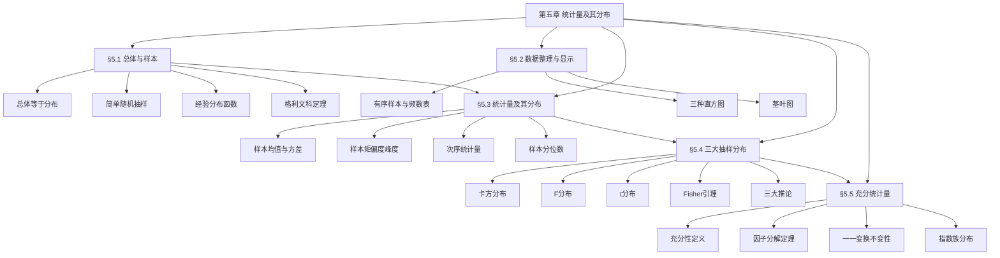

# 第五章 统计量及其分布 — 章节汇总

> [!abstract] 全章概览
> 本章是概率论向数理统计过渡的关键章节，建立了从"总体→样本→统计量→抽样分布→充分统计量"的完整理论框架。全章围绕"如何用样本信息推断总体"这一核心问题展开：先明确==总体==与==样本==的基本概念（[[5.1 总体与样本|§5.1]]），再介绍样本数据的整理与可视化方法（[[5.2 样本数据的整理与显示|§5.2]]），然后系统研究==统计量==的定义、性质与分布（[[5.3 统计量及其分布|§5.3]]），接着深入三大==抽样分布==（[[5.4 三大抽样分布|§5.4]]），最后引入==充分统计量==的概念与因子分解定理（[[5.5 充分统计量|§5.5]]）。
>
> **全章逻辑主线**：总体与样本（§5.1）→ 数据整理（§5.2）→ 统计量与分布（§5.3）→ 三大抽样分布（§5.4）→ 充分统计量（§5.5）

---

## 一、全章知识框架

---

## 二、核心知识点与公式汇总

### §5.1 总体与样本

本节建立数理统计的基本语言。==总体==在统计中被视为一个==分布==，而非具体个体的集合；==样本==是从总体中抽取的随机变量，具有"二重性"——抽样前是随机变量，抽样后是具体数值。==经验分布函数== $F_n(x)$ 是总体分布函数 $F(x)$ 的非参数估计，==格利文科定理==保证了 $F_n(x)$ 一致收敛到 $F(x)$，为非参数统计奠定了理论基础。

| 编号 | 类型 | 名称 | 内容 |
|:----:|:----:|:----:|:----:|
| 5.1.1 | 定义 | 总体与个体 | 总体 = 某个数量指标的分布 $F(x)$ |
| 5.1.2 | 定义 | 样本 | $n$ 个 i.i.d. 随机变量 $(X_1, \ldots, X_n)$ |
| 5.1.3 | 定义 | 简单随机抽样 | 有放回：i.i.d.；无放回：超几何分布 |
| 5.1.4 | 定义 | 经验分布函数 | $F_n(x) = \dfrac{1}{n}\displaystyle\sum_{i=1}^{n} I_{\{X_i \leq x\}}$ |

| 编号 | 类型 | 名称 | 内容 |
|:----:|:----:|:----:|:----:|
| 5.1.T1 | 性质 | 经验分布函数性质 | $nF_n(x) \sim b(n, F(x))$；$E(F_n(x)) = F(x)$；$\text{Var}(F_n(x)) = F(x)(1-F(x))/n$ |
| 5.1.T2 | 定理 | 格利文科定理 | $P\!\left(\displaystyle\lim_{n \to \infty}\sup_{x}|F_n(x) - F(x)| = 0\right) = 1$ |

**核心公式**：

$$F(x_1, \ldots, x_n) = \prod_{i=1}^{n}F(x_i) \quad \text{（i.i.d. 样本的联合分布）}$$

$$F_n(x) = \frac{1}{n}\sum_{i=1}^{n}I_{\{X_i \leq x\}} \quad \text{（经验分布函数）}$$

$$P\!\left(\lim_{n \to \infty}\sup_{x \in \mathbb{R}}|F_n(x) - F(x)| = 0\right) = 1 \quad \text{（格利文科定理）}$$

---

### §5.2 样本数据的整理与显示

本节介绍将原始样本数据转化为可理解信息的方法。==有序样本==是所有数据分析的第一步，==频数频率表==和==直方图==是展示数据分布形态的基本工具。三种直方图（频数、频率、单位频率）的区别仅在于纵轴的刻度，其中单位频率直方图的纵轴高度恰好等于概率密度的估计值。

| 编号 | 类型 | 名称 | 内容 |
|:----:|:----:|:----:|:----:|
| 5.2.1 | 定义 | 有序样本 | 将样本从小到大排列 $X_{(1)} \leq X_{(2)} \leq \cdots \leq X_{(n)}$ |
| 5.2.2 | 定义 | 频数频率表 | 各区间的频数 $n_j$ 和频率 $f_j = n_j/n$ |
| 5.2.3 | 定义 | 频数直方图 | 纵轴 = 频数，面积无直接概率含义 |
| 5.2.4 | 定义 | 频率直方图 | 纵轴 = 频率/组距，总面积 = 1 |
| 5.2.5 | 定义 | 单位频率直方图 | 纵轴 = 频率/组距，纵轴高度 ≈ 密度 |
| 5.2.6 | 定义 | 茎叶图 | 保留原始数据信息的可视化方法 |

**核心公式**：

$$k \approx 1 + 3.322\lg n \quad \text{（Sturges 公式，组数估计）}$$

$$d = \frac{\max - \min}{k} \quad \text{（组距）}$$

$$f_j = \frac{n_j}{n} \quad \text{（频率）}$$

---

### §5.3 统计量及其分布

本节是第五章的核心内容之一。==统计量==是样本的函数，不依赖于任何未知参数，是统计推断的基本工具。==样本均值== $\bar{X}$ 和==样本方差== $S^2$ 是最重要的两个统计量，它们的分布（==抽样分布==）是后续参数估计和假设检验的理论基础。==次序统计量==是另一类重要统计量，其密度函数和联合密度函数有优美的组合表达式，==样本分位数==的渐近正态性则连接了次序统计量与正态分布。

| 编号 | 类型 | 名称 | 内容 |
|:----:|:----:|:----:|:----:|
| 5.3.1 | 定义 | 统计量 | 样本的函数 $T = T(X_1, \ldots, X_n)$，不含未知参数 |
| 5.3.2 | 定义 | 样本均值 | $\bar{X} = \dfrac{1}{n}\displaystyle\sum_{i=1}^{n}X_i$ |
| 5.3.3 | 定义 | 样本方差 | $S^2 = \dfrac{1}{n-1}\displaystyle\sum_{i=1}^{n}(X_i - \bar{X})^2$ |
| 5.3.4 | 定义 | 样本矩 | $A_k = \dfrac{1}{n}\displaystyle\sum_{i=1}^{n}X_i^k$ |
| 5.3.5 | 定义 | 样本偏度 | $g_1 = \dfrac{B_3}{B_2^{3/2}}$，$B_k = \dfrac{1}{n}\displaystyle\sum(X_i - \bar{X})^k$ |
| 5.3.6 | 定义 | 样本峰度 | $g_2 = \dfrac{B_4}{B_2^2} - 3$ |
| 5.3.7 | 定义 | 次序统计量 | $X_{(1)} \leq X_{(2)} \leq \cdots \leq X_{(n)}$ |
| 5.3.8 | 定义 | 样本中位数 | $\tilde{X} = X_{(\frac{n+1}{2})}$（$n$ 奇）或 $\tilde{X} = \dfrac{X_{(\frac{n}{2})} + X_{(\frac{n}{2}+1})}{2}$（$n$ 偶） |
| 5.3.9 | 定义 | 样本 $p$ 分位数 | $m_p = X_{(\lfloor np \rfloor + 1)}$ |

| 编号 | 类型 | 名称 | 内容 |
|:----:|:----:|:----:|:----:|
| 5.3.T1 | 定理 | 样本均值分布 | 正态总体：$\bar{X} \sim N(\mu, \sigma^2/n)$；一般总体（CLT）：$\sqrt{n}(\bar{X}-\mu)/\sigma \xrightarrow{L} N(0,1)$ |
| 5.3.T2 | 定理 | 均值方差期望 | $E(\bar{X}) = \mu$，$\text{Var}(\bar{X}) = \sigma^2/n$；$E(S^2) = \sigma^2$（无偏性） |
| 5.3.T3 | 定理 | 次序统计量密度 | $f_{X_{(k)}}(x) = \dfrac{n!}{(k-1)!(n-k)!}[F(x)]^{k-1}[1-F(x)]^{n-k}f(x)$ |
| 5.3.T4 | 定理 | 两个次序统计量联合密度 | $f_{X_{(i)},X_{(j)}}(y,z) = \dfrac{n!}{(i-1)!(j-i-1)!(n-j)!}[F(y)]^{i-1}[F(z)-F(y)]^{j-i-1}[1-F(z)]^{n-j}f(y)f(z)$ |
| 5.3.T5 | 定理 | 分位数渐近正态性 | $\sqrt{n}(m_p - x_p) \xrightarrow{L} N\!\left(0, \dfrac{p(1-p)}{f^2(x_p)}\right)$ |

**核心公式**：

$$\bar{X} \sim N\!\left(\mu, \frac{\sigma^2}{n}\right) \quad \text{（正态总体样本均值）}$$

$$E(S^2) = \sigma^2, \quad S^2 = \frac{1}{n-1}\sum_{i=1}^{n}(X_i - \bar{X})^2 \quad \text{（无偏样本方差）}$$

$$f_{X_{(k)}}(x) = \frac{n!}{(k-1)!(n-k)!}[F(x)]^{k-1}[1-F(x)]^{n-k}f(x) \quad \text{（次序统计量密度）}$$

$$\sqrt{n}(m_p - x_p) \xrightarrow{L} N\!\left(0, \frac{p(1-p)}{nf^2(x_p)}\right) \quad \text{（分位数渐近正态性）}$$

---

### §5.4 三大抽样分布

本节系统介绍数理统计中最重要的三大抽样分布：==卡方分布==、==F 分布==和==t 分布==。它们都由标准正态分布构造而来，在参数估计和假设检验中无处不在。==Fisher 引理==是连接正态总体与三大分布的核心定理，它不仅给出了 $(n-1)S^2/\sigma^2 \sim \chi^2(n-1)$ 的精确分布，还证明了 $\bar{X}$ 与 $S^2$ 的独立性。三大推论（两总体F、单总体t、两总体t）是Fisher引理的直接应用，构成了正态总体统计推断的理论基础。

| 编号 | 类型 | 名称 | 内容 |
|:----:|:----:|:----:|:----:|
| 5.4.1 | 定义 | 卡方分布 | $\chi^2(n) = \displaystyle\sum_{i=1}^{n}X_i^2$，$X_i \overset{\text{iid}}{\sim} N(0,1)$ |
| 5.4.2 | 定义 | F 分布 | $F(m,n) = \dfrac{X_1/m}{X_2/n}$，$X_1 \sim \chi^2(m)$，$X_2 \sim \chi^2(n)$ 独立 |
| 5.4.3 | 定义 | t 分布 | $t(n) = \dfrac{X}{\sqrt{Y/n}}$，$X \sim N(0,1)$，$Y \sim \chi^2(n)$ 独立 |

| 编号 | 类型 | 名称 | 内容 |
|:----:|:----:|:----:|:----:|
| 5.4.T1 | 定理 | Fisher 引理 | $X_1, \ldots, X_n \overset{\text{iid}}{\sim} N(\mu, \sigma^2)$ 时：$\bar{X}$ 与 $S^2$ 独立，$\dfrac{(n-1)S^2}{\sigma^2} \sim \chi^2(n-1)$ |
| 5.4.C1 | 推论 | 两总体 F 统计量 | $\dfrac{S_1^2/\sigma_1^2}{S_2^2/\sigma_2^2} \sim F(n_1-1, n_2-1)$ |
| 5.4.C2 | 推论 | 单总体 t 统计量 | $\dfrac{\sqrt{n}(\bar{X}-\mu)}{S} \sim t(n-1)$ |
| 5.4.C3 | 推论 | 两总体 t 统计量 | $\dfrac{(\bar{X}-\bar{Y})-(\mu_1-\mu_2)}{S_w\sqrt{1/n_1+1/n_2}} \sim t(n_1+n_2-2)$，$\sigma_1^2 = \sigma_2^2$ |

**三大分布数字特征表**：

| 分布 | 期望 | 方差 | 密度形状 |
|:----:|:----:|:----:|:--------:|
| $\chi^2(n)$ | $n$ | $2n$ | 右偏，$n \to \infty$ 趋正态 |
| $F(m,n)$ | $\dfrac{n}{n-2}$（$n>2$） | $\dfrac{2n^2(m+n-2)}{m(n-2)^2(n-4)}$（$n>4$） | 右偏 |
| $t(n)$ | $0$（$n>1$） | $\dfrac{n}{n-2}$（$n>2$） | 对称，厚尾，$n \to \infty$ 趋 $N(0,1)$ |

**核心公式**：

$$\chi^2 = \sum_{i=1}^{n}X_i^2 \sim \chi^2(n), \quad X_i \overset{\text{iid}}{\sim} N(0,1)$$

$$F = \frac{X_1/m}{X_2/n} \sim F(m,n), \quad X_1 \sim \chi^2(m),\; X_2 \sim \chi^2(n) \;\text{独立}$$

$$t = \frac{X}{\sqrt{Y/n}} \sim t(n), \quad X \sim N(0,1),\; Y \sim \chi^2(n) \;\text{独立}$$

$$\bar{X} \perp S^2, \quad \frac{(n-1)S^2}{\sigma^2} \sim \chi^2(n-1) \quad \text{（Fisher 引理）}$$

$$\frac{\sqrt{n}(\bar{X}-\mu)}{S} \sim t(n-1) \quad \text{（单总体 t 统计量）}$$

---

### §5.5 充分统计量

本节回答统计推断中的一个根本问题：如何对样本进行最优压缩而不损失关于参数的信息？==充分统计量==通过"条件分布不含参数"这一判据，精确刻画了"不损失信息"的含义。==Neyman-Fisher 因子分解定理==将充分性的判断从"计算条件分布"简化为"验证因子分解"，是实际应用中最常用的工具。==指数族分布==的充分统计量具有统一的结构，维数等于自然参数空间的维数。

| 编号 | 类型 | 名称 | 内容 |
|:----:|:----:|:----:|:----:|
| 5.5.1 | 定义 | 充分统计量 | 给定 $T=t$ 时样本的条件分布不依赖于 $\theta$ |
| 5.5.T1 | 定理 | Neyman-Fisher 因子分解定理 | $T$ 充分 $\Leftrightarrow$ $p(x_1,\ldots,x_n;\theta) = g(T,\theta) \cdot h(x_1,\ldots,x_n)$ |
| 5.5.T2 | 定理 | 充分统计量的一一变换 | $S = \varphi(T)$ 一一对应 $\Rightarrow$ $S$ 也充分 |

**核心公式**：

$$p(x_1, \ldots, x_n;\, \theta) = g\big(T(x_1, \ldots, x_n),\, \theta\big) \cdot h(x_1, \ldots, x_n) \quad \text{（因子分解定理）}$$

$$p(x;\, \theta) = C(\theta)\exp\left\{\sum_{j=1}^{k}Q_j(\theta)\,T_j(x)\right\}h(x) \quad \text{（指数族标准形式）}$$

$$T = \left(\sum_{i=1}^{n}T_1(X_i),\; \ldots,\; \sum_{i=1}^{n}T_k(X_i)\right) \quad \text{（指数族充分统计量）}$$

---

## 三、章节学习脉络

### §5.1 总体与样本

本节的核心转变是"总体 = 分布"。在概率论中我们研究已知分布的性质，在数理统计中分布本身是未知的，需要从样本中推断。这一视角转换是理解全书后续内容的基础。简单随机抽样保证了样本的代表性——i.i.d.样本的联合分布等于边际分布的乘积，这一简单事实是几乎所有统计推断理论的出发点。

经验分布函数 $F_n(x)$ 是一个阶梯函数，它在每个数据点处跳跃 $1/n$。格利文科定理保证了 $F_n(x)$ 以概率1一致收敛到 $F(x)$，这意味着当样本量足够大时，经验分布函数可以任意精度逼近总体分布函数。这一定理是非参数统计的理论基石，也为直方图等数据可视化方法提供了理论支撑。

### §5.2 样本数据的整理与显示

本节的方法论价值在于"先看数据再做推断"。直方图和茎叶图帮助我们在正式建模之前对数据的分布形态（对称性、偏度、异常值）建立直观认识。三种直方图的区别仅在于纵轴的标准化方式：频数直方图最直观，频率直方图总面积为1便于与概率对应，单位频率直方图的纵轴高度直接估计概率密度。Sturges公式 $k \approx 1 + 3.322\lg n$ 提供了组数的经验估计，但实际应用中应根据数据特点灵活调整。

茎叶图相比直方图的优势是保留了原始数据的全部信息，适合中小样本的探索性分析。背靠背茎叶图则便于比较两组数据的分布差异。这些可视化方法是探索性数据分析（EDA）的基础工具。

### §5.3 统计量及其分布

本节是第五章的技术核心。统计量的关键约束是"不含未知参数"——这意味着统计量是可以从数据中直接计算的量。样本均值 $\bar{X}$ 和样本方差 $S^2$ 是最重要的两个统计量，它们分别估计总体的均值和方差。$S^2$ 的分母用 $n-1$ 而非 $n$，正是为了保证无偏性 $E(S^2) = \sigma^2$。

正态总体下 $\bar{X}$ 的精确分布为 $N(\mu, \sigma^2/n)$，这一结论直接来自正态分布的可加性。对于非正态总体，CLT保证了 $\bar{X}$ 的渐近正态性。次序统计量的密度公式具有优美的组合结构——$[F(x)]^{k-1}$ 对应"有 $k-1$ 个观测值不超过 $x$"，$[1-F(x)]^{n-k}$ 对应"有 $n-k$ 个观测值超过 $x$"。样本分位数的渐近正态性将次序统计量与正态分布联系起来，是Bootstrap等现代统计方法的理论基础之一。

### §5.4 三大抽样分布

三大抽样分布是正态总体统计推断的基石。卡方分布由标准正态变量的平方和构造，F分布由两个独立的卡方变量之比构造，t分布由标准正态与卡方之比构造——三者都源于正态分布，这一"同源性"解释了为什么正态假设在经典统计中如此重要。

Fisher引理是本节最深刻的定理。它通过正交变换将 $\sum(X_i-\mu)^2$ 分解为 $n(\bar{X}-\mu)^2 + \sum(X_i-\bar{X})^2$，前者含1个自由度（对应 $\bar{X}$），后者含 $n-1$ 个自由度（对应 $S^2$），且两者独立。这一分解是 $\chi^2$ 分布可加性的直接应用，也是理解方差分析（ANOVA）的基础。三大推论分别给出了两总体方差比较（F检验）、单总体均值推断（t检验）和两总体均值比较（t检验）的理论依据。

### §5.5 充分统计量

充分统计量回答了一个根本问题：样本中关于参数的信息能否被压缩到一个低维统计量中而不损失任何信息？Fisher vs Eddington的争论揭示了充分性的实际意义——使用充分统计量做推断比使用非充分统计量更有效率。

因子分解定理将充分性的判断从"计算条件分布"（往往很困难）简化为"验证因子分解"（代数操作），大大降低了操作难度。定理的必要性证明（$T$充分 $\Rightarrow$ 因子分解）和充分性证明（因子分解 $\Rightarrow$ $T$充分）共同建立了充要条件。一一变换不变性（定理5.5.2）保证了充分统计量在等价变换下保持充分性——例如 $\bar{X}$ 和 $\sum X_i$ 同为充分统计量。指数族分布的充分统计量具有统一的闭式表达，维数等于自然参数空间的维数，这一性质在参数估计理论中有重要应用。

---

## 四、补充理解与跨章展望

### 全章核心思想

本章的核心思想可以概括为三个层次：

1. **从概率论到数理统计的桥梁**：前四章研究已知分布的性质，第五章开始研究"分布未知，如何从数据中推断"。总体=分布、样本=i.i.d.随机变量、统计量=不含参数的样本函数，这三个概念构成了数理统计的语言基础
2. **正态分布的中心地位**：三大抽样分布（$\chi^2$、$F$、$t$）全部由正态分布构造而来，Fisher引理和三大推论全部依赖正态假设。正态分布在经典统计中的中心地位，源于中心极限定理（大量独立因素的叠加趋近正态）和正态分布的优良数学性质（可加性、充分统计量存在且维度低）
3. **信息压缩与效率**：充分统计量的核心思想是"最优压缩"。因子分解定理提供了判断压缩是否无损的工具，指数族分布则展示了哪些分布族具有低维充分统计量。这一思想直接导向参数估计理论中的Rao-Blackwell定理和Lehmann-Scheffé定理

### 跨章关联表

| 关联方向 | 章节 | 关联内容 |
|:--------:|:----:|:--------:|
| 前置 | [[第二章 随机变量及其分布 — 章节汇总|第二章 随机变量及其分布]] | 常用分布→三大抽样分布的构造基础；期望方差→样本均值方差的无偏性 |
| 前置 | [[第三章 多维随机变量及其分布 — 章节汇总|第三章 多维随机变量及其分布]] | 联合分布→样本联合分布；独立性→i.i.d.抽样；条件期望→充分统计量的条件分布定义 |
| 前置 | [[第四章 随机变量序列的极限定理 — 章节汇总|第四章 极限定理]] | CLT→样本均值的渐近正态性；大数定律→样本均值依概率收敛到总体均值；特征函数→三大分布密度推导 |
| 工具 | [[5.3 统计量及其分布|§5.3 统计量及其分布]] | 样本均值方差→Fisher引理的输入；次序统计量→次序统计量密度 |
| 工具 | [[5.4 三大抽样分布|§5.4 三大抽样分布]] | Fisher引理→正态总体推断的理论基础；三大推论→假设检验统计量的分布 |
| 后续 | 第六章 参数估计 | 充分统计量→Rao-Blackwell定理；三大抽样分布→置信区间的枢轴量；样本均值方差→矩估计 |
| 后续 | 第七章 假设检验 | t统计量→t检验；F统计量→F检验；卡方统计量→卡方拟合优度检验 |

### 全章学习建议

1. **Fisher引理是全章最核心的定理**：它同时给出了 $\bar{X}$ 与 $S^2$ 的独立性、$(n-1)S^2/\sigma^2$ 的精确分布，是三大推论的共同基础。理解正交变换分解的几何直觉比记忆代数推导更重要
2. **因子分解定理的操作性很强**：判断充分统计量时，先写出联合概率函数，再尝试将含参数的部分"提取"为仅通过某个统计量 $T$ 依赖样本的函数 $g(T,\theta)$。如果提取成功，$T$ 就是充分统计量
3. **三大分布的关系要牢记**：$\chi^2$ 是基础，$F$ 是两个 $\chi^2$ 之比，$t$ 是正态与 $\chi^2$ 之比。$t^2(n) = F(1,n)$ 这一关系连接了t检验和F检验

---

## 五、全章复习题

### §5.1 复习题

> [!problem] 复习题 1 — 经验分布函数与格利文科定理
>
> 设 $X_1, \ldots, X_n$ 是来自连续分布 $F(x)$ 的 i.i.d. 样本，经验分布函数为 $F_n(x)$。
> (1) 求 $E(F_n(x))$ 和 $\text{Var}(F_n(x))$；
> (2) 利用切比雪夫不等式证明 $F_n(x) \xrightarrow{P} F(x)$（对每个固定的 $x$）。

查看解答

**(1)** 令 $Y_i = I_{\{X_i \leq x\}}$，则 $Y_i \sim b(1, F(x))$，$F_n(x) = \bar{Y}_n = \frac{1}{n}\sum_{i=1}^{n}Y_i$。

$$E(F_n(x)) = E(Y_1) = F(x)$$

$$\text{Var}(F_n(x)) = \frac{\text{Var}(Y_1)}{n} = \frac{F(x)(1-F(x))}{n}$$

**(2)** 由切比雪夫不等式，对任意 $\varepsilon > 0$：

$$P(|F_n(x) - F(x)| \geq \varepsilon) \leq \frac{\text{Var}(F_n(x))}{\varepsilon^2} = \frac{F(x)(1-F(x))}{n\varepsilon^2} \leq \frac{1}{4n\varepsilon^2} \to 0$$

因此 $F_n(x) \xrightarrow{P} F(x)$。

注意：这仅证明了逐点收敛（每个固定 $x$），而格利文科定理证明的是更强的一致收敛（$\sup_x$）。

$\blacksquare$

---

### §5.3 复习题

> [!problem] 复习题 2 — 样本均值方差与无偏性
>
> 设 $X_1, \ldots, X_n$ i.i.d.，$E(X_1) = \mu$，$\text{Var}(X_1) = \sigma^2$。
> (1) 证明 $E(\bar{X}) = \mu$，$\text{Var}(\bar{X}) = \sigma^2/n$；
> (2) 令 $\hat{\sigma}^2 = \frac{1}{n}\sum_{i=1}^{n}(X_i - \bar{X})^2$，求 $E(\hat{\sigma}^2)$，说明为什么样本方差 $S^2$ 用 $n-1$ 作分母。

查看解答

**(1)** $E(\bar{X}) = E\!\left(\frac{1}{n}\sum_{i=1}^{n}X_i\right) = \frac{1}{n}\sum_{i=1}^{n}E(X_i) = \frac{n\mu}{n} = \mu$。

$\text{Var}(\bar{X}) = \text{Var}\!\left(\frac{1}{n}\sum_{i=1}^{n}X_i\right) = \frac{1}{n^2}\sum_{i=1}^{n}\text{Var}(X_i) = \frac{n\sigma^2}{n^2} = \frac{\sigma^2}{n}$。

**(2)** 利用恒等式 $\sum_{i=1}^{n}(X_i - \bar{X})^2 = \sum_{i=1}^{n}X_i^2 - n\bar{X}^2$：

$$E\!\left(\sum_{i=1}^{n}(X_i - \bar{X})^2\right) = \sum_{i=1}^{n}E(X_i^2) - nE(\bar{X}^2)$$

$$= n(\sigma^2 + \mu^2) - n\!\left(\frac{\sigma^2}{n} + \mu^2\right) = n\sigma^2 + n\mu^2 - \sigma^2 - n\mu^2 = (n-1)\sigma^2$$

因此 $E(\hat{\sigma}^2) = \dfrac{(n-1)\sigma^2}{n} = \dfrac{n-1}{n}\sigma^2 \neq \sigma^2$，$\hat{\sigma}^2$ 是有偏的。

而 $S^2 = \dfrac{1}{n-1}\sum_{i=1}^{n}(X_i - \bar{X})^2$，$E(S^2) = \sigma^2$，是无偏的。分母用 $n-1$ 正是为了修正"估计 $\mu$ 时损失了一个自由度"带来的系统性低估。

$\blacksquare$

---

### §5.4 复习题

> [!problem] 复习题 3 — Fisher引理与三大推论
>
> 设 $X_1, \ldots, X_{16}$ i.i.d. $\sim N(5, \sigma^2)$，$S^2 = \frac{1}{15}\sum_{i=1}^{16}(X_i - \bar{X})^2$。
> (1) 写出 $\frac{15S^2}{\sigma^2}$ 的精确分布；
> (2) 求 $P(S^2/\sigma^2 \leq 1.45)$；
> (3) 写出 $\frac{4(\bar{X}-5)}{S}$ 的精确分布。

查看解答

**(1)** 由 Fisher 引理，$\dfrac{(n-1)S^2}{\sigma^2} = \dfrac{15S^2}{\sigma^2} \sim \chi^2(15)$。

**(2)** $P\!\left(\dfrac{S^2}{\sigma^2} \leq 1.45\right) = P\!\left(\dfrac{15S^2}{\sigma^2} \leq 15 \times 1.45\right) = P(\chi^2(15) \leq 21.75)$。

查 $\chi^2$ 分布表：$\chi^2_{0.10}(15) = 22.307$，$\chi^2_{0.15}(15) \approx 19.311$。

因此 $P(\chi^2(15) \leq 21.75) \approx 0.12$（插值估计）。

**(3)** 由推论 5.4.2（单总体 t 统计量）：

$$\frac{\sqrt{n}(\bar{X}-\mu)}{S} = \frac{\sqrt{16}(\bar{X}-5)}{S} = \frac{4(\bar{X}-5)}{S} \sim t(15)$$

$\blacksquare$

---

> [!problem] 复习题 4 — 两正态总体的推断
>
> 设 $X_1, \ldots, X_{10}$ i.i.d. $\sim N(\mu_1, \sigma^2)$，$Y_1, \ldots, Y_{8}$ i.i.d. $\sim N(\mu_2, \sigma^2)$，两样本独立。
> (1) 写出 $\frac{S_1^2}{S_2^2}$ 的精确分布；
> (2) 写出检验 $H_0: \mu_1 = \mu_2$ 时使用的统计量及其分布。

查看解答

**(1)** 由推论 5.4.1（两总体 F 统计量），在 $\sigma_1^2 = \sigma_2^2 = \sigma^2$ 的条件下：

$$\frac{S_1^2/\sigma^2}{S_2^2/\sigma^2} = \frac{S_1^2}{S_2^2} \sim F(9, 7)$$

**(2)** 在 $H_0: \mu_1 = \mu_2$ 下，由推论 5.4.3（两总体 t 统计量）：

合并样本方差 $S_w^2 = \dfrac{(n_1-1)S_1^2 + (n_2-1)S_2^2}{n_1+n_2-2} = \dfrac{9S_1^2 + 7S_2^2}{16}$

$$t = \frac{\bar{X} - \bar{Y}}{S_w\sqrt{\frac{1}{10} + \frac{1}{8}}} \sim t(16)$$

$\blacksquare$

---

### §5.5 复习题

> [!problem] 复习题 5 — 因子分解定理的应用
>
> 设 $X_1, \ldots, X_n$ i.i.d. $\sim N(\mu, \sigma^2)$，其中 $\mu$ 已知，$\sigma^2$ 未知。用因子分解定理求 $\sigma^2$ 的充分统计量。

查看解答

联合密度为：

$$f(x_1, \ldots, x_n;\, \sigma^2) = (2\pi\sigma^2)^{-n/2}\exp\left\{-\frac{1}{2\sigma^2}\sum_{i=1}^{n}(x_i - \mu)^2\right\}$$

令 $T = \displaystyle\sum_{i=1}^{n}(X_i - \mu)^2$，则

$$f = \underbrace{(2\pi\sigma^2)^{-n/2}\exp\left\{-\frac{T}{2\sigma^2}\right\}}_{g(T,\,\sigma^2)} \cdot \underbrace{1}_{h(x_1,\ldots,x_n)}$$

$g$ 仅通过 $T$ 依赖于样本，$h$ 不含 $\sigma^2$。因此 $T = \sum_{i=1}^{n}(X_i - \mu)^2$ 是 $\sigma^2$ 的充分统计量。

**注意**：当 $\mu$ 未知时，充分统计量是 $(\bar{X}, S^2)$（二维）；当 $\mu$ 已知时，充分统计量降为一维的 $T = \sum(X_i - \mu)^2$。这说明已知信息越多，充分统计量的维数越低。

$\blacksquare$

---

> [!problem] 复习题 6 — 充分统计量与指数族
>
> 设 $X_1, \ldots, X_n$ i.i.d. $\sim \text{Exp}(\lambda)$，密度为 $f(x) = \lambda e^{-\lambda x}$（$x > 0$）。
> (1) 用因子分解定理求 $\lambda$ 的充分统计量；
> (2) 将指数分布写成指数族标准形式，验证充分统计量。

查看解答

**(1)** 联合密度为：

$$f(x_1, \ldots, x_n;\, \lambda) = \lambda^n \exp\left\{-\lambda\sum_{i=1}^{n}x_i\right\} = \underbrace{\lambda^n e^{-\lambda T}}_{g(T,\,\lambda)} \cdot \underbrace{1}_{h(x_1,\ldots,x_n)}$$

其中 $T = \sum_{i=1}^{n}X_i$。因此 $T = \sum X_i$ 是 $\lambda$ 的充分统计量。

**(2)** 将 $f(x) = \lambda e^{-\lambda x}$ 写成指数族形式：

$$f(x;\, \lambda) = \exp\{\ln\lambda - \lambda x\} = \exp\{(-\lambda) \cdot x + \ln\lambda\} \cdot 1$$

对照标准形式 $p(x;\,\theta) = C(\theta)\exp\{Q(\theta)T(x)\}h(x)$：

- $C(\lambda) = \lambda$（即 $e^{\ln\lambda}$）
- $Q(\lambda) = -\lambda$
- $T(x) = x$
- $h(x) = 1$

自然参数维数 $k = 1$，充分统计量为 $\sum_{i=1}^{n}T(X_i) = \sum_{i=1}^{n}X_i$，与 (1) 的结果一致。

$\blacksquare$

---

## 六、各节笔记索引

| 节号 | 节标题 | 核心主题 | 定义数 | 定理数 | 误区数 | 习题数 |
|:----:|:------:|:--------:|:------:|:------:|:------:|:------:|
| 5.1 | [[5.1 总体与样本]] | 总体=分布、i.i.d.抽样、经验分布函数、格利文科定理 | 4 | 2 | 3 | 10 |
| 5.2 | [[5.2 样本数据的整理与显示]] | 有序样本、频数频率表、三种直方图、茎叶图 | 6 | 1 | 3 | 10 |
| 5.3 | [[5.3 统计量及其分布]] | 样本均值方差、次序统计量密度与联合密度、分位数渐近分布 | 9 | 5 | 5 | 10 |
| 5.4 | [[5.4 三大抽样分布]] | 卡方/F/t分布、Fisher引理、三大推论 | 3 | 4 | 5 | 10 |
| 5.5 | [[5.5 充分统计量]] | 充分性定义、因子分解定理、指数族充分统计量 | 1 | 2 | 3 | 10 |
| **合计** | | | **23** | **14** | **19** | **50** |

---

#学习/概率论与统计/第五章 统计量及其分布/章节汇总
