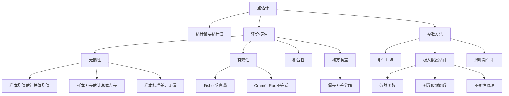
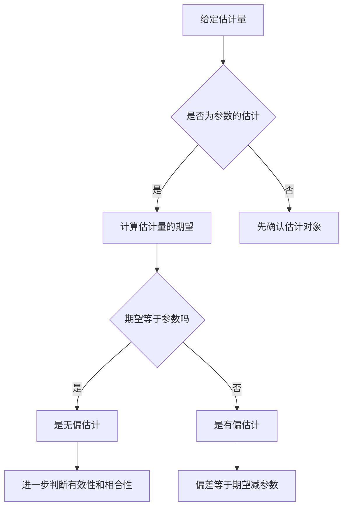

# 6.1 点估计的概念与无偏性

> [!abstract] 本节概览
> 本节系统介绍==点估计==的基本概念与评价标准。核心内容围绕三个问题展开：如何构造估计量（[[#六、矩估计法|矩法]]与[[#七、极大似然估计|极大似然法]]）、如何评价估计量的优劣（[[#二、无偏性|无偏性]]、[[#三、有效性与Fisher信息量|有效性]]、[[#四、相合性|相合性]]）、以及如何综合衡量估计精度（[[#五、均方误差|均方误差]]）。
>
> **逻辑链条**：[[#一、点估计的基本概念|基本概念]] → [[#二、无偏性|无偏性]] → [[#三、有效性与Fisher信息量|有效性]] → [[#四、相合性|相合性]] → [[#五、均方误差|MSE]] → [[#六、矩估计法|矩估计]] → [[#七、极大似然估计|MLE]]
>
> **前置依赖**：[[5.3 统计量及其分布|§5.3]]（统计量定义）、[[5.4 三大抽样分布|§5.4]]（抽样分布）、[[5.5 充分统计量|§5.5]]（充分统计量）
>
> **核心主线**：点估计的核心问题是"如何构造估计量"和"如何评价估计量"。矩估计法和MLE是两种最重要的构造方法；无偏性、有效性（C-R下界）、相合性构成评价标准体系；MSE将偏差与方差统一度量。

---

## 一、点估计的基本概念

### 估计量与估计值

> [!def] 定义 6.1.1 — 估计量与估计值
> 设总体 $X$ 的分布函数 $F(x;\theta)$ 中含有未知参数 $\theta$，$X_1, X_2, \ldots, X_n$ 是来自总体 $X$ 的样本。
> - **估计量**：构造一个统计量 $T = T(X_1, X_2, \ldots, X_n)$ 来估计 $\theta$，称 $T$ 为 $\theta$ 的==估计量==。估计量是**随机变量**（统计量）。
> - **估计值**：将样本观测值 $x_1, x_2, \ldots, x_n$ 代入估计量得到的数值 $t = T(x_1, x_2, \ldots, x_n)$，称为 $\theta$ 的**估计值**。估计值是一个**具体的数**。

**核心区别**：估计量是随机变量（函数），估计值是具体的数值。例如 $\bar{X}$ 是 $\mu$ 的估计量，而 $\bar{x} = 3.5$ 是估计值。

### 三种点估计方法概述

| 方法 | 基本思想 | 优点 | 缺点 |
|:---:|:---|:---|:---|
| **矩法** | 用样本矩代替总体矩 | 简便、直观、计算简单 | 不一定最优，未充分利用分布信息 |
| **极大似然法** | 使样本出现的概率最大 | 理论性质优良、渐近有效 | 需要知道分布形式，计算可能复杂 |
| **贝叶斯法** | 结合先验信息与样本信息 | 能利用先验知识 | 需要指定先验分布 |

> [!example] 例 6.1.1 — 直观理解点估计
> 设总体 $X \sim N(\mu, \sigma^2)$，$\mu$ 未知，$X_1, X_2, \ldots, X_n$ 为样本。
>
> 我们可以用**样本均值** $\bar{X} = \frac{1}{n}\sum_{i=1}^{n} X_i$ 来估计 $\mu$。
>
> - $\bar{X}$ 是一个统计量（随机变量），称为 $\mu$ 的**估计量**。
> - 若观测到 $x_1 = 2.1, x_2 = 1.8, x_3 = 2.3$，则 $\bar{x} = 2.07$ 是 $\mu$ 的**估计值**。
>
> 直观上，样本均值是总体均值的"自然"估计——它将所有样本信息集中到一个数值中。

---

## 二、无偏性

### 无偏估计的定义

> [!def] 定义 6.1.2 — 无偏估计
> 设 $\hat{\theta} = \hat{\theta}(X_1, X_2, \ldots, X_n)$ 是参数 $\theta$ 的一个估计量。若
>
> $$E(\hat{\theta}) = \theta$$
>
> 对一切 $\theta \in \Theta$ 成立，则称 $\hat{\theta}$ 是 $\theta$ 的==无偏估计量==，简称无偏估计。
>
> 若 $E(\hat{\theta}) \neq \theta$，则称 $\hat{\theta}$ 是 $\theta$ 的**有偏估计量**，其**偏差**为
>
> $$\text{Bias}(\hat{\theta}) = E(\hat{\theta}) - \theta$$

### 常见无偏估计

**定理：样本均值是总体均值的无偏估计**

> [!abstract] 证明
> **证明**：
> **第一步：展开期望**
>
> $$E(\bar{X}) = E\left(\frac{1}{n}\sum_{i=1}^{n} X_i\right) = \frac{1}{n}\sum_{i=1}^{n} E(X_i)$$
>
> **第二步：利用同分布性**
>
> 由于 $X_1, X_2, \ldots, X_n$ 与总体 $X$ 同分布，故 $E(X_i) = \mu$，因此
>
> $$E(\bar{X}) = \frac{1}{n} \cdot n\mu = \mu$$
>
> $\blacksquare$

**定理：样本方差 $S^2$ 是总体方差 $\sigma^2$ 的无偏估计**

> [!abstract] 证明
> **证明**：
> **第一步：定义样本方差**
>
> $$S^2 = \frac{1}{n-1}\sum_{i=1}^{n}(X_i - \bar{X})^2$$
>
> **第二步：展开平方和**
>
> $$\sum_{i=1}^{n}(X_i - \bar{X})^2 = \sum_{i=1}^{n}X_i^2 - n\bar{X}^2$$
>
> **第三步：取期望**
>
> $$E\left(\sum_{i=1}^{n}(X_i - \bar{X})^2\right) = \sum_{i=1}^{n}E(X_i^2) - nE(\bar{X}^2)$$
>
> **第四步：利用方差公式**
>
> $E(X_i^2) = \text{Var}(X_i) + [E(X_i)]^2 = \sigma^2 + \mu^2$
>
> $E(\bar{X}^2) = \text{Var}(\bar{X}) + [E(\bar{X})]^2 = \frac{\sigma^2}{n} + \mu^2$
>
> **第五步：代入化简**
>
> $$E\left(\sum_{i=1}^{n}(X_i - \bar{X})^2\right) = n(\sigma^2 + \mu^2) - n\left(\frac{\sigma^2}{n} + \mu^2\right) = (n-1)\sigma^2$$
>
> 因此
>
> $$E(S^2) = \frac{1}{n-1}(n-1)\sigma^2 = \sigma^2$$
>
> $\blacksquare$

### 样本标准差 $S$ 不是 $\sigma$ 的无偏估计

> [!important] 重点结论
> **样本标准差 $S = \sqrt{S^2}$ 不是总体标准差 $\sigma$ 的无偏估计**，即 $E(S) < \sigma$。
>
> 这是因为开方是一个**非线性运算**，由 Jensen 不等式：
>
> $$E(S) = E\left(\sqrt{S^2}\right) < \sqrt{E(S^2)} = \sqrt{\sigma^2} = \sigma$$

**渐近无偏性**：虽然 $S$ 不是 $\sigma$ 的无偏估计，但它是**渐近无偏**的，即

$$\lim_{n \to \infty} E(S) = \sigma$$

更精确地，可以证明 $E(S) = c_n \sigma$，其中 $c_n < 1$ 且 $c_n \to 1\ (n \to \infty)$。

> [!abstract] 证明
> **证明**（正态总体下）：
> **第一步：利用卡方分布**
>
> 在正态总体 $N(\mu, \sigma^2)$ 下，$\frac{(n-1)S^2}{\sigma^2} \sim \chi^2(n-1)$。
>
> **第二步：计算 $E(S)$**
>
> $$E(S) = E\left(\sqrt{S^2}\right) = E\left(\sigma \cdot \sqrt{\frac{(n-1)S^2}{\sigma^2} \cdot \frac{1}{n-1}}\right) = \frac{\sigma}{\sqrt{n-1}} E\left(\sqrt{\chi^2(n-1)}\right)$$
>
> **第三步：利用卡方分布矩**
>
> 设 $Y \sim \chi^2(n-1)$，则
>
> $$E(\sqrt{Y}) = \int_0^{+\infty} \sqrt{y} \cdot \frac{1}{2^{(n-1)/2}\Gamma(\frac{n-1}{2})} y^{(n-1)/2-1} e^{-y/2} dy$$
>
> $$= \frac{2^{1/2}\Gamma(n/2)}{\Gamma(\frac{n-1}{2})}$$
>
> **第四步：得出结论**
>
> $$E(S) = \frac{\sigma}{\sqrt{n-1}} \cdot \frac{\sqrt{2}\Gamma(n/2)}{\Gamma(\frac{n-1}{2})} = c_n \sigma$$
>
> 其中 $c_n = \sqrt{\frac{2}{n-1}} \cdot \frac{\Gamma(n/2)}{\Gamma(\frac{n-1}{2})} < 1$，且 $c_n \to 1\ (n \to \infty)$。
>
> $\blacksquare$

> [!example] 例 6.1.2 — 判断无偏性
> 设 $X_1, X_2, \ldots, X_n$ 是来自总体 $X$ 的样本，$E(X) = \mu$，$\text{Var}(X) = \sigma^2$。判断以下统计量是否为 $\mu$ 的无偏估计：
>
> (1) $T_1 = \frac{1}{n}\sum_{i=1}^{n} X_i = \bar{X}$
>
> (2) $T_2 = X_1$
>
> (3) $T_3 = \frac{1}{3}X_1 + \frac{2}{3}X_2$
>
> **解**：
>
> (1) $E(T_1) = E(\bar{X}) = \mu$，是无偏估计。
>
> (2) $E(T_2) = E(X_1) = \mu$，是无偏估计。
>
> (3) $E(T_3) = \frac{1}{3}\mu + \frac{2}{3}\mu = \mu$，是无偏估计。
>
> **结论**：无偏估计不唯一，同一个参数可以有无穷多个无偏估计。

> [!example] 例 6.1.3 — 样本标准差的有偏性
> 设 $X_1, X_2, \ldots, X_n$ 来自正态总体 $N(\mu, \sigma^2)$，$S^2 = \frac{1}{n-1}\sum_{i=1}^{n}(X_i - \bar{X})^2$。
>
> 问：$S$ 是否为 $\sigma$ 的无偏估计？
>
> **解**：不是。由 Jensen 不等式，$E(S) = E(\sqrt{S^2}) < \sqrt{E(S^2)} = \sigma$。
>
> 具体地，$E(S) = c_n \sigma$，其中 $c_n = \sqrt{\frac{2}{n-1}} \cdot \frac{\Gamma(n/2)}{\Gamma(\frac{n-1}{2})}$。
>
> 例如 $n=2$ 时，$c_2 = \sqrt{\frac{2}{\pi}} \approx 0.798$；$n=3$ 时，$c_3 = \frac{2\sqrt{2}}{\sqrt{\pi}} \cdot \frac{\Gamma(1.5)}{\Gamma(1)} \approx 0.886$。
>
> 当 $n \to \infty$ 时，$c_n \to 1$，即 $S$ 是 $\sigma$ 的**渐近无偏估计**。

---

## 三、有效性与Fisher信息量

### 有效估计的定义

> [!def] 定义 6.1.3 — 有效估计
> 设 $\hat{\theta}$ 是参数 $\theta$ 的无偏估计量。若 $\hat{\theta}$ 的方差达到了**所有无偏估计中方差的下界**（即 Cramér-Rao 下界），则称 $\hat{\theta}$ 是 $\theta$ 的**有效估计量**。

### Fisher信息量

> [!def] 定义 6.1.4 — Fisher信息量
> 设总体 $X$ 的概率密度函数（或概率质量函数）为 $f(x;\theta)$，且满足正则条件，则
>
> $$I(\theta) = E\left[\left(\frac{\partial}{\partial \theta} \ln f(X;\theta)\right)^2\right] = -E\left[\frac{\partial^2}{\partial \theta^2} \ln f(X;\theta)\right]$$
>
> 称 $I(\theta)$ 为 ==Fisher信息量==，它衡量了样本包含关于参数 $\theta$ 的信息量。

### Cramér-Rao不等式

> [!thm] 定理 6.1.1 — Cramér-Rao不等式
> 设 $X_1, X_2, \ldots, X_n$ 是来自总体 $f(x;\theta)$ 的样本，$\hat{\theta}$ 是 $\theta$ 的无偏估计，且满足正则条件，则
>
> $$\text{Var}(\hat{\theta}) \geq \frac{1}{nI(\theta)}$$
>
> 其中 $\frac{1}{nI(\theta)}$ 称为 ==Cramér-Rao下界==（C-R下界）。
>
> 等号成立的**充要条件**是：存在函数 $a(\theta)$ 使得
>
> $$\frac{\partial}{\partial \theta}\ln L(\theta; X_1, \ldots, X_n) = a(\theta)(\hat{\theta} - \theta)$$

### 有效估计的判定

> [!thm] 定理 6.1.2 — 有效估计的判定
> 无偏估计 $\hat{\theta}$ 是有效估计的充要条件是：
> 1. $\hat{\theta}$ 的方差等于 C-R 下界：$\text{Var}(\hat{\theta}) = \frac{1}{nI(\theta)}$
> 2. 似然方程可以表示为 $\hat{\theta}$ 的线性函数

> [!example] 例 6.1.4 — 正态总体均值的有效性
> 设 $X_1, X_2, \ldots, X_n \sim N(\mu, \sigma^2)$，$\sigma^2$ 已知，判断 $\bar{X}$ 是否为 $\mu$ 的有效估计。
>
> **解**：
>
> **第一步：计算 Fisher 信息量**
>
> $$f(x;\mu) = \frac{1}{\sqrt{2\pi}\sigma}e^{-\frac{(x-\mu)^2}{2\sigma^2}}$$
>
> $$\ln f(x;\mu) = -\frac{1}{2}\ln(2\pi) - \ln\sigma - \frac{(x-\mu)^2}{2\sigma^2}$$
>
> $$\frac{\partial}{\partial \mu}\ln f(x;\mu) = \frac{x - \mu}{\sigma^2}$$
>
> $$\frac{\partial^2}{\partial \mu^2}\ln f(x;\mu) = -\frac{1}{\sigma^2}$$
>
> 因此 $I(\mu) = -E\left(-\frac{1}{\sigma^2}\right) = \frac{1}{\sigma^2}$。
>
> **第二步：计算 C-R 下界**
>
> $$\frac{1}{nI(\mu)} = \frac{\sigma^2}{n}$$
>
> **第三步：比较方差**
>
> $$\text{Var}(\bar{X}) = \frac{\sigma^2}{n} = \frac{1}{nI(\mu)}$$
>
> 方差恰好等于 C-R 下界，因此 $\bar{X}$ 是 $\mu$ 的**有效估计**。

> [!example] 例 6.1.5 — 样本方差不是有效估计
> 设 $X_1, X_2, \ldots, X_n \sim N(\mu, \sigma^2)$，判断 $S^2$ 是否为 $\sigma^2$ 的有效估计。
>
> **解**：
>
> **第一步：计算 Fisher 信息量**
>
> $$\frac{\partial}{\partial \sigma^2}\ln f(x;\sigma^2) = -\frac{1}{2\sigma^2} + \frac{(x-\mu)^2}{2\sigma^4}$$
>
> $$\frac{\partial^2}{\partial (\sigma^2)^2}\ln f(x;\sigma^2) = \frac{1}{2\sigma^4} - \frac{(x-\mu)^2}{\sigma^6}$$
>
> $$I(\sigma^2) = -E\left[\frac{\partial^2}{\partial (\sigma^2)^2}\ln f(x;\sigma^2)\right] = \frac{1}{2\sigma^4}$$
>
> **第二步：计算 C-R 下界**
>
> $$\frac{1}{nI(\sigma^2)} = \frac{2\sigma^4}{n}$$
>
> **第三步：比较方差**
>
> 由于 $\frac{(n-1)S^2}{\sigma^2} \sim \chi^2(n-1)$，
>
> $$\text{Var}(S^2) = \frac{\sigma^4}{(n-1)^2}\text{Var}(\chi^2(n-1)) = \frac{\sigma^4}{(n-1)^2} \cdot 2(n-1) = \frac{2\sigma^4}{n-1}$$
>
> 因为 $\frac{2\sigma^4}{n-1} > \frac{2\sigma^4}{n}$，所以 $S^2$ **不是** $\sigma^2$ 的有效估计。

---

## 四、相合性

### 相合估计的定义

> [!def] 定义 6.1.5 — 相合估计（一致估计）
> 设 $\hat{\theta}_n = \hat{\theta}(X_1, X_2, \ldots, X_n)$ 是参数 $\theta$ 的估计量。若对任意 $\varepsilon > 0$，有
>
> $$\lim_{n \to \infty} P(|\hat{\theta}_n - \theta| \geq \varepsilon) = 0$$
>
> 即 $\hat{\theta}_n \xrightarrow{P} \theta$，则称 $\hat{\theta}_n$ 是 $\theta$ 的==相合估计量==（或一致估计量）。

### 相合性的判定

> [!thm] 定理 6.1.3 — 相合性的判定
> 以下条件之一成立即可保证 $\hat{\theta}_n$ 是 $\theta$ 的相合估计：
>
> 1. **均方误差趋于零**：$\lim_{n \to \infty} E[(\hat{\theta}_n - \theta)^2] = 0$
>
> 2. **无偏且方差趋于零**：$E(\hat{\theta}_n) = \theta$ 且 $\lim_{n \to \infty}\text{Var}(\hat{\theta}_n) = 0$
>
> 3. **矩法估计的相合性**：矩法估计量一般是相合估计（由大数定律保证）
>
> 4. **MLE的相合性**：在正则条件下，极大似然估计是相合估计

> [!example] 例 6.1.6 — 矩估计的相合性
> 设 $X_1, X_2, \ldots, X_n$ 来自均匀分布 $U(\theta, 2\theta)$，$\theta > 0$。
>
> (1) 矩估计 $\hat{\theta}_M = \frac{2}{3}\bar{X}$ 是否为 $\theta$ 的无偏估计？
>
> (2) $\hat{\theta}_M$ 是否为 $\theta$ 的相合估计？
>
> **解**：
>
> (1) $E(X) = \frac{\theta + 2\theta}{2} = \frac{3\theta}{2}$，故
>
> $$E(\hat{\theta}_M) = E\left(\frac{2}{3}\bar{X}\right) = \frac{2}{3}E(X) = \frac{2}{3} \cdot \frac{3\theta}{2} = \theta$$
>
> 是无偏估计。
>
> (2) $\text{Var}(\hat{\theta}_M) = \frac{4}{9}\text{Var}(\bar{X}) = \frac{4}{9n}\text{Var}(X) = \frac{4}{9n} \cdot \frac{\theta^2}{12} = \frac{\theta^2}{27n}$
>
> 当 $n \to \infty$ 时，$\text{Var}(\hat{\theta}_M) \to 0$，因此 $\hat{\theta}_M$ 是 $\theta$ 的相合估计。

---

## 五、均方误差

### MSE的分解

> [!def] 定义 6.1.6 — 均方误差
> 估计量 $\hat{\theta}$ 关于参数 $\theta$ 的==均方误差==（Mean Squared Error, MSE）定义为
>
> $$\text{MSE}(\hat{\theta}) = E[(\hat{\theta} - \theta)^2]$$

> [!thm] 定理 6.1.4 — 偏差-方差分解
> $$\text{MSE}(\hat{\theta}) = \text{Var}(\hat{\theta}) + [\text{Bias}(\hat{\theta})]^2$$
>
> 其中 $\text{Bias}(\hat{\theta}) = E(\hat{\theta}) - \theta$。

> [!abstract] 证明
> **证明**：
> **第一步：引入中心化**
>
> $$\text{MSE}(\hat{\theta}) = E[(\hat{\theta} - \theta)^2] = E[((\hat{\theta} - E\hat{\theta}) + (E\hat{\theta} - \theta))^2]$$
>
> **第二步：展开平方**
>
> $$= E[(\hat{\theta} - E\hat{\theta})^2] + (E\hat{\theta} - \theta)^2 + 2E[(\hat{\theta} - E\hat{\theta})(E\hat{\theta} - \theta)]$$
>
> **第三步：化简交叉项**
>
> 由于 $E\hat{\theta} - \theta$ 是常数，
>
> $$E[(\hat{\theta} - E\hat{\theta})(E\hat{\theta} - \theta)] = (E\hat{\theta} - \theta) \cdot E[\hat{\theta} - E\hat{\theta}] = 0$$
>
> **第四步：得出结论**
>
> $$\text{MSE}(\hat{\theta}) = \text{Var}(\hat{\theta}) + [\text{Bias}(\hat{\theta})]^2$$
>
> $\blacksquare$

### 偏差-方差权衡

对于无偏估计，$\text{MSE} = \text{Var}$。但有时引入少量偏差可以大幅降低方差，从而使总 MSE 更小。

> [!example] 例 6.1.7 — 偏差-方差权衡
> 设 $X_1, X_2, \ldots, X_n \sim N(\mu, \sigma^2)$，$\mu = 0$，比较以下 $\sigma^2$ 的估计量：
>
> - $T_1 = S^2 = \frac{1}{n-1}\sum_{i=1}^{n}(X_i - \bar{X})^2$（无偏）
> - $T_2 = \frac{n-1}{n+1}S^2$（有偏）
>
> **解**：
>
> $T_1$：$\text{MSE}(T_1) = \text{Var}(S^2) = \frac{2\sigma^4}{n-1}$
>
> $T_2$：$E(T_2) = \frac{n-1}{n+1}\sigma^2$，$\text{Bias}(T_2) = -\frac{2}{n+1}\sigma^2$
>
> $$\text{MSE}(T_2) = \left(\frac{n-1}{n+1}\right)^2 \frac{2\sigma^4}{n-1} + \left(\frac{2\sigma^2}{n+1}\right)^2 = \frac{2\sigma^4}{n+1}$$
>
> 比较：$\frac{2\sigma^4}{n+1} < \frac{2\sigma^4}{n-1}$，因此 $T_2$ 的 MSE 更小。

---

## 六、矩估计法

### 基本思想

> [!def] 定义 6.1.7 — 矩估计法
> **矩估计法**（Method of Moments, MoM）的基本思想是：**用样本矩代替总体矩**来建立方程，从而求解参数的估计。
>
> 具体步骤：
> 1. 计算总体的前 $k$ 阶矩 $\mu_j = E(X^j)$，$j = 1, 2, \ldots, k$，它们是参数 $\theta_1, \ldots, \theta_k$ 的函数。
> 2. 用样本矩 $A_j = \frac{1}{n}\sum_{i=1}^{n}X_i^j$ 代替总体矩 $\mu_j$。
> 3. 解方程组 $\mu_j(\theta_1, \ldots, \theta_k) = A_j$，$j = 1, 2, \ldots, k$，得到参数的矩估计。

> [!example] 例 6.1.8 — 泊松分布的矩估计
> 设 $X_1, X_2, \ldots, X_n$ 来自泊松分布 $P(\lambda)$，求 $\lambda$ 的矩估计。
>
> **解**：
>
> **第一步：计算总体矩**
>
> 泊松分布 $P(\lambda)$ 的期望 $E(X) = \lambda$。
>
> **第二步：用样本矩代替**
>
> $$\hat{\lambda} = \bar{X} = \frac{1}{n}\sum_{i=1}^{n}X_i$$
>
> 即泊松分布参数 $\lambda$ 的矩估计就是样本均值。

> [!example] 例 6.1.9 — 均匀分布的矩估计
> 设 $X_1, X_2, \ldots, X_n$ 来自均匀分布 $U(0, \theta)$，求 $\theta$ 的矩估计。
>
> **解**：
>
> **第一步：计算总体期望**
>
> $$E(X) = \frac{\theta}{2}$$
>
> **第二步：用样本矩代替**
>
> $$\frac{\hat{\theta}}{2} = \bar{X} \implies \hat{\theta} = 2\bar{X}$$
>
> **第三步：判断无偏性**
>
> $$E(\hat{\theta}) = 2E(\bar{X}) = 2 \cdot \frac{\theta}{2} = \theta$$
>
> 因此 $2\bar{X}$ 是 $\theta$ 的无偏矩估计。

---

## 七、极大似然估计

### 似然函数的定义

> [!def] 定义 6.1.8 — 似然函数与极大似然估计
> 设 $X_1, X_2, \ldots, X_n$ 是来自总体 $f(x;\theta)$ 的样本，其联合密度（或联合概率质量函数）为
>
> $$L(\theta) = L(\theta; x_1, \ldots, x_n) = \prod_{i=1}^{n}f(x_i;\theta)$$
>
> 称 $L(\theta)$ 为**似然函数**。
>
> 若存在 $\hat{\theta} = \hat{\theta}(x_1, \ldots, x_n)$ 使得
>
> $$L(\hat{\theta}) = \max_{\theta \in \Theta} L(\theta)$$
>
> 则称 $\hat{\theta}$ 为 $\theta$ 的==极大似然估计==（Maximum Likelihood Estimation, MLE）。

### 对数似然函数

由于似然函数是多个因子的乘积，取对数可以简化计算：

$$\ln L(\theta) = \sum_{i=1}^{n}\ln f(x_i;\theta)$$

因为 $\ln$ 是严格单调递增函数，所以 $\ln L(\theta)$ 和 $L(\theta)$ 在同一点取最大值。

### MLE的求解步骤

1. **写出似然函数** $L(\theta) = \prod_{i=1}^{n}f(x_i;\theta)$
2. **取对数** $\ln L(\theta) = \sum_{i=1}^{n}\ln f(x_i;\theta)$
3. **求导并令导数为零** $\frac{d}{d\theta}\ln L(\theta) = 0$（似然方程）
4. **验证二阶条件**（二阶导小于零）或通过其他方法确认是最大值
5. **注意参数空间**：若解不在参数空间内，需在边界上取最大值

### 不变性原理

> [!thm] 定理 6.1.5 — 极大似然估计的不变性
> 若 $\hat{\theta}$ 是 $\theta$ 的极大似然估计，$g(\theta)$ 是 $\theta$ 的函数（$g$ 为单值函数），则 $g(\hat{\theta})$ 是 $g(\theta)$ 的极大似然估计，即
>
> $$\widehat{g(\theta)} = g(\hat{\theta})$$

> [!example] 例 6.1.10 — 正态分布的MLE
> 设 $X_1, X_2, \ldots, X_n \sim N(\mu, \sigma^2)$，$\mu$ 和 $\sigma^2$ 均未知，求 $\mu$ 和 $\sigma^2$ 的极大似然估计。
>
> **解**：
>
> **第一步：写出似然函数**
>
> $$L(\mu, \sigma^2) = \prod_{i=1}^{n}\frac{1}{\sqrt{2\pi\sigma^2}}\exp\left\{-\frac{(x_i - \mu)^2}{2\sigma^2}\right\}$$
>
> $$= (2\pi\sigma^2)^{-n/2}\exp\left\{-\frac{1}{2\sigma^2}\sum_{i=1}^{n}(x_i - \mu)^2\right\}$$
>
> **第二步：取对数**
>
> $$\ln L = -\frac{n}{2}\ln(2\pi) - \frac{n}{2}\ln\sigma^2 - \frac{1}{2\sigma^2}\sum_{i=1}^{n}(x_i - \mu)^2$$
>
> **第三步：对 $\mu$ 求导**
>
> $$\frac{\partial \ln L}{\partial \mu} = \frac{1}{\sigma^2}\sum_{i=1}^{n}(x_i - \mu) = 0$$
>
> 解得 $\hat{\mu} = \bar{x} = \frac{1}{n}\sum_{i=1}^{n}x_i$。
>
> **第四步：对 $\sigma^2$ 求导**
>
> $$\frac{\partial \ln L}{\partial \sigma^2} = -\frac{n}{2\sigma^2} + \frac{1}{2\sigma^4}\sum_{i=1}^{n}(x_i - \mu)^2 = 0$$
>
> 代入 $\hat{\mu} = \bar{x}$，解得 $\hat{\sigma}^2 = \frac{1}{n}\sum_{i=1}^{n}(x_i - \bar{x})^2$。
>
> **注意**：$\sigma^2$ 的 MLE 是 $\frac{1}{n}\sum_{i=1}^{n}(x_i - \bar{x})^2$，而**不是**无偏的样本方差 $S^2 = \frac{1}{n-1}\sum_{i=1}^{n}(x_i - \bar{x})^2$。MLE 是有偏估计。

---

## 八、知识结构总览

---

## 九、核心思想与技巧

### 判断无偏性的流程

### 解题技巧总结

1. **判断无偏性**：核心是计算期望 $E(\hat{\theta})$，利用期望的线性性、方差的展开式等。
2. **比较有效性**：在多个无偏估计中，方差最小的最有效。利用 $\text{Var}(\bar{X}) = \frac{\sigma^2}{n}$ 等常用公式。
3. **求矩估计**：先计算总体矩（期望、方差等），再用样本矩替换，解方程。
4. **求MLE**：写出似然函数 → 取对数 → 求导 → 解方程 → 注意参数空间边界。
5. **均匀分布的MLE**：MLE 通常与次序统计量有关（$X_{(1)}$ 或 $X_{(n)}$），不能直接求导。
6. **不变性原理**：若求 $g(\theta)$ 的 MLE，先求 $\hat{\theta}_{MLE}$，再计算 $g(\hat{\theta}_{MLE})$。
7. **MSE比较**：利用 $\text{MSE} = \text{Var} + \text{Bias}^2$ 分解，有时有偏估计的 MSE 更小。

---

## 十、补充理解与易混淆点

### 误区一：样本标准差是无偏的

**来源**：茆诗松《概率论与数理统计》 + 卡方训练营考研真题 + Brainly统计问答 + Oxford大学统计学讲义 + Eduardo García-Portugués统计推断课程

> [!danger] 误区1："样本标准差 S 是总体标准差 sigma 的无偏估计"
> ❌ 错误解释：因为 $S^2$ 是 $\sigma^2$ 的无偏估计，所以 $S = \sqrt{S^2}$ 自然也是 $\sigma$ 的无偏估计。
> ✅ 正确解释：开方是**非线性运算**，由 Jensen 不等式，$E(S) = E(\sqrt{S^2}) < \sqrt{E(S^2)} = \sigma$。正态总体下 $E(S) = c_n \sigma$，其中 $c_n = \sqrt{\frac{2}{n-1}} \cdot \frac{\Gamma(n/2)}{\Gamma(\frac{n-1}{2})} < 1$，仅当 $n \to \infty$ 时 $c_n \to 1$（渐近无偏）。

### 误区二：无偏估计一定比有偏估计好

**来源**：茆诗松《概率论与数理统计》 + 华东师范大学432考研真题 + 卡方训练营 + NumberAnalytics统计学教程 + Fiveable统计学习

> [!danger] 误区2："无偏估计总是优于有偏估计"
> ❌ 错误解释：无偏意味着"平均来说准确"，所以无偏估计一定比有偏估计好。
> ✅ 正确解释：评价估计量的好坏应看 **MSE = Var + Bias^2**。有偏估计如果方差足够小，其 MSE 可能反而更小。例如正态总体下，$\frac{n-1}{n+1}S^2$ 虽然是 $\sigma^2$ 的有偏估计，但 MSE 为 $\frac{2\sigma^4}{n+1}$，小于无偏的 $S^2$ 的 MSE $\frac{2\sigma^4}{n-1}$。

### 误区三：MLE一定无偏

**来源**：茆诗松《概率论与数理统计》 + Stack Exchange Cross Validated + Wikipedia极大似然估计条目 + 厦门大学432考研真题 + 复旦大学432考研真题

> [!danger] 误区3："极大似然估计一定是无偏估计"
> ❌ 错误解释：MLE 是"最好的"估计方法，所以得到的估计量一定无偏。
> ✅ 正确解释：MLE **不一定无偏**。例如正态总体 $N(\mu, \sigma^2)$ 中 $\sigma^2$ 的 MLE $\hat{\sigma}^2 = \frac{1}{n}\sum_{i=1}^{n}(X_i - \bar{X})^2$ 的期望为 $\frac{n-1}{n}\sigma^2 \neq \sigma^2$，是有偏的。均匀分布 $U(0,\theta)$ 中 $\hat{\theta} = X_{(n)}$ 的期望为 $\frac{n}{n+1}\theta$，也是有偏的。但 MLE 通常是**渐近无偏**的。

### 误区四：矩估计和MLE总是相同

**来源**：茆诗松《概率论与数理统计》 + 西南大学432考研真题 + 兰州大学432考研真题 + CSDN数据科学博客 + SI-UC3M统计推断课程

> [!danger] 误区4："矩估计和极大似然估计总是相同的"
> ❌ 错误解释：两种方法都是用样本信息估计参数，结果应该一样。
> ✅ 正确解释：矩估计和 MLE **不一定相同**。例如均匀分布 $U(0,\theta)$ 的矩估计为 $2\bar{X}$，而 MLE 为 $X_{(n)}$，两者完全不同。泊松分布 $P(\lambda)$ 的矩估计和 MLE 恰好相同（都是 $\bar{X}$），但这只是特例。MLE 通常比矩估计更有效（渐近达到 C-R 下界），但计算更复杂。

---

## 十一、习题精选

> [!todo] 习题概览
> 共10道习题：6道教材习题 + 4道卡方考研真题。
>
> | 编号 | 来源 | 主题 | 难度 |
> |:---:|:---:|:---|:---:|
> | 习题1 | 教材 | 无偏性判断 | 中 |
> | 习题2 | 教材 | 矩估计求解 | 中 |
> | 习题3 | 教材 | 极大似然估计 | 中 |
> | 习题4 | 教材 | MSE比较 | 中高 |
> | 习题5 | 教材 | 有效性与C-R下界 | 高 |
> | 习题6 | 教材 | 相合性证明 | 高 |
> | 习题7 | 2014年华东师范大学432 | 无偏性与方差比较 | ★★★ |
> | 习题8 | 2017年北京师范大学432 | 样本标准差无偏性 | ★★★ |
> | 习题9 | 2016年清华大学432 | MLE与无偏性判断 | ★★★★ |
> | 习题10 | 2019年复旦大学432 | 矩估计与MLE综合 | ★★★★ |

### 教材习题

> [!problem] 习题1
> 设 $X_1, X_2, \ldots, X_n$ 是来自总体 $X$ 的样本，$E(X) = \mu$，$\text{Var}(X) = \sigma^2$。确定常数 $c$，使 $T = c\sum_{i=1}^{n-1}(X_{i+1} - X_i)^2$ 为 $\sigma^2$ 的无偏估计。

> [!faq]- 查看解答
> **解**：
>
> 注意到 $E[(X_{i+1} - X_i)^2] = E[X_{i+1}^2 - 2X_{i+1}X_i + X_i^2]$
>
> 由于 $X_{i+1}$ 与 $X_i$ 独立：
>
> $= E(X_{i+1}^2) - 2E(X_{i+1})E(X_i) + E(X_i^2) = (\sigma^2 + \mu^2) - 2\mu^2 + (\sigma^2 + \mu^2) = 2\sigma^2$
>
> 因此 $E(T) = c \cdot (n-1) \cdot 2\sigma^2 = 2c(n-1)\sigma^2$
>
> 令 $2c(n-1)\sigma^2 = \sigma^2$，解得 $c = \frac{1}{2(n-1)}$。

> [!problem] 习题2
> 设总体 $X$ 的概率密度为 $f(x) = \frac{1}{2\theta}e^{-|x|/\theta}$，$-\infty < x < +\infty$，$\theta > 0$。$X_1, X_2, \ldots, X_n$ 为样本，求 $\theta$ 的矩估计量。

> [!faq]- 查看解答
> **解**：
>
> 由于 $f(x)$ 关于 $x=0$ 对称，$E(X) = 0$。需要用二阶矩：
>
> $E(X^2) = \int_{-\infty}^{+\infty} x^2 \cdot \frac{1}{2\theta}e^{-|x|/\theta} dx = 2\int_0^{+\infty} x^2 \cdot \frac{1}{2\theta}e^{-x/\theta} dx = \frac{1}{\theta}\int_0^{+\infty} x^2 e^{-x/\theta} dx$
>
> 令 $t = x/\theta$，则
>
> $= \theta^2 \int_0^{+\infty} t^2 e^{-t} dt = \theta^2 \Gamma(3) = 2\theta^2$
>
> 用样本二阶矩代替：$\frac{1}{n}\sum_{i=1}^{n}X_i^2 = 2\hat{\theta}^2$
>
> 因此 $\hat{\theta} = \sqrt{\frac{1}{2n}\sum_{i=1}^{n}X_i^2}$。

> [!problem] 习题3
> 设总体 $X \sim U(0, \theta)$，$\theta > 0$，$X_1, X_2, \ldots, X_n$ 为样本。求 $\theta$ 的极大似然估计。

> [!faq]- 查看解答
> **解**：
>
> 似然函数：
>
> $L(\theta) = \prod_{i=1}^{n}\frac{1}{\theta} \cdot I_{\{0 < x_i < \theta\}} = \frac{1}{\theta^n} \cdot I_{\{x_{(n)} < \theta\}}$
>
> 其中 $x_{(n)} = \max\{x_1, \ldots, x_n\}$。
>
> 当 $\theta \geq x_{(n)}$ 时，$L(\theta) = \frac{1}{\theta^n}$，关于 $\theta$ 单调递减。
>
> 因此 $L(\theta)$ 在 $\theta = x_{(n)}$ 处取最大值，即 $\hat{\theta}_{MLE} = X_{(n)}$。
>
> **注意**：$E(X_{(n)}) = \frac{n}{n+1}\theta \neq \theta$，MLE 是有偏的。无偏修正为 $\hat{\theta}_{unbiased} = \frac{n+1}{n}X_{(n)}$。

> [!problem] 习题4
> 设 $X_1, X_2, \ldots, X_n \sim N(0, \sigma^2)$，比较以下三个 $\sigma^2$ 的估计量的均方误差：
>
> $T_1 = \frac{1}{n-1}\sum_{i=1}^{n}(X_i - \bar{X})^2 = S^2$
>
> $T_2 = \frac{1}{n}\sum_{i=1}^{n}(X_i - \bar{X})^2$
>
> $T_3 = \frac{1}{n+1}\sum_{i=1}^{n}(X_i - \bar{X})^2$

> [!faq]- 查看解答
> **解**：
>
> 设 $Q = \sum_{i=1}^{n}(X_i - \bar{X})^2$，则 $\frac{Q}{\sigma^2} \sim \chi^2(n-1)$，$E(Q) = (n-1)\sigma^2$，$\text{Var}(Q) = 2(n-1)\sigma^4$。
>
> $T_1 = \frac{Q}{n-1}$：$E(T_1) = \sigma^2$，$\text{MSE}(T_1) = \text{Var}(T_1) = \frac{2\sigma^4}{n-1}$
>
> $T_2 = \frac{Q}{n}$：$E(T_2) = \frac{n-1}{n}\sigma^2$，$\text{Bias}^2 = \frac{\sigma^4}{n^2}$
>
> $\text{MSE}(T_2) = \frac{2(n-1)\sigma^4}{n^2} + \frac{\sigma^4}{n^2} = \frac{(2n-1)\sigma^4}{n^2}$
>
> $T_3 = \frac{Q}{n+1}$：$E(T_3) = \frac{n-1}{n+1}\sigma^2$，$\text{Bias}^2 = \frac{4\sigma^4}{(n+1)^2}$
>
> $\text{MSE}(T_3) = \frac{2(n-1)\sigma^4}{(n+1)^2} + \frac{4\sigma^4}{(n+1)^2} = \frac{2\sigma^4}{n+1}$
>
> 比较：$\frac{2}{n+1} < \frac{2n-1}{n^2} < \frac{2}{n-1}$（$n \geq 2$），因此 $\text{MSE}(T_3) < \text{MSE}(T_2) < \text{MSE}(T_1)$。

> [!problem] 习题5
> 设 $X_1, X_2, \ldots, X_n \sim N(\mu, \sigma^2)$，$\sigma^2$ 已知。
>
> (1) 求 $\mu$ 的 Fisher 信息量 $I(\mu)$ 和 C-R 下界。
>
> (2) 验证 $\bar{X}$ 是否达到 C-R 下界。

> [!faq]- 查看解答
> **解**：
>
> (1) $f(x;\mu) = \frac{1}{\sqrt{2\pi}\sigma}e^{-(x-\mu)^2/(2\sigma^2)}$
>
> $\ln f = -\frac{1}{2}\ln(2\pi) - \ln\sigma - \frac{(x-\mu)^2}{2\sigma^2}$
>
> $\frac{\partial^2}{\partial\mu^2}\ln f = -\frac{1}{\sigma^2}$
>
> $I(\mu) = -E\left(-\frac{1}{\sigma^2}\right) = \frac{1}{\sigma^2}$
>
> C-R 下界：$\frac{1}{nI(\mu)} = \frac{\sigma^2}{n}$
>
> (2) $\text{Var}(\bar{X}) = \frac{\sigma^2}{n} = \frac{1}{nI(\mu)}$，恰好达到 C-R 下界，因此 $\bar{X}$ 是 $\mu$ 的有效估计。

> [!problem] 习题6
> 设 $X_1, X_2, \ldots, X_n$ 来自均匀分布 $U(\theta, 2\theta)$，$\theta > 0$。
>
> (1) 证明 $\hat{\theta} = \frac{2}{3}\bar{X}$ 是 $\theta$ 的相合估计。
>
> (2) 求 $\theta$ 的 MLE $\hat{\theta}_{MLE} = \frac{X_{(n)}}{2}$，判断其是否为无偏估计和相合估计。

> [!faq]- 查看解答
> **解**：
>
> (1) $E(\hat{\theta}) = \frac{2}{3}E(\bar{X}) = \frac{2}{3} \cdot \frac{3\theta}{2} = \theta$（无偏）
>
> $\text{Var}(\hat{\theta}) = \frac{4}{9}\text{Var}(\bar{X}) = \frac{4}{9n}\text{Var}(X) = \frac{4}{9n} \cdot \frac{\theta^2}{12} = \frac{\theta^2}{27n} \to 0$
>
> 无偏且方差趋于零，故 $\hat{\theta}$ 是相合估计。
>
> (2) MLE：$\hat{\theta}_{MLE} = \frac{X_{(n)}}{2}$
>
> 无偏性：$E(\hat{\theta}_{MLE}) = \frac{1}{2}E(X_{(n)}) = \frac{1}{2} \cdot \frac{2n+1}{2(n+1)}\theta = \frac{2n+1}{4(n+1)}\theta \neq \theta$，有偏。
>
> 相合性：$\lim_{n\to\infty}E(\hat{\theta}_{MLE}) = \theta$，$\lim_{n\to\infty}\text{Var}(\hat{\theta}_{MLE}) = 0$，故 MLE 是相合估计。

### 卡方考研真题

> [!problem] 习题7（2014年华东师范大学432）
> 设 $X_1, X_2, \ldots, X_n$ 是来自正态总体 $N(\mu, \sigma^2)$ 的一个样本，下列统计量中，均方误差最小的是（ ）。
>
> A. $\frac{1}{n-1}\sum_{k=1}^{n}(X_k - \bar{X})^2$
>
> B. $\frac{1}{n}\sum_{k=1}^{n}(X_k - \bar{X})^2$
>
> C. $\frac{1}{n+1}\sum_{k=1}^{n}(X_k - \bar{X})^2$
>
> D. $\frac{1}{n+2}\sum_{k=1}^{n}(X_k - \bar{X})^2$

> [!faq]- 查看解答
> **解**：选 C。
>
> 设 $Q = \sum_{k=1}^{n}(X_k - \bar{X})^2$，$\frac{Q}{\sigma^2} \sim \chi^2(n-1)$。
>
> A: $\text{MSE} = \text{Var}(S^2) = \frac{2\sigma^4}{n-1}$
>
> B: $\text{MSE} = \frac{(2n-1)\sigma^4}{n^2}$
>
> C: $\text{MSE} = \frac{2\sigma^4}{n+1}$
>
> D: $\text{MSE} = \frac{(2n+7)\sigma^4}{(n+2)^2}$
>
> 经比较，C 的均方误差最小。（也可令 $n=2$ 代入比较。）

> [!problem] 习题8（2017年北京师范大学432）
> 设 $X_1, X_2, \ldots, X_n$ 为来自总体 $X$ 的简单随机样本，$E(X) = \mu$，$\text{Var}(X) = \sigma^2$。
>
> (1) 样本标准差 $S$ 是不是总体标准差 $\sigma$ 的无偏估计？为什么？
>
> (2) 确定常数 $c$，使 $(\bar{X})^2 - cS^2$ 为 $\mu^2$ 的无偏估计。

> [!faq]- 查看解答
> **解**：
>
> (1) **不是**。$S^2 = \frac{1}{n-1}\sum_{i=1}^{n}(X_i - \bar{X})^2$，$E[S^2] = \sigma^2$，但 $\text{Var}(S) \neq 0$。
>
> $E[S] = \sqrt{E[S^2] - \text{Var}(S)} = \sqrt{\sigma^2 - \text{Var}(S)} < \sigma$
>
> 由 Jensen 不等式，$E[\sqrt{S^2}] < \sqrt{E[S^2]} = \sigma$。
>
> (2) $E[(\bar{X})^2 - cS^2] = E[(\bar{X})^2] - cE(S^2) = \left(\frac{\sigma^2}{n} + \mu^2\right) - c\sigma^2 = \mu^2$
>
> 解得 $c = \frac{1}{n}$。

> [!problem] 习题9（2016年清华大学432）
> 设样本 $Y_1, Y_2, \ldots, Y_n$ 独立，$Y_i \sim N(kx_i, \sigma^2)$，$i = 1, 2, \ldots, n$，其中 $x_1, x_2, \ldots, x_n$ 是已知的非零常数，$k$ 和 $\sigma^2$ 是未知参数。
>
> (1) 求 $k$ 和 $\sigma^2$ 的最大似然估计。
>
> (2) 判断上面得到的估计是否为无偏估计。

> [!faq]- 查看解答
> **解**：
>
> (1) 似然函数：
>
> $L(k, \sigma^2) = \prod_{i=1}^{n}\frac{1}{\sqrt{2\pi\sigma^2}}\exp\left\{-\frac{(y_i - kx_i)^2}{2\sigma^2}\right\}$
>
> 对数似然关于 $k$ 求导并令其为零：
>
> $\frac{\partial \ln L}{\partial k} = \frac{1}{\sigma^2}\sum_{i=1}^{n}(y_i - kx_i)x_i = 0$
>
> 解得 $\hat{k}_{MLE} = \frac{\sum_{i=1}^{n}x_i y_i}{\sum_{i=1}^{n}x_i^2}$
>
> 关于 $\sigma^2$ 求导：
>
> $\hat{\sigma}^2_{MLE} = \frac{1}{n}\sum_{i=1}^{n}(y_i - \hat{k}_{MLE}x_i)^2$
>
> (2) $\hat{k}_{MLE}$ 是 $k$ 的线性函数：
>
> $E(\hat{k}_{MLE}) = \frac{\sum_{i=1}^{n}x_i E(y_i)}{\sum_{i=1}^{n}x_i^2} = \frac{\sum_{i=1}^{n}x_i \cdot kx_i}{\sum_{i=1}^{n}x_i^2} = k$，**无偏**。
>
> $E(\hat{\sigma}^2_{MLE}) = \frac{n-1}{n}\sigma^2 \neq \sigma^2$，**有偏**。

> [!problem] 习题10（2019年复旦大学432）
> 设 $X_1, X_2, \ldots, X_n$ 独立同分布，具有概率密度函数 $f(x|\theta) = \theta x^{\theta-1}$，其中 $0 < \theta < \infty$，$x \in (0, 1)$。
>
> (1) 求 $\theta$ 的 MLE，判断其无偏性。
>
> (2) $\theta$ 的 MLE 是否具有一致性？
>
> (3) 用样本均值估计总体均值的方式估计 $\theta$。

> [!faq]- 查看解答
> **解**：
>
> (1) 似然函数：$L(\theta) = \theta^n \prod_{i=1}^{n}x_i^{\theta-1}$
>
> $\ln L = n\ln\theta + (\theta-1)\sum_{i=1}^{n}\ln x_i$
>
> $\frac{d\ln L}{d\theta} = \frac{n}{\theta} + \sum_{i=1}^{n}\ln x_i = 0$
>
> 解得 $\hat{\theta}_{MLE} = -\frac{n}{\sum_{i=1}^{n}\ln X_i}$
>
> 令 $Y_i = -\ln X_i$，则 $Y_i \sim \text{Exp}(\theta)$，$\sum_{i=1}^{n}Y_i \sim \text{Ga}(n, \theta)$。
>
> $E(\hat{\theta}_{MLE}) = n \cdot E\left(\frac{1}{\sum Y_i}\right) = n \cdot \frac{\theta}{n-1} = \frac{n}{n-1}\theta \neq \theta$，**不是无偏估计**。
>
> (2) $\text{Var}(\hat{\theta}_{MLE}) = \frac{n^2\theta^2}{(n-1)^2(n-2)} \to 0$，且 $\lim_{n\to\infty}E(\hat{\theta}_{MLE}) = \theta$，故具有一致性。
>
> (3) $E(X) = \int_0^1 x \cdot \theta x^{\theta-1} dx = \frac{\theta}{\theta+1}$
>
> 令 $\frac{\hat{\theta}}{\hat{\theta}+1} = \bar{X}$，解得 $\hat{\theta} = \frac{\bar{X}}{1-\bar{X}}$。

---

## 十二、教材原文

#学习/概率论与统计/第六章 参数估计/点估计
