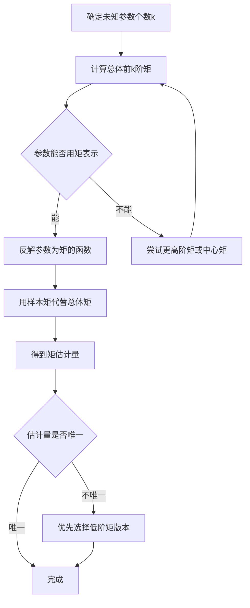
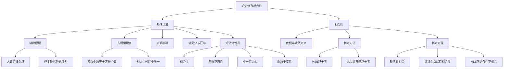
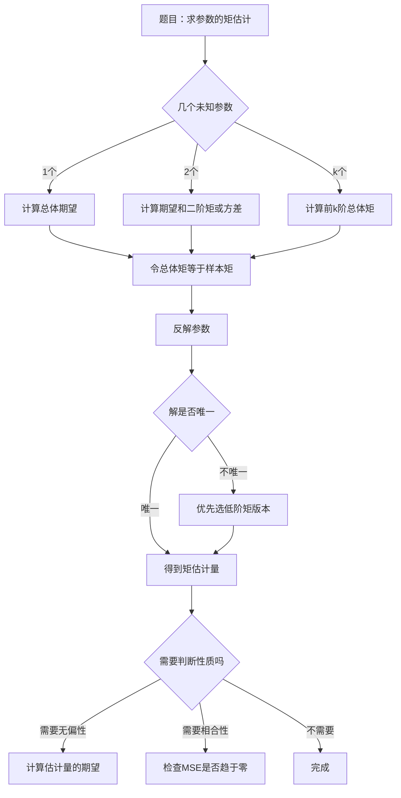
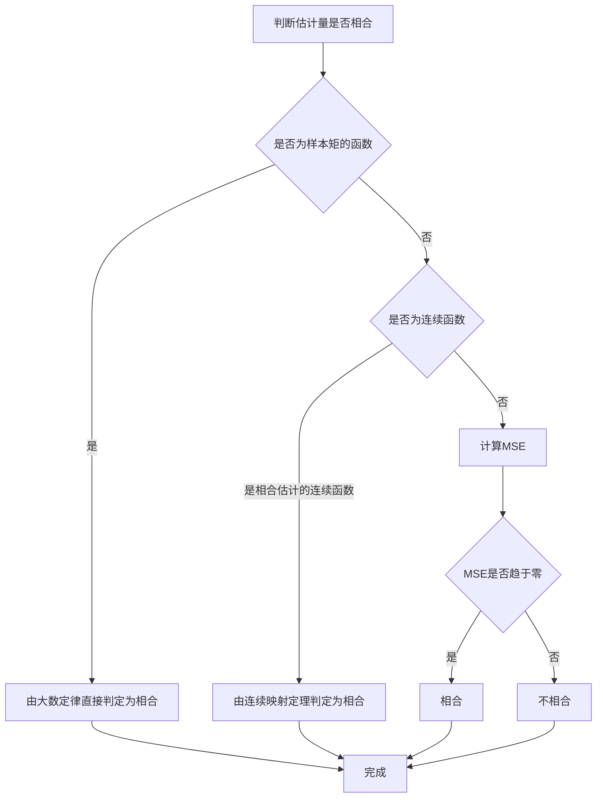

# 6.2 矩估计及相合性

> [!abstract] 本节概览
> 本节深入探讨==矩估计法==的理论基础与求解技巧，以及==相合性==的深入理论与判定方法。§6.1 已介绍了矩估计和相合性的基本概念，本节将从以下方面深入：
> - 矩估计的替换原理及其理论依据（[[#一、矩估计的深入理论|大数定律]]）
> - 矩估计方程组的建立方法与==矩估计不唯一==的情况
> - 常见分布的矩估计汇总与求解技巧
> - 矩估计的渐近性质（[[#四、矩估计的性质|相合性、渐近正态性]]）
> - 相合性的严格理论（[[#五、相合性的深入理论|依概率收敛]]）与判定定理
>
> **逻辑链条**：[[#一、矩估计的深入理论|替换原理]] → [[#二、矩估计的求解步骤与技巧|求解方法]] → [[#三、常见分布的矩估计汇总|分布汇总]] → [[#四、矩估计的性质|矩估计性质]] → [[#五、相合性的深入理论|相合性理论]] → [[#六、相合估计的判定定理|判定定理]] → [[#九、补充理解与易混淆点|误区辨析]]
>
> **前置依赖**：[[6.1 点估计的概念与无偏性|§6.1]]（点估计基本概念）、[[5.3 统计量及其分布|§5.3]]（统计量）、[[5.4 三大抽样分布|§5.4]]（抽样分布）、[[4.3 大数定律|§4.3]]（大数定律）、[[4.4 中心极限定理|§4.4]]（中心极限定理）
>
> **核心主线**：矩估计法的理论基础是替换原理（大数定律保证样本矩收敛到总体矩），其优良性质（相合性、渐近正态性）使矩估计在大样本下表现良好。相合性是估计量的基本要求，是"一致性"的严格数学表述。
>
> **相关笔记**：[[5.3 统计量及其分布]]、[[5.4 三大抽样分布]]、[[4.3 大数定律]]、[[4.4 中心极限定理]]、[[6.1 点估计的概念与无偏性]]

---

## 一、矩估计的深入理论

### 1.1 替换原理的理论依据

§6.1 已经介绍了矩估计的基本思想——"用样本矩代替总体矩"。本节深入探讨这一替换原理的理论根基。

> [!def] 定义 6.2.1 — 替换原理（Replacement Principle）
> 设 $X_1, X_2, \ldots, X_n$ 是来自总体 $X$ 的样本，总体 $X$ 的 $k$ 阶原点矩为
>
> $$
> \mu_k = E(X^k)
> $$
>
> 对应的 $k$ 阶样本原点矩为
>
> $$
> a_k = \frac{1}{n}\sum_{i=1}^{n}X_i^k
> $$
>
> **替换原理**：当 $n \to \infty$ 时，用 $a_k$ 代替 $\mu_k$ 建立方程来求解参数估计量。

替换原理的理论依据是**大数定律**：

> [!thm] 定理 6.2.1 — 替换原理的理论依据（辛钦大数定律）
> 设 $X_1, X_2, \ldots, X_n$ 是来自总体 $X$ 的 i.i.d. 样本，若 $E|X|^k < \infty$，则
>
> $$
> a_k = \frac{1}{n}\sum_{i=1}^{n}X_i^k \xrightarrow{P} \mu_k = E(X^k) \quad (n \to \infty)
> $$
>
> 即样本 $k$ 阶原点矩依概率收敛于总体 $k$ 阶原点矩。

> [!abstract] 证明
> **证明**：
> **第一步：构造新的 i.i.d. 序列**
>
> 令 $Y_i = X_i^k$，$i = 1, 2, \ldots, n$。由于 $X_1, X_2, \ldots, X_n$ i.i.d.，故 $Y_1, Y_2, \ldots, Y_n$ 也是 i.i.d. 的。
>
> **第二步：验证期望存在**
>
> $E(Y_i) = E(X_i^k) = E(X^k) = \mu_k$。由条件 $E|X|^k < \infty$ 知 $E|Y_i| = E|X^k| = E|X|^k < \infty$。
>
> **第三步：应用辛钦大数定律**
>
> 由辛钦大数定律，
>
> $$
> \frac{1}{n}\sum_{i=1}^{n}Y_i \xrightarrow{P} E(Y_1) = \mu_k
> $$
>
> 即 $a_k \xrightarrow{P} \mu_k$。
>
> $\square$

类似地，对于 $k$ 阶中心矩 $b_k = E[(X - \mu)^k]$，对应的样本中心矩为

$$
B_k = \frac{1}{n}\sum_{i=1}^{n}(X_i - \bar{X})^k
$$

同样有 $B_k \xrightarrow{P} b_k$（$n \to \infty$）。

### 1.2 矩估计方程组的建立方法

> [!def] 定义 6.2.2 — 矩估计方程组
> 设总体 $X$ 的分布函数为 $f(x; \theta_1, \theta_2, \ldots, \theta_k)$，含有 $k$ 个未知参数 $(\theta_1, \theta_2, \ldots, \theta_k) \in \Theta$。$X_1, X_2, \ldots, X_n$ 为样本。
>
> **步骤一**：计算总体的前 $k$ 阶矩 $\mu_j = E(X^j)$，$j = 1, 2, \ldots, k$，它们是参数 $\theta_1, \theta_2, \ldots, \theta_k$ 的函数。
>
> **步骤二**：假设前 $k$ 阶矩 $\mu_1, \mu_2, \ldots, \mu_k$ 与参数之间存在函数关系，可以反解出参数：
>
> $$
> \theta_j = \theta_j(\mu_1, \mu_2, \ldots, \mu_k), \quad j = 1, 2, \ldots, k
> $$
>
> **步骤三**：用样本矩 $a_1, a_2, \ldots, a_k$ 代替总体矩 $\mu_1, \mu_2, \ldots, \mu_k$，得到参数的矩估计：
>
> $$
> \hat{\theta}_j = \theta_j(a_1, a_2, \ldots, a_k), \quad j = 1, 2, \ldots, k
> $$
>
> 其中 $a_j = \frac{1}{n}\sum_{i=1}^{n}X_i^j$。

**参数个数与方程个数的关系**：

| 参数个数 | 需要的矩的阶数 | 说明 |
|:---:|:---:|:---|
| $k = 1$ | 1 阶矩（期望） | 一个方程解一个未知数 |
| $k = 2$ | 1 阶矩和 2 阶矩（或期望和方差） | 两个方程解两个未知数 |
| $k$ 个 | 前 $k$ 阶矩 | $k$ 个方程解 $k$ 个未知数 |

### 1.3 矩估计可能不唯一的情况

==矩估计不唯一==是矩估计法的一个重要特点。同一个参数，使用不同阶的矩可以得到不同的矩估计量。

> [!example] 例 6.2.1 — 矩估计不唯一的实例
> 设总体 $X \sim U(0, \theta)$，$\theta > 0$，$X_1, X_2, \ldots, X_n$ 为样本。
>
> **方法一：用一阶矩**
>
> $E(X) = \frac{\theta}{2}$，令 $\frac{\hat{\theta}_1}{2} = \bar{X}$，得 $\hat{\theta}_1 = 2\bar{X}$。
>
> **方法二：用二阶矩**
>
> $E(X^2) = \frac{\theta^2}{3}$，令 $\frac{\hat{\theta}_2^2}{3} = \frac{1}{n}\sum_{i=1}^{n}X_i^2$，得 $\hat{\theta}_2 = \sqrt{\frac{3}{n}\sum_{i=1}^{n}X_i^2}$。
>
> 两个估计量不同：$\hat{\theta}_1 = 2\bar{X} \neq \hat{\theta}_2 = \sqrt{\frac{3}{n}\sum_{i=1}^{n}X_i^2}$（一般而言）。
>
> **处理原则**：当矩估计不唯一时，通常**优先使用低阶矩**，因为低阶矩的方差更小、更稳健。

---

## 二、矩估计的求解步骤与技巧

### 2.1 标准求解步骤

矩估计的标准求解流程如下：

### 2.2 高阶矩的使用技巧

当一阶矩（期望）无法确定所有参数时，需要使用高阶矩。常用技巧：

1. **期望 + 方差组合**：对于两个参数的分布，常用 $E(X)$ 和 $\text{Var}(X) = E(X^2) - [E(X)]^2$ 建立方程组。
2. **直接用原点矩**：计算 $E(X)$ 和 $E(X^2)$，建立两个方程。
3. **中心矩**：有时用中心矩更方便，如 $E[(X - \mu)^2]$ 就是方差。

> [!example] 例 6.2.2 — 指数分布的矩估计
> 设 $X_1, X_2, \ldots, X_n$ 来自指数分布 $f(x; \lambda) = \lambda e^{-\lambda x}$，$x \geq 0$，$\lambda > 0$。求 $\lambda$ 的矩估计。
>
> **解**：
>
> **第一步：计算总体期望**
>
> $$
> E(X) = \int_0^{+\infty} x \cdot \lambda e^{-\lambda x} dx = \frac{1}{\lambda}
> $$
>
> **第二步：用样本矩代替**
>
> $$
> \frac{1}{\hat{\lambda}} = \bar{X} \implies \hat{\lambda} = \frac{1}{\bar{X}}
> $$
>
> **第三步：讨论无偏性**
>
> 由于 $E\left(\frac{1}{\bar{X}}\right) \neq \frac{1}{E(\bar{X})} = \lambda$（由 Jensen 不等式），$\hat{\lambda} = \frac{1}{\bar{X}}$ 是 $\lambda$ 的**有偏估计**，但是渐近无偏的。

> [!example] 例 6.2.3 — 正态分布两参数的矩估计
> 设 $X_1, X_2, \ldots, X_n \sim N(\mu, \sigma^2)$，$\mu$ 和 $\sigma^2$ 均未知。求 $\mu$ 和 $\sigma^2$ 的矩估计。
>
> **解**：
>
> **第一步：计算总体前两阶矩**
>
> $$
> E(X) = \mu
> $$
>
> $$
> E(X^2) = \text{Var}(X) + [E(X)]^2 = \sigma^2 + \mu^2
> $$
>
> **第二步：建立方程组**
>
> $$
> \mu = \bar{X}
> $$
>
> $$
> \sigma^2 + \mu^2 = \frac{1}{n}\sum_{i=1}^{n}X_i^2
> $$
>
> **第三步：求解**
>
> $$
> \hat{\mu} = \bar{X}
> $$
>
> $$
> \hat{\sigma}^2 = \frac{1}{n}\sum_{i=1}^{n}X_i^2 - \bar{X}^2 = \frac{1}{n}\sum_{i=1}^{n}(X_i - \bar{X})^2
> $$
>
> **注意**：$\sigma^2$ 的矩估计为 $\frac{1}{n}\sum_{i=1}^{n}(X_i - \bar{X})^2$，与 MLE 相同，但**不是无偏估计**（无偏的样本方差是 $S^2 = \frac{1}{n-1}\sum_{i=1}^{n}(X_i - \bar{X})^2$）。

---

## 三、常见分布的矩估计汇总

> [!abstract] 常见分布的矩估计一览表
>
> | 分布 | 概率函数 | 参数 | 矩估计 | 备注 |
> |:---|:---|:---:|:---|:---|
> | 正态分布 $N(\mu, \sigma^2)$ | $f(x) = \frac{1}{\sqrt{2\pi}\sigma}e^{-\frac{(x-\mu)^2}{2\sigma^2}}$ | $\mu$ | $\hat{\mu} = \bar{X}$ | 无偏 |
> | | | $\sigma^2$ | $\hat{\sigma}^2 = \frac{1}{n}\sum(X_i - \bar{X})^2$ | 有偏，渐近无偏 |
> | 泊松分布 $P(\lambda)$ | $P(X=k) = \frac{\lambda^k e^{-\lambda}}{k!}$ | $\lambda$ | $\hat{\lambda} = \bar{X}$ | 无偏，与 MLE 相同 |
> | 均匀分布 $U(0, \theta)$ | $f(x) = \frac{1}{\theta}$，$0 < x < \theta$ | $\theta$ | $\hat{\theta} = 2\bar{X}$ | 无偏；MLE 为 $X_{(n)}$ |
> | 均匀分布 $U(a, b)$ | $f(x) = \frac{1}{b-a}$，$a < x < b$ | $a, b$ | $\hat{a} = \bar{X} - \sqrt{3}S_n$，$\hat{b} = \bar{X} + \sqrt{3}S_n$ | |
> | 指数分布 $\text{Exp}(\lambda)$ | $f(x) = \lambda e^{-\lambda x}$，$x \geq 0$ | $\lambda$ | $\hat{\lambda} = \frac{1}{\bar{X}}$ | 有偏 |
> | 二项分布 $B(n, p)$ | $P(X=k) = C_n^k p^k(1-p)^{n-k}$ | $p$ | $\hat{p} = \frac{\bar{X}}{n}$ | 无偏 |
> | Gamma 分布 $\text{Ga}(\alpha, \beta)$ | $f(x) = \frac{\beta^\alpha}{\Gamma(\alpha)}x^{\alpha-1}e^{-\beta x}$ | $\alpha, \beta$ | $\hat{\alpha} = \frac{\bar{X}^2}{S_n^2}$，$\hat{\beta} = \frac{\bar{X}}{S_n^2}$ | |
>
> 其中 $S_n^2 = \frac{1}{n}\sum_{i=1}^{n}(X_i - \bar{X})^2$ 为二阶样本中心矩。

### Gamma 分布矩估计的推导

> [!example] 例 6.2.4 — Gamma 分布的矩估计
> 设 $X_1, X_2, \ldots, X_n$ 来自 Gamma 分布 $\text{Ga}(\alpha, \beta)$，其中 $\alpha > 0$，$\beta > 0$ 为未知参数。求 $\alpha$ 和 $\beta$ 的矩估计。
>
> **解**：
>
> **第一步：计算总体前两阶矩**
>
> $$
> E(X) = \frac{\alpha}{\beta}, \quad E(X^2) = \frac{\alpha(\alpha+1)}{\beta^2}
> $$
>
> 因此
>
> $$
> \text{Var}(X) = E(X^2) - [E(X)]^2 = \frac{\alpha}{\beta^2}
> $$
>
> **第二步：建立方程组**
>
> $$
> \frac{\alpha}{\beta} = \bar{X}
> $$
>
> $$
> \frac{\alpha}{\beta^2} = S_n^2 = \frac{1}{n}\sum_{i=1}^{n}(X_i - \bar{X})^2
> $$
>
> **第三步：求解**
>
> 由第一个方程，$\beta = \frac{\alpha}{\bar{X}}$，代入第二个方程：
>
> $$
> \frac{\alpha}{(\alpha/\bar{X})^2} = S_n^2 \implies \frac{\alpha \bar{X}^2}{\alpha^2} = S_n^2 \implies \alpha = \frac{\bar{X}^2}{S_n^2}
> $$
>
> $$
> \beta = \frac{\bar{X}}{S_n^2}
> $$

---

## 四、矩估计的性质

### 4.1 矩估计的相合性

> [!thm] 定理 6.2.2 — 矩估计的相合性
> 在总体矩存在的条件下，==矩估计量是相合估计量==。
>
> 具体地，若 $\hat{\theta}_n = \theta(a_1, a_2, \ldots, a_k)$ 是参数 $\theta = \theta(\mu_1, \mu_2, \ldots, \mu_k)$ 的矩估计，且 $\theta(\cdot)$ 在 $(\mu_1, \ldots, \mu_k)$ 处连续，则
>
> $$
> \hat{\theta}_n \xrightarrow{P} \theta \quad (n \to \infty)
> $$

> [!abstract] 证明
> **证明**：
> **第一步：样本矩的相合性**
>
> 由辛钦大数定律，$a_j \xrightarrow{P} \mu_j$，$j = 1, 2, \ldots, k$。
>
> **第二步：联合收敛**
>
> 由多元连续映射定理，若 $\theta(\cdot)$ 在 $(\mu_1, \ldots, \mu_k)$ 处连续，则
>
> $$
> \theta(a_1, a_2, \ldots, a_k) \xrightarrow{P} \theta(\mu_1, \mu_2, \ldots, \mu_k)
> $$
>
> 即 $\hat{\theta}_n \xrightarrow{P} \theta$。
>
> $\square$

### 4.2 矩估计的渐近正态性

> [!thm] 定理 6.2.3 — 矩估计的渐近正态性
> 设 $\hat{\theta}_n$ 是参数 $\theta$ 的矩估计，在适当的正则条件下，有
>
> $$
> \sqrt{n}(\hat{\theta}_n - \theta) \xrightarrow{d} N(0, \Sigma)
> $$
>
> 其中 $\Sigma$ 可由 Delta 方法求出。特别地，若 $\hat{\theta}_n = g(\bar{X})$，则
>
> $$
> \sqrt{n}(\hat{\theta}_n - \theta) \xrightarrow{d} N\left(0, [g'(\mu)]^2 \sigma^2\right)
> $$
>
> 其中 $\mu = E(X)$，$\sigma^2 = \text{Var}(X)$。

**理论依据**：由中心极限定理，$\sqrt{n}(\bar{X} - \mu) \xrightarrow{d} N(0, \sigma^2)$，再由 Delta 方法即得上式。

> [!example] 例 6.2.5 — 泊松分布矩估计的渐近正态性
> 设 $X_1, X_2, \ldots, X_n \sim P(\lambda)$，矩估计 $\hat{\lambda} = \bar{X}$。
>
> 由 CLT：
>
> $$
> \sqrt{n}(\bar{X} - \lambda) \xrightarrow{d} N(0, \lambda)
> $$
>
> 即大样本下 $\bar{X} \dot{\sim} N\left(\lambda, \frac{\lambda}{n}\right)$。

### 4.3 矩估计不一定无偏

> [!important] 重点结论
> ==矩估计不一定是无偏估计==。虽然矩估计具有相合性（大样本下收敛到真值），但在有限样本下可能是有偏的。
>
> 典型例子：
> - 指数分布 $\text{Exp}(\lambda)$ 的矩估计 $\hat{\lambda} = 1/\bar{X}$ 是有偏的
> - 正态分布 $N(\mu, \sigma^2)$ 中 $\sigma^2$ 的矩估计 $\frac{1}{n}\sum(X_i - \bar{X})^2$ 是有偏的
> - 均匀分布 $U(0, \theta)$ 的矩估计 $2\bar{X}$ 恰好是无偏的（特例）

### 4.4 矩估计的函数不变性

> [!thm] 定理 6.2.4 — 矩估计的函数不变性
> 若 $\hat{\theta}_1, \hat{\theta}_2, \ldots, \hat{\theta}_k$ 分别是 $\theta_1, \theta_2, \ldots, \theta_k$ 的矩估计，$\eta = g(\theta_1, \theta_2, \ldots, \theta_k)$，则
>
> $$
> \hat{\eta} = g(\hat{\theta}_1, \hat{\theta}_2, \ldots, \hat{\theta}_k)
> $$
>
> 是 $\eta$ 的矩估计（要求 $g$ 为已知函数）。

> [!example] 例 6.2.6 — 函数不变性的应用
> 设 $X_1, X_2, \ldots, X_n \sim N(\mu, \sigma^2)$，$\mu$ 和 $\sigma^2$ 的矩估计分别为 $\hat{\mu} = \bar{X}$，$\hat{\sigma}^2 = \frac{1}{n}\sum(X_i - \bar{X})^2$。
>
> 则标准差 $\sigma$ 的矩估计为 $\hat{\sigma} = \sqrt{\hat{\sigma}^2} = \sqrt{\frac{1}{n}\sum(X_i - \bar{X})^2}$。
>
> 变异系数 $CV = \sigma/\mu$ 的矩估计为 $\widehat{CV} = \hat{\sigma}/\hat{\mu}$。

---

## 五、相合性的深入理论

### 5.1 相合性的严格定义

> [!def] 定义 6.2.3 — 相合估计（严格定义）
> 设 $\hat{\theta}_n = \hat{\theta}_n(X_1, X_2, \ldots, X_n)$ 是参数 $\theta \in \Theta$ 的估计量。若对任意 $\varepsilon > 0$，有
>
> $$
> \lim_{n \to \infty} P(|\hat{\theta}_n - \theta| \geq \varepsilon) = 0
> $$
>
> 即 $\hat{\theta}_n \xrightarrow{P} \theta$（依概率收敛），则称 $\hat{\theta}_n$ 是 $\theta$ 的==相合估计量==（一致估计量）。
>
> **等价表述**：对任意 $\varepsilon > 0$，
>
> $$
> \lim_{n \to \infty} P(|\hat{\theta}_n - \theta| < \varepsilon) = 1
> $$

**直观理解**：相合性意味着当样本量越来越大时，估计量与真值的差距大于任意给定正数 $\varepsilon$ 的概率趋近于零。换句话说，估计量"依概率"趋近于真值。

### 5.2 相合性与无偏性的关系

==相合性与无偏性是两个独立的概念==，它们之间没有蕴含关系：

| 组合 | 是否可能 | 典型例子 |
|:---:|:---:|:---|
| 无偏且相合 | 是 | $\bar{X}$ 估计 $\mu$（正态总体） |
| 有偏且相合 | 是 | $\frac{1}{n}\sum(X_i - \bar{X})^2$ 估计 $\sigma^2$（正态总体） |
| 无偏但不相合 | 是 | 见下文反例 |
| 有偏且不相合 | 是 | 恒等于常数的估计量 |

> [!example] 例 6.2.7 — 无偏但不相合的估计量
> 设 $X_1, X_2, \ldots, X_n$ i.i.d.，$E(X) = \mu$。考虑估计量
>
> $$
> T_n = X_1
> $$
>
> 即无论样本量多大，只用第一个观测值来估计 $\mu$。
>
> - **无偏性**：$E(T_n) = E(X_1) = \mu$，是无偏估计。
> - **相合性**：$P(|T_n - \mu| \geq \varepsilon) = P(|X_1 - \mu| \geq \varepsilon)$，这个概率不随 $n$ 增大而趋于零（只要 $\text{Var}(X) > 0$），因此 $T_n$ **不是相合估计**。
>
> **结论**：无偏性不蕴含相合性。相合性要求估计量能利用越来越多的样本信息。

> [!example] 例 6.2.8 — 有偏但相合的估计量
> 设 $X_1, X_2, \ldots, X_n \sim N(\mu, \sigma^2)$，考虑
>
> $$
> T_n = \frac{1}{n}\sum_{i=1}^{n}(X_i - \bar{X})^2
> $$
>
> - **无偏性**：$E(T_n) = \frac{n-1}{n}\sigma^2 \neq \sigma^2$，是有偏估计。
> - **相合性**：$\lim_{n \to \infty} E(T_n) = \sigma^2$，$\lim_{n \to \infty} \text{Var}(T_n) = 0$，因此 $T_n$ 是相合估计。
>
> **结论**：有偏性不排斥相合性。只要偏差随 $n \to \infty$ 趋于零，且方差也趋于零，有偏估计也可以是相合的。

### 5.3 相合性的判定方法

> [!thm] 定理 6.2.5 — 相合性的充分条件（MSE 判定法）
> 若估计量 $\hat{\theta}_n$ 的均方误差满足
>
> $$
> \lim_{n \to \infty} \text{MSE}(\hat{\theta}_n) = \lim_{n \to \infty} E[(\hat{\theta}_n - \theta)^2] = 0
> $$
>
> 则 $\hat{\theta}_n$ 是 $\theta$ 的相合估计。

> [!abstract] 证明
> **证明**：
> **第一步：利用 Markov 不等式**
>
> 由 Markov 不等式，对任意 $\varepsilon > 0$，
>
> $$
> P(|\hat{\theta}_n - \theta| \geq \varepsilon) \leq \frac{E[(\hat{\theta}_n - \theta)^2]}{\varepsilon^2} = \frac{\text{MSE}(\hat{\theta}_n)}{\varepsilon^2}
> $$
>
> **第二步：取极限**
>
> 由于 $\lim_{n \to \infty} \text{MSE}(\hat{\theta}_n) = 0$，故
>
> $$
> \lim_{n \to \infty} P(|\hat{\theta}_n - \theta| \geq \varepsilon) \leq \lim_{n \to \infty} \frac{\text{MSE}(\hat{\theta}_n)}{\varepsilon^2} = 0
> $$
>
> 因此 $\hat{\theta}_n \xrightarrow{P} \theta$。
>
> $\square$

> [!thm] 定理 6.2.6 — 无偏 + 方差趋于零 $\Rightarrow$ 相合
> 若 $\hat{\theta}_n$ 是 $\theta$ 的无偏估计，且
>
> $$
> \lim_{n \to \infty} \text{Var}(\hat{\theta}_n) = 0
> $$
>
> 则 $\hat{\theta}_n$ 是 $\theta$ 的相合估计。

> [!abstract] 证明
> **证明**：
> **第一步：利用 MSE 分解**
>
> 由于 $\hat{\theta}_n$ 无偏，$\text{MSE}(\hat{\theta}_n) = \text{Var}(\hat{\theta}_n) + 0 = \text{Var}(\hat{\theta}_n)$。
>
> **第二步：取极限**
>
> $$
> \lim_{n \to \infty} \text{MSE}(\hat{\theta}_n) = \lim_{n \to \infty} \text{Var}(\hat{\theta}_n) = 0
> $$
>
> 由定理 6.2.5，$\hat{\theta}_n$ 是相合估计。
>
> $\square$

更一般地，若 $\lim_{n \to \infty} E(\hat{\theta}_n) = \theta$（渐近无偏）且 $\lim_{n \to \infty} \text{Var}(\hat{\theta}_n) = 0$，则 $\hat{\theta}_n$ 是相合估计。这是因为：

$$
\text{MSE}(\hat{\theta}_n) = \text{Var}(\hat{\theta}_n) + [E(\hat{\theta}_n) - \theta]^2 \to 0 + 0 = 0
$$

---

## 六、相合估计的判定定理

### 6.1 基本相合估计

> [!thm] 定理 6.2.7 — 常见相合估计
> 以下估计量都是相应参数的相合估计：
>
> 1. $\bar{X}$ 是 $\mu = E(X)$ 的相合估计（由辛钦大数定律）
> 2. $S_n^2 = \frac{1}{n}\sum_{i=1}^{n}(X_i - \bar{X})^2$ 是 $\sigma^2 = \text{Var}(X)$ 的相合估计
> 3. $S^2 = \frac{1}{n-1}\sum_{i=1}^{n}(X_i - \bar{X})^2$ 是 $\sigma^2 = \text{Var}(X)$ 的相合估计

### 6.2 连续函数的相合性

> [!thm] 定理 6.2.8 — 连续映射定理（相合性版本）
> 设 $\hat{\theta}_{n1}, \hat{\theta}_{n2}, \ldots, \hat{\theta}_{nk}$ 分别是 $\theta_1, \theta_2, \ldots, \theta_k$ 的相合估计，$\eta = g(\theta_1, \theta_2, \ldots, \theta_k)$，其中 $g$ 是连续函数。则
>
> $$
> \hat{\eta}_n = g(\hat{\theta}_{n1}, \hat{\theta}_{n2}, \ldots, \hat{\theta}_{nk})
> $$
>
> 是 $\eta$ 的相合估计。

> [!abstract] 证明
> **证明**：
> **第一步：利用连续性**
>
> 由于 $g$ 连续，对任意 $\varepsilon > 0$，存在 $\delta > 0$，使得当 $|\hat{\theta}_{nj} - \theta_j| < \delta$（$j = 1, \ldots, k$）时，
>
> $$
> |g(\hat{\theta}_{n1}, \ldots, \hat{\theta}_{nk}) - g(\theta_1, \ldots, \theta_k)| < \varepsilon
> $$
>
> **第二步：利用相合性**
>
> 由于每个 $\hat{\theta}_{nj}$ 是 $\theta_j$ 的相合估计，对上述 $\delta > 0$ 和任意 $\nu > 0$，存在 $N$，当 $n \geq N$ 时，
>
> $$
> P(|\hat{\theta}_{nj} - \theta_j| \geq \delta) < \frac{\nu}{k}, \quad j = 1, \ldots, k
> $$
>
> **第三步：利用联合概率**
>
> $$
> P\left(\bigcap_{j=1}^{k}\{|\hat{\theta}_{nj} - \theta_j| < \delta\}\right) = 1 - P\left(\bigcup_{j=1}^{k}\{|\hat{\theta}_{nj} - \theta_j| \geq \delta\}\right)
> $$
>
> $$
> \geq 1 - \sum_{j=1}^{k}P(|\hat{\theta}_{nj} - \theta_j| \geq \delta) > 1 - k \cdot \frac{\nu}{k} = 1 - \nu
> $$
>
> **第四步：得出结论**
>
> 由于 $\bigcap_{j=1}^{k}\{|\hat{\theta}_{nj} - \theta_j| < \delta\} \subset \{|\hat{\eta}_n - \eta| < \varepsilon\}$，
>
> $$
> P(|\hat{\eta}_n - \eta| < \varepsilon) > 1 - \nu
> $$
>
> 由 $\nu$ 的任意性，$\lim_{n \to \infty} P(|\hat{\eta}_n - \eta| < \varepsilon) = 1$。
>
> $\square$

### 6.3 MLE 的相合性

> [!thm] 定理 6.2.9 — MLE 的相合性
> 在正则条件下（分布族满足一定的光滑性和识别性条件），极大似然估计（MLE）是相合估计。
>
> **正则条件**包括：
> 1. 参数空间 $\Theta$ 是紧集（或有内点）
> 2. 似然函数关于参数连续可微
> 3. 真参数 $\theta_0$ 是 $\Theta$ 的内点
> 4. Fisher 信息量 $I(\theta_0) > 0$（正定）
> 5. 似然函数的支撑集不依赖于参数

> [!example] 例 6.2.9 — 均匀分布 MLE 的相合性
> 设 $X_1, X_2, \ldots, X_n$ 来自 $U(0, \theta)$，MLE 为 $\hat{\theta} = X_{(n)}$。
>
> 虽然 $E(X_{(n)}) = \frac{n}{n+1}\theta \neq \theta$（有偏），但
>
> $$
> \lim_{n \to \infty} E(X_{(n)}) = \theta, \quad \lim_{n \to \infty} \text{Var}(X_{(n)}) = 0
> $$
>
> 因此 $X_{(n)}$ 是 $\theta$ 的相合估计。

### 6.4 矩估计不唯一的相合性

> [!example] 例 6.2.10 — 矩估计不唯一时均为相合估计
> 设 $X_1, X_2, \ldots, X_n$ 来自 $U(0, \theta)$。
>
> - $\hat{\theta}_1 = 2\bar{X}$：$E(\hat{\theta}_1) = \theta$，$\text{Var}(\hat{\theta}_1) = \frac{\theta^2}{3n} \to 0$，相合。
> - $\hat{\theta}_2 = \sqrt{\frac{3}{n}\sum X_i^2}$：由大数定律 $\frac{1}{n}\sum X_i^2 \xrightarrow{P} E(X^2) = \frac{\theta^2}{3}$，再由连续映射定理，$\hat{\theta}_2 \xrightarrow{P} \theta$，相合。
>
> **结论**：即使矩估计不唯一，每个版本都是相合估计。但它们的渐近方差可能不同，效率有差异。

---

## 七、知识结构总览

---

## 八、核心思想与解题技巧

### 8.1 矩估计解题流程

### 8.2 相合性判断流程

### 8.3 解题技巧总结

1. **矩估计的核心**：确定参数个数 → 计算对应阶数的总体矩 → 用样本矩替换 → 反解参数。
2. **两个参数的分布**：常用 $E(X) = \mu$ 和 $\text{Var}(X) = \sigma^2$ 建立方程组，比直接用 $E(X)$ 和 $E(X^2)$ 更直观。
3. **相合性判定的优先顺序**：先看是否为样本矩的函数（大数定律）→ 再看是否为相合估计的连续函数 → 最后计算 MSE。
4. **MSE 分解是利器**：$\text{MSE} = \text{Var} + \text{Bias}^2$，分别计算方差和偏差的极限即可。
5. **矩估计不唯一时**：优先使用低阶矩，因为高阶矩受异常值影响更大、方差更大。

---

## 九、补充理解与易混淆点

### 误区一：矩估计和 MLE 一样具有不变性

**来源**：茆诗松《概率论与数理统计》 + 山东理工大学概率论课件 + NumberAnalytics 统计教程 + 原创力文档数理统计课件 + CSDN 宋浩概率论笔记

> [!danger] 误区1："矩估计和极大似然估计一样具有不变性，可以直接代入函数关系"
> ❌ 错误解释：既然 MLE 有不变性（$\widehat{g(\theta)} = g(\hat{\theta}_{MLE})$），矩估计也应该一样，直接把矩估计代入函数即可。
> ✅ 正确解释：矩估计**确实具有函数不变性**——若 $\hat{\theta}$ 是 $\theta$ 的矩估计，则 $g(\hat{\theta})$ 是 $g(\theta)$ 的矩估计。但这里的"不变性"与 MLE 的不变性有本质区别：MLE 的不变性是**精确的**（在有限样本下成立），而矩估计的函数不变性只是"替换原理"的自然延伸，其渐近性质（如渐近方差）需要通过 Delta 方法重新计算，不能直接传递。此外，矩估计的函数不变性并不意味着 $g(\hat{\theta})$ 的渐近方差就是 $g'(\theta)^2 \cdot \text{Var}(\hat{\theta})$，还需要考虑高阶项。

### 误区二：矩估计总是无偏的

**来源**：茆诗松《概率论与数理统计》 + 维基教科书数理统计/点估计 + DataOps School 方法矩估计指南 + NumberAnalytics 统计教程 + bookdown 数理统计讲义

> [!danger] 误区2："矩估计量总是无偏估计量"
> ❌ 错误解释：矩估计用样本矩代替总体矩，而样本矩是总体矩的无偏估计，所以矩估计自然也是无偏的。
> ✅ 正确解释：虽然样本 $k$ 阶原点矩 $a_k = \frac{1}{n}\sum X_i^k$ 是总体 $k$ 阶原点矩 $\mu_k = E(X^k)$ 的**无偏估计**，但矩估计量 $\hat{\theta} = \theta(a_1, \ldots, a_k)$ 是样本矩的**非线性函数**，由 Jensen 不等式，$E[\theta(a_1, \ldots, a_k)] \neq \theta(E(a_1), \ldots, E(a_k)) = \theta(\mu_1, \ldots, \mu_k) = \theta$。例如指数分布的矩估计 $\hat{\lambda} = 1/\bar{X}$ 是有偏的，正态分布中方差的矩估计 $\frac{1}{n}\sum(X_i - \bar{X})^2$ 也是有偏的。

### 误区三：相合估计一定无偏

**来源**：茆诗松《概率论与数理统计》 + Fiveable 统计学习 Consistent Estimator 条目 + Stanford CS109 统计估计讲义 + Rohan Paul ML 面试系列 Bias vs Consistency + CSDN 无偏性与一致性关系讨论

> [!danger] 误区3："相合估计一定是无偏估计"
> ❌ 错误解释：相合性意味着估计量收敛到真值，所以估计量的期望应该等于真值。
> ✅ 正确解释：相合性（依概率收敛）和**无偏性**是两个完全不同的概念。相合性描述的是**大样本**行为（$n \to \infty$），无偏性描述的是**每个固定 $n$** 下的期望。有偏估计完全可以是相合的，只要偏差随 $n \to \infty$ 趋于零。典型例子：正态总体下 $\frac{1}{n}\sum(X_i - \bar{X})^2$ 是 $\sigma^2$ 的有偏但相合估计；均匀分布 $U(0, \theta)$ 的 MLE $X_{(n)}$ 也是有偏但相合的。反之，无偏估计也不一定相合（如 $T_n = X_1$ 估计 $\mu$）。

### 误区四：矩估计总是存在且唯一

**来源**：茆诗松《概率论与数理统计》 + bookdown 数理统计讲义 + NumberAnalytics MOM 统计指南 + 山东理工大学概率论课件 + 原创力文档数理统计课件

> [!danger] 误区4："矩估计总是存在且唯一"
> ❌ 错误解释：只要能写出矩方程，就一定能解出唯一的矩估计。
> ✅ 正确解释：矩估计面临两个问题：**不唯一性**和**可能不存在**。不唯一性：同一个参数用不同阶的矩可能得到不同的估计量（如 $U(0, \theta)$ 用一阶矩得 $2\bar{X}$，用二阶矩得 $\sqrt{\frac{3}{n}\sum X_i^2}$）。不存在性：方程组可能无实数解，或者解不在参数空间内。例如，Cauchy 分布的期望不存在，无法用一阶矩建立方程。处理建议：优先使用低阶矩；当矩估计不唯一时，比较各版本的渐近方差，选择效率更高的。

---

## 十、习题精选

> [!todo] 习题概览
> 共10道习题：6道教材习题 + 4道卡方考研真题。
>
> | 编号 | 来源 | 主题 | 难度 |
> |:---:|:---:|:---|:---:|
> | 习题1 | 教材 | 指数分布矩估计与相合性 | 中 |
> | 习题2 | 教材 | 均匀分布两参数矩估计 | 中 |
> | 习题3 | 教材 | Gamma 分布矩估计与无偏性 | 中高 |
> | 习题4 | 教材 | 矩估计不唯一与比较 | 中高 |
> | 习题5 | 教材 | 相合性证明综合题 | 高 |
> | 习题6 | 教材 | 连续函数相合性应用 | 高 |
> | 习题7 | 2018年上海财经大学808 | Gamma 分布矩估计与MLE综合 | ★★★★ |
> | 习题8 | 2019年武汉大学432 | 正态分布矩估计与有效性 | ★★★ |
> | 习题9 | 2021年大连理工大学432 | 伯努利分布矩估计与有效性 | ★★★ |
> | 习题10 | 2022年武汉大学432 | MLE 与有效性证明 | ★★★★ |

### 教材习题

> [!problem] 习题1
> 设 $X_1, X_2, \ldots, X_n$ 来自指数分布 $\text{Exp}(\lambda)$，$f(x) = \lambda e^{-\lambda x}$，$x \geq 0$。
>
> (1) 求 $\lambda$ 的矩估计。
>
> (2) 证明该矩估计是 $\lambda$ 的相合估计。

> [!faq]- 查看解答
> **解**：
>
> (1) $E(X) = \frac{1}{\lambda}$，令 $\frac{1}{\hat{\lambda}} = \bar{X}$，得 $\hat{\lambda} = \frac{1}{\bar{X}}$。
>
> (2) 由大数定律，$\bar{X} \xrightarrow{P} \frac{1}{\lambda}$。由于 $g(x) = 1/x$ 在 $x = 1/\lambda$ 处连续，由连续映射定理，$\hat{\lambda} = 1/\bar{X} \xrightarrow{P} \lambda$，因此 $\hat{\lambda}$ 是相合估计。

> [!problem] 习题2
> 设 $X_1, X_2, \ldots, X_n$ 来自均匀分布 $U(a, b)$，$a < b$ 均未知。求 $a$ 和 $b$ 的矩估计。

> [!faq]- 查看解答
> **解**：
>
> $$
> E(X) = \frac{a + b}{2}, \quad \text{Var}(X) = \frac{(b-a)^2}{12}
> $$
>
> 令
>
> $$
> \frac{\hat{a} + \hat{b}}{2} = \bar{X}, \quad \frac{(\hat{b} - \hat{a})^2}{12} = S_n^2 = \frac{1}{n}\sum_{i=1}^{n}(X_i - \bar{X})^2
> $$
>
> 由第二个方程，$\hat{b} - \hat{a} = 2\sqrt{3}S_n$。
>
> 结合第一个方程：
>
> $$
> \hat{a} = \bar{X} - \sqrt{3}S_n, \quad \hat{b} = \bar{X} + \sqrt{3}S_n
> $$

> [!problem] 习题3
> 设 $X_1, X_2, \ldots, X_n$ 来自 Gamma 分布 $\text{Ga}(\alpha, \beta)$。
>
> (1) 求 $\alpha$ 和 $\beta$ 的矩估计。
>
> (2) 判断 $\hat{\alpha}$ 和 $\hat{\beta}$ 是否为无偏估计。

> [!faq]- 查看解答
> **解**：
>
> (1) 由三、的推导：
>
> $$
> \hat{\alpha} = \frac{\bar{X}^2}{S_n^2}, \quad \hat{\beta} = \frac{\bar{X}}{S_n^2}
> $$
>
> (2) $\hat{\alpha}$ 和 $\hat{\beta}$ 都是 $\bar{X}$ 和 $S_n^2$ 的**非线性函数**，一般不是无偏估计。它们是渐近无偏且相合的。

> [!problem] 习题4
> 设 $X_1, X_2, \ldots, X_n$ 来自 $U(0, \theta)$。
>
> (1) 分别用一阶矩和二阶矩求 $\theta$ 的矩估计。
>
> (2) 比较两个估计量的渐近方差。

> [!faq]- 查看解答
> **解**：
>
> (1) 一阶矩：$\hat{\theta}_1 = 2\bar{X}$。
>
> 二阶矩：$E(X^2) = \frac{\theta^2}{3}$，令 $\frac{\hat{\theta}_2^2}{3} = \frac{1}{n}\sum X_i^2$，得 $\hat{\theta}_2 = \sqrt{\frac{3}{n}\sum X_i^2}$。
>
> (2) $\text{Var}(\hat{\theta}_1) = 4\text{Var}(\bar{X}) = \frac{4\theta^2}{12n} = \frac{\theta^2}{3n}$。
>
> 由 Delta 方法，$\hat{\theta}_2 = g\left(\frac{1}{n}\sum X_i^2\right)$，其中 $g(t) = \sqrt{3t}$，$g'(t) = \frac{\sqrt{3}}{2\sqrt{t}}$。
>
> 在 $t = \theta^2/3$ 处，$g'(\theta^2/3) = \frac{\sqrt{3}}{2\theta/\sqrt{3}} = \frac{3}{2\theta}$。
>
> $\text{Var}\left(\frac{1}{n}\sum X_i^2\right) = \frac{1}{n}\text{Var}(X^2) = \frac{1}{n}\left[E(X^4) - (E(X^2))^2\right] = \frac{1}{n}\left(\frac{\theta^4}{5} - \frac{\theta^4}{9}\right) = \frac{4\theta^4}{45n}$。
>
> 渐近方差：$\frac{1}{n}\left(\frac{3}{2\theta}\right)^2 \cdot \frac{4\theta^4}{45} = \frac{1}{n} \cdot \frac{9}{4\theta^2} \cdot \frac{4\theta^4}{45} = \frac{\theta^2}{5n}$。
>
> 比较：$\frac{\theta^2}{3n} > \frac{\theta^2}{5n}$，因此二阶矩版本的渐近方差更小。

> [!problem] 习题5
> 设 $X_1, X_2, \ldots, X_n$ 来自总体 $X$，$E(X) = \mu$，$\text{Var}(X) = \sigma^2$。证明：$S^2 = \frac{1}{n-1}\sum_{i=1}^{n}(X_i - \bar{X})^2$ 是 $\sigma^2$ 的相合估计。

> [!faq]- 查看解答
> **解**：
>
> 已知 $E(S^2) = \sigma^2$（无偏），$\text{Var}(S^2) = \frac{2\sigma^4}{n-1}$。
>
> $\lim_{n \to \infty} \text{Var}(S^2) = \lim_{n \to \infty} \frac{2\sigma^4}{n-1} = 0$。
>
> 由定理 6.2.6（无偏 + 方差趋于零），$S^2$ 是 $\sigma^2$ 的相合估计。

> [!problem] 习题6
> 设 $\hat{\theta}_n$ 是 $\theta$ 的相合估计，$g(x)$ 是连续函数。证明 $g(\hat{\theta}_n)$ 是 $g(\theta)$ 的相合估计。

> [!faq]- 查看解答
> **证明**（利用定义）：
>
> 对任意 $\varepsilon > 0$，由 $g$ 在 $\theta$ 处连续，存在 $\delta > 0$，使得 $|x - \theta| < \delta \Rightarrow |g(x) - g(\theta)| < \varepsilon$。
>
> 因此 $\{|\hat{\theta}_n - \theta| < \delta\} \subset \{|g(\hat{\theta}_n) - g(\theta)| < \varepsilon\}$。
>
> $$
> P(|g(\hat{\theta}_n) - g(\theta)| < \varepsilon) \geq P(|\hat{\theta}_n - \theta| < \delta)
> $$
>
> 由于 $\hat{\theta}_n$ 是 $\theta$ 的相合估计，$\lim_{n \to \infty} P(|\hat{\theta}_n - \theta| < \delta) = 1$。
>
> 因此 $\lim_{n \to \infty} P(|g(\hat{\theta}_n) - g(\theta)| < \varepsilon) = 1$。

### 卡方考研真题

> [!problem] 习题7（2018年上海财经大学808）
> 设 $X_1, X_2, \ldots, X_n$ 独立同分布，密度函数为 $f(x) = \omega^2 x e^{-\omega x}$，$x > 0$。
>
> (1) 求 $\omega$ 的矩估计。
>
> (2) 求 $\omega$ 的最大似然估计。
>
> (3) 求 $\omega$ 的 Fisher 信息量。
>
> (4) $\omega$ 的 MLE 是否无偏？若有偏则是否为相合估计。

> [!faq]- 查看解答
> **解**：
>
> (1) $E(X) = \int_0^{+\infty} x \cdot \omega^2 x e^{-\omega x} dx = \omega^2 \cdot \frac{\Gamma(3)}{\omega^3} = \frac{2}{\omega}$。
>
> 令 $\frac{2}{\hat{\omega}} = \bar{X}$，得 $\hat{\omega}_{MoM} = \frac{2}{\bar{X}}$。
>
> (2) 似然函数 $L(\omega) = \omega^{2n}\left(\prod_{i=1}^{n}x_i\right) e^{-\omega\sum_{i=1}^{n}x_i}$。
>
> $\ln L = 2n\ln\omega + \sum_{i=1}^{n}\ln x_i - \omega\sum_{i=1}^{n}x_i$。
>
> $\frac{d\ln L}{d\omega} = \frac{2n}{\omega} - \sum_{i=1}^{n}x_i = 0$，解得 $\hat{\omega}_{MLE} = \frac{2n}{\sum_{i=1}^{n}X_i} = \frac{2}{\bar{X}}$。
>
> (3) $\frac{\partial}{\partial\omega}\ln f(x;\omega) = \frac{2}{\omega} - x$，$\frac{\partial^2}{\partial\omega^2}\ln f(x;\omega) = -\frac{2}{\omega^2}$。
>
> $I(\omega) = -E\left(-\frac{2}{\omega^2}\right) = \frac{2}{\omega^2}$。
>
> (4) $X_1, \ldots, X_n \sim \text{Ga}(2, \omega)$，由 Gamma 分布可加性，$\sum X_i \sim \text{Ga}(2n, \omega)$。
>
> $E(\hat{\omega}_{MLE}) = 2n \cdot E\left(\frac{1}{\sum X_i}\right) = \frac{2n\omega}{2n-1} \neq \omega$，**有偏**。
>
> $\lim_{n\to\infty} E(\hat{\omega}_{MLE}) = \omega$，$\lim_{n\to\infty}\text{Var}(\hat{\omega}_{MLE}) = 0$，因此是**相合估计**。

> [!problem] 习题8（2019年武汉大学432）
> $X_1, \ldots, X_n$ 独立同分布于 $X \sim N(\mu, \sigma^2)$。
>
> (1) 求 $\sigma^2$ 的矩估计，是否为有效估计？
>
> (2) $S^2 = \frac{1}{n-1}\sum_{i=1}^{n}(X_i - \bar{X})^2$ 是否为有效估计？

> [!faq]- 查看解答
> **解**：
>
> (1) $E(X) = \mu$，$E(X^2) = \mu^2 + \sigma^2$。
>
> $\hat{\mu} = \bar{X}$，$\hat{\sigma}^2 = \frac{1}{n}\sum_{i=1}^{n}X_i^2 - \bar{X}^2 = \frac{1}{n}\sum_{i=1}^{n}(X_i - \bar{X})^2$。
>
> 由于 $\frac{n\hat{\sigma}^2}{\sigma^2} = \frac{\sum(X_i - \bar{X})^2}{\sigma^2} \sim \chi^2(n-1)$，
>
> $\text{Var}(\hat{\sigma}^2) = \frac{\sigma^4}{n^2}\text{Var}(\chi^2(n-1)) = \frac{2(n-1)\sigma^4}{n^2}$。
>
> C-R 下界：$I(\sigma^2) = \frac{1}{2\sigma^4}$，$\frac{1}{nI(\sigma^2)} = \frac{2\sigma^4}{n}$。
>
> $\frac{2(n-1)}{n^2} \neq \frac{2}{n}$，因此**不是有效估计**。
>
> (2) $\text{Var}(S^2) = \frac{2\sigma^4}{n-1} > \frac{2\sigma^4}{n}$，也**不是有效估计**。

> [!problem] 习题9（2021年大连理工大学432）
> 设总体服从两点分布 $P(X = x) = \omega^x(1-\omega)^{1-x}$，$x = 0, 1$。$X_1, X_2, \ldots, X_n$ 为样本。
>
> (1) 证明 $\omega$ 的矩估计统计量为有效估计。

> [!faq]- 查看解答
> **证明**：
>
> **第一步：求矩估计**
>
> $E(X) = \omega$，矩估计 $\hat{\omega} = \bar{X}$。
>
> **第二步：验证无偏性**
>
> $E(\hat{\omega}) = E(\bar{X}) = \omega$，无偏。
>
> **第三步：计算方差**
>
> $\text{Var}(\hat{\omega}) = \frac{\text{Var}(X)}{n} = \frac{\omega(1-\omega)}{n}$。
>
> **第四步：计算 Fisher 信息量**
>
> $\ln p(x; \omega) = x\ln\omega + (1-x)\ln(1-\omega)$
>
> $\frac{\partial^2}{\partial\omega^2}\ln p(x;\omega) = -\frac{x}{\omega^2} - \frac{1-x}{(1-\omega)^2}$
>
> $I(\omega) = -E\left(-\frac{X}{\omega^2} - \frac{1-X}{(1-\omega)^2}\right) = \frac{1}{\omega} + \frac{1}{1-\omega} = \frac{1}{\omega(1-\omega)}$
>
> **第五步：比较**
>
> C-R 下界：$\frac{1}{nI(\omega)} = \frac{\omega(1-\omega)}{n} = \text{Var}(\hat{\omega})$。
>
> 方差等于 C-R 下界，因此 $\hat{\omega} = \bar{X}$ 是 $\omega$ 的**有效估计**。
>
> $\square$

> [!problem] 习题10（2022年武汉大学432）
> $f(x) = \omega x^{\omega - 1}$，$0 < x < 1$，$g(\omega) = \frac{1}{\omega}$。求 $g(\omega)$ 的最大似然估计 $\hat{g}$，并证明其为有效估计。

> [!faq]- 查看解答
> **解**：
>
> **第一步：求 MLE**
>
> $L(\omega) = \omega^n \prod_{i=1}^{n}x_i^{\omega - 1}$，$\ln L = n\ln\omega + (\omega - 1)\sum_{i=1}^{n}\ln x_i$。
>
> $\frac{d\ln L}{d\omega} = \frac{n}{\omega} + \sum_{i=1}^{n}\ln x_i = 0$，解得 $\hat{\omega}_{MLE} = -\frac{n}{\sum_{i=1}^{n}\ln X_i}$。
>
> 由 MLE 不变性，$\hat{g} = \frac{1}{\hat{\omega}_{MLE}} = -\frac{1}{n}\sum_{i=1}^{n}\ln X_i$。
>
> **第二步：验证无偏性**
>
> 令 $Y_i = -\ln X_i$，则 $Y_i \sim \text{Exp}(\omega)$，$E(Y_i) = \frac{1}{\omega} = g(\omega)$。
>
> $E(\hat{g}) = E(\bar{Y}) = \frac{1}{\omega} = g(\omega)$，无偏。
>
> **第三步：计算方差与 C-R 下界**
>
> $\text{Var}(\hat{g}) = \frac{\text{Var}(Y_1)}{n} = \frac{1/\omega^2}{n} = \frac{1}{n\omega^2}$。
>
> 得分函数关于 $g = 1/\omega$：
>
> $S(g) = \frac{\partial \ln L}{\partial g} = n\omega^2\left[\hat{g} - g\right]$
>
> 得分函数是估计量和参数的线性组合，由 C-R 不等式等号成立的充要条件，$\hat{g}$ 达到了 C-R 下界，是**有效估计**。
>
> $\square$

---

## 十一、教材原文

#学习/概率论与统计/第六章 参数估计/矩估计
