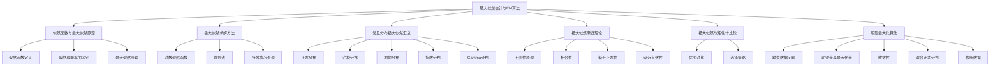
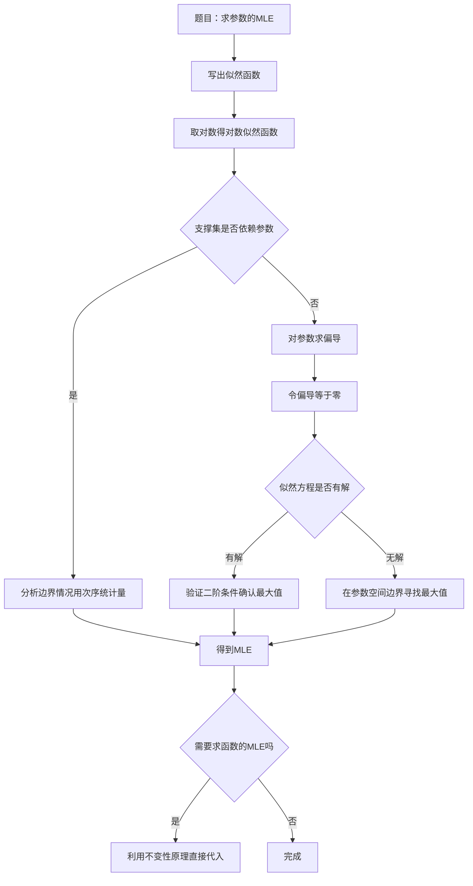
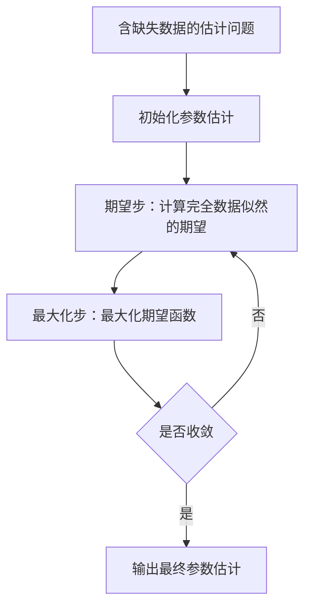

# 6.3 最大似然估计与EM算法

> [!abstract] 本节概览
> 本节在[[6.1 点估计的概念与无偏性|§6.1]]已介绍的MLE基本定义基础上，深入探讨==最大似然估计==的理论性质与高级应用。核心内容包括：
> - 似然函数的深入理解与最大似然原理（[[#一、似然函数与最大似然原理|似然 vs 概率]]）
> - MLE的求解方法与常见分布汇总（[[#二、MLE的求解方法|对数似然]]、[[#三、常见分布的MLE汇总|分布汇总]]）
> - ==MLE的渐近理论==：不变性原理、相合性、渐近正态性、有效估计（[[#四、MLE的性质|渐近理论]]）
> - MLE与矩估计的系统比较（[[#五、MLE与矩估计的比较|比较分析]]）
> - ==EM算法==的思想与应用（[[#六、EM算法的思想|E步M步]]、[[#七、EM算法的应用|混合模型]]）
>
> **逻辑链条**：[[#一、似然函数与最大似然原理|似然原理]] → [[#二、MLE的求解方法|求解方法]] → [[#三、常见分布的MLE汇总|分布汇总]] → [[#四、MLE的性质|渐近理论]] → [[#五、MLE与矩估计的比较|方法比较]] → [[#六、EM算法的思想|EM思想]] → [[#七、EM算法的应用|EM应用]]
>
> **前置依赖**：[[6.1 点估计的概念与无偏性|§6.1]]（MLE基本定义、Fisher信息量、C-R下界）、[[6.2 矩估计及相合性|§6.2]]（矩估计方法、相合性理论）、[[5.5 充分统计量|§5.5]]（充分统计量）
>
> **核心主线**：MLE是频率学派最重要的估计方法，其核心优势在于渐近有效性——在大样本下达到C-R下界。EM算法将复杂的MLE问题分解为E步（期望）和M步（最大化），是处理含缺失数据模型的通用工具。
>
> **相关笔记**：[[6.1 点估计的概念与无偏性]]、[[6.2 矩估计及相合性]]、[[5.5 充分统计量]]、[[5.4 三大抽样分布]]、[[4.3 大数定律]]、[[4.4 中心极限定理]]

---

## 一、似然函数与最大似然原理

### 似然函数的定义

§6.1 已给出了似然函数的基本定义。本节从更深层次理解似然函数的本质。

> [!def] 定义 6.3.1 — 似然函数（深入）
> 设 $X_1, X_2, \ldots, X_n$ 是来自总体 $f(x;\theta)$ 的样本。
>
> - **离散总体**：设 $P_\theta(X = x) = p(x;\theta)$，则似然函数为
>
> $$
> L(\theta) = \prod_{i=1}^{n}p(x_i;\theta)
> $$
>
> - **连续总体**：设概率密度为 $f(x;\theta)$，则似然函数为
>
> $$
> L(\theta) = \prod_{i=1}^{n}f(x_i;\theta)
> $$
>
> 似然函数 $L(\theta)$ 是**在样本观测值已给定的条件下，关于参数 $\theta$ 的函数**，它衡量了在参数取值为 $\theta$ 时，观测到当前样本的"可能性"。

### 似然与概率的本质区别

==似然与概率是两个不同的概念==，虽然它们的数学表达式相同，但视角完全不同：

| 维度 | 概率 $P(X \mid \theta)$ | 似然 $L(\theta \mid X)$ |
|:---:|:---|:---|
| **视角** | 参数 $\theta$ 固定，$X$ 变化 | 样本 $X$ 固定，$\theta$ 变化 |
| **变量** | 随机变量 $X$ | 未知参数 $\theta$ |
| **含义** | 在参数确定下，数据出现的可能性 | 在数据确定下，参数取值的合理性 |
| **性质** | 关于 $X$ 求和（或积分）为 1 | 关于 $\theta$ 求和（或积分）**不一定**为 1 |
| **用途** | 预测、推断 | 参数估计 |

**直观类比**：想象一把锁（参数 $\theta$）和一把钥匙（数据 $X$）。概率问的是"已知这把锁，随机选一把钥匙能打开的概率是多少"；似然问的是"已知这把钥匙能打开锁，哪把锁最可能是原配的"。

### 最大似然原理

> [!def] 定义 6.3.2 — 最大似然原理
> **最大似然原理**（Maximum Likelihood Principle）的核心思想是：
>
> 在所有可能的参数值中，选择使当前观测样本出现概率（似然）最大的那个参数值作为估计。
>
> 即寻找 $\hat{\theta}$ 使得
>
> $$
> L(\hat{\theta}) = \max_{\theta \in \Theta} L(\theta)
> $$

**最大似然原理的哲学基础**：如果某个参数值使得已经发生的事件看起来最"自然"（概率最大），那么这个参数值就是最可信的估计。这是一种"结果导向"的推断哲学——既然事件已经发生，我们就应该选择使该事件最有可能发生的参数。

> [!example] 例 6.3.1 — 最大似然原理的直观理解
> 一枚硬币，抛 10 次，出现 7 次正面、3 次反面。设正面概率为 $p$。
>
> 似然函数：
>
> $$
> L(p) = \binom{10}{7}p^7(1-p)^3
> $$
>
> 取对数：$\ln L(p) = \ln\binom{10}{7} + 7\ln p + 3\ln(1-p)$
>
> 对 $p$ 求导：$\frac{d\ln L}{dp} = \frac{7}{p} - \frac{3}{1-p} = 0$
>
> 解得 $\hat{p} = 0.7$。
>
> **直观理解**：观测到 70% 的正面，最大似然原理告诉我们，最合理的估计就是 $p = 0.7$。这符合我们的直觉——"看到什么就估计什么"。

---

## 二、MLE的求解方法

### 对数似然函数

由于似然函数是 $n$ 个因子的乘积，直接处理不方便。利用 $\ln$ 的严格单调递增性，取对数后最大值点不变：

$$
\ln L(\theta) = \sum_{i=1}^{n}\ln f(x_i;\theta)
$$

对数似然函数将**乘积化为求和**，极大简化了求导和计算。

### 求导法

**一元参数**：令 $\frac{d}{d\theta}\ln L(\theta) = 0$，解出 $\hat{\theta}$。

**多元参数** $\theta = (\theta_1, \ldots, \theta_k)$：解似然方程组

$$
\frac{\partial}{\partial \theta_j}\ln L(\theta_1, \ldots, \theta_k) = 0, \quad j = 1, 2, \ldots, k
$$

### 需要注意的特殊情况

并非所有MLE都能通过求导得到。以下情况需要特殊处理：

1. **支撑集依赖于参数**（如均匀分布）：似然函数在参数边界处取最大值，需用次序统计量分析
2. **多峰似然函数**：似然方程可能有多个解，需比较各驻点的似然值
3. **参数空间有界**：似然方程的解可能不在参数空间内，需在边界上寻找最大值

> [!example] 例 6.3.2 — 泊松分布的MLE（一元参数）
> 设 $X_1, X_2, \ldots, X_n \sim P(\lambda)$，求 $\lambda$ 的MLE。
>
> **解**：
>
> **第一步：写出似然函数**
>
> $$
> L(\lambda) = \prod_{i=1}^{n}\frac{\lambda^{x_i}e^{-\lambda}}{x_i!} = \frac{\lambda^{\sum x_i}e^{-n\lambda}}{\prod x_i!}
> $$
>
> **第二步：取对数**
>
> $$
> \ln L(\lambda) = \left(\sum_{i=1}^{n}x_i\right)\ln\lambda - n\lambda - \sum_{i=1}^{n}\ln(x_i!)
> $$
>
> **第三步：求导并令其为零**
>
> $$
> \frac{d\ln L}{d\lambda} = \frac{\sum x_i}{\lambda} - n = 0
> $$
>
> **第四步：求解**
>
> $$
> \hat{\lambda}_{MLE} = \frac{1}{n}\sum_{i=1}^{n}x_i = \bar{x}
> $$
>
> **第五步：验证二阶条件**
>
> $$
> \frac{d^2\ln L}{d\lambda^2} = -\frac{\sum x_i}{\lambda^2} < 0
> $$
>
> 二阶导恒为负，确认是最大值点。
>
> 因此 $\hat{\lambda}_{MLE} = \bar{X}$，与矩估计一致。

> [!example] 例 6.3.3 — 正态分布两参数的MLE（多元参数）
> 设 $X_1, X_2, \ldots, X_n \sim N(\mu, \sigma^2)$，$\mu$ 和 $\sigma^2$ 均未知。§6.1 已给出基本求解过程，此处从多元参数角度深入分析。
>
> **解**：
>
> 对数似然函数：
>
> $$
> \ln L(\mu, \sigma^2) = -\frac{n}{2}\ln(2\pi) - \frac{n}{2}\ln\sigma^2 - \frac{1}{2\sigma^2}\sum_{i=1}^{n}(x_i - \mu)^2
> $$
>
> **似然方程组**：
>
> $$
> \frac{\partial \ln L}{\partial \mu} = \frac{1}{\sigma^2}\sum_{i=1}^{n}(x_i - \mu) = 0
> $$
>
> $$
> \frac{\partial \ln L}{\partial \sigma^2} = -\frac{n}{2\sigma^2} + \frac{1}{2\sigma^4}\sum_{i=1}^{n}(x_i - \mu)^2 = 0
> $$
>
> **求解**：
>
> 由第一个方程：$\hat{\mu} = \bar{x}$
>
> 代入第二个方程：$\hat{\sigma}^2 = \frac{1}{n}\sum_{i=1}^{n}(x_i - \bar{x})^2$
>
> **注意**：$\sigma^2$ 的 MLE 是 $\frac{1}{n}\sum(X_i - \bar{X})^2$，分母为 $n$ 而非 $n-1$。这是有偏估计，$E(\hat{\sigma}^2) = \frac{n-1}{n}\sigma^2$。

---

## 三、常见分布的MLE汇总

> [!abstract] 常见分布的MLE一览表
>
> | 分布 | 概率函数 | 参数 | MLE | 与矩估计的关系 |
> |:---|:---|:---:|:---|:---|
> | 正态 $N(\mu, \sigma^2)$ | $f(x) = \frac{1}{\sqrt{2\pi}\sigma}e^{-\frac{(x-\mu)^2}{2\sigma^2}}$ | $\mu$ | $\hat{\mu} = \bar{X}$ | 相同 |
> | | | $\sigma^2$ | $\hat{\sigma}^2 = \frac{1}{n}\sum(X_i - \bar{X})^2$ | 相同 |
> | 泊松 $P(\lambda)$ | $P(X=k) = \frac{\lambda^k e^{-\lambda}}{k!}$ | $\lambda$ | $\hat{\lambda} = \bar{X}$ | 相同 |
> | 均匀 $U(0, \theta)$ | $f(x) = \frac{1}{\theta}$，$0 < x < \theta$ | $\theta$ | $\hat{\theta} = X_{(n)}$ | **不同**（矩法为 $2\bar{X}$） |
> | 指数 $\text{Exp}(\lambda)$ | $f(x) = \lambda e^{-\lambda x}$，$x \geq 0$ | $\lambda$ | $\hat{\lambda} = \frac{1}{\bar{X}}$ | 相同 |
> | 二项 $B(n, p)$ | $P(X=k) = C_n^k p^k(1-p)^{n-k}$ | $p$ | $\hat{p} = \frac{\bar{X}}{n}$ | 相同 |
> | Gamma $\text{Ga}(\alpha, \beta)$ | $f(x) = \frac{\beta^\alpha}{\Gamma(\alpha)}x^{\alpha-1}e^{-\beta x}$ | $\alpha, \beta$ | 需数值求解 | 不同 |

### Gamma 分布 MLE 的推导

> [!example] 例 6.3.4 — Gamma 分布的MLE
> 设 $X_1, X_2, \ldots, X_n$ 来自 Gamma 分布 $\text{Ga}(\alpha, \beta)$，其中 $\alpha > 0$，$\beta > 0$ 为未知参数。求 $\alpha$ 和 $\beta$ 的MLE。
>
> **解**：
>
> **第一步：写出对数似然函数**
>
> $$
> \ln L(\alpha, \beta) = n\alpha\ln\beta - n\ln\Gamma(\alpha) + (\alpha - 1)\sum_{i=1}^{n}\ln x_i - \beta\sum_{i=1}^{n}x_i
> $$
>
> **第二步：建立似然方程组**
>
> $$
> \frac{\partial \ln L}{\partial \alpha} = n\ln\beta - n\psi(\alpha) + \sum_{i=1}^{n}\ln x_i = 0
> $$
>
> $$
> \frac{\partial \ln L}{\partial \beta} = \frac{n\alpha}{\beta} - \sum_{i=1}^{n}x_i = 0
> $$
>
> 其中 $\psi(\alpha) = \frac{d}{d\alpha}\ln\Gamma(\alpha)$ 是 digamma 函数。
>
> **第三步：求解**
>
> 由第二个方程：$\hat{\beta} = \frac{\hat{\alpha}}{\bar{X}}$
>
> 代入第一个方程：
>
> $$
> n\ln\frac{\hat{\alpha}}{\bar{X}} - n\psi(\hat{\alpha}) + \sum_{i=1}^{n}\ln x_i = 0
> $$
>
> $$
> \ln\hat{\alpha} - \psi(\hat{\alpha}) = \ln\bar{X} - \frac{1}{n}\sum_{i=1}^{n}\ln x_i
> $$
>
> 这个方程**没有解析解**，需要通过数值方法（如牛顿迭代法）求解 $\hat{\alpha}$，再代入得到 $\hat{\beta}$。
>
> **与矩估计对比**：矩估计有解析解 $\hat{\alpha}_{MoM} = \bar{X}^2/S_n^2$，$\hat{\beta}_{MoM} = \bar{X}/S_n^2$，计算更简便，但效率不如MLE。

> [!example] 例 6.3.5 — 均匀分布 $U(a, b)$ 的MLE
> 设 $X_1, X_2, \ldots, X_n$ 来自均匀分布 $U(a, b)$，$a < b$ 均未知。求 $a$ 和 $b$ 的MLE。
>
> **解**：
>
> 似然函数：
>
> $$
> L(a, b) = \frac{1}{(b-a)^n} \cdot I_{\{a \leq x_{(1)},\, x_{(n)} \leq b\}}
> $$
>
> 其中 $x_{(1)} = \min\{x_1, \ldots, x_n\}$，$x_{(n)} = \max\{x_1, \ldots, x_n\}$。
>
> 要使 $L(a, b)$ 最大，需要：
> 1. 指示函数非零：$a \leq x_{(1)}$ 且 $b \geq x_{(n)}$
> 2. 分母 $(b-a)^n$ 尽可能小：$b - a$ 尽可能小
>
> 因此取 $a = x_{(1)}$，$b = x_{(n)}$，即
>
> $$
> \hat{a}_{MLE} = X_{(1)}, \quad \hat{b}_{MLE} = X_{(n)}
> $$
>
> **注意**：均匀分布的MLE不能用求导法，因为似然函数在支撑集边界处不连续。这是支撑集依赖于参数的典型情形。

---

## 四、MLE的性质（渐近理论）

本节是§6.3的核心理论部分，深入讨论MLE的优良统计性质。

### 不变性原理

> [!thm] 定理 6.3.1 — MLE的不变性原理
> 若 $\hat{\theta}$ 是 $\theta$ 的极大似然估计，$g(\theta)$ 是参数 $\theta$ 的某个函数（$g$ 为单值函数），则 $g(\theta)$ 的极大似然估计为
>
> $$
> \widehat{g(\theta)} = g(\hat{\theta})
> $$
>
> 即==MLE的函数仍然是MLE==。

> [!abstract] 证明
> **证明**：
> **第一步：利用最大值的传递性**
>
> 设 $\hat{\theta}$ 使 $L(\theta)$ 达到最大，即 $L(\hat{\theta}) \geq L(\theta)$ 对一切 $\theta \in \Theta$ 成立。
>
> **第二步：考虑参数变换**
>
> 令 $\eta = g(\theta)$。若 $g$ 是一一映射（单值且可逆），则 $\theta = g^{-1}(\eta)$，似然函数可以重新参数化为
>
> $$
> L^*(\eta) = L(g^{-1}(\eta))
> $$
>
> **第三步：最大值点的对应**
>
> 由于 $g$ 是单值函数，$\hat{\eta} = g(\hat{\theta})$ 使 $L^*(\eta)$ 达到最大：
>
> $$
> L^*(\hat{\eta}) = L(g^{-1}(g(\hat{\theta}))) = L(\hat{\theta}) \geq L(\theta) = L^*(\eta)
> $$
>
> 对一切 $\eta = g(\theta)$ 成立。
>
> $\square$

**不变性原理的重要意义**：求 $g(\theta)$ 的 MLE 时，不需要重新求解优化问题，只需将 $\hat{\theta}_{MLE}$ 代入 $g$ 即可。例如，正态分布 $N(\mu, \sigma^2)$ 中标准差 $\sigma$ 的 MLE 为 $\hat{\sigma} = \sqrt{\hat{\sigma}^2} = \sqrt{\frac{1}{n}\sum(X_i - \bar{X})^2}$。

### 极大似然估计的相合性

> [!thm] 定理 6.3.2 — MLE的相合性
> 在正则条件下，MLE是==相合估计量==，即
>
> $$
> \hat{\theta}_{MLE} \xrightarrow{P} \theta_0 \quad (n \to \infty)
> $$
>
> 其中 $\theta_0$ 为参数真值。
>
> **正则条件**包括：
> 1. 参数空间 $\Theta$ 是紧集（或有内点）
> 2. 似然函数关于参数连续可微
> 3. 真参数 $\theta_0$ 是 $\Theta$ 的内点
> 4. Fisher 信息量 $I(\theta_0) > 0$（正定）
> 5. 似然函数的支撑集不依赖于参数
> 6. 可以在期望和求导之间交换次序

**直观理解**：随着样本量增大，似然函数在真参数附近越来越"尖锐"，最大值点越来越接近真值。

### 渐近正态性

> [!thm] 定理 6.3.3 — MLE的渐近正态性
> 在正则条件下，MLE满足
>
> $$
> \sqrt{n}(\hat{\theta}_{MLE} - \theta_0) \xrightarrow{d} N\left(0, \frac{1}{I(\theta_0)}\right)
> $$
>
> 即大样本下
>
> $$
> \hat{\theta}_{MLE} \dot{\sim} N\left(\theta_0, \frac{1}{nI(\theta_0)}\right)
> $$
>
> 其中 $I(\theta_0)$ 是单个观测值的==Fisher信息量==。

> [!abstract] 证明（概要）
> **证明**：
> **第一步：对数似然函数的Taylor展开**
>
> 在 $\theta_0$ 处对得分函数（score function）进行二阶 Taylor 展开：
>
> $$
> S(\hat{\theta}) = S(\theta_0) + S'(\theta_0)(\hat{\theta} - \theta_0) + \frac{1}{2}S''(\theta^*)(\hat{\theta} - \theta_0)^2
> $$
>
> 其中 $\theta^*$ 介于 $\theta_0$ 和 $\hat{\theta}$ 之间。
>
> **第二步：利用MLE的一阶条件**
>
> 由于 $\hat{\theta}$ 是MLE，$S(\hat{\theta}) = 0$。忽略高阶项：
>
> $$
> 0 \approx S(\theta_0) + S'(\theta_0)(\hat{\theta} - \theta_0)
> $$
>
> **第三步：大数定律和中心极限定理**
>
> 由大数定律：$\frac{1}{n}S'(\theta_0) \xrightarrow{P} -I(\theta_0)$
>
> 由中心极限定理：$\frac{1}{\sqrt{n}}S(\theta_0) \xrightarrow{d} N(0, I(\theta_0))$
>
> **第四步：Slutsky定理**
>
> $$
> \sqrt{n}(\hat{\theta} - \theta_0) \approx \left[-\frac{1}{n}S'(\theta_0)\right]^{-1} \cdot \frac{1}{\sqrt{n}}S(\theta_0) \xrightarrow{d} N\left(0, \frac{1}{I(\theta_0)}\right)
> $$
>
> $\square$

**渐近正态性的重要推论**：

1. **MLE的渐近方差达到C-R下界**：$\frac{1}{nI(\theta_0)}$ 正是C-R下界，说明MLE在大样本下是渐近有效的
2. **可用于构造近似置信区间**：$\hat{\theta} \pm z_{\alpha/2}/\sqrt{nI(\hat{\theta})}$
3. **可用于假设检验**：似然比检验、Wald检验、Score检验

### 极大似然与有效估计

> [!thm] 定理 6.3.4 — MLE达到渐近有效性的条件
> 在正则条件下，MLE是==渐近有效估计==，即
>
> $$
> \lim_{n \to \infty} n \cdot \text{Var}(\hat{\theta}_{MLE}) = \frac{1}{I(\theta_0)}
> $$
>
> 这意味着MLE的渐近方差达到了C-R下界。

**有限样本下的有效估计**：MLE在有限样本下不一定达到C-R下界。当且仅当似然方程可以表示为估计量的线性函数时，MLE才是有限样本下的有效估计。

> [!example] 例 6.3.6 — 正态总体MLE的渐近有效性
> 设 $X_1, X_2, \ldots, X_n \sim N(\mu, \sigma^2)$，$\sigma^2$ 已知。
>
> $\mu$ 的 MLE 为 $\hat{\mu} = \bar{X}$。
>
> Fisher 信息量：$I(\mu) = \frac{1}{\sigma^2}$。
>
> C-R 下界：$\frac{1}{nI(\mu)} = \frac{\sigma^2}{n}$。
>
> $\text{Var}(\bar{X}) = \frac{\sigma^2}{n} = \frac{1}{nI(\mu)}$。
>
> 方差恰好等于 C-R 下界，因此 $\bar{X}$ 不仅渐近有效，在有限样本下就是有效估计。
>
> 对于 $\sigma^2$ 的 MLE $\hat{\sigma}^2 = \frac{1}{n}\sum(X_i - \bar{X})^2$：
>
> $\text{Var}(\hat{\sigma}^2) = \frac{2(n-1)\sigma^4}{n^2}$，C-R 下界为 $\frac{2\sigma^4}{n}$。
>
> $\frac{2(n-1)}{n^2} < \frac{2}{n}$，所以 $\hat{\sigma}^2$ 的方差**小于** C-R 下界？不——这是因为 $\hat{\sigma}^2$ 是有偏估计，C-R 不等式只适用于无偏估计。对于有偏估计，需要使用信息不等式的一般形式。

---

## 五、MLE与矩估计的比较

> [!abstract] MLE与矩估计的系统比较
>
> | 比较维度 | MLE | 矩估计 |
> |:---|:---|:---|
> | **基本思想** | 使样本出现概率最大 | 用样本矩代替总体矩 |
> | **所需信息** | 需要知道分布形式 | 只需知道矩的存在性 |
> | **计算复杂度** | 一般较高（可能需要数值方法） | 通常较低（解方程组） |
> | **渐近有效性** | 渐近达到C-R下界 | 一般不达到C-R下界 |
> | **渐近正态性** | 渐近正态，方差最小 | 渐近正态，方差较大 |
> | **不变性** | 精确的不变性 | 函数不变性（渐近方差需Delta方法） |
> | **小样本性质** | 可能有偏，但偏差通常较小 | 可能有偏 |
> | **唯一性** | 通常唯一（正则条件下） | 可能不唯一 |
> | **稳健性** | 对分布假设敏感 | 相对稳健 |
> | **适用范围** | 需要指定分布族 | 适用范围更广 |

### 何时选MLE、何时选矩法

- **选MLE**：已知分布形式、追求估计效率、大样本场景、需要利用不变性原理
- **选矩法**：分布形式未知或不完全已知、需要快速得到初步估计、作为MLE的迭代初始值
- **实际策略**：常用矩估计作为MLE数值求解的初始值，兼顾两者的优势

---

## 六、EM算法的思想

### 缺失数据问题

在许多实际问题中，我们观测到的数据是不完整的：

- **隐变量模型**：存在无法直接观测的潜在变量（如混合模型中的成分标签）
- **截断数据**：部分观测值被截断或删失
- **不完整数据**：部分数据缺失

==EM算法==（Expectation-Maximization Algorithm）是处理这类含缺失数据（或隐变量）问题的MLE求解框架。

### 完全数据与观测数据

> [!def] 定义 6.3.3 — 完全数据与观测数据
> - **观测数据**（Observed Data）：$X_{obs}$，实际观测到的数据
> - **完全数据**（Complete Data）：$Z = (X_{obs}, X_{mis})$，包含观测数据和缺失数据
> - **缺失数据**（Missing Data）：$X_{mis}$，未观测到的数据或隐变量

### 期望最大化算法的基本步骤

> [!def] 定义 6.3.4 — EM算法
> EM算法是一种==迭代算法==，每次迭代包含两步：
>
> **E步（Expectation Step）**：在当前参数估计 $\theta^{(t)}$ 下，计算完全数据对数似然函数关于缺失数据的条件期望
>
> $$
> Q(\theta \mid \theta^{(t)}) = E_{X_{mis} \mid X_{obs}, \theta^{(t)}}\left[\ln L_c(\theta; X_{obs}, X_{mis})\right]
> $$
>
> **M步（Maximization Step）**：最大化 $Q$ 函数，更新参数估计
>
> $$
> \theta^{(t+1)} = \arg\max_{\theta} Q(\theta \mid \theta^{(t)})
> $$
>
> 重复E步和M步直到收敛。

### 期望最大化算法的直观理解

**生活类比**：假设你在猜一个密码（参数 $\theta$），但只看到了部分线索（观测数据 $X_{obs}$）。EM算法的策略是：

1. **E步**：根据当前的猜测 $\theta^{(t)}$，推断缺失的线索应该是什么（"期望"）
2. **M步**：把推断出的完整线索当作真的，重新猜一个更好的密码（"最大化"）
3. 不断重复，直到密码不再变化

### 期望最大化算法的收敛性

> [!thm] 定理 6.3.5 — EM算法的收敛性
> EM算法具有以下性质：
>
> 1. **单调性**：每次迭代后，观测数据对数似然不会减少
>
> $$
> \ln L(\theta^{(t+1)}) \geq \ln L(\theta^{(t)})
> $$
>
> 2. **收敛性**：在正则条件下，$\{\theta^{(t)}\}$ 收敛到观测数据对数似然函数的一个**驻点**（不一定是全局最大值）
>
> 3. **局部最优**：EM算法只能保证收敛到局部最大值，不同的初始值可能导致不同的结果

> [!example] 例 6.3.7 — EM算法的基本示例
> 设观测数据 $x_1, x_2, \ldots, x_n$ 来自混合分布，以概率 $\pi$ 来自 $N(\mu_1, \sigma^2)$，以概率 $1-\pi$ 来自 $N(\mu_2, \sigma^2)$，其中 $\sigma^2$ 已知。参数 $\theta = (\pi, \mu_1, \mu_2)$。
>
> **E步**：计算第 $i$ 个观测来自第 $k$ 个成分的"责任"（responsibility）
>
> $$
> \gamma_{ik}^{(t)} = \frac{\pi_k^{(t)} \cdot \phi(x_i; \mu_k^{(t)}, \sigma^2)}{\sum_{j=1}^{2}\pi_j^{(t)} \cdot \phi(x_i; \mu_j^{(t)}, \sigma^2)}
> $$
>
> 其中 $\phi(x; \mu, \sigma^2)$ 是正态密度函数。
>
> **M步**：更新参数
>
> $$
> \pi_k^{(t+1)} = \frac{1}{n}\sum_{i=1}^{n}\gamma_{ik}^{(t)}
> $$
>
> $$
> \mu_k^{(t+1)} = \frac{\sum_{i=1}^{n}\gamma_{ik}^{(t)} x_i}{\sum_{i=1}^{n}\gamma_{ik}^{(t)}}
> $$

---

## 七、EM算法的应用

### 混合正态分布

混合正态分布（Gaussian Mixture Model, GMM）是EM算法最经典的应用场景。

> [!example] 例 6.3.8 — 两成分混合正态的EM算法
> 设 $X_1, X_2, \ldots, X_n$ 来自两成分混合正态分布：
>
> $$
> f(x) = \pi \cdot \phi(x; \mu_1, \sigma_1^2) + (1-\pi) \cdot \phi(x; \mu_2, \sigma_2^2)
> $$
>
> 参数 $\theta = (\pi, \mu_1, \mu_2, \sigma_1^2, \sigma_2^2)$。
>
> **隐变量**：$Z_i \in \{1, 2\}$，表示第 $i$ 个观测来自哪个成分。
>
> **E步**：
>
> $$
> \gamma_{i1}^{(t)} = \frac{\pi^{(t)} \phi(x_i; \mu_1^{(t)}, \sigma_1^{2(t)})}{\pi^{(t)} \phi(x_i; \mu_1^{(t)}, \sigma_1^{2(t)}) + (1-\pi^{(t)}) \phi(x_i; \mu_2^{(t)}, \sigma_2^{2(t)})}
> $$
>
> $$
> \gamma_{i2}^{(t)} = 1 - \gamma_{i1}^{(t)}
> $$
>
> **M步**：
>
> $$
> n_1^{(t)} = \sum_{i=1}^{n}\gamma_{i1}^{(t)}, \quad n_2^{(t)} = n - n_1^{(t)}
> $$
>
> $$
> \pi^{(t+1)} = \frac{n_1^{(t)}}{n}
> $$
>
> $$
> \mu_1^{(t+1)} = \frac{1}{n_1^{(t)}}\sum_{i=1}^{n}\gamma_{i1}^{(t)} x_i, \quad \mu_2^{(t+1)} = \frac{1}{n_2^{(t)}}\sum_{i=1}^{n}\gamma_{i2}^{(t)} x_i
> $$
>
> $$
> \sigma_1^{2(t+1)} = \frac{1}{n_1^{(t)}}\sum_{i=1}^{n}\gamma_{i1}^{(t)}(x_i - \mu_1^{(t+1)})^2
> $$
>
> $$
> \sigma_2^{2(t+1)} = \frac{1}{n_2^{(t)}}\sum_{i=1}^{n}\gamma_{i2}^{(t)}(x_i - \mu_2^{(t+1)})^2
> $$

### 截断数据

> [!example] 例 6.3.9 — 截断正态分布的MLE
> 设 $X_1, X_2, \ldots, X_n$ 来自正态分布 $N(\mu, \sigma^2)$，但我们只能观测到 $X_i > c$ 的数据（右截断在 $c$ 处）。求 $\mu$ 和 $\sigma^2$ 的MLE。
>
> **直接MLE的困难**：截断后数据的似然函数为
>
> $$
> L(\mu, \sigma^2) = \prod_{i=1}^{n}\frac{f(x_i; \mu, \sigma^2)}{1 - \Phi\left(\frac{c - \mu}{\sigma}\right)}
> $$
>
> 分母中含有 $\Phi$ 函数，直接求导复杂。
>
> **EM算法**：引入隐变量 $Z_i$ 表示被截断掉的原始数据。
>
> **E步**：计算截断数据的条件期望
>
> $$
> E[X_i \mid X_i > c] = \mu + \sigma \cdot \lambda\left(\frac{c - \mu}{\sigma}\right)
> $$
>
> 其中 $\lambda(t) = \frac{\phi(t)}{1 - \Phi(t)}$ 是逆Mills比。
>
> $$
> E[X_i^2 \mid X_i > c] = \mu^2 + \sigma^2 + \sigma(c + \mu)\lambda\left(\frac{c - \mu}{\sigma}\right)
> $$
>
> **M步**：将E步的条件期望当作完整数据，用标准正态MLE公式更新参数。

---

## 八、知识结构总览

---

## 九、核心思想与解题技巧

### 极大似然求解流程图

### 期望最大化算法流程图

### 解题技巧总结

1. **MLE求解核心**：写似然 → 取对数 → 求导 → 解方程 → 验证。五步缺一不可。
2. **均匀分布的MLE**：一定与次序统计量 $X_{(1)}$ 或 $X_{(n)}$ 有关，不能直接求导。
3. **不变性原理**：求 $g(\theta)$ 的MLE，先求 $\hat{\theta}_{MLE}$，再代入 $g$。不需要重新优化。
4. **MLE的有偏性**：MLE通常有偏，但偏差为 $O(1/n)$，渐近无偏。可用 $\frac{n}{n-1}$ 等因子修正。
5. **EM算法的关键**：正确识别缺失数据/隐变量，正确写出完全数据似然，正确计算条件期望。
6. **渐近分布的应用**：MLE的渐近正态性可用于构造置信区间和进行假设检验。

---

## 十、补充理解与易混淆点

### 误区一：似然函数就是概率密度函数

**来源**：茆诗松《概率论与数理统计》 + NumberAnalytics MLE Guide + Wikipedia Likelihood function条目 + Pickl.ai MLE教程 + Cross Validated Stack Exchange

> [!danger] 误区1："似然函数就是概率密度函数，两者是一回事"
> ❌ 错误解释：似然函数 $L(\theta)$ 和概率密度函数 $f(x;\theta)$ 的数学表达式相同（都是 $\prod f(x_i;\theta)$），所以它们是同一个东西。
> ✅ 正确解释：虽然数学表达式相同，但**视角完全不同**。概率密度 $f(x;\theta)$ 将 $x$ 视为变量、$\theta$ 固定，关于 $x$ 积分为 1；似然函数 $L(\theta)$ 将 $\theta$ 视为变量、$x$ 固定，关于 $\theta$ 积分**不一定**为 1。概率回答"给定参数，数据出现的可能性有多大"；似然回答"给定数据，哪个参数值最合理"。两者是同一数学对象在不同变量视角下的表现。

### 误区二：MLE总是存在且唯一

**来源**：茆诗松《概率论与数理统计》 + FasterCapital MLE Consistency Guide + Yibo Yang MLE Ill-defined Problem论文 + bookdown 数理统计讲义 + DataOps School EM算法指南

> [!danger] 误区2："极大似然估计总是存在且唯一"
> ❌ 错误解释：似然函数总是有最大值，且只有一个最大值点，所以MLE总是存在且唯一。
> ✅ 正确解释：MLE面临三个问题：**不存在性**、**不唯一性**和**不可识别性**。不存在性：例如混合正态分布中，某个成分的方差趋于零时，似然函数可以趋于无穷大（"退化解"）。不唯一性：似然函数可能存在多个局部最大值，不同初始值可能收敛到不同的解。不可识别性：不同参数组合可能产生相同的分布（如混合模型中的标签切换问题）。处理建议：使用多个初始值、添加正则化约束、利用先验信息（MAP估计）。

### 误区三：EM算法一定收敛到全局最优

**来源**：茆诗松《概率论与数理统计》 + Dirk Hovy EM Tutorial + ResearchGate EM收敛性论文 + DataOps School EM算法指南 + HowIStudyAI EM概念条目

> [!danger] 误区3："EM算法每次都能收敛到全局最大似然估计"
> ❌ 错误解释：EM算法是求MLE的标准方法，所以一定能找到全局最优解。
> ✅ 正确解释：EM算法**只保证收敛到似然函数的驻点**（局部最大值或鞍点），不保证收敛到全局最大值。EM算法的单调性保证每次迭代观测数据对数似然不减，但最终收敛点依赖于初始值的选择。实际应用中，建议使用**多个随机初始值**运行EM算法，选择似然值最大的结果。此外，ResearchGate上的研究论文指出，混合模型EM算法的流行收敛证明在某些情况下是有缺陷的，需要更细致的分析。

### 误区四：MLE的渐近正态性总是成立

**来源**：茆诗松《概率论与数理统计》 + FasterCapital MLE Consistency Guide + NumberAnalytics MLE Guide + Wikipedia MLE条目 + Cross Validated Stack Exchange

> [!danger] 误区4："MLE总是渐近正态的，可以直接用正态分布做推断"
> ❌ 错误解释：既然定理说MLE渐近正态，那么任何分布下都可以直接用 $\hat{\theta} \sim N(\theta, 1/(nI(\theta)))$ 做推断。
> ✅ 正确解释：MLE的渐近正态性需要**正则条件**成立。当正则条件被违反时，渐近正态性可能不成立。典型违反情形包括：(1) 支撑集依赖于参数（如均匀分布），MLE的渐近分布不是正态的而是极值分布；(2) 参数空间边界（如 $p \in [0,1]$，当真参数 $p_0 = 0$ 时）；(3) 不可识别模型。在这些情况下，需要使用其他渐近理论（如非正则渐近理论）来分析MLE的性质。

### 误区五：EM算法只能用于混合模型

**来源**：茆诗松《概率论与数理统计》 + Dirk Hovy EM Tutorial + DataOps School EM算法指南 + AIUniverse EM条目 + HowIStudyAI EM概念条目

> [!danger] 误区5："EM算法只能用于混合正态分布等聚类问题"
> ❌ 错误解释：EM算法就是用来做混合模型聚类的方法，其他场景用不到。
> ✅ 正确解释：EM算法是一个**通用的优化框架**，适用于任何含有缺失数据或隐变量的MLE问题。应用场景远不止混合模型，包括：(1) 截断数据和删失数据的参数估计；(2) 隐马尔可夫模型（HMM）的参数学习；(3) 缺失数据填补；(4) 因子分析和潜在语义分析；(5) 图像恢复中的隐变量模型。EM算法的核心思想——"在缺失数据的条件期望下迭代优化"——具有广泛的适用性。

---

## 十一、习题精选

> [!todo] 习题概览
> 共10道习题：6道教材习题 + 4道卡方考研真题。
>
> | 编号 | 来源 | 主题 | 难度 |
> |:---:|:---:|:---|:---:|
> | 习题1 | 教材 | 指数分布截断MLE | 中 |
> | 习题2 | 教材 | MLE不变性原理应用 | 中 |
> | 习题3 | 教材 | MLE渐近正态性应用 | 中高 |
> | 习题4 | 教材 | EM算法基本计算 | 中高 |
> | 习题5 | 教材 | 混合分布MLE与EM | 高 |
> | 习题6 | 教材 | MLE相合性证明 | 高 |
> | 习题7 | 2018年复旦大学861 | 指数分布MLE与均方误差 | ★★★ |
> | 习题8 | 2018年北京师范大学432 | 正态分布MLE与置信区间 | ★★★ |
> | 习题9 | 2019年中央财经大学806 | MLE构造枢轴量与置信区间 | ★★★★ |
> | 习题10 | 2012年中国科学技术大学432 | 两正态总体MLE与置信区间 | ★★★★ |

### 教材习题

> [!problem] 习题1
> 设 $X_1, X_2, \ldots, X_n$ 来自指数分布 $\text{Exp}(\lambda)$，但只能观测到 $X_i > c$ 的数据（$c > 0$ 为已知常数）。求 $\lambda$ 的MLE。

> [!faq]- 查看解答
> **解**：
>
> 截断后的似然函数：
>
> $$
> L(\lambda) = \prod_{i=1}^{n}\frac{\lambda e^{-\lambda x_i}}{e^{-\lambda c}} \cdot I_{\{x_i > c\}} = \lambda^n e^{-\lambda \sum_{i=1}^{n}(x_i - c)}
> $$
>
> 对数似然：$\ln L = n\ln\lambda - \lambda\sum_{i=1}^{n}(x_i - c)$
>
> 求导：$\frac{d\ln L}{d\lambda} = \frac{n}{\lambda} - \sum_{i=1}^{n}(x_i - c) = 0$
>
> 解得 $\hat{\lambda} = \frac{n}{\sum_{i=1}^{n}(X_i - c)} = \frac{1}{\bar{X} - c}$
>
> 注意：这里 $\bar{X} > c$（因为所有观测值都大于 $c$），所以估计量有意义。

> [!problem] 习题2
> 设 $X_1, X_2, \ldots, X_n \sim N(\mu, \sigma^2)$，$\mu$ 和 $\sigma^2$ 均未知。利用不变性原理，求变异系数 $CV = \sigma/\mu$（$\mu > 0$）的MLE。

> [!faq]- 查看解答
> **解**：
>
> 由§6.1，$\hat{\mu}_{MLE} = \bar{X}$，$\hat{\sigma}^2_{MLE} = \frac{1}{n}\sum(X_i - \bar{X})^2$。
>
> 由不变性原理，$\hat{\sigma}_{MLE} = \sqrt{\hat{\sigma}^2_{MLE}} = \sqrt{\frac{1}{n}\sum(X_i - \bar{X})^2}$。
>
> 因此变异系数的MLE为
>
> $$
> \widehat{CV} = \frac{\hat{\sigma}_{MLE}}{\hat{\mu}_{MLE}} = \frac{\sqrt{\frac{1}{n}\sum(X_i - \bar{X})^2}}{\bar{X}}
> $$

> [!problem] 习题3
> 设 $X_1, X_2, \ldots, X_n \sim P(\lambda)$，利用MLE的渐近正态性，构造 $\lambda$ 的近似 95% 置信区间。

> [!faq]- 查看解答
> **解**：
>
> 泊松分布的MLE $\hat{\lambda} = \bar{X}$。
>
> Fisher信息量：$I(\lambda) = \frac{1}{\lambda}$（单个观测值）。
>
> 渐近分布：$\hat{\lambda} \dot{\sim} N\left(\lambda, \frac{\lambda}{n}\right)$。
>
> 用 $\hat{\lambda}$ 代替渐近方差中的 $\lambda$，得到近似 95% 置信区间：
>
> $$
> \hat{\lambda} \pm z_{0.025}\sqrt{\frac{\hat{\lambda}}{n}} = \bar{X} \pm 1.96\sqrt{\frac{\bar{X}}{n}}
> $$

> [!problem] 习题4
> 设 $X_1, X_2, \ldots, X_n$ 来自两成分混合正态分布
>
> $$
> f(x) = 0.5 \cdot \phi(x; \mu_1, 1) + 0.5 \cdot \phi(x; \mu_2, 1)
> $$
>
> 其中 $\mu_1$ 和 $\mu_2$ 未知，混合比例已知为 $0.5$，方差已知为 $1$。写出EM算法的E步和M步更新公式。

> [!faq]- 查看解答
> **解**：
>
> **E步**：
>
> $$
> \gamma_{i1}^{(t)} = \frac{0.5 \cdot \phi(x_i; \mu_1^{(t)}, 1)}{0.5 \cdot \phi(x_i; \mu_1^{(t)}, 1) + 0.5 \cdot \phi(x_i; \mu_2^{(t)}, 1)} = \frac{\phi(x_i; \mu_1^{(t)}, 1)}{\phi(x_i; \mu_1^{(t)}, 1) + \phi(x_i; \mu_2^{(t)}, 1)}
> $$
>
> $$
> \gamma_{i2}^{(t)} = 1 - \gamma_{i1}^{(t)}
> $$
>
> **M步**：
>
> $$
> \mu_1^{(t+1)} = \frac{\sum_{i=1}^{n}\gamma_{i1}^{(t)} x_i}{\sum_{i=1}^{n}\gamma_{i1}^{(t)}}, \quad \mu_2^{(t+1)} = \frac{\sum_{i=1}^{n}\gamma_{i2}^{(t)} x_i}{\sum_{i=1}^{n}\gamma_{i2}^{(t)}}
> $$

> [!problem] 习题5
> 设 $X_1, X_2, \ldots, X_n$ 来自总体 $f(x;\theta) = \theta x^{\theta - 1}$，$0 < x < 1$，$\theta > 0$。
>
> (1) 求 $\theta$ 的MLE。
>
> (2) 利用不变性原理求 $g(\theta) = 1/\theta$ 的MLE，并判断其是否为有效估计。

> [!faq]- 查看解答
> **解**：
>
> (1) 似然函数 $L(\theta) = \theta^n \prod_{i=1}^{n}x_i^{\theta - 1}$
>
> $\ln L = n\ln\theta + (\theta - 1)\sum_{i=1}^{n}\ln x_i$
>
> $\frac{d\ln L}{d\theta} = \frac{n}{\theta} + \sum_{i=1}^{n}\ln x_i = 0$
>
> $\hat{\theta}_{MLE} = -\frac{n}{\sum_{i=1}^{n}\ln X_i}$
>
> (2) 由不变性原理，$\hat{g} = \frac{1}{\hat{\theta}_{MLE}} = -\frac{1}{n}\sum_{i=1}^{n}\ln X_i$。
>
> 令 $Y_i = -\ln X_i$，则 $Y_i \sim \text{Exp}(\theta)$，$E(Y_i) = 1/\theta = g(\theta)$。
>
> $E(\hat{g}) = E(\bar{Y}) = 1/\theta$，无偏。
>
> $\text{Var}(\hat{g}) = \frac{1}{n\theta^2}$。
>
> 得分函数关于 $g$ 的线性性表明 $\hat{g}$ 达到C-R下界，是有效估计。

> [!problem] 习题6
> 设 $X_1, X_2, \ldots, X_n$ 来自均匀分布 $U(0, \theta)$，$\theta > 0$。
>
> (1) 证明MLE $\hat{\theta} = X_{(n)}$ 是 $\theta$ 的相合估计。
>
> (2) 求 $\hat{\theta}$ 的渐近分布。

> [!faq]- 查看解答
> **解**：
>
> (1) $X_{(n)}$ 的分布函数 $F_{X_{(n)}}(x) = (x/\theta)^n$，$0 < x < \theta$。
>
> 对任意 $\varepsilon > 0$，
>
> $P(|X_{(n)} - \theta| \geq \varepsilon) = P(X_{(n)} \leq \theta - \varepsilon) = \left(\frac{\theta - \varepsilon}{\theta}\right)^n \to 0$（$n \to \infty$）
>
> 因此 $X_{(n)} \xrightarrow{P} \theta$，是相合估计。
>
> (2) 令 $Z_n = n(\theta - X_{(n)})$，则
>
> $P(Z_n \leq z) = P\left(X_{(n)} \geq \theta - \frac{z}{n}\right) = 1 - \left(1 - \frac{z}{n\theta}\right)^n \to 1 - e^{-z/\theta}$
>
> 因此 $Z_n \xrightarrow{d} \text{Exp}(1/\theta)$。
>
> **注意**：均匀分布MLE的渐近分布**不是正态分布**，而是指数分布。这是因为均匀分布违反了正则条件（支撑集依赖于参数）。

### 卡方考研真题

> [!problem] 习题7（2018年复旦大学861）
> 设总体的PDF为 $f(x) = \frac{1}{\lambda}e^{-(x-\omega)/\lambda}$，$x > \omega$，其中 $\lambda > 0$ 已知。
>
> (1) 求 $\omega$ 的矩估计及其均方误差。
>
> (2) 求 $\omega$ 的MLE及其均方误差。
>
> (3) 判断上述两个估计是否相合。

> [!faq]- 查看解答
> **解**：
>
> (1) $E[X] = \lambda + \omega$，矩估计 $\hat{\omega}_1 = \bar{X} - \lambda$。
>
> $\text{MSE}(\hat{\omega}_1) = E(\hat{\omega}_1 - \omega)^2 = \text{Var}(\bar{X}) = \frac{\lambda^2}{n}$。
>
> (2) 似然函数 $L(\omega) = \frac{1}{\lambda^n}e^{-\sum(x_i - \omega)/\lambda} \cdot I_{\{x_{(1)} > \omega\}}$
>
> 当 $\omega \leq x_{(1)}$ 时，$\omega$ 越大似然越大，故 $\hat{\omega}_2 = X_{(1)}$。
>
> $X_{(1)} - \omega \sim \text{Exp}(n/\lambda)$，故 $E(X_{(1)}) = \omega + \frac{\lambda}{n}$，$\text{Var}(X_{(1)}) = \frac{\lambda^2}{n^2}$。
>
> $\text{MSE}(\hat{\omega}_2) = \text{Var}(X_{(1)}) + [E(X_{(1)}) - \omega]^2 = \frac{\lambda^2}{n^2} + \frac{\lambda^2}{n^2} = \frac{2\lambda^2}{n^2}$。
>
> (3) 两个估计均相合：$\text{MSE}(\hat{\omega}_1) = \frac{\lambda^2}{n} \to 0$，$\text{MSE}(\hat{\omega}_2) = \frac{2\lambda^2}{n^2} \to 0$。
>
> 比较：$\frac{2\lambda^2}{n^2} < \frac{\lambda^2}{n}$（$n \geq 3$），MLE的均方误差更小。

> [!problem] 习题8（2018年北京师范大学432）
> 设随机变量 $X \sim N(\omega_1, \omega_2)$，$X_1, X_2, \ldots, X_{100}$ 是来自总体的样本。
>
> (1) 当 $\omega_1 = 90$ 时，求 $\omega_2$ 的极大似然估计。
>
> (2) 当 $\omega_2 = 9$ 时，求 $\omega_1$ 的 $1-\alpha$ 的置信区间。

> [!faq]- 查看解答
> **解**：
>
> (1) $\omega_1 = 90$ 已知时，对数似然函数：
>
> $$
> \ln L(\omega_2) = -50\ln(2\pi) - 50\ln\omega_2 - \frac{1}{2\omega_2}\sum_{i=1}^{100}(X_i - 90)^2
> $$
>
> $$
> \frac{\partial \ln L}{\partial \omega_2} = -\frac{50}{\omega_2} + \frac{1}{2\omega_2^2}\sum_{i=1}^{100}(X_i - 90)^2 = 0
> $$
>
> 解得 $\hat{\omega}_2 = \frac{1}{100}\sum_{i=1}^{100}(X_i - 90)^2$。
>
> (2) $\omega_2 = 9$ 已知时，$\hat{\omega}_1 = \bar{X}$，$\text{Var}(\bar{X}) = \frac{9}{100}$。
>
> $\omega_1$ 的 $1-\alpha$ 置信区间：
>
> $$
> \left[\bar{X} - z_{\alpha/2} \cdot \frac{3}{10},\ \bar{X} + z_{\alpha/2} \cdot \frac{3}{10}\right]
> $$

> [!problem] 习题9（2019年中央财经大学806）
> 设总体 $X$ 的密度函数为
>
> $$
> f(x;\omega) = \begin{cases} e^{x+\omega}, & x \leq -\omega \\ 0, & \text{其他} \end{cases}
> $$
>
> 其中 $\omega$ 为未知参数。已知来自该总体的简单随机样本 $X_1, X_2, \ldots, X_n$，试利用 $\omega$ 的极大似然估计构造枢轴量，求出 $\omega$ 的置信度为 $1-\alpha$ 的置信区间。

> [!faq]- 查看解答
> **解**：
>
> **第一步：求MLE**
>
> 似然函数 $L(\omega) = e^{\sum(x_i + \omega)} \cdot I_{\{x_{(n)} \leq -\omega\}}$
>
> 当 $\omega \leq -x_{(n)}$ 时，$\omega$ 越大似然越大，故 $\hat{\omega}_{MLE} = -X_{(n)}$。
>
> **第二步：构造枢轴量**
>
> 令 $Y_i = -X_i - \omega$，则 $Y_i \sim \text{Exp}(1)$。
>
> $Y_{(n)} = -X_{(n)} - \omega = \hat{\omega}_{MLE} - \omega \sim \text{Exp}(n)$。
>
> 枢轴量 $T = n(\hat{\omega}_{MLE} - \omega) \sim \text{Exp}(1)$。
>
> **第三步：构造置信区间**
>
> $$
> P(0 < n(\hat{\omega}_{MLE} - \omega) < -\ln\alpha) = 1 - \alpha
> $$
>
> 解得 $\omega$ 的 $1-\alpha$ 置信区间为
>
> $$
> \left[-\frac{1}{n}\ln\alpha - X_{(n)},\ -X_{(n)}\right]
> $$

> [!problem] 习题10（2012年中国科学技术大学432）
> 假设 $X_1, X_2, \ldots, X_n$ 和 $Y_1, Y_2, \ldots, Y_m$ 分别是抽自正态总体 $N(a, \sigma^2)$ 和 $N(b, k\sigma^2)$ 的两组独立的简单样本，其中 $k$ 为一已知的正数，$a$、$b$ 和 $\sigma^2$ 均为未知的参数。
>
> (1) 求出 $a$、$b$ 和 $\sigma^2$ 的极大似然估计。
>
> (2) 根据(1)构造 $a - b$ 的一个置信水平为 $1-\alpha$ 的置信区间。

> [!faq]- 查看解答
> **解**：
>
> (1) 联合似然函数：
>
> $$
> L(a, b, \sigma^2) = \prod_{i=1}^{n}\frac{1}{\sqrt{2\pi\sigma^2}}e^{-\frac{(x_i-a)^2}{2\sigma^2}} \cdot \prod_{j=1}^{m}\frac{1}{\sqrt{2\pi k\sigma^2}}e^{-\frac{(y_j-b)^2}{2k\sigma^2}}
> $$
>
> 取对数后分别对 $a$、$b$、$\sigma^2$ 求偏导并令其为零：
>
> $$
> \hat{a} = \bar{X} = \frac{1}{n}\sum_{i=1}^{n}X_i
> $$
>
> $$
> \hat{b} = \bar{Y} = \frac{1}{m}\sum_{j=1}^{m}Y_j
> $$
>
> $$
> \hat{\sigma}^2 = \frac{1}{k(m+n)}\left[k\sum_{i=1}^{n}(X_i - \hat{a})^2 + \sum_{j=1}^{m}(Y_j - \hat{b})^2\right]
> $$
>
> (2) $\hat{a} - \hat{b}$ 的方差为 $\sigma^2\left(\frac{1}{n} + \frac{k}{m}\right)$。
>
> 用 $\hat{\sigma}^2$ 代替 $\sigma^2$，构造 $t$ 分布枢轴量，自由度为 $m + n - 2$：
>
> $$
> a - b \text{ 的 } 1-\alpha \text{ 置信区间为 } (\hat{a} - \hat{b}) \pm t_{\alpha/2}(m+n-2) \cdot S_w\sqrt{\frac{1}{n} + \frac{k}{m}}
> $$
>
> 其中 $S_w^2 = \frac{(n-1)S_X^2 + (m-1)S_Y^2/k}{m+n-2}$。

---

## 十二、教材原文

#学习/概率论与统计/第六章 参数估计/最大似然估计
