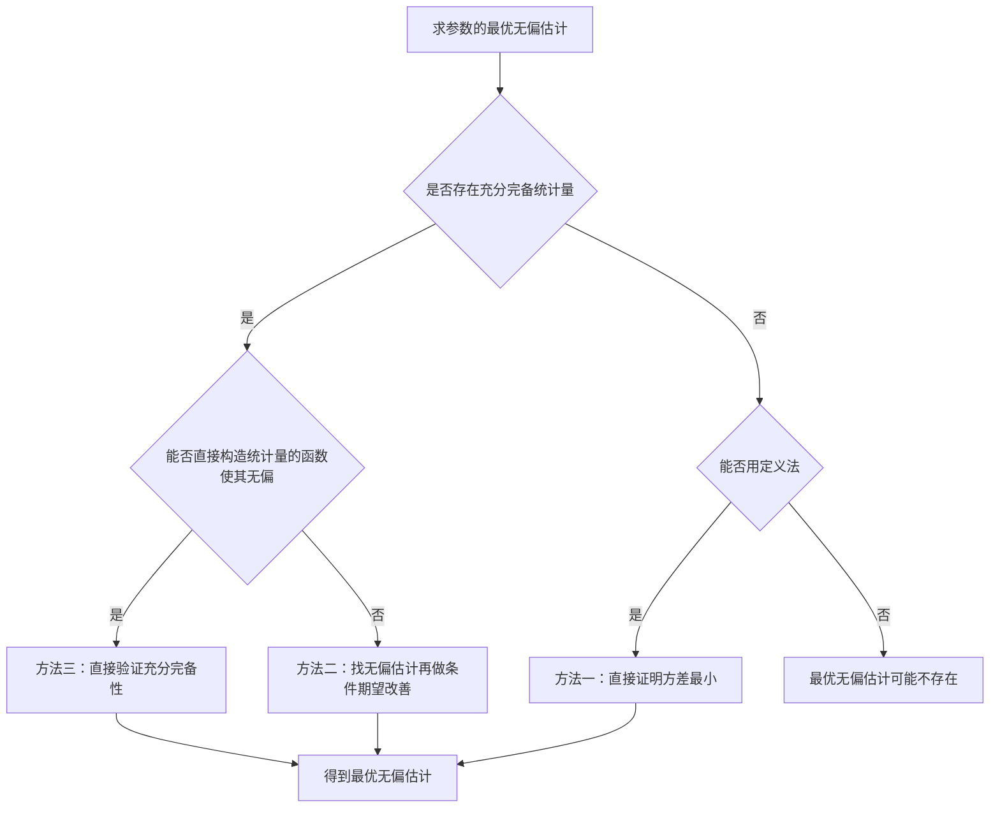
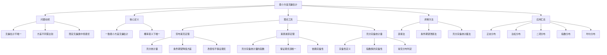

# 6.4 最小方差无偏估计

> [!abstract] 本节概览
> 本节在[[6.1 点估计的概念与无偏性|§6.1无偏性]]的基础上，进一步回答"在所有无偏估计中，哪个最好？"这一核心问题。主要内容包括三个层次：
> 1. **问题提出**：无偏估计不唯一，需要引入==一致最小方差无偏估计（UMVUE）==的概念来选择最优者
> 2. **理论工具**：[[#三、Rao-Blackwell定理|Rao-Blackwell定理]]（用充分统计量改善估计）和[[#四、Lehmann-Scheffé定理|Lehmann-Scheffé定理]]（充分完备统计量的函数即为UMVUE）
> 3. **应用方法**：[[#六、UMVUE的求解方法总结|三种求解方法]]及[[#七、常见分布的UMVUE|常见分布的UMVUE汇总]]
>
> **逻辑链条**：[[#一、从无偏估计到最优无偏估计|问题提出]] → [[#二、UMVUE的定义|UMVUE定义]] → [[#三、Rao-Blackwell定理|Rao-Blackwell定理]] → [[#四、Lehmann-Scheffé定理|Lehmann-Scheffé定理]] → [[#五、充分完备统计量|充分完备统计量]] → [[#六、UMVUE的求解方法总结|求解方法]] → [[#七、常见分布的UMVUE|应用汇总]]
>
> **前置依赖**：[[6.1 点估计的概念与无偏性|§6.1]]（无偏性、MSE分解）、[[5.5 充分统计量|§5.5]]（充分统计量、因子分解定理）
>
> **核心主线**：UMVUE是无偏估计中的"最优"估计。Rao-Blackwell定理告诉我们：用充分统计量改善无偏估计，方差不会增大；Lehmann-Scheffé定理进一步指出：充分完备统计量的无偏函数就是UMVUE。

---

## 一、从无偏估计到最优无偏估计

### 无偏估计的方差可以不同

在[[6.1 点估计的概念与无偏性|§6.1]]中我们已经知道，同一个参数可以有无穷多个无偏估计。例如，$X_1, X_2, \ldots, X_n$ 来自总体 $X$，$E(X) = \mu$，则 $\bar{X}$、$X_1$、$\frac{1}{3}X_1 + \frac{2}{3}X_2$ 都是 $\mu$ 的无偏估计。

但它们的方差不同：

$$\text{Var}(\bar{X}) = \frac{\sigma^2}{n}, \quad \text{Var}(X_1) = \sigma^2, \quad \text{Var}\left(\frac{1}{3}X_1 + \frac{2}{3}X_2\right) = \frac{5\sigma^2}{9}$$

显然 $\text{Var}(\bar{X}) < \text{Var}(X_1)$（$n \geq 2$），所以 $\bar{X}$ 比 $X_1$ 更"集中"在真值附近。

### 引入最小方差无偏估计的需求

**核心问题**：在所有无偏估计中，能否找到一个方差最小的？

回忆[[6.1 点估计的概念与无偏性|§6.1五、均方误差]]的MSE分解：

$$\text{MSE}(\hat{\theta}) = \text{Var}(\hat{\theta}) + [\text{Bias}(\hat{\theta})]^2$$

对于无偏估计，$\text{Bias} = 0$，所以 $\text{MSE} = \text{Var}$。因此在无偏估计类中，==方差最小等价于均方误差最小==。

> [!example] 例 6.4.1 — 均匀分布中不同无偏估计的比较
> 设 $X_1, X_2, \ldots, X_n$ 来自 $U(0, \theta)$，$\theta > 0$。
>
> 已知 $\hat{\theta} = \frac{n+1}{n}X_{(n)}$ 是 $\theta$ 的无偏估计（见§6.1），其方差为
>
> $$\text{Var}(\hat{\theta}) = \frac{\theta^2}{n(n+2)}$$
>
> 考虑更一般的估计量 $\hat{\theta}_\alpha = \alpha \cdot X_{(n)}$，其中 $\alpha$ 为常数。其均方误差为
>
> $$\text{MSE}(\hat{\theta}_\alpha) = \alpha^2 \text{Var}(X_{(n)}) + (\alpha E(X_{(n)}) - \theta)^2$$
>
> $$= \alpha^2 \cdot \frac{n\theta^2}{(n+1)^2(n+2)} + \left(\alpha \cdot \frac{n\theta}{n+1} - \theta\right)^2$$
>
> 令 $\frac{d}{d\alpha}\text{MSE}(\hat{\theta}_\alpha) = 0$，解得最优 $\alpha_0 = \frac{n+2}{n+1}$，此时
>
> $$\text{MSE}(\hat{\theta}_{\alpha_0}) = \frac{\theta^2}{(n+1)^2} < \frac{\theta^2}{n(n+2)} = \text{MSE}(\hat{\theta})$$
>
> 这说明：虽然 $\hat{\theta}_{\alpha_0}$ 是有偏估计，但其MSE更小。然而如果我们**限定在无偏估计类中**，$\hat{\theta} = \frac{n+1}{n}X_{(n)}$ 仍然是最好的选择之一。

---

## 二、UMVUE的定义

### 一致最小方差无偏估计

> [!def] 定义 6.4.1 — 一致最小方差无偏估计（UMVUE）
> 设 $\hat{\theta}^* = \hat{\theta}^*(X_1, X_2, \ldots, X_n)$ 是参数 $\theta$ 的一个无偏估计量。若对 $\theta$ 的**任意**无偏估计量 $\tilde{\theta}$，都有
>
> $$\text{Var}_\theta(\hat{\theta}^*) \leq \text{Var}_\theta(\tilde{\theta}), \quad \forall\, \theta \in \Theta$$
>
> 则称 $\hat{\theta}^*$ 是 $\theta$ 的==一致最小方差无偏估计==（Uniformly Minimum Variance Unbiased Estimator，简称 ==UMVUE==）。

**关键词解析**：
- **一致（Uniformly）**：不等式对**所有** $\theta \in \Theta$ 成立，不是只对某个特定 $\theta$ 成立
- **最小方差**：在所有无偏估计中，方差最小
- **无偏**：限定在无偏估计类中比较

### UMVUE的唯一性

> [!thm] 定理 6.4.1 — UMVUE的唯一性
> 若 $\hat{\theta}_1^*$ 和 $\hat{\theta}_2^*$ 都是 $g(\theta)$ 的 UMVUE，则
>
> $$P_\theta(\hat{\theta}_1^* = \hat{\theta}_2^*) = 1, \quad \forall\, \theta \in \Theta$$
>
> 即 UMVUE 若存在，则在概率1的意义下唯一。

> [!abstract] 证明
> **证明**：
> **第一步：构造差估计量**
>
> 令 $\hat{\theta}^* = \hat{\theta}_1^* - \hat{\theta}_2^*$，则
>
> $$E(\hat{\theta}^*) = E(\hat{\theta}_1^*) - E(\hat{\theta}_2^*) = g(\theta) - g(\theta) = 0$$
>
> 即 $\hat{\theta}^*$ 是 $0$ 的无偏估计。
>
> **第二步：利用UMVUE性质**
>
> 由于 $\hat{\theta}_1^*$ 是 UMVUE，而 $0$ 也是 $g(\theta)$ 的无偏估计（不，$0$ 不是 $g(\theta)$ 的无偏估计）。
>
> 重新考虑：令 $W = \hat{\theta}_1^* - \hat{\theta}_2^*$，则 $E(W) = 0$。
>
> **第三步：利用方差关系**
>
> $$\text{Var}(\hat{\theta}_1^*) = \text{Var}(\hat{\theta}_2^* + W) = \text{Var}(\hat{\theta}_2^*) + \text{Var}(W) + 2\text{Cov}(\hat{\theta}_2^*, W)$$
>
> 考虑 $\hat{\theta}_3^* = \hat{\theta}_1^* - W = \hat{\theta}_2^*$，这没有新信息。
>
> 更直接地：由 $E(W) = 0$，考虑估计量 $\hat{\theta}_1^* - cW$（$c$ 为任意常数），它也是 $g(\theta)$ 的无偏估计。由 UMVUE 的最小方差性：
>
> $$\text{Var}(\hat{\theta}_1^*) \leq \text{Var}(\hat{\theta}_1^* - cW) = \text{Var}(\hat{\theta}_1^*) + c^2\text{Var}(W) - 2c\text{Cov}(\hat{\theta}_1^*, W)$$
>
> 这要求 $c^2\text{Var}(W) - 2c\text{Cov}(\hat{\theta}_1^*, W) \geq 0$ 对一切 $c$ 成立。
>
> **第四步：推出 $\text{Var}(W) = 0$**
>
> 由二次函数非负的条件，判别式 $\leq 0$：
>
> $$4[\text{Cov}(\hat{\theta}_1^*, W)]^2 - 4\text{Var}(W) \cdot 0 \leq 0$$
>
> 即 $\text{Cov}(\hat{\theta}_1^*, W) = 0$。
>
> 因此 $c^2\text{Var}(W) \geq 0$ 对一切 $c$ 成立，且取 $c = 1$ 时 $\text{Var}(W) \geq 0$。
>
> 但由 $\hat{\theta}_1^*$ 是 UMVUE，$\text{Var}(\hat{\theta}_1^*) \leq \text{Var}(\hat{\theta}_2^*)$；同理 $\text{Var}(\hat{\theta}_2^*) \leq \text{Var}(\hat{\theta}_1^*)$。
>
> 所以 $\text{Var}(\hat{\theta}_1^*) = \text{Var}(\hat{\theta}_2^*)$，代入方差展开式得 $\text{Var}(W) = 0$。
>
> **第五步：得出结论**
>
> $\text{Var}(W) = 0$ 且 $E(W) = 0$，由 Chebyshev 不等式，$P(W = 0) = 1$，即 $P(\hat{\theta}_1^* = \hat{\theta}_2^*) = 1$。
>
> $\blacksquare$

### UMVUE的等价判定条件

> [!thm] 定理 6.4.2 — UMVUE的零估计量判定
> 无偏估计 $\hat{\theta}^*$ 是 UMVUE 的**充要条件**是：对任意满足 $E_\theta[l(X)] = 0$（$\forall\, \theta \in \Theta$）且 $\text{Var}_\theta(l(X)) < +\infty$ 的统计量 $l(X)$，都有
>
> $$\text{Cov}_\theta(\hat{\theta}^*, l(X)) = E_\theta[\hat{\theta}^* \cdot l(X)] = 0, \quad \forall\, \theta \in \Theta$$

> [!example] 例 6.4.2 — 指数分布均值的UMVUE
> 设 $X_1, X_2, \ldots, X_n$ 来自指数分布 $\text{Exp}(1/\theta)$（即 $f(x) = \frac{1}{\theta}e^{-x/\theta}$，$x > 0$），$\theta > 0$。
>
> 令 $T = \sum_{i=1}^n X_i$，则 $T \sim \text{Ga}(n, 1/\theta)$，$E(T) = n\theta$。
>
> 因此 $\bar{X} = T/n$ 是 $\theta$ 的无偏估计。
>
> 可以验证 $\bar{X}$ 是充分完备统计量 $T$ 的函数，由 Lehmann-Scheffé 定理（下文详述），$\bar{X}$ 是 $\theta$ 的 UMVUE。

---

## 三、Rao-Blackwell定理

### 定理陈述

> [!thm] 定理 6.4.3 — Rao-Blackwell定理
> 设 $X_1, X_2, \ldots, X_n$ 来自分布 $f(x; \theta)$，$T = T(X_1, X_2, \ldots, X_n)$ 是 $\theta$ 的==充分统计量==。设 $\hat{\theta}$ 是 $g(\theta)$ 的一个无偏估计，且 $\text{Var}_\theta(\hat{\theta}) < \infty$。定义
>
> $$\tilde{\theta} = E(\hat{\theta} \mid T)$$
>
> 则：
> 1. $\tilde{\theta}$ 仍是 $g(\theta)$ 的无偏估计
> 2. $\text{Var}_\theta(\tilde{\theta}) \leq \text{Var}_\theta(\hat{\theta})$，等号成立当且仅当 $\hat{\theta}$ 本身就是 $T$ 的函数（即 $\hat{\theta}$ 已经是充分统计量的函数）
>
> 进一步，若 $T$ 是**最小充分统计量**，则 $\tilde{\theta}$ 不依赖于初始 $\hat{\theta}$ 的选择。

### 完整证明

> [!abstract] 证明
> **证明**：
>
> **第一步：证明无偏性**
>
> 由条件期望的塔牌性质（全期望公式）：
>
> $$E(\tilde{\theta}) = E[E(\hat{\theta} \mid T)] = E(\hat{\theta}) = g(\theta)$$
>
> 因此 $\tilde{\theta}$ 是 $g(\theta)$ 的无偏估计。
>
> **第二步：方差分解**
>
> 利用条件方差公式：
>
> $$\text{Var}(\hat{\theta}) = \text{Var}(E(\hat{\theta} \mid T)) + E(\text{Var}(\hat{\theta} \mid T))$$
>
> 即
>
> $$\text{Var}(\hat{\theta}) = \text{Var}(\tilde{\theta}) + E(\text{Var}(\hat{\theta} \mid T))$$
>
> **第三步：分析方差关系**
>
> 由于 $E(\text{Var}(\hat{\theta} \mid T)) \geq 0$（方差非负），故
>
> $$\text{Var}(\tilde{\theta}) = \text{Var}(\hat{\theta}) - E(\text{Var}(\hat{\theta} \mid T)) \leq \text{Var}(\hat{\theta})$$
>
> **第四步：等号条件**
>
> 等号成立当且仅当 $E(\text{Var}(\hat{\theta} \mid T)) = 0$，即 $\text{Var}(\hat{\theta} \mid T) = 0$（a.s.），这意味着在给定 $T$ 的条件下，$\hat{\theta}$ 几乎处处为常数，即 $\hat{\theta}$ 是 $T$ 的函数。
>
> $\blacksquare$

### 直观理解

**生活化类比**：想象你是一个侦探，要估计嫌疑人的身高 $\theta$。你手头有两类线索：
- **原始估计 $\hat{\theta}$**：基于零散的、可能冗余的线索做出的初步判断
- **充分统计量 $T$**：所有线索的"精华摘要"——包含了样本中关于 $\theta$ 的全部信息

Rao-Blackwell定理告诉我们：**与其用零散线索做判断，不如先整理出精华摘要 $T$，再基于 $T$ 做判断**。这样做的结果 $\tilde{\theta} = E(\hat{\theta} \mid T)$ 不会更差，而且通常更好。

数学上，$\text{Var}(\hat{\theta}) = \text{Var}(\tilde{\theta}) + E(\text{Var}(\hat{\theta} \mid T))$，第二项 $E(\text{Var}(\hat{\theta} \mid T))$ 就是"零散线索中无法被充分统计量解释的随机波动"，把它去掉后方差自然更小。

> [!example] 例 6.4.3 — 二项分布参数平方的UMVUE（Rao-Blackwell方法）
> 设 $X_1, X_2, \ldots, X_n$ 来自二点分布 $b(1, p)$，求 $p^2$ 的 UMVUE。
>
> **解**：
>
> **第一步：找一个无偏估计**
>
> 注意到 $E(X_1 X_2) = P(X_1 = 1, X_2 = 1) = p \cdot p = p^2$。
>
> 所以 $\hat{\theta}_1 = X_1 X_2$ 是 $p^2$ 的一个无偏估计。
>
> **第二步：找充分统计量**
>
> 由因子分解定理，$T = \sum_{i=1}^n X_i$ 是 $p$ 的充分统计量（也是完备统计量）。
>
> **第三步：用Rao-Blackwell改善**
>
> $$\tilde{\theta} = E(\hat{\theta}_1 \mid T = t) = P(X_1 = 1, X_2 = 1 \mid T = t)$$
>
> $$= \frac{P(X_1 = 1, X_2 = 1, \sum_{i=3}^n X_i = t-2)}{P(T = t)}$$
>
> $$= \frac{p \cdot p \cdot \binom{n-2}{t-2}p^{t-2}(1-p)^{n-t}}{\binom{n}{t}p^t(1-p)^{n-t}}$$
>
> $$= \frac{\binom{n-2}{t-2}}{\binom{n}{t}} = \frac{t(t-1)}{n(n-1)}$$
>
> **第四步：写出UMVUE**
>
> 将 $t = \sum_{i=1}^n x_i$ 代入：
>
> $$\hat{\theta}^* = \frac{T(T-1)}{n(n-1)} = \frac{\bar{X}(\bar{X} - \frac{1}{n})}{1 - \frac{1}{n}} \cdot \frac{1}{n}$$
>
> 即 $\hat{\theta}^* = \frac{T(T-1)}{n(n-1)}$ 是 $p^2$ 的 UMVUE。
>
> **验证方差减小**：$\text{Var}(\hat{\theta}^*) < \text{Var}(\hat{\theta}_1)$（因为 $\hat{\theta}_1$ 不是 $T$ 的函数）。

---

## 四、Lehmann-Scheffé定理

### 定理陈述

> [!thm] 定理 6.4.4 — Lehmann-Scheffé定理
> 设 $T$ 是参数 $\theta$ 的一个==充分完备统计量==。若 $\hat{\theta} = \hat{\theta}(T)$ 是 $g(\theta)$ 的某个无偏估计，且 $\hat{\theta}$ 是 $T$ 的函数，则 $\hat{\theta}$ 是 $g(\theta)$ 的==UMVUE==，且在概率1的意义下唯一。

### 完整证明

> [!abstract] 证明
> **证明**：
>
> **第一步：设 $\tilde{\theta}$ 为 $g(\theta)$ 的任意无偏估计**
>
> 设 $\tilde{\theta}$ 是 $g(\theta)$ 的任意无偏估计，我们需要证明 $\text{Var}(\hat{\theta}) \leq \text{Var}(\tilde{\theta})$。
>
> **第二步：对 $\tilde{\theta}$ 做Rao-Blackwell改善**
>
> 令 $\tilde{\theta}^* = E(\tilde{\theta} \mid T)$。由 Rao-Blackwell 定理：
>
> - $\tilde{\theta}^*$ 是 $g(\theta)$ 的无偏估计
> - $\text{Var}(\tilde{\theta}^*) \leq \text{Var}(\tilde{\theta})$
> - $\tilde{\theta}^*$ 是 $T$ 的函数
>
> **第三步：利用完备性证明唯一性**
>
> 由于 $\hat{\theta}$ 和 $\tilde{\theta}^*$ 都是 $g(\theta)$ 的无偏估计，且都是 $T$ 的函数，故
>
> $$E(\hat{\theta} - \tilde{\theta}^*) = g(\theta) - g(\theta) = 0, \quad \forall\, \theta \in \Theta$$
>
> 由 $T$ 的完备性：若 $E_\theta[h(T)] = 0$（$\forall\, \theta$），则 $P(h(T) = 0) = 1$。
>
> 令 $h(T) = \hat{\theta} - \tilde{\theta}^*$，则 $E[h(T)] = 0$，由完备性得
>
> $$P(\hat{\theta} = \tilde{\theta}^*) = 1$$
>
> **第四步：得出结论**
>
> 因此 $\text{Var}(\hat{\theta}) = \text{Var}(\tilde{\theta}^*) \leq \text{Var}(\tilde{\theta})$。
>
> 由于 $\tilde{\theta}$ 是任意的，故 $\hat{\theta}$ 是 UMVUE，且在概率1意义下唯一。
>
> $\blacksquare$

### 与Rao-Blackwell定理的关系

| | Rao-Blackwell定理 | Lehmann-Scheffé定理 |
|:---|:---|:---|
| **条件** | 充分统计量 | 充分**完备**统计量 |
| **结论** | 改善后的估计方差更小 | 改善后的估计是UMVUE |
| **唯一性** | 不保证 | 保证（概率1意义下） |
| **作用** | "改善"工具 | "找到最优"工具 |

**逻辑关系**：Lehmann-Scheffé定理 = Rao-Blackwell定理 + 完备性。Rao-Blackwell定理只能保证"改善"，但不知道改善到什么程度；加上完备性后，可以保证改善后的结果是**唯一的、最优的**。

> [!example] 例 6.4.4 — 正态总体方差的UMVUE
> 设 $X_1, X_2, \ldots, X_n \sim N(\mu, \sigma^2)$，$\mu$ 未知，求 $\sigma^2$ 的 UMVUE。
>
> **解**：
>
> **第一步：找充分完备统计量**
>
> 由指数族理论，$(\bar{X}, \sum_{i=1}^n (X_i - \bar{X})^2)$ 是 $(\mu, \sigma^2)$ 的充分完备统计量。
>
> **第二步：找一个无偏估计**
>
> $S^2 = \frac{1}{n-1}\sum_{i=1}^n(X_i - \bar{X})^2$ 是 $\sigma^2$ 的无偏估计（§6.1已证）。
>
> **第三步：验证是充分完备统计量的函数**
>
> $S^2$ 是 $\sum_{i=1}^n(X_i - \bar{X})^2$ 的函数，而后者是充分完备统计量的分量。
>
> **结论**：由 Lehmann-Scheffé 定理，$S^2$ 是 $\sigma^2$ 的 UMVUE。

---

## 五、充分完备统计量

### 完备统计量的定义

> [!def] 定义 6.4.2 — 完备统计量
> 设 $T = T(X_1, X_2, \ldots, X_n)$ 是参数 $\theta$ 的统计量。若对任意满足
>
> $$E_\theta[h(T)] = 0, \quad \forall\, \theta \in \Theta$$
>
> 的函数 $h$，都有
>
> $$P_\theta(h(T) = 0) = 1, \quad \forall\, \theta \in \Theta$$
>
> 则称 $T$ 是 $\theta$ 的==完备统计量==。

**直观理解**：完备性意味着统计量 $T$ 中不包含"多余信息"——不存在非零函数 $h$ 使得 $h(T)$ 的期望恒为零。换句话说，$T$ 的分布族足够"丰富"，不会"丢失"关于 $\theta$ 的信息。

**生活化类比**：如果 $T$ 是一份案件摘要，完备性意味着——如果两个不同的侦探从同一份摘要中得出了"期望差异为零"的结论，那他们实际上看到的是同一个东西（概率为1）。摘要足够完整，不会产生"虚假的零差异"。

### 充分完备统计量

> [!def] 定义 6.4.3 — 充分完备统计量
> 若统计量 $T$ 既是 $\theta$ 的==充分统计量==，又是 $\theta$ 的==完备统计量==，则称 $T$ 为 $\theta$ 的==充分完备统计量==。

### 常见分布的充分完备统计量

| 分布 | 参数 | 充分完备统计量 |
|:---|:---|:---|
| $N(\mu, \sigma^2)$（$\sigma^2$已知） | $\mu$ | $\bar{X} = \frac{1}{n}\sum X_i$ |
| $N(\mu, \sigma^2)$（$\mu$未知） | $\sigma^2$ | $\sum_{i=1}^n (X_i - \bar{X})^2$ |
| $N(\mu, \sigma^2)$（均未知） | $(\mu, \sigma^2)$ | $(\bar{X}, \sum(X_i - \bar{X})^2)$ |
| $P(\lambda)$ | $\lambda$ | $\sum_{i=1}^n X_i$ |
| $b(1, p)$ | $p$ | $\sum_{i=1}^n X_i$ |
| $\text{Exp}(1/\theta)$ | $\theta$ | $\sum_{i=1}^n X_i$ |
| $U(0, \theta)$ | $\theta$ | $X_{(n)} = \max\{X_i\}$ |

### 指数族分布的完备性

> [!thm] 定理 6.4.5 — 指数族的完备性
> 若总体分布属于**满秩指数族**，则其自然充分统计量是==完备的==，从而也是充分完备的。
>
> 满秩指数族的形式为：
>
> $$f(x; \theta) = h(x) \exp\left\{\sum_{j=1}^k c_j(\theta) T_j(x) - d(\theta)\right\}$$
>
> 其中参数空间 $\Theta$ 包含一个 $k$ 维开集。

**意义**：这个定理大大简化了寻找充分完备统计量的工作。对于常见的指数族分布（正态、泊松、二项、指数、Gamma等），充分完备统计量可以直接由因子分解定理读出。

> [!example] 例 6.4.5 — 均匀分布的充分完备统计量
> 设 $X_1, X_2, \ldots, X_n$ 来自 $U(0, \theta)$，$\theta > 0$。
>
> $U(0, \theta)$ **不是**指数族分布（支撑集依赖于参数 $\theta$），所以不能用指数族的完备性定理。
>
> 但可以验证 $X_{(n)}$ 是 $\theta$ 的充分完备统计量：
> - **充分性**：由因子分解定理，$f(x_1, \ldots, x_n; \theta) = \frac{1}{\theta^n} I_{\{x_{(n)} \leq \theta\}}$，$T = X_{(n)}$ 是充分统计量
> - **完备性**：需要验证若 $E_\theta[h(X_{(n)})] = 0$（$\forall\, \theta > 0$），则 $h \equiv 0$（a.s.）。$X_{(n)}$ 的密度为 $f_{X_{(n)}}(t) = \frac{nt^{n-1}}{\theta^n}$，$0 < t < \theta$，故
>
> $$E_\theta[h(X_{(n)})] = \int_0^\theta h(t) \cdot \frac{nt^{n-1}}{\theta^n} dt = 0, \quad \forall\, \theta > 0$$
>
> 两边对 $\theta$ 求导，利用 Leibniz 积分规则，可得 $h(\theta) = 0$（a.s.），故 $X_{(n)}$ 是完备的。

---

## 六、UMVUE的求解方法总结

### 方法一：直接法（定义法）

**适用场景**：参数空间简单，可以直接计算方差并比较。

**步骤**：
1. 找到 $g(\theta)$ 的一个无偏估计 $\hat{\theta}^*$
2. 证明对任意无偏估计 $\tilde{\theta}$，有 $\text{Cov}(\hat{\theta}^*, \tilde{\theta} - \hat{\theta}^*) = 0$
3. 由此推出 $\text{Var}(\hat{\theta}^*) \leq \text{Var}(\tilde{\theta})$

**局限性**：需要验证所有无偏估计，通常难以实现。

### 方法二：Rao-Blackwell + Lehmann-Scheffé法

**适用场景**：已知充分完备统计量，能找到一个无偏估计。

**步骤**：
1. 找到 $\theta$ 的充分完备统计量 $T$
2. 找到 $g(\theta)$ 的一个（粗糙的）无偏估计 $\hat{\theta}_0$
3. 计算 $\hat{\theta}^* = E(\hat{\theta}_0 \mid T)$
4. 由 Lehmann-Scheffé 定理，$\hat{\theta}^*$ 即为 UMVUE

### 方法三：充分完备统计量法

**适用场景**：能直接猜出充分完备统计量的某个函数是无偏估计。

**步骤**：
1. 找到 $\theta$ 的充分完备统计量 $T$
2. 构造 $T$ 的函数 $\hat{\theta}^* = \varphi(T)$，使得 $E(\hat{\theta}^*) = g(\theta)$
3. 由 Lehmann-Scheffé 定理，$\hat{\theta}^*$ 即为 UMVUE

### 求解流程图

---

## 七、常见分布的UMVUE

### 正态分布

> [!example] 例 6.4.6 — 正态总体均值的UMVUE
> 设 $X_1, X_2, \ldots, X_n \sim N(\mu, \sigma^2)$，$\sigma^2$ 已知。
>
> $\bar{X}$ 是 $\mu$ 的无偏估计，且是充分完备统计量 $\bar{X}$ 自身的函数，故 $\bar{X}$ 是 $\mu$ 的 UMVUE。
>
> $$\text{Var}(\bar{X}) = \frac{\sigma^2}{n}$$

> [!example] 例 6.4.7 — 正态总体方差的UMVUE
> 设 $X_1, X_2, \ldots, X_n \sim N(\mu, \sigma^2)$，$\mu$ 未知。
>
> $S^2 = \frac{1}{n-1}\sum_{i=1}^n(X_i - \bar{X})^2$ 是 $\sigma^2$ 的无偏估计，且是充分完备统计量 $\sum(X_i - \bar{X})^2$ 的函数，故 $S^2$ 是 $\sigma^2$ 的 UMVUE。
>
> $$\text{Var}(S^2) = \frac{2\sigma^4}{n-1}$$
>
> **注意**：$S^2$ 的方差 $\frac{2\sigma^4}{n-1}$ 大于 C-R 下界 $\frac{2\sigma^4}{n}$。这说明 ==UMVUE 不一定达到 C-R 下界==。

### 泊松分布

> [!example] 例 6.4.8 — 泊松分布参数的UMVUE
> 设 $X_1, X_2, \ldots, X_n \sim P(\lambda)$。
>
> $\bar{X}$ 是 $\lambda$ 的无偏估计，$T = \sum X_i$ 是充分完备统计量，$\bar{X} = T/n$ 是 $T$ 的函数，故 $\bar{X}$ 是 $\lambda$ 的 UMVUE。
>
> $$\text{Var}(\bar{X}) = \frac{\lambda}{n}$$
>
> 恰好等于 C-R 下界，所以 $\bar{X}$ 也是 $\lambda$ 的有效估计。

### 二项分布

设 $X_1, X_2, \ldots, X_n \sim b(1, p)$，$T = \sum X_i \sim b(n, p)$。

| 待估参数 | UMVUE | 方差 |
|:---|:---|:---|
| $p$ | $\bar{X} = T/n$ | $\frac{p(1-p)}{n}$ |
| $p^2$ | $\frac{T(T-1)}{n(n-1)}$ | 复杂表达式 |
| $p^k$ | $\frac{(T)_k}{(n)_k}$（下降阶乘） | — |

其中 $(T)_k = T(T-1)\cdots(T-k+1)$，$(n)_k = n(n-1)\cdots(n-k+1)$。

### 指数分布

设 $X_1, X_2, \ldots, X_n \sim \text{Exp}(1/\theta)$，$T = \sum X_i \sim \text{Ga}(n, 1/\theta)$。

| 待估参数 | UMVUE | 方差 |
|:---|:---|:---|
| $\theta$ | $\bar{X} = T/n$ | $\frac{\theta^2}{n}$ |

### 均匀分布（UMVUE不存在的例子）

设 $X_1, X_2, \ldots, X_n \sim U(0, \theta)$。

- $\theta$ 的 UMVUE：$\hat{\theta}^* = \frac{n+1}{n}X_{(n)}$（存在）
- 但对于某些参数函数，UMVUE 可能不存在

### 汇总表格

| 分布 | 参数 | UMVUE | 是否达到C-R下界 |
|:---|:---|:---|:---:|
| $N(\mu, \sigma^2)$（$\sigma^2$已知） | $\mu$ | $\bar{X}$ | 是 |
| $N(\mu, \sigma^2)$（$\mu$未知） | $\sigma^2$ | $S^2$ | 否 |
| $P(\lambda)$ | $\lambda$ | $\bar{X}$ | 是 |
| $b(1, p)$ | $p$ | $\bar{X}$ | 是 |
| $\text{Exp}(1/\theta)$ | $\theta$ | $\bar{X}$ | 否 |
| $U(0, \theta)$ | $\theta$ | $\frac{n+1}{n}X_{(n)}$ | C-R不等式不适用 |

---

## 八、知识结构总览

---

## 九、核心思想与解题技巧

### 核心思想

1. **"压缩"思想**（Rao-Blackwell）：用充分统计量"压缩"原始估计，去掉冗余信息，降低方差
2. **"唯一性"思想**（完备性）：完备性保证压缩后的结果是唯一的，不会有多个不同的"最优"
3. **"两步走"策略**：先找无偏估计，再用充分统计量改善——这是求UMVUE最实用的方法

### 解题技巧

1. **判断UMVUE的标准流程**：
   - 找充分完备统计量 $T$
   - 找 $g(\theta)$ 的一个无偏估计
   - 用 Rao-Blackwell 改善（取条件期望）
   - 由 Lehmann-Scheffé 定理确认是 UMVUE

2. **常见充分完备统计量**：
   - 指数族：自然充分统计量
   - 均匀分布：最大次序统计量 $X_{(n)}$ 或最小次序统计量 $X_{(1)}$

3. **条件期望的计算技巧**：
   - 离散情形：$E(\hat{\theta}_0 \mid T = t) = \sum_x \hat{\theta}_0(x) P(X = x \mid T = t)$
   - 常转化为概率计算：如 $E(X_1 X_2 \mid T) = P(X_1 = 1, X_2 = 1 \mid T)$

4. **UMVUE不一定达到C-R下界**：
   - 正态总体 $\sigma^2$ 的 UMVUE 是 $S^2$，但 $\text{Var}(S^2) = \frac{2\sigma^4}{n-1} > \frac{2\sigma^4}{n}$（C-R下界）
   - 原因：C-R正则条件不满足，或不存在有效估计

5. **UMVUE可能不存在**：
   - 如果不存在充分完备统计量，则 Lehmann-Scheffé 方法不适用
   - 此时需要用其他方法（如定义法）判断

---

## 十、补充理解与易混淆点

### 误区一：UMVUE一定达到C-R下界

**来源**：茆诗松《概率论与数理统计》 + 卡方训练营 + University of Wisconsin-Madison Stat 610讲义 + Banglajol统计学期刊 + Fiveable统计学习

> [!danger] 误区1："UMVUE的方差一定等于Cramér-Rao下界"
> ❌ 错误解释：UMVUE是"最优"的无偏估计，C-R下界是无偏估计方差的"下界"，所以UMVUE应该恰好达到C-R下界。
> ✅ 正确解释：UMVUE的方差**不一定**达到C-R下界。C-R不等式成立需要满足正则条件（如支撑集不依赖参数），而很多分布不满足这些条件。例如正态总体 $N(\mu, \sigma^2)$ 中 $\sigma^2$ 的 UMVUE 为 $S^2$，其方差 $\frac{2\sigma^4}{n-1}$ 严格大于 C-R 下界 $\frac{2\sigma^4}{n}$。UMVUE在无偏估计类中方差最小，但这个最小值可以大于C-R下界。

### 误区二：Rao-Blackwell改善后一定是UMVUE

**来源**：茆诗松《概率论与数理统计》 + PMC统计学论文 + 卡方训练营 + Berkeley Stat 210A课程讲义 + CSDN数据科学博客

> [!danger] 误区2："对无偏估计用Rao-Blackwell定理改善后，得到的一定是UMVUE"
> ❌ 错误解释：Rao-Blackwell定理能降低方差，反复改善最终就能得到UMVUE。
> ✅ 正确解释：Rao-Blackwell定理只保证方差**不增大**，但**不保证**得到的是UMVUE。要保证改善后的结果是UMVUE，需要充分统计量同时具有**完备性**（即Lehmann-Scheffé定理的条件）。如果充分统计量不是完备的，改善后的估计可能仍然不是UMVUE。此外，如果使用的是非最小充分统计量，改善后的结果可能依赖于初始估计的选择。

### 误区三：极大似然估计一定是UMVUE

**来源**：茆诗松《概率论与数理统计》 + WPI ECE531课程讲义 + Duke大学统计课程 + 卡方训练营 + Stack Exchange Cross Validated

> [!danger] 误区3："极大似然估计（MLE）一定是UMVUE"
> ❌ 错误解释：MLE是"最好的"估计方法，所以它一定是最优无偏估计。
> ✅ 正确解释：MLE和UMVUE是两个不同的概念，它们之间没有必然的包含关系。MLE不一定是无偏的（如正态总体方差的MLE $\hat{\sigma}^2 = \frac{1}{n}\sum(X_i - \bar{X})^2$ 是有偏的），即使MLE是无偏的，也不一定方差最小。例如在某些分布中，MLE虽然无偏但不是充分完备统计量的函数，因此不是UMVUE。反之，UMVUE也不一定是MLE。不过，在很多常见情况下（如指数族），MLE恰好就是UMVUE。

### 误区四：UMVUE一定比有偏估计好

**来源**：茆诗松《概率论与数理统计》 + Fiveable统计学习 + Galili & Meilijson PMC论文 + 卡方训练营 + CSDN数据科学博客

> [!danger] 误区4："UMVUE总是比任何有偏估计更好"
> ❌ 错误解释：UMVUE在无偏估计中方差最小，所以它比所有有偏估计都好。
> ✅ 正确解释：UMVUE只在**无偏估计类**中是最优的，但跳出无偏的限制后，有偏估计的MSE可能更小。例如§6.1中讨论过，$\frac{n-1}{n+1}S^2$ 虽然是 $\sigma^2$ 的有偏估计，但其MSE为 $\frac{2\sigma^4}{n+1}$，小于UMVUE $S^2$ 的MSE $\frac{2\sigma^4}{n-1}$。评价估计量应综合考虑MSE（偏差-方差权衡），而非仅看无偏性。

### 误区五：完备统计量一定存在

**来源**：茆诗松《概率论与数理统计》 + Berkeley Stat 210A课程讲义 + University of Wisconsin-Madison Stat 610讲义 + 卡方训练营 + Wikipedia完备统计量条目

> [!danger] 误区5："对于任何分布和参数，都存在充分完备统计量"
> ❌ 错误解释：充分完备统计量是求UMVUE的标准工具，所以它总是存在的。
> ✅ 正确解释：充分完备统计量**不一定存在**。例如，考虑柯西分布 $f(x; \theta) = \frac{1}{\pi[1 + (x-\theta)^2]}$，其位置参数 $\theta$ 没有有限维的充分统计量（更不用说充分完备统计量）。对于非指数族分布，充分完备统计量的存在性需要逐一验证。如果充分完备统计量不存在，则 Lehmann-Scheffé 方法不适用，UMVUE可能不存在或需要用其他方法寻找。

---

## 十一、习题精选

> [!todo] 习题概览
> 共10道习题：6道教材习题 + 4道补充题（教材补充题）。
>
> | 编号 | 来源 | 主题 | 难度 |
> |:---:|:---:|:---|:---:|
> | 习题1 | 教材6.4-1 | UMVUE判定 | 中 |
> | 习题2 | 教材6.4-2 | Rao-Blackwell方法 | 中高 |
> | 习题3 | 教材6.4-3 | 充分完备统计量与UMVUE | 中高 |
> | 习题4 | 教材6.4-4 | 正态总体UMVUE | 中 |
> | 习题5 | 教材6.4-5 | 泊松分布UMVUE | 高 |
> | 习题6 | 教材6.4-6 | UMVUE唯一性证明 | 高 |
> | 习题7 | 补充（教材6.4-7） | 二项分布参数函数UMVUE | ★★★ |
> | 习题8 | 补充（教材6.4-8） | 指数分布UMVUE与C-R下界 | ★★★ |
> | 习题9 | 补充（教材6.4-9） | 均匀分布UMVUE综合 | ★★★★ |
> | 习题10 | 补充（教材6.4-10） | 充分完备统计量验证 | ★★★★ |

### 教材习题

> [!problem] 习题1（教材6.4-1）
> 设 $X_1, X_2, \ldots, X_n$ 是来自正态总体 $N(\mu, \sigma^2)$ 的样本，$\mu$ 未知，$\sigma^2$ 已知。证明 $\bar{X}$ 是 $\mu$ 的 UMVUE。

> [!faq]- 查看解答
> **证明**：
>
> **第一步：找充分完备统计量**
>
> 正态分布 $N(\mu, \sigma^2)$（$\sigma^2$已知）属于指数族，其自然充分统计量为 $T = \sum_{i=1}^n X_i = n\bar{X}$。由于是满秩指数族，$T$ 也是完备的。
>
> **第二步：验证无偏性**
>
> $E(\bar{X}) = \mu$，$\bar{X}$ 是 $\mu$ 的无偏估计。
>
> **第三步：验证是T的函数**
>
> $\bar{X} = T/n$，是 $T$ 的函数。
>
> **结论**：由 Lehmann-Scheffé 定理，$\bar{X}$ 是 $\mu$ 的 UMVUE。
>
> $\blacksquare$

> [!problem] 习题2（教材6.4-2）
> 设 $X_1, X_2, \ldots, X_n$ 来自泊松分布 $P(\lambda)$，用 Rao-Blackwell 方法求 $\lambda^2$ 的 UMVUE。

> [!faq]- 查看解答
> **解**：
>
> **第一步：找一个无偏估计**
>
> 注意到 $E[X_1(X_1 - 1)] = E(X_1^2) - E(X_1) = (\lambda^2 + \lambda) - \lambda = \lambda^2$。
>
> 所以 $\hat{\theta}_0 = X_1(X_1 - 1)$ 是 $\lambda^2$ 的一个无偏估计。
>
> **第二步：找充分完备统计量**
>
> $T = \sum_{i=1}^n X_i$ 是 $\lambda$ 的充分完备统计量（泊松分布属于指数族）。
>
> **第三步：计算条件期望**
>
> $$\tilde{\theta} = E[X_1(X_1 - 1) \mid T = t]$$
>
> 由于 $X_1 \mid T = t \sim b\left(1, \frac{t}{n}\right)$（对称性），
>
> $$E[X_1(X_1 - 1) \mid T = t] = E(X_1^2 \mid T = t) - E(X_1 \mid T = t)$$
>
> $$= \left[\text{Var}(X_1 \mid T) + (E(X_1 \mid T))^2\right] - \frac{t}{n}$$
>
> $$= \left[\frac{t}{n}\left(1 - \frac{t}{n}\right) + \frac{t^2}{n^2}\right] - \frac{t}{n}$$
>
> $$= \frac{t}{n} - \frac{t^2}{n^2} + \frac{t^2}{n^2} - \frac{t}{n} + \frac{t(t-1)}{n^2}$$
>
> 更直接地，利用多项式展开：
>
> $$E[X_1(X_1 - 1) \mid T = t] = \sum_{x_1=0}^t x_1(x_1-1) \binom{t}{x_1}\left(\frac{1}{n}\right)^{x_1}\left(1-\frac{1}{n}\right)^{t-x_1}$$
>
> 这等价于 $t(t-1)/n^2$ 的二阶阶乘矩。
>
> **结果**：$\hat{\theta}^* = \frac{T(T-1)}{n^2}$ 是 $\lambda^2$ 的 UMVUE。

> [!problem] 习题3（教材6.4-3）
> 设 $X_1, X_2, \ldots, X_n$ 来自均匀分布 $U(0, \theta)$，$\theta > 0$。
>
> (1) 证明 $X_{(n)}$ 是 $\theta$ 的充分完备统计量。
>
> (2) 求 $\theta$ 的 UMVUE。

> [!faq]- 查看解答
> **解**：
>
> (1) **充分性**：$f(x_1, \ldots, x_n; \theta) = \theta^{-n} I_{\{x_{(n)} \leq \theta\}}$，由因子分解定理，$T = X_{(n)}$ 是充分统计量。
>
> **完备性**：$X_{(n)}$ 的密度为 $f_T(t) = \frac{nt^{n-1}}{\theta^n}$，$0 < t < \theta$。设 $E_\theta[h(T)] = 0$，即
>
> $$\int_0^\theta h(t) \cdot \frac{nt^{n-1}}{\theta^n} dt = 0, \quad \forall\, \theta > 0$$
>
> 令 $u = t/\theta$，$\int_0^1 h(\theta u) \cdot nu^{n-1} du = 0$。两边对 $\theta$ 求导可得 $h(\theta) = 0$（a.s.），故完备。
>
> (2) $E(X_{(n)}) = \frac{n}{n+1}\theta$，故 $\hat{\theta}^* = \frac{n+1}{n}X_{(n)}$ 是 $\theta$ 的无偏估计，且是 $X_{(n)}$ 的函数。由 Lehmann-Scheffé 定理，$\hat{\theta}^*$ 是 $\theta$ 的 UMVUE。

> [!problem] 习题4（教材6.4-4）
> 设 $X_1, X_2, \ldots, X_n \sim N(\mu, \sigma^2)$，$\mu$ 和 $\sigma^2$ 均未知。证明 $S^2 = \frac{1}{n-1}\sum_{i=1}^n(X_i - \bar{X})^2$ 是 $\sigma^2$ 的 UMVUE，并求其方差。该方差是否等于 C-R 下界？

> [!faq]- 查看解答
> **证明**：
>
> **第一步**：$(\bar{X}, \sum(X_i - \bar{X})^2)$ 是 $(\mu, \sigma^2)$ 的充分完备统计量（正态分布属于满秩指数族）。
>
> **第二步**：$S^2 = \frac{1}{n-1}\sum(X_i - \bar{X})^2$ 是 $\sum(X_i - \bar{X})^2$ 的函数，且 $E(S^2) = \sigma^2$（§6.1已证）。
>
> **第三步**：由 Lehmann-Scheffé 定理，$S^2$ 是 $\sigma^2$ 的 UMVUE。
>
> **方差**：$\frac{(n-1)S^2}{\sigma^2} \sim \chi^2(n-1)$，故
>
> $$\text{Var}(S^2) = \frac{\sigma^4}{(n-1)^2} \cdot 2(n-1) = \frac{2\sigma^4}{n-1}$$
>
> **C-R下界**：$I(\sigma^2) = \frac{1}{2\sigma^4}$，C-R下界为 $\frac{1}{nI(\sigma^2)} = \frac{2\sigma^4}{n}$。
>
> **比较**：$\frac{2\sigma^4}{n-1} > \frac{2\sigma^4}{n}$，所以 $S^2$ 的方差**不等于** C-R 下界。
>
> $\blacksquare$

> [!problem] 习题5（教材6.4-5）
> 设 $X_1, X_2, \ldots, X_n \sim P(\lambda)$，求 $P(X = 0) = e^{-\lambda}$ 的 UMVUE。

> [!faq]- 查看解答
> **解**：
>
> **第一步：找充分完备统计量**
>
> $T = \sum_{i=1}^n X_i$ 是 $\lambda$ 的充分完备统计量。
>
> **第二步：找一个无偏估计**
>
> 考虑指示函数 $\hat{\theta}_0 = I_{\{X_1 = 0\}}$，则
>
> $$E(\hat{\theta}_0) = P(X_1 = 0) = e^{-\lambda}$$
>
> 所以 $\hat{\theta}_0$ 是 $e^{-\lambda}$ 的无偏估计。
>
> **第三步：计算条件期望**
>
> $$\hat{\theta}^* = E(I_{\{X_1 = 0\}} \mid T = t) = P(X_1 = 0 \mid T = t)$$
>
> 由对称性，$X_1 \mid T = t \sim b(1, t/n)$（当 $t \geq 0$ 时），但这里 $X_1$ 取非负整数值。
>
> 更准确地：
>
> $$P(X_1 = 0 \mid T = t) = \frac{P(X_1 = 0) \cdot P(\sum_{i=2}^n X_i = t)}{P(T = t)}$$
>
> $$= \frac{e^{-\lambda} \cdot \frac{[(n-1)\lambda]^t}{t!} e^{-(n-1)\lambda}}{\frac{(n\lambda)^t}{t!} e^{-n\lambda}} = \left(\frac{n-1}{n}\right)^t$$
>
> **结论**：$\hat{\theta}^* = \left(\frac{n-1}{n}\right)^T = \left(1 - \frac{1}{n}\right)^{\sum X_i}$ 是 $e^{-\lambda}$ 的 UMVUE。

> [!problem] 习题6（教材6.4-6）
> 设 $\hat{\theta}_1^*$ 和 $\hat{\theta}_2^*$ 都是 $g(\theta)$ 的 UMVUE，证明 $P(\hat{\theta}_1^* = \hat{\theta}_2^*) = 1$。

> [!faq]- 查看解答
> **证明**：
>
> 令 $W = \hat{\theta}_1^* - \hat{\theta}_2^*$，则 $E(W) = g(\theta) - g(\theta) = 0$。
>
> 考虑估计量 $\hat{\theta}_c = \hat{\theta}_1^* - cW$（$c$ 为任意常数），则 $E(\hat{\theta}_c) = g(\theta)$，也是无偏估计。
>
> 由 $\hat{\theta}_1^*$ 是 UMVUE：
>
> $$\text{Var}(\hat{\theta}_1^*) \leq \text{Var}(\hat{\theta}_c) = \text{Var}(\hat{\theta}_1^*) + c^2\text{Var}(W) - 2c\text{Cov}(\hat{\theta}_1^*, W)$$
>
> 即 $c^2\text{Var}(W) - 2c\text{Cov}(\hat{\theta}_1^*, W) \geq 0$ 对一切 $c$ 成立。
>
> 由二次函数非负的条件，判别式 $\leq 0$：$[\text{Cov}(\hat{\theta}_1^*, W)]^2 \leq 0$，故 $\text{Cov}(\hat{\theta}_1^*, W) = 0$。
>
> 因此 $c^2\text{Var}(W) \geq 0$ 对一切 $c$ 成立。取 $c = 1$：$\text{Var}(W) \geq 0$。
>
> 但由对称性，$\text{Var}(\hat{\theta}_1^*) \leq \text{Var}(\hat{\theta}_2^*)$ 且 $\text{Var}(\hat{\theta}_2^*) \leq \text{Var}(\hat{\theta}_1^*)$，故 $\text{Var}(\hat{\theta}_1^*) = \text{Var}(\hat{\theta}_2^*)$。
>
> 由 $\text{Var}(\hat{\theta}_1^*) = \text{Var}(\hat{\theta}_2^* + W) = \text{Var}(\hat{\theta}_2^*) + \text{Var}(W) + 2\text{Cov}(\hat{\theta}_2^*, W)$
>
> 注意 $\text{Cov}(\hat{\theta}_2^*, W) = \text{Cov}(\hat{\theta}_2^*, \hat{\theta}_1^* - \hat{\theta}_2^*) = \text{Cov}(\hat{\theta}_2^*, \hat{\theta}_1^*) - \text{Var}(\hat{\theta}_2^*)$
>
> 而 $\text{Cov}(\hat{\theta}_1^*, W) = \text{Var}(\hat{\theta}_1^*) - \text{Cov}(\hat{\theta}_1^*, \hat{\theta}_2^*) = 0$
>
> 所以 $\text{Cov}(\hat{\theta}_1^*, \hat{\theta}_2^*) = \text{Var}(\hat{\theta}_1^*) = \text{Var}(\hat{\theta}_2^*)$
>
> 代入：$\text{Var}(\hat{\theta}_1^*) = \text{Var}(\hat{\theta}_2^*) + \text{Var}(W) + \text{Var}(\hat{\theta}_2^*) - \text{Var}(\hat{\theta}_2^*)$
>
> 即 $\text{Var}(\hat{\theta}_1^*) = \text{Var}(\hat{\theta}_2^*) + \text{Var}(W)$
>
> 由于 $\text{Var}(\hat{\theta}_1^*) = \text{Var}(\hat{\theta}_2^*)$，得 $\text{Var}(W) = 0$。
>
> 又 $E(W) = 0$，故 $P(W = 0) = 1$，即 $P(\hat{\theta}_1^* = \hat{\theta}_2^*) = 1$。
>
> $\blacksquare$

### 补充题

> [!problem] 习题7（补充，教材6.4-7）
> 设 $X_1, X_2, \ldots, X_n$ 来自二点分布 $b(1, p)$，$T = \sum_{i=1}^n X_i$。求 $p(1-p)$ 的 UMVUE。

> [!faq]- 查看解答
> **解**：
>
> **第一步：找无偏估计**
>
> $E(X_1) = p$，$E(X_1^2) = p$，故 $E(X_1) - E(X_1^2) = 0$，不行。
>
> 考虑 $E(X_1(1-X_2)) = E(X_1)E(1-X_2) = p(1-p)$。
>
> 所以 $\hat{\theta}_0 = X_1(1-X_2)$ 是 $p(1-p)$ 的无偏估计。
>
> **第二步：充分完备统计量**
>
> $T = \sum X_i$ 是 $p$ 的充分完备统计量。
>
> **第三步：条件期望**
>
> $$E(X_1(1-X_2) \mid T = t) = E(X_1 \mid T = t) - E(X_1 X_2 \mid T = t)$$
>
> $$= \frac{t}{n} - \frac{t(t-1)}{n(n-1)} = \frac{t(n-1) - t(t-1)}{n(n-1)}$$
>
> $$= \frac{t(n-t)}{n(n-1)}$$
>
> **结论**：$\hat{\theta}^* = \frac{T(n-T)}{n(n-1)}$ 是 $p(1-p)$ 的 UMVUE。

> [!problem] 习题8（补充，教材6.4-8）
> 设 $X_1, X_2, \ldots, X_n$ 来自指数分布 $\text{Exp}(1/\theta)$（密度 $f(x) = \frac{1}{\theta}e^{-x/\theta}$，$x > 0$），$\theta > 0$。
>
> (1) 求 $\theta$ 的 UMVUE。
>
> (2) 该 UMVUE 是否达到 C-R 下界？

> [!faq]- 查看解答
> **解**：
>
> (1) $T = \sum_{i=1}^n X_i \sim \text{Ga}(n, 1/\theta)$，是 $\theta$ 的充分完备统计量。
>
> $\bar{X} = T/n$，$E(\bar{X}) = \theta$，是 $T$ 的函数。
>
> 由 Lehmann-Scheffé 定理，$\bar{X}$ 是 $\theta$ 的 UMVUE，$\text{Var}(\bar{X}) = \frac{\theta^2}{n}$。
>
> (2) 计算 Fisher 信息量：
>
> $$f(x; \theta) = \frac{1}{\theta}e^{-x/\theta}, \quad \ln f = -\ln\theta - \frac{x}{\theta}$$
>
> $$\frac{\partial}{\partial\theta}\ln f = -\frac{1}{\theta} + \frac{x}{\theta^2}$$
>
> $$\frac{\partial^2}{\partial\theta^2}\ln f = \frac{1}{\theta^2} - \frac{2x}{\theta^3}$$
>
> $$I(\theta) = -E\left[\frac{1}{\theta^2} - \frac{2X}{\theta^3}\right] = -\frac{1}{\theta^2} + \frac{2\theta}{\theta^3} = \frac{1}{\theta^2}$$
>
> C-R 下界：$\frac{1}{nI(\theta)} = \frac{\theta^2}{n}$。
>
> $\text{Var}(\bar{X}) = \frac{\theta^2}{n} = \frac{1}{nI(\theta)}$，**恰好达到** C-R 下界。

> [!problem] 习题9（补充，教材6.4-9）
> 设 $X_1, X_2, \ldots, X_n$ 来自均匀分布 $U(0, \theta)$，$\theta > 0$。
>
> (1) 求 $\theta^2$ 的 UMVUE。
>
> (2) 求 $\frac{1}{\theta}$ 的 UMVUE。

> [!faq]- 查看解答
> **解**：
>
> 已知 $X_{(n)}$ 是 $\theta$ 的充分完备统计量，$X_{(n)}$ 的密度为 $f(t) = \frac{nt^{n-1}}{\theta^n}$，$0 < t < \theta$。
>
> (1) 求 $\varphi(T)$ 使 $E[\varphi(T)] = \theta^2$：
>
> $$E[\varphi(T)] = \int_0^\theta \varphi(t) \cdot \frac{nt^{n-1}}{\theta^n} dt = \theta^2$$
>
> 令 $u = t/\theta$：
>
> $$\int_0^1 \varphi(\theta u) \cdot nu^{n-1} du = \theta^2$$
>
> 取 $\varphi(\theta u) = c\theta^2$（猜测为常数倍），则 $c\theta^2 \int_0^1 nu^{n-1} du = c\theta^2 = \theta^2$，故 $c = 1$。
>
> 但 $\varphi(\theta u) = \theta^2$ 意味着 $\varphi(t) = \frac{t^2}{u^2} = \frac{t^2}{(t/\theta)^2} = \theta^2$，这不是 $T$ 的函数。
>
> 正确做法：设 $\varphi(t) = ct^2$，则
>
> $$E[cT^2] = c \int_0^\theta t^2 \cdot \frac{nt^{n-1}}{\theta^n} dt = \frac{cn}{\theta^n} \int_0^\theta t^{n+1} dt = \frac{cn}{\theta^n} \cdot \frac{\theta^{n+2}}{n+2} = \frac{cn\theta^2}{n+2}$$
>
> 令 $\frac{cn}{n+2} = 1$，得 $c = \frac{n+2}{n}$。
>
> **结论**：$\hat{\theta}^* = \frac{n+2}{n}X_{(n)}^2$ 是 $\theta^2$ 的 UMVUE。
>
> (2) 设 $\varphi(t) = c/t$，则
>
> $$E\left[\frac{c}{T}\right] = c \int_0^\theta \frac{1}{t} \cdot \frac{nt^{n-1}}{\theta^n} dt = \frac{cn}{\theta^n} \int_0^\theta t^{n-2} dt$$
>
> 当 $n \geq 2$ 时，$= \frac{cn}{\theta^n} \cdot \frac{\theta^{n-1}}{n-1} = \frac{cn}{(n-1)\theta}$
>
> 令 $\frac{cn}{n-1} = 1$，得 $c = \frac{n-1}{n}$。
>
> **结论**：$\hat{\theta}^* = \frac{n-1}{n} \cdot \frac{1}{X_{(n)}}$ 是 $\frac{1}{\theta}$ 的 UMVUE（$n \geq 2$）。

> [!problem] 习题10（补充，教材6.4-10）
> 设 $X_1, X_2, \ldots, X_n$ 来自正态总体 $N(\mu, \sigma^2)$，$\mu$ 和 $\sigma^2$ 均未知。求 $\mu/\sigma$ 的 UMVUE（提示：利用 $t$ 分布的性质）。

> [!faq]- 查看解答
> **解**：
>
> $(\bar{X}, S^2)$ 是 $(\mu, \sigma^2)$ 的充分完备统计量。UMVUE（如果存在）一定是 $(\bar{X}, S^2)$ 的函数。
>
> 考虑 $\bar{X}/S$，计算其期望：
>
> $$\frac{\bar{X} - \mu}{S/\sqrt{n}} \sim t(n-1)$$
>
> 设 $T_{n-1}$ 服从自由度为 $n-1$ 的 $t$ 分布，则
>
> $$E\left(\frac{\bar{X}}{S}\right) = E\left(\frac{\bar{X} - \mu + \mu}{S}\right) = E\left(\frac{\bar{X}-\mu}{S}\right) + \frac{\mu}{\sigma} E\left(\frac{\sigma}{S}\right)$$
>
> 由于 $t$ 分布关于 $0$ 对称，$E\left(\frac{\bar{X}-\mu}{S}\right) = 0$。
>
> 又 $\frac{(n-1)S^2}{\sigma^2} \sim \chi^2(n-1)$，故 $\frac{\sigma}{S} = \sqrt{\frac{n-1}{\chi^2(n-1)}}$。
>
> $$E\left(\sqrt{\frac{n-1}{\chi^2(n-1)}}\right) = \sqrt{n-1} \cdot E\left(\frac{1}{\sqrt{\chi^2(n-1)}}\right)$$
>
> 利用 $\chi^2(n-1)$ 的矩：
>
> $$E\left(\frac{1}{\sqrt{\chi^2(n-1)}}\right) = \frac{\Gamma(\frac{n-2}{2})}{\sqrt{2}\Gamma(\frac{n-1}{2})}$$
>
> 因此
>
> $$E\left(\frac{\bar{X}}{S}\right) = \frac{\mu}{\sigma} \cdot \sqrt{n-1} \cdot \frac{\Gamma(\frac{n-2}{2})}{\sqrt{2}\Gamma(\frac{n-1}{2})}$$
>
> 令 $c_n = \sqrt{n-1} \cdot \frac{\Gamma(\frac{n-2}{2})}{\sqrt{2}\Gamma(\frac{n-1}{2})}$，则
>
> $$E\left(\frac{\bar{X}}{S}\right) = c_n \cdot \frac{\mu}{\sigma}$$
>
> 因此 $\frac{\mu}{\sigma}$ 的 UMVUE 为 $\hat{\theta}^* = \frac{1}{c_n} \cdot \frac{\bar{X}}{S}$。

---

## 十二、教材原文

#学习/概率论与统计/第六章 参数估计/最小方差无偏估计
