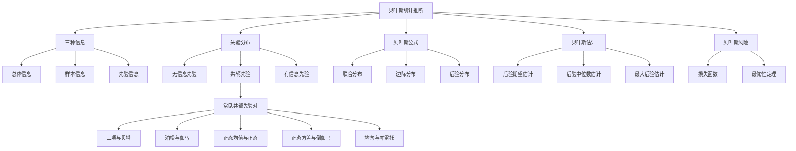

# 6.5 贝叶斯估计

> [!abstract] 本节概览
> 本节介绍贝叶斯学派的基本思想与方法。核心逻辑链条：==先验分布== $\pi(\theta)$ + 样本似然 $p(\boldsymbol{x}|\theta)$ $\xrightarrow{\text{贝叶斯公式}}$ ==后验分布== $\pi(\theta|\boldsymbol{x})$ $\xrightarrow{\text{后验期望}}$ ==贝叶斯估计== $\hat{\theta}_B$。
>
> **逻辑链条**：[[#一、贝叶斯统计的基本思想|基本思想]] → [[#二、先验分布与后验分布|先验与后验]] → [[#三、贝叶斯估计量|贝叶斯估计量]] → [[#四、共轭先验分布|共轭先验]] → [[#五、贝叶斯风险|贝叶斯风险]] → [[#六、贝叶斯估计与经典估计的比较|比较分析]]
>
> **前置依赖**：[[6.1 点估计的概念与无偏性]]（点估计基本概念）、[[6.4 最小方差无偏估计]]（估计量评价）、[[1.4 条件概率]]（贝叶斯公式的事件形式）、[[2.5 常用连续分布]]（贝塔分布、伽马分布等）。
>
> **核心主线**：贝叶斯估计的核心逻辑是"先验+样本→后验"。与频率学派不同，贝叶斯学派将参数视为随机变量，利用先验分布编码已有知识，通过贝叶斯公式更新为后验分布，基于后验分布进行推断。共轭先验使计算大为简化。

**相关笔记**：[[6.1 点估计的概念与无偏性]] | [[6.2 矩估计及相合性]] | [[6.3 最大似然估计与EM算法]] | [[6.4 最小方差无偏估计]] | [[1.4 条件概率]] | [[2.4 常用离散分布]] | [[2.5 常用连续分布]]

---

## 一、贝叶斯统计的基本思想

### 频率学派 vs 贝叶斯学派

统计学中有两个大的学派：**频率学派**（也称经典学派）和**贝叶斯学派**。本书主要介绍频率学派的理论和方法，本节对贝叶斯学派做介绍。

两派的核心分歧在于对**未知参数**的认识：

| 比较维度 | 频率学派（经典学派） | 贝叶斯学派 |
|:---:|:---:|:---:|
| 参数 $\theta$ | 未知但**固定**的常数 | **随机变量**，有概率分布 |
| 概率函数记法 | $p(x;\theta)$（分号） | $p(x\mid\theta)$（竖线，条件概率） |
| 信息来源 | 总体信息 + 样本信息 | 总体信息 + 样本信息 + ==先验信息== |
| 推断基础 | 似然函数 | 后验分布 |
| 估计方法 | 最大似然估计、矩估计等 | 后验期望、后验中位数、最大后验等 |

### 统计推断的三种信息

贝叶斯学派认为统计推断应使用三种信息：

1. **总体信息**：总体分布或总体所属分布族提供的信息。例如已知"总体是正态分布"，则总体的一切阶矩都存在，密度函数关于均值对称，所有性质由一、二阶矩决定。
2. **样本信息**：抽取样本所得观测值提供的信息。这是最"新鲜"的信息，越多越好。
3. **先验信息**：抽样（试验）之前有关统计问题的一些信息，来源于经验和历史资料。

> [!example] 例 6.5.1（先验信息的直观理解）
> 在某工厂的产品中每天要抽检 $n$ 件以确定产品质量。产品质量可用不合格品率 $p$ 度量，也可用 $n$ 件抽查产品中的不合格品件数 $\theta$ 表示。由于生产过程有连续性，每天的产品质量有关联，在估计现在的 $p$ 时，以前积累的历史资料应该可供使用。这些积累的历史资料就是**先验信息**。
>
> 对先验信息进行加工，可对过去 $n$ 件产品中的不合格品件数 $\theta$ 构造一个分布：
>
> $$
> P(\theta = i) = \pi_i, \quad i = 1, 2, \cdots, n. \tag{6.5.1}
> $$
>
> 这种对先验信息进行加工获得的分布称为**先验分布**。

### 贝叶斯学派的基本观点

贝叶斯学派的基本观点可以概括为：

1. 任一未知量 $\theta$ 都可看作**随机变量**，可用一个概率分布去描述；
2. 在获得样本之前，这个分布称为**先验分布** $\pi(\theta)$；
3. 在获得样本之后，总体分布、样本与先验分布通过贝叶斯公式结合，得到关于 $\theta$ 的新分布——**后验分布** $\pi(\theta|\boldsymbol{x})$；
4. 任何关于 $\theta$ 的统计推断都应该基于 $\theta$ 的后验分布进行。

> 关于未知量是否可看作随机变量，经典学派与贝叶斯学派间争论了很长时间。如今经典学派已不反对这一观点。著名的美国经典统计学家**莱曼（Lehmann, E.L.）**在其《点估计理论》中写道："把统计问题中的参数看作随机变量的实现要比看作未知参数更合理一些。"如今两派的争论焦点是：**如何利用各种先验信息合理地确定先验分布**。

---

## 二、先验分布与后验分布

### 贝叶斯公式的密度函数形式

> [!def] 定义 6.5.1（先验分布）
> 设 $\theta$ 是总体分布 $p(x;\theta)$ 中的参数，根据参数 $\theta$ 的先验信息所确定的 $\theta$ 的概率分布 $\pi(\theta)$ 称为 $\theta$ 的**先验分布**。

> [!def] 定义 6.5.2（后验分布）
> 在获得样本观测值 $\boldsymbol{x} = (x_1, x_2, \cdots, x_n)$ 之后，利用贝叶斯公式将先验分布 $\pi(\theta)$ 更新为 $\theta$ 的**后验分布** $\pi(\theta|\boldsymbol{x})$。

贝叶斯公式的密度函数形式推导如下（共五步）：

**第一步：条件概率函数**

总体依赖于参数 $\theta$ 的概率函数在经典统计中记为 $p(x;\theta)$，在贝叶斯统计中应记为 $p(x|\theta)$，表示在随机变量 $\theta$ 取某个给定值时总体的**条件概率函数**。

**第二步：确定先验分布**

根据参数 $\theta$ 的先验信息确定先验分布 $\pi(\theta)$。

**第三步：联合条件概率函数**

从贝叶斯观点看，样本 $\boldsymbol{X} = (X_1, X_2, \cdots, X_n)$ 的产生分两步进行：
- 首先从先验分布 $\pi(\theta)$ 产生一个个体 $\theta_0$（"老天爷"做的，人们看不到）；
- 然后从 $p(\boldsymbol{X}|\theta_0)$ 中产生一组样本。

样本的**联合条件概率函数**为：

$$
p(\boldsymbol{X}|\theta_0) = p(x_1, x_2, \cdots, x_n|\theta_0) = \prod_{i=1}^{n} p(x_i|\theta_0)
$$

**第四步：联合分布**

由于 $\theta_0$ 不可知，需要用 $\pi(\theta)$ 对 $\theta$ 的所有可能值进行综合。样本 $\boldsymbol{X}$ 和参数 $\theta$ 的**联合分布**为：

$$
h(\boldsymbol{x}, \theta) = p(\boldsymbol{x}|\theta)\pi(\theta)
$$

**第五步：后验分布**

将联合分布分解为 $h(\boldsymbol{x}, \theta) = \pi(\theta|\boldsymbol{x})m(\boldsymbol{x})$，其中 $m(\boldsymbol{x})$ 是 $\boldsymbol{X}$ 的边际概率函数：

$$
m(\boldsymbol{X}) = \int_{\Theta} h(\boldsymbol{X}, \theta)\,d\theta = \int_{\Theta} p(\boldsymbol{X}|\theta)\pi(\theta)\,d\theta \tag{6.5.2}
$$

$m(\boldsymbol{X})$ 与 $\theta$ 无关，不含 $\theta$ 的任何信息。因此能用来对 $\theta$ 作出推断的仅是条件分布 $\pi(\theta|\boldsymbol{X})$：

$$
\boxed{\pi(\theta|\boldsymbol{x}) = \frac{h(\boldsymbol{x}, \theta)}{m(\boldsymbol{x})} = \frac{p(\boldsymbol{x}|\theta)\pi(\theta)}{\int_{\Theta} p(\boldsymbol{x}|\theta)\pi(\theta)\,d\theta}} \tag{6.5.3}
$$

> [!thm] 定理 6.5.1（贝叶斯公式的密度形式）
> 公式 (6.5.3) 就是用密度函数表示的贝叶斯公式。后验分布 $\pi(\theta|\boldsymbol{x})$ 集中了总体、样本和先验中有关 $\theta$ 的一切信息，是用总体和样本对先验分布 $\pi(\theta)$ 作调整的结果，它要比 $\pi(\theta)$ 更接近 $\theta$ 的实际情况。

> [!example] 例 6.5.2（二项分布的后验分布）
> 设某事件 $A$ 在一次试验中发生的概率为 $\theta$，对试验进行了 $n$ 次独立观测，其中事件 $A$ 发生了 $X$ 次。显然 $X|\theta \sim b(n,\theta)$：
>
> $$
> P(X=x|\theta) = \binom{n}{x}\theta^x(1-\theta)^{n-x}, \quad x = 0, 1, \cdots, n.
> $$
>
> 若试验前对事件 $A$ 没有了解，贝叶斯建议采用"同等无知"原则，使用 $U(0,1)$ 作为 $\theta$ 的先验分布（**贝叶斯假设**）。
>
> **求解过程**：
>
> 写出 $X$ 和 $\theta$ 的联合分布：
>
> $$
> h(x, \theta) = \binom{n}{x}\theta^x(1-\theta)^{n-x} \cdot I_{\{0<\theta<1\}}, \quad x = 0, 1, \cdots, n.
> $$
>
> 求 $X$ 的边际分布：
>
> $$
> m(x) = \binom{n}{x}\int_0^1 \theta^x(1-\theta)^{n-x}\,d\theta = \binom{n}{x}\frac{\Gamma(x+1)\Gamma(n-x+1)}{\Gamma(n+2)}.
> $$
>
> 后验分布：
>
> $$
> \pi(\theta|x) = \frac{h(x,\theta)}{m(x)} = \frac{\Gamma(n+2)}{\Gamma(x+1)\Gamma(n-x+1)}\theta^{(x+1)-1}(1-\theta)^{(n-x+1)-1}, \quad 0 < \theta < 1.
> $$
>
> 即 $\theta|x \sim Be(x+1, n-x+1)$。

---

## 三、贝叶斯估计量

> [!def] 定义 6.5.3（贝叶斯估计量）
> 由后验分布 $\pi(\theta|\boldsymbol{x})$ 估计 $\theta$ 有三种常用方法：
>
> | 估计方法 | 定义 | 说明 |
> |:---:|:---:|:---:|
> | ==最大后验估计== | 后验密度函数的最大值点 | 使后验概率最大的 $\theta$ |
> | 后验中位数估计 | 后验分布的中位数 | 对异常值稳健 |
> | ==后验期望估计==（贝叶斯估计） | 后验分布的均值 $\hat{\theta}_B = E(\theta|\boldsymbol{x})$ | **使用最频繁** |
>
> 在不注明的情况下，通常提到的"贝叶斯估计"指**后验期望估计**，记为 $\hat{\theta}_B$。

### 损失函数与贝叶斯估计的关系

三种贝叶斯估计分别对应不同的损失函数：

| 损失函数 $L(\theta, \hat{\theta})$ | 对应的贝叶斯估计 |
|:---:|:---:|
| 平方损失 $L = (\theta - \hat{\theta})^2$ | 后验期望 $\hat{\theta}_B = E(\theta|\boldsymbol{x})$ |
| 绝对损失 $L = |\theta - \hat{\theta}|$ | 后验中位数 |
| 0-1损失 $L = \begin{cases}0 & |\theta-\hat{\theta}|<\varepsilon \\ 1 & \text{否则}\end{cases}$ | 后验众数（最大后验估计） |

> [!example] 例 6.5.3（正态-正态共轭的贝叶斯估计）
> 设 $x_1, x_2, \cdots, x_n$ 是来自 $N(\mu, \sigma_0^2)$ 的样本，$\sigma_0^2$ 已知，$\mu$ 未知。假设 $\mu$ 的先验分布为 $N(\theta, \tau^2)$，其中先验均值 $\theta$ 和先验方差 $\tau^2$ 均已知。求 $\mu$ 的贝叶斯估计。
>
> **解**：样本分布和先验分布分别为：
>
> $$
> p(\boldsymbol{X}|\mu) = (2\pi\sigma_0^2)^{-n/2}\exp\left\{-\frac{1}{2\sigma_0^2}\sum_{i=1}^{n}(x_i-\mu)^2\right\}
> $$
>
> $$
> \pi(\mu) = (2\pi\tau^2)^{-1/2}\exp\left\{-\frac{1}{2\tau^2}(\mu-\theta)^2\right\}
> $$
>
> 联合分布 $h(\boldsymbol{X},\mu) = p(\boldsymbol{X}|\mu)\pi(\mu)$，记 $\bar{x} = \frac{1}{n}\sum_{i=1}^{n}x_i$，令：
>
> $$
> A = \frac{n}{\sigma_0^2} + \frac{1}{\tau^2}, \quad B = \frac{n\bar{x}}{\sigma_0^2} + \frac{\theta}{\tau^2}, \quad C = \frac{\sum_{i=1}^{n}x_i^2}{\sigma_0^2} + \frac{\theta^2}{\tau^2}
> $$
>
> 完成平方：
>
> $$
> h(\boldsymbol{X},\mu) = k_1\exp\left\{-\frac{1}{2}\left[A\mu^2 - 2B\mu + C\right]\right\} = k_1\exp\left\{-\frac{(\mu - B/A)^2}{2/A} - \frac{1}{2}(C - B^2/A)\right\}
> $$
>
> 积分得边际密度 $m(\boldsymbol{X})$，应用贝叶斯公式得后验分布：
>
> $$
> \mu|\boldsymbol{X} \sim N\left(\frac{n\bar{x}\sigma_0^{-2} + \theta\tau^{-2}}{n\sigma_0^{-2} + \tau^{-2}},\; \frac{1}{n\sigma_0^{-2} + \tau^{-2}}\right)
> $$
>
> **贝叶斯估计**（后验均值）为：
>
> $$
> \boxed{\hat{\mu}_B = \frac{n/\sigma_0^2}{n/\sigma_0^2 + 1/\tau^2}\bar{x} + \frac{1/\tau^2}{n/\sigma_0^2 + 1/\tau^2}\theta}
> $$
>
> 这是样本均值 $\bar{x}$ 与先验均值 $\theta$ 的**加权平均**。当 $\sigma_0^2$ 较小或 $n$ 较大时，$\bar{x}$ 的权重较大；当 $\tau^2$ 较小时，$\theta$ 的权重较大。

### 贝叶斯估计 vs 最大似然估计的直观比较

沿用例 6.5.2 的结果，$\hat{\theta}_B = \dfrac{x+1}{n+2}$，而最大似然估计 $\hat{\theta}_M = \dfrac{x}{n}$。

| 场景 | $\hat{\theta}_M$ | $\hat{\theta}_B$ | 分析 |
|:---:|:---:|:---:|:---|
| 抽检3个全合格（$x=0$） | $0$ | $1/(3+2)=0.20$ | 贝叶斯估计更合理，不会得出"不合格率为0"的极端结论 |
| 抽检10个全合格（$x=0$） | $0$ | $1/(10+2)=0.083$ | 样本量更大，估计更接近0 |
| 抽检3个全不合格（$x=3$） | $1$ | $(3+1)/(3+2)=0.80$ | 贝叶斯估计不会得出"不合格率为1"的极端结论 |
| 抽检10个全不合格（$x=10$） | $1$ | $(10+1)/(10+2)=0.917$ | 样本量更大，估计更接近1 |

**结论**：在极端情况下（全成功或全失败），贝叶斯估计比最大似然估计更符合人们的直觉。

---

## 四、共轭先验分布

> [!def] 定义 6.5.4（共轭先验分布）
> 设 $\theta$ 是总体分布 $p(x;\theta)$ 中的参数，$\pi(\theta)$ 是其先验分布。若对任意来自 $p(x;\theta)$ 的样本观测值得到的后验分布 $\pi(\theta|\boldsymbol{X})$ 与 $\pi(\theta)$ **属于同一个分布族**，则称该分布族是 $\theta$ 的**共轭先验分布（族）**。

先验分布中的未知参数称为**超参数**，应尽力对各种先验信息进行加工获得超参数的估计。

### 常见共轭先验对汇总

| 总体分布 | 参数 | 共轭先验分布 | 后验分布 |
|:---:|:---:|:---:|:---:|
| 二项分布 $b(n,\theta)$ | 成功概率 $\theta$ | 贝塔分布 $Be(a,b)$ | $Be(x+a, n-x+b)$ |
| 负二项分布 $Nb(r,\theta)$ | 成功概率 $\theta$ | 贝塔分布 $Be(a,b)$ | $Be(nr+a, \sum x_i-nr+b)$ |
| 泊松分布 $P(\theta)$ | 均值 $\theta$ | 伽马分布 $Ga(\alpha,\lambda)$ | $Ga(\sum x_i+\alpha, \lambda+n)$ |
| 指数分布 $Exp(\theta)$ | 参数 $\theta$ | 伽马分布 $Ga(\alpha,\lambda)$ | $Ga(n+\alpha, \lambda+\sum x_i)$ |
| 正态分布 $N(\theta,\sigma_0^2)$（$\sigma_0^2$已知） | 均值 $\theta$ | 正态分布 $N(\mu,\tau^2)$ | $N\!\left(\dfrac{n\bar{x}/\sigma_0^2+\mu/\tau^2}{n/\sigma_0^2+1/\tau^2},\;\dfrac{1}{n/\sigma_0^2+1/\tau^2}\right)$ |
| 正态分布 $N(\mu_0,\theta)$（$\mu_0$已知） | 方差 $\theta$ | 倒伽马分布 $IGa(\alpha,\lambda)$ | $IGa\!\left(\alpha+\dfrac{n}{2},\;\lambda+\dfrac{1}{2}\sum(x_i-\mu_0)^2\right)$ |
| 均匀分布 $U(0,\theta)$ | 上界 $\theta$ | 帕雷托分布 $PA(\beta,\theta_0)$ | $PA(n+\beta, \max\{x_{(n)},\theta_0\})$ |
| 多项分布 $M(n,\boldsymbol{\theta})$ | 概率向量 $\boldsymbol{\theta}$ | 狄利克雷分布 $D(\boldsymbol{\alpha})$ | $D(\boldsymbol{\alpha}+\boldsymbol{x})$ |

> [!example] 例 6.5.4（二项-贝塔共轭）
> 在例 6.5.2 中，$U(0,1)$ 是贝塔分布的特例 $Be(1,1)$，后验分布为 $Be(x+1, n-x+1)$。更一般地，设 $\theta$ 的先验分布为 $Be(a,b)$，$a>0, b>0$，则后验分布为 $Be(x+a, n-x+b)$。这说明**贝塔分布是伯努利试验中成功概率的共轭先验分布**。

> [!example] 例 6.5.5（泊松-伽马共轭）
> 设 $X_1, \cdots, X_n$ i.i.d. $\sim P(\theta)$，$\theta$ 的先验分布为 $Ga(\alpha,\lambda)$，则：
>
> $$
> \pi(\theta|\boldsymbol{x}) \propto \theta^{\sum x_i}\cdot e^{-n\theta} \cdot \theta^{\alpha-1}e^{-\lambda\theta} = \theta^{\sum x_i+\alpha-1}e^{-(\lambda+n)\theta}
> $$
>
> 即 $\theta|\boldsymbol{x} \sim Ga\!\left(\sum_{i=1}^{n}x_i+\alpha,\; \lambda+n\right)$，仍为伽马分布。

---

## 五、贝叶斯风险

> [!def] 定义 6.5.5（贝叶斯风险）
> 设损失函数为 $L(\theta, \delta)$，其中 $\delta = \delta(\boldsymbol{x})$ 是决策函数（估计量），则 $\delta$ 的**贝叶斯风险**定义为：
>
> $$
> R_B(\delta) = E_{(\theta, \boldsymbol{X})}[L(\theta, \delta(\boldsymbol{X}))] = \int_{\Theta}\int_{\mathcal{X}} L(\theta, \delta(\boldsymbol{x}))p(\boldsymbol{x}|\theta)\pi(\theta)\,d\boldsymbol{x}\,d\theta
> $$
>
> 也可以写为：
>
> $$
> R_B(\delta) = E_\theta\left[E_{\boldsymbol{X}|\theta}[L(\theta, \delta(\boldsymbol{X}))]\right] = E_\theta[r(\theta, \delta)]
> $$
>
> 其中 $r(\theta, \delta) = E_{\boldsymbol{X}|\theta}[L(\theta, \delta(\boldsymbol{X}))]$ 是**风险函数**（即频率学派中的[[6.4 最小方差无偏估计|均方误差]]等概念）。

> [!thm] 定理 6.5.2（贝叶斯估计的最优性）
> 在平方损失函数 $L(\theta, \delta) = (\theta - \delta)^2$ 下，使贝叶斯风险 $R_B(\delta)$ 达到最小的估计量就是**后验期望估计** $\hat{\theta}_B = E(\theta|\boldsymbol{x})$。

> [!abstract] 证明
> **证明**：
>
> **第一步：展开贝叶斯风险**
>
> $$
> R_B(\delta) = E_{(\theta,\boldsymbol{X})}[(\theta - \delta(\boldsymbol{X}))^2] = E_{\boldsymbol{X}}\left[E_{\theta|\boldsymbol{X}}[(\theta - \delta(\boldsymbol{X}))^2]\right]
> $$
>
> **第二步：对内层期望关于 $\delta(\boldsymbol{x})$ 求最小**
>
> 对固定的 $\boldsymbol{x}$，最小化 $E_{\theta|\boldsymbol{x}}[(\theta - \delta)^2]$。由条件期望的性质：
>
> $$
> E_{\theta|\boldsymbol{x}}[(\theta - \delta)^2] = \text{Var}(\theta|\boldsymbol{x}) + (E(\theta|\boldsymbol{x}) - \delta)^2 \geq \text{Var}(\theta|\boldsymbol{x})
> $$
>
> 等号成立当且仅当 $\delta = E(\theta|\boldsymbol{x}) = \hat{\theta}_B$。
>
> **第三步：结论**
>
> 由于上述不等式对每个 $\boldsymbol{x}$ 都成立，因此后验期望估计 $\hat{\theta}_B$ 使贝叶斯风险达到最小。
>
> $\square$

> [!example] 例 6.5.6（贝叶斯估计优于无偏估计的例子）
> 设总体 $X \sim Exp(1/\theta)$，$x_1, \cdots, x_n$ 是样本。$\theta$ 的最大似然估计和矩估计都是 $\bar{x}$，它是无偏估计。考虑形如 $\hat{\theta}_a = a\bar{x}$ 的估计，在均方误差准则下可以找到优于 $\bar{x}$ 的估计（即 $a \neq 1$ 时 MSE 更小）。这说明在均方误差意义下，有偏的贝叶斯估计可能优于无偏的经典估计。

---

## 六、贝叶斯估计与经典估计的比较

| 比较维度 | 经典估计（频率学派） | 贝叶斯估计 |
|:---:|:---:|:---:|
| 参数观 | 固定未知常数 | 随机变量 |
| 信息利用 | 总体 + 样本 | 总体 + 样本 + ==先验== |
| 推断依据 | 似然函数 | 后验分布 |
| 无偏性 | 重要评价标准 | 不要求无偏 |
| 小样本表现 | 依赖大样本渐近 | 可利用先验改善小样本推断 |
| 主观性 | "客观"（但模型选择有主观性） | 先验选择有主观性 |
| 计算复杂度 | 通常较低 | 后验积分可能需要数值方法 |
| 区间估计 | 置信区间（频率解释） | 可信区间（后验概率解释） |

**何时选贝叶斯方法**：
- 有可用的先验信息（历史数据、专家经验）
- 样本量较小，需要借助先验信息改善估计
- 需要对参数做概率陈述（如"参数在某个区间的概率"）

**何时选经典方法**：
- 没有可靠的先验信息
- 样本量足够大，渐近理论适用
- 需要保证频率性质（如覆盖概率）

---

## 七、知识结构总览

---

## 八、核心思想与解题技巧

### 核心思想

1. **贝叶斯学习的本质**：后验分布 $\propto$ 似然函数 $\times$ 先验分布，即"数据更新信念"。
2. **共轭先验的计算技巧**：只需关注后验分布的"核"（与 $\theta$ 有关的部分），忽略归一化常数。
3. **后验分布的直观理解**：先验分布提供"基线"，数据通过似然函数对其进行"修正"，得到后验分布。

### 解题步骤模板

**求贝叶斯估计的一般步骤**：

1. 写出似然函数 $p(\boldsymbol{x}|\theta) = \prod_{i=1}^{n}p(x_i|\theta)$
2. 写出先验分布 $\pi(\theta)$
3. 写出联合分布 $h(\boldsymbol{x},\theta) = p(\boldsymbol{x}|\theta)\pi(\theta)$
4. 提取后验核 $\pi(\theta|\boldsymbol{x}) \propto h(\boldsymbol{x},\theta)$（仅保留与 $\theta$ 有关的部分）
5. 识别后验分布所属的分布族，确定参数
6. 计算后验期望 $E(\theta|\boldsymbol{x})$ 作为贝叶斯估计

**验证共轭先验的一般步骤**：

1. 设先验为某分布族 $\pi(\theta)$
2. 计算后验核 $\pi(\theta|\boldsymbol{x}) \propto p(\boldsymbol{x}|\theta)\pi(\theta)$
3. 检查后验核是否可以写成与先验相同分布族的形式
4. 如果可以，读出后验参数，验证共轭性

---

## 九、补充理解与易混淆点

### 误区一："先验分布就是均匀分布"
**来源**：茆诗松教材§6.5 + Eggers(2005)贝叶斯推断误解 + CSDN频率学派vs贝叶斯学派争论 + Berkeley Stat210A概率解释讲义 + Book118先验分布选择策略
> [!danger] 误区1："贝叶斯估计必须使用均匀分布作为先验"
> ❌ 错误解释：贝叶斯本人建议在无先验信息时使用均匀分布（贝叶斯假设），因此所有贝叶斯估计都应该用均匀分布作为先验。
> ✅ 正确解释：均匀先验只是**无信息先验**的一种选择，且并非总是合适的。例如，对位置参数均匀先验可能合理，但对尺度参数则不合理（应考虑 Jeffreys 先验等）。实际应用中，应根据问题背景选择合适的先验分布，共轭先验是常用选择。

### 误区二："后验分布就是似然函数归一化"
**来源**：茆诗松教材§6.5 + Eggers(2005)似然与后验混淆 + CSDN贝叶斯学派参数估计 + Columbia贝叶斯模型讲义 + Book118共轭先验选择
> [!danger] 误区2："当先验是均匀分布时，后验分布等于似然函数"
> ❌ 错误解释：因为 $\pi(\theta|\boldsymbol{x}) \propto p(\boldsymbol{x}|\theta)\pi(\theta)$，当 $\pi(\theta) \propto 1$ 时，后验就等于似然。
> ✅ 正确解释：后验分布的**核**（未归一化的部分）正比于似然函数，但后验分布是一个合法的概率密度函数（积分为1），而似然函数作为 $\theta$ 的函数通常不积分为1。两者在概念上完全不同：后验分布是 $\theta$ 的概率分布，似然函数是数据的概率作为参数的函数。

### 误区三："贝叶斯估计一定比经典估计好"
**来源**：茆诗松教材§6.5例6.5.6 + CSDN频率学派vs贝叶斯学派 + Book118先验分布选择 + Fiveable共轭先验讲义 + CSDN不确定性的两种哲学
> [!danger] 误区3："贝叶斯估计总是优于最大似然估计"
> ❌ 错误解释：贝叶斯估计利用了更多信息（先验），所以一定比经典估计更好。
> ✅ 正确解释：贝叶斯估计的优势依赖于**先验分布的正确选择**。如果先验分布选择不当（如先验均值与真实参数偏离很大），贝叶斯估计可能比最大似然估计更差。当样本量很大时，数据占主导地位，两种方法趋于一致。贝叶斯估计在**小样本**且有**可靠先验信息**时优势明显。

### 误区四："共轭先验是唯一正确的先验选择"
**来源**：茆诗松教材§6.5 + Columbia贝叶斯模型讲义 + Book118共轭先验选择 + CSDN贝叶斯学习原理 + Fiveable共轭先验讲义
> [!danger] 误区4："选择共轭先验是因为它是唯一正确的先验"
> ❌ 错误解释：共轭先验是"正确"的先验分布，必须使用共轭先验。
> ✅ 正确解释：共轭先验的主要优势是**计算方便**——后验分布与先验分布属于同一分布族，只需更新参数即可。但共轭先验不一定能准确反映真实的先验信念。在实际应用中，如果共轭先验不能很好地拟合先验信息，应考虑使用其他先验（如混合先验、非参数先验等），代价是计算更复杂。

### 误区五："参数是随机变量"与"参数有频率意义"
**来源**：茆诗松教材§6.5 + Berkeley Stat210A概率解释讲义 + CSDN频率学派vs贝叶斯学派 + Eggers(2005)贝叶斯推断误解 + Book118先验分布选择策略
> [!danger] 误区5："贝叶斯学派认为参数本身在物理上是随机变化的"
> ❌ 错误解释：贝叶斯学派认为参数 $\theta$ 像掷骰子一样在每次试验中随机取值。
> ✅ 正确解释：贝叶斯学派将参数视为随机变量，是用**概率分布来描述对参数的不确定性**，而非说参数在物理上随机变化。参数的真值是固定的，但我们对其不了解，这种"不了解的程度"用概率分布来量化。这是**主观概率**（epistemic probability）的观点，与频率概率（长期频率）不同。

### 误区六："贝叶斯估计的后验均值一定在参数空间内"
**来源**：茆诗松教材§6.5 + CSDN贝叶斯学派参数估计 + Book118先验分布选择 + Columbia贝叶斯模型讲义 + CSDN不确定性的两种哲学
> [!danger] 误区6："后验期望估计总是合理的点估计"
> ❌ 错误解释：后验均值作为贝叶斯估计，一定落在参数空间内，一定是好的估计。
> ✅ 正确解释：后验均值不一定落在参数空间内。例如，当参数空间有界时（如 $\theta > 0$），后验均值可能在边界附近甚至略微超出（取决于先验和数据的组合）。此外，后验均值受异常值和先验选择的影响，在某些情况下后验中位数或最大后验估计可能更合适。

---

## 十、习题精选

> [!todo] 习题概览
> 本节共 **10** 道习题：6 道教材习题（6.5-1 至 6.5-6）+ 4 道补充题（补充教材6.5-7 至 补充教材6.5-10）。
>
> | 编号 | 题目关键词 | 难度 | 核心考点 |
> |:---:|:---:|:---:|:---:|
> | 6.5-1 | 泊松分布、离散先验 | ★★ | 离散参数的后验分布计算 |
> | 6.5-2 | 均匀分布、均匀先验 | ★★ | 连续参数的后验分布 |
> | 6.5-3 | 几何分布、均匀先验 | ★★☆ | 后验分布 + 贝叶斯估计 |
> | 6.5-4 | 泊松-伽马共轭 | ★★★ | 验证共轭先验 |
> | 6.5-5 | 正态-倒伽马共轭 | ★★★ | 验证共轭先验 |
> | 6.5-6 | 一般总体、两种先验 | ★★ | 不同先验下的后验 |
> | 补充（教材6.5-7） | 幂函数总体、伽马先验 | ★★★ | 后验期望估计 |
> | 补充（教材6.5-8） | 均匀-帕雷托共轭 | ★★★ | 验证共轭 + 贝叶斯估计 |
> | 补充（教材6.5-9） | 指数-伽马、超参数确定 | ★★ | 由矩确定先验参数 |
> | 补充（教材6.5-10） | 多项-狄利克雷共轭 | ★★★ | 多参数共轭先验 |

---

> [!problem] 习题 6.5-1（离散后验分布）
> 设一页书上的错别字个数服从泊松分布 $P(\lambda)$，$\lambda$ 有两个可能取值：$1.5$ 和 $1.8$，且先验分布为
>
> $$
> P(\lambda = 1.5) = 0.45, \quad P(\lambda = 1.8) = 0.55.
> $$
>
> 现检查了一页，发现有 $3$ 个错别字，试求 $\lambda$ 的后验分布。

> [!faq]- 查看解答
> **解**：计算似然：
>
> $$
> P(X=3|\lambda=1.5) = \frac{1.5^3}{3!}e^{-1.5} = \frac{3.375}{6}e^{-1.5} = 0.5625 \cdot e^{-1.5}
> $$
>
> $$
> P(X=3|\lambda=1.8) = \frac{1.8^3}{3!}e^{-1.8} = \frac{5.832}{6}e^{-1.8} = 0.972 \cdot e^{-1.8}
> $$
>
> 边际概率：
>
> $$
> P(X=3) = 0.5625 \cdot e^{-1.5} \cdot 0.45 + 0.972 \cdot e^{-1.8} \cdot 0.55
> $$
>
> 后验分布：
>
> $$
> P(\lambda=1.5|X=3) = \frac{0.5625 \times 0.45 \times e^{-1.5}}{P(X=3)} \approx 0.3899
> $$
>
> $$
> P(\lambda=1.8|X=3) = 1 - 0.3899 = 0.6101
> $$

---

> [!problem] 习题 6.5-2（均匀后验分布）
> 设总体为均匀分布 $U(\theta, \theta+1)$，$\theta$ 的先验分布是均匀分布 $U(10, 16)$。现有三个观测值：$11.7, 12.1, 12.0$，求 $\theta$ 的后验分布。

> [!faq]- 查看解答
> **解**：当 $\theta < x_i < \theta+1$（$i=1,2,3$）且 $10<\theta<16$ 时，联合分布为
>
> $$
> h(x_1,x_2,x_3,\theta) = p(x_1,x_2,x_3|\theta)\pi(\theta) = \frac{1}{6}
> $$
>
> 其中 $x_{(3)}-1 < \theta < x_{(1)}$。此处 $x_{(1)}=11.7, x_{(3)}=12.1$，故 $11.1 < \theta < 11.7$，位于 $(10,16)$ 内。
>
> 后验密度：
>
> $$
> \pi(\theta|x_1,x_2,x_3) = \frac{1/6}{\int_{11.1}^{11.7}(1/6)\,d\theta} = \frac{1}{0.6}
> $$
>
> 即 $\theta|\boldsymbol{x} \sim U(11.1, 11.7)$。

---

> [!problem] 习题 6.5-3（几何分布的后验分布与贝叶斯估计）
> 设 $x_1, x_2, \cdots, x_n$ 是来自几何分布的样本，总体分布列为
>
> $$
> P(X=k|\theta) = \theta(1-\theta)^k, \quad k = 0, 1, 2, \cdots.
> $$
>
> $\theta$ 的先验分布是均匀分布 $U(0,1)$。
> (1) 求 $\theta$ 的后验分布；
> (2) 若 $4$ 次观测值为 $4, 3, 1, 6$，求 $\theta$ 的贝叶斯估计。

> [!faq]- 查看解答
> **解**：
>
> **(1)** 联合密度函数 $h(\boldsymbol{x},\theta) = \theta^n(1-\theta)^{\sum x_i}$，于是
>
> $$
> \pi(\theta|\boldsymbol{x}) = \frac{\theta^n(1-\theta)^{\sum x_i}}{\int_0^1 \theta^n(1-\theta)^{\sum x_i}\,d\theta} = \frac{\Gamma(n+\sum x_i+2)}{\Gamma(n+1)\Gamma(\sum x_i+1)}\theta^n(1-\theta)^{\sum x_i}
> $$
>
> 即 $\theta|\boldsymbol{x} \sim Be(n+1, \sum_{i=1}^{n}x_i+1)$。
>
> **(2)** 观测值为 $4,3,1,6$ 时，$\sum x_i = 14$，后验分布为 $Be(5, 15)$。
>
> $$
> \hat{\theta}_B = \frac{5}{5+15} = 0.25
> $$

---

> [!problem] 习题 6.5-4（泊松-伽马共轭验证）
> 验证：泊松分布的均值 $\lambda$ 的共轭先验分布是伽马分布。

> [!faq]- 查看解答
> **证**：设 $\lambda \sim Ga(\alpha, \beta)$，其密度为 $\pi(\lambda) = \frac{\beta^\alpha}{\Gamma(\alpha)}\lambda^{\alpha-1}e^{-\beta\lambda}$。
>
> 后验分布：
>
> $$
> \pi(\lambda|\boldsymbol{x}) \propto \left(\prod_{i=1}^{n}\frac{\lambda^{x_i}}{x_i!}e^{-\lambda}\right) \cdot \lambda^{\alpha-1}e^{-\beta\lambda} = \lambda^{\sum x_i+\alpha-1}e^{-(\beta+n)\lambda}
> $$
>
> 归一化后：
>
> $$
> \lambda|\boldsymbol{x} \sim Ga\!\left(\sum_{i=1}^{n}x_i+\alpha,\; \beta+n\right)
> $$
>
> 仍为伽马分布，得证。$\square$

---

> [!problem] 习题 6.5-5（正态-倒伽马共轭验证）
> 验证：正态总体方差（均值已知）的共轭先验分布是倒伽马分布。

> [!faq]- 查看解答
> **证**：设 $X|\sigma^2 \sim N(\mu_0, \sigma^2)$（$\mu_0$ 已知），$\sigma^2 \sim IGa(\alpha, \lambda)$，密度为
>
> $$
> \pi(\sigma^2) = \frac{\lambda^\alpha}{\Gamma(\alpha)}\left(\frac{1}{\sigma^2}\right)^{\alpha+1}e^{-\lambda/\sigma^2}
> $$
>
> 后验核：
>
> $$
> \pi(\sigma^2|\boldsymbol{x}) \propto (\sigma^2)^{-n/2}\exp\left\{-\frac{1}{2\sigma^2}\sum(x_i-\mu_0)^2\right\} \cdot \left(\frac{1}{\sigma^2}\right)^{\alpha+1}e^{-\lambda/\sigma^2}
> $$
>
> $$
> = \left(\frac{1}{\sigma^2}\right)^{\alpha+n/2+1}\exp\left\{-\frac{1}{\sigma^2}\left[\lambda+\frac{1}{2}\sum(x_i-\mu_0)^2\right]\right\}
> $$
>
> 即 $\sigma^2|\boldsymbol{x} \sim IGa\!\left(\alpha+\frac{n}{2},\; \lambda+\frac{1}{2}\sum_{i=1}^{n}(x_i-\mu_0)^2\right)$，仍为倒伽马分布，得证。$\square$

---

> [!problem] 习题 6.5-6（不同先验下的后验分布）
> 设 $x_1, x_2, \cdots, x_n$ 是来自如下总体的一个样本
>
> $$
> p(x|\theta) = \frac{2x}{\theta^2}, \quad 0 < x < \theta.
> $$
>
> (1) 若 $\theta$ 的先验分布为均匀分布 $U(0,1)$，求 $\theta$ 的后验分布；
> (2) 若 $\theta$ 的先验分布为 $\pi(\theta) = 3\theta^2$，$0 < \theta < 1$，求 $\theta$ 的后验分布。

> [!faq]- 查看解答
> **解**：似然函数 $p(\boldsymbol{x}|\theta) = \frac{2^n}{\theta^{2n}}\prod_{i=1}^{n}x_i \cdot I_{\{x_{(n)}<\theta\}}$。
>
> **(1)** 先验 $\pi(\theta) = 1$（$0<\theta<1$），后验核 $\propto \theta^{-2n}$（$\theta > x_{(n)}$）：
>
> $$
> \pi(\theta|\boldsymbol{x}) = \frac{\theta^{-2n}}{\int_{x_{(n)}}^1 \theta^{-2n}\,d\theta} = \frac{2n-1}{\theta^{2n}(x_{(n)}^{-2n+1}-1)}, \quad x_{(n)} < \theta < 1.
> $$
>
> **(2)** 先验 $\pi(\theta) = 3\theta^2$，后验核 $\propto \theta^{-2n+2}$（$\theta > x_{(n)}$）：
>
> $$
> \pi(\theta|\boldsymbol{x}) = \frac{\theta^{-2n+2}}{\int_{x_{(n)}}^1 \theta^{-2n+2}\,d\theta} = \frac{2n-3}{\theta^{2n-2}(x_{(n)}^{-2n+3}-1)}, \quad x_{(n)} < \theta < 1.
> $$

---

> [!problem] 补充（教材6.5-7）（伽马先验的后验期望估计）
> 设 $x_1, x_2, \cdots, x_n$ 是来自如下总体的一个样本
>
> $$
> p(x|\theta) = \theta x^{\theta-1}, \quad 0 < x < 1.
> $$
>
> 若取 $\theta$ 的先验分布为伽马分布，即 $\theta \sim Ga(\alpha, \lambda)$，求 $\theta$ 的后验期望估计。

> [!faq]- 查看解答
> **解**：联合分布
>
> $$
> h(\boldsymbol{x},\theta) = \theta^n\prod_{i=1}^{n}x_i^{\theta-1} \cdot \frac{\lambda^\alpha}{\Gamma(\alpha)}\theta^{\alpha-1}e^{-\lambda\theta} = \frac{\lambda^\alpha}{\Gamma(\alpha)}\theta^{n+\alpha-1}\exp\left\{-\theta\left(\lambda-\sum_{i=1}^{n}\ln x_i\right)\right\}\prod_{i=1}^{n}x_i^{-1}
> $$
>
> 后验分布 $\theta|\boldsymbol{x} \sim Ga\!\left(n+\alpha,\; \lambda-\sum_{i=1}^{n}\ln x_i\right)$。
>
> 后验期望估计：
>
> $$
> \hat{\theta}_B = E(\theta|\boldsymbol{x}) = \frac{n+\alpha}{\lambda-\sum_{i=1}^{n}\ln x_i}
> $$

---

> [!problem] 补充（教材6.5-8）（均匀-帕雷托共轭验证与贝叶斯估计）
> 设 $x_1, x_2, \cdots, x_n$ 是来自均匀分布 $U(0,\theta)$ 的样本，$\theta$ 的先验分布是帕雷托分布，其密度函数为
>
> $$
> \pi(\theta) = \frac{\beta\theta_0^\beta}{\theta^{\beta+1}}, \quad \theta > \theta_0,
> $$
>
> 其中 $\beta, \theta_0$ 是两个已知的常数。
> (1) 验证：帕雷托分布是 $\theta$ 的共轭先验分布；
> (2) 求 $\theta$ 的贝叶斯估计。

> [!faq]- 查看解答
> **解**：
>
> **(1)** 联合分布 $h(\boldsymbol{x},\theta) = \theta^{-n} \cdot \frac{\beta\theta_0^\beta}{\theta^{\beta+1}}$，其中 $\theta > \max\{x_{(n)}, \theta_0\}$。
>
> 后验分布：
>
> $$
> \pi(\theta|\boldsymbol{x}) = \frac{\theta^{-(n+\beta+1)}}{\int_{\max\{x_{(n)},\theta_0\}}^{\infty}\theta^{-(n+\beta+1)}\,d\theta} = \frac{(n+\beta)[\max\{x_{(n)},\theta_0\}]^{n+\beta}}{\theta^{n+\beta+1}}, \quad \theta > \max\{x_{(n)},\theta_0\}.
> $$
>
> 这是参数为 $n+\beta+1$ 与 $\max\{x_{(n)},\theta_0\}$ 的帕雷托分布，得证。$\square$
>
> **(2)** 后验期望估计：
>
> $$
> \hat{\theta}_B = \frac{(n+\beta)\max\{x_{(n)},\theta_0\}}{n+\beta-1}
> $$

---

> [!problem] 补充（教材6.5-9）（由先验矩确定超参数）
> 设指数分布 $Exp(\theta)$ 中未知参数 $\theta$ 的先验分布为伽马分布 $Ga(\alpha, \lambda)$，现从先验信息得知：先验均值为 $0.0002$，先验标准差为 $0.01$，试确定先验分布。

> [!faq]- 查看解答
> **解**：伽马分布 $Ga(\alpha, \lambda)$ 的均值和方差分别为 $\alpha/\lambda$ 和 $\alpha/\lambda^2$。由已知条件：
>
> $$
> \begin{cases} \dfrac{\alpha}{\lambda} = 0.0002, \\[6pt] \sqrt{\dfrac{\alpha}{\lambda^2}} = 0.01, \end{cases}
> $$
>
> 解得 $\alpha = 0.0004$，$\lambda = 2$。
>
> 所以 $\theta$ 的先验分布为 $Ga(0.0004, 2)$。

---

> [!problem] 补充（教材6.5-10）（多项-狄利克雷共轭验证）
> 设 $\boldsymbol{x} = (x_1, x_2, \cdots, x_k)$ 服从多项分布 $M(n, \boldsymbol{\theta})$，其概率函数为
>
> $$
> p(\boldsymbol{x};\boldsymbol{\theta}) = \frac{n!}{x_1!x_2!\cdots x_k!}\theta_1^{x_1}\theta_2^{x_2}\cdots\theta_k^{x_k},
> $$
>
> 其中 $\sum_{i=1}^{k}\theta_i = 1$，$\sum_{i=1}^{k}x_i = n$。若 $\boldsymbol{\theta}$ 的先验分布为狄利克雷分布 $D(\boldsymbol{\alpha})$，证明：$\boldsymbol{\theta}$ 的后验分布为 $D(\boldsymbol{\alpha}+\boldsymbol{x})$。

> [!faq]- 查看解答
> **证**：后验概率函数
>
> $$
> \pi(\boldsymbol{\theta}|\boldsymbol{x}) \propto p(\boldsymbol{x}|\boldsymbol{\theta})\pi(\boldsymbol{\theta}) \propto \prod_{i=1}^{k}\theta_i^{x_i} \cdot \prod_{i=1}^{k}\theta_i^{\alpha_i-1} = \prod_{i=1}^{k}\theta_i^{\alpha_i+x_i-1}
> $$
>
> 归一化后即为狄利克雷分布 $D(\boldsymbol{\alpha}+\boldsymbol{x})$，其中 $\boldsymbol{\alpha}+\boldsymbol{x} = (\alpha_1+x_1, \alpha_2+x_2, \cdots, \alpha_k+x_k)$。$\square$

---

## 十一、教材原文

---

#学习/概率论与统计/第六章 参数估计/贝叶斯估计
