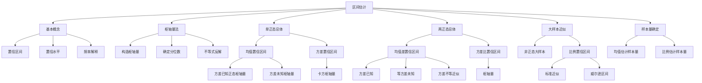

# 6.6 区间估计

**相关笔记**：[[6.1 点估计的概念与无偏性]] | [[6.2 矩估计及相合性]] | [[6.3 最大似然估计与EM算法]] | [[6.4 最小方差无偏估计]] | [[6.5 贝叶斯估计]] | [[5.4 三大抽样分布]] | [[4.4 中心极限定理]] | [[2.5 常用连续分布]]

> [!abstract] 本节概览
> 本节系统介绍==区间估计==的理论与方法。核心逻辑链条：点估计 $\hat{\theta}$ 给出参数的单一数值，而区间估计给出一个随机区间 $[\hat{\theta}^L, \hat{\theta}^U]$，使其以==置信水平== $1-\alpha$ 覆盖未知参数 $\theta$。构造置信区间的核心方法是==枢轴量法==：寻找一个分布已知的枢轴量 $G(X_1,\ldots,X_n,\theta)$，利用其分布的分位数反解出 $\theta$ 的置信区间。
>
> **逻辑链条**：[[#一、区间估计的基本概念|基本概念]] → [[#二、枢轴量法|枢轴量法]] → [[#三、单个正态总体均值的置信区间|单总体均值]] → [[#四、单个正态总体方差的置信区间|单总体方差]] → [[#五、两个正态总体均值差的置信区间|两总体均值差]] → [[#六、两个正态总体方差比的置信区间|两总体方差比]] → [[#七、正态总体置信区间汇总表|汇总表]] → [[#八、大样本置信区间|大样本近似]] → [[#九、样本量的确定|样本量]]
>
> **前置依赖**：[[6.1 点估计的概念与无偏性|§6.1]]（点估计概念）、[[5.4 三大抽样分布|§5.4]]（$\chi^2$ 分布、$t$ 分布、$F$ 分布及分位数）、[[4.4 中心极限定理|§4.4]]（大样本近似）
>
> **核心主线**：区间估计弥补了点估计的不足——不仅给出参数的近似值，还给出估计的精度（区间宽度）和可靠度（置信水平）。枢轴量法是构造置信区间的通用方法：构造分布已知的枢轴量→确定分位数→不等式反解。

---

## 一、区间估计的基本概念

### 点估计 vs 区间估计

[[6.1 点估计的概念与无偏性|§6.1]] 中介绍的点估计用单一数值 $\hat{\theta}$ 去估计未知参数 $\theta$，虽然直观，但无法反映估计的精度和可靠性。==区间估计==弥补了这一不足：它给出一个区间 $[\hat{\theta}^L, \hat{\theta}^U]$，并附带一个概率指标说明该区间包含真值的可靠程度。

**类比**：点估计像说"这座山高 8848 米"，区间估计像说"这座山高约在 8844 到 8852 米之间，我有 95% 的把握"。

### 置信区间的定义

> [!def] 定义 6.6.1 — 置信区间
> 设总体 $X$ 的分布函数 $F(x;\theta)$ 含有未知参数 $\theta \in \Theta$，$X_1, X_2, \ldots, X_n$ 是来自总体 $X$ 的样本。对给定的 $\alpha \in (0,1)$，若存在两个统计量 $\hat{\theta}^L = \hat{\theta}^L(X_1,\ldots,X_n)$ 和 $\hat{\theta}^U = \hat{\theta}^U(X_1,\ldots,X_n)$，使得对一切 $\theta \in \Theta$，有
> $$
> P_\theta\!\left(\hat{\theta}^L \leqslant \theta \leqslant \hat{\theta}^U\right) \geqslant 1 - \alpha,
> $$
> 则称随机区间 $[\hat{\theta}^L, \hat{\theta}^U]$ 为 $\theta$ 的==置信水平==为 $1-\alpha$ 的**置信区间**（confidence interval），$\hat{\theta}^L$ 和 $\hat{\theta}^U$ 分别称为**置信下限**和**置信上限**。

**要点解读**：
- $\hat{\theta}^L$ 和 $\hat{\theta}^U$ 是**统计量**（样本的函数），因此 $[\hat{\theta}^L, \hat{\theta}^U]$ 是一个**随机区间**——每次抽样得到不同的区间。
- $\theta$ 是**未知的固定常数**，不是随机变量。
- 概率 $P_\theta(\cdot)$ 中的随机性来自**样本**，而非参数。

### 置信水平

> [!def] 定义 6.6.2 — 置信水平
> 满足
> $$
> \inf_{\theta \in \Theta} P_\theta\!\left(\hat{\theta}^L \leqslant \theta \leqslant \hat{\theta}^U\right) \geqslant 1 - \alpha
> $$
> 的最大常数 $1-\alpha$ 称为置信区间的==置信水平==（confidence level）。当上式对所有 $\theta$ 取等号时，$1-\alpha$ 就是**精确置信水平**。

### 置信水平的频率解释

> [!thm] 定理 6.6.1 — 置信水平的频率解释
> 若 $[\hat{\theta}^L, \hat{\theta}^U]$ 是参数 $\theta$ 的置信水平为 $1-\alpha$ 的置信区间，则在大量重复抽样中，约有 $(1-\alpha) \times 100\%$ 的区间包含参数真值 $\theta$。

**直观理解**：设想我们反复从同一总体中抽取 $n$ 个样本，每次都构造一个 $1-\alpha$ 置信区间。在这大量（如 100 次）重复中，大约有 $(1-\alpha) \times 100$ 个区间会"套住"真值 $\theta$，而约有 $\alpha \times 100$ 个区间会"落空"。注意：**一旦区间被算出，它要么包含 $\theta$，要么不包含，概率非 0 即 1**。

> [!example] 例 6.6.1 — 正态总体均值置信区间的直观构造
> 设 $X \sim N(\mu, \sigma^2)$，其中 $\sigma^2$ 已知。取容量为 $n$ 的样本 $X_1, \ldots, X_n$，则由 [[5.4 三大抽样分布|§5.4]] 的正态总体抽样定理，
> $$
> \frac{\bar{X} - \mu}{\sigma / \sqrt{n}} \sim N(0,1).
> $$
> 对给定的 $\alpha$，取标准正态分布的 $1-\alpha/2$ 分位数 $u_{1-\alpha/2}$，则
> $$
> P\!\left(-u_{1-\alpha/2} \leqslant \frac{\bar{X}-\mu}{\sigma/\sqrt{n}} \leqslant u_{1-\alpha/2}\right) = 1-\alpha.
> $$
> 对不等式做等价变形（乘以 $\sigma/\sqrt{n}$，再移项），得到
> $$
> P\!\left(\bar{X} - u_{1-\alpha/2} \cdot \frac{\sigma}{\sqrt{n}} \leqslant \mu \leqslant \bar{X} + u_{1-\alpha/2} \cdot \frac{\sigma}{\sqrt{n}}\right) = 1-\alpha.
> $$
> 因此 $\mu$ 的 $1-\alpha$ 置信区间为
> $$
> \left[\bar{X} - u_{1-\alpha/2} \cdot \frac{\sigma}{\sqrt{n}},\; \bar{X} + u_{1-\alpha/2} \cdot \frac{\sigma}{\sqrt{n}}\right].
> $$

---

## 二、枢轴量法

### 枢轴量的定义与构造

> [!def] 定义 6.6.3 — 枢轴量
> 设 $X_1, X_2, \ldots, X_n$ 是来自总体 $F(x;\theta)$ 的样本，$\theta$ 为未知参数。若存在样本和 $\theta$ 的函数
> $$
> G = G(X_1, X_2, \ldots, X_n, \theta),
> $$
> 其分布**不依赖于任何未知参数**（即 $G$ 的分布完全已知），则称 $G$ 为 $\theta$ 的一个==枢轴量==（pivotal quantity）。

**枢轴量的关键特征**：
1. $G$ 同时含有**样本**和**未知参数** $\theta$；
2. $G$ 的分布**完全已知**，不依赖于任何未知参数；
3. 通过对 $G$ 取概率事件 $c \leqslant G \leqslant d$，再反解不等式得到 $\hat{\theta}^L \leqslant \theta \leqslant \hat{\theta}^U$。

### 枢轴量法的一般步骤

> [!thm] 定理 6.6.2 — 枢轴量法三步法
> **第一步：构造枢轴量**。根据总体分布和待估参数，构造一个分布已知的枢轴量 $G(X_1,\ldots,X_n,\theta)$。
>
> **第二步：确定分位数**。对给定的置信水平 $1-\alpha$，选取常数 $c$ 和 $d$（通常取等尾分位数，即 $P(G < c) = P(G > d) = \alpha/2$），使得
> $$
> P(c \leqslant G \leqslant d) = 1 - \alpha.
> $$
>
> **第三步：不等式反解**。由 $c \leqslant G \leqslant d$ 反解出 $\hat{\theta}^L \leqslant \theta \leqslant \hat{\theta}^U$，即得 $\theta$ 的 $1-\alpha$ 置信区间 $[\hat{\theta}^L, \hat{\theta}^U]$。

> [!note] 等尾置信区间的最优性说明
> 对于对称分布（如正态分布、$t$ 分布），取等尾分位数（即 $c$ 和 $d$ 关于分布中心对称）能使置信区间长度 $E_\theta(\hat{\theta}^U - \hat{\theta}^L)$ 最小，从而估计精度最高。对于不对称分布（如 $\chi^2$ 分布、$F$ 分布），等尾区间不一定是最短的，但习惯上仍取等尾分位数以简化计算。

> [!example] 例 6.6.2 — 均匀分布 $U(0,\theta)$ 参数的置信区间
> 设 $X_1, X_2, \ldots, X_n \overset{\text{i.i.d.}}{\sim} U(0,\theta)$，求 $\theta$ 的 $1-\alpha$ 置信区间。
>
> **第一步**：取 $X_{(n)} = \max\{X_1,\ldots,X_n\}$ 为充分统计量。由顺序统计量理论，$X_{(n)}/\theta \sim \text{Beta}(n,1)$，其分布不依赖于 $\theta$，故 $G = X_{(n)}/\theta$ 是枢轴量。
>
> **第二步**：对 $\text{Beta}(n,1)$ 分布，$G$ 的密度函数为 $f(g) = ng^{n-1}$，$0 < g < 1$。取等尾分位数：
> $$
> P(G < c) = c^n = \alpha/2 \implies c = (\alpha/2)^{1/n},
> $$
> $$
> P(G > d) = 1 - d^n = \alpha/2 \implies d = (1-\alpha/2)^{1/n}.
> $$
>
> **第三步**：由 $c \leqslant X_{(n)}/\theta \leqslant d$ 反解得
> $$
> \frac{X_{(n)}}{(1-\alpha/2)^{1/n}} \leqslant \theta \leqslant \frac{X_{(n)}}{(\alpha/2)^{1/n}}.
> $$

---

## 三、单个正态总体均值的置信区间

设 $X_1, X_2, \ldots, X_n \overset{\text{i.i.d.}}{\sim} N(\mu, \sigma^2)$，样本均值 $\bar{X} = \frac{1}{n}\sum_{i=1}^n X_i$，样本方差 $S^2 = \frac{1}{n-1}\sum_{i=1}^n (X_i - \bar{X})^2$。

### 情形一：$\sigma^2$ 已知

> [!thm] 定理 6.6.3 — $\sigma^2$ 已知时 $\mu$ 的置信区间
> 当 $\sigma^2$ 已知时，$\mu$ 的 $1-\alpha$ 置信区间为
> $$
> \left[\bar{X} - u_{1-\alpha/2} \cdot \frac{\sigma}{\sqrt{n}},\; \bar{X} + u_{1-\alpha/2} \cdot \frac{\sigma}{\sqrt{n}}\right],
> $$
> 其中 $u_{1-\alpha/2}$ 为标准正态分布的 $1-\alpha/2$ 分位数。

> [!abstract] 证明
> **证明**：
>
> **第一步：构造枢轴量**。由正态总体抽样定理，
>
> $$
> \frac{\bar{X} - \mu}{\sigma/\sqrt{n}} \sim N(0,1).
> $$
>
> 该枢轴量分布不依赖于任何未知参数。
>
> **第二步：确定分位数**。取 $P(-u_{1-\alpha/2} \leqslant G \leqslant u_{1-\alpha/2}) = 1-\alpha$。
>
> **第三步：不等式反解**。由 $-u_{1-\alpha/2} \leqslant \frac{\bar{X}-\mu}{\sigma/\sqrt{n}} \leqslant u_{1-\alpha/2}$，乘以 $\sigma/\sqrt{n}$ 并移项即得。
>
> $\square$

### 情形二：$\sigma^2$ 未知

> [!thm] 定理 6.6.4 — $\sigma^2$ 未知时 $\mu$ 的置信区间
> 当 $\sigma^2$ 未知时，$\mu$ 的 $1-\alpha$ 置信区间为
> $$
> \left[\bar{X} - t_{1-\alpha/2}(n-1) \cdot \frac{S}{\sqrt{n}},\; \bar{X} + t_{1-\alpha/2}(n-1) \cdot \frac{S}{\sqrt{n}}\right],
> $$
> 其中 $t_{1-\alpha/2}(n-1)$ 为自由度 $n-1$ 的 $t$ 分布的 $1-\alpha/2$ 分位数。

> [!abstract] 证明
> **证明**：
>
> **第一步：构造枢轴量**。由 [[5.4 三大抽样分布|Fisher 引理]]，$\bar{X}$ 与 $S^2$ 独立，且
>
> $$
> \frac{\bar{X}-\mu}{S/\sqrt{n}} = \frac{(\bar{X}-\mu)/(\sigma/\sqrt{n})}{\sqrt{S^2/\sigma^2}} \sim t(n-1).
> $$
>
> **第二步：确定分位数**。取 $P\!\left(-t_{1-\alpha/2}(n-1) \leqslant t \leqslant t_{1-\alpha/2}(n-1)\right) = 1-\alpha$。
>
> **第三步：不等式反解**。同上，乘以 $S/\sqrt{n}$ 并移项。
>
> $\square$

> [!example] 例 6.6.3 — 正态总体均值的置信区间计算
> 设某工厂生产的零件长度服从正态分布 $N(\mu, \sigma^2)$。从中随机抽取 $n=16$ 个零件，测得 $\bar{x} = 10.5$ mm，$s = 0.8$ mm。求 $\mu$ 的 95% 置信区间。
>
> **解**：$\sigma^2$ 未知，使用 $t$ 枢轴量。$n=16$，自由度 $\nu = 15$，$\alpha = 0.05$。
> $$
> t_{0.975}(15) \approx 2.131.
> $$
> 置信区间为
> $$
> \left[10.5 - 2.131 \times \frac{0.8}{\sqrt{16}},\; 10.5 + 2.131 \times \frac{0.8}{\sqrt{16}}\right] = [10.5 - 0.426,\; 10.5 + 0.426] = [10.074,\; 10.926].
> $$
> 即有 95% 的置信度认为零件平均长度在 $[10.074, 10.926]$ mm 之间。

---

## 四、单个正态总体方差的置信区间

> [!thm] 定理 6.6.5 — $\sigma^2$ 的置信区间
> 设 $X_1, \ldots, X_n \overset{\text{i.i.d.}}{\sim} N(\mu, \sigma^2)$，则 $\sigma^2$ 的 $1-\alpha$ 置信区间为
> $$
> \left[\frac{(n-1)S^2}{\chi^2_{1-\alpha/2}(n-1)},\; \frac{(n-1)S^2}{\chi^2_{\alpha/2}(n-1)}\right],
> $$
> 其中 $\chi^2_{\alpha/2}(n-1)$ 和 $\chi^2_{1-\alpha/2}(n-1)$ 分别为 $\chi^2(n-1)$ 分布的 $\alpha/2$ 和 $1-\alpha/2$ 分位数。

> [!abstract] 证明
> **证明**：
>
> **第一步：构造枢轴量**。由 Fisher 引理，
>
> $$
> \chi^2 = \frac{(n-1)S^2}{\sigma^2} \sim \chi^2(n-1).
> $$
>
> **第二步：确定分位数**。取等尾分位数使得
>
> $$
> P\!\left(\chi^2_{\alpha/2}(n-1) \leqslant \frac{(n-1)S^2}{\sigma^2} \leqslant \chi^2_{1-\alpha/2}(n-1)\right) = 1-\alpha.
> $$
>
> **第三步：不等式反解**。对不等式取倒数（注意不等号方向反转），再乘以 $(n-1)S^2$：
>
> $$
> \frac{(n-1)S^2}{\chi^2_{1-\alpha/2}(n-1)} \leqslant \sigma^2 \leqslant \frac{(n-1)S^2}{\chi^2_{\alpha/2}(n-1)}.
> $$
>
> $\square$

> [!example] 例 6.6.4 — 正态总体方差的置信区间计算
> 沿用例 6.6.3 的数据：$n=16$，$s^2 = 0.64$，求 $\sigma^2$ 的 95% 置信区间。
>
> **解**：自由度 $\nu = 15$，查 $\chi^2$ 分布表：
> $$
> \chi^2_{0.025}(15) = 6.262, \quad \chi^2_{0.975}(15) = 27.488.
> $$
> 置信区间为
> $$
> \left[\frac{15 \times 0.64}{27.488},\; \frac{15 \times 0.64}{6.262}\right] = \left[\frac{9.6}{27.488},\; \frac{9.6}{6.262}\right] = [0.349,\; 1.533].
> $$

---

## 五、两个正态总体均值差的置信区间

设 $X_1, \ldots, X_m \overset{\text{i.i.d.}}{\sim} N(\mu_1, \sigma_1^2)$，$Y_1, \ldots, Y_n \overset{\text{i.i.d.}}{\sim} N(\mu_2, \sigma_2^2)$，两组样本独立。

### 情形一：$\sigma_1^2, \sigma_2^2$ 均已知

> [!thm] 定理 6.6.6 — 方差已知时 $\mu_1 - \mu_2$ 的置信区间
> 当 $\sigma_1^2, \sigma_2^2$ 已知时，$\mu_1 - \mu_2$ 的 $1-\alpha$ 置信区间为
> $$
> \left[\bar{X}-\bar{Y} - u_{1-\alpha/2}\sqrt{\frac{\sigma_1^2}{m}+\frac{\sigma_2^2}{n}},\; \bar{X}-\bar{Y} + u_{1-\alpha/2}\sqrt{\frac{\sigma_1^2}{m}+\frac{\sigma_2^2}{n}}\right].
> $$

> [!abstract] 证明
> **证明**：
>
> **第一步：构造枢轴量**。由 $\bar{X} \sim N(\mu_1, \sigma_1^2/m)$，$\bar{Y} \sim N(\mu_2, \sigma_2^2/n)$，且独立，
>
> $$
> \frac{(\bar{X}-\bar{Y}) - (\mu_1-\mu_2)}{\sqrt{\sigma_1^2/m + \sigma_2^2/n}} \sim N(0,1).
> $$
>
> **第二步与第三步**：取正态分位数并反解即得。
>
> $\square$

### 情形二：$\sigma_1^2 = \sigma_2^2 = \sigma^2$ 未知（合并 $t$ 区间）

> [!thm] 定理 6.6.7 — 等方差未知时 $\mu_1 - \mu_2$ 的置信区间（合并 $t$）
> 当 $\sigma_1^2 = \sigma_2^2 = \sigma^2$ 但 $\sigma^2$ 未知时，$\mu_1 - \mu_2$ 的 $1-\alpha$ 置信区间为
> $$
> \left[\bar{X}-\bar{Y} - t_{1-\alpha/2}(m+n-2)\cdot S_{xy}\sqrt{\frac{1}{m}+\frac{1}{n}},\; \bar{X}-\bar{Y} + t_{1-\alpha/2}(m+n-2)\cdot S_{xy}\sqrt{\frac{1}{m}+\frac{1}{n}}\right],
> $$
> 其中**合并样本方差**为
> $$
> S_{xy}^2 = \frac{(m-1)S_x^2 + (n-1)S_y^2}{m+n-2}.
> $$

> [!abstract] 证明
> **证明**：
>
> **第一步：构造枢轴量**。由 Fisher 引理推广，$\bar{X}-\bar{Y}$ 与 $S_{xy}^2$ 独立，且
>
> $$
> \frac{(\bar{X}-\bar{Y}) - (\mu_1-\mu_2)}{S_{xy}\sqrt{1/m+1/n}} \sim t(m+n-2).
> $$
>
> **第二步与第三步**：取 $t$ 分位数并反解即得。
>
> $\square$

### 情形三：$\sigma_1^2 \neq \sigma_2^2$ 未知（近似方法）

当两总体方差不相等且均未知时，精确置信区间不存在（Behrens-Fisher 问题）。常用两种近似方法：

> [!thm] 定理 6.6.8 — 方差不等未知时 $\mu_1 - \mu_2$ 的近似置信区间
>
> **方法一（大样本近似）**：当 $m, n$ 都较大时，由 Slutsky 定理，
> $$
> \frac{(\bar{X}-\bar{Y}) - (\mu_1-\mu_2)}{\sqrt{S_x^2/m + S_y^2/n}} \xrightarrow{L} N(0,1).
> $$
> $\mu_1-\mu_2$ 的近似 $1-\alpha$ 置信区间为
> $$
> \bar{X}-\bar{Y} \pm u_{1-\alpha/2}\sqrt{\frac{S_x^2}{m}+\frac{S_y^2}{n}}.
> $$
>
> **方法二（Welch-Satterthwaite 近似）**：令 $S_0^2 = S_x^2/m + S_y^2/n$，近似自由度为
> $$
> l = \frac{(S_x^2/m + S_y^2/n)^2}{\dfrac{(S_x^2/m)^2}{m-1} + \dfrac{(S_y^2/n)^2}{n-1}},
> $$
> 则近似
> $$
> \frac{(\bar{X}-\bar{Y})-(\mu_1-\mu_2)}{S_0} \dot{\sim} t(l).
> $$
> $\mu_1-\mu_2$ 的近似 $1-\alpha$ 置信区间为
> $$
> \bar{X}-\bar{Y} \pm S_0 \cdot t_{1-\alpha/2}(l).
> $$

> [!example] 例 6.6.5 — 两总体均值差的置信区间
> 设甲、乙两台机器生产的零件直径分别服从 $N(\mu_1, \sigma_1^2)$ 和 $N(\mu_2, \sigma_2^2)$。从甲机器取 $m=10$ 个零件，得 $\bar{x}=5.2$，$s_x^2=0.25$；从乙机器取 $n=12$ 个零件，得 $\bar{y}=4.8$，$s_y^2=0.36$。假设 $\sigma_1^2=\sigma_2^2$，求 $\mu_1-\mu_2$ 的 95% 置信区间。
>
> **解**：合并方差
> $$
> S_{xy}^2 = \frac{9 \times 0.25 + 11 \times 0.36}{20} = \frac{2.25+3.96}{20} = 0.3105.
> $$
> $t_{0.975}(20) \approx 2.086$。置信区间为
> $$
> (5.2-4.8) \pm 2.086 \times \sqrt{0.3105} \times \sqrt{\frac{1}{10}+\frac{1}{12}} = 0.4 \pm 2.086 \times 0.5572 \times 0.4282 = 0.4 \pm 0.498.
> $$
> 即 $[-0.098,\; 0.898]$。

---

## 六、两个正态总体方差比的置信区间

> [!thm] 定理 6.6.9 — $\sigma_1^2/\sigma_2^2$ 的置信区间
> 设 $X_1,\ldots,X_m \overset{\text{i.i.d.}}{\sim} N(\mu_1,\sigma_1^2)$，$Y_1,\ldots,Y_n \overset{\text{i.i.d.}}{\sim} N(\mu_2,\sigma_2^2)$，两组样本独立，则 $\sigma_1^2/\sigma_2^2$ 的 $1-\alpha$ 置信区间为
> $$
> \left[\frac{S_x^2}{S_y^2} \cdot \frac{1}{F_{1-\alpha/2}(m-1,n-1)},\; \frac{S_x^2}{S_y^2} \cdot \frac{1}{F_{\alpha/2}(m-1,n-1)}\right].
> $$

> [!abstract] 证明
> **证明**：
>
> **第一步：构造枢轴量**。由 [[5.4 三大抽样分布|§5.4]] 的 $F$ 分布定义，
>
> $$
> \frac{(m-1)S_x^2/\sigma_1^2}{(m-1)} \bigg/ \frac{(n-1)S_y^2/\sigma_2^2}{(n-1)} = \frac{S_x^2/\sigma_1^2}{S_y^2/\sigma_2^2} = \frac{S_x^2}{S_y^2} \cdot \frac{\sigma_2^2}{\sigma_1^2} \sim F(m-1,n-1).
> $$
>
> **第二步：确定分位数**。
>
> $$
> P\!\left(F_{\alpha/2}(m-1,n-1) \leqslant \frac{S_x^2}{S_y^2}\cdot\frac{\sigma_2^2}{\sigma_1^2} \leqslant F_{1-\alpha/2}(m-1,n-1)\right) = 1-\alpha.
> $$
>
> **第三步：不等式反解**。对不等式取倒数并整理：
>
> $$
> \frac{S_x^2}{S_y^2} \cdot \frac{1}{F_{1-\alpha/2}(m-1,n-1)} \leqslant \frac{\sigma_1^2}{\sigma_2^2} \leqslant \frac{S_x^2}{S_y^2} \cdot \frac{1}{F_{\alpha/2}(m-1,n-1)}.
> $$
>
> $\square$

> [!example] 例 6.6.6 — 两总体方差比的置信区间
> 沿用例 6.6.5 的数据：$m=10$，$n=12$，$s_x^2=0.25$，$s_y^2=0.36$。求 $\sigma_1^2/\sigma_2^2$ 的 95% 置信区间。
>
> **解**：$s_x^2/s_y^2 = 0.25/0.36 = 0.694$。查 $F$ 分布表：
> $$
> F_{0.025}(9,11) \approx 0.255, \quad F_{0.975}(9,11) \approx 3.59.
> $$
> 置信区间为
> $$
> \left[0.694 \times \frac{1}{3.59},\; 0.694 \times \frac{1}{0.255}\right] = [0.193,\; 2.722].
> $$
> 由于区间包含 1，不能拒绝 $\sigma_1^2 = \sigma_2^2$ 的假设，与例 6.6.5 中等方差假设一致。

---

## 七、正态总体置信区间汇总表

| 待估参数 | 条件 | 枢轴量 | 置信水平 $1-\alpha$ 的置信区间 |
|:---:|:---:|:---:|:---|
| $\mu$ | $\sigma^2$ 已知 | $\dfrac{\bar{X}-\mu}{\sigma/\sqrt{n}} \sim N(0,1)$ | $\bar{X} \pm u_{1-\alpha/2}\dfrac{\sigma}{\sqrt{n}}$ |
| $\mu$ | $\sigma^2$ 未知 | $\dfrac{\bar{X}-\mu}{S/\sqrt{n}} \sim t(n-1)$ | $\bar{X} \pm t_{1-\alpha/2}(n-1)\dfrac{S}{\sqrt{n}}$ |
| $\sigma^2$ | $\mu$ 未知 | $\dfrac{(n-1)S^2}{\sigma^2} \sim \chi^2(n-1)$ | $\left[\dfrac{(n-1)S^2}{\chi^2_{1-\alpha/2}(n-1)},\; \dfrac{(n-1)S^2}{\chi^2_{\alpha/2}(n-1)}\right]$ |
| $\mu_1-\mu_2$ | $\sigma_1^2,\sigma_2^2$ 已知 | $\dfrac{(\bar{X}-\bar{Y})-(\mu_1-\mu_2)}{\sqrt{\sigma_1^2/m+\sigma_2^2/n}} \sim N(0,1)$ | $\bar{X}-\bar{Y} \pm u_{1-\alpha/2}\sqrt{\dfrac{\sigma_1^2}{m}+\dfrac{\sigma_2^2}{n}}$ |
| $\mu_1-\mu_2$ | $\sigma_1^2=\sigma_2^2$ 未知 | $\dfrac{(\bar{X}-\bar{Y})-(\mu_1-\mu_2)}{S_{xy}\sqrt{1/m+1/n}} \sim t(m+n-2)$ | $\bar{X}-\bar{Y} \pm t_{1-\alpha/2}(m+n-2)\cdot S_{xy}\sqrt{\dfrac{1}{m}+\dfrac{1}{n}}$ |
| $\mu_1-\mu_2$ | $\sigma_1^2\neq\sigma_2^2$ 未知 | 近似正态或 Welch $t$ | $\bar{X}-\bar{Y} \pm u_{1-\alpha/2}\sqrt{\dfrac{S_x^2}{m}+\dfrac{S_y^2}{n}}$（大样本） |
| $\sigma_1^2/\sigma_2^2$ | $\mu_1,\mu_2$ 未知 | $\dfrac{S_x^2/S_y^2}{\sigma_1^2/\sigma_2^2} \sim F(m-1,n-1)$ | $\left[\dfrac{S_x^2}{S_y^2}\cdot\dfrac{1}{F_{1-\alpha/2}},\; \dfrac{S_x^2}{S_y^2}\cdot\dfrac{1}{F_{\alpha/2}}\right]$ |

---

## 八、大样本置信区间

### 非正态总体的大样本近似

当总体分布未知或不为正态时，只要样本量足够大，可利用 [[4.4 中心极限定理|中心极限定理]] 构造近似置信区间。

> [!thm] 定理 6.6.10 — 大样本近似置信区间
> 设 $X_1,\ldots,X_n$ 来自均值为 $\mu$、方差为 $\sigma^2$ 的总体（分布任意），则当 $n$ 充分大时，
> $$
> \frac{\bar{X}-\mu}{S/\sqrt{n}} \xrightarrow{L} N(0,1).
> $$
> $\mu$ 的近似 $1-\alpha$ 置信区间为
> $$
> \left[\bar{X} - u_{1-\alpha/2}\cdot\frac{S}{\sqrt{n}},\; \bar{X} + u_{1-\alpha/2}\cdot\frac{S}{\sqrt{n}}\right].
> $$

### 比例 $p$ 的置信区间

设 $X_1,\ldots,X_n \overset{\text{i.i.d.}}{\sim} b(1,p)$，$\bar{X}$ 为样本比例。由中心极限定理，
$$
\frac{\bar{X}-p}{\sqrt{p(1-p)/n}} \xrightarrow{L} N(0,1).
$$

> [!thm] 定理 6.6.11 — 比例 $p$ 的近似置信区间
>
> **方法一（标准近似）**：当 $n$ 较大且 $\bar{X}(1-\bar{X}) \leqslant 0.25$ 时，$p$ 的近似 $1-\alpha$ 置信区间为
> $$
> \left[\bar{X} - u_{1-\alpha/2}\sqrt{\frac{\bar{X}(1-\bar{X})}{n}},\; \bar{X} + u_{1-\alpha/2}\sqrt{\frac{\bar{X}(1-\bar{X})}{n}}\right].
> $$
>
> **方法二（Wilson 区间）**：更精确的 Wilson 置信区间为
> $$
> \left[\frac{1}{1+\lambda/n}\left(\bar{X}+\frac{\lambda}{2n} - \frac{u_{1-\alpha/2}}{2n}\sqrt{4n\bar{X}(1-\bar{X})+\lambda}\right),\; \frac{1}{1+\lambda/n}\left(\bar{X}+\frac{\lambda}{2n} + \frac{u_{1-\alpha/2}}{2n}\sqrt{4n\bar{X}(1-\bar{X})+\lambda}\right)\right],
> $$
> 其中 $\lambda = u_{1-\alpha/2}^2$。

> [!example] 例 6.6.7 — 比例的置信区间
> 在一次民意调查中，随机抽取 $n=1000$ 人，其中 $\bar{x}=0.52$ 支持某政策。求支持率 $p$ 的 95% 置信区间。
>
> **解**：$u_{0.975}=1.96$，$\bar{x}(1-\bar{x})=0.52\times 0.48=0.2496 \leqslant 0.25$，可用标准近似。
> $$
> \left[0.52 - 1.96\sqrt{\frac{0.2496}{1000}},\; 0.52 + 1.96\sqrt{\frac{0.2496}{1000}}\right] = [0.52 - 0.031,\; 0.52 + 0.031] = [0.489,\; 0.551].
> $$

---

## 九、样本量的确定

在实际应用中，常需要在给定精度和置信水平下确定所需的==最小样本量==。

> [!thm] 定理 6.6.12 — 样本量的确定
>
> **估计均值时**：给定允许误差 $d_0$ 和置信水平 $1-\alpha$，要求
> $$
> u_{1-\alpha/2}\cdot\frac{\sigma}{\sqrt{n}} \leqslant d_0 \implies n \geqslant \left(\frac{u_{1-\alpha/2}\cdot\sigma}{d_0}\right)^2.
> $$
>
> **估计比例时**：给定允许误差 $d_0$ 和置信水平 $1-\alpha$，当 $p$ 未知时取 $p=0.5$（最保守估计），要求
> $$
> n \geqslant \left(\frac{u_{1-\alpha/2}}{2d_0}\right)^2.
> $$

> [!example] 例 6.6.8 — 样本量的确定
> 要调查某城市居民对某政策的支持率 $p$，要求在 95% 置信水平下误差不超过 $d_0=0.02$。求最少需要的样本量。
>
> **解**：$u_{0.975}=1.96$，$p$ 未知取 $p=0.5$：
> $$
> n \geqslant \left(\frac{1.96}{2\times 0.02}\right)^2 = \left(\frac{1.96}{0.04}\right)^2 = 49^2 = 2401.
> $$
> 至少需要 2401 个样本。注意这是最保守的估计；若已知 $p$ 大约在 0.5 附近，则 2401 个样本确实必要。

---

## 十、知识结构总览

---

## 十一、补充理解与易混淆点

### 误区一：混淆置信水平与后验概率

**来源**：CSDN文库 + Accendo Reliability + Radford University + Save My Exams + Merrick Math

> [!danger] 误区1："95% 置信区间意味着参数有 95% 的概率落在该区间内"
> ❌ 错误解释：将置信水平理解为"参数 $\theta$ 落入已算出区间的概率"。这种说法暗示 $\theta$ 是随机变量，区间的端点是固定的。
> ✅ 正确解释：在频率学派框架下，$\theta$ 是**固定的未知常数**，区间端点是**随机的**。正确的说法是："如果我们反复抽样并构造 95% 置信区间，那么大约 95% 的这些区间会包含真值 $\theta$。"一旦区间被算出，$\theta$ 要么在里面，要么不在，概率非 0 即 1。只有贝叶斯学派才能对 $\theta$ 做概率陈述。

### 误区二：置信水平越高越好

**来源**：原创力文档 + CSDN + Pearson + Penn State STAT 415 + 维基教科书

> [!danger] 误区2："置信水平越高，置信区间越好"
> ❌ 错误解释：认为应该尽可能选择 99.99% 甚至更高的置信水平，因为"越有把握越好"。
> ✅ 正确解释：提高置信水平（如从 95% 到 99%）会使置信区间**更宽**，估计精度降低。置信水平与精度之间存在此消彼长的关系。在实际应用中，应根据研究问题的需求权衡两者。高风险领域（如药物试验）可能需要 99% 置信水平，而探索性研究用 90% 可能更合适。

### 误区三：小样本时误用正态分位数

**来源**：Basic Free Tools + CSDN + LibreTexts + 维基教科书 + Radford University

> [!danger] 误区3："样本量较小时也可以用正态分布的分位数构造均值置信区间"
> ❌ 错误解释：在 $\sigma^2$ 未知、$n < 30$ 时仍用 $u_{1-\alpha/2}$ 代替 $t_{1-\alpha/2}(n-1)$ 构造置信区间。
> ✅ 正确解释：当 $\sigma^2$ 未知时，必须使用 $t$ 分布的分位数。$t$ 分布比正态分布"厚尾"，在小样本下给出的区间更宽，能正确反映用 $S$ 代替 $\sigma$ 带来的额外不确定性。随着 $n \to \infty$，$t(n-1) \to N(0,1)$，两者趋于一致。一般当 $n \geqslant 30$ 时近似效果较好，但严格来说仍应使用 $t$ 分位数。

### 误区四：置信区间重叠与显著性检验的关系

**来源**：ResearchGate (Zientek et al., 2010) + Accendo Reliability + CSDN + 维基教科书 + Penn State STAT 415

> [!danger] 误区4："两个参数的置信区间不重叠意味着它们有显著差异，重叠意味着没有显著差异"
> ❌ 错误解释：将置信区间是否重叠直接等同于假设检验是否拒绝。
> ✅ 正确解释：如果两个置信区间**不重叠**，则对应的假设检验通常会拒绝原假设（两参数相等）。但如果两个置信区间**有重叠**，假设检验**不一定**不拒绝——这取决于重叠的程度。对于两个独立样本均值之差的检验，置信区间可以有少量重叠但检验仍然显著。正确做法是直接构造**均值差的置信区间**，而非比较两个单独的置信区间。

### 误区五：忽视枢轴量法的适用条件

**来源**：维基教科书 + Stat 5102 (University of Minnesota) + CSDN + 原创力文档 + Save My Exams

> [!danger] 误区5："任何参数都可以直接套用正态总体的置信区间公式"
> ❌ 错误解释：不验证总体分布是否为正态，直接套用 $t$ 区间或 $\chi^2$ 区间公式。
> ✅ 正确解释：本节给出的精确置信区间公式（$t$ 区间、$\chi^2$ 区间、$F$ 区间）都要求**总体服从正态分布**。如果总体明显偏离正态，应使用大样本近似（中心极限定理）或非参数方法（如 Bootstrap）。在使用任何公式前，应先检验正态性假设是否合理。

---

## 十二、习题精选

> [!todo] 习题概览
> 本节共精选 **10 道习题**：6 道教材习题 + 4 道补充题（教材 6.6 节补充题）。覆盖知识点：置信区间构造（正态总体均值/方差/均值差/方差比）、枢轴量法应用、大样本近似、样本量确定。
>
> | 编号 | 类型 | 知识点 | 难度 |
> |:---:|:---:|:---|:---:|
> | 习题1 | 教材6.6 | $\sigma^2$ 已知时 $\mu$ 的置信区间 | ★★☆ |
> | 习题2 | 教材6.6 | $\sigma^2$ 未知时 $\mu$ 的置信区间 | ★★☆ |
> | 习题3 | 教材6.6 | $\sigma^2$ 的置信区间 | ★★★ |
> | 习题4 | 教材6.6 | 两总体均值差的置信区间 | ★★★ |
> | 习题5 | 教材6.6 | 两总体方差比的置信区间 | ★★★ |
> | 习题6 | 教材6.6 | 比例 $p$ 的置信区间 | ★★☆ |
> | 习题7 | 补充（教材6.6-1） | 枢轴量法构造均匀分布参数置信区间 | ★★★ |
> | 习题8 | 补充（教材6.6-2） | 样本量的确定 | ★★☆ |
> | 习题9 | 补充（教材6.6-3） | 大样本置信区间 + 精度比较 | ★★★ |
> | 习题10 | 补充（教材6.6-4） | 置信水平与区间宽度的关系 | ★★☆ |

---

### 习题1（教材6.6）

> [!problem] 习题1
> 设 $X_1, \ldots, X_9 \overset{\text{i.i.d.}}{\sim} N(\mu, 0.09)$（即 $\sigma^2=0.09$），测得 $\bar{x}=5.2$。求 $\mu$ 的 95% 和 99% 置信区间。

> [!faq]- 查看解答
> $\sigma = 0.3$，$n=9$。
>
> **95% 置信区间**（$\alpha=0.05$，$u_{0.975}=1.96$）：
> $$
> \left[5.2 - 1.96 \times \frac{0.3}{3},\; 5.2 + 1.96 \times \frac{0.3}{3}\right] = [5.2-0.196,\; 5.2+0.196] = [5.004,\; 5.396].
> $$
>
> **99% 置信区间**（$\alpha=0.01$，$u_{0.995}=2.576$）：
> $$
> \left[5.2 - 2.576 \times \frac{0.3}{3},\; 5.2 + 2.576 \times \frac{0.3}{3}\right] = [5.2-0.258,\; 5.2+0.258] = [4.942,\; 5.458].
> $$
>
> 可以看到，99% 置信区间比 95% 的更宽，体现了置信水平与精度的权衡。

---

### 习题2（教材6.6）

> [!problem] 习题2
> 设 $X_1, \ldots, X_{16} \overset{\text{i.i.d.}}{\sim} N(\mu, \sigma^2)$，测得 $\bar{x}=12.5$，$s=2.4$。求 $\mu$ 的 95% 置信区间。

> [!faq]- 查看解答
> $\sigma^2$ 未知，使用 $t$ 枢轴量。$\nu=15$，$t_{0.975}(15)=2.131$。
> $$
> \left[12.5 - 2.131\times\frac{2.4}{4},\; 12.5 + 2.131\times\frac{2.4}{4}\right] = [12.5-1.279,\; 12.5+1.279] = [11.221,\; 13.779].
> $$

---

### 习题3（教材6.6）

> [!problem] 习题3
> 设 $X_1, \ldots, X_{25} \overset{\text{i.i.d.}}{\sim} N(\mu, \sigma^2)$，测得 $s^2=4.0$。求 $\sigma^2$ 的 95% 置信区间。

> [!faq]- 查看解答
> $\nu=24$，$\chi^2_{0.025}(24)=12.401$，$\chi^2_{0.975}(24)=39.364$。
> $$
> \left[\frac{24\times 4.0}{39.364},\; \frac{24\times 4.0}{12.401}\right] = \left[\frac{96}{39.364},\; \frac{96}{12.401}\right] = [2.439,\; 7.741].
> $$

---

### 习题4（教材6.6）

> [!problem] 习题4
> 设 $X_1,\ldots,X_{12} \overset{\text{i.i.d.}}{\sim} N(\mu_1, \sigma^2)$，$Y_1,\ldots,Y_{15} \overset{\text{i.i.d.}}{\sim} N(\mu_2, \sigma^2)$，两组独立。测得 $\bar{x}=28.5$，$\bar{y}=26.3$，$s_x^2=3.2$，$s_y^2=4.1$。求 $\mu_1-\mu_2$ 的 95% 置信区间。

> [!faq]- 查看解答
> 等方差 $\sigma^2$ 未知，使用合并 $t$ 区间。$\nu=12+15-2=25$。
> $$
> S_{xy}^2 = \frac{11\times 3.2 + 14\times 4.1}{25} = \frac{35.2+57.4}{25} = 3.704.
> $$
> $t_{0.975}(25)=2.060$。
> $$
> (28.5-26.3) \pm 2.060\times\sqrt{3.704}\times\sqrt{\frac{1}{12}+\frac{1}{15}} = 2.2 \pm 2.060\times 1.925\times 0.3953 = 2.2 \pm 1.567.
> $$
> 置信区间为 $[0.633,\; 3.767]$。

---

### 习题5（教材6.6）

> [!problem] 习题5
> 沿用习题4的数据，求 $\sigma_1^2/\sigma_2^2$ 的 95% 置信区间。

> [!faq]- 查看解答
> $s_x^2/s_y^2 = 3.2/4.1 = 0.780$。$\nu_1=11$，$\nu_2=14$。
> $$
> F_{0.025}(11,14) \approx 0.293, \quad F_{0.975}(11,14) \approx 3.37.
> $$
> $$
> \left[0.780\times\frac{1}{3.37},\; 0.780\times\frac{1}{0.293}\right] = [0.231,\; 2.662].
> $$
> 区间包含 1，与等方差假设一致。

---

### 习题6（教材6.6）

> [!problem] 习题6
> 在一批产品中随机抽取 $n=200$ 件，发现 18 件不合格。求不合格率 $p$ 的 95% 置信区间。

> [!faq]- 查看解答
> $\bar{x} = 18/200 = 0.09$。$u_{0.975}=1.96$。$\bar{x}(1-\bar{x})=0.09\times 0.91=0.0819 \leqslant 0.25$。
> $$
> \left[0.09 - 1.96\sqrt{\frac{0.0819}{200}},\; 0.09 + 1.96\sqrt{\frac{0.0819}{200}}\right] = [0.09-0.040,\; 0.09+0.040] = [0.050,\; 0.130].
> $$

---

### 习题7（补充，教材6.6-1）

> [!problem] 习题7（补充，教材6.6-1）
> 设 $X_1, \ldots, X_n \overset{\text{i.i.d.}}{\sim} \text{Exp}(\lambda)$（指数分布，密度 $f(x)=\lambda e^{-\lambda x}$，$x>0$），利用枢轴量法求 $\lambda$ 的 $1-\alpha$ 置信区间。

> [!faq]- 查看解答
> **第一步**：由指数分布的性质，$\sum_{i=1}^n X_i \sim \text{Gamma}(n, \lambda)$，即 $2\lambda\sum_{i=1}^n X_i \sim \chi^2(2n)$。因此
> $$
> G = 2\lambda \sum_{i=1}^n X_i \sim \chi^2(2n)
> $$
> 是枢轴量。
>
> **第二步**：取等尾分位数 $\chi^2_{\alpha/2}(2n)$ 和 $\chi^2_{1-\alpha/2}(2n)$。
>
> **第三步**：由 $\chi^2_{\alpha/2}(2n) \leqslant 2\lambda\sum X_i \leqslant \chi^2_{1-\alpha/2}(2n)$ 反解得
> $$
> \frac{\chi^2_{\alpha/2}(2n)}{2\sum X_i} \leqslant \lambda \leqslant \frac{\chi^2_{1-\alpha/2}(2n)}{2\sum X_i}.
> $$

---

### 习题8（补充，教材6.6-2）

> [!problem] 习题8（补充，教材6.6-2）
> 某研究者希望估计某地区人均月收入的 95% 置信区间，要求区间半宽度不超过 200 元。已知该地区人均月收入的标准差约为 $\sigma=1500$ 元。最少需要多少样本？

> [!faq]- 查看解答
> $d_0=200$，$\sigma=1500$，$u_{0.975}=1.96$。
> $$
> n \geqslant \left(\frac{1.96\times 1500}{200}\right)^2 = \left(\frac{2940}{200}\right)^2 = 14.7^2 = 216.09.
> $$
> 取 $n \geqslant 217$。至少需要 217 个样本。

---

### 习题9（补充，教材6.6-3）

> [!problem] 习题9（补充，教材6.6-3）
> 设 $X_1,\ldots,X_{50} \overset{\text{i.i.d.}}{\sim} \text{Poisson}(\lambda)$，测得 $\sum_{i=1}^{50} X_i = 200$。利用大样本近似求 $\lambda$ 的 95% 置信区间。

> [!faq]- 查看解答
> $\bar{X}=200/50=4$。Poisson 分布的方差 $=\lambda$，用 $\bar{X}=4$ 估计。
> 由中心极限定理，
> $$
> \frac{\bar{X}-\lambda}{\sqrt{\bar{X}/n}} \approx N(0,1).
> $$
> $$
> \left[4 - 1.96\sqrt{\frac{4}{50}},\; 4 + 1.96\sqrt{\frac{4}{50}}\right] = [4-0.554,\; 4+0.554] = [3.446,\; 4.554].
> $$

---

### 习题10（补充，教材6.6-4）

> [!problem] 习题10（补充，教材6.6-4）
> 设 $X_1,\ldots,X_n \overset{\text{i.i.d.}}{\sim} N(\mu, \sigma^2)$，$\sigma^2$ 已知。证明：当样本量从 $n$ 增大到 $4n$ 时，相同置信水平下置信区间的宽度缩小为原来的一半。

> [!faq]- 查看解答
> **证明**：
>
> **第一步：写出区间宽度**。$\sigma^2$ 已知时 $\mu$ 的 $1-\alpha$ 置信区间宽度为
> $$
> w_n = 2u_{1-\alpha/2}\cdot\frac{\sigma}{\sqrt{n}}.
> $$
>
> **第二步：计算新宽度**。样本量变为 $4n$ 时，
> $$
> w_{4n} = 2u_{1-\alpha/2}\cdot\frac{\sigma}{\sqrt{4n}} = 2u_{1-\alpha/2}\cdot\frac{\sigma}{2\sqrt{n}} = \frac{1}{2}w_n.
> $$
>
> **第三步：结论**。$w_{4n} = w_n/2$，即宽度缩小为原来的一半。这说明要将估计精度提高一倍（区间宽度减半），需要将样本量增大到 **4 倍**。
>
> $\square$

---

## 十三、教材原文

---

#学习/概率论与统计/第六章 参数估计/区间估计
