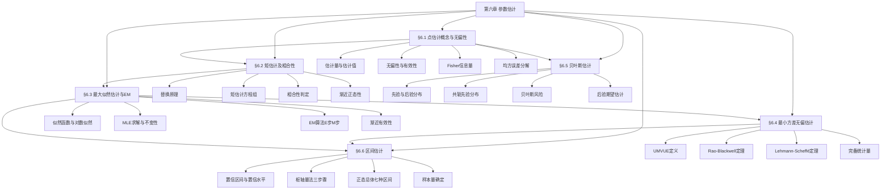

# 第六章 参数估计 — 章节汇总

> [!abstract] 全章概览
> 本章是数理统计的核心章节，系统介绍==参数估计==的理论与方法。全章围绕"如何用样本数据估计未知参数"这一核心问题，沿两条主线展开：**频率学派**从点估计（§6.1-§6.4）到区间估计（§6.6），**贝叶斯学派**（§6.5）将参数视为随机变量，利用先验信息进行估计。
>
> **全章逻辑主线**：点估计基本概念（[[6.1 点估计的概念与无偏性|§6.1]]）→ 矩估计与相合性（[[6.2 矩估计及相合性|§6.2]]）→ 最大似然估计与EM算法（[[6.3 最大似然估计与EM算法|§6.3]]）→ 最小方差无偏估计（[[6.4 最小方差无偏估计|§6.4]]）→ 贝叶斯估计（[[6.5 贝叶斯估计|§6.5]]）→ 区间估计（[[6.6 区间估计|§6.6]]）

---

## 一、全章知识框架

---

## 二、核心知识点与公式汇总

### §6.1 点估计的概念与无偏性

参数估计是数理统计的核心任务之一。==点估计==用统计量的一个取值作为参数的近似值。估计量的评价标准包括==无偏性==、==有效性==（C-R下界）和==相合性==。==均方误差==将偏差和方差统一在一个度量中。==Fisher信息量==刻画了样本包含关于参数的信息量，是C-R下界的基础。这五个核心概念构成了点估计理论的评价体系，从不同角度衡量估计量的优劣。

无偏性要求估计量在大量重复使用中"平均而言"恰好等于真值，是最基本的评价标准。有效性在无偏估计类中进一步比较方差大小，方差越小越精确。C-R不等式给出了无偏估计方差的统一下界，达到该下界的估计称为有效估计。均方误差则不要求无偏性，将偏差的平方与方差之和作为综合评价，在实际应用中更为灵活。

Fisher信息量 $I(\theta)$ 是连接样本信息与估计精度的桥梁，它反映了单个样本包含关于参数 $\theta$ 的信息量。C-R不等式表明，任何无偏估计的方差都不会小于 $1/[nI(\theta)]$，这一结果深刻揭示了参数可估计性的理论极限。

| 编号 | 类型 | 名称 | 内容 |
|:----:|:----:|:----:|:----:|
| 6.1.1 | 定义 | 估计量与估计值 | 估计量 $\hat\theta = g(X_1,\ldots,X_n)$ 是统计量；代入样本观测值后为估计值 |
| 6.1.2 | 定义 | 无偏估计 | $E(\hat\theta) = \theta$ 对一切 $\theta \in \Theta$ 成立 |
| 6.1.3 | 定义 | 有效估计 | 无偏估计的方差达到 C-R 下界：$\text{Var}(\hat\theta) = 1/[nI(\theta)]$ |
| 6.1.4 | 定义 | Fisher信息量 | $I(\theta) = E\!\left[\left(\dfrac{\partial \ln f(X;\theta)}{\partial \theta}\right)^{\!2}\right]$ |
| 6.1.5 | 定义 | 相合估计 | $\hat\theta_n \xrightarrow{P} \theta$，即 $\forall \varepsilon > 0$，$\lim_{n\to\infty}P(|\hat\theta_n - \theta| \geq \varepsilon) = 0$ |
| 6.1.6 | 定义 | 均方误差 | $\text{MSE}(\hat\theta) = E[(\hat\theta - \theta)^2]$ |
| 6.1.7 | 定义 | 矩估计法 | 用样本 $k$ 阶矩 $A_k$ 代替总体 $k$ 阶矩 $\mu_k$，解方程组得参数估计 |
| 6.1.8 | 定义 | 似然函数与MLE | $L(\theta) = \prod_{i=1}^{n}f(x_i;\theta)$；$\hat\theta_{\text{MLE}} = \arg\max_{\theta} L(\theta)$ |

| 编号 | 类型 | 名称 | 内容 |
|:----:|:----:|:----:|:----:|
| 6.1.T1 | 定理 | C-R不等式 | 在正则条件下，$\text{Var}(\hat\theta) \geq \dfrac{1}{nI(\theta)}$ |
| 6.1.T2 | 定理 | 有效估计判定 | $\hat\theta$ 达到C-R下界 $\Leftrightarrow$ 存在函数使 $\dfrac{\partial \ln L(\theta)}{\partial \theta} = I(\theta)(\hat\theta - \theta)$ |
| 6.1.T3 | 定理 | 相合性判定 | $\text{MSE}(\hat\theta_n) \to 0$ $\Rightarrow$ $\hat\theta_n$ 是 $\theta$ 的相合估计 |
| 6.1.T4 | 定理 | 偏差-方差分解 | $\text{MSE}(\hat\theta) = \text{Var}(\hat\theta) + [E(\hat\theta)-\theta]^2$ |
| 6.1.T5 | 定理 | MLE不变性 | 若 $\hat\theta$ 是 $\theta$ 的MLE，则 $g(\hat\theta)$ 是 $g(\theta)$ 的MLE |

**核心公式**：

$$E(\hat\theta) = \theta \quad \text{（无偏性）}$$

$$I(\theta) = E\!\left[\left(\frac{\partial \ln f(X;\theta)}{\partial \theta}\right)^{\!2}\right] = -E\!\left[\frac{\partial^2 \ln f(X;\theta)}{\partial \theta^2}\right] \quad \text{（Fisher信息量）}$$

$$\text{Var}(\hat\theta) \geq \frac{1}{nI(\theta)} \quad \text{（C-R不等式）}$$

$$\text{MSE}(\hat\theta) = \text{Var}(\hat\theta) + [\text{Bias}(\hat\theta)]^2 \quad \text{（MSE分解）}$$

$$L(\theta) = \prod_{i=1}^{n}f(x_i;\theta), \quad \ell(\theta) = \sum_{i=1}^{n}\ln f(x_i;\theta) \quad \text{（似然函数）}$$

---

### §6.2 矩估计及相合性

==矩估计法==是最古老的参数估计方法，基于==替换原理==——用样本矩代替总体矩。矩估计的优良性质（相合性、渐近正态性）由大数定律和中心极限定理保证。==相合性==是估计量的基本要求，可通过MSE趋于零或无偏+方差趋于零来判断。

替换原理的直观思想是：样本来自总体，因此样本的经验分布应当"模仿"总体的真实分布。用样本矩代替总体矩，本质上就是用经验分布的矩代替真实分布的矩。这一思想虽然简单，却具有深刻的统计意义——大数定律保证了样本矩几乎必然收敛到总体矩，从而矩估计天然具有相合性。

矩估计的渐近正态性来自中心极限定理：当样本量足够大时，矩估计量的分布近似正态。这使得我们可以在大样本下构造近似置信区间和进行近似假设检验。此外，矩估计还具有函数不变性：若 $\hat\theta$ 是 $\theta$ 的矩估计，则 $g(\hat\theta)$ 是 $g(\theta)$ 的矩估计。

| 编号 | 类型 | 名称 | 内容 |
|:----:|:----:|:----:|:----:|
| 6.2.1 | 定义 | 替换原理 | 用样本 $k$ 阶原点矩 $A_k = \dfrac{1}{n}\displaystyle\sum_{i=1}^{n}X_i^k$ 代替总体 $k$ 阶原点矩 $\mu_k = E(X^k)$ |
| 6.2.2 | 定义 | 矩估计方程组 | $\mu_k(\theta_1,\ldots,\theta_m) = A_k$，$k = 1, 2, \ldots, m$，解出 $\hat\theta_1, \ldots, \hat\theta_m$ |
| 6.2.3 | 定义 | 相合估计严格定义 | $\forall \varepsilon > 0$，$\lim_{n\to\infty}P_{\theta}(|\hat\theta_n - \theta| \geq \varepsilon) = 0$，$\forall \theta \in \Theta$ |

| 编号 | 类型 | 名称 | 内容 |
|:----:|:----:|:----:|:----:|
| 6.2.T1 | 定理 | 替换原理依据 | 辛钦大数定律：$A_k \xrightarrow{P} \mu_k$（$k$ 阶矩存在时） |
| 6.2.T2 | 定理 | 矩估计相合性 | 若 $\mu_k(\theta)$ 连续且 $A_k \xrightarrow{P} \mu_k$，则矩估计 $\hat\theta_n \xrightarrow{P} \theta$ |
| 6.2.T3 | 定理 | 渐近正态性 | $\sqrt{n}(\hat\theta_n - \theta) \xrightarrow{L} N(0, \Sigma)$，$\Sigma$ 由Delta方法确定 |
| 6.2.T4 | 定理 | 函数不变性 | 若 $\hat\theta$ 是 $\theta$ 的矩估计，则 $g(\hat\theta)$ 是 $g(\theta)$ 的矩估计 |
| 6.2.T5 | 定理 | MSE判定法 | $\text{MSE}(\hat\theta_n) \to 0$ $\Leftrightarrow$ $E(\hat\theta_n) \to \theta$ 且 $\text{Var}(\hat\theta_n) \to 0$ |
| 6.2.T6 | 定理 | 无偏+方差→相合 | 若 $\hat\theta_n$ 无偏且 $\text{Var}(\hat\theta_n) \to 0$，则 $\hat\theta_n$ 相合 |
| 6.2.T7 | 定理 | 常见相合估计 | $\bar{X}$ 相合估计 $\mu$；$S^2$ 相合估计 $\sigma^2$；样本 $p$ 频相合估计总体比例 |
| 6.2.T8 | 定理 | 连续映射定理 | 若 $X_n \xrightarrow{P} a$，$g$ 在 $a$ 处连续，则 $g(X_n) \xrightarrow{P} g(a)$ |
| 6.2.T9 | 定理 | MLE相合性 | 在正则条件下，MLE是相合估计 |

**核心公式**：

$$A_k = \frac{1}{n}\sum_{i=1}^{n}X_i^k \xrightarrow{P} \mu_k = E(X^k) \quad \text{（替换原理）}$$

$$\mu_k(\theta_1,\ldots,\theta_m) = A_k, \quad k = 1, 2, \ldots, m \quad \text{（矩估计方程组）}$$

$$\sqrt{n}(\hat\theta_n - \theta) \xrightarrow{L} N\!\left(0,\, \frac{1}{I(\theta)}\right) \quad \text{（渐近正态性）}$$

$$\text{MSE}(\hat\theta_n) = \text{Var}(\hat\theta_n) + [E(\hat\theta_n) - \theta]^2 \to 0 \quad \text{（MSE判定相合性）}$$

---

### §6.3 最大似然估计与EM算法

==最大似然估计==（MLE）是频率学派最重要的估计方法，具有不变性、相合性和渐近有效性等优良性质。==EM算法==是处理含缺失数据/隐变量模型的通用迭代方法，E步计算条件期望，M步最大化Q函数。

最大似然原理的核心思想是：已观测到的数据是"最可能"出现的，因此选择使观测数据出现概率最大的参数值作为估计。这一思想虽然直观，但在数学上却具有深刻的理论基础——在正则条件下，MLE是渐近有效的，即其渐近方差达到C-R下界，没有任何其他估计量能在渐近意义上做得更好。

EM算法将复杂的优化问题分解为两步交替进行：E步（Expectation）在给定当前参数估计下，计算完全数据对数似然的期望；M步（Maximization）最大化这个期望。EM算法保证每一步迭代都不降低似然函数值，因此收敛到似然函数的局部最大值或鞍点。在混合模型、缺失数据等问题中，EM算法是最常用的参数估计工具。

| 编号 | 类型 | 名称 | 内容 |
|:----:|:----:|:----:|:----:|
| 6.3.1 | 定义 | 似然函数深入 | $L(\theta) = \prod_{i=1}^{n}f(x_i;\theta)$，$\ell(\theta) = \ln L(\theta) = \displaystyle\sum_{i=1}^{n}\ln f(x_i;\theta)$ |
| 6.3.2 | 定义 | 最大似然原理 | $\hat\theta_{\text{MLE}} = \arg\max_{\theta \in \Theta} L(\theta) = \arg\max_{\theta \in \Theta} \ell(\theta)$ |
| 6.3.3 | 定义 | 完全数据与观测数据 | 完全数据 $(X,Y)$，观测数据 $X$，$Y$ 为缺失/隐变量 |
| 6.3.4 | 定义 | EM算法 | E步：$Q(\theta|\theta^{(t)}) = E_{Y|X,\theta^{(t)}}[\ln L_c(\theta;X,Y)]$；M步：$\theta^{(t+1)} = \arg\max_\theta Q(\theta|\theta^{(t)})$ |

| 编号 | 类型 | 名称 | 内容 |
|:----:|:----:|:----:|:----:|
| 6.3.T1 | 定理 | MLE不变性 | 若 $\hat\theta$ 是 $\theta$ 的MLE，则 $g(\hat\theta)$ 是 $g(\theta)$ 的MLE |
| 6.3.T2 | 定理 | MLE相合性 | 在正则条件下，$\hat\theta_{\text{MLE}} \xrightarrow{P} \theta$ |
| 6.3.T3 | 定理 | MLE渐近正态性 | $\sqrt{n}(\hat\theta_{\text{MLE}} - \theta) \xrightarrow{L} N(0,\, 1/I(\theta))$ |
| 6.3.T4 | 定理 | MLE渐近有效性 | MLE的渐近方差达到C-R下界，是渐近最优的 |
| 6.3.T5 | 定理 | EM收敛性 | 每次迭代 $\ell(\theta^{(t+1)}) \geq \ell(\theta^{(t)})$，收敛到似然函数驻点 |

**核心公式**：

$$\ell(\theta) = \sum_{i=1}^{n}\ln f(x_i;\theta) \quad \text{（对数似然函数）}$$

$$\sqrt{n}(\hat\theta_{\text{MLE}} - \theta) \xrightarrow{L} N\!\left(0,\, \frac{1}{I(\theta)}\right) \quad \text{（MLE渐近正态性）}$$

$$Q(\theta|\theta^{(t)}) = E_{Y|X,\theta^{(t)}}\!\left[\sum_{i=1}^{n}\ln f(x_i, y_i; \theta)\right] \quad \text{（EM算法E步）}$$

$$\theta^{(t+1)} = \arg\max_{\theta}\, Q(\theta|\theta^{(t)}) \quad \text{（EM算法M步）}$$

---

### §6.4 最小方差无偏估计

==一致最小方差无偏估计==（UMVUE）是无偏估计中的"最优"估计。==Rao-Blackwell定理==通过对无偏估计取充分统计量的条件期望来改善估计。==Lehmann-Scheffé定理==结合充分性和完备性给出了UMVUE的存在性判据。

寻找UMVUE的思路是：先在所有无偏估计中筛选，再在其中找方差最小的。Rao-Blackwell定理告诉我们，利用充分统计量对无偏估计进行"平滑"（取条件期望），不会引入偏差，但可以降低方差。Lehmann-Scheffé定理进一步指出，如果充分统计量还是完备的，那么这种"平滑"得到的估计就是唯一的UMVUE。

指数族分布在UMVUE理论中扮演重要角色。满秩指数族的充分统计量自然具备完备性，因此UMVUE的存在性自动得到保证。这一结果将UMVUE的寻找简化为：找到充分完备统计量，然后构造其函数使之成为无偏估计。

| 编号 | 类型 | 名称 | 内容 |
|:----:|:----:|:----:|:----:|
| 6.4.1 | 定义 | UMVUE | $\hat\theta$ 无偏，且对一切无偏估计 $\tilde\theta$，$\text{Var}(\hat\theta) \leq \text{Var}(\tilde\theta)$ |
| 6.4.2 | 定义 | 完备统计量 | 若 $E_\theta[g(T)] = 0$，$\forall\theta$ $\Rightarrow$ $P_\theta(g(T) = 0) = 1$，$\forall\theta$ |
| 6.4.3 | 定义 | 充分完备统计量 | $T$ 既是充分统计量又是完备统计量 |

| 编号 | 类型 | 名称 | 内容 |
|:----:|:----:|:----:|:----:|
| 6.4.T1 | 定理 | UMVUE唯一性 | 若UMVUE存在，则在概率1意义下唯一 |
| 6.4.T2 | 定理 | 零估计量判定 | $E_\theta[g(T)] = 0$，$\forall\theta$ 且 $T$ 完备 $\Rightarrow$ $g(T) = 0$ a.s. |
| 6.4.T3 | 定理 | Rao-Blackwell | 设 $T$ 充分，$\tilde\theta$ 无偏，则 $\hat\theta = E(\tilde\theta|T)$ 无偏且 $\text{Var}(\hat\theta) \leq \text{Var}(\tilde\theta)$ |
| 6.4.T4 | 定理 | Lehmann-Scheffé | 若 $T$ 充分完备，$\hat\theta = g(T)$ 无偏，则 $\hat\theta$ 是UMVUE |
| 6.4.T5 | 定理 | 指数族完备性 | 满秩指数族的自然充分统计量是完备的 |

**核心公式**：

$$\text{Var}(\tilde\theta) = \text{Var}(E(\tilde\theta|T)) + E(\text{Var}(\tilde\theta|T)) \geq \text{Var}(E(\tilde\theta|T)) \quad \text{（方差分解）}$$

$$\hat\theta_{\text{RB}} = E(\tilde\theta | T) \quad \text{（Rao-Blackwell改善）}$$

$$f(x;\theta) = h(x)\exp\!\left\{\sum_{j=1}^{k}\eta_j(\theta)T_j(x) - B(\theta)\right\} \quad \text{（满秩指数族）}$$

---

### §6.5 贝叶斯估计

==贝叶斯估计==将参数视为随机变量，利用==先验分布==和样本信息得到==后验分布==，基于后验分布进行推断。==共轭先验分布==使后验分布与先验分布属于同一分布族，大大简化计算。==贝叶斯风险==在平方损失下由后验期望最小化。

贝叶斯学派与频率学派的核心分歧在于对参数的认识：频率学派认为参数是固定的未知常数，贝叶斯学派则将参数视为具有某个先验分布的随机变量。样本的作用是更新我们对参数的认知——从先验分布到后验分布。贝叶斯公式密度形式是这一更新过程的数学表达。

共轭先验分布是贝叶斯推断中最重要的计算技巧之一。当似然函数属于指数族时，选择与似然函数共轭的先验分布，可以保证后验分布与先验分布属于同一分布族，从而后验参数的更新公式具有闭式表达。这使得贝叶斯推断的计算大大简化，也便于序贯更新。

| 编号 | 类型 | 名称 | 内容 |
|:----:|:----:|:----:|:----:|
| 6.5.1 | 定义 | 先验分布 | 参数 $\theta$ 的分布 $\pi(\theta)$，反映抽样前对 $\theta$ 的认知 |
| 6.5.2 | 定义 | 后验分布 | $\pi(\theta|x) = \dfrac{f(x|\theta)\pi(\theta)}{m(x)}$，$m(x) = \displaystyle\int f(x|\theta)\pi(\theta)\,d\theta$ |
| 6.5.3 | 定义 | 贝叶斯估计量 | 在平方损失下，$\hat\theta_B = E(\theta|x) = \displaystyle\int \theta\,\pi(\theta|x)\,d\theta$ |
| 6.5.4 | 定义 | 共轭先验分布 | 先验 $\pi(\theta)$ 与后验 $\pi(\theta|x)$ 属于同一分布族 |
| 6.5.5 | 定义 | 贝叶斯风险 | $R(\hat\theta) = E_{(X,\theta)}[L(\theta, \hat\theta(X))]$，综合先验与损失 |

| 编号 | 类型 | 名称 | 内容 |
|:----:|:----:|:----:|:----:|
| 6.5.T1 | 定理 | 贝叶斯公式密度形式 | $\pi(\theta|x) \propto f(x|\theta)\pi(\theta)$，后验正比于似然乘以先验 |
| 6.5.T2 | 定理 | 贝叶斯估计最优性 | 在平方损失下，后验期望 $E(\theta|x)$ 使贝叶斯风险最小 |

**核心公式**：

$$\pi(\theta|x) = \frac{f(x|\theta)\pi(\theta)}{\int f(x|\theta)\pi(\theta)\,d\theta} \propto f(x|\theta)\pi(\theta) \quad \text{（贝叶斯公式密度形式）}$$

$$\hat\theta_B = E(\theta|x) = \frac{a + \sum_{i=1}^{n}x_i}{a + b + n} \quad \text{（正态均值/二项分布的贝叶斯估计）}$$

$$R(\hat\theta) = \int\int L(\theta, \hat\theta(x))\,f(x|\theta)\,\pi(\theta)\,dx\,d\theta \quad \text{（贝叶斯风险）}$$

**常见共轭先验对表**：

| 似然分布 | 参数 | 共轭先验 | 后验分布 | 后验参数 |
|:----:|:----:|:----:|:----:|:----:|
| $b(1,\theta)$ | $\theta$（成功概率） | $\text{Be}(a,b)$ | $\text{Be}(a+\sum x_i,\, b+n-\sum x_i)$ | $a' = a + \sum x_i$，$b' = b + n - \sum x_i$ |
| $P(\lambda)$ | $\lambda$（均值） | $\text{Ga}(a,b)$ | $\text{Ga}(a + \sum x_i,\, b + n)$ | $a' = a + \sum x_i$，$b' = b + n$ |
| $N(\mu,\sigma_0^2)$ | $\mu$（均值） | $N(\mu_0,\tau^2)$ | $N(\hat\mu,\hat\tau^2)$ | $\hat\tau^2 = (1/\tau^2 + n/\sigma_0^2)^{-1}$，$\hat\mu = \hat\tau^2(\mu_0/\tau^2 + n\bar{x}/\sigma_0^2)$ |
| $N(\mu_0,\sigma^2)$ | $\sigma^2$（方差） | $\text{IG}(\alpha,\beta)$ | $\text{IG}(\alpha+n/2,\,\beta+S/2)$ | $\alpha' = \alpha + n/2$，$\beta' = \beta + \sum(x_i-\mu_0)^2/2$ |
| $\text{Exp}(\lambda)$ | $\lambda$（率参数） | $\text{Ga}(a,b)$ | $\text{Ga}(a + n,\, b + \sum x_i)$ | $a' = a + n$，$b' = b + \sum x_i$ |
| $\text{Geo}(\theta)$ | $\theta$（成功概率） | $\text{Be}(a,b)$ | $\text{Be}(a+n,\, b+\sum x_i)$ | $a' = a + n$，$b' = b + \sum x_i$ |
| $U(0,\theta)$ | $\theta$（上界） | $\text{Pa}(\alpha,\beta)$ | $\text{Pa}(\alpha+n,\,\max(\beta,x_{(n)}))$ | $\alpha' = \alpha + n$，$\beta' = \max(\beta, x_{(n)})$ |
| $N(\mu,\sigma^2)$ | $(\mu,\sigma^2)$ | 正态-逆Gamma | 正态-逆Gamma | 参数更新公式见教材 |

---

### §6.6 区间估计

==区间估计==给出参数的一个随机区间，使其以==置信水平== $1-\alpha$ 覆盖真值。==枢轴量法==是构造置信区间的核心方法：构造分布已知的枢轴量→确定分位数→不等式反解。正态总体下有7种标准置信区间公式。

区间估计是对点估计的重要补充。点估计只给出一个数值，无法反映估计的精度和可靠性；区间估计则同时给出了估计的范围和置信水平，信息量更为丰富。置信水平 $1-\alpha$ 的含义是：在大量重复抽样中，约有 $100(1-\alpha)\%$ 的区间会覆盖真值。注意，对于某一个具体的区间，它要么覆盖真值，要么不覆盖，置信水平是方法本身的覆盖率，不是某个具体区间的概率。

枢轴量法是构造置信区间最系统的方法。其核心是找到一个仅依赖于样本和参数、且分布完全已知的统计量（枢轴量）。常见的枢轴量包括：$Z = (\bar{X}-\mu)/(\sigma/\sqrt{n})$、$t = (\bar{X}-\mu)/(S/\sqrt{n})$、$\chi^2 = (n-1)S^2/\sigma^2$ 等。确定枢轴量后，利用其分布的分位数建立概率等式，再通过不等式反解得到置信区间。

| 编号 | 类型 | 名称 | 内容 |
|:----:|:----:|:----:|:----:|
| 6.6.1 | 定义 | 置信区间 | $P_\theta(\underline\theta \leq \theta \leq \bar\theta) \geq 1-\alpha$，$[\underline\theta, \bar\theta]$ 为置信水平 $1-\alpha$ 的置信区间 |
| 6.6.2 | 定义 | 置信水平 | $1-\alpha$：随机区间覆盖真值的概率，$\alpha$ 常取 0.05 或 0.01 |
| 6.6.3 | 定义 | 枢轴量 | 仅含样本和参数、分布完全已知的统计量 $G = G(X_1,\ldots,X_n;\theta)$ |

| 编号 | 类型 | 名称 | 内容 |
|:----:|:----:|:----:|:----:|
| 6.6.T1 | 定理 | 频率解释 | 置信水平 $1-\alpha$ 是覆盖率的长期频率，非单次概率 |
| 6.6.T2 | 定理 | 枢轴量法三步 | (1)构造枢轴量 $G$；(2)确定分位数 $P(a \leq G \leq b) = 1-\alpha$；(3)反解得 $[\underline\theta,\bar\theta]$ |
| 6.6.T3 | 定理 | $\sigma^2$已知$\mu$区间 | $\bar{X} \pm z_{\alpha/2}\cdot\dfrac{\sigma}{\sqrt{n}}$ |
| 6.6.T4 | 定理 | $\sigma^2$未知$\mu$区间 | $\bar{X} \pm t_{\alpha/2}(n-1)\cdot\dfrac{S}{\sqrt{n}}$ |
| 6.6.T5 | 定理 | $\sigma^2$区间 | $\left[\dfrac{(n-1)S^2}{\chi^2_{\alpha/2}(n-1)},\; \dfrac{(n-1)S^2}{\chi^2_{1-\alpha/2}(n-1)}\right]$ |
| 6.6.T6 | 定理 | 方差已知均值差区间 | $(\bar{X}-\bar{Y}) \pm z_{\alpha/2}\sqrt{\dfrac{\sigma_1^2}{n} + \dfrac{\sigma_2^2}{m}}$ |
| 6.6.T7 | 定理 | 等方差未知均值差区间 | $(\bar{X}-\bar{Y}) \pm t_{\alpha/2}(n+m-2)\cdot S_w\sqrt{\dfrac{1}{n}+\dfrac{1}{m}}$ |
| 6.6.T8 | 定理 | 方差不等近似 | $(\bar{X}-\bar{Y}) \pm z_{\alpha/2}\sqrt{\dfrac{S_1^2}{n} + \dfrac{S_2^2}{m}}$（大样本近似） |
| 6.6.T9 | 定理 | 方差比区间 | $\left[\dfrac{S_1^2/S_2^2}{F_{\alpha/2}(n-1,m-1)},\; \dfrac{S_1^2/S_2^2}{F_{1-\alpha/2}(n-1,m-1)}\right]$ |
| 6.6.T10 | 定理 | 大样本近似 | $\hat\theta \pm z_{\alpha/2}\cdot\text{SE}(\hat\theta)$，SE由渐近方差估计 |
| 6.6.T11 | 定理 | 比例$p$区间 | $\hat{p} \pm z_{\alpha/2}\sqrt{\dfrac{\hat{p}(1-\hat{p})}{n}}$（大样本） |
| 6.6.T12 | 定理 | 样本量确定 | $n \geq \left(\dfrac{z_{\alpha/2}\cdot\sigma}{d}\right)^2$（估计均值，误差不超过 $d$） |

**核心公式**：

$$P_\theta(\underline\theta(X_1,\ldots,X_n) \leq \theta \leq \bar\theta(X_1,\ldots,X_n)) \geq 1-\alpha \quad \text{（置信区间定义）}$$

$$G = G(X_1,\ldots,X_n;\theta), \quad P(a \leq G \leq b) = 1-\alpha \quad \text{（枢轴量法）}$$

**正态总体置信区间汇总表**：

| 场景 | 参数 | 条件 | 枢轴量 | $1-\alpha$ 置信区间 |
|:----:|:----:|:----:|:----:|:----:|
| 单总体均值 | $\mu$ | $\sigma^2$ 已知 | $Z = \dfrac{\bar{X}-\mu}{\sigma/\sqrt{n}} \sim N(0,1)$ | $\bar{X} \pm z_{\alpha/2}\dfrac{\sigma}{\sqrt{n}}$ |
| 单总体均值 | $\mu$ | $\sigma^2$ 未知 | $t = \dfrac{\bar{X}-\mu}{S/\sqrt{n}} \sim t(n-1)$ | $\bar{X} \pm t_{\alpha/2}(n-1)\dfrac{S}{\sqrt{n}}$ |
| 单总体方差 | $\sigma^2$ | $\mu$ 未知 | $\chi^2 = \dfrac{(n-1)S^2}{\sigma^2} \sim \chi^2(n-1)$ | $\left[\dfrac{(n-1)S^2}{\chi^2_{\alpha/2}},\;\dfrac{(n-1)S^2}{\chi^2_{1-\alpha/2}}\right]$ |
| 双总体均值差 | $\mu_1-\mu_2$ | $\sigma_1^2,\sigma_2^2$ 已知 | $Z = \dfrac{(\bar{X}-\bar{Y})-(\mu_1-\mu_2)}{\sqrt{\sigma_1^2/n+\sigma_2^2/m}}$ | $(\bar{X}-\bar{Y}) \pm z_{\alpha/2}\sqrt{\sigma_1^2/n+\sigma_2^2/m}$ |
| 双总体均值差 | $\mu_1-\mu_2$ | $\sigma_1^2=\sigma_2^2$ 未知 | $t = \dfrac{(\bar{X}-\bar{Y})-(\mu_1-\mu_2)}{S_w\sqrt{1/n+1/m}}$ | $(\bar{X}-\bar{Y}) \pm t_{\alpha/2}(n+m-2)S_w\sqrt{1/n+1/m}$ |
| 双总体均值差 | $\mu_1-\mu_2$ | 大样本 | $Z \approx \dfrac{(\bar{X}-\bar{Y})-(\mu_1-\mu_2)}{\sqrt{S_1^2/n+S_2^2/m}}$ | $(\bar{X}-\bar{Y}) \pm z_{\alpha/2}\sqrt{S_1^2/n+S_2^2/m}$ |
| 双总体方差比 | $\sigma_1^2/\sigma_2^2$ | $\mu_1,\mu_2$ 未知 | $F = \dfrac{S_1^2/\sigma_1^2}{S_2^2/\sigma_2^2} \sim F(n-1,m-1)$ | $\left[\dfrac{S_1^2/S_2^2}{F_{\alpha/2}},\;\dfrac{S_1^2/S_2^2}{F_{1-\alpha/2}}\right]$ |

$$n \geq \left(\frac{z_{\alpha/2}\cdot\sigma}{d}\right)^2 \quad \text{（估计均值时样本量公式）}$$

---

## 三、章节学习脉络

### §6.1 点估计的概念与无偏性

本节是全章的起点，建立了点估计的基本语言和评价体系。核心问题是：给定一个统计量作为参数的估计，如何评判其好坏？无偏性是最基本的要求——估计量不能系统性地偏大或偏小。但仅有无偏性是不够的，两个无偏估计中，方差更小的更精确，由此引出有效性和C-R不等式。

C-R不等式是本节的理论高潮。它利用Fisher信息量给出了无偏估计方差的统一下界，揭示了参数估计精度的理论极限。理解C-R不等式的关键在于理解Fisher信息量的含义：它度量了单个观测值中包含的关于参数的信息量。样本量越大，信息量按比例增长，C-R下界则相应降低。

均方误差（MSE）提供了一个更灵活的评价框架。它将偏差的平方与方差之和作为综合度量，不要求无偏性。在实际应用中，一个有偏但方差很小的估计，其MSE可能小于无偏估计，因此在MSE意义下更优。偏差-方差分解是理解这一现象的关键工具。

### §6.2 矩估计及相合性

本节介绍最古老的参数估计方法——矩估计法，并系统讨论估计量的相合性。矩估计的核心思想"替换原理"极其直观：用样本矩代替总体矩来建立方程，解出参数估计。这种方法不需要知道总体分布的具体形式，只需知道矩与参数的关系即可。

相合性是本节的另一个重点。相合性要求当样本量趋于无穷时，估计量几乎必然收敛到真值。这是估计量的"最低门槛"——一个不相合的估计量在理论上几乎没有价值。本节给出了多种判断相合性的方法：MSE趋于零、无偏加方差趋于零、利用大数定律和连续映射定理等。

矩估计的渐近正态性是连接点估计与区间估计的桥梁。在大样本下，矩估计量近似服从正态分布，其渐近方差可以通过Delta方法计算。这一结果不仅为矩估计提供了精度评估，也为大样本置信区间的构造奠定了基础。

### §6.3 最大似然估计与EM算法

本节介绍频率学派最重要的估计方法——最大似然估计（MLE），以及处理复杂模型的EM算法。MLE的核心优势在于充分利用了分布的具体信息（通过似然函数），因此在正则条件下具有渐近有效性——没有其他估计量能在渐近意义上做得更好。

EM算法是MLE在含缺失数据/隐变量场景下的推广。许多实际问题（如混合模型、隐马尔可夫模型、缺失数据等）的似然函数难以直接最大化，EM算法通过交替执行E步和M步来迭代求解。E步计算完全数据对数似然在观测数据条件下的期望，M步最大化这个期望。EM算法的理论保证（单调递增性）使其成为实际应用中最常用的迭代算法之一。

MLE与矩估计的对比是本节的重要思考点。矩估计计算简单但一般不是最优的；MLE计算可能复杂但具有渐近最优性。在实际应用中，当两者结果不一致时，通常优先选择MLE。

### §6.4 最小方差无偏估计

本节追求无偏估计中的"最优"——一致最小方差无偏估计（UMVUE）。如果说§6.1建立了评价标准，§6.2和§6.3给出了构造方法，那么本节则回答了"最优估计是否存在、如何寻找"这一根本问题。

Rao-Blackwell定理和Lehmann-Scheffé定理是本节的理论核心。Rao-Blackwell定理告诉我们，利用充分统计量对无偏估计取条件期望，可以降低方差而不引入偏差。Lehmann-Scheffé定理进一步指出，如果充分统计量还是完备的，那么通过这种方法得到的估计就是唯一的UMVUE。这两个定理合在一起，给出了寻找UMVUE的系统方法。

指数族分布在UMVUE理论中具有特殊地位。满秩指数族的自然充分统计量自动具备完备性，因此UMVUE的存在性得到保证。这一结果大大简化了UMVUE的寻找过程，也解释了为什么指数族分布在数理统计中如此重要。

### §6.5 贝叶斯估计

本节介绍与频率学派截然不同的参数估计范式——贝叶斯估计。贝叶斯学派将参数视为随机变量，赋予其先验分布，然后利用样本信息通过贝叶斯公式更新为后验分布，最后基于后验分布进行推断。

贝叶斯估计与频率学派估计的根本区别在于对"概率"的理解：频率学派将概率视为长期频率，参数是固定常数；贝叶斯学派将概率视为主观信念的程度，参数是随机变量。这种哲学差异导致了两种不同的推断框架，但在数学上，贝叶斯方法提供了更加统一和灵活的推断体系。

共轭先验分布是贝叶斯计算的重要工具。选择与似然函数共轭的先验分布，可以保证后验分布与先验分布属于同一分布族，从而得到闭式的后验参数更新公式。这不仅简化了计算，还使得序贯更新（逐步纳入新数据）变得自然和高效。

### §6.6 区间估计

本节是全章的终点，从点估计过渡到区间估计。点估计给出参数的一个数值近似，但无法反映估计的精度和可靠性；区间估计则给出一个随机区间，并以置信水平量化其覆盖真值的概率，信息量更为丰富。

枢轴量法是构造置信区间最系统的方法。其三步流程（构造枢轴量→确定分位数→反解不等式）适用于各种场景。理解枢轴量法的关键在于理解"枢轴"的含义：枢轴量的分布不依赖于未知参数，这使得我们可以利用已知的分布分位数来建立概率等式。

正态总体下的7种标准置信区间是本节的计算重点。这些公式覆盖了单总体和双总体、均值和方差的各种组合，是实际应用中最常用的区间估计工具。掌握这些公式的关键在于理解每种场景下枢轴量的构造和分布，而非死记硬背公式本身。

---

## 四、补充理解与跨章展望

### 全章核心思想

**第一层：频率学派 vs 贝叶斯学派的不同范式**

频率学派（§6.1-§6.4, §6.6）将参数视为固定未知常数，所有推断基于样本分布；贝叶斯学派（§6.5）将参数视为随机变量，利用先验信息进行推断。两种范式各有优劣：频率学派方法不需要主观先验，结果更具客观性；贝叶斯方法能自然融入先验知识，在小样本下优势明显。在实际应用中，两种方法常常互为补充。

**第二层：点估计→区间估计的递进关系**

点估计（§6.1-§6.5）给出参数的一个"最佳猜测"，区间估计（§6.6）则给出参数的一个"合理范围"。点估计是区间估计的基础——大多数置信区间的构造都以某个点估计为中心。区间估计弥补了点估计无法反映精度的缺陷，提供了更完整的统计信息。从点估计到区间估计，是统计推断从"单一数值"到"范围+可靠性"的自然递进。

**第三层：评价标准体系**

全章建立了一个层次分明的评价标准体系：
- **无偏性**（§6.1）：最基本要求，估计量不能系统性偏离真值
- **有效性**（§6.1）：在无偏估计中比较方差，方差越小越好
- **相合性**（§6.2）：大样本下估计量收敛到真值，是"最低门槛"
- **充分性**（§6.4）：充分利用样本信息，不丢失有用信息
- **最小方差**（§6.4）：在所有无偏估计中找方差最小的，即UMVUE

### 跨章关联表

| 关联方向 | 关联内容 | 说明 |
|:----:|:----:|:----:|
| 第五章→第六章 | 抽样分布→估计量分布 | [[5.4 三大抽样分布]] 中的 $\chi^2$、$t$、$F$ 分布是置信区间枢轴量的分布基础 |
| 第四章→第六章 | 大数定律→相合性 | [[4.3 大数定律]] 保证样本矩收敛到总体矩，是矩估计相合性的理论依据 |
| 第四章→第六章 | 中心极限定理→渐近正态性 | [[4.4 中心极限定理]] 保证估计量的大样本正态性，是区间估计的理论基础 |
| 第三章→第六章 | 条件期望→Rao-Blackwell | [[3.5 条件分布与条件期望]] 中的条件期望性质是Rao-Blackwell定理的数学工具 |
| 第六章→第七章 | 参数估计→假设检验 | 点估计和区间估计为第七章假设检验提供检验统计量和拒绝域 |

### 全章学习建议

1. **先掌握评价标准，再学习构造方法**。建议先彻底理解无偏性、有效性、相合性、MSE等评价标准（§6.1），再学习具体的估计方法（§6.2-§6.3）。评价标准是"尺子"，构造方法是"制造"，先用尺子知道什么是好的，再去制造好的估计量。

2. **重视正态总体的特殊结构**。正态总体是全章最重要的应用场景，其充分统计量（$\bar{X}$ 和 $S^2$）的分布完全已知（[[5.4 三大抽样分布]]），这使得正态总体下的UMVUE和置信区间都有简洁的闭式表达。建议熟练掌握正态总体下的所有标准结果。

3. **对比频率学派与贝叶斯学派**。在学习完§6.5后，建议回顾§6.1-§6.4的内容，对比两种范式在参数认识、推断方法、结果解释等方面的异同。这种对比不仅能加深对两种方法的理解，还能培养统计思维的多角度视野。

---

## 五、全章复习题

> [!problem] 复习题1（§6.1 无偏性与MSE）
> 设 $X_1, \ldots, X_n$ i.i.d.，$E(X_1) = \mu$，$\text{Var}(X_1) = \sigma^2$。
> (1) 证明 $S^2 = \dfrac{1}{n-1}\displaystyle\sum_{i=1}^{n}(X_i - \bar{X})^2$ 是 $\sigma^2$ 的无偏估计。
> (2) 求 $\text{MSE}(S^2)$。

查看解答

**(1) 证明 $S^2$ 是 $\sigma^2$ 的无偏估计**

首先展开平方和：

$$\sum_{i=1}^{n}(X_i - \bar{X})^2 = \sum_{i=1}^{n}X_i^2 - n\bar{X}^2$$

取期望：

$$E\!\left[\sum_{i=1}^{n}(X_i - \bar{X})^2\right] = \sum_{i=1}^{n}E(X_i^2) - nE(\bar{X}^2)$$

由于 $E(X_i^2) = \text{Var}(X_i) + [E(X_i)]^2 = \sigma^2 + \mu^2$，且 $\bar{X} \sim (\mu, \sigma^2/n)$，故 $E(\bar{X}^2) = \sigma^2/n + \mu^2$。代入得：

$$E\!\left[\sum_{i=1}^{n}(X_i - \bar{X})^2\right] = n(\sigma^2 + \mu^2) - n\!\left(\frac{\sigma^2}{n} + \mu^2\right) = n\sigma^2 - \sigma^2 = (n-1)\sigma^2$$

因此：

$$E(S^2) = \frac{1}{n-1}E\!\left[\sum_{i=1}^{n}(X_i - \bar{X})^2\right] = \frac{(n-1)\sigma^2}{n-1} = \sigma^2$$

$S^2$ 是 $\sigma^2$ 的无偏估计。证毕。

**(2) 求 $\text{MSE}(S^2)$**

由于 $S^2$ 是无偏估计，$\text{Bias}(S^2) = 0$，由偏差-方差分解：

$$\text{MSE}(S^2) = \text{Var}(S^2) + [\text{Bias}(S^2)]^2 = \text{Var}(S^2)$$

利用 $(n-1)S^2/\sigma^2 \sim \chi^2(n-1)$ 的性质，$\text{Var}(\chi^2(n-1)) = 2(n-1)$，故：

$$\text{Var}\!\left(\frac{(n-1)S^2}{\sigma^2}\right) = 2(n-1)$$

$$\frac{(n-1)^2}{\sigma^4}\text{Var}(S^2) = 2(n-1)$$

$$\text{Var}(S^2) = \frac{2\sigma^4}{n-1}$$

因此 $\text{MSE}(S^2) = \dfrac{2\sigma^4}{n-1}$。

> [!problem] 复习题2（§6.2 矩估计求解）
> 设总体密度 $f(x;\theta) = \theta x^{\theta-1}$，$0 < x < 1$，$\theta > 0$。$X_1, \ldots, X_n$ 为 i.i.d. 样本。
> (1) 求 $\theta$ 的矩估计 $\hat\theta$。
> (2) 判断 $\hat\theta$ 是否为 $\theta$ 的相合估计。

查看解答

**(1) 求矩估计**

先计算总体一阶矩：

$$E(X) = \int_0^1 x \cdot \theta x^{\theta-1}\,dx = \theta\int_0^1 x^\theta\,dx = \theta \cdot \frac{1}{\theta+1} = \frac{\theta}{\theta+1}$$

由替换原理，令 $E(X) = \bar{X}$：

$$\frac{\theta}{\theta+1} = \bar{X}$$

解得：

$$\hat\theta = \frac{\bar{X}}{1 - \bar{X}}$$

**(2) 判断相合性**

由大数定律，$\bar{X} \xrightarrow{P} E(X) = \theta/(\theta+1)$。由于函数 $g(t) = t/(1-t)$ 在 $t = \theta/(\theta+1) \in (0,1)$ 处连续，由连续映射定理：

$$\hat\theta = g(\bar{X}) = \frac{\bar{X}}{1-\bar{X}} \xrightarrow{P} g\!\left(\frac{\theta}{\theta+1}\right) = \frac{\theta/(\theta+1)}{1 - \theta/(\theta+1)} = \frac{\theta/(\theta+1)}{1/(\theta+1)} = \theta$$

因此 $\hat\theta$ 是 $\theta$ 的相合估计。

> [!problem] 复习题3（§6.3 MLE求解）
> 设 $X_1, \ldots, X_n$ i.i.d. $\sim N(\mu, \sigma^2)$，求 $\mu$ 和 $\sigma^2$ 的最大似然估计。

查看解答

似然函数为：

$$L(\mu, \sigma^2) = \prod_{i=1}^{n}\frac{1}{\sqrt{2\pi\sigma^2}}\exp\!\left\{-\frac{(x_i - \mu)^2}{2\sigma^2}\right\} = (2\pi\sigma^2)^{-n/2}\exp\!\left\{-\frac{1}{2\sigma^2}\sum_{i=1}^{n}(x_i - \mu)^2\right\}$$

对数似然函数为：

$$\ell(\mu, \sigma^2) = -\frac{n}{2}\ln(2\pi) - \frac{n}{2}\ln\sigma^2 - \frac{1}{2\sigma^2}\sum_{i=1}^{n}(x_i - \mu)^2$$

**对 $\mu$ 求导并令其为零**：

$$\frac{\partial \ell}{\partial \mu} = \frac{1}{\sigma^2}\sum_{i=1}^{n}(x_i - \mu) = 0$$

$$\sum_{i=1}^{n}x_i - n\mu = 0 \implies \hat\mu = \bar{x} = \frac{1}{n}\sum_{i=1}^{n}x_i$$

**对 $\sigma^2$ 求导并令其为零**：

$$\frac{\partial \ell}{\partial \sigma^2} = -\frac{n}{2\sigma^2} + \frac{1}{2\sigma^4}\sum_{i=1}^{n}(x_i - \mu)^2 = 0$$

将 $\hat\mu = \bar{x}$ 代入：

$$-\frac{n}{2\sigma^2} + \frac{1}{2\sigma^4}\sum_{i=1}^{n}(x_i - \bar{x})^2 = 0$$

$$\hat\sigma^2 = \frac{1}{n}\sum_{i=1}^{n}(x_i - \bar{x})^2$$

**验证二阶条件**：可以验证 $\dfrac{\partial^2 \ell}{\partial \mu^2}\bigg|_{\hat\mu,\hat\sigma^2} < 0$，$\dfrac{\partial^2 \ell}{\partial (\sigma^2)^2}\bigg|_{\hat\mu,\hat\sigma^2} < 0$，故确为最大值点。

因此 $\hat\mu_{\text{MLE}} = \bar{X}$，$\hat\sigma^2_{\text{MLE}} = \dfrac{1}{n}\displaystyle\sum_{i=1}^{n}(X_i - \bar{X})^2$。

注意：$\hat\sigma^2_{\text{MLE}}$ 不是 $\sigma^2$ 的无偏估计（分母为 $n$ 而非 $n-1$），但它是相合估计。

> [!problem] 复习题4（§6.3 EM算法）
> 两硬币模型：硬币A正面概率为 $p_A$，硬币B正面概率为 $p_B$。每次随机选一枚硬币抛10次，共做 $n=5$ 次实验，观测数据为（正面次数序列）：$Z = (7, 8, 5, 4, 8)$。假设选硬币的概率为 $0.5$。写出EM算法的E步和M步。

查看解答

设 $W_i$ 为第 $i$ 次实验所选硬币的指示变量：$W_i = A$ 表示选硬币A，$W_i = B$ 表示选硬币B。

**E步**：在当前参数 $(p_A^{(t)}, p_B^{(t)})$ 下，计算第 $i$ 次实验选硬币A的后验概率：

$$\gamma_i^{(t)} = P(W_i = A | Z_i, p_A^{(t)}, p_B^{(t)}) = \frac{0.5 \cdot \text{bin}(Z_i; 10, p_A^{(t)})}{0.5 \cdot \text{bin}(Z_i; 10, p_A^{(t)}) + 0.5 \cdot \text{bin}(Z_i; 10, p_B^{(t)})}$$

其中 $\text{bin}(z; 10, p) = \binom{10}{z}p^z(1-p)^{10-z}$。

以 $Z_1 = 7$ 为例，若 $p_A^{(0)} = 0.6$，$p_B^{(0)} = 0.5$：

$$\gamma_1^{(0)} = \frac{\binom{10}{7}(0.6)^7(0.4)^3}{\binom{10}{7}(0.6)^7(0.4)^3 + \binom{10}{7}(0.5)^7(0.5)^3} = \frac{0.6^7 \times 0.4^3}{0.6^7 \times 0.4^3 + 0.5^{10}}$$

$$= \frac{0.0279936 \times 0.064}{0.0279936 \times 0.064 + 0.0009766} = \frac{0.0017916}{0.0017916 + 0.0009766} \approx 0.6471$$

类似地计算 $\gamma_2^{(0)}, \ldots, \gamma_5^{(0)}$。

**M步**：最大化Q函数，更新参数：

$$p_A^{(t+1)} = \frac{\sum_{i=1}^{5}\gamma_i^{(t)} \cdot Z_i}{\sum_{i=1}^{5}\gamma_i^{(t)} \cdot 10} = \frac{\sum_{i=1}^{5}\gamma_i^{(t)} Z_i}{10\sum_{i=1}^{5}\gamma_i^{(t)}}$$

$$p_B^{(t+1)} = \frac{\sum_{i=1}^{5}(1-\gamma_i^{(t)}) \cdot Z_i}{\sum_{i=1}^{5}(1-\gamma_i^{(t)}) \cdot 10} = \frac{\sum_{i=1}^{5}(1-\gamma_i^{(t)}) Z_i}{10\sum_{i=1}^{5}(1-\gamma_i^{(t)})}$$

直觉理解：$\gamma_i^{(t)}$ 是第 $i$ 次实验"属于硬币A"的权重，M步中 $p_A$ 的更新就是加权平均——用权重 $\gamma_i^{(t)}$ 将各次实验的正面比例加权平均。

> [!problem] 复习题5（§6.4 UMVUE）
> 设 $X_1, \ldots, X_n$ i.i.d. $\sim b(1,p)$，用 Lehmann-Scheffé 定理求 $p^2$ 的 UMVUE。

查看解答

**第一步：找充分完备统计量**

二项分布 $b(1,p)$ 属于指数族：

$$f(x;p) = p^x(1-p)^{1-x} = (1-p)\exp\!\left\{x\ln\frac{p}{1-p}\right\}$$

自然充分统计量为 $T = \displaystyle\sum_{i=1}^{n}X_i \sim b(n,p)$。满秩指数族的充分统计量是完备的，因此 $T$ 是充分完备统计量。

**第二步：构造 $g(T)$ 使 $E[g(T)] = p^2$**

需要找到函数 $g$ 使得：

$$E[g(T)] = \sum_{k=0}^{n}g(k)\binom{n}{k}p^k(1-p)^{n-k} = p^2$$

考虑 $T(T-1)$ 的期望：

$$E[T(T-1)] = E(T^2) - E(T) = [np(1-p) + n^2p^2] - np = n(n-1)p^2$$

因此：

$$E\!\left[\frac{T(T-1)}{n(n-1)}\right] = p^2$$

令 $g(T) = \dfrac{T(T-1)}{n(n-1)}$，则 $E[g(T)] = p^2$。

**第三步：应用 Lehmann-Scheffé 定理**

由于 $T$ 是充分完备统计量，$g(T) = \dfrac{T(T-1)}{n(n-1)}$ 是 $p^2$ 的无偏估计，由 Lehmann-Scheffé 定理，$g(T)$ 是 $p^2$ 的唯一UMVUE。

因此 $p^2$ 的UMVUE为：

$$\widehat{p^2} = \frac{T(T-1)}{n(n-1)} = \frac{\left(\sum_{i=1}^{n}X_i\right)\!\left(\sum_{i=1}^{n}X_i - 1\right)}{n(n-1)}$$

> [!problem] 复习题6（§6.5 贝叶斯估计）
> 设 $X_1, \ldots, X_n$ i.i.d. $\sim b(1,\theta)$，$\theta \sim \text{Be}(a,b)$。在平方损失下求 $\theta$ 的贝叶斯估计。

查看解答

**第一步：写出似然函数**

$$f(x_1,\ldots,x_n|\theta) = \prod_{i=1}^{n}\theta^{x_i}(1-\theta)^{1-x_i} = \theta^{\sum x_i}(1-\theta)^{n-\sum x_i}$$

**第二步：写出先验分布**

$$\pi(\theta) = \frac{\Gamma(a+b)}{\Gamma(a)\Gamma(b)}\theta^{a-1}(1-\theta)^{b-1}, \quad 0 < \theta < 1$$

**第三步：求后验分布**

$$\pi(\theta|x) \propto f(x|\theta)\pi(\theta) \propto \theta^{\sum x_i}(1-\theta)^{n-\sum x_i} \cdot \theta^{a-1}(1-\theta)^{b-1} = \theta^{a+\sum x_i-1}(1-\theta)^{b+n-\sum x_i-1}$$

这正是 $\text{Be}(a', b')$ 的核，其中：

$$a' = a + \sum_{i=1}^{n}x_i, \quad b' = b + n - \sum_{i=1}^{n}x_i$$

因此后验分布为 $\theta|x \sim \text{Be}(a + \sum x_i,\; b + n - \sum x_i)$。

**第四步：求贝叶斯估计**

在平方损失下，贝叶斯估计为后验期望：

$$\hat\theta_B = E(\theta|x) = \frac{a'}{a'+b'} = \frac{a + \sum_{i=1}^{n}x_i}{a + b + n}$$

**直观理解**：贝叶斯估计可以看作先验信息 $(a, b)$ 和样本信息 $(\sum x_i, n-\sum x_i)$ 的"加权综合"。当 $n \to \infty$ 时，$\hat\theta_B \to \bar{x}$，即样本量足够大时，贝叶斯估计收敛到频率学派的MLE，先验信息的影响逐渐消失。

> [!problem] 复习题7（§6.6 置信区间）
> 设 $X_1, \ldots, X_{16}$ i.i.d. $\sim N(\mu, \sigma^2)$，$\bar{x} = 10.5$，$s = 0.8$。求 $\mu$ 的 95% 置信区间。

查看解答

由于 $\sigma^2$ 未知，使用 $t$ 分布枢轴量：

$$t = \frac{\bar{X} - \mu}{S/\sqrt{n}} \sim t(n-1) = t(15)$$

**确定分位数**：查 $t$ 分布表，$t_{0.025}(15) = 2.131$。

**计算置信区间**：

$$\bar{x} \pm t_{\alpha/2}(n-1) \cdot \frac{s}{\sqrt{n}} = 10.5 \pm 2.131 \times \frac{0.8}{\sqrt{16}} = 10.5 \pm 2.131 \times 0.2$$

$$= 10.5 \pm 0.4262$$

因此 $\mu$ 的 95% 置信区间为：

$$[10.0738,\; 10.9262]$$

**含义解释**：如果重复抽样很多次，每次计算这样的区间，大约有 95% 的区间会覆盖真实的 $\mu$ 值。

> [!problem] 复习题8（跨节综合：点估计与区间估计的关系）
> 解释为什么点估计和区间估计是互补的，以及置信区间如何弥补点估计的不足。结合具体例子说明。

查看解答

**点估计与区间估计的互补关系**

点估计给出参数的一个"最佳猜测值"，区间估计给出参数的一个"合理范围"。两者回答的是不同层面的问题：
- 点估计回答："参数最可能是什么值？"
- 区间估计回答："参数大概在什么范围内？我对这个范围有多大把握？"

**置信区间弥补点估计不足的三个方面**

**(1) 精度信息**：点估计无法反映估计的精度。例如，$\hat\mu = 10.5$，但不知道这个估计有多精确。如果95%置信区间是 $[10.07, 10.93]$，说明估计相当精确；如果是 $[5.0, 16.0]$，说明精度很差。同样的点估计值，对应的置信区间宽度可能截然不同。

**(2) 可靠性量化**：点估计无法量化估计的可靠性。置信水平 $1-\alpha$ 直接给出了区间覆盖真值的概率，使决策者能够根据需要选择合适的置信水平（如95%或99%）。

**(3) 决策支持**：在实际应用中，区间估计提供的信息更适合决策。例如，若某零件长度的规格要求是 $10 \pm 0.5$ mm，$\hat\mu = 10.3$ 的点估计无法判断是否合格，但若95%置信区间为 $[10.1, 10.5]$，则可以较有信心地认为合格。

**具体例子**

设 $X_1, \ldots, X_{100}$ i.i.d. $\sim N(\mu, 4)$，$\bar{x} = 5.0$。

- 点估计：$\hat\mu = 5.0$（仅一个数值）
- 95%置信区间：$5.0 \pm 1.96 \times 2/\sqrt{100} = [4.608,\; 5.392]$

点估计只告诉我们"均值大约是5"，而置信区间告诉我们"我们有95%的信心认为均值在4.608到5.392之间"。后者包含了精度信息（区间宽度约0.784）和可靠性信息（95%），为决策提供了更充分的依据。

---

## 六、各节笔记索引

| 节号 | 节标题 | 核心主题 | 定义数 | 定理数 | 误区数 | 习题数 |
|:----:|:----:|:----:|:----:|:----:|:----:|:----:|
| §6.1 | [[6.1 点估计的概念与无偏性]] | 无偏性、有效性、Fisher信息量、MSE | 8 | 5 | 4 | 10 |
| §6.2 | [[6.2 矩估计及相合性]] | 替换原理、矩估计、相合性判定 | 3 | 9 | 4 | 10 |
| §6.3 | [[6.3 最大似然估计与EM算法]] | MLE、EM算法、渐近有效性 | 4 | 5 | 5 | 10 |
| §6.4 | [[6.4 最小方差无偏估计]] | UMVUE、Rao-Blackwell、Lehmann-Scheffé | 3 | 5 | 5 | 10 |
| §6.5 | [[6.5 贝叶斯估计]] | 先验与后验、共轭先验、贝叶斯风险 | 5 | 2 | 6 | 10 |
| §6.6 | [[6.6 区间估计]] | 置信区间、枢轴量法、正态总体区间 | 3 | 12 | 5 | 10 |
| **合计** | | | **26** | **38** | **29** | **60** |

---

#学习/概率论与统计/第六章 参数估计/章节汇总
