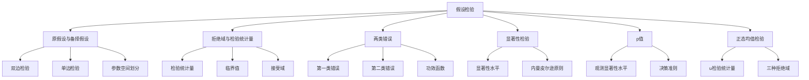

# 7.1 假设检验的基本思想与概念

**相关笔记**：[[6.1 点估计的概念与无偏性]] | [[6.6 区间估计]] | [[5.4 三大抽样分布]] | [[4.4 中心极限定理]]

> [!abstract] 本节概览
> 本节系统介绍==假设检验==的基本思想与核心概念。假设检验是统计推断的两大核心问题之一（另一类是[[6.1 点估计的概念与无偏性|参数估计]]），其核心逻辑是：对总体参数提出某种假设，然后根据样本信息判断该假设是否合理。判断的基本准则是==小概率事件在一次试验中几乎不发生==——如果原假设成立时样本观测值出现的概率很小，我们就倾向于拒绝原假设。这一节将依次建立原假设与备择假设、拒绝域与检验统计量、两类错误、==显著性水平==、p 值等核心概念，并以正态总体均值检验为例展示完整检验流程。
>
> **逻辑链条**：[[#一、假设检验问题的提出|问题提出]] → [[#二、原假设与备择假设|原假设与备择假设]] → [[#三、拒绝域与检验统计量|拒绝域与检验统计量]] → [[#四、两类错误与功效函数|两类错误与功效函数]] → [[#五、显著性水平与显著性检验|显著性水平与显著性检验]] → [[#六、p值|p值]] → [[#七、正态总体均值的检验|正态总体均值检验]]
>
> **前置依赖**：[[6.6 区间估计|§6.6]]（置信区间与假设检验的对偶性）、[[5.4 三大抽样分布|§5.4]]（正态分布、$\chi^2$ 分布、$t$ 分布及分位数）、[[4.4 中心极限定理|§4.4]]（大样本近似）、[[6.1 点估计的概念与无偏性|§6.1]]（统计量与抽样分布）
>
> **核心主线**：假设检验的本质是一种"反证法"式的统计推断——先假定原假设成立，再看样本数据是否提供了足够的"矛盾证据"来推翻它。关键概念包括：原假设 $H_0$ 与备择假设 $H_1$ 的设定、拒绝域的构造、两类错误的权衡、显著性水平 $\alpha$ 的选取、以及 p 值的统一度量。

---

## 一、假设检验问题的提出

### 统计推断的两大问题

在前面的第六章中，我们系统地学习了==参数估计==问题——用样本信息去估计总体分布中的未知参数（点估计和区间估计）。统计推断的另一大类核心问题是**假设检验**（hypothesis testing）：根据样本信息，对关于总体的某个假设做出"接受"或"拒绝"的判断。

**参数估计 vs 假设检验**：
- **参数估计**：参数 $\theta$ 是什么？（回答"是多少"的问题）
- **假设检验**：参数 $\theta$ 是否等于某个特定值？（回答"是不是"的问题）

### 法庭审判类比

假设检验的思想可以用**法庭审判**来类比，这是理解其核心逻辑的最佳方式：

| 法庭审判 | 假设检验 |
|:---|:---|
| 被告 | 原假设 $H_0$（无罪推定） |
| 原告 | 备择假设 $H_1$ |
| 证据 | 样本数据 |
| 判决定罪 | 拒绝 $H_0$ |
| 判决无罪 | 不拒绝 $H_0$ |
| 冤枉好人 | 第一类错误（弃真） |
| 放走坏人 | 第二类错误（取伪） |
| 证明标准 | 显著性水平 $\alpha$ |

**核心类比要点**：
1. **无罪推定**：被告在被证明有罪之前被假定为无罪——同样，$H_0$ 在被足够证据推翻之前被假定为成立。
2. **举证责任在原告**：原告需要提供充分的证据来证明被告有罪——同样，拒绝 $H_0$ 需要样本提供足够的"矛盾证据"。
3. **"证据不足"不等于"无罪"**：法庭判决"无罪"只是说证据不足以定罪，不等于证明被告确实无罪——同样，"不拒绝 $H_0$"只是说样本没有提供足够的证据来拒绝它，不等于证明了 $H_0$ 为真。

### 假设检验的典型问题

假设检验问题的一般提法是：对总体分布的某个未知方面提出一个**假设**，然后根据样本信息判断是否应该拒绝这个假设。

**典型例子**：
- 某工厂声称其产品的平均寿命为 1000 小时，我们抽取 25 件产品进行检验，判断该说法是否可信。
- 某种新药是否比旧药更有效？
- 某批产品的次品率是否超过 5%？

这些问题共同的特点是：我们需要根据**有限的样本信息**，对**关于总体的某个命题**做出判断。

---

## 二、原假设与备择假设

### 原假设与备择假设的定义

> [!def] 定义 7.1.1 — 原假设与备择假设
> 设总体 $X$ 的分布函数 $F(x;\theta)$ 含有未知参数 $\theta \in \Theta$，$\Theta$ 为参数空间。将参数空间 $\Theta$ 划分为两个互不相交的子集 $\Theta_0$ 和 $\Theta_1$，使得 $\Theta = \Theta_0 \cup \Theta_1$ 且 $\Theta_0 \cap \Theta_1 = \varnothing$。
>
> - **原假设**（null hypothesis）：$H_0: \theta \in \Theta_0$
> - **备择假设**（alternative hypothesis）：$H_1: \theta \in \Theta_1$
>
> 假设检验问题就是根据样本 $X_1, X_2, \ldots, X_n$，在 $H_0$ 和 $H_1$ 之间做出选择：是接受 $H_0$，还是拒绝 $H_0$（从而接受 $H_1$）。

**要点解读**：
- $H_0$ 和 $H_1$ 是**互斥且穷尽**的：$\theta$ 要么属于 $\Theta_0$，要么属于 $\Theta_1$，没有第三种可能。
- 原假设 $H_0$ 通常是我们想要**检验**的命题，或者说是我们希望**推翻**的命题。
- 备择假设 $H_1$ 是我们在 $H_0$ 被拒绝时**转而接受**的命题。

### 参数空间的划分

参数空间 $\Theta$ 被划分为两个部分：

$$
\Theta = \Theta_0 \cup \Theta_1, \quad \Theta_0 \cap \Theta_1 = \varnothing
$$

- $\Theta_0$：原假设对应的参数取值范围
- $\Theta_1$：备择假设对应的参数取值范围

### 三种检验类型

根据 $\Theta_0$ 和 $\Theta_1$ 的不同划分方式，假设检验可以分为三种基本类型：

| 检验类型 | 原假设 $H_0$ | 备择假设 $H_1$ | 拒绝域位置 |
|:---|:---|:---|:---|
| **双边检验** | $H_0: \theta = \theta_0$ | $H_1: \theta \neq \theta_0$ | 双侧 |
| **右边检验** | $H_0: \theta \leqslant \theta_0$ | $H_1: \theta > \theta_0$ | 右侧 |
| **左边检验** | $H_0: \theta \geqslant \theta_0$ | $H_1: \theta < \theta_0$ | 左侧 |

**说明**：
- **双边检验**：关心参数是否偏离某个特定值，不关心偏离的方向。例如：检验某批零件的平均直径是否等于 10mm。
- **右边检验**：关心参数是否**大于**某个特定值。例如：检验新工艺是否提高了产品寿命。
- **左边检验**：关心参数是否**小于**某个特定值。例如：检验某材料的杂质含量是否低于安全标准。

### 原假设的设立原则

原假设 $H_0$ 的设立不是随机的，需要遵循以下原则：

1. **保护原假设原则**：$H_0$ 代表"维持现状"或"没有效应"的保守立场。拒绝 $H_0$ 需要充分的证据，类似于法庭上的"无罪推定"。
2. **等号放在 $H_0$ 中**：在单边检验中，等号始终放在原假设中（即 $H_0: \theta \leqslant \theta_0$ 或 $H_0: \theta \geqslant \theta_0$），这样可以在边界点 $\theta = \theta_0$ 处计算检验统计量的分布。
3. **后果严重的一方放 $H_0$**：如果犯某一类错误的后果特别严重，应将这类错误对应的状态设为 $H_0$，因为 $H_0$ 被拒绝需要更强的证据。

> [!example] 例 7.1.1 — 判断检验类型
> 判断以下假设检验的类型：
>
> **(1)** 某食品厂声称其袋装食品的平均重量为 500g。质检部门想检验该说法是否属实。
> - $H_0: \mu = 500$，$H_1: \mu \neq 500$ → **双边检验**
>
> **(2)** 某种新型电池的标称使用寿命为 100 小时。消费者协会想检验该电池的实际使用寿命是否**低于**标称值。
> - $H_0: \mu \geqslant 100$，$H_1: \mu < 100$ → **左边检验**
>
> **(3)** 某工厂采用新工艺后，声称产品强度有所提高。检验新工艺是否确实提高了产品强度。
> - $H_0: \mu \leqslant \mu_0$，$H_1: \mu > \mu_0$ → **右边检验**

---

## 三、拒绝域与检验统计量

### 拒绝域的定义

> [!def] 定义 7.1.2 — 拒绝域
> 设样本空间为 $\mathcal{X}$，将样本空间划分为两个互不相交的区域：
>
> - **拒绝域**（rejection region / 临界域）$R$：当样本观测值 $(x_1, x_2, \ldots, x_n) \in R$ 时，拒绝 $H_0$。
> - **接受域** $R^c = \mathcal{X} \setminus R$：当样本观测值 $(x_1, x_2, \ldots, x_n) \in R^c$ 时，不拒绝 $H_0$。
>
> 检验的决策规则可以简洁地表述为：
> $$
> \text{若 } (x_1, \ldots, x_n) \in R, \text{ 则拒绝 } H_0; \quad \text{若 } (x_1, \ldots, x_n) \in R^c, \text{ 则不拒绝 } H_0.
> $$

**直观理解**：拒绝域 $R$ 就是"如果样本落在这个区域，就说明数据与原假设严重矛盾"的区域。拒绝域的构造是假设检验的核心——它决定了检验的优劣。

### 检验统计量的定义

> [!def] 定义 7.1.3 — 检验统计量
> 在构造拒绝域时，通常不是直接在样本空间中划分区域，而是选择一个适当的**统计量** $T = T(X_1, X_2, \ldots, X_n)$，利用 $T$ 的取值来构造拒绝域。这个统计量称为==检验统计量==（test statistic）。
>
> 拒绝域可以表示为检验统计量取值的某个集合：
> $$
> R = \{(x_1, \ldots, x_n) : T(x_1, \ldots, x_n) \in W\}
> $$
> 其中 $W$ 是检验统计量取值空间的一个子集。

**检验统计量的选择原则**：
1. 检验统计量应能**敏感地反映**参数偏离 $H_0$ 的程度。
2. 在 $H_0$ 成立的条件下，检验统计量的分布应当是**已知或可以确定的**。
3. 检验统计量应充分利用样本中的**相关信息**。

### 拒绝域的构造思想

拒绝域的构造遵循以下逻辑：

1. **确定检验统计量** $T$：选择一个在 $H_0$ 下分布已知的统计量。
2. **确定拒绝方向**：根据备择假设 $H_1$ 的方向，确定拒绝域应在检验统计量分布的哪一端（或两端）。
3. **确定临界值**：根据显著性水平 $\alpha$，确定拒绝域的边界（临界值）。

**三种检验类型的拒绝域方向**：

| 检验类型 | 拒绝域方向 | 直觉 |
|:---|:---|:---|
| 双边检验 $H_1: \theta \neq \theta_0$ | 两侧极端值 | $\theta$ 偏大或偏小都不支持 $H_0$ |
| 右边检验 $H_1: \theta > \theta_0$ | 右侧极端值 | $\theta$ 偏大才不支持 $H_0$ |
| 左边检验 $H_1: \theta < \theta_0$ | 左侧极端值 | $\theta$ 偏小才不支持 $H_0$ |

### 临界值

> **临界值**（critical value）是拒绝域与接受域的分界点，通常记为 $c$。临界值的确定依赖于：
> - 检验统计量在 $H_0$ 下的分布
> - 显著性水平 $\alpha$
> - 检验的类型（双边、左边、右边）

> [!example] 例 7.1.2 — 构造拒绝域
> 设 $X_1, X_2, \ldots, X_{25}$ 是来自正态总体 $N(\mu, 4)$ 的样本，要检验
> $$
> H_0: \mu = 10 \quad \text{vs} \quad H_1: \mu \neq 10.
> $$
> 取检验统计量为样本均值 $\bar{X}$。在 $H_0$ 成立时，
> $$
> \bar{X} \sim N\!\left(10, \frac{4}{25}\right) = N(10, 0.16).
> $$
> 对给定的显著性水平 $\alpha = 0.05$，查标准正态分布表得 $u_{0.975} = 1.96$，则拒绝域为
> $$
> R = \left\{(x_1, \ldots, x_{25}) : \left|\frac{\bar{x} - 10}{2/5}\right| > 1.96\right\} = \left\{(x_1, \ldots, x_{25}) : |\bar{x} - 10| > 0.784\right\}.
> $$
> 即当样本均值 $\bar{x}$ 与 10 的偏差超过 0.784 时，拒绝 $H_0$。

---

## 四、两类错误与功效函数

### 第一类错误（弃真错误）

> [!def] 定义 7.1.4 — 第一类错误
> 当原假设 $H_0$ 实际上成立时，由于样本的随机性，检验结果却拒绝了 $H_0$，这种错误称为==第一类错误==（Type I error），也称**弃真错误**。
>
> 第一类错误的概率为
> $$
> \alpha(\theta) = P_\theta(X \in R), \quad \theta \in \Theta_0.
> $$

**直观理解**：第一类错误就是"冤枉好人"——$H_0$ 本来是真的，却被错误地拒绝了。

### 第二类错误（取伪错误）

> [!def] 定义 7.1.5 — 第二类错误
> 当原假设 $H_0$ 实际上不成立（即 $H_1$ 成立）时，检验结果却没有拒绝 $H_0$，这种错误称为==第二类错误==（Type II error），也称**取伪错误**。
>
> 第二类错误的概率为
> $$
> \beta(\theta) = P_\theta(X \in R^c), \quad \theta \in \Theta_1.
> $$

**直观理解**：第二类错误就是"放走坏人"——$H_0$ 本来是假的，却没有被拒绝。

### 两类错误的决策矩阵

| | $H_0$ 为真 | $H_1$ 为真 |
|:---|:---|:---|
| **不拒绝 $H_0$** | 正确决策（概率 $1 - \alpha$） | 第二类错误（概率 $\beta$） |
| **拒绝 $H_0$** | 第一类错误（概率 $\alpha$） | 正确决策（概率 $1 - \beta$） |

### 功效函数

> [!def] 定义 7.1.6 — 功效函数
> 设 $R$ 为某个检验的拒绝域，则函数
> $$
> g(\theta) = P_\theta(X \in R), \quad \theta \in \Theta
> $$
> 称为该检验的==功效函数==（power function）。功效函数在 $\theta \in \Theta_0$ 上的值就是第一类错误的概率，在 $\theta \in \Theta_1$ 上的值就是正确拒绝 $H_0$ 的概率（即检验的功效）。

**功效函数的直观含义**：
- $g(\theta)$ 表示当真实参数为 $\theta$ 时，检验拒绝 $H_0$ 的概率。
- 当 $\theta \in \Theta_0$ 时，$g(\theta)$ 越小越好（第一类错误概率越小越好）。
- 当 $\theta \in \Theta_1$ 时，$g(\theta)$ 越大越好（正确拒绝 $H_0$ 的概率越大越好）。

### 两类错误的概率关系

由功效函数的定义，两类错误的概率可以统一表示为：

$$
\alpha(\theta) = g(\theta), \quad \theta \in \Theta_0 \quad \text{（第一类错误概率）}

\beta(\theta) = 1 - g(\theta), \quad \theta \in \Theta_1 \quad \text{（第二类错误概率）}
$$

**两类错误的矛盾关系**：在样本量 $n$ 固定的条件下，减少第一类错误的概率必然导致第二类错误的概率增大，反之亦然。这一矛盾关系是假设检验中无法回避的根本问题，也是我们需要引入**显著性水平**和 **Neyman-Pearson 原则**的原因。

> [!example] 例 7.1.3 — 计算两类错误概率
> 设 $X_1, X_2, \ldots, X_{16}$ 是来自正态总体 $N(\mu, 1)$ 的样本，检验问题为
> $$
> H_0: \mu = 0 \quad \text{vs} \quad H_1: \mu = 1.
> $$
> 采用检验统计量 $\bar{X}$，拒绝域为 $R = \{\bar{x} > c\}$，其中 $c$ 为临界值。
>
> **计算第一类错误概率**（当 $H_0$ 成立，即 $\mu = 0$ 时）：
> $$
> \alpha = P_0(\bar{X} > c) = 1 - \Phi\!\left(\frac{c - 0}{1/4}\right) = 1 - \Phi(4c).
> $$
>
> **计算第二类错误概率**（当 $H_1$ 成立，即 $\mu = 1$ 时）：
> $$
> \beta = P_1(\bar{X} \leqslant c) = \Phi\!\left(\frac{c - 1}{1/4}\right) = \Phi(4c - 4).
> $$
>
> **数值例子**：若取 $c = 0.824$，则
> $$
> \alpha = 1 - \Phi(4 \times 0.824) = 1 - \Phi(3.296) \approx 1 - 0.9995 = 0.0005,
> $$
> $$
> \beta = \Phi(4 \times 0.824 - 4) = \Phi(-0.704) \approx 0.241.
> $$
> 可以看到，当 $\alpha$ 很小时，$\beta$ 相对较大。若要同时减小两类错误，需要**增大样本量**。

---

## 五、显著性水平与显著性检验

### 显著性水平的定义

> [!def] 定义 7.1.7 — 显著性水平
> 给定一个小正数 $\alpha \in (0, 1)$（通常取 $\alpha = 0.05$ 或 $\alpha = 0.01$），如果某个检验满足
> $$
> \sup_{\theta \in \Theta_0} P_\theta(X \in R) \leqslant \alpha,
> $$
> 即第一类错误的概率不超过 $\alpha$，则称 $\alpha$ 为该检验的==显著性水平==（significance level），称该检验为**水平为 $\alpha$ 的检验**。

**要点解读**：
- 显著性水平 $\alpha$ 是我们对第一类错误概率所设定的**上限**。
- 常用的显著性水平：$\alpha = 0.10, 0.05, 0.01$。
- $\alpha$ 越小，对拒绝 $H_0$ 的要求越严格（需要更强的证据）。

### Neyman-Pearson 原则

> [!thm] Neyman-Pearson 原则
> 在控制第一类错误概率不超过显著性水平 $\alpha$ 的前提下，选择使第二类错误概率尽可能小（即使功效函数在 $\Theta_1$ 上尽可能大）的检验。这一原则由 Neyman 和 Pearson 于 1928 年提出，是现代假设检验理论的基石。

**Neyman-Pearson 原则的核心思想**：
1. **优先控制第一类错误**：因为 $H_0$ 代表"维持现状"，错误地拒绝它通常后果更严重（类比：冤枉好人的后果比放走坏人更严重，因为前者破坏了制度的公信力）。
2. **在约束下最优化**：在第一类错误概率 $\leqslant \alpha$ 的约束下，寻找使功效最大的检验。

### 水平 $\alpha$ 的检验

> [!thm] 水平 $\alpha$ 的检验
> 一个检验称为**水平为 $\alpha$ 的检验**，如果
> $$
> g(\theta) = P_\theta(X \in R) \leqslant \alpha, \quad \forall\, \theta \in \Theta_0.
> $$
> 如果存在 $\theta_0 \in \Theta_0$ 使得 $g(\theta_0) = \alpha$，则称该检验为**精确水平 $\alpha$ 的检验**。

> [!example] 例 7.1.4 — 给定显著性水平构造检验
> 设 $X_1, X_2, \ldots, X_9$ 是来自正态总体 $N(\mu, 4)$ 的样本，在显著性水平 $\alpha = 0.05$ 下检验
> $$
> H_0: \mu = 5 \quad \text{vs} \quad H_1: \mu > 5.
> $$
>
> **第一步**：选择检验统计量。在 $H_0$ 下，
> $$
> u = \frac{\bar{X} - 5}{2/\sqrt{9}} = \frac{\bar{X} - 5}{2/3} \sim N(0, 1).
> $$
>
> **第二步**：确定拒绝域。这是右边检验，拒绝域应在右侧：
> $$
> R = \left\{(x_1, \ldots, x_9) : \frac{\bar{x} - 5}{2/3} > u_{1-\alpha}\right\}.
> $$
> 查标准正态分布表，$u_{0.95} = 1.645$，故
> $$
> R = \left\{(x_1, \ldots, x_9) : \frac{\bar{x} - 5}{2/3} > 1.645\right\} = \left\{(x_1, \ldots, x_9) : \bar{x} > 6.097\right\}.
> $$
>
> **第三步**：做出判断。若实际观测到 $\bar{x} = 6.5$，则
> $$
> u = \frac{6.5 - 5}{2/3} = 2.25 > 1.645,
> $$
> 样本落入拒绝域，故在显著性水平 $\alpha = 0.05$ 下拒绝 $H_0$，认为 $\mu > 5$。

---

## 六、p值

### p值的定义

> [!def] 定义 7.1.8 — p值
> 设 $T(X_1, \ldots, X_n)$ 为检验统计量，$t_{\text{obs}}$ 为其观测值。==p 值==（p-value）定义为在 $H_0$ 成立的条件下，检验统计量取到**至少与观测值一样极端**的概率：
>
> - **双边检验**：$p = P_{H_0}(|T| \geqslant |t_{\text{obs}}|)$
> - **右边检验**：$p = P_{H_0}(T \geqslant t_{\text{obs}})$
> - **左边检验**：$p = P_{H_0}(T \leqslant t_{\text{obs}})$
>
> p 值也称为**观测到的显著性水平**（observed significance level）。

### p值的直观理解

**p 值回答的问题是**：如果原假设 $H_0$ 是真的，那么观察到当前样本（或更极端样本）的概率有多大？

- **p 值很小**：说明在 $H_0$ 成立的前提下，当前样本（或更极端样本）出现的概率很低。根据"小概率事件在一次试验中几乎不发生"的原则，我们有理由怀疑 $H_0$ 的正确性，倾向于拒绝 $H_0$。
- **p 值很大**：说明在 $H_0$ 成立的前提下，当前样本出现的概率并不低，样本与 $H_0$ 并不矛盾，没有充分理由拒绝 $H_0$。

**类比**：p 值就像法庭上"证据的证明力"——p 值越小，证据越有力，越能证明被告有罪。

### p值决策准则

$$
\text{p 值} \leqslant \alpha \implies \text{拒绝 } H_0

\text{p 值} > \alpha \implies \text{不拒绝 } H_0
$$

### p值与显著性水平的关系

p 值与显著性水平 $\alpha$ 的关系可以总结如下：

| p 值范围 | 结论 | 证据力度 |
|:---|:---|:---|
| $p \leqslant 0.01$ | 高度显著，拒绝 $H_0$ | 极强证据 |
| $0.01 < p \leqslant 0.05$ | 显著，拒绝 $H_0$ | 强证据 |
| $0.05 < p \leqslant 0.10$ | 边缘显著 | 弱证据 |
| $p > 0.10$ | 不显著，不拒绝 $H_0$ | 无充分证据 |

**p 值的优势**：p 值比简单的"拒绝/不拒绝"二元决策提供了更丰富的信息。它告诉我们在哪个显著性水平下 $H_0$ 刚好被拒绝，使读者可以根据自己的判断标准做出决策。

> [!example] 例 7.1.5 — 计算 p 值
> 承例 7.1.4，已知 $\bar{x} = 6.5$，检验统计量观测值
> $$
> u_{\text{obs}} = \frac{6.5 - 5}{2/3} = 2.25.
> $$
> 这是右边检验，p 值为
> $$
> p = P_{H_0}(U \geqslant 2.25) = 1 - \Phi(2.25) = 1 - 0.9878 = 0.0122.
> $$
> 由于 $p = 0.0122 < 0.05 = \alpha$，拒绝 $H_0$。
>
> 进一步，由于 $p = 0.0122 < 0.01$ 不成立（$0.0122 > 0.01$），所以在 $\alpha = 0.01$ 的水平下不拒绝 $H_0$。这说明 p 值提供了比固定 $\alpha$ 更精细的信息。

---

## 七、正态总体均值的检验（$\sigma^2$已知）

### $u$ 检验的定理

> [!thm] 定理 7.1.1 — $\sigma^2$ 已知时 $\mu$ 的 $u$ 检验
> 设 $X_1, X_2, \ldots, X_n$ 是来自正态总体 $N(\mu, \sigma^2)$ 的样本，其中 $\sigma^2 = \sigma_0^2$ 已知。检验问题为
> $$
> H_0: \mu = \mu_0 \quad \text{vs} \quad H_1: \mu \neq \mu_0.
> $$
> 在 $H_0$ 成立的条件下，检验统计量
> $$
> u = \frac{\bar{X} - \mu_0}{\sigma_0 / \sqrt{n}} \sim N(0, 1).
> $$
> 对给定的显著性水平 $\alpha$，拒绝域为
> $$
> R = \left\{|u| > u_{1-\alpha/2}\right\}.
> $$

### $u$ 检验统计量

$$
u = \frac{\bar{X} - \mu_0}{\sigma_0 / \sqrt{n}}
$$

**检验统计量的构造逻辑**：
- 分子 $\bar{X} - \mu_0$：度量样本均值与假设均值的偏差。
- 分母 $\sigma_0 / \sqrt{n}$：标准误差，对偏差进行标准化。
- 在 $H_0$ 下，$u \sim N(0,1)$，分布完全已知。

### 三种检验的拒绝域汇总

| 检验类型 | 原假设 $H_0$ | 备择假设 $H_1$ | 拒绝域 |
|:---|:---|:---|:---|
| 双边检验 | $\mu = \mu_0$ | $\mu \neq \mu_0$ | $|u| > u_{1-\alpha/2}$ |
| 右边检验 | $\mu \leqslant \mu_0$ | $\mu > \mu_0$ | $u > u_{1-\alpha}$ |
| 左边检验 | $\mu \geqslant \mu_0$ | $\mu < \mu_0$ | $u < u_{\alpha} = -u_{1-\alpha}$ |

> [!abstract] 证明
> **证明**：以双边检验为例。
>
> **第一步：构造检验统计量**。在 $H_0: \mu = \mu_0$ 下，由 [[5.4 三大抽样分布|§5.4]] 的正态总体抽样定理，
> $$
> \bar{X} \sim N\!\left(\mu_0, \frac{\sigma_0^2}{n}\right),
> $$
> 标准化得
> $$
> u = \frac{\bar{X} - \mu_0}{\sigma_0 / \sqrt{n}} \sim N(0, 1).
> $$
>
> **第二步：确定拒绝域**。对给定的 $\alpha$，取标准正态分布的双侧 $\alpha/2$ 分位数：
> $$
> P\!\left(|u| > u_{1-\alpha/2}\right) = \alpha.
> $$
> 因此，当 $|u| > u_{1-\alpha/2}$ 时，样本与 $H_0$ 矛盾，拒绝 $H_0$。
>
> **第三步：验证等价性**。$|u| > u_{1-\alpha/2}$ 等价于
> $$
> \bar{X} - \mu_0 > u_{1-\alpha/2} \cdot \frac{\sigma_0}{\sqrt{n}} \quad \text{或} \quad \bar{X} - \mu_0 < -u_{1-\alpha/2} \cdot \frac{\sigma_0}{\sqrt{n}},
> $$
> 即样本均值 $\bar{X}$ 与 $\mu_0$ 的偏差过大。
>
> $\square$

> [!example] 例 7.1.6 — 正态总体均值检验的完整步骤
> 某工厂生产的灯泡寿命（单位：小时）服从正态分布 $N(\mu, 400)$。按规定，灯泡的平均寿命应不低于 1000 小时。现从一批产品中随机抽取 25 只，测得平均寿命 $\bar{x} = 990$ 小时。在显著性水平 $\alpha = 0.05$ 下，检验该批灯泡的平均寿命是否达标。
>
> **第一步：建立假设**。
> $$
> H_0: \mu \geqslant 1000 \quad \text{vs} \quad H_1: \mu < 1000.
> $$
> （将"达标"放在 $H_0$ 中，因为拒绝"达标"需要充分证据。）
>
> **第二步：选择检验统计量**。
> $$
> u = \frac{\bar{X} - 1000}{20 / \sqrt{25}} = \frac{\bar{X} - 1000}{4}.
> $$
> 在 $H_0$ 的边界点 $\mu = 1000$ 下，$u \sim N(0,1)$。
>
> **第三步：确定拒绝域**。
> 左边检验，$\alpha = 0.05$，$u_{0.95} = 1.645$，拒绝域为
> $$
> R = \{u < -1.645\}.
> $$
>
> **第四步：计算检验统计量并做判断**。
> $$
> u_{\text{obs}} = \frac{990 - 1000}{4} = -2.5.
> $$
> 由于 $-2.5 < -1.645$，$u_{\text{obs}}$ 落入拒绝域，故拒绝 $H_0$。
>
> **第五步：计算 p 值**。
> $$
> p = P_{H_0}(U \leqslant -2.5) = \Phi(-2.5) = 1 - \Phi(2.5) = 1 - 0.9938 = 0.0062.
> $$
> p 值 $= 0.0062 < 0.05$，进一步确认拒绝 $H_0$。在 $\alpha = 0.01$ 的水平下，$p = 0.0062 < 0.01$，仍然拒绝 $H_0$。
>
> **结论**：在显著性水平 $\alpha = 0.05$ 下，有充分证据认为该批灯泡的平均寿命低于 1000 小时，未达到标准。

---

## 八、知识结构总览

---

## 九、核心思想与解题技巧

### 假设检验的解题步骤（五步法）

> [!thm] 假设检验五步法
> **第一步：建立假设**。根据问题的实际背景，合理设立原假设 $H_0$ 和备择假设 $H_1$。
>
> **第二步：选择检验统计量**。根据总体分布和待检验参数，选择在 $H_0$ 下分布已知的检验统计量。
>
> **第三步：确定拒绝域**。根据检验类型（双边/左边/右边）和显著性水平 $\alpha$，确定拒绝域的形式和临界值。
>
> **第四步：计算并判断**。将样本数据代入检验统计量，计算观测值，判断是否落入拒绝域。
>
> **第五步：计算 p 值（可选但推荐）**。计算 p 值，给出更精细的结论。

### 常见题型总结

| 题型 | 关键步骤 | 注意事项 |
|:---|:---|:---|
| 判断检验类型 | 分析 $H_1$ 的方向 | 等号始终在 $H_0$ 中 |
| 构造拒绝域 | 确定检验统计量分布→查分位数 | 注意单边/双边的分位数取法 |
| 计算两类错误 | 分别在 $H_0$ 和 $H_1$ 下计算概率 | 注意 $\alpha$ 和 $\beta$ 的定义域 |
| 计算功效函数 | $g(\theta) = P_\theta(X \in R)$ | 对所有 $\theta \in \Theta$ 计算 |
| 计算 p 值 | 在 $H_0$ 下计算尾部概率 | 区分双边/左边/右边 |
| 正态均值检验 | $u$ 检验统计量→查标准正态表 | 确认 $\sigma^2$ 是否已知 |

### 置信区间与假设检验的对偶性

假设检验与置信区间之间存在深刻的对偶关系：

> [!thm] 置信区间与假设检验的对偶性
> 设 $\theta$ 的 $1-\alpha$ 置信区间为 $[\hat{\theta}^L, \hat{\theta}^U]$，则
> $$
> \text{在水平 } \alpha \text{ 下拒绝 } H_0: \theta = \theta_0 \iff \theta_0 \notin [\hat{\theta}^L, \hat{\theta}^U].
> $$
> 即：$\theta_0$ 不在置信区间内等价于拒绝 $H_0: \theta = \theta_0$。

**直观理解**：置信区间给出了参数 $\theta$ 的"合理范围"，如果 $\theta_0$ 不在这个范围内，说明 $\theta_0$ 与数据不太一致，应该拒绝 $H_0$。

**对偶性示例**：对正态总体 $N(\mu, \sigma_0^2)$，$\mu$ 的 $1-\alpha$ 置信区间为

$$
\left[\bar{X} - u_{1-\alpha/2} \cdot \frac{\sigma_0}{\sqrt{n}}, \quad \bar{X} + u_{1-\alpha/2} \cdot \frac{\sigma_0}{\sqrt{n}}\right]
$$

而 $H_0: \mu = \mu_0$ 的拒绝域为

$$
|\bar{X} - \mu_0| > u_{1-\alpha/2} \cdot \frac{\sigma_0}{\sqrt{n}}
$$

两者完全等价：$\mu_0$ 不在置信区间中 $\iff$ $|\bar{X} - \mu_0| > u_{1-\alpha/2} \cdot \sigma_0 / \sqrt{n}$。

---

## 十、补充理解与易混淆点

### 误区一："不拒绝$H_0$就是接受$H_0$"

> [!danger] 误区描述
> 很多初学者认为"不拒绝 $H_0$"等价于"接受 $H_0$，证明 $H_0$ 为真"。这是对假设检验逻辑的根本误解。
>
> **正确理解**："不拒绝 $H_0$"仅仅意味着**当前样本没有提供足够的证据来拒绝 $H_0$**，并不代表 $H_0$ 就是正确的。这就像法庭判决"无罪"只是说证据不足以定罪，不等于证明被告确实没有犯罪。
>
> 在统计学中，我们通常说"不拒绝 $H_0$"而不是"接受 $H_0$"，就是为了强调这一区别。如果需要"接受"某个假设，应该通过**功效分析**（power analysis）来验证检验确实有足够的能力检测到实际存在的差异。

**来源**：茆诗松《概率论与数理统计》§7.1 + 卡方训练营核心笔记 + [Penn State STAT 500 - Hypothesis Testing](https://online.stat.psu.edu/stat500/lesson/6/6.1) + [Khan Academy - Significance Tests](https://www.khanacademy.org/math/statistics-probability/significance-tests) + [Wikipedia - Statistical Hypothesis Testing](https://en.wikipedia.org/wiki/Statistical_hypothesis_testing)

### 误区二："p值就是原假设成立的概率"

> [!danger] 误区描述
> 这是一个极其常见且严重的误解。p 值**不是**原假设 $H_0$ 成立的概率 $P(H_0 | \text{data})$，而是在 $H_0$ 成立的**前提下**观察到当前数据（或更极端数据）的概率 $P(\text{data or more extreme} | H_0)$。
>
> 这两个概率有本质区别：
> - $P(\text{data} | H_0)$：条件概率，以 $H_0$ 为条件（这是 p 值的定义）
> - $P(H_0 | \text{data})$：后验概率，以数据为条件（这是贝叶斯统计的范畴）
>
> 根据贝叶斯公式，两者之间的关系还依赖于**先验概率** $P(H_0)$。即使 p 值很小（如 0.05），如果 $H_0$ 的先验概率很高，$H_0$ 成立的后验概率可能仍然相当大。

**来源**：茆诗松《概率论与数理统计》§7.1 + 卡方训练营核心笔记 + [Penn State STAT 500 - P-value Interpretation](https://online.stat.psu.edu/stat500/lesson/6/6.2) + [Wikipedia - P-value Misuse](https://en.wikipedia.org/wiki/Statistical_hypothesis_testing) + [Khan Academy - P-values](https://www.khanacademy.org/math/statistics-probability/significance-tests/idea-of-significance-tests/a/p-values-and-significance-tests)

### 误区三："显著性水平越小越好"

> [!danger] 误区描述
> 有人认为 $\alpha$ 取得越小（如 0.001），检验就越"严格"、越好。实际上，$\alpha$ 的选择是在两类错误之间做**权衡**：$\alpha$ 减小会导致 $\beta$ 增大（在样本量固定的条件下）。
>
> 如果 $\alpha$ 取得太小：
> - 第一类错误概率确实降低了（"冤枉好人"的概率减小了）
> - 但第二类错误概率增大了（"放走坏人"的概率增大了）
> - 检验的功效降低了，可能无法检测到实际存在的显著差异
>
> **正确的做法**是根据问题的实际背景来选择 $\alpha$：
> - 当第一类错误的后果特别严重时（如药品安全性检验），应取较小的 $\alpha$
> - 当第二类错误的后果特别严重时（如疾病筛查），可以适当增大 $\alpha$
> - 一般的科学研究中，$\alpha = 0.05$ 是最常用的选择

**来源**：茆诗松《概率论与数理统计》§7.1 + 卡方训练营核心笔记 + [Penn State STAT 500 - Type I and Type II Errors](https://online.stat.psu.edu/stat500/lesson/6/6.3) + [Khan Academy - Type I and II Errors](https://www.khanacademy.org/math/statistics-probability/significance-tests/error-probabilities-and-power/a/type-i-and-type-ii-errors) + [Wikipedia - Type I and Type II Errors](https://en.wikipedia.org/wiki/Statistical_hypothesis_testing)

### 误区四："假设检验能证明原假设为真"

> [!danger] 误区描述
> 假设检验的逻辑本质是**反证法**（更准确地说是"概率反证法"）：假设 $H_0$ 成立，如果样本数据与 $H_0$ 矛盾（即 p 值很小），则拒绝 $H_0$。但反过来，如果样本数据不与 $H_0$ 矛盾（p 值较大），**不能**得出"$H_0$ 为真"的结论。
>
> 这是因为：
> - "不拒绝 $H_0$"可能仅仅是因为**样本量不够大**，检验的功效不足，无法检测到实际存在的差异
> - "不拒绝 $H_0$"也可能是因为**差异确实不存在**，但检验本身无法区分这两种情况
>
> 如果要"证明"某个效应存在，应该通过功效分析确保检验有足够的统计功效（通常要求功效 $\geqslant 0.80$），或者报告效应量的置信区间。

**来源**：茆诗松《概率论与数理统计》§7.1 + 卡方训练营核心笔记 + [Penn State STAT 500 - Power of a Test](https://online.stat.psu.edu/stat500/lesson/6/6.4) + [Wikipedia - Statistical Power](https://en.wikipedia.org/wiki/Statistical_hypothesis_testing) + [Khan Academy - Statistical Power](https://www.khanacademy.org/math/statistics-probability/significance-tests/error-probabilities-and-power/a/power-of-hypothesis-test)

### 误区五："双边检验一定比单边检验好"

> [!danger] 误区描述
> 有人认为双边检验"更全面"、"更保守"，因此总是优于单边检验。实际上，检验类型的选择应该**基于实际问题的需要**，而非主观偏好。
>
> 两者的比较：
> - **双边检验**：对两个方向都敏感，但每个方向的检验功效较低（因为 $\alpha$ 被分到了两侧）
> - **单边检验**：只对一个方向敏感，但在该方向上的检验功效更高（因为 $\alpha$ 集中在一侧）
>
> 如果实际问题只关心参数是否大于（或小于）某个值，使用单边检验更合适——它在关注的方向上有更高的功效。但如果事先没有方向性的预期，或者两个方向的偏离都有实际意义，则应使用双边检验。
>
> **关键原则**：检验类型必须在**看到数据之前**确定，不能先看数据再选择检验类型（这会导致严重的 p 值操纵问题）。

**来源**：茆诗松《概率论与数理统计》§7.1 + 卡方训练营核心笔记 + [Penn State STAT 500 - One-sided vs Two-sided Tests](https://online.stat.psu.edu/stat500/lesson/6/6.1) + [Khan Academy - Hypothesis Testing](https://www.khanacademy.org/math/statistics-probability/significance-tests) + [Wikipedia - One- and Two-tailed Tests](https://en.wikipedia.org/wiki/Statistical_hypothesis_testing)

---

## 十一、习题精选

> [!todo] 习题概览
>
> | 题号 | 知识点 | 来源 | 难度 |
> |:---:|:---|:---|:---:|
> | 1 | 原假设与备择假设的设立 | 教材7.1-1 | ★★☆ |
> | 2 | 两类错误的概念判断 | 教材7.1-2 | ★★☆ |
> | 3 | 功效函数的计算 | 教材7.1-3 | ★★★ |
> | 4 | 正态总体均值检验 | 教材7.1-4 | ★★★ |
> | 5 | p 值的计算与决策 | 教材7.1-5 | ★★★ |
> | 6 | 两类错误概率的计算 | 教材7.1-6 | ★★★ |
> | 7 | 检验统计量与拒绝域 | 卡方（浙江大学2012） | ★★★ |
> | 8 | p 值与显著性水平 | 卡方（复旦大学2015） | ★★★ |
> | 9 | 功效函数与两类错误 | 卡方（上海交通大学2013） | ★★★★ |
> | 10 | 正态总体均值检验综合 | 卡方（浙江大学2016） | ★★★★ |

> [!problem] 习题 1（教材7.1-1）
> 对以下每种情况，写出合适的原假设 $H_0$ 和备择假设 $H_1$，并指出检验类型（双边、左边或右边）。
>
> (1) 某种零件的长度标准为 10cm，检验一批零件的平均长度是否符合标准。
> (2) 某品牌灯泡声称平均寿命至少为 1500 小时，消费者协会要检验这一说法。
> (3) 某化肥厂声称其新化肥能使小麦亩产提高至少 50 斤，农业部门进行检验。

> [!faq]- 查看解答
> **(1)** 关心平均长度是否偏离 10cm，两个方向都有意义。
> $$
> H_0: \mu = 10 \quad \text{vs} \quad H_1: \mu \neq 10 \quad \text{（双边检验）}
> $$
>
> **(2)** 消费者协会关心的是寿命是否**低于** 1500 小时（虚假宣传）。
> $$
> H_0: \mu \geqslant 1500 \quad \text{vs} \quad H_1: \mu < 1500 \quad \text{（左边检验）}
> $$
> 注意：等号放在 $H_0$ 中，$H_0$ 代表"厂家的说法成立"。
>
> **(3)** 农业部门关心的是亩产是否**确实提高**了至少 50 斤。
> $$
> H_0: \mu \leqslant \mu_0 + 50 \quad \text{vs} \quad H_1: \mu > \mu_0 + 50 \quad \text{（右边检验）}
> $$
> 其中 $\mu_0$ 为使用旧化肥时的平均亩产。

> [!problem] 习题 2（教材7.1-2）
> 指出以下各种情况中，哪一个是第一类错误，哪一个是第二类错误。
>
> 某药厂声称其新药的治愈率不低于 80%。卫生部门进行检验：
> - 情况 A：新药实际治愈率为 85%，但检验结果拒绝了"治愈率不低于 80%"的假设。
> - 情况 B：新药实际治愈率为 70%，但检验结果没有拒绝"治愈率不低于 80%"的假设。

> [!faq]- 查看解答
> 设 $H_0: p \geqslant 0.80$（药厂的说法成立），$H_1: p < 0.80$。
>
> **情况 A**：$H_0$ 实际成立（$p = 0.85 \geqslant 0.80$），但被拒绝了。
> → 这是==第一类错误==（弃真错误）：好的药被错误地否定了。
>
> **情况 B**：$H_0$ 实际不成立（$p = 0.70 < 0.80$），但没有被拒绝。
> → 这是==第二类错误==（取伪错误）：不合格的药被放行了。

> [!problem] 习题 3（教材7.1-3）
> 设 $X_1, X_2, \ldots, X_n$ 是来自正态总体 $N(\mu, 1)$ 的样本，检验问题为
> $$
> H_0: \mu = 0 \quad \text{vs} \quad H_1: \mu = 1.
> $$
> 采用拒绝域 $R = \{\bar{x} > c\}$。
>
> (1) 求该检验的功效函数 $g(\mu)$。
> (2) 当 $n = 25$，$c = 0.5$ 时，计算 $\alpha$ 和 $\beta$。

> [!faq]- 查看解答
> **(1)** 功效函数 $g(\mu) = P_\mu(\bar{X} > c)$。
>
> 在参数为 $\mu$ 时，$\bar{X} \sim N(\mu, 1/n)$，标准化得
> $$
> \frac{\bar{X} - \mu}{1/\sqrt{n}} \sim N(0, 1).
> $$
> 因此
> $$
> g(\mu) = P_\mu(\bar{X} > c) = 1 - \Phi\!\left(\frac{c - \mu}{1/\sqrt{n}}\right) = 1 - \Phi\!\bigl(\sqrt{n}(c - \mu)\bigr).
> $$
>
> **(2)** 当 $n = 25$，$c = 0.5$ 时：
>
> 第一类错误概率（$\mu = 0$）：
> $$
> \alpha = g(0) = 1 - \Phi\!\bigl(5 \times (0.5 - 0)\bigr) = 1 - \Phi(2.5) = 1 - 0.9938 = 0.0062.
> $$
>
> 第二类错误概率（$\mu = 1$）：
> $$
> \beta = 1 - g(1) = 1 - \bigl[1 - \Phi\!\bigl(5 \times (0.5 - 1)\bigr)\bigr] = \Phi(-2.5) = 1 - \Phi(2.5) = 0.0062.
> $$
>
> 注意：这里 $\alpha = \beta$，因为 $c = 0.5$ 恰好是 $\mu = 0$ 和 $\mu = 1$ 的中点，拒绝域关于这两个假设对称。

> [!problem] 习题 4（教材7.1-4）
> 某纺织厂生产的纱线强度服从正态分布 $N(\mu, 0.4^2)$。从一批产品中抽取 16 根纱线，测得平均强度 $\bar{x} = 2.55$。在显著性水平 $\alpha = 0.05$ 下，检验该批纱线的平均强度是否为 2.5。
>
> (1) 建立假设并给出检验统计量。
> (2) 确定拒绝域并做出判断。
> (3) 计算检验的 p 值。

> [!faq]- 查看解答
> **(1) 建立假设**：关心平均强度是否偏离 2.5，两个方向都有意义。
> $$
> H_0: \mu = 2.5 \quad \text{vs} \quad H_1: \mu \neq 2.5.
> $$
> 检验统计量：
> $$
> u = \frac{\bar{X} - 2.5}{0.4 / \sqrt{16}} = \frac{\bar{X} - 2.5}{0.1}.
> $$
> 在 $H_0$ 下，$u \sim N(0, 1)$。
>
> **(2) 确定拒绝域并判断**。
> 双边检验，$\alpha = 0.05$，$u_{0.975} = 1.96$，拒绝域为 $\{|u| > 1.96\}$。
>
> 计算检验统计量观测值：
> $$
> u_{\text{obs}} = \frac{2.55 - 2.5}{0.1} = 0.5.
> $$
> 由于 $|0.5| = 0.5 < 1.96$，$u_{\text{obs}}$ 未落入拒绝域，故**不拒绝 $H_0$**。
>
> **(3) 计算 p 值**。
> 双边检验的 p 值：
> $$
> p = 2 \times P_{H_0}(U \geqslant |u_{\text{obs}}|) = 2 \times [1 - \Phi(0.5)] = 2 \times (1 - 0.6915) = 0.6170.
> $$
> p 值 $= 0.6170 \gg 0.05$，远大于显著性水平，没有证据拒绝 $H_0$。

> [!problem] 习题 5（教材7.1-5）
> 某公司声称其生产的某种元件的平均电阻为 $50\,\Omega$。从一批产品中抽取 10 件，测得样本均值 $\bar{x} = 50.8\,\Omega$。已知电阻服从正态分布，标准差 $\sigma = 1.2\,\Omega$。
>
> (1) 在 $\alpha = 0.05$ 下检验 $H_0: \mu = 50$ vs $H_1: \mu \neq 50$。
> (2) 在 $\alpha = 0.10$ 下重新检验，结论是否改变？
> (3) 计算并解释 p 值。

> [!faq]- 查看解答
> 检验统计量：
> $$
> u = \frac{\bar{X} - 50}{1.2 / \sqrt{10}} = \frac{\bar{X} - 50}{1.2 / 3.162} = \frac{\bar{X} - 50}{0.3795}.
> $$
> 观测值：
> $$
> u_{\text{obs}} = \frac{50.8 - 50}{0.3795} = \frac{0.8}{0.3795} = 2.108.
> $$
>
> **(1)** $\alpha = 0.05$，$u_{0.975} = 1.96$。
> $|u_{\text{obs}}| = 2.108 > 1.96$，落入拒绝域，**拒绝 $H_0$**。
>
> **(2)** $\alpha = 0.10$，$u_{0.95} = 1.645$。
> $|u_{\text{obs}}| = 2.108 > 1.645$，仍然**拒绝 $H_0$**。
> 结论不变，但拒绝的证据更强了（在更宽松的标准下也拒绝）。
>
> **(3)** p 值：
> $$
> p = 2 \times [1 - \Phi(2.108)] = 2 \times (1 - 0.9823) = 0.0354.
> $$
> p 值 $= 0.0354$，含义是：如果 $H_0$ 成立（$\mu = 50$），那么观测到 $|u| \geqslant 2.108$（即 $|\bar{X} - 50| \geqslant 0.8$）的概率约为 3.54%。由于 $p < 0.05$，在 $\alpha = 0.05$ 的水平下拒绝 $H_0$；但 $p > 0.01$，在 $\alpha = 0.01$ 的水平下不拒绝 $H_0$。

> [!problem] 习题 6（教材7.1-6）
> 设 $X_1, X_2, \ldots, X_n$ 是来自 $N(\mu, \sigma^2)$ 的样本，$\sigma^2$ 已知。对检验问题
> $$
> H_0: \mu = \mu_0 \quad \text{vs} \quad H_1: \mu = \mu_1 \quad (\mu_1 > \mu_0),
> $$
> 采用拒绝域 $R = \{\bar{x} > c\}$。
>
> (1) 证明当 $n$ 固定时，$\alpha$ 减小则 $\beta$ 增大。
> (2) 证明当 $\alpha$ 固定时，$n$ 增大则 $\beta$ 减小。

> [!faq]- 查看解答
> **(1)** 在 $H_0$ 下，$\bar{X} \sim N(\mu_0, \sigma^2/n)$，
> $$
> \alpha = P_{\mu_0}(\bar{X} > c) = 1 - \Phi\!\left(\frac{c - \mu_0}{\sigma/\sqrt{n}}\right).
> $$
> 在 $H_1$ 下，$\bar{X} \sim N(\mu_1, \sigma^2/n)$，
> $$
> \beta = P_{\mu_1}(\bar{X} \leqslant c) = \Phi\!\left(\frac{c - \mu_1}{\sigma/\sqrt{n}}\right).
> $$
>
> 由 $\alpha = 1 - \Phi\!\bigl(\frac{c - \mu_0}{\sigma/\sqrt{n}}\bigr)$ 知，$\alpha$ 减小 $\implies$ $\Phi\!\bigl(\frac{c - \mu_0}{\sigma/\sqrt{n}}\bigr)$ 增大 $\implies$ $\frac{c - \mu_0}{\sigma/\sqrt{n}}$ 增大 $\implies$ $c$ 增大。
>
> 而 $c$ 增大 $\implies$ $\frac{c - \mu_1}{\sigma/\sqrt{n}}$ 增大（因为 $\mu_1 > \mu_0$）$\implies$ $\Phi\!\bigl(\frac{c - \mu_1}{\sigma/\sqrt{n}}\bigr)$ 增大 $\implies$ $\beta$ 增大。
>
> 因此 $\alpha$ 减小 $\implies$ $\beta$ 增大。$\square$
>
> **(2)** 固定 $\alpha$，即固定 $\frac{c - \mu_0}{\sigma/\sqrt{n}} = u_{1-\alpha}$，从而 $c = \mu_0 + u_{1-\alpha} \cdot \sigma / \sqrt{n}$。
>
> 代入 $\beta$ 的表达式：
> $$
> \beta = \Phi\!\left(\frac{c - \mu_1}{\sigma/\sqrt{n}}\right) = \Phi\!\left(\frac{\mu_0 + u_{1-\alpha} \cdot \sigma/\sqrt{n} - \mu_1}{\sigma/\sqrt{n}}\right) = \Phi\!\left(\frac{\mu_0 - \mu_1}{\sigma/\sqrt{n}} + u_{1-\alpha}\right).
> $$
>
> 由于 $\mu_1 > \mu_0$，$\mu_0 - \mu_1 < 0$，当 $n$ 增大时，$\frac{\mu_0 - \mu_1}{\sigma/\sqrt{n}} \to -\infty$，因此
> $$
> \beta = \Phi\!\left(\frac{\mu_0 - \mu_1}{\sigma/\sqrt{n}} + u_{1-\alpha}\right) \to \Phi(-\infty) = 0.
> $$
>
> 因此 $n$ 增大时 $\beta$ 减小。$\square$

> [!problem] 习题 7（卡方（浙江大学2012））
> 设 $X_1, X_2, \ldots, X_{16}$ 是来自正态总体 $N(\mu, 4)$ 的样本，在显著性水平 $\alpha = 0.05$ 下检验
> $$
> H_0: \mu \leqslant 3 \quad \text{vs} \quad H_1: \mu > 3.
> $$
> (1) 写出检验统计量及拒绝域。
> (2) 若观测到 $\bar{x} = 4.2$，是否拒绝 $H_0$？
> (3) 求当 $\mu = 4$ 时该检验的功效。

> [!faq]- 查看解答
> **(1)** 检验统计量：
> $$
> u = \frac{\bar{X} - 3}{2/\sqrt{16}} = \frac{\bar{X} - 3}{0.5}.
> $$
> 在 $H_0$ 的边界点 $\mu = 3$ 下，$u \sim N(0,1)$。
>
> 右边检验，$\alpha = 0.05$，$u_{0.95} = 1.645$，拒绝域为
> $$
> R = \{u > 1.645\} = \{\bar{x} > 3 + 1.645 \times 0.5\} = \{\bar{x} > 3.8225\}.
> $$
>
> **(2)** $u_{\text{obs}} = \frac{4.2 - 3}{0.5} = 2.4 > 1.645$，落入拒绝域，**拒绝 $H_0$**。
>
> **(3)** 当 $\mu = 4$ 时，$\bar{X} \sim N(4, 4/16) = N(4, 0.25)$，功效为
> $$
> g(4) = P_4(\bar{X} > 3.8225) = 1 - \Phi\!\left(\frac{3.8225 - 4}{0.5}\right) = 1 - \Phi(-0.355) = \Phi(0.355) \approx 0.6387.
> $$
> 即当 $\mu = 4$ 时，该检验正确拒绝 $H_0$ 的概率约为 63.87%。

> [!problem] 习题 8（卡方（复旦大学2015））
> 某研究者用两种方法检验同一个假设 $H_0: \mu = 100$ vs $H_1: \mu \neq 100$，得到两个 p 值：$p_1 = 0.03$，$p_2 = 0.08$。
>
> (1) 在 $\alpha = 0.05$ 的水平下，两种方法的结论分别是什么？
> (2) 如果显著性水平改为 $\alpha = 0.10$，结论如何变化？
> (3) 哪种方法提供了更强的反对 $H_0$ 的证据？为什么？

> [!faq]- 查看解答
> **(1)** $\alpha = 0.05$：
> - 方法 1：$p_1 = 0.03 < 0.05$，**拒绝 $H_0$**。
> - 方法 2：$p_2 = 0.08 > 0.05$，**不拒绝 $H_0$**。
>
> **(2)** $\alpha = 0.10$：
> - 方法 1：$p_1 = 0.03 < 0.10$，**拒绝 $H_0$**。
> - 方法 2：$p_2 = 0.08 < 0.10$，**拒绝 $H_0$**。
>
> **(3)** 方法 1 提供了更强的反对 $H_0$ 的证据。因为 p 值越小，在 $H_0$ 成立的前提下观察到当前数据（或更极端数据）的概率越低，说明数据与 $H_0$ 的矛盾越尖锐。$p_1 = 0.03$ 意味着即使在 $\alpha = 0.01$ 的严格标准下也不拒绝 $H_0$（因为 $0.03 > 0.01$），但在 $\alpha = 0.05$ 的标准下就拒绝了；而 $p_2 = 0.08$ 只在 $\alpha \geqslant 0.08$ 时才能拒绝。

> [!problem] 习题 9（卡方（上海交通大学2013））
> 设 $X_1, X_2, \ldots, X_n$ 是来自 $N(\mu, 1)$ 的样本，考虑检验问题
> $$
> H_0: \mu = 0 \quad \text{vs} \quad H_1: \mu = \mu_1 \quad (\mu_1 > 0).
> $$
> 采用拒绝域 $R = \{\bar{x} > c\}$。
>
> (1) 若要求 $\alpha = 0.05$，$n = 20$，$\mu_1 = 0.5$，求临界值 $c$ 和第二类错误概率 $\beta$。
> (2) 若要求 $\alpha = 0.05$，$\mu_1 = 0.5$，$\beta \leqslant 0.10$，求所需的最小样本量 $n$。

> [!faq]- 查看解答
> **(1)** 在 $H_0$ 下，$\bar{X} \sim N(0, 1/20)$，$\sqrt{20}\,\bar{X} \sim N(0,1)$。
>
> 由 $\alpha = P_0(\bar{X} > c) = 0.05$，得
> $$
> 1 - \Phi\!\left(\frac{c}{1/\sqrt{20}}\right) = 0.05 \implies \Phi(\sqrt{20}\,c) = 0.95 \implies \sqrt{20}\,c = 1.645 \implies c = \frac{1.645}{\sqrt{20}} \approx 0.3678.
> $$
>
> 在 $H_1$ 下（$\mu_1 = 0.5$），$\bar{X} \sim N(0.5, 1/20)$，
> $$
> \beta = P_{0.5}(\bar{X} \leqslant c) = \Phi\!\left(\frac{c - 0.5}{1/\sqrt{20}}\right) = \Phi\!\left(\frac{0.3678 - 0.5}{1/\sqrt{20}}\right) = \Phi\!\left(\sqrt{20} \times (-0.1322)\right) = \Phi(-0.591) \approx 0.2773.
> $$
>
> **(2)** 要求 $\alpha = 0.05$，$\beta \leqslant 0.10$。
>
> 固定 $\alpha = 0.05$ 时，$c = u_{0.95} \cdot \sigma / \sqrt{n} = 1.645 / \sqrt{n}$。
>
> $\beta = \Phi\!\left(\frac{c - \mu_1}{\sigma/\sqrt{n}}\right) = \Phi\!\left(\frac{1.645/\sqrt{n} - 0.5}{1/\sqrt{n}}\right) = \Phi(1.645 - 0.5\sqrt{n})$.
>
> 要求 $\beta \leqslant 0.10$，即
> $$
> \Phi(1.645 - 0.5\sqrt{n}) \leqslant 0.10.
> $$
> 由于 $\Phi(-1.282) \approx 0.10$，需要
> $$
> 1.645 - 0.5\sqrt{n} \leqslant -1.282 \implies 0.5\sqrt{n} \geqslant 2.927 \implies \sqrt{n} \geqslant 5.854 \implies n \geqslant 34.27.
> $$
>
> 因此最小样本量 $n = 35$。

> [!problem] 习题 10（卡方（浙江大学2016））
> 某工厂用自动包装机包装面粉，规定每袋面粉的标准重量为 $25\,\text{kg}$。已知每袋面粉重量服从正态分布 $N(\mu, 0.04)$。某天开工后，随机抽取 9 袋，测得重量（单位：kg）为：
>
> 24.8, 25.1, 24.9, 25.0, 24.7, 25.2, 24.9, 25.1, 24.8
>
> (1) 在 $\alpha = 0.05$ 下，检验包装机工作是否正常（即 $\mu = 25$）。
> (2) 计算检验的 p 值。
> (3) 若将显著性水平改为 $\alpha = 0.01$，结论如何？
> (4) 求当 $\mu = 24.9$ 时该检验的功效。

> [!faq]- 查看解答
> **(1)** 建立假设：
> $$
> H_0: \mu = 25 \quad \text{vs} \quad H_1: \mu \neq 25.
> $$
>
> 计算样本均值：
> $$
> \bar{x} = \frac{24.8 + 25.1 + 24.9 + 25.0 + 24.7 + 25.2 + 24.9 + 25.1 + 24.8}{9} = \frac{224.5}{9} \approx 24.944.
> $$
>
> 检验统计量：
> $$
> u = \frac{\bar{X} - 25}{0.2/\sqrt{9}} = \frac{\bar{X} - 25}{0.2/3} = \frac{\bar{X} - 25}{0.0667}.
> $$
> 观测值：
> $$
> u_{\text{obs}} = \frac{24.944 - 25}{0.0667} = \frac{-0.056}{0.0667} \approx -0.839.
> $$
>
> $\alpha = 0.05$，$u_{0.975} = 1.96$。$|u_{\text{obs}}| = 0.839 < 1.96$，**不拒绝 $H_0$**。
>
> 结论：在 $\alpha = 0.05$ 下，没有充分证据认为包装机工作不正常。
>
> **(2)** p 值：
> $$
> p = 2 \times P_{H_0}(U \leqslant |u_{\text{obs}}|) = 2 \times \Phi(-0.839) = 2 \times (1 - \Phi(0.839)) = 2 \times (1 - 0.7995) = 0.4010.
> $$
>
> **(3)** $\alpha = 0.01$，$u_{0.995} = 2.576$。$|u_{\text{obs}}| = 0.839 < 2.576$，**不拒绝 $H_0$**。
> 结论不变。由于 p 值 $= 0.4010$ 远大于 0.01，在任何常规显著性水平下都不会拒绝 $H_0$。
>
> **(4)** 当 $\mu = 24.9$ 时，$\bar{X} \sim N(24.9, 0.04/9) = N(24.9, 0.00444)$。
>
> 拒绝域为 $|\bar{X} - 25| > 1.96 \times 0.0667 = 0.1308$，即 $\bar{X} > 25.1308$ 或 $\bar{X} < 24.8692$。
>
> 功效：
> $$
> g(24.9) = P_{24.9}(|\bar{X} - 25| > 0.1308) = P_{24.9}(\bar{X} > 25.1308) + P_{24.9}(\bar{X} < 24.8692).
> $$
>
> 计算第一项：
> $$
> P_{24.9}(\bar{X} > 25.1308) = 1 - \Phi\!\left(\frac{25.1308 - 24.9}{\sqrt{0.00444}}\right) = 1 - \Phi\!\left(\frac{0.2308}{0.0667}\right) = 1 - \Phi(3.462) \approx 1 - 0.9997 = 0.0003.
> $$
>
> 计算第二项：
> $$
> P_{24.9}(\bar{X} < 24.8692) = \Phi\!\left(\frac{24.8692 - 24.9}{0.0667}\right) = \Phi(-0.462) \approx 0.3222.
> $$
>
> 因此功效 $g(24.9) \approx 0.0003 + 0.3222 = 0.3225$。
>
> 即当真实均值为 24.9 时，该检验只有约 32.25% 的概率能正确拒绝 $H_0$，功效较低。这说明当真实均值与假设值偏差不大时，检验的功效有限。

---

## 十二、教材原文

---

#学习/概率论与统计/第七章 假设检验/假设检验的基本思想
