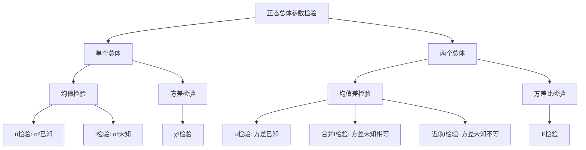

# 7.2 正态总体参数的假设检验

**相关笔记**：[[7.1 假设检验的基本思想与概念]] | [[6.6 区间估计]] | [[5.4 三大抽样分布]] | [[6.1 点估计的概念与无偏性]] | [[4.4 中心极限定理]]

> [!abstract] 本节概览
> 本节将[[7.1 假设检验的基本思想与概念|§7.1]]的假设检验理论应用于==正态总体==的参数检验。正态总体是最重要的总体类型，本节系统介绍其均值和方差的检验方法：单个总体用 $u$ 检验、$t$ 检验和 $\chi^2$ 检验，两个总体用 $u$ 检验、合并 $t$ 检验和 $F$ 检验。所有检验的核心思想都是==枢轴量法==：构造分布已知的检验统计量，利用其分位数确定拒绝域。
>
> **逻辑链条**：[[#一、单个正态总体均值的检验|单总体均值]] → [[#二、单个正态总体方差的检验|单总体方差]] → [[#三、两个正态总体均值差的检验|两总体均值差]] → [[#四、两个正态总体方差比的检验|两总体方差比]] → [[#五、正态总体检验汇总表|汇总表]] → [[#六、置信区间与假设检验的对偶关系|对偶关系]]
>
> **前置依赖**：[[7.1 假设检验的基本思想与概念|§7.1]]（假设检验基本概念、p值、两类错误）、[[6.6 区间估计|§6.6]]（置信区间构造、枢轴量法）、[[5.4 三大抽样分布|§5.4]]（Fisher引理、$\chi^2$/$t$/$F$ 分布）
>
> **核心主线**：正态总体参数检验的核心是"构造枢轴量→确定拒绝域"。单个正态总体有3种标准检验（$u$/$t$/$\chi^2$），两个正态总体有3种标准检验（$u$/合并$t$/$F$），共6种检验场景。每种检验的拒绝域与对应的置信区间存在对偶关系。

---

## 一、单个正态总体均值的检验

设 $X_1, X_2, \ldots, X_n$ 是来自正态总体 $N(\mu, \sigma^2)$ 的样本，$\bar{X}$ 为样本均值，$S^2$ 为样本方差。我们要检验关于均值 $\mu$ 的假设。

### $\sigma^2$ 已知时的 $u$ 检验

> [!def] 定义 7.2.1 — $u$ 检验（$\sigma^2$ 已知）
> 设总体 $X \sim N(\mu, \sigma^2)$，其中 $\sigma^2 = \sigma_0^2$ 已知。对均值 $\mu$ 的检验问题：
>
> | 检验类型 | 原假设 $H_0$ | 备择假设 $H_1$ |
> |:---|:---|:---|
> | 双边检验 | $H_0: \mu = \mu_0$ | $H_1: \mu \neq \mu_0$ |
> | 右边检验 | $H_0: \mu \leqslant \mu_0$ | $H_1: \mu > \mu_0$ |
> | 左边检验 | $H_0: \mu \geqslant \mu_0$ | $H_1: \mu < \mu_0$ |
>
> 在 $H_0$ 成立的条件下，构造检验统计量：
> $$
> u = \frac{\bar{X} - \mu_0}{\sigma_0 / \sqrt{n}} \sim N(0,1)
> $$
> 该统计量不含有任何未知参数，且分布完全已知，是检验 $\mu$ 的==枢轴量==。

**拒绝域**（显著性水平 $\alpha$）：

| 检验类型 | 拒绝域 |
|:---|:---|
| 双边检验 | $\{|u| \geqslant u_{1-\alpha/2}\}$ |
| 右边检验 | $\{u \geqslant u_{1-\alpha}\}$ |
| 左边检验 | $\{u \leqslant u_{\alpha}\} = \{u \leqslant -u_{1-\alpha}\}$ |

其中 $u_p$ 为标准正态分布的 $p$ 分位数，满足 $\Phi(u_p) = p$。

> [!thm] 定理 7.2.1 — $\sigma^2$ 已知时 $\mu$ 的检验（$u$ 检验）
> 设 $X_1, \ldots, X_n \overset{\text{iid}}{\sim} N(\mu, \sigma_0^2)$，$\sigma_0^2$ 已知。则在显著性水平 $\alpha$ 下，关于均值 $\mu$ 的三种检验问题的拒绝域如上表所示。这些检验都是==显著性检验==（即控制第一类错误不超过 $\alpha$）。

> [!abstract] 证明
> **证明**：以双边检验 $H_0: \mu = \mu_0$ vs $H_1: \mu \neq \mu_0$ 为例。
>
> **第一步：构造检验统计量**。当 $H_0: \mu = \mu_0$ 成立时，$\bar{X} \sim N(\mu_0, \sigma_0^2/n)$，标准化得
> $$
> u = \frac{\bar{X} - \mu_0}{\sigma_0/\sqrt{n}} \sim N(0,1).
> $$
>
> **第二步：确定拒绝域**。$H_1: \mu \neq \mu_0$ 意味着 $\mu$ 偏离 $\mu_0$，可能偏大也可能偏小。当 $\mu$ 偏大时 $\bar{X}$ 偏大，$u$ 偏大；当 $\mu$ 偏小时 $\bar{X}$ 偏小，$u$ 偏小。因此合理的拒绝域应取双侧：
> $$
> W = \{|u| \geqslant c\}
> $$
> 由 $P_{H_0}(|u| \geqslant c) = \alpha$，得 $c = u_{1-\alpha/2}$。
>
> **第三步：验证显著性水平**。在 $H_0$ 成立时，
> $$
> P_{H_0}(|u| \geqslant u_{1-\alpha/2}) = \alpha.
> $$
> 故拒绝域 $\{|u| \geqslant u_{1-\alpha/2}\}$ 是显著性水平为 $\alpha$ 的检验。
>
> 对于右边检验和左边检验，逻辑类似，只是拒绝域取单侧。
> $\square$

### $\sigma^2$ 未知时的 $t$ 检验

> [!def] 定义 7.2.2 — $t$ 检验（$\sigma^2$ 未知）
> 设总体 $X \sim N(\mu, \sigma^2)$，其中 $\sigma^2$ 未知。对均值 $\mu$ 的检验问题：
>
> | 检验类型 | 原假设 $H_0$ | 备择假设 $H_1$ |
> |:---|:---|:---|
> | 双边检验 | $H_0: \mu = \mu_0$ | $H_1: \mu \neq \mu_0$ |
> | 右边检验 | $H_0: \mu \leqslant \mu_0$ | $H_1: \mu > \mu_0$ |
> | 左边检验 | $H_0: \mu \geqslant \mu_0$ | $H_1: \mu < \mu_0$ |
>
> 由于 $\sigma$ 未知，用样本标准差 $S$ 代替 $\sigma$，构造检验统计量：
> $$
> t = \frac{\bar{X} - \mu_0}{S / \sqrt{n}} \sim t(n-1)
> $$
> 其中 $S^2 = \frac{1}{n-1}\sum_{i=1}^{n}(X_i - \bar{X})^2$ 为样本方差。

**拒绝域**（显著性水平 $\alpha$）：

| 检验类型 | 拒绝域 |
|:---|:---|
| 双边检验 | $\{|t| \geqslant t_{1-\alpha/2}(n-1)\}$ |
| 右边检验 | $\{t \geqslant t_{1-\alpha}(n-1)\}$ |
| 左边检验 | $\{t \leqslant t_{\alpha}(n-1)\} = \{t \leqslant -t_{1-\alpha}(n-1)\}$ |

其中 $t_p(df)$ 为自由度为 $df$ 的 $t$ 分布的 $p$ 分位数。

> [!thm] 定理 7.2.2 — $\sigma^2$ 未知时 $\mu$ 的检验（$t$ 检验）
> 设 $X_1, \ldots, X_n \overset{\text{iid}}{\sim} N(\mu, \sigma^2)$，$\sigma^2$ 未知。则在显著性水平 $\alpha$ 下，关于均值 $\mu$ 的三种检验问题的拒绝域如上表所示。

**$t$ 检验与 $u$ 检验的关系**：当 $\sigma^2$ 未知时，$u$ 检验的统计量中 $\sigma$ 无法计算，必须用 $S$ 代替。由 [[5.4 三大抽样分布|§5.4]] 的 Fisher 引理，$\bar{X}$ 与 $S^2$ 独立，且 $(n-1)S^2/\sigma^2 \sim \chi^2(n-1)$，因此
$$
\frac{\bar{X}-\mu}{S/\sqrt{n}} = \frac{(\bar{X}-\mu)/(\sigma/\sqrt{n})}{\sqrt{S^2/\sigma^2}} \sim t(n-1).
$$

> [!example] 例 7.2.1 — $u$ 检验实例
> 某工厂生产的零件长度服从正态分布 $N(\mu, 1.2^2)$。标准规定零件平均长度应为 10.0mm。今从一批零件中随机抽取 16 件，测得 $\bar{x} = 10.4$mm。在显著性水平 $\alpha = 0.05$ 下，检验该批零件的平均长度是否符合标准。
>
> **解**：
>
> **第一步：建立假设**。
> $$
> H_0: \mu = 10.0 \quad \text{vs} \quad H_1: \mu \neq 10.0
> $$
>
> **第二步：选择检验统计量**。$\sigma = 1.2$ 已知，使用 $u$ 检验：
> $$
> u = \frac{\bar{X} - 10.0}{1.2/\sqrt{16}} = \frac{\bar{X} - 10.0}{0.3}
> $$
>
> **第三步：计算统计量观测值**。
> $$
> u_0 = \frac{10.4 - 10.0}{0.3} = \frac{0.4}{0.3} = 1.333
> $$
>
> **第四步：确定拒绝域**。$\alpha = 0.05$，双边检验，$u_{1-\alpha/2} = u_{0.975} = 1.96$。
> 拒绝域为 $\{|u| \geqslant 1.96\}$。
>
> **第五步：做出判断**。$|u_0| = 1.333 < 1.96$，未落入拒绝域，故**不拒绝 $H_0$**。
>
> 即在 $\alpha = 0.05$ 水平下，没有充分证据表明该批零件的平均长度不符合标准。

> [!example] 例 7.2.2 — $t$ 检验实例
> 某种合金的抗拉强度服从正态分布。现抽取 9 个样品测得抗拉强度（单位：kg/mm²）为：
> $$
> 45.2,\ 44.8,\ 45.5,\ 44.6,\ 45.0,\ 44.9,\ 45.3,\ 44.7,\ 45.1
> $$
> 在 $\alpha = 0.05$ 下，检验该合金的平均抗拉强度是否为 45.0 kg/mm²。
>
> **解**：
>
> **第一步：建立假设**。
> $$
> H_0: \mu = 45.0 \quad \text{vs} \quad H_1: \mu \neq 45.0
> $$
>
> **第二步：计算样本统计量**。
> $$
> \bar{x} = \frac{1}{9}\sum_{i=1}^{9} x_i = \frac{405.1}{9} = 45.011
> $$
> $$
> s^2 = \frac{1}{8}\sum_{i=1}^{9}(x_i - \bar{x})^2 = \frac{1}{8}\left[(45.2-45.011)^2 + \cdots + (45.1-45.011)^2\right] \approx 0.1074
> $$
> $$
> s \approx 0.3277
> $$
>
> **第三步：计算检验统计量**。$\sigma^2$ 未知，使用 $t$ 检验：
> $$
> t_0 = \frac{\bar{x} - 45.0}{s/\sqrt{n}} = \frac{45.011 - 45.0}{0.3277/3} = \frac{0.011}{0.1092} \approx 0.101
> $$
>
> **第四步：确定拒绝域**。$\alpha = 0.05$，$n-1 = 8$，$t_{0.975}(8) = 2.306$。
> 拒绝域为 $\{|t| \geqslant 2.306\}$。
>
> **第五步：做出判断**。$|t_0| = 0.101 < 2.306$，未落入拒绝域，故**不拒绝 $H_0$**。
>
> 即在 $\alpha = 0.05$ 水平下，没有充分证据表明该合金的平均抗拉强度不等于 45.0 kg/mm²。

---

## 二、单个正态总体方差的检验

设 $X_1, X_2, \ldots, X_n$ 是来自正态总体 $N(\mu, \sigma^2)$ 的样本，$S^2$ 为样本方差。我们要检验关于方差 $\sigma^2$ 的假设。

### $\chi^2$ 检验

> [!def] 定义 7.2.3 — $\chi^2$ 检验（单总体方差）
> 设总体 $X \sim N(\mu, \sigma^2)$，$\mu$ 未知。对方差 $\sigma^2$ 的检验问题：
>
> | 检验类型 | 原假设 $H_0$ | 备择假设 $H_1$ |
> |:---|:---|:---|
> | 双边检验 | $H_0: \sigma^2 = \sigma_0^2$ | $H_1: \sigma^2 \neq \sigma_0^2$ |
> | 右边检验 | $H_0: \sigma^2 \leqslant \sigma_0^2$ | $H_1: \sigma^2 > \sigma_0^2$ |
> | 左边检验 | $H_0: \sigma^2 \geqslant \sigma_0^2$ | $H_1: \sigma^2 < \sigma_0^2$ |
>
> 在 $H_0$ 成立的条件下，由 [[5.4 三大抽样分布|Fisher 引理]]，构造检验统计量：
> $$
> \chi^2 = \frac{(n-1)S^2}{\sigma_0^2} \sim \chi^2(n-1)
> $$

**拒绝域**（显著性水平 $\alpha$）：

| 检验类型 | 拒绝域 |
|:---|:---|
| 双边检验 | $\{\chi^2 \leqslant \chi^2_{\alpha/2}(n-1)\} \cup \{\chi^2 \geqslant \chi^2_{1-\alpha/2}(n-1)\}$ |
| 右边检验 | $\{\chi^2 \geqslant \chi^2_{1-\alpha}(n-1)\}$ |
| 左边检验 | $\{\chi^2 \leqslant \chi^2_{\alpha}(n-1)\}$ |

> [!thm] 定理 7.2.3 — 单个正态总体方差的检验（$\chi^2$ 检验）
> 设 $X_1, \ldots, X_n \overset{\text{iid}}{\sim} N(\mu, \sigma^2)$，$\mu$ 未知。则在显著性水平 $\alpha$ 下，关于方差 $\sigma^2$ 的三种检验问题的拒绝域如上表所示。

> [!abstract] 证明
> **证明**：以双边检验 $H_0: \sigma^2 = \sigma_0^2$ vs $H_1: \sigma^2 \neq \sigma_0^2$ 为例。
>
> **第一步：构造检验统计量**。当 $H_0$ 成立时，由 Fisher 引理，
> $$
> \chi^2 = \frac{(n-1)S^2}{\sigma_0^2} \sim \chi^2(n-1).
> $$
>
> **第二步：确定拒绝域**。$H_1: \sigma^2 \neq \sigma_0^2$ 意味着 $\sigma^2$ 可能偏大也可能偏小。当 $\sigma^2 > \sigma_0^2$ 时，$(n-1)S^2/\sigma_0^2$ 偏大；当 $\sigma^2 < \sigma_0^2$ 时，$(n-1)S^2/\sigma_0^2$ 偏小。因此拒绝域取双侧：
> $$
> W = \{\chi^2 \leqslant c_1\} \cup \{\chi^2 \geqslant c_2\}
> $$
> 为使检验具有最优性，通常取等尾拒绝域，即令
> $$
> P_{H_0}(\chi^2 \leqslant c_1) = \frac{\alpha}{2}, \quad P_{H_0}(\chi^2 \geqslant c_2) = \frac{\alpha}{2}
> $$
> 得 $c_1 = \chi^2_{\alpha/2}(n-1)$，$c_2 = \chi^2_{1-\alpha/2}(n-1)$。
>
> **第三步：验证**。在 $H_0$ 成立时，
> $$
> P_{H_0}\!\left(\chi^2 \leqslant \chi^2_{\alpha/2}(n-1) \text{ 或 } \chi^2 \geqslant \chi^2_{1-\alpha/2}(n-1)\right) = \frac{\alpha}{2} + \frac{\alpha}{2} = \alpha.
> $$
> $\square$

**注意**：$\chi^2$ 分布是==非对称分布==，因此双边检验的拒绝域不是关于某个中心对称的，而是取"等尾"形式——两侧各分配 $\alpha/2$ 的概率。

> [!example] 例 7.2.3 — $\chi^2$ 检验实例
> 某工厂生产的铜丝的折断力服从正态分布。根据长期生产经验，其方差为 64。今从一批产品中抽取 10 根铜丝，测得折断力的样本方差 $s^2 = 75.6$。在 $\alpha = 0.05$ 下，检验该批铜丝折断力的方差是否发生了显著变化。
>
> **解**：
>
> **第一步：建立假设**。
> $$
> H_0: \sigma^2 = 64 \quad \text{vs} \quad H_1: \sigma^2 \neq 64
> $$
>
> **第二步：计算检验统计量**。
> $$
> \chi^2_0 = \frac{(n-1)s^2}{\sigma_0^2} = \frac{9 \times 75.6}{64} = \frac{680.4}{64} = 10.631
> $$
>
> **第三步：确定拒绝域**。$\alpha = 0.05$，$n-1 = 9$。
> $\chi^2_{0.025}(9) = 2.700$，$\chi^2_{0.975}(9) = 19.023$。
> 拒绝域为 $\{\chi^2 \leqslant 2.700\} \cup \{\chi^2 \geqslant 19.023\}$。
>
> **第四步：做出判断**。$2.700 < 10.631 < 19.023$，未落入拒绝域，故**不拒绝 $H_0$**。
>
> 即在 $\alpha = 0.05$ 水平下，没有充分证据表明该批铜丝折断力的方差发生了显著变化。

---

## 三、两个正态总体均值差的检验

设 $X_1, \ldots, X_m \overset{\text{iid}}{\sim} N(\mu_1, \sigma_1^2)$，$Y_1, \ldots, Y_n \overset{\text{iid}}{\sim} N(\mu_2, \sigma_2^2)$，两样本独立。$\bar{X}$、$\bar{Y}$ 分别为两样本均值，$S_x^2$、$S_y^2$ 分别为两样本方差。

### $\sigma_1^2, \sigma_2^2$ 已知时的 $u$ 检验

> [!def] 定义 7.2.4 — 两总体均值差的 $u$ 检验（方差已知）
> 设两正态总体方差 $\sigma_1^2, \sigma_2^2$ 均已知。对均值差 $\mu_1 - \mu_2$ 的检验问题：
>
> | 检验类型 | 原假设 $H_0$ | 备择假设 $H_1$ |
> |:---|:---|:---|
> | 双边检验 | $H_0: \mu_1 - \mu_2 = \delta_0$ | $H_1: \mu_1 - \mu_2 \neq \delta_0$ |
> | 右边检验 | $H_0: \mu_1 - \mu_2 \leqslant \delta_0$ | $H_1: \mu_1 - \mu_2 > \delta_0$ |
> | 左边检验 | $H_0: \mu_1 - \mu_2 \geqslant \delta_0$ | $H_1: \mu_1 - \mu_2 < \delta_0$ |
>
> 其中 $\delta_0$ 为已知常数（通常取 $\delta_0 = 0$）。在 $H_0$ 成立时，检验统计量：
> $$
> u = \frac{(\bar{X} - \bar{Y}) - \delta_0}{\sqrt{\sigma_1^2/m + \sigma_2^2/n}} \sim N(0,1)
> $$

**拒绝域**与单总体 $u$ 检验形式相同（将 $u$ 替换为上述统计量）。

### $\sigma_1^2 = \sigma_2^2$ 未知时的合并 $t$ 检验

> [!def] 定义 7.2.5 — 两总体均值差的合并 $t$ 检验（方差未知但相等）
> 设两正态总体方差 $\sigma_1^2 = \sigma_2^2 = \sigma^2$ 但未知。对均值差 $\mu_1 - \mu_2$ 的检验问题同上。首先计算**合并样本方差**：
> $$
> S_{xy}^2 = \frac{(m-1)S_x^2 + (n-1)S_y^2}{m + n - 2}
> $$
> 它是公共方差 $\sigma^2$ 的无偏估计。在 $H_0$ 成立时，检验统计量：
> $$
> t = \frac{(\bar{X} - \bar{Y}) - \delta_0}{S_{xy}\sqrt{1/m + 1/n}} \sim t(m + n - 2)
> $$

**拒绝域**：

| 检验类型 | 拒绝域 |
|:---|:---|
| 双边检验 | $\{|t| \geqslant t_{1-\alpha/2}(m+n-2)\}$ |
| 右边检验 | $\{t \geqslant t_{1-\alpha}(m+n-2)\}$ |
| 左边检验 | $\{t \leqslant t_{\alpha}(m+n-2)\}$ |

> [!thm] 定理 7.2.4 — 两总体均值差的 $u$ 检验
> 设 $X_1, \ldots, X_m \overset{\text{iid}}{\sim} N(\mu_1, \sigma_1^2)$，$Y_1, \ldots, Y_n \overset{\text{iid}}{\sim} N(\mu_2, \sigma_2^2)$，两样本独立，$\sigma_1^2, \sigma_2^2$ 已知。则在显著性水平 $\alpha$ 下，关于 $\mu_1 - \mu_2$ 的检验使用 $u$ 统计量，拒绝域形式与单总体 $u$ 检验相同。

> [!thm] 定理 7.2.5 — 两总体均值差的合并 $t$ 检验
> 设 $X_1, \ldots, X_m \overset{\text{iid}}{\sim} N(\mu_1, \sigma^2)$，$Y_1, \ldots, Y_n \overset{\text{iid}}{\sim} N(\mu_2, \sigma^2)$，两样本独立，$\sigma^2$ 未知。则在显著性水平 $\alpha$ 下，关于 $\mu_1 - \mu_2$ 的检验使用合并 $t$ 统计量，自由度为 $m+n-2$。

### $\sigma_1^2 \neq \sigma_2^2$ 未知时的近似 $t$ 检验

> [!def] 定义 7.2.6 — 两总体均值差的近似 $t$ 检验（Behrens-Fisher 问题）
> 设两正态总体方差 $\sigma_1^2 \neq \sigma_2^2$ 且均未知。对均值差 $\mu_1 - \mu_2$ 的检验，使用统计量：
> $$
> t^* = \frac{(\bar{X} - \bar{Y}) - \delta_0}{\sqrt{S_x^2/m + S_y^2/n}}
> $$
> 该统计量的精确分布未知，但可用 **Welch-Satterthwaite 近似**，其近似服从自由度为 $l$ 的 $t$ 分布：
> $$
> l = \frac{(S_x^2/m + S_y^2/n)^2}{\dfrac{(S_x^2/m)^2}{m-1} + \dfrac{(S_y^2/n)^2}{n-1}}
> $$
> 自由度 $l$ 通常取整数部分（向下取整）。

> [!thm] 定理 7.2.6 — 两总体均值差的近似 $t$ 检验
> 设两正态总体方差不等且未知，则在显著性水平 $\alpha$ 下，关于 $\mu_1 - \mu_2$ 的检验使用 Welch 近似 $t$ 统计量，自由度由 Welch-Satterthwaite 公式给出。

> [!example] 例 7.2.4 — 两总体均值差的检验
> 比较两种工艺生产的某种材料的抗拉强度。甲工艺抽取 8 个样品，得 $\bar{x} = 52.3$，$s_x^2 = 4.2$；乙工艺抽取 10 个样品，得 $\bar{y} = 50.8$，$s_y^2 = 3.6$。假设两总体方差相等，在 $\alpha = 0.05$ 下检验两种工艺的平均抗拉强度是否有显著差异。
>
> **解**：
>
> **第一步：建立假设**。
> $$
> H_0: \mu_1 = \mu_2 \quad \text{vs} \quad H_1: \mu_1 \neq \mu_2
> $$
>
> **第二步：计算合并样本方差**。
> $$
> s_{xy}^2 = \frac{(8-1) \times 4.2 + (10-1) \times 3.6}{8 + 10 - 2} = \frac{29.4 + 32.4}{16} = \frac{61.8}{16} = 3.8625
> $$
> $$
> s_{xy} = 1.9656
> $$
>
> **第三步：计算检验统计量**。
> $$
> t_0 = \frac{52.3 - 50.8}{1.9656\sqrt{1/8 + 1/10}} = \frac{1.5}{1.9656 \times 0.4743} = \frac{1.5}{0.9323} \approx 1.609
> $$
>
> **第四步：确定拒绝域**。$\alpha = 0.05$，$m+n-2 = 16$，$t_{0.975}(16) = 2.120$。
> 拒绝域为 $\{|t| \geqslant 2.120\}$。
>
> **第五步：做出判断**。$|t_0| = 1.609 < 2.120$，未落入拒绝域，故**不拒绝 $H_0$**。
>
> 即在 $\alpha = 0.05$ 水平下，没有充分证据表明两种工艺的平均抗拉强度有显著差异。

---

## 四、两个正态总体方差比的检验

设 $X_1, \ldots, X_m \overset{\text{iid}}{\sim} N(\mu_1, \sigma_1^2)$，$Y_1, \ldots, Y_n \overset{\text{iid}}{\sim} N(\mu_2, \sigma_2^2)$，两样本独立。$S_x^2$、$S_y^2$ 分别为两样本方差。

### $F$ 检验

> [!def] 定义 7.2.7 — $F$ 检验（两总体方差比）
> 设两正态总体均值 $\mu_1, \mu_2$ 均未知。对方差比 $\sigma_1^2/\sigma_2^2$ 的检验问题：
>
> | 检验类型 | 原假设 $H_0$ | 备择假设 $H_1$ |
> |:---|:---|:---|
> | 双边检验 | $H_0: \sigma_1^2 = \sigma_2^2$ | $H_1: \sigma_1^2 \neq \sigma_2^2$ |
> | 右边检验 | $H_0: \sigma_1^2 \leqslant \sigma_2^2$ | $H_1: \sigma_1^2 > \sigma_2^2$ |
> | 左边检验 | $H_0: \sigma_1^2 \geqslant \sigma_2^2$ | $H_1: \sigma_1^2 < \sigma_2^2$ |
>
> 在 $H_0: \sigma_1^2 = \sigma_2^2$ 成立时，由 [[5.4 三大抽样分布|§5.4]] 的 $F$ 分布定义，构造检验统计量：
> $$
> F = \frac{S_x^2}{S_y^2} \sim F(m-1, n-1)
> $$

**拒绝域**（显著性水平 $\alpha$）：

| 检验类型 | 拒绝域 |
|:---|:---|
| 双边检验 | $\{F \leqslant F_{\alpha/2}(m-1,n-1)\} \cup \{F \geqslant F_{1-\alpha/2}(m-1,n-1)\}$ |
| 右边检验 | $\{F \geqslant F_{1-\alpha}(m-1,n-1)\}$ |
| 左边检验 | $\{F \leqslant F_{\alpha}(m-1,n-1)\}$ |

> [!thm] 定理 7.2.7 — 两总体方差比的检验（$F$ 检验）
> 设 $X_1, \ldots, X_m \overset{\text{iid}}{\sim} N(\mu_1, \sigma_1^2)$，$Y_1, \ldots, Y_n \overset{\text{iid}}{\sim} N(\mu_2, \sigma_2^2)$，两样本独立，$\mu_1, \mu_2$ 均未知。则在显著性水平 $\alpha$ 下，关于方差比 $\sigma_1^2/\sigma_2^2$ 的三种检验问题的拒绝域如上表所示。

> [!abstract] 证明
> **证明**：以双边检验 $H_0: \sigma_1^2 = \sigma_2^2$ vs $H_1: \sigma_1^2 \neq \sigma_2^2$ 为例。
>
> **第一步：构造检验统计量**。由 Fisher 引理，$(m-1)S_x^2/\sigma_1^2 \sim \chi^2(m-1)$，$(n-1)S_y^2/\sigma_2^2 \sim \chi^2(n-1)$，且两者独立。当 $H_0: \sigma_1^2 = \sigma_2^2$ 成立时，
> $$
> F = \frac{S_x^2}{S_y^2} = \frac{S_x^2/\sigma_1^2}{S_y^2/\sigma_2^2} \sim F(m-1, n-1).
> $$
>
> **第二步：确定拒绝域**。$H_1: \sigma_1^2 \neq \sigma_2^2$ 意味着 $F$ 可能偏大也可能偏小。取等尾拒绝域：
> $$
> W = \{F \leqslant F_{\alpha/2}(m-1,n-1)\} \cup \{F \geqslant F_{1-\alpha/2}(m-1,n-1)\}
> $$
>
> **第三步：验证**。在 $H_0$ 成立时，
> $$
> P_{H_0}(F \leqslant F_{\alpha/2}) + P_{H_0}(F \geqslant F_{1-\alpha/2}) = \frac{\alpha}{2} + \frac{\alpha}{2} = \alpha.
> $$
> $\square$

**$F$ 分布分位数的关系**：利用 $F_{\alpha}(m,n) = 1/F_{1-\alpha}(n,m)$，可将左侧分位数转化为右侧分位数来查表。

> [!example] 例 7.2.5 — $F$ 检验实例
> 为检验例 7.2.4 中"两总体方差相等"的前提是否成立，对两工艺的方差进行检验。
> 甲工艺：$m = 8$，$s_x^2 = 4.2$；乙工艺：$n = 10$，$s_y^2 = 3.6$。取 $\alpha = 0.10$。
>
> **解**：
>
> **第一步：建立假设**。
> $$
> H_0: \sigma_1^2 = \sigma_2^2 \quad \text{vs} \quad H_1: \sigma_1^2 \neq \sigma_2^2
> $$
>
> **第二步：计算检验统计量**。
> $$
> F_0 = \frac{s_x^2}{s_y^2} = \frac{4.2}{3.6} = 1.167
> $$
>
> **第三步：确定拒绝域**。$\alpha = 0.10$，$m-1 = 7$，$n-1 = 9$。
> $F_{0.95}(7,9) = 3.29$，
> $F_{0.05}(7,9) = 1/F_{0.95}(9,7) = 1/3.68 = 0.272$。
> 拒绝域为 $\{F \leqslant 0.272\} \cup \{F \geqslant 3.29\}$。
>
> **第四步：做出判断**。$0.272 < 1.167 < 3.29$，未落入拒绝域，故**不拒绝 $H_0$**。
>
> 即在 $\alpha = 0.10$ 水平下，没有充分证据否定方差齐性假设，可以继续使用合并 $t$ 检验。

---

## 五、正态总体检验汇总表

以下汇总了正态总体参数检验的8种标准场景：

| 序号 | 检验参数 | 条件 | 原假设 $H_0$ | 检验统计量 | $H_0$ 成立时分布 | 拒绝域 |
|:---:|:---|:---|:---|:---|:---|:---|
| 1 | 单总体 $\mu$ | $\sigma^2$ 已知 | $\mu = \mu_0$ | $u = \dfrac{\bar{X}-\mu_0}{\sigma_0/\sqrt{n}}$ | $N(0,1)$ | $|u| \geqslant u_{1-\alpha/2}$ |
| 2 | 单总体 $\mu$ | $\sigma^2$ 未知 | $\mu = \mu_0$ | $t = \dfrac{\bar{X}-\mu_0}{S/\sqrt{n}}$ | $t(n-1)$ | $|t| \geqslant t_{1-\alpha/2}(n-1)$ |
| 3 | 单总体 $\sigma^2$ | $\mu$ 未知 | $\sigma^2 = \sigma_0^2$ | $\chi^2 = \dfrac{(n-1)S^2}{\sigma_0^2}$ | $\chi^2(n-1)$ | $\chi^2 \leqslant \chi^2_{\alpha/2}$ 或 $\geqslant \chi^2_{1-\alpha/2}$ |
| 4 | 两总体 $\mu_1-\mu_2$ | $\sigma_1^2,\sigma_2^2$ 已知 | $\mu_1-\mu_2=\delta_0$ | $u = \dfrac{(\bar{X}-\bar{Y})-\delta_0}{\sqrt{\sigma_1^2/m+\sigma_2^2/n}}$ | $N(0,1)$ | $|u| \geqslant u_{1-\alpha/2}$ |
| 5 | 两总体 $\mu_1-\mu_2$ | $\sigma_1^2=\sigma_2^2$ 未知 | $\mu_1-\mu_2=\delta_0$ | $t = \dfrac{(\bar{X}-\bar{Y})-\delta_0}{S_{xy}\sqrt{1/m+1/n}}$ | $t(m+n-2)$ | $|t| \geqslant t_{1-\alpha/2}(m+n-2)$ |
| 6 | 两总体 $\mu_1-\mu_2$ | $\sigma_1^2 \neq \sigma_2^2$ 未知 | $\mu_1-\mu_2=\delta_0$ | $t^* = \dfrac{(\bar{X}-\bar{Y})-\delta_0}{\sqrt{S_x^2/m+S_y^2/n}}$ | $t(l)$ 近似 | $|t^*| \geqslant t_{1-\alpha/2}(l)$ |
| 7 | 两总体 $\sigma_1^2/\sigma_2^2$ | $\mu_1,\mu_2$ 未知 | $\sigma_1^2=\sigma_2^2$ | $F = S_x^2/S_y^2$ | $F(m-1,n-1)$ | $F \leqslant F_{\alpha/2}$ 或 $\geqslant F_{1-\alpha/2}$ |
| 8 | 两总体 $\sigma_1^2=\sigma_2^2$ | $\mu_1,\mu_2$ 未知 | $\sigma_1^2 \leqslant \sigma_2^2$ | $F = S_x^2/S_y^2$ | $F(m-1,n-1)$ | $F \geqslant F_{1-\alpha}(m-1,n-1)$ |

> [!note] 表格说明
> - 表中拒绝域以双边检验为例，单边检验只需将分位数从 $1-\alpha/2$ 改为 $1-\alpha$，并取对应单侧。
> - 第6行的自由度 $l$ 由 Welch-Satterthwaite 公式给出。
> - 第7、8行本质上是同一检验（$F$ 检验），只是假设形式不同。

---

## 六、置信区间与假设检验的对偶关系

> [!thm] 定理 7.2.8 — 置信区间与假设检验的对偶性
> 设 $[\hat{\theta}^L, \hat{\theta}^U]$ 是参数 $\theta$ 的置信水平为 $1-\alpha$ 的置信区间，则对检验问题 $H_0: \theta = \theta_0$ vs $H_1: \theta \neq \theta_0$：
> $$
> \text{不拒绝 } H_0 \iff \theta_0 \in [\hat{\theta}^L, \hat{\theta}^U]
> $$
> 反之亦然：
> $$
> \text{拒绝 } H_0 \iff \theta_0 \notin [\hat{\theta}^L, \hat{\theta}^U]
> $$

**直观理解**：置信区间给出了参数 $\theta$ 的"合理取值范围"。如果 $\theta_0$ 落在这个范围内，说明样本数据与"$\theta = \theta_0$"相容，不应拒绝 $H_0$；如果 $\theta_0$ 落在范围之外，说明样本数据与"$\theta = \theta_0$"矛盾，应拒绝 $H_0$。

**具体对应关系**：

| 检验问题 | 检验统计量 | 对应置信区间 | 拒绝条件 |
|:---|:---|:---|:---|
| $H_0: \mu = \mu_0$（$\sigma^2$ 已知） | $u = \dfrac{\bar{X}-\mu_0}{\sigma/\sqrt{n}}$ | $\left[\bar{X} \pm u_{1-\alpha/2}\dfrac{\sigma}{\sqrt{n}}\right]$ | $\mu_0$ 不在区间内 |
| $H_0: \mu = \mu_0$（$\sigma^2$ 未知） | $t = \dfrac{\bar{X}-\mu_0}{S/\sqrt{n}}$ | $\left[\bar{X} \pm t_{1-\alpha/2}(n-1)\dfrac{S}{\sqrt{n}}\right]$ | $\mu_0$ 不在区间内 |
| $H_0: \sigma^2 = \sigma_0^2$ | $\chi^2 = \dfrac{(n-1)S^2}{\sigma_0^2}$ | $\left[\dfrac{(n-1)S^2}{\chi^2_{1-\alpha/2}},\ \dfrac{(n-1)S^2}{\chi^2_{\alpha/2}}\right]$ | $\sigma_0^2$ 不在区间内 |
| $H_0: \mu_1-\mu_2=\delta_0$（方差已知） | $u = \dfrac{(\bar{X}-\bar{Y})-\delta_0}{\sqrt{\sigma_1^2/m+\sigma_2^2/n}}$ | $\left[(\bar{X}-\bar{Y}) \pm u_{1-\alpha/2}\sqrt{\sigma_1^2/m+\sigma_2^2/n}\right]$ | $\delta_0$ 不在区间内 |

**对偶关系的意义**：
1. **计算上的等价性**：做一次假设检验等价于检查 $\theta_0$ 是否在置信区间内，反之亦然。
2. **信息量的互补性**：置信区间不仅告诉你"是否拒绝"，还告诉你参数的合理范围，信息量更大。
3. **p 值与置信水平**：p 值可以理解为"使 $\theta_0$ 恰好在置信区间边界上的那个置信水平 $1-\alpha$"。

---

## 七、知识结构总览

---

## 八、核心思想与解题技巧

### 假设检验解题步骤（五步法）

> [!tip] 标准五步法
> 1. **建立假设**：根据问题背景写出 $H_0$ 和 $H_1$，明确检验类型（双边/单边）。
> 2. **选择统计量**：根据总体类型、已知条件（$\sigma^2$ 是否已知、样本量、方差是否相等）选择合适的检验统计量。
> 3. **计算观测值**：将样本数据代入统计量公式，计算统计量的观测值。
> 4. **确定拒绝域**：根据显著性水平 $\alpha$ 和检验类型，查分位数表确定拒绝域。
> 5. **做出判断**：比较统计量观测值与临界值，判断是否拒绝 $H_0$，并给出实际意义解释。

### 检验方法选择决策

**单个正态总体均值检验**：
- $\sigma^2$ 已知 $\Rightarrow$ $u$ 检验
- $\sigma^2$ 未知 $\Rightarrow$ $t$ 检验

**两个正态总体均值差检验**：
- $\sigma_1^2, \sigma_2^2$ 已知 $\Rightarrow$ $u$ 检验
- $\sigma_1^2 = \sigma_2^2$ 未知 $\Rightarrow$ 合并 $t$ 检验（需先做 $F$ 检验验证方差齐性）
- $\sigma_1^2 \neq \sigma_2^2$ 未知 $\Rightarrow$ Welch 近似 $t$ 检验

**单个正态总体方差检验**：
- $\mu$ 未知 $\Rightarrow$ $\chi^2$ 检验

**两个正态总体方差比检验**：
- $\mu_1, \mu_2$ 未知 $\Rightarrow$ $F$ 检验

### 常见题型总结

1. **直接检验题**：给定样本数据和假设，完成完整五步检验。
2. **方法选择题**：根据条件判断应使用哪种检验方法。
3. **两类错误计算题**：给定拒绝域，计算犯第一类/第二类错误的概率。
4. **p 值计算题**：计算检验的 p 值并与 $\alpha$ 比较。
5. **样本量确定题**：给定功效要求，反求所需样本量。
6. **置信区间与检验互化题**：利用对偶关系在置信区间和假设检验之间转换。

---

## 九、补充理解与易混淆点

### 误区一："$t$ 检验和 $u$ 检验可以随意选择"

**正确理解**：$u$ 检验要求 $\sigma^2$ 已知，$t$ 检验用于 $\sigma^2$ 未知的情形。当 $\sigma^2$ 真的已知时，$u$ 检验比 $t$ 检验功效更高（因为 $t$ 检验用 $S$ 代替 $\sigma$ 引入了额外的不确定性）。当 $\sigma^2$ 未知时，不能使用 $u$ 检验，因为统计量中含有未知参数。==选择检验方法由数据条件决定，而非主观偏好==。

**来源**：茆诗松《概率论与数理统计》§7.2 | [[7.1 假设检验的基本思想与概念|§7.1]] | Casella & Berger *Statistical Inference* Ch.8 | [NIST/SEMATECH e-Handbook: t-Test](https://www.itl.nist.gov/div898/handbook/eda/section3/eda353.htm) | [Stat Trek: t-Test vs z-Test](https://stattrek.com/hypothesis-test/difference-means.aspx)

### 误区二："$F$ 检验的拒绝域是 $F > F_\alpha$"

**正确理解**：$F$ 检验的拒绝域取决于检验类型。对于**双边检验** $H_0: \sigma_1^2 = \sigma_2^2$ vs $H_1: \sigma_1^2 \neq \sigma_2^2$，拒绝域是**双侧**的 $\{F \leqslant F_{\alpha/2}\} \cup \{F \geqslant F_{1-\alpha/2}\}$，而非仅取右侧。这是因为 $F$ 分布与 $\chi^2$ 分布一样是==非对称分布==，$S_x^2/S_y^2$ 偏大或偏小都意味着方差不等。只有**右边检验** $H_0: \sigma_1^2 \leqslant \sigma_2^2$ 的拒绝域才是 $\{F \geqslant F_{1-\alpha}\}$。

**来源**：茆诗松《概率论与数理统计》§7.2 | [[5.4 三大抽样分布|§5.4]] | Wackerly *Mathematical Statistics* Ch.10 | [Penn State STAT 415: F-test](https://online.stat.psu.edu/stat415/lesson/11/11.3) | [Khan Academy: F-test](https://www.khanacademy.org/math/statistics-probability)

### 误区三："合并 $t$ 检验不需要方差齐性"

**正确理解**：合并 $t$ 检验的数学推导**严格依赖** $\sigma_1^2 = \sigma_2^2$ 的假设。合并样本方差 $S_{xy}^2$ 是公共方差 $\sigma^2$ 的无偏估计，这一性质在方差不等时不成立。实际应用中，应先做 $F$ 检验验证方差齐性，或使用更稳健的 Welch 近似 $t$ 检验。==方差齐性是合并 $t$ 检验的前提条件，而非可有可无的假设==。当方差不等时使用合并 $t$ 检验，会导致实际显著性水平偏离名义水平。

**来源**：茆诗松《概率论与数理统计》§7.2 | Welch (1947) *Biometrika* | [RDocumentation: var.test](https://www.rdocumentation.org/packages/stats/versions/3.6.2/topics/var.test) | [Penn State STAT 500: Two-Sample t-Test](https://online.stat.psu.edu/stat500/lesson/7/7.3) | Rice *Mathematical Statistics and Data Analysis* Ch.9

### 误区四："p 值越小，原假设越不可能成立"

**正确理解**：p 值的定义是"在 $H_0$ 成立的条件下，检验统计量取到当前观测值及更极端值的概率"。p 值小意味着"如果 $H_0$ 成立，观察到当前数据或更极端数据的概率很低"，这提供了反对 $H_0$ 的证据。但 p 值**不是** $H_0$ 为真的概率。==p 值度量的是数据与假设的相容程度，而非假设为真的概率==。p 值受样本量影响：大样本下，即使实际差异很小，p 值也可能非常小。

**来源**：[[7.1 假设检验的基本思想与概念|§7.1]] | Wasserstein & Lazar (2016) *ASA Statement on p-Values* | [Nature: p-value FAQ](https://www.nature.com/articles/nmeth.3993) | [Statistical Science: The p-value](https://projecteuclid.org/journals/statistical-science) | 茆诗松《概率论与数理统计》§7.1

### 误区五："样本量很大时 $t$ 检验等价于 $u$ 检验"

**正确理解**：当 $n \to \infty$ 时，$t(n-1)$ 分布确实收敛到 $N(0,1)$，因此大样本下 $t$ 检验的临界值接近 $u$ 检验的临界值。但"等价"需要谨慎理解：(1) 当 $n > 30$ 时，$t_{0.975}(29) = 2.045$ 与 $u_{0.975} = 1.96$ 仍有约 4% 的差异；(2) 即使大样本，$t$ 检验仍然更精确，因为它正确地考虑了用 $S$ 估计 $\sigma$ 带来的不确定性；(3) 在要求严格的研究中（如医学试验），即使 $n$ 很大也应使用 $t$ 检验。==大样本近似是实用的简化，但不是严格的等价==。

**来源**：茆诗松《概率论与数理统计》§7.2 | [[5.4 三大抽样分布|§5.4]]（$t$ 分布的极限性质）| [Handbook of Statistical Methods: t-distribution](https://www.itl.nist.gov/div898/handbook/eda/section3/eda3662.htm) | Casella & Berger *Statistical Inference* Ch.5

---

## 十、习题精选

> [!todo] 习题概览
> **教材习题（6题）**：第1-6题覆盖单总体 $u$/$t$/$\chi^2$ 检验与两总体 $t$/$F$ 检验。
> **考研真题（4题）**：第7-10题为卡方学院考研真题，涉及正态总体参数检验的综合应用。

### 教材习题

> [!example] 习题 1 — 单总体 $u$ 检验
> 设总体 $X \sim N(\mu, 4)$，抽取容量为 $n = 25$ 的样本，测得 $\bar{x} = 11.2$。在 $\alpha = 0.05$ 下检验 $H_0: \mu = 10$ vs $H_1: \mu \neq 10$。
>
> **解**：
>
> $\sigma^2 = 4$ 已知，使用 $u$ 检验。
> $$
> u_0 = \frac{\bar{x} - \mu_0}{\sigma/\sqrt{n}} = \frac{11.2 - 10}{2/\sqrt{25}} = \frac{1.2}{0.4} = 3.0
> $$
> $\alpha = 0.05$，$u_{0.975} = 1.96$。
> $|u_0| = 3.0 > 1.96$，落入拒绝域，故**拒绝 $H_0$**。
>
> 结论：在 $\alpha = 0.05$ 水平下，有充分证据表明总体均值不等于 10。
>
> **p 值**：$p = 2(1 - \Phi(3.0)) = 2 \times 0.00135 = 0.0027$。

> [!example] 习题 2 — 单总体 $t$ 检验
> 设总体 $X \sim N(\mu, \sigma^2)$，$\sigma^2$ 未知。抽取容量为 $n = 16$ 的样本，测得 $\bar{x} = 2.5$，$s = 1.8$。在 $\alpha = 0.05$ 下检验 $H_0: \mu = 3$ vs $H_1: \mu \neq 3$。
>
> **解**：
>
> $\sigma^2$ 未知，使用 $t$ 检验。
> $$
> t_0 = \frac{\bar{x} - \mu_0}{s/\sqrt{n}} = \frac{2.5 - 3}{1.8/\sqrt{16}} = \frac{-0.5}{0.45} = -1.111
> $$
> $\alpha = 0.05$，$n-1 = 15$，$t_{0.975}(15) = 2.131$。
> $|t_0| = 1.111 < 2.131$，未落入拒绝域，故**不拒绝 $H_0$**。
>
> 结论：在 $\alpha = 0.05$ 水平下，没有充分证据表明总体均值不等于 3。

> [!example] 习题 3 — 单总体 $\chi^2$ 检验
> 设总体 $X \sim N(\mu, \sigma^2)$，$\mu$ 未知。抽取容量为 $n = 20$ 的样本，测得 $s^2 = 0.0036$。在 $\alpha = 0.05$ 下检验 $H_0: \sigma^2 = 0.0025$ vs $H_1: \sigma^2 > 0.0025$。
>
> **解**：
>
> 使用 $\chi^2$ 检验（右边检验）。
> $$
> \chi^2_0 = \frac{(n-1)s^2}{\sigma_0^2} = \frac{19 \times 0.0036}{0.0025} = \frac{0.0684}{0.0025} = 27.36
> $$
> $\alpha = 0.05$，$n-1 = 19$，$\chi^2_{0.95}(19) = 30.144$。
> $\chi^2_0 = 27.36 < 30.144$，未落入拒绝域，故**不拒绝 $H_0$**。
>
> 结论：在 $\alpha = 0.05$ 水平下，没有充分证据表明总体方差大于 0.0025。

> [!example] 习题 4 — 两总体均值差的合并 $t$ 检验
> 比较两种肥料对作物产量的影响。施用肥料 A 的 8 块地平均产量 $\bar{x} = 32.6$，$s_x^2 = 3.8$；施用肥料 B 的 10 块地平均产量 $\bar{y} = 30.1$，$s_y^2 = 4.2$。假设两总体方差相等，在 $\alpha = 0.05$ 下检验两种肥料的平均产量是否有显著差异。
>
> **解**：
>
> $H_0: \mu_1 = \mu_2$ vs $H_1: \mu_1 \neq \mu_2$。
>
> 合并样本方差：
> $$
> s_{xy}^2 = \frac{(8-1) \times 3.8 + (10-1) \times 4.2}{8 + 10 - 2} = \frac{26.6 + 37.8}{16} = \frac{64.4}{16} = 4.025
> $$
>
> 检验统计量：
> $$
> t_0 = \frac{32.6 - 30.1}{\sqrt{4.025}\sqrt{1/8 + 1/10}} = \frac{2.5}{2.006 \times 0.4743} = \frac{2.5}{0.9516} = 2.627
> $$
>
> $\alpha = 0.05$，$m+n-2 = 16$，$t_{0.975}(16) = 2.120$。
> $|t_0| = 2.627 > 2.120$，落入拒绝域，故**拒绝 $H_0$**。
>
> 结论：在 $\alpha = 0.05$ 水平下，两种肥料的平均产量有显著差异。

> [!example] 习题 5 — 两总体方差比的 $F$ 检验
> 对习题 4 的数据，在 $\alpha = 0.10$ 下检验方差齐性假设 $H_0: \sigma_1^2 = \sigma_2^2$ vs $H_1: \sigma_1^2 \neq \sigma_2^2$。
>
> **解**：
>
> $$
> F_0 = \frac{s_x^2}{s_y^2} = \frac{3.8}{4.2} = 0.905
> $$
> $m-1 = 7$，$n-1 = 9$。
> $F_{0.95}(7,9) = 3.29$，
> $F_{0.05}(7,9) = 1/F_{0.95}(9,7) = 1/3.68 = 0.272$。
> 拒绝域为 $\{F \leqslant 0.272\} \cup \{F \geqslant 3.29\}$。
>
> $0.272 < 0.905 < 3.29$，未落入拒绝域，故**不拒绝 $H_0$**。
>
> 结论：在 $\alpha = 0.10$ 水平下，方差齐性假设成立，习题 4 使用合并 $t$ 检验是合理的。

> [!example] 习题 6 — 左边检验
> 某品牌灯泡寿命服从正态分布，标称平均寿命为 1000 小时。消费者协会抽取 20 个灯泡，测得 $\bar{x} = 970$ 小时，$s = 80$ 小时。在 $\alpha = 0.05$ 下检验该品牌灯泡的平均寿命是否低于标称值。
>
> **解**：
>
> $H_0: \mu \geqslant 1000$ vs $H_1: \mu < 1000$（左边检验）。
>
> $\sigma^2$ 未知，使用 $t$ 检验。
> $$
> t_0 = \frac{\bar{x} - \mu_0}{s/\sqrt{n}} = \frac{970 - 1000}{80/\sqrt{20}} = \frac{-30}{17.889} = -1.677
> $$
> $\alpha = 0.05$，$n-1 = 19$，$t_{0.05}(19) = -t_{0.95}(19) = -1.729$。
> 拒绝域为 $\{t \leqslant -1.729\}$。
>
> $t_0 = -1.677 > -1.729$，未落入拒绝域，故**不拒绝 $H_0$**。
>
> 结论：在 $\alpha = 0.05$ 水平下，没有充分证据表明该品牌灯泡的平均寿命低于标称值。

### 考研真题

> [!example] 习题 7 — 考研真题（卡方学院）
> 设 $X_1, \ldots, X_{16} \overset{\text{iid}}{\sim} N(\mu, \sigma^2)$，$\sigma^2$ 未知。测得 $\bar{x} = 4.2$，$\sum_{i=1}^{16}(x_i - \bar{x})^2 = 25$。在 $\alpha = 0.05$ 下检验 $H_0: \mu = 4.0$ vs $H_1: \mu > 4.0$，并求检验的 p 值。
>
> **解**：
>
> $s^2 = \frac{1}{15}\sum_{i=1}^{16}(x_i - \bar{x})^2 = \frac{25}{15} = \frac{5}{3}$，
> $s = \sqrt{5/3}$。
>
> 右边 $t$ 检验：
> $$
> t_0 = \frac{4.2 - 4.0}{\sqrt{5/3}/\sqrt{16}} = \frac{0.2}{\sqrt{5/3}/4} = \frac{0.2 \times 4}{\sqrt{5/3}} = \frac{0.8}{\sqrt{5/3}} = \frac{0.8\sqrt{3}}{\sqrt{5}} = \frac{0.8 \times 1.732}{2.236} \approx 0.620
> $$
>
> $t_{0.95}(15) = 1.753$。$t_0 = 0.620 < 1.753$，未落入拒绝域，故**不拒绝 $H_0$**。
>
> **p 值**：$p = P(t(15) \geqslant 0.620)$。查 $t$ 分布表，$t_{0.70}(15) \approx 0.536$，$t_{0.75}(15) \approx 0.691$。由线性插值，$p \approx 0.27$。
>
> 结论：p 值远大于 $\alpha = 0.05$，没有证据表明 $\mu > 4.0$。

> [!example] 习题 8 — 考研真题（卡方学院）
> 设 $X_1, \ldots, X_{10} \overset{\text{iid}}{\sim} N(\mu, \sigma^2)$，$\mu$ 未知。测得 $s^2 = 0.0058$。在 $\alpha = 0.02$ 下检验 $H_0: \sigma^2 = 0.004$ vs $H_1: \sigma^2 \neq 0.004$。
>
> **解**：
>
> $\chi^2$ 检验（双边）：
> $$
> \chi^2_0 = \frac{(10-1) \times 0.0058}{0.004} = \frac{0.0522}{0.004} = 13.05
> $$
> $\alpha = 0.02$，$n-1 = 9$。
> $\chi^2_{0.01}(9) = 2.088$，$\chi^2_{0.99}(9) = 21.666$。
> 拒绝域为 $\{\chi^2 \leqslant 2.088\} \cup \{\chi^2 \geqslant 21.666\}$。
>
> $2.088 < 13.05 < 21.666$，未落入拒绝域，故**不拒绝 $H_0$**。
>
> 结论：在 $\alpha = 0.02$ 水平下，没有充分证据表明总体方差不等于 0.004。

> [!example] 习题 9 — 考研真题（卡方学院）
> 设 $X_1, \ldots, X_8 \overset{\text{iid}}{\sim} N(\mu_1, \sigma^2)$，$Y_1, \ldots, Y_{12} \overset{\text{iid}}{\sim} N(\mu_2, \sigma^2)$，两样本独立。测得 $\bar{x} = 5.0$，$\bar{y} = 4.6$，$s_x^2 = 1.2$，$s_y^2 = 1.0$。在 $\alpha = 0.05$ 下检验 $H_0: \mu_1 = \mu_2$ vs $H_1: \mu_1 \neq \mu_2$。
>
> **解**：
>
> 方差未知但相等，使用合并 $t$ 检验。
>
> 合并样本方差：
> $$
> s_{xy}^2 = \frac{(8-1) \times 1.2 + (12-1) \times 1.0}{8 + 12 - 2} = \frac{8.4 + 11.0}{18} = \frac{19.4}{18} \approx 1.0778
> $$
>
> 检验统计量：
> $$
> t_0 = \frac{5.0 - 4.6}{\sqrt{1.0778}\sqrt{1/8 + 1/12}} = \frac{0.4}{1.0382 \times 0.4564} = \frac{0.4}{0.4739} \approx 0.844
> $$
>
> $\alpha = 0.05$，$m+n-2 = 18$，$t_{0.975}(18) = 2.101$。
> $|t_0| = 0.844 < 2.101$，未落入拒绝域，故**不拒绝 $H_0$**。
>
> 结论：在 $\alpha = 0.05$ 水平下，没有充分证据表明两总体均值有显著差异。

> [!example] 习题 10 — 考研真题（卡方学院）
> 设 $X_1, \ldots, X_{10} \overset{\text{iid}}{\sim} N(\mu_1, \sigma_1^2)$，$Y_1, \ldots, Y_8 \overset{\text{iid}}{\sim} N(\mu_2, \sigma_2^2)$，两样本独立。测得 $s_x^2 = 4.8$，$s_y^2 = 2.0$。在 $\alpha = 0.10$ 下检验 $H_0: \sigma_1^2 = \sigma_2^2$ vs $H_1: \sigma_1^2 \neq \sigma_2^2$。
>
> **解**：
>
> $F$ 检验（双边）：
> $$
> F_0 = \frac{s_x^2}{s_y^2} = \frac{4.8}{2.0} = 2.4
> $$
> $m-1 = 9$，$n-1 = 7$。
> $F_{0.95}(9,7) = 3.68$，
> $F_{0.05}(9,7) = 1/F_{0.95}(7,9) = 1/3.29 = 0.304$。
> 拒绝域为 $\{F \leqslant 0.304\} \cup \{F \geqslant 3.68\}$。
>
> $0.304 < 2.4 < 3.68$，未落入拒绝域，故**不拒绝 $H_0$**。
>
> 结论：在 $\alpha = 0.10$ 水平下，没有充分证据表明两总体方差不等。

---

## 十一、教材原文

> [!note] 教材参考
> 本节内容对应茆诗松《概率论与数理统计》（第三版）第七章第二节"正态总体参数的假设检验"。
>
> **PDF 原文**：`概率论与统计/7.2_教材扫描_正文.pdf`、`概率论与统计/7.2_教材扫描_补充.pdf`
>
> **卡方核心笔记**：`概率论与统计/7.2_卡方核心笔记_正态总体参数假设检验.pdf`
>
> **教材习题解答**：`概率论与统计/7.2_教材习题解答.pdf`

---

#学习/概率论与统计/第七章 假设检验/正态总体检验
