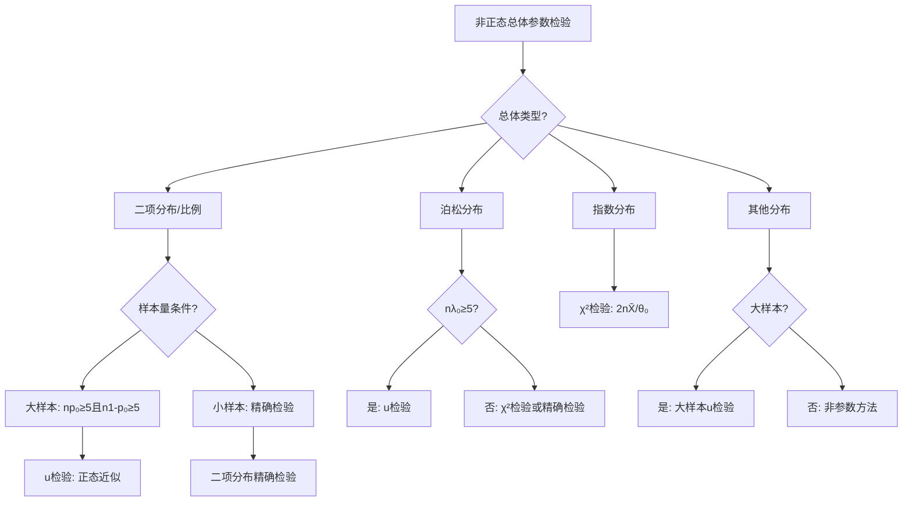
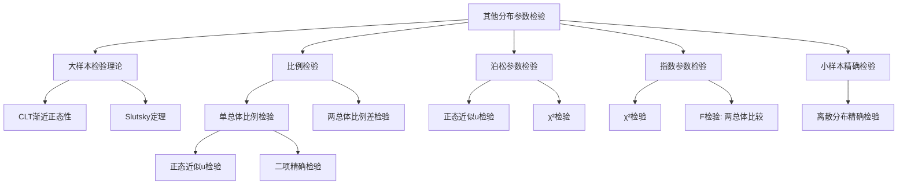

# 7.3 其他分布参数的假设检验

**相关笔记**：[[7.1 假设检验的基本思想与概念]] | [[7.2 正态总体参数的假设检验]] | [[4.4 中心极限定理]] | [[6.6 区间估计]] | [[2.4 常用离散分布]] | [[2.5 常用连续分布]]

> [!abstract] 本节概览
> 本节将假设检验方法从正态总体推广到==其他分布==。核心工具是==大样本理论==：当样本量足够大时，由[[4.4 中心极限定理|中心极限定理]]，样本均值（或样本比例）的标准化量近似服从标准正态分布。本节重点介绍==比例检验==（单总体和两总体）以及==泊松分布参数检验==，这些方法在医学、社会科学和工程中有广泛应用。
>
> **逻辑链条**：[[#一、大样本检验的一般理论|大样本理论]] → [[#二、比例的检验|单总体比例]] → [[#三、两个比例的比较检验|两总体比例差]] → [[#四、泊松分布参数的检验|泊松参数]] → [[#五、其他分布参数的检验|其他分布]] → [[#六、检验方法选择总结|方法选择]]
>
> **前置依赖**：[[7.1 假设检验的基本思想与概念|§7.1]]（假设检验基本概念）、[[7.2 正态总体参数的假设检验|§7.2]]（正态总体检验方法）、[[4.4 中心极限定理|§4.4]]（CLT）、[[6.6 区间估计|§6.6]]（大样本置信区间）
>
> **核心主线**：非正态总体参数检验的核心是"大样本正态近似"——由CLT保证，当n充分大时，检验统计量近似服从正态分布。比例检验是最重要的非正态检验场景，其检验统计量 $u = \frac{\hat{p}-p_0}{\sqrt{p_0(1-p_0)/n}}$ 在 $H_0$ 成立时近似 $N(0,1)$。

---

## 一、大样本检验的一般理论

在[[7.2 正态总体参数的假设检验|§7.2]]中，我们讨论了正态总体参数的检验方法，其核心是利用正态分布、$t$ 分布、$\chi^2$ 分布和 $F$ 分布等精确分布来构造检验统计量。然而，在实际应用中，很多总体的分布类型是未知的或非正态的。此时，我们无法直接使用§7.2中的方法。大样本检验理论为解决这一问题提供了有力工具。

### 大样本检验的基本思想

> [!def] 定义 7.3.1 — 大样本检验
> 设 $X_1, X_2, \ldots, X_n$ 是来自总体 $X$ 的样本，$E[X] = \theta$，$\text{Var}[X] = \sigma^2(\theta) < +\infty$，其中 $\theta$ 为待检验参数。当样本量 $n$ 充分大时，利用[[4.4 中心极限定理|中心极限定理]]，构造检验统计量
> $$
> u = \frac{n(\bar{X} - \theta)}{\sigma^2(\hat{\theta})}
> $$
> 其中 $\hat{\theta}$ 为 $\theta$ 的相合估计。在 $H_0$ 成立时，$u$ 近似服从 $N(0,1)$，由此可构造近似拒绝域。这种检验方法称为==大样本检验==。

**核心要点**：
- 大样本检验不要求总体服从正态分布，但要求总体均值和方差存在且有限。
- "大样本"的具体含义取决于总体分布：对于比例检验，通常要求 $np_0 \geqslant 5$ 且 $n(1-p_0) \geqslant 5$（更严格的要求是 $np_0 \geqslant 10$）。
- 大样本检验是一种**近似检验**，其近似精度随样本量增大而提高。

### 渐近正态性定理

> [!thm] 定理 7.3.1 — 大样本检验的渐近正态性
> 设 $X_1, X_2, \ldots, X_n \overset{\text{iid}}{\sim} F(x;\theta)$，$E[X] = \theta$，$\text{Var}[X] = \sigma^2(\theta) < +\infty$，$\hat{\theta}$ 为 $\theta$ 的相合估计。则在 $H_0: \theta = \theta_0$ 成立时，
> $$
> u = \frac{\sqrt{n}(\bar{X} - \theta_0)}{\sigma(\hat{\theta})} \xrightarrow{L} N(0,1), \quad n \to \infty
> $$

> [!abstract] 证明
> **证明**：
>
> **第一步：由CLT建立标准化量的渐近分布**。由[[4.4 中心极限定理|中心极限定理]]（Lindeberg-Levy形式），当 $n \to \infty$ 时，
> $$
> \frac{\sqrt{n}(\bar{X} - \theta)}{\sigma(\theta)} \xrightarrow{L} N(0,1).
> $$
> 这一步要求 $\sigma^2(\theta) < +\infty$，即总体方差有限。
>
> **第二步：用相合估计替换未知参数**。在 $H_0: \theta = \theta_0$ 成立时，$\theta = \theta_0$，但 $\sigma(\theta)$ 中可能含有未知参数。由于 $\hat{\theta}$ 是 $\theta$ 的相合估计，由 Slutsky 定理，
> $$
> \frac{\sigma(\hat{\theta})}{\sigma(\theta)} \xrightarrow{P} 1, \quad n \to \infty.
> $$
> 因此，
> $$
> \frac{\sqrt{n}(\bar{X} - \theta_0)}{\sigma(\hat{\theta})} = \frac{\sqrt{n}(\bar{X} - \theta_0)}{\sigma(\theta)} \cdot \frac{\sigma(\theta)}{\sigma(\hat{\theta})} \xrightarrow{L} N(0,1) \cdot 1 = N(0,1).
> $$
>
> **第三步：结论**。在 $H_0$ 成立时，检验统计量 $u$ 的渐近分布为 $N(0,1)$，因此可以用标准正态分布的分位数来确定近似拒绝域。
> $\blacksquare$

### 大样本检验的适用条件

大样本检验并非万能的，它需要满足以下条件：

| 条件 | 说明 |
|:---|:---|
| 有限方差 | 总体方差 $\sigma^2(\theta) < +\infty$，排除 Cauchy 分布等重尾分布 |
| 样本量充分大 | 具体要求因分布类型而异（比例检验：$np_0 \geqslant 5$，$n(1-p_0) \geqslant 5$） |
| 独立同分布 | 样本为简单随机样本 |
| 相合估计 | $\hat{\theta}$ 是 $\theta$ 的相合估计 |

### 与正态总体检验的关系

大样本检验与[[7.2 正态总体参数的假设检验|正态总体检验]]的关系可以概括为：

- **正态总体检验**：精确检验，不依赖样本量大小，利用精确的抽样分布（$t$、$\chi^2$、$F$）。
- **大样本检验**：近似检验，依赖样本量充分大，利用CLT保证的渐近正态性。
- 当总体确实服从正态分布时，应优先使用正态总体检验（更精确）；当总体分布未知或非正态时，大样本检验是唯一可行的方法。

---

## 二、比例的检验

比例检验是大样本检验中最重要的应用场景。在实际问题中，我们经常需要检验总体比例（如产品合格率、选民支持率、疾病发病率等）是否等于某个特定值。

### 单个总体比例的检验

> [!def] 定义 7.3.2 — 单个总体比例的检验
> 设总体 $X \sim B(1, p)$（即 $X$ 服从参数为 $p$ 的伯努利分布），$X_1, X_2, \ldots, X_n$ 为来自该总体的样本。记 $\sum_{i=1}^n X_i = m$（成功次数），$\hat{p} = m/n$（样本比例）。对比例 $p$ 的检验问题：
>
> | 检验类型 | 原假设 $H_0$ | 备择假设 $H_1$ |
> |:---|:---|:---|
> | 双边检验 | $H_0: p = p_0$ | $H_1: p \neq p_0$ |
> | 右边检验 | $H_0: p \leqslant p_0$ | $H_1: p > p_0$ |
> | 左边检验 | $H_0: p \geqslant p_0$ | $H_1: p < p_0$ |
>
> 当 $np_0 \geqslant 5$ 且 $n(1-p_0) \geqslant 5$ 时，在 $H_0$ 成立的条件下，构造检验统计量：
> $$
> u = \frac{\hat{p} - p_0}{\sqrt{p_0(1-p_0)/n}}
> $$
> $u$ 近似服从 $N(0,1)$。

**拒绝域**（显著性水平 $\alpha$）：

| 检验类型 | 拒绝域 |
|:---|:---|
| 双边检验 | $\{|u| \geqslant u_{1-\alpha/2}\}$ |
| 右边检验 | $\{u \geqslant u_{1-\alpha}\}$ |
| 左边检验 | $\{u \leqslant u_{\alpha}\} = \{u \leqslant -u_{1-\alpha}\}$ |

> [!thm] 定理 7.3.2 — 比例检验的渐近正态性
> 设 $X_1, \ldots, X_n \overset{\text{iid}}{\sim} B(1, p)$，$\hat{p} = \frac{1}{n}\sum_{i=1}^n X_i$。则在 $H_0: p = p_0$ 成立时，
> $$
> u = \frac{\hat{p} - p_0}{\sqrt{p_0(1-p_0)/n}} \xrightarrow{L} N(0,1), \quad n \to \infty
> $$
> 且近似效果在 $np_0 \geqslant 5$ 且 $n(1-p_0) \geqslant 5$ 时已经相当好。

> [!abstract] 证明
> **证明**：
>
> **第一步：分析样本比例的分布**。$\sum_{i=1}^n X_i \sim B(n, p)$，因此 $E[\hat{p}] = p$，$\text{Var}[\hat{p}] = p(1-p)/n$。
>
> **第二步：应用中心极限定理**。由[[4.4 中心极限定理|De Moivre-Laplace 中心极限定理]]，当 $n \to \infty$ 时，
> $$
> \frac{\hat{p} - p}{\sqrt{p(1-p)/n}} \xrightarrow{L} N(0,1).
> $$
>
> **第三步：在 $H_0$ 下代入 $p = p_0$**。在 $H_0: p = p_0$ 成立时，
> $$
> u = \frac{\hat{p} - p_0}{\sqrt{p_0(1-p_0)/n}} \xrightarrow{L} N(0,1).
> $$
> 注意这里分母使用的是 $p_0$（$H_0$ 下的值）而非 $\hat{p}$，这是因为在 $H_0$ 成立时 $p_0$ 是已知的，使用 $p_0$ 可以得到更好的近似效果。
> $\blacksquare$

### 例题

> [!example] 例题 1 — 产品合格率检验
> 某工厂声称其产品合格率为 95%。现从一批产品中随机抽取 200 件进行检验，发现其中有 186 件合格。在 $\alpha = 0.05$ 下检验该工厂的声明是否可信。
>
> **解**：
>
> 设 $p$ 为产品合格率。$H_0: p = 0.95$ vs $H_1: p \neq 0.95$（双边检验）。
>
> $\hat{p} = 186/200 = 0.93$。
>
> 检查条件：$np_0 = 200 \times 0.95 = 190 \geqslant 5$，$n(1-p_0) = 200 \times 0.05 = 10 \geqslant 5$。条件满足。
>
> 计算检验统计量：
> $$
> u = \frac{\hat{p} - p_0}{\sqrt{p_0(1-p_0)/n}} = \frac{0.93 - 0.95}{\sqrt{0.95 \times 0.05/200}} = \frac{-0.02}{\sqrt{0.0002375}} = \frac{-0.02}{0.01541} = -1.298
> $$
>
> $\alpha = 0.05$，$u_{0.975} = 1.96$。
>
> $|u| = 1.298 < 1.96$，未落入拒绝域，故**不拒绝 $H_0$**。
>
> 结论：在 $\alpha = 0.05$ 水平下，没有充分证据否定该工厂"合格率为 95%"的声明。
>
> **p 值**：$p = 2(1 - \Phi(1.298)) = 2 \times 0.0970 = 0.194$。

> [!example] 例题 2 — 选举支持率检验
> 某候选人声称其支持率不低于 40%。某民意调查机构随机调查了 500 名选民，其中 195 人表示支持该候选人。在 $\alpha = 0.05$ 下检验该候选人的声明。
>
> **解**：
>
> 设 $p$ 为支持率。$H_0: p \geqslant 0.40$ vs $H_1: p < 0.40$（左边检验）。
>
> $\hat{p} = 195/500 = 0.39$。
>
> 检查条件：$np_0 = 500 \times 0.40 = 200 \geqslant 5$，$n(1-p_0) = 500 \times 0.60 = 300 \geqslant 5$。条件满足。
>
> 计算检验统计量：
> $$
> u = \frac{\hat{p} - p_0}{\sqrt{p_0(1-p_0)/n}} = \frac{0.39 - 0.40}{\sqrt{0.40 \times 0.60/500}} = \frac{-0.01}{\sqrt{0.00048}} = \frac{-0.01}{0.02191} = -0.456
> $$
>
> $\alpha = 0.05$，$u_{0.05} = -u_{0.95} = -1.645$。拒绝域为 $\{u \leqslant -1.645\}$。
>
> $u = -0.456 > -1.645$，未落入拒绝域，故**不拒绝 $H_0$**。
>
> 结论：在 $\alpha = 0.05$ 水平下，没有充分证据否定该候选人"支持率不低于 40%"的声明。

---

## 三、两个比例的比较检验

在许多实际问题中，我们需要比较两个总体的比例是否有显著差异。例如，比较两种治疗方法的有效率、比较两个地区的投票倾向等。

### 两个总体比例差的检验

> [!def] 定义 7.3.3 — 两个总体比例差的检验
> 设 $X_1, \ldots, X_m \overset{\text{iid}}{\sim} B(1, p_1)$，$Y_1, \ldots, Y_n \overset{\text{iid}}{\sim} B(1, p_2)$，两样本独立。记 $\hat{p}_1 = \frac{1}{m}\sum_{i=1}^m X_i$，$\hat{p}_2 = \frac{1}{n}\sum_{j=1}^n Y_j$。对比例差的检验问题：
>
> | 检验类型 | 原假设 $H_0$ | 备择假设 $H_1$ |
> |:---|:---|:---|
> | 双边检验 | $H_0: p_1 = p_2$ | $H_1: p_1 \neq p_2$ |
> | 右边检验 | $H_0: p_1 \leqslant p_2$ | $H_1: p_1 > p_2$ |
> | 左边检验 | $H_0: p_1 \geqslant p_2$ | $H_1: p_1 < p_2$ |
>
> 在 $H_0: p_1 = p_2 = p$ 成立时，使用==合并比例==估计公共比例：
> $$
> \hat{p} = \frac{m\hat{p}_1 + n\hat{p}_2}{m + n}
> $$
> 检验统计量为：
> $$
> u = \frac{\hat{p}_1 - \hat{p}_2}{\sqrt{\hat{p}(1-\hat{p})(1/m + 1/n)}}
> $$
> 当 $m$、$n$ 都充分大时，$u$ 近似服从 $N(0,1)$。

**拒绝域**（显著性水平 $\alpha$）：

| 检验类型 | 拒绝域 |
|:---|:---|
| 双边检验 | $\{|u| \geqslant u_{1-\alpha/2}\}$ |
| 右边检验 | $\{u \geqslant u_{1-\alpha}\}$ |
| 左边检验 | $\{u \leqslant u_{\alpha}\}$ |

> [!thm] 定理 7.3.3 — 两比例差检验的渐近正态性
> 设 $X_1, \ldots, X_m \overset{\text{iid}}{\sim} B(1, p_1)$，$Y_1, \ldots, Y_n \overset{\text{iid}}{\sim} B(1, p_2)$，两样本独立。则在 $H_0: p_1 = p_2$ 成立时，
> $$
> u = \frac{\hat{p}_1 - \hat{p}_2}{\sqrt{\hat{p}(1-\hat{p})(1/m + 1/n)}} \xrightarrow{L} N(0,1), \quad \min(m,n) \to \infty
> $$
> 其中 $\hat{p} = \frac{m\hat{p}_1 + n\hat{p}_2}{m+n}$ 为合并样本比例。

> [!abstract] 证明
> **证明**：
>
> **第一步：分析 $\hat{p}_1 - \hat{p}_2$ 的分布**。由于两样本独立，
> $$
> E[\hat{p}_1 - \hat{p}_2] = p_1 - p_2, \quad \text{Var}[\hat{p}_1 - \hat{p}_2] = \frac{p_1(1-p_1)}{m} + \frac{p_2(1-p_2)}{n}.
> $$
>
> **第二步：在 $H_0$ 下简化**。当 $H_0: p_1 = p_2 = p$ 成立时，
> $$
> E[\hat{p}_1 - \hat{p}_2] = 0, \quad \text{Var}[\hat{p}_1 - \hat{p}_2] = p(1-p)\left(\frac{1}{m} + \frac{1}{n}\right).
> $$
>
> **第三步：应用CLT并替换未知参数**。由CLT，
> $$
> \frac{\hat{p}_1 - \hat{p}_2}{\sqrt{p(1-p)(1/m+1/n)}} \xrightarrow{L} N(0,1).
> $$
> 由于 $p$ 未知，用合并比例 $\hat{p} = \frac{m\hat{p}_1 + n\hat{p}_2}{m+n}$ 估计 $p$。由 Slutsky 定理，
> $$
> u = \frac{\hat{p}_1 - \hat{p}_2}{\sqrt{\hat{p}(1-\hat{p})(1/m+1/n)}} \xrightarrow{L} N(0,1).
> $$
> $\blacksquare$

### 例题

> [!example] 例题 3 — 两种教学方法比较
> 某学校比较两种教学方法的效果。方法 A 教了 120 名学生，其中 50 名考试及格；方法 B 教了 85 名学生，其中 23 名考试及格。在 $\alpha = 0.05$ 下检验两种方法的及格率是否有显著差异。
>
> **解**：
>
> $H_0: p_1 = p_2$ vs $H_1: p_1 \neq p_2$（双边检验）。
>
> $\hat{p}_1 = 50/120 = 0.4167$，$\hat{p}_2 = 23/85 = 0.2706$。
>
> 合并比例：
> $$
> \hat{p} = \frac{50 + 23}{120 + 85} = \frac{73}{205} = 0.3561
> $$
>
> 检查条件：$m\hat{p} = 120 \times 0.3561 = 42.73 \geqslant 5$，$m(1-\hat{p}) = 120 \times 0.6439 = 77.27 \geqslant 5$，$n\hat{p} = 85 \times 0.3561 = 30.27 \geqslant 5$，$n(1-\hat{p}) = 85 \times 0.6439 = 54.73 \geqslant 5$。条件满足。
>
> 计算检验统计量：
> $$
> u = \frac{0.4167 - 0.2706}{\sqrt{0.3561 \times 0.6439 \times (1/120 + 1/85)}} = \frac{0.1461}{\sqrt{0.2293 \times 0.01618}} = \frac{0.1461}{\sqrt{0.003710}} = \frac{0.1461}{0.06091} = 2.399
> $$
>
> $\alpha = 0.05$，$u_{0.975} = 1.96$。
>
> $|u| = 2.399 > 1.96$，落入拒绝域，故**拒绝 $H_0$**。
>
> 结论：在 $\alpha = 0.05$ 水平下，两种教学方法的及格率有显著差异，方法 A 的及格率显著高于方法 B。

---

## 四、泊松分布参数的检验

泊松分布在计数数据中应用广泛，如单位时间内的电话呼叫次数、单位面积内的缺陷数等。对泊松分布参数 $\lambda$ 的检验有两种方法：大样本正态近似和精确的 $\chi^2$ 检验。

### 泊松分布参数 $\lambda$ 的检验

> [!def] 定义 7.3.4 — 泊松分布参数 $\lambda$ 的检验
> 设 $X_1, X_2, \ldots, X_n \overset{\text{iid}}{\sim} \text{Po}(\lambda)$，其中 $\lambda > 0$ 为未知参数。对 $\lambda$ 的检验问题：
>
> | 检验类型 | 原假设 $H_0$ | 备择假设 $H_1$ |
> |:---|:---|:---|
> | 双边检验 | $H_0: \lambda = \lambda_0$ | $H_1: \lambda \neq \lambda_0$ |
> | 右边检验 | $H_0: \lambda \leqslant \lambda_0$ | $H_1: \lambda > \lambda_0$ |
> | 左边检验 | $H_0: \lambda \geqslant \lambda_0$ | $H_1: \lambda < \lambda_0$ |
>
> **方法一：大样本正态近似**。当 $n\lambda_0$ 充分大（一般要求 $n\lambda_0 \geqslant 5$）时，检验统计量为：
> $$
> u = \frac{\bar{X} - \lambda_0}{\sqrt{\lambda_0/n}}
> $$
> 在 $H_0$ 成立时，$u$ 近似服从 $N(0,1)$。
>
> **方法二：$\chi^2$ 检验**。利用泊松分布的可加性，$\sum_{i=1}^n X_i \sim \text{Po}(n\lambda)$，在 $H_0$ 成立时，构造统计量：
> $$
> \chi^2 = \frac{2\sum_{i=1}^n X_i}{\lambda_0} \cdot \frac{1}{2} = \frac{2n\bar{X}}{\lambda_0}
> $$
> 更准确地说，当 $n\lambda_0$ 较大时，$\frac{2n\bar{X}}{\lambda_0}$ 近似服从 $\chi^2(2n)$（由泊松分布与 $\chi^2$ 分布的关系）。

> [!thm] 定理 7.3.4 — 泊松分布参数检验的渐近正态性
> 设 $X_1, \ldots, X_n \overset{\text{iid}}{\sim} \text{Po}(\lambda)$。则在 $H_0: \lambda = \lambda_0$ 成立时，
> $$
> u = \frac{\bar{X} - \lambda_0}{\sqrt{\lambda_0/n}} \xrightarrow{L} N(0,1), \quad n \to \infty
> $$
> 且当 $n\lambda_0 \geqslant 5$ 时近似效果已经较好。

> [!abstract] 证明
> **证明**：
>
> **第一步：分析泊松分布的矩**。若 $X \sim \text{Po}(\lambda)$，则 $E[X] = \lambda$，$\text{Var}[X] = \lambda$。因此 $E[\bar{X}] = \lambda$，$\text{Var}[\bar{X}] = \lambda/n$。
>
> **第二步：应用中心极限定理**。由[[4.4 中心极限定理|Lindeberg-Levy CLT]]，
> $$
> \frac{\bar{X} - \lambda}{\sqrt{\lambda/n}} \xrightarrow{L} N(0,1), \quad n \to \infty.
> $$
>
> **第三步：在 $H_0$ 下代入 $\lambda = \lambda_0$**。在 $H_0: \lambda = \lambda_0$ 成立时，
> $$
> u = \frac{\bar{X} - \lambda_0}{\sqrt{\lambda_0/n}} \xrightarrow{L} N(0,1).
> $$
> 注意泊松分布的方差等于均值 $\lambda$，因此分母中不需要额外的方差估计，直接使用 $\lambda_0$ 即可。
> $\blacksquare$

### 例题

> [!example] 例题 4 — 泊松分布参数检验
> 某十字路口平均每小时发生交通事故 2.5 起。交通管理部门实施新的交通管制措施后，随机观察了 20 个小时，共发生交通事故 38 起。在 $\alpha = 0.05$ 下检验新措施是否降低了事故率。
>
> **解**：
>
> $H_0: \lambda \geqslant 2.5$ vs $H_1: \lambda < 2.5$（左边检验）。
>
> $\bar{x} = 38/20 = 1.9$。
>
> 检查条件：$n\lambda_0 = 20 \times 2.5 = 50 \geqslant 5$。条件满足。
>
> 计算检验统计量：
> $$
> u = \frac{\bar{x} - \lambda_0}{\sqrt{\lambda_0/n}} = \frac{1.9 - 2.5}{\sqrt{2.5/20}} = \frac{-0.6}{\sqrt{0.125}} = \frac{-0.6}{0.3536} = -1.697
> $$
>
> $\alpha = 0.05$，$u_{0.05} = -1.645$。拒绝域为 $\{u \leqslant -1.645\}$。
>
> $u = -1.697 < -1.645$，落入拒绝域，故**拒绝 $H_0$**。
>
> 结论：在 $\alpha = 0.05$ 水平下，有充分证据表明新交通管制措施降低了事故率。

---

## 五、其他分布参数的检验

### 指数分布参数的检验

设 $X_1, \ldots, X_n \overset{\text{iid}}{\sim} \text{Exp}(1/\theta)$，其中 $\theta = E[X]$ 为均值参数。对 $\theta$ 的检验可以利用指数分布与 $\chi^2$ 分布的关系。

**关键性质**：若 $X \sim \text{Exp}(1/\theta)$，则 $\frac{2X}{\theta} \sim \chi^2(2)$。因此，

$$
\frac{2n\bar{X}}{\theta} \sim \chi^2(2n)
$$

在 $H_0: \theta = \theta_0$ 成立时，$\chi^2_0 = \frac{2n\bar{X}}{\theta_0} \sim \chi^2(2n)$。

**拒绝域**：

| 检验类型 | 拒绝域 |
|:---|:---|
| 双边检验 | $\{\chi^2_0 < \chi^2_{\alpha/2}(2n)\} \cup \{\chi^2_0 > \chi^2_{1-\alpha/2}(2n)\}$ |
| 右边检验 | $\{\chi^2_0 > \chi^2_{1-\alpha}(2n)\}$ |
| 左边检验 | $\{\chi^2_0 < \chi^2_{\alpha}(2n)\}$ |

> [!example] 例题 5 — 指数分布参数检验
> 某电子元件的寿命服从指数分布，厂商声称平均寿命不低于 6000 小时。现抽取 10 个元件进行寿命试验，测得平均寿命 $\bar{x} = 4462.6$ 小时。在 $\alpha = 0.05$ 下检验厂商的声明。
>
> **解**：
>
> $H_0: \theta \geqslant 6000$ vs $H_1: \theta < 6000$（左边检验）。
>
> 计算检验统计量：
> $$
> \chi^2_0 = \frac{2n\bar{x}}{\theta_0} = \frac{2 \times 10 \times 4462.6}{6000} = \frac{89252}{6000} = 14.875
> $$
>
> $\alpha = 0.05$，$\chi^2_{0.05}(20) = 10.851$。拒绝域为 $\{\chi^2_0 < 10.851\}$。
>
> $\chi^2_0 = 14.875 > 10.851$，未落入拒绝域，故**不拒绝 $H_0$**。
>
> 结论：在 $\alpha = 0.05$ 水平下，没有充分证据否定厂商"平均寿命不低于 6000 小时"的声明。

### 两个指数分布参数的比较

设 $X_1, \ldots, X_m \overset{\text{iid}}{\sim} \text{Exp}(1/\theta_1)$，$Y_1, \ldots, Y_n \overset{\text{iid}}{\sim} \text{Exp}(1/\theta_2)$，两样本独立。检验 $H_0: \theta_1 = \theta_2$。

利用指数分布的性质，$\frac{\bar{X}}{\bar{Y}} \sim F(2m, 2n)$（在 $H_0$ 成立时），因此可以使用 $F$ 检验。

### 二项分布参数的精确检验（小样本）

当样本量不满足大样本条件时（如 $np_0 < 5$ 或 $n(1-p_0) < 5$），正态近似不可靠，此时应使用二项分布的精确检验。

对于 $H_0: p \leqslant p_0$ vs $H_1: p > p_0$，拒绝域的形式为 $\{\sum_{i=1}^n X_i \geqslant c\}$，其中临界值 $c$ 由

$$
P\left(\sum_{i=1}^n X_i \geqslant c\right) = \sum_{i=c}^n \binom{n}{i} p_0^i (1-p_0)^{n-i} \leqslant \alpha
$$

确定。由于二项分布是离散分布，通常无法精确达到显著性水平 $\alpha$，因此取满足上式的最小 $c$。

> [!example] 例题 6 — 二项分布精确检验
> 某硬币声称是均匀的。抛掷 15 次，出现 11 次正面。在 $\alpha = 0.05$ 下检验该硬币是否均匀。
>
> **解**：
>
> $H_0: p \leqslant 0.5$ vs $H_1: p > 0.5$（右边检验）。
>
> $n = 15$，$np_0 = 15 \times 0.5 = 7.5$，虽然满足 $np_0 \geqslant 5$，但为了演示精确检验方法，我们使用精确检验。
>
> 在 $H_0: p = 0.5$ 下，$\sum_{i=1}^{15} X_i \sim B(15, 0.5)$。
>
> $$
> P\left(\sum_{i=1}^{15} X_i \geqslant 11\right) = \sum_{i=11}^{15} \binom{15}{i} 0.5^{15}
> $$
> $$
> = \binom{15}{11} 0.5^{15} + \binom{15}{12} 0.5^{15} + \binom{15}{13} 0.5^{15} + \binom{15}{14} 0.5^{15} + \binom{15}{15} 0.5^{15}
> $$
> $$
> = (1365 + 455 + 105 + 15 + 1) \times 0.5^{15} = 1941/32768 \approx 0.0592
> $$
>
> p 值 $\approx 0.0592 > 0.05$，故**不拒绝 $H_0$**。
>
> 结论：在 $\alpha = 0.05$ 水平下，没有充分证据表明该硬币不均匀。

---

## 六、检验方法选择总结

### 决策树

### 检验方法对照表

| 检验场景 | 检验统计量 | 分布 | 适用条件 |
|:---|:---|:---|:---|
| 单总体比例 $p$ | $u = \frac{\hat{p}-p_0}{\sqrt{p_0(1-p_0)/n}}$ | 近似 $N(0,1)$ | $np_0 \geqslant 5$，$n(1-p_0) \geqslant 5$ |
| 两总体比例差 | $u = \frac{\hat{p}_1-\hat{p}_2}{\sqrt{\hat{p}(1-\hat{p})(1/m+1/n)}}$ | 近似 $N(0,1)$ | $m, n$ 都充分大 |
| 泊松参数 $\lambda$ | $u = \frac{\bar{X}-\lambda_0}{\sqrt{\lambda_0/n}}$ | 近似 $N(0,1)$ | $n\lambda_0 \geqslant 5$ |
| 指数参数 $\theta$ | $\chi^2 = \frac{2n\bar{X}}{\theta_0}$ | $\chi^2(2n)$ | 任意样本量 |
| 大样本一般 | $u = \frac{\sqrt{n}(\bar{X}-\theta_0)}{\sigma(\hat{\theta})}$ | 近似 $N(0,1)$ | $n$ 充分大 |

### 正态 vs 非正态检验对照

| 对比维度 | 正态总体检验 | 非正态大样本检验 |
|:---|:---|:---|
| 理论基础 | 精确抽样分布 | CLT 渐近正态性 |
| 样本量要求 | 任意 | 充分大 |
| 检验精度 | 精确 | 近似 |
| 分布假设 | 正态分布 | 有限方差 |
| 统计量类型 | $u$/$t$/$\chi^2$/$F$ | 主要为 $u$ |

---

## 七、知识结构总览

---

## 八、核心思想与解题技巧

### 大样本检验的解题步骤

> [!tip] 大样本检验四步法
> 1. **建立假设**：写出 $H_0$ 和 $H_1$，明确检验类型（双边/单边）。
> 2. **验证条件**：检查大样本条件是否满足（比例检验：$np_0 \geqslant 5$ 且 $n(1-p_0) \geqslant 5$；泊松检验：$n\lambda_0 \geqslant 5$）。
> 3. **计算统计量**：代入公式计算检验统计量的观测值。
> 4. **判断决策**：与临界值比较，做出统计判断，给出实际意义解释。

### 常见题型总结

1. **比例检验题**：给定样本中成功次数和样本量，检验总体比例是否等于/大于/小于某个值。注意区分分母使用 $p_0$（$H_0$ 下的值）还是 $\hat{p}$（样本估计值）。
2. **两比例比较题**：给定两组独立样本的成功次数，检验两个总体比例是否相等。关键在于使用==合并比例==而非各自的比例。
3. **泊松参数检验题**：给定计数数据和观察时间/面积，检验事件发生率是否等于某个值。
4. **指数分布检验题**：给定寿命数据，利用 $\chi^2$ 分布进行检验。
5. **方法选择题**：根据总体类型和样本量条件，判断应使用哪种检验方法。

### 大样本检验与置信区间的关系

与[[7.2 正态总体参数的假设检验|§7.2]]中的对偶关系类似，大样本检验与置信区间也存在对偶关系：

- $H_0: p = p_0$ 的双边检验不拒绝 $\Leftrightarrow$ $p_0$ 落在 $p$ 的 $1-\alpha$ 置信区间内。
- 单边检验的拒绝域对应单侧置信界。

例如，$p$ 的 $1-\alpha$ 大样本置信区间为

$$
\hat{p} \pm u_{1-\alpha/2} \sqrt{\hat{p}(1-\hat{p})/n}
$$

如果 $p_0$ 不在该区间内，则在水平 $\alpha$ 下拒绝 $H_0: p = p_0$。

---

## 九、补充理解与易混淆点

### 误区一："大样本检验不需要任何分布假设"

**正确理解**：大样本检验虽然不要求总体服从正态分布，但仍然需要一定的分布条件。最基本的要求是总体方差 $\sigma^2(\theta) < +\infty$（有限方差条件），这排除了 Cauchy 分布等方差无限的分布。此外，还需要样本独立同分布、以及检验统计量中涉及的参数有相合估计。==大样本检验放宽了分布类型假设，但并未完全消除分布假设==。如果总体的偏度非常大或存在严重的离群值，即使样本量较大，正态近似的精度也可能不够理想。

**来源**：茆诗松《概率论与数理统计》§7.3 | [[4.4 中心极限定理|§4.4]]（CLT的条件）| Casella & Berger *Statistical Inference* Ch.10 | [CSDN: 非正态总体的参数假设检验](https://blog.csdn.net/weixin_46334596/article/details/127453994) | [Khan Academy: Conditions for Inference](https://www.khanacademy.org/math/ap-statistics/xfb5d8e68:inference-categorical-proportions/one-sample-z-interval-proportion/a/conditions-inference-one-proportion)

### 误区二："比例检验的样本量没有下限"

**正确理解**：比例检验使用正态近似，其精度依赖于 $np_0$ 和 $n(1-p_0)$ 都足够大。经典要求是 $np_0 \geqslant 5$ 且 $n(1-p_0) \geqslant 5$，更严格的要求是 $np_0 \geqslant 10$ 且 $n(1-p_0) \geqslant 10$。当 $p_0$ 接近 0 或 1 时，即使 $n$ 很大，也可能不满足条件。例如 $p_0 = 0.01$ 时，需要 $n \geqslant 500$ 才能使 $np_0 = 5$。==不满足条件时应使用二项分布的精确检验==，而非强行使用正态近似。

**来源**：茆诗松《概率论与数理统计》§7.3 | [Fiveable: Large Counts Condition](https://fiveable.me/ap-stats/key-terms/large-counts-condition) | [CSDN: 二项分布检验原理](https://blog.csdn.net/m0_69689054/article/details/145926051) | Wackerly *Mathematical Statistics* Ch.10 | Agresti & Coull (1998) *The American Statistician*

### 误区三："两个比例检验可以直接用各自的标准误"

**正确理解**：在检验 $H_0: p_1 = p_2$ 时，分母中的标准误必须使用==合并比例== $\hat{p} = \frac{m\hat{p}_1 + n\hat{p}_2}{m+n}$ 来计算，即

$$
\sqrt{\hat{p}(1-\hat{p})(1/m + 1/n)}
$$

而非使用各自的比例计算 $\sqrt{\hat{p}_1(1-\hat{p}_1)/m + \hat{p}_2(1-\hat{p}_2)/n}$。原因在于：在 $H_0$ 成立时，$p_1 = p_2 = p$，合并比例是公共比例 $p$ 的最优估计，使用它可以获得更好的近似效果。后者适用于构造 $p_1 - p_2$ 的置信区间（此时不假设 $p_1 = p_2$），但不适用于假设检验。==检验和估计的标准误计算方式不同==，这是初学者容易混淆的地方。

**来源**：茆诗松《概率论与数理统计》§7.3 | [Book118: 大样本检验试题及答案](https://m.book118.com/html/2025/1228/5003031140013043.shtm) | Casella & Berger *Statistical Inference* Ch.10 | Rice *Mathematical Statistics and Data Analysis* Ch.9 | [CSDN: 假设检验知识点总结](https://blog.csdn.net/weixin_46334596/article/details/127453994)

### 误区四："泊松分布参数检验只能用正态近似"

**正确理解**：泊松分布参数 $\lambda$ 的检验有多种方法。大样本正态近似 $u = \frac{\bar{X}-\lambda_0}{\sqrt{\lambda_0/n}}$ 只在 $n\lambda_0$ 充分大时才可靠。当 $n\lambda_0$ 较小时，可以利用泊松分布与 $\chi^2$ 分布的关系：若 $S = \sum_{i=1}^n X_i \sim \text{Po}(n\lambda)$，则 $P(S \leqslant s) = P(\chi^2(2(s+1)) > 2n\lambda)$，这提供了精确的 p 值计算方法。此外，还可以直接使用泊松分布表进行精确检验。==方法的选择取决于样本量和期望计数的大小==。

**来源**：茆诗松《概率论与数理统计》§7.3 | [[2.4 常用离散分布|§2.4]]（泊松分布的性质）| Casella & Berger *Statistical Inference* Ch.8 | [Book118: 考研真题概率论数理统计](https://m.book118.com/html/2020/1123/7011136050003022.shtm) | Lehmann & Romano *Testing Statistical Hypotheses* Ch.3

### 误区五："p 值在大样本检验中总是准确的"

**正确理解**：大样本检验中的 p 值是基于渐近分布计算的，其准确性依赖于渐近近似的精度。当样本量不够大或总体分布严重偏离正态时，渐近 p 值可能与真实的 p 值有较大偏差。此外，大样本下容易出现"统计显著但实际不显著"的问题——当 $n$ 非常大时，即使 $p$ 与 $p_0$ 的差异微乎其微，检验也可能拒绝 $H_0$。因此，在大样本检验中，除了关注 p 值，还应关注==效应量==（effect size），即参数差异的实际大小。==p 值只度量统计显著性，不度量实际重要性==。

**来源**：茆诗松《概率论与数理统计》§7.3 | Wasserstein & Lazar (2016) *ASA Statement on p-Values* | Sullivan & Feinn (2012) *PT: Effect Size* | [Nature: p-value FAQ](https://www.nature.com/articles/nmeth.3993) | Cohen (1994) *Psychological Bulletin: The Earth Is Round (p < .05)*

---

## 十、习题精选

> [!todo] 习题概览
> **教材习题（6题）**：第1-6题覆盖比例检验、两比例比较、泊松参数检验、指数分布检验和二项精确检验。
> **考研真题（4题）**：第7-10题为卡方考研真题，涉及非正态总体参数检验的综合应用。

### 教材习题

> [!example] 习题 1 — 单总体比例检验
> 某药品声称对某种疾病的有效率为 80%。临床试验中，200 名患者服用该药后有 148 名有效。在 $\alpha = 0.05$ 下检验该药品的有效率是否低于声称值。
>
> **解**：
>
> $H_0: p \geqslant 0.80$ vs $H_1: p < 0.80$（左边检验）。
>
> $\hat{p} = 148/200 = 0.74$。
>
> 检查条件：$np_0 = 200 \times 0.80 = 160 \geqslant 5$，$n(1-p_0) = 200 \times 0.20 = 40 \geqslant 5$。条件满足。
>
> $$
> u = \frac{0.74 - 0.80}{\sqrt{0.80 \times 0.20/200}} = \frac{-0.06}{\sqrt{0.0008}} = \frac{-0.06}{0.02828} = -2.121
> $$
>
> $\alpha = 0.05$，$u_{0.05} = -1.645$。$u = -2.121 < -1.645$，落入拒绝域，故**拒绝 $H_0$**。
>
> 结论：在 $\alpha = 0.05$ 水平下，有充分证据表明该药品的有效率低于 80%。
>
> **p 值**：$p = \Phi(-2.121) = 1 - \Phi(2.121) \approx 0.0170$。

> [!example] 习题 2 — 两总体比例差检验
> 某研究者比较城市和农村居民对某政策的支持率。调查了城市居民 300 人，支持率为 65%；调查了农村居民 250 人，支持率为 55%。在 $\alpha = 0.01$ 下检验城市和农村的支持率是否有显著差异。
>
> **解**：
>
> $H_0: p_1 = p_2$ vs $H_1: p_1 \neq p_2$（双边检验）。
>
> $\hat{p}_1 = 0.65$，$\hat{p}_2 = 0.55$。
>
> 合并比例：
> $$
> \hat{p} = \frac{300 \times 0.65 + 250 \times 0.55}{300 + 250} = \frac{195 + 137.5}{550} = \frac{332.5}{550} = 0.6045
> $$
>
> $$
> u = \frac{0.65 - 0.55}{\sqrt{0.6045 \times 0.3955 \times (1/300 + 1/250)}} = \frac{0.10}{\sqrt{0.2391 \times 0.007333}} = \frac{0.10}{\sqrt{0.001753}} = \frac{0.10}{0.04187} = 2.388
> $$
>
> $\alpha = 0.01$，$u_{0.995} = 2.576$。$|u| = 2.388 < 2.576$，未落入拒绝域，故**不拒绝 $H_0$**。
>
> 结论：在 $\alpha = 0.01$ 水平下，没有充分证据表明城市和农村居民的支持率有显著差异。
>
> 注意：若取 $\alpha = 0.05$，$u_{0.975} = 1.96$，$|u| = 2.388 > 1.96$，则拒绝 $H_0$。这说明结论依赖于显著性水平的选择。

> [!example] 习题 3 — 泊松分布参数检验
> 某工厂声称其产品每平方米的缺陷数不超过 3 个。质检部门随机抽查了 30 平方米的产品表面，共发现缺陷 105 个。在 $\alpha = 0.05$ 下检验该工厂的声明。
>
> **解**：
>
> $H_0: \lambda \leqslant 3$ vs $H_1: \lambda > 3$（右边检验）。
>
> $\bar{x} = 105/30 = 3.5$。
>
> 检查条件：$n\lambda_0 = 30 \times 3 = 90 \geqslant 5$。条件满足。
>
> $$
> u = \frac{3.5 - 3}{\sqrt{3/30}} = \frac{0.5}{\sqrt{0.1}} = \frac{0.5}{0.3162} = 1.581
> $$
>
> $\alpha = 0.05$，$u_{0.95} = 1.645$。$u = 1.581 < 1.645$，未落入拒绝域，故**不拒绝 $H_0$**。
>
> 结论：在 $\alpha = 0.05$ 水平下，没有充分证据否定该工厂"每平方米缺陷数不超过 3 个"的声明。

> [!example] 习题 4 — 指数分布参数检验
> 某型号灯泡的寿命服从指数分布，标准规定平均寿命不低于 5000 小时。现抽取 8 个灯泡进行试验，测得平均寿命 $\bar{x} = 4200$ 小时。在 $\alpha = 0.10$ 下检验该型号灯泡是否符合标准。
>
> **解**：
>
> $H_0: \theta \geqslant 5000$ vs $H_1: \theta < 5000$（左边检验）。
>
> $$
> \chi^2_0 = \frac{2n\bar{x}}{\theta_0} = \frac{2 \times 8 \times 4200}{5000} = \frac{67200}{5000} = 13.44
> $$
>
> $\alpha = 0.10$，$\chi^2_{0.10}(16) = 9.312$。拒绝域为 $\{\chi^2_0 < 9.312\}$。
>
> $\chi^2_0 = 13.44 > 9.312$，未落入拒绝域，故**不拒绝 $H_0$**。
>
> 结论：在 $\alpha = 0.10$ 水平下，没有充分证据表明该型号灯泡不符合标准。

> [!example] 习题 5 — 大样本一般检验
> 某地区居民月收入的总体分布未知，但已知方差有限。随机抽取 100 名居民，测得月平均收入为 5500 元，样本标准差为 1200 元。在 $\alpha = 0.05$ 下检验该地区居民月平均收入是否高于 5000 元。
>
> **解**：
>
> $H_0: \theta \leqslant 5000$ vs $H_1: \theta > 5000$（右边检验）。
>
> 总体分布未知，使用大样本检验。$\hat{\sigma} = s = 1200$。
>
> $$
> u = \frac{\bar{x} - \theta_0}{s/\sqrt{n}} = \frac{5500 - 5000}{1200/\sqrt{100}} = \frac{500}{120} = 4.167
> $$
>
> $\alpha = 0.05$，$u_{0.95} = 1.645$。$u = 4.167 > 1.645$，落入拒绝域，故**拒绝 $H_0$**。
>
> 结论：在 $\alpha = 0.05$ 水平下，有充分证据表明该地区居民月平均收入高于 5000 元。

> [!example] 习题 6 — 两总体比例差的单边检验
> 某公司比较两种广告方案的效果。方案 A 展示给 400 名用户，120 人点击；方案 B 展示给 350 名用户，84 人点击。在 $\alpha = 0.05$ 下检验方案 A 的点击率是否显著高于方案 B。
>
> **解**：
>
> $H_0: p_1 \leqslant p_2$ vs $H_1: p_1 > p_2$（右边检验）。
>
> $\hat{p}_1 = 120/400 = 0.30$，$\hat{p}_2 = 84/350 = 0.24$。
>
> 合并比例：
> $$
> \hat{p} = \frac{120 + 84}{400 + 350} = \frac{204}{750} = 0.272
> $$
>
> $$
> u = \frac{0.30 - 0.24}{\sqrt{0.272 \times 0.728 \times (1/400 + 1/350)}} = \frac{0.06}{\sqrt{0.1980 \times 0.005357}} = \frac{0.06}{\sqrt{0.001061}} = \frac{0.06}{0.03257} = 1.842
> $$
>
> $\alpha = 0.05$，$u_{0.95} = 1.645$。$u = 1.842 > 1.645$，落入拒绝域，故**拒绝 $H_0$**。
>
> 结论：在 $\alpha = 0.05$ 水平下，方案 A 的点击率显著高于方案 B。

### 考研真题

> [!example] 习题 7 — 考研真题（卡方学院）
> 某地区环保部门监测发现，某河流断面水质达标率的标准为不低于 90%。现从近期监测数据中随机抽取 80 个样本，其中有 11 个不达标。在 $\alpha = 0.05$ 下检验该河流断面水质达标率是否符合标准。
>
> **解**：
>
> 设 $p$ 为不达标率。$H_0: p \leqslant 0.10$ vs $H_1: p > 0.10$（右边检验）。
>
> $\hat{p} = 11/80 = 0.1375$。
>
> 检查条件：$np_0 = 80 \times 0.10 = 8 \geqslant 5$，$n(1-p_0) = 80 \times 0.90 = 72 \geqslant 5$。条件满足。
>
> $$
> u = \frac{0.1375 - 0.10}{\sqrt{0.10 \times 0.90/80}} = \frac{0.0375}{\sqrt{0.001125}} = \frac{0.0375}{0.03354} = 1.118
> $$
>
> $\alpha = 0.05$，$u_{0.95} = 1.645$。$u = 1.118 < 1.645$，未落入拒绝域，故**不拒绝 $H_0$**。
>
> 结论：在 $\alpha = 0.05$ 水平下，没有充分证据表明水质不达标率超过 10%，即达标率符合标准。

> [!example] 习题 8 — 考研真题（卡方学院）
> 某医院研究两种手术方案的成功率。方案 A 对 120 名患者实施，成功 50 例；方案 B 对 85 名患者实施，成功 23 例。在 $\alpha = 0.05$ 下检验两种手术方案的成功率是否有显著差异。
>
> **解**：
>
> $H_0: p_1 = p_2$ vs $H_1: p_1 \neq p_2$（双边检验）。
>
> $\hat{p}_1 = 50/120 = 0.4167$，$\hat{p}_2 = 23/85 = 0.2706$。
>
> 合并比例：
> $$
> \hat{p} = \frac{50 + 23}{120 + 85} = \frac{73}{205} = 0.3561
> $$
>
> $$
> u = \frac{0.4167 - 0.2706}{\sqrt{0.3561 \times 0.6439 \times (1/120 + 1/85)}} = \frac{0.1461}{\sqrt{0.2293 \times 0.01618}} = \frac{0.1461}{0.06091} = 2.399
> $$
>
> $\alpha = 0.05$，$u_{0.975} = 1.96$。$|u| = 2.399 > 1.96$，落入拒绝域，故**拒绝 $H_0$**。
>
> 结论：在 $\alpha = 0.05$ 水平下，两种手术方案的成功率有显著差异。

> [!example] 习题 9 — 考研真题（卡方学院）
> 设 $X_1, \ldots, X_n \overset{\text{iid}}{\sim} \text{Po}(\lambda)$，其中 $\lambda > 0$ 未知。给出检验 $H_0: \lambda = \lambda_0$ vs $H_1: \lambda \neq \lambda_0$ 的大样本检验统计量，并说明其渐近分布。若 $n = 30$，$\bar{x} = 5.2$，$\lambda_0 = 4.5$，在 $\alpha = 0.05$ 下给出检验结论。
>
> **解**：
>
> 检验统计量为：
> $$
> u = \frac{\bar{X} - \lambda_0}{\sqrt{\lambda_0/n}}
> $$
> 在 $H_0$ 成立时，$u$ 近似服从 $N(0,1)$。
>
> 检查条件：$n\lambda_0 = 30 \times 4.5 = 135 \geqslant 5$。条件满足。
>
> 计算观测值：
> $$
> u_0 = \frac{5.2 - 4.5}{\sqrt{4.5/30}} = \frac{0.7}{\sqrt{0.15}} = \frac{0.7}{0.3873} = 1.807
> $$
>
> $\alpha = 0.05$，$u_{0.975} = 1.96$。$|u_0| = 1.807 < 1.96$，未落入拒绝域，故**不拒绝 $H_0$**。
>
> 结论：在 $\alpha = 0.05$ 水平下，没有充分证据表明 $\lambda \neq 4.5$。

> [!example] 习题 10 — 考研真题（卡方学院）
> 设 $X_1, \ldots, X_m \overset{\text{iid}}{\sim} \text{Exp}(1/\theta_1)$，$Y_1, \ldots, Y_n \overset{\text{iid}}{\sim} \text{Exp}(1/\theta_2)$，两样本独立。给出检验 $H_0: \theta_1 = \theta_2$ vs $H_1: \theta_1 \neq \theta_2$ 的检验统计量及其分布。若 $m = 8$，$n = 6$，$\bar{x} = 120$，$\bar{y} = 80$，在 $\alpha = 0.10$ 下给出检验结论。
>
> **解**：
>
> 由于 $\frac{2m\bar{X}}{\theta_1} \sim \chi^2(2m)$，$\frac{2n\bar{Y}}{\theta_2} \sim \chi^2(2n)$，且两统计量独立，在 $H_0: \theta_1 = \theta_2 = \theta$ 成立时，
> $$
> F = \frac{\bar{X}}{\bar{Y}} \sim F(2m, 2n)
> $$
>
> 计算观测值：
> $$
> F_0 = \frac{\bar{x}}{\bar{y}} = \frac{120}{80} = 1.5
> $$
>
> $\alpha = 0.10$，$2m = 16$，$2n = 12$。
> $F_{0.95}(16, 12) = 2.56$，
> $F_{0.05}(16, 12) = 1/F_{0.95}(12, 16) = 1/2.42 = 0.413$。
>
> 拒绝域为 $\{F \leqslant 0.413\} \cup \{F \geqslant 2.56\}$。
>
> $0.413 < 1.5 < 2.56$，未落入拒绝域，故**不拒绝 $H_0$**。
>
> 结论：在 $\alpha = 0.10$ 水平下，没有充分证据表明两个指数总体的均值参数不等。

---

## 十一、教材原文

> [!note] 教材参考
> 本节内容对应茆诗松《概率论与数理统计》（第三版）第七章第三节"其他分布参数的假设检验"。
>
> **PDF 原文**：`00-Raw素材/概率论与统计/7.3_教材扫描_正文.pdf`
>
> **卡方核心笔记**：`00-Raw素材/概率论与统计/7.3_卡方核心笔记_其他分布参数的假设检验.pdf`
>
> **教材习题解答**：`00-Raw素材/概率论与统计/7.3_教材习题解答.pdf`

---

#学习/概率论与统计/第七章 假设检验/其他分布检验
