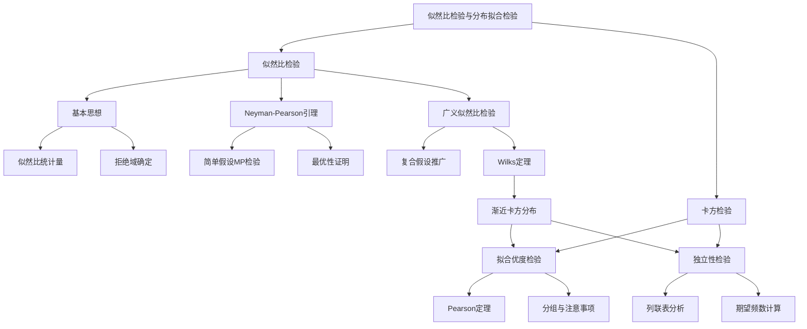

# 7.4 似然比检验与分布拟合检验

**相关笔记**：[[7.1 假设检验的基本思想与概念]] | [[7.2 正态总体参数的假设检验]] | [[7.3 其他分布参数的假设检验]] | [[6.3 最大似然估计与EM算法]] | [[5.4 三大抽样分布]] | [[4.4 中心极限定理]]

> [!abstract] 本节概览
> 本节介绍两种重要的检验方法：==似然比检验==和==卡方检验==。似然比检验是一种具有优良统计性质的通用检验方法，其核心思想是比较原假设和备择假设下的似然函数之比。==卡方拟合优度检验==用于检验总体分布是否服从某个指定分布，==独立性检验==（列联表卡方检验）用于检验两个分类变量是否独立。
>
> **逻辑链条**：[[#一、似然比检验的基本思想|似然比思想]] → [[#二、Neyman-Pearson引理|最优检验]] → [[#三、广义似然比检验|广义似然比]] → [[#四、卡方拟合优度检验|拟合优度]] → [[#五、独立性检验|独立性检验]] → [[#六、卡方检验汇总|汇总]]
>
> **前置依赖**：[[7.1 假设检验的基本思想与概念|§7.1]]（假设检验基本概念）、[[6.3 最大似然估计与EM算法|§6.3]]（MLE、似然函数）、[[5.4 三大抽样分布|§5.4]]（卡方分布）、[[7.3 其他分布参数的假设检验|§7.3]]（大样本检验）
>
> **核心主线**：似然比检验的核心是"比较两个假设下数据的似然程度"。Neyman-Pearson引理证明了简单假设下似然比检验是最优检验（MP检验）。广义似然比检验将此思想推广到复合假设。卡方检验是广义似然比检验在大样本下的渐近等价形式，广泛应用于分布拟合和独立性检验。

---

## 一、似然比检验的基本思想

在[[7.1 假设检验的基本思想与概念|§7.1]]中，我们介绍了假设检验的基本框架：给定原假设 $H_0$ 和备择假设 $H_1$，构造检验统计量，确定拒绝域，使得犯第一类错误的概率不超过显著性水平 $\alpha$。然而，§7.1和§7.2中的检验方法都是针对特定分布和特定参数设计的，缺乏统一的构造思路。似然比检验提供了一种==通用的检验构造方法==，其核心思想非常直观：**比较数据在原假设下和在全参数空间下的似然程度**。

### 似然比统计量

> [!def] 定义 7.4.1 — 似然比统计量
> 设样本 $X_1, X_2, \ldots, X_n$ 的联合密度（或概率函数）为 $f(x_1, x_2, \ldots, x_n; \theta)$，参数 $\theta \in \Theta$。考虑假设检验问题
> $$
> H_0: \theta \in \Theta_0 \quad \text{vs} \quad H_1: \theta \in \Theta_1 = \Theta \setminus \Theta_0
> $$
> 其中 $\Theta_0 \subset \Theta$。定义**似然比统计量**为
> $$
> \Lambda = \frac{\sup_{\theta \in \Theta_0} L(\theta)}{\sup_{\theta \in \Theta} L(\theta)} = \frac{\sup_{\theta \in \Theta_0} \prod_{i=1}^{n} f(x_i; \theta)}{\sup_{\theta \in \Theta} \prod_{i=1}^{n} f(x_i; \theta)}
> $$
> 其中 $L(\theta) = \prod_{i=1}^{n} f(x_i; \theta)$ 为[[6.3 最大似然估计与EM算法|似然函数]]。

**似然比统计量的基本性质**：

1. **取值范围**：由于 $\Theta_0 \subset \Theta$，分子是分母的某个子集上的上确界，因此
$$
0 \leqslant \Lambda \leqslant 1
$$

2. **直观含义**：
   - $\Lambda$ 接近 $1$：数据在 $H_0$ 下的最大似然与在全参数空间下的最大似然几乎相同，说明 $H_0$ 对数据的解释能力与无限制模型相当，**不拒绝 $H_0$**。
   - $\Lambda$ 接近 $0$：数据在 $H_0$ 下的最大似然远小于在全参数空间下的最大似然，说明 $H_0$ 对数据的解释能力很差，**拒绝 $H_0$**。

3. **拒绝域**：似然比检验的拒绝域形如
$$
W = \{\Lambda \leqslant c\}
$$
其中临界值 $c$ 由显著性水平 $\alpha$ 确定：$P_{\theta_0}(\Lambda \leqslant c) = \alpha$。

### 直观理解

可以用一个生活类比来理解似然比检验的思想：

> **类比**：假设你是一名侦探，要判断嫌疑人是否有罪（$H_0$：无罪 vs $H_1$：有罪）。你收集了证据（数据），现在要评估这些证据在"无罪"假设下的合理性。如果证据在"有罪"假设下很容易解释，但在"无罪"假设下几乎不可能出现（$\Lambda$ 很小），你就倾向于拒绝"无罪"假设。

**关键公式**：等价地，可以使用对数似然比
$$
\ln\Lambda = \sup_{\theta \in \Theta_0} \ln L(\theta) - \sup_{\theta \in \Theta} \ln L(\theta)
$$
由于对数函数是单调递增的，$\Lambda \leqslant c$ 等价于 $\ln\Lambda \leqslant \ln c$。实际计算中，对数似然比更为方便。

> [!example] 例题 7.4.1
> 设 $X_1, X_2, \ldots, X_n \overset{\text{iid}}{\sim} N(\mu, \sigma^2)$，其中 $\sigma^2$ 已知。考虑检验问题
> $$
> H_0: \mu = \mu_0 \quad \text{vs} \quad H_1: \mu \neq \mu_0
> $$
> 求似然比统计量。
>
> **解**：似然函数为
> $$
> L(\mu) = (2\pi\sigma^2)^{-n/2} \exp\left\{-\frac{1}{2\sigma^2}\sum_{i=1}^{n}(x_i - \mu)^2\right\}
> $$
>
> 在 $H_0$ 下，$\mu = \mu_0$，似然函数值为
> $$
> L(\mu_0) = (2\pi\sigma^2)^{-n/2} \exp\left\{-\frac{1}{2\sigma^2}\sum_{i=1}^{n}(x_i - \mu_0)^2\right\}
> $$
>
> 在全参数空间 $\Theta = (-\infty, +\infty)$ 上，MLE为 $\hat{\mu} = \bar{X}$，最大似然值为
> $$
> L(\hat{\mu}) = (2\pi\sigma^2)^{-n/2} \exp\left\{-\frac{1}{2\sigma^2}\sum_{i=1}^{n}(x_i - \bar{x})^2\right\}
> $$
>
> 因此似然比为
> $$
> \Lambda = \frac{L(\mu_0)}{L(\hat{\mu})} = \exp\left\{-\frac{n}{2\sigma^2}(\bar{x} - \mu_0)^2\right\}
> $$
>
> 取对数得
> $$
> \ln\Lambda = -\frac{n}{2\sigma^2}(\bar{x} - \mu_0)^2
> $$
>
> 因此 $\Lambda \leqslant c$ 等价于 $|\bar{x} - \mu_0| \geqslant d$，这正是[[7.2 正态总体参数的假设检验|§7.2]]中的 $u$ 检验的拒绝域。这说明 $u$ 检验本质上是似然比检验。

---

## 二、Neyman-Pearson引理

Neyman-Pearson引理（N-P引理）是假设检验理论中最基本、最重要的定理之一。它证明了在**简单假设**检验问题中，==似然比检验是最优势检验==（Most Powerful test，简称MP检验）。

### 最优势检验

> [!def] 定义 7.4.2 — 最优势检验（MP检验）
> 考虑简单假设检验问题
> $$
> H_0: \theta = \theta_0 \quad \text{vs} \quad H_1: \theta = \theta_1
> $$
> 设 $\phi$ 是一个检验函数（即拒绝 $H_0$ 的概率），满足水平条件
> $$
> E_{\theta_0}[\phi(X)] \leqslant \alpha
> $$
> 如果对任何其他满足水平条件的检验函数 $\phi^*$，都有
> $$
> E_{\theta_1}[\phi(X)] \geqslant E_{\theta_1}[\phi^*(X)]
> $$
> 则称 $\phi$ 为水平 $\alpha$ 的**最优势检验**（MP检验）。

**检验函数的含义**：检验函数 $\phi(x)$ 表示在观测值为 $x$ 时拒绝 $H_0$ 的概率。对于非随机化检验，$\phi(x) \in \{0, 1\}$；对于随机化检验，$\phi(x) \in [0, 1]$。

### Neyman-Pearson引理

> [!thm] 定理 7.4.1 — Neyman-Pearson引理
> 设 $X_1, X_2, \ldots, X_n$ 的联合密度为 $f(x; \theta)$，考虑简单假设检验问题
> $$
> H_0: \theta = \theta_0 \quad \text{vs} \quad H_1: \theta = \theta_1
> $$
> 设似然比为
> $$
> \Lambda(x) = \frac{f(x; \theta_0)}{f(x; \theta_1)}
> $$
> 则对给定的显著性水平 $\alpha \in (0, 1)$：
>
> **（1）存在性**：存在常数 $k \geqslant 0$ 和 $r \in [0, 1]$，使得检验函数
> $$
> \phi(x) = \begin{cases} 1, & \Lambda(x) < k \\ r, & \Lambda(x) = k \\ 0, & \Lambda(x) > k \end{cases}
> $$
> 是水平 $\alpha$ 的MP检验。
>
> **（2）充分性**：任何满足上述形式的检验函数都是水平 $\alpha$ 的MP检验。
>
> **（3）必要性**：如果 $\phi^*$ 是水平 $\alpha$ 的MP检验，则 $\phi^*$ 几乎处处具有上述形式（除去一个零测集外）。

> [!abstract] 证明
> **证明**：
>
> **第一步：构造检验函数并验证水平条件**。定义
> $$
> \phi(x) = \begin{cases} 1, & f(x;\theta_1) > k \cdot f(x;\theta_0) \\ r, & f(x;\theta_1) = k \cdot f(x;\theta_0) \\ 0, & f(x;\theta_1) < k \cdot f(x;\theta_0) \end{cases}
> $$
> 这里等价地使用了 $1/\Lambda(x) = f(x;\theta_1)/f(x;\theta_0)$ 的形式。选择 $k$ 和 $r$ 使得
> $$
> E_{\theta_0}[\phi(X)] = \alpha
> $$
> 这样的 $k$ 和 $r$ 总是存在的（通过调节 $k$，再在边界上用 $r$ 微调）。
>
> **第二步：证明 $\phi$ 是MP检验**。设 $\phi^*$ 是任意一个水平 $\alpha$ 的检验函数，即 $E_{\theta_0}[\phi^*(X)] \leqslant \alpha$。我们需要证明 $E_{\theta_1}[\phi(X)] \geqslant E_{\theta_1}[\phi^*(X)]$。
>
> 考虑积分差
> $$
> E_{\theta_1}[\phi(X)] - E_{\theta_1}[\phi^*(X)] = \int [\phi(x) - \phi^*(x)] f(x;\theta_1) \, dx
> $$
>
> 将样本空间分为三个区域：
> - $S_1 = \{x: f(x;\theta_1) > k \cdot f(x;\theta_0)\}$：此时 $\phi(x) = 1 \geqslant \phi^*(x)$，且 $f(x;\theta_1) - k \cdot f(x;\theta_0) > 0$，因此
> $$
> [\phi(x) - \phi^*(x)][f(x;\theta_1) - k \cdot f(x;\theta_0)] \geqslant 0
> $$
>
> - $S_2 = \{x: f(x;\theta_1) < k \cdot f(x;\theta_0)\}$：此时 $\phi(x) = 0 \leqslant \phi^*(x)$，且 $f(x;\theta_1) - k \cdot f(x;\theta_0) < 0$，因此
> $$
> [\phi(x) - \phi^*(x)][f(x;\theta_1) - k \cdot f(x;\theta_0)] \geqslant 0
> $$
>
> - $S_3 = \{x: f(x;\theta_1) = k \cdot f(x;\theta_0)\}$：此时 $f(x;\theta_1) - k \cdot f(x;\theta_0) = 0$，因此
> $$
> [\phi(x) - \phi^*(x)][f(x;\theta_1) - k \cdot f(x;\theta_0)] = 0
> $$
>
> 因此，对所有 $x$，都有
> $$
> [\phi(x) - \phi^*(x)][f(x;\theta_1) - k \cdot f(x;\theta_0)] \geqslant 0
> $$
>
> 积分得
> $$
> \int [\phi(x) - \phi^*(x)][f(x;\theta_1) - k \cdot f(x;\theta_0)] \, dx \geqslant 0
> $$
>
> 展开即
> $$
> \int [\phi(x) - \phi^*(x)] f(x;\theta_1) \, dx \geqslant k \int [\phi(x) - \phi^*(x)] f(x;\theta_0) \, dx
> $$
>
> 即
> $$
> E_{\theta_1}[\phi(X)] - E_{\theta_1}[\phi^*(X)] \geqslant k[E_{\theta_0}[\phi(X)] - E_{\theta_0}[\phi^*(X)]]
> $$
>
> 由于 $E_{\theta_0}[\phi(X)] = \alpha$ 且 $E_{\theta_0}[\phi^*(X)] \leqslant \alpha$，右端 $\geqslant k(\alpha - \alpha) = 0$。又因为 $k \geqslant 0$，所以
> $$
> E_{\theta_1}[\phi(X)] - E_{\theta_1}[\phi^*(X)] \geqslant 0
> $$
>
> **第三步：必要性的证明**。如果 $\phi^*$ 是水平 $\alpha$ 的MP检验，且 $\phi$ 也是水平 $\alpha$ 的MP检验，则必有 $E_{\theta_1}[\phi^*(X)] = E_{\theta_1}[\phi(X)]$。由第二步的不等式取等号的条件，$\phi^*$ 必须几乎处处与 $\phi$ 具有相同的形式。
> $\square$

### 似然比检验的等价形式

在实际应用中，似然比检验可以有多种等价形式，选择最便于计算的形式即可：

| 等价形式 | 拒绝域 | 说明 |
|:---|:---|:---|
| 似然比 | $\Lambda \leqslant c$ | 原始形式 |
| 对数似然比 | $\ln\Lambda \leqslant c'$ | 取对数，计算更方便 |
| 似然比倒数 | $1/\Lambda \geqslant c''$ | 有时更自然 |
| 检验统计量的单调函数 | $T(X) \geqslant c'''$ 或 $T(X) \leqslant c'''$ | 最常用的形式 |

> [!example] 例题 7.4.2
> 设 $X_1, X_2, \ldots, X_n \overset{\text{iid}}{\sim} N(\mu, 1)$，考虑检验
> $$
> H_0: \mu = 0 \quad \text{vs} \quad H_1: \mu = 1
> $$
> 求水平 $\alpha = 0.05$ 的MP检验。
>
> **解**：似然比为
> $$
> \Lambda(x) = \frac{f(x; 0)}{f(x; 1)} = \frac{(2\pi)^{-n/2}\exp\left\{-\frac{1}{2}\sum x_i^2\right\}}{(2\pi)^{-n/2}\exp\left\{-\frac{1}{2}\sum (x_i - 1)^2\right\}} = \exp\left\{-\frac{1}{2}\sum x_i^2 + \frac{1}{2}\sum (x_i - 1)^2\right\}
> $$
>
> 化简：
> $$
> \sum(x_i - 1)^2 - \sum x_i^2 = \sum(x_i^2 - 2x_i + 1) - \sum x_i^2 = -2n\bar{x} + n
> $$
>
> 因此
> $$
> \Lambda(x) = \exp\left\{-n\bar{x} + \frac{n}{2}\right\}
> $$
>
> $\Lambda \leqslant c$ 等价于 $-n\bar{x} + n/2 \leqslant \ln c$，即 $\bar{x} \geqslant 1/2 - (\ln c)/n$。
>
> 在 $H_0$ 下，$\bar{X} \sim N(0, 1/n)$，因此拒绝域为
> $$
> W = \left\{\bar{X} \geqslant \frac{1}{\sqrt{n}} \cdot u_{0.95}\right\} = \left\{\bar{X} \geqslant \frac{1.645}{\sqrt{n}}\right\}
> $$
>
> 这正是直觉上合理的：当样本均值显著大于 $0$ 时，拒绝 $\mu = 0$ 而接受 $\mu = 1$。

---

## 三、广义似然比检验

N-P引理只适用于简单假设（$H_0$ 和 $H_1$ 都是单点集），但实际问题中更常见的是==复合假设==（参数空间是一个集合）。广义似然比检验（Generalized Likelihood Ratio Test，GLRT）将似然比检验的思想推广到复合假设。

### 广义似然比统计量

> [!def] 定义 7.4.3 — 广义似然比统计量
> 设 $X_1, X_2, \ldots, X_n$ 的联合密度为 $f(x_1, \ldots, x_n; \theta)$，$\theta \in \Theta$。考虑复合假设检验问题
> $$
> H_0: \theta \in \Theta_0 \quad \text{vs} \quad H_1: \theta \in \Theta_1 = \Theta \setminus \Theta_0
> $$
> 定义**广义似然比统计量**为
> $$
> \Lambda = \frac{\sup_{\theta \in \Theta_0} L(\theta)}{\sup_{\theta \in \Theta} L(\theta)} = \frac{L(\hat{\theta}_0)}{L(\hat{\theta})}
> $$
> 其中 $\hat{\theta}_0 = \arg\sup_{\theta \in \Theta_0} L(\theta)$ 为 $H_0$ 下的[[6.3 最大似然估计与EM算法|最大似然估计]]（约束MLE），$\hat{\theta} = \arg\sup_{\theta \in \Theta} L(\theta)$ 为无约束MLE。
>
> 广义似然比检验的拒绝域为 $\{\Lambda \leqslant c\}$。

**与简单似然比的区别**：
- 简单似然比：$\Theta_0 = \{\theta_0\}$，$\Theta_1 = \{\theta_1\}$，分子分母都是单点值。
- 广义似然比：$\Theta_0$ 和 $\Theta$ 都是集合，分子分母都是上确界（通常用MLE代替）。

### Wilks定理（渐近分布）

> [!thm] 定理 7.4.2 — Wilks定理（广义似然比检验的渐近分布）
> 在一定的正则条件下，当 $H_0$ 成立且样本量 $n \to \infty$ 时，
> $$
> -2\ln\Lambda \xrightarrow{d} \chi^2(r)
> $$
> 其中 $r = \dim(\Theta) - \dim(\Theta_0)$ 为参数空间维数之差（即自由度）。
>
> 因此，对于大样本，水平 $\alpha$ 的近似拒绝域为
> $$
> W = \{-2\ln\Lambda \geqslant \chi^2_{1-\alpha}(r)\}
> $$

> [!abstract] 证明
> **证明**：（以下给出证明的要点和关键步骤）
>
> **第一步：对数似然函数的Taylor展开**。设 $\theta_0 \in \Theta_0$ 为真参数值，$\hat{\theta}$ 为全空间MLE，$\hat{\theta}_0$ 为约束MLE。在 $\theta_0$ 处对对数似然函数 $l(\theta) = \ln L(\theta)$ 进行二阶Taylor展开：
> $$
> l(\hat{\theta}) \approx l(\theta_0) + \nabla l(\theta_0)^T(\hat{\theta} - \theta_0) + \frac{1}{2}(\hat{\theta} - \theta_0)^T \cdot I(\theta_0) \cdot (\hat{\theta} - \theta_0)
> $$
> 其中 $I(\theta_0) = -\nabla^2 l(\theta_0)$ 为Fisher信息矩阵。
>
> **第二步：MLE的渐近正态性**。由MLE理论，
> $$
> \sqrt{n}(\hat{\theta} - \theta_0) \xrightarrow{d} N(0, I(\theta_0)^{-1})
> $$
> 且 $\nabla l(\theta_0)/\sqrt{n} \xrightarrow{d} N(0, I(\theta_0))$。
>
> **第三步：似然比统计量的渐近展开**。类似地，
> $$
> l(\hat{\theta}_0) \approx l(\theta_0) + \frac{1}{2}(\hat{\theta}_0 - \theta_0)^T \cdot I(\theta_0) \cdot (\hat{\theta}_0 - \theta_0)
> $$
>
> 因此，
> $$
> -2\ln\Lambda = -2[l(\hat{\theta}_0) - l(\hat{\theta})] \approx (\hat{\theta} - \hat{\theta}_0)^T \cdot I(\theta_0) \cdot (\hat{\theta} - \hat{\theta}_0)
> $$
>
> **第四步：利用二次型的渐近分布**。在 $H_0$ 下，$\hat{\theta}_0$ 和 $\hat{\theta}$ 都收敛到 $\theta_0$。可以证明
> $$
> (\hat{\theta} - \hat{\theta}_0)^T \cdot I(\theta_0) \cdot (\hat{\theta} - \hat{\theta}_0) \xrightarrow{d} \chi^2(r)
> $$
> 其中 $r = \dim(\Theta) - \dim(\Theta_0)$。这是因为约束 $\theta \in \Theta_0$ 相当于施加了 $r$ 个独立约束，每个约束贡献一个自由度。
> $\square$

### 广义似然比检验与前面各节检验的关系

广义似然比检验是一个统一的框架，前面各节中的检验方法大多可以看作广义似然比检验的特例：

| 检验方法 | 检验问题 | 广义似然比检验等价形式 |
|:---|:---|:---|
| $u$ 检验 | $H_0: \mu = \mu_0$（$\sigma^2$已知） | $-2\ln\Lambda = n(\bar{X}-\mu_0)^2/\sigma^2 \sim \chi^2(1)$ |
| $t$ 检验 | $H_0: \mu = \mu_0$（$\sigma^2$未知） | $-2\ln\Lambda \approx t^2$（渐近等价） |
| $\chi^2$ 检验 | $H_0: \sigma^2 = \sigma_0^2$（$\mu$未知） | $-2\ln\Lambda \approx (n-1)S^2/\sigma_0^2$ |
| $F$ 检验 | $H_0: \sigma_1^2 = \sigma_2^2$ | $-2\ln\Lambda \approx F$ 统计量 |

> [!example] 例题 7.4.3
> 设 $X_1, X_2, \ldots, X_n \overset{\text{iid}}{\sim} N(\mu, \sigma^2)$，$\mu$ 和 $\sigma^2$ 均未知。考虑检验
> $$
> H_0: \mu = \mu_0 \quad \text{vs} \quad H_1: \mu \neq \mu_0
> $$
> 求广义似然比检验。
>
> **解**：参数空间 $\Theta = \{(\mu, \sigma^2): \mu \in \mathbb{R}, \sigma^2 > 0\}$，$\Theta_0 = \{(\mu_0, \sigma^2): \sigma^2 > 0\}$。
>
> 全空间MLE：$\hat{\mu} = \bar{X}$，$\hat{\sigma}^2 = \frac{1}{n}\sum_{i=1}^{n}(X_i - \bar{X})^2$。
>
> 约束MLE（$H_0$ 下）：$\hat{\mu}_0 = \mu_0$，$\hat{\sigma}_0^2 = \frac{1}{n}\sum_{i=1}^{n}(X_i - \mu_0)^2$。
>
> 似然比为
> $$
> \Lambda = \frac{L(\mu_0, \hat{\sigma}_0^2)}{L(\hat{\mu}, \hat{\sigma}^2)} = \left(\frac{\hat{\sigma}^2}{\hat{\sigma}_0^2}\right)^{n/2}
> $$
>
> 注意到
> $$
> \hat{\sigma}_0^2 = \frac{1}{n}\sum_{i=1}^{n}(X_i - \mu_0)^2 = \frac{1}{n}\sum_{i=1}^{n}[(X_i - \bar{X}) + (\bar{X} - \mu_0)]^2 = \hat{\sigma}^2 + (\bar{X} - \mu_0)^2
> $$
>
> 因此
> $$
> \Lambda = \left(\frac{\hat{\sigma}^2}{\hat{\sigma}^2 + (\bar{X} - \mu_0)^2}\right)^{n/2} = \left(1 + \frac{(\bar{X} - \mu_0)^2}{\hat{\sigma}^2}\right)^{-n/2} = \left(1 + \frac{T^2}{n-1}\right)^{-n/2}
> $$
>
> 其中 $T = \frac{\sqrt{n}(\bar{X} - \mu_0)}{S}$ 为 $t$ 统计量。$\Lambda$ 是 $T^2$ 的单调递减函数，因此拒绝域 $\{\Lambda \leqslant c\}$ 等价于 $\{|T| \geqslant c'\}$，这正是[[7.2 正态总体参数的假设检验|$t$ 检验]]。

---

## 四、卡方拟合优度检验

在实际问题中，我们经常需要检验总体分布是否服从某个特定的分布。例如：骰子是否均匀？数据是否服从正态分布？这种问题属于==分布拟合检验==，==卡方拟合优度检验==是最常用的方法。

### 卡方拟合优度检验

> [!def] 定义 7.4.4 — 卡方拟合优度检验
> 设 $X_1, X_2, \ldots, X_n$ 为来自总体 $X$ 的样本，$F_0(x)$ 为某个已知的分布函数。检验问题为
> $$
> H_0: F(x) = F_0(x) \quad \text{vs} \quad H_1: F(x) \neq F_0(x)
> $$
>
> **检验步骤**：
>
> **（1）分组**：将实数轴分为 $k$ 个互不相交的区间 $A_1, A_2, \ldots, A_k$，使得 $\bigcup_{i=1}^{k} A_i = \mathbb{R}$。
>
> **（2）统计实际频数**：记 $O_i$ 为样本落入区间 $A_i$ 的实际频数（观测频数），$\sum_{i=1}^{k} O_i = n$。
>
> **（3）计算理论频数**：在 $H_0$ 下，样本落入 $A_i$ 的概率为
> $$
> p_i = P_{H_0}(X \in A_i) = F_0(A_i \text{ 的右端点}) - F_0(A_i \text{ 的左端点})
> $$
> 理论频数（期望频数）为 $E_i = n p_i$。
>
> **（4）计算检验统计量**：
> $$
> \chi^2 = \sum_{i=1}^{k} \frac{(O_i - E_i)^2}{E_i}
> $$
>
> **（5）确定拒绝域**：当 $H_0$ 成立时，$\chi^2$ 近似服从 $\chi^2(k - 1 - m)$ 分布，其中 $m$ 为用样本估计的 $F_0$ 中未知参数的个数。拒绝域为
> $$
> W = \left\{\chi^2 \geqslant \chi^2_{1-\alpha}(k - 1 - m)\right\}
> $$

### Pearson定理

> [!thm] 定理 7.4.3 — Pearson定理
> 设 $H_0: F(x) = F_0(x)$ 成立，其中 $F_0(x)$ 完全已知（不含未知参数，即 $m = 0$）。当 $n \to \infty$ 时，
> $$
> \chi^2 = \sum_{i=1}^{k} \frac{(O_i - E_i)^2}{E_i} \xrightarrow{d} \chi^2(k - 1)
> $$
>
> 如果 $F_0(x)$ 中含有 $m$ 个未知参数，需要先用样本估计这些参数（通常用MLE），此时自由度为 $k - 1 - m$。

> [!abstract] 证明
> **证明**：（以下给出 $m = 0$ 情况下的证明要点）
>
> **第一步：建立多项分布模型**。在 $H_0$ 下，每个样本点落入区间 $A_i$ 的概率为 $p_i$。记 $N_i$ 为落入 $A_i$ 的样本点数，则 $(N_1, N_2, \ldots, N_k) \sim \text{Multinomial}(n; p_1, p_2, \ldots, p_k)$。
>
> **第二步：标准化**。由[[4.4 中心极限定理|中心极限定理]]的多维版本，当 $n \to \infty$ 时，
> $$
> \sqrt{n}\left(\frac{N_i}{n} - p_i\right)_{i=1}^{k} \xrightarrow{d} N_k(0, \Sigma)
> $$
> 其中 $\Sigma = \text{diag}(p_1, \ldots, p_k) - pp^T$，$p = (p_1, \ldots, p_k)^T$。
>
> **第三步：二次型的分布**。$\Sigma$ 的秩为 $k - 1$（因为 $\sum p_i = 1$），因此
> $$
> \chi^2 = \sum_{i=1}^{k} \frac{(N_i - np_i)^2}{np_i} = n \sum_{i=1}^{k} \frac{(N_i/n - p_i)^2}{p_i}
> $$
> 可以表示为正态随机向量的二次型。由二次型的分布理论，当 $n \to \infty$ 时，
> $$
> \chi^2 \xrightarrow{d} \chi^2(k - 1)
> $$
>
> **第四步：含未知参数的情况**。当 $F_0$ 中含有 $m$ 个未知参数时，用MLE $\hat{\theta}$ 替换后，每个估计量消耗一个自由度，因此自由度从 $k - 1$ 减少到 $k - 1 - m$。这一结论由 Fisher (1924) 严格证明。
> $\square$

### 分组方法与注意事项

卡方拟合优度检验的检验功效与分组方式密切相关：

| 注意事项 | 说明 |
|:---|:---|
| 每组期望频数 $\geqslant 5$ | 这是保证 $\chi^2$ 近似精度的基本要求 |
| 通常取 $k = 5 \sim 15$ | 分组太少会损失信息，太多会导致期望频数过小 |
| 各组概率 $p_i$ 不宜过小 | 建议 $p_i \geqslant 0.05$ |
| 期望频数不足时合并相邻组 | 将期望频数 $< 5$ 的组与相邻组合并 |
| 分组方式应事先确定 | 不应先看数据再决定分组（否则影响检验的有效性） |

> [!example] 例题 7.4.4
> 某工厂声称其产品的不合格率服从 $p = 0.1$ 的二项分布。随机抽取 200 件产品进行检验，按每件产品的不合格特征分为4类，各类的观测频数如下：
>
> | 类别 | $A_1$ | $A_2$ | $A_3$ | $A_4$ |
> |:---|:---:|:---:|:---:|:---:|
> | 观测频数 $O_i$ | 120 | 55 | 18 | 7 |
> | 理论概率 $p_i$ | 0.6561 | 0.2916 | 0.0486 | 0.0037 |
>
> 在 $\alpha = 0.05$ 下检验 $H_0$: 产品分类服从 $p = 0.1$ 的二项分布。
>
> **解**：
>
> **（1）计算理论频数**：$E_i = n \times p_i = 200 \times p_i$。
>
> | 类别 | $A_1$ | $A_2$ | $A_3$ | $A_4$ |
> |:---|:---:|:---:|:---:|:---:|
> | $E_i$ | 131.22 | 58.32 | 9.72 | 0.74 |
>
> 注意 $E_4 = 0.74 < 5$，需要将 $A_3$ 和 $A_4$ 合并。
>
> **（2）合并后的计算**：
>
> | 类别 | $A_1$ | $A_2$ | $A_3 \cup A_4$ |
> |:---|:---:|:---:|:---:|
> | $O_i$ | 120 | 55 | 25 |
> | $E_i$ | 131.22 | 58.32 | 10.46 |
>
> **（3）计算 $\chi^2$ 统计量**：
> $$
> \chi^2 = \frac{(120 - 131.22)^2}{131.22} + \frac{(55 - 58.32)^2}{58.32} + \frac{(25 - 10.46)^2}{10.46}
> $$
> $$
> = \frac{125.89}{131.22} + \frac{11.02}{58.32} + \frac{211.21}{10.46} = 0.96 + 0.19 + 20.19 = 21.34
> $$
>
> **（4）查表判断**：自由度 $= k - 1 = 3 - 1 = 2$，$\chi^2_{0.95}(2) = 5.991$。
>
> 因为 $\chi^2 = 21.34 > 5.991$，所以**拒绝 $H_0$**，即产品分类不服从 $p = 0.1$ 的二项分布。

> [!example] 例题 7.4.5
> 在某公路上，50分钟内记录每15秒区间内到达的车辆数，得到如下数据：
>
> | 到达车辆数 $k$ | 0 | 1 | 2 | 3 | 4 | $\geqslant 5$ |
> |:---|:---:|:---:|:---:|:---:|:---:|:---:|
> | 观测频数 $O_k$ | 4 | 14 | 23 | 16 | 8 | 5 |
>
> 在 $\alpha = 0.05$ 下检验到达车辆数是否服从泊松分布。
>
> **解**：
>
> **（1）估计参数**。泊松分布 $P(\lambda)$ 中 $\lambda$ 未知，先估计：
> $$
> \hat{\lambda} = \bar{x} = \frac{0 \times 4 + 1 \times 14 + 2 \times 23 + 3 \times 16 + 4 \times 8 + 5 \times 5}{70} = \frac{161}{70} \approx 2.3
> $$
>
> **（2）计算理论概率和期望频数**。$p_k = e^{-2.3} \cdot 2.3^k / k!$，$E_k = 70 \cdot p_k$。
>
> | $k$ | 0 | 1 | 2 | 3 | 4 | $\geqslant 5$ |
> |:---|:---:|:---:|:---:|:---:|:---:|:---:|
> | $p_k$ | 0.1003 | 0.2306 | 0.2652 | 0.2033 | 0.1169 | 0.0837 |
> | $E_k$ | 7.02 | 16.14 | 18.56 | 14.23 | 8.18 | 5.86 |
>
> 所有 $E_k \geqslant 5$，无需合并。
>
> **（3）计算 $\chi^2$ 统计量**：
> $$
> \chi^2 = \frac{(4-7.02)^2}{7.02} + \frac{(14-16.14)^2}{16.14} + \frac{(23-18.56)^2}{18.56} + \frac{(16-14.23)^2}{14.23} + \frac{(8-8.18)^2}{8.18} + \frac{(5-5.86)^2}{5.86}
> $$
> $$
> = 1.30 + 0.28 + 1.06 + 0.22 + 0.004 + 0.13 = 2.99
> $$
>
> **（4）查表判断**：自由度 $= k - 1 - m = 6 - 1 - 1 = 4$，$\chi^2_{0.95}(4) = 9.488$。
>
> 因为 $\chi^2 = 2.99 < 9.488$，所以**不拒绝 $H_0$**，即数据与泊松分布无显著差异。

---

## 五、独立性检验

独立性检验是卡方检验的另一个重要应用，用于检验两个==分类变量==之间是否相互独立。数据通常以==列联表==（Contingency Table）的形式呈现。

### 列联表与独立性检验

> [!def] 定义 7.4.5 — 列联表与独立性检验
> 设有两个分类变量 $X$ 和 $Y$，$X$ 有 $r$ 个水平，$Y$ 有 $c$ 个水平。从总体中随机抽取 $n$ 个个体，按 $(X, Y)$ 的取值分类，得到 $r \times c$ **列联表**：
>
> | | $Y_1$ | $Y_2$ | $\cdots$ | $Y_c$ | **行合计** |
> |:---|:---:|:---:|:---:|:---:|:---:|
> | $X_1$ | $O_{11}$ | $O_{12}$ | $\cdots$ | $O_{1c}$ | $O_{1\cdot}$ |
> | $X_2$ | $O_{21}$ | $O_{22}$ | $\cdots$ | $O_{2c}$ | $O_{2\cdot}$ |
> | $\vdots$ | $\vdots$ | $\vdots$ | $\ddots$ | $\vdots$ | $\vdots$ |
> | $X_r$ | $O_{r1}$ | $O_{r2}$ | $\cdots$ | $O_{rc}$ | $O_{r\cdot}$ |
> | **列合计** | $O_{\cdot 1}$ | $O_{\cdot 2}$ | $\cdots$ | $O_{\cdot c}$ | $n$ |
>
> 其中 $O_{ij}$ 为 $(X_i, Y_j)$ 的观测频数，$O_{i\cdot} = \sum_{j=1}^{c} O_{ij}$，$O_{\cdot j} = \sum_{i=1}^{r} O_{ij}$。
>
> 检验问题为
> $$
> H_0: X \text{ 与 } Y \text{ 独立} \quad \text{vs} \quad H_1: X \text{ 与 } Y \text{ 不独立}
> $$
>
> **检验统计量**：
> $$
> \chi^2 = \sum_{i=1}^{r}\sum_{j=1}^{c} \frac{(O_{ij} - E_{ij})^2}{E_{ij}}
> $$
>
> 其中**期望频数**为
> $$
> E_{ij} = \frac{O_{i\cdot} \cdot O_{\cdot j}}{n}
> $$
>
> 在 $H_0$ 成立且 $n$ 充分大时，$\chi^2 \xrightarrow{d} \chi^2((r-1)(c-1))$。

**期望频数的推导**：在 $H_0$（$X$ 与 $Y$ 独立）下，
$$
P(X = X_i, Y = Y_j) = P(X = X_i) \cdot P(Y = Y_j) \approx \frac{O_{i\cdot}}{n} \cdot \frac{O_{\cdot j}}{n}
$$
因此期望频数
$$
E_{ij} = n \cdot P(X = X_i, Y = Y_j) \approx n \cdot \frac{O_{i\cdot}}{n} \cdot \frac{O_{\cdot j}}{n} = \frac{O_{i\cdot} \cdot O_{\cdot j}}{n}
$$

### 独立性检验的渐近分布

> [!thm] 定理 7.4.4 — 独立性检验的渐近分布
> 在 $H_0$（$X$ 与 $Y$ 独立）成立且 $n \to \infty$ 时，
> $$
> \chi^2 = \sum_{i=1}^{r}\sum_{j=1}^{c} \frac{(O_{ij} - E_{ij})^2}{E_{ij}} \xrightarrow{d} \chi^2((r-1)(c-1))
> $$
> 自由度为 $(r-1)(c-1)$ 的直观理解：$r \times c$ 列联表有 $rc$ 个格子，但受到行合计和列合计的约束（$\sum_j O_{ij} = O_{i\cdot}$ 给出 $r$ 个约束，$\sum_i O_{ij} = O_{\cdot j}$ 给出 $c$ 个约束，但 $\sum_i O_{i\cdot} = \sum_j O_{\cdot j} = n$ 使得总约束数为 $r + c - 1$），因此自由度为 $rc - (r + c - 1) = (r-1)(c-1)$。

> [!example] 例题 7.4.6（$2 \times 2$ 列联表）
> 调查200名患者，研究某种新药是否有效，得到如下 $2 \times 2$ 列联表：
>
> | | 有效 | 无效 | 合计 |
> |:---|:---:|:---:|:---:|
> | 用药组 | 60 | 40 | 100 |
> | 对照组 | 35 | 65 | 100 |
> | 合计 | 95 | 105 | 200 |
>
> 在 $\alpha = 0.05$ 下检验药物是否有效。
>
> **解**：$H_0$: 药物与疗效独立 vs $H_1$: 药物与疗效不独立。
>
> **（1）计算期望频数**：
> $$
> E_{11} = \frac{100 \times 95}{200} = 47.5, \quad E_{12} = \frac{100 \times 105}{200} = 52.5
> $$
> $$
> E_{21} = \frac{100 \times 95}{200} = 47.5, \quad E_{22} = \frac{100 \times 105}{200} = 52.5
> $$
>
> **（2）计算 $\chi^2$ 统计量**：
> $$
> \chi^2 = \frac{(60-47.5)^2}{47.5} + \frac{(40-52.5)^2}{52.5} + \frac{(35-47.5)^2}{47.5} + \frac{(65-52.5)^2}{52.5}
> $$
> $$
> = \frac{156.25}{47.5} + \frac{156.25}{52.5} + \frac{156.25}{47.5} + \frac{156.25}{52.5}
> $$
> $$
> = 3.289 + 2.976 + 3.289 + 2.976 = 12.53
> $$
>
> **（3）查表判断**：自由度 $= (2-1)(2-1) = 1$，$\chi^2_{0.95}(1) = 3.841$。
>
> 因为 $\chi^2 = 12.53 > 3.841$，所以**拒绝 $H_0$**，即药物与疗效有关（药物有效）。
>
> **注**：对于 $2 \times 2$ 列联表，也可以使用 Yates 连续性修正：
> $$
> \chi^2_{\text{Yates}} = \sum_{i=1}^{2}\sum_{j=1}^{2} \frac{(|O_{ij} - E_{ij}| - 0.5)^2}{E_{ij}}
> $$

> [!example] 例题 7.4.7（$r \times c$ 列联表）
> 调查不同年龄段人群对某项政策的满意度，得到如下 $3 \times 3$ 列联表：
>
> | | 满意 | 一般 | 不满意 | 合计 |
> |:---|:---:|:---:|:---:|:---:|
> | 青年 | 30 | 40 | 30 | 100 |
> | 中年 | 45 | 35 | 20 | 100 |
> | 老年 | 55 | 25 | 20 | 100 |
> | 合计 | 130 | 100 | 70 | 300 |
>
> 在 $\alpha = 0.05$ 下检验满意度与年龄是否独立。
>
> **解**：$H_0$: 满意度与年龄独立 vs $H_1$: 满意度与年龄不独立。
>
> **（1）计算期望频数**：
> $$
> E_{11} = \frac{100 \times 130}{300} = 43.33, \quad E_{12} = \frac{100 \times 100}{300} = 33.33, \quad E_{13} = \frac{100 \times 70}{300} = 23.33
> $$
> $$
> E_{21} = 43.33, \quad E_{22} = 33.33, \quad E_{23} = 23.33
> $$
> $$
> E_{31} = 43.33, \quad E_{32} = 33.33, \quad E_{33} = 23.33
> $$
>
> **（2）计算 $\chi^2$ 统计量**：
> $$
> \chi^2 = \sum_{i=1}^{3}\sum_{j=1}^{3} \frac{(O_{ij} - E_{ij})^2}{E_{ij}}
> $$
> $$
> = \frac{(30-43.33)^2}{43.33} + \frac{(40-33.33)^2}{33.33} + \frac{(30-23.33)^2}{23.33} + \frac{(45-43.33)^2}{43.33} + \frac{(35-33.33)^2}{33.33} + \frac{(20-23.33)^2}{23.33} + \frac{(55-43.33)^2}{43.33} + \frac{(25-33.33)^2}{33.33} + \frac{(20-23.33)^2}{23.33}
> $$
> $$
> = 4.10 + 1.33 + 1.91 + 0.06 + 0.08 + 0.48 + 3.14 + 2.08 + 0.48 = 13.66
> $$
>
> **（3）查表判断**：自由度 $= (3-1)(3-1) = 4$，$\chi^2_{0.95}(4) = 9.488$。
>
> 因为 $\chi^2 = 13.66 > 9.488$，所以**拒绝 $H_0$**，即满意度与年龄有关。

---

## 六、卡方检验汇总

### 三种卡方检验的对比

| 检验类型 | 检验问题 | 检验统计量 | 自由度 | 应用场景 |
|:---|:---|:---|:---:|:---|
| 拟合优度检验 | $H_0$: 总体分布为 $F_0(x)$ | $\sum \frac{(O_i - E_i)^2}{E_i}$ | $k - 1 - m$ | 检验数据是否服从某分布 |
| 独立性检验 | $H_0$: 两变量独立 | $\sum \sum \frac{(O_{ij} - E_{ij})^2}{E_{ij}}$ | $(r-1)(c-1)$ | 检验两分类变量的独立性 |
| 齐性检验 | $H_0$: 多个总体分布相同 | $\sum \sum \frac{(O_{ij} - E_{ij})^2}{E_{ij}}$ | $(r-1)(c-1)$ | 检验多个总体比例是否一致 |

**注**：独立性检验和齐性检验的统计量和自由度完全相同，但抽样方式不同：
- **独立性检验**：从单一总体中抽取 $n$ 个个体，然后按两个变量交叉分类。
- **齐性检验**：从 $r$ 个总体中分别抽取样本，比较各总体中各水平的比例。

### 卡方检验的适用条件

1. **样本量充分大**：保证 $\chi^2$ 近似分布的精度。
2. **期望频数要求**：所有 $E_i \geqslant 1$，且至少 $80\%$ 的 $E_i \geqslant 5$（Cochran准则）。
3. **独立性**：各观测值相互独立。
4. **互斥完备**：每个观测值恰好落入一个类别。
5. **固定样本量**（对于独立性检验）：总样本量 $n$ 在抽样前确定。

### 卡方检验与似然比检验的关系

卡方检验与似然比检验之间存在深刻的联系：

1. **渐近等价性**：对于多项分布数据，Pearson $\chi^2$ 统计量和似然比 $\chi^2$ 统计量（$G^2 = 2\sum O_i \ln(O_i/E_i)$）在 $H_0$ 下具有相同的渐近 $\chi^2$ 分布，且渐近等价。

2. **数值关系**：$G^2 \leqslant \chi^2_{\text{Pearson}}$（对于同样的数据），当 $H_0$ 成立时两者差距很小。

3. **统一框架**：卡方检验可以看作广义似然比检验在离散数据（多项分布）下的具体实现。Pearson $\chi^2$ 统计量是似然比 $\chi^2$ 统计量的二阶Taylor展开近似。

---

## 七、知识结构总览

---

## 八、核心思想与解题技巧

### 似然比检验解题步骤

> [!tip] 似然比检验的标准解题流程
> 1. **写出似然函数** $L(\theta) = \prod_{i=1}^{n} f(x_i; \theta)$。
> 2. **求全空间MLE** $\hat{\theta} = \arg\max_{\theta \in \Theta} L(\theta)$。
> 3. **求约束MLE** $\hat{\theta}_0 = \arg\max_{\theta \in \Theta_0} L(\theta)$。
> 4. **计算似然比** $\Lambda = L(\hat{\theta}_0) / L(\hat{\theta})$。
> 5. **化简**：利用单调变换将 $\Lambda \leqslant c$ 转化为更简单的检验统计量。
> 6. **确定拒绝域**：利用Wilks定理（$-2\ln\Lambda \sim \chi^2(r)$）或精确分布。
> 7. **计算统计量值并判断**。

### 卡方检验解题步骤

> [!tip] 卡方检验的标准解题流程
>
> **拟合优度检验**：
> 1. 建立假设 $H_0$: 总体分布为 $F_0(x)$。
> 2. 如有未知参数，用MLE估计。
> 3. 分组并统计观测频数 $O_i$。
> 4. 计算理论概率 $p_i$ 和期望频数 $E_i = np_i$。
> 5. 检查期望频数，必要时合并。
> 6. 计算 $\chi^2 = \sum (O_i - E_i)^2 / E_i$。
> 7. 查 $\chi^2_{1-\alpha}(k-1-m)$ 表并判断。
>
> **独立性检验**：
> 1. 建立假设 $H_0$: 两变量独立。
> 2. 列出列联表，计算行合计和列合计。
> 3. 计算期望频数 $E_{ij} = O_{i\cdot} \cdot O_{\cdot j} / n$。
> 4. 检查期望频数，必要时合并。
> 5. 计算 $\chi^2 = \sum\sum (O_{ij} - E_{ij})^2 / E_{ij}$。
> 6. 查 $\chi^2_{1-\alpha}((r-1)(c-1))$ 表并判断。

### 常见题型总结

| 题型 | 关键步骤 | 易错点 |
|:---|:---|:---|
| 求似然比统计量 | 分别求约束和无约束MLE | 忘记约束条件 |
| 证明某检验是似然比检验 | 化简 $\Lambda$，利用单调性 | 忽略等价形式 |
| 卡方拟合优度检验 | 正确计算 $p_i$ 和 $E_i$ | 忘记合并期望频数 $< 5$ 的组 |
| 独立性检验 | 正确计算 $E_{ij}$ | 混淆观测频数和期望频数 |
| 自由度计算 | $k - 1 - m$ 或 $(r-1)(c-1)$ | 忘记减去估计参数个数 $m$ |

---

## 九、补充理解与易混淆点

### 误区一："似然比检验总是最优的"

**正确理解**：N-P引理仅保证在==简单假设==（$H_0: \theta = \theta_0$ vs $H_1: \theta = \theta_1$）下，似然比检验是MP检验。对于复合假设，广义似然比检验==不一定最优==，只是在大样本下具有优良性质（渐近最优）。在有限样本下，可能存在比GLRT更好的检验。

**来源**：茆诗松《概率论与数理统计》第七章、Lehmann & Romano "Testing Statistical Hypotheses" Ch. 3、Casella & Berger "Statistical Inference" §8.3、[RPI论文：GLRT并非总是最优](https://sites.ecse.rpi.edu/~tajer/papers/J17.pdf)、[Bookey书评摘要](https://www.bookey.app/book/mathematical-statistics-and-data-analysis)

### 误区二："卡方检验的分组越多越好"

**正确理解**：分组数 $k$ 影响检验的自由度和功效。分组太少会损失信息（自由度低），分组太多会导致==期望频数过小==，使 $\chi^2$ 近似失效。通常取 $k$ 使得每组期望频数 $\geqslant 5$，同时 $k$ 不宜超过 15-20。

**来源**：茆诗松《概率论与数理统计》第七章、Pearson (1900) 原论文、[Minitab官方文档](https://support.minitab.com/en-us/minitab/21/help-and-how-to/statistics/tables/supporting-topics/chi-square/are-the-results-of-my-chi-square-test-invalid/)、[NIST Dataplot文档](https://itl.nist.gov/div898/software/dataplot/refman1/auxillar/chistest.htm)、[LibreTexts统计教材](https://stats.libretexts.org/Sandboxes/rick.howe_at_canyons.edu/Learning_Statistics_with_SPSS_-_A_Tutorial_for_Psychology_Students_and_Other_Beginners/09%3A_Categorical_Data_Analysis/9.05%3A_Assumptions_of_the_Test(s))

### 误区三："列联表卡方检验要求样本量很大"

**正确理解**：卡方检验的要求不是"样本量大"，而是==每格期望频数 $\geqslant 5$==（更宽松的要求是：所有 $E_{ij} \geqslant 1$，且至少 $80\%$ 的 $E_{ij} \geqslant 5$）。对于 $2 \times 2$ 列联表，当期望频数不满足要求时，应使用Fisher精确检验。

**来源**：茆诗松《概率论与数理统计》第七章、Cochran (1952) 经典文献、[The Analysis Factor博客](https://www.theanalysisfactor.com/chi-square-test-of-independence-rule-of-thumb/)、[UT Austin统计服务](https://sites.utexas.edu/sos/guided/inferential/categorical/chi2/)、[StatCalculators](https://statcalculators.com/chi-square-test-of-independence-rule-of-thumb-n-5/)

### 误区四："拟合优度检验的p值很小就说明分布完全不对"

**正确理解**：$p$ 值小只说明在 $H_0$ 成立的条件下，观测到当前或更极端数据的概率很低，即数据与假设分布==不一致==。这不意味着假设分布"完全不对"——可能只是样本量很大使得微小差异也被检测出来，也可能是因为分组方式不当。应结合效应量（如残差分析）综合判断。

**来源**：茆诗松《概率论与数理统计》第七章、[[7.1 假设检验的基本思想与概念|§7.1]]（p值含义）、Cohen (1994) "The Earth Is Round (p < .05)"、[Minitab官方文档](https://support.minitab.com/en-us/minitab/21/help-and-how-to/statistics/tables/supporting-topics/chi-square/are-the-results-of-my-chi-square-test-invalid/)、[NIST Dataplot文档](https://itl.nist.gov/div898/software/dataplot/refman1/auxillar/chistest.htm)

### 误区五："似然比检验和卡方检验是两种不同的方法"

**正确理解**：卡方检验本质上是==似然比检验在大样本下的渐近等价形式==。对于多项分布数据，Pearson $\chi^2$ 统计量 $\sum (O_i - E_i)^2/E_i$ 是似然比 $\chi^2$ 统计量 $G^2 = 2\sum O_i \ln(O_i/E_i)$ 的二阶Taylor展开近似。两者在 $H_0$ 下渐近等价，具有相同的极限分布。

**来源**：茆诗松《概率论与数理统计》第七章、[UCSD CSE 291讲义](https://cseweb.ucsd.edu/~elkan/291winter2005/feb17.html)、[UChicago STAT 244讲义](https://galton.uchicago.edu/~yibi/teaching/stat244/L19.pdf)、Casella & Berger "Statistical Inference" §10.5、Agresti "Categorical Data Analysis" Ch. 3

---

## 十、习题精选

> [!todo] 习题概览
> **教材习题（6题）**：习题1-6（似然比检验、卡方拟合优度检验、独立性检验）
> **考研真题（4题）**：真题7-10（卡方检验综合应用）
>
> | 编号 | 题目类型 | 难度 | 来源 |
> |:---:|:---|:---:|:---|
> | 1 | 似然比统计量计算 | $\star\star$ | 教材 |
> | 2 | N-P引理应用 | $\star\star\star$ | 教材 |
> | 3 | 广义似然比检验 | $\star\star\star$ | 教材 |
> | 4 | 卡方拟合优度检验 | $\star\star$ | 教材 |
> | 5 | 独立性检验 | $\star\star$ | 教材 |
> | 6 | 卡方检验综合 | $\star\star\star$ | 教材 |
> | 7 | 卡方拟合优度 | $\star\star$ | 考研真题 |
> | 8 | 列联表独立性 | $\star\star\star$ | 考研真题 |
> | 9 | 泊松分布拟合 | $\star\star\star$ | 考研真题 |
> | 10 | 正态分布拟合 | $\star\star\star$ | 考研真题 |

### 教材习题

**习题1**：设 $X_1, X_2, \ldots, X_n \overset{\text{iid}}{\sim} \text{Exp}(\lambda)$，考虑检验 $H_0: \lambda = \lambda_0$ vs $H_1: \lambda = \lambda_1$（$\lambda_1 > \lambda_0$）。求似然比检验的拒绝域。

**解**：指数分布的密度为 $f(x; \lambda) = \lambda e^{-\lambda x}$（$x > 0$）。

似然函数为
$$
L(\lambda) = \lambda^n \exp\left\{-\lambda \sum_{i=1}^{n} x_i\right\} = \lambda^n e^{-\lambda n \bar{x}}
$$

似然比为
$$
\Lambda = \frac{L(\lambda_0)}{L(\lambda_1)} = \left(\frac{\lambda_0}{\lambda_1}\right)^n \exp\left\{-(\lambda_0 - \lambda_1) n \bar{x}\right\}
$$

由于 $\lambda_1 > \lambda_0$，$\lambda_0 - \lambda_1 < 0$，因此 $\Lambda$ 是 $\bar{x}$ 的单调递增函数。

$\Lambda \leqslant c$ 等价于 $\bar{x} \leqslant c'$。

在 $H_0$ 下，$2n\lambda_0 \bar{X} \sim \chi^2(2n)$（因为 $X_i \sim \text{Exp}(\lambda_0)$ 等价于 $2\lambda_0 X_i \sim \chi^2(2)$）。

拒绝域为
$$
W = \left\{\bar{X} \leqslant \frac{\chi^2_{\alpha}(2n)}{2n\lambda_0}\right\}
$$

---

**习题2**：设 $X_1, X_2, \ldots, X_n \overset{\text{iid}}{\sim} U(0, \theta)$，考虑检验 $H_0: \theta = \theta_0$ vs $H_1: \theta = \theta_1$（$\theta_1 > \theta_0$）。求水平 $\alpha$ 的MP检验。

**解**：均匀分布 $U(0, \theta)$ 的密度为 $f(x; \theta) = 1/\theta$（$0 < x < \theta$）。

似然函数为
$$
L(\theta) = \begin{cases} \theta^{-n}, & 0 < x_{(n)} < \theta \\ 0, & \text{其他} \end{cases}
$$

其中 $x_{(n)} = \max\{x_1, \ldots, x_n\}$。

似然比为
$$
\Lambda = \frac{L(\theta_0)}{L(\theta_1)} = \begin{cases} (\theta_1/\theta_0)^n, & x_{(n)} \leqslant \theta_0 \\ +\infty, & \theta_0 < x_{(n)} \leqslant \theta_1 \\ 0, & x_{(n)} > \theta_1 \end{cases}
$$

当 $\theta_1 > \theta_0$ 时，$\Lambda \leqslant c$ 等价于 $x_{(n)} > \theta_0$（当 $c < (\theta_1/\theta_0)^n$ 时）。

在 $H_0$ 下，$X_{(n)}$ 的分布函数为 $F(t) = (t/\theta_0)^n$（$0 < t < \theta_0$）。

因此 $P_{\theta_0}(X_{(n)} > \theta_0) = 0$，直接取 $c = (\theta_1/\theta_0)^n$，拒绝域为
$$
W = \{X_{(n)} > \theta_0\}
$$

此时犯第一类错误的概率为 $0 \leqslant \alpha$。如果需要精确达到水平 $\alpha$，可以使用随机化检验。

---

**习题3**：设 $X_1, X_2, \ldots, X_n \overset{\text{iid}}{\sim} N(\mu, \sigma^2)$，$\mu$ 和 $\sigma^2$ 均未知。考虑检验 $H_0: \sigma^2 = \sigma_0^2$ vs $H_1: \sigma^2 \neq \sigma_0^2$。求广义似然比检验。

**解**：全空间MLE：$\hat{\mu} = \bar{X}$，$\hat{\sigma}^2 = \frac{1}{n}\sum(X_i - \bar{X})^2$。

约束MLE（$H_0$ 下）：$\hat{\mu}_0 = \bar{X}$，$\hat{\sigma}_0^2 = \sigma_0^2$。

似然比为
$$
\Lambda = \frac{L(\bar{X}, \sigma_0^2)}{L(\bar{X}, \hat{\sigma}^2)} = \frac{(2\pi\sigma_0^2)^{-n/2} \exp\left\{-\frac{1}{2\sigma_0^2}\sum(X_i - \bar{X})^2\right\}}{(2\pi\hat{\sigma}^2)^{-n/2} \exp\left\{-\frac{n}{2}\right\}}

= \left(\frac{\hat{\sigma}^2}{\sigma_0^2}\right)^{n/2} \exp\left\{-\frac{n\hat{\sigma}^2}{2\sigma_0^2} + \frac{n}{2}\right\}
$$

令 $u = n\hat{\sigma}^2/\sigma_0^2 = \frac{1}{\sigma_0^2}\sum(X_i - \bar{X})^2$，则
$$
\Lambda = \left(\frac{u}{n}\right)^{n/2} e^{-u/2 + n/2}
$$

$\Lambda$ 是 $u$ 的函数，先减后增，在 $u = n$ 处取最大值 $1$。$\Lambda \leqslant c$ 等价于 $u \leqslant c_1$ 或 $u \geqslant c_2$。

在 $H_0$ 下，$u/\sigma_0^2 = \sum(X_i - \bar{X})^2/\sigma_0^2 \sim \chi^2(n-1)$。

因此拒绝域为
$$
W = \left\{\frac{\sum(X_i - \bar{X})^2}{\sigma_0^2} \leqslant \chi^2_{\alpha/2}(n-1) \text{ 或 } \frac{\sum(X_i - \bar{X})^2}{\sigma_0^2} \geqslant \chi^2_{1-\alpha/2}(n-1)\right\}
$$

这与[[7.2 正态总体参数的假设检验|§7.2]]中的 $\chi^2$ 检验一致。

---

**习题4**：掷一枚骰子120次，各面出现的次数如下：

| 点数 | 1 | 2 | 3 | 4 | 5 | 6 |
|:---|:---:|:---:|:---:|:---:|:---:|:---:|
| 频数 | 25 | 17 | 15 | 23 | 24 | 16 |

在 $\alpha = 0.05$ 下检验骰子是否均匀。

**解**：$H_0$: 骰子均匀（各面概率均为 $1/6$）。

理论频数 $E_i = 120 \times 1/6 = 20$。

$$
\chi^2 = \frac{(25-20)^2}{20} + \frac{(17-20)^2}{20} + \frac{(15-20)^2}{20} + \frac{(23-20)^2}{20} + \frac{(24-20)^2}{20} + \frac{(16-20)^2}{20}

= \frac{25 + 9 + 25 + 9 + 16 + 16}{20} = \frac{100}{20} = 5.0
$$

自由度 $= 6 - 1 = 5$，$\chi^2_{0.95}(5) = 11.070$。

因为 $\chi^2 = 5.0 < 11.070$，所以**不拒绝 $H_0$**，即骰子是均匀的。

---

**习题5**：调查300名大学生，研究性别与是否喜欢运动的关系：

| | 喜欢 | 不喜欢 | 合计 |
|:---|:---:|:---:|:---:|
| 男 | 90 | 60 | 150 |
| 女 | 70 | 80 | 150 |
| 合计 | 160 | 140 | 300 |

在 $\alpha = 0.01$ 下检验性别与运动偏好是否独立。

**解**：$H_0$: 性别与运动偏好独立。

$$
E_{11} = \frac{150 \times 160}{300} = 80, \quad E_{12} = \frac{150 \times 140}{300} = 70

E_{21} = \frac{150 \times 160}{300} = 80, \quad E_{22} = \frac{150 \times 140}{300} = 70

\chi^2 = \frac{(90-80)^2}{80} + \frac{(60-70)^2}{70} + \frac{(70-80)^2}{80} + \frac{(80-70)^2}{70}

= \frac{100}{80} + \frac{100}{70} + \frac{100}{80} + \frac{100}{70} = 1.25 + 1.43 + 1.25 + 1.43 = 5.36
$$

自由度 $= (2-1)(2-1) = 1$，$\chi^2_{0.99}(1) = 6.635$。

因为 $\chi^2 = 5.36 < 6.635$，所以**不拒绝 $H_0$**，即性别与运动偏好无显著关联。

---

**习题6**：从某工厂生产的产品中随机抽取100件，测量其直径（单位：mm），得到如下频数分布：

| 区间 | (9.5, 9.7) | (9.7, 9.9) | (9.9, 10.1) | (10.1, 10.3) | (10.3, 10.5) |
|:---|:---:|:---:|:---:|:---:|:---:|
| 频数 | 5 | 15 | 35 | 30 | 15 |

样本均值 $\bar{x} = 10.06$，样本标准差 $s = 0.18$。在 $\alpha = 0.05$ 下检验直径是否服从正态分布。

**解**：$H_0$: 直径 $\sim N(\mu, \sigma^2)$，其中 $\mu$ 和 $\sigma^2$ 未知。

用样本估计：$\hat{\mu} = 10.06$，$\hat{\sigma} = 0.18$。

计算各区间的理论概率（标准化后查正态分布表）：

设 $Z = (X - 10.06)/0.18$。

| 区间 | $Z$ 区间 | $p_i$ | $E_i = 100p_i$ |
|:---|:---|:---:|:---:|
| $(-\infty, 9.7)$ | $(-\infty, -2)$ | 0.0228 | 2.28 |
| $(9.7, 9.9)$ | $(-2, -0.89)$ | 0.1536 | 15.36 |
| $(9.9, 10.1)$ | $(-0.89, 0.22)$ | 0.4107 | 41.07 |
| $(10.1, 10.3)$ | $(0.22, 1.33)$ | 0.3230 | 32.30 |
| $(10.3, +\infty)$ | $(1.33, +\infty)$ | 0.0918 | 9.18 |

第一组 $E_1 = 2.28 < 5$，将第一、二组合并：

| 合并区间 | $O_i$ | $E_i$ |
|:---|:---:|:---:|
| $(-\infty, 9.9)$ | 20 | 17.64 |
| $(9.9, 10.1)$ | 35 | 41.07 |
| $(10.1, 10.3)$ | 30 | 32.30 |
| $(10.3, +\infty)$ | 15 | 9.18 |

$$
\chi^2 = \frac{(20-17.64)^2}{17.64} + \frac{(35-41.07)^2}{41.07} + \frac{(30-32.30)^2}{32.30} + \frac{(15-9.18)^2}{9.18}

= 0.316 + 0.897 + 0.164 + 3.690 = 5.067
$$

自由度 $= 4 - 1 - 2 = 1$，$\chi^2_{0.95}(1) = 3.841$。

因为 $\chi^2 = 5.067 > 3.841$，所以**拒绝 $H_0$**，即直径不服从正态分布。

---

### 考研真题

**真题7**（卡方拟合优度检验）：某电话交换台在100分钟内记录每分钟接到的呼叫次数，得到如下数据：

| 每分钟呼叫次数 | 0 | 1 | 2 | 3 | 4 | 5 | $\geqslant 6$ |
|:---|:---:|:---:|:---:|:---:|:---:|:---:|:---:|
| 频数 | 8 | 22 | 30 | 20 | 12 | 5 | 3 |

在 $\alpha = 0.05$ 下检验每分钟呼叫次数是否服从泊松分布。

**解**：$H_0$: 每分钟呼叫次数 $\sim P(\lambda)$。

估计参数：
$$
\hat{\lambda} = \bar{x} = \frac{0 \times 8 + 1 \times 22 + 2 \times 30 + 3 \times 20 + 4 \times 12 + 5 \times 5 + 6 \times 3}{100} = \frac{218}{100} = 2.18
$$

计算理论概率和期望频数：

| $k$ | $p_k = e^{-2.18} \cdot 2.18^k/k!$ | $E_k = 100p_k$ |
|:---|:---:|:---:|
| 0 | 0.1130 | 11.30 |
| 1 | 0.2464 | 24.64 |
| 2 | 0.2686 | 26.86 |
| 3 | 0.1951 | 19.51 |
| 4 | 0.1063 | 10.63 |
| 5 | 0.0463 | 4.63 |
| $\geqslant 6$ | 0.0243 | 2.43 |

将 $k \geqslant 5$ 合并：$O_{\geqslant 5} = 8$，$E_{\geqslant 5} = 7.06$。

$$
\chi^2 = \frac{(8-11.30)^2}{11.30} + \frac{(22-24.64)^2}{24.64} + \frac{(30-26.86)^2}{26.86} + \frac{(20-19.51)^2}{19.51} + \frac{(12-10.63)^2}{10.63} + \frac{(8-7.06)^2}{7.06}

= 0.963 + 0.283 + 0.367 + 0.012 + 0.177 + 0.125 = 1.927
$$

自由度 $= 6 - 1 - 1 = 4$，$\chi^2_{0.95}(4) = 9.488$。

因为 $\chi^2 = 1.927 < 9.488$，所以**不拒绝 $H_0$**，即每分钟呼叫次数服从泊松分布。

---

**真题8**（列联表独立性检验）：研究血型与疾病类型的关系，得到如下 $3 \times 3$ 列联表：

| | A型 | B型 | O型 | 合计 |
|:---|:---:|:---:|:---:|:---:|
| 甲病 | 30 | 20 | 50 | 100 |
| 乙病 | 40 | 30 | 30 | 100 |
| 丙病 | 30 | 50 | 20 | 100 |
| 合计 | 100 | 100 | 100 | 300 |

在 $\alpha = 0.01$ 下检验血型与疾病类型是否独立。

**解**：$H_0$: 血型与疾病类型独立。

由于各行合计和各列合计均为100，期望频数 $E_{ij} = 100 \times 100/300 = 33.33$（对所有 $i, j$）。

$$
\chi^2 = \sum_{i=1}^{3}\sum_{j=1}^{3} \frac{(O_{ij} - 33.33)^2}{33.33}

= \frac{(30-33.33)^2 + (20-33.33)^2 + (50-33.33)^2 + (40-33.33)^2 + (30-33.33)^2 + (30-33.33)^2 + (30-33.33)^2 + (50-33.33)^2 + (20-33.33)^2}{33.33}

= \frac{11.09 + 177.69 + 277.89 + 44.49 + 11.09 + 11.09 + 11.09 + 277.89 + 177.69}{33.33}

= \frac{1000.01}{33.33} = 30.00
$$

自由度 $= (3-1)(3-1) = 4$，$\chi^2_{0.99}(4) = 13.277$。

因为 $\chi^2 = 30.00 > 13.277$，所以**拒绝 $H_0$**，即血型与疾病类型有关。

---

**真题9**（泊松分布拟合检验）：某十字路口在50个时间段（每个时间段10分钟）内记录交通事故数，得到如下数据：

| 事故数 | 0 | 1 | 2 | 3 | 4 | $\geqslant 5$ |
|:---|:---:|:---:|:---:|:---:|:---:|:---:|
| 频数 | 18 | 15 | 10 | 5 | 2 | 0 |

在 $\alpha = 0.10$ 下检验事故数是否服从泊松分布。

**解**：$H_0$: 事故数 $\sim P(\lambda)$。

$$
\hat{\lambda} = \bar{x} = \frac{0 \times 18 + 1 \times 15 + 2 \times 10 + 3 \times 5 + 4 \times 2}{50} = \frac{43}{50} = 0.86
$$

计算理论概率：

| $k$ | $p_k$ | $E_k$ |
|:---|:---:|:---:|
| 0 | $e^{-0.86} = 0.423$ | 21.15 |
| 1 | $0.86 \cdot e^{-0.86} = 0.364$ | 18.20 |
| 2 | $0.86^2/2! \cdot e^{-0.86} = 0.156$ | 7.82 |
| 3 | $0.86^3/3! \cdot e^{-0.86} = 0.045$ | 2.25 |
| $\geqslant 4$ | $1 - 0.423 - 0.364 - 0.156 - 0.045 = 0.012$ | 0.58 |

将 $k \geqslant 3$ 合并：$O_{\geqslant 3} = 7$，$E_{\geqslant 3} = 2.83$。但 $E_{\geqslant 3} < 5$，需要进一步将 $k \geqslant 2$ 合并：$O_{\geqslant 2} = 17$，$E_{\geqslant 2} = 10.65$。

$$
\chi^2 = \frac{(18-21.15)^2}{21.15} + \frac{(15-18.20)^2}{18.20} + \frac{(17-10.65)^2}{10.65}

= 0.469 + 0.563 + 3.785 = 4.817
$$

自由度 $= 3 - 1 - 1 = 1$，$\chi^2_{0.90}(1) = 2.706$。

因为 $\chi^2 = 4.817 > 2.706$，所以**拒绝 $H_0$**，即事故数不服从泊松分布。

---

**真题10**（正态分布拟合检验）：从某年级学生中随机抽取200人，测量身高（单位：cm），得到如下频数分布：

| 区间 | $(-\infty, 160)$ | $[160, 165)$ | $[165, 170)$ | $[170, 175)$ | $[175, +\infty)$ |
|:---|:---:|:---:|:---:|:---:|:---:|
| 频数 | 15 | 35 | 70 | 55 | 25 |

已知样本均值 $\bar{x} = 168.5$，样本标准差 $s = 5.2$。在 $\alpha = 0.05$ 下检验身高是否服从正态分布。

**解**：$H_0$: 身高 $\sim N(\mu, \sigma^2)$。

用样本估计：$\hat{\mu} = 168.5$，$\hat{\sigma} = 5.2$。

标准化 $Z = (X - 168.5)/5.2$，计算各区间的理论概率：

| 区间 | $Z$ 区间 | $p_i$ | $E_i$ |
|:---|:---|:---:|:---:|
| $(-\infty, 160)$ | $(-\infty, -1.635)$ | 0.0510 | 10.20 |
| $[160, 165)$ | $[-1.635, -0.673)$ | 0.1976 | 39.52 |
| $[165, 170)$ | $[-0.673, 0.288)$ | 0.3649 | 72.98 |
| $[170, 175)$ | $[0.288, 1.250)$ | 0.2931 | 58.62 |
| $[175, +\infty)$ | $[1.250, +\infty)$ | 0.1056 | 21.12 |

所有 $E_i \geqslant 5$，无需合并。

$$
\chi^2 = \frac{(15-10.20)^2}{10.20} + \frac{(35-39.52)^2}{39.52} + \frac{(70-72.98)^2}{72.98} + \frac{(55-58.62)^2}{58.62} + \frac{(25-21.12)^2}{21.12}

= 2.259 + 0.517 + 0.122 + 0.224 + 0.713 = 3.835
$$

自由度 $= 5 - 1 - 2 = 2$，$\chi^2_{0.95}(2) = 5.991$。

因为 $\chi^2 = 3.835 < 5.991$，所以**不拒绝 $H_0$**，即身高服从正态分布。

---

## 十一、教材原文

> [!info] 教材原文
> 本节对应教材：茆诗松《概率论与数理统计》（第三版）第七章第四节"似然比检验与分布拟合检验"。
>
> PDF原文请参考：`概率论与统计/7.4_教材扫描_正文.pdf` 和 `概率论与统计/7.4_卡方核心笔记_似然比检验.pdf`

#学习/概率论与统计/第七章 假设检验/似然比检验
