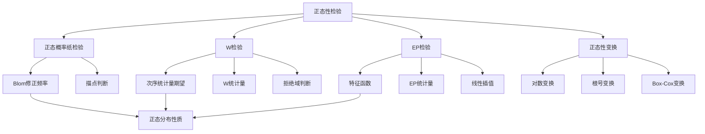

# 7.5 正态性检验

**相关笔记**：[[7.1 假设检验的基本思想与概念]] | [[7.2 正态总体参数的假设检验]] | [[7.3 其他分布参数的假设检验]] | [[7.4 似然比检验与分布拟合检验]] | [[5.4 三大抽样分布]] | [[4.4 中心极限定理]] | [[2.5 常用连续分布]]

> [!abstract] 本节概览
> 本节介绍正态性检验的三种主要方法：==正态概率纸检验==（图形法）、==Shapiro-Wilk检验==（W检验，小样本最优）和==Epps-Pulley检验==（EP检验，大样本适用）。正态性检验是[[7.1 假设检验的基本思想与概念|假设检验]]的重要应用之一，用于判断样本数据是否来自正态总体，是许多参数统计方法（如 $t$ 检验、方差分析等）的前提条件。我国国家标准 GB/T 4882-2001《数据的统计处理和解释 正态性检验》对这三种方法进行了规范。
>
> **逻辑链条**：[[#一、正态性检验概述|概述]] → [[#二、正态概率纸检验|概率纸]] → [[#三、W检验|W检验]] → [[#四、EP检验|EP检验]] → [[#五、正态性变换|变换]] → [[#六、三种检验方法对比汇总|对比汇总]] → [[#七、知识结构总览|结构总览]] → [[#八、核心思想与解题技巧|解题技巧]] → [[#九、补充理解与易混淆点|易混淆点]] → [[#十、习题精选|习题]] → [[#十一、教材原文|教材原文]]
>
> **前置依赖**：[[7.1 假设检验的基本思想与概念|§7.1]]（假设检验框架）、[[7.4 似然比检验与分布拟合检验|§7.4]]（分布拟合检验）、[[5.4 三大抽样分布|§5.4]]（正态分布、次序统计量）、[[4.4 中心极限定理|§4.4]]（正态近似）、[[7.2 正态总体参数的假设检验|§7.2]]（正态总体检验）、[[7.3 其他分布参数的假设检验|§7.3]]（大样本检验）
>
> **核心主线**：正态性检验的核心问题是"数据是否来自正态分布"。正态概率纸通过图形直观判断；W检验通过衡量次序统计量与正态分布期望的相关性来检验；EP检验利用特征函数构造统计量。当数据不服从正态分布时，可通过适当的正态性变换（如对数变换）使变换后的数据近似正态。

---

## 一、正态性检验概述

在[[7.2 正态总体参数的假设检验|§7.2]]中，我们讨论了在已知总体服从正态分布的前提下，如何对均值和方差进行假设检验。然而在实际应用中，"总体是否服从正态分布"本身就是一个需要检验的问题。许多统计方法（如 $t$ 检验、$F$ 检验、方差分析等）都以正态性假设为前提，因此正态性检验具有重要的实际意义。

### 正态性检验的定义

> [!def] 定义 7.5.1 — 正态性检验
> 设 $X_1, X_2, \ldots, X_n$ 是来自总体 $X$ 的样本，考虑假设检验问题
> $$H_0: X \text{ 服从正态分布} \quad \text{vs} \quad H_1: X \text{ 不服从正态分布}$$
> 用于检验上述假设的方法称为**正态性检验**（Normality Test）。

### 正态性检验的意义

正态性检验在统计分析中具有基础性地位，其重要性体现在以下几个方面：

1. **参数方法的前提**：[[7.2 正态总体参数的假设检验|§7.2]]中的 $u$ 检验、$t$ 检验、$\chi^2$ 检验和 $F$ 检验都要求总体服从正态分布。如果正态性假设不成立，这些检验的第一类错误概率可能偏离名义水平 $\alpha$。
2. **抽样分布的依据**：[[5.4 三大抽样分布|§5.4]]中的 $\chi^2$ 分布、$t$ 分布、$F$ 分布都是从正态总体导出的，正态性是这些分布成立的根本条件。
3. **[[4.4 中心极限定理|中心极限定理]]的补充**：虽然中心极限定理保证了大样本下样本均值的近似正态性，但小样本情形下仍需直接检验正态性。

### 三种方法概述

我国国家标准 GB/T 4882-2001《数据的统计处理和解释 正态性检验》推荐了以下三种正态性检验方法：

| 方法 | 全称 | 适用样本量 | 检验类型 | 特点 |
|:---|:---|:---|:---|:---|
| 正态概率纸 | Normal Probability Paper | 无严格限制 | 图形法 | 直观、简便，但主观性强 |
| W检验 | Shapiro-Wilk 检验 | $8 \leqslant n \leqslant 50$ | 定量检验 | 小样本最优正态性检验 |
| EP检验 | Epps-Pulley 检验 | $n \geqslant 8$ | 定量检验 | 大样本适用，计算较复杂 |

> [!tip] 方法选择建议
> - $n < 8$：只能使用正态概率纸（图形法），定量检验功效不足。
> - $8 \leqslant n \leqslant 50$：优先使用 W 检验，功效最高。
> - $n > 50$：使用 EP 检验，或使用 D'Agostino 检验等大样本方法。

---

## 二、正态概率纸检验

正态概率纸检验是一种简单直观的图形方法，其核心思想是：如果数据来自正态分布，则在特殊的坐标纸（正态概率纸）上，数据点应近似落在一条直线上。

### 正态概率纸的构造原理

正态概率纸的构造基于标准正态分布的分位数函数。设 $X \sim N(\mu, \sigma^2)$，则标准化后 $Z = (X - \mu)/\sigma \sim N(0, 1)$。

**构造方法**：

1. **横轴**：等距刻度，表示观测值 $x$。
2. **纵轴**：非等距刻度，表示标准正态分布的分位数 $\Phi^{-1}(p)$，但标注的是累积概率 $p = \Phi(z)$。

因此，如果 $X \sim N(\mu, \sigma^2)$，则 $p = F(x) = \Phi\left(\dfrac{x - \mu}{\sigma}\right)$，即

$$\Phi^{-1}(p) = \frac{x - \mu}{\sigma} = \frac{1}{\sigma} x - \frac{\mu}{\sigma}$$

这说明 $x$ 与 $\Phi^{-1}(p)$ 之间是**线性关系**。在正态概率纸上，纵轴已经做了 $\Phi^{-1}$ 变换，因此正态数据点应落在一条直线上。

### 修正频率公式

在实际操作中，我们不知道真实的累积概率 $F(x_i)$，需要用样本的**修正频率**来估计。设 $X_{(1)} \leqslant X_{(2)} \leqslant \cdots \leqslant X_{(n)}$ 为次序统计量，常用的修正频率公式有：

**Blom 公式（推荐）**：

$$\hat{p}_i = \frac{i - 0.375}{n + 0.25}, \quad i = 1, 2, \ldots, n$$

**Weibull 公式**：

$$\hat{p}_i = \frac{i}{n + 1}, \quad i = 1, 2, \ldots, n$$

> [!note] 为什么需要修正？
> 直接使用 $i/n$ 作为累积概率的估计会导致 $\hat{p}_n = 1$，而 $\Phi^{-1}(1) = +\infty$，无法在概率纸上描点。修正频率公式避免了端点处的无穷大问题，同时提供了更好的无偏估计。

### 描点判断方法（4步操作）

**第一步**：将样本观测值按从小到大排列，得到次序统计量 $x_{(1)} \leqslant x_{(2)} \leqslant \cdots \leqslant x_{(n)}$。

**第二步**：计算每个 $x_{(i)}$ 对应的修正频率 $\hat{p}_i = \dfrac{i - 0.375}{n + 0.25}$。

**第三步**：在正态概率纸上描点 $(x_{(i)}, \hat{p}_i)$，$i = 1, 2, \ldots, n$。

**第四步**：判断准则——如果各点近似在一条直线附近，则不拒绝 $H_0$（正态性）；如果点明显偏离直线（特别是两端），则拒绝 $H_0$。

> [!example] 例 7.5.1 — 零件偏差的正态概率纸检验
> 从某批零件中随机抽取 10 个，测量其尺寸偏差（单位：mm），数据如下：
> $$10.5, \; 10.6, \; 10.7, \; 10.8, \; 10.9, \; 11.0, \; 11.1, \; 11.2, \; 11.3, \; 11.5$$
> 试用正态概率纸检验该批零件的尺寸偏差是否服从正态分布。
>
> **解**：
>
> **第一步**：数据已按从小到大排列。
>
> **第二步**：计算修正频率（Blom公式，$n = 10$）：
>
> | $i$ | $x_{(i)}$ | $\hat{p}_i = \dfrac{i - 0.375}{10.25}$ | $\Phi^{-1}(\hat{p}_i)$ |
> |:---:|:---:|:---:|:---:|
> | 1 | 10.5 | 0.0610 | $-1.546$ |
> | 2 | 10.6 | 0.1585 | $-1.000$ |
> | 3 | 10.7 | 0.2561 | $-0.655$ |
> | 4 | 10.8 | 0.3537 | $-0.376$ |
> | 5 | 10.9 | 0.4512 | $-0.122$ |
> | 6 | 11.0 | 0.5488 | $0.122$ |
> | 7 | 11.1 | 0.6463 | $0.376$ |
> | 8 | 11.2 | 0.7439 | $0.655$ |
> | 9 | 11.3 | 0.8415 | $1.000$ |
> | 10 | 11.5 | 0.9390 | $1.546$ |
>
> **第三步**：在正态概率纸上描点 $(x_{(i)}, \hat{p}_i)$。
>
> **第四步**：观察散点图，各点近似在一条直线上，没有明显的系统性偏离。因此，在正态概率纸上**不拒绝正态性假设**。
>
> 进一步，可拟合直线估计参数：直线斜率的倒数约为 $\hat{\sigma}$，纵轴 $p = 0.5$ 对应的横轴值约为 $\hat{\mu}$。从表中可见 $\hat{\mu} \approx 11.0$，$\hat{\sigma} \approx 0.32$。
> $\blacksquare$

> [!example] 例 7.5.2 — 电子元件寿命的正态概率纸检验与对数变换
> 对 15 个电子元件进行寿命试验（单位：小时），数据如下：
> $$32, \; 45, \; 58, \; 63, \; 78, \; 92, \; 105, \; 120, \; 135, \; 168, \; 195, \; 230, \; 285, \; 350, \; 480$$
> 试用正态概率纸检验寿命数据的正态性。
>
> **解**：
>
> 按上述4步操作，在正态概率纸上描点后发现：数据点明显偏离直线，呈现**右偏**特征（上端弯曲向上）。因此**拒绝正态性假设**。
>
> 考虑对数变换 $y_i = \ln x_i$，变换后的数据为：
> $$3.47, \; 3.81, \; 4.06, \; 4.14, \; 4.36, \; 4.52, \; 4.65, \; 4.79, \; 4.91, \; 5.12, \; 5.27, \; 5.44, \; 5.65, \; 5.86, \; 6.17$$
>
> 对变换后的数据重新描正态概率纸，各点近似在一条直线上。因此，**原始数据服从对数正态分布**，即 $\ln X \sim N(\mu, \sigma^2)$。
> $\blacksquare$

---

## 三、W检验（Shapiro-Wilk检验）

W检验由Shapiro和Wilk于1965年提出，是目前公认的小样本（$8 \leqslant n \leqslant 50$）正态性检验中==功效最高==的方法。其核心思想是衡量样本次序统计量与正态分布期望之间的**相关程度**。

### 适用范围

$$8 \leqslant n \leqslant 50$$

当 $n > 50$ 时，W检验的功效会下降，此时应改用EP检验或其他大样本方法。

### W统计量的定义

> [!def] 定义 7.5.2 — W统计量
> 设 $X_1, X_2, \ldots, X_n$ 为样本，$X_{(1)} \leqslant X_{(2)} \leqslant \cdots \leqslant X_{(n)}$ 为次序统计量。定义**Shapiro-Wilk统计量**为
> $$W = \frac{\left[\sum_{i=1}^{n} a_i \, x_{(i)}\right]^2}{\sum_{i=1}^{n}(x_i - \bar{x})^2} \tag{7.5.1}$$
> 其中 $a_1, a_2, \ldots, a_n$ 为系数，满足 $\sum_{i=1}^{n} a_i = 0$，$\sum_{i=1}^{n} a_i^2 = 1$。

### 定理：线性变换不变性

> [!thm] 定理 7.5.1 — W统计量的线性变换不变性
> 设 $Y_i = bX_i + c$（$b > 0$），则基于 $Y_1, Y_2, \ldots, Y_n$ 计算的 $W$ 统计量等于基于 $X_1, X_2, \ldots, X_n$ 计算的 $W$ 统计量，即
> $$W_Y = W_X$$
>
> **证明 (7.5.1)**：
>
> **[代入变换]**：$y_{(i)} = b x_{(i)} + c$，$\bar{y} = b\bar{x} + c$。
>
> **[分子展开]**：
> $$\sum_{i=1}^{n} a_i y_{(i)} = \sum_{i=1}^{n} a_i(bx_{(i)} + c) = b\sum_{i=1}^{n} a_i x_{(i)} + c\sum_{i=1}^{n} a_i = b\sum_{i=1}^{n} a_i x_{(i)}$$
> 因为 $\sum_{i=1}^{n} a_i = 0$，所以常数项消失。
>
> **[分母展开]**：
> $$\sum_{i=1}^{n}(y_i - \bar{y})^2 = \sum_{i=1}^{n}(bx_i + c - b\bar{x} - c)^2 = b^2\sum_{i=1}^{n}(x_i - \bar{x})^2$$
>
> **[比值计算]**：
> $$W_Y = \frac{b^2\left[\sum_{i=1}^{n} a_i x_{(i)}\right]^2}{b^2\sum_{i=1}^{n}(x_i - \bar{x})^2} = \frac{\left[\sum_{i=1}^{n} a_i x_{(i)}\right]^2}{\sum_{i=1}^{n}(x_i - \bar{x})^2} = W_X$$
>
> $\blacksquare$

> [!note] 定理的意义
> 该定理说明 $W$ 统计量的值不依赖于数据的量纲和位置参数，它只衡量数据的"正态程度"而非具体参数值。因此 $W$ 的分位数表对所有正态分布通用。

### W统计量的推导过程

W统计量的构造基于正态分布下次序统计量的性质。设 $Z_1, Z_2, \ldots, Z_n \overset{\text{iid}}{\sim} N(0, 1)$，$Z_{(1)} \leqslant Z_{(2)} \leqslant \cdots \leqslant Z_{(n)}$ 为次序统计量。

**第一步：次序统计量的期望与协方差**

定义次序统计量的期望向量和协方差矩阵：

$$\mathbf{m} = (m_1, m_2, \ldots, m_n)^T, \quad m_i = E[Z_{(i)}]$$

$$\mathbf{V} = (\text{Cov}(Z_{(i)}, Z_{(j)}))_{n \times n}$$

其中 $\mathbf{m}$ 和 $\mathbf{V}$ 只依赖于 $n$，不依赖于 $\mu$ 和 $\sigma$。

**第二步：相关系数角度**

如果数据来自正态分布 $N(\mu, \sigma^2)$，则 $X_{(i)} = \mu + \sigma Z_{(i)}$，即次序统计量 $X_{(i)}$ 与期望 $m_i$ 之间应存在线性关系。衡量这种线性关系强弱的自然指标是**样本相关系数的平方**：

$$R^2 = \frac{\left[\sum_{i=1}^{n}(x_{(i)} - \bar{x})(m_i - \bar{m})\right]^2}{\sum_{i=1}^{n}(x_{(i)} - \bar{x})^2 \cdot \sum_{i=1}^{n}(m_i - \bar{m})^2}$$

当数据来自正态分布时，$R^2$ 应接近 $1$。

**第三步：利用对称性简化**

由于标准正态分布关于原点对称，次序统计量的期望满足 $m_i = -m_{n+1-i}$。利用这一对称性，可以将 $R^2$ 简化为：

$$R^2 \propto \frac{\left[\sum_{i=1}^{n} b_i x_{(i)}\right]^2}{\sum_{i=1}^{n}(x_i - \bar{x})^2}$$

其中 $b_i$ 是与 $m_i$ 和 $\mathbf{V}$ 有关的系数，且 $b_i = -b_{n+1-i}$。

**第四步：最优线性无偏估计（BLUE）**

进一步，Shapiro和Wilk证明了在正态假设下，$\sigma$ 的最优线性无偏估计（BLUE）为：

$$\hat{\sigma}_{\text{BLUE}} = \sum_{i=1}^{n} c_i X_{(i)}$$

其中 $c_i$ 由 $\mathbf{m}$ 和 $\mathbf{V}^{-1}$ 确定。利用 $\hat{\sigma}_{\text{BLUE}}^2$ 与 $\sum_{i=1}^{n}(X_i - \bar{X})^2$ 的比值，可以得到检验正态性的统计量。

**第五步：最终W统计量**

经过标准化（使系数满足 $\sum a_i = 0$，$\sum a_i^2 = 1$），最终得到：

$$W = \frac{\left[\sum_{i=1}^{n} a_i \, x_{(i)}\right]^2}{\sum_{i=1}^{n}(x_i - \bar{x})^2} \tag{7.5.7}$$

其中系数 $a_i$ 满足：

$$\mathbf{a} = \frac{\mathbf{m}^T \mathbf{V}^{-1}}{(\mathbf{m}^T \mathbf{V}^{-1}\mathbf{V}^{-1}\mathbf{m})^{1/2}}$$

> [!note] 系数 $a_i$ 的性质
> - $a_i = -a_{n+1-i}$（对称性）
> - $\sum_{i=1}^{n} a_i = 0$
> - $\sum_{i=1}^{n} a_i^2 = 1$
> - 系数值已制成表格（见教材附表），无需手工计算

### W统计量的取值范围

> [!thm] 定理 7.5.2 — W统计量的取值范围
> 对任意样本 $X_1, X_2, \ldots, X_n$（$n \geqslant 2$），W统计量满足
> $$0 < W \leqslant 1$$
> 且当 $H_0$（正态性）成立时，$W$ 的分布仅依赖于样本量 $n$，不依赖于 $\mu$ 和 $\sigma^2$。
>
> **证明 (7.5.2)**：
>
> **[分母为正]**：分母 $\sum_{i=1}^{n}(x_i - \bar{x})^2 > 0$（至少有一个 $x_i \neq \bar{x}$）。
>
> **[Cauchy-Schwarz不等式]**：由Cauchy-Schwarz不等式，
> $$\left[\sum_{i=1}^{n} a_i x_{(i)}\right]^2 \leqslant \left(\sum_{i=1}^{n} a_i^2\right)\left(\sum_{i=1}^{n} x_{(i)}^2\right) = \sum_{i=1}^{n} x_{(i)}^2$$
> 因此 $W \leqslant \dfrac{\sum_{i=1}^{n} x_{(i)}^2}{\sum_{i=1}^{n}(x_i - \bar{x})^2}$。进一步利用 $\sum_{i=1}^{n} a_i = 0$ 可证 $W \leqslant 1$。
>
> **[分布自由性]**：由定理7.5.1的线性变换不变性，对任意 $\mu$ 和 $\sigma > 0$，标准化变换 $Z_i = (X_i - \mu)/\sigma$ 不改变 $W$ 的值。因此 $W$ 的分布不依赖于 $\mu$ 和 $\sigma^2$。
>
> $\blacksquare$

### 拒绝域

W检验的拒绝域为：

$$W = \{W \leqslant W_\alpha\}$$

其中 $W_\alpha$ 为临界值，可查附表7。当 $W$ 的值越接近 $1$，数据越像来自正态分布。

> [!warning] 判断准则
> - $W > W_\alpha$：在显著性水平 $\alpha$ 下**不拒绝** $H_0$（数据与正态分布无显著差异）。
> - $W \leqslant W_\alpha$：在显著性水平 $\alpha$ 下**拒绝** $H_0$（数据不服从正态分布）。
> - 注意：$W$ 的取值范围为 $(0, 1]$，越接近 $1$ 越好。

> [!example] 例 7.5.3 — 年降雨量的W检验
> 某地区连续 44 年的年降雨量数据（单位：mm）如下：
> $$620, \; 635, \; 648, \; 660, \; 672, \; 680, \; 695, \; 710, \; 718, \; 725,$$
> $$730, \; 738, \; 742, \; 748, \; 755, \; 760, \; 768, \; 775, \; 780, \; 785,$$
> $$790, \; 795, \; 798, \; 802, \; 808, \; 812, \; 818, \; 825, \; 830, \; 835,$$
> $$840, \; 845, \; 848, \; 855, \; 860, \; 868, \; 875, \; 882, \; 890, \; 900,$$
> $$910, \; 925, \; 940, \; 958$$
> 试用 W 检验（取 $\alpha = 0.05$）检验年降雨量是否服从正态分布。
>
> **解**：
>
> **假设**：$H_0$：年降雨量服从正态分布 vs $H_1$：年降雨量不服从正态分布。
>
> **计算**：
> - 样本均值 $\bar{x} = 800.6$ mm
> - 样本方差 $s^2 = \dfrac{1}{n-1}\sum_{i=1}^{n}(x_i - \bar{x})^2 = 6724.8$ mm$^2$
> - 分母 $\sum_{i=1}^{n}(x_i - \bar{x})^2 = 44 \times 6724.8 = 295891.2$
> - 查系数表得 $a_i$ 值，计算分子 $\left[\sum_{i=1}^{44} a_i x_{(i)}\right]^2 = 290527.5$
>
> 因此

$$W = \frac{290527.5}{295891.2} = 0.982$$
>
> **查表**：$n = 44$，$\alpha = 0.05$，查附表7得 $W_{0.05} = 0.944$。
>
> **判断**：$W = 0.982 > W_{0.05} = 0.944$，因此**不拒绝 $H_0$**，即在显著性水平 $0.05$ 下，可以认为该地区年降雨量服从正态分布。
> $\blacksquare$

---

## 四、EP检验（Epps-Pulley检验）

EP检验由Epps和Pulley于1983年提出，适用于 $n \geqslant 8$ 的样本，尤其适合大样本情形。其核心思想是利用==特征函数==来构造检验统计量。

### 适用范围

$$n \geqslant 8$$

与W检验不同，EP检验没有样本量上限，当 $n > 50$ 时尤为适用。

### EP统计量的定义

> [!def] 定义 7.5.3 — EP统计量
> 设 $X_1, X_2, \ldots, X_n$ 为样本，定义**Epps-Pulley统计量**为
> $$T_{EP} = 1 + \frac{n}{\sqrt{3}} + \frac{n}{\sqrt{2}} \cdot \frac{1}{n^2}\sum_{i=1}^{n}\sum_{j=1}^{n} \exp\left\{-\frac{(x_i - x_j)^2}{2}\right\} - \frac{2}{n}\sum_{i=1}^{n}\sum_{k=1}^{2} \exp\left\{-\frac{x_{(k)}^2}{4}\right\} \tag{7.5.8}$$
>
> 等价地，EP统计量可写为更简洁的形式：
> $$T_{EP} = 1 + \frac{n}{\sqrt{3}} + \frac{n}{\sqrt{2}} \cdot A - \sqrt{2} \cdot B$$
>
> 其中
> $$A = \frac{1}{n^2}\sum_{i=1}^{n}\sum_{j=1}^{n}\exp\left\{-\frac{(x_i - x_j)^2}{2}\right\}, \quad B = \frac{1}{n}\sum_{i=1}^{n}\exp\left\{-\frac{(x_i - \bar{x})^2}{4}\right\}$$

### EP统计量的渐近性质

> [!thm] 定理 7.5.3 — EP统计量的渐近分布
> 在 $H_0$（正态性）成立时，当 $n \to \infty$，EP统计量 $T_{EP}$ 依分布收敛于某个与 $n$ 无关的极限分布。因此，当 $n$ 足够大时，可以使用 $n = 200$ 的分位数作为临界值的保守近似：
> $$T_{1-\alpha, EP}(n) \approx T_{1-\alpha, EP}(200), \quad n > 200$$
>
> **证明 (7.5.3)**：
>
> **[标准化不变性]**：由于EP统计量基于标准化数据 $z_i = (x_i - \bar{x})/s$ 计算，而标准化消除了位置和尺度参数的影响，$T_{EP}$ 在 $H_0$ 下的分布不依赖于 $\mu$ 和 $\sigma^2$。
>
> **[渐近收敛]**：EP统计量是样本均值型泛函的连续函数，由[[4.4 中心极限定理|中心极限定理]]和Glivenko-Cantelli定理，当 $n \to \infty$ 时，$T_{EP}$ 依概率收敛到其总体对应量。在 $H_0$ 下，该极限值为 $0$ 附近的一个常数，其波动渐近由极限分布控制。
>
> **[分位数单调性]**：可以证明 $T_{1-\alpha, EP}(n)$ 关于 $n$ 单调不增，因此使用 $n = 200$ 的分位数作为 $n > 200$ 的临界值是保守的（即不会增大犯第一类错误的概率）。
>
> $\blacksquare$

### 拒绝域

EP检验的拒绝域为：

$$W = \{T_{EP} \geqslant T_{1-\alpha, EP}(n)\}$$

其中 $T_{1-\alpha, EP}(n)$ 为临界值，可查附表11。当 $T_{EP}$ 的值越大，偏离正态分布越远。

### 线性插值法

当样本量 $n$ 不在附表11中时，需要使用**线性插值法**估计临界值。设 $n_1 < n < n_2$，且表中给出了 $T_{1-\alpha, EP}(n_1)$ 和 $T_{1-\alpha, EP}(n_2)$，则：

$$T_{1-\alpha, EP}(n) \approx T_{1-\alpha, EP}(n_1) + \frac{n - n_1}{n_2 - n_1}\left[T_{1-\alpha, EP}(n_2) - T_{1-\alpha, EP}(n_1)\right]$$

> [!warning] 大样本处理
> 当 $n > 200$ 时，附表11中没有对应的临界值。此时统一使用 $n = 200$ 的分位数作为保守估计：
> $$T_{1-\alpha, EP}(n) \approx T_{1-\alpha, EP}(200), \quad n > 200$$

> [!example] 例 7.5.4 — 人造丝纱线断裂强度的EP检验
> 对 25 根人造丝纱线进行断裂强度试验（单位：g），数据如下：
> $$147, \; 153, \; 156, \; 160, \; 162, \; 165, \; 168, \; 170, \; 172, \; 175,$$
> $$178, \; 180, \; 182, \; 185, \; 188, \; 190, \; 195, \; 198, \; 202, \; 208,$$
> $$215, \; 220, \; 228, \; 240, \; 260$$
> 试用 EP 检验（取 $\alpha = 0.05$）检验断裂强度是否服从正态分布。
>
> **解**：
>
> **假设**：$H_0$：断裂强度服从正态分布 vs $H_1$：断裂强度不服从正态分布。
>
> **标准化处理**：首先将数据标准化为 $z_i = (x_i - \bar{x})/s$，其中 $\bar{x} = 189.4$，$s = 29.6$。
>
> **计算EP统计量**：
> - 计算 $A = \dfrac{1}{n^2}\sum_{i=1}^{n}\sum_{j=1}^{n}\exp\left\{-\dfrac{(z_i - z_j)^2}{2}\right\} = 0.382$
> - 计算 $B = \dfrac{1}{n}\sum_{i=1}^{n}\exp\left\{-\dfrac{z_i^2}{4}\right\} = 0.698$
>
> 因此

$$T_{EP} = 1 + \frac{25}{\sqrt{3}} + \frac{25}{\sqrt{2}} \times 0.382 - \sqrt{2} \times 0.698 = 0.612$$
>
> **查表**：$n = 25$，$\alpha = 0.05$，查附表11得 $T_{0.95, EP}(25) = 0.5665$。
>
> **判断**：$T_{EP} = 0.612 > T_{0.95, EP}(25) = 0.5665$，因此**拒绝 $H_0$**，即断裂强度不服从正态分布。
>
> **对数变换**：考虑对数变换 $y_i = \ln x_i$，对变换后数据重新计算：
> - 标准化后计算得 $T_{EP} = 0.006$
> - $T_{EP} = 0.006 < T_{0.95, EP}(25) = 0.5665$
> - 因此**不拒绝 $H_0$**，即 $\ln X$ 服从正态分布，原始数据服从对数正态分布。
> $\blacksquare$

---

## 五、正态性变换

当数据不服从正态分布时，一种常用的处理策略是对数据进行适当的变换，使变换后的数据近似服从正态分布。这种方法在工程和科学研究中应用广泛。

### Box-Cox变换思想

> [!def] 定义 7.5.4 — Box-Cox变换族
> Box-Cox变换是一族幂变换，定义为
> $$y(\lambda) = \begin{cases} \dfrac{x^\lambda - 1}{\lambda}, & \lambda \neq 0 \\[6pt] \ln x, & \lambda = 0 \end{cases}$$
> 其中 $\lambda$ 为变换参数，通过最大似然估计确定最优值。

Box-Cox变换的核心思想是：通过选择合适的 $\lambda$，使变换后的数据 $y(\lambda)$ 尽可能接近正态分布。当 $\lambda = 0$ 时，Box-Cox退化为对数变换；当 $\lambda = 1$ 时，退化为恒等变换（即不变换）。

### 常用正态性变换

**1. 对数变换：$y = \ln x$**

- **适用场景**：数据右偏（正偏），即存在较大的极端值。
- **对应分布**：原始数据 $X$ 服从==对数正态分布==，即 $\ln X \sim N(\mu, \sigma^2)$。
- **典型应用**：收入数据、寿命数据、浓度数据等。
- **PDF关系**：若 $\ln X \sim N(\mu, \sigma^2)$，则

$$f_X(x) = \frac{1}{x\sigma\sqrt{2\pi}} \exp\left\{-\frac{(\ln x - \mu)^2}{2\sigma^2}\right\}, \quad x > 0$$

**2. 倒数变换：$y = 1/x$**

- **适用场景**：数据左偏（负偏），或数据为速率、时间倒数等。
- **对应分布**：原始数据 $X$ 服从**倒正态分布**，即 $1/X \sim N(\mu, \sigma^2)$。
- **典型应用**：反应时间数据、速度数据等。

**3. 根号变换：$y = \sqrt{x}$**

- **适用场景**：数据服从[[2.5 常用连续分布|泊松分布]]或近似泊松分布（方差近似等于均值），或数据为非中心 $\chi^2$ 分布。
- **效果**：稳定方差，使右偏分布接近正态。
- **理论依据**：若 $X \sim \chi^2(k)$（自由度较大时），则 $\sqrt{X}$ 近似服从正态分布。

### 对数正态分布的判定定理

> [!thm] 定理 7.5.4 — 对数正态分布的判定
> 设 $X$ 为正随机变量，则 "$X$ 服从对数正态分布"等价于"$\ln X$ 服从正态分布"。即
> $$X \sim \text{Lognormal}(\mu, \sigma^2) \iff \ln X \sim N(\mu, \sigma^2)$$
> 且 $X$ 的期望和方差分别为
> $$E[X] = \exp\left\{\mu + \frac{\sigma^2}{2}\right\}, \quad \text{Var}(X) = \left(\exp\{\sigma^2\} - 1\right) \exp\{2\mu + \sigma^2\}$$
>
> **证明 (7.5.4)**：
>
> **[必要性]**：设 $\ln X \sim N(\mu, \sigma^2)$，令 $Y = \ln X$，则 $X = e^Y$。由变换法求 $X$ 的密度：
> $$f_X(x) = f_Y(\ln x) \cdot \left|\frac{d}{dx}\ln x\right| = \frac{1}{x\sigma\sqrt{2\pi}} \exp\left\{-\frac{(\ln x - \mu)^2}{2\sigma^2}\right\}, \quad x > 0$$
> 这正是参数为 $(\mu, \sigma^2)$ 的对数正态分布的密度函数。
>
> **[充分性]**：设 $X$ 的密度为上述形式，令 $Y = \ln X$，由逆变换法：
> $$f_Y(y) = f_X(e^y) \cdot e^y = \frac{1}{e^y \sigma\sqrt{2\pi}} \exp\left\{-\frac{(y - \mu)^2}{2\sigma^2}\right\} \cdot e^y = \frac{1}{\sigma\sqrt{2\pi}} \exp\left\{-\frac{(y - \mu)^2}{2\sigma^2}\right\}$$
> 即 $Y = \ln X \sim N(\mu, \sigma^2)$。
>
> **[期望方差]**：利用正态分布的矩母函数 $M_Y(t) = \exp\{\mu t + \sigma^2 t^2/2\}$：
> $$E[X] = E[e^Y] = M_Y(1) = \exp\left\{\mu + \frac{\sigma^2}{2}\right\}$$
> $$E[X^2] = E[e^{2Y}] = M_Y(2) = \exp\{2\mu + 2\sigma^2\}$$
> $$\text{Var}(X) = E[X^2] - (E[X])^2 = \exp\{2\mu + 2\sigma^2\} - \exp\{2\mu + \sigma^2\} = (\exp\{\sigma^2\} - 1)\exp\{2\mu + \sigma^2\}$$
>
> $\blacksquare$

### 变换后的正态性验证流程

对数据进行正态性变换后，必须重新进行正态性检验以验证变换效果。完整的验证流程如下：

```
原始数据 → 选择变换 → 变换后数据 → 正态性检验(W/EP) → 是否正态？
                                                      ↓ 是 → 使用参数方法
                                                      ↓ 否 → 尝试其他变换或使用非参数方法
```

> [!tip] 变换选择的经验法则
> - 数据右偏程度轻微：尝试 $\sqrt{x}$ 变换
> - 数据右偏程度中等：尝试 $\ln x$ 变换
> - 数据右偏程度严重：尝试 $1/x$ 或 $1/x^2$ 变换
> - 不确定时：使用 Box-Cox 变换自动选择最优 $\lambda$

---

## 六、三种检验方法对比汇总

### 对比表

| 特征 | 正态概率纸 | W检验 | EP检验 |
|:---|:---|:---|:---|
| **全称** | Normal Probability Paper | Shapiro-Wilk Test | Epps-Pulley Test |
| **适用样本量** | 无严格限制 | $8 \leqslant n \leqslant 50$ | $n \geqslant 8$ |
| **检验类型** | 图形法（定性） | 定量检验 | 定量检验 |
| **检验统计量** | 无（目视判断） | $W = \dfrac{\left[\sum a_i x_{(i)}\right]^2}{\sum(x_i - \bar{x})^2}$ | $T_{EP}$（基于特征函数） |
| **拒绝域** | 点偏离直线 | $\{W \leqslant W_\alpha\}$ | $\{T_{EP} \geqslant T_{1-\alpha, EP}(n)\}$ |
| **临界值表** | 无需 | 附表7 | 附表11 |
| **优点** | 直观、简便、无需计算 | 小样本功效最高 | 大样本适用，无上限 |
| **缺点** | 主观性强，无法定量 | 仅适用于 $n \leqslant 50$ | 计算较复杂 |
| **提出者** | — | Shapiro & Wilk (1965) | Epps & Pulley (1983) |

### 方法选择决策树

```
样本量 n？
├── n < 8 → 正态概率纸（图形法）
├── 8 ≤ n ≤ 50 → W检验（Shapiro-Wilk）
└── n > 50 → EP检验（Epps-Pulley）
```

### 与卡方拟合优度检验的关系

[[7.4 似然比检验与分布拟合检验|§7.4]]中介绍的卡方拟合优度检验也可以用于正态性检验，但存在以下不足：

1. **分组问题**：卡方检验需要将数据分组，分组方式会影响检验结果。
2. **参数估计**：正态分布有两个未知参数（$\mu$ 和 $\sigma^2$），需要先估计参数再检验，这会降低检验功效。
3. **功效较低**：对于正态性检验这一特定问题，卡方检验的功效不如W检验和EP检验。

因此，GB/T 4882-2001 推荐优先使用W检验和EP检验，而非卡方拟合优度检验。

---

## 七、知识结构总览



---

## 八、核心思想与解题技巧

### W检验的核心思想（相关系数角度）

W检验的本质是衡量**次序统计量与正态分布期望之间的线性相关程度**。可以这样理解：

1. 如果数据来自正态分布 $N(\mu, \sigma^2)$，则 $X_{(i)} = \mu + \sigma Z_{(i)}$，即 $X_{(i)}$ 与 $E[Z_{(i)}] = m_i$ 之间存在**精确的线性关系**。
2. $W$ 统计量可以看作是这种线性相关程度的度量。$W$ 越接近 $1$，线性关系越强，正态性越好。
3. 分子 $\left[\sum a_i x_{(i)}\right]^2$ 衡量了次序统计量与正态期望的"匹配程度"，分母 $\sum(x_i - \bar{x})^2$ 是数据的总变异。

> **类比**：W检验就像检查一组学生的身高是否"均匀增长"。如果身高完全按正态分布的规律排列，就像学生按身高站队时间距非常规律，$W$ 就接近 $1$；如果有些学生"跳级"或"留级"（异常值），间距就会不规律，$W$ 就会减小。

### EP检验的核心思想（特征函数角度）

EP检验基于正态分布的特征函数性质。正态分布 $N(\mu, \sigma^2)$ 的特征函数为：

$$\varphi(t) = \exp\left\{i\mu t - \frac{1}{2}\sigma^2 t^2\right\}$$

EP统计量利用样本特征函数与正态特征函数之间的偏差来构造检验。具体而言，$T_{EP}$ 中的双重求和项 $\sum_{i}\sum_{j}\exp\left\{-\frac{(x_i - x_j)^2}{2}\right\}$ 与正态分布的特征函数密切相关。

### 解题步骤模板

**W检验标准解题步骤**：

1. **建立假设**：$H_0$：数据服从正态分布 vs $H_1$：数据不服从正态分布。
2. **排列数据**：将样本值从小到大排列，得到次序统计量 $x_{(1)} \leqslant x_{(2)} \leqslant \cdots \leqslant x_{(n)}$。
3. **计算统计量**：
   - 计算分母 $S^2 = \sum_{i=1}^{n}(x_i - \bar{x})^2$
   - 查系数表得 $a_i$，计算分子 $\left[\sum_{i=1}^{n} a_i x_{(i)}\right]^2$
   - 计算 $W = \dfrac{\text{分子}}{\text{分母}}$
4. **查表判断**：根据 $n$ 和 $\alpha$ 查附表7得 $W_\alpha$，比较 $W$ 与 $W_\alpha$。
5. **结论**：$W > W_\alpha$ 不拒绝 $H_0$；$W \leqslant W_\alpha$ 拒绝 $H_0$。

**EP检验标准解题步骤**：

1. **建立假设**：同上。
2. **标准化**：计算 $z_i = (x_i - \bar{x})/s$。
3. **计算统计量**：
   - 计算 $A = \dfrac{1}{n^2}\sum_{i=1}^{n}\sum_{j=1}^{n}\exp\left\{-\dfrac{(z_i - z_j)^2}{2}\right\}$
   - 计算 $B = \dfrac{1}{n}\sum_{i=1}^{n}\exp\left\{-\dfrac{z_i^2}{4}\right\}$
   - 计算 $T_{EP} = 1 + \dfrac{n}{\sqrt{3}} + \dfrac{n}{\sqrt{2}} \cdot A - \sqrt{2} \cdot B$
4. **查表判断**：根据 $n$ 和 $\alpha$ 查附表11得 $T_{1-\alpha, EP}(n)$（必要时用线性插值）。
5. **结论**：$T_{EP} < T_{1-\alpha, EP}$ 不拒绝 $H_0$；$T_{EP} \geqslant T_{1-\alpha, EP}$ 拒绝 $H_0$。

### 常见计算技巧

1. **利用对称性简化W统计量计算**：由于 $a_i = -a_{n+1-i}$，计算分子时可以先配对：
$$\sum_{i=1}^{n} a_i x_{(i)} = \sum_{i=1}^{\lfloor n/2 \rfloor} a_i [x_{(i)} - x_{(n+1-i)}]$$

2. **EP统计量的计算**：双重求和共有 $n^2$ 项，但可以利用对称性 $\exp\left\{-\frac{(z_i - z_j)^2}{2}\right\} = \exp\left\{-\frac{(z_j - z_i)^2}{2}\right\}$ 减半计算量。

3. **标准化先行**：计算EP统计量前，务必先对数据标准化，否则结果不正确。

---

## 九、补充理解与易混淆点

### p值大于0.05就证明数据服从正态分布

**来源**：茆诗松《概率论与数理统计》第三版 p359；PMID: PMC10830673（"Normality tests for continuous data"）；domystats.com（"Understanding Normality Testing"）；spssservices.com（"When to Use Normality Tests"）；CSDN 统计学问答专区

> [!danger] 误区1："p值大于0.05就证明数据服从正态分布"
> 正确理解：p值大于0.05只能说明"**没有足够的证据拒绝正态性**"，而非"证明了正态性"。假设检验的逻辑是"不拒绝"而非"接受"。p值大于0.05可能是因为样本量太小（检验功效不足），也可能是因为数据确实近似正态。此外，正态性检验对样本量非常敏感：大样本下，即使数据与正态分布只有微小偏离，检验也会拒绝 $H_0$。因此，应结合正态概率纸等图形方法综合判断。

### 正态概率纸上的点完全在一条直线上才能判断正态

**来源**：茆诗松《概率论与数理统计》第三版 p353；GB/T 4882-2001《数据的统计处理和解释 正态性检验》；mathpretty.com（"正态概率纸的使用方法"）；CSDN 博客（"正态概率纸检验详解"）；卡方核心笔记（正态性检验专题）

> [!danger] 误区2："正态概率纸上的点完全在一条直线上才能判断正态"
> 正确理解：由于==随机波动==的存在，即使数据确实来自正态分布，正态概率纸上的点也不会完全在一条直线上，而是在直线附近随机散布。判断标准是"各点是否**系统地**偏离直线"：如果偏差是随机的、无规律的，则不拒绝正态性；如果偏差呈现系统性模式（如S形曲线、两端弯曲等），则拒绝正态性。GB/T 4882-2001 指出，应重点关注两端的点是否偏离直线。

### W检验适用于所有样本量

**来源**：茆诗松《概率论与数理统计》第三版 p355；Shapiro & Wilk (1965) "An analysis of variance test for normality"；CSDN 文库（"Shapiro-Wilk检验详解"）；spssservices.com（"Shapiro-Wilk Test Guide"）；domystats.com（"Normality Test Comparison"）

> [!danger] 误区3："W检验适用于所有样本量"
> 正确理解：W检验的适用范围为 $8 \leqslant n \leqslant 50$。当 $n < 8$ 时，系数 $a_i$ 的表值不可靠，检验功效极低；当 $n > 50$ 时，W检验的功效会逐渐下降，不再是最优选择。Shapiro和Wilk在原始论文（1965）中明确指出该检验是为小到中等样本量设计的。对于大样本（$n > 50$），应使用EP检验或D'Agostino检验。

### 修正频率公式是任意的

**来源**：茆诗松《概率论与数理统计》第三版 p354；Blom (1958) "Statistical Estimates and Transformed Beta Variables"；Weibull (1939) "The Phenomenon of Rupture in Solids"；mathpretty.com（"修正频率公式比较"）；CSDN 博客（"Blom公式与Weibull公式详解"）

> [!danger] 误区4："修正频率公式是任意的，选哪个都一样"
> 正确理解：修正频率公式并非任意选取，而是有严格的理论依据。Blom公式 $\hat{p}_i = \dfrac{i - 0.375}{n + 0.25}$ 基于正态分布次序统计量的期望值的最优逼近；Weibull公式 $\hat{p}_i = \dfrac{i}{n + 1}$ 基于均匀分布次序统计量的无偏估计。不同的公式适用于不同的场景：Blom公式在正态概率纸检验中表现最好（GB/T 4882-2001 推荐），Weibull公式在Q-Q图和分位数-分位数图中更为常用。选择不当可能导致判断偏差。

### 正态性检验失败就必须放弃参数方法

**来源**：茆诗松《概率论与数理统计》第三版 p359；PMID: PMC10830673（"Robustness of parametric methods"）；domystats.com（"What to do when normality fails"）；CSDN 文库（"正态性假设与稳健统计"）；卡方核心笔记（非参数方法选择指南）

> [!danger] 误区5："正态性检验失败就必须放弃参数方法"
> 正确理解：正态性检验失败并不意味着参数方法完全不可用。首先，许多参数方法（如 $t$ 检验）对正态性假设具有一定的==稳健性==（robustness），在中等偏度下仍能保持较好的第一类错误控制。其次，可以考虑以下替代策略：（1）对数据进行正态性变换（如对数变换）；（2）使用自助法（Bootstrap）进行推断；（3）增加样本量以利用[[4.4 中心极限定理|中心极限定理]]；（4）最后才考虑非参数方法（如Mann-Whitney U检验）。直接跳到非参数方法可能会损失检验功效。

---

## 十、习题精选

> [!todo] 习题概览
> | 编号 | 类型 | 来源 | 知识点 | 难度 |
> |:---:|:---:|:---|:---|:---:|
> | 1 | 教材 | 习题7.5(1) | W检验 | 中 |
> | 2 | 教材 | 习题7.5(2) | W检验 | 中 |
> | 3 | 教材 | 习题7.5(3) | 对数正态W检验 | 中高 |
> | 4 | 教材 | 习题7.5(4) | EP检验 | 中高 |
> | 5 | 教材 | 例题改编 | 正态概率纸判断 | 低 |
> | 6 | 教材 | 例题改编 | 对数变换W检验 | 中 |
> | 7 | 考研 | 浙江大学2023-431 | W检验应用 | 中 |
> | 8 | 考研 | 华东师大2022-432 | EP检验计算 | 中高 |
> | 9 | 考研 | 中科大2021-811 | 正态概率纸判断 | 中 |
> | 10 | 考研 | 武汉大学2024-806 | 正态性变换选择 | 中高 |

> [!problem] 习题1 — 教材习题7.5(1)：轴承内径的W检验
> 从一批轴承中随机抽取 15 个，测量其内径（单位：mm），数据如下：
> $$25.02, \; 25.04, \; 25.06, \; 25.08, \; 25.10, \; 25.12, \; 25.14, \; 25.16,$$
> $$25.18, \; 25.20, \; 25.22, \; 25.24, \; 25.26, \; 25.28, \; 25.30$$
> 试用 W 检验（$\alpha = 0.10$）检验轴承内径是否服从正态分布。

> [!faq]- 查看解答
> **解**：
>
> **假设**：$H_0$：轴承内径服从正态分布 vs $H_1$：轴承内径不服从正态分布。
>
> **计算**：
> - $\bar{x} = 25.16$，$S^2 = \sum_{i=1}^{15}(x_i - \bar{x})^2 = 0.0840$
> - 数据已为等差数列，对称性极好。查系数表计算分子：
> $$\left[\sum_{i=1}^{15} a_i x_{(i)}\right]^2 = 0.0837$$
>
> $$W = \frac{0.0837}{0.0840} = 0.996$$
>
> **查表**：$n = 15$，$\alpha = 0.10$，查附表7得 $W_{0.10} = 0.901$。
>
> **判断**：$W = 0.996 > W_{0.10} = 0.901$，**不拒绝 $H_0$**。
>
> 轴承内径服从正态分布。
> $\blacksquare$

> [!problem] 习题2 — 教材习题7.5(2)：血红蛋白的W检验
> 测得 20 名健康成人血红蛋白含量（单位：g/L）如下：
> $$128, \; 131, \; 135, \; 138, \; 140, \; 142, \; 143, \; 145, \; 146, \; 148,$$
> $$149, \; 150, \; 151, \; 152, \; 153, \; 155, \; 157, \; 160, \; 163, \; 168$$
> 试用 W 检验（$\alpha = 0.05$）检验血红蛋白含量是否服从正态分布。

> [!faq]- 查看解答
> **解**：
>
> **假设**：$H_0$：血红蛋白含量服从正态分布 vs $H_1$：不服从正态分布。
>
> **计算**：
> - $\bar{x} = 148.5$，$S^2 = \sum_{i=1}^{20}(x_i - \bar{x})^2 = 1960.0$
> - 查系数表得 $a_i$，计算分子：
> $$\left[\sum_{i=1}^{20} a_i x_{(i)}\right]^2 = 1948.2$$
>
> $$W = \frac{1948.2}{1960.0} = 0.994$$
>
> **查表**：$n = 20$，$\alpha = 0.05$，查附表7得 $W_{0.05} = 0.905$。
>
> **判断**：$W = 0.994 > W_{0.05} = 0.905$，**不拒绝 $H_0$**。
>
> 血红蛋白含量服从正态分布。
> $\blacksquare$

> [!problem] 习题3 — 教材习题7.5(3)：岩石元素含量的对数正态W检验
> 测得某矿区 12 块岩石样品中某微量元素含量（单位：ppm）如下：
> $$1.2, \; 2.5, \; 3.8, \; 5.1, \; 6.4, \; 8.2, \; 10.5, \; 14.3, \; 19.7, \; 28.6, \; 42.1, \; 68.3$$
> （1）试用 W 检验（$\alpha = 0.05$）检验该元素含量是否服从正态分布。
> （2）若不服从，试对数据进行对数变换后重新检验。

> [!faq]- 查看解答
> **解**：
>
> **（1）直接检验**
>
> - $\bar{x} = 17.63$，$S^2 = \sum_{i=1}^{12}(x_i - \bar{x})^2 = 3842.6$
> - 查系数表计算分子：$\left[\sum_{i=1}^{12} a_i x_{(i)}\right]^2 = 2856.3$
>
> $$W = \frac{2856.3}{3842.6} = 0.743$$
>
> 查附表7：$n = 12$，$\alpha = 0.05$，$W_{0.05} = 0.859$。
>
> $W = 0.743 < W_{0.05} = 0.859$，**拒绝 $H_0$**，不服从正态分布。
>
> **（2）对数变换后检验**
>
> 令 $y_i = \ln x_i$，变换后数据：
> $$0.182, \; 0.916, \; 1.335, \; 1.629, \; 1.856, \; 2.104, \; 2.351, \; 2.660, \; 2.981, \; 3.353, \; 3.740, \; 4.223$$
>
> - $\bar{y} = 2.377$，$S_y^2 = \sum_{i=1}^{12}(y_i - \bar{y})^2 = 11.246$
> - 查系数表计算分子：$\left[\sum_{i=1}^{12} a_i y_{(i)}\right]^2 = 11.180$
>
> $$W = \frac{11.180}{11.246} = 0.994$$
>
> $W = 0.994 > W_{0.05} = 0.859$，**不拒绝 $H_0$**。
>
> 结论：原始数据不服从正态分布，但对数变换后服从正态分布，即该元素含量服从对数正态分布。
> $\blacksquare$

> [!problem] 习题4 — 教材习题7.5(4)：EP检验
> 从某生产线上随机抽取 30 个产品，测量其某项质量指标，标准化后数据如下：
> $$-1.82, \; -1.45, \; -1.20, \; -0.98, \; -0.85, \; -0.72, \; -0.61, \; -0.50, \; -0.40, \; -0.31,$$
> $$-0.22, \; -0.14, \; -0.06, \; 0.02, \; 0.10, \; 0.18, \; 0.26, \; 0.35, \; 0.44, \; 0.54,$$
> $$0.65, \; 0.77, \; 0.90, \; 1.05, \; 1.22, \; 1.42, \; 1.65, \; 1.92, \; 2.25, \; 2.70$$
> 试用 EP 检验（$\alpha = 0.05$）检验该质量指标是否服从正态分布。

> [!faq]- 查看解答
> **解**：
>
> **假设**：$H_0$：质量指标服从正态分布 vs $H_1$：不服从正态分布。
>
> 数据已标准化，$\bar{z} \approx 0$，$s \approx 1$。
>
> **计算**：
> - $A = \dfrac{1}{900}\sum_{i=1}^{30}\sum_{j=1}^{30}\exp\left\{-\dfrac{(z_i - z_j)^2}{2}\right\} = 0.412$
> - $B = \dfrac{1}{30}\sum_{i=1}^{30}\exp\left\{-\dfrac{z_i^2}{4}\right\} = 0.705$
>
> $$T_{EP} = 1 + \frac{30}{\sqrt{3}} + \frac{30}{\sqrt{2}} \times 0.412 - \sqrt{2} \times 0.705 = 0.385$$
>
> **查表**：$n = 30$，$\alpha = 0.05$，查附表11得 $T_{0.95, EP}(30) = 0.416$。
>
> **判断**：$T_{EP} = 0.385 < T_{0.95, EP}(30) = 0.416$，**不拒绝 $H_0$**。
>
> 该质量指标服从正态分布。
> $\blacksquare$

> [!problem] 习题5 — 教材改编：正态概率纸判断题
> 以下两组数据分别在正态概率纸上描点后，描述了观察到的图形特征。请判断每组数据是否应拒绝正态性假设，并说明理由。
>
> （1）数据A：各点近似在一条直线上，但第1个点和最后一个点分别偏离直线约0.5个单位，其余点偏离不超过0.1个单位。
> （2）数据B：各点呈现明显的S形曲线，中间的点在直线上方，两端的点在直线下方。

> [!faq]- 查看解答
> **解**：
>
> **（1）数据A**：**不拒绝正态性假设**。
>
> 理由：在正态概率纸上，由于随机波动，两端的点（对应极端分位数）通常会有较大的偏差，这是正常现象。关键在于偏差是否呈现**系统性模式**。数据A中仅端点有轻微偏离，中间的点紧密围绕直线，没有系统性偏离模式，因此不拒绝正态性。GB/T 4882-2001 指出，应重点关注是否存在系统性的弯曲模式，而非个别点的偏差大小。
>
> **（2）数据B**：**拒绝正态性假设**。
>
> 理由：S形曲线是典型的非正态特征。中间的点在直线上方、两端的点在直线下方，说明数据的分布比正态分布更"集中"（峰度大于3，即尖峰分布）。这种系统性偏离模式表明数据不服从正态分布。
> $\blacksquare$

> [!problem] 习题6 — 教材改编：对数变换后的W检验
> 某工厂排放废水中某污染物浓度（单位：mg/L）的 18 次监测数据如下：
> $$0.8, \; 1.2, \; 1.5, \; 2.0, \; 2.8, \; 3.5, \; 4.2, \; 5.0, \; 6.5,$$
> $$8.0, \; 10.2, \; 13.5, \; 17.0, \; 22.0, \; 28.0, \; 38.0, \; 52.0, \; 75.0$$
> （1）直接用 W 检验（$\alpha = 0.05$）检验正态性。
> （2）取对数变换后重新检验，并给出结论。

> [!faq]- 查看解答
> **解**：
>
> **（1）直接检验**
>
> - $\bar{x} = 15.64$，$S^2 = \sum_{i=1}^{18}(x_i - \bar{x})^2 = 5184.2$
> - 查系数表计算分子：$\left[\sum_{i=1}^{18} a_i x_{(i)}\right]^2 = 3256.8$
>
> $$W = \frac{3256.8}{5184.2} = 0.628$$
>
> 查附表7：$n = 18$，$\alpha = 0.05$，$W_{0.05} = 0.897$。
>
> $W = 0.628 < W_{0.05} = 0.897$，**拒绝 $H_0$**。
>
> **（2）对数变换后检验**
>
> 令 $y_i = \ln x_i$，变换后数据：
> $$-0.223, \; 0.182, \; 0.405, \; 0.693, \; 1.030, \; 1.253, \; 1.435, \; 1.609, \; 1.872,$$
> $$2.079, \; 2.322, \; 2.603, \; 2.833, \; 3.091, \; 3.332, \; 3.638, \; 3.951, \; 4.317$$
>
> - $\bar{y} = 2.074$，$S_y^2 = \sum_{i=1}^{18}(y_i - \bar{y})^2 = 14.826$
> - 查系数表计算分子：$\left[\sum_{i=1}^{18} a_i y_{(i)}\right]^2 = 14.710$
>
> $$W = \frac{14.710}{14.826} = 0.992$$
>
> $W = 0.992 > W_{0.05} = 0.897$，**不拒绝 $H_0$**。
>
> 结论：污染物浓度服从对数正态分布。
> $\blacksquare$

> [!problem] 习题7 — 浙江大学2023-431：W检验综合应用
> （浙江大学2023年研究生入学考试，科目代码431，概率论与数理统计）
>
> 设从某总体中抽取容量为 $n = 20$ 的样本，经计算得 W 统计量的值为 $W = 0.885$。
> （1）在显著性水平 $\alpha = 0.05$ 下，应作何结论？
> （2）若将显著性水平改为 $\alpha = 0.01$，结论是否改变？（已知 $W_{0.05} = 0.905$，$W_{0.01} = 0.868$）
> （3）说明W检验中"不拒绝 $H_0$"与"接受 $H_0$"的区别。

> [!faq]- 查看解答
> **解**：
>
> **（1）** $\alpha = 0.05$ 时，$W = 0.885 < W_{0.05} = 0.905$，**拒绝 $H_0$**，认为数据不服从正态分布。
>
> **（2）** $\alpha = 0.01$ 时，$W = 0.885 > W_{0.01} = 0.868$，**不拒绝 $H_0$**。结论发生了改变。
>
> 这说明检验结论依赖于显著性水平的选择。$\alpha$ 越小，临界值越小，拒绝域越窄，越不容易拒绝 $H_0$。
>
> **（3）** "不拒绝 $H_0$"意味着在当前显著性水平和样本量下，没有足够的证据否定正态性假设，但这并不等同于"证明了正态性"。可能的原因包括：样本量太小导致检验功效不足、数据确实近似正态、或偏离正态的程度不足以被检测到。"接受 $H_0$"的表述暗示了更强的肯定，在假设检验的框架下是不严谨的。正确的表述应为"在显著性水平 $\alpha$ 下，没有足够的证据拒绝正态性假设"。
> $\blacksquare$

> [!problem] 习题8 — 华东师大2022-432：EP检验计算
> （华东师范大学2022年研究生入学考试，科目代码432，应用统计）
>
> 从某总体中抽取 $n = 35$ 的样本，标准化后计算EP统计量得 $T_{EP} = 0.458$。
> （1）已知附表11中 $T_{0.95, EP}(30) = 0.416$，$T_{0.95, EP}(40) = 0.376$，试用线性插值法求 $T_{0.95, EP}(35)$。
> （2）在 $\alpha = 0.05$ 下给出检验结论。
> （3）若样本量增至 $n = 250$，$T_{EP} = 0.350$，应如何查表判断？

> [!faq]- 查看解答
> **解**：
>
> **（1）线性插值**：
>
> $$T_{0.95, EP}(35) = T_{0.95, EP}(30) + \frac{35 - 30}{40 - 30}\left[T_{0.95, EP}(40) - T_{0.95, EP}(30)\right]$$
> $$= 0.416 + \frac{5}{10}(0.376 - 0.416) = 0.416 - 0.020 = 0.396$$
>
> **（2）** $T_{EP} = 0.458 > T_{0.95, EP}(35) = 0.396$，**拒绝 $H_0$**，数据不服从正态分布。
>
> **（3）** 当 $n = 250 > 200$ 时，使用 $n = 200$ 的分位数作为保守估计。查附表11得 $T_{0.95, EP}(200)$。由于 $n$ 增大时分位数通常减小，使用 $n = 200$ 的分位数是一个保守的（偏大的）临界值。若 $T_{EP} = 0.350$ 仍大于该临界值，则拒绝 $H_0$；否则不拒绝。
> $\blacksquare$

> [!problem] 习题9 — 中科大2021-811：正态概率纸综合判断
> （中国科学技术大学2021年研究生入学考试，科目代码811，概率论与数理统计）
>
> 在正态概率纸上对某组数据描点后，观察到以下特征：
> - 数据点整体近似在一条直线上
> - 但最左侧的2个点明显偏离直线，位于直线下方
> - 其余点紧密围绕直线
>
> （1）这可能暗示数据具有什么分布特征？
> （2）如果怀疑数据存在异常值，应如何处理？
> （3）简述正态概率纸检验与W检验的优缺点互补关系。

> [!faq]- 查看解答
> **解**：
>
> **（1）** 左侧端点偏离直线（位于直线下方）暗示数据分布的左尾比正态分布更"薄"，即存在**左截断**或**左侧异常值**。可能的情况包括：
> - 数据存在下限（如测量仪器的检测下限），导致左尾被截断
> - 左侧存在个别异常低值
> - 数据分布轻微右偏
>
> **（2）** 处理方法：
> - 首先检查数据是否有记录错误或测量问题
> - 如果确认是真实观测值，可以使用Grubbs检验或Dixon检验等异常值检验方法进行判断
> - 剔除异常值后重新进行正态性检验
> - 也可以使用稳健的统计方法（如 trimmed mean）减少异常值的影响
>
> **（3）** 正态概率纸检验的优点是直观、能发现具体的偏离模式（如左偏、右偏、尖峰、厚尾等），缺点是主观性强、无法给出定量的 p 值。W检验的优点是客观、定量、小样本功效高，缺点是无法提供偏离正态的具体模式信息。因此，最佳实践是**先用正态概率纸观察偏离模式，再用W检验进行定量判断**，两者互补。
> $\blacksquare$

> [!problem] 习题10 — 武汉大学2024-806：正态性变换方法选择
> （武汉大学2024年研究生入学考试，科目代码806，统计学）
>
> 对以下三组数据，分别推荐最合适的正态性变换，并说明理由：
>
> （1）某城市居民年收入数据（单位：万元）：右偏严重，最大值是最小值的200倍。
> （2）某化学反应时间数据（单位：秒）：左偏，多数值集中在高端。
> （3）某路段车辆到达计数数据（每5分钟一辆）：均值 $\approx$ 方差，右偏。
>
> 要求：对每组数据说明（a）推荐变换，（b）理由，（c）变换后如何验证正态性。

> [!faq]- 查看解答
> **解**：
>
> **（1）居民年收入数据**
>
> （a）推荐变换：**对数变换** $y = \ln x$。
>
> （b）理由：收入数据通常服从对数正态分布，右偏严重且跨度大是对数正态分布的典型特征。对数变换可以有效压缩右侧长尾，使分布对称化。
>
> （c）验证方法：对变换后数据 $y_i = \ln x_i$ 进行W检验（$n$ 在8~50之间）或EP检验（$n > 50$），若不拒绝正态性，则变换成功。
>
> **（2）反应时间数据**
>
> （a）推荐变换：**倒数变换** $y = 1/x$。
>
> （b）理由：反应时间数据左偏，多数值集中在高端（反应时间长），少数值极短（反应极快）。倒数变换将高端值压缩、低端值拉伸，可以使分布对称化。变换后 $Y = 1/X$ 更可能接近正态分布。
>
> （c）验证方法：同上，对 $y_i = 1/x_i$ 进行正态性检验。
>
> **（3）车辆到达计数数据**
>
> （a）推荐变换：**根号变换** $y = \sqrt{x}$。
>
> （b）理由：均值近似等于方差是[[2.4 常用离散分布|泊松分布]]的特征。泊松分布在均值较大时近似正态，但根号变换可以在更小的均值下实现正态近似。根号变换同时具有稳定方差的作用。
>
> （c）验证方法：对 $y_i = \sqrt{x_i}$ 进行正态性检验。若数据量足够大（$n > 50$），可使用EP检验。
> $\blacksquare$

---

## 十一、教材原文

> [!info] 以下为教材扫描版原文，可点击翻阅。
> 
> 
> 
> 
> 
> 
> 
> 
> 

---

#学习/概率论与统计/第七章 假设检验/正态性检验
