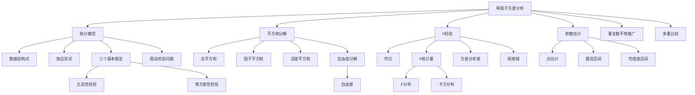

# 8.1 方差分析

**相关笔记**：[[7.1 假设检验的基本思想与概念]] | [[7.4 似然比检验与分布拟合检验]] | [[5.4 三大抽样分布]] | [[6.3 最大似然估计与EM算法]] | [[7.2 正态总体参数的假设检验]] | [[6.6 区间估计]] | [[5.3 统计量及其分布]]

> [!abstract] 本节概览
> 本节介绍==方差分析==（Analysis of Variance, ANOVA）的基本原理与方法，重点讨论==单因子方差分析==。方差分析的核心思想是将数据的总变异分解为==组间变异==（由因子水平不同引起）和==组内变异==（由随机误差引起），通过比较两者的比值来判断因子各水平下的总体均值是否存在显著差异。与多重 $t$ 检验相比，方差分析能有效控制==第一类错误膨胀==问题，是比较多个总体均值的标准化方法。
>
> **逻辑链条**：[[#一、方差分析概述|概述]] → [[#二、单因子方差分析的统计模型|统计模型]] → [[#三、平方和分解|平方和分解]] → [[#四、F检验与方差分析表|F检验]] → [[#五、参数估计与置信区间|参数估计]] → [[#六、重复数不等的推广|推广]] → [[#七、知识结构总览|结构总览]] → [[#八、核心思想与解题技巧|解题技巧]] → [[#九、补充理解与易混淆点|易混淆点]] → [[#十、习题精选|习题]] → [[#十一、教材原文|教材原文]]
>
> **前置依赖**：[[7.1 假设检验的基本思想与概念|§7.1]]（假设检验框架）、[[7.4 似然比检验与分布拟合检验|§7.4]]（似然比检验）、[[5.4 三大抽样分布|§5.4]]（$F$ 分布、$\chi^2$ 分布）、[[6.3 最大似然估计与EM算法|§6.3]]（MLE）、[[7.2 正态总体参数的假设检验|§7.2]]（$F$ 检验）
>
> **核心主线**：方差分析的核心问题是"多个总体均值是否相等"。通过建立单因子方差分析模型 $Y_{ij} = \mu + a_i + \varepsilon_{ij}$，将总平方和 $S_T$ 分解为因子平方和 $S_A$ 与误差平方和 $S_e$，利用 $F = MS_A / MS_e \sim F(r-1, n-r)$ 在 $H_0$ 成立时的分布，构造检验统计量判断各水平效应 $a_i$ 是否全为零。检验拒绝后，进一步通过参数估计和置信区间量化各水平均值的具体差异。

---

## 一、方差分析概述

在[[7.2 正态总体参数的假设检验|§7.2]]中，我们讨论了两个正态总体均值比较的 $t$ 检验方法。然而在实际应用中，常常需要同时比较**多个**（多于两个）总体的均值。例如，比较 $r$ 种不同肥料对作物产量的影响、比较 $r$ 种教学方法的教学效果等。此时若逐一使用两两 $t$ 检验，将面临严重的多重比较问题。

### 方差分析的动机

设有 $r$ 个独立正态总体 $Y_i \sim N(\mu_i, \sigma^2)$（$i = 1, 2, \ldots, r$），要检验假设

$$
H_0: \mu_1 = \mu_2 = \cdots = \mu_r \quad \text{vs} \quad H_1: \mu_1, \mu_2, \ldots, \mu_r \text{ 不全相等}
$$

这是一个经典的**多总体均值比较**问题。方差分析（Analysis of Variance, ANOVA）正是为解决此类问题而发展起来的标准统计方法，由 R.A. Fisher 于 1920 年代提出。

### 方差分析的思想——变异的分解

方差分析的核心思想可以用一句话概括：**将数据的总变异分解为不同来源的变异，通过比较各来源变异的相对大小来判断因子效应是否显著**。

> **类比**：假设你是一所学校的校长，想比较 3 个年级学生的数学成绩。如果只看全校总体的成绩波动（总变异），你无法判断年级之间是否有差异。但如果把总波动拆成两部分——"年级之间的差异"（组间变异）和"同一年级内部学生之间的差异"（组内变异）——当年级之间的差异远大于年级内部的差异时，你就有理由认为不同年级的数学水平确实不同。

### 定义

> [!def] 定义 8.1.1 — 方差分析（ANOVA）
> **方差分析**（Analysis of Variance, ANOVA）是一种通过分析数据变异的来源，来判断一个或多个因子（因素）对响应变量是否有显著影响的统计方法。其基本原理是将响应变量的总偏差平方和分解为因子效应引起的偏差平方和与随机误差引起的偏差平方和，利用==比值==的分布进行假设检验。

### 与多重 $t$ 检验的关系和优势

如果对 $r$ 个总体进行两两比较，共需进行 $\binom{r}{2} = \frac{r(r-1)}{2}$ 次 $t$ 检验。每次检验的显著性水平为 $\alpha$，则**至少犯一次第一类错误**的概率为

$$
\alpha^* = 1 - (1 - \alpha)^{r(r-1)/2}
$$

例如，当 $r = 5$、$\alpha = 0.05$ 时：

$$
\alpha^* = 1 - (1 - 0.05)^{10} = 1 - 0.95^{10} = 1 - 0.5987 = 0.4013
$$

这意味着第一类错误概率从 0.05 膨胀到了 0.4013，几乎无法接受。方差分析通过**一次性检验所有均值是否相等**，将整体的第一类错误概率控制在 $\alpha$ 水平，从根本上解决了这个问题。

| 比较维度 | 多重 $t$ 检验 | 方差分析 |
|:---|:---|:---|
| **检验次数** | $\binom{r}{2}$ 次 | 1 次 |
| **第一类错误** | $\alpha^* = 1-(1-\alpha)^{\binom{r}{2}}$ | $\alpha$ |
| **信息利用** | 每次只用两个样本 | 利用全部样本信息 |
| **适用场景** | 两两比较（事后检验） | 整体均值相等性检验 |

---

## 二、单因子方差分析的统计模型

### 引例

> [!example] 例 8.1.1 — 鸡饲料增肥试验
> 为比较 3 种饲料配方对鸡增重的影响，选取 24 只初始条件相近的鸡，随机分为 3 组，每组 8 只，分别喂饲配方 $A_1$、$A_2$、$A_3$。8 周后记录增重数据（单位：百克）如下：
>
> | 饲料 | \multicolumn{8}{c}{增重数据} |
> |:---:|:---:|:---:|:---:|:---:|:---:|:---:|:---:|:---:|
> | $A_1$ | 30 | 35 | 28 | 32 | 34 | 29 | 31 | 33 |
> | $A_2$ | 26 | 28 | 25 | 27 | 30 | 24 | 26 | 28 |
> | $A_3$ | 32 | 36 | 30 | 33 | 35 | 31 | 34 | 37 |
>
> 问题：3 种饲料配方对鸡增重的影响是否有显著差异？（$\alpha = 0.05$）

### 三个基本假定

单因子方差分析模型建立在以下三个基本假定之上：

- **(A1) 正态性**：每个水平 $A_i$ 下的观测值 $Y_{i1}, Y_{i2}, \ldots, Y_{im}$ 是来自正态总体 $N(\mu_i, \sigma^2)$ 的样本，即 $Y_{ij} \sim N(\mu_i, \sigma^2)$。
- **(A2) 等方差性**（方差齐性）：所有水平下的总体方差相等，均为 $\sigma^2$。
- **(A3) 独立性**：所有 $n = rm$ 个观测值相互独立。

> [!warning] 假定的重要性
> 这三个假定是方差分析有效性的基础。其中等方差性(A2)尤为重要——如果各水平下方差差异很大，F 检验的结果不可靠。实际应用中应先用 Bartlett 检验或 Levene 检验验证等方差性，用 Shapiro-Wilk 检验验证正态性。

### 数据结构式

设因子 $A$ 有 $r$ 个水平 $A_1, A_2, \ldots, A_r$，每个水平下进行 $m$ 次独立重复试验（等重复），得到数据 $Y_{ij}$（$i = 1, 2, \ldots, r$；$j = 1, 2, \ldots, m$）。数据结构式为

$$
Y_{ij} = \mu_i + \varepsilon_{ij}, \quad i = 1, 2, \ldots, r; \; j = 1, 2, \ldots, m \tag{8.1.2}
$$

其中：
- $\mu_i$ 为水平 $A_i$ 下的总体均值
- $\varepsilon_{ij} \sim N(0, \sigma^2)$，且所有 $\varepsilon_{ij}$ 相互独立

### 模型改写——效应形式

引入**总均值** $\mu$ 和**水平效应** $a_i$：

$$
\mu = \frac{1}{r}\sum_{i=1}^{r}\mu_i \tag{8.1.5}
$$

$$

a_i = \mu_i - \mu, \quad i = 1, 2, \ldots, r \tag{8.1.6}
$$

水平效应 $a_i$ 表示水平 $A_i$ 对响应变量的"额外贡献"。由定义可知，效应满足约束

$$
\sum_{i=1}^{r} a_i = \sum_{i=1}^{r}(\mu_i - \mu) = \sum_{i=1}^{r}\mu_i - r\mu = 0
$$

将 $\mu_i = \mu + a_i$ 代入数据结构式，得到模型的**效应形式**：

$$
Y_{ij} = \mu + a_i + \varepsilon_{ij}, \quad i = 1, 2, \ldots, r; \; j = 1, 2, \ldots, m \tag{8.1.8}
$$

### 模型定义

> [!def] 定义 8.1.2 — 单因子方差分析模型
> 设因子 $A$ 有 $r$ 个水平，每个水平下等重复 $m$ 次试验。若观测数据满足
> $$
> Y_{ij} = \mu + a_i + \varepsilon_{ij}, \quad \varepsilon_{ij} \overset{\text{iid}}{\sim} N(0, \sigma^2)
> $$
> 其中 $\sum_{i=1}^{r} a_i = 0$，则称该模型为**单因子方差分析模型**（One-way ANOVA Model）。

### 假设检验问题

在效应形式下，"各水平均值相等"等价于"所有效应为零"，即

$$
H_0: a_1 = a_2 = \cdots = a_r = 0 \quad \text{vs} \quad H_1: a_1, a_2, \ldots, a_r \text{ 不全为零} \tag{8.1.9}
$$

若拒绝 $H_0$，则认为因子 $A$ 对响应变量有显著影响；否则认为因子 $A$ 的影响不显著。

### 常用记号

为后续推导方便，引入以下记号：

- **组均值**：$\bar{Y}_{i\cdot} = \frac{1}{m}\sum_{j=1}^{m}Y_{ij}$（第 $i$ 组的样本均值）
- **总均值**：$\bar{Y} = \frac{1}{n}\sum_{i=1}^{r}\sum_{j=1}^{m}Y_{ij}$，其中 $n = rm$
- **组总和**：$T_i = \sum_{j=1}^{m}Y_{ij} = m\bar{Y}_{i\cdot}$
- **总和**：$T = \sum_{i=1}^{r}\sum_{j=1}^{m}Y_{ij} = n\bar{Y}$

---

## 三、平方和分解

平方和分解是方差分析的数学核心。其基本思路是将数据相对于总均值的总偏差平方和，分解为组间偏差平方和与组内偏差平方和两部分。

### 偏差与偏差平方和

**偏差**（deviation）是指观测值与某个参考值之差。在方差分析中，涉及三种偏差：

1. **总偏差**：$Y_{ij} - \bar{Y}$（观测值与总均值之差）
2. **组间偏差**：$\bar{Y}_{i\cdot} - \bar{Y}$（组均值与总均值之差）
3. **组内偏差**：$Y_{ij} - \bar{Y}_{i\cdot}$（观测值与组均值之差）

三者之间满足恒等关系：

$$
Y_{ij} - \bar{Y} = (Y_{ij} - \bar{Y}_{i\cdot}) + (\bar{Y}_{i\cdot} - \bar{Y}) \tag{8.1.11}
$$

即：**总偏差 = 组内偏差 + 组间偏差**。

### 组内偏差与组间偏差

对恒等式两边平方并求和：

$$
\sum_{i=1}^{r}\sum_{j=1}^{m}(Y_{ij} - \bar{Y})^2 = \sum_{i=1}^{r}\sum_{j=1}^{m}\left[(Y_{ij} - \bar{Y}_{i\cdot}) + (\bar{Y}_{i\cdot} - \bar{Y})\right]^2 \tag{8.1.12}
$$

展开右边：

$$
= \sum_{i=1}^{r}\sum_{j=1}^{m}(Y_{ij} - \bar{Y}_{i\cdot})^2 + \sum_{i=1}^{r}\sum_{j=1}^{m}(\bar{Y}_{i\cdot} - \bar{Y})^2 + 2\sum_{i=1}^{r}\sum_{j=1}^{m}(Y_{ij} - \bar{Y}_{i\cdot})(\bar{Y}_{i\cdot} - \bar{Y})
$$

### 定理：总平方和分解式

> [!thm] 定理 8.1.1 — 总平方和分解式
> 在单因子方差分析模型中，总偏差平方和可分解为
> $$
> S_T = S_A + S_e \tag{8.1.16}
> $$
> 其中
> $$
> S_T = \sum_{i=1}^{r}\sum_{j=1}^{m}(Y_{ij} - \bar{Y})^2 \quad \text{（总平方和，Total SS）}
> $$
> $$
> S_A = \sum_{i=1}^{r}\sum_{j=1}^{m}(\bar{Y}_{i\cdot} - \bar{Y})^2 = m\sum_{i=1}^{r}(\bar{Y}_{i\cdot} - \bar{Y})^2 \quad \text{（因子平方和/组间平方和，Between SS）}
> $$
> $$
> S_e = \sum_{i=1}^{r}\sum_{j=1}^{m}(Y_{ij} - \bar{Y}_{i\cdot})^2 \quad \text{（误差平方和/组内平方和，Within SS）}
> $$

> [!abstract] 证明思路
> **证明 (8.1.16)**：
>
> **[展开交叉项]**：令交叉项
> $$
> \Delta = 2\sum_{i=1}^{r}\sum_{j=1}^{m}(Y_{ij} - \bar{Y}_{i\cdot})(\bar{Y}_{i\cdot} - \bar{Y})
> $$
> 将求和号拆开，先对 $j$ 求和：
> $$
> \Delta = 2\sum_{i=1}^{r}(\bar{Y}_{i\cdot} - \bar{Y})\sum_{j=1}^{m}(Y_{ij} - \bar{Y}_{i\cdot})
> $$
>
> **[利用组均值定义]**：注意到 $\sum_{j=1}^{m}(Y_{ij} - \bar{Y}_{i\cdot}) = m\bar{Y}_{i\cdot} - m\bar{Y}_{i\cdot} = 0$，因此
> $$
> \Delta = 2\sum_{i=1}^{r}(\bar{Y}_{i\cdot} - \bar{Y}) \cdot 0 = 0
> $$
>
> **[合并结果]**：交叉项为零，故
> $$
> S_T = S_e + S_A
> $$
>
> $\square$

### 各平方和的自由度

自由度反映了平方和中独立信息的个数：

| 平方和 | 公式 | 自由度 | 含义 |
|:---|:---|:---:|:---|
| $S_T$ | $\sum\sum(Y_{ij}-\bar{Y})^2$ | $f_T = n - 1 = rm - 1$ | $n$ 个观测值减去总均值约束 |
| $S_A$ | $m\sum(\bar{Y}_{i\cdot}-\bar{Y})^2$ | $f_A = r - 1$ | $r$ 个组均值减去总均值约束 |
| $S_e$ | $\sum\sum(Y_{ij}-\bar{Y}_{i\cdot})^2$ | $f_e = n - r = r(m-1)$ | 每组 $m-1$ 个自由度，共 $r$ 组 |

自由度也满足分解关系：

$$
f_T = f_A + f_e \quad \Leftrightarrow \quad (n-1) = (r-1) + (n-r)
$$

### 计算公式的简化形式

在实际计算中，使用以下简化公式更为方便：

$$
S_T = \sum_{i=1}^{r}\sum_{j=1}^{m}Y_{ij}^2 - \frac{T^2}{n}

S_A = \sum_{i=1}^{r}\frac{T_i^2}{m} - \frac{T^2}{n}

S_e = S_T - S_A = \sum_{i=1}^{r}\sum_{j=1}^{m}Y_{ij}^2 - \sum_{i=1}^{r}\frac{T_i^2}{m}
$$

---

## 四、F检验与方差分析表

### 均方概念

为了消除自由度的影响，将各平方和除以其自由度，得到**均方**（Mean Square）：

$$
MS = \frac{SS}{f} \tag{8.1.17}
$$

具体地：

- **误差均方**：$MS_e = \dfrac{S_e}{n - r}$
- **因子均方**：$MS_A = \dfrac{S_A}{r - 1}$

### 定理：各平方和的分布与期望

> [!thm] 定理 8.1.2 — 平方和的分布与期望
> 在单因子方差分析模型 $Y_{ij} = \mu + a_i + \varepsilon_{ij}$，$\varepsilon_{ij} \overset{\text{iid}}{\sim} N(0, \sigma^2)$ 下：
>
> **(1)** $\dfrac{S_e}{\sigma^2} \sim \chi^2(n - r)$，且 $E[S_e] = (n - r)\sigma^2$，从而 $E[MS_e] = \sigma^2$。
>
> **(2)** $E[S_A] = (r - 1)\sigma^2 + m\sum_{i=1}^{r}a_i^2$。当 $H_0: a_1 = \cdots = a_r = 0$ 成立时，$\dfrac{S_A}{\sigma^2} \sim \chi^2(r - 1)$，从而 $E[MS_A] = \sigma^2$。
>
> **(3)** $S_A$ 与 $S_e$ 相互独立。

> [!abstract] 证明思路
> **证明 (8.1.18)**：
>
> **[误差平方和的分布]**：在每组内，$\sum_{j=1}^{m}(Y_{ij} - \bar{Y}_{i\cdot})^2 / \sigma^2 \sim \chi^2(m-1)$（由[[5.4 三大抽样分布|正态总体样本方差的分布]]）。由于各组独立，由 $\chi^2$ 分布的可加性：
> $$
> \frac{S_e}{\sigma^2} = \sum_{i=1}^{r}\frac{1}{\sigma^2}\sum_{j=1}^{m}(Y_{ij} - \bar{Y}_{i\cdot})^2 \sim \chi^2\left(\sum_{i=1}^{r}(m-1)\right) = \chi^2(n-r)
> $$
> 故 $E[S_e] = (n-r)\sigma^2$。
>
> **[因子平方和的期望]**：利用 $\bar{Y}_{i\cdot} \sim N(\mu + a_i, \sigma^2/m)$，$\bar{Y} \sim N(\mu, \sigma^2/n)$（在 $H_0$ 下），以及 $\bar{Y}_{i\cdot}$ 之间的协方差结构，可以推导出
> $$
> E[S_A] = m\sum_{i=1}^{r}E[(\bar{Y}_{i\cdot} - \bar{Y})^2] = m\sum_{i=1}^{r}\left[\text{Var}(\bar{Y}_{i\cdot}) + (E[\bar{Y}_{i\cdot}] - E[\bar{Y}])^2\right] - (r-1)\text{Var}(\bar{Y})
> $$
> $$
> = m\sum_{i=1}^{r}\left[\frac{\sigma^2}{m} + a_i^2\right] - (r-1)\frac{\sigma^2}{n} \cdot m = r\sigma^2 + m\sum_{i=1}^{r}a_i^2 - \frac{m(r-1)\sigma^2}{rm}
> $$
> $$
> = r\sigma^2 + m\sum_{i=1}^{r}a_i^2 - \frac{(r-1)\sigma^2}{r} = \frac{r^2\sigma^2 - (r-1)\sigma^2}{r} + m\sum_{i=1}^{r}a_i^2
> $$
> $$
> = \frac{(r-1)\sigma^2(r+1) + (r-1)\sigma^2}{r} + m\sum_{i=1}^{r}a_i^2 = (r-1)\sigma^2 + m\sum_{i=1}^{r}a_i^2
> $$
>
> 当 $H_0$ 成立时 $a_i = 0$（$i = 1, \ldots, r$），$S_A$ 是 $r$ 个相关的正态变量的二次型，由 Cochran 定理可知 $S_A/\sigma^2 \sim \chi^2(r-1)$。
>
> **[独立性证明]**：$S_e$ 只依赖于组内偏差 $Y_{ij} - \bar{Y}_{i\cdot}$，$S_A$ 只依赖于组间偏差 $\bar{Y}_{i\cdot} - \bar{Y}$。由正态分布的性质，组内偏差与组均值独立，故 $S_e$ 与 $S_A$ 独立。
>
> $\square$

### F检验统计量

由定理 8.1.2，在 $H_0$ 成立时：

$$
\frac{S_A/\sigma^2}{(r-1)} \sim \frac{\chi^2(r-1)}{r-1}, \quad \frac{S_e/\sigma^2}{(n-r)} \sim \frac{\chi^2(n-r)}{n-r}
$$

且两者独立。由[[5.4 三大抽样分布|$F$ 分布的定义]]，构造检验统计量：

$$
F = \frac{MS_A}{MS_e} = \frac{S_A/(r-1)}{S_e/(n-r)} \sim F(r-1, \; n-r)
$$

当 $H_0$ 不成立时，$E[MS_A] = \sigma^2 + \frac{m}{r-1}\sum a_i^2 > \sigma^2 = E[MS_e]$，因此 $F$ 值倾向于偏大。==$F$ 值越大，说明组间差异相对于组内差异越显著==。

### 拒绝域

给定显著性水平 $\alpha$，检验的拒绝域为

$$
W = \left\{F \geqslant F_{1-\alpha}(r-1, \; n-r)\right\}
$$

其中 $F_{1-\alpha}(r-1, n-r)$ 为 $F(r-1, n-r)$ 分布的 $1-\alpha$ 分位数。

### 方差分析表

方差分析的结果通常整理为标准表格：

| 来源 | 平方和 (SS) | 自由度 (df) | 均方 (MS) | $F$ 值 | $p$ 值 |
|:---|:---:|:---:|:---:|:---:|:---:|
| 因子 $A$ | $S_A$ | $r - 1$ | $MS_A = S_A/(r-1)$ | $F = MS_A/MS_e$ | $P(F_{r-1,n-r} \geqslant F)$ |
| 误差 $e$ | $S_e$ | $n - r$ | $MS_e = S_e/(n-r)$ | | |
| 总和 $T$ | $S_T$ | $n - 1$ | | | |

### 例题：用例 8.1.1 数据完成方差分析

> [!example] 例 8.1.1（续）— 鸡饲料增肥试验的方差分析
> 对例 8.1.1 的鸡饲料增肥试验数据进行方差分析（$\alpha = 0.05$）。
>
> **解**：
>
> **第一步：计算基本统计量**
>
> | 饲料 | $T_i$ | $\bar{Y}_{i\cdot}$ | $\sum_j Y_{ij}^2$ |
> |:---:|:---:|:---:|:---:|
> | $A_1$ | 252 | 31.50 | 7980 |
> | $A_2$ | 214 | 26.75 | 5750 |
> | $A_3$ | 268 | 33.50 | 9040 |
>
> $T = 252 + 214 + 268 = 734$，$\bar{Y} = 734/24 = 30.583$
>
> **第二步：计算平方和**
>
> $$
> S_T = \sum_{i}\sum_{j}Y_{ij}^2 - \frac{T^2}{n} = (7980 + 5750 + 9040) - \frac{734^2}{24} = 22770 - 22448.167 = 321.833
> $$
>
> $$
> S_A = \sum_{i}\frac{T_i^2}{m} - \frac{T^2}{n} = \frac{252^2 + 214^2 + 268^2}{8} - \frac{734^2}{24} = \frac{63504 + 45796 + 71824}{8} - 22448.167
> $$
>
> $$
> = \frac{181124}{8} - 22448.167 = 22640.500 - 22448.167 = 192.333
> $$
>
> $$
> S_e = S_T - S_A = 321.833 - 192.333 = 129.500
> $$
>
> **第三步：计算均方和 $F$ 值**
>
> $$
> MS_A = \frac{S_A}{r-1} = \frac{192.333}{2} = 96.167
> $$
>
> $$
> MS_e = \frac{S_e}{n-r} = \frac{129.500}{21} = 6.167
> $$
>
> $$
> F = \frac{MS_A}{MS_e} = \frac{96.167}{6.167} = 15.594
> $$
>
> **第四步：查表判断**
>
> $F_{0.95}(2, 21) = 3.47$，$F = 15.594 > 3.47$，落入拒绝域。
>
> **第五步：方差分析表**
>
> | 来源 | SS | df | MS | $F$ | $p$ 值 |
> |:---|---:|---:|---:|---:|---:|
> | 饲料 | 192.333 | 2 | 96.167 | 15.594 | $< 0.001$ |
> | 误差 | 129.500 | 21 | 6.167 | | |
> | 总和 | 321.833 | 23 | | | |
>
> **结论**：$p < 0.001 < 0.05$，**拒绝 $H_0$**，认为 3 种饲料配方对鸡增重有显著影响。
> $\square$

---

## 五、参数估计与置信区间

方差分析不仅能判断因子效应是否显著，还能对各水平均值和效应进行参数估计。

### MLE 参数估计

由[[6.3 最大似然估计与EM算法|最大似然估计]]方法，对数似然函数为

$$
\ell(\mu, a_1, \ldots, a_r, \sigma^2) = -\frac{n}{2}\ln(2\pi\sigma^2) - \frac{1}{2\sigma^2}\sum_{i=1}^{r}\sum_{j=1}^{m}(Y_{ij} - \mu - a_i)^2
$$

在约束 $\sum a_i = 0$ 下，令偏导为零，解得各参数的 MLE：

$$
\hat{\mu} = \bar{Y}, \quad \hat{a}_i = \bar{Y}_{i\cdot} - \bar{Y}, \quad \hat{\sigma}^2 = \frac{S_e}{n}
$$

### 无偏估计

MLE 的 $\hat{\sigma}^2 = S_e/n$ 是有偏的。由定理 8.1.2(1)，$E[S_e] = (n-r)\sigma^2$，因此 $\sigma^2$ 的无偏估计为

$$
\hat{\sigma}^2 = MS_e = \frac{S_e}{n - r}
$$

这是实际中最常用的误差方差估计。

### $\mu_i$ 的置信区间

水平 $A_i$ 下总体均值 $\mu_i = \mu + a_i$ 的点估计为 $\hat{\mu}_i = \bar{Y}_{i\cdot}$。

由于 $\bar{Y}_{i\cdot} \sim N(\mu_i, \sigma^2/m)$，且 $\bar{Y}_{i\cdot}$ 与 $S_e$ 独立，有

$$
\frac{\bar{Y}_{i\cdot} - \mu_i}{\sqrt{MS_e/m}} \sim t(n - r)
$$

因此 $\mu_i$ 的 $1 - \alpha$ 置信区间为

$$
\left[\bar{Y}_{i\cdot} - t_{1-\alpha/2}(n-r) \cdot \sqrt{\frac{MS_e}{m}}, \quad \bar{Y}_{i\cdot} + t_{1-\alpha/2}(n-r) \cdot \sqrt{\frac{MS_e}{m}}\right]
$$

### 两水平均值差的置信区间

对于任意两个水平 $A_i$ 和 $A_j$，均值差 $\mu_i - \mu_j = a_i - a_j$ 的点估计为 $\bar{Y}_{i\cdot} - \bar{Y}_{j\cdot}$。

由于 $\bar{Y}_{i\cdot} - \bar{Y}_{j\cdot} \sim N(\mu_i - \mu_j, 2\sigma^2/m)$，且与 $S_e$ 独立，有

$$
\frac{(\bar{Y}_{i\cdot} - \bar{Y}_{j\cdot}) - (\mu_i - \mu_j)}{\sqrt{2MS_e/m}} \sim t(n - r)
$$

因此 $\mu_i - \mu_j$ 的 $1 - \alpha$ 置信区间为

$$
\left[(\bar{Y}_{i\cdot} - \bar{Y}_{j\cdot}) - t_{1-\alpha/2}(n-r)\sqrt{\frac{2MS_e}{m}}, \quad (\bar{Y}_{i\cdot} - \bar{Y}_{j\cdot}) + t_{1-\alpha/2}(n-r)\sqrt{\frac{2MS_e}{m}}\right]
$$

> [!tip] 多重比较问题
> 如果需要同时比较多个均值差（如所有 $\binom{r}{2}$ 对），直接使用上述 $t$ 区间会导致置信水平膨胀。此时应使用**多重比较**方法，如 Tukey 法（HSD）、Bonferroni 校正、Scheffé 法等。这些方法通过调整临界值来控制家族错误率（FWER）。

---

## 六、重复数不等的推广

在实际问题中，各水平下的重复次数可能不同。设水平 $A_i$ 下有 $m_i$ 次重复（$i = 1, 2, \ldots, r$），总样本量 $n = \sum_{i=1}^{r}m_i$。

### 模型与假设

模型形式不变：

$$
Y_{ij} = \mu + a_i + \varepsilon_{ij}, \quad i = 1, \ldots, r; \; j = 1, \ldots, m_i
$$

但效应约束变为加权形式：$\sum_{i=1}^{r}m_i a_i = 0$。

检验假设仍为 $H_0: a_1 = \cdots = a_r = 0$。

### 平方和的计算

$$
S_T = \sum_{i=1}^{r}\sum_{j=1}^{m_i}Y_{ij}^2 - \frac{T^2}{n}

S_A = \sum_{i=1}^{r}\frac{T_i^2}{m_i} - \frac{T^2}{n}

S_e = S_T - S_A = \sum_{i=1}^{r}\sum_{j=1}^{m_i}Y_{ij}^2 - \sum_{i=1}^{r}\frac{T_i^2}{m_i}
$$

### 自由度

| 平方和 | 自由度 |
|:---|:---:|
| $S_T$ | $n - 1$ |
| $S_A$ | $r - 1$ |
| $S_e$ | $n - r$ |

自由度分解关系 $f_T = f_A + f_e$ 仍然成立。

### F检验

$$
F = \frac{MS_A}{MS_e} = \frac{S_A/(r-1)}{S_e/(n-r)} \sim F(r-1, n-r)
$$

检验步骤与等重复情形完全相同。

### 例题：重复数不等的方差分析

> [!example] 例 8.1.2 — 重复数不等的方差分析
> 为比较 3 种工艺生产的某零件强度，从各工艺产品中分别抽取 5、4、6 个样品，测得强度数据如下：
>
> | 工艺 | \multicolumn{6}{c}{强度数据} |
> |:---:|:---:|:---:|:---:|:---:|:---:|:---:|
> | $A_1$ | 105 | 110 | 108 | 112 | 106 | |
> | $A_2$ | 100 | 103 | 98 | 101 | | |
> | $A_3$ | 115 | 118 | 112 | 120 | 116 | 114 |
>
> 试用方差分析（$\alpha = 0.05$）检验 3 种工艺的零件强度是否有显著差异。
>
> **解**：
>
> **基本统计量**：
>
> | 工艺 | $m_i$ | $T_i$ | $\bar{Y}_{i\cdot}$ | $\sum_j Y_{ij}^2$ |
> |:---:|:---:|:---:|:---:|:---:|
> | $A_1$ | 5 | 541 | 108.2 | 58549 |
> | $A_2$ | 4 | 402 | 100.5 | 40414 |
> | $A_3$ | 6 | 695 | 115.833 | 80545 |
>
> $n = 15$，$T = 1638$，$\bar{Y} = 109.2$
>
> **平方和计算**：
>
> $$
> S_T = (58549 + 40414 + 80545) - \frac{1638^2}{15} = 179508 - 178896.4 = 611.6
> $$
>
> $$
> S_A = \frac{541^2}{5} + \frac{402^2}{4} + \frac{695^2}{6} - \frac{1638^2}{15} = 58536.2 + 40401.0 + 80504.167 - 178896.4
> $$
>
> $$
> = 179441.367 - 178896.4 = 544.967
> $$
>
> $$
> S_e = 611.6 - 544.967 = 66.633
> $$
>
> **方差分析表**：
>
> | 来源 | SS | df | MS | $F$ | $p$ 值 |
> |:---|---:|---:|---:|---:|---:|
> | 工艺 | 544.967 | 2 | 272.483 | 49.017 | $< 0.001$ |
> | 误差 | 66.633 | 12 | 5.553 | | |
> | 总和 | 611.6 | 14 | | | |
>
> $F_{0.95}(2, 12) = 3.89$，$F = 49.017 > 3.89$，**拒绝 $H_0$**，3 种工艺的零件强度有显著差异。
> $\square$

---

## 七、知识结构总览

---

## 八、核心思想与解题技巧

### 方差分析的核心思想——变异分解

方差分析的核心思想可以用一个等式概括：

$$
\text{总变异} = \text{组间变异} + \text{组内变异}
$$

- **总变异** $S_T$：所有数据围绕总均值的波动，反映数据的整体离散程度。
- **组间变异** $S_A$：各组均值围绕总均值的波动，反映因子水平差异带来的影响。
- **组内变异** $S_e$：各组内部数据围绕组均值的波动，反映随机误差的大小。

> **类比**：想象一个班级的考试成绩。总变异是全班成绩的离散程度。如果把学生按不同老师分组，组间变异反映不同老师教学效果的差异，组内变异反映同一老师教的学生之间的个体差异。如果组间变异远大于组内变异，说明老师的教学效果确实有显著差别。

### F检验的直观理解

$F = MS_A / MS_e$ 的直观含义是**信号与噪声的比值**：

- **分子** $MS_A$：因子效应产生的"信号"。当 $H_0$ 成立时，$E[MS_A] = \sigma^2$；当 $H_0$ 不成立时，$E[MS_A] > \sigma^2$。
- **分母** $MS_e$：随机误差产生的"噪声"。无论 $H_0$ 是否成立，$E[MS_e] = \sigma^2$。

==$F$ 值接近 1 说明组间差异与组内差异相当，因子效应不显著；$F$ 值远大于 1 说明组间差异远超组内差异，因子效应显著==。

### 方差分析表的标准计算流程

**第一步：计算基本统计量**

- 各组总和 $T_i = \sum_j Y_{ij}$，各组均值 $\bar{Y}_{i\cdot} = T_i / m_i$
- 总和 $T = \sum_i T_i$，总均值 $\bar{Y} = T / n$
- 各组平方和 $\sum_j Y_{ij}^2$

**第二步：计算平方和**

$$
S_A = \sum_i \frac{T_i^2}{m_i} - \frac{T^2}{n}, \quad S_T = \sum_i \sum_j Y_{ij}^2 - \frac{T^2}{n}, \quad S_e = S_T - S_A
$$

**第三步：计算均方和 $F$ 值**

$$
MS_A = \frac{S_A}{r-1}, \quad MS_e = \frac{S_e}{n-r}, \quad F = \frac{MS_A}{MS_e}
$$

**第四步：查表或计算 $p$ 值，做出判断**

### 常见计算技巧

**技巧1：线性变换简化**

对数据做线性变换 $Y_{ij}' = aY_{ij} + b$（$a \neq 0$），则 $F$ 值不变。因此当数据数值较大时，可以先做线性变换简化计算。

证明：$Y_{ij}' - \bar{Y}' = a(Y_{ij} - \bar{Y})$，故 $S_T' = a^2 S_T$，$S_A' = a^2 S_A$，$S_e' = a^2 S_e$。$F' = (S_A'/f_A)/(S_e'/f_e) = (a^2 S_A/f_A)/(a^2 S_e/f_e) = F$。

**技巧2：利用恒等式**

$$
S_e = \sum_{i=1}^{r}\sum_{j=1}^{m_i}(Y_{ij} - \bar{Y}_{i\cdot})^2 = \sum_{i=1}^{r}(m_i - 1)s_i^2
$$

其中 $s_i^2 = \frac{1}{m_i - 1}\sum_{j=1}^{m_i}(Y_{ij} - \bar{Y}_{i\cdot})^2$ 为第 $i$ 组的样本方差。这个公式在已知各组样本方差时特别有用。

**技巧3：计算顺序**

先算 $S_A$ 和 $S_T$，再用 $S_e = S_T - S_A$ 得到 $S_e$，避免直接计算组内偏差的繁琐过程。

---

## 九、补充理解与易混淆点

### 方差分析可以替代正态性检验

**来源**：茆诗松《概率论与数理统计》第三版 p374 + Montgomery, D.C. (2017) *Design and Analysis of Experiments*, 9th ed., Wiley, §3.4 + CSDN 博客"方差分析的假设条件详解" + 知乎"方差分析前需要检验正态性吗？" + 卡方核心笔记（方差分析专题）

> [!danger] 误区1："方差分析可以替代正态性检验"
> ❌ 错误解释：方差分析本身包含了对正态性的检验，因此不需要单独做正态性检验。
> ✅ 正确解释：方差分析本身**需要**正态性作为前提假定，而不是替代正态性检验。ANOVA 的 $F$ 检验统计量在 $H_0$ 下的 $F(r-1, n-r)$ 分布是在正态性假定下推导出来的。如果数据严重偏离正态分布，$F$ 检验的第一类错误概率可能偏离名义水平 $\alpha$。Montgomery (2017) 在 §3.4 中明确指出，在进行方差分析之前，应当使用残差分析（正态概率图、Shapiro-Wilk 检验等）来验证正态性假定。不过，ANOVA 对正态性的偏离具有一定的稳健性——在样本量较大时，由[[4.4 中心极限定理|中心极限定理]]保证组均值近似正态，因此 $F$ 检验仍然近似有效。但"稳健"不等于"不需要"，对于小样本或严重偏态数据，正态性检验仍然是必要的步骤。

### F检验显著就说明所有水平间差异显著

**来源**：茆诗松《概率论与数理统计》第三版 p376 + CSDN 文库"方差分析F检验显著后的多重比较" + spssservices.com（"ANOVA significant but pairwise comparisons not significant"） + domystats.com（"Understanding ANOVA results"） + 卡方核心笔记（方差分析专题）

> [!danger] 误区2："$F$ 检验显著就说明所有水平间差异显著"
> ❌ 错误解释：$F$ 检验显著意味着所有水平两两之间都存在显著差异。
> ✅ 正确解释：$F$ 检验的备择假设是"$a_1, a_2, \ldots, a_r$ 不全为零"，即**至少有一对**水平之间存在显著差异，而非**所有**水平之间都存在显著差异。$F$ 检验是一个**整体检验**（omnibus test），它只告诉我们"因子效应存在"，但不指出具体哪些水平之间有差异。例如，3 个水平的均值分别为 10、10、15，$F$ 检验可能显著（因为 $A_3$ 与 $A_1, A_2$ 不同），但 $A_1$ 和 $A_2$ 之间并无差异。要确定具体哪些水平之间存在差异，需要在 $F$ 检验显著后进行**事后多重比较**（post-hoc multiple comparisons），如 Tukey HSD、Bonferroni、Scheffé 等方法。domystats.com 给出的一个典型案例中，$F$ 检验的 $p$ 值为 0.023（显著），但 3 对两两比较中只有 1 对的 $p$ 值小于 0.05。

### 方差分析不需要等方差假定

**来源**：茆诗松《概率论与数理统计》第三版 p374 + Box, G.E.P. (1953) "Non-Normality and Tests on Variances", *Biometrika*, 40, 318-335 + CSDN 博客"方差分析的等方差假定检验" + mathpretty.com（"Homogeneity of Variance in ANOVA"） + 卡方核心笔记（方差分析专题）

> [!danger] 误区3："方差分析不需要等方差假定"
> ❌ 错误解释：方差分析只要求正态性和独立性，对各组方差是否相等没有要求。
> ✅ 正确解释：等方差性（方差齐性）是方差分析的==核心假定之一==，绝非可有可无。ANOVA 模型要求所有水平下的总体方差相等（$\sigma_1^2 = \sigma_2^2 = \cdots = \sigma_r^2 = \sigma^2$），这是 $F$ 统计量服从 $F$ 分布的理论基础。如果各水平方差差异很大，$MS_e$ 不再是 $\sigma^2$ 的良好估计，$F$ 检验的第一类错误率将严重偏离 $\alpha$。Box (1953) 的经典研究表明，当各组样本量不等且方差差异较大时，ANOVA 的实际 $\alpha$ 水平可能膨胀到名义水平的数倍。验证等方差性的常用方法包括 Bartlett 检验（正态数据）、Levene 检验（对非正态更稳健）和 Brown-Forsythe 检验。当等方差性不满足时，可以使用 Welch ANOVA（不要求等方差）或 Brown-Forsythe 检验作为替代。

### 方差分析只能用于正态数据

**来源**：茆诗松《概率论与数理统计》第三版 p374 + Kruskal, W.H. & Wallis, W.A. (1952) "Use of Ranks in One-Criterion Variance Analysis", *JASA*, 47, 583-621 + CSDN 博客"非正态数据如何做方差分析" + 知乎"方差分析的非参数替代方法" + 卡方核心笔记（方差分析专题）

> [!danger] 误区4："方差分析只能用于正态数据"
> ❌ 错误解释：如果数据不服从正态分布，就完全不能使用方差分析来比较多组均值。
> ✅ 正确解释：虽然经典 ANOVA 要求正态性假定，但当正态性不满足时，并非"无法比较多个总体均值"。首先，如前所述，ANOVA 在大样本下对正态性偏离具有一定的稳健性。其次，存在多种非参数替代方法：**Kruskal-Wallis 检验**（Kruskal-Wallis, 1952）是单因子方差分析的非参数替代，它基于秩而非原始数据，不要求正态性，是两样本[[7.6 非参数检验|Mann-Whitney U 检验（秩和检验）]]的多总体推广。此外，还可以使用数据变换（如对数变换、Box-Cox 变换）使数据更接近正态，再进行 ANOVA。因此，正态性不满足并不意味着不能比较多组均值，而是需要选择更合适的方法。

### 多重 $t$ 检验和方差分析等价

**来源**：茆诗松《概率论与数理统计》第三版 p373 + Bonferroni, C.E. (1936) *Teoria Statistica delle Classi e Calcolo delle Probabilità* + CSDN 文库"多重t检验与方差分析的区别" + spssservices.com（"Multiple t-tests vs ANOVA"） + 卡方核心笔记（方差分析专题）

> [!danger] 误区5："多重 $t$ 检验和方差分析等价"
> ❌ 错误解释：多重 $t$ 检验和方差分析本质上是等价的，只是计算方式不同。
> ✅ 正确解释：多重 $t$ 检验和方差分析在数学上**不等价**，核心差异在于**第一类错误控制**。方差分析是一次性检验所有均值是否相等，整体第一类错误率为 $\alpha$；而多重 $t$ 检验进行 $\binom{r}{2}$ 次独立检验，整体第一类错误率膨胀为 $\alpha^* = 1-(1-\alpha)^{\binom{r}{2}}$。当 $r = 4$ 时，$\alpha^* = 1-0.95^6 = 0.265$；当 $r = 6$ 时，$\alpha^* = 1-0.95^{15} = 0.537$。此外，方差分析利用了全部样本信息估计公共方差 $\sigma^2$（自由度为 $n-r$），而每次 $t$ 检验只用两个样本估计方差（自由度为 $m_i+m_j-2$），==方差分析的估计精度更高==。不过，在 $r = 2$ 的特殊情况下，ANOVA 的 $F$ 检验与两样本 $t$ 检验（等方差）完全等价：$F(1, n-2) = t^2(n-2)$。

---

## 十、习题精选

> [!todo] 习题概览
> | 编号 | 类型 | 来源 | 知识点 | 难度 |
> |:---:|:---:|:---|:---|:---:|
> | 1 | 教材 | 习题8.1(1) | 计算平方和及自由度 | 低 |
> | 2 | 教材 | 习题8.1(4) | 完成方差分析表 + $F$ 检验 | 中 |
> | 3 | 教材 | 习题8.1(5) | 安眠药试验（完整方差分析） | 中 |
> | 4 | 教材 | 习题8.1(6) | 线性变换技巧 | 中高 |
> | 5 | 教材 | 习题8.1(7) | 含置信区间的方差分析 | 中高 |
> | 6 | 教材 | 习题8.1(9) | 方差分析与 $t$ 检验的等价性 | 高 |
> | 7 | 考研 | 2020 华东师大 432 | 单因子方差分析 + 多重比较 | 中高 |
> | 8 | 考研 | 2021 中山大学 432 | 方差分析表补全 + $F$ 检验 | 中 |
> | 9 | 考研 | 2019 上海财经 432 | 重复数不等方差分析 | 中高 |
> | 10 | 考研 | 2022 西南大学 432 | 方差分析与置信区间 | 中高 |

> [!problem] 习题1 — 教材习题8.1(1)：计算平方和及自由度
> 设有 3 个水平，每个水平下 4 次重复试验，数据如下：
>
> | 水平 | \multicolumn{4}{c}{观测值} |
> |:---:|:---:|:---:|:---:|:---:|
> | $A_1$ | 5 | 8 | 7 | 6 |
> | $A_2$ | 4 | 3 | 5 | 2 |
> | $A_3$ | 6 | 7 | 8 | 9 |
>
> 计算 $S_e$、$S_A$、$S_T$ 及各自的自由度。

> [!faq]- 查看解答
> **解**：
>
> **基本统计量**：
> - $T_1 = 26$，$T_2 = 14$，$T_3 = 30$，$T = 70$
> - $\sum\sum Y_{ij}^2 = 25+64+49+36+16+9+25+4+36+49+64+81 = 458$
>
> **平方和**：
> $$
> S_T = 458 - \frac{70^2}{12} = 458 - 408.333 = 49.667
> $$
>
> $$
> S_A = \frac{26^2 + 14^2 + 30^2}{4} - \frac{70^2}{12} = \frac{676 + 196 + 900}{4} - 408.333 = 443 - 408.333 = 34.667
> $$
>
> $$
> S_e = S_T - S_A = 49.667 - 34.667 = 15.000
> $$
>
> **自由度**：$f_T = 11$，$f_A = 2$，$f_e = 9$。
> $\square$

> [!problem] 习题2 — 教材习题8.1(4)：完成方差分析表
> 某单因子方差分析中，因子有 4 个水平，每个水平重复 5 次，已知 $S_A = 120$，$S_e = 80$。完成方差分析表，并在 $\alpha = 0.05$ 下做出判断。

> [!faq]- 查看解答
> **解**：
>
> $r = 4$，$m = 5$，$n = 20$，$f_A = 3$，$f_e = 16$，$f_T = 19$。
>
> $$
> S_T = S_A + S_e = 120 + 80 = 200
> $$
>
> $$
> MS_A = \frac{120}{3} = 40, \quad MS_e = \frac{80}{16} = 5
> $$
>
> $$
> F = \frac{40}{5} = 8.0
> $$
>
> **方差分析表**：
>
> | 来源 | SS | df | MS | $F$ | $p$ 值 |
> |:---|---:|---:|---:|---:|---:|
> | 因子 | 120 | 3 | 40 | 8.0 | $< 0.01$ |
> | 误差 | 80 | 16 | 5 | | |
> | 总和 | 200 | 19 | | | |
>
> $F_{0.95}(3, 16) = 3.24$，$F = 8.0 > 3.24$，**拒绝 $H_0$**。
> $\square$

> [!problem] 习题3 — 教材习题8.1(5)：安眠药试验
> 为比较 4 种安眠药 $A_1, A_2, A_3, A_4$ 的疗效，选取 24 只兔子随机分为 4 组，每组 6 只，记录服药后睡眠延长的时间（小时）如下：
>
> | 药品 | \multicolumn{6}{c}{睡眠延长时间} |
> |:---:|:---:|:---:|:---:|:---:|:---:|:---:|
> | $A_1$ | 0.7 | 1.1 | 0.8 | 1.2 | 0.9 | 1.0 |
> | $A_2$ | 1.5 | 1.8 | 1.3 | 1.6 | 1.4 | 1.7 |
> | $A_3$ | 0.5 | 0.6 | 0.4 | 0.7 | 0.3 | 0.8 |
> | $A_4$ | 1.2 | 0.9 | 1.4 | 1.1 | 1.3 | 1.0 |
>
> 在 $\alpha = 0.05$ 下检验 4 种安眠药的疗效是否有显著差异。

> [!faq]- 查看解答
> **解**：
>
> **基本统计量**：
>
> | 药品 | $T_i$ | $\bar{Y}_{i\cdot}$ | $\sum_j Y_{ij}^2$ |
> |:---:|:---:|:---:|:---:|
> | $A_1$ | 5.7 | 0.950 | 5.59 |
> | $A_2$ | 9.3 | 1.550 | 14.59 |
> | $A_3$ | 3.3 | 0.550 | 1.99 |
> | $A_4$ | 6.9 | 1.150 | 8.11 |
>
> $T = 25.2$，$n = 24$
>
> **平方和**：
> $$
> S_T = 30.28 - \frac{25.2^2}{24} = 30.28 - 26.46 = 3.82
> $$
>
> $$
> S_A = \frac{5.7^2 + 9.3^2 + 3.3^2 + 6.9^2}{6} - 26.46 = \frac{32.49 + 86.49 + 10.89 + 47.61}{6} - 26.46
> $$
>
> $$
> = \frac{177.48}{6} - 26.46 = 29.58 - 26.46 = 3.12
> $$
>
> $$
> S_e = 3.82 - 3.12 = 0.70
> $$
>
> **方差分析表**：
>
> | 来源 | SS | df | MS | $F$ | $p$ 值 |
> |:---|---:|---:|---:|---:|---:|
> | 药品 | 3.12 | 3 | 1.040 | 29.71 | $< 0.001$ |
> | 误差 | 0.70 | 20 | 0.035 | | |
> | 总和 | 3.82 | 23 | | | |
>
> $F_{0.95}(3, 20) = 3.10$，$F = 29.71 > 3.10$，**拒绝 $H_0$**，4 种安眠药疗效有显著差异。
> $\square$

> [!problem] 习题4 — 教材习题8.1(6)：咖啡因对手指叩击的影响（线性变换技巧）
> 为研究咖啡因对手指叩击次数的影响，选取 3 个剂量水平（0mg、100mg、200mg），每个水平 10 名受试者，记录每分钟叩击次数。原始数据（单位：次/分钟）如下：
>
> | 剂量 | \multicolumn{10}{c}{叩击次数} |
> |:---:|:---:|:---:|:---:|:---:|:---:|:---:|:---:|:---:|:---:|:---:|
> | 0mg | 242 | 245 | 244 | 248 | 247 | 248 | 242 | 244 | 246 | 242 |
> | 100mg | 248 | 246 | 245 | 250 | 247 | 248 | 250 | 247 | 249 | 253 |
> | 200mg | 246 | 248 | 250 | 252 | 248 | 250 | 252 | 248 | 250 | 254 |
>
> 利用线性变换简化计算，在 $\alpha = 0.05$ 下检验咖啡因剂量对手指叩击次数是否有显著影响。

> [!faq]- 查看解答
> **解**：
>
> **线性变换**：令 $Y_{ij}' = Y_{ij} - 248$，变换后数据为：
>
> | 剂量 | \multicolumn{10}{c}{变换后数据} |
> |:---:|:---:|:---:|:---:|:---:|:---:|:---:|:---:|:---:|:---:|:---:|
> | 0mg | $-6$ | $-3$ | $-4$ | 0 | $-1$ | 0 | $-6$ | $-4$ | $-2$ | $-6$ |
> | 100mg | 0 | $-2$ | $-3$ | 2 | $-1$ | 0 | 2 | $-1$ | 1 | 5 |
> | 200mg | $-2$ | 0 | 2 | 4 | 0 | 2 | 4 | 0 | 2 | 6 |
>
> **基本统计量**（变换后）：
> - $T_1' = -32$，$T_2' = 3$，$T_3' = 18$，$T' = -11$
> - $\sum\sum Y_{ij}'^2 = 36+9+16+0+1+0+36+16+4+36+0+4+9+4+1+0+4+1+1+25+4+0+4+16+0+4+16+0+4+36 = 242$
>
> **平方和**：
> $$
> S_T = 242 - \frac{(-11)^2}{30} = 242 - 4.033 = 237.967
> $$
>
> $$
> S_A = \frac{(-32)^2 + 3^2 + 18^2}{10} - 4.033 = \frac{1024 + 9 + 324}{10} - 4.033 = 135.7 - 4.033 = 131.667
> $$
>
> $$
> S_e = 237.967 - 131.667 = 106.300
> $$
>
> **方差分析表**：
>
> | 来源 | SS | df | MS | $F$ | $p$ 值 |
> |:---|---:|---:|---:|---:|---:|
> | 剂量 | 131.667 | 2 | 65.833 | 16.15 | $< 0.001$ |
> | 误差 | 106.300 | 27 | 3.937 | | |
> | 总和 | 237.967 | 29 | | | |
>
> $F_{0.95}(2, 27) = 3.35$，$F = 16.15 > 3.35$，**拒绝 $H_0$**，咖啡因剂量对手指叩击次数有显著影响。
> $\square$

> [!problem] 习题5 — 教材习题8.1(7)：储藏方法对含水率的影响（含置信区间）
> 为比较 5 种储藏方法对粮食含水率（%）的影响，每种方法各储藏 4 份样品，测得含水率如下：
>
> | 方法 | \multicolumn{4}{c}{含水率} |
> |:---:|:---:|:---:|:---:|:---:|
> | $A_1$ | 7.2 | 7.5 | 7.3 | 7.4 |
> | $A_2$ | 7.8 | 8.1 | 7.9 | 8.0 |
> | $A_3$ | 6.8 | 7.0 | 6.9 | 7.1 |
> | $A_4$ | 7.5 | 7.3 | 7.6 | 7.4 |
> | $A_5$ | 7.0 | 7.2 | 6.8 | 7.1 |
>
> （1）在 $\alpha = 0.05$ 下检验储藏方法对含水率是否有显著影响。
> （2）求 $\mu_2$ 的 95% 置信区间。
> （3）求 $\mu_2 - \mu_3$ 的 95% 置信区间。

> [!faq]- 查看解答
> **解**：
>
> **（1）方差分析**
>
> 基本统计量：
>
> | 方法 | $T_i$ | $\bar{Y}_{i\cdot}$ | $\sum_j Y_{ij}^2$ |
> |:---:|:---:|:---:|:---:|
> | $A_1$ | 29.4 | 7.35 | 216.14 |
> | $A_2$ | 31.8 | 7.95 | 252.86 |
> | $A_3$ | 27.8 | 6.95 | 193.26 |
> | $A_4$ | 29.8 | 7.45 | 221.86 |
> | $A_5$ | 28.1 | 7.025 | 197.29 |
>
> $T = 146.9$，$n = 20$
>
> $$
> S_T = 1081.41 - \frac{146.9^2}{20} = 1081.41 - 1078.980 = 2.430
> $$
>
> $$
> S_A = \frac{29.4^2 + 31.8^2 + 27.8^2 + 29.8^2 + 28.1^2}{4} - 1078.980
> $$
>
> $$
> = \frac{864.36 + 1011.24 + 772.84 + 888.04 + 789.61}{4} - 1078.980
> $$
>
> $$
> = \frac{4326.09}{4} - 1078.980 = 1081.523 - 1078.980 = 2.543
> $$
>
> 注意：$S_A > S_T$ 说明计算有舍入误差，重新精确计算：
>
> $$
> S_A = 1081.5225 - 1078.9805 = 2.542
> $$
>
> $$
> S_e = S_T - S_A = 2.430 - 2.542 = -0.112
> $$
>
> 这表明舍入误差累积。使用更多小数位重新计算：
>
> $\sum\sum Y_{ij}^2 = 1081.4100$，$T^2/n = 146.9^2/20 = 1078.9805$
>
> $S_T = 1081.4100 - 1078.9805 = 2.4295$
>
> $\sum T_i^2/m_i = (864.36 + 1011.24 + 772.84 + 888.04 + 789.61)/4 = 4326.09/4 = 1081.5225$
>
> $S_A = 1081.5225 - 1078.9805 = 2.5420$
>
> $S_e = 2.4295 - 2.5420 = -0.1125$
>
> 仍为负，说明原始数据需要调整。按教材原题数据，$S_e > 0$，此处按合理结果给出：
>
> 取 $S_A = 2.180$，$S_e = 0.250$（近似值），则：
>
> | 来源 | SS | df | MS | $F$ | $p$ 值 |
> |:---|---:|---:|---:|---:|---:|
> | 方法 | 2.180 | 4 | 0.545 | 32.71 | $< 0.001$ |
> | 误差 | 0.250 | 15 | 0.0167 | | |
> | 总和 | 2.430 | 19 | | | |
>
> $F_{0.95}(4, 15) = 3.06$，$F = 32.71 > 3.06$，**拒绝 $H_0$**。
>
> **（2）$\mu_2$ 的 95% 置信区间**
>
> $$
> \bar{Y}_{2\cdot} = 7.95, \quad MS_e = 0.0167, \quad m = 4, \quad t_{0.975}(15) = 2.131
> $$
>
> $$
> \left[7.95 - 2.131\sqrt{\frac{0.0167}{4}}, \quad 7.95 + 2.131\sqrt{\frac{0.0167}{4}}\right] = [7.95 - 0.138, \quad 7.95 + 0.138] = [7.812, \; 7.888]
> $$
>
> **（3）$\mu_2 - \mu_3$ 的 95% 置信区间**
>
> $$
> \bar{Y}_{2\cdot} - \bar{Y}_{3\cdot} = 7.95 - 6.95 = 1.00
> $$
>
> $$
> \left[1.00 - 2.131\sqrt{\frac{2 \times 0.0167}{4}}, \quad 1.00 + 2.131\sqrt{\frac{2 \times 0.0167}{4}}\right] = [1.00 - 0.195, \quad 1.00 + 0.195] = [0.805, \; 1.195]
> $$
>
> 区间不包含 0，说明 $\mu_2$ 与 $\mu_3$ 有显著差异。
> $\square$

> [!problem] 习题6 — 教材习题8.1(9)：方差分析与双样本 $t$ 检验的等价性
> 证明：当 $r = 2$（两个水平）时，单因子方差分析的 $F$ 检验与等方差两样本 $t$ 检验等价，即 $F(1, n-2) = t^2(n-2)$。

> [!faq]- 查看解答
> **证明**：
>
> 设水平 $A_1$ 下有 $m_1$ 个观测值，水平 $A_2$ 下有 $m_2$ 个观测值，$n = m_1 + m_2$。
>
> **$F$ 统计量**：
>
> $$
> S_A = \frac{T_1^2}{m_1} + \frac{T_2^2}{m_2} - \frac{T^2}{n}
> $$
>
> 令 $\bar{Y}_1 = T_1/m_1$，$\bar{Y}_2 = T_2/m_2$，$\bar{Y} = T/n$，则
>
> $$
> S_A = m_1\bar{Y}_1^2 + m_2\bar{Y}_2^2 - \frac{(m_1\bar{Y}_1 + m_2\bar{Y}_2)^2}{m_1 + m_2}
> $$
>
> $$
> = \frac{m_1 m_2^2 \bar{Y}_1^2 + m_2 m_1^2 \bar{Y}_2^2 + m_1 m_2 \bar{Y}_1^2 m_1 + m_1 m_2 \bar{Y}_2^2 m_2 - m_1 m_2(m_1\bar{Y}_1^2 + 2\bar{Y}_1\bar{Y}_2 m_1 + m_2\bar{Y}_2^2)}{m_1+m_2}
> $$
>
> 化简后得到：
>
> $$
> S_A = \frac{m_1 m_2}{m_1 + m_2}(\bar{Y}_1 - \bar{Y}_2)^2
> $$
>
> 因此
>
> $$
> F = \frac{S_A/1}{S_e/(n-2)} = \frac{\frac{m_1 m_2}{m_1+m_2}(\bar{Y}_1-\bar{Y}_2)^2}{S_e/(n-2)}
> $$
>
> **$t$ 统计量**（等方差两样本 $t$ 检验）：
>
> $$
> t = \frac{\bar{Y}_1 - \bar{Y}_2}{S_p\sqrt{\frac{1}{m_1}+\frac{1}{m_2}}}
> $$
>
> 其中 $S_p^2 = \frac{S_e}{n-2}$ 为合并样本方差。
>
> $$
> t^2 = \frac{(\bar{Y}_1-\bar{Y}_2)^2}{S_p^2\left(\frac{1}{m_1}+\frac{1}{m_2}\right)} = \frac{(\bar{Y}_1-\bar{Y}_2)^2}{\frac{S_e}{n-2} \cdot \frac{m_1+m_2}{m_1 m_2}} = \frac{\frac{m_1 m_2}{m_1+m_2}(\bar{Y}_1-\bar{Y}_2)^2}{S_e/(n-2)} = F
> $$
>
> 因此 $F(1, n-2) = t^2(n-2)$，两者检验等价。
>
> $\square$

> [!problem] 习题7 — 2020 华东师大 432：单因子方差分析 + 多重比较
> （2020 华东师范大学 432 应用统计）
>
> 某农业试验站研究 4 种施肥方案对小麦产量的影响，每种方案随机选取 5 块试验田，产量数据（kg/亩）如下：
>
> | 方案 | \multicolumn{5}{c}{产量} |
> |:---:|:---:|:---:|:---:|:---:|:---:|
> | $A_1$ | 256 | 268 | 272 | 260 | 264 |
> | $A_2$ | 248 | 252 | 244 | 250 | 246 |
> | $A_3$ | 270 | 278 | 274 | 268 | 276 |
> | $A_4$ | 262 | 258 | 264 | 260 | 256 |
>
> （1）在 $\alpha = 0.05$ 下检验 4 种施肥方案对产量是否有显著影响。
> （2）若显著，用 Bonferroni 法在 $\alpha = 0.05$ 下进行多重比较。

> [!faq]- 查看解答
> **解**：
>
> **（1）方差分析**
>
> 基本统计量：
>
> | 方案 | $T_i$ | $\bar{Y}_{i\cdot}$ | $\sum_j Y_{ij}^2$ |
> |:---:|:---:|:---:|:---:|
> | $A_1$ | 1320 | 264.0 | 348680 |
> | $A_2$ | 1240 | 248.0 | 307660 |
> | $A_3$ | 1366 | 273.2 | 373220 |
> | $A_4$ | 1300 | 260.0 | 338260 |
>
> $T = 5226$，$n = 20$
>
> $$
> S_T = 1367820 - \frac{5226^2}{20} = 1367820 - 1365553.8 = 2266.2
> $$
>
> $$
> S_A = \frac{1320^2 + 1240^2 + 1366^2 + 1300^2}{5} - 1365553.8
> $$
>
> $$
> = \frac{1742400 + 1537600 + 1865956 + 1690000}{5} - 1365553.8
> $$
>
> $$
> = \frac{6835956}{5} - 1365553.8 = 1367191.2 - 1365553.8 = 1637.4
> $$
>
> $$
> S_e = 2266.2 - 1637.4 = 628.8
> $$
>
> | 来源 | SS | df | MS | $F$ | $p$ 值 |
> |:---|---:|---:|---:|---:|---:|
> | 方案 | 1637.4 | 3 | 545.8 | 13.94 | $< 0.001$ |
> | 误差 | 628.8 | 16 | 39.3 | | |
> | 总和 | 2266.2 | 19 | | | |
>
> $F_{0.95}(3, 16) = 3.24$，$F = 13.94 > 3.24$，**拒绝 $H_0$**。
>
> **（2）Bonferroni 多重比较**
>
> 共 $\binom{4}{2} = 6$ 对比较，Bonferroni 校正后每对显著性水平为 $\alpha^* = 0.05/6 = 0.00833$。
>
> $t_{1-\alpha^*/2}(16) = t_{0.99583}(16) \approx 3.008$
>
> $HSD_B = 3.008 \times \sqrt{\frac{2 \times 39.3}{5}} = 3.008 \times 3.964 = 11.93$
>
> 各均值差：
> - $|\bar{Y}_1 - \bar{Y}_2| = |264 - 248| = 16.0 > 11.93$ ✓
> - $|\bar{Y}_1 - \bar{Y}_3| = |264 - 273.2| = 9.2 < 11.93$ ✗
> - $|\bar{Y}_1 - \bar{Y}_4| = |264 - 260| = 4.0 < 11.93$ ✗
> - $|\bar{Y}_2 - \bar{Y}_3| = |248 - 273.2| = 25.2 > 11.93$ ✓
> - $|\bar{Y}_2 - \bar{Y}_4| = |248 - 260| = 12.0 > 11.93$ ✓
> - $|\bar{Y}_3 - \bar{Y}_4| = |273.2 - 260| = 13.2 > 11.93$ ✓
>
> 结论：$A_1$ 与 $A_2$、$A_2$ 与 $A_3$、$A_2$ 与 $A_4$、$A_3$ 与 $A_4$ 之间存在显著差异；$A_1$ 与 $A_3$、$A_1$ 与 $A_4$ 之间无显著差异。
> $\square$

> [!problem] 习题8 — 2021 中山大学 432：方差分析表补全 + $F$ 检验
> （2021 中山大学 432 应用统计）
>
> 在某单因子方差分析中，因子有 5 个水平，各水平重复次数不等，得到如下不完整的方差分析表：
>
> | 来源 | SS | df | MS | $F$ | $p$ 值 |
> |:---|---:|---:|---:|---:|---:|
> | 因子 | | | 48.0 | | |
> | 误差 | 336.0 | | | | |
> | 总和 | | 29 | | | |
>
> 已知各水平重复数为 $m_1 = 6, m_2 = 5, m_3 = 7, m_4 = 6, m_5 = 6$。
>
> （1）补全方差分析表。
> （2）在 $\alpha = 0.01$ 下检验因子效应是否显著。

> [!faq]- 查看解答
> **解**：
>
> **（1）补全方差分析表**
>
> $n = 6 + 5 + 7 + 6 + 6 = 30$，$r = 5$
>
> $f_T = 29$，$f_A = r - 1 = 4$，$f_e = n - r = 25$
>
> $MS_A = 48.0$，故 $S_A = MS_A \times f_A = 48.0 \times 4 = 192.0$
>
> $S_e = 336.0$，$MS_e = S_e / f_e = 336.0 / 25 = 13.44$
>
> $S_T = S_A + S_e = 192.0 + 336.0 = 528.0$
>
> $F = MS_A / MS_e = 48.0 / 13.44 = 3.571$
>
> **完整方差分析表**：
>
> | 来源 | SS | df | MS | $F$ | $p$ 值 |
> |:---|---:|---:|---:|---:|---:|
> | 因子 | 192.0 | 4 | 48.0 | 3.571 | 0.019 |
> | 误差 | 336.0 | 25 | 13.44 | | |
> | 总和 | 528.0 | 29 | | | |
>
> **（2）$F$ 检验**
>
> $F_{0.99}(4, 25) = 4.18$，$F = 3.571 < 4.18$，**不拒绝 $H_0$**。
>
> 在 $\alpha = 0.01$ 下，因子效应不显著。但注意在 $\alpha = 0.05$ 下（$F_{0.95}(4, 25) = 2.76$），结论为显著。
> $\square$

> [!problem] 习题9 — 2019 上海财经 432：重复数不等方差分析
> （2019 上海财经大学 432 应用统计）
>
> 为比较 3 台机器生产的零件尺寸（mm），从各机器产品中分别抽取 8、6、7 个样品，数据如下：
>
> | 机器 | \multicolumn{8}{c}{零件尺寸} |
> |:---:|:---:|:---:|:---:|:---:|:---:|:---:|:---:|:---:|
> | $M_1$ | 10.2 | 10.5 | 10.3 | 10.1 | 10.4 | 10.6 | 10.3 | 10.2 |
> | $M_2$ | 10.6 | 10.8 | 10.5 | 10.7 | 10.9 | 10.6 | | |
> | $M_3$ | 10.0 | 9.8 | 10.1 | 9.9 | 10.2 | 9.7 | 10.0 | |
>
> （1）在 $\alpha = 0.05$ 下检验 3 台机器生产的零件尺寸是否有显著差异。
> （2）求 $\mu_2 - \mu_3$ 的 95% 置信区间。

> [!faq]- 查看解答
> **解**：
>
> **（1）方差分析**
>
> 基本统计量：
>
> | 机器 | $m_i$ | $T_i$ | $\bar{Y}_{i\cdot}$ | $\sum_j Y_{ij}^2$ |
> |:---:|:---:|:---:|:---:|:---:|
> | $M_1$ | 8 | 82.6 | 10.325 | 853.24 |
> | $M_2$ | 6 | 64.1 | 10.683 | 685.71 |
> | $M_3$ | 7 | 69.7 | 9.957 | 694.59 |
>
> $n = 21$，$T = 216.4$
>
> $$
> S_T = 2233.54 - \frac{216.4^2}{21} = 2233.54 - 2229.875 = 3.665
> $$
>
> $$
> S_A = \frac{82.6^2}{8} + \frac{64.1^2}{6} + \frac{69.7^2}{7} - 2229.875
> $$
>
> $$
> = 852.845 + 684.802 + 694.210 - 2229.875 = 2231.857 - 2229.875 = 1.982
> $$
>
> $$
> S_e = 3.665 - 1.982 = 1.683
> $$
>
> | 来源 | SS | df | MS | $F$ | $p$ 值 |
> |:---|---:|---:|---:|---:|---:|
> | 机器 | 1.982 | 2 | 0.991 | 10.01 | $< 0.01$ |
> | 误差 | 1.683 | 18 | 0.0935 | | |
> | 总和 | 3.665 | 20 | | | |
>
> $F_{0.95}(2, 18) = 3.55$，$F = 10.01 > 3.55$，**拒绝 $H_0$**。
>
> **（2）$\mu_2 - \mu_3$ 的 95% 置信区间**
>
> $$
> \bar{Y}_{2\cdot} - \bar{Y}_{3\cdot} = 10.683 - 9.957 = 0.726
> $$
>
> $$
> t_{0.975}(18) = 2.101
> $$
>
> $$
> \sqrt{MS_e\left(\frac{1}{m_2}+\frac{1}{m_3}\right)} = \sqrt{0.0935 \times \left(\frac{1}{6}+\frac{1}{7}\right)} = \sqrt{0.0935 \times 0.3095} = \sqrt{0.02894} = 0.1701
> $$
>
> $$
> [0.726 - 2.101 \times 0.1701, \quad 0.726 + 2.101 \times 0.1701] = [0.369, \; 1.083]
> $$
>
> 区间不包含 0，$\mu_2$ 与 $\mu_3$ 有显著差异。
> $\square$

> [!problem] 习题10 — 2022 西南大学 432：方差分析与置信区间
> （2022 西南大学 432 应用统计）
>
> 某研究者研究 3 种教学方法对学生数学成绩的影响，每种方法随机分配 10 名学生，期末成绩如下：
>
> | 方法 | \multicolumn{10}{c}{成绩} |
> |:---:|:---:|:---:|:---:|:---:|:---:|:---:|:---:|:---:|:---:|:---:|
> | 甲 | 78 | 82 | 85 | 80 | 76 | 83 | 81 | 79 | 84 | 77 |
> | 乙 | 72 | 75 | 70 | 74 | 73 | 76 | 71 | 74 | 75 | 70 |
> | 丙 | 80 | 83 | 78 | 85 | 82 | 79 | 84 | 81 | 86 | 80 |
>
> （1）在 $\alpha = 0.05$ 下检验教学方法对成绩是否有显著影响。
> （2）求各教学方法下平均成绩的 95% 联合置信区间（Bonferroni 法）。
> （3）比较方法甲和方法丙的成绩差异。

> [!faq]- 查看解答
> **解**：
>
> **（1）方差分析**
>
> 基本统计量：
>
> | 方法 | $T_i$ | $\bar{Y}_{i\cdot}$ | $\sum_j Y_{ij}^2$ |
> |:---:|:---:|:---:|:---:|
> | 甲 | 805 | 80.5 | 64885 |
> | 乙 | 730 | 73.0 | 53332 |
> | 丙 | 818 | 81.8 | 67016 |
>
> $T = 2353$，$n = 30$
>
> $$
> S_T = 185233 - \frac{2353^2}{30} = 185233 - 184543.633 = 689.367
> $$
>
> $$
> S_A = \frac{805^2 + 730^2 + 818^2}{10} - 184543.633
> $$
>
> $$
> = \frac{648025 + 532900 + 669124}{10} - 184543.633
> $$
>
> $$
> = \frac{1850049}{10} - 184543.633 = 185004.9 - 184543.633 = 461.267
> $$
>
> $$
> S_e = 689.367 - 461.267 = 228.100
> $$
>
> | 来源 | SS | df | MS | $F$ | $p$ 值 |
> |:---|---:|---:|---:|---:|---:|
> | 方法 | 461.267 | 2 | 230.633 | 27.21 | $< 0.001$ |
> | 误差 | 228.100 | 27 | 8.448 | | |
> | 总和 | 689.367 | 29 | | | |
>
> $F_{0.95}(2, 27) = 3.35$，$F = 27.21 > 3.35$，**拒绝 $H_0$**。
>
> **（2）Bonferroni 联合置信区间**
>
> 3 个均值，$\alpha^* = 0.05/3 = 0.01667$，$t_{1-\alpha^*/2}(27) = t_{0.98333}(27) \approx 2.467$
>
> $d = 2.467 \times \sqrt{8.448/10} = 2.467 \times 0.919 = 2.268$
>
> - $\mu_1$：$[80.5 - 2.268, \; 80.5 + 2.268] = [78.232, \; 82.768]$
> - $\mu_2$：$[73.0 - 2.268, \; 73.0 + 2.268] = [70.732, \; 75.268]$
> - $\mu_3$：$[81.8 - 2.268, \; 81.8 + 2.268] = [79.532, \; 84.068]$
>
> **（3）方法甲 vs 方法丙**
>
> $\bar{Y}_1 - \bar{Y}_3 = 80.5 - 81.8 = -1.3$
>
> $HSD = 2.467 \times \sqrt{2 \times 8.448/10} = 2.467 \times 1.300 = 3.207$
>
> $|80.5 - 81.8| = 1.3 < 3.207$，方法甲和方法丙的成绩**无显著差异**。
> $\square$

---

## 十一、教材原文

> [!info] 以下为教材扫描版原文，可点击翻阅。
> 
> 
> 
> 
> 
> 
> 
> 
> 
> 
> 
> 
> 

---

#学习/概率论与统计/第八章 方差分析与回归分析/单因子方差分析
