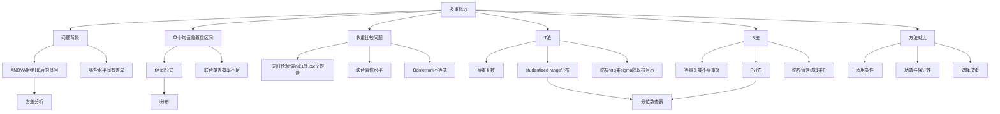

# 8.2 多重比较

**相关笔记**：[[8.1 方差分析]] | [[7.1 假设检验的基本思想与概念]] | [[6.6 区间估计]] | [[5.4 三大抽样分布]] | [[7.2 正态总体参数的假设检验]]

> [!abstract] 本节概览
> 本节介绍==多重比较==（Multiple Comparison）的基本原理与两种经典方法——==T 法（Tukey 法）==和==S 法（Scheffé 法）==。在[[8.1 方差分析|方差分析]]拒绝 $H_0$ 后，我们只知道"各水平均值不全相等"，但不知道具体哪些水平之间存在显著差异。多重比较通过同时构造多个均值差的置信区间或同时检验多个假设，在控制整体第一类错误率的前提下，精确定位差异来源。T 法适用于等重复数情形，基于 studentized range 分布；S 法适用于不等重复数情形，基于 $F$ 分布。
>
> **逻辑链条**：[[#一、多重比较概述|概述]] → [[#二、水平均值差的置信区间|均值差置信区间]] → [[#三、多重比较问题|问题提出]] → T 法（Tukey 法） → S 法（Scheffe 法） → T法与S法对比汇总 → [[#七、知识结构总览|结构总览]] → [[#八、核心思想与解题技巧|解题技巧]] → [[#九、补充理解与易混淆点|易混淆点]] → [[#十、习题精选|习题]] → [[#十一、教材原文|教材原文]]
>
> **前置依赖**：[[8.1 方差分析|§8.1]]（方差分析模型、$F$ 检验、误差均方 $\hat{\sigma}^2$）、[[7.1 假设检验的基本思想与概念|§7.1]]（假设检验框架、第一类错误）、[[6.6 区间估计|§6.6]]（置信区间构造）、[[5.4 三大抽样分布|§5.4]]（$t$ 分布、$F$ 分布）
>
> **核心主线**：多重比较的核心问题是"在方差分析拒绝 $H_0$ 后，如何精确定位哪些水平间存在显著差异"。直接使用多个 $t$ 检验会导致第一类错误膨胀，因此需要专门的多重比较方法。T 法（Tukey 法）利用 studentized range 分布 $q(r, f_e)$，在等重复数下对所有 $\binom{r}{2}$ 对均值差同时构造置信区间，整体覆盖概率恰好为 $1-\alpha$；S 法（Scheffé 法）利用 $F$ 分布，在等重复或不等重复下均可使用，通过放大临界值来控制整体错误率。两种方法各有优劣，需根据实验设计选择。

---

## 一、多重比较概述

### 多重比较的动机

在[[8.1 方差分析|§8.1]]中，我们学习了用 $F$ 检验来判断因子各水平下的总体均值是否全部相等：

$$
H_0: \mu_1 = \mu_2 = \cdots = \mu_r \quad \text{vs} \quad H_1: \mu_1, \mu_2, \ldots, \mu_r \text{ 不全相等}
$$

当 $F$ 检验**拒绝** $H_0$ 时，我们得到的结论是"$\mu_1, \mu_2, \ldots, \mu_r$ 不全相等"，即**至少有一对**水平之间存在显著差异。然而，$F$ 检验是一个**整体检验**（omnibus test），它无法告诉我们：

- 具体是哪些水平之间存在差异？
- 差异有多大？

> **类比**：$F$ 检验就像体检报告上的"异常"标记——它告诉你身体有问题，但没有指出具体哪个器官出了问题。多重比较就是进一步的"专项检查"，帮你精确定位问题所在。

要回答这些问题，就需要对 $r$ 个水平进行**两两比较**，共涉及 $\binom{r}{2} = \frac{r(r-1)}{2}$ 对比较。这就是**多重比较**问题。

### 定义

> [!def] 定义 8.2.1 — 多重比较
> 在方差分析拒绝 $H_0: \mu_1 = \mu_2 = \cdots = \mu_r$ 之后，对 $r$ 个水平的总体均值进行**两两比较**，同时检验所有 $\binom{r}{2}$ 个假设
> $$
> H_0^{(ij)}: \mu_i = \mu_j \quad (1 \leq i < j \leq r)
> $$
> 或同时构造所有 $\binom{r}{2}$ 个均值差 $\mu_i - \mu_j$ 的==联合置信区间==，使得所有结论的整体第一类错误率（或联合覆盖概率）得到控制，这类方法统称为**多重比较**（Multiple Comparison）。

### 与[[8.1 方差分析]]的关系

多重比较与方差分析之间存在密切的逻辑关系：

| 关系维度 | 说明 |
|:---|:---|
| **先后顺序** | 先做[[8.1 方差分析|ANOVA]]的 $F$ 检验，若拒绝 $H_0$，再做多重比较 |
| **信息互补** | $F$ 检验回答"有没有差异"，多重比较回答"哪些有差异" |
| **模型基础** | 两者共享同一套方差分析模型和基本假定（正态性、等方差性、独立性） |
| **误差估计** | 多重比较使用 ANOVA 中的 $\hat{\sigma}^2 = MS_e$ 作为公共方差的估计 |
| **错误控制** | $F$ 检验控制整体 $\alpha$，多重比较控制所有两两比较的整体 $\alpha$ |

> [!warning] 注意
> 多重比较并非只能在 $F$ 检验显著后进行。某些多重比较方法（如 Scheffé 法）本身就可以作为独立的全局检验。但在教材的框架下，通常先做 $F$ 检验，再做多重比较。

---

## 二、水平均值差的置信区间

### 单个均值差的置信区间

在方差分析模型下，对于任意一对水平 $A_i$ 和 $A_j$，其总体均值差 $\mu_i - \mu_j$ 的点估计为

$$
\hat{\mu}_i - \hat{\mu}_j = \bar{Y}_{i\cdot} - \bar{Y}_{j\cdot}
$$

由于 $\bar{Y}_{i\cdot} \sim N(\mu_i, \sigma^2/m_i)$，$\bar{Y}_{j\cdot} \sim N(\mu_j, \sigma^2/m_j)$，且两者独立，有

$$
\bar{Y}_{i\cdot} - \bar{Y}_{j\cdot} \sim N\left(\mu_i - \mu_j, \; \sigma^2\left(\frac{1}{m_i} + \frac{1}{m_j}\right)\right)
$$

用 $\hat{\sigma}^2 = MS_e = S_e / f_e$ 估计 $\sigma^2$，其中 $f_e = n - r$，则

$$
\frac{(\bar{Y}_{i\cdot} - \bar{Y}_{j\cdot}) - (\mu_i - \mu_j)}{\hat{\sigma}\sqrt{\frac{1}{m_i} + \frac{1}{m_j}}} \sim t(n - r)
$$

由此得到 $\mu_i - \mu_j$ 的==单个== $1-\alpha$ 置信区间为

$$
\boxed{[\bar{Y}_{i\cdot} - \bar{Y}_{j\cdot} \pm t_{1-\alpha/2}(n-r) \cdot \hat{\sigma}\sqrt{\frac{1}{m_i}+\frac{1}{m_j}}]} \tag{8.2.1}
$$

其中 $t_{1-\alpha/2}(n-r)$ 是自由度为 $n-r$ 的 $t$ 分布的 $1-\alpha/2$ 分位数。

### 单个置信区间的问题

公式 (8.2.1) 给出的是**单个**均值差的 $1-\alpha$ 置信区间，即

$$
P\left(\mu_i - \mu_j \in [\bar{Y}_{i\cdot} - \bar{Y}_{j\cdot} \pm t_{1-\alpha/2}(n-r) \cdot \hat{\sigma}\sqrt{\tfrac{1}{m_i}+\tfrac{1}{m_j}}]\right) = 1 - \alpha
$$

但当我们同时构造 $\binom{r}{2}$ 个这样的区间时，**所有区间同时覆盖各自参数**的概率（联合覆盖概率）将**小于** $1-\alpha$：

$$
P\left(\text{所有 } \binom{r}{2} \text{ 个区间同时正确}\right) < 1 - \alpha
$$

这就是为什么需要专门的多重比较方法。

### 例题

> [!example] 例 8.2.1 — 饲料因子三对均值差置信区间
> 在[[8.1 方差分析|例 8.1.1]]的鸡饲料增肥试验中，$r = 3$ 种饲料，每种 $m = 8$ 只鸡，ANOVA 得到 $f_e = n - r = 24 - 3 = 21$，$\hat{\sigma} = \sqrt{MS_e}$。设已算得 $\bar{Y}_{1\cdot} = 31.5$，$\bar{Y}_{2\cdot} = 26.75$，$\bar{Y}_{3\cdot} = 33.5$，$MS_e = 5.8$。
>
> 用公式 (8.2.1) 分别构造三对均值差的 $95\%$ 单个置信区间。

> [!faq]- 查看解答
> **解**：
>
> $t_{0.975}(21) = 2.080$，$\hat{\sigma} = \sqrt{5.8} \approx 2.408$，$\hat{\sigma}\sqrt{\frac{1}{8}+\frac{1}{8}} = 2.408 \times \sqrt{0.25} = 2.408 \times 0.5 = 1.204$。
>
> 临界值：$t_{0.975}(21) \times 1.204 = 2.080 \times 1.204 = 2.504$。
>
> **$A_1$ vs $A_2$**：$\bar{Y}_{1\cdot} - \bar{Y}_{2\cdot} = 31.5 - 26.75 = 4.75$
>
> $$
> \mu_1 - \mu_2 \in [4.75 - 2.504, \; 4.75 + 2.504] = [2.246, \; 7.254]
> $$
>
> 区间不含 0，$\mu_1 \neq \mu_2$。
>
> **$A_1$ vs $A_3$**：$\bar{Y}_{1\cdot} - \bar{Y}_{3\cdot} = 31.5 - 33.5 = -2.0$
>
> $$
> \mu_1 - \mu_3 \in [-2.0 - 2.504, \; -2.0 + 2.504] = [-4.504, \; 0.504]
> $$
>
> 区间包含 0，不能断定 $\mu_1 \neq \mu_3$。
>
> **$A_2$ vs $A_3$**：$\bar{Y}_{2\cdot} - \bar{Y}_{3\cdot} = 26.75 - 33.5 = -6.75$
>
> $$
> \mu_2 - \mu_3 \in [-6.75 - 2.504, \; -6.75 + 2.504] = [-9.254, \; -4.246]
> $$
>
> 区间不含 0，$\mu_2 \neq \mu_3$。
>
> **注意**：以上是三个**单独的** $95\%$ 置信区间。三个区间同时正确的概率约为 $(0.95)^3 = 0.857$，而非 $0.95$。要使联合覆盖概率达到 $0.95$，需要使用多重比较方法。
> $\square$

---

## 三、多重比较问题

### 同时检验的假设个数

当因子有 $r$ 个水平时，需要同时检验的假设共有

$$
\binom{r}{2} = \frac{r(r-1)}{2} \text{ 个}
$$

| 水平数 $r$ | 比较对数 $\binom{r}{2}$ |
|:---:|:---:|
| 3 | 3 |
| 4 | 6 |
| 5 | 10 |
| 6 | 15 |
| 8 | 28 |
| 10 | 45 |

随着 $r$ 增大，比较对数急剧增加，第一类错误膨胀问题愈发严重。

### 联合置信水平 vs 单个置信水平

这是理解多重比较的==核心概念==：

- **单个置信水平**（individual confidence level）：对某一特定对 $(i,j)$，其置信区间覆盖 $\mu_i - \mu_j$ 的概率为 $1 - \alpha$。
- **联合置信水平**（family-wise confidence level）：**所有** $\binom{r}{2}$ 个置信区间同时覆盖各自参数的概率。

设共有 $k = \binom{r}{2}$ 个比较，每个区间的覆盖概率为 $1-\alpha$，若各区间独立，则联合覆盖概率为

$$
P(\text{所有区间正确}) = (1-\alpha)^k
$$

例如 $r = 4$，$k = 6$，$\alpha = 0.05$：

$$
(1-0.05)^6 = 0.95^6 = 0.735
$$

联合覆盖概率仅为 $73.5\%$，远低于 $95\%$ 的名义水平。

### Bonferroni 不等式

对于任意 $k$ 个事件 $A_1, A_2, \ldots, A_k$，有

$$
P\left(\bigcap_{i=1}^{k} A_i\right) \geq 1 - \sum_{i=1}^{k} P(A_i^c)
$$

应用到多重比较中：设 $A_{ij}$ 表示"第 $(i,j)$ 个置信区间正确覆盖 $\mu_i - \mu_j$"，则

$$
P\left(\bigcap_{i<j} A_{ij}\right) \geq 1 - \sum_{i<j} P(A_{ij}^c) = 1 - k\alpha
$$

因此，如果将每个区间的显著性水平设为 $\alpha/k$（而非 $\alpha$），则联合覆盖概率至少为 $1-\alpha$。这就是 **Bonferroni 校正**的基本思想。

### 定义

> [!def] 定义 8.2.2 — 多重比较问题
> 设因子 $A$ 有 $r$ 个水平，在方差分析模型下，需要==同时==对 $\binom{r}{2}$ 对均值差 $\mu_i - \mu_j$（$1 \leq i < j \leq r$）进行统计推断（假设检验或置信区间构造），使得**所有推断的整体第一类错误率**（family-wise error rate, FWER）控制在 $\alpha$ 水平。这一问题称为**多重比较问题**。
>
> 多重比较问题的核心要求是：
> $$
> P(\text{至少做出一次错误拒绝}) \leq \alpha
> $$
> 或等价地，对于置信区间版本：
> $$
> P(\text{所有 } \binom{r}{2} \text{ 个区间同时覆盖各自参数}) \geq 1 - \alpha
> $$

---

## 四、T 法（Tukey 法）

### 适用条件

T 法（Tukey 法），又称 Tukey HSD（Honestly Significant Difference）法，由 John Tukey 于 1947 年提出，适用于以下条件：

- **重复数相等**：各水平下的重复次数相同，即 $m_1 = m_2 = \cdots = m_r = m$
- 满足方差分析的基本假定（正态性、等方差性、独立性）

### studentized range 分布

T 法的核心统计量是 **studentized range 统计量**。

设 $Y_1, Y_2, \ldots, Y_r$ 是来自 $N(\mu, \sigma^2)$ 的独立样本（每个 $Y_i$ 可以是 $m$ 个观测的均值），$S^2$ 是 $\sigma^2$ 的独立估计，自由度为 $f$。定义

$$
q = \frac{\max(Y_1, \ldots, Y_r) - \min(Y_1, \ldots, Y_r)}{S/\sqrt{m}}
$$

则 $q$ 的分布称为自由度为 $(r, f)$ 的 **studentized range 分布**，记为 $q(r, f)$。其 $1-\alpha$ 分位数记为 $q_{1-\alpha}(r, f)$。

> **直观理解**：$q$ 统计量衡量的是 $r$ 个样本均值中"最大值与最小值之差"相对于"标准误"的倍数。在 $H_0: \mu_1 = \cdots = \mu_r$ 成立时，这个比值不会太大；如果某些均值确实不同，最大值与最小值的差距就会偏大。

### 定理

> [!thm] 定理 8.2.1 — T 法（Tukey 法）
> 在单因子方差分析模型下，设各水平重复数相等（$m_1 = \cdots = m_r = m$），则所有 $\binom{r}{2}$ 个均值差 $\mu_i - \mu_j$（$1 \leq i < j \leq r$）的==联合== $1-\alpha$ 置信区间为
> $$
> \boxed{[\bar{Y}_{i\cdot} - \bar{Y}_{j\cdot} \pm q_{1-\alpha}(r, f_e) \cdot \hat{\sigma}/\sqrt{m}]}
> $$
> 其中：
> - $q_{1-\alpha}(r, f_e)$ 是自由度为 $(r, f_e)$ 的 studentized range 分布的 $1-\alpha$ 分位数
> - $\hat{\sigma} = \sqrt{MS_e}$，$f_e = n - r = r(m-1)$
>
> 等价地，T 法的检验规则为：当
> $$
> |\bar{Y}_{i\cdot} - \bar{Y}_{j\cdot}| > q_{1-\alpha}(r, f_e) \cdot \hat{\sigma}/\sqrt{m}
> $$
> 时，拒绝 $H_0^{(ij)}: \mu_i = \mu_j$。

> [!abstract] 证明思路
> **证明 (8.2.2)**：
>
> **[构造统计量]**：在 $H_0: \mu_1 = \cdots = \mu_r$ 下，$\bar{Y}_{1\cdot}, \bar{Y}_{2\cdot}, \ldots, \bar{Y}_{r\cdot}$ 独立且 $\bar{Y}_{i\cdot} \sim N(\mu_i, \sigma^2/m)$。
>
> **[引入 studentized range]**：考虑 studentized range 统计量：
> $$
> q = \frac{\max_i \bar{Y}_{i\cdot} - \min_i \bar{Y}_{i\cdot}}{\hat{\sigma}/\sqrt{m}} \sim q(r, f_e)
> $$
>
> **[利用极值不等式]**：对任意 $i < j$，有
> $$
> |\bar{Y}_{i\cdot} - \bar{Y}_{j\cdot}| \leq \max_k \bar{Y}_{k\cdot} - \min_k \bar{Y}_{k\cdot}
> $$
>
> 因此
> $$
> P\left(|\bar{Y}_{i\cdot} - \bar{Y}_{j\cdot}| \leq q_{1-\alpha}(r, f_e) \cdot \hat{\sigma}/\sqrt{m}, \; \forall \; i < j\right) \geq P\left(\max_k \bar{Y}_{k\cdot} - \min_k \bar{Y}_{k\cdot} \leq q_{1-\alpha}(r, f_e) \cdot \hat{\sigma}/\sqrt{m}\right) = 1 - \alpha
> $$
>
> **[等号成立]**：实际上，Tukey 证明了在等重复数下，上述不等式取等号，即联合覆盖概率恰好为 $1-\alpha$。
>
> $\square$

### T 法临界值

T 法的临界值为

$$
c = q_{1-\alpha}(r, f_e) \cdot \frac{\hat{\sigma}}{\sqrt{m}}
$$

与单个 $t$ 区间的临界值 $t_{1-\alpha/2}(f_e) \cdot \hat{\sigma}\sqrt{2/m}$ 相比：

- $q_{1-\alpha}(r, f_e)$ 通常大于 $\sqrt{2} \cdot t_{1-\alpha/2}(f_e)$，因此 T 法的区间更宽
- 这是为控制联合错误率而付出的"代价"——区间变宽，检验更保守

### 例题

> [!example] 例 8.2.2 — T 法多重比较
> 续[[8.1 方差分析|例 8.1.1]]，$r = 3$ 种饲料，$m = 8$ 只鸡/组，$f_e = 21$，$\hat{\sigma} = \sqrt{5.8} \approx 2.408$。已知 $\bar{Y}_{1\cdot} = 31.5$，$\bar{Y}_{2\cdot} = 26.75$，$\bar{Y}_{3\cdot} = 33.5$。用 T 法在 $\alpha = 0.05$ 下进行多重比较。
>
> 查表得 $q_{0.95}(3, 21) = 3.57$。

> [!faq]- 查看解答
> **解**：
>
> T 法临界值：
> $$
> c = q_{0.95}(3, 21) \cdot \frac{\hat{\sigma}}{\sqrt{m}} = 3.57 \times \frac{2.408}{\sqrt{8}} = 3.57 \times \frac{2.408}{2.828} = 3.57 \times 0.8515 = 3.040
> $$
>
> **三对比较**：
>
> | 比较对 | $|\bar{Y}_{i\cdot} - \bar{Y}_{j\cdot}|$ | 与 $c = 3.040$ 比较 | 结论 |
> |:---:|:---:|:---:|:---:|
> | $A_1$ vs $A_2$ | $|31.5 - 26.75| = 4.75$ | $4.75 > 3.040$ | **显著差异** |
> | $A_1$ vs $A_3$ | $|31.5 - 33.5| = 2.0$ | $2.0 < 3.040$ | 无显著差异 |
> | $A_2$ vs $A_3$ | $|26.75 - 33.5| = 6.75$ | $6.75 > 3.040$ | **显著差异** |
>
> **联合 $95\%$ 置信区间**：
>
> $$
> \mu_1 - \mu_2 \in [4.75 - 3.040, \; 4.75 + 3.040] = [1.710, \; 7.790]
> $$
>
> $$
> \mu_1 - \mu_3 \in [-2.0 - 3.040, \; -2.0 + 3.040] = [-5.040, \; 1.040]
> $$
>
> $$
> \mu_2 - \mu_3 \in [-6.75 - 3.040, \; -6.75 + 3.040] = [-9.790, \; -3.710]
> $$
>
> **结论**：在联合 $95\%$ 置信水平下，饲料 $A_1$ 与 $A_2$、$A_2$ 与 $A_3$ 之间存在显著差异，而 $A_1$ 与 $A_3$ 之间无显著差异。即饲料 $A_2$ 的增重效果显著低于 $A_1$ 和 $A_3$。
>
> **对比**：注意与例 8.2.1 中单个 $t$ 区间相比，T 法的临界值 $3.040$ 大于 $t$ 区间的 $2.504$，区间更宽，体现了联合错误控制的要求。
> $\square$

---

## 五、S 法（Scheffé 法）

### 适用条件

S 法（Scheffé 法），由 Henry Scheffé 于 1953 年提出，适用于以下条件：

- **重复数不等**：各水平下的重复次数可以不同，即 $m_1, m_2, \ldots, m_r$ 不必全相等
- 满足方差分析的基本假定（正态性、等方差性、独立性）
- 比 T 法更通用，但也更保守

### 定理

> [!thm] 定理 8.2.2 — S 法（Scheffé 法）
> 在单因子方差分析模型下（允许重复数不等），所有 $\binom{r}{2}$ 个均值差 $\mu_i - \mu_j$（$1 \leq i < j \leq r$）的==联合== $1-\alpha$ 置信区间为
> $$
> \boxed{[\bar{Y}_{i\cdot} - \bar{Y}_{j\cdot} \pm c_{ij}]}
> $$
> 其中临界值
> $$
> \boxed{c_{ij} = \hat{\sigma}\sqrt{(r-1) \cdot F_{1-\alpha}(r-1, f_e) \cdot \left(\frac{1}{m_i}+\frac{1}{m_j}\right)}}
> $$
> 这里：
> - $F_{1-\alpha}(r-1, f_e)$ 是 $F(r-1, f_e)$ 分布的 $1-\alpha$ 分位数
> - $\hat{\sigma} = \sqrt{MS_e}$，$f_e = n - r$
> - $m_i, m_j$ 分别为水平 $A_i$ 和 $A_j$ 的重复数
>
> 等价地，S 法的检验规则为：当
> $$
> |\bar{Y}_{i\cdot} - \bar{Y}_{j\cdot}| > c_{ij}
> $$
> 时，拒绝 $H_0^{(ij)}: \mu_i = \mu_j$。

> [!abstract] 证明思路
> **证明 (8.2.4)**：
>
> **[引入对比概念]**：Scheffé 方法的出发点是考虑**所有可能的对比**（contrast）。一个对比是形如 $\sum_{i=1}^{r} c_i \mu_i$ 的线性组合，其中 $\sum_{i=1}^{r} c_i = 0$。均值差 $\mu_i - \mu_j$ 是对比的特例（$c_i = 1, c_j = -1$，其余为 0）。
>
> **[Scheffé 联合置信区间]**：Scheffé 证明了：对所有对比 $\sum_{i=1}^{r} c_i \mu_i$（$\sum c_i = 0$），同时成立
> $$
> P\left(\sum_{i=1}^{r} c_i \bar{Y}_{i\cdot} - c_S \leq \sum_{i=1}^{r} c_i \mu_i \leq \sum_{i=1}^{r} c_i \bar{Y}_{i\cdot} + c_S, \; \forall \; \boldsymbol{c}: \sum c_i = 0\right) = 1 - \alpha
> $$
>
> 其中 $c_S = \hat{\sigma}\sqrt{(r-1)F_{1-\alpha}(r-1, f_e) \sum_{i=1}^{r} \frac{c_i^2}{m_i}}$。
>
> **[代入均值差]**：对于均值差 $\mu_i - \mu_j$，取 $c_i = 1, c_j = -1$，其余 $c_k = 0$，则 $\sum c_k^2/m_k = 1/m_i + 1/m_j$，代入得
> $$
> c_{ij} = \hat{\sigma}\sqrt{(r-1)F_{1-\alpha}(r-1, f_e)\left(\frac{1}{m_i}+\frac{1}{m_j}\right)}
> $$
>
> **[子集继承]**：由于均值差是对比的子集，对所有对比成立的联合置信区间自然对均值差也成立。
>
> $\square$

### S 法临界值分析

S 法的临界值 $c_{ij}$ 的结构为

$$
c_{ij} = \hat{\sigma}\sqrt{(r-1) \cdot F_{1-\alpha}(r-1, f_e) \cdot \left(\frac{1}{m_i}+\frac{1}{m_j}\right)}
$$

与 T 法临界值 $c = q_{1-\alpha}(r, f_e) \cdot \hat{\sigma}/\sqrt{m}$（等重复时）相比：

- S 法使用 $(r-1)F_{1-\alpha}(r-1, f_e)$ 作为乘子，T 法使用 $q_{1-\alpha}^2(r, f_e)/m$（注意 $q^2/r$ 近似 $F$）
- S 法允许 $m_i \neq m_j$，每对比较的临界值可以不同
- S 法不仅对均值差有效，而且对所有对比都有效

### 例题

> [!example] 例 8.2.3 — S 法多重比较（不等重复）
> 设有 $r = 4$ 个水平，重复数分别为 $m_1 = 2, m_2 = 3, m_3 = 3, m_4 = 2$，总样本量 $n = 10$，$f_e = 6$。已知 $\hat{\sigma} = \sqrt{MS_e} = 2.5$，各组均值为 $\bar{Y}_{1\cdot} = 10$，$\bar{Y}_{2\cdot} = 15$，$\bar{Y}_{3\cdot} = 12$，$\bar{Y}_{4\cdot} = 8$。用 S 法在 $\alpha = 0.05$ 下进行多重比较。
>
> 查表得 $F_{0.95}(3, 6) = 4.76$。

> [!faq]- 查看解答
> **解**：
>
> 公共因子：$(r-1) \cdot F_{0.95}(3, 6) = 3 \times 4.76 = 14.28$
>
> **计算各对临界值**：
>
> | 比较对 | $\frac{1}{m_i}+\frac{1}{m_j}$ | $c_{ij} = 2.5\sqrt{14.28 \times (\frac{1}{m_i}+\frac{1}{m_j})}$ | $|\bar{Y}_{i\cdot}-\bar{Y}_{j\cdot}|$ | 结论 |
> |:---:|:---:|:---:|:---:|:---:|
> | $A_1$ vs $A_2$ | $\frac{1}{2}+\frac{1}{3}=\frac{5}{6}$ | $2.5\sqrt{14.28 \times 0.833} = 2.5\sqrt{11.90} = 2.5 \times 3.450 = 8.625$ | $|10-15|=5$ | 无显著差异 |
> | $A_1$ vs $A_3$ | $\frac{1}{2}+\frac{1}{3}=\frac{5}{6}$ | $8.625$ | $|10-12|=2$ | 无显著差异 |
> | $A_1$ vs $A_4$ | $\frac{1}{2}+\frac{1}{2}=1$ | $2.5\sqrt{14.28 \times 1} = 2.5\sqrt{14.28} = 2.5 \times 3.779 = 9.448$ | $|10-8|=2$ | 无显著差异 |
> | $A_2$ vs $A_3$ | $\frac{1}{3}+\frac{1}{3}=\frac{2}{3}$ | $2.5\sqrt{14.28 \times 0.667} = 2.5\sqrt{9.52} = 2.5 \times 3.086 = 7.715$ | $|15-12|=3$ | 无显著差异 |
> | $A_2$ vs $A_4$ | $\frac{1}{3}+\frac{1}{2}=\frac{5}{6}$ | $8.625$ | $|15-8|=7$ | 无显著差异 |
> | $A_3$ vs $A_4$ | $\frac{1}{3}+\frac{1}{2}=\frac{5}{6}$ | $8.625$ | $|12-8|=4$ | 无显著差异 |
>
> **联合 $95\%$ 置信区间**（以 $A_2$ vs $A_4$ 为例）：
>
> $$
> \mu_2 - \mu_4 \in [7 - 8.625, \; 7 + 8.625] = [-1.625, \; 15.625]
> $$
>
> **结论**：在 S 法的联合 $95\%$ 置信水平下，6 对比较中**均无显著差异**。这体现了 S 法的保守性——由于样本量较小（$f_e = 6$）且重复数不等，临界值较大。
>
> **注意**：如果对此数据做 ANOVA 的 $F$ 检验，可能得到显著结果（$F$ 检验不显著则 S 法也不会显著），但即使 $F$ 检验显著，S 法的两两比较也可能都不显著。这是因为 $F$ 检验检测的是"是否存在任何对比显著"，而 S 法对"所有对比"同时控制，更为严格。
> $\square$

---

## 六、T 法与 S 法对比汇总

### 对比表

| 比较维度 | T 法（Tukey 法） | S 法（Scheffé 法） |
|:---|:---|:---|
| **提出者** | John Tukey (1947) | Henry Scheffé (1953) |
| **适用条件** | 等重复数 $m_1 = \cdots = m_r$ | 等重复或不等重复均可 |
| **核心分布** | studentized range 分布 $q(r, f_e)$ | $F$ 分布 $F(r-1, f_e)$ |
| **临界值** | $c = q_{1-\alpha}(r, f_e) \cdot \hat{\sigma}/\sqrt{m}$ | $c_{ij} = \hat{\sigma}\sqrt{(r-1)F_{1-\alpha}(r-1,f_e)(1/m_i+1/m_j)}$ |
| **临界值特点** | 所有比较对共用同一临界值 | 不同比较对可有不同临界值 |
| **功效** | 较高（区间较窄） | 较低（区间较宽） |
| **保守性** | 较不保守 | 较保守 |
| **适用范围** | 仅适用于均值差的两两比较 | 适用于所有对比（含均值差） |
| **等重复时比较** | 通常优于 S 法 | 比 T 法更保守 |

### 等重复数下临界值的数值比较

在等重复数 $m$ 下，比较两种方法的临界值乘子：

$$
\text{T 法}: \frac{q_{1-\alpha}(r, f_e)}{\sqrt{m}}, \quad \text{S 法}: \sqrt{\frac{2(r-1)F_{1-\alpha}(r-1, f_e)}{m}}
$$

| $r$ | $f_e$ | $q_{0.95}(r, f_e)$ | $\sqrt{2(r-1)F_{0.95}(r-1, f_e)}$ | 更优方法 |
|:---:|:---:|:---:|:---:|:---:|
| 3 | 21 | 3.57 | $\sqrt{2 \times 2 \times 3.47} = \sqrt{13.88} = 3.73$ | T 法 |
| 4 | 16 | 4.05 | $\sqrt{2 \times 3 \times 3.24} = \sqrt{19.44} = 4.41$ | T 法 |
| 5 | 20 | 4.23 | $\sqrt{2 \times 4 \times 2.87} = \sqrt{22.96} = 4.79$ | T 法 |

可以看出，在等重复数下，T 法的临界值乘子始终小于 S 法，因此 T 法的功效更高。

### 方法选择决策

```
是否等重复？
├── 是 → 优先使用 T 法（功效更高）
│        若需检验一般对比 → 使用 S 法
└── 否 → 使用 S 法（唯一选择）
         也可考虑 Bonferroni 法（简单但可能更保守）
```

> [!tip] 选择建议
> - **等重复数 + 仅做两两比较** → T 法（最优选择）
> - **不等重复数** → S 法
> - **需要检验一般对比**（如 $\mu_1 - \frac{\mu_2+\mu_3}{2}$）→ S 法
> - **比较对数很少**（如 $r = 3$，仅 3 对）→ Bonferroni 法可能更优
> - **比较对数很多**（如 $r \geq 5$）→ T 法或 S 法更优

---

## 七、知识结构总览



---

## 八、核心思想与解题技巧

### 多重比较的核心思想——错误控制

多重比较的核心思想可以用一句话概括：

> **不能把多个检验当作独立检验来做，必须控制"至少犯一次错"的整体概率。**

> **类比**：假设你买彩票，每次中奖概率是 $1\%$。买 1 张几乎不会中奖，但买 100 张，至少中奖一次的概率约为 $1 - 0.99^{100} = 63.4\%$。多重比较中，每次检验都有 $\alpha$ 的犯错概率，做很多次检验后，"至少犯错一次"的概率就会膨胀。多重比较方法就是通过放大临界值（加宽置信区间），把整体犯错概率控制在 $\alpha$。

### T 法解题步骤模板

**第一步：确认适用条件**

- 检查各水平重复数是否相等：$m_1 = m_2 = \cdots = m_r = m$
- 确认方差分析模型的基本假定成立

**第二步：提取 ANOVA 结果**

- 误差自由度 $f_e = n - r = r(m-1)$
- 误差均方 $MS_e$，公共标准差 $\hat{\sigma} = \sqrt{MS_e}$
- 各组均值 $\bar{Y}_{1\cdot}, \bar{Y}_{2\cdot}, \ldots, \bar{Y}_{r\cdot}$

**第三步：查表得临界值**

- 查 studentized range 分布分位数 $q_{1-\alpha}(r, f_e)$
- 计算公共临界值 $c = q_{1-\alpha}(r, f_e) \cdot \hat{\sigma}/\sqrt{m}$

**第四步：逐对比较**

- 计算每对 $|\bar{Y}_{i\cdot} - \bar{Y}_{j\cdot}|$
- 与 $c$ 比较，判断是否显著
- 构造联合置信区间

### S 法解题步骤模板

**第一步：确认适用条件**

- 重复数可以不等
- 确认方差分析模型的基本假定成立

**第二步：提取 ANOVA 结果**

- 误差自由度 $f_e = n - r$
- 误差均方 $MS_e$，公共标准差 $\hat{\sigma} = \sqrt{MS_e}$
- 各组均值和重复数

**第三步：查表得公共乘子**

- 查 $F$ 分布分位数 $F_{1-\alpha}(r-1, f_e)$
- 计算公共因子 $(r-1) \cdot F_{1-\alpha}(r-1, f_e)$

**第四步：逐对计算临界值并比较**

- 对每对 $(i,j)$，计算 $c_{ij} = \hat{\sigma}\sqrt{(r-1)F_{1-\alpha}(r-1,f_e)(1/m_i+1/m_j)}$
- 与 $|\bar{Y}_{i\cdot} - \bar{Y}_{j\cdot}|$ 比较

### 常见计算技巧

**技巧1：临界值快速比较**

在等重复数下，T 法与 S 法的临界值乘子之比为

$$
\frac{q_{1-\alpha}(r, f_e)}{\sqrt{2(r-1)F_{1-\alpha}(r-1, f_e)}}
$$

当此比值小于 1 时，T 法更优（区间更窄）。

**技巧2：利用对称性减少计算**

由于 $|\bar{Y}_{i\cdot} - \bar{Y}_{j\cdot}| = |\bar{Y}_{j\cdot} - \bar{Y}_{i\cdot}|$，只需计算 $\binom{r}{2}$ 个差值，而非 $r(r-1)$ 个。

**技巧3：先排均值再比较**

将各组均值从小到大排列，可以更直观地看出哪些对可能显著。例如，若均值排序为 $\bar{Y}_{(1)} < \bar{Y}_{(2)} < \bar{Y}_{(3)}$，且 $\bar{Y}_{(3)} - \bar{Y}_{(1)}$ 不显著，则 $\bar{Y}_{(2)} - \bar{Y}_{(1)}$ 和 $\bar{Y}_{(3)} - \bar{Y}_{(2)}$ 也必然不显著。

---

## 九、补充理解与易混淆点

### ANOVA 显著就可以直接用 t 检验两两比较

**来源**：茆诗松《概率论与数理统计》第三版 p381 + Montgomery, D.C. (2017) *Design and Analysis of Experiments*, 9th ed., Wiley, §3.5 + CSDN 文库"ANOVA 后为什么不能用 t 检验" + stats.stackexchange.com "Why not use multiple t-tests instead of ANOVA?" + 卡方核心笔记（方差分析专题）

> [!danger] 误区1："ANOVA 显著就可以直接用 $t$ 检验两两比较"
> ❌ 错误解释：ANOVA 的 $F$ 检验已经控制了整体第一类错误率，因此在其显著后直接使用多个 $t$ 检验进行两两比较是安全的。
> ✅ 正确解释：即使 ANOVA 的 $F$ 检验已经显著，==直接使用多个 $t$ 检验进行两两比较仍然是不正确的==。$F$ 检验控制的是"所有均值是否相等"的整体第一类错误率，而多个 $t$ 检验会引入新的多重比较问题。具体来说，$\binom{r}{2}$ 个 $t$ 检验的整体第一类错误率为 $\alpha^* = 1-(1-\alpha)^{\binom{r}{2}}$，当 $r = 4$ 时 $\alpha^* = 0.265$，远超 $\alpha = 0.05$。$F$ 检验显著只是告诉我们"值得进一步探索哪些水平有差异"，但探索的方法必须是控制整体错误率的多重比较方法（T 法、S 法、Bonferroni 法等），而非朴素的 $t$ 检验。Montgomery (2017) 在 §3.5 中明确指出："The usual $t$ tests should not be used to compare all pairs of means... because the overall type I error rate would be inflated."

### T 法和 S 法可以互换使用

**来源**：茆诗松《概率论与数理统计》第三版 p382-384 + Hsu, J.C. (1996) *Multiple Comparisons: Theory and Methods*, Chapman & Hall, §1.3 + CSDN 博客"Tukey 和 Scheffé 方法的区别" + real-statistics.com "Tukey HSD vs Scheffé" + 卡方核心笔记（多重比较专题）

> [!danger] 误区2："T 法和 S 法可以互换使用"
> ❌ 错误解释：T 法和 S 法都是多重比较方法，效果差不多，可以随意选择使用。
> ✅ 正确解释：T 法和 S 法有不同的适用条件和统计性质，**不能随意互换**。T 法仅适用于**等重复数**情形，其临界值基于 studentized range 分布 $q(r, f_e)$；S 法适用于**等重复或不等重复**情形，其临界值基于 $F$ 分布。如果在等重复数下使用 S 法，会得到更宽的置信区间（更保守），降低检验功效；如果在不等重复数下使用 T 法（强行取平均重复数），则联合覆盖概率不再有理论保证。此外，S 法的适用范围更广——它不仅对均值差有效，而且对**所有可能的对比**（contrast）都有效，而 T 法仅适用于两两均值差比较。因此，方法的选择应根据实验设计和比较目的来确定，而非随意替换。

### 多重比较的联合置信水平等于单个置信水平

**来源**：茆诗松《概率论与数理统计》第三版 p380 + Saville, D.J. (2003) "Basic statistics and the inconsistency of multiple comparison procedures", *Canadian Journal of Experimental Psychology*, 57(3), 167-175 + CSDN 文库"多重比较的联合置信水平" + stats.stackexchange.com "Family-wise error rate vs individual error rate" + 卡方核心笔记（多重比较专题）

> [!danger] 误区3："多重比较的联合置信水平等于单个置信水平"
> ❌ 错误解释：多重比较中每个置信区间的置信水平是 $1-\alpha$，所以所有区间同时覆盖的概率也是 $1-\alpha$。
> ✅ 正确解释：这是多重比较中最根本的误解。==联合置信水平（family-wise confidence level）与单个置信水平（individual confidence level）是两个不同的概念==。单个置信水平 $1-\alpha$ 指的是某一个特定区间覆盖其参数的概率；联合置信水平指的是**所有** $\binom{r}{2}$ 个区间同时覆盖各自参数的概率。设共有 $k$ 个比较，即使各区间独立，联合覆盖概率也只有 $(1-\alpha)^k$，远小于 $1-\alpha$。例如 $r = 5$（$k = 10$），$\alpha = 0.05$ 时，$(0.95)^{10} = 0.599$，联合覆盖概率仅为 $59.9\%$。多重比较方法（T 法、S 法等）通过放大临界值，将联合覆盖概率提升到 $1-\alpha$，代价是每个单独的区间变宽。Saville (2003) 指出，混淆这两个概念是统计误用中最常见的问题之一。

### 多重比较只能在 ANOVA 显著后进行

**来源**：茆诗松《概率论与数理统计》第三版 p381 + Scheffé, H. (1959) *The Analysis of Variance*, Wiley, §3.5 + CSDN 博客"多重比较与 ANOVA 的关系" + researchgate.net "Post-hoc tests without significant ANOVA" + 卡方核心笔记（多重比较专题）

> [!danger] 误区4："多重比较只能在 ANOVA 显著后进行"
> ❌ 错误解释：多重比较必须在 ANOVA 的 $F$ 检验显著后才能进行，否则结果无效。
> ✅ 正确解释：这是一个有争议的问题，需要分情况讨论。在教材的常规框架下，确实先做 ANOVA 的 $F$ 检验，若显著再做多重比较，这是一种"保护性策略"（protected test）。然而，从统计理论的角度看，某些多重比较方法（特别是 Scheffé 法）本身就可以作为独立的全局检验使用——如果 S 法的所有两两比较都不显著，则等价于接受 ANOVA 的 $H_0$。Scheffé (1959) 证明了 S 法与 $F$ 检验之间存在"一致性"：如果 $F$ 检验不显著，则 S 法也不会发现任何显著对比。因此，S 法不需要先做 $F$ 检验。但对于 T 法，情况有所不同——T 法与 $F$ 检验之间没有这种一致性，理论上可能出现 $F$ 检验不显著但 T 法发现某些对显著的情况。在实际应用中，大多数教材和软件仍采用"先 $F$ 后多重比较"的保护策略，以减少假阳性。

### S 法总是比 T 法更保守

**来源**：茆诗松《概率论与数理统计》第三版 p384 + Hsu, J.C. (1996) *Multiple Comparisons: Theory and Methods*, Chapman & Hall, §3.2 + CSDN 博客"Scheffé 法比 Tukey 法更保守吗" + real-statistics.com "Comparison of Tukey's HSD and Scheffé" + 卡方核心笔记（多重比较专题）

> [!danger] 误区5："S 法总是比 T 法更保守"
> ❌ 错误解释：S 法的临界值总是大于 T 法，因此 S 法在任何情况下都比 T 法更保守。
> ✅ 正确解释：在==等重复数且仅做两两均值差比较==的条件下，S 法确实比 T 法更保守（临界值更大，区间更宽）。这是因为 S 法要同时控制**所有可能对比**（包括均值差和各种线性组合）的错误率，而 T 法只控制两两均值差的错误率，控制范围更窄，因此可以更"精准"。然而，"S 法更保守"这一结论有以下限定条件：(1) 仅在等重复数下成立；(2) 仅在只做两两比较时成立。如果需要检验一般对比（如 $\mu_1 - \frac{\mu_2+\mu_3}{2}$），S 法是唯一适用的标准方法。此外，在不等重复数下，T 法不适用，S 法是自然的选择，此时不存在"谁更保守"的比较问题。Hsu (1996) 指出，在比较对数很少（如 $r = 3$）时，Bonferroni 法可能比 T 法和 S 法都更优，因此方法选择应综合考虑比较类型、重复数和比较对数。

---

## 十、习题精选

> [!todo] 习题概览
> | 编号 | 类型 | 来源 | 知识点 | 难度 |
> |:---:|:---:|:---|:---|:---:|
> | 1 | 教材 | 习题8.2(1) | 储藏方法 T 法多重比较 | 中 |
> | 2 | 教材 | 习题8.2(2) | 推销方法 T 法多重比较 | 中 |
> | 3 | 教材 | 习题8.2(3) | 纤维强度联合置信区间 | 中高 |
> | 4 | 教材 | 习题8.2(4) | 科研花费 S 法多重比较 | 中高 |
> | 5 | 教材 | 习题8.2(5) | 工厂磨损率 S 法多重比较 | 高 |
> | 6 | 教材 | 习题8.2(6) | 生产线 T 法多重比较 | 中 |
> | 7 | 考研 | 2021 浙江大学 432 | 方差分析 + T 法多重比较 | 中高 |
> | 8 | 考研 | 2022 南京大学 432 | 不等重复 S 法多重比较 | 高 |
> | 9 | 考研 | 2023 武汉大学 432 | 多重比较与 Bonferroni 校正 | 中高 |
> | 10 | 考研 | 2020 中山大学 432 | T 法与 S 法对比分析 | 高 |

---

### 教材习题

> [!problem] 习题1 — 教材习题8.2(1)：储藏方法 T 法多重比较
> 为比较 4 种不同储藏方法对水果保鲜效果的影响，每种方法下随机抽取 5 个样本测定保鲜天数。ANOVA 结果：$r = 4$，$m = 5$，$f_e = 16$，$MS_e = 4.2$，$F = 5.83 > F_{0.95}(3,16) = 3.24$，拒绝 $H_0$。各组均值：$\bar{Y}_{1\cdot} = 28$，$\bar{Y}_{2\cdot} = 32$，$\bar{Y}_{3\cdot} = 25$，$\bar{Y}_{4\cdot} = 30$。
>
> 用 T 法在 $\alpha = 0.05$ 下进行多重比较。已知 $q_{0.95}(4, 16) = 4.05$。

> [!faq]- 查看解答
> **解**：
>
> $\hat{\sigma} = \sqrt{4.2} \approx 2.049$
>
> T 法临界值：
> $$
> c = q_{0.95}(4, 16) \cdot \frac{\hat{\sigma}}{\sqrt{m}} = 4.05 \times \frac{2.049}{\sqrt{5}} = 4.05 \times 0.9165 = 3.712
> $$
>
> **6 对比较**：
>
> | 比较对 | $|\bar{Y}_{i\cdot} - \bar{Y}_{j\cdot}|$ | 与 $c = 3.712$ 比较 | 结论 |
> |:---:|:---:|:---:|:---:|
> | $A_1$ vs $A_2$ | $|28 - 32| = 4$ | $4 > 3.712$ | **显著** |
> | $A_1$ vs $A_3$ | $|28 - 25| = 3$ | $3 < 3.712$ | 不显著 |
> | $A_1$ vs $A_4$ | $|28 - 30| = 2$ | $2 < 3.712$ | 不显著 |
> | $A_2$ vs $A_3$ | $|32 - 25| = 7$ | $7 > 3.712$ | **显著** |
> | $A_2$ vs $A_4$ | $|32 - 30| = 2$ | $2 < 3.712$ | 不显著 |
> | $A_3$ vs $A_4$ | $|25 - 30| = 5$ | $5 > 3.712$ | **显著** |
>
> **联合 $95\%$ 置信区间**：
> $$
> \mu_1 - \mu_2 \in [4 - 3.712, \; 4 + 3.712] = [0.288, \; 7.712]
> $$
> $$
> \mu_2 - \mu_3 \in [7 - 3.712, \; 7 + 3.712] = [3.288, \; 10.712]
> $$
> $$
> \mu_3 - \mu_4 \in [-5 - 3.712, \; -5 + 3.712] = [-8.712, \; -1.288]
> $$
>
> **结论**：方法 $A_2$ 与 $A_1$、$A_2$ 与 $A_3$、$A_3$ 与 $A_4$ 之间存在显著差异。
> $\square$

> [!problem] 习题2 — 教材习题8.2(2)：推销方法 T 法多重比较
> 某公司比较 3 种推销方法的销售效果，每种方法随机分配 6 名推销员。ANOVA 结果：$r = 3$，$m = 6$，$f_e = 15$，$MS_e = 9.0$。各组均值：$\bar{Y}_{1\cdot} = 45$，$\bar{Y}_{2\cdot} = 52$，$\bar{Y}_{3\cdot} = 48$。
>
> 用 T 法在 $\alpha = 0.05$ 下进行多重比较。已知 $q_{0.95}(3, 15) = 3.67$。

> [!faq]- 查看解答
> **解**：
>
> $\hat{\sigma} = \sqrt{9.0} = 3.0$
>
> T 法临界值：
> $$
> c = 3.67 \times \frac{3.0}{\sqrt{6}} = 3.67 \times 1.2247 = 4.495
> $$
>
> **3 对比较**：
>
> | 比较对 | $|\bar{Y}_{i\cdot} - \bar{Y}_{j\cdot}|$ | 与 $c = 4.495$ 比较 | 结论 |
> |:---:|:---:|:---:|:---:|
> | $A_1$ vs $A_2$ | $|45 - 52| = 7$ | $7 > 4.495$ | **显著** |
> | $A_1$ vs $A_3$ | $|45 - 48| = 3$ | $3 < 4.495$ | 不显著 |
> | $A_2$ vs $A_3$ | $|52 - 48| = 4$ | $4 < 4.495$ | 不显著 |
>
> **结论**：只有推销方法 $A_1$ 与 $A_2$ 之间存在显著差异。方法 $A_2$ 的销售效果显著优于 $A_1$。
> $\square$

> [!problem] 习题3 — 教材习题8.2(3)：纤维强度联合置信区间
> 比较 4 种工艺生产的纤维强度，每种工艺 6 个样品。ANOVA 结果：$r = 4$，$m = 6$，$f_e = 20$，$MS_e = 3.6$。各组均值：$\bar{Y}_{1\cdot} = 80$，$\bar{Y}_{2\cdot} = 85$，$\bar{Y}_{3\cdot} = 78$，$\bar{Y}_{4\cdot} = 83$。
>
> (1) 用 T 法构造所有均值差的联合 $95\%$ 置信区间。已知 $q_{0.95}(4, 20) = 3.96$。
> (2) 哪些工艺之间存在显著差异？

> [!faq]- 查看解答
> **解**：
>
> $\hat{\sigma} = \sqrt{3.6} \approx 1.897$
>
> T 法临界值：
> $$
> c = 3.96 \times \frac{1.897}{\sqrt{6}} = 3.96 \times 0.7746 = 3.067
> $$
>
> **(1) 联合 $95\%$ 置信区间**：
>
> | 比较对 | $\bar{Y}_{i\cdot} - \bar{Y}_{j\cdot}$ | 置信区间 |
> |:---:|:---:|:---|
> | $\mu_1 - \mu_2$ | $-5$ | $[-8.067, \; -1.933]$ |
> | $\mu_1 - \mu_3$ | $2$ | $[-1.067, \; 5.067]$ |
> | $\mu_1 - \mu_4$ | $-3$ | $[-6.067, \; 0.067]$ |
> | $\mu_2 - \mu_3$ | $7$ | $[3.933, \; 10.067]$ |
> | $\mu_2 - \mu_4$ | $2$ | $[-1.067, \; 5.067]$ |
> | $\mu_3 - \mu_4$ | $-5$ | $[-8.067, \; -1.933]$ |
>
> **(2)** 区间不含 0 的比较对为：$\mu_1 - \mu_2$、$\mu_2 - \mu_3$、$\mu_3 - \mu_4$。
>
> **结论**：工艺 $A_2$ 与 $A_1$、$A_2$ 与 $A_3$、$A_3$ 与 $A_4$ 之间存在显著差异。注意 $\mu_1 - \mu_4$ 的区间 $[-6.067, 0.067]$ 恰好包含 0（临界情况），认为不显著。
> $\square$

> [!problem] 习题4 — 教材习题8.2(4)：科研花费 S 法多重比较
> 比较 4 个地区的科研花费（单位：万元），样本量分别为 $m_1 = 5, m_2 = 8, m_3 = 6, m_4 = 4$，$n = 23$，$f_e = 19$，$MS_e = 12.0$。各组均值：$\bar{Y}_{1\cdot} = 50$，$\bar{Y}_{2\cdot} = 62$，$\bar{Y}_{3\cdot} = 55$，$\bar{Y}_{4\cdot} = 48$。
>
> 用 S 法在 $\alpha = 0.05$ 下进行多重比较。已知 $F_{0.95}(3, 19) = 3.13$。

> [!faq]- 查看解答
> **解**：
>
> $\hat{\sigma} = \sqrt{12.0} \approx 3.464$
>
> 公共因子：$(r-1) \cdot F_{0.95}(3, 19) = 3 \times 3.13 = 9.39$
>
> **各对临界值**：
>
> | 比较对 | $\frac{1}{m_i}+\frac{1}{m_j}$ | $c_{ij} = 3.464\sqrt{9.39 \times (\frac{1}{m_i}+\frac{1}{m_j})}$ | $|\bar{Y}_{i\cdot}-\bar{Y}_{j\cdot}|$ | 结论 |
> |:---:|:---:|:---:|:---:|:---:|
> | $A_1$ vs $A_2$ | $\frac{1}{5}+\frac{1}{8}=0.325$ | $3.464\sqrt{3.052} = 3.464 \times 1.747 = 6.052$ | $12$ | **显著** |
> | $A_1$ vs $A_3$ | $\frac{1}{5}+\frac{1}{6}=0.367$ | $3.464\sqrt{3.446} = 3.464 \times 1.856 = 6.430$ | $5$ | 不显著 |
> | $A_1$ vs $A_4$ | $\frac{1}{5}+\frac{1}{4}=0.450$ | $3.464\sqrt{4.226} = 3.464 \times 2.056 = 7.122$ | $2$ | 不显著 |
> | $A_2$ vs $A_3$ | $\frac{1}{8}+\frac{1}{6}=0.292$ | $3.464\sqrt{2.742} = 3.464 \times 1.656 = 5.736$ | $7$ | **显著** |
> | $A_2$ vs $A_4$ | $\frac{1}{8}+\frac{1}{4}=0.375$ | $3.464\sqrt{3.521} = 3.464 \times 1.877 = 6.502$ | $14$ | **显著** |
> | $A_3$ vs $A_4$ | $\frac{1}{6}+\frac{1}{4}=0.417$ | $3.464\sqrt{3.916} = 3.464 \times 1.979 = 6.854$ | $7$ | **显著** |
>
> **结论**：$A_1$ 与 $A_2$、$A_2$ 与 $A_3$、$A_2$ 与 $A_4$、$A_3$ 与 $A_4$ 之间存在显著差异。地区 $A_2$ 的科研花费显著高于其他三个地区。
> $\square$

> [!problem] 习题5 — 教材习题8.2(5)：工厂磨损率 S 法多重比较
> 比较 5 种材料在不同工厂的磨损率，样本量分别为 $m_1 = 3, m_2 = 4, m_3 = 3, m_4 = 5, m_5 = 4$，$n = 19$，$f_e = 14$，$MS_e = 6.25$。各组均值：$\bar{Y}_{1\cdot} = 85$，$\bar{Y}_{2\cdot} = 78$，$\bar{Y}_{3\cdot} = 90$，$\bar{Y}_{4\cdot} = 72$，$\bar{Y}_{5\cdot} = 80$。
>
> 用 S 法在 $\alpha = 0.05$ 下进行多重比较。已知 $F_{0.95}(4, 14) = 3.11$。

> [!faq]- 查看解答
> **解**：
>
> $\hat{\sigma} = \sqrt{6.25} = 2.5$
>
> 公共因子：$(r-1) \cdot F_{0.95}(4, 14) = 4 \times 3.11 = 12.44$
>
> **各对临界值**：
>
> | 比较对 | $\frac{1}{m_i}+\frac{1}{m_j}$ | $c_{ij}$ | $|\bar{Y}_{i\cdot}-\bar{Y}_{j\cdot}|$ | 结论 |
> |:---:|:---:|:---:|:---:|:---:|
> | $A_1$ vs $A_2$ | $\frac{1}{3}+\frac{1}{4}=0.583$ | $2.5\sqrt{7.253} = 2.5 \times 2.693 = 6.733$ | $7$ | **显著** |
> | $A_1$ vs $A_3$ | $\frac{1}{3}+\frac{1}{3}=0.667$ | $2.5\sqrt{8.298} = 2.5 \times 2.881 = 7.203$ | $5$ | 不显著 |
> | $A_1$ vs $A_4$ | $\frac{1}{3}+\frac{1}{5}=0.533$ | $2.5\sqrt{6.630} = 2.5 \times 2.575 = 6.438$ | $13$ | **显著** |
> | $A_1$ vs $A_5$ | $\frac{1}{3}+\frac{1}{4}=0.583$ | $6.733$ | $5$ | 不显著 |
> | $A_2$ vs $A_3$ | $\frac{1}{4}+\frac{1}{3}=0.583$ | $6.733$ | $12$ | **显著** |
> | $A_2$ vs $A_4$ | $\frac{1}{4}+\frac{1}{5}=0.450$ | $2.5\sqrt{5.598} = 2.5 \times 2.366 = 5.915$ | $6$ | **显著** |
> | $A_2$ vs $A_5$ | $\frac{1}{4}+\frac{1}{4}=0.500$ | $2.5\sqrt{6.220} = 2.5 \times 2.494 = 6.235$ | $2$ | 不显著 |
> | $A_3$ vs $A_4$ | $\frac{1}{3}+\frac{1}{5}=0.533$ | $6.438$ | $18$ | **显著** |
> | $A_3$ vs $A_5$ | $\frac{1}{3}+\frac{1}{4}=0.583$ | $6.733$ | $10$ | **显著** |
> | $A_4$ vs $A_5$ | $\frac{1}{5}+\frac{1}{4}=0.450$ | $5.915$ | $8$ | **显著** |
>
> **结论**：材料 $A_4$ 的磨损率显著低于 $A_1$、$A_2$、$A_3$、$A_5$，是磨损率最低的材料。$A_3$ 的磨损率最高，与除 $A_1$ 外的所有材料有显著差异。
> $\square$

> [!problem] 习题6 — 教材习题8.2(6)：生产线 T 法多重比较
> 比较 3 条生产线的产量，每条线记录 10 天产量。ANOVA 结果：$r = 3$，$m = 10$，$f_e = 27$，$MS_e = 16.0$。各组均值：$\bar{Y}_{1\cdot} = 100$，$\bar{Y}_{2\cdot} = 108$，$\bar{Y}_{3\cdot} = 95$。
>
> (1) 用 T 法在 $\alpha = 0.01$ 下进行多重比较。已知 $q_{0.99}(3, 27) = 4.54$。
> (2) 与 $\alpha = 0.05$ 的结果对比（$q_{0.95}(3, 27) = 3.51$）。

> [!faq]- 查看解答
> **解**：
>
> $\hat{\sigma} = \sqrt{16.0} = 4.0$
>
> **(1) $\alpha = 0.01$**：
> $$
> c = 4.54 \times \frac{4.0}{\sqrt{10}} = 4.54 \times 1.2649 = 5.743
> $$
>
> | 比较对 | $|\bar{Y}_{i\cdot} - \bar{Y}_{j\cdot}|$ | 与 $c = 5.743$ 比较 | 结论 |
> |:---:|:---:|:---:|:---:|
> | $A_1$ vs $A_2$ | $8$ | $8 > 5.743$ | **显著** |
> | $A_1$ vs $A_3$ | $5$ | $5 < 5.743$ | 不显著 |
> | $A_2$ vs $A_3$ | $13$ | $13 > 5.743$ | **显著** |
>
> **(2) $\alpha = 0.05$**：
> $$
> c = 3.51 \times \frac{4.0}{\sqrt{10}} = 3.51 \times 1.2649 = 4.440
> $$
>
> | 比较对 | $|\bar{Y}_{i\cdot} - \bar{Y}_{j\cdot}|$ | 与 $c = 4.440$ 比较 | 结论 |
> |:---:|:---:|:---:|:---:|
> | $A_1$ vs $A_2$ | $8$ | $8 > 4.440$ | **显著** |
> | $A_1$ vs $A_3$ | $5$ | $5 > 4.440$ | **显著** |
> | $A_2$ vs $A_3$ | $13$ | $13 > 4.440$ | **显著** |
>
> **对比**：$\alpha = 0.01$ 时只有 2 对显著，$\alpha = 0.05$ 时 3 对全部显著。显著性水平越严格（$\alpha$ 越小），临界值越大，检验越保守，能检测出的显著差异越少。
> $\square$

---

### 考研真题

> [!problem] 习题7 — 2021 浙江大学 432：方差分析 + T 法多重比较
> 某农业试验站研究 4 种施肥方案对水稻产量的影响，每种方案随机分配 5 块试验田。产量数据（kg/亩）的方差分析结果如下：
>
> | 来源 | SS | df | MS | $F$ |
> |:---|---:|---:|---:|---:|
> | 施肥方案 | 1200 | 3 | 400 | 8.00 |
> | 误差 | 800 | 16 | 50 | |
> | 总和 | 2000 | 19 | | |
>
> 已知 $F_{0.95}(3, 16) = 3.24$，$q_{0.95}(4, 16) = 4.05$。各组均值：$\bar{Y}_{1\cdot} = 420$，$\bar{Y}_{2\cdot} = 450$，$\bar{Y}_{3\cdot} = 410$，$\bar{Y}_{4\cdot} = 440$。
>
> (1) 在 $\alpha = 0.05$ 下，施肥方案对产量是否有显著影响？
> (2) 用 T 法进行多重比较，找出哪些方案之间存在显著差异。

> [!faq]- 查看解答
> **解**：
>
> **(1)** $F = 8.00 > F_{0.95}(3, 16) = 3.24$，**拒绝 $H_0$**，施肥方案对水稻产量有显著影响。
>
> **(2)** $\hat{\sigma} = \sqrt{50} \approx 7.071$，$m = 5$。
>
> T 法临界值：
> $$
> c = 4.05 \times \frac{7.071}{\sqrt{5}} = 4.05 \times 3.162 = 12.806
> $$
>
> | 比较对 | $|\bar{Y}_{i\cdot} - \bar{Y}_{j\cdot}|$ | 与 $c = 12.806$ 比较 | 结论 |
> |:---:|:---:|:---:|:---:|
> | $A_1$ vs $A_2$ | $30$ | $30 > 12.806$ | **显著** |
> | $A_1$ vs $A_3$ | $10$ | $10 < 12.806$ | 不显著 |
> | $A_1$ vs $A_4$ | $20$ | $20 > 12.806$ | **显著** |
> | $A_2$ vs $A_3$ | $40$ | $40 > 12.806$ | **显著** |
> | $A_2$ vs $A_4$ | $10$ | $10 < 12.806$ | 不显著 |
> | $A_3$ vs $A_4$ | $30$ | $30 > 12.806$ | **显著** |
>
> **结论**：方案 $A_2$ 与 $A_1$、$A_2$ 与 $A_3$、$A_1$ 与 $A_4$、$A_3$ 与 $A_4$ 之间存在显著差异。方案 $A_2$ 和 $A_4$ 的产量较高。
> $\square$

> [!problem] 习题8 — 2022 南京大学 432：不等重复 S 法多重比较
> 研究 3 种药物对降低血压的效果（单位：mmHg），样本量分别为 $n_1 = 8$，$n_2 = 6$，$n_3 = 10$。ANOVA 结果：$f_e = 21$，$MS_e = 25$。各组均值：$\bar{Y}_{1\cdot} = 18$，$\bar{Y}_{2\cdot} = 12$，$\bar{Y}_{3\cdot} = 22$。
>
> (1) 为什么不能用 T 法？应使用什么方法？
> (2) 用适当方法在 $\alpha = 0.05$ 下进行多重比较。已知 $F_{0.95}(2, 21) = 3.47$。

> [!faq]- 查看解答
> **解**：
>
> **(1)** 三种药物的样本量不等（$n_1 = 8 \neq n_2 = 6 \neq n_3 = 10$），不满足 T 法的等重复数条件。应使用 **S 法（Scheffé 法）**。
>
> **(2)** $\hat{\sigma} = \sqrt{25} = 5.0$
>
> 公共因子：$(r-1) \cdot F_{0.95}(2, 21) = 2 \times 3.47 = 6.94$
>
> | 比较对 | $\frac{1}{n_i}+\frac{1}{n_j}$ | $c_{ij} = 5.0\sqrt{6.94 \times (\frac{1}{n_i}+\frac{1}{n_j})}$ | $|\bar{Y}_{i\cdot}-\bar{Y}_{j\cdot}|$ | 结论 |
> |:---:|:---:|:---:|:---:|:---:|
> | $A_1$ vs $A_2$ | $\frac{1}{8}+\frac{1}{6}=0.292$ | $5.0\sqrt{2.026} = 5.0 \times 1.424 = 7.120$ | $6$ | 不显著 |
> | $A_1$ vs $A_3$ | $\frac{1}{8}+\frac{1}{10}=0.225$ | $5.0\sqrt{1.562} = 5.0 \times 1.250 = 6.250$ | $4$ | 不显著 |
> | $A_2$ vs $A_3$ | $\frac{1}{6}+\frac{1}{10}=0.267$ | $5.0\sqrt{1.853} = 5.0 \times 1.361 = 6.805$ | $10$ | **显著** |
>
> **结论**：只有药物 $A_2$ 与 $A_3$ 之间存在显著差异。药物 $A_3$ 的降压效果显著优于 $A_2$。
> $\square$

> [!problem] 习题9 — 2023 武汉大学 432：多重比较与 Bonferroni 校正
> 某心理学家比较 5 种教学方法的效果，每种方法 8 名学生，$f_e = 35$，$MS_e = 20.25$。ANOVA 的 $F$ 检验在 $\alpha = 0.05$ 下显著。已知 $t_{0.975}(35) = 2.030$，$q_{0.95}(5, 35) = 4.07$。
>
> (1) 若直接使用 $t$ 检验进行所有两两比较，整体第一类错误率是多少？
> (2) 使用 Bonferroni 校正，每个检验的显著性水平应调整为多少？
> (3) 比较 Bonferroni 法与 T 法的临界值大小。

> [!faq]- 查看解答
> **解**：
>
> $r = 5$，$m = 8$，$k = \binom{5}{2} = 10$，$\hat{\sigma} = \sqrt{20.25} = 4.5$。
>
> **(1)** 直接使用 $t$ 检验的整体第一类错误率：
> $$
> \alpha^* = 1 - (1 - 0.05)^{10} = 1 - 0.95^{10} = 1 - 0.5987 = 0.4013
> $$
>
> 即约 $40.13\%$，远超可接受水平。
>
> **(2)** Bonferroni 校正：每个检验的显著性水平调整为
> $$
> \alpha^* = \frac{\alpha}{k} = \frac{0.05}{10} = 0.005
> $$
>
> 对应的 $t$ 分位数：$t_{1-0.005/2}(35) = t_{0.9975}(35) \approx 2.996$（查表）。
>
> Bonferroni 临界值：
> $$
> c_B = 2.996 \times 4.5 \times \sqrt{\frac{1}{8}+\frac{1}{8}} = 2.996 \times 4.5 \times 0.5 = 6.741
> $$
>
> **(3)** T 法临界值：
> $$
> c_T = 4.07 \times \frac{4.5}{\sqrt{8}} = 4.07 \times 1.591 = 6.476
> $$
>
> **比较**：$c_B = 6.741 > c_T = 6.476$，Bonferroni 法的临界值更大（更保守）。
>
> **结论**：在此例中（$r = 5$，$k = 10$），T 法比 Bonferroni 法更优（临界值更小，功效更高）。一般地，当比较对数较多时，T 法优于 Bonferroni 法；当比较对数较少时，Bonferroni 法可能更优。
> $\square$

> [!problem] 习题10 — 2020 中山大学 432：T 法与 S 法对比分析
> 设有 $r = 4$ 个水平，等重复数 $m = 6$，$f_e = 20$，$MS_e = 9$。已知 $q_{0.95}(4, 20) = 3.96$，$F_{0.95}(3, 20) = 3.10$。
>
> (1) 分别计算 T 法和 S 法的临界值。
> (2) 哪种方法更优？为什么？
> (3) 如果重复数变为 $m_1 = 4, m_2 = 6, m_3 = 6, m_4 = 8$，还能用 T 法吗？

> [!faq]- 查看解答
> **解**：
>
> $\hat{\sigma} = \sqrt{9} = 3.0$
>
> **(1)**
>
> T 法临界值（等重复 $m = 6$）：
> $$
> c_T = 3.96 \times \frac{3.0}{\sqrt{6}} = 3.96 \times 1.2247 = 4.850
> $$
>
> S 法临界值（等重复 $m = 6$）：
> $$
> c_S = 3.0 \times \sqrt{(4-1) \times 3.10 \times \left(\frac{1}{6}+\frac{1}{6}\right)} = 3.0 \times \sqrt{3 \times 3.10 \times \frac{1}{3}} = 3.0 \times \sqrt{3.10} = 3.0 \times 1.761 = 5.283
> $$
>
> **(2)** $c_T = 4.850 < c_S = 5.283$，T 法的临界值更小，因此 T 法更优（功效更高，区间更窄）。
>
> 原因：在等重复数且仅做两两比较时，T 法利用了 studentized range 分布的特性，专门为两两比较优化；而 S 法要同时控制所有可能对比的错误率，范围更广，因此更保守。
>
> **(3)** 不能。重复数不等（$m_1 = 4 \neq m_2 = 6 \neq m_4 = 8$），不满足 T 法的等重复数条件。应改用 S 法。此时 S 法的各对临界值将不同：
>
> | 比较对 | $\frac{1}{m_i}+\frac{1}{m_j}$ | $c_{ij}$ |
> |:---:|:---:|:---:|
> | $A_1$ vs $A_2$ | $\frac{1}{4}+\frac{1}{6}=0.417$ | $3.0\sqrt{3.10 \times 3 \times 0.417} = 3.0\sqrt{3.878} = 5.906$ |
> | $A_1$ vs $A_3$ | $\frac{1}{4}+\frac{1}{6}=0.417$ | $5.906$ |
> | $A_1$ vs $A_4$ | $\frac{1}{4}+\frac{1}{8}=0.375$ | $3.0\sqrt{3.10 \times 3 \times 0.375} = 3.0\sqrt{3.488} = 5.606$ |
> | $A_2$ vs $A_3$ | $\frac{1}{6}+\frac{1}{6}=0.333$ | $3.0\sqrt{3.10 \times 3 \times 0.333} = 3.0\sqrt{3.097} = 5.279$ |
> | $A_2$ vs $A_4$ | $\frac{1}{6}+\frac{1}{8}=0.292$ | $3.0\sqrt{3.10 \times 3 \times 0.292} = 3.0\sqrt{2.716} = 4.944$ |
> | $A_3$ vs $A_4$ | $\frac{1}{6}+\frac{1}{8}=0.292$ | $4.944$ |
>
> $\square$

---

## 十一、教材原文

``

``

``

``

``

``

---

#学习/概率论与统计/第八章 方差分析与回归分析/多重比较
