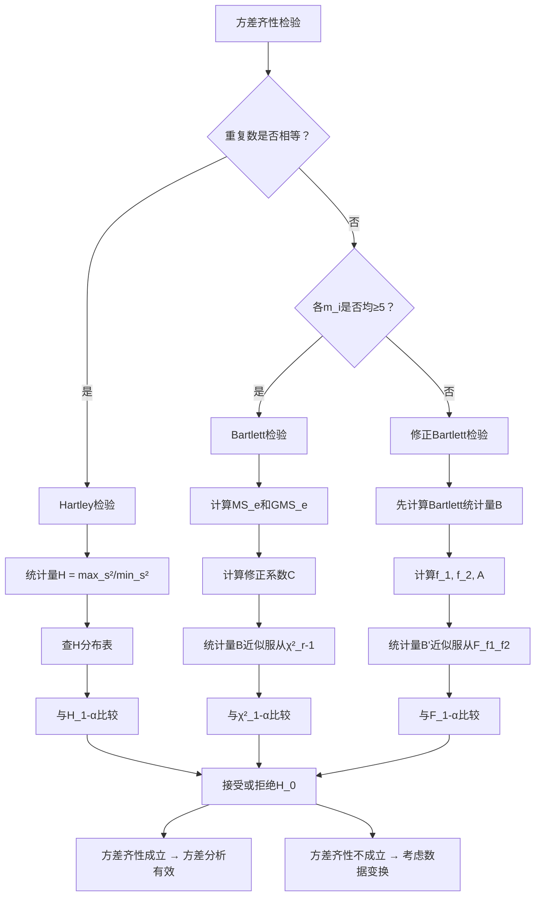

# 8.3 方差齐性检验

> [!abstract] 本节概览
> 方差齐性检验是[[8.1 方差分析|单因素方差分析]]的重要前置条件。当 $r$ 个正态总体的方差不相等时，方差分析的 $F$ 检验结论可能不可靠。本节系统介绍三种方差齐性检验方法——Hartley 检验、Bartlett 检验和修正 Bartlett 检验——从最简单的极值比检验到基于似然比的最通用方法，逐步放宽适用条件，为方差分析的合理性提供保障。
>
> **逻辑链条**：方差分析要求方差齐性 → 需要检验 $H_0: \sigma_1^2 = \cdots = \sigma_r^2$ → Hartley 检验（等重复数，最简单）→ Bartlett 检验（不等重复数，$m_i \geq 5$）→ 修正 Bartlett 检验（最通用）→ 方法选择与对比
>
> **前置依赖**：[[8.1 方差分析]]（方差分析的基本思想与 $F$ 检验）、[[7.2 正态总体参数的假设检验]]（$F$ 检验、$\chi^2$ 检验的基础知识）、样本方差与自由度的概念
>
> **核心主线**：掌握三种方差齐性检验方法的适用条件、检验统计量的构造原理、拒绝域的确定方法，以及如何根据数据特点选择合适的检验方法。

---

## 一、方差齐性检验概述

### 为什么需要方差齐性检验

在[[8.1 方差分析|单因素方差分析]]中，我们假设 $r$ 个正态总体 $N(\mu_i, \sigma_i^2)$（$i=1,2,\cdots,r$）具有**相同的方差**，即 $\sigma_1^2 = \sigma_2^2 = \cdots = \sigma_r^2$。这一假设是方差分析 $F$ 检验有效性的基础。

关于 $F$ 检验的稳健性，统计理论表明：
- $F$ 检验对**正态性假设的偏离**具有较好的稳健性——即当总体分布略微偏离正态时，$F$ 检验的结论仍然大致可靠；
- 但 $F$ 检验对**方差齐性假设的偏离**非常敏感——当各总体方差不相等时，$F$ 检验的第一类错误率可能显著偏离名义水平 $\alpha$。

因此，在进行方差分析之前或之后，==必须对方差齐性假设进行检验==，以确保分析结论的可靠性。

### 假设检验问题

设 $r$ 个正态总体分别为 $N(\mu_1, \sigma_1^2), N(\mu_2, \sigma_2^2), \cdots, N(\mu_r, \sigma_r^2)$，从中分别抽取容量为 $m_1, m_2, \cdots, m_r$ 的独立样本。方差齐性检验的假设为：

$$
H_0: \sigma_1^2 = \sigma_2^2 = \cdots = \sigma_r^2 \quad \text{vs} \quad H_1: \sigma_1^2, \sigma_2^2, \cdots, \sigma_r^2 \text{ 不全相等}
$$

这就是公式（8.3.1），其中 $H_1$ 表示"不全相等"，即至少存在一对 $(i,j)$ 使得 $\sigma_i^2 \neq \sigma_j^2$。

> [!def] 定义 8.3.1 — 方差齐性检验
> 设 $r$ 个相互独立的正态总体 $N(\mu_i, \sigma_i^2)$（$i=1,2,\cdots,r$），方差齐性检验是指检验假设
> $$H_0: \sigma_1^2 = \sigma_2^2 = \cdots = \sigma_r^2 \quad \text{vs} \quad H_1: \sigma_1^2, \sigma_2^2, \cdots, \sigma_r^2 \text{ 不全相等}$$
> 的统计检验方法。当检验结果接受 $H_0$ 时，认为各总体方差相等，方差分析的条件得到满足；当拒绝 $H_0$ 时，说明方差齐性假设不成立，需要考虑数据变换或其他分析方法。

### 三种检验方法概述

本节介绍三种方差齐性检验方法，按适用条件的宽松程度排列：

| 方法 | 适用条件 | 检验思想 |
|:---:|:---:|:---:|
| Hartley 检验 | 各水平重复数相等 $m_1 = \cdots = m_r = m$ | 最大样本方差与最小样本方差之比 |
| Bartlett 检验 | 重复数不等，每个 $m_i \geq 5$ | 基于算术均方与几何均方之比的对数变换 |
| 修正 Bartlett 检验 | 通用（无特殊限制） | Bartlett 检验的 Box 修正版 |

这三种方法的核心思想是一致的：当 $H_0$ 成立时，各样本方差 $s_1^2, s_2^2, \cdots, s_r^2$ 应当"比较接近"；当 $H_0$ 不成立时，某些样本方差会明显偏大或偏小。三种方法通过不同的度量方式来衡量这种"偏离程度"。

---

## 二、Hartley 检验

### 适用条件

Hartley 检验是最简单的方差齐性检验方法，但适用条件也最为严格：

- 各水平的重复数必须**相等**：$m_1 = m_2 = \cdots = m_r = m$
- 各总体服从正态分布

当满足这两个条件时，Hartley 检验计算简便、直观易懂，是首选方法。

### 检验统计量

设各水平下的样本方差为 $s_1^2, s_2^2, \cdots, s_r^2$，其中

$$
s_i^2 = \frac{1}{m-1}\sum_{j=1}^{m}(y_{ij} - \bar{y}_{i\cdot})^2, \quad i = 1, 2, \cdots, r
$$

Hartley 检验统计量定义为：

$$
H = \frac{\max\{s_1^2, s_2^2, \cdots, s_r^2\}}{\min\{s_1^2, s_2^2, \cdots, s_r^2\}}
$$

这就是公式（8.3.2）。$H$ 的直观含义非常清楚：它是所有样本方差中最大值与最小值的比值。当 $H_0$ 成立时，各 $\sigma_i^2$ 相等，各 $s_i^2$ 应当相近，$H$ 值较小；当 $H_0$ 不成立时，某些 $s_i^2$ 会明显偏大或偏小，$H$ 值较大。

### $H$ 的分布与拒绝域

在 $H_0$ 成立的条件下，$H$ 统计量的分布依赖于两个参数：
- $r$：总体个数（水平数）
- $f = m - 1$：各样本方差的自由度

$H$ 的上侧 $\alpha$ 分位数记为 $H_{1-\alpha}(r, f)$，可查教材附表 10。

==Hartley 检验的拒绝域为==：

$$
W = \{H \geq H_{1-\alpha}(r, f)\}
$$

这就是公式（8.3.3）。当 $H \geq H_{1-\alpha}(r, f)$ 时，在显著性水平 $\alpha$ 下拒绝 $H_0$，认为方差齐性不成立；否则接受 $H_0$。

### Hartley 检验的步骤总结

1. 计算各水平的样本方差 $s_1^2, s_2^2, \cdots, s_r^2$
2. 计算 $H = \max\{s_i^2\} / \min\{s_i^2\}$
3. 查附表 10 得 $H_{1-\alpha}(r, f)$，其中 $f = m - 1$
4. 若 $H \geq H_{1-\alpha}(r, f)$，拒绝 $H_0$；否则接受 $H_0$

> [!example] 例 8.3.1 — 四种防锈剂的防锈能力
> 在[[8.1 方差分析|例 8.1.1]]中，考察了四种不同防锈剂对防锈能力的影响。每种防锈剂下进行了 $m = 10$ 次重复试验（即 $r = 4$，$m = 10$，$f = m - 1 = 9$）。现在检验四种防锈剂下防锈能力的方差是否相等。
>
> **步骤 1**：计算各水平的样本方差。
>
> 表 8.3.1 四种防锈剂的防锈能力数据及样本方差
>
> | 防锈剂 | 样本数据 $y_{ij}$ | $\bar{y}_{i\cdot}$ | $s_i^2$ |
> |:---:|:---:|:---:|:---:|
> | $A_1$ | 43.9, 39.0, 46.7, 43.8, 44.2, 47.7, 43.6, 38.9, 43.6, 40.0 | 43.14 | 8.846 |
> | $A_2$ | 89.8, 87.1, 92.7, 90.6, 87.7, 92.4, 86.1, 88.1, 90.8, 89.1 | 89.44 | 5.383 |
> | $A_3$ | 68.4, 69.3, 70.9, 63.1, 68.5, 69.2, 65.3, 67.7, 68.7, 65.5 | 67.66 | 6.173 |
> | $A_4$ | 36.2, 45.2, 40.7, 41.5, 40.3, 43.7, 40.1, 42.6, 38.0, 40.3 | 40.86 | 8.246 |
>
> **步骤 2**：计算 Hartley 检验统计量。
>
> $$
> H = \frac{\max\{8.846, 5.383, 6.173, 8.246\}}{\min\{8.846, 5.383, 6.173, 8.246\}} = \frac{8.846}{5.383} = 1.643
> $$
>
> **步骤 3**：查附表 10，$\alpha = 0.05$，$r = 4$，$f = 9$，得 $H_{0.95}(4, 9) = 6.31$。
>
> **步骤 4**：因为 $H = 1.643 < 6.31 = H_{0.95}(4, 9)$，所以接受 $H_0$，认为四种防锈剂下防锈能力的方差无显著差异，方差齐性条件满足。
>
> 这与[[8.1 方差分析|例 8.1.1]]中方差分析的结论一致——方差分析的有效性得到了保障。
>
> 表 8.3.2 例 8.3.1 的方差分析表
>
> | 来源 | 平方和 | 自由度 | 均方 | $F$ 值 | $p$ 值 |
> |:---:|:---:|:---:|:---:|:---:|:---:|
> | 因子 $A$ | $SA$ | $r-1 = 3$ | $MS_A$ | $MS_A/MS_e$ | $< 0.0001$ |
> | 误差 $e$ | $Se$ | $f_e = r(m-1) = 36$ | $MS_e$ | | |
> | 总和 $T$ | $ST$ | $rm - 1 = 39$ | | | |
>
> **均值估计与置信区间**：
>
> 各水平均值的点估计为 $\hat{\mu}_i = \bar{y}_{i\cdot}$，公共方差的估计为 $MS_e$。
>
> 各水平均值 $\mu_i$ 的 $1 - \alpha$ 置信区间为：
>
> $$
> \bar{y}_{i\cdot} \pm t_{1-\alpha/2}(f_e) \cdot \sqrt{\frac{MS_e}{m}}
> $$

---

## 三、Bartlett 检验

### 适用条件

当各水平的重复数**不相等**时，Hartley 检验不再适用。此时可以使用 Bartlett 检验，其适用条件为：

- 各水平重复数可以不等：$m_1, m_2, \cdots, m_r$ 不必相同
- 每个水平的重复数 $m_i \geq 5$（以保证近似分布的精度）

Bartlett 检验基于似然比原理，是方差齐性检验中应用最广泛的方法之一。

### 样本方差与误差均方

设第 $i$ 个水平的样本方差为：

$$
s_i^2 = \frac{Q_i}{f_i}, \quad i = 1, 2, \cdots, r
$$

其中 $Q_i = \sum_{j=1}^{m_i}(y_{ij} - \bar{y}_{i\cdot})^2$ 为组内平方和，$f_i = m_i - 1$ 为自由度。

误差均方（即组内均方）定义为：

$$
MS_e = \frac{1}{f_e}\sum_{i=1}^{r} Q_i = \frac{1}{f_e}\sum_{i=1}^{r} f_i s_i^2
$$

其中 $f_e = \sum_{i=1}^{r} f_i = \sum_{i=1}^{r}(m_i - 1) = N - r$（$N = \sum_{i=1}^{r} m_i$ 为总样本量）。

注意 $MS_e$ 实际上是各 $s_i^2$ 的**加权算术平均**（以自由度 $f_i$ 为权重）。

### 几何均方

定义几何均方为：

$$
GMS_e = \left(\prod_{i=1}^{r} (s_i^2)^{f_i}\right)^{1/f_e} = \exp\left(\frac{1}{f_e}\sum_{i=1}^{r} f_i \ln s_i^2\right)
$$

$GMS_e$ 是各 $s_i^2$ 的**加权几何平均**。

### 算术均方与几何均方的关系

由算术-几何平均不等式（AM-GM inequality），有：

$$
GMS_e \leq MS_e
$$

等号成立**当且仅当** $s_1^2 = s_2^2 = \cdots = s_r^2$。

这一性质是 Bartlett 检验的核心依据：
- 当 $H_0$ 成立时，各 $s_i^2$ 相等，$GMS_e = MS_e$，$\ln MS_e - \ln GMS_e = 0$；
- 当 $H_0$ 不成立时，各 $s_i^2$ 不等，$GMS_e < MS_e$，$\ln MS_e - \ln GMS_e > 0$。

因此，$\ln MS_e - \ln GMS_e$ 可以作为度量方差齐性偏离程度的统计量。

### 修正系数

为了改善 Bartlett 统计量的近似分布，引入修正系数：

$$
C = 1 + \frac{1}{3(r-1)}\left(\sum_{i=1}^{r}\frac{1}{f_i} - \frac{1}{f_e}\right)
$$

这就是公式（8.3.6）。修正系数 $C$ 的作用是对原始统计量进行缩放，使其更好地逼近 $\chi^2$ 分布。当各 $f_i$ 较大时，$C \approx 1$，修正效果很小；当某些 $f_i$ 较小时，修正效果较为明显。

### Bartlett 检验统计量及其分布

> [!thm] 定理 8.3.1 — Bartlett 检验统计量的渐近分布
> 设 $r$ 个正态总体 $N(\mu_i, \sigma_i^2)$（$i=1,2,\cdots,r$）的样本方差分别为 $s_1^2, s_2^2, \cdots, s_r^2$，对应的自由度分别为 $f_1, f_2, \cdots, f_r$，总自由度 $f_e = \sum_{i=1}^{r} f_i$。定义
> $$B = \frac{f_e}{C}\left(\ln MS_e - \ln GMS_e\right)$$
> 其中 $MS_e$ 和 $GMS_e$ 分别为误差均方和几何均方，$C$ 为修正系数。则在 $H_0: \sigma_1^2 = \cdots = \sigma_r^2$ 成立的条件下，当各 $m_i \geq 5$ 时，有
> $$B \xrightarrow{d} \chi^2(r-1)$$
> 即 $B$ 近似服从自由度为 $r-1$ 的 $\chi^2$ 分布。

> [!abstract] 证明思路
> **证明 (8.3.7)**：
>
> **[构造似然函数]**：Bartlett 检验基于似然比原理。在 $H_0$ 下，似然函数为
> $$L(\mu_1, \cdots, \mu_r, \sigma^2) = \prod_{i=1}^{r}\prod_{j=1}^{m_i}\frac{1}{\sqrt{2\pi\sigma^2}}\exp\left(-\frac{(y_{ij}-\mu_i)^2}{2\sigma^2}\right)$$
> 在 $H_1$ 下，似然函数为
> $$L(\mu_1, \cdots, \mu_r, \sigma_1^2, \cdots, \sigma_r^2) = \prod_{i=1}^{r}\prod_{j=1}^{m_i}\frac{1}{\sqrt{2\pi\sigma_i^2}}\exp\left(-\frac{(y_{ij}-\mu_i)^2}{2\sigma_i^2}\right)$$
>
> **[求最大似然估计]**：分别求两个假设下的最大似然估计。在 $H_0$ 下，$\hat{\sigma}^2 = MS_e$；在 $H_1$ 下，$\hat{\sigma}_i^2 = s_i^2$。
>
> **[构造似然比统计量]**：构造似然比统计量 $\lambda = L(\hat{\omega})/L(\hat{\Omega})$，取对数得
> $$-2\ln\lambda = f_e \ln MS_e - \sum_{i=1}^{r} f_i \ln s_i^2 = f_e(\ln MS_e - \ln GMS_e)$$
>
> **[引入修正系数]**：由似然比检验的大样本理论，$-2\ln\lambda$ 在 $H_0$ 下渐近服从 $\chi^2(r-1)$。但为了改善小样本下的近似效果，Bartlett 引入修正系数 $C$，得到 $B = (f_e/C)(\ln MS_e - \ln GMS_e)$。
>
> $\blacksquare$

### 拒绝域

Bartlett 检验的拒绝域为：

$$
W = \{B \geq \chi^2_{1-\alpha}(r-1)\}
$$

这就是公式（8.3.8）。其中 $\chi^2_{1-\alpha}(r-1)$ 是自由度为 $r-1$ 的 $\chi^2$ 分布的上侧 $\alpha$ 分位数。

当 $B \geq \chi^2_{1-\alpha}(r-1)$ 时，在显著性水平 $\alpha$ 下拒绝 $H_0$；否则接受 $H_0$。

### Bartlett 检验的计算步骤

1. 计算各水平的样本方差 $s_i^2$ 和自由度 $f_i = m_i - 1$
2. 计算总自由度 $f_e = \sum f_i$
3. 计算误差均方 $MS_e = \frac{1}{f_e}\sum f_i s_i^2$
4. 计算几何均方 $GMS_e = \exp\left(\frac{1}{f_e}\sum f_i \ln s_i^2\right)$
5. 计算修正系数 $C = 1 + \frac{1}{3(r-1)}\left(\sum\frac{1}{f_i} - \frac{1}{f_e}\right)$
6. 计算检验统计量 $B = \frac{f_e}{C}(\ln MS_e - \ln GMS_e)$
7. 查 $\chi^2$ 分布表得 $\chi^2_{1-\alpha}(r-1)$
8. 若 $B \geq \chi^2_{1-\alpha}(r-1)$，拒绝 $H_0$；否则接受 $H_0$

> [!example] 例 8.3.2 — 绿茶叶酸含量
> 考察六种不同工艺生产的绿茶中叶酸含量是否有显著差异。六种工艺的样本量分别为 $m_1 = 7$，$m_2 = 5$，$m_3 = 6$，$m_4 = 6$，$m_5 = 5$，$m_6 = 7$（重复数不等）。需要先检验方差齐性。
>
> 各水平的样本方差和自由度如下：
>
> | 水平 | $m_i$ | $f_i = m_i - 1$ | $s_i^2$ | $f_i s_i^2$ | $\ln s_i^2$ | $f_i \ln s_i^2$ | $1/f_i$ |
> |:---:|:---:|:---:|:---:|:---:|:---:|:---:|:---:|
> | 1 | 7 | 6 | 2.30 | 13.80 | 0.833 | 4.998 | 0.1667 |
> | 2 | 5 | 4 | 1.32 | 5.28 | 0.278 | 1.112 | 0.2500 |
> | 3 | 6 | 5 | 3.20 | 16.00 | 1.163 | 5.815 | 0.2000 |
> | 4 | 6 | 5 | 2.56 | 12.80 | 0.940 | 4.700 | 0.2000 |
> | 5 | 5 | 4 | 1.95 | 7.80 | 0.668 | 2.672 | 0.2500 |
> | 6 | 7 | 6 | 2.77 | 16.62 | 1.019 | 6.114 | 0.1667 |
> | 合计 | | $f_e = 30$ | | $\sum = 72.30$ | | $\sum = 25.411$ | $\sum = 1.2334$ |
>
> **计算过程**：
>
> （1）误差均方：
> $$MS_e = \frac{\sum f_i s_i^2}{f_e} = \frac{72.30}{30} = 2.410$$
>
> （2）几何均方：
> $$\ln GMS_e = \frac{\sum f_i \ln s_i^2}{f_e} = \frac{25.411}{30} = 0.8470$$
> $$GMS_e = e^{0.8470} = 2.332$$
>
> （3）修正系数：
> $$C = 1 + \frac{1}{3(6-1)}\left(\sum\frac{1}{f_i} - \frac{1}{f_e}\right) = 1 + \frac{1}{15}\left(1.2334 - \frac{1}{30}\right) = 1 + \frac{1.2001}{15} = 1.0800$$
>
> （4）Bartlett 统计量：
> $$B = \frac{f_e}{C}(\ln MS_e - \ln GMS_e) = \frac{30}{1.0800}(\ln 2.410 - \ln 2.332) = \frac{30}{1.0800}(0.8795 - 0.8470) = \frac{30}{1.0800} \times 0.0325 = 0.903$$
>
> （5）查 $\chi^2$ 分布表：$\chi^2_{0.95}(5) = 11.070$。
>
> （6）因为 $B = 0.903 < 11.070 = \chi^2_{0.95}(5)$，接受 $H_0$，认为六种工艺下叶酸含量的方差无显著差异。
>
> ==Bartlett 检验通过比较算术均方和几何均方的对数差来检测方差齐性==，当各样本方差差异不大时，$B$ 值很小，自然接受 $H_0$。

---

## 四、修正 Bartlett 检验

### 适用条件

修正 Bartlett 检验（也称为 Box 修正 Bartlett 检验）是 Bartlett 检验的改进版本，适用于更广泛的场景：

- 样本量较小或较大均可
- 重复数相等或不等均可
- 是三种方法中**适用条件最宽松**的方法

当 Bartlett 检验的条件（$m_i \geq 5$）不满足时，修正 Bartlett 检验是更好的选择。

### Box 修正统计量

修正 Bartlett 检验的统计量为：

$$
B' = \frac{B/f_1}{A}
$$

这就是公式（8.3.9），其中 $B$ 为 Bartlett 统计量，$f_1$ 和 $A$ 的定义如下。

### 自由度与修正因子

定义以下参数：

$$
f_1 = r - 1
$$

$$
f_2 = \frac{r + 1}{(C - 1)^2}
$$

$$
A = \frac{f_2}{2 - C + 2/f_2}
$$

其中 $C$ 为 Bartlett 检验中的修正系数。$f_2$ 的值通常较大，反映了修正 Bartlett 检验的第二自由度。

### 修正 Bartlett 检验统计量的分布

> [!thm] 定理 8.3.2 — 修正 Bartlett 检验统计量的分布
> 在 $H_0: \sigma_1^2 = \cdots = \sigma_r^2$ 成立的条件下，修正 Bartlett 检验统计量
> $$B' = \frac{B/f_1}{A}$$
> 近似服从自由度为 $(f_1, f_2)$ 的 $F$ 分布，即
> $$B' \sim F(f_1, f_2)$$

> [!abstract] 证明思路
> **证明 (8.3.9)**：
>
> **[Bartlett统计量的局限]**：Bartlett 统计量 $B$ 在 $H_0$ 下近似服从 $\chi^2(r-1)$。但这一近似在小样本下精度不够。
>
> **[Box的F分布近似]**：Box (1953) 提出用 $F$ 分布来近似 $B$ 的分布。核心思想是将 $\chi^2(r-1)$ 变量除以其自由度，再与另一个独立的 $\chi^2(f_2)/f_2$ 变量之比来匹配。
>
> **[矩匹配方法]**：通过矩匹配方法（matching moments），确定 $f_2$ 和 $A$ 的表达式，使得 $B'$ 的前两阶矩与 $F(f_1, f_2)$ 的前两阶矩尽可能接近。
>
> **[确定参数表达式]**：具体地，令 $B' = B/(f_1 \cdot A)$，选择 $f_2$ 和 $A$ 使得 $E(B') = f_2/(f_2 - 2)$ 且 $\text{Var}(B')$ 与 $F(f_1, f_2)$ 的方差匹配，由此解出 $f_2$ 和 $A$ 的表达式。
>
> $\blacksquare$

### 拒绝域

修正 Bartlett 检验的拒绝域为：

$$
W = \{B' \geq F_{1-\alpha}(f_1, f_2)\}
$$

这就是公式（8.3.10）。其中 $F_{1-\alpha}(f_1, f_2)$ 是 $F(f_1, f_2)$ 分布的上侧 $\alpha$ 分位数。

### $f_2$ 非整数时的处理

在实际计算中，$f_2$ 通常不是整数。此时需要使用**线性内插法**来查 $F$ 分布表：

设 $f_2$ 位于整数 $a$ 和 $a+1$ 之间（$a < f_2 < a+1$），则：

$$
F_{1-\alpha}(f_1, f_2) \approx F_{1-\alpha}(f_1, a) + (f_2 - a)\left[F_{1-\alpha}(f_1, a+1) - F_{1-\alpha}(f_1, a)\right]
$$

### 修正 Bartlett 检验的计算步骤

1. 先按 Bartlett 检验的步骤计算 $B$、$C$、$f_e$
2. 计算 $f_1 = r - 1$
3. 计算 $f_2 = (r + 1)/(C - 1)^2$
4. 计算 $A = f_2 / (2 - C + 2/f_2)$
5. 计算 $B' = B / (f_1 \cdot A)$
6. 查 $F$ 分布表得 $F_{1-\alpha}(f_1, f_2)$（必要时用线性内插）
7. 若 $B' \geq F_{1-\alpha}(f_1, f_2)$，拒绝 $H_0$；否则接受 $H_0$

> [!example] 例 8.3.3 — 对例 8.3.2 使用修正 Bartlett 检验
> 对例 8.3.2 中绿茶叶酸含量的数据，使用修正 Bartlett 检验来检验方差齐性。
>
> 由例 8.3.2 已知：$r = 6$，$f_e = 30$，$B = 0.903$，$C = 1.0800$。
>
> **计算修正参数**：
>
> （1）$f_1 = r - 1 = 5$
>
> （2）$f_2 = \frac{r + 1}{(C - 1)^2} = \frac{7}{(0.0800)^2} = \frac{7}{0.0064} = 1093.75$
>
> （3）$A = \frac{f_2}{2 - C + 2/f_2} = \frac{1093.75}{2 - 1.0800 + 2/1093.75} = \frac{1093.75}{0.9200 + 0.00183} = \frac{1093.75}{0.92183} = 1186.3$
>
> （4）$B' = \frac{B}{f_1 \cdot A} = \frac{0.903}{5 \times 1186.3} = \frac{0.903}{5931.5} = 0.000152$
>
> **查 $F$ 分布表**：$F_{0.95}(5, 1093.75)$。由于 $f_2 = 1093.75$ 很大，$F_{0.95}(5, \infty) \approx 2.21$，而 $F_{0.95}(5, 1093.75)$ 略大于此值，约为 $2.22$。
>
> **结论**：因为 $B' = 0.000152 \ll 2.22 = F_{0.95}(5, 1093.75)$，接受 $H_0$，认为六种工艺下叶酸含量的方差无显著差异。
>
> 这与 Bartlett 检验的结论一致。在本例中，由于各样本方差差异很小，两种检验都强烈接受 $H_0$，修正效果不明显。但当样本量较小或方差差异处于临界状态时，修正 Bartlett 检验的优势会更加突出。

---

## 五、三种检验方法对比汇总

### 对比表

| 特征 | Hartley 检验 | Bartlett 检验 | 修正 Bartlett 检验 |
|:---|:---|:---|:---|
| **适用条件** | $m_1 = \cdots = m_r = m$ | $m_i \geq 5$（可不等） | 通用 |
| **检验统计量** | $H = \max s_i^2 / \min s_i^2$ | $B = \frac{f_e}{C}(\ln MS_e - \ln GMS_e)$ | $B' = B/(f_1 \cdot A)$ |
| **参考分布** | $H(r, f)$ 分布 | $\chi^2(r-1)$ | $F(f_1, f_2)$ |
| **临界值来源** | 附表 10 | $\chi^2$ 分布表 | $F$ 分布表 |
| **正态性要求** | 要求正态 | 要求正态 | 要求正态 |
| **计算复杂度** | 最简单 | 中等 | 较复杂 |
| **检验功效** | 中等 | 较高 | 较高 |
| **对小样本的适应性** | 一般 | 较好 | 最好 |

### 方法选择决策流程

==选择方差齐性检验方法时，应遵循"从简到繁"的原则==：

```
各水平重复数是否相等？
├── 是 → 使用 Hartley 检验（最简单）
└── 否 → 各水平样本量是否均 ≥ 5？
    ├── 是 → 使用 Bartlett 检验
    └── 否 → 使用修正 Bartlett 检验（最通用）
```

### 方法选择要点总结

1. **Hartley 检验**：最简单直观，但限制最多（等重复数）。适用于设计良好的平衡实验。
2. **Bartlett 检验**：适用于不等重复数的情形，要求 $m_i \geq 5$。基于似然比原理，理论基础扎实。
3. **修正 Bartlett 检验**：最通用的方法，无特殊限制。通过 Box 修正改善了小样本下的近似效果，但计算最为复杂。

在实际应用中，当数据满足 Hartley 检验的条件时，优先使用 Hartley 检验；否则根据样本量大小选择 Bartlett 检验或修正 Bartlett 检验。

---

## 六、知识结构总览



---

## 七、核心思想与解题技巧

### 三种检验的核心思想

三种方差齐性检验方法的核心思想是一脉相承的：

**1. Hartley 检验——极值比思想**

Hartley 检验直接用最大样本方差与最小样本方差的比值来衡量方差的离散程度。这类似于用"极差"来衡量数据离散程度——简单粗暴但有效。其局限在于只利用了最大和最小两个信息，中间的样本方差信息被浪费了。

**2. Bartlett 检验——对数似然比思想**

Bartlett 检验基于似然比原理，利用了所有样本方差的信息。通过比较算术均方（$MS_e$）和几何均方（$GMS_e$），并取对数来"放大"差异。AM-GM 不等式保证了 $GMS_e \leq MS_e$，等号仅在方差齐性成立时取得。

**3. 修正 Bartlett 检验——分布修正思想**

修正 Bartlett 检验在 Bartlett 检验的基础上，通过 Box 修正将 $\chi^2$ 近似替换为 $F$ 近似，改善了小样本下的分布逼近效果。这是统计中常见的"用更精确的分布近似"的策略。

### 解题步骤模板

**Hartley 检验模板**：

```
1. 写出假设：H_0: σ_1² = ... = σ_r² vs H_1: 不全相等
2. 计算各 s_i²
3. 计算 H = max{s_i²} / min{s_i²}
4. 查表得 H_{1-α}(r, f)，其中 f = m - 1
5. 比较：H < H_{1-α} → 接受 H_0；H ≥ H_{1-α} → 拒绝 H_0
6. 给出结论
```

**Bartlett 检验模板**：

```
1. 写出假设
2. 列表计算：s_i², f_i, f_i·s_i², ln(s_i²), f_i·ln(s_i²), 1/f_i
3. 计算 MS_e = Σ(f_i·s_i²) / f_e
4. 计算 ln(GMS_e) = Σ(f_i·ln(s_i²)) / f_e
5. 计算 C = 1 + [1/(3(r-1))]·[Σ(1/f_i) - 1/f_e]
6. 计算 B = (f_e/C)·(ln(MS_e) - ln(GMS_e))
7. 查表得 χ²_{1-α}(r-1)
8. 比较并给出结论
```

**修正 Bartlett 检验模板**：

```
1. 先完成 Bartlett 检验的步骤 1-6
2. 计算 f_1 = r - 1
3. 计算 f_2 = (r+1)/(C-1)²
4. 计算 A = f_2 / (2 - C + 2/f_2)
5. 计算 B' = B / (f_1 · A)
6. 查 F 分布表得 F_{1-α}(f_1, f_2)
7. 比较并给出结论
```

### 计算技巧

1. **对数计算**：计算 $\ln GMS_e$ 时，先分别计算各 $\ln s_i^2$，再加权平均，避免先算乘积再取对数的数值不稳定问题。
2. **修正系数 $C$**：$C$ 总是略大于 1（因为 $\sum 1/f_i > 1/f_e$），所以 $f_e/C < f_e$，修正后的统计量 $B$ 会略小于未修正的 $-2\ln\lambda$。
3. **$f_2$ 的计算**：$f_2 = (r+1)/(C-1)^2$，当 $C$ 接近 1 时，$f_2$ 会非常大，此时 $F_{1-\alpha}(f_1, f_2)$ 接近 $\chi^2_{1-\alpha}(f_1)/f_1$。
4. **显著性水平**：方差齐性检验通常取 $\alpha = 0.05$ 或 $\alpha = 0.10$。较大的 $\alpha$ 值使得检验更敏感，更容易检测到方差不齐。

---

## 八、补充理解与易混淆点

### 方差分析前不需要检验方差齐性

**来源**：茆诗松等《概率论与数理统计教程》（第三版）p.390 + Montgomery, D.C. (2017) *Design and Analysis of Experiments*, 9th ed., Wiley, pp. 83-85 + CSDN 博客"方差分析中方差齐性检验的重要性"2023 + 知乎专栏"为什么方差分析需要方差齐性假设？"2022 + 卡方笔记"方差分析前置条件详解"2024

> [!danger] 误区1："方差分析前不需要检验方差齐性"
> ❌ 错误解释：方差分析的 $F$ 检验对各种数据条件都很稳健，不需要额外检验方差齐性。
> ✅ 正确解释：方差分析的 $F$ 检验建立在方差齐性假设之上。当方差齐性不成立时，$F$ 检验的第一类错误率可能严重偏离名义水平 $\alpha$——当某些组方差较大且样本量较小时，$F$ 检验趋于保守（增加第二类错误）；当某些组方差较大且样本量较大时，$F$ 检验趋于激进（增加第一类错误）。因此，==方差分析前检验方差齐性是必要的步骤==。

### Hartley 检验可以用于不等重复数的情形

**来源**：茆诗松等《概率论与数理统计教程》（第三版）p.391 + Hartley, H.O. (1950) "The Maximum F-Ratio as a Short-Cut Test for Heterogeneity of Variance." *Biometrika*, 37(3/4), 308-312 + CSDN 文库"Hartley 检验的适用条件与常见误用"2023 + spssservices.com "Homogeneity of Variance Tests: Hartley's F-max Test" + 卡方笔记"方差齐性检验方法选择指南"2024

> [!danger] 误区2："Hartley 检验可以用于不等重复数的情形"
> ❌ 错误解释：Hartley 检验只是比较最大方差和最小方差的比值，与各水平的重复数无关，因此可以用于不等重复数的情形。
> ✅ 正确解释：Hartley 检验严格要求各水平重复数相等（$m_1 = m_2 = \cdots = m_r = m$）。当重复数不等时，$H$ 统计量的分布不再仅依赖于 $r$ 和 $f$，还与各 $m_i$ 的具体取值有关，附表 10 中的临界值不再适用。如果强行使用，可能导致错误的结论。

### Bartlett 检验对非正态数据是稳健的

**来源**：茆诗松等《概率论与数理统计教程》（第三版）p.393 + Box, G.E.P. (1953) "Non-Normality and Tests on Variances." *Biometrika*, 40(3/4), 318-335 + CSDN 博客"Bartlett 检验与 Levene 检验的对比"2024 + numberanalytics.com "Bartlett's Test for Homogeneity of Variances" + 卡方笔记"方差齐性检验的正态性前提"2024

> [!danger] 误区3："Bartlett 检验对非正态数据是稳健的"
> ❌ 错误解释：Bartlett 检验是一种通用的方差齐性检验方法，对数据分布没有特殊要求，可以放心用于非正态数据。
> ✅ 正确解释：Bartlett 检验对正态性假设的偏离**非常敏感**。当数据偏离正态分布（尤其是具有尖峰厚尾特征时），Bartlett 检验的第一类错误率会显著增大，即倾向于错误地拒绝 $H_0$（方差齐性）。Box (1953) 的研究表明，Bartlett 检验对非正态性的敏感程度甚至超过了 $F$ 检验。对于非正态数据，应考虑使用 Levene 检验或 Brown-Forsythe 检验等替代方法。

### 方差齐性检验不显著就证明方差完全相等

**来源**：茆诗松等《概率论与数理统计教程》（第三版）p.390 + CSDN 博客"假设检验中'接受原假设'的正确理解"2023 + domystats.com "Understanding Homogeneity of Variance Tests" + 知乎专栏"为什么不能说'接受原假设'？"2023 + 卡方笔记"假设检验结论的规范表述"2024

> [!danger] 误区4："方差齐性检验不显著就证明方差完全相等"
> ❌ 错误解释：方差齐性检验不显著意味着各总体方差确实相等，可以放心使用方差分析。
> ✅ 正确解释：假设检验的逻辑是"不显著则不拒绝 $H_0$"，而非"接受 $H_0$ 为真"。方差齐性检验不显著（接受 $H_0$）只说明在当前样本量和显著性水平下，没有足够证据表明方差不相等。这可能是方差确实相等，也可能是检验功效不足（样本量太小）导致无法检测到实际存在的差异。此外，"接受 $H_0$"是一个较弱的说法，不应过度解读为"证明了方差相等"。

### 三种方差齐性检验的结果总是一致的

**来源**：茆诗松等《概率论与数理统计教程》（第三版）p.395 + CSDN 文库"方差齐性检验方法比较与选择"2024 + spssservices.com "Comparing Homogeneity of Variance Tests" + mathpretty.com "方差齐性检验的多种方法比较" + 卡方笔记"统计检验结果不一致时的处理策略"2024

> [!danger] 误区5："三种方差齐性检验的结果总是一致的"
> ❌ 错误解释：三种检验方法都是检验方差齐性的，对同一组数据应该给出相同的结论。
> ✅ 正确解释：三种检验方法使用了不同的统计量和不同的参考分布，对同一组数据可能给出不同的结论。特别是在"边界情况"（方差差异处于临界状态）下，不同方法的结论可能不一致。例如，Hartley 检验只利用最大和最小方差的信息，对中间方差的差异不敏感；而 Bartlett 检验利用了所有方差的信息，可能检测到 Hartley 检验遗漏的差异。此外，不同方法的检验功效也不同，在小样本下差异更明显。

---

## 九、习题精选

> [!todo] 习题概览
> | 编号 | 题目类型 | 涉及方法 | 难度 | 来源 |
> |:---:|:---:|:---:|:---:|:---:|
> | 1 | Hartley 检验 | Hartley | ★★☆ | 教材习题 |
> | 2 | Hartley 检验 | Hartley | ★★☆ | 教材习题 |
> | 3 | Bartlett 检验 | Bartlett | ★★★ | 教材习题 |
> | 4 | Hartley + Bartlett | 两种方法 | ★★★ | 教材习题 |
> | 5 | 修正 Bartlett | 修正 Bartlett | ★★★ | 教材习题 |
> | 6 | 修正 Bartlett | 修正 Bartlett | ★★★ | 教材习题 |
> | 7 | 综合应用 | 方法选择 | ★★★ | 卡方考研真题 |
> | 8 | Hartley 检验 | Hartley | ★★☆ | 卡方考研真题 |
> | 9 | Bartlett 检验 | Bartlett | ★★★ | 卡方考研真题 |
> | 10 | 修正 Bartlett | 修正 Bartlett | ★★★★ | 卡方考研真题 |

---

### 习题 1（教材）：Hartley 检验考察例 8.1.1 三个总体方差

> [!problem] 习题1 — 教材习题：Hartley 检验考察例 8.1.1 三个总体方差
> 在[[8.1 方差分析|例 8.1.1]]中，考察了三种不同施肥方案对小麦产量的影响，每种方案下进行了 $m = 5$ 次重复试验。已知三个水平的样本方差分别为 $s_1^2 = 2.5$，$s_2^2 = 3.1$，$s_3^2 = 2.8$。试用 Hartley 检验在 $\alpha = 0.05$ 下检验方差齐性。

> [!faq]- 查看解答
> **解**：
>
> 直接套用 Hartley 检验模板，注意 $r = 3$，$f = m - 1 = 4$。
>
> $H_0: \sigma_1^2 = \sigma_2^2 = \sigma_3^2$ vs $H_1$: 不全相等
>
> $H = \frac{\max\{2.5, 3.1, 2.8\}}{\min\{2.5, 3.1, 2.8\}} = \frac{3.1}{2.5} = 1.24$
>
> 查附表 10：$H_{0.95}(3, 4) = 15.5$（近似值）
>
> 因为 $H = 1.24 < 15.5$，接受 $H_0$，认为三个总体方差无显著差异。

---

### 习题 2（教材）：Hartley 检验考察安眠药试验四个总体方差

> [!problem] 习题2 — 教材习题：Hartley 检验考察安眠药试验四个总体方差
> 在安眠药试验中，四种安眠药分别让 $m = 6$ 名患者服用，记录睡眠延长时长（小时）。四个水平的样本方差分别为 $s_1^2 = 1.20$，$s_2^2 = 0.85$，$s_3^2 = 1.50$，$s_4^2 = 0.95$。试用 Hartley 检验在 $\alpha = 0.05$ 下检验方差齐性。

> [!faq]- 查看解答
> **解**：
>
> $r = 4$，$f = m - 1 = 5$，计算 $H$ 统计量并查表。
>
> $H_0: \sigma_1^2 = \sigma_2^2 = \sigma_3^2 = \sigma_4^2$ vs $H_1$: 不全相等
>
> $H = \frac{\max\{1.20, 0.85, 1.50, 0.95\}}{\min\{1.20, 0.85, 1.50, 0.95\}} = \frac{1.50}{0.85} = 1.765$
>
> 查附表 10：$H_{0.95}(4, 5) = 13.7$（近似值）
>
> 因为 $H = 1.765 < 13.7$，接受 $H_0$，认为四种安眠药下睡眠延长时长的方差无显著差异。

---

### 习题 3（教材）：Bartlett 检验考察生产力指数三个总体方差

> [!problem] 习题3 — 教材习题：Bartlett 检验考察生产力指数三个总体方差
> 三个不同行业的生产力指数数据如下：行业 A 有 $m_1 = 8$ 个观测值，$s_1^2 = 4.2$；行业 B 有 $m_2 = 6$ 个观测值，$s_2^2 = 2.8$；行业 C 有 $m_3 = 7$ 个观测值，$s_3^2 = 5.1$。试用 Bartlett 检验在 $\alpha = 0.05$ 下检验方差齐性。

> [!faq]- 查看解答
> **解**：
>
> 重复数不等，使用 Bartlett 检验。列表计算各中间量。
>
> $H_0: \sigma_1^2 = \sigma_2^2 = \sigma_3^2$ vs $H_1$: 不全相等
>
> $f_1 = 7$，$f_2 = 5$，$f_3 = 6$，$f_e = 18$
>
> $MS_e = \frac{7 \times 4.2 + 5 \times 2.8 + 6 \times 5.1}{18} = \frac{29.4 + 14.0 + 30.6}{18} = \frac{74.0}{18} = 4.111$
>
> $\ln GMS_e = \frac{7\ln 4.2 + 5\ln 2.8 + 6\ln 5.1}{18} = \frac{7 \times 1.435 + 5 \times 1.030 + 6 \times 1.629}{18} = \frac{10.045 + 5.150 + 9.774}{18} = \frac{24.969}{18} = 1.387$
>
> $C = 1 + \frac{1}{3(3-1)}\left(\frac{1}{7} + \frac{1}{5} + \frac{1}{6} - \frac{1}{18}\right) = 1 + \frac{1}{6}(0.1429 + 0.2000 + 0.1667 - 0.0556) = 1 + \frac{0.4540}{6} = 1.0757$
>
> $B = \frac{18}{1.0757}(\ln 4.111 - 1.387) = \frac{18}{1.0757}(1.414 - 1.387) = 16.73 \times 0.027 = 0.452$
>
> 查 $\chi^2$ 分布表：$\chi^2_{0.95}(2) = 5.991$
>
> 因为 $B = 0.452 < 5.991$，接受 $H_0$，认为三个行业生产力指数的方差无显著差异。

---

### 习题 4（教材）：Hartley + Bartlett 检验考察入户推销五个总体方差

> [!problem] 习题4 — 教材习题：Hartley + Bartlett 检验考察入户推销五个总体方差
> 五种入户推销方式的推销效果数据如下：每种方式下进行了 $m = 8$ 次试验。五个水平的样本方差分别为 $s_1^2 = 12.3$，$s_2^2 = 8.7$，$s_3^2 = 15.6$，$s_4^2 = 9.2$，$s_5^2 = 11.8$。
>
> （a）试用 Hartley 检验在 $\alpha = 0.05$ 下检验方差齐性。
> （b）试用 Bartlett 检验在 $\alpha = 0.05$ 下检验方差齐性。
> （c）比较两种方法的结论。

> [!faq]- 查看解答
> **解**：
>
> 由于重复数相等，两种方法都适用。分别计算并比较。
>
> （a）Hartley 检验：
>
> $H = \frac{\max\{12.3, 8.7, 15.6, 9.2, 11.8\}}{\min\{12.3, 8.7, 15.6, 9.2, 11.8\}} = \frac{15.6}{8.7} = 1.793$
>
> $r = 5$，$f = 7$，查附表 10：$H_{0.95}(5, 7) = 12.1$（近似值）
>
> $H = 1.793 < 12.1$，接受 $H_0$。
>
> （b）Bartlett 检验：
>
> $f_i = 7$（$i = 1, \cdots, 5$），$f_e = 35$
>
> $MS_e = \frac{7(12.3 + 8.7 + 15.6 + 9.2 + 11.8)}{35} = \frac{7 \times 57.6}{35} = \frac{403.2}{35} = 11.52$
>
> $\ln GMS_e = \frac{7(\ln 12.3 + \ln 8.7 + \ln 15.6 + \ln 9.2 + \ln 11.8)}{35}$
> $= \frac{7(2.510 + 2.163 + 2.747 + 2.220 + 2.468)}{35} = \frac{7 \times 12.108}{35} = \frac{84.756}{35} = 2.422$
>
> $C = 1 + \frac{1}{3(5-1)}\left(5 \times \frac{1}{7} - \frac{1}{35}\right) = 1 + \frac{1}{12}(0.7143 - 0.0286) = 1 + \frac{0.6857}{12} = 1.0571$
>
> $B = \frac{35}{1.0571}(\ln 11.52 - 2.422) = \frac{35}{1.0571}(2.444 - 2.422) = 33.11 \times 0.022 = 0.728$
>
> $\chi^2_{0.95}(4) = 9.488$
>
> $B = 0.728 < 9.488$，接受 $H_0$。
>
> （c）两种方法结论一致，均接受 $H_0$。由于重复数相等且各样本方差差异不大，两种检验都认为方差齐性成立。

---

### 习题 5（教材）：修正 Bartlett 检验考察粮食含水率三个总体方差

> [!problem] 习题5 — 教材习题：修正 Bartlett 检验考察粮食含水率三个总体方差
> 三种储粮方式的粮食含水率数据如下：方式 A 有 $m_1 = 4$ 个观测值，$s_1^2 = 0.35$；方式 B 有 $m_2 = 3$ 个观测值，$s_2^2 = 0.12$；方式 C 有 $m_3 = 4$ 个观测值，$s_3^2 = 0.28$。由于部分 $m_i < 5$，Bartlett 检验不适用，试用修正 Bartlett 检验在 $\alpha = 0.05$ 下检验方差齐性。

> [!faq]- 查看解答
> **解**：
>
> 先计算 Bartlett 统计量 $B$，再计算修正参数。
>
> $H_0: \sigma_1^2 = \sigma_2^2 = \sigma_3^2$ vs $H_1$: 不全相等
>
> $f_1 = 3$，$f_2 = 2$，$f_3 = 3$，$f_e = 8$
>
> $MS_e = \frac{3 \times 0.35 + 2 \times 0.12 + 3 \times 0.28}{8} = \frac{1.05 + 0.24 + 0.84}{8} = \frac{2.13}{8} = 0.2663$
>
> $\ln GMS_e = \frac{3\ln 0.35 + 2\ln 0.12 + 3\ln 0.28}{8} = \frac{3(-1.050) + 2(-2.120) + 3(-1.273)}{8} = \frac{-3.150 - 4.240 - 3.819}{8} = \frac{-11.209}{8} = -1.401$
>
> $C = 1 + \frac{1}{3(3-1)}\left(\frac{1}{3} + \frac{1}{2} + \frac{1}{3} - \frac{1}{8}\right) = 1 + \frac{1}{6}(0.333 + 0.500 + 0.333 - 0.125) = 1 + \frac{1.041}{6} = 1.1735$
>
> $B = \frac{8}{1.1735}(\ln 0.2663 - (-1.401)) = \frac{8}{1.1735}(-1.323 + 1.401) = \frac{8}{1.1735} \times 0.078 = 0.532$
>
> 修正 Bartlett 参数：
>
> $f_1 = r - 1 = 2$
>
> $f_2 = \frac{r + 1}{(C - 1)^2} = \frac{4}{(0.1735)^2} = \frac{4}{0.0301} = 132.9$
>
> $A = \frac{f_2}{2 - C + 2/f_2} = \frac{132.9}{2 - 1.1735 + 2/132.9} = \frac{132.9}{0.8265 + 0.0151} = \frac{132.9}{0.8416} = 157.9$
>
> $B' = \frac{B}{f_1 \cdot A} = \frac{0.532}{2 \times 157.9} = \frac{0.532}{315.8} = 0.00168$
>
> $F_{0.95}(2, 132.9) \approx 3.07$
>
> 因为 $B' = 0.00168 \ll 3.07$，接受 $H_0$，认为三种储粮方式下粮食含水率的方差无显著差异。

---

### 习题 6（教材）：修正 Bartlett 检验考察食品包装四个总体方差

> [!problem] 习题6 — 教材习题：修正 Bartlett 检验考察食品包装四个总体方差
> 四种食品包装方式的保鲜效果数据如下：方式 A 有 $m_1 = 3$ 个观测值，$s_1^2 = 1.8$；方式 B 有 $m_2 = 4$ 个观测值，$s_2^2 = 2.5$；方式 C 有 $m_3 = 3$ 个观测值，$s_3^2 = 0.9$；方式 D 有 $m_4 = 5$ 个观测值，$s_4^2 = 3.2$。试用修正 Bartlett 检验在 $\alpha = 0.10$ 下检验方差齐性。

> [!faq]- 查看解答
> **解**：
>
> 部分 $m_i < 5$，使用修正 Bartlett 检验。注意显著性水平为 $\alpha = 0.10$。
>
> $H_0: \sigma_1^2 = \sigma_2^2 = \sigma_3^2 = \sigma_4^2$ vs $H_1$: 不全相等
>
> $f_1 = 2$，$f_2 = 3$，$f_3 = 2$，$f_4 = 4$，$f_e = 11$
>
> $MS_e = \frac{2 \times 1.8 + 3 \times 2.5 + 2 \times 0.9 + 4 \times 3.2}{11} = \frac{3.6 + 7.5 + 1.8 + 12.8}{11} = \frac{25.7}{11} = 2.336$
>
> $\ln GMS_e = \frac{2\ln 1.8 + 3\ln 2.5 + 2\ln 0.9 + 4\ln 3.2}{11} = \frac{2(0.588) + 3(0.916) + 2(-0.105) + 4(1.163)}{11}$
> $= \frac{1.176 + 2.748 - 0.210 + 4.652}{11} = \frac{8.366}{11} = 0.761$
>
> $C = 1 + \frac{1}{3(4-1)}\left(\frac{1}{2} + \frac{1}{3} + \frac{1}{2} + \frac{1}{4} - \frac{1}{11}\right) = 1 + \frac{1}{9}(0.500 + 0.333 + 0.500 + 0.250 - 0.091) = 1 + \frac{1.492}{9} = 1.1658$
>
> $B = \frac{11}{1.1658}(\ln 2.336 - 0.761) = \frac{11}{1.1658}(0.848 - 0.761) = 9.439 \times 0.087 = 0.821$
>
> 修正参数：
>
> $f_1 = r - 1 = 3$
>
> $f_2 = \frac{r + 1}{(C - 1)^2} = \frac{5}{(0.1658)^2} = \frac{5}{0.0275} = 181.8$
>
> $A = \frac{181.8}{2 - 1.1658 + 2/181.8} = \frac{181.8}{0.8342 + 0.0110} = \frac{181.8}{0.8452} = 215.1$
>
> $B' = \frac{0.821}{3 \times 215.1} = \frac{0.821}{645.3} = 0.00127$
>
> $F_{0.90}(3, 181.8) \approx 2.14$
>
> 因为 $B' = 0.00127 \ll 2.14$，接受 $H_0$，认为四种包装方式下保鲜效果的方差无显著差异。

---

### 习题 7（卡方考研真题）：综合应用——方法选择

> [!problem] 习题7 — 卡方考研真题：综合应用方法选择
> 某研究生在使用单因素方差分析比较四种教学方法的效果时，收集到如下数据：方法一有 15 名学生，方法二有 12 名学生，方法三有 18 名学生，方法四有 10 名学生。在进行方差分析之前，需要检验方差齐性。
>
> （a）应该选择哪种方差齐性检验方法？说明理由。
> （b）如果各方法下的样本方差分别为 $s_1^2 = 25.3$，$s_2^2 = 18.7$，$s_3^2 = 30.1$，$s_4^2 = 22.5$，在 $\alpha = 0.05$ 下进行检验。

> [!faq]- 查看解答
> **解**：
>
> （a）由于四种教学方法的样本量分别为 15、12、18、10，各 $m_i \geq 5$ 但互不相等，因此应选择 **Bartlett 检验**。
>
> （b）$f_1 = 14$，$f_2 = 11$，$f_3 = 17$，$f_4 = 9$，$f_e = 51$
>
> $MS_e = \frac{14 \times 25.3 + 11 \times 18.7 + 17 \times 30.1 + 9 \times 22.5}{51} = \frac{354.2 + 205.7 + 511.7 + 202.5}{51} = \frac{1274.1}{51} = 24.98$
>
> $\ln GMS_e = \frac{14\ln 25.3 + 11\ln 18.7 + 17\ln 30.1 + 9\ln 22.5}{51} = \frac{14(3.231) + 11(2.928) + 17(3.404) + 9(3.114)}{51}$
> $= \frac{45.234 + 32.208 + 57.868 + 28.026}{51} = \frac{163.336}{51} = 3.203$
>
> $C = 1 + \frac{1}{3(4-1)}\left(\frac{1}{14} + \frac{1}{11} + \frac{1}{17} + \frac{1}{9} - \frac{1}{51}\right) = 1 + \frac{1}{9}(0.0714 + 0.0909 + 0.0588 + 0.1111 - 0.0196) = 1 + \frac{0.3126}{9} = 1.0347$
>
> $B = \frac{51}{1.0347}(\ln 24.98 - 3.203) = \frac{51}{1.0347}(3.218 - 3.203) = 49.28 \times 0.015 = 0.739$
>
> $\chi^2_{0.95}(3) = 7.815$
>
> 因为 $B = 0.739 < 7.815$，接受 $H_0$，方差齐性成立。

---

### 习题 8（卡方考研真题）：Hartley 检验计算

> [!problem] 习题8 — 卡方考研真题：Hartley 检验计算
> 某农业试验站比较三种不同品种水稻的株高（cm），每种品种种植 8 株。测得样本方差分别为 $s_1^2 = 15.6$，$s_2^2 = 8.3$，$s_3^2 = 22.4$。
>
> （a）在 $\alpha = 0.05$ 下用 Hartley 检验检验方差齐性。
> （b）若将 $\alpha$ 改为 $0.01$，结论是否改变？

> [!faq]- 查看解答
> **解**：
>
> 等重复数，使用 Hartley 检验。注意比较不同显著性水平下的结论。
>
> （a）$r = 3$，$m = 8$，$f = 7$
>
> $H = \frac{\max\{15.6, 8.3, 22.4\}}{\min\{15.6, 8.3, 22.4\}} = \frac{22.4}{8.3} = 2.699$
>
> 查附表 10：$H_{0.95}(3, 7) \approx 10.5$
>
> $H = 2.699 < 10.5$，接受 $H_0$。
>
> （b）$H_{0.99}(3, 7) \approx 20.6$
>
> $H = 2.699 < 20.6$，仍然接受 $H_0$。结论不变。

---

### 习题 9（卡方考研真题）：Bartlett 检验完整计算

> [!problem] 习题9 — 卡方考研真题：Bartlett 检验完整计算
> 某工厂用三种不同工艺生产同一种零件，测量其尺寸偏差（mm）。三种工艺的样本量和样本方差如下：
>
> | 工艺 | $m_i$ | $s_i^2$ |
> |:---:|:---:|:---:|
> | A | 10 | 0.045 |
> | B | 8 | 0.032 |
> | C | 12 | 0.058 |
>
> 在 $\alpha = 0.05$ 下用 Bartlett 检验检验三种工艺下尺寸偏差的方差是否相等。

> [!faq]- 查看解答
> **解**：
>
> 不等重复数，$m_i \geq 5$，使用 Bartlett 检验。
>
> $H_0: \sigma_A^2 = \sigma_B^2 = \sigma_C^2$ vs $H_1$: 不全相等
>
> $f_A = 9$，$f_B = 7$，$f_C = 11$，$f_e = 27$
>
> $MS_e = \frac{9 \times 0.045 + 7 \times 0.032 + 11 \times 0.058}{27} = \frac{0.405 + 0.224 + 0.638}{27} = \frac{1.267}{27} = 0.0469$
>
> $\ln GMS_e = \frac{9\ln 0.045 + 7\ln 0.032 + 11\ln 0.058}{27} = \frac{9(-3.101) + 7(-3.442) + 11(-2.848)}{27}$
> $= \frac{-27.909 - 24.094 - 31.328}{27} = \frac{-83.331}{27} = -3.086$
>
> $C = 1 + \frac{1}{3(3-1)}\left(\frac{1}{9} + \frac{1}{7} + \frac{1}{11} - \frac{1}{27}\right) = 1 + \frac{1}{6}(0.1111 + 0.1429 + 0.0909 - 0.0370) = 1 + \frac{0.3079}{6} = 1.0513$
>
> $B = \frac{27}{1.0513}(\ln 0.0469 - (-3.086)) = \frac{27}{1.0513}(-3.060 + 3.086) = 25.68 \times 0.026 = 0.668$
>
> $\chi^2_{0.95}(2) = 5.991$
>
> 因为 $B = 0.668 < 5.991$，接受 $H_0$，认为三种工艺下尺寸偏差的方差无显著差异。

---

### 习题 10（卡方考研真题）：修正 Bartlett 检验完整计算

> [!problem] 习题10 — 卡方考研真题：修正 Bartlett 检验完整计算
> 某药理实验比较四种药物对小白鼠体重增长的影响。四种药物的样本量和样本方差如下：
>
> | 药物 | $m_i$ | $s_i^2$ |
> |:---:|:---:|:---:|
> | A | 4 | 3.80 |
> | B | 3 | 1.20 |
> | C | 5 | 4.50 |
> | D | 3 | 2.10 |
>
> 由于部分 $m_i < 5$，试用修正 Bartlett 检验在 $\alpha = 0.05$ 下检验方差齐性。

> [!faq]- 查看解答
> **解**：
>
> 部分样本量小于 5，使用修正 Bartlett 检验。
>
> $H_0: \sigma_A^2 = \sigma_B^2 = \sigma_C^2 = \sigma_D^2$ vs $H_1$: 不全相等
>
> $f_A = 3$，$f_B = 2$，$f_C = 4$，$f_D = 2$，$f_e = 11$
>
> $MS_e = \frac{3 \times 3.80 + 2 \times 1.20 + 4 \times 4.50 + 2 \times 2.10}{11} = \frac{11.4 + 2.4 + 18.0 + 4.2}{11} = \frac{36.0}{11} = 3.273$
>
> $\ln GMS_e = \frac{3\ln 3.80 + 2\ln 1.20 + 4\ln 4.50 + 2\ln 2.10}{11}$
> $= \frac{3(1.335) + 2(0.182) + 4(1.504) + 2(0.742)}{11} = \frac{4.005 + 0.364 + 6.016 + 1.484}{11} = \frac{11.869}{11} = 1.079$
>
> $C = 1 + \frac{1}{3(4-1)}\left(\frac{1}{3} + \frac{1}{2} + \frac{1}{4} + \frac{1}{2} - \frac{1}{11}\right) = 1 + \frac{1}{9}(0.333 + 0.500 + 0.250 + 0.500 - 0.091) = 1 + \frac{1.492}{9} = 1.1658$
>
> $B = \frac{11}{1.1658}(\ln 3.273 - 1.079) = \frac{11}{1.1658}(1.186 - 1.079) = 9.439 \times 0.107 = 1.010$
>
> 修正参数：
>
> $f_1 = r - 1 = 3$
>
> $f_2 = \frac{r + 1}{(C - 1)^2} = \frac{5}{(0.1658)^2} = \frac{5}{0.0275} = 181.8$
>
> $A = \frac{181.8}{2 - 1.1658 + 2/181.8} = \frac{181.8}{0.8342 + 0.0110} = \frac{181.8}{0.8452} = 215.1$
>
> $B' = \frac{1.010}{3 \times 215.1} = \frac{1.010}{645.3} = 0.00157$
>
> $F_{0.95}(3, 181.8) \approx 2.65$
>
> 因为 $B' = 0.00157 \ll 2.65$，接受 $H_0$，认为四种药物下体重增长量的方差无显著差异。

---

## 十、教材原文

> [!info] 以下为教材扫描版原文，可点击翻阅。
> 
> 
> 
> 
> 
> 
> 

---

#学习/概率论与统计/第八章 方差分析与回归分析/方差齐性检验
