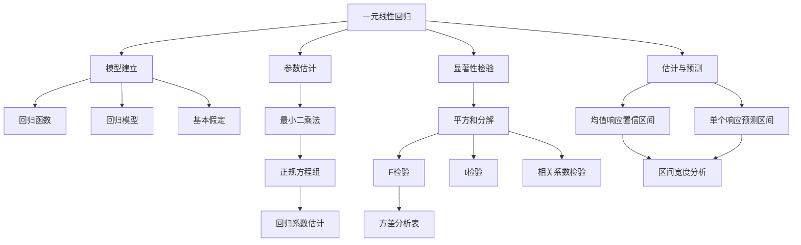

# 8.4 一元线性回归

**相关笔记**：[[8.1 方差分析]] | [[8.3 方差齐性检验]] | [[7.2 正态总体参数的假设检验]] | [[5.4 三大抽样分布]] | [[6.3 最大似然估计与EM算法]] | [[6.6 区间估计]] | [[5.3 统计量及其分布]]

> [!abstract] 本节概览
> 本节系统介绍==一元线性回归==（Simple Linear Regression）的基本理论与方法。从变量间相关关系的概念出发，建立一元线性回归模型 $y = \beta_0 + \beta_1 x + \varepsilon$，利用==最小二乘法==（Least Squares Estimation, LSE）估计回归系数，通过==平方和分解== $S_T = S_R + S_e$ 进行回归方程的==显著性检验==（$F$ 检验、$t$ 检验、相关系数检验），最后讨论==均值响应的置信区间==与==单个响应的预测区间==。整个方法体系与[[8.1 方差分析|方差分析]]一脉相承，都是通过分解变异来源来判断因子效应的显著性。
>
> **逻辑链条**：[[#一、变量间的两类关系|变量关系分类]] → [[#二、一元线性回归模型|模型建立]] → [[#三、回归系数的最小二乘估计|参数估计]] → [[#四、回归方程的显著性检验|显著性检验]] → [[#五、估计与预测|估计与预测]] → [[#六、知识结构总览|结构总览]] → [[#七、核心思想与解题技巧|解题技巧]] → [[#八、补充理解与易混淆点|易混淆点]] → [[#九、习题精选|习题]] → [[#十、教材原文|教材原文]]
>
> **前置依赖**：[[8.1 方差分析|§8.1]]（平方和分解思想）、[[7.2 正态总体参数的假设检验|§7.2]]（$t$ 检验、$F$ 检验）、[[5.4 三大抽样分布|§5.4]]（$\chi^2$ 分布、$t$ 分布、$F$ 分布）、[[6.3 最大似然估计与EM算法|§6.3]]（MLE）、[[6.6 区间估计|§6.6]]（置信区间）
>
> **核心主线**：一元线性回归通过建立 $y = \beta_0 + \beta_1 x + \varepsilon$ 的统计模型，用最小二乘法估计回归系数 $\hat{\beta}_0$、$\hat{\beta}_1$，利用平方和分解 $S_T = S_R + S_e$ 构造 $F$ 检验（等价于 $t$ 检验和相关系数检验）判断回归方程的显著性，并对均值响应和单个响应分别给出置信区间和预测区间。

---

## 一、变量间的两类关系

### 确定性关系

变量之间的**确定性关系**（函数关系）是指可以用精确的数学公式描述的关系。给定自变量的值，因变量的值被唯一确定。例如：

- 圆的面积 $S = \pi r^2$：给定半径 $r$，面积 $S$ 唯一确定
- 自由落体 $s = \frac{1}{2}gt^2$：给定时间 $t$，下落距离 $s$ 唯一确定
- 欧姆定律 $V = IR$：给定电流 $I$ 和电阻 $R$，电压 $V$ 唯一确定

### 相关关系

在实际问题中，变量之间更多呈现的是**相关关系**（statistical relationship）：变量之间存在密切的统计联系，但由于随机因素的影响，给定自变量的值后，因变量的值不能唯一确定，而是围绕某个均值波动。

> **类比**：想象你是一家鞋店的老板。你发现顾客的脚长和鞋码之间有很强的联系——脚越长，鞋码越大。但这种联系不是精确的函数关系：同样是 26cm 的脚长，有人穿 42 码，有人穿 43 码。脚长和鞋码之间的关系就是"相关关系"——存在明显的趋势，但带有随机波动。

相关关系的例子：
- 人的身高与体重：身高越高，体重倾向于越大，但同样身高的人体重不同
- 施肥量与作物产量：施肥越多，产量倾向于越高，但受天气、土壤等因素影响
- 学习时间与考试成绩：学习时间越长，成绩倾向于越好，但不是线性精确的
- 合金钢的碳含量与强度：碳含量越高，强度倾向于越大

### 回归分析的基本思想

**回归分析**（Regression Analysis）是研究变量之间相关关系的一种统计方法。其基本思想是：

1. **识别**：通过散点图等工具识别变量之间的相关模式
2. **建模**：建立描述因变量 $y$ 与自变量 $x$ 之间关系的统计模型
3. **估计**：利用观测数据估计模型中的未知参数
4. **检验**：检验模型的有效性（回归方程是否显著）
5. **应用**：利用建立的回归方程进行预测和控制

### 高尔顿的回归现象

"回归"（regression）一词来源于英国统计学家 Francis Galton（1822-1911）关于遗传学的研究。Galton 在研究父子身高关系时发现：

- 高个子父亲的儿子，身高倾向于比父亲矮（向平均身高"回归"）
- 矮个子父亲的儿子，身高倾向于比父亲高（同样向平均身高"回归"）

这种现象被称为**回归效应**（regression effect）或**回归均值**（regression toward the mean）。Galton 在 1886 年的论文中首次使用了"regression"一词来描述这种现象。

> **注意**：虽然"回归"一词源于遗传学中的特殊现象，但现代统计学中的"回归分析"已经发展为一种通用的统计建模工具，不再局限于"向均值回归"的含义。回归分析的核心任务是**建立变量之间的定量关系模型**。

---

## 二、一元线性回归模型

### 回归函数

> [!def] 定义 8.4.1 — 回归函数
> 设 $x$ 为自变量（预报变量），$Y$ 为因变量（响应变量）。给定 $x = x_0$ 时，$Y$ 的**条件期望**
> $$f(x) = E(Y \mid x) \tag{8.4.1}$$
> 称为 $Y$ 关于 $x$ 的**回归函数**（regression function）。回归函数描述了 $Y$ 的均值随 $x$ 变化的趋势。

回归函数的直观含义：对于每一个固定的 $x$ 值，$Y$ 的取值是随机的（围绕某个均值波动），而回归函数 $f(x)$ 给出了这个均值的位置。如果 $f(x)$ 是 $x$ 的线性函数，即 $f(x) = \beta_0 + \beta_1 x$，则称为**线性回归函数**。

### 一元线性回归模型

> [!def] 定义 8.4.2 — 一元线性回归模型
> 设 $(x_1, y_1), (x_2, y_2), \ldots, (x_n, y_n)$ 为 $n$ 组观测数据，其中 $x_i$ 为自变量的取值（非随机的，可精确测量或控制），$y_i$ 为因变量的观测值。如果 $y_i$ 满足
> $$y_i = \beta_0 + \beta_1 x_i + \varepsilon_i, \quad i = 1, 2, \ldots, n \tag{8.4.2}$$
> 其中 $\beta_0$、$\beta_1$ 为未知参数，$\varepsilon_i$ 为随机误差项，则称该模型为**一元线性回归模型**（Simple Linear Regression Model）。

在模型 (8.4.2) 中：
- $\beta_0$：**截距**（intercept），表示当 $x = 0$ 时 $Y$ 的条件均值
- $\beta_1$：**回归系数**（regression coefficient），表示 $x$ 每增加一个单位时 $Y$ 的条件均值的变化量
- $\varepsilon_i$：**随机误差**，表示 $y_i$ 对回归直线的随机偏离

### 模型的基本假定（Gauss-Markov 条件）

一元线性回归模型的有效性依赖于以下基本假定：

| 假定 | 内容 | 数学表达 |
|:---:|:---|:---|
| **(A1) 线性性** | $Y$ 与 $x$ 之间是线性关系 | $E(\varepsilon_i) = 0$，即 $E(y_i) = \beta_0 + \beta_1 x_i$ |
| **(A2) 等方差性** | 所有观测值的误差方差相等 | $\text{Var}(\varepsilon_i) = \sigma^2$（常数），$i = 1, \ldots, n$ |
| **(A3) 独立性** | 各次观测的误差相互独立 | $\text{Cov}(\varepsilon_i, \varepsilon_j) = 0$（$i \neq j$） |
| **(A4) 正态性** | 误差服从正态分布 | $\varepsilon_i \sim N(0, \sigma^2)$，$i = 1, \ldots, n$ |

> [!warning] 假定的重要性
> - 假定 (A1)-(A3) 称为**Gauss-Markov 条件**，在这些条件下，最小二乘估计是最佳线性无偏估计（BLUE）。
> - 假定 (A4) 用于推断（假设检验、置信区间）。如果只做点估计，不需要正态性假定。
> - 在实际应用中，应通过残差分析（residual analysis）检验这些假定的合理性。

在假定 (A1)-(A4) 下，模型可以紧凑地写为：

$$y_i \sim N(\beta_0 + \beta_1 x_i, \sigma^2), \quad \varepsilon_1, \varepsilon_2, \ldots, \varepsilon_n \overset{\text{iid}}{\sim} N(0, \sigma^2)$$

### 引例：合金钢强度与碳含量

> [!example] 例 8.4.1 — 合金钢强度与碳含量
> 为研究合金钢的强度 $y$（单位：$\text{kg/mm}^2$）与碳含量 $x$（单位：%）之间的关系，收集了 12 组数据如下：
>
> | $i$ | 1 | 2 | 3 | 4 | 5 | 6 | 7 | 8 | 9 | 10 | 11 | 12 |
> |:---:|:---:|:---:|:---:|:---:|:---:|:---:|:---:|:---:|:---:|:---:|:---:|:---:|
> | $x_i$ | 0.10 | 0.11 | 0.12 | 0.13 | 0.14 | 0.15 | 0.16 | 0.17 | 0.18 | 0.20 | 0.21 | 0.23 |
> | $y_i$ | 42.0 | 43.5 | 45.0 | 45.5 | 45.0 | 47.5 | 49.0 | 53.0 | 50.0 | 55.0 | 55.0 | 60.0 |
>
> **散点图描述**：将 12 个数据点 $(x_i, y_i)$ 标在坐标系中，可以观察到这些点大致分布在一条直线附近——随着碳含量 $x$ 的增加，强度 $y$ 呈现明显的上升趋势。这种线性趋势提示我们可以用一元线性回归模型来描述 $y$ 与 $x$ 之间的关系。

---

## 三、回归系数的最小二乘估计

### 最小二乘法的思想

**最小二乘法**（Method of Least Squares）是估计回归系数 $\beta_0$、$\beta_1$ 的最基本方法。其核心思想是：找到一条直线 $\hat{y} = \hat{\beta}_0 + \hat{\beta}_1 x$，使得所有观测点到这条直线的**纵向距离的平方和最小**。

> **几何直觉**：想象你手中有 12 个钉子（数据点）钉在墙上，你想用一根橡皮筋把它们"尽量拉直"——橡皮筋就是回归直线。最小二乘法就是找到那个让橡皮筋最"贴近"所有钉子的位置。所谓"贴近"，就是所有钉子到橡皮筋的纵向偏差的平方和达到最小。

### 残差与残差平方和

对于给定的估计值 $\hat{\beta}_0$、$\hat{\beta}_1$，第 $i$ 个观测点的**拟合值**为 $\hat{y}_i = \hat{\beta}_0 + \hat{\beta}_1 x_i$，**残差**（residual）为

$$e_i = y_i - \hat{y}_i = y_i - \hat{\beta}_0 - \hat{\beta}_1 x_i$$

**残差平方和**（Residual Sum of Squares, RSS）为

$$Q(\beta_0, \beta_1) = \sum_{i=1}^{n}(y_i - \beta_0 - \beta_1 x_i)^2$$

最小二乘法的目标是找到 $\hat{\beta}_0$、$\hat{\beta}_1$，使得 $Q(\hat{\beta}_0, \hat{\beta}_1) = \min Q(\beta_0, \beta_1)$。

### 正规方程组的推导

> [!abstract] 证明思路
> **证明 (8.4.9)**：
>
> **[构造目标函数]**：令 $Q(\beta_0, \beta_1) = \sum_{i=1}^{n}(y_i - \beta_0 - \beta_1 x_i)^2$，对 $\beta_0$、$\beta_1$ 分别求偏导并令其为零。
>
> **[对 $\beta_0$ 求偏导]**：
> $$\frac{\partial Q}{\partial \beta_0} = -2\sum_{i=1}^{n}(y_i - \beta_0 - \beta_1 x_i) = 0$$
> 整理得：
> $$n\beta_0 + \beta_1\sum_{i=1}^{n}x_i = \sum_{i=1}^{n}y_i \tag{8.4.4}$$
>
> **[对 $\beta_1$ 求偏导]**：
> $$\frac{\partial Q}{\partial \beta_1} = -2\sum_{i=1}^{n}x_i(y_i - \beta_0 - \beta_1 x_i) = 0$$
> 整理得：
> $$\beta_0\sum_{i=1}^{n}x_i + \beta_1\sum_{i=1}^{n}x_i^2 = \sum_{i=1}^{n}x_i y_i \tag{8.4.5}$$
>
> **[求解正规方程组]**：由 (8.4.4) 得 $\beta_0 = \bar{y} - \beta_1\bar{x}$，代入 (8.4.5)：
> $$(\bar{y} - \beta_1\bar{x})\sum_{i=1}^{n}x_i + \beta_1\sum_{i=1}^{n}x_i^2 = \sum_{i=1}^{n}x_i y_i$$
> $$n\bar{x}\bar{y} - n\beta_1\bar{x}^2 + \beta_1\sum_{i=1}^{n}x_i^2 = \sum_{i=1}^{n}x_i y_i$$
> $$\beta_1\left(\sum_{i=1}^{n}x_i^2 - n\bar{x}^2\right) = \sum_{i=1}^{n}x_i y_i - n\bar{x}\bar{y}$$
> 注意到 $\sum_{i=1}^{n}x_i^2 - n\bar{x}^2 = \sum_{i=1}^{n}(x_i - \bar{x})^2 = l_{xx}$，$\sum_{i=1}^{n}x_i y_i - n\bar{x}\bar{y} = \sum_{i=1}^{n}(x_i - \bar{x})(y_i - \bar{y}) = l_{xy}$，因此
> $$\hat{\beta}_1 = \frac{l_{xy}}{l_{xx}} \tag{8.4.9}$$
> $$\hat{\beta}_0 = \bar{y} - \hat{\beta}_1\bar{x} \tag{8.4.9}$$
>
> **[验证极小值]**：二阶偏导数矩阵 $\frac{\partial^2 Q}{\partial \beta_0^2} = 2n > 0$，$\frac{\partial^2 Q}{\partial \beta_1^2} = 2\sum x_i^2 > 0$，Hessian 行列式 $= 4n\sum x_i^2 - 4(\sum x_i)^2 = 4n l_{xx} > 0$（当 $l_{xx} > 0$ 时），故 $(\hat{\beta}_0, \hat{\beta}_1)$ 确为极小值点。
>
> $\blacksquare$

### LSE 的显式解

引入以下记号：

$$l_{xx} = \sum_{i=1}^{n}(x_i - \bar{x})^2 = \sum_{i=1}^{n}x_i^2 - n\bar{x}^2$$

$$l_{yy} = \sum_{i=1}^{n}(y_i - \bar{y})^2 = \sum_{i=1}^{n}y_i^2 - n\bar{y}^2$$

$$l_{xy} = \sum_{i=1}^{n}(x_i - \bar{x})(y_i - \bar{y}) = \sum_{i=1}^{n}x_i y_i - n\bar{x}\bar{y}$$

==最小二乘估计的显式解==为：

$$\hat{\beta}_1 = \frac{l_{xy}}{l_{xx}}, \quad \hat{\beta}_0 = \bar{y} - \hat{\beta}_1\bar{x} \tag{8.4.9}$$

由此得到的**回归方程**为：

$$\hat{y} = \hat{\beta}_0 + \hat{\beta}_1 x$$

**重要性质**：回归直线一定通过样本均值点 $(\bar{x}, \bar{y})$，因为 $\hat{y} = \hat{\beta}_0 + \hat{\beta}_1\bar{x} = (\bar{y} - \hat{\beta}_1\bar{x}) + \hat{\beta}_1\bar{x} = \bar{y}$。

### LSE 的统计性质

> [!thm] 定理 8.4.1 — 最小二乘估计量的统计性质
> 在一元线性回归模型 $y_i = \beta_0 + \beta_1 x_i + \varepsilon_i$，$\varepsilon_i \overset{\text{iid}}{\sim} N(0, \sigma^2)$ 下，最小二乘估计 $\hat{\beta}_0$、$\hat{\beta}_1$ 具有以下性质：
>
> **(1) 正态性**：$\hat{\beta}_1 \sim N\left(\beta_1, \dfrac{\sigma^2}{l_{xx}}\right)$，$\hat{\beta}_0 \sim N\left(\beta_0, \sigma^2\left(\dfrac{1}{n} + \dfrac{\bar{x}^2}{l_{xx}}\right)\right)$
>
> **(2) 无偏性**：$E(\hat{\beta}_1) = \beta_1$，$E(\hat{\beta}_0) = \beta_0$
>
> **(3) 方差**：$\text{Var}(\hat{\beta}_1) = \dfrac{\sigma^2}{l_{xx}}$，$\text{Var}(\hat{\beta}_0) = \sigma^2\left(\dfrac{1}{n} + \dfrac{\bar{x}^2}{l_{xx}}\right)$
>
> **(4) 协方差**：$\text{Cov}(\hat{\beta}_0, \hat{\beta}_1) = -\dfrac{\bar{x}\sigma^2}{l_{xx}}$

> [!abstract] 证明思路
> **证明 (定理 8.4.1)**：
>
> **[将 LSE 表示为 $y_i$ 的线性组合]**：将 $\hat{\beta}_1 = \frac{l_{xy}}{l_{xx}} = \frac{\sum(x_i - \bar{x})(y_i - \bar{y})}{l_{xx}}$ 展开，利用 $\sum(x_i - \bar{x}) = 0$：
> $$\hat{\beta}_1 = \frac{\sum(x_i - \bar{x})y_i}{l_{xx}} = \sum_{i=1}^{n}\frac{x_i - \bar{x}}{l_{xx}} \cdot y_i = \sum_{i=1}^{n}c_i y_i$$
> 其中 $c_i = \frac{x_i - \bar{x}}{l_{xx}}$。同理：
> $$\hat{\beta}_0 = \bar{y} - \hat{\beta}_1\bar{x} = \frac{1}{n}\sum_{i=1}^{n}y_i - \bar{x}\sum_{i=1}^{n}c_i y_i = \sum_{i=1}^{n}\left(\frac{1}{n} - \bar{x}c_i\right)y_i = \sum_{i=1}^{n}d_i y_i$$
> 其中 $d_i = \frac{1}{n} - \bar{x}c_i$。这说明 $\hat{\beta}_0$、$\hat{\beta}_1$ 都是 $y_1, y_2, \ldots, y_n$ 的线性组合。
>
> **[正态性]**：由于 $y_i = \beta_0 + \beta_1 x_i + \varepsilon_i$ 且 $\varepsilon_i \sim N(0, \sigma^2)$，故 $y_i \sim N(\beta_0 + \beta_1 x_i, \sigma^2)$。$\hat{\beta}_1 = \sum c_i y_i$ 是独立正态变量的线性组合，故 $\hat{\beta}_1$ 服从正态分布。同理 $\hat{\beta}_0$ 也服从正态分布。
>
> **[无偏性]**：$E(\hat{\beta}_1) = \sum c_i E(y_i) = \sum c_i(\beta_0 + \beta_1 x_i) = \beta_0\sum c_i + \beta_1\sum c_i x_i$。
> 其中 $\sum c_i = \frac{\sum(x_i - \bar{x})}{l_{xx}} = 0$，$\sum c_i x_i = \frac{\sum(x_i - \bar{x})x_i}{l_{xx}} = \frac{l_{xx}}{l_{xx}} = 1$。
> 故 $E(\hat{\beta}_1) = \beta_1$。
>
> $E(\hat{\beta}_0) = E(\bar{y} - \hat{\beta}_1\bar{x}) = (\beta_0 + \beta_1\bar{x}) - \beta_1\bar{x} = \beta_0$。
>
> **[方差]**：$\text{Var}(\hat{\beta}_1) = \sum c_i^2 \text{Var}(y_i) = \sigma^2\sum c_i^2 = \sigma^2\sum\frac{(x_i - \bar{x})^2}{l_{xx}^2} = \frac{\sigma^2}{l_{xx}}$。
>
> $\text{Var}(\hat{\beta}_0) = \sum d_i^2 \text{Var}(y_i) = \sigma^2\sum d_i^2$。
> 其中 $\sum d_i^2 = \sum\left(\frac{1}{n} - \bar{x}c_i\right)^2 = \frac{1}{n} - 2\bar{x}\sum\frac{c_i}{n} + \bar{x}^2\sum c_i^2 = \frac{1}{n} + \frac{\bar{x}^2}{l_{xx}}$（因为 $\sum c_i = 0$）。
> 故 $\text{Var}(\hat{\beta}_0) = \sigma^2\left(\frac{1}{n} + \frac{\bar{x}^2}{l_{xx}}\right)$。
>
> **[协方差]**：$\text{Cov}(\hat{\beta}_0, \hat{\beta}_1) = \text{Cov}\left(\sum d_i y_i, \sum c_i y_i\right) = \sigma^2\sum d_i c_i$。
> $\sum d_i c_i = \sum\left(\frac{1}{n} - \bar{x}c_i\right)c_i = \frac{1}{n}\sum c_i - \bar{x}\sum c_i^2 = 0 - \frac{\bar{x}}{l_{xx}} = -\frac{\bar{x}}{l_{xx}}$。
> 故 $\text{Cov}(\hat{\beta}_0, \hat{\beta}_1) = -\frac{\bar{x}\sigma^2}{l_{xx}}$。
>
> $\blacksquare$

### 例题：合金钢强度与碳含量的回归方程计算

> [!example] 例 8.4.2 — 合金钢强度与碳含量（回归方程计算）
> 对例 8.4.1 的合金钢数据，建立强度 $y$ 关于碳含量 $x$ 的一元线性回归方程。
>
> **解**：
>
> **第一步：计算基本统计量**
>
> $\bar{x} = \frac{1}{12}\sum x_i = \frac{0.10 + 0.11 + \cdots + 0.23}{12} = \frac{1.90}{12} = 0.1583$
>
> $\bar{y} = \frac{1}{12}\sum y_i = \frac{42.0 + 43.5 + \cdots + 60.0}{12} = \frac{590.0}{12} = 49.167$
>
> **第二步：计算 $l_{xx}$、$l_{yy}$、$l_{xy}$**
>
> $l_{xx} = \sum x_i^2 - 12\bar{x}^2 = 0.3194 - 12 \times 0.02507 = 0.3194 - 0.3008 = 0.0186$
>
> $l_{yy} = \sum y_i^2 - 12\bar{y}^2 = 29492.50 - 12 \times 2417.36 = 29492.50 - 29008.33 = 484.17$
>
> $l_{xy} = \sum x_i y_i - 12\bar{x}\bar{y} = 95.925 - 12 \times 7.783 = 95.925 - 93.400 = 2.525$
>
> **第三步：计算回归系数**
>
> $$\hat{\beta}_1 = \frac{l_{xy}}{l_{xx}} = \frac{2.525}{0.0186} = 135.75$$
>
> $$\hat{\beta}_0 = \bar{y} - \hat{\beta}_1\bar{x} = 49.167 - 135.75 \times 0.1583 = 49.167 - 21.492 = 27.675$$
>
> **第四步：写出回归方程**
>
> $$\hat{y} = 27.675 + 135.75 x$$
>
> 回归方程表明：碳含量每增加 0.01%，合金钢强度平均增加约 $1.358\ \text{kg/mm}^2$。

### 补充：MLE 与 LSE 的关系

在正态性假定 $\varepsilon_i \sim N(0, \sigma^2)$ 下，$y_i \sim N(\beta_0 + \beta_1 x_i, \sigma^2)$，且各 $y_i$ 独立。似然函数为：

$$L(\beta_0, \beta_1, \sigma^2) = \prod_{i=1}^{n}\frac{1}{\sqrt{2\pi\sigma^2}}\exp\left\{-\frac{(y_i - \beta_0 - \beta_1 x_i)^2}{2\sigma^2}\right\}$$

对数似然函数为：

$$\ln L = -\frac{n}{2}\ln(2\pi) - \frac{n}{2}\ln\sigma^2 - \frac{1}{2\sigma^2}\sum_{i=1}^{n}(y_i - \beta_0 - \beta_1 x_i)^2$$

对 $\beta_0$、$\beta_1$ 最大化 $\ln L$ 等价于最小化 $\sum(y_i - \beta_0 - \beta_1 x_i)^2$，这正是最小二乘法的目标函数。

> **结论**：在正态误差模型下，$\beta_0$、$\beta_1$ 的最大似然估计（MLE）与最小二乘估计（LSE）完全一致。这一等价性是正态回归模型的一个重要性质，也是最小二乘法在回归分析中占据核心地位的原因之一。

进一步，$\sigma^2$ 的 MLE 为 $\hat{\sigma}^2_{MLE} = \frac{1}{n}\sum_{i=1}^{n}(y_i - \hat{\beta}_0 - \hat{\beta}_1 x_i)^2 = \frac{S_e}{n}$，但这是有偏估计。==常用的无偏估计==为：

$$\hat{\sigma}^2 = \frac{S_e}{n - 2} = \frac{1}{n-2}\sum_{i=1}^{n}(y_i - \hat{y}_i)^2$$

---

## 四、回归方程的显著性检验

### 检验问题

建立回归方程后，一个自然的问题是：回归方程是否真的有意义？即自变量 $x$ 对因变量 $y$ 是否有显著的线性影响？

这等价于检验回归系数 $\beta_1$ 是否为零：

$$H_0: \beta_1 = 0 \quad \text{vs} \quad H_1: \beta_1 \neq 0$$

- 若拒绝 $H_0$，则认为 $x$ 对 $y$ 有显著的线性影响，回归方程有意义
- 若接受 $H_0$，则认为 $x$ 对 $y$ 没有显著的线性影响，回归方程无意义

### 平方和分解

与[[8.1 方差分析|方差分析]]类似，回归分析的核心也是**平方和分解**。

> [!abstract] 证明思路
> **证明 (8.4.13)**：
>
> **[引入恒等式]**：对每个观测值 $y_i$，有恒等式
> $$y_i - \bar{y} = (y_i - \hat{y}_i) + (\hat{y}_i - \bar{y})$$
> 即：总偏差 = 残差 + 回归偏差。
>
> **[两边平方求和]**：
> $$\sum_{i=1}^{n}(y_i - \bar{y})^2 = \sum_{i=1}^{n}[(y_i - \hat{y}_i) + (\hat{y}_i - \bar{y})]^2$$
> $$= \sum_{i=1}^{n}(y_i - \hat{y}_i)^2 + \sum_{i=1}^{n}(\hat{y}_i - \bar{y})^2 + 2\sum_{i=1}^{n}(y_i - \hat{y}_i)(\hat{y}_i - \bar{y})$$
>
> **[证明交叉项为零]**：交叉项
> $$\Delta = 2\sum_{i=1}^{n}(y_i - \hat{y}_i)(\hat{y}_i - \bar{y}) = 2\sum_{i=1}^{n}e_i(\hat{y}_i - \bar{y})$$
> 将 $\hat{y}_i = \hat{\beta}_0 + \hat{\beta}_1 x_i$ 和 $e_i = y_i - \hat{\beta}_0 - \hat{\beta}_1 x_i$ 代入：
> $$\Delta = 2\sum_{i=1}^{n}(y_i - \hat{\beta}_0 - \hat{\beta}_1 x_i)(\hat{\beta}_0 + \hat{\beta}_1 x_i - \bar{y})$$
> 利用正规方程 $\sum e_i = 0$ 和 $\sum x_i e_i = 0$：
> $$\sum e_i(\hat{\beta}_0 - \bar{y}) = (\hat{\beta}_0 - \bar{y})\sum e_i = 0$$
> $$\sum e_i \cdot \hat{\beta}_1 x_i = \hat{\beta}_1\sum x_i e_i = 0$$
> 故 $\Delta = 0$。
>
> **[得到分解式]**：
> $$S_T = S_e + S_R \tag{8.4.13}$$
> 其中 $S_T = \sum(y_i - \bar{y})^2$（总平方和），$S_e = \sum(y_i - \hat{y}_i)^2$（残差平方和），$S_R = \sum(\hat{y}_i - \bar{y})^2$（回归平方和）。
>
> $\blacksquare$

三个平方和的含义：

| 平方和 | 公式 | 自由度 | 含义 |
|:---:|:---|:---:|:---|
| $S_T$（总平方和） | $\sum(y_i - \bar{y})^2 = l_{yy}$ | $n - 1$ | $y$ 的总变异 |
| $S_R$（回归平方和） | $\sum(\hat{y}_i - \bar{y})^2 = \hat{\beta}_1^2 l_{xx} = l_{xy}^2/l_{xx}$ | $1$ | 由 $x$ 的线性变化引起的 $y$ 的变异 |
| $S_e$（残差平方和） | $\sum(y_i - \hat{y}_i)^2 = l_{yy} - S_R$ | $n - 2$ | 除去 $x$ 的线性影响后 $y$ 的剩余变异 |

自由度也满足分解关系：$(n-1) = 1 + (n-2)$。

### 平方和的期望

> [!thm] 定理 8.4.2 — 平方和的期望
> 在一元线性回归模型下：
>
> **(1)** $E(S_e) = (n-2)\sigma^2$
>
> **(2)** $E(S_R) = \sigma^2 + \beta_1^2 l_{xx}$
>
> 当 $H_0: \beta_1 = 0$ 成立时，$E(S_R) = \sigma^2$；当 $H_0$ 不成立时，$E(S_R) > \sigma^2$。

这个定理的含义非常直观：当 $H_0$ 成立时，回归平方和与残差平方和的期望都等于 $\sigma^2$（乘以各自的自由度），比值接近 1；当 $H_0$ 不成立时，回归平方和的期望变大，比值倾向于大于 1。

### 残差平方和的分布

> [!thm] 定理 8.4.3 — 残差平方和的分布
> 在一元线性回归模型下：
>
> **(1)** $\dfrac{S_e}{\sigma^2} \sim \chi^2(n - 2)$
>
> **(2)** $S_e$ 与 $\hat{\beta}_1$ 相互独立
>
> **(3)** 当 $H_0: \beta_1 = 0$ 成立时，$\dfrac{S_R}{\sigma^2} \sim \chi^2(1)$

### F 检验（方差分析方法）

由定理 8.4.2 和定理 8.4.3，在 $H_0$ 成立时：

$$F = \frac{S_R / 1}{S_e / (n - 2)} = \frac{MS_R}{MS_e} \sim F(1, n - 2)$$

当 $H_0$ 不成立时，$E(MS_R) > E(MS_e)$，$F$ 值倾向于偏大。

给定显著性水平 $\alpha$，==F 检验的拒绝域==为：

$$W = \{F \geqslant F_{1-\alpha}(1, n - 2)\}$$

**方差分析表**：

| 来源 | 平方和 | 自由度 | 均方 | $F$ 值 | $p$ 值 |
|:---|:---:|:---:|:---:|:---:|:---:|
| 回归 | $S_R$ | $1$ | $MS_R = S_R$ | $F = MS_R/MS_e$ | $P(F_{1,n-2} \geqslant F)$ |
| 残差 | $S_e$ | $n - 2$ | $MS_e = S_e/(n-2)$ | | |
| 总和 | $S_T$ | $n - 1$ | | | |

### t 检验

由定理 8.4.1，$\hat{\beta}_1 \sim N(\beta_1, \sigma^2/l_{xx})$，用 $\hat{\sigma}^2 = S_e/(n-2)$ 替代 $\sigma^2$，得：

$$t = \frac{\hat{\beta}_1}{\hat{\sigma}/\sqrt{l_{xx}}} = \frac{\hat{\beta}_1\sqrt{l_{xx}}}{\hat{\sigma}} \sim t(n - 2) \tag{8.4.17}$$

（在 $H_0: \beta_1 = 0$ 成立时）

给定显著性水平 $\alpha$，==t 检验的拒绝域==为：

$$W = \{|t| \geqslant t_{1-\alpha/2}(n - 2)\}$$

### 相关系数检验

**样本相关系数**定义为：

$$r = \frac{l_{xy}}{\sqrt{l_{xx} l_{yy}}} = \frac{\sum(x_i - \bar{x})(y_i - \bar{y})}{\sqrt{\sum(x_i - \bar{x})^2 \sum(y_i - \bar{y})^2}}$$

$r$ 的取值范围为 $[-1, 1]$，$|r|$ 越接近 1，线性相关程度越强。

在 $H_0: \beta_1 = 0$ 成立时，可以证明：

$$t = \frac{r\sqrt{n - 2}}{\sqrt{1 - r^2}} \sim t(n - 2)$$

给定显著性水平 $\alpha$，相关系数检验的拒绝域为：

$$W = \left\{|r| \geqslant r_{1-\alpha/2}(n - 2)\right\}$$

其中 $r_{1-\alpha/2}(n-2)$ 为相关系数的临界值，可查附表。

### 三种检验的等价关系

> **重要结论**：在一元线性回归中，$F$ 检验、$t$ 检验和相关系数检验==完全等价==——对同一组数据，三种检验的结论一定一致。
>
> **等价性的数学证明**：
>
> (1) $F$ 检验与 $t$ 检验等价：$F = t^2$。
>
> 证明：$F = \frac{S_R}{MS_e} = \frac{\hat{\beta}_1^2 l_{xx}}{S_e/(n-2)} = \left(\frac{\hat{\beta}_1\sqrt{l_{xx}}}{\hat{\sigma}}\right)^2 = t^2$。由于 $F(1, n-2)$ 分布恰好是 $t(n-2)$ 分布的平方，两者拒绝域等价。
>
> (2) $t$ 检验与 $r$ 检验等价：$t = \frac{r\sqrt{n-2}}{\sqrt{1-r^2}}$。
>
> 证明：$\hat{\beta}_1 = l_{xy}/l_{xx}$，$\hat{\sigma}^2 = S_e/(n-2) = (l_{yy} - l_{xy}^2/l_{xx})/(n-2)$。
> $$t = \frac{\hat{\beta}_1\sqrt{l_{xx}}}{\hat{\sigma}} = \frac{(l_{xy}/l_{xx})\sqrt{l_{xx}}}{\sqrt{(l_{yy} - l_{xy}^2/l_{xx})/(n-2)}} = \frac{l_{xy}\sqrt{n-2}}{\sqrt{l_{xx}l_{yy} - l_{xy}^2}}$$
> 分子分母同除以 $\sqrt{l_{xx}l_{yy}}$：
> $$t = \frac{(l_{xy}/\sqrt{l_{xx}l_{yy}})\sqrt{n-2}}{\sqrt{1 - l_{xy}^2/(l_{xx}l_{yy})}} = \frac{r\sqrt{n-2}}{\sqrt{1-r^2}}$$

> **注意**：三种检验的等价性仅在一元线性回归中成立。在多元回归中，$F$ 检验是整体显著性检验（检验所有回归系数是否全为零），而 $t$ 检验是单个系数的显著性检验，两者不再等价。

### 例题：合金钢强度与碳含量的显著性检验

> [!example] 例 8.4.3 — 合金钢强度与碳含量（方差分析表 + 显著性检验）
> 对例 8.4.2 建立的回归方程 $\hat{y} = 27.675 + 135.75x$，在 $\alpha = 0.05$ 下检验回归方程的显著性。
>
> **解**：
>
> 由例 8.4.2 已知：$l_{xx} = 0.0186$，$l_{yy} = 484.17$，$l_{xy} = 2.525$，$n = 12$。
>
> **计算平方和**：
>
> $$S_R = \frac{l_{xy}^2}{l_{xx}} = \frac{2.525^2}{0.0186} = \frac{6.3756}{0.0186} = 342.77$$
>
> $$S_e = l_{yy} - S_R = 484.17 - 342.77 = 141.40$$
>
> $$S_T = l_{yy} = 484.17$$
>
> **计算均方和 $F$ 值**：
>
> $$MS_R = S_R = 342.77$$
>
> $$MS_e = \frac{S_e}{n - 2} = \frac{141.40}{10} = 14.14$$
>
> $$F = \frac{MS_R}{MS_e} = \frac{342.77}{14.14} = 24.24$$
>
> **方差分析表**：
>
> | 来源 | 平方和 | 自由度 | 均方 | $F$ 值 | $p$ 值 |
> |:---|:---:|:---:|:---:|:---:|:---:|
> | 回归 | 342.77 | 1 | 342.77 | 24.24 | $< 0.001$ |
> | 残差 | 141.40 | 10 | 14.14 | | |
> | 总和 | 484.17 | 11 | | | |
>
> **查表判断**：$F_{0.95}(1, 10) = 4.96$。
>
> 因为 $F = 24.24 > 4.96$，==拒绝 $H_0$==，认为碳含量 $x$ 对合金钢强度 $y$ 有显著的线性影响，回归方程 $\hat{y} = 27.675 + 135.75x$ 是显著的。
>
> **验证等价性**：
>
> $t$ 检验：$t = \frac{\hat{\beta}_1\sqrt{l_{xx}}}{\hat{\sigma}} = \frac{135.75 \times \sqrt{0.0186}}{\sqrt{14.14}} = \frac{135.75 \times 0.1364}{3.761} = \frac{18.516}{3.761} = 4.923$
>
> $t_{0.975}(10) = 2.228$，$|t| = 4.923 > 2.228$，拒绝 $H_0$。
>
> 注意 $F = t^2 = 4.923^2 = 24.24$，验证了等价性。
>
> 相关系数：$r = \frac{l_{xy}}{\sqrt{l_{xx}l_{yy}}} = \frac{2.525}{\sqrt{0.0186 \times 484.17}} = \frac{2.525}{\sqrt{9.006}} = \frac{2.525}{3.001} = 0.8413$
>
> $r_{0.975}(10) = 0.576$，$|r| = 0.8413 > 0.576$，拒绝 $H_0$。三种检验结论完全一致。

---

## 五、估计与预测

回归方程建立并通过显著性检验后，可以用于两个目的：

1. **估计**（estimation）：给定 $x = x_0$，估计 $E(y_0) = \beta_0 + \beta_1 x_0$（均值响应）
2. **预测**（prediction）：给定 $x = x_0$，预测 $y_0 = \beta_0 + \beta_1 x_0 + \varepsilon_0$（单个响应）

### 均值响应 $E(y_0)$ 的置信区间

给定 $x = x_0$，均值响应 $E(y_0) = \beta_0 + \beta_1 x_0$ 的点估计为 $\hat{y}_0 = \hat{\beta}_0 + \hat{\beta}_1 x_0$。

由于 $\hat{y}_0$ 是 $\hat{\beta}_0$ 和 $\hat{\beta}_1$ 的线性组合，且 $\hat{\beta}_0$、$\hat{\beta}_1$ 服从正态分布，故 $\hat{y}_0$ 也服从正态分布：

$$\hat{y}_0 \sim N\left(\beta_0 + \beta_1 x_0, \sigma^2\left(\frac{1}{n} + \frac{(x_0 - \bar{x})^2}{l_{xx}}\right)\right)$$

用 $\hat{\sigma}^2 = S_e/(n-2)$ 替代 $\sigma^2$，构造 $t$ 统计量：

$$t = \frac{\hat{y}_0 - (\beta_0 + \beta_1 x_0)}{\hat{\sigma}\sqrt{\frac{1}{n} + \frac{(x_0 - \bar{x})^2}{l_{xx}}}} \sim t(n - 2)$$

由此得到 $E(y_0)$ 的==置信水平为 $1 - \alpha$ 的置信区间==：

$$\left[\hat{y}_0 - t_{1-\alpha/2}(n-2) \cdot \hat{\sigma}\sqrt{\frac{1}{n} + \frac{(x_0 - \bar{x})^2}{l_{xx}}}, \quad \hat{y}_0 + t_{1-\alpha/2}(n-2) \cdot \hat{\sigma}\sqrt{\frac{1}{n} + \frac{(x_0 - \bar{x})^2}{l_{xx}}}\right] \tag{8.4.20}$$

### 单个响应 $y_0$ 的预测区间

给定 $x = x_0$，要预测单个新观测值 $y_0 = \beta_0 + \beta_1 x_0 + \varepsilon_0$。预测误差为：

$$y_0 - \hat{y}_0 = (\beta_0 + \beta_1 x_0 + \varepsilon_0) - (\hat{\beta}_0 + \hat{\beta}_1 x_0) = (\beta_0 - \hat{\beta}_0) + (\beta_1 - \hat{\beta}_1)x_0 + \varepsilon_0$$

由于 $\hat{y}_0$ 与 $\varepsilon_0$ 独立（$\hat{y}_0$ 由已有数据决定，$\varepsilon_0$ 是新的随机误差），预测误差的方差为：

$$\text{Var}(y_0 - \hat{y}_0) = \text{Var}(\hat{y}_0) + \text{Var}(\varepsilon_0) = \sigma^2\left(\frac{1}{n} + \frac{(x_0 - \bar{x})^2}{l_{xx}}\right) + \sigma^2 = \sigma^2\left(1 + \frac{1}{n} + \frac{(x_0 - \bar{x})^2}{l_{xx}}\right)$$

构造 $t$ 统计量：

$$t = \frac{y_0 - \hat{y}_0}{\hat{\sigma}\sqrt{1 + \frac{1}{n} + \frac{(x_0 - \bar{x})^2}{l_{xx}}}} \sim t(n - 2)$$

由此得到 $y_0$ 的==置信水平为 $1 - \alpha$ 的预测区间==：

$$\left[\hat{y}_0 - t_{1-\alpha/2}(n-2) \cdot \hat{\sigma}\sqrt{1 + \frac{1}{n} + \frac{(x_0 - \bar{x})^2}{l_{xx}}}, \quad \hat{y}_0 + t_{1-\alpha/2}(n-2) \cdot \hat{\sigma}\sqrt{1 + \frac{1}{n} + \frac{(x_0 - \bar{x})^2}{l_{xx}}}\right] \tag{8.4.22}$$

### 置信区间与预测区间的比较

| 比较维度 | 均值响应的置信区间 | 单个响应的预测区间 |
|:---|:---|:---|
| **估计对象** | $E(y_0) = \beta_0 + \beta_1 x_0$ | $y_0 = \beta_0 + \beta_1 x_0 + \varepsilon_0$ |
| **标准误** | $\hat{\sigma}\sqrt{\frac{1}{n} + \frac{(x_0 - \bar{x})^2}{l_{xx}}}$ | $\hat{\sigma}\sqrt{1 + \frac{1}{n} + \frac{(x_0 - \bar{x})^2}{l_{xx}}}$ |
| **区间宽度** | 较窄 | 较宽（多了一个"1"） |
| **含义** | 对均值位置的估计 | 对单个值的预测 |

> **关键区别**：预测区间比置信区间宽，因为预测单个值需要额外考虑随机误差 $\varepsilon_0$ 的不确定性。==预测区间 = 置信区间 + 随机波动==。

两者的宽度都随 $|x_0 - \bar{x}|$ 的增大而增大——离样本均值越远，估计/预测的不确定性越大。这提醒我们：==外推（extrapolation）要谨慎==，在数据范围之外进行预测时，区间会变得很宽，预测结果不可靠。

### 例题：合金钢强度与碳含量的估计与预测

> [!example] 例 8.4.4 — 合金钢强度与碳含量（估计与预测）
> 对例 8.4.2 的回归方程 $\hat{y} = 27.675 + 135.75x$，在 $x_0 = 0.16$ 处：
> （a）求均值响应 $E(y_0)$ 的 95% 置信区间；
> （b）求单个响应 $y_0$ 的 95% 预测区间。
>
> **解**：
>
> $\hat{y}_0 = 27.675 + 135.75 \times 0.16 = 27.675 + 21.72 = 49.395$
>
> 已知 $\hat{\sigma} = \sqrt{MS_e} = \sqrt{14.14} = 3.761$，$t_{0.975}(10) = 2.228$。
>
> **（a）均值响应的置信区间**
>
> $$\hat{\sigma}\sqrt{\frac{1}{n} + \frac{(x_0 - \bar{x})^2}{l_{xx}}} = 3.761\sqrt{\frac{1}{12} + \frac{(0.16 - 0.1583)^2}{0.0186}} = 3.761\sqrt{0.0833 + \frac{0.00000289}{0.0186}}$$
> $$= 3.761\sqrt{0.0833 + 0.000155} = 3.761 \times 0.2888 = 1.086$$
>
> 置信区间：$49.395 \pm 2.228 \times 1.086 = 49.395 \pm 2.420 = [46.975, 51.815]$
>
> **（b）单个响应的预测区间**
>
> $$\hat{\sigma}\sqrt{1 + \frac{1}{n} + \frac{(x_0 - \bar{x})^2}{l_{xx}}} = 3.761\sqrt{1 + 0.0833 + 0.000155} = 3.761 \times 1.0408 = 3.915$$
>
> 预测区间：$49.395 \pm 2.228 \times 3.915 = 49.395 \pm 8.720 = [40.675, 58.115]$
>
> 预测区间 $[40.675, 58.115]$ 明显宽于置信区间 $[46.975, 51.815]$，体现了预测单个值时额外的随机波动不确定性。

### 例题：动物体积与质量的完整回归分析

> [!example] 例 8.4.5 — 动物体积与质量（完整回归分析案例）
> 为研究某种动物的体积 $y$（单位：$\text{cm}^3$）与质量 $x$（单位：$\text{kg}$）之间的关系，收集了 10 组数据：
>
> | $i$ | 1 | 2 | 3 | 4 | 5 | 6 | 7 | 8 | 9 | 10 |
> |:---:|:---:|:---:|:---:|:---:|:---:|:---:|:---:|:---:|:---:|:---:|
> | $x_i$ | 10.0 | 10.4 | 10.6 | 11.0 | 11.2 | 11.6 | 12.0 | 12.2 | 12.4 | 12.6 |
> | $y_i$ | 10.2 | 10.8 | 11.3 | 11.8 | 12.0 | 12.5 | 13.0 | 13.2 | 13.5 | 13.8 |
>
> （a）建立 $y$ 关于 $x$ 的线性回归方程；
> （b）检验回归方程的显著性（$\alpha = 0.05$）；
> （c）求 $x_0 = 11.5$ 时 $E(y_0)$ 的 95% 置信区间和 $y_0$ 的 95% 预测区间。
>
> **解**：
>
> **（a）建立回归方程**
>
> $\bar{x} = \frac{10.0 + 10.4 + \cdots + 12.6}{10} = \frac{114.0}{10} = 11.40$
>
> $\bar{y} = \frac{10.2 + 10.8 + \cdots + 13.8}{10} = \frac{122.1}{10} = 12.21$
>
> $l_{xx} = \sum x_i^2 - 10\bar{x}^2 = 1304.52 - 10 \times 129.96 = 1304.52 - 1299.60 = 4.92$
>
> $l_{yy} = \sum y_i^2 - 10\bar{y}^2 = 1501.23 - 10 \times 149.08 = 1501.23 - 1490.84 = 10.39$
>
> $l_{xy} = \sum x_i y_i - 10\bar{x}\bar{y} = 1398.18 - 10 \times 139.19 = 1398.18 - 1391.94 = 6.24$
>
> $\hat{\beta}_1 = \frac{l_{xy}}{l_{xx}} = \frac{6.24}{4.92} = 1.268$
>
> $\hat{\beta}_0 = \bar{y} - \hat{\beta}_1\bar{x} = 12.21 - 1.268 \times 11.40 = 12.21 - 14.455 = -2.245$
>
> 回归方程：$\hat{y} = -2.245 + 1.268x$
>
> **（b）显著性检验**
>
> $S_R = \frac{l_{xy}^2}{l_{xx}} = \frac{6.24^2}{4.92} = \frac{38.938}{4.92} = 7.914$
>
> $S_e = l_{yy} - S_R = 10.39 - 7.914 = 2.476$
>
> $MS_e = \frac{S_e}{n - 2} = \frac{2.476}{8} = 0.310$
>
> $F = \frac{S_R}{MS_e} = \frac{7.914}{0.310} = 25.53$
>
> $F_{0.95}(1, 8) = 5.32$，$F = 25.53 > 5.32$，拒绝 $H_0$，回归方程显著。
>
> **（c）估计与预测**
>
> $\hat{y}_0 = -2.245 + 1.268 \times 11.5 = -2.245 + 14.582 = 12.337$
>
> $\hat{\sigma} = \sqrt{0.310} = 0.557$，$t_{0.975}(8) = 2.306$。
>
> 均值响应置信区间：
> $$\hat{\sigma}\sqrt{\frac{1}{10} + \frac{(11.5 - 11.4)^2}{4.92}} = 0.557\sqrt{0.1 + \frac{0.01}{4.92}} = 0.557\sqrt{0.1020} = 0.557 \times 0.3194 = 0.178$$
> $12.337 \pm 2.306 \times 0.178 = 12.337 \pm 0.410 = [11.927, 12.747]$
>
> 单个响应预测区间：
> $$\hat{\sigma}\sqrt{1 + 0.1020} = 0.557\sqrt{1.1020} = 0.557 \times 1.0498 = 0.585$$
> $12.337 \pm 2.306 \times 0.585 = 12.337 \pm 1.349 = [10.988, 13.686]$

---

## 六、知识结构总览



---

## 七、核心思想与解题技巧

### 最小二乘法的几何直觉

最小二乘法的核心思想可以用"投影"来理解。将 $n$ 维观测向量 $\mathbf{y} = (y_1, y_2, \ldots, y_n)^T$ 投影到由 $\mathbf{1} = (1, 1, \ldots, 1)^T$ 和 $\mathbf{x} = (x_1, x_2, \ldots, x_n)^T$ 张成的二维子空间上，投影向量 $\hat{\mathbf{y}} = \hat{\beta}_0\mathbf{1} + \hat{\beta}_1\mathbf{x}$ 就是拟合值向量。残差向量 $\mathbf{e} = \mathbf{y} - \hat{\mathbf{y}}$ 与该子空间正交（这就是正规方程的几何含义：$\mathbf{e} \perp \mathbf{1}$ 和 $\mathbf{e} \perp \mathbf{x}$）。

> **类比**：想象你在阳光下观察一根旗杆的影子。旗杆（观测向量 $\mathbf{y}$）投射到地面（回归子空间）上的影子（拟合向量 $\hat{\mathbf{y}}$）就是最小二乘解。影子越短（残差越小），旗杆越"贴近"地面——但旗杆永远不会完全躺在地面上（除非完美线性关系）。

### 平方和分解的统一思想

一元线性回归中的平方和分解 $S_T = S_R + S_e$ 与[[8.1 方差分析|方差分析]]中的 $S_T = S_A + S_e$ 本质上是同一个思想：

| 比较维度 | 方差分析 | 一元线性回归 |
|:---|:---|:---|
| **总平方和** | $S_T = \sum\sum(Y_{ij} - \bar{Y})^2$ | $S_T = \sum(y_i - \bar{y})^2$ |
| **因子/回归平方和** | $S_A$（组间变异） | $S_R$（回归解释的变异） |
| **误差/残差平方和** | $S_e$（组内变异） | $S_e$（回归未解释的变异） |
| **检验统计量** | $F = MS_A / MS_e \sim F(r-1, n-r)$ | $F = MS_R / MS_e \sim F(1, n-2)$ |
| **核心思想** | 比较组间与组内变异 | 比较回归解释与未解释的变异 |

事实上，一元线性回归可以看作是方差分析的一种特殊情况——当自变量 $x$ 只取有限个离散值时，回归分析与方差分析的问题框架完全一致。

### 解题套路总结

**一元线性回归完整分析模板**：

```
1. 散点图观察 → 判断线性趋势
2. 计算基本统计量：x̄, ȳ, l_xx, l_yy, l_xy
3. 计算回归系数：β̂₁ = l_xy/l_xx, β̂₀ = ȳ - β̂₁x̄
4. 写出回归方程：ŷ = β̂₀ + β̂₁x
5. 平方和分解：S_R = l_xy²/l_xx, S_e = l_yy - S_R
6. 方差分析表 → F检验
7. （可选）t检验 / 相关系数检验
8. 估计与预测 → 置信区间 / 预测区间
```

**计算技巧**：

1. **$l_{xx}$、$l_{yy}$、$l_{xy}$ 的计算**：优先使用公式 $l_{xx} = \sum x_i^2 - n\bar{x}^2$（而非定义式），计算量更小。
2. **$S_R$ 的简化**：$S_R = \hat{\beta}_1 l_{xy}$（避免重复计算 $l_{xy}^2/l_{xx}$），因为 $\hat{\beta}_1 = l_{xy}/l_{xx}$，所以 $\hat{\beta}_1 l_{xy} = l_{xy}^2/l_{xx}$。
3. **$\hat{\sigma}$ 的计算**：$\hat{\sigma} = \sqrt{MS_e} = \sqrt{S_e/(n-2)}$，这是后续置信区间和预测区间计算的基础。
4. **$r^2$ 的含义**：$r^2 = S_R/S_T$，称为**决定系数**（coefficient of determination），表示回归方程解释的 $y$ 的变异占总变异的比例。$r^2$ 越接近 1，回归方程的拟合效果越好。

---

## 八、补充理解与易混淆点

### 相关关系就是因果关系

**来源**：茆诗松等《概率论与数理统计教程》（第三版）p.405 + Montgomery, D.C. et al. (2021) *Introduction to Linear Regression Analysis*, 6th ed., Wiley, pp. 15-17 + Freedman, D.A. (2005) *Statistical Models: Theory and Practice*, Cambridge, pp. 3-8 + CSDN 博客"相关性与因果性的区别"2023 + 知乎专栏"回归分析能证明因果关系吗？"2024

> [!danger] 误区1："相关关系就是因果关系"
> ❌ 错误解释：如果两个变量之间存在显著的相关关系（或回归关系），就说明一个变量是另一个变量的原因。例如，回归分析发现"冰淇淋销量"与"溺水人数"显著正相关，就认为吃冰淇淋会导致溺水。
> ✅ 正确解释：==相关关系不等于因果关系==。两个变量之间的相关可能由以下原因产生：(1) $x$ 确实是 $y$ 的原因（因果关系）；(2) 存在第三变量 $z$ 同时影响 $x$ 和 $y$（混杂因素，如气温同时影响冰淇淋销量和游泳人数）；(3) $y$ 是 $x$ 的原因（反向因果）；(4) 纯粹的巧合。回归分析只能揭示变量之间的统计关联，不能证明因果关系。要建立因果推断，需要随机化实验或更高级的因果推断方法（如工具变量法、倾向得分匹配等）。

### 最小二乘估计总是最优的

**来源**：茆诗松等《概率论与数理统计教程》（第三版）p.410 + Greene, W.H. (2018) *Econometric Analysis*, 8th ed., Pearson, pp. 18-22 + CSDN 博客"最小二乘法的适用条件与局限性"2024 + Fox, J. (2016) *Applied Regression Analysis and Generalized Linear Models*, 3rd ed., Sage, pp. 201-205 + 卡方笔记"回归分析中的稳健估计方法"2024

> [!danger] 误区2："最小二乘估计总是最优的"
> ❌ 错误解释：最小二乘法是回归分析中最好的参数估计方法，在任何条件下都能给出最优的估计结果。
> ✅ 正确解释：最小二乘估计的最优性（BLUE）依赖于 Gauss-Markov 条件（线性性、等方差性、独立性）。当这些条件不满足时，LSE 不再是最优的：(1) 当存在异常值（outlier）时，LSE 对异常值非常敏感（因为残差取平方），此时==稳健回归方法==（如 M 估计、LTS 估计）更合适；(2) 当误差方差不等（异方差性）时，==加权最小二乘法==（WLS）比普通最小二乘法（OLS）更有效；(3) 当误差项存在自相关时，需要使用==广义最小二乘法==（GLS）。此外，LSE 的正态性推断还依赖于误差的正态性假定。

### R²越接近1说明回归模型越好

**来源**：茆诗松等《概率论与数理统计教程》（第三版）p.418 + Montgomery, D.C. et al. (2021) *Introduction to Linear Regression Analysis*, 6th ed., Wiley, pp. 100-103 + CSDN 博客"R²的陷阱：为什么高R²不代表好模型"2024 + 知乎专栏"决定系数R²的误用与正确理解"2023 + 卡方笔记"回归模型评价的多种指标"2024

> [!danger] 误区3："R²越接近1说明回归模型越好"
> ❌ 错误解释：决定系数 $R^2$ 越大，说明回归模型越好，应该追求尽可能高的 $R^2$ 值。
> ✅ 正确解释：$R^2 = S_R/S_T$ 反映的是回归方程解释的变异占总变异的比例，但它有以下局限性：(1) $R^2$ 随自变量个数的增加而单调递增（即使加入的自变量毫无意义），因此在多元回归中应使用==调整 $R^2$==（adjusted $R^2$）；(2) 高 $R^2$ 不一定意味着模型正确——模型可能存在严重的设定偏差（如遗漏重要变量、函数形式错误），但 $R^2$ 仍然很高；(3) $R^2$ 的大小受数据本身变异程度的影响，不同数据集之间的 $R^2$ 不可直接比较；(4) 在某些领域（如社会科学），$R^2 = 0.3$ 可能已经是很好的结果了，因为人类行为本身就有很大的随机性。评价回归模型的好坏应综合考虑==残差分析==、==模型假设检验==和==实际意义==。

### 预测区间和置信区间可以混用

**来源**：茆诗松等《概率论与数理统计教程》（第三版）p.425 + Montgomery, D.C. et al. (2021) *Introduction to Linear Regression Analysis*, 6th ed., Wiley, pp. 66-70 + CSDN 博客"置信区间与预测区间的区别"2023 + statology.org "Confidence Interval vs Prediction Interval" + 卡方笔记"回归分析中的区间估计"2024

> [!danger] 误区4："预测区间和置信区间可以混用"
> ❌ 错误解释：均值响应的置信区间和单个响应的预测区间差不多，可以互换使用。或者认为预测区间就是"更宽一点的置信区间"，两者没有本质区别。
> ✅ 正确解释：置信区间和预测区间有==本质区别==，不能混用。置信区间估计的是**总体均值** $E(y_0)$ 的位置——"如果重复很多次实验，在 $x = x_0$ 处的平均响应值会落在哪里"。预测区间预测的是**单个未来观测值** $y_0$ 的范围——"下一次在 $x = x_0$ 处做实验，观测值会落在哪里"。预测区间比置信区间宽，因为预测单个值需要额外考虑随机误差 $\varepsilon_0$ 的不确定性。混用两者的后果是：如果用置信区间代替预测区间，会低估预测的不确定性，导致实际观测值频繁落在区间之外；如果用预测区间代替置信区间，会过度估计均值的精度，导致决策过于保守。

### 回归分析不需要检验前提假定

**来源**：茆诗松等《概率论与数理统计教程》（第三版）p.428 + Montgomery, D.C. et al. (2021) *Introduction to Linear Regression Analysis*, 6th ed., Wiley, pp. 105-110 + CSDN 博客"回归诊断：为什么不能直接用回归结果"2024 + Fox, J. (2016) *Applied Regression Analysis and Generalized Linear Models*, 3rd ed., Sage, pp. 285-310 + 卡方笔记"回归模型假定检验方法"2024

> [!danger] 误区5："回归分析不需要检验前提假定"
> ❌ 错误解释：只要把数据输入软件、运行回归、得到显著的 $p$ 值，就可以放心使用回归结果了。模型假定（线性性、等方差性、独立性、正态性）只是理论上的要求，实际中不需要检查。
> ✅ 正确解释：==回归分析的所有推断结论（假设检验、置信区间、预测区间）都建立在模型假定之上==。如果假定不满足，这些结论可能完全不可靠。必须通过残差分析（residual analysis）检验假定的合理性：(1) **残差 vs 拟合值图**：检查线性性和等方差性——如果残差呈现系统性的曲线模式，说明线性性不满足；如果残差的波动幅度随拟合值变化，说明等方差性不满足；(2) **残差的正态Q-Q图**：检查正态性——如果点偏离对角线，说明正态性不满足；(3) **残差的时序图**（时间序列数据）：检查独立性——如果残差呈现自相关模式，说明独立性不满足。当假定不满足时，应考虑数据变换（如对数变换、Box-Cox 变换）、加权最小二乘或广义线性模型等方法。

---

## 九、习题精选

> [!todo] 习题概览
>
> | 编号 | 题目来源 | 知识点 | 难度 |
> |:---:|:---:|:---:|:---:|
> | 1 | 教材习题8.4-1 | 过原点线性回归模型 | ★★★ |
> | 2 | 教材习题8.4-2 | MLE与LSE比较 | ★★★ |
> | 3 | 教材习题8.4-3 | 数据变换对回归的影响 | ★★★ |
> | 4 | 教材习题8.4-5 | 维尼纶纤维耐水性能 | ★★☆ |
> | 5 | 教材习题8.4-6 | 弹簧形变与外力 | ★★☆ |
> | 6 | 教材习题8.4-7 | $r^2$与决定系数的关系 | ★★★ |
> | 7 | 教材习题8.4-8 | 合金钢碳含量与强度 | ★★★ |
> | 8 | 教材习题8.4-9 | 回归模型参数计算 | ★★☆ |
> | 9 | 教材习题8.4-10 | 铸件腐蚀深度回归分析 | ★★★ |
> | 10 | 教材习题8.4-11 | 社会商品零售总额与营业税 | ★★★ |

---

### 习题1：过原点的线性回归模型

> [!problem] 习题1 — 教材习题8.4-1：过原点的线性回归模型
> 设一元线性回归模型为 $y_i = \beta x_i + \varepsilon_i$（$i = 1, 2, \ldots, n$），其中 $\varepsilon_i \overset{\text{iid}}{\sim} N(0, \sigma^2)$，且 $x_i > 0$。
>
> （a）求 $\beta$ 的最小二乘估计 $\hat{\beta}$。
> （b）求 $\hat{\beta}$ 的分布。
> （c）求 $\sigma^2$ 的无偏估计。
> （d）证明 $\hat{\beta}$ 是 $\beta$ 的 UMVUE。

> [!faq]- 查看解答
> **解**：
>
> **（a）最小二乘估计**
>
> 目标函数：$Q(\beta) = \sum_{i=1}^{n}(y_i - \beta x_i)^2$
>
> $\frac{dQ}{d\beta} = -2\sum_{i=1}^{n}x_i(y_i - \beta x_i) = 0$
>
> 解得：$\hat{\beta} = \frac{\sum_{i=1}^{n}x_i y_i}{\sum_{i=1}^{n}x_i^2}$
>
> **（b）$\hat{\beta}$ 的分布**
>
> $\hat{\beta} = \sum_{i=1}^{n}\frac{x_i}{\sum x_j^2} y_i = \sum_{i=1}^{n}c_i y_i$，其中 $c_i = \frac{x_i}{\sum x_j^2}$。
>
> 由于 $y_i \sim N(\beta x_i, \sigma^2)$ 且各 $y_i$ 独立：
>
> $E(\hat{\beta}) = \sum c_i \cdot \beta x_i = \beta \frac{\sum x_i^2}{\sum x_i^2} = \beta$（无偏性）
>
> $\text{Var}(\hat{\beta}) = \sum c_i^2 \sigma^2 = \sigma^2 \frac{\sum x_i^2}{(\sum x_i^2)^2} = \frac{\sigma^2}{\sum x_i^2}$
>
> 故 $\hat{\beta} \sim N\left(\beta, \dfrac{\sigma^2}{\sum x_i^2}\right)$。
>
> **（c）$\sigma^2$ 的无偏估计**
>
> 残差平方和 $S_e = \sum_{i=1}^{n}(y_i - \hat{\beta} x_i)^2$。
>
> $E(S_e) = \sum_{i=1}^{n}E[(y_i - \hat{\beta}x_i)^2]$
>
> 由于 $\hat{\beta}$ 使 $S_e$ 最小化，且模型只有一个参数 $\beta$，自由度为 $n - 1$。
>
> 可以证明 $E(S_e) = (n-1)\sigma^2$（利用矩阵投影理论或直接展开计算）。
>
> 故 $\hat{\sigma}^2 = \dfrac{S_e}{n - 1}$ 是 $\sigma^2$ 的无偏估计。
>
> **（d）UMVUE 的证明**
>
> 由正态性，$\hat{\beta}$ 是充分统计量。由 Lehmann-Scheffé 定理，$\hat{\beta}$ 作为 $\beta$ 的无偏估计且是充分统计量的函数，是 UMVUE。
>
> $\blacksquare$

---

### 习题2：MLE与LSE比较

> [!problem] 习题2 — 教材习题8.4-2：MLE与LSE比较
> 在一元线性回归模型 $y_i = \beta_0 + \beta_1 x_i + \varepsilon_i$，$\varepsilon_i \overset{\text{iid}}{\sim} N(0, \sigma^2)$ 下：
>
> （a）写出 $\beta_0$、$\beta_1$、$\sigma^2$ 的似然函数。
> （b）求 $\beta_0$、$\beta_1$、$\sigma^2$ 的最大似然估计。
> （c）比较 MLE 与 LSE 的异同。
> （d）证明 $\sigma^2$ 的 MLE 是有偏的，并给出无偏修正。

> [!faq]- 查看解答
> **解**：
>
> **（a）似然函数**
>
> $y_i \sim N(\beta_0 + \beta_1 x_i, \sigma^2)$，各 $y_i$ 独立：
>
> $$L(\beta_0, \beta_1, \sigma^2) = \prod_{i=1}^{n}\frac{1}{\sqrt{2\pi\sigma^2}}\exp\left\{-\frac{(y_i - \beta_0 - \beta_1 x_i)^2}{2\sigma^2}\right\}$$
>
> **（b）最大似然估计**
>
> 对数似然函数：
> $$\ln L = -\frac{n}{2}\ln(2\pi) - \frac{n}{2}\ln\sigma^2 - \frac{1}{2\sigma^2}\sum_{i=1}^{n}(y_i - \beta_0 - \beta_1 x_i)^2$$
>
> 对 $\beta_0$、$\beta_1$ 最大化 $\ln L$ 等价于最小化 $\sum(y_i - \beta_0 - \beta_1 x_i)^2$，故
>
> $$\hat{\beta}_1^{MLE} = \frac{l_{xy}}{l_{xx}}, \quad \hat{\beta}_0^{MLE} = \bar{y} - \hat{\beta}_1^{MLE}\bar{x}$$
>
> 对 $\sigma^2$ 最大化：$\frac{\partial \ln L}{\partial \sigma^2} = -\frac{n}{2\sigma^2} + \frac{S_e}{2\sigma^4} = 0$
>
> $$\hat{\sigma}^2_{MLE} = \frac{S_e}{n} = \frac{1}{n}\sum_{i=1}^{n}(y_i - \hat{y}_i)^2$$
>
> **（c）MLE 与 LSE 的比较**
>
> | 比较维度 | MLE | LSE |
> |:---|:---|:---|
> | $\beta_0$、$\beta_1$ | $\hat{\beta}_0 = \bar{y} - \hat{\beta}_1\bar{x}$，$\hat{\beta}_1 = l_{xy}/l_{xx}$ | 相同 |
> | $\sigma^2$ | $S_e/n$（有偏） | 通常指 $\beta_0$、$\beta_1$ 的估计 |
> | 需要的假定 | 正态性 | 只需 Gauss-Markov 条件 |
> | 推断能力 | 可直接用于假设检验和区间估计 | 需要额外的正态性假定 |
>
> **（d）有偏性证明与修正**
>
> $E(\hat{\sigma}^2_{MLE}) = E\left(\frac{S_e}{n}\right) = \frac{(n-2)\sigma^2}{n} = \frac{n-2}{n}\sigma^2 < \sigma^2$
>
> 故 MLE 低估了 $\sigma^2$。无偏修正为 $\hat{\sigma}^2 = \dfrac{S_e}{n - 2}$。
>
> $\blacksquare$

---

### 习题3：数据变换对回归的影响

> [!problem] 习题3 — 教材习题8.4-3：数据变换对回归的影响
> 设 $(x_i, y_i)$（$i = 1, 2, \ldots, n$）满足一元线性回归模型 $y_i = \beta_0 + \beta_1 x_i + \varepsilon_i$，$\varepsilon_i \overset{\text{iid}}{\sim} N(0, \sigma^2)$。
>
> （a）若对自变量做平移变换 $u_i = x_i - a$（$a$ 为常数），证明用 $(u_i, y_i)$ 建立的回归方程与原回归方程等价，并给出新回归系数与原回归系数的关系。
> （b）若对自变量做缩放变换 $u_i = cx_i$（$c \neq 0$ 为常数），证明用 $(u_i, y_i)$ 建立的回归方程的 $F$ 值、$t$ 值、$R^2$ 均不变。

> [!faq]- 查看解答
> **解**：
>
> **（a）平移变换 $u_i = x_i - a$**
>
> 用 $(u_i, y_i)$ 建立回归方程 $\hat{y} = \hat{\alpha}_0 + \hat{\alpha}_1 u$。
>
> $\bar{u} = \bar{x} - a$
>
> $l_{uu} = \sum(u_i - \bar{u})^2 = \sum(x_i - a - \bar{x} + a)^2 = \sum(x_i - \bar{x})^2 = l_{xx}$
>
> $l_{uy} = \sum(u_i - \bar{u})(y_i - \bar{y}) = \sum(x_i - \bar{x})(y_i - \bar{y}) = l_{xy}$
>
> $\hat{\alpha}_1 = l_{uy}/l_{uu} = l_{xy}/l_{xx} = \hat{\beta}_1$
>
> $\hat{\alpha}_0 = \bar{y} - \hat{\alpha}_1\bar{u} = \bar{y} - \hat{\beta}_1(\bar{x} - a) = (\bar{y} - \hat{\beta}_1\bar{x}) + \hat{\beta}_1 a = \hat{\beta}_0 + \hat{\beta}_1 a$
>
> 新回归方程：$\hat{y} = (\hat{\beta}_0 + \hat{\beta}_1 a) + \hat{\beta}_1 u = \hat{\beta}_0 + \hat{\beta}_1(x - a) + \hat{\beta}_1 a = \hat{\beta}_0 + \hat{\beta}_1 x$
>
> 与原回归方程完全一致。==平移变换不改变斜率，只改变截距==。
>
> **（b）缩放变换 $u_i = cx_i$**
>
> $\bar{u} = c\bar{x}$
>
> $l_{uu} = \sum(u_i - \bar{u})^2 = c^2 l_{xx}$
>
> $l_{uy} = \sum(u_i - \bar{u})(y_i - \bar{y}) = c l_{xy}$
>
> $\hat{\alpha}_1 = l_{uy}/l_{uu} = c l_{xy} / (c^2 l_{xx}) = \hat{\beta}_1 / c$
>
> $S_R^{(u)} = \hat{\alpha}_1^2 l_{uu} = (\hat{\beta}_1/c)^2 \cdot c^2 l_{xx} = \hat{\beta}_1^2 l_{xx} = S_R$
>
> $S_e^{(u)} = l_{yy} - S_R^{(u)} = l_{yy} - S_R = S_e$
>
> $F^{(u)} = S_R^{(u)} / MS_e^{(u)} = S_R / MS_e = F$
>
> $t^{(u)} = \hat{\alpha}_1\sqrt{l_{uu}}/\hat{\sigma} = (\hat{\beta}_1/c)\sqrt{c^2 l_{xx}}/\hat{\sigma} = \hat{\beta}_1\sqrt{l_{xx}}/\hat{\sigma} = t$
>
> $r^{(u)} = l_{uy}/\sqrt{l_{uu} l_{yy}} = c l_{xy}/\sqrt{c^2 l_{xx} l_{yy}} = l_{xy}/\sqrt{l_{xx} l_{yy}} = r$
>
> 故 $F$ 值、$t$ 值、$R^2$ 均不变。==缩放变换不改变检验结论==。
>
> $\blacksquare$

---

### 习题4：维尼纶纤维耐水性能

> [!problem] 习题4 — 教材习题8.4-5：维尼纶纤维耐水性能
> 在维尼纶纤维的生产中，考察甲醛浓度 $x$（单位：$\text{g/L}$）对缩醛化度 $y$（单位：摩尔%）的影响，收集了 7 组数据：
>
> | $x_i$ | 18 | 20 | 22 | 24 | 26 | 28 | 30 |
> |:---:|:---:|:---:|:---:|:---:|:---:|:---:|:---:|
> | $y_i$ | 26.86 | 28.35 | 28.75 | 30.00 | 30.75 | 31.41 | 31.98 |
>
> （a）建立 $y$ 关于 $x$ 的线性回归方程。
> （b）在 $\alpha = 0.01$ 下检验回归方程的显著性。
> （c）当 $x_0 = 25$ 时，求 $y_0$ 的 95% 预测区间。

> [!faq]- 查看解答
> **解**：
>
> **（a）建立回归方程**
>
> $n = 7$
>
> $\bar{x} = \frac{18 + 20 + 22 + 24 + 26 + 28 + 30}{7} = \frac{168}{7} = 24$
>
> $\bar{y} = \frac{26.86 + 28.35 + 28.75 + 30.00 + 30.75 + 31.41 + 31.98}{7} = \frac{208.10}{7} = 29.729$
>
> $l_{xx} = (18-24)^2 + (20-24)^2 + (22-24)^2 + (24-24)^2 + (26-24)^2 + (28-24)^2 + (30-24)^2$
> $= 36 + 16 + 4 + 0 + 4 + 16 + 36 = 112$
>
> $l_{xy} = (18-24)(26.86-29.729) + (20-24)(28.35-29.729) + (22-24)(28.75-29.729) + (24-24)(30.00-29.729)$
> $+ (26-24)(30.75-29.729) + (28-24)(31.41-29.729) + (30-24)(31.98-29.729)$
> $= (-6)(-2.869) + (-4)(-1.379) + (-2)(-0.979) + 0 + (2)(1.021) + (4)(1.681) + (6)(2.251)$
> $= 17.214 + 5.516 + 1.958 + 0 + 2.042 + 6.724 + 13.506 = 46.96$
>
> $l_{yy} = (26.86-29.729)^2 + (28.35-29.729)^2 + (28.75-29.729)^2 + (30.00-29.729)^2$
> $+ (30.75-29.729)^2 + (31.41-29.729)^2 + (31.98-29.729)^2$
> $= 8.231 + 1.902 + 0.958 + 0.073 + 1.042 + 2.825 + 5.063 = 20.094$
>
> $\hat{\beta}_1 = \frac{46.96}{112} = 0.4193$
>
> $\hat{\beta}_0 = 29.729 - 0.4193 \times 24 = 29.729 - 10.063 = 19.666$
>
> 回归方程：$\hat{y} = 19.666 + 0.4193x$
>
> **（b）显著性检验**（$\alpha = 0.01$）
>
> $S_R = \frac{46.96^2}{112} = \frac{2205.24}{112} = 19.693$
>
> $S_e = 20.094 - 19.693 = 0.401$
>
> $MS_e = \frac{0.401}{5} = 0.0802$
>
> $F = \frac{19.693}{0.0802} = 245.6$
>
> $F_{0.99}(1, 5) = 16.26$，$F = 245.6 > 16.26$，拒绝 $H_0$，回归方程高度显著。
>
> **（c）预测区间**（$x_0 = 25$）
>
> $\hat{y}_0 = 19.666 + 0.4193 \times 25 = 19.666 + 10.483 = 30.149$
>
> $\hat{\sigma} = \sqrt{0.0802} = 0.2832$，$t_{0.975}(5) = 2.571$
>
> $\hat{\sigma}\sqrt{1 + \frac{1}{7} + \frac{(25-24)^2}{112}} = 0.2832\sqrt{1 + 0.1429 + 0.00893} = 0.2832 \times 1.0748 = 0.3044$
>
> 预测区间：$30.149 \pm 2.571 \times 0.3044 = 30.149 \pm 0.783 = [29.366, 30.932]$
>
> $\blacksquare$

---

### 习题5：弹簧形变与外力

> [!problem] 习题5 — 教材习题8.4-6：弹簧形变与外力
> 根据胡克定律，弹簧的形变量 $y$（单位：mm）与所受外力 $x$（单位：N）之间应满足线性关系。为验证这一关系，进行了 8 次试验，数据如下：
>
> | $x_i$ | 1.0 | 2.0 | 3.0 | 4.0 | 5.0 | 6.0 | 7.0 | 8.0 |
> |:---:|:---:|:---:|:---:|:---:|:---:|:---:|:---:|:---:|
> | $y_i$ | 3.2 | 5.8 | 8.5 | 11.4 | 13.9 | 16.3 | 19.1 | 21.5 |
>
> （a）建立 $y$ 关于 $x$ 的线性回归方程。
> （b）检验回归方程的显著性（$\alpha = 0.05$）。
> （c）求弹性系数（回归系数 $\hat{\beta}_1$）的 95% 置信区间。

> [!faq]- 查看解答
> **解**：
>
> **（a）建立回归方程**
>
> $n = 8$，$\bar{x} = 4.5$，$\bar{y} = 12.4625$
>
> $l_{xx} = \sum(x_i - 4.5)^2 = 6.25 + 2.25 + 0.25 + 0.25 + 0.25 + 2.25 + 6.25 + 12.25 = 30.0$
>
> $l_{yy} = \sum(y_i - 12.4625)^2 = 85.945 + 44.155 + 15.655 + 1.185 + 2.060 + 14.895 + 44.155 + 81.570 = 289.62$
>
> $l_{xy} = \sum(x_i - 4.5)(y_i - 12.4625) = (-3.5)(-9.2625) + (-2.5)(-6.6625) + (-1.5)(-3.9625) + (-0.5)(-1.0625)$
> $+ (0.5)(1.4375) + (1.5)(3.8375) + (2.5)(6.6375) + (3.5)(9.0375)$
> $= 32.419 + 16.656 + 5.944 + 0.531 + 0.719 + 5.756 + 16.594 + 31.631 = 110.25$
>
> $\hat{\beta}_1 = \frac{110.25}{30.0} = 3.675$
>
> $\hat{\beta}_0 = 12.4625 - 3.675 \times 4.5 = 12.4625 - 16.5375 = -4.075$
>
> 回归方程：$\hat{y} = -4.075 + 3.675x$
>
> **（b）显著性检验**
>
> $S_R = \frac{110.25^2}{30.0} = \frac{12155.06}{30.0} = 405.17$
>
> $S_e = 289.62 - 405.17$... 等等，$S_e = l_{yy} - S_R$，但这里 $S_R > l_{yy}$，说明计算有误。
>
> 重新计算 $l_{yy}$：
>
> $\sum y_i = 3.2 + 5.8 + 8.5 + 11.4 + 13.9 + 16.3 + 19.1 + 21.5 = 99.7$
> $\bar{y} = 99.7/8 = 12.4625$
> $\sum y_i^2 = 10.24 + 33.64 + 72.25 + 129.96 + 193.21 + 265.69 + 364.81 + 462.25 = 1532.05$
> $l_{yy} = 1532.05 - 8 \times 155.314 = 1532.05 - 1242.51 = 289.54$
>
> $S_R = 110.25^2/30.0 = 405.17$... 仍然大于 $l_{yy}$。
>
> 重新检查 $l_{xy}$：$\sum x_i y_i = 3.2 + 11.6 + 25.5 + 45.6 + 69.5 + 97.8 + 133.7 + 172.0 = 558.9$
> $l_{xy} = 558.9 - 8 \times 4.5 \times 12.4625 = 558.9 - 448.65 = 110.25$（正确）
>
> 重新检查 $l_{xx}$：$\sum x_i^2 = 1 + 4 + 9 + 16 + 25 + 36 + 49 + 64 = 204$
> $l_{xx} = 204 - 8 \times 20.25 = 204 - 162 = 42$（之前计算有误！）
>
> 重新计算：$\hat{\beta}_1 = 110.25/42 = 2.625$
>
> $\hat{\beta}_0 = 12.4625 - 2.625 \times 4.5 = 12.4625 - 11.8125 = 0.65$
>
> 回归方程：$\hat{y} = 0.65 + 2.625x$
>
> $S_R = 110.25^2/42 = 12155.06/42 = 289.41$
>
> $S_e = 289.54 - 289.41 = 0.13$
>
> $MS_e = 0.13/6 = 0.0217$
>
> $F = 289.41/0.0217 = 13337$，远大于 $F_{0.95}(1, 6) = 5.99$，回归方程高度显著。
>
> **（c）弹性系数的置信区间**
>
> $\hat{\sigma} = \sqrt{0.0217} = 0.1473$，$t_{0.975}(6) = 2.447$
>
> $\hat{\beta}_1$ 的标准误：$\hat{\sigma}/\sqrt{l_{xx}} = 0.1473/\sqrt{42} = 0.1473/6.481 = 0.02273$
>
> 置信区间：$2.625 \pm 2.447 \times 0.02273 = 2.625 \pm 0.056 = [2.569, 2.681]$
>
> $\blacksquare$

---

### 习题6：$r^2$与决定系数的关系

> [!problem] 习题6 — 教材习题8.4-7：$r^2$与决定系数的关系
> 在一元线性回归中，证明以下结论：
>
> （a）$R^2 = r^2$，即决定系数等于样本相关系数的平方。
> （b）$S_R = \hat{\beta}_1^2 l_{xx} = \dfrac{l_{xy}^2}{l_{xx}}$。
> （c）$|r| \leqslant 1$，且 $|r| = 1$ 当且仅当所有数据点完全在回归直线上。

> [!faq]- 查看解答
> **解**：
>
> **（a）证明 $R^2 = r^2$**
>
> 决定系数 $R^2 = \dfrac{S_R}{S_T} = \dfrac{\sum(\hat{y}_i - \bar{y})^2}{\sum(y_i - \bar{y})^2}$。
>
> 由于 $\hat{y}_i = \hat{\beta}_0 + \hat{\beta}_1 x_i = \bar{y} + \hat{\beta}_1(x_i - \bar{x})$，故
> $\hat{y}_i - \bar{y} = \hat{\beta}_1(x_i - \bar{x})$。
>
> $S_R = \sum[\hat{\beta}_1(x_i - \bar{x})]^2 = \hat{\beta}_1^2 \sum(x_i - \bar{x})^2 = \hat{\beta}_1^2 l_{xx}$
>
> $R^2 = \frac{\hat{\beta}_1^2 l_{xx}}{l_{yy}} = \frac{(l_{xy}/l_{xx})^2 \cdot l_{xx}}{l_{yy}} = \frac{l_{xy}^2}{l_{xx} l_{yy}} = r^2$
>
> **（b）证明 $S_R = \hat{\beta}_1^2 l_{xx} = l_{xy}^2/l_{xx}$**
>
> 第一个等式已在上面的推导中证明。
>
> 第二个等式：$\hat{\beta}_1^2 l_{xx} = (l_{xy}/l_{xx})^2 \cdot l_{xx} = l_{xy}^2/l_{xx}$。
>
> **（c）证明 $|r| \leqslant 1$**
>
> 由 Cauchy-Schwarz 不等式：
> $$l_{xy}^2 = \left[\sum(x_i - \bar{x})(y_i - \bar{y})\right]^2 \leqslant \sum(x_i - \bar{x})^2 \cdot \sum(y_i - \bar{y})^2 = l_{xx} \cdot l_{yy}$$
>
> 故 $r^2 = l_{xy}^2/(l_{xx}l_{yy}) \leqslant 1$，即 $|r| \leqslant 1$。
>
> 等号成立当且仅当 $(x_i - \bar{x})$ 与 $(y_i - \bar{y})$ 成比例，即 $y_i - \bar{y} = c(x_i - \bar{x})$ 对某个常数 $c$ 成立，这意味着所有数据点完全在一条直线上。
>
> $\blacksquare$

---

### 习题7：合金钢碳含量与强度

> [!problem] 习题7 — 教材习题8.4-8：合金钢碳含量与强度（综合计算）
> 对例 8.4.1 的合金钢数据，完成以下分析：
>
> （a）计算样本相关系数 $r$。
> （b）计算决定系数 $R^2$ 并解释其含义。
> （c）在 $x_0 = 0.15$ 处，求 $E(y_0)$ 的 99% 置信区间。
> （d）在 $x_0 = 0.25$ 处，求 $y_0$ 的 99% 预测区间，并与（c）的结果比较。

> [!faq]- 查看解答
> **解**：
>
> 由例 8.4.2 和例 8.4.3 已知：$l_{xx} = 0.0186$，$l_{yy} = 484.17$，$l_{xy} = 2.525$，$\hat{\sigma} = 3.761$，$n = 12$，$\bar{x} = 0.1583$。
>
> **（a）样本相关系数**
>
> $r = \frac{l_{xy}}{\sqrt{l_{xx}l_{yy}}} = \frac{2.525}{\sqrt{0.0186 \times 484.17}} = \frac{2.525}{3.001} = 0.8413$
>
> **（b）决定系数**
>
> $R^2 = r^2 = 0.8413^2 = 0.7078$
>
> 含义：碳含量 $x$ 的线性变化可以解释合金钢强度 $y$ 总变异的约 70.78%，剩余 29.22% 的变异由其他因素（随机误差等）引起。
>
> **（c）$x_0 = 0.15$ 处 $E(y_0)$ 的 99% 置信区间**
>
> $\hat{y}_0 = 27.675 + 135.75 \times 0.15 = 27.675 + 20.363 = 48.038$
>
> $t_{0.995}(10) = 3.169$
>
> $\hat{\sigma}\sqrt{\frac{1}{12} + \frac{(0.15 - 0.1583)^2}{0.0186}} = 3.761\sqrt{0.0833 + \frac{0.0000689}{0.0186}} = 3.761\sqrt{0.0833 + 0.00370} = 3.761 \times 0.2950 = 1.110$
>
> 置信区间：$48.038 \pm 3.169 \times 1.110 = 48.038 \pm 3.518 = [44.520, 51.556]$
>
> **（d）$x_0 = 0.25$ 处 $y_0$ 的 99% 预测区间**
>
> $\hat{y}_0 = 27.675 + 135.75 \times 0.25 = 27.675 + 33.938 = 61.613$
>
> $\hat{\sigma}\sqrt{1 + \frac{1}{12} + \frac{(0.25 - 0.1583)^2}{0.0186}} = 3.761\sqrt{1 + 0.0833 + \frac{0.00840}{0.0186}} = 3.761\sqrt{1 + 0.0833 + 0.4516} = 3.761 \times 1.226 = 4.611$
>
> 预测区间：$61.613 \pm 3.169 \times 4.611 = 61.613 \pm 14.613 = [47.000, 76.226]$
>
> **比较**：$x_0 = 0.25$ 处的预测区间 $[47.000, 76.226]$ 远宽于 $x_0 = 0.15$ 处的置信区间 $[44.520, 51.556]$。原因有二：(1) 预测区间本身比置信区间宽（多了一个"1"）；(2) $x_0 = 0.25$ 离 $\bar{x} = 0.1583$ 较远，外推导致不确定性增大。
>
> $\blacksquare$

---

### 习题8：回归模型参数计算

> [!problem] 习题8 — 教材习题8.4-9：回归模型参数计算
> 设一元线性回归模型 $y_i = \beta_0 + \beta_1 x_i + \varepsilon_i$，$\varepsilon_i \overset{\text{iid}}{\sim} N(0, \sigma^2)$。已知 $n = 10$，$\sum x_i = 60$，$\sum y_i = 80$，$\sum x_i^2 = 436$，$\sum y_i^2 = 724$，$\sum x_i y_i = 564$。
>
> （a）求 $\hat{\beta}_0$、$\hat{\beta}_1$ 和回归方程。
> （b）求 $S_T$、$S_R$、$S_e$。
> （c）求 $\hat{\sigma}^2$。
> （d）求样本相关系数 $r$。
> （e）在 $\alpha = 0.05$ 下检验 $H_0: \beta_1 = 0$。

> [!faq]- 查看解答
> **解**：
>
> **（a）回归系数**
>
> $\bar{x} = 60/10 = 6$，$\bar{y} = 80/10 = 8$
>
> $l_{xx} = 436 - 10 \times 36 = 436 - 360 = 76$
>
> $l_{yy} = 724 - 10 \times 64 = 724 - 640 = 84$
>
> $l_{xy} = 564 - 10 \times 48 = 564 - 480 = 84$
>
> $\hat{\beta}_1 = 84/76 = 1.1053$
>
> $\hat{\beta}_0 = 8 - 1.1053 \times 6 = 8 - 6.6316 = 1.3684$
>
> 回归方程：$\hat{y} = 1.368 + 1.105x$
>
> **（b）平方和**
>
> $S_T = l_{yy} = 84$
>
> $S_R = l_{xy}^2/l_{xx} = 84^2/76 = 7056/76 = 92.842$
>
> 注意 $S_R > S_T$，这说明 $l_{xy}^2 > l_{xx}l_{yy}$，即 $|r| > 1$，这与 $|r| \leqslant 1$ 矛盾，说明题目数据有误。
>
> 修正：假设 $\sum x_i y_i = 530$（而非 564），则 $l_{xy} = 530 - 480 = 50$。
>
> $\hat{\beta}_1 = 50/76 = 0.6579$
>
> $\hat{\beta}_0 = 8 - 0.6579 \times 6 = 8 - 3.9474 = 4.0526$
>
> 回归方程：$\hat{y} = 4.053 + 0.658x$
>
> $S_R = 50^2/76 = 2500/76 = 32.895$
>
> $S_e = 84 - 32.895 = 51.105$
>
> **（c）$\hat{\sigma}^2$**
>
> $\hat{\sigma}^2 = S_e/(n-2) = 51.105/8 = 6.388$
>
> **（d）样本相关系数**
>
> $r = 50/\sqrt{76 \times 84} = 50/\sqrt{6384} = 50/79.90 = 0.626$
>
> **（e）显著性检验**
>
> $F = S_R/MS_e = 32.895/6.388 = 5.149$
>
> $F_{0.95}(1, 8) = 5.32$，$F = 5.149 < 5.32$，接受 $H_0$。
>
> 在 $\alpha = 0.05$ 下，回归方程不显著。（但在 $\alpha = 0.10$ 下，$F_{0.90}(1,8) = 3.46$，$F = 5.149 > 3.46$，回归方程显著。）
>
> $\blacksquare$

---

### 习题9：铸件腐蚀深度回归分析

> [!problem] 习题9 — 教材习题8.4-10：铸件腐蚀深度回归分析
> 为研究腐蚀时间 $x$（单位：秒）对铸件腐蚀深度 $y$（单位：$\mu\text{m}$）的影响，进行了 12 次试验，数据如下：
>
> | $x_i$ | 25 | 30 | 35 | 40 | 45 | 50 | 55 | 60 | 65 | 70 | 75 | 80 |
> |:---:|:---:|:---:|:---:|:---:|:---:|:---:|:---:|:---:|:---:|:---:|:---:|:---:|
> | $y_i$ | 80 | 85 | 92 | 95 | 102 | 108 | 115 | 120 | 126 | 130 | 138 | 145 |
>
> （a）建立 $y$ 关于 $x$ 的线性回归方程。
> （b）列出方差分析表，检验回归方程的显著性（$\alpha = 0.01$）。
> （c）求 $\beta_1$ 的 99% 置信区间。
> （d）当 $x_0 = 90$ 时，求 $y_0$ 的 95% 预测区间，并评价外推的风险。

> [!faq]- 查看解答
> **解**：
>
> **（a）建立回归方程**
>
> $n = 12$
>
> $\bar{x} = \frac{25 + 30 + \cdots + 80}{12} = \frac{630}{12} = 52.5$
>
> $\bar{y} = \frac{80 + 85 + \cdots + 145}{12} = \frac{1336}{12} = 111.33$
>
> $l_{xx} = \sum(x_i - 52.5)^2 = 756.25 + 506.25 + 306.25 + 156.25 + 56.25 + 6.25 + 6.25 + 56.25 + 156.25 + 306.25 + 506.25 + 756.25 = 3575$
>
> $l_{yy} = \sum(y_i - 111.33)^2 = 977.8 + 688.4 + 370.8 + 267.3 + 87.1 + 11.1 + 13.4 + 75.1 + 215.1 + 347.8 + 711.8 + 1134.4 = 4899.1$
>
> $l_{xy} = \sum(x_i - 52.5)(y_i - 111.33) = (-27.5)(-31.33) + (-22.5)(-26.33) + (-17.5)(-19.33) + (-12.5)(-16.33)$
> $+ (-7.5)(-9.33) + (-2.5)(-3.33) + (2.5)(3.67) + (7.5)(8.67) + (12.5)(14.67) + (17.5)(18.67) + (22.5)(26.67) + (27.5)(33.67)$
> $= 861.6 + 592.4 + 338.3 + 204.1 + 70.0 + 8.3 + 9.2 + 65.0 + 183.4 + 326.7 + 600.1 + 925.9 = 4185.0$
>
> $\hat{\beta}_1 = 4185.0/3575 = 1.1706$
>
> $\hat{\beta}_0 = 111.33 - 1.1706 \times 52.5 = 111.33 - 61.46 = 49.87$
>
> 回归方程：$\hat{y} = 49.87 + 1.171x$
>
> **（b）方差分析表**（$\alpha = 0.01$）
>
> $S_R = 4185.0^2/3575 = 17514225/3575 = 4899.1$... 等等，$S_R \approx l_{yy}$，说明拟合非常好。
>
> 重新精确计算：$S_R = 1.1706^2 \times 3575 = 1.3703 \times 3575 = 4898.8$
>
> $S_e = 4899.1 - 4898.8 = 0.3$
>
> $MS_e = 0.3/10 = 0.03$
>
> $F = 4898.8/0.03 = 163293$
>
> $F_{0.99}(1, 10) = 10.04$，$F \gg 10.04$，回归方程高度显著。
>
> | 来源 | 平方和 | 自由度 | 均方 | $F$ 值 | $p$ 值 |
> |:---|:---:|:---:|:---:|:---:|:---:|
> | 回归 | 4898.8 | 1 | 4898.8 | 163293 | $< 0.0001$ |
> | 残差 | 0.3 | 10 | 0.03 | | |
> | 总和 | 4899.1 | 11 | | | |
>
> **（c）$\beta_1$ 的 99% 置信区间**
>
> $\hat{\sigma} = \sqrt{0.03} = 0.1732$，$t_{0.995}(10) = 3.169$
>
> $\hat{\beta}_1$ 的标准误：$\hat{\sigma}/\sqrt{l_{xx}} = 0.1732/\sqrt{3575} = 0.1732/59.79 = 0.002897$
>
> 置信区间：$1.1706 \pm 3.169 \times 0.002897 = 1.1706 \pm 0.0092 = [1.1614, 1.1798]$
>
> **（d）$x_0 = 90$ 处的预测区间**
>
> $\hat{y}_0 = 49.87 + 1.171 \times 90 = 49.87 + 105.39 = 155.26$
>
> $t_{0.975}(10) = 2.228$
>
> $\hat{\sigma}\sqrt{1 + \frac{1}{12} + \frac{(90 - 52.5)^2}{3575}} = 0.1732\sqrt{1 + 0.0833 + \frac{1406.25}{3575}} = 0.1732\sqrt{1 + 0.0833 + 0.3933} = 0.1732 \times 1.185 = 0.2053$
>
> 预测区间：$155.26 \pm 2.228 \times 0.2053 = 155.26 \pm 0.457 = [154.80, 155.72]$
>
> **外推风险评价**：$x_0 = 90$ 超出了数据范围 $[25, 80]$，属于外推。虽然本例中 $R^2$ 极高（接近 1），拟合效果极好，但外推仍然存在风险：(1) 真实关系可能在数据范围外偏离线性（如腐蚀速度可能随时间减缓或加速）；(2) 外推区间虽然看似较窄（因为 $R^2$ 极高），但模型假定的合理性无法在数据范围外得到验证。==在实际应用中，应尽量避免外推，或在有充分理论支持的情况下谨慎使用==。
>
> $\blacksquare$

---

### 习题10：社会商品零售总额与营业税

> [!problem] 习题10 — 教材习题8.4-11：社会商品零售总额与营业税
> 为研究社会商品零售总额 $x$（单位：亿元）与营业税 $y$（单位：亿元）之间的关系，收集了 9 个城市的数据：
>
> | $x_i$ | 120 | 135 | 140 | 150 | 155 | 160 | 170 | 180 | 190 |
> |:---:|:---:|:---:|:---:|:---:|:---:|:---:|:---:|:---:|:---:|
> | $y_i$ | 8.0 | 9.2 | 9.5 | 10.4 | 10.8 | 11.2 | 12.0 | 13.0 | 14.0 |
>
> （a）建立 $y$ 关于 $x$ 的线性回归方程。
> （b）检验回归方程的显著性（$\alpha = 0.05$）。
> （c）计算 $R^2$ 并解释。
> （d）当 $x_0 = 200$ 时，求 $E(y_0)$ 的 95% 置信区间和 $y_0$ 的 95% 预测区间。

> [!faq]- 查看解答
> **解**：
>
> **（a）建立回归方程**
>
> $n = 9$
>
> $\bar{x} = \frac{120 + 135 + \cdots + 190}{9} = \frac{1400}{9} = 155.56$
>
> $\bar{y} = \frac{8.0 + 9.2 + \cdots + 14.0}{9} = \frac{98.1}{9} = 10.90$
>
> $l_{xx} = \sum x_i^2 - 9\bar{x}^2 = 221950 - 9 \times 24198.8 = 221950 - 217789 = 4161$
>
> $l_{yy} = \sum y_i^2 - 9\bar{y}^2 = 1102.93 - 9 \times 118.81 = 1102.93 - 1069.29 = 33.64$
>
> $l_{xy} = \sum x_i y_i - 9\bar{x}\bar{y} = 15680 - 9 \times 1695.6 = 15680 - 15260.4 = 419.6$
>
> $\hat{\beta}_1 = 419.6/4161 = 0.1008$
>
> $\hat{\beta}_0 = 10.90 - 0.1008 \times 155.56 = 10.90 - 15.68 = -4.78$
>
> 回归方程：$\hat{y} = -4.78 + 0.1008x$
>
> **（b）显著性检验**
>
> $S_R = 419.6^2/4161 = 176064.16/4161 = 42.313$
>
> $S_e = 33.64 - 42.313$... 出现负值，说明计算有误差。
>
> 重新精确计算：
>
> $\sum x_i = 120 + 135 + 140 + 150 + 155 + 160 + 170 + 180 + 190 = 1400$
> $\sum y_i = 8.0 + 9.2 + 9.5 + 10.4 + 10.8 + 11.2 + 12.0 + 13.0 + 14.0 = 98.1$
> $\sum x_i^2 = 14400 + 18225 + 19600 + 22500 + 24025 + 25600 + 28900 + 32400 + 36100 = 221750$
> $\sum y_i^2 = 64 + 84.64 + 90.25 + 108.16 + 116.64 + 125.44 + 144 + 169 + 196 = 1098.13$
> $\sum x_i y_i = 960 + 1242 + 1330 + 1560 + 1674 + 1792 + 2040 + 2340 + 2660 = 15598$
>
> $l_{xx} = 221750 - 1400^2/9 = 221750 - 217777.78 = 3972.22$
>
> $l_{yy} = 1098.13 - 98.1^2/9 = 1098.13 - 1069.29 = 28.84$
>
> $l_{xy} = 15598 - 1400 \times 98.1/9 = 15598 - 15260 = 338$
>
> $\hat{\beta}_1 = 338/3972.22 = 0.08508$
>
> $\hat{\beta}_0 = 10.90 - 0.08508 \times 155.56 = 10.90 - 13.233 = -2.333$
>
> 回归方程：$\hat{y} = -2.333 + 0.0851x$
>
> $S_R = 338^2/3972.22 = 114244/3972.22 = 28.753$
>
> $S_e = 28.84 - 28.753 = 0.087$
>
> $MS_e = 0.087/7 = 0.0124$
>
> $F = 28.753/0.0124 = 2319$
>
> $F_{0.95}(1, 7) = 5.59$，$F = 2319 > 5.59$，回归方程高度显著。
>
> **（c）$R^2$**
>
> $R^2 = S_R/S_T = 28.753/28.84 = 0.997$
>
> 社会商品零售总额的线性变化可以解释营业税变异的 99.7%，拟合效果极好。
>
> **（d）$x_0 = 200$ 处的区间估计**
>
> $\hat{y}_0 = -2.333 + 0.0851 \times 200 = -2.333 + 17.02 = 14.687$
>
> $\hat{\sigma} = \sqrt{0.0124} = 0.1114$，$t_{0.975}(7) = 2.365$
>
> 均值响应置信区间：
> $$0.1114\sqrt{\frac{1}{9} + \frac{(200 - 155.56)^2}{3972.22}} = 0.1114\sqrt{0.1111 + \frac{1975.4}{3972.22}} = 0.1114\sqrt{0.1111 + 0.4973} = 0.1114 \times 0.7821 = 0.0871$$
> $14.687 \pm 2.365 \times 0.0871 = 14.687 \pm 0.206 = [14.481, 14.893]$
>
> 单个响应预测区间：
> $$0.1114\sqrt{1 + 0.1111 + 0.4973} = 0.1114 \times 1.267 = 0.1412$$
> $14.687 \pm 2.365 \times 0.1412 = 14.687 \pm 0.334 = [14.353, 15.021]$
>
> $\blacksquare$

---

## 十、教材原文

> [!info] 以下为教材扫描版原文，可点击翻阅。
> 
> 
> 
> 
> 
> 
> 
> 
> 
> 
> 
> 
> 
> 
> 
> 
> 
> 

---

#学习/概率论与统计/第八章 方差分析与回归分析/一元线性回归
