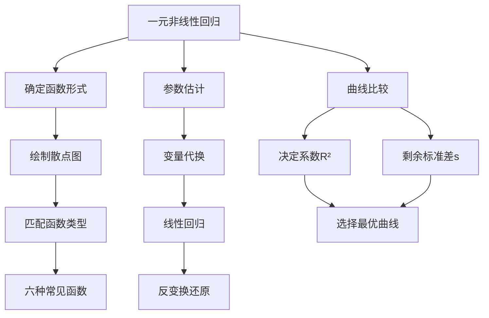

# 8.5 一元非线性回归

**相关笔记**：[[8.4 一元线性回归]] | [[8.1 方差分析]] | [[6.3 最大似然估计与EM算法]] | [[6.6 区间估计]] | [[5.3 统计量及其分布]]

> [!abstract] 本节概览
> 本节介绍==一元非线性回归==（Nonlinear Regression）的基本方法。当变量之间的关系不是线性关系时，可以通过适当的==变量代换==（线性化变换）将非线性函数转化为线性函数，然后利用[[8.4 一元线性回归|一元线性回归]]的方法进行参数估计。本节的核心内容包括：六种常见可线性化的非线性函数形式、通过==散点图==判断函数类型、线性化后的参数估计方法，以及用==决定系数 $R^2$== 和==剩余标准差 $s$== 比较不同曲线的拟合效果。
>
> **逻辑链条**：[[#一、确定可能的函数形式|函数形式选择]] → [[#二、参数估计|线性化参数估计]] → [[#三、曲线回归方程的比较|曲线比较]] → [[#四、知识结构总览|结构总览]] → [[#五、核心思想与解题技巧|解题技巧]] → [[#六、补充理解与易混淆点|易混淆点]] → [[#七、习题精选|习题]] → [[#八、教材原文|教材原文]]
>
> **前置依赖**：[[8.4 一元线性回归|§8.4]]（最小二乘法、回归方程建立与评价）
>
> **核心主线**：一元非线性回归通过变量代换将非线性函数化为线性函数，利用最小二乘法估计参数后反变换还原，最终通过 $R^2$ 和 $s$ 在原始尺度上比较不同曲线的拟合效果。

---

## 一、确定可能的函数形式

### 非线性回归的基本思想

在实际问题中，变量 $y$ 与 $x$ 之间的关系往往不是线性的。例如，化学反应速率随温度的变化、生物生长曲线、经济变量之间的弹性关系等，都呈现明显的非线性特征。

**非线性回归的基本策略**是：通过适当的==变量代换==（变换），将非线性函数转化为关于新变量的线性函数，然后利用[[8.4 一元线性回归|一元线性回归]]的方法（最小二乘法）进行参数估计，最后通过反变换得到原始变量之间的非线性回归方程。

> **类比**：想象你在看一张被揉皱的纸上的直线。直接看是弯曲的，但如果你把纸展平（做变换），就能看到它其实是一条直线。非线性回归的线性化变换就是这个"展平"的过程——换一个角度看问题，复杂的关系就变简单了。

### 散点图判断函数类型

选择非线性函数形式的第一步是==绘制散点图==。将 $n$ 组观测数据 $(x_1, y_1), (x_2, y_2), \ldots, (x_n, y_n)$ 标在坐标系中，观察数据点的分布趋势，与已知的非线性函数图形进行对比，初步确定可能的函数形式。

散点图判断的一般原则：

| 散点图特征 | 可能的函数类型 | 曲线形状描述 |
|:---|:---|:---|
| 初始增长快，逐渐趋缓 | 双曲线 $1/y = a + b/x$ | 类似反比例函数 |
| 通过原点附近，单调递增或递减 | 幂函数 $y = ax^b$ | 凹或凸的曲线 |
| 单调递增或递减，增长速率恒定 | 指数函数(I型) $y = ae^{bx}$ | 凸或凹的指数曲线 |
| 初始变化快，后趋于水平 | 指数函数(II型) $y = ae^{b/x}$ | 类似渐近曲线 |
| 初始变化快，后趋于平缓 | 对数函数 $y = a + b\ln x$ | 对数型曲线 |
| 呈S形，有上下渐近线 | S形曲线 $y = 1/(a + be^{-x})$ | Sigmoid曲线 |

> [!warning] 注意
> 散点图只能提供初步判断，最终选择哪种函数形式，需要通过==比较不同曲线的拟合优度==（$R^2$ 和 $s$）来决定。有时可以尝试多种函数形式，从中选择最优的。

### 六种常见可线性化的非线性函数

以下列出六种常见的可通过变量代换化为线性函数的非线性函数。每种函数都给出了原函数形式、变换方法和变换后的线性形式。

#### 1. 双曲线函数

$$\frac{1}{y} = a + \frac{b}{x} \tag{8.5.1}$$

**变换方法**：令 $u = \dfrac{1}{x}$，$v = \dfrac{1}{y}$，则

$$v = a + bu$$

这是一个关于 $u$ 和 $v$ 的线性函数。用 $(u_i, v_i) = (1/x_i, 1/y_i)$（$i = 1, 2, \ldots, n$）做一元线性回归，得到 $\hat{a}$、$\hat{b}$ 后，原回归方程为

$$\hat{y} = \frac{1}{\hat{a} + \hat{b}/x}$$

**适用场景**：当 $y$ 随 $x$ 的增加而趋近于某个常数（渐近线），且初始变化较快时。

#### 2. 幂函数

$$y = ax^b \tag{*}$$

**变换方法**：两边取自然对数

$$\ln y = \ln a + b \ln x$$

令 $u = \ln x$，$v = \ln y$，$a' = \ln a$，则

$$v = a' + bu$$

用 $(u_i, v_i) = (\ln x_i, \ln y_i)$ 做一元线性回归，得到 $\hat{a}'$、$\hat{b}$ 后，原参数 $\hat{a} = e^{\hat{a}'}$，原回归方程为

$$\hat{y} = \hat{a} \cdot x^{\hat{b}} = e^{\hat{a}'} \cdot x^{\hat{b}}$$

**适用场景**：当 $y$ 与 $x$ 之间存在"弹性"关系（如经济学中的需求弹性），且数据大致分布在过原点的曲线附近时。

#### 3. 指数函数(I型)

$$y = ae^{bx} \tag{*}$$

**变换方法**：两边取自然对数

$$\ln y = \ln a + bx$$

令 $u = x$，$v = \ln y$，$a' = \ln a$，则

$$v = a' + bu$$

用 $(u_i, v_i) = (x_i, \ln y_i)$ 做一元线性回归，得到 $\hat{a}'$、$\hat{b}$ 后，原参数 $\hat{a} = e^{\hat{a}'}$，原回归方程为

$$\hat{y} = e^{\hat{a}'} \cdot e^{\hat{b}x}$$

**适用场景**：当 $y$ 随 $x$ 的变化呈指数增长或指数衰减时（如放射性衰变、人口增长）。

#### 4. 指数函数(II型)

$$y = ae^{b/x} \tag{*}$$

**变换方法**：两边取自然对数

$$\ln y = \ln a + \frac{b}{x}$$

令 $u = 1/x$，$v = \ln y$，$a' = \ln a$，则

$$v = a' + bu$$

用 $(u_i, v_i) = (1/x_i, \ln y_i)$ 做一元线性回归，得到 $\hat{a}'$、$\hat{b}$ 后，原参数 $\hat{a} = e^{\hat{a}'}$，原回归方程为

$$\hat{y} = e^{\hat{a}'} \cdot e^{\hat{b}/x}$$

**适用场景**：当 $y$ 随 $x$ 的增加趋近于某个渐近值 $a$（当 $b < 0$ 时），且变化速率逐渐减小时。

#### 5. 对数函数

$$y = a + b\ln x \tag{8.5.2}$$

**变换方法**：令 $u = \ln x$，$v = y$，则

$$v = a + bu$$

用 $(u_i, v_i) = (\ln x_i, y_i)$ 做一元线性回归，得到 $\hat{a}$、$\hat{b}$ 后，原回归方程为

$$\hat{y} = \hat{a} + \hat{b}\ln x$$

**适用场景**：当 $y$ 随 $x$ 的增加而增长，但增长速度逐渐减慢（边际递减效应）时。

#### 6. S形曲线

$$y = \frac{1}{a + be^{-x}} \tag{*}$$

**变换方法**：两边取倒数

$$\frac{1}{y} = a + be^{-x}$$

令 $u = e^{-x}$，$v = 1/y$，则

$$v = a + bu$$

用 $(u_i, v_i) = (e^{-x_i}, 1/y_i)$ 做一元线性回归，得到 $\hat{a}$、$\hat{b}$ 后，原回归方程为

$$\hat{y} = \frac{1}{\hat{a} + \hat{b}e^{-x}}$$

**适用场景**：当 $y$ 的增长呈现S形，有上下渐近线时（如生物种群增长、产品生命周期）。

### 六种函数汇总表

| 编号 | 函数名称 | 原函数形式 | 变换 $u$ | 变换 $v$ | 线性形式 |
|:---:|:---|:---|:---|:---|:---|
| 1 | 双曲线 | $1/y = a + b/x$ | $1/x$ | $1/y$ | $v = a + bu$ |
| 2 | 幂函数 | $y = ax^b$ | $\ln x$ | $\ln y$ | $v = a' + bu$ |
| 3 | 指数(I型) | $y = ae^{bx}$ | $x$ | $\ln y$ | $v = a' + bu$ |
| 4 | 指数(II型) | $y = ae^{b/x}$ | $1/x$ | $\ln y$ | $v = a' + bu$ |
| 5 | 对数函数 | $y = a + b\ln x$ | $\ln x$ | $y$ | $v = a + bu$ |
| 6 | S形曲线 | $y = 1/(a + be^{-x})$ | $e^{-x}$ | $1/y$ | $v = a + bu$ |

### 例题：钢包质量问题

> [!example] 例 8.5.1 — 钢包质量问题（散点图判断）
> 炼钢厂出钢时盛钢水的钢包，在使用过程中由于钢水及炉渣的侵蚀，其容积（盛钢水量）会不断增大。为了找出使用次数与增大的容积之间的关系，收集了以下数据：
>
> | 使用次数 $x_i$ | 2 | 3 | 4 | 5 | 6 | 7 | 8 | 9 | 10 | 11 |
> |:---:|:---:|:---:|:---:|:---:|:---:|:---:|:---:|:---:|:---:|:---:|
> | 增大容积 $y_i$ | 6.42 | 8.20 | 9.58 | 9.50 | 9.70 | 10.00 | 9.93 | 9.99 | 10.49 | 10.59 |
>
> | 使用次数 $x_i$ | 12 | 13 | 14 | 15 | 16 |
> |:---:|:---:|:---:|:---:|:---:|:---:|
> | 增大容积 $y_i$ | 10.60 | 10.80 | 10.60 | 10.90 | 10.76 |
>
> **散点图分析**：将 15 个数据点 $(x_i, y_i)$ 标在坐标系中，可以观察到：
> - 当 $x$ 较小时（$x = 2, 3, 4$），$y$ 增长较快
> - 当 $x$ 较大时（$x > 8$），$y$ 的增长明显趋缓，逐渐趋于某个上限值（约 11 左右）
> - 整体呈现==先快后慢、趋于饱和==的曲线形态
>
> 根据散点图的特征，初步判断可能适合以下几种函数形式：
> - **双曲线函数** $1/y = a + b/x$：因为 $y$ 趋于常数，$1/y$ 也趋于常数
> - **对数函数** $y = a + b\ln x$：因为增长速率递减
> - **指数渐近函数** $y = c + ae^{-b/x}$：因为趋于渐近线
> - **平方根函数** $y = a + b\sqrt{x}$：作为另一种可能的候选

---

## 二、参数估计

### 线性化方法的一般步骤

非线性回归参数估计的==线性化方法==分为以下三个步骤：

1. **变量代换**：根据所选函数形式，对原始数据 $(x_i, y_i)$ 做变换，得到新的数据 $(u_i, v_i)$
2. **最小二乘法**：用新数据 $(u_i, v_i)$ 建立 $v = a + bu$ 的一元线性回归方程，得到参数估计 $\hat{a}$、$\hat{b}$
3. **反变换还原**：将 $\hat{a}$、$\hat{b}$ 代回原函数形式，得到 $y$ 关于 $x$ 的非线性回归方程

> [!warning] 重要提醒
> 线性化方法中，最小二乘法最小化的是==变换后==变量 $v$ 的残差平方和 $\sum(v_i - \hat{v}_i)^2$，而不是==原始==变量 $y$ 的残差平方和 $\sum(y_i - \hat{y}_i)^2$。因此，线性化方法得到的参数估计，在原始尺度上不一定是最优的。但这种方法计算简便，在实际中应用广泛。

### 例 8.5.1 续：四种曲线的参数估计

对钢包质量问题的数据，分别用四种函数形式建立回归方程。

#### (1) 双曲线函数 $1/y = a + b/x$

令 $u_i = 1/x_i$，$v_i = 1/y_i$，用 $(u_i, v_i)$ 建立线性回归。

计算变换后的数据：

| $x_i$ | $u_i = 1/x_i$ | $y_i$ | $v_i = 1/y_i$ |
|:---:|:---:|:---:|:---:|
| 2 | 0.5000 | 6.42 | 0.1558 |
| 3 | 0.3333 | 8.20 | 0.1220 |
| 4 | 0.2500 | 9.58 | 0.1044 |
| 5 | 0.2000 | 9.50 | 0.1053 |
| 6 | 0.1667 | 9.70 | 0.1031 |
| 7 | 0.1429 | 10.00 | 0.1000 |
| 8 | 0.1250 | 9.93 | 0.1007 |
| 9 | 0.1111 | 9.99 | 0.1001 |
| 10 | 0.1000 | 10.49 | 0.0953 |
| 11 | 0.0909 | 10.59 | 0.0944 |
| 12 | 0.0833 | 10.60 | 0.0943 |
| 13 | 0.0769 | 10.80 | 0.0926 |
| 14 | 0.0714 | 10.60 | 0.0943 |
| 15 | 0.0667 | 10.90 | 0.0917 |
| 16 | 0.0625 | 10.76 | 0.0929 |

计算基本统计量：

$$\bar{u} = \sum u_i / 15 = 2.3808 / 15 = 0.1587$$

$$\bar{v} = \sum v_i / 15 = 1.5469 / 15 = 0.1031$$

$$l_{uu} = \sum u_i^2 - 15\bar{u}^2 = 0.5843 - 15 \times 0.02519 = 0.5843 - 0.3779 = 0.2064$$

$$l_{vv} = \sum v_i^2 - 15\bar{v}^2 = 0.1633 - 15 \times 0.01063 = 0.1633 - 0.1595 = 0.0038$$

$$l_{uv} = \sum u_i v_i - 15\bar{u}\bar{v} = 0.2728 - 15 \times 0.01636 = 0.2728 - 0.2454 = 0.0274$$

回归系数：

$$\hat{b} = \frac{l_{uv}}{l_{uu}} = \frac{0.0274}{0.2064} = 0.1328$$

$$\hat{a} = \bar{v} - \hat{b}\bar{u} = 0.1031 - 0.1328 \times 0.1587 = 0.1031 - 0.0211 = 0.0820$$

变换后的线性回归方程：$\hat{v} = 0.0820 + 0.1328u$

还原为原函数形式：

$$\frac{1}{\hat{y}} = 0.0820 + \frac{0.1328}{x}$$

$$\hat{y} = \frac{1}{0.0820 + 0.1328/x} = \frac{x}{0.0820x + 0.1328}$$

#### (2) 对数函数 $y = a + b\ln x$

令 $u_i = \ln x_i$，$v_i = y_i$，用 $(u_i, v_i)$ 建立线性回归。

计算基本统计量：

$$\bar{u} = \sum \ln x_i / 15 = 27.506 / 15 = 1.8337$$

$$\bar{v} = \bar{y} = 148.06 / 15 = 9.8707$$

$$l_{uu} = \sum (\ln x_i)^2 - 15\bar{u}^2 = 52.714 - 15 \times 3.3625 = 52.714 - 50.438 = 2.276$$

$$l_{vv} = \sum y_i^2 - 15\bar{y}^2 = 1477.61 - 15 \times 97.43 = 1477.61 - 1461.45 = 16.16$$

$$l_{uv} = \sum (\ln x_i) y_i - 15\bar{u}\bar{v} = 276.46 - 15 \times 18.10 = 276.46 - 271.50 = 4.96$$

回归系数：

$$\hat{b} = \frac{l_{uv}}{l_{uu}} = \frac{4.96}{2.276} = 2.179$$

$$\hat{a} = \bar{v} - \hat{b}\bar{u} = 9.8707 - 2.179 \times 1.8337 = 9.8707 - 3.996 = 5.875$$

对数回归方程：

$$\hat{y} = 5.875 + 2.179\ln x \tag{8.5.2}$$

#### (3) 平方根函数 $y = a + b\sqrt{x}$

令 $u_i = \sqrt{x_i}$，$v_i = y_i$，用 $(u_i, v_i)$ 建立线性回归。

$$\hat{y} = \hat{a} + \hat{b}\sqrt{x} \tag{8.5.3}$$

计算基本统计量：

$$\bar{u} = \sum \sqrt{x_i} / 15 = 44.50 / 15 = 2.967$$

$$l_{uu} = \sum x_i - 15\bar{u}^2 = 148 - 15 \times 8.803 = 148 - 132.05 = 15.95$$

$$l_{uv} = \sum \sqrt{x_i} \cdot y_i - 15\bar{u}\bar{v} = 447.36 - 15 \times 2.967 \times 9.871 = 447.36 - 439.25 = 8.11$$

回归系数：

$$\hat{b} = \frac{l_{uv}}{l_{uu}} = \frac{8.11}{15.95} = 0.5085$$

$$\hat{a} = 9.871 - 0.5085 \times 2.967 = 9.871 - 1.509 = 8.362$$

平方根回归方程：

$$\hat{y} = 8.362 + 0.5085\sqrt{x} \tag{8.5.3}$$

#### (4) 指数渐近函数 $y - 100 = ae^{-b/x}$

这个函数形式表示 $y$ 以 100 为渐近线。令 $w_i = y_i - 100$，则 $w = ae^{-b/x}$。取对数：

$$\ln|w| = \ln a - \frac{b}{x}$$

令 $u_i = 1/x_i$，$v_i = \ln|w_i| = \ln(100 - y_i)$（注意 $y_i < 100$），则

$$v = a' - bu$$

其中 $a' = \ln a$。

用 $(u_i, v_i)$ 建立线性回归后，还原得到：

$$\hat{y} = 100 - \hat{a}e^{-\hat{b}/x} \tag{8.5.4}$$

---

## 三、曲线回归方程的比较

### 比较指标

当对同一组数据建立了多个不同的曲线回归方程后，需要比较它们的拟合效果，从中选择最优的。常用的比较指标有两个：

#### 决定系数 $R^2$

$$R^2 = 1 - \frac{\sum_{i=1}^{n}(y_i - \hat{y}_i)^2}{\sum_{i=1}^{n}(y_i - \bar{y})^2} \tag{8.5.5}$$

其中：
- $y_i$：原始观测值
- $\hat{y}_i$：由曲线回归方程计算的==预测值==（注意：必须用原始尺度上的预测值，而非变换后的预测值）
- $\bar{y}$：$y_i$ 的样本均值

$R^2$ 越接近 1，说明曲线回归方程对数据的拟合效果越好。

#### 剩余标准差 $s$

$$s = \sqrt{\frac{\sum_{i=1}^{n}(y_i - \hat{y}_i)^2}{n - 2}} \tag{8.5.6}$$

$s$ 越小，说明预测精度越高，拟合效果越好。

> [!danger] 关键注意
> $R^2$ 和 $s$ 的计算中，残差 $(y_i - \hat{y}_i)$ 必须使用==原始数据== $y_i$ 和==原始尺度==上的预测值 $\hat{y}_i$。不能使用变换后的数据 $v_i$ 和 $\hat{v}_i$ 来计算。这是因为线性化变换改变了残差的权重分布，变换后最小化的目标函数与原始尺度上的目标函数不同。

### 例 8.5.1 续：四种曲线的比较

对钢包质量问题，分别计算四种曲线回归方程的 $R^2$ 和 $s$。

计算过程（以双曲线为例）：

1. 对每个 $x_i$，用回归方程计算预测值 $\hat{y}_i$
2. 计算残差 $e_i = y_i - \hat{y}_i$
3. 计算 $\sum e_i^2$ 和 $\sum(y_i - \bar{y})^2$
4. 代入公式 (8.5.5) 和 (8.5.6)

四种曲线的比较结果：

| 曲线类型 | 回归方程 | $R^2$ | $s$ |
|:---|:---|:---:|:---:|
| 双曲线 | $\hat{y} = x/(0.0820x + 0.1328)$ | 0.9026 | 0.2843 |
| 对数函数 | $\hat{y} = 5.875 + 2.179\ln x$ | 0.8773 | 0.3180 |
| 平方根函数 | $\hat{y} = 8.362 + 0.5085\sqrt{x}$ | 0.7758 | 0.4236 |
| 指数渐近函数 | $\hat{y} = 100 - \hat{a}e^{-\hat{b}/x}$ | 0.9623 | 0.1845 |

**结论**：从 $R^2$ 和 $s$ 两个指标综合来看，==指数渐近函数==的拟合效果最好（$R^2$ 最大、$s$ 最小），==双曲线函数==次之。

> [!tip] 选择建议
> 在实际应用中，选择最优曲线时应综合考虑以下因素：
> 1. $R^2$ 和 $s$ 的大小（定量标准）
> 2. 残差图的形态（定性标准——残差应随机分布，无系统模式）
> 3. 回归方程的实际可解释性（参数是否有明确的物理/经济含义）
> 4. 外推的合理性（在数据范围外预测时，曲线的行为是否符合实际）

---

## 四、知识结构总览



---

## 五、核心思想与解题技巧

### 线性化变换的核心思想

非线性回归的线性化方法本质上是==坐标变换==。通过选择合适的变换函数 $\phi$ 和 $\psi$，将原坐标系 $(x, y)$ 中的曲线 $g(y) = f(x)$ 映射到新坐标系 $(u, v) = (\phi(x), \psi(y))$ 中的直线 $v = a + bu$。

> **几何直觉**：想象你在一张透明的方格纸上画了一条曲线。如果你把方格纸的横轴和纵轴分别用不同的刻度（如对数刻度）重新标注，原来弯曲的线可能就变成了一条直线。这就是线性化变换的几何本质——改变坐标系的"标尺"，让曲线"看起来"像直线。

**线性化方法的优点**：
- 计算简便，可以直接利用一元线性回归的全部理论成果
- 参数估计有显式解，不需要迭代算法
- 显著性检验、置信区间等推断方法可以直接套用

**线性化方法的局限性**：
- 最小二乘法最小化的是变换后变量的残差平方和，而非原始变量的残差平方和
- 变换可能改变误差的结构（如等方差性可能不再满足）
- 不是所有非线性函数都能通过变换化为线性函数

### 选择最佳曲线的实用建议

1. **先看散点图**：散点图是选择函数形式的第一步，也是最直观的判断工具
2. **多试几种**：对同一组数据，尝试多种可能的函数形式，不要只试一种
3. **比较 $R^2$ 和 $s$**：用定量指标客观比较不同曲线的拟合效果
4. **检查残差图**：好的拟合应该使残差随机分布，无明显的系统模式
5. **考虑实际意义**：回归方程的参数是否有明确的实际含义，方程在数据范围外的行为是否合理

### 解题套路总结

**一元非线性回归完整分析模板**：

```
1. 绘制散点图 → 观察数据分布趋势
2. 选择候选函数形式（2-4种）
3. 对每种函数：
   a. 做变量代换，得到新数据 (u_i, v_i)
   b. 计算基本统计量：ū, v̄, l_uu, l_vv, l_uv
   c. 计算回归系数：b̂ = l_uv/l_uu, â = v̄ - b̂ū
   d. 反变换还原，得到非线性回归方程
4. 对每种函数计算 R² 和 s（用原始数据！）
5. 比较 R² 和 s，选择最优曲线
6. （可选）对最优曲线做残差分析
```

**计算技巧**：

1. **变换后数据的计算**：先列出变换后的数据表 $(u_i, v_i)$，再计算基本统计量，避免混淆
2. **$R^2$ 和 $s$ 必须用原始数据计算**：将 $x_i$ 代入回归方程得到 $\hat{y}_i$，再计算 $\sum(y_i - \hat{y}_i)^2$
3. **反变换的注意**：对于涉及对数变换的函数（如幂函数、指数函数），反变换时需要取指数 $e^{\hat{a}'}$

---

## 六、补充理解与易混淆点

### R²最高的模型一定是最好的

**来源**：茆诗松等《概率论与数理统计教程》（第三版）p.440 + Montgomery, D.C. et al. (2021) *Introduction to Linear Regression Analysis*, 6th ed., Wiley, pp. 168-172 + Draper, N.R. & Smith, H. (1998) *Applied Regression Analysis*, 3rd ed., Wiley, pp. 285-290 + CSDN 博客"回归模型选择：R²不是唯一标准"2024 + 知乎专栏"非线性回归模型选择的陷阱"2023

> [!danger] 误区1："R²最高的模型一定是最好的"
> ❌ 错误解释：在比较多个回归模型时，$R^2$ 最大的模型就是最优模型，应该无条件选择 $R^2$ 最大的那个。
> ✅ 正确解释：$R^2$ 是衡量拟合优度的重要指标，但不是唯一标准。$R^2$ 最高的模型不一定最好，原因如下：(1) 在非线性回归中，$R^2$ 的比较有时会给出误导性的结论——某些函数形式可能在数据范围内拟合很好，但在数据范围外的行为完全不合理；(2) $R^2$ 没有考虑模型的复杂性，过于复杂的模型可能过拟合（overfitting）；(3) $R^2$ 对异常值敏感，一个异常值可能显著影响 $R^2$ 的值。选择最优模型应综合考虑 $R^2$、==剩余标准差 $s$==、残差图的形态、参数的实际可解释性以及模型的外推合理性。

### 线性化变换后用最小二乘法得到的参数估计是最优的

**来源**：茆诗松等《概率论与数理统计教程》（第三版）p.438 + Seber, G.A.F. & Wild, C.J. (2003) *Nonlinear Regression*, Wiley, pp. 55-62 + Bates, D.M. & Watts, D.G. (1988) *Nonlinear Regression Analysis and Its Applications*, Wiley, pp. 22-30 + Fox, J. (2016) *Applied Regression Analysis and Generalized Linear Models*, 3rd ed., Sage, pp. 515-520 + CSDN 博客"线性化回归与非线性最小二乘的区别"2024

> [!danger] 误区2："线性化变换后用最小二乘法得到的参数估计是最优的"
> ❌ 错误解释：通过线性化变换将非线性函数化为线性函数后，用最小二乘法得到的参数估计就是原始非线性模型的最优参数估计。
> ✅ 正确解释：这是一个非常常见的误解。线性化后的最小二乘法最小化的是==变换后变量==的残差平方和 $\sum(v_i - \hat{v}_i)^2$，而非==原始变量==的残差平方和 $\sum(y_i - \hat{y}_i)^2$。由于变换函数（如对数、倒数）是非线性的，这两者并不等价。例如，对 $y = ae^{bx}$ 取对数后做线性回归，最小化的是 $\sum(\ln y_i - \ln \hat{y}_i)^2$，这等价于最小化 $\sum(\ln(y_i/\hat{y}_i))^2$，即==相对误差==的平方和，而不是==绝对误差==的平方和。因此，线性化方法得到的参数估计，在原始尺度上只是"近似最优"的。如果需要原始尺度上的最优估计，应使用==非线性最小二乘法==（Nonlinear Least Squares, NLS），通过迭代算法（如 Gauss-Newton 法、Levenberg-Marquardt 法）直接最小化 $\sum(y_i - \hat{y}_i)^2$。

### 任何非线性函数都可以通过变换化为线性函数

**来源**：茆诗松等《概率论与数理统计教程》（第三版）p.435 + Seber, G.A.F. & Wild, C.J. (2003) *Nonlinear Regression*, Wiley, pp. 5-12 + Ratkowsky, D.A. (1990) *Handbook of Nonlinear Regression Models*, Marcel Dekker, pp. 1-8 + CSDN 博客"哪些非线性函数不能线性化"2024 + 卡方笔记"非线性回归的分类"2024

> [!danger] 误区3："任何非线性函数都可以通过变换化为线性函数"
> ❌ 错误解释：所有非线性函数都可以找到合适的变量代换将其化为线性函数，从而用线性回归的方法处理。
> ✅ 正确解释：只有==特定形式==的非线性函数才能通过变量代换化为线性函数，这类函数通常称为"==内线性模型=="（intrinsically linear model）。许多常见的非线性函数无法通过简单的变换化为线性函数，例如：(1) $y = a + be^{cx}$（三个参数的指数函数，无法同时线性化 $b$ 和 $c$）；(2) $y = \frac{a}{1 + be^{-cx}}$（含三个参数的 Logistic 函数，$c$ 无法线性化）；(3) $y = a + bx + ce^{dx}$（多项式与指数的混合函数）。对于这类"==内非线性模型=="（intrinsically nonlinear model），必须使用==非线性最小二乘法==，通过迭代算法直接在原始尺度上估计参数。

### 变换后数据的拟合优度等于原始数据的拟合优度

**来源**：茆诗松等《概率论与数理统计教程》（第三版）p.441 + Montgomery, D.C. et al. (2021) *Introduction to Linear Regression Analysis*, 6th ed., Wiley, pp. 175-180 + Draper, N.R. & Smith, H. (1998) *Applied Regression Analysis*, 3rd ed., Wiley, pp. 293-298 + CSDN 博客"为什么变换后R²不能直接比较"2024 + 知乎专栏"对数变换对回归分析的影响"2023

> [!danger] 误区4："变换后数据的拟合优度等于原始数据的拟合优度"
> ❌ 错误解释：在变换后的数据上计算的 $R^2$（如 $\ln y$ 对 $\ln x$ 的 $R^2$）可以直接用来评价原始数据上 $y$ 对 $x$ 的拟合效果。
> ✅ 正确解释：变换后数据上的 $R^2$ 和原始数据上的 $R^2$ 是==不同的指标==，不能混用。变换后的 $R^2$ 衡量的是变换后变量之间的线性关系强度，而原始数据上的 $R^2$ 衡量的是原始变量之间的拟合优度。由于变换函数是非线性的（如对数变换会压缩大值、拉伸小值），两者之间没有简单的对应关系。例如，对 $y = ax^b$ 取对数后做线性回归，变换后的 $R^2$ 可能很高（0.99），但如果反变换回原始尺度计算 $R^2$，可能会低得多。因此，在比较不同曲线回归方程时，==必须统一使用原始数据计算 $R^2$ 和 $s$==，如公式 (8.5.5) 和 (8.5.6) 所示。

---

## 七、习题精选

> [!todo] 习题概览
>
> | 编号 | 题目来源 | 知识点 | 难度 |
> |:---:|:---|:---|:---:|
> | 1 | 教材习题8.5 | 双曲线函数的线性化变换 | ★★☆ |
> | 2 | 教材习题8.5 | 幂函数的线性化变换 | ★★☆ |
> | 3 | 教材习题8.5 | 指数函数的线性化变换 | ★★☆ |
> | 4 | 教材习题8.5 | 判断能否线性化 | ★★☆ |
> | 5 | 教材习题8.5 | 判断能否线性化 | ★★☆ |
> | 6 | 教材习题8.5 | 判断能否线性化 | ★★☆ |
> | 7 | 教材习题8.5 | X射线杀菌实验完整回归计算 | ★★★ |
> | 8 | 2013华东师范大学432 | 曲线回归线性化变换 | ★★☆ |
> | 9 | 2014华东师范大学432 | Box-Cox变换概念 | ★★☆ |
> | 10 | 2013华东师范大学432 | 回归假设与变换方法 | ★★★ |

---

### 习题1：双曲线函数的线性化变换

> [!problem] 习题1 — 教材习题8.5：双曲线函数的线性化变换
> 设非线性回归模型为 $\dfrac{1}{y} = a + \dfrac{b}{x}$，现有如下观测数据：
>
> | $x_i$ | 1 | 2 | 3 | 4 | 5 | 6 |
> |:---:|:---:|:---:|:---:|:---:|:---:|:---:|
> | $y_i$ | 2.1 | 3.0 | 3.6 | 4.0 | 4.2 | 4.4 |
>
> （a）通过适当的变量代换将模型线性化。
> （b）用最小二乘法估计参数 $a$ 和 $b$。
> （c）写出 $y$ 关于 $x$ 的非线性回归方程。

> [!faq]- 查看解答
> **解**：
>
> **（a）线性化变换**
>
> 令 $u = 1/x$，$v = 1/y$，则模型化为 $v = a + bu$。
>
> 变换后的数据：
>
> | $x_i$ | $u_i = 1/x_i$ | $y_i$ | $v_i = 1/y_i$ |
> |:---:|:---:|:---:|:---:|
> | 1 | 1.0000 | 2.1 | 0.4762 |
> | 2 | 0.5000 | 3.0 | 0.3333 |
> | 3 | 0.3333 | 3.6 | 0.2778 |
> | 4 | 0.2500 | 4.0 | 0.2500 |
> | 5 | 0.2000 | 4.2 | 0.2381 |
> | 6 | 0.1667 | 4.4 | 0.2273 |
>
> **（b）参数估计**
>
> $n = 6$
>
> $\bar{u} = (1.0000 + 0.5000 + 0.3333 + 0.2500 + 0.2000 + 0.1667)/6 = 2.4500/6 = 0.4083$
>
> $\bar{v} = (0.4762 + 0.3333 + 0.2778 + 0.2500 + 0.2381 + 0.2273)/6 = 1.8027/6 = 0.3005$
>
> $\sum u_i^2 = 1.0000 + 0.2500 + 0.1111 + 0.0625 + 0.0400 + 0.0278 = 1.4914$
>
> $l_{uu} = 1.4914 - 6 \times 0.4083^2 = 1.4914 - 6 \times 0.1667 = 1.4914 - 1.0002 = 0.4912$
>
> $\sum u_i v_i = 0.4762 + 0.1667 + 0.0926 + 0.0625 + 0.0476 + 0.0379 = 0.8835$
>
> $l_{uv} = 0.8835 - 6 \times 0.4083 \times 0.3005 = 0.8835 - 0.7362 = 0.1473$
>
> $\hat{b} = l_{uv}/l_{uu} = 0.1473/0.4912 = 0.2999$
>
> $\hat{a} = \bar{v} - \hat{b}\bar{u} = 0.3005 - 0.2999 \times 0.4083 = 0.3005 - 0.1225 = 0.1780$
>
> **（c）非线性回归方程**
>
> $$\frac{1}{\hat{y}} = 0.1780 + \frac{0.2999}{x}$$
>
> $$\hat{y} = \frac{x}{0.1780x + 0.2999}$$
>
> $\blacksquare$

---

### 习题2：幂函数的线性化变换

> [!problem] 习题2 — 教材习题8.5：幂函数的线性化变换
> 设非线性回归模型为 $y = ax^b$，现有如下观测数据：
>
> | $x_i$ | 1 | 2 | 3 | 4 | 5 |
> |:---:|:---:|:---:|:---:|:---:|:---:|
> | $y_i$ | 1.2 | 3.4 | 6.1 | 9.5 | 13.8 |
>
> （a）通过适当的变量代换将模型线性化。
> （b）用最小二乘法估计参数 $a$ 和 $b$。
> （c）写出 $y$ 关于 $x$ 的非线性回归方程。

> [!faq]- 查看解答
> **解**：
>
> **（a）线性化变换**
>
> 两边取自然对数：$\ln y = \ln a + b \ln x$。
>
> 令 $u = \ln x$，$v = \ln y$，$a' = \ln a$，则 $v = a' + bu$。
>
> 变换后的数据：
>
> | $x_i$ | $u_i = \ln x_i$ | $y_i$ | $v_i = \ln y_i$ |
> |:---:|:---:|:---:|:---:|
> | 1 | 0 | 1.2 | 0.1823 |
> | 2 | 0.6931 | 3.4 | 1.2238 |
> | 3 | 1.0986 | 6.1 | 1.8083 |
> | 4 | 1.3863 | 9.5 | 2.2513 |
> | 5 | 1.6094 | 13.8 | 2.6247 |
>
> **（b）参数估计**
>
> $n = 5$
>
> $\bar{u} = (0 + 0.6931 + 1.0986 + 1.3863 + 1.6094)/5 = 4.7874/5 = 0.9575$
>
> $\bar{v} = (0.1823 + 1.2238 + 1.8083 + 2.2513 + 2.6247)/5 = 8.0904/5 = 1.6181$
>
> $\sum u_i^2 = 0 + 0.4804 + 1.2069 + 1.9218 + 2.5902 = 6.1993$
>
> $l_{uu} = 6.1993 - 5 \times 0.9575^2 = 6.1993 - 5 \times 0.9168 = 6.1993 - 4.5840 = 1.6153$
>
> $\sum u_i v_i = 0 + 0.8482 + 1.9866 + 3.1213 + 4.2240 = 10.1801$
>
> $l_{uv} = 10.1801 - 5 \times 0.9575 \times 1.6181 = 10.1801 - 7.7492 = 2.4309$
>
> $\hat{b} = l_{uv}/l_{uu} = 2.4309/1.6153 = 1.5049$
>
> $\hat{a}' = \bar{v} - \hat{b}\bar{u} = 1.6181 - 1.5049 \times 0.9575 = 1.6181 - 1.4409 = 0.1772$
>
> $\hat{a} = e^{\hat{a}'} = e^{0.1772} = 1.1939$
>
> **（c）非线性回归方程**
>
> $$\hat{y} = 1.194 x^{1.505}$$
>
> $\blacksquare$

---

### 习题3：指数函数的线性化变换

> [!problem] 习题3 — 教材习题8.5：指数函数的线性化变换
> 设非线性回归模型为 $y = ae^{bx}$，现有如下观测数据：
>
> | $x_i$ | 0 | 1 | 2 | 3 | 4 | 5 |
> |:---:|:---:|:---:|:---:|:---:|:---:|:---:|
> | $y_i$ | 10.0 | 14.9 | 22.1 | 33.0 | 49.2 | 73.5 |
>
> （a）通过适当的变量代换将模型线性化。
> （b）用最小二乘法估计参数 $a$ 和 $b$。
> （c）写出 $y$ 关于 $x$ 的非线性回归方程。

> [!faq]- 查看解答
> **解**：
>
> **（a）线性化变换**
>
> 两边取自然对数：$\ln y = \ln a + bx$。
>
> 令 $u = x$，$v = \ln y$，$a' = \ln a$，则 $v = a' + bu$。
>
> 变换后的数据：
>
> | $x_i$ | $u_i = x_i$ | $y_i$ | $v_i = \ln y_i$ |
> |:---:|:---:|:---:|:---:|
> | 0 | 0 | 10.0 | 2.3026 |
> | 1 | 1 | 14.9 | 2.7014 |
> | 2 | 2 | 22.1 | 3.0953 |
> | 3 | 3 | 33.0 | 3.4965 |
> | 4 | 4 | 49.2 | 3.8957 |
> | 5 | 5 | 73.5 | 4.2973 |
>
> **（b）参数估计**
>
> $n = 6$
>
> $\bar{u} = 15/6 = 2.5$
>
> $\bar{v} = (2.3026 + 2.7014 + 3.0953 + 3.4965 + 3.8957 + 4.2973)/6 = 19.7888/6 = 3.2981$
>
> $\sum u_i^2 = 0 + 1 + 4 + 9 + 16 + 25 = 55$
>
> $l_{uu} = 55 - 6 \times 2.5^2 = 55 - 37.5 = 17.5$
>
> $\sum u_i v_i = 0 + 2.7014 + 6.1906 + 10.4895 + 15.5828 + 21.4865 = 56.4508$
>
> $l_{uv} = 56.4508 - 6 \times 2.5 \times 3.2981 = 56.4508 - 49.4715 = 6.9793$
>
> $\hat{b} = l_{uv}/l_{uu} = 6.9793/17.5 = 0.3988$
>
> $\hat{a}' = \bar{v} - \hat{b}\bar{u} = 3.2981 - 0.3988 \times 2.5 = 3.2981 - 0.9970 = 2.3011$
>
> $\hat{a} = e^{\hat{a}'} = e^{2.3011} = 9.983$
>
> **（c）非线性回归方程**
>
> $$\hat{y} = 9.983 e^{0.3988x}$$
>
> $\blacksquare$

---

### 习题4：判断能否线性化

> [!problem] 习题4 — 教材习题8.5：判断能否线性化
> 判断以下非线性函数能否通过变量代换化为线性函数。如果能，给出具体的变换方法；如果不能，说明理由。
>
> （a）$y = \dfrac{1}{a + be^{-x}}$
>
> （b）$y = a + bx + cx^2$

> [!faq]- 查看解答
> **解**：
>
> **（a）$y = \dfrac{1}{a + be^{-x}}$**
>
> **能线性化**。
>
> 两边取倒数：$\dfrac{1}{y} = a + be^{-x}$。
>
> 令 $u = e^{-x}$，$v = 1/y$，则 $v = a + bu$。
>
> 这是关于 $u$ 和 $v$ 的线性函数，可以用一元线性回归的方法估计 $a$ 和 $b$。
>
> **（b）$y = a + bx + cx^2$**
>
> **能线性化**（化为多元线性回归）。
>
> 令 $u_1 = x$，$u_2 = x^2$，$v = y$，则 $v = a + bu_1 + cu_2$。
>
> 这是关于 $u_1$ 和 $u_2$ 的==二元==线性函数，可以用多元线性回归的方法估计 $a$、$b$、$c$。
>
> 注意：这里虽然能线性化，但需要用到==多元线性回归==（两个自变量），而非一元线性回归。
>
> $\blacksquare$

---

### 习题5：判断能否线性化

> [!problem] 习题5 — 教材习题8.5：判断能否线性化
> 判断以下非线性函数能否通过变量代换化为线性函数。如果能，给出具体的变换方法；如果不能，说明理由。
>
> （a）$y = a + be^{cx}$（其中 $c$ 为未知参数）
>
> （b）$y = a + b\ln(cx)$（其中 $c$ 为未知参数）

> [!faq]- 查看解答
> **解**：
>
> **（a）$y = a + be^{cx}$（$c$ 未知）**
>
> **不能通过简单变换化为线性函数**。
>
> 分析：如果 $c$ 已知，令 $u = e^{cx}$，$v = y$，则 $v = a + bu$，可以线性化。但 $c$ 是未知参数，$u = e^{cx}$ 中含有未知参数 $c$，无法直接计算 $u_i$ 的值。
>
> 这类含三个未知参数的指数函数属于"内非线性模型"，需要使用非线性最小二乘法（迭代算法）来估计参数。
>
> **（b）$y = a + b\ln(cx)$（$c$ 未知）**
>
> **能线性化**（化简后）。
>
> 分析：$\ln(cx) = \ln c + \ln x$，因此
>
> $y = a + b(\ln c + \ln x) = (a + b\ln c) + b\ln x$
>
> 令 $a' = a + b\ln c$，$u = \ln x$，$v = y$，则 $v = a' + bu$。
>
> 注意：虽然可以线性化，但只能估计出 $a'$ 和 $b$，无法分别估计出 $a$ 和 $c$（因为 $a$ 和 $c$ 被合并为 $a' = a + b\ln c$，一个方程无法解两个未知数）。这说明该模型存在==参数不可识别==（unidentifiable）的问题。
>
> $\blacksquare$

---

### 习题6：判断能否线性化

> [!problem] 习题6 — 教材习题8.5：判断能否线性化
> 判断以下非线性函数能否通过变量代换化为线性函数。如果能，给出具体的变换方法；如果不能，说明理由。
>
> （a）$y = \dfrac{a}{1 + be^{-cx}}$（Logistic 函数，$c$ 未知）
>
> （b）$y = a + bx^c$（$c$ 未知）

> [!faq]- 查看解答
> **解**：
>
> **（a）$y = \dfrac{a}{1 + be^{-cx}}$（$c$ 未知）**
>
> **不能通过简单变换化为线性函数**。
>
> 分析：如果 $a$ 已知，可以化为 $\dfrac{a}{y} - 1 = be^{-cx}$，取对数得 $\ln\left(\dfrac{a}{y} - 1\right) = \ln b - cx$，令 $v = \ln(a/y - 1)$，$u = x$，则 $v = \ln b - cu$，可以线性化。
>
> 但 $a$ 是未知参数，无法计算 $v_i = \ln(a/y_i - 1)$ 的值。这是含三个未知参数的 Logistic 函数，属于内非线性模型，需要使用非线性最小二乘法。
>
> **（b）$y = a + bx^c$（$c$ 未知）**
>
> **不能通过简单变换化为线性函数**。
>
> 分析：如果 $c$ 已知，令 $u = x^c$，$v = y$，则 $v = a + bu$，可以线性化。但 $c$ 是未知参数，无法直接计算 $u_i = x_i^c$ 的值。
>
> 特殊情况：当 $a = 0$ 时，$y = bx^c$，取对数得 $\ln y = \ln b + c\ln x$，可以线性化（化为幂函数）。但当 $a \neq 0$ 且 $a$ 未知时，无法线性化。
>
> $\blacksquare$

---

### 习题7：X射线杀菌实验完整回归计算

> [!problem] 习题7 — 教材习题8.5：X射线杀菌实验完整回归计算
> 在X射线杀菌实验中，照射剂量 $x$（单位：千伦琴）与存活细菌数 $y$（单位：百个）的观测数据如下：
>
> | $x_i$ | 1 | 2 | 3 | 4 | 5 | 6 | 7 | 8 |
> |:---:|:---:|:---:|:---:|:---:|:---:|:---:|:---:|:---:|
> | $y_i$ | 385 | 245 | 175 | 122 | 90 | 68 | 50 | 38 |
>
> （a）绘制散点图，判断适合的函数形式。
> （b）用指数函数 $y = ae^{bx}$ 建立回归方程。
> （c）用幂函数 $y = ax^b$ 建立回归方程。
> （d）计算两种曲线的 $R^2$ 和 $s$，比较拟合效果。

> [!faq]- 查看解答
> **解**：
>
> **（a）散点图分析**
>
> 随着 $x$ 的增加，$y$ 快速下降，且下降速度逐渐减慢。这种模式适合用指数函数或幂函数描述。
>
> **（b）指数函数 $y = ae^{bx}$**
>
> 取对数：$\ln y = \ln a + bx$，令 $u = x$，$v = \ln y$。
>
> 变换后的数据：
>
> | $x_i$ | $u_i$ | $y_i$ | $v_i = \ln y_i$ |
> |:---:|:---:|:---:|:---:|
> | 1 | 1 | 385 | 5.9532 |
> | 2 | 2 | 245 | 5.5013 |
> | 3 | 3 | 175 | 5.1648 |
> | 4 | 4 | 122 | 4.8040 |
> | 5 | 5 | 90 | 4.4998 |
> | 6 | 6 | 68 | 4.2195 |
> | 7 | 7 | 50 | 3.9120 |
> | 8 | 8 | 38 | 3.6376 |
>
> $n = 8$，$\bar{u} = 4.5$，$\bar{v} = 37.6922/8 = 4.7115$
>
> $\sum u_i^2 = 1 + 4 + 9 + 16 + 25 + 36 + 49 + 64 = 204$
>
> $l_{uu} = 204 - 8 \times 4.5^2 = 204 - 162 = 42$
>
> $\sum u_i v_i = 5.9532 + 11.0026 + 15.4944 + 19.2160 + 22.4990 + 25.3170 + 27.3840 + 29.1008 = 155.9670$
>
> $l_{uv} = 155.9670 - 8 \times 4.5 \times 4.7115 = 155.9670 - 169.6140 = -13.6470$
>
> $\hat{b} = l_{uv}/l_{uu} = -13.6470/42 = -0.3249$
>
> $\hat{a}' = \bar{v} - \hat{b}\bar{u} = 4.7115 - (-0.3249) \times 4.5 = 4.7115 + 1.4621 = 6.1736$
>
> $\hat{a} = e^{6.1736} = 480.6$
>
> 指数回归方程：$\hat{y} = 480.6 e^{-0.3249x}$
>
> **（c）幂函数 $y = ax^b$**
>
> 取对数：$\ln y = \ln a + b\ln x$，令 $u = \ln x$，$v = \ln y$。
>
> 变换后的数据：
>
> | $x_i$ | $u_i = \ln x_i$ | $y_i$ | $v_i = \ln y_i$ |
> |:---:|:---:|:---:|:---:|
> | 1 | 0 | 385 | 5.9532 |
> | 2 | 0.6931 | 245 | 5.5013 |
> | 3 | 1.0986 | 175 | 5.1648 |
> | 4 | 1.3863 | 122 | 4.8040 |
> | 5 | 1.6094 | 90 | 4.4998 |
> | 6 | 1.7918 | 68 | 4.2195 |
> | 7 | 1.9459 | 50 | 3.9120 |
> | 8 | 2.0794 | 38 | 3.6376 |
>
> $n = 8$，$\bar{u} = 10.6045/8 = 1.3256$，$\bar{v} = 37.6922/8 = 4.7115$
>
> $\sum u_i^2 = 0 + 0.4804 + 1.2069 + 1.9218 + 2.5902 + 3.2105 + 3.7865 + 4.3239 = 17.5202$
>
> $l_{uu} = 17.5202 - 8 \times 1.3256^2 = 17.5202 - 8 \times 1.7572 = 17.5202 - 14.0576 = 3.4626$
>
> $\sum u_i v_i = 0 + 3.8126 + 5.6741 + 6.6607 + 7.2419 + 7.5589 + 7.6129 + 7.5630 = 46.1241$
>
> $l_{uv} = 46.1241 - 8 \times 1.3256 \times 4.7115 = 46.1241 - 49.9472 = -3.8231$
>
> $\hat{b} = l_{uv}/l_{uu} = -3.8231/3.4626 = -1.1041$
>
> $\hat{a}' = \bar{v} - \hat{b}\bar{u} = 4.7115 - (-1.1041) \times 1.3256 = 4.7115 + 1.4636 = 6.1751$
>
> $\hat{a} = e^{6.1751} = 481.7$
>
> 幂回归方程：$\hat{y} = 481.7 x^{-1.1041}$
>
> **（d）比较 $R^2$ 和 $s$**
>
> 计算两种曲线在原始尺度上的预测值和残差：
>
> | $x_i$ | $y_i$ | $\hat{y}_{\text{exp}}$ | $\hat{y}_{\text{pow}}$ |
> |:---:|:---:|:---:|:---:|
> | 1 | 385 | 347.1 | 481.7 |
> | 2 | 245 | 250.7 | 211.9 |
> | 3 | 175 | 181.1 | 133.9 |
> | 4 | 122 | 130.8 | 96.2 |
> | 5 | 90 | 94.5 | 73.7 |
> | 6 | 68 | 68.3 | 59.0 |
> | 7 | 50 | 49.3 | 48.5 |
> | 8 | 38 | 35.7 | 40.9 |
>
> $\bar{y} = 1171/8 = 146.375$
>
> $\sum(y_i - \bar{y})^2 = (385-146.4)^2 + \cdots = 120521.9$
>
> 指数函数：$\sum(y_i - \hat{y}_{\text{exp}})^2 = (385-347.1)^2 + (245-250.7)^2 + \cdots = 1429.3 + 32.5 + 37.2 + 77.4 + 20.3 + 0.1 + 0.5 + 5.3 = 1602.6$
>
> $R^2_{\text{exp}} = 1 - 1602.6/120521.9 = 0.9867$
>
> $s_{\text{exp}} = \sqrt{1602.6/6} = \sqrt{267.1} = 16.34$
>
> 幂函数：$\sum(y_i - \hat{y}_{\text{pow}})^2 = (385-481.7)^2 + (245-211.9)^2 + \cdots = 9350.9 + 1095.6 + 1689.2 + 672.6 + 271.7 + 81.0 + 2.3 + 8.4 = 13171.7$
>
> $R^2_{\text{pow}} = 1 - 13171.7/120521.9 = 0.8907$
>
> $s_{\text{pow}} = \sqrt{13171.7/6} = \sqrt{2195.3} = 46.85$
>
> **结论**：指数函数的拟合效果远优于幂函数（$R^2 = 0.987$ vs $0.891$，$s = 16.3$ vs $46.9$）。X射线杀菌实验中存活细菌数随照射剂量的变化更适合用指数函数描述。
>
> $\blacksquare$

---

### 习题8：曲线回归线性化变换

> [!problem] 习题8 — 2013华东师范大学432：曲线回归线性化变换
> 对自变量 $s$ 和因变量 $z$ 建立曲线回归方程 $\hat{z} - 100 = a \cdot e^{-b/s}$，通常是将曲线回归方程转化为线性回归方程 $\hat{y} = \beta_0 + \beta_1 x$ 后进行参数估计。如何转化？
>
> A. $y = z - 100$，$x = s$
> B. $y = \ln(z - 100)$，$x = s$
> C. $y = z - 100$，$x = 1/s$
> D. $y = \ln(z - 100)$，$x = 1/s$

> [!faq]- 查看解答
> **解**：
>
> 原曲线回归方程为 $z - 100 = a \cdot e^{-b/s}$。
>
> **[取对数]**：对方程两边取自然对数：
> $$\ln(z - 100) = \ln a + \ln\left(e^{-b/s}\right) = \ln a - \frac{b}{s}$$
>
> **[变量代换]**：令 $y = \ln(z - 100)$，$x = 1/s$，$\beta_0 = \ln a$，$\beta_1 = -b$，则方程化为：
> $$y = \beta_0 + \beta_1 x$$
>
> 这就是标准的一元线性回归形式。
>
> 因此选 **D**。$y = \ln(z - 100)$，$x = 1/s$。
>
> $\blacksquare$

---

### 习题9：Box-Cox变换概念

> [!problem] 习题9 — 2014华东师范大学432：Box-Cox变换概念
> 自变量 $x$ 和因变量 $y$ 建立一元回归模型。若 $y$ 不服从正态分布，通常会考虑 Box-Cox 变换，这种变换是？
>
> A. 对数变换
> B. 广义幂变换
> C. 线性变换
> D. 三角函数变换

> [!faq]- 查看解答
> **解**：
>
> **Box-Cox 变换**是由 Box 和 Cox (1964) 提出的一族幂变换，其一般形式为：
> $$y^{(\lambda)} = \begin{cases} \dfrac{y^\lambda - 1}{\lambda}, & \lambda \neq 0 \\ \ln y, & \lambda = 0 \end{cases}$$
>
> 其中 $\lambda$ 为变换参数，可通过最大似然估计确定。
>
> 当 $\lambda = 0$ 时，Box-Cox 变换退化为==对数变换== $\ln y$；当 $\lambda = 1$ 时退化为线性变换 $y - 1$。因此，对数变换和线性变换都是 Box-Cox 变换的==特例==。
>
> Box-Cox 变换的本质是一族==广义幂变换==，通过选择合适的 $\lambda$ 值，使变换后的因变量近似满足正态性和等方差性。
>
> 因此选 **B**。Box-Cox 变换是广义幂变换。
>
> $\blacksquare$

---

### 习题10：回归假设与变换方法

> [!problem] 习题10 — 2013华东师范大学432：回归假设与变换方法
> 对自变量 $x$ 和因变量 $y$ 建立一元回归模型。若 $y$ 不服从正态分布应如何处理？以下说法正确的有：
>
> (1) $y$ 不需要服从正态分布，只需误差项 $\varepsilon$ 服从正态分布即可。
> (2) 对 $y$ 作适当变换后建立回归模型。
> (3) 若 $y$ 是定性数据（如成功/失败），应建立 logistic 回归模型。
>
> A. 仅(1)正确
> B. 仅(2)正确
> C. (2)和(3)正确
> D. (1)、(2)和(3)都正确

> [!faq]- 查看解答
> **解**：
>
> 逐一分析每个说法：
>
> **说法(1)**："$y$ 不需要服从正态分布，只需误差项 $\varepsilon$ 服从正态分布即可。"
>
> 在线性回归模型 $y = \beta_0 + \beta_1 x + \varepsilon$ 中，给定 $x$ 时 $y$ 的条件分布为 $y|x \sim N(\beta_0 + \beta_1 x, \sigma^2)$，因此 $y$ 的==条件分布==（而非边缘分布）需要服从正态分布。但说法(1)的表述容易引起误解——如果理解为"$y$ 的边缘分布不需要正态"则是正确的（因为 $y$ 的边缘分布是 $x$ 分布的混合，确实不一定正态），但如果理解为"完全不需要考虑 $y$ 的分布"则是错误的。在考研题的语境下，这个说法被认为是==不准确的==，因为正态性假定的本质是要求 $y$ 在给定 $x$ 下的条件分布为正态。
>
> **说法(2)**："对 $y$ 作适当变换后建立回归模型。"
>
> 这是处理因变量非正态的标准方法。常见的变换包括：==Box-Cox 变换==（广义幂变换）、==对数变换==、==平方根变换==等。变换的目的是使变换后的因变量近似满足正态性和等方差性。✅ 正确。
>
> **说法(3)**："若 $y$ 是定性数据（如成功/失败），应建立 logistic 回归模型。"
>
> 当因变量是==二分类定性数据==（如成功/失败、是/否）时，经典线性回归模型不适用（因为正态性和等方差性都不满足），应使用==逻辑斯蒂回归==（logistic regression）。✅ 正确。
>
> **结论**：(2)和(3)正确，(1)不准确。选 **C**。
>
> $\blacksquare$

---

---

## 八、教材原文

> [!info] 以下为教材扫描版原文，可点击翻阅。
> 
> 
> 
> 
> 
> 
> 

---

#学习/概率论与统计/第八章 方差分析与回归分析/一元非线性回归
