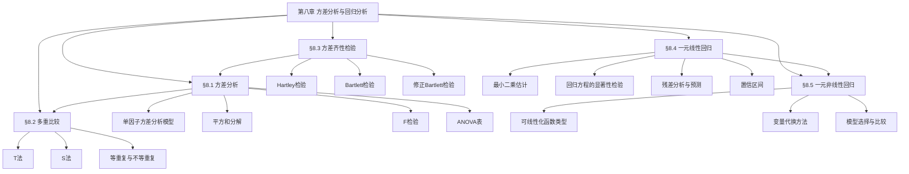

# 第八章 方差分析与回归分析 — 章节汇总

> [!abstract] 全章概览
> 第八章"方差分析与回归分析"包含两大主题：==方差分析==（§8.1-§8.3）和==回归分析==（§8.4-§8.5）。
>
> **逻辑主线**：方差分析通过平方和分解 $S_T = S_A + S_e$ 检验多个总体均值是否相等（§8.1），拒绝后用多重比较方法精确定位差异（§8.2），分析前需检验方差齐性（§8.3）。回归分析通过最小二乘法建立变量间的线性关系（§8.4），对非线性关系通过变量代换线性化后处理（§8.5）。
>
> **各节笔记**：[[8.1 方差分析]] | [[8.2 多重比较]] | [[8.3 方差齐性检验]] | [[8.4 一元线性回归]] | [[8.5 一元非线性回归]]

---

## 一、全章知识框架

---

## 二、核心知识点与公式汇总

### §8.1 方差分析

==方差分析==（Analysis of Variance, ANOVA）是检验多个总体均值是否相等的统计方法，其核心思想是将数据的总变异==平方和分解==为组间变异和组内变异两部分。==单因子方差分析模型==假定有 $r$ 个水平（总体），每个水平下进行 $m$ 次重复试验，观测值 $Y_{ij} \sim N(\mu_i, \sigma^2)$ 且相互独立。通过比较组间均方 $MS_A$ 与组内均方 $MS_e$ 的比值（$F$ 统计量），判断各水平均值是否存在显著差异。

方差分析的本质是对均值差异的检验，但方法上却通过"方差"来实现，这一看似矛盾的设计具有深刻的统计意义。如果各水平均值相等（$\mu_1 = \cdots = \mu_r$），则组间变异只反映随机波动，$MS_A$ 与 $MS_e$ 应大致相等，$F$ 值接近 1；如果均值不等，组间变异会显著大于组内变异，$F$ 值远大于 1。因此，$F$ 值越大，拒绝原假设的证据越强。

方差分析的结果通常整理为==ANOVA表==，表格包含变异来源、平方和、自由度、均方、$F$ 值和 $p$ 值等列，清晰地呈现了平方和分解的完整过程和检验结果。

| 编号 | 类型 | 名称 | 内容 |
|:----:|:----:|:----:|:----:|
| 8.1.1 | 定义 | 方差分析 | 通过将总平方和分解为组间平方和与组内平方和，检验多个总体均值是否相等的统计方法 |
| 8.1.2 | 定义 | 单因子方差分析模型 | $Y_{ij} = \mu_i + \varepsilon_{ij}$，$i = 1,\ldots,r$，$j = 1,\ldots,m$；$\varepsilon_{ij} \sim N(0,\sigma^2)$ 且相互独立；等价形式 $Y_{ij} = \mu + a_i + \varepsilon_{ij}$，$\sum a_i = 0$ |

| 编号 | 类型 | 名称 | 内容 |
|:----:|:----:|:----:|:----:|
| 8.1.T1 | 定理 | 总平方和分解 | $S_T = S_A + S_e$，其中 $S_T = \displaystyle\sum_{i=1}^{r}\displaystyle\sum_{j=1}^{m}(Y_{ij}-\bar{Y})^2$，$S_A = m\displaystyle\sum_{i=1}^{r}(\bar{Y}_{i\cdot}-\bar{Y})^2$，$S_e = \displaystyle\sum_{i=1}^{r}\displaystyle\sum_{j=1}^{m}(Y_{ij}-\bar{Y}_{i\cdot})^2$ |
| 8.1.T2 | 定理 | 平方和分布与期望 | $H_0$ 下：$S_e/\sigma^2 \sim \chi^2(n-r)$，$S_A/\sigma^2 \sim \chi^2(r-1)$，二者独立；$E(S_A) = (r-1)\sigma^2 + m\displaystyle\sum_{i=1}^{r}a_i^2$，$E(S_e) = (n-r)\sigma^2$ |

**核心公式**：

$$S_T = \sum_{i=1}^{r}\sum_{j=1}^{m}(Y_{ij}-\bar{Y})^2 \quad \text{（总平方和）}$$

$$S_A = m\sum_{i=1}^{r}(\bar{Y}_{i\cdot}-\bar{Y})^2 \quad \text{（组间平方和 / 因子平方和）}$$

$$S_e = \sum_{i=1}^{r}\sum_{j=1}^{m}(Y_{ij}-\bar{Y}_{i\cdot})^2 \quad \text{（组内平方和 / 误差平方和）}$$

$$F = \frac{MS_A}{MS_e} = \frac{S_A/(r-1)}{S_e/(n-r)} \sim F(r-1,\, n-r) \quad \text{（$H_0$ 下）}$$

$$\text{ANOVA表：} \begin{array}{lcccl} \hline \text{来源} & S & f & MS & F \\ \hline \text{因子} & S_A & r-1 & MS_A = S_A/(r-1) & F = MS_A/MS_e \\ \text{误差} & S_e & n-r & MS_e = S_e/(n-r) & \\ \text{总和} & S_T & n-1 & & \\ \hline \end{array}$$

---

### §8.2 多重比较

当方差分析拒绝原假设（即各水平均值不全相等）后，需要进一步确定==哪些水平之间存在显著差异==，这就是==多重比较==问题。如果对 $r$ 个水平两两做 $t$ 检验，共需做 $\binom{r}{2}$ 次检验，整体犯第一类错误的概率会膨胀。==T 法==（Tukey 法）适用于等重复试验，==S 法==（Scheffé 法）适用于等重复和不等重复试验，两者都控制==族错误率==（Family-wise Error Rate, FWER）不超过 $\alpha$。

多重比较的核心困难在于"多重性"问题。假设有 $r = 5$ 个水平，两两比较共 $\binom{5}{2} = 10$ 对，每次检验的水平为 $\alpha = 0.05$，则至少犯一次第一类错误的概率约为 $1 - (1-0.05)^{10} \approx 0.40$，远超 0.05。T 法和 S 法通过调整临界值来控制族错误率，确保无论做多少次比较，整体犯第一类错误的概率都不超过 $\alpha$。

T 法利用==学生化极差分布== $q(r, f_e)$ 构造临界值，适用于各水平重复次数相等的情况。S 法利用 $F$ 分布构造临界值，适用于重复次数不等的情况。当各水平重复次数相等时，T 法的临界值通常小于 S 法，因此 T 法的检验功效更高。

| 编号 | 类型 | 名称 | 内容 |
|:----:|:----:|:----:|:----:|
| 8.2.1 | 定义 | 多重比较 | 在方差分析拒绝 $H_0$ 后，对 $r$ 个水平均值进行两两比较，确定哪些水平间存在显著差异的方法 |
| 8.2.2 | 定义 | 多重比较问题 | 对 $r$ 个水平进行 $\binom{r}{2}$ 次两两比较，需控制族错误率 FWER $\leq \alpha$ |

| 编号 | 类型 | 名称 | 内容 |
|:----:|:----:|:----:|:----:|
| 8.2.T1 | 定理 | T 法（Tukey） | 等重复（$m_i = m$）时，临界值 $d_{ij} = q_{1-\alpha}(r, f_e) \cdot \hat{\sigma}\sqrt{1/m}$，其中 $\hat{\sigma} = \sqrt{MS_e}$，$q_{1-\alpha}(r, f_e)$ 为学生化极差分布的 $1-\alpha$ 分位数；若 $|\bar{Y}_{i\cdot} - \bar{Y}_{j\cdot}| > d_{ij}$，则认为 $\mu_i$ 与 $\mu_j$ 有显著差异 |
| 8.2.T2 | 定理 | S 法（Scheffé） | 等重复或不等重复时，临界值 $d_{ij} = \hat{\sigma}\sqrt{(r-1)F_{1-\alpha}(r-1, f_e)\left(\dfrac{1}{m_i}+\dfrac{1}{m_j}\right)}$；若 $|\bar{Y}_{i\cdot} - \bar{Y}_{j\cdot}| > d_{ij}$，则认为 $\mu_i$ 与 $\mu_j$ 有显著差异 |

**核心公式**：

$$d_{ij} = q_{1-\alpha}(r,\, f_e) \cdot \hat{\sigma}\sqrt{\frac{1}{m}} \quad \text{（T 法临界值，等重复）}$$

$$d_{ij} = \hat{\sigma}\sqrt{(r-1)F_{1-\alpha}(r-1,\, f_e)\left(\frac{1}{m_i}+\frac{1}{m_j}\right)} \quad \text{（S 法临界值，等/不等重复）}$$

$$\text{判断准则：若 } |\bar{Y}_{i\cdot} - \bar{Y}_{j\cdot}| > d_{ij} \text{，则 } \mu_i \neq \mu_j$$

$$\text{族错误率：FWER} = P(\text{至少犯一次第一类错误}) \leq \alpha$$

---

### §8.3 方差齐性检验

方差分析的基本假定之一是各水平下方差相等（==方差齐性==）。如果方差齐性不满足，$F$ 检验的结果可能不可靠。==方差齐性检验==用于在方差分析之前验证这一假定。常用的方法有三种：==Hartley 检验==适用于正态、等重复样本；==Bartlett 检验==适用于正态、等重复或不等重复样本；==修正 Bartlett 检验==在小样本时对 Bartlett 检验进行修正，改善第一类错误的控制。

三种方法各有适用条件。Hartley 检验最简单，只需计算最大方差与最小方差之比，但要求各水平重复次数相等且数据服从正态分布。Bartlett 检验基于似然比思想，适用于等重复和不等重复的情况，但对非正态性敏感。修正 Bartlett 检验通过调整 Bartlett 统计量的分布，在小样本时具有更好的第一类错误控制。

在实际应用中，方差齐性检验的流程通常是：如果各水平重复次数相等且样本量较大，优先使用 Hartley 检验（简单直观）；如果重复次数不等或需要更精确的检验，使用 Bartlett 检验；如果样本量较小，使用修正 Bartlett 检验。当方差齐性不满足时，可以考虑对数据进行变换（如对数变换）或使用非参数方法。

| 编号 | 类型 | 名称 | 内容 |
|:----:|:----:|:----:|:----:|
| 8.3.1 | 定义 | 方差齐性检验 | 检验 $H_0: \sigma_1^2 = \sigma_2^2 = \cdots = \sigma_r^2$ 的方法，是方差分析的前置诊断步骤 |

| 编号 | 类型 | 名称 | 内容 |
|:----:|:----:|:----:|:----:|
| 8.3.T1 | 定理 | Bartlett 检验 | $B = \dfrac{f_e}{C}\left(\ln MS_e - \ln GMS_e\right)$，其中 $f_e = n-r$，$GMS_e = \left(\prod_{i=1}^{r}(s_i^2)^{f_i}\right)^{1/f_e}$（几何均值），$C = 1 + \dfrac{1}{3(r-1)}\left(\displaystyle\sum_{i=1}^{r}\dfrac{1}{f_i} - \dfrac{1}{f_e}\right)$；$H_0$ 下 $B \sim \chi^2(r-1)$（近似），$B > \chi^2_{1-\alpha}(r-1)$ 时拒绝 |
| 8.3.T2 | 定理 | 修正 Bartlett 检验 | $B' = \dfrac{f_e \cdot \ln MS_e - \displaystyle\sum_{i=1}^{r}f_i \ln s_i^2}{1 + \dfrac{1}{3(r-1)}\left(\displaystyle\sum_{i=1}^{r}\dfrac{1}{f_i} - \dfrac{1}{f_e}\right)}$；小样本时用 $B'$ 替代 $B$，改善第一类错误控制 |

**核心公式**：

$$H = \frac{s_{\max}^2}{s_{\min}^2} \quad \text{（Hartley 检验统计量）}$$

$$B = \frac{f_e}{C}\left(\ln MS_e - \frac{1}{f_e}\sum_{i=1}^{r}f_i \ln s_i^2\right) \sim \chi^2(r-1) \quad \text{（Bartlett 检验）}$$

$$C = 1 + \frac{1}{3(r-1)}\left(\sum_{i=1}^{r}\frac{1}{f_i} - \frac{1}{f_e}\right) \quad \text{（修正因子）}$$

$$B' = \frac{f_e \cdot \ln MS_e - \displaystyle\sum_{i=1}^{r}f_i \ln s_i^2}{C} \quad \text{（修正 Bartlett 检验）}$$

---

### §8.4 一元线性回归

==一元线性回归==研究两个变量之间的线性关系。==回归函数== $f(x) = E(Y|x)$ 描述了给定 $x$ 时 $Y$ 的条件期望。==一元线性回归模型==假定 $Y_i = \beta_0 + \beta_1 x_i + \varepsilon_i$，其中 $\varepsilon_i \sim N(0, \sigma^2)$ 且相互独立。通过==最小二乘法==（Least Squares Estimation, LSE）估计回归系数 $\beta_0$ 和 $\beta_1$，使残差平方和最小。

最小二乘法的核心思想是寻找使残差平方和 $\sum(y_i - \hat{\beta}_0 - \hat{\beta}_1 x_i)^2$ 最小的 $\hat{\beta}_0$ 和 $\hat{\beta}_1$。通过令偏导数为零，得到==正规方程==，解出 $\hat{\beta}_1 = l_{xy}/l_{xx}$ 和 $\hat{\beta}_0 = \bar{y} - \hat{\beta}_1\bar{x}$。在正态性假定下，LSE 等价于最大似然估计（MLE），具有良好的统计性质：无偏性、一致性、有效性（BLUE）。

回归方程建立后，需要检验其显著性。==回归显著性检验==通过 $F$ 检验或等价的 $t$ 检验判断 $x$ 对 $Y$ 是否有线性影响。与方差分析类似，回归分析也有平方和分解：$S_T = S_R + S_e$，其中 $S_R$ 是回归平方和，$S_e$ 是残差平方和。$F = MS_R/MS_e$ 越大，回归越显著。此外，==决定系数== $R^2 = S_R/S_T$ 衡量了回归方程对数据变异的解释比例。

| 编号 | 类型 | 名称 | 内容 |
|:----:|:----:|:----:|:----:|
| 8.4.1 | 定义 | 回归函数 | $f(x) = E(Y|x) = \beta_0 + \beta_1 x$，描述给定 $x$ 时 $Y$ 的条件期望与 $x$ 之间的函数关系 |
| 8.4.2 | 定义 | 一元线性回归模型 | $Y_i = \beta_0 + \beta_1 x_i + \varepsilon_i$，$i = 1,\ldots,n$；$\varepsilon_i \sim N(0,\sigma^2)$ 且相互独立；$\beta_0$ 为截距，$\beta_1$ 为斜率 |

| 编号 | 类型 | 名称 | 内容 |
|:----:|:----:|:----:|:----:|
| 8.4.T1 | 定理 | LSE 统计性质 | $\hat{\beta}_1 = l_{xy}/l_{xx}$，$\hat{\beta}_0 = \bar{y}-\hat{\beta}_1\bar{x}$；$\hat{\beta}_0 \sim N(\beta_0,\, \sigma^2(1/n+\bar{x}^2/l_{xx}))$，$\hat{\beta}_1 \sim N(\beta_1,\, \sigma^2/l_{xx})$；$\hat{\beta}_0, \hat{\beta}_1$ 是 BLUE |
| 8.4.T2 | 定理 | 平方和期望 | $E(S_R) = \sigma^2 + \beta_1^2 l_{xx}$，$E(S_e) = (n-2)\sigma^2$；$\hat{\sigma}^2 = S_e/(n-2)$ 是 $\sigma^2$ 的无偏估计 |
| 8.4.T3 | 定理 | 残差平方和分布 | $S_e/\sigma^2 \sim \chi^2(n-2)$，且 $S_e$ 与 $\hat{\beta}_0$、$\hat{\beta}_1$ 独立；$t = \hat{\beta}_1/(\hat{\sigma}/\sqrt{l_{xx}}) \sim t(n-2)$（$H_0:\beta_1=0$ 下） |

**核心公式**：

$$\hat{\beta}_1 = \frac{l_{xy}}{l_{xx}} = \frac{\displaystyle\sum_{i=1}^{n}(x_i-\bar{x})(y_i-\bar{y})}{\displaystyle\sum_{i=1}^{n}(x_i-\bar{x})^2}, \quad \hat{\beta}_0 = \bar{y} - \hat{\beta}_1\bar{x} \quad \text{（最小二乘估计）}$$

$$S_T = \sum_{i=1}^{n}(y_i-\bar{y})^2 = S_R + S_e \quad \text{（平方和分解）}$$

$$S_R = \sum_{i=1}^{n}(\hat{y}_i-\bar{y})^2 = \hat{\beta}_1^2 l_{xx}, \quad S_e = \sum_{i=1}^{n}(y_i-\hat{y}_i)^2 = S_T - S_R \quad \text{（回归平方和与残差平方和）}$$

$$F = \frac{S_R/1}{S_e/(n-2)} = \frac{MS_R}{MS_e} \sim F(1,\, n-2) \quad \text{（$H_0:\beta_1=0$ 下）}$$

$$t = \frac{\hat{\beta}_1}{\hat{\sigma}/\sqrt{l_{xx}}} \sim t(n-2) \quad \text{（$H_0:\beta_1=0$ 下，等价于 $F$ 检验）}$$

$$R^2 = \frac{S_R}{S_T} = 1 - \frac{S_e}{S_T} \quad \text{（决定系数）}$$

---

### §8.5 一元非线性回归

当变量之间的关系不是线性时，可以通过==变量代换==将非线性模型转化为线性模型，然后用最小二乘法求解。常见的可线性化函数包括==双曲线==、==幂函数==、==指数函数==（I 型和 II 型）、==对数函数==和==S 形曲线==。选择合适的模型需要结合散点图的形态和专业知识。

变量代换的核心思想是：如果 $Y$ 与 $x$ 的关系为 $Y = g(\beta_0 + \beta_1 h(x))$，则令 $Y' = g^{-1}(Y)$，$x' = h(x)$，可将模型化为 $Y' = \beta_0 + \beta_1 x' + \varepsilon$。例如，指数模型 $Y = ae^{bx}$ 取对数后变为 $\ln Y = \ln a + bx$，令 $Y' = \ln Y$，$\beta_0 = \ln a$，$\beta_1 = b$ 即可线性化。

模型选择与比较是非线性回归的关键问题。常用的比较准则有==决定系数== $R^2$ 和==剩余标准差== $s$。需要注意的是，对变换后的数据做最小二乘估计，最小化的是变换后残差平方和 $\sum(Y'_i - \hat{Y}'_i)^2$，而非原始数据的残差平方和 $\sum(Y_i - \hat{Y}_i)^2$。因此，用 $R^2$ 比较模型时，应使用原始数据的 $R^2$（即基于 $\sum(Y_i - \hat{Y}_i)^2$ 计算），而非变换后数据的 $R^2$。

**六种可线性化函数**：

| 函数类型 | 函数形式 | 线性化变换 |
|:--------:|:--------:|:----------:|
| 双曲线 | $\dfrac{1}{y} = a + \dfrac{b}{x}$ | $y' = 1/y$，$x' = 1/x$ |
| 幂函数 | $y = ax^b$ | $y' = \ln y$，$x' = \ln x$，$\beta_0 = \ln a$，$\beta_1 = b$ |
| 指数 I 型 | $y = ae^{bx}$ | $y' = \ln y$，$\beta_0 = \ln a$，$\beta_1 = b$ |
| 指数 II 型 | $y = ae^{b/x}$ | $y' = \ln y$，$x' = 1/x$，$\beta_0 = \ln a$，$\beta_1 = b$ |
| 对数函数 | $y = a + b\ln x$ | $x' = \ln x$，$\beta_0 = a$，$\beta_1 = b$ |
| S 形曲线 | $y = \dfrac{1}{a + be^{-x}}$ | $y' = 1/y$，$x' = e^{-x}$，$\beta_0 = a$，$\beta_1 = b$ |

**核心公式**：

$$R^2 = 1 - \frac{\displaystyle\sum_{i=1}^{n}(y_i - \hat{y}_i)^2}{\displaystyle\sum_{i=1}^{n}(y_i - \bar{y})^2} \quad \text{（原始数据的决定系数）}$$

$$s = \sqrt{\frac{\displaystyle\sum_{i=1}^{n}(y_i - \hat{y}_i)^2}{n-2}} \quad \text{（剩余标准差）}$$

$$\text{模型选择准则：} R^2 \text{ 越大越好，} s \text{ 越小越好}$$

---

## 三、学习脉络

### §8.1 方差分析

方差分析是==假设检验==在多总体场景下的自然推广。§7.2 中我们学习了两个总体均值差的 $t$ 检验，但如果要比较 $r$ 个总体均值（$r > 2$），两两做 $t$ 检验会导致多重性问题。方差分析通过平方和分解一次性检验所有均值是否相等，避免了多重性问题。其统计基础是[[5.4 三大抽样分布|§5.4]]中的 $F$ 分布：在 $H_0$（各均值相等）下，$S_A/\sigma^2 \sim \chi^2(r-1)$，$S_e/\sigma^2 \sim \chi^2(n-r)$，二者独立，因此 $F = MS_A/MS_e \sim F(r-1, n-r)$。

平方和分解 $S_T = S_A + S_e$ 是方差分析的核心恒等式。$S_T$ 度量了数据的总变异，$S_A$ 度量了组间变异（由因子水平不同引起），$S_e$ 度量了组内变异（由随机误差引起）。如果 $H_0$ 成立，$S_A$ 和 $S_e$ 都只反映随机误差，$F$ 值应接近 1；如果 $H_0$ 不成立，$S_A$ 中除了随机误差外还包含系统差异，$F$ 值会显著大于 1。

理解方差分析的关键在于把握其与[[7.2 正态总体参数的假设检验|§7.2]]的联系：方差分析本质上是对"多个正态总体均值是否相等"这一假设的检验，其理论基础是抽样分布中的 $F$ 分布和卡方分布的可加性。同时，方差分析要求各总体方差相等（方差齐性），这一假定的验证是[[8.3 方差齐性检验|§8.3]]的主题。

### §8.2 多重比较

多重比较是方差分析的"后继步骤"。当方差分析拒绝 $H_0$ 后，我们知道"各水平均值不全相等"，但不知道"哪些水平之间存在差异"。多重比较通过构造同时置信区间或同时检验，精确定位差异来源。

T 法和 S 法是两种最常用的多重比较方法。T 法基于学生化极差分布，适用于等重复试验，临界值 $d_{ij} = q_{1-\alpha}(r, f_e) \cdot \hat{\sigma}\sqrt{1/m}$。S 法基于 $F$ 分布，适用于等重复和不等重复试验。当各水平重复次数相等时，T 法的临界值通常更小（功效更高），因此应优先使用 T 法。当重复次数不等时，只能使用 S 法。

多重比较与[[7.1 假设检验的基本思想与概念|§7.1]]中讨论的两类错误密切相关。不做多重性校正时，族错误率随比较次数增加而膨胀；T 法和 S 法通过调整临界值，保证族错误率不超过 $\alpha$。这一思想在更一般的多重检验问题中同样适用，是统计学中"多重性校正"理论的基础。

### §8.3 方差齐性检验

方差齐性检验是方差分析的"前置诊断"。方差分析的 $F$ 检验要求各水平下方差相等，如果这一条件不满足，$F$ 检验的第一类错误率可能偏离名义水平 $\alpha$。因此，在做方差分析之前，应先检验方差齐性。

三种方法的选择取决于数据特征。Hartley 检验最简单，但要求等重复和正态性。Bartlett 检验适用于等重复和不等重复，但同样对非正态性敏感。修正 Bartlett 检验在小样本时对 Bartlett 检验进行修正，改善了第一类错误的控制。在实际应用中，如果数据明显非正态，可以考虑使用 Levene 检验等对非正态性更稳健的方法。

方差齐性检验与[[7.2 正态总体参数的假设检验|§7.2]]中的 $F$ 检验有密切联系：$F$ 检验比较两个总体方差，Hartley 检验比较多个总体方差（取最大方差比）。Bartlett 检验则基于似然比思想，与[[7.4 似然比检验与分布拟合检验|§7.4]]中的广义似然比检验一脉相承。

### §8.4 一元线性回归

一元线性回归是研究两个变量之间数量关系的最基本的统计方法。其理论基础包括[[6.1 点估计的概念与无偏性|§6.1]]中的最小二乘估计（无偏性）、[[5.4 三大抽样分布|§5.4]]中的 $t$ 分布和 $F$ 分布（用于显著性检验）、[[6.6 区间估计|§6.6]]中的置信区间（用于回归系数和预测的区间估计）。

回归分析的核心流程是：建立模型→估计参数→检验显著性→诊断模型→预测。最小二乘法估计回归系数，$F$ 检验（或等价的 $t$ 检验）判断回归方程的显著性，残差分析诊断模型假定是否满足（正态性、等方差性、独立性），最后利用回归方程进行预测和推断。

平方和分解 $S_T = S_R + S_e$ 与方差分析中的平方和分解 $S_T = S_A + S_e$ 形式上完全一致，本质上都是将总变异分解为"可解释的变异"和"不可解释的变异"。决定系数 $R^2 = S_R/S_T$ 度量了回归方程的解释能力，$R^2$ 越接近 1，回归效果越好。但 $R^2$ 总是随自变量个数增加而增大，因此在多元回归中需要使用调整 $R^2$。

### §8.5 一元非线性回归

非线性回归是线性回归的扩展。当散点图显示 $Y$ 与 $x$ 之间不是线性关系时，需要选择合适的非线性模型。变量代换是处理非线性回归最常用的方法：通过适当的变换将非线性模型转化为线性模型，然后利用[[8.4 一元线性回归|§8.4]]的方法求解。

六种可线性化函数各有适用场景。双曲线适用于 $Y$ 随 $x$ 增大先快后慢趋于稳定的情况；幂函数适用于等比增长的情况；指数 I 型适用于增长率恒定的情况；指数 II 型适用于增长速度递减的情况；对数函数适用于增长速度递减趋于饱和的情况；S 形曲线适用于先慢后快再慢的增长模式。选择模型时应结合散点图的形态和专业知识。

模型比较是非线性回归的关键问题。决定系数 $R^2$ 和剩余标准差 $s$ 是两个常用的比较准则。需要注意的是，对变换后的数据做最小二乘，最小化的是变换后的残差平方和，而非原始数据的残差平方和。因此，比较模型时应使用基于原始数据计算的 $R^2$ 和 $s$，而非变换后数据的。此外，$R^2$ 在不同变换之间不具有直接可比性（因为因变量的尺度不同），需要谨慎使用。

---

## 四、跨章关联表

| 关联章节 | 关联内容 | 说明 |
|:--------:|:--------:|:----:|
| 第五章 抽样分布 | $\chi^2$ 分布、$t$ 分布、$F$ 分布 | 方差分析和回归分析的基础：$F$ 检验、$t$ 检验、平方和分布均依赖三大抽样分布 |
| 第六章 参数估计 | 最大似然估计、最小二乘估计 | 回归系数的 LSE 在正态性下等价于 MLE；$\hat{\sigma}^2 = S_e/(n-2)$ 是 $\sigma^2$ 的无偏估计 |
| 第七章 假设检验 | 假设检验框架、$F$ 检验、似然比检验 | 方差分析和回归显著性检验是假设检验的延伸；Bartlett 检验基于似然比思想 |
| 第三章 多维随机变量 | 协方差、相关系数 | 回归分析中 $l_{xy}$ 本质上是样本协方差的变形；$r^2 = R^2$（样本相关系数的平方等于决定系数） |
| 第二章 随机变量 | 正态分布 | 方差分析和回归模型的基本假定：误差项 $\varepsilon_i \sim N(0, \sigma^2)$ |

---

## 五、复习题

> [!problem] 复习题1（§8.1 方差分析模型与平方和分解）
> 为比较三种肥料对小麦产量的影响，每种肥料施用于 4 块试验田，产量（kg/亩）如下：
>
> | 肥料A | 肥料B | 肥料C |
> |:----:|:----:|:----:|
> | 25 | 27 | 31 |
> | 28 | 30 | 34 |
> | 22 | 29 | 32 |
> | 25 | 28 | 33 |
>
> (1) 写出方差分析的统计模型；
> (2) 计算 $S_T$、$S_A$、$S_e$ 和 $F$ 值；
> (3) 在 $\alpha = 0.05$ 下检验三种肥料对产量是否有显著影响。

查看解答

**(1) 统计模型**

$r = 3$（水平数），$m = 4$（重复数），$n = rm = 12$。

$$Y_{ij} = \mu + a_i + \varepsilon_{ij}, \quad i = 1,2,3, \quad j = 1,2,3,4$$

其中 $\varepsilon_{ij} \sim N(0, \sigma^2)$ 且相互独立，$\sum_{i=1}^{3}a_i = 0$。

$H_0: a_1 = a_2 = a_3 = 0$（三种肥料效果相同）vs $H_1:$ $a_1, a_2, a_3$ 不全为零。

**(2) 计算平方和**

各水平均值：

$$\bar{Y}_{1\cdot} = \frac{25+28+22+25}{4} = \frac{100}{4} = 25$$

$$\bar{Y}_{2\cdot} = \frac{27+30+29+28}{4} = \frac{114}{4} = 28.5$$

$$\bar{Y}_{3\cdot} = \frac{31+34+32+33}{4} = \frac{130}{4} = 32.5$$

总均值：

$$\bar{Y} = \frac{100+114+130}{12} = \frac{344}{12} \approx 28.667$$

组间平方和：

$$S_A = m\sum_{i=1}^{r}(\bar{Y}_{i\cdot}-\bar{Y})^2 = 4\left[(25-28.667)^2 + (28.5-28.667)^2 + (32.5-28.667)^2\right]$$

$$= 4\left[13.444 + 0.028 + 14.694\right] = 4 \times 28.167 = 112.667$$

组内平方和：

$$S_e = \sum_{i=1}^{r}\sum_{j=1}^{m}(Y_{ij}-\bar{Y}_{i\cdot})^2$$

肥料A：$(25-25)^2+(28-25)^2+(22-25)^2+(25-25)^2 = 0+9+9+0 = 18$

肥料B：$(27-28.5)^2+(30-28.5)^2+(29-28.5)^2+(28-28.5)^2 = 2.25+2.25+0.25+0.25 = 5$

肥料C：$(31-32.5)^2+(34-32.5)^2+(32-32.5)^2+(33-32.5)^2 = 2.25+2.25+0.25+0.25 = 5$

$$S_e = 18 + 5 + 5 = 28$$

总平方和：

$$S_T = S_A + S_e = 112.667 + 28 = 140.667$$

$F$ 值：

$$MS_A = \frac{S_A}{r-1} = \frac{112.667}{2} = 56.333$$

$$MS_e = \frac{S_e}{n-r} = \frac{28}{9} \approx 3.111$$

$$F = \frac{MS_A}{MS_e} = \frac{56.333}{3.111} \approx 18.10$$

**(3) 显著性检验**

查 $F$ 分布表，$F_{0.95}(2, 9) = 4.26$。

由于 $F = 18.10 > 4.26$，拒绝 $H_0$。

**ANOVA表**：

| 来源 | $S$ | $f$ | $MS$ | $F$ |
|:----:|:----:|:----:|:----:|:----:|
| 因子 | 112.667 | 2 | 56.333 | 18.10 |
| 误差 | 28 | 9 | 3.111 | |
| 总和 | 140.667 | 11 | | |

**结论**：在 $\alpha = 0.05$ 的显著性水平下，拒绝 $H_0$，三种肥料对小麦产量有显著影响。

> [!problem] 复习题2（§8.2 T法与S法多重比较对比）
> 沿用复习题1的数据，方差分析已拒绝 $H_0$。分别用 T 法和 S 法进行多重比较（$\alpha = 0.05$），比较三种肥料两两之间的差异。

查看解答

已知：$r = 3$，$m = 4$，$f_e = n - r = 9$，$\hat{\sigma} = \sqrt{MS_e} = \sqrt{3.111} \approx 1.764$。

各水平均值：$\bar{Y}_{1\cdot} = 25$，$\bar{Y}_{2\cdot} = 28.5$，$\bar{Y}_{3\cdot} = 32.5$。

**T 法**

查学生化极差分布表，$q_{0.95}(3, 9) \approx 3.950$。

临界值：

$$d_T = q_{0.95}(3, 9) \cdot \hat{\sigma}\sqrt{\frac{1}{m}} = 3.950 \times 1.764 \times \sqrt{\frac{1}{4}} = 3.950 \times 1.764 \times 0.5 \approx 3.484$$

两两比较：

| 比较 | $|\bar{Y}_{i\cdot} - \bar{Y}_{j\cdot}|$ | $d_T$ | 结论 |
|:----:|:----:|:----:|:----:|
| A vs B | $|25 - 28.5| = 3.5$ | 3.484 | 显著 |
| A vs C | $|25 - 32.5| = 7.5$ | 3.484 | 显著 |
| B vs C | $|28.5 - 32.5| = 4.0$ | 3.484 | 显著 |

**S 法**

查 $F$ 分布表，$F_{0.95}(2, 9) = 4.26$。

临界值（等重复 $m_i = m_j = 4$）：

$$d_S = \hat{\sigma}\sqrt{(r-1)F_{0.95}(r-1, f_e)\left(\frac{1}{m_i}+\frac{1}{m_j}\right)}$$

$$= 1.764 \times \sqrt{2 \times 4.26 \times \left(\frac{1}{4}+\frac{1}{4}\right)} = 1.764 \times \sqrt{2 \times 4.26 \times 0.5}$$

$$= 1.764 \times \sqrt{4.26} = 1.764 \times 2.064 \approx 3.641$$

两两比较：

| 比较 | $|\bar{Y}_{i\cdot} - \bar{Y}_{j\cdot}|$ | $d_S$ | 结论 |
|:----:|:----:|:----:|:----:|
| A vs B | 3.5 | 3.641 | 不显著 |
| A vs C | 7.5 | 3.641 | 显著 |
| B vs C | 4.0 | 3.641 | 显著 |

**T 法与 S 法对比**

| 比较 | T 法结论 | S 法结论 |
|:----:|:--------:|:--------:|
| A vs B | 显著 | 不显著 |
| A vs C | 显著 | 显著 |
| B vs C | 显著 | 显著 |

T 法的临界值 $d_T = 3.484$ 小于 S 法的临界值 $d_S = 3.641$，因此 T 法的检验功效更高（更容易检测到差异）。在本题中，T 法判定 A 与 B 有显著差异（$3.5 > 3.484$），而 S 法判定 A 与 B 无显著差异（$3.5 < 3.641$）。对于等重复试验，T 法更灵敏，应优先使用。

> [!problem] 复习题3（§8.3 三种方差齐性检验方法选择）
> 某试验有 4 个水平，每个水平重复 5 次。4 个水平的样本方差分别为 $s_1^2 = 4.2$，$s_2^2 = 3.8$，$s_3^2 = 5.1$，$s_4^2 = 4.5$。
>
> (1) 判断应选用哪种方差齐性检验方法，并说明理由；
> (2) 执行检验，判断方差齐性是否满足（$\alpha = 0.05$）。

查看解答

**(1) 方法选择**

本题条件分析：
- 各水平重复次数相等（$m_1 = m_2 = m_3 = m_4 = 5$）
- 数据来自正态总体（方差分析的基本假定）
- 样本量较小（每个水平仅 5 次重复）

由于各水平重复次数相等且数据服从正态分布，三种方法均可使用。但考虑到：
- Hartley 检验最简单直观，适用于等重复正态样本，是首选
- Bartlett 检验也可使用，但本题样本量较小
- 修正 Bartlett 检验在小样本时更优

**选择 Hartley 检验**作为主要方法，同时用 Bartlett 检验进行验证。

**(2) Hartley 检验**

$H_0: \sigma_1^2 = \sigma_2^2 = \sigma_3^2 = \sigma_4^2$ vs $H_1:$ 方差不全相等。

计算 Hartley 统计量：

$$H = \frac{s_{\max}^2}{s_{\min}^2} = \frac{5.1}{3.8} \approx 1.342$$

查 Hartley 检验临界值表，$H_{0.05}(r=4, m-1=4) \approx 20.6$（$r$ 为水平数，$m-1$ 为每组自由度）。

由于 $H = 1.342 < 20.6$，不拒绝 $H_0$。

**(3) Bartlett 检验（验证）**

各水平自由度：$f_i = m - 1 = 4$，$i = 1,2,3,4$。

总自由度：$f_e = \sum f_i = 16$。

组内均方：

$$MS_e = \frac{\sum f_i s_i^2}{f_e} = \frac{4 \times 4.2 + 4 \times 3.8 + 4 \times 5.1 + 4 \times 4.5}{16} = \frac{16.8 + 15.2 + 20.4 + 18.0}{16} = \frac{70.4}{16} = 4.4$$

几何均值：

$$GMS_e = \left(\prod_{i=1}^{4}(s_i^2)^{f_i}\right)^{1/f_e} = \left(4.2^4 \times 3.8^4 \times 5.1^4 \times 4.5^4\right)^{1/16}$$

$$= (4.2 \times 3.8 \times 5.1 \times 4.5)^{4/16} = (4.2 \times 3.8 \times 5.1 \times 4.5)^{1/4}$$

$$= (366.468)^{1/4} \approx 4.373$$

修正因子：

$$C = 1 + \frac{1}{3(r-1)}\left(\sum_{i=1}^{r}\frac{1}{f_i} - \frac{1}{f_e}\right) = 1 + \frac{1}{3 \times 3}\left(4 \times \frac{1}{4} - \frac{1}{16}\right)$$

$$= 1 + \frac{1}{9}\left(1 - 0.0625\right) = 1 + \frac{0.9375}{9} = 1 + 0.1042 \approx 1.104$$

Bartlett 统计量：

$$B = \frac{f_e}{C}(\ln MS_e - \ln GMS_e) = \frac{16}{1.104}(\ln 4.4 - \ln 4.373)$$

$$= \frac{16}{1.104}(1.4816 - 1.4754) = \frac{16}{1.104} \times 0.0062 \approx 0.090$$

查 $\chi^2$ 分布表，$\chi^2_{0.95}(3) = 7.815$。

由于 $B = 0.090 < 7.815$，不拒绝 $H_0$。

**结论**：Hartley 检验和 Bartlett 检验均不拒绝 $H_0$，在 $\alpha = 0.05$ 下可以认为四个水平的方差相等，方差齐性假定满足，可以进行方差分析。

> [!problem] 复习题4（§8.4 回归方程建立与显著性检验）
> 测得某合金的含碳量 $x$（%）与强度 $y$（kg/mm²）数据如下：
>
> | $x$ | 0.10 | 0.15 | 0.20 | 0.25 | 0.30 | 0.35 | 0.40 |
> |:---:|:----:|:----:|:----:|:----:|:----:|:----:|:----:|
> | $y$ | 42 | 45 | 48 | 50 | 53 | 55 | 58 |
>
> (1) 建立一元线性回归方程；
> (2) 对回归方程进行显著性检验（$\alpha = 0.05$）；
> (3) 计算决定系数 $R^2$。

查看解答

**(1) 建立回归方程**

计算基本统计量：

$$\bar{x} = \frac{0.10+0.15+0.20+0.25+0.30+0.35+0.40}{7} = \frac{1.75}{7} = 0.25$$

$$\bar{y} = \frac{42+45+48+50+53+55+58}{7} = \frac{351}{7} \approx 50.143$$

计算 $l_{xx}$、$l_{xy}$、$l_{yy}$：

$$l_{xx} = \sum(x_i-\bar{x})^2 = (-0.15)^2+(-0.10)^2+(-0.05)^2+0^2+0.05^2+0.10^2+0.15^2$$

$$= 0.0225+0.01+0.0025+0+0.0025+0.01+0.0225 = 0.07$$

$$l_{xy} = \sum(x_i-\bar{x})(y_i-\bar{y})$$

$$= (-0.15)(42-50.143)+(-0.10)(45-50.143)+(-0.05)(48-50.143)+0(50-50.143)$$
$$+ 0.05(53-50.143)+0.10(55-50.143)+0.15(58-50.143)$$

$$= (-0.15)(-8.143)+(-0.10)(-5.143)+(-0.05)(-2.143)+0(-0.143)$$
$$+ 0.05(2.857)+0.10(4.857)+0.15(7.857)$$

$$= 1.2215+0.5143+0.1072+0+0.1429+0.4857+1.1786 = 3.650$$

$$l_{yy} = \sum(y_i-\bar{y})^2 = (-8.143)^2+(-5.143)^2+(-2.143)^2+(-0.143)^2+2.857^2+4.857^2+7.857^2$$

$$= 66.308+26.450+4.592+0.020+8.163+23.590+61.733 = 190.856$$

回归系数：

$$\hat{\beta}_1 = \frac{l_{xy}}{l_{xx}} = \frac{3.650}{0.07} \approx 52.143$$

$$\hat{\beta}_0 = \bar{y} - \hat{\beta}_1\bar{x} = 50.143 - 52.143 \times 0.25 = 50.143 - 13.036 = 37.107$$

回归方程：

$$\hat{y} = 37.107 + 52.143x$$

**(2) 显著性检验**

$H_0: \beta_1 = 0$ vs $H_1: \beta_1 \neq 0$。

平方和分解：

$$S_R = \hat{\beta}_1^2 l_{xx} = 52.143^2 \times 0.07 = 2718.89 \times 0.07 = 190.322$$

$$S_e = l_{yy} - S_R = 190.856 - 190.322 = 0.534$$

$$F = \frac{S_R/1}{S_e/(n-2)} = \frac{190.322}{0.534/5} = \frac{190.322}{0.1068} \approx 1782.0$$

查 $F$ 分布表，$F_{0.95}(1, 5) = 6.61$。

由于 $F = 1782.0 \gg 6.61$，拒绝 $H_0$。

**等价的 $t$ 检验**：

$$\hat{\sigma} = \sqrt{\frac{S_e}{n-2}} = \sqrt{\frac{0.534}{5}} = \sqrt{0.1068} \approx 0.3268$$

$$t = \frac{\hat{\beta}_1}{\hat{\sigma}/\sqrt{l_{xx}}} = \frac{52.143}{0.3268/\sqrt{0.07}} = \frac{52.143}{0.3268/0.2646} = \frac{52.143}{1.2352} \approx 42.22$$

查 $t$ 分布表，$t_{0.025}(5) = 2.571$。$|t| = 42.22 \gg 2.571$，拒绝 $H_0$。

（注意：$t^2 = 42.22^2 \approx 1782.5 \approx F$，验证了 $t$ 检验与 $F$ 检验的等价性。）

**(3) 决定系数**

$$R^2 = \frac{S_R}{S_T} = \frac{S_R}{l_{yy}} = \frac{190.322}{190.856} \approx 0.9972$$

**结论**：回归方程 $\hat{y} = 37.107 + 52.143x$ 高度显著（$p < 0.001$），决定系数 $R^2 = 0.9972$，说明含碳量解释了合金强度 99.72% 的变异，回归效果极好。

> [!problem] 复习题5（§8.5 非线性函数线性化变换）
> 对以下四种非线性函数，分别给出线性化变换，写出变换后的线性回归模型。

> (1) 双曲线模型：$\dfrac{1}{y} = a + \dfrac{b}{x}$
> (2) 幂函数模型：$y = ax^b$
> (3) 指数 I 型模型：$y = ae^{bx}$
> (4) S 形曲线模型：$y = \dfrac{1}{a + be^{-x}}$

查看解答

**(1) 双曲线模型**

原模型：$\dfrac{1}{y} = a + \dfrac{b}{x}$

令 $y' = \dfrac{1}{y}$，$x' = \dfrac{1}{x}$，$\beta_0 = a$，$\beta_1 = b$。

线性化后的模型：

$$y' = \beta_0 + \beta_1 x' + \varepsilon$$

用最小二乘法估计 $\hat{\beta}_0$ 和 $\hat{\beta}_1$ 后，还原参数：$\hat{a} = \hat{\beta}_0$，$\hat{b} = \hat{\beta}_1$。

**(2) 幂函数模型**

原模型：$y = ax^b$

两边取自然对数：

$$\ln y = \ln a + b \ln x$$

令 $y' = \ln y$，$x' = \ln x$，$\beta_0 = \ln a$，$\beta_1 = b$。

线性化后的模型：

$$y' = \beta_0 + \beta_1 x' + \varepsilon$$

用最小二乘法估计 $\hat{\beta}_0$ 和 $\hat{\beta}_1$ 后，还原参数：$\hat{a} = e^{\hat{\beta}_0}$，$\hat{b} = \hat{\beta}_1$。

**注意**：此变换要求 $y > 0$ 且 $x > 0$。

**(3) 指数 I 型模型**

原模型：$y = ae^{bx}$

两边取自然对数：

$$\ln y = \ln a + bx$$

令 $y' = \ln y$，$\beta_0 = \ln a$，$\beta_1 = b$（$x$ 不变）。

线性化后的模型：

$$y' = \beta_0 + \beta_1 x + \varepsilon$$

用最小二乘法估计 $\hat{\beta}_0$ 和 $\hat{\beta}_1$ 后，还原参数：$\hat{a} = e^{\hat{\beta}_0}$，$\hat{b} = \hat{\beta}_1$。

**注意**：此变换要求 $y > 0$。最小二乘法最小化的是 $\sum(\ln y_i - \hat{\beta}_0 - \hat{\beta}_1 x_i)^2$，而非 $\sum(y_i - \hat{a}e^{\hat{b}x_i})^2$。

**(4) S 形曲线模型**

原模型：$y = \dfrac{1}{a + be^{-x}}$

取倒数：

$$\frac{1}{y} = a + be^{-x}$$

令 $y' = \dfrac{1}{y}$，$x' = e^{-x}$，$\beta_0 = a$，$\beta_1 = b$。

线性化后的模型：

$$y' = \beta_0 + \beta_1 x' + \varepsilon$$

用最小二乘法估计 $\hat{\beta}_0$ 和 $\hat{\beta}_1$ 后，还原参数：$\hat{a} = \hat{\beta}_0$，$\hat{b} = \hat{\beta}_1$。

**注意**：此变换要求 $y \neq 0$。S 形曲线常用于描述增长过程：初期增长缓慢，中期加速，后期趋于饱和。

> [!problem] 复习题6（§8.1 + §8.3 方差分析完整流程）
> 某工厂用 4 种不同工艺生产同一种产品，每种工艺重复 6 次，测得产品强度数据。4 个水平的样本方差分别为 $s_1^2 = 2.5$，$s_2^2 = 2.8$，$s_3^2 = 6.5$，$s_4^2 = 2.3$。各水平样本均值为 $\bar{Y}_{1\cdot} = 50.2$，$\bar{Y}_{2\cdot} = 52.8$，$\bar{Y}_{3\cdot} = 48.5$，$\bar{Y}_{4\cdot} = 51.3$，总均值 $\bar{Y} = 50.7$。
>
> (1) 用 Hartley 检验判断方差齐性（$\alpha = 0.05$）；
> (2) 若方差齐性满足，进行方差分析（$\alpha = 0.05$）；
> (3) 若方差分析拒绝 $H_0$，用 T 法进行多重比较。

查看解答

**(1) Hartley 方差齐性检验**

$H_0: \sigma_1^2 = \sigma_2^2 = \sigma_3^2 = \sigma_4^2$ vs $H_1:$ 方差不全相等。

$$H = \frac{s_{\max}^2}{s_{\min}^2} = \frac{6.5}{2.3} \approx 2.826$$

查 Hartley 检验临界值表，$H_{0.05}(r=4, \, m-1=5) \approx 14.9$。

由于 $H = 2.826 < 14.9$，不拒绝 $H_0$，方差齐性满足。

**注意**：虽然 $s_3^2 = 6.5$ 明显大于其他三个水平（约 2.3-2.8），但 Hartley 检验的临界值较大（因为每组样本量仅 6），因此未达到显著水平。在实际应用中，可能需要进一步检查第三组数据是否存在异常值。

**(2) 方差分析**

$r = 4$，$m = 6$，$n = 24$。

组间平方和：

$$S_A = m\sum_{i=1}^{r}(\bar{Y}_{i\cdot}-\bar{Y})^2 = 6\left[(50.2-50.7)^2+(52.8-50.7)^2+(48.5-50.7)^2+(51.3-50.7)^2\right]$$

$$= 6\left[0.25+4.41+4.84+0.36\right] = 6 \times 9.86 = 59.16$$

组内平方和：

$$S_e = \sum_{i=1}^{r}f_i s_i^2 = 5 \times (2.5+2.8+6.5+2.3) = 5 \times 14.1 = 70.5$$

总平方和：

$$S_T = S_A + S_e = 59.16 + 70.5 = 129.66$$

$$MS_A = \frac{59.16}{3} = 19.72, \quad MS_e = \frac{70.5}{20} = 3.525$$

$$F = \frac{19.72}{3.525} \approx 5.594$$

查 $F$ 分布表，$F_{0.95}(3, 20) = 3.10$。

由于 $F = 5.594 > 3.10$，拒绝 $H_0$。

**ANOVA表**：

| 来源 | $S$ | $f$ | $MS$ | $F$ |
|:----:|:----:|:----:|:----:|:----:|
| 因子 | 59.16 | 3 | 19.72 | 5.594 |
| 误差 | 70.5 | 20 | 3.525 | |
| 总和 | 129.66 | 23 | | |

**(3) T 法多重比较**

$\hat{\sigma} = \sqrt{MS_e} = \sqrt{3.525} \approx 1.877$，$f_e = 20$，$m = 6$。

查学生化极差分布表，$q_{0.95}(4, 20) \approx 3.958$。

$$d_T = q_{0.95}(4, 20) \cdot \hat{\sigma}\sqrt{\frac{1}{m}} = 3.958 \times 1.877 \times \sqrt{\frac{1}{6}} = 3.958 \times 1.877 \times 0.4082 \approx 3.033$$

两两比较：

| 比较 | $|\bar{Y}_{i\cdot} - \bar{Y}_{j\cdot}|$ | $d_T$ | 结论 |
|:----:|:----:|:----:|:----:|
| 工艺1 vs 工艺2 | $|50.2-52.8| = 2.6$ | 3.033 | 不显著 |
| 工艺1 vs 工艺3 | $|50.2-48.5| = 1.7$ | 3.033 | 不显著 |
| 工艺1 vs 工艺4 | $|50.2-51.3| = 1.1$ | 3.033 | 不显著 |
| 工艺2 vs 工艺3 | $|52.8-48.5| = 4.3$ | 3.033 | **显著** |
| 工艺2 vs 工艺4 | $|52.8-51.3| = 1.5$ | 3.033 | 不显著 |
| 工艺3 vs 工艺4 | $|48.5-51.3| = 2.8$ | 3.033 | 不显著 |

**结论**：方差分析表明四种工艺对产品强度有显著影响，但 T 法多重比较发现，只有工艺2与工艺3之间存在显著差异（均值差为 4.3），其他工艺两两之间差异不显著。

> [!problem] 复习题7（§8.4 + §8.5 回归分析完整流程）
> 某化学反应中，测得反应时间 $x$（分钟）与转化率 $y$（%）的 8 组数据：
>
> | $x$ | 1 | 2 | 3 | 4 | 5 | 6 | 7 | 8 |
> |:---:|:---:|:---:|:---:|:---:|:---:|:---:|:---:|:---:|
> | $y$ | 15 | 25 | 32 | 38 | 42 | 45 | 47 | 49 |
>
> (1) 建立线性回归方程并检验显著性；
> (2) 根据散点图趋势，尝试对数模型 $y = a + b\ln x$，建立回归方程；
> (3) 比较两个模型，选择更优的模型。

查看解答

**(1) 线性回归方程**

计算基本统计量：

$$\bar{x} = \frac{1+2+3+4+5+6+7+8}{8} = \frac{36}{8} = 4.5$$

$$\bar{y} = \frac{15+25+32+38+42+45+47+49}{8} = \frac{293}{8} = 36.625$$

$$l_{xx} = \sum(x_i-\bar{x})^2 = (-3.5)^2+(-2.5)^2+(-1.5)^2+(-0.5)^2+0.5^2+1.5^2+2.5^2+3.5^2$$

$$= 12.25+6.25+2.25+0.25+0.25+2.25+6.25+12.25 = 42$$

$$l_{xy} = \sum(x_i-\bar{x})(y_i-\bar{y})$$

$$= (-3.5)(-21.625)+(-2.5)(-11.625)+(-1.5)(-4.625)+(-0.5)(1.375)$$
$$+ 0.5(5.375)+1.5(8.375)+2.5(10.375)+3.5(12.375)$$

$$= 75.688+29.063+6.938-0.688+2.688+12.563+25.938+43.313 = 195.503$$

$$l_{yy} = \sum(y_i-\bar{y})^2 = 21.625^2+11.625^2+4.625^2+1.375^2+5.375^2+8.375^2+10.375^2+12.375^2$$

$$= 467.641+135.141+21.391+1.891+28.891+70.141+107.641+153.141 = 985.878$$

回归系数：

$$\hat{\beta}_1 = \frac{l_{xy}}{l_{xx}} = \frac{195.503}{42} \approx 4.655$$

$$\hat{\beta}_0 = \bar{y} - \hat{\beta}_1\bar{x} = 36.625 - 4.655 \times 4.5 = 36.625 - 20.948 = 15.677$$

线性回归方程：

$$\hat{y} = 15.677 + 4.655x$$

显著性检验：

$$S_R = \hat{\beta}_1^2 l_{xx} = 4.655^2 \times 42 = 21.669 \times 42 = 910.10$$

$$S_e = l_{yy} - S_R = 985.878 - 910.10 = 75.778$$

$$F = \frac{S_R/1}{S_e/6} = \frac{910.10}{12.630} \approx 72.05$$

$F_{0.95}(1, 6) = 5.99$，$F = 72.05 \gg 5.99$，回归方程高度显著。

线性模型的决定系数（原始数据）：

$$R^2_{\text{linear}} = \frac{S_R}{l_{yy}} = \frac{910.10}{985.878} \approx 0.9231$$

剩余标准差：

$$s_{\text{linear}} = \sqrt{\frac{S_e}{n-2}} = \sqrt{\frac{75.778}{6}} = \sqrt{12.630} \approx 3.554$$

**(2) 对数模型**

令 $x' = \ln x$。计算变换后的数据：

| $x$ | $x'=\ln x$ | $y$ |
|:---:|:----------:|:---:|
| 1 | 0 | 15 |
| 2 | 0.693 | 25 |
| 3 | 1.099 | 32 |
| 4 | 1.386 | 38 |
| 5 | 1.609 | 42 |
| 6 | 1.792 | 45 |
| 7 | 1.946 | 47 |
| 8 | 2.079 | 49 |

$$\bar{x}' = \frac{0+0.693+1.099+1.386+1.609+1.792+1.946+2.079}{8} = \frac{10.604}{8} = 1.326$$

$$\bar{y} = 36.625$$

$$l_{x'x'} = \sum(x'_i-\bar{x}')^2 = (-1.326)^2+(-0.633)^2+(-0.227)^2+0.060^2+0.283^2+0.466^2+0.620^2+0.753^2$$

$$= 1.758+0.401+0.052+0.004+0.080+0.217+0.384+0.567 = 3.463$$

$$l_{x'y} = \sum(x'_i-\bar{x}')(y_i-\bar{y})$$

$$= (-1.326)(-21.625)+(-0.633)(-11.625)+(-0.227)(-4.625)+0.060(1.375)$$
$$+ 0.283(5.375)+0.466(8.375)+0.620(10.375)+0.753(12.375)$$

$$= 28.674+7.358+1.050+0.083+1.521+3.903+6.433+9.318 = 58.340$$

$$\hat{\beta}_1 = \frac{l_{x'y}}{l_{x'x'}} = \frac{58.340}{3.463} \approx 16.844$$

$$\hat{\beta}_0 = \bar{y} - \hat{\beta}_1\bar{x}' = 36.625 - 16.844 \times 1.326 = 36.625 - 22.335 = 14.290$$

对数回归方程：

$$\hat{y} = 14.290 + 16.844\ln x$$

计算对数模型的原始数据残差：

| $x$ | $y$ | $\hat{y}$ | $(y-\hat{y})^2$ |
|:---:|:---:|:----------:|:---------------:|
| 1 | 15 | 14.290 | 0.504 |
| 2 | 25 | 25.968 | 0.937 |
| 3 | 32 | 32.792 | 0.627 |
| 4 | 38 | 37.614 | 0.149 |
| 5 | 42 | 41.307 | 0.480 |
| 6 | 45 | 44.395 | 0.366 |
| 7 | 47 | 46.991 | 0.000 |
| 8 | 49 | 49.231 | 0.053 |

$$\sum(y_i-\hat{y}_i)^2 = 0.504+0.937+0.627+0.149+0.480+0.366+0.000+0.053 = 3.116$$

对数模型的决定系数（原始数据）：

$$R^2_{\log} = 1 - \frac{3.116}{985.878} = 1 - 0.00316 = 0.9968$$

剩余标准差：

$$s_{\log} = \sqrt{\frac{3.116}{6}} = \sqrt{0.519} \approx 0.721$$

**(3) 模型比较**

| 准则 | 线性模型 $y = a+bx$ | 对数模型 $y = a+b\ln x$ |
|:----:|:-------------------:|:----------------------:|
| $R^2$（原始数据） | 0.9231 | 0.9968 |
| 剩余标准差 $s$ | 3.554 | 0.721 |

对数模型的 $R^2 = 0.9968$ 远大于线性模型的 $R^2 = 0.9231$，剩余标准差 $s = 0.721$ 远小于线性模型的 $s = 3.554$。

**结论**：对数模型 $y = 14.290 + 16.844\ln x$ 显著优于线性模型。从散点图趋势看，转化率随反应时间增长先快后慢，符合对数函数的特征。对数模型解释了 99.68% 的变异，拟合效果极好。

> [!problem] 复习题8（跨节综合：第八章核心概念辨析）
> 判断以下说法是否正确，并说明理由。

> (1) 方差分析中，$F$ 值越大，说明各水平均值之间的差异越大。
> (2) T 法多重比较的临界值一定小于 S 法的临界值。
> (3) 回归分析中，决定系数 $R^2 = 0.95$ 说明 $x$ 与 $Y$ 之间的线性相关系数为 $0.95$。
> (4) 方差分析中的平方和分解 $S_T = S_A + S_e$ 与回归分析中的 $S_T = S_R + S_e$ 本质上是同一个恒等式。
> (5) 对非线性模型做变量代换后用最小二乘法，最小化的是原始数据的残差平方和。

查看解答

**(1) 方差分析中，$F$ 值越大，说明各水平均值之间的差异越大。**

**正确**。

$F = MS_A/MS_e = \dfrac{S_A/(r-1)}{S_e/(n-r)}$。$F$ 值大意味着组间变异（$S_A$）相对于组内变异（$S_e$）更大。$S_A$ 反映了各水平均值之间的差异，$S_e$ 反映了随机误差。因此 $F$ 值越大，各水平均值之间的差异相对于随机误差越大，越有理由认为各水平均值不全相等。

但需要注意：$F$ 值大并不直接说明"差异有多大"，而是说明"差异相对于随机波动是否显著"。效应的大小还需要通过效应量（如 $\eta^2 = S_A/S_T$）来衡量。

**(2) T 法多重比较的临界值一定小于 S 法的临界值。**

**不正确**。

T 法的临界值 $d_T = q_{1-\alpha}(r, f_e) \cdot \hat{\sigma}\sqrt{1/m}$，S 法的临界值 $d_S = \hat{\sigma}\sqrt{(r-1)F_{1-\alpha}(r-1, f_e)(1/m_i+1/m_j)}$。

当各水平重复次数相等（$m_i = m_j = m$）时，通常 $d_T < d_S$（T 法功效更高），但并非"一定"。临界值的大小取决于 $q$ 分布和 $F$ 分布的分位数关系，以及 $r$ 和 $f_e$ 的具体取值。

当各水平重复次数不等时，T 法不适用，只能使用 S 法，此时不存在比较关系。因此"T 法临界值一定小于 S 法"的说法过于绝对。

**(3) 回归分析中，决定系数 $R^2 = 0.95$ 说明 $x$ 与 $Y$ 之间的线性相关系数为 $0.95$。**

**不正确**。

$R^2$ 是决定系数，等于样本相关系数的平方：$R^2 = r^2$。因此 $R^2 = 0.95$ 意味着 $|r| = \sqrt{0.95} \approx 0.9747$，而非 $r = 0.95$。

此外，$r$ 可正可负（$r \in [-1, 1]$），而 $R^2 \in [0, 1]$。$R^2 = 0.95$ 只能说明 $|r| \approx 0.975$，不能确定 $r$ 的符号。$r$ 的符号由 $\hat{\beta}_1$ 的符号决定。

**(4) 方差分析中的平方和分解 $S_T = S_A + S_e$ 与回归分析中的 $S_T = S_R + S_e$ 本质上是同一个恒等式。**

**正确**。

两者本质上是同一个恒等式的不同表现形式。核心思想都是将总变异分解为"可解释的变异"和"不可解释的变异"：

- 方差分析：$S_T = S_A + S_e$，$S_A$ 是因子引起的变异（可解释），$S_e$ 是随机误差（不可解释）
- 回归分析：$S_T = S_R + S_e$，$S_R$ 是回归引起的变异（可解释），$S_e$ 是残差（不可解释）

数学本质相同：都是基于向量正交分解 $\mathbf{y} - \bar{y}\mathbf{1} = (\hat{\mathbf{y}} - \bar{y}\mathbf{1}) + (\mathbf{y} - \hat{\mathbf{y}})$，其中 $\hat{\mathbf{y}} - \bar{y}\mathbf{1}$ 与 $\mathbf{y} - \hat{\mathbf{y}}$ 正交，因此平方和可加。

事实上，方差分析可以看作回归分析的特殊情况（自变量为分类变量），两者在数学框架上是统一的。

**(5) 对非线性模型做变量代换后用最小二乘法，最小化的是原始数据的残差平方和。**

**不正确**。

变量代换后用最小二乘法，最小化的是**变换后数据的残差平方和** $\sum(Y'_i - \hat{Y}'_i)^2$，而非原始数据的残差平方和 $\sum(Y_i - \hat{Y}_i)^2$。

例如，对指数模型 $Y = ae^{bX}$ 取对数得 $Y' = \ln Y = \ln a + bX = \beta_0 + \beta_1 X$，最小二乘法最小化的是：

$$\sum(\ln Y_i - \hat{\beta}_0 - \hat{\beta}_1 X_i)^2$$

而非：

$$\sum(Y_i - \hat{a}e^{\hat{b}X_i})^2$$

这两者一般不相等。因此，变换后的最小二乘估计不一定是原始模型的最优估计。如果希望最小化原始数据的残差平方和，需要使用非线性最小二乘法（如 Gauss-Newton 迭代法）。

---

## 六、各节笔记索引

| 节号 | 节标题 | 核心主题 | 定义 | 定理 | 误区 | 习题 |
|:----:|:------:|:--------:|:----:|:----:|:----:|:----:|
| 8.1 | [[8.1 方差分析]] | 平方和分解与F检验 | 2 | 2 | 5 | 10 |
| 8.2 | [[8.2 多重比较]] | T法与S法 | 2 | 2 | 5 | 10 |
| 8.3 | [[8.3 方差齐性检验]] | Hartley/Bartlett/修正Bartlett | 1 | 2 | 5 | 10 |
| 8.4 | [[8.4 一元线性回归]] | 最小二乘估计与显著性检验 | 2 | 3 | 5 | 10 |
| 8.5 | [[8.5 一元非线性回归]] | 线性化变换与模型比较 | 0 | 0 | 4 | 10 |

---

#学习/概率论与统计/第八章 方差分析与回归分析/章节汇总
