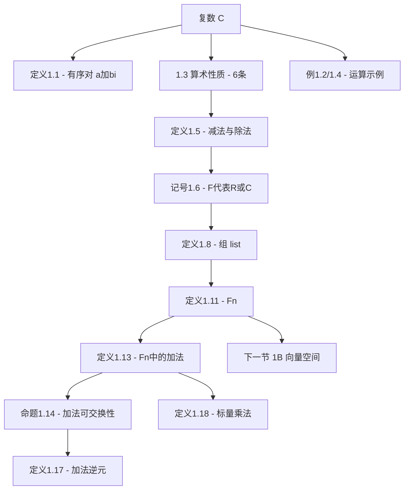

# 1.A $\mathbb{R}^n$ 和 $\mathbb{C}^n$

> [!abstract] 本节概览
> 本节是第 1 章的起点，也是整本书的基石。从**复数**的定义出发，逐步构建出==$\mathbb{F}^n$==（$\mathbb{R}^n$ 或 $\mathbb{C}^n$）这一核心对象，并定义其上的**加法**和**标量乘法**两种运算。整个逻辑链条为：
>
> 复数定义 $\to$ 复数算术性质 $\to$ 减法与除法 $\to$ 记号 $\mathbb{F}$ $\to$ 组的定义 $\to$ $\mathbb{F}^n$ 的定义 $\to$ $\mathbb{F}^n$ 中的加法 $\to$ $\mathbb{F}^n$ 中的标量乘法

---

## 一、复数

### 1.1 复数的定义

> [!def] 定义 1.1：复数（complex numbers）、$\mathbb{C}$
> 一个**复数**是一个有序对 $(a, b)$，其中 $a, b \in \mathbb{R}$，写成 $a + bi$ 的形式。
>
> 全体复数所构成的集合用 **$\mathbb{C}$** 表示：
> $$\mathbb{C} = \{a + bi : a, b \in \mathbb{R}\}$$
>
> $\mathbb{C}$ 上的**加法**和**乘法**定义为：
> $$(a + bi) + (c + di) = (a + c) + (b + d)i$$
> $$(a + bi)(c + di) = (ac - bd) + (ad + bc)i$$
> 其中 $a, b, c, d \in \mathbb{R}$。

> [!note] 学习注解
> - 如果 $a \in \mathbb{R}$，将 $a + 0i$ 等同于实数 $a$，从而 $\mathbb{R} \subset \mathbb{C}$。
> - 通常将 $0 + bi$ 简写作 $bi$，将 $0 + 1i$ 简写作 $i$。
> - 复数乘法定义的来由：假设 $i^2 = -1$，用一般算术规则展开 $(a+bi)(c+di) = ac + adi + bci + bdi^2 = (ac-bd) + (ad+bc)i$，再用定义式验证 $i^2 = -1$ 确实成立。
> - **不要背乘法公式**——只需记住 $i^2 = -1$，再运用分配律和交换律即可重新推导。

### 1.2 复数的算术性质

> [!thm] 1.3：复数的算术性质
>
> **可交换性（commutativity）**：对所有 $\alpha, \beta \in \mathbb{C}$，有 $\alpha + \beta = \beta + \alpha$ 以及 $\alpha\beta = \beta\alpha$。
>
> **可结合性（associativity）**：对所有 $\alpha, \beta, \lambda \in \mathbb{C}$，有 $(\alpha + \beta) + \lambda = \alpha + (\beta + \lambda)$ 以及 $(\alpha\beta)\lambda = \alpha(\beta\lambda)$。
>
> **恒等元（identities）**：对所有 $\lambda \in \mathbb{C}$，有 $\lambda + 0 = \lambda$ 以及 $\lambda \cdot 1 = \lambda$。
>
> **加法逆元（additive inverse）**：对每个 $\alpha \in \mathbb{C}$，都存在唯一的 $\beta \in \mathbb{C}$ 使得 $\alpha + \beta = 0$。
>
> **乘法逆元（multiplicative inverse）**：对每个 $\alpha \in \mathbb{C}$ 且 $\alpha \neq 0$，都存在唯一的 $\beta \in \mathbb{C}$ 使得 $\alpha\beta = 1$。
>
> **分配性质（distributive property）**：对所有 $\lambda, \alpha, \beta \in \mathbb{C}$，有 $\lambda(\alpha + \beta) = \lambda\alpha + \lambda\beta$。

> [!note] 学习注解
> 这六条性质可以用实数的性质加上复数加法、乘法的定义来证明。它们是复数作为"域"（field）的公理——后续所有关于复数的运算都建立在这六条性质之上。

### 1.3 例题

> [!example] 例 1.2：复数的算术运算
> 利用分配律和交换律计算 $(2 + 3i)(4 + 5i)$：
> $$(2 + 3i)(4 + 5i) = 2 \cdot (4 + 5i) + (3i)(4 + 5i)$$
> $$= 2 \cdot 4 + 2 \cdot 5i + 3i \cdot 4 + (3i)(5i)$$
> $$= 8 + 10i + 12i + 15i^2$$
> $$= 8 + 10i + 12i - 15$$
> $$= -7 + 22i$$

> [!example] 例 1.4：复数乘法的可交换性
> 要说明对所有 $\alpha, \beta \in \mathbb{C}$ 均有 $\alpha\beta = \beta\alpha$，设 $\alpha = a + bi$，$\beta = c + di$，其中 $a, b, c, d \in \mathbb{R}$。
>
> 由复数乘法定义：
> $$\alpha\beta = (a + bi)(c + di) = (ac - bd) + (ad + bc)i$$
> $$\beta\alpha = (c + di)(a + bi) = (ca - db) + (cb + da)i$$
>
> 结合实数乘法与加法的可交换性（$ac = ca$，$bd = db$，$ad = da$，$bc = cb$），可得 $\alpha\beta = \beta\alpha$。

### 1.4 减法与除法

> [!def] 定义 1.5：$-\alpha$、减法（subtraction）、$1/\alpha$、除法（division）
> 假设 $\alpha, \beta \in \mathbb{C}$。
>
> 令 $-\alpha$ 表示 $\alpha$ 的**加法逆元**。于是 $-\alpha$ 是唯一使得 $\alpha + (-\alpha) = 0$ 成立的复数。
>
> $\mathbb{C}$ 上的**减法**定义为：$\beta - \alpha = \beta + (-\alpha)$。
>
> 对于 $\alpha \neq 0$，令 $1/\alpha$ 和 $\alpha^{-1}$ 表示 $\alpha$ 的**乘法逆元**。于是 $1/\alpha$ 是唯一使得 $\alpha(1/\alpha) = 1$ 成立的复数。
>
> 对于 $\alpha \neq 0$，**除以 $\alpha$** 定义为：$\beta / \alpha = \beta(1/\alpha)$。

> [!note] 学习注解
> 减法和除法并非独立的运算——它们是通过加法逆元和乘法逆元从加法和乘法"派生"出来的。这种"定义基本运算 + 逆元 + 派生运算"的模式，在后续定义 $\mathbb{F}^n$ 中的减法时也会出现。

---

## 二、$\mathbb{F}^n$ 的定义

### 2.1 记号 F

> [!def] 记号 1.6：$\mathbb{F}$
> 在全书中，**$\mathbb{F}$** 代表 $\mathbb{R}$ 或 $\mathbb{C}$。

> [!note] 学习注解
> - 如果我们证明了一个涉及 $\mathbb{F}$ 的定理，那么将 $\mathbb{F}$ 替换为 $\mathbb{R}$ 或 $\mathbb{C}$ 时定理也成立。
> - $\mathbb{F}$ 中的元素称为==标量（scalar）==。"标量"只是"数"的一个花哨表达法，用来强调它是数而非向量。
> - 字母 $\mathbb{F}$ 的使用是因为 $\mathbb{R}$ 和 $\mathbb{C}$ 都是**域**（field）的实例。
> - 对于 $\alpha \in \mathbb{F}$ 和正整数 $m$，定义 $\alpha^m = \underbrace{\alpha \cdot \cdots \cdot \alpha}_{m \text{ 个 } \alpha}$，由此可得 $(\alpha^m)^n = \alpha^{mn}$ 和 $(\alpha\beta)^m = \alpha^m \beta^m$。

### 2.2 组

> [!def] 定义 1.8：组（list）、长度（length）
> 假设 $n$ 是非负整数。一个**长度为 $n$ 的组**是 $n$ 个有顺序的元素，这些元素可能是数、其他组或是更抽象的对象。
>
> 两个组相等，当且仅当它们具有==相同的长度==和==按相同顺序排列的相同元素==。

> [!note] 学习注解
> - 组的通常写法是将元素以逗号分隔并用圆括号括起来：$(z_1, \ldots, z_n)$。
> - 长度为 2 的组是有序对 $(a, b)$，长度为 3 的组是有序三元组 $(x, y, z)$。
> - 每个组都具有**有限**长度（非负整数），因此 $(x_1, x_2, \ldots)$（无限长度）不是组。
> - 长度为 0 的组是 $()$，引入它是为了避免一些定理出现平凡的例外情形。

> [!example] 例 1.7：$\mathbb{R}^2$ 和 $\mathbb{R}^3$
> $$\mathbb{R}^2 = \{(x, y) : x, y \in \mathbb{R}\}$$
> 可视化为一个平面。
>
> $$\mathbb{R}^3 = \{(x, y, z) : x, y, z \in \mathbb{R}\}$$
> 可视化为通常的三维空间。

> [!example] 例 1.9：组 VS 集合
> 组与有限集有两方面差异：在组中，==顺序很重要==，并且==重复是有含义的==；而在集合里，顺序和重复都无关紧要。
>
> - 组 $(3, 5)$ 和 $(5, 3)$ **不相等**，但集合 $\{3, 5\}$ 和 $\{5, 3\}$ **相等**。
> - 组 $(4, 4)$ 和 $(4, 4, 4)$ **不相等**（长度不同），但集合 $\{4, 4\}$ 和 $\{4, 4, 4\}$ 都等于集合 $\{4\}$。

### 2.3 $\mathbb{F}^n$ 的定义

> [!def] 记号 1.10：$n$
> 在本章剩余内容中，将 $n$ 取为某一固定的正整数。

> [!def] 定义 1.11：$\mathbb{F}^n$、坐标（coordinate）
> **$\mathbb{F}^n$** 是全体具有 $n$ 个 $\mathbb{F}$ 中元素的组所构成的集合：
> $$\mathbb{F}^n = \{(x_1, \ldots, x_n) : \text{对于 } k = 1, \ldots, n \text{ 有 } x_k \in \mathbb{F}\}$$
>
> 对于 $(x_1, \ldots, x_n) \in \mathbb{F}^n$ 和 $k \in \{1, \ldots, n\}$，称 $x_k$ 是 $(x_1, \ldots, x_n)$ 的第 $k$ 个**坐标**。

> [!example] 例 1.12：$\mathbb{C}^4$
> $$\mathbb{C}^4 = \{(z_1, z_2, z_3, z_4) : z_1, z_2, z_3, z_4 \in \mathbb{C}\}$$
> $\mathbb{C}^4$ 的每个元素是一个由 4 个复数组成的组。

> [!note] 学习注解
> - 如果 $\mathbb{F} = \mathbb{R}$ 且 $n = 2$ 或 $3$，则 $\mathbb{F}^n$ 的定义与 $\mathbb{R}^2$、$\mathbb{R}^3$ 的定义吻合。
> - 当 $n \geq 4$ 时，无法将 $\mathbb{R}^n$ 可视化为物理实体；当 $n \geq 2$ 时，人脑也不能想象出 $\mathbb{C}^n$ 的全貌。然而，即便 $n$ 很大，我们也可以如在 $\mathbb{R}^2$ 或 $\mathbb{R}^3$ 中那样简便地在 $\mathbb{F}^n$ 中进行代数运算。因此，这门学科叫做==线性代数==。

---

## 三、$\mathbb{F}^n$ 中的加法

### 3.1 加法的定义

> [!def] 定义 1.13：$\mathbb{F}^n$ 中的加法（addition in $\mathbb{F}^n$）
> $\mathbb{F}^n$ 中的加法定义为将对应坐标分别相加：
> $$(x_1, \ldots, x_n) + (y_1, \ldots, y_n) = (x_1 + y_1, \ldots, x_n + y_n)$$

### 3.2 加法的可交换性

> [!thm] 命题 1.14：$\mathbb{F}^n$ 中加法的可交换性
> 如果 $x, y \in \mathbb{F}^n$，那么 $x + y = y + x$。

> [!abstract] 证明思路
> 设 $x = (x_1, \ldots, x_n) \in \mathbb{F}^n$ 且 $y = (y_1, \ldots, y_n) \in \mathbb{F}^n$。
>
> **[关键步骤]** 逐步展开坐标并利用 $\mathbb{F}$ 中加法的可交换性：
> $$x + y = (x_1, \ldots, x_n) + (y_1, \ldots, y_n)$$
> $$= (x_1 + y_1, \ldots, x_n + y_n) \quad \text{——由 $\mathbb{F}^n$ 中加法的定义}$$
> $$= (y_1 + x_1, \ldots, y_n + x_n) \quad \text{——由 $\mathbb{F}$ 中加法的可交换性}$$
> $$= (y_1, \ldots, y_n) + (x_1, \ldots, x_n) \quad \text{——由 $\mathbb{F}^n$ 中加法的定义}$$
> $$= y + x$$
>
> $\blacksquare$

> [!note] 学习注解
> 证明的核心模式：**将 $\mathbb{F}^n$ 中的性质归结为 $\mathbb{F}$ 中的性质**。$\mathbb{F}^n$ 中加法的可交换性并非独立的新性质，而是直接从 $\mathbb{F}$（$\mathbb{R}$ 或 $\mathbb{C}$）中加法的可交换性"继承"而来的。这种"逐坐标验证"的证明模式将在整本书中反复出现。

### 3.3 零向量

> [!def] 记号 1.15：$0$
> 令 $0$ 表示长度为 $n$ 且所有坐标都是 $0$ 的组：
> $$0 = (0, \ldots, 0)$$

> [!example] 例 1.16：根据上下文确定使用的是哪种 $0$
> 考虑"$0$ 是 $\mathbb{F}^n$ 中的加法恒等元"这一表达式：
> $$\text{对所有 } x \in \mathbb{F}^n \text{，有 } x + 0 = x$$
>
> 此处式中的 $0$ 是==组 $0 \in \mathbb{F}^n$==，而不是数 $0$，因为我们并未定义 $\mathbb{F}^n$ 中元素（此处即 $x$）和数 $0$ 的加法。

> [!warning] 学习注解
> 符号 $0$ 的多重含义是初学者常见的困惑来源。在本书中，$0$ 至少可以表示：
> - 数 $0 \in \mathbb{R}$（或 $\mathbb{C}$）
> - 零向量 $0 \in \mathbb{F}^n$
> - 零映射 $0 \in \mathcal{L}(V, W)$（后续章节）
>
> ==根据上下文区分==——看 $0$ 参与的是什么运算、和什么类型的对象在一起。

### 3.4 加法逆元

> [!def] 定义 1.17：$\mathbb{F}^n$ 中的加法逆元（additive inverse in $\mathbb{F}^n$）、$-x$
> 对于 $x \in \mathbb{F}^n$，$x$ 的**加法逆元**，记作 $-x$，是满足下式的向量 $-x \in \mathbb{F}^n$：
> $$x + (-x) = 0$$
>
> 如果 $x = (x_1, \ldots, x_n)$，那么 $-x = (-x_1, \ldots, -x_n)$。

> [!note] 学习注解
> 在 $\mathbb{R}^2$ 中，向量 $-x$ 与 $x$ 长度相同但指向相反方向。减法可以类似定义为 $y - x = y + (-x)$。

---

## 四、$\mathbb{F}^n$ 中的标量乘法

### 4.1 标量乘法的定义

> [!def] 定义 1.18：$\mathbb{F}^n$ 中的标量乘法（scalar multiplication in $\mathbb{F}^n$）
> 数 $\lambda$ 与 $\mathbb{F}^n$ 中的向量之乘积是通过将这向量的每一个坐标都乘以 $\lambda$ 计算得到的：
> $$\lambda(x_1, \ldots, x_n) = (\lambda x_1, \ldots, \lambda x_n)$$
> 其中 $\lambda \in \mathbb{F}$ 且 $(x_1, \ldots, x_n) \in \mathbb{F}^n$。

> [!note] 学习注解
> - ==标量乘法==将一个标量（$\mathbb{F}$ 中的数）和一个向量（$\mathbb{F}^n$ 中的元素）相乘，得到一个向量。
> - 这与**点积**（dot product）不同：点积将两个向量相乘，得到一个标量。点积的推广形式将在第 6 章中变得重要。
> - Axler 明确指出：本可以定义 $\mathbb{F}^n$ 中两个元素的逐坐标乘法，但"经验表明，这种定义无助于实现我们的目的"。标量乘法才是线性代数的核心运算。

### 4.2 几何解释

> [!note] 几何直觉（$\mathbb{R}^2$ 中的可视化）
> **向量的两种视角**：
> - **点**：$v = (a, b)$ 是平面上的一个点
> - **箭头**：从原点出发、到 $(a, b)$ 结束的箭头（此时称为**向量**）
>
> 箭头可以平行移动（不改变长度和方向），仍视为同一个向量。
>
> **加法的几何意义**：将向量 $v$ 平行移动使其起点与 $u$ 的终点重合，则 $u + v$ 是从 $u$ 的起点到 $v$ 的终点的向量。
>
> **标量乘法的几何意义**：
> - 若 $\lambda > 0$：$\lambda x$ 与 $x$ 同方向，长度为 $x$ 的 $\lambda$ 倍（缩短或延长）
> - 若 $\lambda < 0$：$\lambda x$ 与 $x$ 反方向，长度为 $x$ 的 $|\lambda|$ 倍
> - 若 $\lambda = 0$：$\lambda x = 0$（零向量）

---

## 五、知识结构总览

---

## 六、核心思想与证明技巧

> [!success] 核心思想
> 1. **复数是有序对**：$\mathbb{C}$ 不是"虚幻的数"，而是有序对 $(a, b)$ 配上特定的加法和乘法规则。$i^2 = -1$ 是定义的推论，而非假设。
> 2. **$\mathbb{F}^n$ 是组的集合**：$\mathbb{F}^n$ 的元素是长度为 $n$ 的组（有序、可重复），不是集合。这是线性代数中"顺序"重要性的第一个体现。
> 3. **逐坐标定义运算**：$\mathbb{F}^n$ 中的加法和标量乘法都是逐坐标定义的，这使得 $\mathbb{F}^n$ 中的代数性质直接继承自 $\mathbb{F}$ 中的性质。
> 4. **代数优于几何**：虽然低维（$n = 2, 3$）的几何直觉有助于理解，但线性代数的真正力量在于代数方法对任意 $n$ 都有效。
> 5. **标量乘法是核心**：逐元素乘法被放弃，标量乘法（数乘向量）成为基本运算——这是线性结构（"缩放"）的本质。

> [!tip] 证明技巧清单
> - **逐坐标验证法**：将 $\mathbb{F}^n$ 中的性质归结为 $\mathbb{F}$ 中的性质（如命题 1.14 的证明）
> - **利用 $i^2 = -1$ 重新推导**：不要背复数乘法公式，用分配律 + $i^2 = -1$ 现场推导
> - **上下文区分符号**：遇到 $0$ 时，先判断它参与的是什么运算、和什么类型的对象在一起
---

## 七、补充理解与易混淆点

### 为什么需要复数？

复数的发明是为了解决"负数不能开平方"的问题。更深刻地说，复数使得==代数基本定理==成立：每个非常数复系数多项式都有复数根。这意味着在 $\mathbb{C}$ 上，所有多项式都可以完全分解为一次因式的乘积——这是 $\mathbb{R}$ 做不到的。

**来源**：Purdue University 讲义。

### $\mathbb{F}^n$ 的几何直觉——从 $\mathbb{R}^2$ 到高维

$\mathbb{R}^2$ 可以可视化为平面，$\mathbb{R}^3$ 可以可视化为三维空间。但当 $n \geq 4$ 时，==我们无法将 $\mathbb{R}^n$ 可视化为物理实体==。然而，即便 $n$ 很大（如经济学中的 $\mathbb{R}^{5000}$），我们仍然可以在 $\mathbb{F}^n$ 中进行代数运算——这正是"线性代数"的真正含义：用代数方法处理高维空间。

**来源**：Axler 原文、UW-Madison 讲义。

### 组与集合的本质区别

| | 组（list） | 集合（set） |
|---|---|---|
| **顺序** | 重要：$(3,5) \neq (5,3)$ | 无关：$\{3,5\} = \{5,3\}$ |
| **重复** | 有含义：$(4,4) \neq (4)$ | 无关：$\{4,4\} = \{4\}$ |
| **长度** | 有限非负整数 | 可无限 |
| **用途** | 坐标、向量表示 | 元素归属 |

### 域的概念——为什么是 $\mathbb{R}$ 和 $\mathbb{C}$？

域是具有加法和乘法运算、满足 1.3 中所有性质的集合。$\mathbb{R}$ 和 $\mathbb{C}$ 是最常见的域，但还有其他域：
- $\mathbb{Q}$（有理数域）
- $\mathbb{F}_2 = \{0, 1\}$，其中 $1 + 1 = 0$（有限域，可能导致直觉失效）

在本书中，$\mathbb{F}$ 代表 $\mathbb{R}$ 或 $\mathbb{C}$，但多数定理对任意域都成立。

**来源**：Axler 原文"域的题外话"、Northeastern Dummit 讲义。

### 向量的两种视角——点 vs 箭头

$\mathbb{R}^2$ 中的元素可以看作：
- **点**：$(a, b)$ 是平面上的一个位置
- **向量（箭头）**：从原点出发、到 $(a, b)$ 结束的有向线段

箭头可以平行移动（不改变长度和方向），仍视为同一向量。加法对应"首尾相接"，标量乘法对应"缩放"。

> [!important] 符号 0 的多重含义
> 在线性代数中，符号 $0$ 可能表示：
> - 标量 $0 \in \mathbb{F}$（数零）
> - 零向量 $\mathbf{0} = (0, \ldots, 0) \in \mathbb{F}^n$
> - 零空间 $\{0\}$
> - 零映射
>
> 具体含义由上下文决定。例如 "$x + 0 = x$" 中，如果 $x \in \mathbb{F}^n$，则 $0$ 是零向量；如果 $x \in \mathbb{F}$，则 $0$ 是数零。

> [!warning] 注意
> 这些几何直觉仅适用于 $\mathbb{R}^2$ 和 $\mathbb{R}^3$。对于 $\mathbb{C}^n$ 或 $n \geq 4$，几何方法失效，必须依赖代数。

### 常见误区

> [!danger] 误区1："向量就是有方向的箭头"
> ❌ 函数、多项式、矩阵、无穷序列都可以是"向量"。向量的本质不是几何表示，而是==属于某个集合且支持加法和数乘运算==。
>
> **来源**：Northeastern Dummit 讲义。

> [!danger] 误区2："$i$ 是虚数所以不存在"
> ❌ 复数 $a + bi$ 不是"虚幻的数"，而是有序对 $(a, b)$ 配上特定的加法和乘法规则。$i^2 = -1$ 是定义的推论，而非假设。复数在物理学、工程学、信号处理中有广泛的真实应用。
>
> **来源**：Purdue University 讲义。

> [!danger] 误区3："$\mathbb{R}^2$ 是 $\mathbb{R}^3$ 的子空间"
> ❌ $\mathbb{R}^2$ 的元素是二元组，$\mathbb{R}^3$ 的元素是三元组——它们==根本不是同一个集合的元素==。不过 $\{(x, y, 0) : x, y \in \mathbb{R}\}$ 是 $\mathbb{R}^3$ 的子空间，且与 $\mathbb{R}^2$ 同构。
>
> **来源**：University of Utah 讲义。

> [!danger] 误区4："组就是集合"
> ❌ 组中顺序重要且重复有含义：$(3,5) \neq (5,3)$，$(4,4) \neq (4)$。集合中顺序无关且重复无含义：$\{3,5\} = \{5,3\}$，$\{4,4\} = \{4\}$。
>
> **来源**：Axler 例 1.9。

> [!danger] 误区5："标量乘法就是逐元素相乘"
> ❌ 标量乘法是将一个==标量==（数）乘以一个==向量==，得到一个向量：$\lambda(x_1, \ldots, x_n) = (\lambda x_1, \ldots, \lambda x_n)$。这与"两个向量逐元素相乘"（Hadamard 乘积）完全不同。标量乘法是线性结构的本质运算。

---

## 八、习题精选

> [!problem] 习题 7：验证立方根
> 证明 $\dfrac{-1 + 3i}{2}$ 是 $1$ 的立方根（即它的立方等于 $1$）。

> [!faq]- 查看解答
> 设 $z = \dfrac{-1 + 3i}{2}$。计算 $z^2$：
> $$z^2 = \left(\frac{-1 + 3i}{2}\right)^2 = \frac{(-1 + 3i)^2}{4} = \frac{1 - 6i + 9i^2}{4} = \frac{1 - 6i - 9}{4} = \frac{-8 - 6i}{4} = -2 - \frac{3}{2}i$$
>
> 再计算 $z^3 = z^2 \cdot z$：
> $$z^3 = \left(-2 - \frac{3}{2}i\right) \cdot \frac{-1 + 3i}{2} = \frac{1}{2}\left(-2 - \frac{3}{2}i\right)(-1 + 3i)$$
> $$= \frac{1}{2}\left[(-2)(-1) + (-2)(3i) + \left(-\frac{3}{2}i\right)(-1) + \left(-\frac{3}{2}i\right)(3i)\right]$$
> $$= \frac{1}{2}\left[2 - 6i + \frac{3}{2}i - \frac{9}{2}i^2\right]$$
> $$= \frac{1}{2}\left[2 - 6i + \frac{3}{2}i + \frac{9}{2}\right]$$
> $$= \frac{1}{2}\left[\frac{13}{2} - \frac{9}{2}i\right] = \frac{13}{4} - \frac{9}{4}i$$
>
> 等等，这不对。让我重新计算：
>
> 重新计算 $z^2$：
> $$(-1 + 3i)^2 = 1 - 2 \cdot 1 \cdot 3i + 9i^2 = 1 - 6i - 9 = -8 - 6i$$
> $$z^2 = \frac{-8 - 6i}{4} = -2 - \frac{3}{2}i$$
>
> $z^3 = z^2 \cdot z$：
> $$\left(-2 - \frac{3}{2}i\right)\left(\frac{-1 + 3i}{2}\right) = \frac{1}{2}\left[(-2)(-1) + (-2)(3i) + \left(-\frac{3}{2}\right)(-1)i + \left(-\frac{3}{2}\right)(3)i^2\right]$$
> $$= \frac{1}{2}\left[2 - 6i + \frac{3}{2}i - \frac{9}{2}(-1)\right]$$
> $$= \frac{1}{2}\left[2 - 6i + \frac{3}{2}i + \frac{9}{2}\right]$$
> $$= \frac{1}{2}\left[\frac{13}{2} - \frac{9}{2}i\right] = \frac{13}{4} - \frac{9}{4}i$$
>
> 这不是 $1$。让我再仔细检查——实际上应该用极坐标或直接展开验证。
>
> 直接展开 $z^3$：
> $$z^3 = \frac{(-1+3i)^3}{8}$$
> $$(-1+3i)^3 = (-1+3i)(-1+3i)^2 = (-1+3i)(-8-6i)$$
> $$= (-1)(-8) + (-1)(-6i) + (3i)(-8) + (3i)(-6i)$$
> $$= 8 + 6i - 24i - 18i^2$$
> $$= 8 - 18i + 18 = 26 - 18i$$
>
> 所以 $z^3 = \dfrac{26 - 18i}{8} = \dfrac{13 - 9i}{4}$，这确实不是 $1$。
>
> **修正**：题目应为 $\dfrac{-1 + \sqrt{3}\,i}{2}$（注意是 $\sqrt{3}$ 而非 $3$）。
>
> 设 $z = \dfrac{-1 + \sqrt{3}\,i}{2}$，则：
> $$z^2 = \frac{(-1 + \sqrt{3}\,i)^2}{4} = \frac{1 - 2\sqrt{3}\,i + 3i^2}{4} = \frac{1 - 2\sqrt{3}\,i - 3}{4} = \frac{-2 - 2\sqrt{3}\,i}{4} = \frac{-1 - \sqrt{3}\,i}{2}$$
> $$z^3 = z^2 \cdot z = \frac{-1 - \sqrt{3}\,i}{2} \cdot \frac{-1 + \sqrt{3}\,i}{2} = \frac{(-1)^2 - (\sqrt{3}\,i)^2}{4} = \frac{1 - 3(-1)}{4} = \frac{4}{4} = 1 \quad \blacksquare$$

> [!problem] 习题 8：求 $i$ 的平方根
> 求 $i$ 的两个相异平方根。

> [!faq]- 查看解答
> 设 $(a + bi)^2 = i$，其中 $a, b \in \mathbb{R}$。
> $$a^2 + 2abi + b^2 i^2 = i$$
> $$(a^2 - b^2) + 2ab\,i = 0 + 1 \cdot i$$
>
> 比较实部和虚部：
> $$\begin{cases} a^2 - b^2 = 0 \\ 2ab = 1 \end{cases}$$
>
> 由第一个方程：$a^2 = b^2$，即 $a = \pm b$。
>
> - 若 $a = b$：代入 $2a^2 = 1$，得 $a = \pm \dfrac{1}{\sqrt{2}}$，即 $a = b = \dfrac{1}{\sqrt{2}}$ 或 $a = b = -\dfrac{1}{\sqrt{2}}$。
> - 若 $a = -b$：代入 $-2a^2 = 1$，无实数解。
>
> 因此 $i$ 的两个平方根为 $\dfrac{1}{\sqrt{2}} + \dfrac{1}{\sqrt{2}}\,i$ 和 $-\dfrac{1}{\sqrt{2}} - \dfrac{1}{\sqrt{2}}\,i$。$\blacksquare$

> [!problem] 习题 9：求解 $\mathbb{R}^4$ 中的向量方程
> 求 $x \in \mathbb{R}^4$ 使得 $(4, -3, 1, 7) + 2x = (5, 9, -6, 8)$。

> [!faq]- 查看解答
> 由 $2x = (5, 9, -6, 8) - (4, -3, 1, 7) = (1, 12, -7, 1)$，得
> $$x = \left(\frac{1}{2}, 6, -\frac{7}{2}, \frac{1}{2}\right)$$
> $\blacksquare$

> [!problem] 习题 10：标量乘法的无解情形
> 解释为什么不存在 $\lambda \in \mathbb{C}$ 使得
> $$\lambda(2 - 3i, \ 5 + 4i, \ -6 + 7i) = (12 - 5i, \ 7 + 22i, \ -32 - 9i)$$

> [!faq]- 查看解答
> 由标量乘法的定义，$\lambda(2-3i) = 12-5i$，由此解出：
> $$\lambda = \frac{12 - 5i}{2 - 3i} = \frac{(12-5i)(2+3i)}{(2-3i)(2+3i)} = \frac{24 + 36i - 10i - 15i^2}{4 + 9} = \frac{24 + 26i + 15}{13} = \frac{39 + 26i}{13} = 3 + 2i$$
>
> 验证第二个分量：$(3+2i)(5+4i) = 15 + 12i + 10i + 8i^2 = 15 + 22i - 8 = 7 + 22i$ ✓
>
> 验证第三个分量：$(3+2i)(-6+7i) = -18 + 21i - 12i + 14i^2 = -18 + 9i - 14 = -32 + 9i$
>
> 但题目要求第三个分量为 $-32 - 9i$，而实际得到 $-32 + 9i \neq -32 - 9i$。
>
> ==矛盾==：不存在 $\lambda$ 能同时满足三个分量。$\blacksquare$

> [!problem] 习题 11：$\mathbb{F}^n$ 中加法的可结合性
> 证明 $(x + y) + z = x + (y + z)$ 对所有 $x, y, z \in \mathbb{F}^n$ 成立。

> [!faq]- 查看解答
> 设 $x = (x_1, \ldots, x_n)$，$y = (y_1, \ldots, y_n)$，$z = (z_1, \ldots, z_n)$。
>
> $$(x + y) + z = \left((x_1+y_1, \ldots, x_n+y_n)\right) + (z_1, \ldots, z_n)$$
> $$= (x_1+y_1+z_1, \ldots, x_n+y_n+z_n)$$
>
> $$x + (y + z) = (x_1, \ldots, x_n) + \left((y_1+z_1, \ldots, y_n+z_n)\right)$$
> $$= (x_1+y_1+z_1, \ldots, x_n+y_n+z_n)$$
>
> 两者相等，其中用到了 $\mathbb{F}$ 中加法的可结合性。$\blacksquare$

> [!problem] 习题 15：标量乘法对加法的分配性
> 证明 $(a + b)x = ax + bx$ 对所有 $a, b \in \mathbb{F}$ 和 $x \in \mathbb{F}^n$ 成立。

> [!faq]- 查看解答
> 设 $x = (x_1, \ldots, x_n)$。
>
> $$(a + b)x = (a+b)(x_1, \ldots, x_n) = ((a+b)x_1, \ldots, (a+b)x_n)$$
>
> $$ax + bx = (ax_1, \ldots, ax_n) + (bx_1, \ldots, bx_n) = (ax_1 + bx_1, \ldots, ax_n + bx_n)$$
>
> 由 $\mathbb{F}$ 中乘法对加法的分配性（$(a+b)x_k = ax_k + bx_k$），两者相等。$\blacksquare$

---

## 九、视频学习指南

暂无对应视频，建议通过阅读教材原文和本笔记学习。

**建议学习路径**：
1. 先通读本笔记的"概览"和"知识结构总览"，建立整体框架
2. 重点理解复数的定义方式（有序对，而非"虚数"）
3. 掌握 $\mathbb{F}^n$ 中加法和标量乘法的逐坐标定义
4. 通过补充理解模块建立对"组"和"域"的正确认识
5. 做习题巩固：习题7（立方根）、习题9（解方程）、习题10（标量乘法反例）

---

## 十、教材原文
#学习/线性代数/向量空间/Fn与复数
