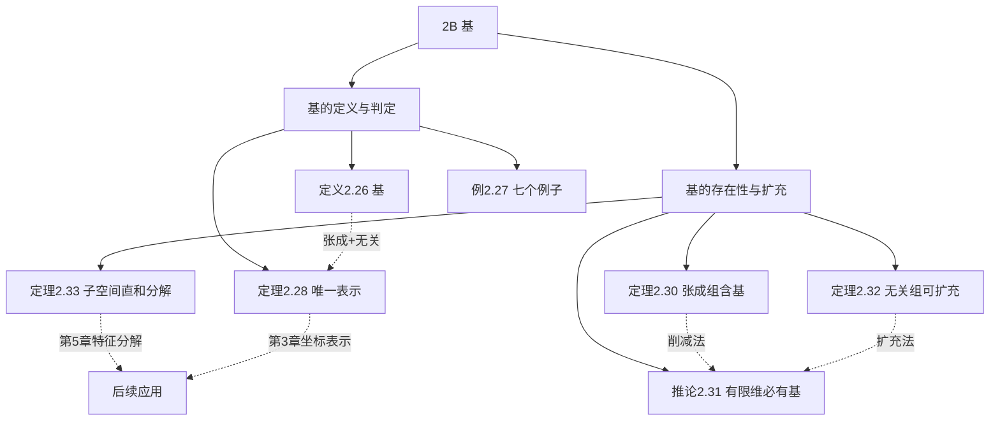

# 2B 基

> [!abstract] 本节概览
> 本节将 2A 中两个核心概念——==张成==和==线性无关==——融合为一个统一的概念：==基==（basis）。基是线性代数中最重要的概念之一，它为向量空间的每个元素赋予了唯一的"坐标"，从而使得抽象的向量空间可以用具体的数组来表示。
>
> **逻辑链条**：基的定义（张成 + 无关）→ 判定准则（唯一表示）→ 张成组含基（削减法）→ 无关组可扩充 → 子空间直和分解
>
> **前置依赖**：[[2A 张成空间和线性无关性]]（张成空间、线性无关、长度比较定理）、[[1C 子空间]]（直和）
>
> **核心主线**：基 = "恰好合适"的向量组——不大不小，唯一地描述整个空间

---

## 一、基的定义与判定

> [!def] 定义 2.26 基
> $V$ 中向量组 $v_1, \ldots, v_n$ 称为 $V$ 的==基==，如果 $v_1, \ldots, v_n$ 线性无关且 $\text{span}(v_1, \ldots, v_n) = V$。

> [!important] 基的双重含义
> - **线性无关**：没有冗余（"不多"）
> - **张成**：覆盖整个空间（"不少"）
> - 两者结合：==恰好描述整个空间==（"正好"）

> [!example] 例 2.27 基的例子
> **(a)** $(1,0,\ldots,0), (0,1,0,\ldots,0), \ldots, (0,\ldots,0,1)$ 是 $\mathbb{F}^n$ 的基（==标准基==）
>
> **(b)** $(1,2), (3,5)$ 是 $\mathbb{F}^2$ 的基——行列式 $1 \cdot 5 - 2 \cdot 3 = -1 \neq 0$
>
> **(c)** $(1,0,0), (0,1,0), (0,0,1)$ 是 $\mathbb{F}^3$ 的子空间 $\{(x,y,z) : x+y+z=0\}$ 的基吗？不是——这三个向量不满足 $x+y+z=0$，不在该子空间中
>
> **(d)** $(1,-1,0), (1,0,-1)$ 是 $\{(x,y,z) : x+y+z=0\}$ 的基
>
> **(e)** $1, z, \ldots, z^m$ 是 $\mathcal{P}_m(\mathbb{F})$ 的基
>
> **(f)** $1, (z-1), (z-1)^2, \ldots, (z-1)^m$ 也是 $\mathcal{P}_m(\mathbb{F})$ 的基——同一空间可以有不同的基
>
> **(g)** $\mathcal{P}(\mathbb{F})$ 没有有限基——它是无限维的

> [!thm] 定理 2.28 基的判定准则
> $V$ 中向量组 $v_1, \ldots, v_n$ 是 $V$ 的基，当且仅当 $V$ 中的每个向量 $v$ 都能==唯一地==表示为 $v_1, \ldots, v_n$ 的线性组合。

> [!abstract] 证明思路
> **[$(\Rightarrow)$ 基 ⟹ 唯一表示]**：
> 张成保证存在性，线性无关保证唯一性。设 $v = a_1 v_1 + \cdots + a_n v_n = c_1 v_1 + \cdots + c_n v_n$，则 $(a_1-c_1)v_1 + \cdots + (a_n-c_n)v_n = 0$。由线性无关得 $a_k = c_k$。
>
> **[$(\Leftarrow)$ 唯一表示 ⟹ 基]**：
> - **张成**：每个 $v$ 都能表示为线性组合，所以 $\text{span}(v_1, \ldots, v_n) = V$
> - **线性无关**：$\mathbf{0}$ 的表示唯一（只有全零系数），所以线性无关。$\blacksquare$

> [!tip] 坐标的直觉
> 定理 2.28 告诉我们：选定基之后，$V$ 中的每个向量都有唯一的"坐标" $(a_1, \ldots, a_n)$。这就是为什么基是连接抽象向量空间和具体数组之间的桥梁（Texas A&M MATH 323 讲义、BU MA 242 讲义）。

---

## 二、基的存在性与扩充

### 2.1 张成组包含基（削减法）

> [!thm] 定理 2.30 张成组包含基
> 有限维向量空间中的每个张成向量组都可以缩减为 $V$ 的基。

> [!abstract] 证明思路
> **[逐步剔除冗余向量]**：
>
> 设 $v_1, \ldots, v_n$ 张成 $V$。从后往前扫描：
>
> **[步骤 1]**：若 $v_n \in \text{span}(v_1, \ldots, v_{n-1})$，则移除 $v_n$（由线性相关性引理，张成空间不变）
>
> **[步骤 $k$]**：继续检查 $v_{n-k+1}$ 是否在剩余向量的张成空间中
>
> **[终止]**：当无法再移除任何向量时，剩余的组既张成 $V$ 又线性无关——即基。$\blacksquare$

> [!tip] 削减法的直觉
> 从"太多"的向量开始，逐步移除冗余的，直到"恰好合适"。就像雕塑——从一块石头开始，逐步削去多余的部分。

### 2.2 有限维向量空间的基

> [!corollary] 推论 2.31 有限维向量空间的基
> 每个有限维向量空间都有基。

> [!note] 证明
> 由定义 2.9，有限维意味着存在某个张成组。由定理 2.30，这个张成组可以缩减为基。

### 2.3 线性无关组可扩充为基

> [!thm] 定理 2.32 线性无关组可扩充为基
> 有限维向量空间 $V$ 中的每个线性无关向量组都可以被扩充成 $V$ 的基。

> [!abstract] 证明思路
> **[逐步添加向量]**：
>
> 设 $u_1, \ldots, u_m$ 线性无关。取 $V$ 的一个基 $w_1, \ldots, w_n$。
>
> **[步骤 1]**：若 $m = n$，则 $u_1, \ldots, u_m$ 已经是基（由定理 2.22，长度相等的线性无关组也是张成组）。
>
> **[步骤 2]**：若 $m < n$，则 $u_1, \ldots, u_m$ 不能张成 $V$。取 $w \in V \setminus \text{span}(u_1, \ldots, u_m)$，令 $u_{m+1} = w$。新组 $u_1, \ldots, u_{m+1}$ 仍线性无关（[[2A 张成空间和线性无关性|习题 13]]）。
>
> **[终止]**：重复直到长度为 $n$。$\blacksquare$

> [!tip] 扩充法的直觉
> 从"太少"的向量开始，逐步添加新的独立向量，直到"恰好合适"。就像画画——先勾勒轮廓，再逐步补充细节。

### 2.4 子空间的直和分解

> [!thm] 定理 2.33 子空间直和分解
> 设 $V$ 是有限维的，$U_1, \ldots, U_m$ 是 $V$ 的子空间，使得 $V = U_1 + \cdots + U_m$。则存在 $V$ 的基使得每个基向量恰好属于某个 $U_j$。

> [!abstract] 证明思路
> **[分别取基再合并]**：
>
> 对每个 $U_j$，取一个基 $B_j$。令 $B = B_1 \cup \cdots \cup B_m$。
>
> - $B$ 张成 $V$：因为每个 $U_j$ 的基张成 $U_j$，而 $U_1 + \cdots + U_m = V$
> - 将 $B$ 缩减为基（定理 2.30）：缩减后的基中每个向量都来自某个 $B_j$，即属于某个 $U_j$。$\blacksquare$

> [!important] 定理 2.33 的意义
> 这个定理保证了：当我们把 $V$ 分解为子空间的和时，总可以找到一组"整齐"的基来反映这种分解。这是后续特征空间分解（第 5 章）和谱定理（第 7 章）的理论基础。

---

## 三、知识结构总览

---

## 四、核心思想与证明技巧

> [!success] 核心思想
> 1. **基 = 张成 + 线性无关**：基同时满足"覆盖整个空间"和"没有冗余"两个条件。这是 2A 中两个核心概念的完美融合。
> 2. **唯一表示 = 坐标系统**：定理 2.28 表明，基为向量空间建立了一套"坐标系"。选定基后，每个向量对应唯一的坐标数组——这是矩阵表示（第 3 章）和坐标变换的基础。
> 3. **削减法 vs 扩充法**：定理 2.30（从张成组中剔除冗余）和定理 2.32（向线性无关组中添加向量）是构造基的两个互补方法。
> 4. **基不唯一**：例 2.27(f) 表明同一空间可以有多种基。不同基给出不同的坐标表示，但描述的是同一个空间。

> [!tip] 证明技巧清单
> 1. **证明"是基"的标准流程**：先证张成（或线性无关），再用定理 2.22 的长度比较证另一个
> 2. **唯一表示 ⟺ 基**（定理 2.28）：张成保证存在性，线性无关保证唯一性——这个模式在后续章节反复出现
> 3. **削减法**（定理 2.30）：利用线性相关性引理逐步移除冗余向量
> 4. **扩充法**（定理 2.32）：利用 2A 习题 13 的结论逐步添加独立向量

---

## 五、补充理解与易混淆点

### 5.1 基的几何直觉

在 $\mathbb{R}^2$ 和 $\mathbb{R}^3$ 中，基有非常直观的几何含义（Texas A&M MATH 323 讲义、UNL Bases and Dimension 讲义）：

| 空间 | 基 | 几何含义 |
|---|---|---|
| $\mathbb{R}^2$ | 两个不共线向量 | 确定一个平面坐标系 |
| $\mathbb{R}^3$ | 三个不共面向量 | 确定一个空间坐标系 |
| $\mathbb{R}^n$ | $n$ 个线性无关向量 | 确定 $n$ 维坐标系 |

==直觉：基就像一组"坐标轴"——它们确定了空间的"方向"和"尺度"==。选定基之后，每个向量都可以用这组坐标轴上的"投影"来唯一描述。

**来源**：Texas A&M MATH 323 讲义、UNL Bases and Dimension 讲义。

### 5.2 为什么基不唯一？

例 2.27(f) 展示了 $\mathcal{P}_m(\mathbb{F})$ 的两组不同基：$\{1, z, \ldots, z^m\}$ 和 $\{1, (z-1), \ldots, (z-1)^m\}$。这就像：

- 用"标准坐标轴"描述平面 vs 用"旋转后的坐标轴"描述平面
- 两种描述方式不同（坐标值不同），但描述的是同一个空间

这种"同一空间、不同基"的思想是==坐标变换==（第 3 章）和==相似性==（第 5 章）的基础。

**来源**：BU MA 242 Lecture 15 讲义。

### 5.3 常见误区

> [!danger] 误区1："基就是张成空间"
> ❌ 错误认知：只要向量组张成 $V$，它就是基
> ✅ 正确理解：基==同时需要==张成和线性无关。仅张成的组可能包含冗余向量（Numerade Elementary Linear Algebra 注解）。例如 $(1,0), (2,0), (0,1)$ 张成 $\mathbb{R}^2$，但不是基——$(2,0)$ 是冗余的

> [!danger] 误区2："基是子空间/向量空间"
> ❌ 错误认知：基本身是一个子空间或向量空间
> ✅ 正确理解：基是一个==向量组==（一组向量），不是子空间。子空间对加法和标量乘法封闭，而基向量组一般不封闭——两个基向量的和通常不是基向量（UFL Common Mistakes 讲义）

> [!danger] 误区3："基的矩阵就是基"
> ❌ 错误认知：基 $\{v_1, \ldots, v_n\}$ 和矩阵 $[v_1 \cdots v_n]$ 是同一个东西
> ✅ 正确理解：基是==一组向量==，矩阵是这些向量的==一种排列方式==。基的概念不依赖于矩阵表示——在抽象向量空间中，基向量甚至可能不是数组（UFL Common Mistakes 讲义）

**来源**：University of Florida Common Mistakes in Math Terminology、Numerade Elementary Linear Algebra、ERIC "Misconceptions in Linear Independence" 教育研究论文、CSDN 线性空间基的判定综合试题解析。

---

## 六、习题精选

> [!todo] 本节习题
>
> | 编号 | 标题 | 核心考点 | 难度 |
> |:---:|---|---|:---:|
> | 1 | 验证基 | 基的判定 | ⭐ |
> | 3 | 求基 | 削减法/扩充法 | ⭐⭐ |
> | 7 | 扩充为基 | 定理 2.32 | ⭐⭐ |
> | 8 | 缩减为基 | 定理 2.30 | ⭐⭐ |
> | 10 | 子空间直和分解 | 定理 2.33 | ⭐⭐⭐ |

### 习题 1：验证基

> [!problem] 习题 1
> (a) 证明 $(1,0,-1,0), (0,1,0,-1)$ 是 $\{(x_1, x_2, x_3, x_4) \in \mathbb{F}^4 : x_1 + x_3 = 0, x_2 + x_4 = 0\}$ 的基。
>
> (b) 证明 $(1,1,0,0), (1,0,1,0), (1,0,0,1)$ 是 $\{(x_1, x_2, x_3, x_4) \in \mathbb{F}^4 : x_1 = x_2 + x_3 + x_4\}$ 的基。

> [!faq]- 查看解答
> **(a)** 设 $U = \{(x_1,x_2,x_3,x_4) : x_1+x_3=0, x_2+x_4=0\}$，即 $x_3=-x_1, x_4=-x_2$。
>
> $U = \{(x_1, x_2, -x_1, -x_2)\} = x_1(1,0,-1,0) + x_2(0,1,0,-1)$
>
> 所以 $(1,0,-1,0), (0,1,0,-1)$ 张成 $U$。它们只有两个向量且不成比例，故线性无关。因此是 $U$ 的基。$\blacksquare$
>
> **(b)** 设 $W = \{(x_1,x_2,x_3,x_4) : x_1=x_2+x_3+x_4\}$。
>
> $W = \{(x_2+x_3+x_4, x_2, x_3, x_4)\} = x_2(1,1,0,0) + x_3(1,0,1,0) + x_4(1,0,0,1)$
>
> 所以这三个向量张成 $W$。验证线性无关：设 $a(1,1,0,0)+b(1,0,1,0)+c(1,0,0,1)=0$，则 $(a+b+c, a, b, c) = (0,0,0,0)$，得 $a=b=c=0$。$\blacksquare$

### 习题 3：求基

> [!problem] 习题 3
> 求 $\{(x_1, x_2, x_3, x_4) \in \mathbb{F}^4 : x_1 = x_2 = x_3 = x_4\}$ 的一个基。

> [!faq]- 查看解答
> 条件 $x_1 = x_2 = x_3 = x_4$ 意味着向量形如 $(t, t, t, t) = t(1,1,1,1)$。
>
> 所以 $\{(1,1,1,1)\}$ 是一个基（长度为 $1$ 的线性无关组，张成该子空间）。$\blacksquare$

### 习题 7：扩充为基

> [!problem] 习题 7
> 将 $(1,0,-1,0), (0,1,0,-1)$ 扩充为 $\mathbb{F}^4$ 的基。

> [!faq]- 查看解答
> 当前组有 $2$ 个线性无关向量，需要扩充到 $4$ 个。
>
> 添加 $(1,0,0,0)$：检查 $(1,0,-1,0), (0,1,0,-1), (1,0,0,0)$ 是否线性无关。设 $a(1,0,-1,0)+b(0,1,0,-1)+c(1,0,0,0)=0$，则 $(a+c, b, -a, -b) = (0,0,0,0)$，得 $a=b=c=0$。✓
>
> 添加 $(0,0,1,0)$：检查四个向量是否线性无关。设 $a(1,0,-1,0)+b(0,1,0,-1)+c(1,0,0,0)+d(0,0,1,0)=0$，则 $(a+c, b, -a+d, -b) = (0,0,0,0)$，得 $a=b=c=d=0$。✓
>
> 所以 $(1,0,-1,0), (0,1,0,-1), (1,0,0,0), (0,0,1,0)$ 是 $\mathbb{F}^4$ 的一个基。$\blacksquare$

### 习题 8：缩减为基

> [!problem] 习题 8
> 将 $(1,2,3,4), (0,1,2,3), (0,0,1,2), (0,0,0,1), (1,1,1,1)$ 缩减为 $\mathbb{F}^4$ 的基。

> [!faq]- 查看解答
> 这 5 个向量张成 $\mathbb{F}^4$（前 4 个已经是上三角矩阵的行，行列式为 $1 \neq 0$，所以前 4 个就是基）。
>
> 验证第 5 个向量是否冗余：$(1,1,1,1) = a(1,2,3,4)+b(0,1,2,3)+c(0,0,1,2)+d(0,0,0,1)$
>
> 由上三角结构：$a=1, b=-1, c=0, d=0$。验证：$(1,2,3,4)-(0,1,2,3)=(1,1,1,1)$。✓
>
> 所以移除 $(1,1,1,1)$ 后，前 4 个向量构成 $\mathbb{F}^4$ 的基。$\blacksquare$

### 习题 10：子空间直和分解

> [!problem] 习题 10
> 设 $U = \{(x_1, x_2, x_3, x_4) \in \mathbb{F}^4 : x_1 = x_2 = x_3 = x_4\}$，$W = \{(x_1, x_2, x_3, x_4) \in \mathbb{F}^4 : x_1 + x_2 + x_3 + x_4 = 0\}$。求 $U \cap W$，并判断 $U + W = \mathbb{F}^4$ 是否成立。

> [!faq]- 查看解答
> **$U \cap W$**：同时满足 $x_1=x_2=x_3=x_4=t$ 和 $4t=0$。
>
> - 若 $\text{char}\,\mathbb{F} \neq 2$，则 $t=0$，$U \cap W = \{\mathbf{0}\}$
> - 若 $\text{char}\,\mathbb{F} = 2$，则 $4t=0$ 恒成立，$U \cap W = U = \{(t,t,t,t)\}$
>
> **$U + W = \mathbb{F}^4$**：$U$ 的基为 $\{(1,1,1,1)\}$，$W$ 的基为 $\{(1,-1,0,0), (1,0,-1,0), (1,0,0,-1)\}$。合并后四个向量线性无关（当 $\text{char}\,\mathbb{F} \neq 2$），故 $U + W = \mathbb{F}^4$。
>
> 因此当 $\text{char}\,\mathbb{F} \neq 2$ 时，$\mathbb{F}^4 = U \oplus W$。$\blacksquare$

---

## 七、视频学习指南

> [!info] 视频资源
>
> | 视频主题 | 对应笔记模块 | 平台 |
> |---|---|---|
> | 基的定义与判定 | 一、基的定义与判定 | B站 |
> | 削减法与扩充法 | 二、基的存在性与扩充 | B站 |
> | 坐标与基变换 | 四、核心思想（坐标系统） | B站 |

> [!info] 视频精要
> 暂无对应视频的详细精要。建议在学习时关注以下要点：
> - 基的双重条件（张成 + 无关）缺一不可
> - 定理 2.28 的唯一表示是"坐标"概念的理论基础
> - 削减法（定理 2.30）和扩充法（定理 2.32）是构造基的两大工具
> - 定理 2.33 的子空间直和分解是后续特征分解的前奏

---

## 八、教材原文
#学习/线性代数/有限维向量空间/基
